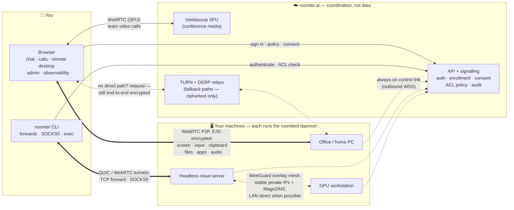

# Roomler

**Open-source remote desktop and WireGuard mesh in one daemon.**

[](LICENSING.md)
[](#platform-support)
[](https://github.com/gjovanov/roomler-ai/releases)
[](docs/self-hosting.md)

Put the desktop of any machine you own into a browser tab, and join all of those
machines into one private encrypted network that travels with you — so a laptop
in a hotel, a GPU box at home and a server in a rack behave as if they shared a
LAN. Chat and video conferencing come with it.

It is one small agent per machine and one server you can run yourself. Traffic
goes **peer-to-peer** and is end-to-end encrypted: the server introduces the two
ends and enforces policy, and never sees your pixels, keystrokes, files or
tunnelled bytes.

<p align="center">
  
</p>
<p align="center"><i>Your devices, one encrypted mesh — coordinated from the cloud, connected directly.<br>The server never sees your screens, keystrokes, files, or traffic.</i></p>

## Run it

**Self-hosted** — unlimited devices, no licence key, no activation, no
phone-home. Same code as the hosted service; there is no crippled community
build.

```bash
git clone https://github.com/gjovanov/roomler-ai.git && cd roomler-ai
cp .env.selfhost.example .env.selfhost      # fill in 4 values; 2 are `openssl rand -hex 32`
docker compose -f docker-compose.selfhost.yml --env-file .env.selfhost up -d --build
```

Then open <http://localhost:8080>. The first build compiles Rust and mediasoup
from source and takes 10–20 minutes; after that, startup is seconds. Full
walkthrough — TLS, reverse proxy, media ports, backups —
in **[`docs/self-hosting.md`](docs/self-hosting.md)**.

**Hosted** — create a workspace at [roomler.ai](https://roomler.ai) and skip to
the next step. Free for 3 devices.

### Add a machine

Mint an enrollment token in the app (**Devices → Enroll device**), then on the
machine you want to reach:

```bash
# Linux / macOS
curl -fsSL https://roomler.ai/api/setup/install.sh | sh -s -- --role daemon --token <enrollment-jwt>
# Windows (PowerShell, elevated)
irm https://roomler.ai/api/setup/install.ps1 | iex
```

The agent connects **outbound only** — nothing is opened on the machine you
enrol, and no port is forwarded. Then, from anywhere:

```bash
roomler ssh     gpu-1                                            # a shell — no sshd, no listening port
roomler forward --agent office-1 --local 127.0.0.1:5432 --remote db.internal:5432
roomler socks5  --agent berlin-1 --local 127.0.0.1:1080          # see the network as that machine sees it
```

…or open the machine's desktop from the web app and use it as if you were
sitting at it.

Prefer a GUI? The **roomler-setup** wizard installs any role on any OS —
see [`docs/installation.md`](docs/installation.md).

## What it replaces

| If you use… | …for | Roomler does it |
|---|---|---|
| **TeamViewer / AnyDesk / RustDesk** | reaching a desktop | browser-based, hardware-encoded, consent-gated, works through corporate firewalls |
| **Tailscale / ZeroTier / NetBird** | a private network between machines | WireGuard mesh, stable IPs, MagicDNS, subnet routers, exit nodes |
| **ngrok / Cloudflare Tunnel** | reaching one service behind a NAT | `roomler forward`, SOCKS5, daemon-supervised declared routes |
| **`sshd` + a jump host** | a shell on a remote box | `roomler ssh` — no daemon to install, no port to open, no bastion |
| **Slack + Zoom** | the team layer | rooms, threads, files, HD calls on the same server and accounts |

Not a claim that it beats each of those at its own game — a claim that you stop
running five things, on one identity, with one agent, and can host the whole lot
yourself. Head-to-head write-ups, each naming what the other product does
better: [**vs Tailscale**](docs/compare/vs-tailscale.md) ·
[vs RustDesk](docs/compare/vs-rustdesk.md) ·
[vs TeamViewer](docs/compare/vs-teamviewer.md) ·
[vs MeshCentral](docs/compare/vs-meshcentral.md) ·
[vs NetBird](docs/compare/vs-netbird.md).

## Licence, in one line

The server you would *host* is **AGPL-3.0**; everything you *install on a
machine* — agent, CLI, desktop and setup apps — is **MPL-2.0**, which imposes
nothing on the tooling you build around it. MSPs and IT providers: that split
exists for you. See [`LICENSING.md`](LICENSING.md) and
[`COMMERCIAL.md`](COMMERCIAL.md).

> **On the name:** the AI in `roomler.ai` is one optional document-recognition
> feature. This is a networking and remote-access product. Nothing calls home,
> and self-hosted deployments send us no telemetry at all.

---


## 🖥️ 1 · Desktop sharing & remote control

<p align="center">
  
</p>

Open any of your machines in a browser tab and use it as if you were sitting in
front of it. Nothing to install on the viewing side — the machine you're reaching
runs a small agent, and your browser becomes its screen, keyboard, and mouse. The
picture is hardware-encoded and fluid enough for real work; clipboard, file
transfer, remote apps, and even the Windows lock screen just work. Every session
is consent-gated and audit-logged, end-to-end encrypted, and connects straight
through hotel Wi-Fi, NATs, and corporate firewalls.

| In detail | |
|---|---|
| **Viewer** | Plain browser tab — nothing to install on the viewing side. Classic `<video>` or low-latency WebCodecs canvas paths (bypasses Chrome's ~80 ms jitter buffer) |
| **Codecs** | H.264, HEVC, AV1, VP9 4:4:4 — hardware-encoded when the GPU allows (NVENC / Quick Sync / AMF / Media Foundation), with probe-and-rollback cascade and software fallback. See [`docs/encoders.md`](docs/encoders.md) |
| **Input & UX** | Full keyboard/mouse with keyboard-lock + Ctrl-Alt-Del, multi-monitor, resolution/scale control, remote cursor, clipboard sync (text/HTML/image), resumable file transfer, remote-apps menu (list / focus / launch, tmux re-attach), optional remote audio |
| **Unattended access** | Runs as a service, survives logout, controls the lock screen / UAC / pre-logon on Windows (SystemContext), virtual desktops for headless Linux servers |
| **Security** | Consent-gated + audit-logged sessions, tenant-scoped agent identity, E2E-encrypted WebRTC — the server relays only signalling |

## 🔐 2 · Your own secure private network

<p align="center">
  
</p>

Every machine you enroll joins your own private network — as if all your devices
were on the same home LAN, wherever they actually are. Each one keeps a stable
address and a memorable name (`gpu-box`, `home`), traffic flows **directly
between your devices**, end-to-end encrypted with WireGuard, and nothing needs an
open port or a VPN concentrator. On top of that network: forward any port with
one command, point any app at a SOCKS5 doorway into a network only one of your
machines can see, share a whole home LAN through one device, SSH to any node by
name with no `sshd` exposed — or route all of your internet through a trusted
machine when you travel.

| In detail | |
|---|---|
| **WireGuard mesh** | Every node gets a stable private IP (CGNAT `100.64.0.0/10`) + a MagicDNS name. Carriers auto-negotiate: LAN-direct → public-direct → NAT hole-punch → TURN relay (QUIC-upgraded) → DERP over :443 — it works even from strict corporate networks. See [`docs/overlay-communication.md`](docs/overlay-communication.md) |
| **Tunnels** | `roomler forward` (any `host:port` an agent can reach becomes a local port), `roomler socks5` (per-agent or whole-fleet mesh proxy, TCP + UDP), declared routes supervised by the daemon |
| **SSH without sshd** | `roomler ssh <name>` — interactive shells on any node with no listening port and no `sshd` install, consent-gated ([`docs/roomler-ssh.md`](docs/roomler-ssh.md)) |
| **Exit nodes** | Route a client's entire internet egress (v4+v6, DNS included) through a chosen mesh peer — with a never-self-wedge safety model |
| **Multi-org** | One daemon can join several organizations at once, with per-org WireGuard keys and disjoint address blocks |
| **Policy & audit** | Default-deny tunnel ACLs, overlay ACLs (`off`/`warn`/`enforce`), subnet-route + exit-node approval in the admin UI, audit trail per flow |
| **Fleet operations** | `roomler exec` remote command execution (four independent default-deny gates), device console, live observability: mesh graph, per-carrier stats, relay usage |

## 💬 Bonus · Video conferencing & team collaboration

<p align="center">
  
</p>

The team layer is built in, not bolted on: organized rooms with threaded chat,
reactions, mentions and file sharing, plus HD video calls with screen sharing and
recordings — on the same server and the same accounts as everything above. If
your team already lives here to reach its machines, meetings and chat come free.

<a href="roomler-intro.mp4">
  
</a>

| In detail | |
|---|---|
| **Rooms & chat** | Hierarchical room tree (text + voice/video), threaded messages, reactions, custom emoji, @mentions (TipTap editor), pins, embeds, typing indicators, presence |
| **Video conferencing** | [mediasoup](https://mediasoup.org/) WebRTC SFU, per-room calls, multiple producers/consumers, in-call chat, recordings |
| **Multi-tenancy** | Organizations with plans + Stripe billing, roles & permissions, invite links / email / batch invites, OAuth (Google, Facebook, GitHub, LinkedIn, Microsoft) |
| **Files** | Versioned + multipart uploads (S3/MinIO), cloud sync (Google Drive, OneDrive, Dropbox), AI document recognition (Claude vision) |
| **Search & export** | Global full-text search (Ctrl+K), XLSX + PDF conversation export, background task pipeline |
| **Notifications** | Real-time WebSocket + Web Push (VAPID), unread counts, mark-read flows |

## How it all fits together

For the technically curious — the control plane coordinates; your data takes its
own encrypted paths:



Solid arrows are the **control plane** (login, policy, session setup). Thick double
arrows are **your data** — end-to-end encrypted, flowing directly between your device
and your machine whenever a direct path exists. The server introduces the two ends and
enforces policy; it never sees pixels, keystrokes, tunneled payloads, or overlay
plaintext. When no direct path can be punched, TURN/DERP relays forward ciphertext
they cannot read. Full picture: [`docs/architecture.md`](docs/architecture.md).

## Tech stack

| Layer | Technology |
|-------|-----------|
| **Backend** | Rust (edition 2024), Axum 0.8, Tokio, MongoDB 7, Redis (multi-pod fan-out) |
| **Remote desktop** | webrtc-rs (P2P, vendored forks for H.265 payloading + TURNS/TCP), OpenH264, Media Foundation, FFmpeg (NVENC/QSV/AMF), libvpx VP9 4:4:4, WebCodecs viewer |
| **Overlay / tunnels** | boringtun (WireGuard), quinn (QUIC), smoltcp userspace netstack, Wintun / tun / utun, coturn + standalone DERP relays |
| **Conference media** | mediasoup 0.20 SFU + mediasoup-client |
| **Native apps** | `roomlerd` daemon (Rust), `roomler` CLI, `roomler-desktop` tray companion (Tauri 2), `roomler-setup` install wizard (Tauri 2) |
| **Frontend** | Vue 3, Vuetify 3, Pinia, TipTap v3, d3 (observability) |
| **Auth** | JWT (6 audience-checked token types), Argon2, OAuth 2.0 |
| **Infrastructure** | Docker multi-stage image (nginx + API), docker-compose dev stack (MongoDB, Redis, MinIO, coturn), Kubernetes-ready |

## Building from source (development)

Running it, hosted or self-hosted, is [above](#run-it). This is the loop for
working *on* it — the dev stack runs the dependencies and you run the API and the
Vite server yourself, so both hot-reload.

```bash
# 1. Dependencies only — MongoDB :27019, Redis :6379, MinIO :9000, coturn
docker compose up -d

# 2. Backend — API on :3000
cargo run --bin roomler-ai-api

# 3. Frontend — SPA on :5000, proxying /api and /ws to :5001
cd ui && bun install && bun run dev
```

⚠️ `docker-compose.yml` is the **development** stack: dependencies, no
application. The one-command self-hosted stack is
[`docker-compose.selfhost.yml`](docker-compose.selfhost.yml) — see
[`docs/self-hosting.md`](docs/self-hosting.md).

Tests, lint and the agent's feature flags: [`docs/testing.md`](docs/testing.md)
and [`CONTRIBUTING.md`](CONTRIBUTING.md).

## Platform support

| Component | Windows | Linux | macOS |
|---|---|---|---|
| **`roomlerd` daemon** (desktop + tunnel exit + overlay node) | x64 — MSI (per-user / per-machine), signed | x86_64 + arm64 — `.deb` / tarball, systemd | arm64 — `.pkg`, LaunchAgent |
| **`roomler` CLI** (tunnel client) | x64 zip | x86_64 tarball + `.deb` | universal tarball |
| **`roomler-setup` wizard** | x64 (signed) | x86_64 | universal |
| **`roomler-desktop` companion** (tray, consent, tunnels UI) | ✅ | — | — |
| **Viewer / web app** | any modern browser; WebCodecs low-latency paths are Chrome-first | | |

All release artifacts ship with SHA-256 sidecars, GPG signatures, and SLSA build
provenance (`gh attestation verify --repo gjovanov/roomler-ai`).

## Documentation

**[→ Full documentation index](docs/README.md)** · new here and not an engineer?
Start with [Use cases](docs/use-cases.md).

| Start with | |
|---|---|
| [Use cases](docs/use-cases.md) | What people do with it — in plain language, scenario by scenario |
| [Self-hosting](docs/self-hosting.md) | Run the whole thing yourself: one compose file, TLS, media ports, backups |
| [Agent & Tunnel overview](docs/agent-tunnel-architecture.md) | The remote-access stack in five minutes, for users and operators |
| [Installation](docs/installation.md) | Every install path on every platform, enrollment, self-update |
| [Remote control](docs/remote-control.md) | Full remote-desktop design: protocol, security, latency budget |
| [Encoders](docs/encoders.md) | Codec × platform matrix, hardware cascade, rate control |
| [Rate control](docs/rate-control.md) | The Priority dial, per-session rate loops, and why resolution never flips mid-motion |
| [Overlay communication](docs/overlay-communication.md) | Every carrier path, inside and outside a corporate VPN |
| [Tunnels](docs/tunnels.md) | Forwards, SOCKS5, declared routes, QUIC-over-TURN |
| [Roomler SSH](docs/roomler-ssh.md) | SSH into any node — no `sshd`, no bound port |
| [Architecture](docs/architecture.md) | The whole system: control plane vs three data planes |
| [API reference](docs/api.md) | Every HTTP route + the WebSocket surfaces |

## License

Roomler is open source under a **split licence**:

| | |
|---|---|
| **The server you would host** — `crates/api`, `services`, `db`, `config`, `derp-relay`, `ui/` | [AGPL-3.0-only](LICENSE-AGPL-3.0) |
| **Everything you install on a machine** — `roomlerd`, the `roomler` CLI, desktop + setup apps, and the transport crates they share with the server | [MPL-2.0](LICENSE-MPL-2.0) |
| Documentation (`docs/`) | CC-BY-4.0 |

**Self-host all of it, free, on unlimited devices, forever.** The agent you
deploy to your own or your clients' machines is MPL-2.0 and imposes no copyleft
on anything you build around it — that matters if you are an MSP, and it is why
the agent is deliberately not AGPL.

→ [**LICENSING.md**](LICENSING.md) answers the practical questions ·
[COMMERCIAL.md](COMMERCIAL.md) for an AGPL exception ·
[THIRD-PARTY-NOTICES.md](THIRD-PARTY-NOTICES.md) for third-party obligations

Releases up to the commit that introduced the split were MIT, retained in
[LICENSE-MIT](LICENSE-MIT). That grant is irrevocable.

© 2026 G ROX EOOD
