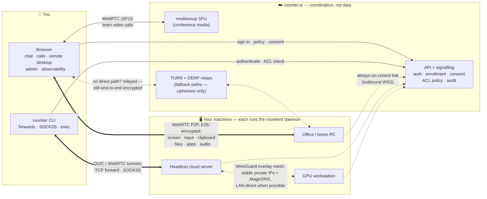

# Roomler AI

**One platform, three products:** a real-time **collaboration suite** (chat + video
conferencing), a browser-based **remote desktop** for every machine you enroll
(TeamViewer / RustDesk class), and a WireGuard **overlay network with tunnels**
(Tailscale / ngrok class) — all sharing one server, one identity model, one admin UI,
and one tiny native daemon per machine.

<a href="roomler-intro.mp4">
  
</a>

> [`roomler-intro.mp4`](roomler-intro.mp4) walks through the collaboration pillar —
> registration, workspaces, chat, video calls — in under 3 minutes.

## The big picture



Solid arrows are the **control plane** (login, policy, session setup). Thick double
arrows are **your data** — end-to-end encrypted, flowing directly between your device
and your machine whenever a direct path exists. The server introduces the two ends and
enforces policy; it never sees pixels, keystrokes, tunneled payloads, or overlay
plaintext. When no direct path can be punched, TURN/DERP relays forward ciphertext
they cannot read.

## Three products in one platform

### 💬 Collaboration — chat, rooms, video conferencing

| | |
|---|---|
| **Rooms & chat** | Hierarchical room tree (text + voice/video), threaded messages, reactions, custom emoji, @mentions (TipTap editor), pins, embeds, typing indicators, presence |
| **Video conferencing** | [mediasoup](https://mediasoup.org/) WebRTC SFU, per-room calls, multiple producers/consumers, in-call chat, recordings |
| **Multi-tenancy** | Organizations with plans + Stripe billing, 24-bit-bitfield roles & permissions, invite links / email / batch invites, OAuth (Google, Facebook, GitHub, LinkedIn, Microsoft) |
| **Files** | Versioned + multipart uploads (S3/MinIO), cloud sync (Google Drive, OneDrive, Dropbox), AI document recognition (Claude vision) |
| **Search & export** | Global full-text search (Ctrl+K), XLSX + PDF conversation export, background task pipeline |
| **Notifications** | Real-time WebSocket + Web Push (VAPID), unread counts, mark-read flows |

### 🖥️ Remote desktop — any enrolled machine, from a browser tab

| | |
|---|---|
| **Viewer** | Plain browser tab — nothing to install on the viewing side. Classic `<video>` or low-latency WebCodecs canvas paths (bypasses Chrome's ~80 ms jitter buffer) |
| **Codecs** | H.264, HEVC, AV1, VP9 4:4:4 — hardware-encoded when the GPU allows (NVENC / Quick Sync / AMF / Media Foundation), with probe-and-rollback cascade and software fallback. See [`docs/encoders.md`](docs/encoders.md) |
| **Input & UX** | Full keyboard/mouse with keyboard-lock + Ctrl-Alt-Del, multi-monitor, resolution/scale control, remote cursor, clipboard sync (text/HTML/image), resumable file transfer, remote-apps menu (list / focus / launch, tmux re-attach), optional remote audio |
| **Unattended access** | Runs as a service, survives logout, controls the lock screen / UAC / pre-logon on Windows (SystemContext), virtual desktops for headless Linux servers |
| **Security** | Consent-gated + audit-logged sessions, tenant-scoped agent identity, E2E-encrypted WebRTC — the server relays only signalling |

### 🌐 Overlay network & tunnels — your machines, one private network

| | |
|---|---|
| **WireGuard mesh** | Every node gets a stable private IP (CGNAT `100.64.0.0/10`) + a MagicDNS name. Carriers auto-negotiate: LAN-direct → public-direct → NAT hole-punch → TURN relay (QUIC-upgraded) → DERP over :443 — it works even from strict corporate networks. See [`docs/overlay-communication.md`](docs/overlay-communication.md) |
| **Tunnels** | `roomler forward` (any `host:port` an agent can reach becomes a local port), `roomler socks5` (per-agent or whole-fleet mesh proxy, TCP + UDP), declared routes supervised by the daemon |
| **Exit nodes** | Route a client's entire internet egress (v4+v6, DNS included) through a chosen mesh peer — with a never-self-wedge safety model |
| **Multi-org** | One daemon can join several organizations at once, with per-org WireGuard keys and disjoint address blocks |
| **Policy & audit** | Default-deny tunnel ACLs, overlay ACLs (`off`/`warn`/`enforce`), subnet-route + exit-node approval in the admin UI, audit trail per flow |
| **Fleet operations** | `roomler exec` remote command execution (four independent default-deny gates), device console, live observability: mesh graph, per-carrier stats, relay usage |

## Tech stack

| Layer | Technology |
|-------|-----------|
| **Backend** | Rust (edition 2024), Axum 0.8, Tokio, MongoDB 7, Redis (multi-pod fan-out) |
| **Conference media** | mediasoup 0.20 SFU + mediasoup-client |
| **Remote desktop** | webrtc-rs (P2P, vendored forks for H.265 payloading + TURNS/TCP), OpenH264, Media Foundation, FFmpeg (NVENC/QSV/AMF), libvpx VP9 4:4:4, WebCodecs viewer |
| **Overlay / tunnels** | boringtun (WireGuard), quinn (QUIC), smoltcp userspace netstack, Wintun / tun / utun, coturn + standalone DERP relays |
| **Native apps** | `roomlerd` daemon (Rust), `roomler` CLI, `roomler-desktop` tray companion (Tauri 2), `roomler-setup` install wizard (Tauri 2) |
| **Frontend** | Vue 3, Vuetify 3, Pinia, TipTap v3, d3 (observability) |
| **Auth** | JWT (6 audience-checked token types), Argon2, OAuth 2.0 |
| **Infrastructure** | Docker multi-stage image (nginx + API), docker-compose dev stack (MongoDB, Redis, MinIO, coturn), Kubernetes-ready |

## Quick start

### Run the platform (development)

```bash
# 1. Infrastructure
docker compose up -d          # MongoDB :27019, Redis :6379, MinIO :9000, coturn

# 2. Backend
cargo run --bin roomler-ai-api    # API on :3000

# 3. Frontend
cd ui && bun install && bun run dev   # SPA on :5000
```

### Add a machine to your fleet

Mint an enrollment token in the admin UI (**Admin → Agents → Enroll**), then on the
machine:

```bash
# Linux / macOS — daemon (remote desktop + tunnels + overlay)
curl -fsSL https://roomler.ai/api/setup/install.sh | sh -s -- --role daemon --token <enrollment-jwt>

# Windows (PowerShell)
irm https://roomler.ai/api/setup/install.ps1 | iex
```

Prefer a GUI? Download the **roomler-setup** wizard from the admin UI — one installer
for every role (Windows service / per-user / tunnel-only) on every OS. Details, MSI
flavours, and service modes: [`docs/installation.md`](docs/installation.md).

### Reach it

- **Remote desktop**: open the machine from the web app and click *Connect*.
- **Tunnel**: `roomler forward --agent <name> --local 127.0.0.1:5432 --remote db:5432`
- **Overlay**: `roomler ping <name>` — every node has a stable IP and MagicDNS name.

## Platform support

| Component | Windows | Linux | macOS |
|---|---|---|---|
| **`roomlerd` daemon** (desktop + tunnel exit + overlay node) | x64 — MSI (per-user / per-machine), signed | x86_64 + arm64 — `.deb` / tarball, systemd | arm64 — `.pkg`, LaunchAgent |
| **`roomler` CLI** (tunnel client) | x64 zip | x86_64 tarball + `.deb` | universal tarball |
| **`roomler-setup` wizard** | x64 (signed) | x86_64 | universal |
| **`roomler-desktop` companion** (tray, consent, tunnels UI) | ✅ | — | — |
| **Viewer / web app** | any modern browser; WebCodecs low-latency paths are Chrome-first | | |

All release artifacts ship with SHA-256 sidecars, GPG signatures, and SLSA build
provenance (`gh attestation verify --repo gjovanov/roomler-ai`).

## Documentation

**[→ Full documentation index](docs/README.md)**

| Start with | |
|---|---|
| [Architecture](docs/architecture.md) | The whole system: control plane vs three data planes, crate map, deployment |
| [Agent & Tunnel overview](docs/agent-tunnel-architecture.md) | The remote-access stack in five minutes, for users and operators |
| [Use cases](docs/use-cases.md) | What people build with it — from team chat to AI-agent fleets |
| [Installation](docs/installation.md) | Every install path on every platform, enrollment, self-update |
| [Remote control](docs/remote-control.md) | Full remote-desktop design: protocol, security, latency budget |
| [Encoders](docs/encoders.md) | Codec × platform matrix, hardware cascade, rate control |
| [Overlay communication](docs/overlay-communication.md) | Every carrier path, inside and outside a corporate VPN |
| [Tunnels](docs/tunnels.md) | Forwards, SOCKS5, declared routes, QUIC-over-TURN |
| [API reference](docs/api.md) | Every HTTP route + the WebSocket surfaces |

## License

MIT
