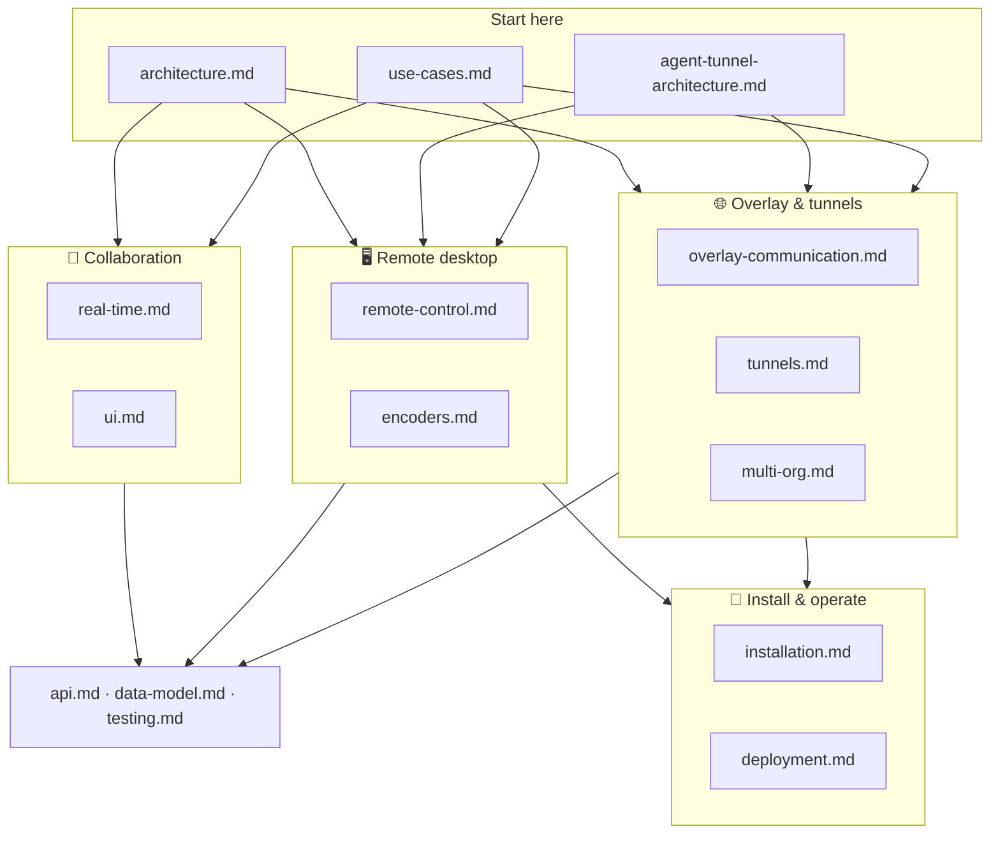

# Roomler AI — documentation index

Roomler is three products on one platform: **collaboration** (chat + conferencing),
**remote desktop**, and an **overlay network with tunnels**. The map below shows how
the docs hang together; the tables list every document with its audience.

## Start here

| Doc | What it covers |
|---|---|
| [architecture.md](architecture.md) | The whole system: control plane vs the three data planes, workspace crate map, deployment topology |
| [agent-tunnel-architecture.md](agent-tunnel-architecture.md) | The remote-access stack (daemon + CLI + coordination) in five minutes — written for end users and operators |
| [use-cases.md](use-cases.md) | Scenario walkthroughs across all three pillars, plus the permission model |

## 💬 Collaboration (chat · rooms · conferencing)

| Doc | What it covers |
|---|---|
| [real-time.md](real-time.md) | The WebSocket surfaces: user events, presence, mediasoup signalling, the `rc:*` agent protocol, DERP |
| [ui.md](ui.md) | Frontend map: views, stores, composables, the remote-desktop viewer, observability components |

## 🖥️ Remote desktop

| Doc | What it covers |
|---|---|
| [remote-control.md](remote-control.md) | Full design: topology, agent internals, `rc:*` signalling, consent/security model, latency budget |
| [encoders.md](encoders.md) | Codec × platform × backend matrix, the hardware-encoder cascade, rate control, capture backends, viewer decode paths |

## 🌐 Overlay network & tunnels

| Doc | What it covers |
|---|---|
| [overlay-communication.md](overlay-communication.md) | **Start here for the overlay** — every carrier path (LAN, public, hole-punch, relay, DERP), inside and outside a corporate VPN, with field-proof |
| [overlay-nat-traversal.md](overlay-nat-traversal.md) | The carrier cascade mechanics: NAT-type probing, srflx hole-punch, cooldowns, PathMonitor |
| [overlay-exit-nodes.md](overlay-exit-nodes.md) | Tailscale-style exit nodes: full-egress routing (v4+v6+DNS) with the never-self-wedge safety model |
| [overlay-wfp.md](overlay-wfp.md) | Windows: surviving a Group-Policy-locked firewall via the Windows Filtering Platform |
| [multi-org.md](multi-org.md) | One device in N organizations: `[[orgs]]`, address blocks, the shared carrier plane, mux NAT |
| [tunnels.md](tunnels.md) | Concepts & protocol: forwards, SOCKS5 (TCP+UDP), mesh mode, declared routes, transports, LocalAPI, CLI |
| [tunnel-install.md](tunnel-install.md) | Step-by-step runbook: install, enroll, ACL policy, open and test a forward from a corporate network |
| [fleet-rpc.md](fleet-rpc.md) | `roomler exec` remote command execution: transport, the four default-deny gates, audit |

## 🔧 Install & operate

| Doc | What it covers |
|---|---|
| [installation.md](installation.md) | Every install path: wizard, MSI flavours, `.deb`/`.pkg`, terminal installers, enrollment, service modes, self-update |
| [linux-self-update.md](linux-self-update.md) | Design of the Linux self-update path (tarball as the universal artifact) |
| [deployment.md](deployment.md) | Deploying the server: Docker image, dev compose stack, environment, health, release pipelines |
| [multi-pod-scale-out.md](multi-pod-scale-out.md) | The settled multi-pod architecture: identity, tenant-affinity routing, mediasoup scale ladder |
| [operator-systemcontext-smoke.md](operator-systemcontext-smoke.md) | Operator checklist: verifying Windows SystemContext (pre-logon control) on a field host |
| [testing.md](testing.md) | Test suites and harnesses: integration, unit, E2E, capture smoke, k8s E2E lane |
| [api.md](api.md) | Every HTTP route (method + path + purpose) and the auth model |
| [data-model.md](data-model.md) | Every MongoDB collection with ER diagrams, indexes, TTLs |

## 📐 Design records

Point-in-time design documents for features that are in flight or deliberately
deferred. They record *why*, not current behaviour — the feature docs above stay
authoritative.

| Doc | Status |
|---|---|
| [overlay-session-proof.md](overlay-session-proof.md) | In flight — moving the network plane out of the Windows session (`netd`, flag-off scaffold) |
| [overlay-warm-relay.md](overlay-warm-relay.md) | Shipping — a UDP relay leg that survives the corporate VPN (C4) |
| [overlay-symmetric-punch.md](overlay-symmetric-punch.md) | Design — symmetric-NAT-aware punch completion via observed-source promotion |
| [moq-remote-desktop-evaluation.md](moq-remote-desktop-evaluation.md) | Deferred — Media-over-QUIC evaluated for the remote desktop; revisit criteria inside |
