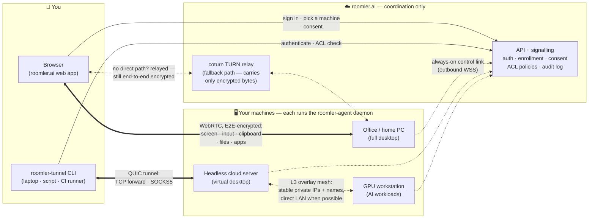

# Roomler Agent & Tunnel — High-Level Architecture

*Audience: end users and operators. For the deep technical design see
[`remote-control.md`](remote-control.md) (remote desktop) and
[`tunnel-install.md`](tunnel-install.md) (tunnel setup).*

Roomler's remote-access stack has two user-facing pieces: **`roomler-agent`**, a small
daemon installed on every machine you want to reach, and **`roomler-tunnel`**, a CLI run
on the machine you are sitting at. The **roomler.ai** service introduces the two sides to
each other and enforces policy — but your screen, keystrokes, and tunneled data never pass
through it in readable form.

## The big picture

**Reading the diagram:** solid arrows are the *control plane* (login, policy, session
setup). Thick double arrows are *your data* — always end-to-end encrypted, flowing
directly between your device and your machine whenever a direct path exists. Dotted lines
are the agents' always-on heartbeat, the machine-to-machine overlay mesh, and the
encrypted relay used only when no direct path can be punched.

## The pieces

### `roomler-agent` — the daemon on your machines

- One small native binary per machine (Windows service, Linux systemd unit, macOS pkg).
  Starts at boot, survives logout, keeps itself up to date.
- **Remote desktop engine**: captures the screen, hardware-encodes it
  (H.264 / HEVC / VP9 / AV1), and injects keyboard + mouse — you view and control from a
  plain browser tab, nothing to install on the viewing side.
- Clipboard sync, resumable file transfer, and an **Apps menu** (list / focus / launch
  remote windows, attach tmux sessions) ride the same encrypted session.
- **Virtual-desktop mode**: on headless Linux servers the agent creates its own display,
  so "connect" drops you straight into a live console — a screen for machines that have
  none.
- Doubles as the **tunnel exit and mesh node**: the same daemon serves port-forwards and
  joins the overlay network.
- Enrolled once with a 10-minute single-use token from the admin UI; from then on it holds
  only a tenant-scoped credential.

### `roomler-tunnel` — the connectivity CLI

- `forward` — a port on your laptop (`127.0.0.1:5432`) becomes any `host:port` the chosen
  agent can reach ("the DB behind the office firewall").
- `socks5` — a local SOCKS5 proxy that exits through one agent, or through the whole
  fleet in mesh mode; point any app or browser at it.
- **Overlay mesh** (optional): your machines get stable private IPs and DNS-style names,
  talk directly over the LAN when they can, and relay only when they must
  (`status` / `peers` / `ping` show what's live).
- QUIC data plane with WebRTC fallback, climbing direct → TURN/UDP → TLS over TCP 443 —
  it works even from strict corporate networks.
- Everything is gated by **default-deny ACL policies** managed in the admin UI, with an
  audit row per session.

### roomler.ai — coordination, not data

- Handles accounts, enrollment, consent, ACL policy, the audit trail, and the signalling
  that lets the two ends find each other.
- **Never sees your pixels, keystrokes, or tunneled payloads** — those flow peer-to-peer,
  end-to-end encrypted. When a relay is unavoidable, it forwards ciphertext it cannot
  read.

## What people use it for

### Everyday

- Remote desktop to your own PCs from any browser — no VPN, no client on the viewing side.
- Live consoles for headless cloud servers via virtual-desktop mode.
- Reaching internal services (databases, dashboards, admin panels) with one `forward`
  command instead of exposing them to the internet.
- An always-on private network between home, office, and cloud machines with stable names.

### AI & agentic development

The combination — a controllable desktop on every machine plus fenced networking between
them — is exactly the harness autonomous AI agents need:

- **A real computer for your coding agent.** Enroll a VM, start Claude Code (or any CLI
  agent) in a tmux session under virtual-desktop mode: open a browser tab to watch it
  work, type into the same session to steer it, close the tab and it keeps running. The
  Apps menu re-attaches you to the exact same session next time.
- **Human-in-the-loop supervision at fleet scale.** Every machine in one dashboard; click
  any host to observe an autonomous run live and take over mouse + keyboard instantly.
  Every session is consent-gated and audit-logged — who controlled what, when.
- **Agent-to-agent networking.** The overlay mesh gives each worker a stable private IP
  and name (`gpu-1`, `builder-2`), so orchestrators and agents reach each other's APIs
  directly — no public ingress, no VPN concentrator.
- **Fenced tool-use sandboxes.** Point computer-use / browser-use models at a remote
  desktop instead of your own machine, with default-deny tunnel ACLs deciding exactly
  which hosts and ports the sandbox may touch.
- **Remote GPU development.** Drive a big GPU box (model runs, fine-tuning, local LLMs)
  from a thin laptop over a hardware-encoded, low-latency stream; clipboard and resumable
  file transfer move the artifacts.
- **Network vantage for agents.** `socks5` through an agent inside a corporate LAN or
  another region lets your local AI agent (E2E tests, integrations, research) see the
  network exactly as that machine does.

## Learn more

- [`remote-control.md`](remote-control.md) — full remote-desktop design: protocol, data
  model, security, latency budget.
- [`tunnel-install.md`](tunnel-install.md) — step-by-step tunnel install, enrollment, and
  corporate-network testing guide.
- [`architecture.md`](architecture.md) — the wider Roomler platform (chat, conferencing,
  rooms) that agent and tunnel plug into.
