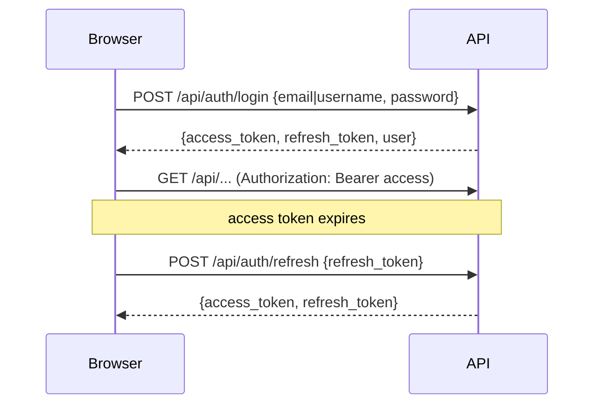
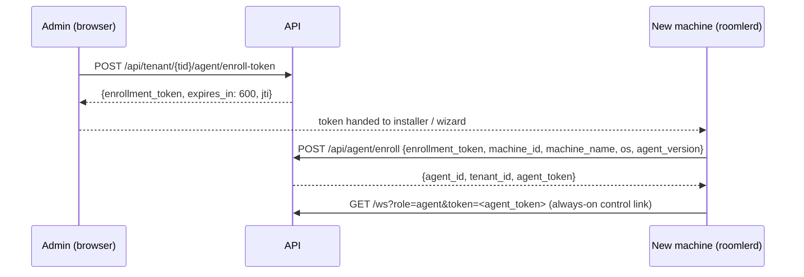

# API Reference

Every HTTP endpoint the server exposes, grouped the way `build_router`
(`crates/api/src/lib.rs`) composes them. *As of 0.3.0-rc.381 the surface is ~165
endpoints across 38 route modules.* Request/response schemas are shown for the key
flows; for everything else the handler modules in `crates/api/src/routes/` are the
source of truth.

- **Base URL**: `https://roomler.ai` (or your deployment). All JSON.
- **IDs** are MongoDB ObjectIds serialized as 24-char hex strings.
- **Errors** are JSON with an HTTP status; 404 is also used to *hide* resources the
  caller may not see (platform-admin routes).

## Authentication

JWT bearer tokens (`Authorization: Bearer <jwt>`), Argon2 password hashing. Six
audience-checked token types — a token of one audience is rejected everywhere else:

| Token | Audience | Lifetime | Held by |
|---|---|---|---|
| `Access` | user routes + `/ws` (user role) | 7 d (config) | browser |
| `Refresh` | `POST /api/auth/refresh` only | 30 d (config) | browser |
| `Enrollment` | `POST /api/agent/enroll` | 10 min, single-use (`jti`) | pasted into installer |
| `Agent` | `/ws?role=agent`, agent ingest routes, `/derp` | long-lived | `roomlerd` config |
| `TunnelEnrollment` | `POST /api/tunnel-client/enroll` | 10 min, single-use | pasted into CLI |
| `TunnelClient` | `/ws?role=tunnel-client`, tunnel routes | long-lived | `roomler` CLI config |

Device enrollment is a two-step exchange — an admin mints a short-lived token, the
installer trades it for the device's long-lived credential:

`machine_id` is a stable hardware-derived hash, unique per `(tenant_id, machine_id)`
— re-enrolling a known machine reuses its row. The tunnel-client flow is identical
in shape (`…/tunnel-client/enroll-token` → `POST /api/tunnel-client/enroll` →
`{tunnel_client_token}`), with a distinct audience so a leaked agent token can't
impersonate a client or vice-versa.

### Rate limiting

Everything under `/api` sits behind a per-client-IP governor (trusted-proxy-aware —
it will not believe a client-supplied `X-Forwarded-For`). `POST /api/auth/login` and
`/register` carry an additional per-(IP, account) brute-force gate. `/health`,
`/ws`, `/derp`, and the Stripe webhook are deliberately outside the governor.

## Public routes (no user JWT)

Auth, where present, is in-handler (enrollment tokens, agent/tunnel bearer tokens,
capability URLs, webhook signatures).

| Method | Path | Purpose |
|---|---|---|
| POST | `/api/auth/register` | Create account (+ optionally a tenant, or accept `invite_code`) |
| POST | `/api/auth/login` | Password login (`email` or `username`) |
| POST | `/api/auth/logout` | Invalidate session |
| POST | `/api/auth/refresh` | Rotate the access token |
| POST | `/api/auth/activate` | Redeem an email activation code |
| GET/PUT | `/api/auth/me` | Current user (read / update) |
| GET | `/api/oauth/{provider}` | OAuth redirect (google, facebook, github, linkedin, microsoft) |
| GET | `/api/oauth/callback/{provider}` | OAuth callback |
| GET | `/api/invite/{code}` | Public invite info |
| POST | `/api/invite/{code}/accept` | Accept an invite (authed) |
| GET | `/api/stripe/plans` | Plan catalogue |
| POST | `/api/stripe/checkout` · `/portal` | Stripe checkout / customer portal |
| POST | `/api/stripe/webhook` | Stripe events (HMAC-signed; un-governed) |
| POST | `/api/agent/enroll` | Exchange enrollment token → agent credential |
| GET | `/api/agent/latest-release` | Agent release manifest (cached GitHub proxy) |
| GET | `/api/agent/installer/{flavour}` (+`/health`) | Stream the MSI/installer through roomler.ai (`peruser` \| `permachine`) |
| POST | `/api/agent/crash` | Crash-report ingest (agent JWT in-handler) |
| POST | `/api/consent/{token}/approve` · `/deny` | Owner-consent capability URLs (token **is** the auth, single-use) |
| POST | `/api/tunnel-client/enroll` | Exchange tunnel enrollment token → client credential |
| GET | `/api/tunnel-client/agents` | Reachable agents (TunnelClient bearer) |
| GET | `/api/tunnel/latest-release` · `/installer/{platform}` (+`/health`) | Tunnel-CLI release manifest + artifact proxy |
| GET | `/api/setup/latest-release` · `/{platform}` (+`/health`) | `roomler-setup` wizard manifest + artifact proxy |
| GET | `/api/setup/install.sh` · `/install.ps1` | Terminal installers (served from the binary, curl-able) |
| POST | `/api/releases/refresh` | CI cache-bust after a release is published (bearer; fans out to all pods) |
| GET | `/api/turn/credentials` | Ephemeral TURN credentials (user-scoped) |
| GET | `/api/relay/regions` | Multi-region relay PoP topology (read-only) |
| POST | `/api/log/browser` | Browser console-log batch ingest (user JWT + explicit `tenant_id`) |
| GET | `/api/cluster/status` | Per-pod identity, counters, gauges |
| POST | `/api/stats/pageview` | SPA route-change beacon (authed, paths normalized) |
| GET | `/health` | Liveness — cheap process-alive 200 |
| GET | `/health/ready` | Readiness — Mongo ping + Redis round-trip + live subscription |

### User-scoped (access JWT, no tenant prefix)

| Method | Path | Purpose |
|---|---|---|
| PUT | `/api/user/me` | Update profile |
| GET | `/api/user/unread-summary` | Cross-tenant unread counters |
| GET | `/api/user/{user_id}` | Public profile |
| GET | `/api/giphy/search` · `/trending` | Giphy proxy |
| GET | `/api/push/config` | VAPID public key |
| POST | `/api/push/subscribe` · `/unsubscribe` | Web-push subscription |
| GET | `/api/notification` · `/unread` · `/unread-count` | Notification feeds |
| PUT | `/api/notification/{id}/read` | Mark one read |
| POST | `/api/notification/read-all` | Mark all read |
| GET/PUT | `/api/user/newsletter` | FR-58: the signed-in newsletter toggle — a door into the same `subscribers` store the public form writes; subscribing pre-confirms only on a verified account email |

### Public newsletter list (FR-39/FR-58 — no auth; see [newsletter.md](newsletter.md))

| Method | Path | Purpose |
|---|---|---|
| POST | `/api/subscribe` | Always **202** (membership-oracle control); double-opt-in confirmation mail, 15-min per-address resend cooldown |
| GET | `/api/subscribe/confirm/{token}` | **Pure redirect** to the confirm page — never confirms (mailbox link scanners follow GETs; field-hit on day one) |
| POST | `/api/subscribe/confirm/{token}` | The deliberate click (the confirm page's button); single-use, answers `{confirmed: bool}` |
| GET | `/api/subscribe/unsubscribe/{token}` | Idempotent; 303 → `/newsletter/unsubscribed?status=…`; the token never expires |
| POST | `/api/subscribe/unsubscribe/{token}` | RFC 8058 one-click target — plain 200 for every outcome, body unread |

### Platform-admin (`platform_admins` ObjectId allowlist; 404 on miss)

| Method | Path | Purpose |
|---|---|---|
| GET | `/api/admin/stats/relay/current` · `/relay/history` | Relay (TURN/DERP) load, live + series |
| GET | `/api/admin/stats/orgs` · `/users` · `/machines` · `/calls` | Platform-wide inventories |
| GET | `/api/admin/stats/usage` · `/usage/{user_id}` | Per-user usage across every org |
| POST | `/api/admin/overlay-block/reclaim` | Reclaim quarantined overlay address blocks (dry-run by default) |
| POST/GET | `/api/admin/newsletter/issues` | FR-58: create draft / list issues |
| PUT/GET | `/api/admin/newsletter/issues/{slug}` | Edit while draft (409 after) / read back |
| GET | `/api/admin/newsletter/issues/{slug}/preview` | The exact send-path bytes (sample unsubscribe link substituted) |
| POST | `/api/admin/newsletter/issues/{slug}/test-send` | Render + send to one address, real headers, honest failures |
| POST | `/api/admin/newsletter/issues/{slug}/send` | Claim + fan out; re-POST = resume; `{"retry_stale":true}` re-attempts stuck rows |
| GET | `/api/admin/newsletter/issues/{slug}/status` | Live ledger counts while sending; stored snapshot once completed |

## Tenant-scoped routes — `/api/tenant/{tenant_id}/…`

Caller must be a member of the tenant; write operations check the caller's role
permissions (24-bit bitfield — see [use-cases.md](use-cases.md#permission-system)).

### Organization

| Method | Path | Purpose |
|---|---|---|
| GET/POST | `/api/tenant` | List my tenants / create one |
| GET | `/api/tenant/{tid}` | Tenant detail |
| POST | `…/archive` · `…/unarchive` | Owner-only; archiving revokes every device enrollment and releases the mesh |
| GET | `…/member` · POST `…/member` | List / add members |
| GET | `…/member/me` | My membership + permissions |
| GET/POST | `…/role` | List / create roles |
| PUT/DELETE | `…/role/{role_id}` | Update / delete a role |
| POST/DELETE | `…/role/{role_id}/assign/{user_id}` | Assign / unassign |
| GET/POST | `…/invite` | List / create invites |
| POST | `…/invite/batch` | Batch email invites |
| DELETE | `…/invite/{invite_id}` | Revoke |
| GET | `…/search?q=` | Full-text search: messages, rooms, people |

### Rooms, chat, calls

| Method | Path | Purpose |
|---|---|---|
| GET/POST | `…/room` | List / create rooms (hierarchical: `parent_id`, `path`) |
| GET | `…/room/explore` | Discoverable rooms |
| GET/PUT/DELETE | `…/room/{rid}` | Room CRUD |
| POST | `…/room/{rid}/join` · `/leave` | Membership |
| GET | `…/room/{rid}/member` | Room members |
| POST | `…/room/{rid}/call/start` · `/join` · `/leave` · `/end` | Call lifecycle (mediasoup) |
| GET | `…/room/{rid}/call/participant` | Live participants |
| GET/POST | `…/room/{rid}/message` | Paginated history / send |
| GET | `…/message/pin` | Pinned messages |
| PUT/DELETE | `…/message/{mid}` | Edit / delete |
| PUT | `…/message/{mid}/pin` | Toggle pin |
| GET | `…/message/{mid}/thread` | Thread replies |
| POST | `…/message/{mid}/reaction` | Add reaction |
| DELETE | `…/message/{mid}/reaction/{emoji}` | Remove reaction |
| POST | `…/message/read` · `/read-all` | Read markers |
| GET | `…/message/unread-count` | Unread count |
| GET/POST | `…/room/{rid}/recording` | List / create recordings |
| DELETE | `…/recording/{rec_id}` | Delete recording |

### Files, tasks, export

| Method | Path | Purpose |
|---|---|---|
| GET | `…/room/{rid}/file` · POST `…/file/upload` | Room-scoped files (100 MB limit) |
| GET/POST | `…/file` · `…/file/upload` | Tenant file library |
| GET | `…/file/{fid}` · `/download` | Metadata / streamed download |
| DELETE | `…/file/{fid}` | Delete |
| POST | `…/file/{fid}/recognize` | AI document recognition (Claude vision) |
| GET | `…/task` · `…/task/{tid}` · `/download` | Background tasks + results |
| POST | `…/export/conversation` | XLSX export |
| POST | `…/export/conversation-pdf` | PDF export |

### Fleet — agents & remote sessions

| Method | Path | Purpose |
|---|---|---|
| GET | `…/agent` | List enrolled devices (status, caps, overlay info) |
| POST | `…/agent/enroll-token` | Mint an enrollment token (10 min, single-use) |
| POST | `…/agent/update` · `…/agent/{aid}/update` | Operator-forced self-update (fleet / one device) |
| POST | `…/agent/{aid}/join-org` · GET `…/join-targets` | Add an enrolled device to a second org (multi-org) |
| GET/PUT/DELETE | `…/agent/{aid}` | Device detail / settings / remove (cascades: revoke + mesh release) |
| GET | `…/agent/{aid}/crash` | Crash reports |
| POST/GET | `…/agent/{aid}/logs` | Log batch ingest (agent JWT) / admin listing |
| POST | `…/agent/exec` · `…/agent/{aid}/exec` | Fleet RPC: run a command (fleet sweep / one device) — see [fleet-rpc.md](fleet-rpc.md) |
| POST | `…/agent/{aid}/exec/{request_id}/cancel` | Cancel a running exec |
| PUT | `…/agent/{aid}/exec-policy` | Per-device exec gate (a management act, separate from the exec power) |
| GET | `…/exec-audit` | Org-wide exec attempt log (every refusal included) |
| GET/PUT | `…/exec-settings` | Org exec kill-switch (gate 1 of 4) |
| GET | `…/session/{sid}` | Remote-desktop session detail |
| POST | `…/session/{sid}/terminate` | Force-terminate |
| GET | `…/session/{sid}/audit` | Session audit trail |

Exec body (`POST …/exec`): `{shell?: "pwsh"|"powershell"|"cmd"|"bash"|"sh", command,
timeout_ms?, max_output_bytes?}` — clamped server-side; output is secret-redacted
before it leaves the host.

### Tunnels

| Method | Path | Purpose |
|---|---|---|
| GET | `…/tunnel-client` | List enrolled tunnel clients |
| POST | `…/tunnel-client/enroll-token` | Mint a tunnel enrollment token |
| DELETE | `…/tunnel-client/{cid}` | Revoke a client |
| GET/POST | `…/tunnel-policy` | List / create ACL policies (default-deny) |
| GET/PUT/DELETE | `…/tunnel-policy/{pid}` | Policy CRUD |

### Overlay network

| Method | Path | Purpose |
|---|---|---|
| GET | `…/overlay-node` | Mesh nodes with advertised + approved routes |
| PUT | `…/overlay-node/{nid}/approved-routes` | `{approved_routes: ["10.0.0.0/24", …]}` — approve subnet-router routes (the data-plane signal) |
| PUT | `…/overlay-node/{nid}/exit-node` | `{enabled: bool}` — designate an exit node (also adds `/0` to approved routes) |
| DELETE | `…/overlay-node/{nid}` | Evict from the mesh + release the address back to the pool |
| GET/POST | `…/overlay-acl` | Overlay L3 ACL policies |
| GET/PUT | `…/overlay-acl/mode` | Tenant posture: `off` (default) \| `warn` \| `enforce` |
| GET/PUT/DELETE | `…/overlay-acl/{pid}` | ACL policy CRUD |
| GET/PUT | `…/magic-dns` | Tenant MagicDNS domain + upstream resolvers |
| GET | `…/overlay-block` | The tenant's overlay address block |
| POST | `…/overlay-block/renumber` | Migrate onto a disjoint block (**dry-run by default**; cycles agent connections) |

### Observability

| Method | Path | Purpose |
|---|---|---|
| GET | `…/stats/overview` | Tenant overview (member-visible) |
| GET | `…/stats/mesh` | Mesh graph edges + carrier types |
| GET | `…/stats/machines` · `/calls` · `/tunnels` | Per-domain series (MANAGE_AGENTS) |
| GET | `…/stats/usage` · `/usage/{user_id}` | Usage (own row self-service; others need MANAGE_AGENTS) |

## Non-HTTP surfaces

| Surface | Where documented |
|---|---|
| `/ws` — user, agent, and tunnel-client roles; chat/presence/media signalling + the whole `rc:*` protocol | [real-time.md](real-time.md) |
| `/derp` — pubkey-addressed relay for UDP-blocked overlay pairs | [real-time.md](real-time.md#derp) |
| LocalAPI — on-host named pipe / unix socket used by `roomler`, `roomler-desktop` | [tunnels.md](tunnels.md#localapi) |
