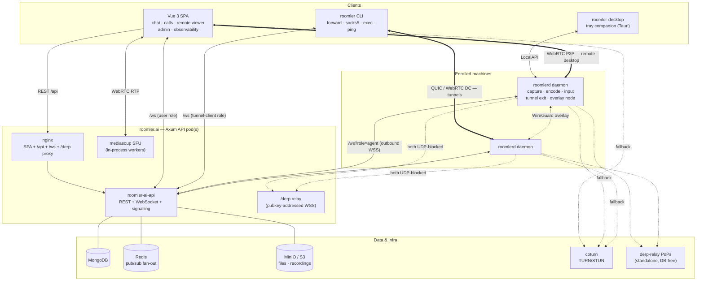
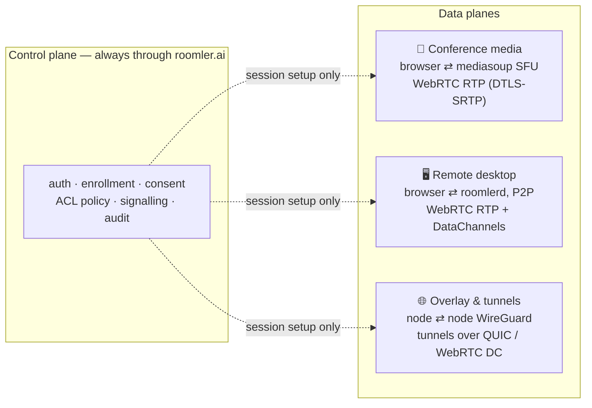
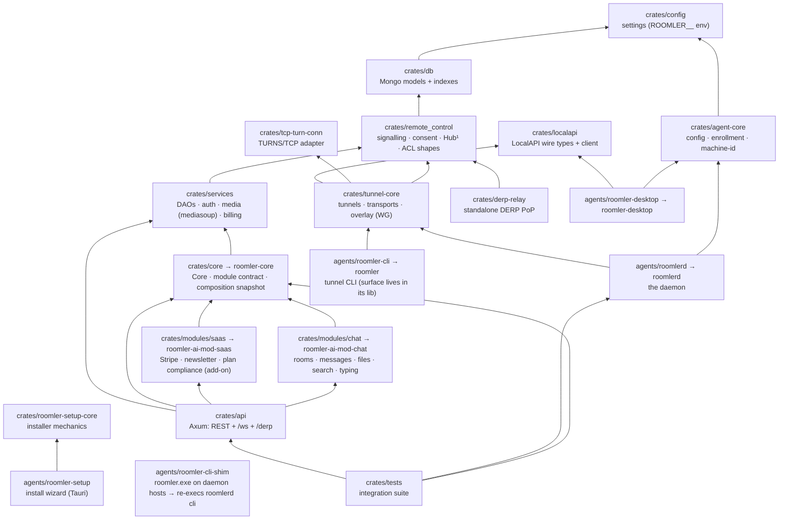
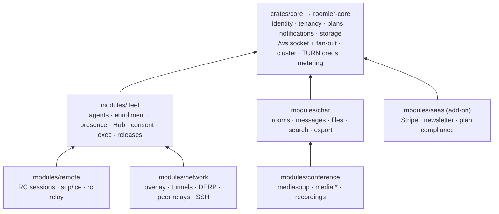

# Architecture

Roomler is one Rust server, one Vue SPA, and a small fleet of native binaries that
turn every enrolled machine into a remote-desktop target, a tunnel exit, and an
overlay-mesh node. This page is the map; every subsystem has a deeper doc linked
along the way. (Counts stamped *as of 0.3.0-rc.381.*)

## System at a glance



## Control plane vs three data planes

The server is a **coordination point, not a data path**. Each pillar has its own
data plane with its own transport and encryption; the server only ever brokers
sessions, enforces policy, and (for conferencing) mixes nothing — the SFU forwards
RTP without decoding it.



| Plane | Endpoints | Direct path | Fallback ladder | Server sees |
|---|---|---|---|---|
| Conference | browser ⇄ server SFU | always via SFU | — | encrypted RTP it routes (SFU model) |
| Remote desktop | browser ⇄ `roomlerd` | ICE P2P | host → STUN srflx → TURN (UDP → TCP/TLS :443) | signalling only; TURN relays ciphertext |
| Overlay mesh | `roomlerd`/CLI ⇄ peer | LAN → public → srflx hole-punch | TURN relay (QUIC-upgraded) → DERP over WSS :443 | netmaps + relay grants; WG ciphertext only |

Key invariants:

- **The server never sees pixels, keystrokes, clipboard, files, or overlay
  plaintext.** Remote-desktop media and input ride P2P WebRTC (E2E-encrypted);
  overlay packets are WireGuard-encrypted end to end; TURN and DERP forward bytes
  they cannot decrypt.
- **Everything is tenant-scoped.** Every route nests under
  `/api/tenant/{tenant_id}/…`, every collection carries `tenant_id`, and the six
  JWT audiences (below) cannot impersonate one another.
- **Agents dial out only.** A `roomlerd` daemon holds one outbound WSS control
  connection; no inbound port is ever required on an enrolled machine.

## Workspace map

One Cargo workspace builds the server and every native binary.
`config ← db ← remote_control ← services ← api` remains the server spine; the
agent stack layers on shared leaf crates so thin clients never link the world.



¹ `remote_control`'s Mongo-backed parts (audit DAO, session Hub) sit behind a
default-on `server` cargo feature; agent-side consumers disable it, which keeps the
MongoDB driver out of every shipped native binary.

**Vendored forks** (workspace-excluded, wired via `[patch.crates-io]` — the *why*
is documented at the top of the root `Cargo.toml`):

| Fork | Reason |
|---|---|
| `crates/vendored/rtp` | H.265 payloader fix — upstream drops NALs after VPS/SPS/PPS aggregation, PLI-storming Chrome |
| `crates/vendored/webrtc-ice` | TURNS-over-TLS-over-TCP relay candidates (upstream closed NOT_PLANNED) — corp networks that block all UDP |
| `crates/vendored/webrtc` | exposes SCTP `a_rwnd` so native⇄native DataChannels advertise 8 MiB and stay link-bound at high BDP |
| `crates/vendored/wintun-bindings` | keeps the Windows NetworkList registry entry on drop |

## Modular monolith — the target shape (FR-69)

The map above is the **current** server: one crate (`crates/api`) whose `AppState` carries every
pillar and whose single `build_router` mounts every route. [FR-69](fr/FR-69-modular-monolith.md)
decouples it into a **modular monolith** — the same process, the same container, the same wire —
composed from a small core and six module crates:



The rules that keep it a monolith rather than a pile of crates:

- **One contract.** Every module implements `roomler_core::Module` — routes, WebSocket
  namespaces, index specs, jobs, lifecycle hooks, capabilities — and the host composes the
  concrete types under `#[cfg(feature)]`. No dynamic loading, no runtime registry.
- **A DAG, not peers.** Any module may call core; `conference → chat`, `remote → fleet`,
  `network → fleet`. Core never calls a module: the inverse flows (tenant archive, agent removal)
  are hooks that core invokes in a fixed order.
- **Core membership.** Something lives in core only if at least two modules need it **and** it is
  identity, tenancy or infrastructure. Everything else belongs to a module.
- **Profiles, not switches.** Cargo features select the pillars a build links (`full`, `collab`,
  `remote`, `mesh`, `access`; `saas` as an add-on the self-host images never carry). What a
  running server offers is discovered through `GET /api/capabilities`, so one UI build and one
  daemon work against any profile.
- **The wire and the documents do not move.** One `/ws` socket with an exhaustive
  `ClientMsg::namespace()` map; `/derp` unchanged; DAOs and indexes change owner, never shape.
- **Every move is checked.** A composition baseline — routes with their allowed methods, the
  index plan, the wire names — is asserted byte-identical after each module PR.

**Crate naming, as of FR-69.** Server-side crates are `roomler-ai-*`; the server core is
**`roomler-core`** (`crates/core`, AGPL-3.0-only); module crates are `roomler-ai-mod-<name>`.
The daemon's shared building blocks — config, enrollment, machine-id, logging — are
**`roomler-node-core`** (`crates/agent-core`, MPL-2.0), which held the name `roomler-core` from
FR-21 until FR-69. Its pre-FR-21 name is retired (FR-21); do not bring it back.

## The native stack on an enrolled machine

| Binary | Role |
|---|---|
| **`roomlerd`** | The daemon: WS signalling, per-session WebRTC peers, capture → encode → RTP/DC, input injection, clipboard/file/apps/audio channels, tunnel *target* and tunnel *client* sides, overlay node runtime, LocalAPI server, loopback TURN host, watchdog, self-updater, Windows SCM/SystemContext machinery |
| **`roomler`** | The CLI. On tunnel-only hosts it is the full standalone binary; on daemon hosts the MSI/.deb installs a ~150 KB shim that re-execs `roomlerd cli` — one command surface (`roomler_cli::cli`), never version-skewed against the daemon |
| **`roomler-desktop`** | Tauri tray companion: node status, peers, tunnels, consent prompts — a thin LocalAPI client with zero transport crates |
| **`roomler-setup`** | The unified install wizard ([installation.md](installation.md)) |

The **LocalAPI** (named pipe `\\.\pipe\roomler` on Windows, `$XDG_RUNTIME_DIR/roomler.sock`
elsewhere) is the on-host control surface all three clients share — status, peers,
flows, routes, consent decisions. Protocol reference: [tunnels.md](tunnels.md).

## Request flow & auth

```
Browser/CLI/daemon ──► nginx ──► Axum router
                                   ├─ per-IP governor (all /api)
                                   ├─ per-(IP, account) brute-force gate (login/register)
                                   ├─ JWT middleware (audience-checked)
                                   └─ handler ─► services (DAO) ─► MongoDB
                                              └─► Redis pub/sub ─► every pod ─► /ws clients
```

Six JWT audiences, all signed with the server secret, none interchangeable:
`Access` / `Refresh` (users), `Enrollment` (single-use, 10 min, mints an agent),
`Agent` (the daemon's long-lived credential), `TunnelEnrollment` / `TunnelClient`
(the CLI's pair). Verifiers reject cross-audience tokens; see
[api.md](api.md#authentication) for the token flows.

Real-time delivery: WebSocket sessions are pod-local; chat, presence, and
notifications fan out across pods via Redis pub/sub. Long-lived agent/tunnel/DERP
sockets are kept tenant-affine by the front load balancer (consistent hash on the
tenant id) so a tenant's controllers, agents, and mediasoup rooms co-locate on one
pod — the multi-pod design is settled in
[multi-pod-scale-out.md](multi-pod-scale-out.md).

## Frontend

Vue 3 + Vuetify 3 SPA (Vite, TypeScript, Pinia setup stores). The remote-desktop
viewer is the deepest component: WebCodecs decode workers, five render paths,
clipboard/file bridges — mapped in [ui.md](ui.md). Observability (mesh graph,
usage, relay stats) renders with d3. i18n is wired but ships English only today.

## Deployment shape

- **One Docker image** — `rust:1.88-bookworm` builds the API, `oven/bun` builds the
  SPA, `debian:trixie-slim` runs nginx + the binary ([deployment.md](deployment.md)).
- **Dev stack** — `docker compose up -d`: MongoDB (:27019), Redis, MinIO, coturn.
- **Native artifacts** — MSI / `.deb` / `.pkg` / tarballs built by tag-triggered
  GitHub workflows and served through the server's own installer proxies
  ([installation.md](installation.md)).
- **Relay infrastructure** — coturn for TURN; `crates/derp-relay` builds the
  standalone, DB-free regional DERP PoPs (Ed25519 ticket auth).

## Where to go deeper

| Topic | Doc |
|---|---|
| Remote-desktop design (protocol, consent, latency budget) | [remote-control.md](remote-control.md) |
| Encoder cascade & rate control | [encoders.md](encoders.md) |
| Overlay carriers, NAT traversal, DERP | [overlay-communication.md](overlay-communication.md), [overlay-nat-traversal.md](overlay-nat-traversal.md) |
| Tunnels, LocalAPI, CLI | [tunnels.md](tunnels.md) |
| Multi-org devices | [multi-org.md](multi-org.md) |
| HTTP + WS surface | [api.md](api.md), [real-time.md](real-time.md) |
| Data model | [data-model.md](data-model.md) |
