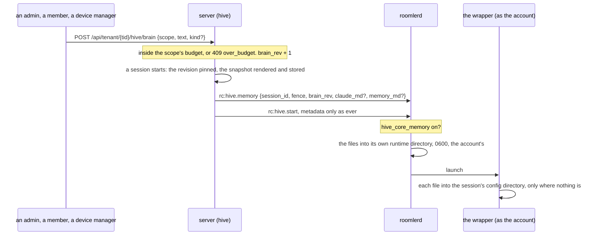
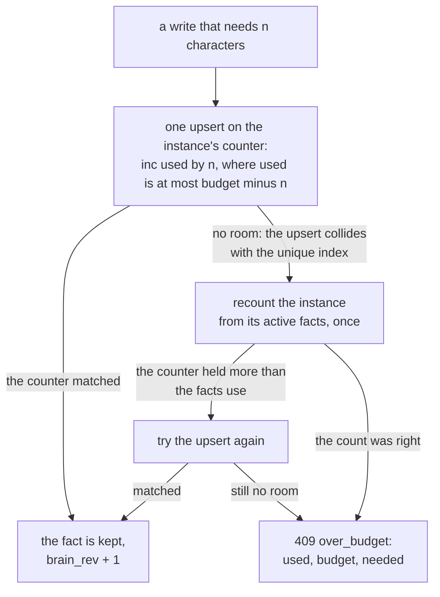

# The brain — core memory, kept by hand

The brain is what an organization's agent sessions share: facts, and later skills
and playbooks, kept centrally and given to each session as it starts. Unlike a
transcript it lives on the server, in the `hive` module's own collections, because
it is text people write for the org, not what a session said or did. What is built
is its first layer, core memory: facts people write in three scopes, each with a
budget, rendered into a frozen snapshot per session that reaches Claude Code as its
`CLAUDE.md` and its auto-memory, on the devices whose owners allow it. The learning
loop that would propose facts from sessions is P5, and not built.

> Spec: [`fr/FR-90-hive-agent-sessions.md`](fr/FR-90-hive-agent-sessions.md) §3f
> "P1e … as designed", AC8 and its field run in §8 (#1827). Design:
> [`roomler-hive-design.md`](roomler-hive-design.md) §10, core memory in §10.3. How a
> session runs, and every other gate it passes: [`hive.md`](hive.md).



---

## 1. Facts and scopes

| Scope | Applies to | Who writes it | Budget | Rendered into |
|---|---|---|---|---|
| `org` | every session in the org | an `ADMINISTRATOR` | 3,000 characters | `CLAUDE.md`, first |
| `user` | the sessions that person starts | that person, holding `HIVE_RUN` | 1,500 characters | `CLAUDE.md`, after the org's |
| `device` | the sessions that run on that device | whoever holds `MANAGE_AGENTS`, for a live device of the org | 800 characters | the auto-memory `MEMORY.md` |

The user scope is the session's starter's, since the starter is whose account the
session runs as. A project scope waits for a project identity, which knowhow (P4)
brings; `project` is refused as a scope today
([`brain.rs:50`](../crates/modules/hive/src/brain.rs#L50)).

A fact is a record in `brain_facts` ([`brain.rs:137`](../crates/modules/hive/src/brain.rs#L137)):
its scope and owner (the user or the device, and null for the org), its text and how
many characters it costs, its kind, `active` or `archived`, a version, and who
created and last changed it, when.

| Rule | Why | Where |
|---|---|---|
| A fact is one line of plain text, at most 500 characters: control characters become spaces, and runs of whitespace collapse | a newline would let a fact write a heading of its own into the rendered file. 500 is under the smallest budget, so any one fact fits an empty scope | [`brain.rs:241`](../crates/modules/hive/src/brain.rs#L241) `clean_text` |
| Each fact has a kind, rendered beside it as `- (warning) …`: `preference`, `convention` (the default), `path`, `gotcha`, `decision` or `warning` | the model can tell a warning from a preference | [`brain.rs:92`](../crates/modules/hive/src/brain.rs#L92) |
| An edit names the version it read, and a fact changed or archived since is not overwritten: `409`, "read it again" | two people editing one fact | [`brain.rs:543`](../crates/modules/hive/src/brain.rs#L543) |
| Archiving takes a fact out of every future snapshot and out of its budget, and keeps it as a record | | [`brain.rs:592`](../crates/modules/hive/src/brain.rs#L592) |
| Any member reads the org's facts and any live device's; someone else's user memory answers 404, as a bogus id does | | [`brain.rs:1072`](../crates/modules/hive/src/brain.rs#L1072) `readable_fact` |
| A removed member's or device's facts stay as records, and are never rendered | no session starts as that person, or runs on that device, again | |

---

## 2. Budgets: fail visibly, evict nothing

Each scope instance (the org, one person, one device) has ONE counter document in
`brain_budgets`, held unique on (tenant, scope, owner) by an index. A write takes its
characters with one conditional update, and the unique index is what turns a write
that does not fit into a refusal ([`brain.rs:376`](../crates/modules/hive/src/brain.rs#L376)):



- **Two writes racing for the last room cannot both fit.** The counter's filter is
  part of the update, so only one of them matches.
- **A refusal recounts once.** A reservation a crash left behind (taken, with no fact
  to show for it) would otherwise shrink the budget for ever, and a refusal is when
  that matters ([`brain.rs:451`](../crates/modules/hive/src/brain.rs#L451)).
- **It fails visibly, and nothing is evicted.** A person consolidates (design §10.3,
  Hermes' rule). The refusal is a `409` in the shape of every API error, with the
  numbers beside it:

```json
{
  "error": "over_budget",
  "message": "the org memory holds 2575 of its 3000 characters, and this needs 500 more — shorten or archive a fact first",
  "scope": "org", "used": 2575, "budget": 3000, "needed": 500
}
```

An edit that grows a fact reserves only the difference, and gives it back if the edit
then finds the fact stale. An edit that shrinks one, and an archive, give characters
back. A refused write spends nothing.

---

## 3. Revisions and the frozen snapshot

`brain_revs` holds one revision per org, raised by every write that lands: a new
fact, an edit, an archive ([`brain.rs:503`](../crates/modules/hive/src/brain.rs#L503)).
A refusal raises nothing.

A session pins the revision when it is created. The start route renders the
session's snapshot there and then ([`routes.rs:397`](../crates/modules/hive/src/routes.rs#L397),
[`brain.rs:641`](../crates/modules/hive/src/brain.rs#L641) `snapshot`), stores it in
`hive_session_memory` by session, kept a day, and records `brain_rev` on the
session's record.

- ⚠️ **The revision is read first, then the facts.** A fact written while the snapshot
  renders may be in it without being in the pinned number, never the other way round.
- ⚠️ **Frozen.** A fact written later reaches the next session, never this one, not
  even at its next turn. A start the server sends again when the device reconnects
  carries the same stored snapshot. A session resumed after its device restarted
  keeps its own copy, edits included, since the copy into its config directory
  happens only where nothing is.

What the session is given, for an org fact, one of the starter's and one of the
device's:

```markdown
# Organization memory

Kept by this organization's administrators in Roomler for every agent session (brain revision 7).

- (warning) Never run prod migrations by hand.

# Memory kept by Ann Lee

Kept in Roomler by Ann Lee, who started this session, for the sessions they start.

- (preference) Small commits.
```

```markdown
# Device memory: Build server

Kept in Roomler about this device, for the sessions that run on it.

- (path) Datasets live in /data/sets.
```

The first is `CLAUDE.md`, absent when the org and the starter keep nothing; the
second is the auto-memory `MEMORY.md`, absent when the device has no facts
([`brain.rs:283`](../crates/modules/hive/src/brain.rs#L283),
[`:317`](../crates/modules/hive/src/brain.rs#L317)). The starter's and the device's
names lose every character markdown reads as emphasis, code, a heading or a link, and
every control character, and are cut to 80 characters, so a display name cannot add a
heading of its own. Each
document is at most 32 KiB on the wire, and the fullest snapshot the budgets allow
fits that even at four bytes a character.

A snapshot is rendered only for a device that advertises `hive-memory`. One that
cannot be rendered is logged, and the session starts without it: memory never blocks
a start.

---

## 4. Delivery, and the device's gate

| Rule | Why | Where |
|---|---|---|
| `rc:hive.memory` goes immediately before `rc:hive.start`, and before that start's re-send when the device reconnects, on the same socket, only to a device that advertises `hive-memory` | `rc:hive.start` stays metadata only, its field set locked, and one socket keeps the order | [`routes.rs:455`](../crates/modules/hive/src/routes.rs#L455), [`agent_socket.rs:677`](../crates/modules/hive/src/agent_socket.rs#L677) |
| The device takes the frame only on its primary enrollment, drops a document over 32 KiB, keeps at most 64 waiting, each for 10 minutes, by (session, fence), and uses each once, for that start's launch | a snapshot is sent right before its start, so anything older or more is waiting for nothing | [`supervisor.rs:732`](../agents/roomlerd/src/hive/supervisor.rs#L732) |
| ⚠️ `hive_core_memory`, a device key, is **off by default** and never pushable. Off, the frame arrives but no file is written, not even the daemon's own copy, and the transcript says so: "This start came with the organization's core memory (brain revision 1); this device shows none to its sessions (hive_core_memory is off)." | the gate that survives a compromised server, like `hive_accounts` (decision 9, §5 below) | [`supervisor.rs:1782`](../agents/roomlerd/src/hive/supervisor.rs#L1782), [`:2419`](../agents/roomlerd/src/hive/supervisor.rs#L2419) |
| On, the daemon writes the files into its own runtime directory, `<runtime>/<session>/memory/` (`0755`, root's). Each is created afresh at `0600`, handed to the account through the open file, then renamed into place, and a document the snapshot does not carry is removed | the daemon never writes into a tree the account owns. No other local account reads a session's memory, whose `CLAUDE.md` carries the starter's own facts, and a file an earlier run left can never be copied for this one | [`supervisor.rs:2344`](../agents/roomlerd/src/hive/supervisor.rs#L2344) `write_memory` |
| The wrapper, running as the account, copies `CLAUDE.md` into the session's config directory and `MEMORY.md` into its auto-memory directory, each only where nothing is, not even a link. A copy that fails is skipped. On Windows `roomlerd hive-prep` does the same as the console user, and the session directory's DACL is the handover | a resume keeps what the session has, its own edits included, and memory never stops a session | [`supervisor.rs:93`](../agents/roomlerd/src/hive/supervisor.rs#L93) `WRAPPER`, [`hive_win.rs:677`](../agents/roomlerd/src/hive_win.rs#L677) |
| The transcript names the revision a session got: "Core memory from the organization's brain, revision 1: CLAUDE.md." | the model's answers can be read against what it was given | [`supervisor.rs:2419`](../agents/roomlerd/src/hive/supervisor.rs#L2419) `memory_note` |
| With no frame (a server before P1e, a device without `hive-memory`, a snapshot that did not render, a frame lost), the session starts without core memory, and its transcript carries no memory note | memory is an enhancement, never a single point of failure | |

---

## 5. How the session reads it

Claude Code reads both files from the session's own config directory, so no setting
is needed (Claude Code 2.1.293, probed on 2026-10-08 against a fake Messages API, at
no model spend):

| File | Where | What the model is told |
|---|---|---|
| `CLAUDE.md` | `$CLAUDE_CONFIG_DIR/CLAUDE.md` | in its first turn, as "the user's private global instructions for all projects", under "These instructions OVERRIDE any default behavior and you MUST follow them exactly as written" |
| `MEMORY.md` | `$CLAUDE_CONFIG_DIR/projects/hive-<uuid>/memory/MEMORY.md`, under the session's pinned project name ([`launch.rs:135`](../crates/hive-node/src/launch.rs#L135)) | as "user's auto-memory, persists across conversations". Topic files beside it reach the model only when it opens them |

⚠️ **Core memory is the first server-authored text a session's model reads, and the
model reads it as overriding instructions.** Without it, a compromised server cannot
put one word in front of the model: prompts come only from drivers, over the viewer
peer. Approvals still gate every tool that changes something, but read-only tools run
unasked, and the server can mint itself a view grant. An injected "read X and show
it" would then be a path. Hence the gate belongs to the device, and is off until its
owner turns it on (decision 9). The cost is that an org's brain reaches only the
devices whose owners turned it on.

⚠️ **It is not the only `CLAUDE.md` a session reads.** A repository's own instructions
load as they always do. And a folder under the account's home also loads that
account's own `~/.claude/CLAUDE.md`, which Claude Code's walk up from the folder finds
as a project's `.claude/CLAUDE.md`, whatever `CLAUDE_CONFIG_DIR` says (P2b's probe,
2026-10-10).

---

## 6. Routes, audit and the page

| Route | Who | Does |
|---|---|---|
| `GET /api/tenant/{tid}/hive/brain`, optionally `?device_id=` | any member of an org agent sessions serve | the org's facts and the caller's own, and with `device_id` that device's; each scope's `used` and `budget`; the org's `brain_rev` |
| `POST /api/tenant/{tid}/hive/brain` `{scope, owner_id?, text, kind?}` | as the scope says (§1) | keeps a fact, or `409 over_budget` |
| `PUT /api/tenant/{tid}/hive/brain/{fact_id}` `{text, kind?, version}` | as the scope says | edits it at the version read, or `409` when it is stale or over budget |
| `DELETE /api/tenant/{tid}/hive/brain/{fact_id}` | as the scope says | archives it: `{"archived": true}` |

Every write and every refusal is audited in `hive_audit`, as `action: brain` with the
outcome `added`, `edited`, `archived` or `refused` (reason `over_budget`), the fact as
`target_id`, and the device for a device's fact. An org or a user fact concerns no
device, so `hive_audit.device_id` is optional. The routes sit behind the org gate
(`hive.tenants`, [`hive.md`](hive.md) §9), like every other route of the module.

The **Agent memory** page ([`HiveMemoryView.vue`](../ui/src/views/hive/HiveMemoryView.vue))
shows the three scopes side by side, each with a budget meter, and a device picker
for the device's scope. It adds, edits at the version it read and archives, and shows
a refusal (`409 over_budget`, or a 403) in the server's words, keeping the draft.

---

## 7. What the tests and the field run showed

**In CI**, [`hive_memory.rs`](../crates/tests/tests/hive_memory.rs) runs a real server
and a real in-process device whose owner turned core memory on. Its harness copies out
what it finds where Claude Code reads core memory, at its start and at every turn,
which is what a model would have been given.

| Step | Session A, running | Session B, started after |
|---|---|---|
| an org fact and a device fact are kept, then A starts | `CLAUDE.md` holds the org fact, the auto-memory `MEMORY.md` the device fact, and A's transcript names the revision | — |
| a second org fact is kept | unchanged, at its next turn too | — |
| B starts | — | both org facts, at a later revision |
| org facts until one does not fit | `409 over_budget` with the numbers; the refused write spent nothing; nothing was evicted | — |

[`hive_memory_off.rs`](../crates/tests/tests/hive_memory_off.rs) runs the same device
with the gate off, as a binary of its own because a process reads the gate once. The
transcript shows the frame arrived and says why the session has none, the config
directory holds neither file, and the daemon did not write its own copy either.

The module's unit tests ([`brain.rs`](../crates/modules/hive/src/brain.rs)) pin the
budgets, the one-line rule, the render order, a display name that tries to add a
heading, and the fullest snapshot against the wire limit. The device's own tests
(`core_memory_reaches_a_session_only_where_the_device_allows_it`,
`a_resume_keeps_the_sessions_own_core_memory`,
`core_memory_too_large_or_for_another_start_is_not_used`) run on Linux and macOS CI.
P1e-2's negative control removed the device's gate check, and its test then failed on
the leak.

**In the field**, on 2026-10-08, on the throwaway stack with a real Claude Code
(2.1.293) running as the mapped account
([§8](fr/FR-90-hive-agent-sessions.md#8-field-verification-log)):

| Run | What happened |
|---|---|
| the gate off, first: an org fact "This project's codename is BLUEHERON-4." (revision 1, 39 of 3,000 characters) | the transcript said the start came with revision 1 and that the device shows none; asked the codename without tools, the model answered **UNKNOWN**. The runtime directory held no `memory/`, and the config directory no `CLAUDE.md` |
| the gate on, the device restarted; session A asks; a second fact, "The release train is named GANNET-9.", kept while A runs (revision 2); A asks again; session B starts and asks | A answered **BLUEHERON-4**, then **UNKNOWN** for the train, its `CLAUDE.md` still at revision 1. B answered `codename=BLUEHERON-4 train=GANNET-9`. The daemon's copy was a root `0755` `memory/` holding a `0600` `CLAUDE.md` owned by the account, and the account's own copy was `0600` |
| the org's budget filled through the API to 2,575 of 3,000 (revision 7), then one more 500-character fact on the page | refused under the org's scope in the server's words, the draft kept; the budget stayed 2,575 and the revision 7, and neither session's file changed |

The whole run cost $0.24 in model calls.

---

## Code map

| Piece | Where |
|---|---|
| facts, budgets, revisions, snapshots, the routes | [`crates/modules/hive/src/brain.rs`](../crates/modules/hive/src/brain.rs): `reserve` `:376`, `recount` `:451`, `bump_rev` `:503`, `snapshot` `:641`, `may_write` `:785` |
| the indexes: facts by instance, one counter per instance, snapshots with a one-day TTL | [`crates/modules/hive/src/lib.rs:252`](../crates/modules/hive/src/lib.rs#L252) |
| the snapshot at a start, and its re-send | [`routes.rs:397`](../crates/modules/hive/src/routes.rs#L397), [`agent_socket.rs:677`](../crates/modules/hive/src/agent_socket.rs#L677) |
| the frame | `ServerMsg::HiveMemory` in [`signaling.rs:2886`](../crates/remote_control/src/signaling.rs#L2886); `MAX_CORE_MEMORY_BYTES` in [`hive.rs:63`](../crates/remote_control/src/hive.rs#L63); `RpcCap::HiveMemory` (`hive-memory`), matched by equality |
| the device | [`supervisor.rs`](../agents/roomlerd/src/hive/supervisor.rs): `receive_memory` `:710`, the launch `:1751`, `write_memory` `:2273`, `memory_note` `:2348`; the copy in `WRAPPER` `:93` and, on Windows, [`hive_win.rs:677`](../agents/roomlerd/src/hive_win.rs#L677) `prep` |
| the device's key | `hive_core_memory` in [`config.rs:446`](../crates/agent-core/src/config.rs#L446) |
| the page | [`ui/src/views/hive/HiveMemoryView.vue`](../ui/src/views/hive/HiveMemoryView.vue); the calls in [`stores/hive.ts`](../ui/src/stores/hive.ts) |

## Not built

- A project scope (P4, which brings a project identity).
- Everything the learning loop does (P5): facts proposed from sessions and reviewed as
  cards, evidence, supersession, contradiction cards and decay; skills and playbooks;
  session cards and central search; counting how much less steering sessions need.
- A pushable `hive_core_memory` (decision 9's alternative, pushable like
  `hive_enabled` to devices that opted into remote configuration).
