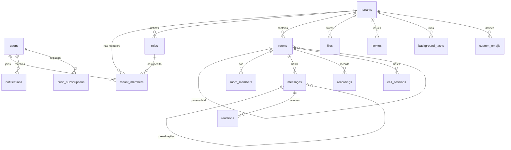
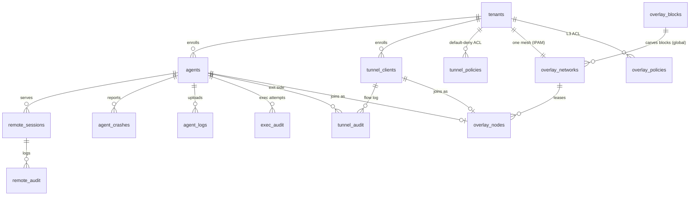

# Data Model

MongoDB (native Rust driver, BSON documents, no ORM). *As of 0.3.0-rc.381* the
server maintains indexes on **39 collections plus 8 stats-rollup collections**
(`crates/db/src/indexes.rs` is the authoritative list; models live in
`crates/db/src/models/` and — for the fleet subsystem — `crates/remote_control/src/models.rs`).

Everything is scoped by `tenant_id` (multi-tenancy) except the global registries
called out below.

## Collaboration core

| Collection | Purpose · key fields / indexes |
|---|---|
| `tenants` | Organizations. Unique `slug`; `owner_id`; plan + Stripe linkage |
| `users` | Accounts. Unique `email`, `username`; text index on `display_name`+`username`. ⚠️ Unique `email` is a **reservation**, so it holds only an address the account has *proven* (activation, or a provider that verified it) — an unproven claim goes to the non-indexed `unverified_email` and the row takes a `.invalid` placeholder |
| `tenant_members` | Membership + role assignment. Unique `(tenant_id, user_id)` |
| `roles` | 24-bit permission bitfield. Unique `(tenant_id, name)`, ordered by `position` |
| `rooms` | Hierarchical tree (text + voice/video): `parent_id`, unique `(tenant_id, path)`, sparse-unique `meeting_code`; text index on `name`+`purpose`+`tags` |
| `room_members` | Per-room membership |
| `messages` | Chat. Thread via `thread_id`, pins, embeds; text index on `content` |
| `reactions` | Unicode + custom-emoji reactions, keyed by `message_id` |
| `recordings` | Call recordings; storage provider `S3`/`MinIO`/`Local` |
| `call_sessions` | Call lifecycle rows (90 d TTL on `started_at`) |
| `call_chat_messages` | In-call chat (no secondary indexes) |
| `files` | Versioned uploads; uploader, room linkage |
| `invites` | Shareable/email/batch invites; unique `code` |
| `custom_emojis` | Tenant emoji sets |
| `notifications` | @mention & system notifications; `is_read` |
| `push_subscriptions` | Web-push endpoints (VAPID) |
| `background_tasks` | Export/processing pipeline; TTL-expired |
| `activation_codes` | Email activation; TTL on `expires_at` |
| `stripe_events` | Stripe webhook dedupe/audit |
| `consent_requests` | Remote-session owner-consent capability tokens |
| `used_tokens` | Single-use JWT `jti` burn list (1 h TTL) |

## Fleet: agents, remote desktop, tunnels, overlay

| Collection | Purpose · key fields / indexes |
|---|---|
| `agents` | One row per enrolled machine: name, os, version, caps (codecs/transports/rpc), exec policy, status. **Unique `(tenant_id, machine_id)`** — re-enrollment reuses the row |
| `remote_sessions` | Remote-desktop sessions: agent, controller user, state machine, stats. 90 d TTL |
| `remote_audit` | Per-session audit events (connect, consent, input, terminate). 90 d TTL |
| `consent_requests` | Pending owner-consent decisions (capability token = the auth) |
| `agent_crashes` | Crash-report ingest. 90 d TTL on `reported_at` |
| `agent_logs` | Centralized log batches (agent + browser ingest). **7 d TTL**, text index on `lines.msg` |
| `exec_audit` | Fleet-RPC attempt log — every exec **including refusals**. 90 d TTL |
| `tunnel_clients` | Enrolled `roomler` CLI identities (`owner_user_id`) |
| `tunnel_policies` | Default-deny tunnel ACL: subject × target × destination (`dst_host`) |
| `tunnel_audit` | One row per tunnel flow (`tunnel_session_id`). 90 d TTL |
| `overlay_networks` | **One per tenant** — the mesh IPAM row: CIDR (default carved from `100.64.0.0/10`), monotonic `next_host` cursor + `free_hosts` recycle pool, MagicDNS domain, ACL mode (`off`/`warn`/`enforce`) |
| `overlay_nodes` | Mesh membership: overlay IP, WG pubkey, advertised + approved routes, exit-node flag. Unique `(tenant_id, machine_id)` and `(tenant_id, network_id, overlay_ip)`; **partial-unique `name`** (MagicDNS) scoped to live rows — nodes are *tombstoned*, not deleted, so a released address/name can be re-issued while history is kept |
| `overlay_policies` | Overlay L3 ACL rules (compiled into per-node netmaps under `enforce`) |
| `overlay_blocks` | **Global** (not tenant-scoped) registry of disjoint `/22` address blocks for multi-org; slot-unique, freed blocks quarantined |

## Observability & analytics

Raw event streams with short TTLs, rolled up hourly/daily by an in-server task
(`$merge` on `_id`, whole-bucket replace).

| Collection | TTL | Purpose |
|---|---|---|
| `stats_relay` · `stats_machine` · `stats_mesh` · `stats_events` · `stats_call` · `stats_call_user` | 7 d | Raw series: relay load (by region), per-machine, mesh edges, platform events, calls, per-user call usage |
| `stats_relay_1h` · `stats_machine_1h` · `stats_call_1h` · `stats_call_user_1h` | 90 d | Hourly rollups |
| `stats_relay_1d` · `stats_machine_1d` · `stats_call_1d` · `stats_call_user_1d` | 730 d | Daily rollups |
| `page_views` | 7 d | SPA route-change beacons (paths normalized server-side) |
| `ws_sessions` | 7 d | WebSocket session bookkeeping |

## Index & retention summary

| Guarantee | Where |
|---|---|
| Unique identity | `users.email`, `users.username`, `tenants.slug`, `(tenant_id, user_id)` membership, `(tenant_id, machine_id)` on `agents` **and** `overlay_nodes`, `(tenant_id, network_id, overlay_ip)`, partial-unique live `overlay_nodes.name`, `overlay_blocks.slot`, sparse-unique `rooms.meeting_code` |
| Full-text search | `messages.content` · `rooms.{name,purpose,tags}` · `users.{display_name,username}` · `agent_logs.lines.msg` |
| TTL retention | 90 d: `remote_sessions`, `remote_audit`, `tunnel_audit`, `exec_audit`, `agent_crashes`, `call_sessions`, hourly rollups · 7 d: `agent_logs`, raw stats, `page_views`, `ws_sessions` · 730 d: daily rollups · 1 h: `used_tokens` · on-expiry: `activation_codes`, `background_tasks` |

Two patterns worth knowing when touching this layer:

- **Tombstones over deletes** in `overlay_nodes`: release paths CAS a tombstone
  *first* (the CAS win is the release token), then return the host number to the
  pool, then fan `netmap_delta{removes}` — that order is load-bearing; see the
  address-lease section of [overlay-communication.md](overlay-communication.md).
- **Hand-built updates must name every field** — the DAO layer builds `doc!{}`
  updates explicitly, so adding a model field means adding it to the DAO update or
  it silently never persists.
