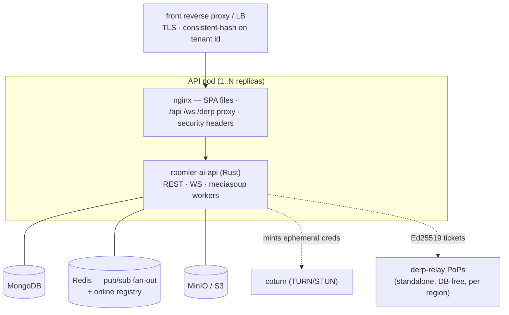
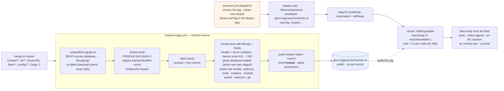
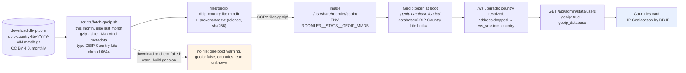
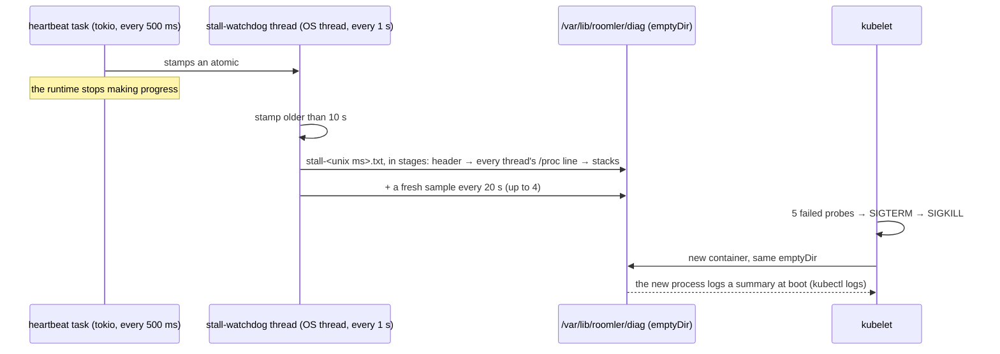
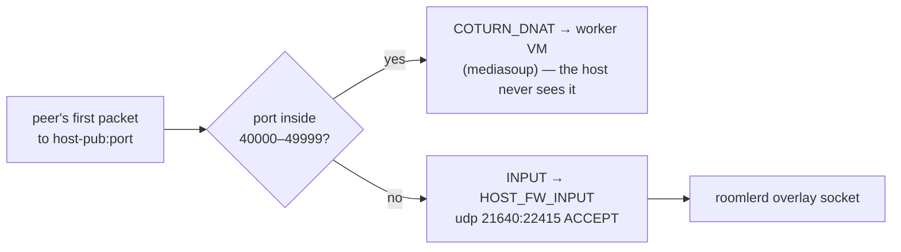

# Deployment

Deploying the Roomler server and its supporting infrastructure. The native fleet
(agents, CLI, wizard) is *not* part of the server image — it ships through GitHub
Releases and the server's installer proxies ([installation.md](installation.md)).
*As of 0.3.0-rc.381.*

## Topology


```mermaid
flowchart TB
    LB["front reverse proxy / LB<br/>TLS · consistent-hash on tenant id"]
    subgraph pod["API pod (1..N replicas)"]
        NG["nginx — SPA files ·<br/>/api /ws /derp proxy · security headers"]
        BIN["roomler-ai-api (Rust)<br/>REST · WS · mediasoup workers"]
    end
    MONGO[("MongoDB")]
    REDIS[("Redis — pub/sub fan-out<br/>+ online registry")]
    MINIO[("MinIO / S3")]
    COTURN["coturn (TURN/STUN)"]
    DERP["derp-relay PoPs<br/>(standalone, DB-free, per region)"]

    LB --> NG --> BIN
    BIN --- MONGO & REDIS & MINIO
    BIN -.->|"mints ephemeral creds"| COTURN
    BIN -.->|"Ed25519 tickets"| DERP
```

## The server image

One multi-stage `Dockerfile`:

1. `rust:1.95-bookworm` (the toolchain `rust-toolchain.toml` pins) — builds
   `roomler-ai-api` (+ `derp-relay`) in three layers (FR-73 P1b): `chef` (toolchain +
   `cargo-chef`), `planner` (the dependency recipe from the manifests) and `builder`
   (`cargo chef cook` = every dependency, the mediasoup C++ worker included, as ONE
   cached layer; then the real build over only the Rust sources — a UI-only change
   never touches a Rust layer). Two build args select the composition (FR-69 P8):
   `PROFILE` (`full` | `collab` | `remote` | `mesh` | `access`, the Cargo feature
   aggregate the api crate is built with) and `SAAS` (`1` adds the hosted service's
   billing + newsletter module). **The hosted build passes `PROFILE=full SAAS=1`** —
   also the defaults; the self-host publish workflow passes `SAAS=0` and asserts it.
2. `oven/bun:1` — builds the Vue SPA
3. `debian:trixie-slim` — runtime: **nginx + the binary in one image**, SPA at
   `/var/www/roomler-ai`, nginx config from `files/nginx-pod.conf` (SPA fallback,
   API/WS proxy, security headers incl. HSTS + CSP), `EXPOSE 80`, and the user
   analytics' country database at `/usr/share/roomler/geoip/dbip-country-lite.mmdb`
   ([below](#the-country-database-the-image-carries-1896))

## The hosted image pipeline (FR-73)

Since 2026-09-05 the hosted image is **built by GitHub Actions on every merge to `master`**,
served from the public package on GHCR, and **promoted to prod by a dispatch** — the build host
no longer builds or serves it ([FR-73](fr/FR-73-image-build-on-github.md)).


```mermaid
flowchart LR
    M["merge to master<br/>(crates/**, ui/**, Dockerfile, files/**, config/**, Cargo.*)"]
    subgraph gha["hosted-image.yml — GitHub Actions"]
        GE["scripts/fetch-geoip.sh<br/>DB-IP country database → files/geoip/<br/>(a failed download warns, never fails)"]
        B["docker build<br/>PROFILE=full SAAS=1<br/>registry-backed BuildKit cache<br/><i>buildcache-hosted</i>"]
        L["label check<br/>revision = the commit"]
        S["smoke boot with Mongo + Redis<br/>/health = all six modules · device route 401 · / 200<br/>geoip database loaded (when one was staged)<br/>public-site smoke: redirects · 404s · headers · hashed assets · lastmod = git"]
        P["push hosted-&lt;date&gt;-&lt;sha7&gt;<br/>move <b>hosted</b> · attest provenance"]
        GE --> B --> L --> S --> P
    end
    G[("ghcr.io/gjovanov/roomler-ai<br/>public · no pull secret")]
    PR["promote.yml (dispatch)<br/>resolve the tag · refuse non-hosted<br/>bump newTag in the deploy repo"]
    D["deploy repo · k8s/overlays/prod<br/>newName: ghcr.io/gjovanov/roomler-ai<br/>newTag: hosted-…"]
    A["ArgoCD (webhook, automated + selfHeal)"]
    K["cluster: RollingUpdate<br/>maxSurge 0 / maxUnavailable 1<br/>pull ≈ 3 s per node (81 MB)"]
    F["field-verify from the fleet<br/>pods · online agents · an RC session<br/>an overlay pair · a tunnel"]
    M --> gha
    P --> G
    PR --> D --> A --> K --> F
    G -.->|"pulled by tag"| K
    style G fill:#e8f0fe
    style PR fill:#fff4e5
```

| Step | Who | Measured (first day) |
|---|---|---|
| build → tag on GHCR | the workflow, on every merge | cold 13 min 37 s build / 15 min 01 s merge → tag (the `COPY . .` Dockerfile), 17 min 42 s cold with the chef layers' first export; **warm: a Rust change 6 min 49 s, a UI-only change 1 min 04 s, no change 10 s** (the cache holds the previous build's layers, so consecutive merges reuse what they share) |
| promote | a human, `gh workflow run promote.yml -f tag=…` (empty tag = the `hosted` pointer) | runs in the `release` environment, whose secret `DEPLOY_REPO_TOKEN` it uses after proving write access with a dry-run push (verified 2026-09-06); without the secret the job prints the exact bump |
| roll | ArgoCD, one pod at a time | 20 s from the deploy-repo push to both pods on the new image; pulls 3.3 s / 2.7 s per node |
| verify | from the fleet, after every roll | the workflow only proves the public `/health` kept answering |

Two things the lane never does: it never writes `latest` (that is the self-host `full` image
without `saas`, owned by `publish-selfhost-image.yml`), and it never deploys — a roll re-homes
every long-lived socket on the replaced pod (agents, RC sessions, tunnels, DERP), so which merge
becomes prod, and when, stays a decision. Retention on GHCR is `ghcr-retention.yml` (Mondays):
untagged BuildKit cache manifests and `hosted-*` tags beyond the newest 20 — never `latest`, `v*`,
a per-arch or per-profile tag, `buildcache-*`, or an attestation (GHCR stores those untagged,
referenced by a `sha256-<subject>` index; the job reads each candidate's manifest back and deletes
only cache configs).

**Break-glass** (a GitHub outage, or a fix that must not wait for a runner): the build host's
recipe in `CLAUDE.md` still works — build, push to the build host's own registry, then set **both**
`newName: registry.roomler.ai/roomler-ai` and `newTag` in the deploy repo. `promote` refuses until
`newName` is switched back to GHCR. Rehearsed after the switch on 2026-09-05: a warm build of
master in 9 min 38 s, pushed in 9 s, not deployed.
⚠️ Run `cd ui && bun docs/dates.ts --write` in the build host's clone **before** `docker build`
([FR-87](fr/FR-87-blog-and-google-indexing.md)). The image has no git history, so the docs' dates
come from that manifest; without it the image publishes no dates at all. That is honest, but it
is a regression from the lane, and `scripts/public-site-smoke.sh <url> .` reports it.
⚠️ Run `scripts/fetch-geoip.sh` there too, for the same reason
([#1896](#the-country-database-the-image-carries-1896)): without it the image carries no country
database and every country reads `unknown`. Do **not** fall back to dropping
`GeoLite2-Country.mmdb` into `files/geoip/` by hand: MaxMind's EULA forbids handing GeoLite data
to third parties, so it must never reach an image anyone else can pull, and the image no longer
reads that path anyway.

## The country database the image carries (#1896)

The platform user analytics records the **country** a browser session came from: the server
resolves the client's address once, at the `/ws` upgrade, and then drops it, so no IP is ever
stored (`crates/core/src/user_analytics.rs:189`). That lookup needs a MaxMind-format database.
While the build host built the image, it dropped MaxMind's GeoLite2 into `files/geoip/` by hand
before each `docker build`. The GitHub lane that replaced it on 2026-09-05 (FR-73) never did, so
every image it built read every country as `unknown` (`geoip: false`), which nobody noticed until
2026-10-09.

The image now carries **DB-IP's "IP to Country Lite"**, which a public image may lawfully
carry, and names it itself, so a deployment needs no setting at all.


```mermaid
flowchart LR
    DBIP[("download.db-ip.com<br/>dbip-country-lite-YYYY-MM.mmdb.gz<br/>CC BY 4.0, monthly")]
    F["scripts/fetch-geoip.sh<br/>this month, else last month<br/>gzip · size · MaxMind metadata<br/>type DBIP-Country-Lite · chmod 0644"]
    CTX["files/geoip/<br/>dbip-country-lite.mmdb<br/>+ .provenance.txt (release, sha256)"]
    IMG["image<br/>/usr/share/roomler/geoip/<br/>ENV ROOMLER__STATS__GEOIP_MMDB"]
    BOOT["GeoIp::open at boot<br/><i>geoip database loaded</i><br/>database=DBIP-Country-Lite built=…"]
    WS["/ws upgrade: country resolved,<br/>address dropped → ws_sessions.country"]
    API["GET /api/admin/stats/users<br/>geoip: true · geoip_database"]
    UI["Countries card<br/>+ IP Geolocation by DB-IP"]
    NONE["no file: one boot warning,<br/>geoip: false, countries read unknown"]
    DBIP --> F --> CTX -->|"COPY files/geoip/"| IMG --> BOOT --> WS --> API --> UI
    F -.->|"download or check failed:<br/>warn, build goes on"| NONE
    style NONE fill:#fff4e5
    style UI fill:#e8f0fe
```

| Piece | Where | What it guarantees |
|---|---|---|
| Fetch + verify | `scripts/fetch-geoip.sh:109` (`fetch`), `:151` (`stage`) | TLS from DB-IP's host; gzip CRC, 1–128 MiB, MaxMind metadata naming `DBIP-Country-Lite`. Writes the file 0644 and a provenance note with its SHA-256. **Every failure exits 0 with a warning** |
| Both image lanes | `hosted-image.yml:125`, `publish-selfhost-image.yml:149` | Run the fetch before `docker build`, into the build context. Nothing in the Dockerfile downloads, so the layer is keyed by the file's content and a failed fetch can never be cached as an empty layer |
| Bake + default | `Dockerfile:149` (`COPY`), `Dockerfile:155` (`ENV`) | The image names its own database; the deployment sets nothing |
| Load | `crates/core/src/user_analytics.rs:100` | Logs `geoip database loaded` with the database's type and build date, or warns once and degrades. An **empty** value is an explicit off, with no warning |
| Smoke | `hosted-image.yml:224`, `publish-selfhost-image.yml:255` | When the fetch staged a database: the server must log `geoip database loaded` for `DBIP-Country-Lite`, and a non-root user must be able to read the file. When it staged none: a warning, never a failure |
| Payload | `crates/api/src/routes/stats.rs:1296` | `geoip_database`: the loaded database's own `database_type`, or `null` |
| Credit | `ui/src/utils/geoipCredit.ts:35`, `ObservabilityView.vue:369` | "IP Geolocation by DB-IP" linking <https://db-ip.com> under the Countries table, shown only when the server reports a DB-IP database |

**The licence.** DB-IP licenses the Lite database under
[CC BY 4.0](https://creativecommons.org/licenses/by/4.0/): "You are free to use this IP to
Country Lite database in your application, provided you give attribution to DB-IP.com for the
data. In the case of a web application, you must include a link back to DB-IP.com on pages that
display or use results from the database"
([db-ip.com](https://db-ip.com/db/download/ip-to-country-lite)). The dashboard carries that link;
the notice (credit, licence, unmodified, no warranty) travels inside the image as
`/usr/share/roomler/geoip/README.md` and the provenance note. GeoLite2 is out because its EULA
(§6, updated 2026-02-12) forbids disclosing GeoLite data to any third party without MaxMind's
written consent, and requires old versions destroyed within 30 days of an update, which an old
public image tag can never honour. Full text and the operator recipes:
[`files/geoip/README.md`](../files/geoip/README.md).

> ⚠️ **An env var beats the image, and beats the config files.** k8s `envFrom` and compose
> `environment:` override the image's `ENV`, so a deployment that still sets
> `ROOMLER__STATS__GEOIP_MMDB` to the old `/usr/share/roomler/geoip/GeoLite2-Country.mmdb` points
> the server at a file no image carries: one boot warning, then `unknown` everywhere. **Delete the
> override** (or point it at `dbip-country-lite.mmdb`). And because `envFrom` is read only when a
> container starts, a configmap change reaches a pod with its next roll, so land it with a promote.
> `[stats] geoip_mmdb` in `config/local.toml` cannot override the image's value at all; use the
> variable.

> ⚠️ **The root-run smoke cannot see a root-only file.** `mktemp` creates files 0600 and
> Docker's `COPY` keeps the bits, so the first draft of the fetch staged a database only root
> could read (caught on its first local run, before any image). Baked in, that is invisible to a
> smoke that runs as root and fatal to any container run as another user. The fetch now
> `chmod`s it, and the smoke reads it as uid 65534.

An image's database is at most about a month old when it is built (DB-IP publishes on the 1st,
and each build takes the newest release), and it refreshes with every rebuild, which every merge
that touches the image triggers. Its accuracy is DB-IP's "Lite" grade (their own accuracy index:
81, against 93 for the commercial database): enough for a per-country breakdown, and not meant
for anything finer.

## Development stack

```bash
docker compose up -d
```

| Service | Port | Purpose |
|---|---|---|
| `mongo:7` | 27019→27017 | database (dev credentials in the compose file) |
| `redis:7-alpine` | 6379 | pub/sub + presence |
| `minio/minio` | 9000 (API) / 9001 (console) | S3-compatible file storage |
| `coturn/coturn` | host network | TURN relay (`turnserver.conf` — rotate the shared secret!) |

Then `cargo run --bin roomler-ai-api` (API :3000) and `cd ui && bun run dev`
(SPA :5000, proxying `/api` + `/ws` to :5001).

## Configuration

Everything is env-configurable with the `ROOMLER__` prefix (double underscore =
nesting), loaded via the `config` crate. The ones that matter first:

| Variable | Purpose |
|---|---|
| `ROOMLER__DATABASE__URL` | MongoDB connection string |
| `ROOMLER__JWT__SECRET` | **Must be set in production** — with `ROOMLER__APP__ENVIRONMENT=production` the server refuses to boot on the default |
| `ROOMLER__JWT__PREVIOUS_SECRETS` | Comma-separated retired secrets that still **verify** but no longer sign. See [Rotating the JWT secret](#rotating-the-jwt-secret) |
| `ROOMLER__APP__FRONTEND_URL` | Public origin (also the CORS default — unset `cors_origins` allows only this origin) |
| `ROOMLER__APP__CORS_ORIGINS` | Explicit allow-list; `"*"` = deliberate permissive mode (warns) |
| `ROOMLER__TURN__SHARED_SECRET` | coturn REST-auth secret (never committed) |
| `ROOMLER__MEDIASOUP__ANNOUNCED_IP_MAP` | `<node_ip>=<public_ip>,…` — per-pod announced IP resolution for multi-node clusters |
| `ROOMLER__STRIPE__*` / `ROOMLER__CLAUDE__*` / `ROOMLER__S3__*` / SMTP / OAuth | Integrations |
| `ROOMLER__STATS__GEOIP_MMDB` | The country database for the user analytics. **The image already sets it** to the DB-IP database it carries; set it only to use your own `.mmdb`, or to empty to turn lookups off. See [the country database](#the-country-database-the-image-carries-1896) |

Rate limiting (per-IP governor + per-account brute-force gate) and JWT TTLs are
also settings — see `crates/config/src/settings.rs` for the full surface.

### Rotating the JWT secret

One secret signs six audiences (access, refresh, agent-enrollment, agent,
tunnel-enrollment, tunnel-client). Changing it used to invalidate every live
token at once — including every enrolled agent's **one-year** token, i.e. a
fleet-wide re-enrollment by hand. `previous_secrets` makes it a rolling change:

```bash
# 1. Both verify; only the new one signs. Restart/roll the pods.
ROOMLER__JWT__SECRET=<new>
ROOMLER__JWT__PREVIOUS_SECRETS=<old>

# 2. Wait out the longest TTL still in flight, or re-issue ahead of it:
#    access 7 d · refresh 30 d · agent + tunnel-client 1 YEAR.
#    Agent tokens are re-minted on re-enrollment; there is no bulk re-issue yet,
#    so in practice step 3 waits a year unless you re-enroll.

# 3. Drop the old key. Only now is the old secret actually powerless.
ROOMLER__JWT__PREVIOUS_SECRETS=
```

Startup logs `jwt: signing key signing_kid=… verify_keys=N`. A correct rotation
reads as **`verify_keys` 1 → 2 with a changed `signing_kid`**; a changed
`signing_kid` with `verify_keys=1` is the flag day — every live token just died.

⚠️ **This is not revocation.** Until step 3, tokens signed with the old secret
are still accepted, so a *leaked* secret is not contained by step 1 alone. What
rotation buys is that step 3 is reachable at all: an emergency cut-over can be
staged (re-issue on the new key, then drop the old) instead of being one
outage-shaped event.

⚠️ Listing the default `change-me-in-production` in `previous_secrets` is
refused under `ROOMLER__APP__ENVIRONMENT=production` — a retired secret forges
exactly as well as a current one.

⚠️ Tokens minted before `kid` shipped carry no key hint, so they are tried
against every configured key. That is what lets a year-old agent token survive
a rotation, and it is why the fallback is not an optimisation to remove.

## Health & probes

| Endpoint | Meaning |
|---|---|
| `GET /health` | Liveness/startup — cheap process-alive 200 (never flaps on dependency blips) |
| `GET /health/ready` | Readiness — Mongo ping + Redis round-trip + a live pub/sub subscription; 503 with per-check detail otherwise |

### When a pod stops answering: the stall watchdog (#1731)

The liveness probe (`/health` through the pod's nginx on :80, every 15 s, 3 s timeout, 5 failures,
then a 30 s grace) kills a process that stopped answering about **105 s** after it stopped. The
kill takes that process's state with it. A runtime that makes no progress cannot log why.
#1731 was two such kills in 9 h, with the log simply ending mid-line.

So the server watches its own runtime from outside it:


```mermaid
sequenceDiagram
    participant HB as heartbeat task (tokio, every 500 ms)
    participant WD as stall-watchdog thread (OS thread, every 1 s)
    participant F as /var/lib/roomler/diag (emptyDir)
    participant K as kubelet
    HB->>WD: stamps an atomic
    Note over HB: the runtime stops making progress
    WD->>WD: stamp older than 10 s
    WD->>F: stall-<unix ms>.txt, in stages: header → every thread's /proc line → stacks
    WD->>F: + a fresh sample every 20 s (up to 4)
    K->>K: 5 failed probes → SIGTERM → SIGKILL
    K->>F: new container, same emptyDir
    F-->>K: the new process logs a summary at boot (kubectl logs)
```

| A dump holds | Why |
|---|---|
| per thread: name, run state, kernel `wchan`, and the syscall **with its arguments** from `/proc/self/task/<tid>/syscall` | `write#1 0x1 …` on a thread in `pipe_write` means it is blocked writing stdout |
| per thread: its stack, symbolized in-process | each thread walks its own stack in a signal handler (`SIGRTMIN+5`, `crates/api/src/stall_watchdog.rs:499`), claimed per request so a late walk can't corrupt the next (`stack_of`, `:576`) |
| fd 1 and fd 2: what they are, `unread_bytes`, `pipe_capacity` | `unread == capacity`: the log reader stopped reading |
| tokio `workers` / `alive_tasks` / `global_queue_depth` | `global_queue_depth` counts tasks woken from OUTSIDE the runtime (timers, I/O, other threads) that no worker has picked up |
| `VmRSS`, cgroup `memory.current/max/events`, memory/cpu/io **PSI**, `cpu.stat` | rules reclaim thrash and CPU throttling in or out |

A sample is written in **stages**, each synced before the next (`sample_process`, `:794`): the
header, then every thread's `/proc` line, then stacks one thread at a time. A sample cut short by
the kill still keeps every earlier stage. Threads in `D`/`T`/`Z` cannot run a handler, so they are
not asked; their `/proc` line is the evidence. A sample's stack walks share a 5 s budget. At most
one stall is dumped per 10 min, and the watchdog retires when its runtime shuts down.

⚠️ **The dump never goes through stdout or `tracing`.** The dump is written to a file (`DumpOut`,
`stall_watchdog.rs:237`). A copy goes to stderr from a throwaway thread (`:280`), so a blocked
pipe blocks only that thread.

### A log pipe that stops draining must not stop the server (#1731)

The server logs through a **non-blocking, lossy writer** (`crates/api/src/logging.rs`). A log call
enqueues its line (up to 16,384 lines queued) and returns. One `log-writer` thread owns stdout. If
the container's log pipe stops draining, that thread waits alone, the queue fills, and further
lines are **dropped and counted**. Once a minute, and once the pipe drains again, the log says so:
`log output was not draining: lines were dropped so the server kept serving (#1731) … total=N`.

Before this, the fmt layer wrote stdout **synchronously under the process-wide stdout lock**. The
server runs as many tokio workers as its CPU limit, **two** in production, so a stopped pipe froze
the whole runtime:
- one worker blocked in `write(1, …)` (on `tower_http`'s per-request DEBUG line) while holding the lock;
- the other waited on the lock;
- `/health` died with the log, at the same instant.

That's #1731's signature, reproduced on the real release binary with the log reader paused, and
captured by the watchdog:

| same lab, reader paused | synchronous stdout (before) | lossy writer (after) |
|---|---|---|
| `/health` | froze after 128 requests | 9,000 / 9,000 answered |
| watchdog dump | worker in `write#1 0x1`, `fd 1 unread 64256 / 65536`, the other in `Mutex::lock_contended` | none: the runtime never stalled |
| after the reader resumes | recovered (~11.6 s frozen) | `total=1360` dropped lines reported |

⚠️ The trade is deliberate: a stopped log pipe now costs log lines, never the pod. A crash can
lose the lines still queued. Panics are unaffected; they go straight to stderr.

**Reading one.** At boot, the next container marks each unreported dump `.reported` and then logs
a bounded **summary** of it as an ERROR (`report_previous_dumps`, `:371`):
"`stall watchdog: a previous process on this pod stalled`". The summary has the sample headers,
the fd lines, and every thread in `write` or in state `D`/`T` (`summarize`, `:346`). It runs on
its own thread after the watchdog is armed, so a log pipe that is still wedged can't hold the
boot. The whole dump stays in the file until the pod goes:

```bash
kubectl -n roomler-ai logs <pod> | grep -n 'stall watchdog'
kubectl -n roomler-ai exec <pod> -- ls /var/lib/roomler/diag
kubectl -n roomler-ai exec <pod> -- cat /var/lib/roomler/diag/stall-<ms>.txt
```

⚠️ An `emptyDir` survives a container **restart**, not a pod **delete**, and a roll deletes pods.
Before promoting, read any dump, and save `kubectl logs <pod> --previous` of any restarted pod.

⚠️ **A liveness kill with NO dump means the runtime was not frozen.** The heartbeat kept beating,
so the answer lies elsewhere: nginx, the HTTP path, or a probe timing out on something other than
the runtime. A dump that fell back to the temp dir dies with the container and is never reported.

| Setting (env) | Default | |
|---|---|---|
| `ROOMLER__DIAG__STALL_WATCHDOG` | unset: **on** when `app.environment=production`, off elsewhere | a debugger pause over the threshold would otherwise signal every thread of a dev server (and gdb stops on `SIG39` once per thread) |
| `ROOMLER__DIAG__STALL_THRESHOLD_SECS` | `10` | floor 2; well inside the ~105 s kill budget |
| `ROOMLER__DIAG__STALL_DUMP_DIR` | `/var/lib/roomler/diag` | the `diag` emptyDir in `roomler-ai-deploy`'s base deployment. Falls back to the temp dir |

## Scaling beyond one pod

The multi-pod design is settled and documented in
[multi-pod-scale-out.md](multi-pod-scale-out.md). The short version:

- WS sessions, the rc/tunnel hubs, DERP sockets, and mediasoup rooms are
  **pod-local**; chat/notifications/presence fan out via Redis.
- The front LB keeps a tenant's users, agents, and rooms on one pod with a
  **consistent hash on the tenant id** (`/ws` and `/derp` accept a `tid=` hint);
  plain HTTP keeps per-request failover.
- Startup maintenance is leader-gated behind a Mongo lease; the online registry
  (Redis) backs offline push/email dedupe.

## Relay infrastructure

- **coturn** — TURN/STUN for remote-desktop and tunnel fallback paths. The server
  mints ephemeral HMAC credentials (`/api/turn/credentials`); multi-region
  topology is served from `/api/relay/regions`.
- **DERP PoPs** — `cargo build -p derp-relay` produces the standalone regional
  relay: DB-free, no JWT secret, authenticates agents by server-minted Ed25519
  tickets. One small VM per region is enough; it forwards WireGuard ciphertext it
  cannot read.

## Cluster hosts: the media DNAT and the host's own mesh node

A mediasoup-serving host (zeus and jupiter, `host_firewall_mediasoup_rtc: true` in
`k8s-cluster-multi`) answers for two unrelated things on **one public IP**:
- the RTC range 40000–49999, which `COTURN_DNAT` rewrites into the worker VM, where the pod's media ports are;
- its own `roomlerd` mesh node.

nat PREROUTING runs before any filter rule, so a port inside the RTC range can never
belong to the host itself. A peer's first packet to it lands in the VM.


```mermaid
flowchart LR
  P["peer's first packet<br/>to host-pub:port"] --> Q{"port inside<br/>40000–49999?"}
  Q -- yes --> VM["COTURN_DNAT → worker VM<br/>(mediasoup) — the host never sees it"]
  Q -- no --> IN["INPUT → HOST_FW_INPUT<br/>udp 21640:22415 ACCEPT"] --> R["roomlerd overlay socket"]
```

| Layer | Setting | Where it lives |
|---|---|---|
| Overlay port | `overlay_direct_port = 21640`. Its footprint is 21640–22415: the base, the +256 public-dial twin and the +512 fallback band | `/etc/roomler/config.toml` on the host |
| Host firewall | `udp 21640:22415 ACCEPT` in `HOST_FW_INPUT`. jupiter has the chain; zeus has none | `k8s-cluster-multi` host_vars, plus `rules.v4` on the host |
| Kernel | `net.ipv4.ip_local_reserved_ports = 40000-49999`. No ephemeral socket can land in the range: not the pin's fallback bind, not an RC or tunnel session socket | host-hardening sysctl, gated on `host_firewall_mediasoup_rtc` |
| Drift guard | `mediasoup-rtc-forwarding.sh check` fails when `roomlerd` listens on the public IP inside the range | `roomler-ai-deploy`, run by the weekly audit |

⚠️ **The overlay's default port band (43648–44415, derived per machine) sits inside
the RTC range.** A new serving host needs the pin, or it holds a direct path only while
it happened to open the flow itself. That was
[#1665](https://github.com/gjovanov/roomler-ai/issues/1665): after a roll, both hosts sat
on DERP. The tells:
- `roomler why <host>` shows the direct candidate at 100 % loss;
- on the host, `conntrack -L -p udp --orig-port-dst <port>` shows `[UNREPLIED]` entries
  whose reply comes from the VM (`src=10.10.x.11`).

⚠️ **Never "fix" this by carving ports out of the DNAT.** mediasoup allocates from the
whole range, so a carve-out silently breaks every media transport that lands on a
carved port. That is the zero-media failure class above, one port at a time.

## Release pipelines (native fleet)

Tag-triggered GitHub workflows build, sign, and publish the native artifacts;
the server proxies the downloads and gets a cache-bust ping
(`POST /api/releases/refresh`) on publish:

| Workflow | Tag | Artifacts |
|---|---|---|
| `release-agent.yml` | `agent-v*` | Windows MSIs (perUser + perMachine) + `roomler-desktop` companion; Linux `.deb`/tarball (x86_64 **and** aarch64); macOS `.pkg` (arm64) |
| `release-tunnel.yml` | `tunnel-v*` | `roomler` CLI: Windows zip, Linux tarball + `.deb`, macOS universal tarball |
| `release-setup.yml` | `setup-v*` — cut **automatically at every `agent-v*` commit** by `release-agent.yml`'s `dispatch-setup-release` job (FR-84 S1; repo variable `SETUP_LOCKSTEP=false` disables it) | The install wizard: Linux/macOS tarballs, signed Windows EXE zip — all three or none |

All assets carry `.sha256`, GPG `.asc`, and SLSA provenance; releases are
published non-prerelease so `/releases/latest` stays resolvable for the fleet's
auto-updaters. `/api/setup/{windows,linux,macos}` serve the newest `setup-v*`,
so the wizard a new install downloads is only as current as the last lockstep
roll — verify one with `gh release view setup-v<V> --json assets,targetCommitish`
(the recipe, and the re-run after a failure, are in the `ship-it` skill §6).
