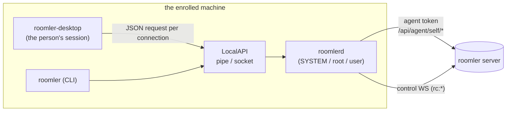
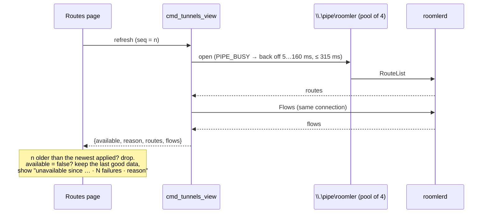
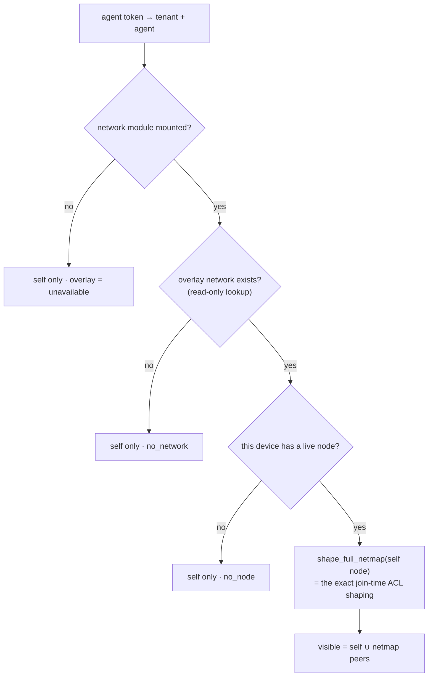
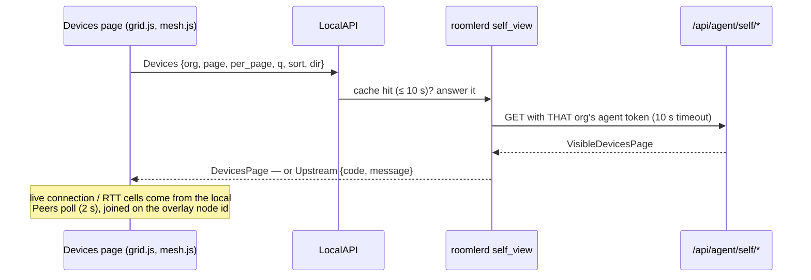
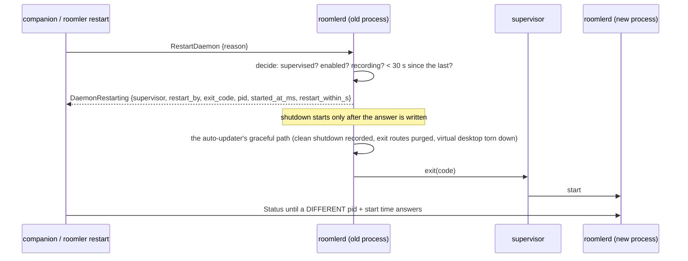

# roomler-desktop — the companion app

**Status:** FR-84 ([#1633](https://github.com/gjovanov/roomler-ai/issues/1633)) — every
phase merged; field verification rides `agent-v0.4.103` (the FR's field-verification log
records each result).

`roomler-desktop` is the tray + window app a person uses on an enrolled machine. It is a
**thin client of the local daemon**: every number it shows and every change it makes goes
through the LocalAPI to `roomlerd`, which runs as SYSTEM / root (or as the user, for a
per-user install). The companion never holds a user credential and never talks to the
server on its own — when it needs server data (the devices this machine can see), the
daemon fetches it with the device's agent token and hands it over.

It is also one of the consent **prompt surfaces** (FR-27): when the daemon cannot draw a
native panel, the companion shows the "someone wants to view your screen" prompt.

| | |
|---|---|
| Crate | `agents/roomler-desktop` (Tauri 2; Rust in `src/`, a plain-JS front in `src/front/`, no bundler) |
| Window | one 1100×740 main window (close = hide to tray) + two always-on-top panels (consent, "being viewed") |
| Talks to | the LocalAPI only — `\\.\pipe\roomler` on Windows, a Unix socket elsewhere |
| Ships in | the agent release (standalone EXE on Windows, `.deb` on Linux, the `.pkg` on macOS) |

## 1. Where it sits

⚠️ The LocalAPI is the trust boundary. On Windows its SDDL grants **SYSTEM, Administrators
and Interactive Users** at medium integrity (`crates/localapi/src/lib.rs:1740`): any person
logged in at the machine can call it, a sandboxed low-integrity process cannot. Everything
below that lets the companion *change* something is therefore something any interactive user
can do — which is why the device-side rules (the `files_dir` SYSTEM rule, the visibility rule
on the Devices page) are enforced in the daemon and on the server, never in the page.

## 2. The pages

Hash routes in `src/front/app.js`; one `<section id="view-*">` per page. The install matrix
(vmtest, FR-61) asserts that every `#view-<name>` renders — keep those ids.

| Page | Route | What it shows | Data (LocalAPI) | Refresh |
|---|---|---|---|---|
| Overview | `#/overview` | this device (name, overlay IPs, server, service, versions), exit node, updates | `Status` (via the shared device view) | on the 2 s device-view tick |
| Devices | `#/devices` | the devices this machine's mesh can see: a server-side grid (search, sort, paging, column chooser) and the mesh graph — see §6 | `Devices` / `Mesh` (daemon-proxied), live connection cells from `Peers` | list 30 s and mesh 60 s while visible; peers 2 s |
| Recordings | `#/recordings` | local and remote screen recordings (FR-85) | FR-85's verbs | on entry |
| Routes | `#/tunnels` | declared routes (`[[tunnel_routes]]`) and live forwards, with add / edit / enable / disable / remove | `RouteList` + `Flows` on **one** connection; `RouteAdd` / `RouteUpdate` / `RouteSetEnabled` / `RouteRemove` | 2 s while visible |
| Settings | `#/settings` | the config surface, grouped (§5); device name; service; the log | `ConfigGet` / `ConfigSet`, `SetDeviceName`, `TailLog` | on entry |
| Onboarding | `#/onboarding` | enrol (server, name, token) or re-enrol | in-process enrolment | — |
| Welcome | `#/welcome` | the first-run tour — see §10 | `Status`, `ConfigSet`, `RestartDaemon`, the files commands | while a step waits |

## 3. The LocalAPI, and why the Routes page used to blink

Every companion request opens the pipe **fresh**, sends one JSON request (or a short batch
on one connection) and closes. Five things poll it at once in a running companion:

| Poller | Where | Interval | Connections per tick |
|---|---|---|---|
| service status | `src/front/app.js:166` | 10 s | 0 (reads config, runs `roomlerd service status`) |
| device view (`Status` + `Peers`) | `src/front/app.js:168` → `cmd_device_view`, `src/commands.rs:254` | 2 s | 1 |
| Routes (`RouteList` + `Flows`) | `src/front/tunnels.js:512` → `cmd_tunnels_view`, `src/commands.rs:1051` | 2 s, visible only | 1 |
| consent (in-window) | `src/front/consent.js:148` | 1.5 s | 1 |
| consent watcher (Rust) | `src/main.rs` | 750 ms | 1 |

**What went wrong (field, 2026-09-25):** the Routes page's tables appeared and disappeared
every few seconds while the daemon's data was steady. Three raw back-to-back opens of the
pipe — exactly what the Rust client does — failed the 2nd open with `ERROR_PIPE_BUSY` (231)
**60 of 60 times**: the server kept **one** listening instance and created the next only
after `connect()` returned. The companion opened three connections in the same millisecond
every 2 s; the client retried once after 50 ms; and the two Routes commands turned the
loser's error into an empty list, which the page painted as "no routes".

⚠️ A .NET `NamedPipeClientStream.Connect(0)` probe of the same pipe reported 90/90 OK — it
calls `WaitNamedPipe` first, and `0` there means the server's *default* wait (50 ms). A
probe that waits cannot see a gap a non-waiting client falls into.

**The fix, in three layers:**

1. **The page never paints an error as data.** `cmd_tunnels_view` answers
   `{available, reason, routes, flows}` from one connection; `tunnels.js` keeps the last good
   data on a failure and says why (`noteUnavailable`, `src/front/tunnels.js:98`), drops a
   response older than the newest it applied, and patches rows in place keyed by route id /
   flow id (`routeRows`, `:48`) so a button never moves under the cursor. Refresh failures
   are also written to the companion's own log (`src/desktop_log.rs`, capped at 2 MiB,
   one rolled generation).
2. **The pipe always has a spare.** `serve_windows_at` (`crates/localapi/src/lib.rs:1839`)
   binds the first instance (retrying while another process holds the name), then runs a
   pool of accept tasks (`accept_pipe`, `:1953`), each owning one listening instance and
   re-creating it before handing a connected one off. Default 4
   (`DEFAULT_PIPE_POOL`, `:1702`); config `localapi_pipe_pool` (1–16) — **`1` is the kill
   switch** and reproduces the old single-instance behaviour.
3. **The client backs off instead of giving up.** `pipe_busy_backoff` (`:2276`) retries a
   busy pipe at 5, 10, 20, 40, 80, 160 ms (≤ 315 ms in total); any other error (the daemon
   is not running) returns at once.

A route can now be **edited** in place: `RouteUpdate` replaces the descriptor in one save
under the config write lock and restarts its flow; an invalid replacement is refused and the
old route keeps running (`agents/roomlerd/src/tunnel/route_reconciler.rs:437`). A daemon
that predates the verb answers "bad request", which the companion shows as *"The device
service predates route editing"* (`src/commands.rs:1100`), never as a blank page.

⚠️ A route whose edit keeps the **same local port** restarts its listener on that port. If
the old listener is still held (the #1035 class — a listener outliving the flow that owned
it), the new flow retries on its backoff until the port frees.

## 4. Polling rules every page follows

- **Poll only while visible.** A page's own timer runs only while its view is the current
  one; re-entering a view never stacks a second timer. The one exception is the shared
  device view (2 s), which the sidebar status dot and the Overview both read.
- **One connection per refresh.** A page that needs two answers asks for both on one
  connection (`cmd_device_view`, `cmd_tunnels_view`).
- **Stale-while-error.** A failed refresh never replaces data with an empty state; it keeps
  the last good data and says how long it has been stale and why.
- **A sequence guard.** A response older than the newest applied is dropped.
- **Keyed rows.** Rows are patched in place by a stable key; `replaceChildren` on every tick
  destroys focus, hover and in-flight clicks.

## 5. Settings, grouped

The config surface (`crates/agent-core/src/config_surface.rs`) is one table of
`KeyMeta { key, kind, group, tier, live, description }` (`:181`) — adding a key without
saying which group and tier it belongs to, and whether the daemon applies it live, does not
compile.

| Group | Example keys | Default state |
|---|---|---|
| **Essentials** (every `tier = essential` key, shown first) | `overlay_enabled`, `auto_grant_session`, `exec_enabled`, `remote_config_enabled`, `ssh_enabled`, `encoder_preference`, `power_policy`, `auto_update` | **open** |
| Access & consent · Private network · Network carriers & relays · Routing & adapter · Tunnels & SOCKS · Roomler SSH · Remote desktop · Capture & input · Video encoding · Video rate & latency · Files · Device & service | the other ~140 keys | collapsed |

- **`restart_required` is per key.** `live = true` only where the daemon really applies a
  change at once — `exec_enabled` and `remote_config_enabled` (the LocalAPI `ConfigSet`
  re-seeds them through `adopt_local`). Every other key is read once at startup.
- **"Modified"** compares a value with the key's built-in default, computed from a config
  that contains nothing but the identity fields (`builtin_default`, `:1481`).
- A daemon that predates the grouping sends entries without `group`; the page falls back to
  the flat list.
- Every new agent knob is registered here (the standing rule): the `config.rs` field, the
  `KeyMeta` entry, the `current_value` / `apply` arms, and a set/echo test.

## 6. What the companion may know about other devices

The Devices page shows **the devices this machine's overlay netmap already carries, plus
itself** — never the organisation's inventory. The companion cannot sign in as a user, so the
daemon asks the server with its **agent token**:

| Route | Auth | Returns |
|---|---|---|
| `GET /api/agent/self/devices?page&per_page&q&sort&dir&kind` | agent JWT (status-checked on every use) | `VisibleDevicesPage` — rows with display name, name, OS, version, presence, overlay IP, MagicDNS, tags, reachability, `is_self`; plus `overlay` (`ok` / `no_node` / `no_network` / `unavailable`) and `acl_mode` |
| `GET /api/agent/self/mesh` | agent JWT | the web dashboard's mesh payload, restricted to the same set, with a server-computed `label` per node and `self_node_id`; `{"enabled": false}` when stats are off |

How the set is computed (`crates/api/src/routes/agent_self.rs:107`):

- **The same code decides both.** `shape_full_netmap`
  (`crates/modules/network/src/overlay.rs:2390`) was extracted from the overlay join and is
  what the join itself now calls, so the list can never show a peer the netmap withholds:
  ACL `off` / `warn` list every live node, `enforce` only the shaped set.
- ⚠️ **The device's node is found before any ACL read.** Loading the ACL can create the
  tenant's overlay network if it is missing; a GET must never allocate one.
- **What never leaves the server:** machine ids, owner ids, WireGuard keys and key epochs,
  consent settings, codecs. Those fields are blanked *before* search runs, so `q` cannot be
  used to probe them. Search, sort and paging are the web grid's own
  (`parse_query` / `apply_query`, `crates/api/src/routes/device.rs:289`, `:331`), so the two
  grids cannot drift.
- Proven by a negative control: with visibility taken from every live node instead of the
  shaped netmap, the enforce test leaks a withheld peer and fails
  (`crates/tests/src/agent_self_tests.rs`).

### The companion's side

- **The daemon proxies, per org.** `agents/roomlerd/src/self_view.rs` keeps each org's server
  URL and agent token (the token is redacted from `Debug` and never logged) and asks with
  the right one. Answers are cached — 10 s for a page, 20 s for the mesh, 32 entries, one
  request in flight per key — so the companion, the CLI and re-renders share a fetch.
- **A failure has a name, never an empty list.** `Response::Upstream { code }`:
  `server_unreachable` (connect, TLS, timeout), `unauthorized` (401), `unsupported_server`
  (404 — a server older than the route), `module_unmounted` (the server's own 503),
  `rate_limited` (429), `server_error`, `unknown_org`, `org_disabled`.
- **The page.** `front/grid.js` is the web grid's model ported to plain JS: server sort keys,
  debounced search, pager, and a column chooser (show / hide, drag, ▲/▼) remembered per org
  in `localStorage`. `front/mesh.js` draws the web dashboard's ring graph in plain SVG; its
  pure helpers `front/mesh-util.js` are **generated** from `ui/src/utils/mesh.ts`, and a
  Vitest check fails when the copy is stale. The list refreshes every 30 s only while the
  view is visible (60 → 120 s back-off after an error, the last page kept on screen).
- **Older sides still work.** A daemon that predates the verbs, or a server without the
  routes, gets the pre-FR-84 peers table with a one-line note to update. `overlay:
  "no_node"` shows this device and the "private network is off" hint; ACL `enforce` with no
  visible peers says so.
- **From a terminal:** `roomler devices [--org L] [-q TEXT] [--sort KEY] [--desc]
  [--page N] [--per-page N] [--json]`.

## 7. Apply now — restarting the service from the companion

Most settings are read once at startup, so saving one is not the same as applying it. The
Settings page collects the saved restart-required keys in a bar with an **Apply now** button;
`roomler restart` is the same thing from a terminal. Both send `Request::RestartDaemon`
(`crates/localapi/src/lib.rs:1209`), and **the daemon decides**.

It restarts only when it can prove that something will start it again — exiting an
unsupervised `roomlerd run` would take the device offline for good:

| How the daemon runs | How it knows (`agents/roomlerd/src/supervision.rs:193`) | Leaves with | Who starts it again |
|---|---|---|---|
| Windows service (SCM host) | the host passes `run --supervisor scm` | `0` — the host respawns 0 at once | the service host |
| Windows Scheduled Task (per-user) | the task passes `run --supervisor task` | `9` | **the caller**: the task's `IgnoreNew` policy drops a start while the old process is still exiting, so the companion / CLI runs `roomlerd service start` every 3 s until a new process answers |
| systemd | `INVOCATION_ID` **and** `/proc/self/cgroup` puts the process inside one of our units, **and** `systemctl show` says this process is the unit's main PID and its restart policy restarts exit `9` | `9` | systemd |
| launchd | `XPC_SERVICE_NAME` starts with `com.roomler.` | `9` — `KeepAlive{SuccessfulExit:false}` relaunches only a non-zero exit | launchd |
| the macOS supervisor (FR-43) | the worker's `--supervised` flag | `9` | the supervisor |
| anything else | — | **refused** | — |

`9` is `RESTART_REQUESTED_EXIT_CODE` (`agents/roomlerd/src/watchdog.rs:172`); it is outside
systemd's `RestartPreventExitStatus=7 8`, and the SCM host maps it to *respawn* as well.

- **It is not a crash.** The restart leaves through the same internal shutdown an auto-update
  uses, so the clean shutdown is recorded and the crash / rollback accounting never sees it
  (`exit_for_requested_restart`, `agents/roomlerd/src/main.rs:1480`).
- ⚠️ **A virtual-desktop host reaps its own desktop before it exits (#1684).** On Linux the
  daemon may run a virtual desktop (Xvfb + WM + apps, `ROOMLERD_VIRTUAL_DESKTOP=1`), and under
  systemd `KillMode=control-group` whatever it spawned that outlives it — the desktop's
  setsid'd `at-spi-bus-launcher` grandchild, which **ignores SIGTERM** — keeps the unit's
  cgroup non-empty until systemd SIGKILLs it after `TimeoutStopSec` (90 s), then pays
  `RestartSec`: a `roomler restart` took **96 s**. So every graceful exit now tears the whole
  desktop tree down (`virtual_desktop::teardown`, `agents/roomlerd/src/virtual_desktop.rs`) —
  the tree is spawned into its own process group, and teardown unions the group members with
  the parent-link closure of the daemon's direct children (which reaches a setsid'd
  grandchild, since `setsid` changes the session and group but never the parent), SIGTERMs,
  waits a 2 s grace, then SIGKILLs the remainder. systemd then finds an empty cgroup and
  relaunches after `RestartSec` (~5 s). ⚠️ It SIGKILLs **as root**, so it never signals a
  recycled pid: the daemon's own children are reaped only **after the last signal** (an
  unreaped zombie keeps its pid — and, for Xvfb, the desktop's pgid — reserved), and any
  other pid is signalled only after its `/proc` **starttime** is re-read and matches the
  snapshot that selected it (`same_process`). Both rules are unit-tested against a scripted
  process table (`kill_tree_signals_everything_before_it_reaps_anything`,
  `kill_tree_never_signals_a_recycled_pid`).
- **The wait follows the supervisor.** A caller waits for the relaunched daemon at least as
  long as the supervisor says a stop + relaunch can take — under systemd,
  `TimeoutStopSec + RestartSec`, read from `systemctl show` and carried as the additive
  `restart_within_s` in `DaemonRestarting` — plus a margin, never below the 60 s floor and
  never past 10 minutes (`localapi::restart_wait`, `RESTART_WAIT_CAP`: a unit with
  `TimeoutStopSec=1h` must not make `roomler restart` hang for an hour). Before this, a fixed
  60 s wait was shorter than the supervisor's
  worst case, so the CLI reported failure on a restart that had in fact worked. `restart_within_s`
  is absent for every non-systemd supervisor and from an older daemon, where the wait stays 60 s.
- **Refusals are named and shown verbatim:** no supervisor it can prove,
  `local_restart_enabled = false` (read on every request, so turning it off applies to the
  very next one), a screen recording in progress (FR-85), a previous restart less than 30 s
  ago (`RESTART_MIN_INTERVAL`, persisted next to the config, so it also bounds a loop across
  processes), and on the macOS supervisor a worker younger than 30 s.
- **"Back" means a new process.** The companion waits for a different pid **and** start time
  (`cmd_restart_wait`, `src/commands.rs:943`) — the leaving process keeps answering for a
  moment, and Windows can hand the relaunched daemon the old pid.
- ⚠️ **This is local only.** Remote configuration never restarts a daemon: a server push is
  persisted and reported as *applied-pending-restart*, and there is no server message that
  restarts anything (`docs/remote-config.md` §7b).

## 8. What this device can encode

The Overview's **Hardware video encoding** card is a codec × backend matrix — H.264, HEVC,
AV1 and VP9 against NVENC, QSV, AMF, VideoToolbox, VAAPI, D3D12, Vulkan, Media Foundation and
the software encoders — with the chroma each cell produced (4:2:0 / 4:4:4), denied cells
struck through, and how long the probe took.

- It asks `Request::EncoderCaps`, which answers from the probe's **cached** result only
  (`caps::cached()`, `agents/roomlerd/src/encode/caps.rs:48`). The capability probe runs in
  child processes (vendor driver code) at the first server hello; a control-surface poll
  must never be what launches it — locked by `not_probed_never_triggers_a_probe`.
- Three states: `ready` (the matrix), `not_probed` (the daemon has not connected yet — the
  card polls every 5 s while the Overview is visible, then stops), `unsupported` (a build
  with no video encoder). An older service gets a one-line "update the service" instead.
- `denied` is the effective `encoder_cells_deny` list (env, config or built-in), shown
  because a denied cell is never opened by the probe or a session, so it could not appear in
  the matrix otherwise. The resolved `encoder_preference` is shown under it.
- It is the same data `roomlerd caps` prints and the server's `AgentCaps` carries; see
  [encoders.md](encoders.md) for what a cell means and why a probe proves an open, not a
  session.

## 9. Where files dropped from a remote viewer land

The Overview's **Incoming files** card shows where a file a controller drops onto this
screen will land **right now**, with **Open folder**, **Change…** (the native folder picker,
which can create a folder) and **Use default**. The setting is `files_dir`; unset, the ladder
is the active user's Downloads, then the service's own fallback. It is **live**: every
transfer reads the current value, so a change needs no restart.

⚠️ `files_dir` is a security control, because the daemon writing the file can be SYSTEM or
root and the LocalAPI admits any interactive user. The rules
(`crates/agent-core/src/files_dir.rs`):

| Rule | Why |
|---|---|
| Absolute, or `~\…` — expanded against the **active** user's profile when a file arrives | one machine-wide setting stays right for whoever is signed in |
| No device / kernel-namespace paths (`\\?\GLOBALROOT`, `\\.\…`), no admin or device shares, no `..` | none of those is a folder a person meant |
| No name Windows silently rewrites (a trailing dot or space, `:stream`) | `C:\Windows.\Temp` would otherwise pass the system-folder check |
| Not under the system folders (`%WINDIR%`, `%ProgramFiles%`, `/etc`, `/usr`, `/bin`, `/System`, …) | remote-supplied files must never land where the OS executes from |
| **When the writer is SYSTEM or root, inside the active user's profile — and refused when no profile is known** | otherwise a non-admin user could make SYSTEM write remote-supplied files anywhere |
| Links resolved and re-checked; an unresolvable link is refused for a privileged writer | a junction must not carry the path outside the rules |
| Creatable and writable | a folder that cannot take the file is a failed drop later |

- Checked **when set** (the daemon refuses the `ConfigSet` with the reason, which the card
  shows verbatim) **and when used** (`download_dir()` re-validates per transfer and falls back
  to the default ladder with a warning — the check that holds even if `config.toml` was
  edited by hand).
- Only the **console user** may change it through the LocalAPI: an RDP user on the same
  machine must not choose where the console user's incoming files land. A SYSTEM shell
  (`roomler exec`, SSH) can still edit the config file; the use-time check applies.
- The Status the companion shows is refreshed off the request path, so a Downloads folder
  redirected to an offline share cannot stall the 2 s poll.

## 10. Starting after install, and the Welcome flow

Every install path ends with the daemon starting, so the **daemon** opens the companion —
once per install, into the signed-in user's session, with `--first-run`
(`agents/roomlerd/src/companion/launch_once.rs`). Who does it on each platform, the login
start, the marker that makes it one-shot, and why an upgrade is *adopted* rather than
launched into are in [installation.md](installation.md) §"After install: the companion
opens". The rules that matter here:

- ⚠️ **No inherited handles.** A companion the daemon starts gets none of the daemon's
  handles: `CreateProcessW` with `bInheritHandles = FALSE`, detached, and outside the
  daemon's job object where that is allowed
  (`agents/roomlerd/src/win_service/companion_spawn.rs:98`). Before this, a companion
  spawned by a daemon worker could outlive it holding the worker's handles — the #1035
  signature, tunnel ports held by a process whose parent was already gone. A route that
  cannot bind its port for two minutes now logs who holds it.
- **Per-machine Windows launches from the service host, with the console user's own,
  non-elevated token** — never from a worker that may run elevated.
- **The companion decides what to show** (`agents/roomler-desktop/src/first_run.rs:63`):
  it reads its own arguments on the first launch too (`--first-run`, `--autostart`,
  `--view=<name>`) and a per-user `desktop-state.json` (`first_run_done`, the start-at-login
  opt-out; `crates/agent-core/src/desktop_state.rs`). A missing or unreadable file is a
  first run. Until the tour is finished or skipped it shows at every start; afterwards a
  login start stays in the tray.

**The Welcome** (`front/welcome.js`) is six steps — this device · the private network ·
who may view this screen · files you receive · start at login · done:

- **Enable** on the private network writes `overlay_enabled`, then uses the same restart
  flow as Settings' Apply now (`window.Roomler.restartDaemon`, `front/settings.js`) and
  waits up to a minute for the overlay address. A per-user install cannot create the
  WireGuard adapter, so it is offered **userspace mode** instead: `netstack_socks_port` on a
  free port (never a hard-coded one a declared route may already hold), explained as "apps
  reach the mesh through SOCKS5 on 127.0.0.1:<port>; remote desktop needs nothing".
- Every refusal from the daemon — Apply now's, `files_dir`'s — is shown verbatim, and a
  service too old for a step says so and points at the manual way instead.
- The tour can be reopened from the tray and from Settings.
- The whole device can opt out: `companion_autostart = false` stops the post-install launch
  and removes the Windows login start. On a multi-user server that is the switch to use —
  the machine-wide login start opens a companion in every interactive session.

## 11. Testing it

- **Unit:** `cargo test -p roomler-desktop` (the Rust side), `cargo test -p roomler-localapi
  --lib` (the pipe pool and backoff, including the back-to-back-open test that fails with 231
  on the single-instance server), `cargo test -p roomlerd --lib route_reconciler`.
- **The front without a daemon:** serve `src/front/` over loopback with a fake
  `window.__TAURI__` that answers the commands from fixtures, and drive it in a browser.
  That is how the Routes page (stale-while-error, the sequence guard, stable rows, edit) and
  the grouped Settings were verified before they shipped.
- **The install matrix:** vmtest's `desktop` check asserts every view renders on fresh
  Windows and Linux installs.

⚠️ A browser tab driven by automation can be a **background** tab (`visibilityState:
"hidden"`): timers are throttled to once a minute after a while and synthetic mouse presses
are dropped. Script clicks through the page (`element.click()`) or run timing checks right
after a reload.
