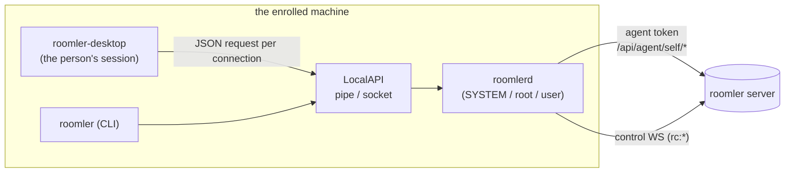
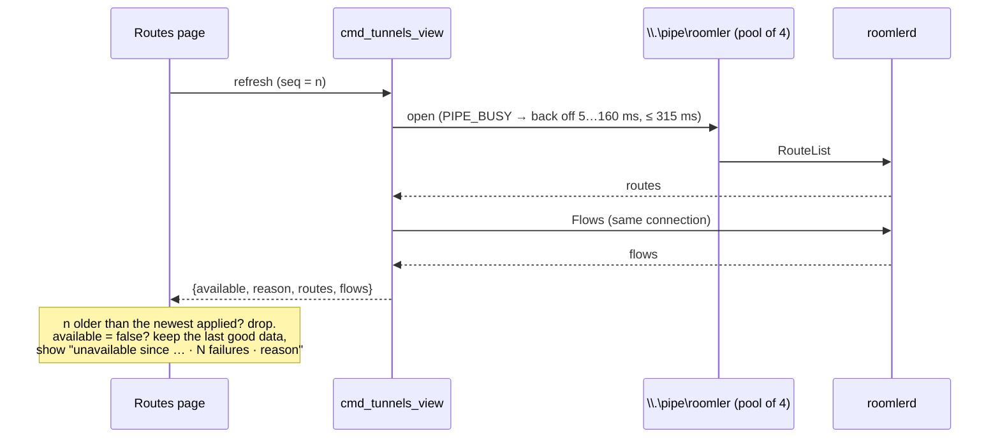
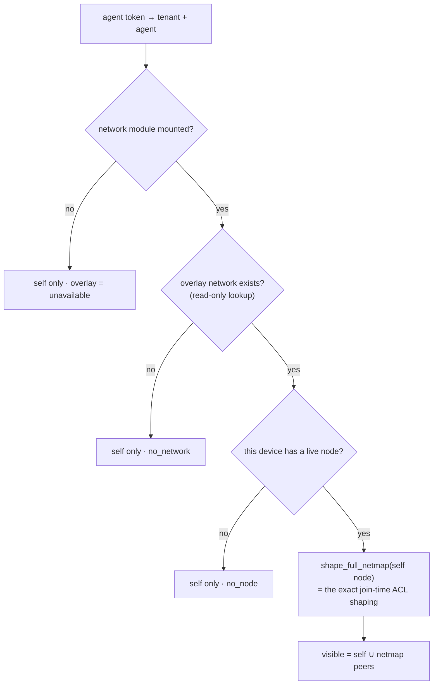
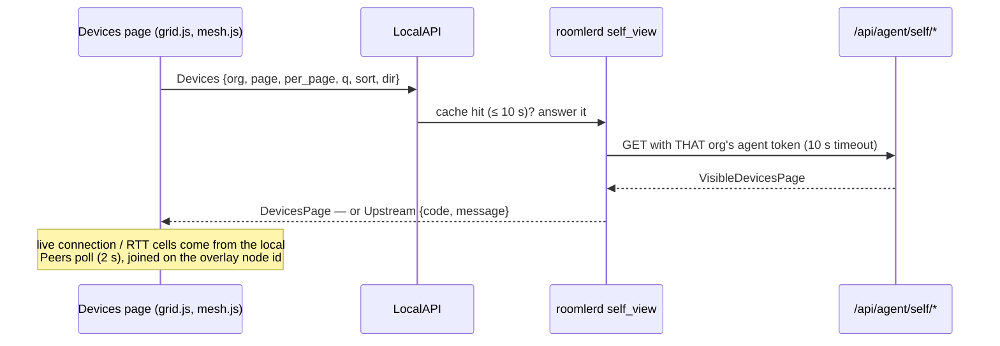

# roomler-desktop — the companion app

**Status:** FR-84 ([#1633](https://github.com/gjovanov/roomler-ai/issues/1633)) in progress —
Routes, the LocalAPI listener pool, grouped Settings and the device-scoped server
endpoints are shipped; Apply now, the Overview cards, the Devices grid/mesh and the
first-run flow are being built (§7–§10 are placeholders until they land).

`roomler-desktop` is the tray + window app a person uses on an enrolled machine. It is a
**thin client of the local daemon**: every number it shows and every change it makes goes
through the LocalAPI to `roomlerd`, which runs as SYSTEM / root (or as the user, for a
per-user install). The companion never holds a user credential and never talks to the
server on its own — when it needs server data (the devices this machine can see), the
daemon fetches it with the device's agent token and hands it over.

It is also one of the consent **prompt surfaces** (FR-27): when the daemon cannot draw a
native panel, the companion shows the "someone wants to view your screen" prompt.

| | |
|---|---|
| Crate | `agents/roomler-desktop` (Tauri 2; Rust in `src/`, a plain-JS front in `src/front/`, no bundler) |
| Window | one 1100×740 main window (close = hide to tray) + two always-on-top panels (consent, "being viewed") |
| Talks to | the LocalAPI only — `\\.\pipe\roomler` on Windows, a Unix socket elsewhere |
| Ships in | the agent release (standalone EXE on Windows, `.deb` on Linux, the `.pkg` on macOS) |

## 1. Where it sits

⚠️ The LocalAPI is the trust boundary. On Windows its SDDL grants **SYSTEM, Administrators
and Interactive Users** at medium integrity (`crates/localapi/src/lib.rs:1740`): any person
logged in at the machine can call it, a sandboxed low-integrity process cannot. Everything
below that lets the companion *change* something is therefore something any interactive user
can do — which is why the device-side rules (the `files_dir` SYSTEM rule, the visibility rule
on the Devices page) are enforced in the daemon and on the server, never in the page.

## 2. The pages

Hash routes in `src/front/app.js`; one `<section id="view-*">` per page. The install matrix
(vmtest, FR-61) asserts that every `#view-<name>` renders — keep those ids.

| Page | Route | What it shows | Data (LocalAPI) | Refresh |
|---|---|---|---|---|
| Overview | `#/overview` | this device (name, overlay IPs, server, service, versions), exit node, updates | `Status` (via the shared device view) | on the 2 s device-view tick |
| Devices | `#/devices` | the devices this machine's mesh can see: a server-side grid (search, sort, paging, column chooser) and the mesh graph — see §6 | `Devices` / `Mesh` (daemon-proxied), live connection cells from `Peers` | list 30 s and mesh 60 s while visible; peers 2 s |
| Recordings | `#/recordings` | local and remote screen recordings (FR-85) | FR-85's verbs | on entry |
| Routes | `#/tunnels` | declared routes (`[[tunnel_routes]]`) and live forwards, with add / edit / enable / disable / remove | `RouteList` + `Flows` on **one** connection; `RouteAdd` / `RouteUpdate` / `RouteSetEnabled` / `RouteRemove` | 2 s while visible |
| Settings | `#/settings` | the config surface, grouped (§5); device name; service; the log | `ConfigGet` / `ConfigSet`, `SetDeviceName`, `TailLog` | on entry |
| Onboarding | `#/onboarding` | enrol (server, name, token) or re-enrol | in-process enrolment | — |

## 3. The LocalAPI, and why the Routes page used to blink

Every companion request opens the pipe **fresh**, sends one JSON request (or a short batch
on one connection) and closes. Five things poll it at once in a running companion:

| Poller | Where | Interval | Connections per tick |
|---|---|---|---|
| service status | `src/front/app.js:166` | 10 s | 0 (reads config, runs `roomlerd service status`) |
| device view (`Status` + `Peers`) | `src/front/app.js:168` → `cmd_device_view`, `src/commands.rs:254` | 2 s | 1 |
| Routes (`RouteList` + `Flows`) | `src/front/tunnels.js:512` → `cmd_tunnels_view`, `src/commands.rs:1051` | 2 s, visible only | 1 |
| consent (in-window) | `src/front/consent.js:148` | 1.5 s | 1 |
| consent watcher (Rust) | `src/main.rs` | 750 ms | 1 |

**What went wrong (field, 2026-09-25):** the Routes page's tables appeared and disappeared
every few seconds while the daemon's data was steady. Three raw back-to-back opens of the
pipe — exactly what the Rust client does — failed the 2nd open with `ERROR_PIPE_BUSY` (231)
**60 of 60 times**: the server kept **one** listening instance and created the next only
after `connect()` returned. The companion opened three connections in the same millisecond
every 2 s; the client retried once after 50 ms; and the two Routes commands turned the
loser's error into an empty list, which the page painted as "no routes".

⚠️ A .NET `NamedPipeClientStream.Connect(0)` probe of the same pipe reported 90/90 OK — it
calls `WaitNamedPipe` first, and `0` there means the server's *default* wait (50 ms). A
probe that waits cannot see a gap a non-waiting client falls into.

**The fix, in three layers:**

1. **The page never paints an error as data.** `cmd_tunnels_view` answers
   `{available, reason, routes, flows}` from one connection; `tunnels.js` keeps the last good
   data on a failure and says why (`noteUnavailable`, `src/front/tunnels.js:98`), drops a
   response older than the newest it applied, and patches rows in place keyed by route id /
   flow id (`routeRows`, `:48`) so a button never moves under the cursor. Refresh failures
   are also written to the companion's own log (`src/desktop_log.rs`, capped at 2 MiB,
   one rolled generation).
2. **The pipe always has a spare.** `serve_windows_at` (`crates/localapi/src/lib.rs:1839`)
   binds the first instance (retrying while another process holds the name), then runs a
   pool of accept tasks (`accept_pipe`, `:1953`), each owning one listening instance and
   re-creating it before handing a connected one off. Default 4
   (`DEFAULT_PIPE_POOL`, `:1702`); config `localapi_pipe_pool` (1–16) — **`1` is the kill
   switch** and reproduces the old single-instance behaviour.
3. **The client backs off instead of giving up.** `pipe_busy_backoff` (`:2276`) retries a
   busy pipe at 5, 10, 20, 40, 80, 160 ms (≤ 315 ms in total); any other error (the daemon
   is not running) returns at once.

A route can now be **edited** in place: `RouteUpdate` replaces the descriptor in one save
under the config write lock and restarts its flow; an invalid replacement is refused and the
old route keeps running (`agents/roomlerd/src/tunnel/route_reconciler.rs:437`). A daemon
that predates the verb answers "bad request", which the companion shows as *"The device
service predates route editing"* (`src/commands.rs:1100`), never as a blank page.

⚠️ A route whose edit keeps the **same local port** restarts its listener on that port. If
the old listener is still held (the #1035 class — a listener outliving the flow that owned
it), the new flow retries on its backoff until the port frees.

## 4. Polling rules every page follows

- **Poll only while visible.** A page's own timer runs only while its view is the current
  one; re-entering a view never stacks a second timer. The one exception is the shared
  device view (2 s), which the sidebar status dot and the Overview both read.
- **One connection per refresh.** A page that needs two answers asks for both on one
  connection (`cmd_device_view`, `cmd_tunnels_view`).
- **Stale-while-error.** A failed refresh never replaces data with an empty state; it keeps
  the last good data and says how long it has been stale and why.
- **A sequence guard.** A response older than the newest applied is dropped.
- **Keyed rows.** Rows are patched in place by a stable key; `replaceChildren` on every tick
  destroys focus, hover and in-flight clicks.

## 5. Settings, grouped

The config surface (`crates/agent-core/src/config_surface.rs`) is one table of
`KeyMeta { key, kind, group, tier, live, description }` (`:181`) — adding a key without
saying which group and tier it belongs to, and whether the daemon applies it live, does not
compile.

| Group | Example keys | Default state |
|---|---|---|
| **Essentials** (every `tier = essential` key, shown first) | `overlay_enabled`, `auto_grant_session`, `exec_enabled`, `remote_config_enabled`, `ssh_enabled`, `encoder_preference`, `power_policy`, `auto_update` | **open** |
| Access & consent · Private network · Network carriers & relays · Routing & adapter · Tunnels & SOCKS · Roomler SSH · Remote desktop · Capture & input · Video encoding · Video rate & latency · Files · Device & service | the other ~140 keys | collapsed |

- **`restart_required` is per key.** `live = true` only where the daemon really applies a
  change at once — `exec_enabled` and `remote_config_enabled` (the LocalAPI `ConfigSet`
  re-seeds them through `adopt_local`). Every other key is read once at startup.
- **"Modified"** compares a value with the key's built-in default, computed from a config
  that contains nothing but the identity fields (`builtin_default`, `:1481`).
- A daemon that predates the grouping sends entries without `group`; the page falls back to
  the flat list.
- Every new agent knob is registered here (the standing rule): the `config.rs` field, the
  `KeyMeta` entry, the `current_value` / `apply` arms, and a set/echo test.

## 6. What the companion may know about other devices

The Devices page shows **the devices this machine's overlay netmap already carries, plus
itself** — never the organisation's inventory. The companion cannot sign in as a user, so the
daemon asks the server with its **agent token**:

| Route | Auth | Returns |
|---|---|---|
| `GET /api/agent/self/devices?page&per_page&q&sort&dir&kind` | agent JWT (status-checked on every use) | `VisibleDevicesPage` — rows with display name, name, OS, version, presence, overlay IP, MagicDNS, tags, reachability, `is_self`; plus `overlay` (`ok` / `no_node` / `no_network` / `unavailable`) and `acl_mode` |
| `GET /api/agent/self/mesh` | agent JWT | the web dashboard's mesh payload, restricted to the same set, with a server-computed `label` per node and `self_node_id`; `{"enabled": false}` when stats are off |

How the set is computed (`crates/api/src/routes/agent_self.rs:107`):

- **The same code decides both.** `shape_full_netmap`
  (`crates/modules/network/src/overlay.rs:2390`) was extracted from the overlay join and is
  what the join itself now calls, so the list can never show a peer the netmap withholds:
  ACL `off` / `warn` list every live node, `enforce` only the shaped set.
- ⚠️ **The device's node is found before any ACL read.** Loading the ACL can create the
  tenant's overlay network if it is missing; a GET must never allocate one.
- **What never leaves the server:** machine ids, owner ids, WireGuard keys and key epochs,
  consent settings, codecs. Those fields are blanked *before* search runs, so `q` cannot be
  used to probe them. Search, sort and paging are the web grid's own
  (`parse_query` / `apply_query`, `crates/api/src/routes/device.rs:289`, `:331`), so the two
  grids cannot drift.
- Proven by a negative control: with visibility taken from every live node instead of the
  shaped netmap, the enforce test leaks a withheld peer and fails
  (`crates/tests/src/agent_self_tests.rs`).

### The companion's side

- **The daemon proxies, per org.** `agents/roomlerd/src/self_view.rs` keeps each org's server
  URL and agent token (the token is redacted from `Debug` and never logged) and asks with
  the right one. Answers are cached — 10 s for a page, 20 s for the mesh, 32 entries, one
  request in flight per key — so the companion, the CLI and re-renders share a fetch.
- **A failure has a name, never an empty list.** `Response::Upstream { code }`:
  `server_unreachable` (connect, TLS, timeout), `unauthorized` (401), `unsupported_server`
  (404 — a server older than the route), `module_unmounted` (the server's own 503),
  `rate_limited` (429), `server_error`, `unknown_org`, `org_disabled`.
- **The page.** `front/grid.js` is the web grid's model ported to plain JS: server sort keys,
  debounced search, pager, and a column chooser (show / hide, drag, ▲/▼) remembered per org
  in `localStorage`. `front/mesh.js` draws the web dashboard's ring graph in plain SVG; its
  pure helpers `front/mesh-util.js` are **generated** from `ui/src/utils/mesh.ts`, and a
  Vitest check fails when the copy is stale. The list refreshes every 30 s only while the
  view is visible (60 → 120 s back-off after an error, the last page kept on screen).
- **Older sides still work.** A daemon that predates the verbs, or a server without the
  routes, gets the pre-FR-84 peers table with a one-line note to update. `overlay:
  "no_node"` shows this device and the "private network is off" hint; ACL `enforce` with no
  visible peers says so.
- **From a terminal:** `roomler devices [--org L] [-q TEXT] [--sort KEY] [--desc]
  [--page N] [--per-page N] [--json]`.

## 7. Apply now — restarting the service from the companion

*Placeholder — FR-84 D3.*

## 8. What this device can encode

*Placeholder — FR-84 D4 (the encoder-capabilities card).*

## 9. Where files dropped from a remote viewer land

*Placeholder — FR-84 D4 (`files_dir` and its SYSTEM rule).*

## 10. Starting after install, and the Welcome flow

*Placeholder — FR-84 D6.*

## 11. Testing it

- **Unit:** `cargo test -p roomler-desktop` (the Rust side), `cargo test -p roomler-localapi
  --lib` (the pipe pool and backoff, including the back-to-back-open test that fails with 231
  on the single-instance server), `cargo test -p roomlerd --lib route_reconciler`.
- **The front without a daemon:** serve `src/front/` over loopback with a fake
  `window.__TAURI__` that answers the commands from fixtures, and drive it in a browser.
  That is how the Routes page (stale-while-error, the sequence guard, stable rows, edit) and
  the grouped Settings were verified before they shipped.
- **The install matrix:** vmtest's `desktop` check asserts every view renders on fresh
  Windows and Linux installs.

⚠️ A browser tab driven by automation can be a **background** tab (`visibilityState:
"hidden"`): timers are throttled to once a minute after a while and synthetic mouse presses
are dropped. Script clicks through the page (`element.click()`) or run timing checks right
after a reload.
