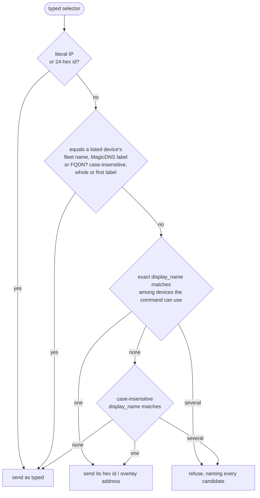

# Device naming — fleet names, display names, tags, and the MagicDNS label

Two name namespaces exist per device, denormalized once at overlay join:

| Namespace | Field | Written by | Consumed by |
|---|---|---|---|
| **Fleet name** | `Agent.name` / `TunnelClient.name` | enrollment (machine-reported) + the admin rename routes | devices grid, `roomler exec/ssh <name>` resolution, SOCKS mesh roster, audit rows, presence events |
| **Overlay/DNS label** | `OverlayNode.name` | overlay join (`dns_label` + in-network de-dup) and, since the rename feature, `propagate_node_rename` | MagicDNS (`<label>.<tenant domain>`), `NetmapPeer.name`, exit-node selection by name |

On top of those, two **display-only** admin fields never propagate into the
netmap, MagicDNS or any wire: `display_name` (friendly label; empty clears) and
`tags` (free-form, trimmed + de-duped, ≤16 × ≤40 chars). The CLI shows and
accepts display names all the same — by joining them in from the device list,
client-side (§ [Display names on the command line](#display-names-on-the-command-line)).

## Showing a display name in the web UI

Where a device has a `display_name`, the web UI titles it with that name. It can
also show the fleet name beside it, so it stays clear which machine is which.
Whether it does is **one viewer preference**, "Hide device name when a display
name is set". It is stored per user and per org, and it is ON by default: once
someone has named a device, the machine-reported name is usually noise.

| Surface | Where the checkbox is | What it hides |
|---|---|---|
| Devices grid (`/tenant/{tid}/device`) | the column picker (`AgentsSection.vue:1036`) | the fleet name in the Name cell's caption line (`:340`) |
| Remote control (`/tenant/{tid}/agent/{id}/remote`) | Settings › Display (`RemoteControl.vue:1269`) | the fleet name in the header subtitle, before OS · version (`:36`) |

Both surfaces use the same composable (`ui/src/composables/useHideDeviceName.ts:48`),
so a flip on one shows on the other at once, including a surface open in
another tab (a `storage` event). The helper that decides whether to show the
name is `secondaryDeviceName` (`:76`). It shows nothing when there is no
display name (the fleet name already is the title) or when the two names are
equal.

> ⚠️ The storage key, `roomler:grid-name-pref:<userId>:<tenantId>:devices`
> (`:23`), predates the composable. It is the Devices grid's original key, kept
> byte-identical so every saved choice carries over. Renaming it would silently
> reset everyone to the default.

## Display names on the command line

`display_name` still never enters the netmap, so `PeerInfo.name` — the NAME
`roomler peers` prints — is the MagicDNS label, and neither resolver a typed
selector reaches knows a display name: the server's exec/SSH target resolver
(`crates/modules/fleet/src/socket.rs:893` `resolve_exec_target`: hex id → exact
`agents.name` → case-insensitive `agents.name`) or the daemon's ping resolver
(`agents/roomlerd/src/localapi_state.rs:485` `resolve_overlay`: literal address
→ mesh label, whole or first label). The CLI closes the gap **on the client**,
by joining the device list the daemon already fetches for this device
(`roomler devices`, FR-84 D5b) onto the peer list — the same two join keys the
`devices` CONN column uses, overlay node id then backing agent id
(`agents/roomler-cli/src/names.rs:47`, `:61`). Nothing on the wire changes and
the server is not consulted for the translation; it resolves and gates whatever
selector it is sent exactly as before. The join, the filter and the selector
rule are pure functions (`names.rs:101` `name_peers`, `:124` `filter_by_names`,
`:201` `resolve_selector`), locked by unit tests with no daemon.

| Command | What a display name does | Device list consulted |
|---|---|---|
| `roomler peers --display-name` | NAME shows the display name where one is set, else the mesh name (the column widens to fit and is cut at 34, like `devices`); `--json` gains a `display_name` per peer, `null` when unknown — without the flag the JSON is the wire verbatim | each printed org section's own; `--org` narrows (`localclient.rs:314` `device_lists_for`) |
| `roomler peers NAME…` | only the peers whose mesh name **or** display name equals an argument, case-insensitively, in argument order; an argument that matches nothing is one stderr warning, and the exit is non-zero only when none matched | same |
| `roomler ping <display name>` | sent as the device's overlay IPv4 — with `-6`, the derived IPv6 the local peer view publishes for it; the output line keeps the **typed** target (`localclient.rs:423` `ping_target`) | the primary's: the daemon's `ping` reads only the primary's mesh (`localapi_state.rs:485`) |
| `roomler exec` / `roomler ssh` / `roomler diag <display name>` | sent as the device's hex agent id (`localclient.rs:404` `agent_selector`) | the primary's: both ride the primary enrollment's control WS — `DaemonState.tunnel_hub` is the ONE hub `agents/roomlerd/src/main.rs:3515` shares with the primary loop, while every secondary loop gets an isolated one (`main.rs:3860`) — so the server resolves within that org |

### The selector rule — a display name never shadows what works today

- **As typed** is today's behaviour, including today's error: the server still
  answers `no device named …`, the daemon still answers `unknown peer`. The
  shadow check is deliberately generous — a fleet name in any case, a label in
  any qualified spelling — because a false "as typed" costs nothing, while a
  false translation would re-point a selector that meant another device
  yesterday.
- **Refused, never guessed.** `exec` runs as SYSTEM/root on the target, so two
  devices sharing a display name is an error that names both, with their ids —
  not a coin toss. Eligibility comes first: a tunnel client sharing a label
  with an agent is not a second `exec` candidate (it cannot run a command), but
  it is one for `ping` when it has an address.
- **Device list unavailable** — an older daemon (`unsupported_daemon`), a
  server that did not answer, a node started without a server identity:
  `peers --display-name` prints one stderr line and shows mesh names; `ping`,
  `exec` and `ssh` send the selector as typed. The list is the server's own
  answer, scoped to what this device may see, so a display name is only ever
  translated to a device the server already lists for this device.
- `-6` on a display name sends the overlay IPv6 the local peer view publishes
  for that device; when none is published the IPv4 goes, which is what the
  daemon itself does for a name (`names.rs:239` `ping_address`).

> ⚠️ **One blind spot, by construction.** A device the overlay ACL hides from
> this device's list cannot be seen by the shadow check. If such a hidden
> device's fleet name equals a visible device's display name, the CLI sends the
> visible device's id where the server alone would have resolved the name to
> the hidden one. Whichever device is addressed, the server still applies every
> exec/SSH gate; the CLI only ever chooses which selector string to send.

## Renaming a device

`PUT /api/tenant/{tid}/agent/{id} {"name": …}` (agents) and
`PUT /api/tenant/{tid}/tunnel-client/{id}` (tunnel clients — the ONLY in-place
rename there is: a client-side rename derives a new machine_id and enrolls a
brand-new row). Both `MANAGE_AGENTS`. What happens:

1. The fleet row is renamed and marked `name_admin_set` — from then on a
   re-enroll refreshes os/version but **no longer overwrites the name** with
   the machine-reported one (it used to, silently reverting every rename).
   A never-renamed device keeps following its machine-reported hostname.
2. If the device has a **live overlay node**, the new MagicDNS label is derived
   (`dns_label`, de-duped within the network excluding the node itself, so a
   no-op rename keeps its label) and written; the unique
   `(tenant, network, name)` index arbitrates races, with one epoch-suffix
   retry. The response reports `dns_renamed` + `dns_name`.
3. Peers get an upsert **delta re-fan** — their netmaps and MagicDNS resolve
   the new label immediately.

## Caveats

- **The renamed device itself** keeps answering its OLD self-name until its
  next reconnect: `self_name` rides only the join-time full netmap, and the
  client's mid-session full-netmap arm is deliberately not exercised
  (field-untested). Peers are correct immediately; the device converges on
  reconnect.
- **Exit-node selection by name goes stale**: a peer whose config says
  `overlay_exit_node = "<old-name>"` fails to re-resolve after ITS next
  restart. Pin by **node-id hex** instead (`route_guard` resolves both) to be
  rename-proof; the rename dialog warns about this.
- `roomler exec/ssh <name>` and the SOCKS mesh roster resolve server-side per
  call / lazily — they self-heal onto the new name. A display name typed to
  `ping`/`exec`/`ssh` is likewise translated per call, client-side, so a
  dashboard relabel is picked up by the next command.
- Tunnel/overlay ACLs reference devices by ObjectId only — rename-safe.
