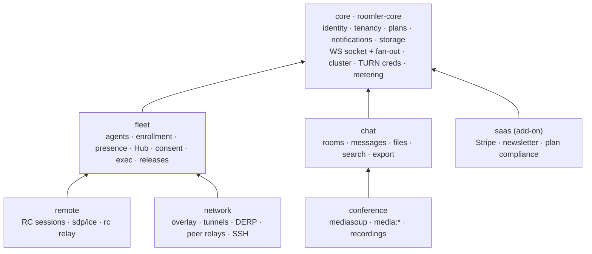

# FR-69: Modular monolith — pillar modules behind `roomler-core`, composed per build profile

**Status**: P0 + P1 + P2 shipped (#1309 · #1311 · #1312 · #1315 · #1317 · #1318 · #1320) ·
P3 (`chat`) next ·
**Owner**: server / architecture ·
**Issue**: [#1307](https://github.com/gjovanov/roomler-ai/issues/1307) ·
**PRs**: P0 claim [#1309](https://github.com/gjovanov/roomler-ai/pull/1309) · P0 rename
[#1311](https://github.com/gjovanov/roomler-ai/pull/1311) · P0 contract + baseline
[#1312](https://github.com/gjovanov/roomler-ai/pull/1312)

## Goal

Decouple the server into pillar modules behind one small core, as a **modular monolith**:

- **one core crate** (`roomler-core`) owning identity, tenancy, plans, notifications, storage,
  the WebSocket socket and its fan-out, the cluster bus, TURN credentials and the metering sink;
- **six modules** (`fleet`, `chat`, `conference`, `remote`, `network`, `saas`), each a crate behind
  one uniform `Module` contract, composed by a thin host;
- **compile-time selection** by Cargo features into five named, tested profiles, and
  **runtime discovery** through `GET /api/capabilities`, so one UI build and one daemon work
  against any profile;
- **one repo, one workspace, one image per profile, one SPA, one daemon.** Not services, not
  dynamically loaded plugins.

Delivered strangler-style, one module per PR, with the full profile **provably unchanged** after
every step: a composition baseline (routes and their allowed methods, the index plan, the wire
names) is recorded in P0 and asserted byte-identical after each move.

The wire formats, the database documents, the socket URLs and the daemon's feature set do not
change. This program is about where code lives and what a build links, not about what a byte on
the wire means.

## Evidence (why this exists)

Measured on `origin/master` @ `08ceb7ba` (0.4.59), non-vendored Rust only. The workspace holds
17 member crates plus six vendored forks, about 312 000 lines; the surfaces below are the four
places where the pillars are actually coupled.

| Surface | Today | Consequence |
|---|---|---|
| `roomler-ai-api` | 46 250 lines; `[features] default = []` (`crates/api/Cargo.toml:17`); depends on `mediasoup`, `roomler-ai-tunnel-core` and `roomler-ai-remote-control` unconditionally | Every server build compiles every pillar. |
| `AppState` | **83** public fields (`crates/api/src/state.rs:58`), a 1 497-line file; **216** `State<AppState>` and **206** `&AppState` sites | Every handler takes everything; the crate recompiles as one unit. |
| `build_router` | `crates/api/src/lib.rs:94–882`, ~790 lines nesting 48 route files (24 072 lines) | Every route in the product is edited in one function. |
| WebSocket | `ws/` 14 747 lines; one upgrade with a role gate (`ws/handler.rs:68`) for user, agent and tunnel-client; the user socket dispatches typing, presence, `media:*` and `rc:*` (`handler.rs:661`, `:777`, `:695`); ~750 lines of media signalling inline from `handler.rs:895`; `overlay.rs` 3 330 · `remote_control.rs` 2 507 · `tunnel.rs` 1 948 · `org_relay.rs` 1 019 · `derp.rs` 1 002 | The socket and gate are the right shape; only the arms need to move. |
| Media | `crates/services/src/media/` (1 047 lines) is the only mediasoup consumer, yet `services/Cargo.toml` links `mediasoup` unconditionally; `mediasoup-sys 0.10` **compiles the C++ worker from source** during `cargo build` (pip → meson → ninja — the reason the Dockerfile installs `cmake` and `python3-pip`) | The single largest build-time lever for any profile without conferencing. |

Two more measurements shaped the design rather than motivating it:

- **The agent Hub is a fleet object.** `crates/remote_control/src/hub.rs:227` is used from 18
  files; by reference count the heaviest consumers are the tunnel WS (14), RC signalling (10),
  state (7), RC routes (5), the RC relay (3), then overlay, exec, SSH grants, org relay, presence,
  consent and cluster metrics. It is the device control-plane multiplexer, not a remote-desktop
  object — which is why device management becomes a module of its own (D3).
- **The wire already groups by pillar.** `ClientMsg`/`ServerMsg`
  (`crates/remote_control/src/signaling.rs:248`, `:1221`) carry ~134 variants; the `rc:` names
  group as tunnel 35 · overlay 18 · agent 8 · rpc 5 · ssh 4 · sdp 4 · relay 4 · session 3 ·
  consent 3. The namespaces map onto modules without touching a byte (D7).

And two facts that make the program cheaper than it looks:

- the auth extractors are **already generic** over the state type: `AuthUser` and `AuthAgent` take
  any `S` where `AppState: FromRef<S>` through a local `FromRef` trait
  (`crates/api/src/extractors/auth.rs:22–25`, `:78`; `agent.rs:99`) — the state split only moves
  that bound (D5);
- every `TenantSettings` field is `#[serde(default)]` (`crates/db/src/models/tenant.rs:79`), so
  a build without a module ignores that module's fields and **no document migration is needed**
  (D8).

## Decisions taken by the operator (2026-09-04)

The five open questions in the plan were answered before P0 started:

1. **Rename `agent-core` so the server core can take `roomler-core`.** The daemon's shared crate
   becomes **`roomler-node-core`** — FR-21 D3 already described it as "the node's shared core,
   not the daemon's", and the crate's pre-FR-21 name is one FR-21 **retired**, which
   `scripts/name-audit.sh --strict` rejects on sight. The directory stays `crates/agent-core`.
2. **`saas` is extracted in this program**, as an add-on feature over any profile (never in a
   published self-host image).
3. **Five profiles**: `full`, `collab`, `remote`, `mesh`, and `access` = fleet + remote +
   network, no collaboration.
4. **SSH lives in `network`** (it rides the overlay netstack: `ssh-server` implies
   `overlay-netstack` in the daemon).
5. **P0 now; P1 on a trigger** — build times hurting the loop, a buyer wanting a single-pillar
   deployment, or a marketplace listing wanting the reduced-surface image.

## Key design (anchors verified against `origin/master` @ `08ceb7ba`)

Each decision lists what was considered, the trade-off, and why. IDs are referenced from the
phase table.

### D1 — Shape: a modular monolith, not services and not dynamic plugins

Considered: keep the monolith · **modular monolith** · microservices · dynamic plugins
(`.so` / `abi_stable` / WASM).

- *Pros*: build isolation per crate; deployable profiles that match how the product is sold;
  a smaller trust surface per profile (a `mesh` image ships no Giphy, Stripe or SendGrid client;
  a `collab` image has no agent socket at all); bounded contexts for agentic development; open-core
  optionality as a crate-visibility decision later; **no operational change** — the tenant-affinity
  LB, the two-pod layout, ArgoCD and the self-host compose file stay as they are.
- *Cons*: up-front mechanical churn (the 216 + 206 sites, the router, the WS arms, the index
  list); 2ⁿ feature combinations to keep honest; a core that grows if its membership rule is not
  enforced; deferred value while go-to-market is running.
- *Why*: services fail on the product's own invariants — the tenant-affinity LB co-locates a
  tenant's users, agents, DERP sockets and mediasoup rooms on one pod because the rc-hub,
  tunnel-hub, DERP relay and room registry are pod-local (`docs/multi-pod-scale-out.md`);
  splitting processes turns those into network calls and doubles the ops story for the buyer whose
  reason to self-host is "one container"; and the control plane must never become a data path.
  Dynamic plugins fail on Rust itself: no stable ABI, and WASM cannot touch mediasoup, WebRTC or a
  TUN device. Nothing in the product needs third-party plugins.

### D2 — Names: `roomler-core` for the server core, `roomler-node-core` for the daemon's shared crate

- `crates/core` → package **`roomler-core`**, lib `roomler_core`, AGPL-3.0-only (server side).
- `crates/agent-core` → package **`roomler-node-core`**, lib `roomler_node_core`, MPL-2.0
  (unchanged licence, unchanged directory). Until this FR it was `roomler-core` (FR-21 P2a).
- Module crates → `crates/modules/<name>` = package **`roomler-ai-mod-<name>`**, lib
  `roomler_ai_mod_<name>`. The `mod-` infix marks the layer and keeps `roomler-ai-mod-remote`
  from being confused with the existing `roomler-ai-remote-control` wire crate.
- *Cons accepted*: the server-side prefix `roomler-ai-*` is a **side** marker, not a licence
  marker (`roomler-ai-remote-control` and `roomler-ai-tunnel-core` are MPL because agents link
  them); `scripts/licence-classes.sh` is the source of truth and gains both new names.
- *Why*: the operator's call (decision 1). The rename is one mechanical PR, and it buys a free
  structural guard: the licensing workflow asserts that no `SERVER_CRATES` entry appears in any
  shipped agent's dependency graph, so `roomler-core` **cannot** leak into `roomlerd` without CI
  failing (AC10).

### D3 — Boundaries: one core, six modules

| Unit | Owns |
|---|---|
| `core` | identity, tenancy, roles, invites, plans and quota, notifications, email, push, OAuth, storage, the `/ws` socket with its storage, dispatcher and Redis fan-out, cluster bus and pod identity, TURN credentials and relay load, the metering and audit sinks, rate-limit primitives |
| `fleet` | agents, enrollment keys, presence and its tokens, the agent Hub and the agent socket role, crash and log ingest, releases and installer proxies, consent, remote config, exec and its audit |
| `chat` | rooms, members, messages, reactions, files, search, export, Giphy |
| `conference` | mediasoup (`services/media` moves here), `media:*`, the media cluster, recordings, call sessions |
| `remote` | RC sessions and audit, controller `rc:*` dispatch, SDP, ICE, session lifecycle, the RC relay and proxy controllers |
| `network` | overlay networks, nodes, policies, blocks and MagicDNS; tunnels, their policies and audit; the `/derp` endpoint, registry, ACL and cluster; peer and org relays; key rotation; **SSH** grants, audit and activity; ephemeral nodes |
| `saas` | Stripe, newsletter and subscribe, plan compliance, platform admin stats |

Considered: four pillar modules with device management in core · **fleet as its own module** ·
one "devices" module for remote + network.

- *Pros*: a `collab` profile has no device surface at all; core stays about identity, tenancy and
  infrastructure — the membership rule is **"in core only if at least two modules need it and it
  is identity, tenancy or infrastructure"**; `remote` and `network` become independent of each
  other, which is what makes the `remote` and `mesh` profiles real.
- *Cons*: one more crate; module-to-module edges (`conference → chat`, `remote → fleet`,
  `network → fleet`), so modules are a DAG, not peers; some placements are judgement calls.
- *Why the gray areas went where they did*: the Hub's consumers place it in `fleet`. SSH rides the
  overlay netstack, so `network`. Exec deliberately rides the control socket, not the mesh, so
  `fleet`. Consent is one prompt payload for RC, exec and SSH since FR-27, so `fleet`. TURN
  credentials are consumed by RC, tunnels **and** mediasoup ICE (the blank `turn.url` incident was
  a conference outage), so `core`. Recordings → `conference`; files → `chat`. Stats, usage and cost
  are a core **metering sink** so "bill only on server-measured bytes" has one owner and modules
  write through it. Stripe and the newsletter exist because roomler.ai is a hosted product, so
  `saas`.

Where the 83 `AppState` fields go (the P1 checklist; counts add up to 83):

| Module | Fields | `AppState` fields |
|---|---:|---|
| `core` | 27 | `db settings auth users activation_codes tenants invites roles notifications oauth email push push_subscriptions used_tokens redis_pubsub redis_sub_alive ws_storage storage stats platform_admins geoip pod cluster_directory cluster_bus turn_map relay_load tasks` |
| `fleet` | 14 | `agents enrollment_keys agent_crashes agent_logs consent_requests rc_hub agent_presence_tokens presence_fanout agent_nudge_cooldowns agent_nudge_throttle exec_audit config_audit exec_rate_limiter releases_cache` |
| `chat` | 5 | `rooms messages reactions files giphy` |
| `conference` | 4 | `room_manager recordings media_claim_tokens remote_media_conns` |
| `remote` | 4 | `remote_sessions remote_audit rc_proxy_controllers remote_rc_conns` |
| `network` | 26 | `tunnel_clients tunnel_policies tunnel_audit tunnel_clients_by_session tunnel_sessions_by_target_agent tunnel_sessions_by_origin_agent tunnel_presence_tokens overlay_networks overlay_nodes overlay_policies overlay_nodes_by_id derp_registry derp_acl derp_cancels derp_presence_tokens derp_rehome_cooldowns derp_ticket relay_pair_churn org_relay peer_relay_audit key_rotation_audit key_rotation_rate_limiter ssh_audit ssh_activity ssh_rate_limiter relay_rate_limiter` |
| `saas` | 3 | `subscribers newsletter_issues newsletter_sends` |

Two placements to **re-check in P5 rather than assume**: whether the agent hello in
`ws/remote_control.rs` needs `tunnel-core` types (if so, those wire types move to the signalling
crate so `fleet` never links `tunnel-core`), and whether `relay_routes` is TURN-region
infrastructure (`core`) or peer-relay policy (`network`).

### D4 — Contract: a `Module` trait, statically composed, with a runtime switch per module

```rust
pub trait Module: Sized + Send + Sync + 'static {
    const ID: &'static str;
    async fn init(core: Arc<Core>, settings: &Settings) -> anyhow::Result<Self>;
    fn enabled(settings: &Settings) -> bool;        // [modules] <ID> = false unmounts it (P1)
    fn capabilities(&self, t: &TenantCtx) -> Capabilities;
    fn routes(&self) -> Router;                     // under /api and the governor; state applied
    fn unlimited_routes(&self) -> Router;           // outside the governor (Stripe webhook)
    fn ws(&self) -> WsRegistration;                 // (Role, Namespace) -> handler; extra upgrades
    fn indexes(&self) -> Vec<IndexSpec>;
    fn jobs(&self) -> Vec<Job>;                     // leader-gated maintenance + periodic sweeps
    fn hooks(&self) -> Hooks;                       // tenant archived, member removed, agent removed
    async fn shutdown(&self);
}
```

Considered: **trait + `#[cfg(feature)]` composition in the host** · a runtime
`Vec<Box<dyn Module>>` · link-time registries (`inventory`, `linkme`) · conventions only.

- *Pros*: exhaustive at compile time (a module that forgets its indexes, jobs or hooks does not
  compile); no object-safety constraints, so `async fn` in the trait is fine; zero runtime cost;
  the runtime switch is a **real kill switch** — a module can be unmounted on a live pod during
  the roll that introduced it, without a rebuild.
- *Cons*: the host's `compose.rs` is edited once per module; a disabled-at-runtime module still
  links (that is what profiles are for).
- *Why*: the module set is fixed at build time, so a dynamic list buys nothing and loses
  exhaustiveness. The defensive catch-all hazard documented in `CLAUDE.md` is the failure mode of
  an open set; a closed set the compiler can see is the structural fix.

### D5 — State: per-module state structs; extractors bound on `Core: FromRef<S>`

Considered: one `AppState` with `Option<…>` fields under cfg · **per-module state +
`FromRef`** · a generic `AppState<M>`.

- *Pros*: each handler sees only its module's state and the god struct disappears; the extractor
  change is small because `AuthUser`, `OptionalAuthUser` and `TenantId` are already generic over
  `S` (only the bound moves from `AppState` to `Core`); `AuthAgent` moves to `fleet` because it
  loads the agent row; the membership guards in `routes/helpers.rs` split the same way
  (`is_member` → core, `require_room_in_tenant` / `require_message_in_tenant` → chat).
- *Cons*: mechanical churn across 216 + 206 sites (pure signature work, the bulk of P1);
  helpers that took `&AppState` to reach two pillars at once must be rewritten as hooks (D6).
- *Why*: `Option` fields keep every handler compiling against everything and turn every
  `.expect()` on an absent module into a runtime panic in a profile nobody tested; a generic state
  type infects every signature with a parameter for no gain.

### D6 — Cross-module edges: a DAG for calls, core-owned hooks for the inverse direction

Allowed calls: any module → core; `conference → chat`; `remote → fleet`; `network → fleet`;
`saas → core`. Forbidden: core → module, `chat ↔ remote`, `chat ↔ network`, `remote ↔ network`.

Inverse flows that exist today and become hooks: tenant archive releases every overlay node
(`routes/tenant.rs:201`) and touches rooms and sessions; the agent delete cascade
(`routes/remote_control.rs:1048`) terminates sessions and releases the overlay lease; ephemeral
reaping releases leases (`ws/ephemeral.rs:86`); presence changes fan out as `device:presence`.

Considered: direct calls (forces core → module edges) · **typed hook traits registered at init,
invoked synchronously in a fixed order** · an asynchronous Redis event bus.

- *Pros*: in-process, ordered — the cross-module order (remote terminates → network releases →
  fleet tombstones) is written once, in core; load-bearing orders inside a module stay inside it
  (`release_overlay_node`'s read peers → CAS tombstone → pool host → fan-out never leaves
  `network`, `ws/overlay.rs:1372`); a hook a profile does not compile is a no-op.
- *Cons*: ordering is a convention enforced by one function, not by types; hooks must be
  idempotent because a cascade can be re-run after a crash mid-way (already true today).
- *Why*: eventual consistency on a cascade that must not pool an address before its tombstone is
  the bug class the overlay IPAM paid for. Redis fan-out stays for notifications and presence; it
  is wrong for ownership transfer.

### D7 — WebSocket: one socket, one role gate, namespace-routed handlers, a byte-identical wire

Core keeps the `/ws` upgrade, the role gate, the `tid` affinity check, connection storage, the
dispatcher primitives and Redis fan-out (`ws/handler.rs:68–120`, `ws/dispatcher.rs`,
`ws/storage.rs`, `ws/redis_pubsub.rs`). Modules register handlers per (role, namespace).
`ClientMsg::namespace()` is an **exhaustive match** that assigns every variant an owning module.
`/derp` registers through `WsRegistration` as an extra upgrade endpoint owned by `network`; the
media handlers leave `handler.rs` for `conference`.

Considered: one socket per module (`/ws/chat`, `/ws/rc`, …) · **one socket, exhaustive
namespace map** · keep the 1 718-line handler.

- *Pros*: zero wire change — agents in the field dial `/ws?role=agent`, and the front LB pins
  `location = /ws` and `/derp` with `proxy_next_upstream off` and `max_fails=0`; that
  infrastructure is untouched. The exhaustive map is the structural replacement for the `_ =>`
  catch-all hazard: a new variant does not compile until it names an owner.
- *Cons*: the wire enum stays in `roomler-ai-remote-control` (MPL, agent-linked) and is compiled
  into every profile — types only, since `mongodb` is already behind its `server` feature and the
  Hub leaves the crate in P5, which makes it wire-only. Namespace and owner do not always agree
  by prefix (`rc:consent.*` is fleet, `rc:relay.*` is network), so the map is explicit per
  variant and locked by a unit test in the style of `rpc_cap_wire_strings_are_locked`.
- *Why*: moving handlers is cheap; moving an endpoint is a fleet migration across every release
  in the field.

### D8 — Data: DAOs and indexes move with their module; documents stay; capabilities are computed

Each module owns its DAOs and contributes `IndexSpec`s that core applies in registration order.
`TenantSettings` and `Plan` stay in core with their serde defaults; `multi_block` becomes a
parameter of the network module's `indexes()`.

Considered: reshape `tenants` into per-module sub-documents · **keep documents; move ownership;
compute capabilities per request**.

- *Pros*: zero migration and zero index churn — the index plan is part of the P0 baseline and
  diffed byte-for-byte; `Capabilities` = compiled modules ∩ runtime-enabled ∩ plan limits and
  flags ∩ tenant settings, so "disabled by build" and "disabled by plan" hit one check path.
- *Cons*: core's `TenantSettings` carries `remote_exec_enabled`, `remote_ssh_enabled`,
  `magic_dns_*` even in a `collab` build (dead fields, harmless); collection names remain global,
  so core asserts at boot that no two modules registered the same collection.
- *Why*: a live migration on the tenancy root for cosmetic grouping is risk with no user-visible
  return; the serde defaults already give the property the sub-documents would have bought.

### D9 — Profiles: seven features on the host, five tested profiles, one add-on

`roomler-ai-api` gains features `chat`, `conference = ["chat"]`, `fleet`, `remote = ["fleet"]`,
`network = ["fleet"]`, `saas`, and the aggregates `profile-full`, `profile-collab`,
`profile-remote`, `profile-mesh`, `profile-access`; `default = ["profile-full"]`.
`services/media` moves into `conference`, so `mediasoup` leaves `services`; `tunnel-core` becomes
a dependency of `network` only.

| Profile | Features | Product story | Needs | Skips |
|---|---|---|---|---|
| `full` | all pillars (default) | the thesis | Mongo, Redis, MinIO, coturn, RTC range | — |
| `collab` | `chat`, `conference` | Teams | Mongo, Redis, MinIO, coturn, RTC range | tunnel-core, agent socket, DERP, installers |
| `remote` | `fleet`, `remote` | TeamViewer | Mongo, Redis, coturn | mediasoup worker build, MinIO, tunnel-core |
| `mesh` | `fleet`, `network` | Tailscale | Mongo, Redis, coturn, DERP PoPs | mediasoup worker build, MinIO |
| `access` | `fleet`, `remote`, `network` | TeamViewer + Tailscale, no collaboration | Mongo, Redis, coturn, DERP PoPs | mediasoup worker build, MinIO |

`saas` is **an add-on over any profile**, never part of one: the hosted deployment builds
`profile-full` + `saas`; the published self-host images never carry it, which is the point of
extracting it — a self-hoster's image stops shipping a Stripe webhook and a newsletter.

- *Pros*: any profile without `conference` skips the C++ worker build, the longest step in the
  Docker build; each profile maps to a product story and to a compose file a self-hoster can
  read; mirrors the discipline `roomlerd` already has (`default` / `media` / `full` / `full-hw`).
- *Cons*: feature unification — `cargo clippy --workspace` compiles the union, so profile checks
  must run per package (D13); five profiles is five images if all are published.
- *Why*: hiding by config keeps the mesh buyer's image carrying a Giphy client, and keeps the
  build compiling the worker for a server that will never open a call. Sixteen combinations is a
  matrix nobody runs; the five named here each answer a real deployment question.

### D10 — Runtime discovery: `GET /api/capabilities`

Unauthenticated: `{ version, modules: […] }`. With a tenant: the plan-and-tenant-gated map per
module, also mirrored into the existing `/api/auth/me` response. `/health` lists `modules`.
Consumers: the SPA (nav and routes), `roomlerd` (a `mesh` server never receives RC offers), the CLI.

- *Pros*: one UI build works against any server; a fleet-versus-server mismatch is explicit and
  logged instead of a blank page; profile smoke tests have something to assert.
- *Cons*: one more request at boot (avoided by the copy in `/api/auth/me`); a new public surface
  that must stay a module list and nothing else when unauthenticated.
- *Why*: a JWT would freeze capabilities for seven days; a 404 tells the UI nothing about why.

### D11 — UI: module folders inside one SPA; runtime gating mandatory, build-time pruning optional

`ui/src/modules/<m>/index.ts` exports `{ routes, nav, stores, wsHandlers, i18nNamespace }`;
`modules/registry.ts` assembles them; `VITE_MODULES` prunes at build time; `/api/capabilities`
gates at runtime; the `stores/ws.ts` handler registry generalises from `media:` and `rc:` to
every prefix. No micro-frontends, no module federation, one `bun run build`, one Playwright suite.

- *Pros*: `views/` and `stores/` are already domain-sliced, so this is a re-fold; route-level lazy
  chunks already keep unused modules out of the initial bundle, so build-time pruning is an
  optimisation, not a requirement.
- *Cons*: `stores/ws.ts` (468 lines) is load-bearing — the multi-subscriber `rc:*` fix lives
  there — so generalising its registry needs the existing Vitest coverage plus a test per
  prefix; the single `en.json` stays one file with namespaced keys.
- *Why*: one deploy artifact is the product; module federation adds a runtime loader, a second
  build and CSP work for zero user value, and the CSP has already bitten once (#252).

### D12 — Config: one `Settings`; modules own sections; warn on configured-but-absent

`roomler-ai-config` stays whole (930 lines, `crates/config/src/settings.rs`). Each module reads
its section. At boot, core logs a WARN for any non-default section whose module is not compiled
(`ROOMLER__MEDIASOUP__*` on a `mesh` image). P1 adds one section, `[modules]`, holding the
per-module runtime switches.

- *Pros*: zero configmap churn; config is parseable before any module exists, which the startup
  order needs.
- *Cons*: a profile cannot **reject** configuration it does not use — WARN is the honest level
  (absent is not off, and a configmap-only change does not restart pods).

### D13 — Build, CI, release, versioning

- One `Dockerfile` with `ARG PROFILE=full` (and `ARG SAAS=0`) →
  `cargo build … --no-default-features --features profile-$PROFILE[,saas]`. Image tags stay
  `roomler-ai:<tag>` for `full` and add `-collab`, `-remote`, `-mesh`, `-access`.
- `publish-selfhost-image.yml` gains a `profile` axis: `full` on every tag; the others on dispatch
  until a trigger (each is a separate ~20-minute build).
- `ci.yml` gains a `profiles` job: `cargo check -p roomler-ai-api --no-default-features
  --features profile-<p>` for the five profiles plus `cargo tree` assertions (AC3), sharing the
  cache. The integration lane stays on `full`. The existing "the image must actually serve" smoke
  in the publish workflow becomes the per-profile boot test (`/health` modules,
  `/api/capabilities`).
- The workspace version `0.4.<n>` stays; no per-module semver — nothing is published to
  crates.io, and the field artifacts (daemon, image) already carry one version.
- *Cons accepted*: `check` is not `test` for the reduced profiles; modules are tested in `full`,
  and profile-specific defects are composition defects, which the boot smoke catches.

### D14 — Daemon: code modularity later; build modularity already exists

No `roomlerd` change in P0–P9. A later phase (its own FR) introduces a `Subsystem` trait and
peels `main.rs` (5 199 lines) into `subsystems/{control_ws, overlay, tunnels, rc, ssh, updater}`;
`peer.rs` (10 562 lines) stays untouched. The daemon's profiles (`default` signalling-only,
`media`, `full`, `full-hw`, the overlay features, `ssh-server`; `roomler-cli` as the tunnel-only
binary) already deliver the product property. It is the fleet blast radius and is mid-arc on
FR-59, FR-63 and FR-65.

### D15 — Sequencing: strangler, one module per PR, the composition baseline as the gate

Every PR is pure moves plus signature changes. The gate is (1) the composition baseline
(`crates/tests/fixtures/composition.baseline.json`, asserted by
`composition_tests::composition_matches_baseline`), (2) the integration lane at its floor with
the same two skips, (3) a prod roll verified from the fleet (`roomler exec` sweep, server-side
presence counts, the e2e nightly). The kill switch for the PR that introduced a module is its
`[modules]` switch; the kill switch for P1 is a revert.

The baseline records, for the `full` profile:

- **routes**: every path with its allowed methods, read from the built router (axum's `Router`
  Debug output exposes `route_id_to_path` and each `MethodRouter`'s `allow_header`; the parser
  is self-tested against the pinned axum so a format change fails loudly);
- **indexes**: the index plan for both `multi_block` values — every collection, every
  `IndexModel`, and the pre-creation ops (the `network_id_1` drop) — from
  `roomler_ai_db::indexes::index_plan`, which `ensure_indexes` applies unchanged;
- **wire**: every `#[serde(rename = "…")]` name in `ClientMsg` and `ServerMsg`, in source order.

Deliberately **not** baselined: settings keys (the config crate is untouched by the program, D12)
and the WS namespace map (it exists from P5; it is baselined when it does). The baseline is
updated only with `COMPOSITION_UPDATE=1` and a commit message that says why; a reviewer diffs it.

- *Pros*: each PR reverts cleanly; "nothing changed" becomes a checked claim instead of a
  reviewer's impression — the lesson of the bson `is_human_readable` round-trip and the README
  link that led to a page nobody could open.
- *Cons*: a few weeks of two ways to do things in the tree; each PR must land fast or it accrues
  rebase debt against a busy master.
- *Why*: a stale branch silently reverted a merged, field-verified fix once already (#1144 vs
  #1142), with green CI and no conflict. A months-long refactor branch invites exactly that.

### D16 — Don'ts

Do not split the repository (the app + deploy pair is enough); do not split processes; do not
load anything dynamically; do not give modules their own versions; do not reshape tenant
documents; do not change any wire (`rc:*`, LocalAPI, the netmap, the socket URLs); do not touch
`peer.rs`; do not bring back the daemon crate's pre-FR-21 retired name.

### The dependency graph



## Phases

Estimates are calendar days for one operator directing the agent fleet, contiguous; the
strangler order spreads them across releases. Order is fixed by the graph: `fleet` before
`remote` and `network`; `chat` before `conference`. `saas` goes first among the modules because it
is the smallest and exercises the whole contract (`unlimited_routes` for the Stripe webhook,
`jobs` for the newsletter sends) at the lowest risk.

| Phase | Delivers | Gate | Kill switch | Complexity | Days |
|---|---|---|---|---|---:|
| **P0** ✅ | FR claimed; `agent-core` → `roomler-node-core`; `crates/core` (`roomler-core`) contract types; composition baseline + test — #1309, #1311, #1312 | CI green; baseline committed and reproducible (recorded by the lane itself, see the field log) | none needed (docs + a rename + an unused crate) | low | 2–3 |
| **P1** ✅ | `Core` extraction, state split, `[modules]` settings, `GET /api/capabilities` — P1a #1315 (the split, in place), P1b #1317 (the move into `roomler-core`), P1c + P1d #1318 (core-owned handlers on `State<Core>`; `ApiError`, cookies, origin and the core extractors below the api crate) | baseline identical (P1a: +1 route, intended); integration lane; prod roll | revert | high | 5–8 |
| **P2** ✅ | `saas` module — #1320: the first module crate, plus the host composition (`crates/api/src/compose.rs`) that mounts it | baseline identical (index sets re-sorted, intended); integration lane; prod roll | `[modules] saas = false` (real from this PR on) | low | 1–2 |
| **P3** | `chat` module | same + tenant-scoping tests | `chat = false` | medium | 2–3 |
| **P4** | `conference` module; mediasoup out of `services` | same + Docker time measured (AC4) | `conference = false` | medium | 3–4 |
| **P5** | `fleet` module; Hub leaves `remote_control`; namespace map | same + no dip in online agents | redeploy previous tag | high | 4–6 |
| **P6** | `remote` module | same + one RC session per carrier class | `remote = false` | medium | 2–3 |
| **P7** | `network` module, `/derp` included | same + overlay/tunnel field sweep | `network = false` | high | 5–7 |
| **P8** | profiles, Docker args, CI matrix, publish axis, self-host docs | five checks green; `mesh` image boots (AC5) | `full` stays default | medium | 2–3 |
| **P9** | UI module registry and runtime gating | Vitest + e2e nightly; full UI against a `mesh` server (AC7) | `VITE_MODULES` unset | medium | 3–5 |
| later | `roomlerd` `Subsystem` trait — its own FR, after FR-59/63/65 settle | fleet roll + FR-61 matrix | release revert | high | 5–8 |

**P0 in detail** (three PRs, merged in this order):

1. *Claim* — this spec, the ledger row, the ADR section in `docs/architecture.md`.
2. *Rename* — `crates/agent-core` package `roomler-core` → `roomler-node-core` (lib
   `roomler_node_core`); consumers `roomlerd` and `roomler-desktop`; the two comments in
   `remote_control/src/models.rs` and `tunnel-core/src/policy.rs`; `scripts/licence-classes.sh`;
   FR-21's naming record gains a dated note. Directory unchanged.
3. *Contract + baseline* — `crates/core` with the `Module`, `Hooks`, `WsRegistration`,
   `IndexSpec`, `Job`, `Capabilities` types and no behaviour; `roomler_ai_db::indexes::index_plan`
   (a behaviour-preserving refactor of `ensure_indexes`); `roomler_core::composition` (the route
   and wire extractors, self-tested); `composition_tests` + the baseline JSON;
   `scripts/licence-classes.sh` gains `crates/core` / `roomler-core` on the SERVER side.

## Acceptance criteria

- [ ] **AC1** The `full` profile's composition snapshot is identical to the P0 baseline after
      every module PR (P1–P7).
- [ ] **AC2** The integration lane holds its floor with the same two skips through P1–P8.
- [ ] **AC3** `cargo tree` shows `remote`, `mesh` and `access` link neither `mediasoup` nor
      `mediasoup-sys`, and `collab` does not link `roomler-ai-tunnel-core`.
- [ ] **AC4** Docker build time for a non-conference profile is measured against `full`, before
      and after, and recorded in the field log.
- [ ] **AC5** A `mesh` image boots with Mongo, Redis and coturn only; `/health` lists `fleet`
      and `network`; a daemon enrolls and joins the overlay against it (a vmtest cell).
- [ ] **AC6** Every `ClientMsg` variant has an owner in the namespace map, enforced by an
      exhaustive match and a locked test.
- [ ] **AC7** The full UI against a `mesh` server shows no chat or conference navigation and no
      console errors; against `full` the e2e nightly is unchanged.
- [ ] **AC8** Every phase's prod roll is field-verified from the fleet and recorded in the field
      log, wrong turns included.
- [ ] **AC9** No wire, socket URL, collection or index changed: the baseline proves the last two
      and the wire names, the fixed `/ws` and `/derp` paths the second.
- [ ] **AC10** The licensing dependency-graph assertion proves `roomler-core` (AGPL) never enters
      a shipped agent binary.

## Open decisions

- The fifth profile's name (working name `access`).
- Whether the platform-admin stats pages belong to `saas` or stay in core (they read the core
  metering sink; the question is only who mounts the routes).
- Whether `remote` also owns the RC relay's cluster half (`ws/rc_cluster.rs` is today shared
  between the agent-nudge machinery, which is `fleet`, and session re-homing, which is `remote`).

## Out of scope

- Splitting the repository, the processes, or the version.
- Dynamic loading of any kind.
- Any wire or document change.
- The daemon's feature set and `peer.rs`.
- UI micro-frontends or a second package.
- Moving any pillar to a different licence; the module seam only makes that possible later.

## Field-verification log

### 2026-09-04 — P0: claim, rename, contract + baseline

- FR-69 claimed (#1309, squash `2b7c3d3d`); #1307 opened; the plan's five open questions
  answered by the operator (see above).
- `crates/agent-core` renamed `roomler-core` → `roomler-node-core` (#1311, squash `ae1f5d2c`).
  Build-graph identity only. `cargo check -p roomler-node-core -p roomlerd -p roomler-desktop`
  clean; the retired-name audit `--strict` clean; the one CI red was rustfmt's import order
  (`roomler_localapi` now sorts before `roomler_node_core`), fixed in the same PR.
- `crates/core` (`roomler-core`), `index_plan`, the composition test and the baseline (#1312).
  **Baseline recorded from the integration lane itself** (run 33849884647, dispatched with
  `filter=composition_matches_baseline` on the branch at `c4da281c`), not from a dev box: this
  Windows box has no Linux server toolchain, and the lane is the environment the gate runs in.
  The test printed the snapshot between markers because no baseline existed; the file is those
  lines verbatim.

  | measure | value |
  |---|---:|
  | routes served by the full profile (path × allowed methods) | **183** |
  | index sets, `multi_block = false` | **62** |
  | index sets, `multi_block = true` | **62** (same sets; `overlay_blocks` carries the `network_id_1` drop as a pre-op instead of the partial-unique guard) |
  | wire names in `signaling.rs` (`rename = "…"`) | **96** |
  | baseline file | `crates/tests/fixtures/composition.baseline.json`, 3 646 lines |

  ⚠️ These are the numbers every module PR from P1 on must reproduce byte-for-byte, or explain
  in its commit message when it re-records.
- Unit tests on the contract crate: 14 (the DAG is acyclic and topologically ordered, the hook
  order covers every module once, the axum 0.8.9 Debug parser reads a real router with nested
  and `any` routes, the index plan differs by `multi_block` exactly at `overlay_blocks`).
- What the P0 baseline does NOT yet prove: nothing has moved. AC1 becomes meaningful with P1.

### 2026-09-04 — P1a + P1b: the split, then the move

The operator triggered P1 the same day. Both cuts were sized for a **CI-only compile loop** —
this dev box has no Linux server toolchain, so every api-level change was compiled by the
Rust job and exercised by the integration lane rather than locally.

- **P1a (#1315, squash `957aeef0`)** — `Core` split out of `AppState` inside the api crate:
  the 27 core fields moved, `AppState` keeps `core` first and **derefs** to it, so none of the
  95 direct `state.settings`/`state.db` reads and none of the test-side `app.state.<field>`
  reads changed. `AuthUser`/`OptionalAuthUser` bound on `Core: FromRef<S>` (axum's `FromRef`;
  the local helper trait is gone); `AuthAgent` stays on `AppState` (it loads the agent row).
  `[modules]` switches added (recorded, logged at boot as not yet effective). `GET
  /api/capabilities` is the proof handler on `State<Core>`; `/health` lists `modules`. Green on
  the first CI run, integration suite included. **The baseline changed by exactly one route**
  (`GET,HEAD /api/capabilities`) — the first intended change, hand-edited into the JSON with
  the reason in the commit message; the lane confirmed it.
- **P1b (#1317)** — the move: `ws/{storage,dispatcher,redis_pubsub}`,
  `cluster/{identity,directory,bus}` + the counters half of `cluster/metrics`, `storage`,
  `user_analytics` (its two `&AppState` functions now take `&Core`; callers deref),
  `rate_limit`, `relay_load`, and `Core` itself (`roomler_core::state::Core`) — with `git mv`,
  unchanged. None of them referenced anything else in the api crate, which is what made them
  core. The api crate re-exports every moved module under its old path, so the diff outside the
  moved files is a handful of `pub use` lines. Two things stay by design: the metrics
  **snapshot** (reads module-owned counters) and `impl FromRef<AppState> for Core` (orphan
  rules; `roomler-core` never learns `AppState` exists). The api crate drops five dependencies
  nothing in it references any more; CI now runs `roomler-core`'s unit tests, which no lane ran
  before. Baseline untouched.
- ⚠️ Side effect worth knowing: `roomler-core` now depends on `roomler-ai-services`, which
  links `mediasoup` — so the contract crate's unit tests can no longer run on a box without the
  server toolchain either. That is temporary by construction: P4 moves `services/media` into
  the `conference` module and the dependency disappears with it.

### 2026-09-04 — P1c + P1d: the handler seam, and the primitives below the api crate

- **P1c (#1318, squash `abdbc5a6`)** — the twelve route files whose handlers read only core
  fields (auth, oauth, role, invite, notification, push, background_task, stats, usage, cost,
  plan_compliance, stripe) take `State<Core>`; their file-local guards and the six notification
  helpers take `&Core`; the three room/message guards keep `&AppState` (chat's). Measured before
  converting, not assumed: the non-core readers were `user.rs` (`rooms`) and `tenant.rs`
  (`agents` + the archive cascade), both left alone. No call site outside those files changed.
- **P1d (same PR)** — `ApiError`, the cookie helpers, the origin policy and the core-only
  extractors moved into `roomler-core` with `git mv`; the api re-exports each under its old
  path. The reason is structural: a module crate cannot depend on the crate that composes it,
  so everything a module's handler needs had to live below it before the first module.
- Green on the first run. Baseline untouched.

### 2026-09-04 — P2: `saas`, the first module crate

- **#1320** — `crates/modules/saas` = `roomler-ai-mod-saas` (Stripe, the public updates list
  and the newsletter, plan compliance), an **add-on feature** on the host (`saas`, in
  `default`), never in a profile. `SaasState` = `Core` + its three DAOs, derefs to `Core`,
  `impl FromRef<SaasState> for Core`; `impl Module for SaasState` — `init` from `core.db`,
  `enabled` = `[modules] saas` (**the switch is real for this module**: off ⇒ not initialised,
  not mounted, no index sets), `routes` = exactly the paths the host mounted before,
  `unlimited_routes` = the Stripe webhook outside the governor, `indexes` = the three sets the
  db plan used to hold.
- The host gained `crates/api/src/compose.rs` (`Modules`: one optional field per linked
  module behind its feature; `init` in composition order; `mount` / `mount_unlimited` — a
  module's `Router<()>` joins the host's via `with_state(())`; `index_sets`, applied after the
  core plan by `main.rs` and the test fixture). `AppState` carries `modules`; the three saas
  fields left it. The platform-admin guards moved into `roomler_core::guards`; the db index
  helpers became `pub`; `Module::init` takes `Core` by value.
- **The snapshot now sorts index sets by collection.** A module PR moves sets between crates
  and must not change them; the definition-order snapshot would have flagged every move. The
  baseline was re-recorded from the lane's own output (run 33859133420 on the stacked branch,
  before the rebase; the whole P1c+P1d+P2 stack compiled there on the first try): **184
  routes, 62 index sets per schema, 96 wire names — routes and wire names byte-identical to
  the previous baseline, the index sets the same collections and specs, re-ordered**. The
  route-list diff between the two baselines is empty; the collection-list diff is empty.
- 🔑 Two lessons for the next module. (1) `Snapshot::summary` counted `"sets"` inside a plan
  object and reported 0 once the shape became a sorted array — the preconditions in the test
  were right, the log line was not; fixed, and a reminder that the display path and the
  assertion path must read the same shape. (2) The lane's warm cache turns a full-stack
  compile + one test into a ~4-minute dispatch — cheaper than any local build this dev box
  could do, so "dispatch the lane with `filter=composition_matches_baseline`" is now the
  standard way to compile-check a stacked branch before its PR exists.
