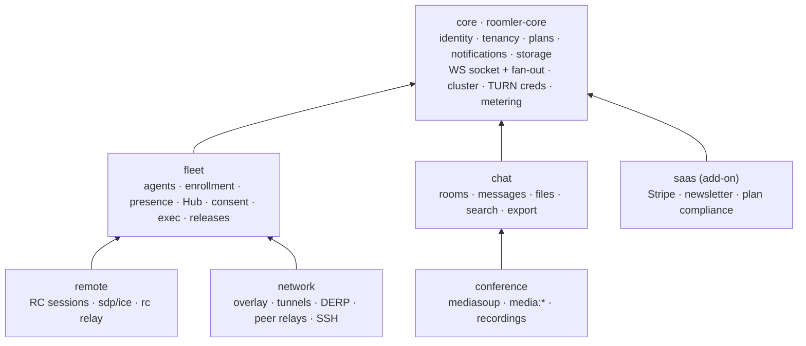

# FR-69: Modular monolith — pillar modules behind `roomler-core`, composed per build profile

**Status**: P0 – P9 shipped (#1309 · #1311 · #1312 · #1315 · #1317 · #1318 · #1320 · #1323 ·
#1325 · #1329 · #1332 · #1336 · #1337 · #1339 · #1340 · #1347 · #1348 · #1351) — **every
pillar is a module, the five profiles build and are checked for what they leave out, the SPA
gates on what the server mounts** · the device-listing composition fix shipped (#1352, proven
on both profile arms #1354) · **AC7 verified on a local `mesh` stack** (`ui/e2e/mesh-profile.spec.ts`; the same PR
stopped the shell calling modules the server does not mount) · **AC5 verified in a local
container cell** (the signed release daemon enrolled and joined the `mesh` image's overlay) ·
AC4 measured · **the first prod roll field-verified 2026-09-05** (`v20260905-1c2753684ab9` of
master `89ea3128`: no dip in online agents, fleet RPC, RC sessions on two carrier classes,
overlay pairs on LAN / srflx / DERP, tunnels, the SSH dispatch, the device listing, every
pillar of the SPA) · **still to see across a real network**: a `mesh` server reached by a
daemon and a browser from another machine, a single-relay overlay pair and a relay-class RC
session ·
**Owner**: server / architecture ·
**Issue**: [#1307](https://github.com/gjovanov/roomler-ai/issues/1307) ·
**PRs**: P0 claim [#1309](https://github.com/gjovanov/roomler-ai/pull/1309) · P0 rename
[#1311](https://github.com/gjovanov/roomler-ai/pull/1311) · P0 contract + baseline
[#1312](https://github.com/gjovanov/roomler-ai/pull/1312)

## Goal

Decouple the server into pillar modules behind one small core, as a **modular monolith**:

- **one core crate** (`roomler-core`) owning identity, tenancy, plans, notifications, storage,
  the WebSocket socket and its fan-out, the cluster bus, TURN credentials and the metering sink;
- **six modules** (`fleet`, `chat`, `conference`, `remote`, `network`, `saas`), each a crate behind
  one uniform `Module` contract, composed by a thin host;
- **compile-time selection** by Cargo features into five named, tested profiles, and
  **runtime discovery** through `GET /api/capabilities`, so one UI build and one daemon work
  against any profile;
- **one repo, one workspace, one image per profile, one SPA, one daemon.** Not services, not
  dynamically loaded plugins.

Delivered strangler-style, one module per PR, with the full profile **provably unchanged** after
every step: a composition baseline (routes and their allowed methods, the index plan, the wire
names) is recorded in P0 and asserted byte-identical after each move.

The wire formats, the database documents, the socket URLs and the daemon's feature set do not
change. This program is about where code lives and what a build links, not about what a byte on
the wire means.

## Evidence (why this exists)

Measured on `origin/master` @ `08ceb7ba` (0.4.59), non-vendored Rust only. The workspace holds
17 member crates plus six vendored forks, about 312 000 lines; the surfaces below are the four
places where the pillars are actually coupled.

| Surface | Today | Consequence |
|---|---|---|
| `roomler-ai-api` | 46 250 lines; `[features] default = []` (`crates/api/Cargo.toml:17`); depends on `mediasoup`, `roomler-ai-tunnel-core` and `roomler-ai-remote-control` unconditionally | Every server build compiles every pillar. |
| `AppState` | **83** public fields (`crates/api/src/state.rs:58`), a 1 497-line file; **216** `State<AppState>` and **206** `&AppState` sites | Every handler takes everything; the crate recompiles as one unit. |
| `build_router` | `crates/api/src/lib.rs:94–882`, ~790 lines nesting 48 route files (24 072 lines) | Every route in the product is edited in one function. |
| WebSocket | `ws/` 14 747 lines; one upgrade with a role gate (`ws/handler.rs:68`) for user, agent and tunnel-client; the user socket dispatches typing, presence, `media:*` and `rc:*` (`handler.rs:661`, `:777`, `:695`); ~750 lines of media signalling inline from `handler.rs:895`; `overlay.rs` 3 330 · `remote_control.rs` 2 507 · `tunnel.rs` 1 948 · `org_relay.rs` 1 019 · `derp.rs` 1 002 | The socket and gate are the right shape; only the arms need to move. |
| Media | `crates/services/src/media/` (1 047 lines) is the only mediasoup consumer, yet `services/Cargo.toml` links `mediasoup` unconditionally; `mediasoup-sys 0.10` **compiles the C++ worker from source** during `cargo build` (pip → meson → ninja — the reason the Dockerfile installs `cmake` and `python3-pip`) | The single largest build-time lever for any profile without conferencing. |

Two more measurements shaped the design rather than motivating it:

- **The agent Hub is a fleet object.** `crates/remote_control/src/hub.rs:227` is used from 18
  files; by reference count the heaviest consumers are the tunnel WS (14), RC signalling (10),
  state (7), RC routes (5), the RC relay (3), then overlay, exec, SSH grants, org relay, presence,
  consent and cluster metrics. It is the device control-plane multiplexer, not a remote-desktop
  object — which is why device management becomes a module of its own (D3).
- **The wire already groups by pillar.** `ClientMsg`/`ServerMsg`
  (`crates/remote_control/src/signaling.rs:248`, `:1221`) carry ~134 variants; the `rc:` names
  group as tunnel 35 · overlay 18 · agent 8 · rpc 5 · ssh 4 · sdp 4 · relay 4 · session 3 ·
  consent 3. The namespaces map onto modules without touching a byte (D7).

And two facts that make the program cheaper than it looks:

- the auth extractors are **already generic** over the state type: `AuthUser` and `AuthAgent` take
  any `S` where `AppState: FromRef<S>` through a local `FromRef` trait
  (`crates/api/src/extractors/auth.rs:22–25`, `:78`; `agent.rs:99`) — the state split only moves
  that bound (D5);
- every `TenantSettings` field is `#[serde(default)]` (`crates/db/src/models/tenant.rs:79`), so
  a build without a module ignores that module's fields and **no document migration is needed**
  (D8).

## Decisions taken by the operator (2026-09-04)

The five open questions in the plan were answered before P0 started:

1. **Rename `agent-core` so the server core can take `roomler-core`.** The daemon's shared crate
   becomes **`roomler-node-core`** — FR-21 D3 already described it as "the node's shared core,
   not the daemon's", and the crate's pre-FR-21 name is one FR-21 **retired**, which
   `scripts/name-audit.sh --strict` rejects on sight. The directory stays `crates/agent-core`.
2. **`saas` is extracted in this program**, as an add-on feature over any profile (never in a
   published self-host image).
3. **Five profiles**: `full`, `collab`, `remote`, `mesh`, and `access` = fleet + remote +
   network, no collaboration.
4. **SSH lives in `network`** (it rides the overlay netstack: `ssh-server` implies
   `overlay-netstack` in the daemon).
5. **P0 now; P1 on a trigger** — build times hurting the loop, a buyer wanting a single-pillar
   deployment, or a marketplace listing wanting the reduced-surface image.

## Key design (anchors verified against `origin/master` @ `08ceb7ba`)

Each decision lists what was considered, the trade-off, and why. IDs are referenced from the
phase table.

### D1 — Shape: a modular monolith, not services and not dynamic plugins

Considered: keep the monolith · **modular monolith** · microservices · dynamic plugins
(`.so` / `abi_stable` / WASM).

- *Pros*: build isolation per crate; deployable profiles that match how the product is sold;
  a smaller trust surface per profile (a `mesh` image ships no Giphy, Stripe or SendGrid client;
  a `collab` image has no agent socket at all); bounded contexts for agentic development; open-core
  optionality as a crate-visibility decision later; **no operational change** — the tenant-affinity
  LB, the two-pod layout, ArgoCD and the self-host compose file stay as they are.
- *Cons*: up-front mechanical churn (the 216 + 206 sites, the router, the WS arms, the index
  list); 2ⁿ feature combinations to keep honest; a core that grows if its membership rule is not
  enforced; deferred value while go-to-market is running.
- *Why*: services fail on the product's own invariants — the tenant-affinity LB co-locates a
  tenant's users, agents, DERP sockets and mediasoup rooms on one pod because the rc-hub,
  tunnel-hub, DERP relay and room registry are pod-local (`docs/multi-pod-scale-out.md`);
  splitting processes turns those into network calls and doubles the ops story for the buyer whose
  reason to self-host is "one container"; and the control plane must never become a data path.
  Dynamic plugins fail on Rust itself: no stable ABI, and WASM cannot touch mediasoup, WebRTC or a
  TUN device. Nothing in the product needs third-party plugins.

### D2 — Names: `roomler-core` for the server core, `roomler-node-core` for the daemon's shared crate

- `crates/core` → package **`roomler-core`**, lib `roomler_core`, AGPL-3.0-only (server side).
- `crates/agent-core` → package **`roomler-node-core`**, lib `roomler_node_core`, MPL-2.0
  (unchanged licence, unchanged directory). Until this FR it was `roomler-core` (FR-21 P2a).
- Module crates → `crates/modules/<name>` = package **`roomler-ai-mod-<name>`**, lib
  `roomler_ai_mod_<name>`. The `mod-` infix marks the layer and keeps `roomler-ai-mod-remote`
  from being confused with the existing `roomler-ai-remote-control` wire crate.
- *Cons accepted*: the server-side prefix `roomler-ai-*` is a **side** marker, not a licence
  marker (`roomler-ai-remote-control` and `roomler-ai-tunnel-core` are MPL because agents link
  them); `scripts/licence-classes.sh` is the source of truth and gains both new names.
- *Why*: the operator's call (decision 1). The rename is one mechanical PR, and it buys a free
  structural guard: the licensing workflow asserts that no `SERVER_CRATES` entry appears in any
  shipped agent's dependency graph, so `roomler-core` **cannot** leak into `roomlerd` without CI
  failing (AC10).

### D3 — Boundaries: one core, six modules

| Unit | Owns |
|---|---|
| `core` | identity, tenancy, roles, invites, plans and quota, notifications, email, push, OAuth, storage, the `/ws` socket with its storage, dispatcher and Redis fan-out, cluster bus and pod identity, TURN credentials and relay load, the metering and audit sinks, rate-limit primitives |
| `fleet` | agents, enrollment keys, presence and its tokens, the agent Hub and the agent socket role, crash and log ingest, releases and installer proxies, consent, remote config, exec and its audit |
| `chat` | rooms, members, messages, reactions, files, search, export, Giphy |
| `conference` | mediasoup (`services/media` moves here), `media:*`, the media cluster, recordings, call sessions |
| `remote` | RC sessions and audit, controller `rc:*` dispatch, SDP, ICE, session lifecycle, the RC relay and proxy controllers |
| `network` | overlay networks, nodes, policies, blocks and MagicDNS; tunnels, their policies and audit; the `/derp` endpoint, registry, ACL and cluster; peer and org relays; key rotation; **SSH** grants, audit and activity; ephemeral nodes |
| `saas` | Stripe, newsletter and subscribe, plan compliance, platform admin stats |

Considered: four pillar modules with device management in core · **fleet as its own module** ·
one "devices" module for remote + network.

- *Pros*: a `collab` profile has no device surface at all; core stays about identity, tenancy and
  infrastructure — the membership rule is **"in core only if at least two modules need it and it
  is identity, tenancy or infrastructure"**; `remote` and `network` become independent of each
  other, which is what makes the `remote` and `mesh` profiles real.
- *Cons*: one more crate; module-to-module edges (`conference → chat`, `remote → fleet`,
  `network → fleet`), so modules are a DAG, not peers; some placements are judgement calls.
- *Why the gray areas went where they did*: the Hub's consumers place it in `fleet`. SSH rides the
  overlay netstack, so `network`. Exec deliberately rides the control socket, not the mesh, so
  `fleet`. Consent is one prompt payload for RC, exec and SSH since FR-27, so `fleet`. TURN
  credentials are consumed by RC, tunnels **and** mediasoup ICE (the blank `turn.url` incident was
  a conference outage), so `core`. Recordings → `conference`; files → `chat`. Stats, usage and cost
  are a core **metering sink** so "bill only on server-measured bytes" has one owner and modules
  write through it. Stripe and the newsletter exist because roomler.ai is a hosted product, so
  `saas`.

Where the 83 `AppState` fields go (the P1 checklist; counts add up to 83):

| Module | Fields | `AppState` fields |
|---|---:|---|
| `core` | 27 | `db settings auth users activation_codes tenants invites roles notifications oauth email push push_subscriptions used_tokens redis_pubsub redis_sub_alive ws_storage storage stats platform_admins geoip pod cluster_directory cluster_bus turn_map relay_load tasks` |
| `fleet` | 14 | `agents enrollment_keys agent_crashes agent_logs consent_requests rc_hub agent_presence_tokens presence_fanout agent_nudge_cooldowns agent_nudge_throttle exec_audit config_audit exec_rate_limiter releases_cache` |
| `chat` | 5 | `rooms messages reactions files giphy` |
| `conference` | 4 | `room_manager recordings media_claim_tokens remote_media_conns` |
| `remote` | 4 | `remote_sessions remote_audit rc_proxy_controllers remote_rc_conns` |
| `network` | 26 | `tunnel_clients tunnel_policies tunnel_audit tunnel_clients_by_session tunnel_sessions_by_target_agent tunnel_sessions_by_origin_agent tunnel_presence_tokens overlay_networks overlay_nodes overlay_policies overlay_nodes_by_id derp_registry derp_acl derp_cancels derp_presence_tokens derp_rehome_cooldowns derp_ticket relay_pair_churn org_relay peer_relay_audit key_rotation_audit key_rotation_rate_limiter ssh_audit ssh_activity ssh_rate_limiter relay_rate_limiter` |
| `saas` | 3 | `subscribers newsletter_issues newsletter_sends` |

Two placements to **re-check in P5 rather than assume**: whether the agent hello in
`ws/remote_control.rs` needs `tunnel-core` types (if so, those wire types move to the signalling
crate so `fleet` never links `tunnel-core`), and whether `relay_routes` is TURN-region
infrastructure (`core`) or peer-relay policy (`network`).

### D4 — Contract: a `Module` trait, statically composed, with a runtime switch per module

```rust
pub trait Module: Sized + Send + Sync + 'static {
    const ID: &'static str;
    async fn init(core: Arc<Core>, settings: &Settings) -> anyhow::Result<Self>;
    fn enabled(settings: &Settings) -> bool;        // [modules] <ID> = false unmounts it (P1)
    fn capabilities(&self, t: &TenantCtx) -> Capabilities;
    fn routes(&self) -> Router;                     // under /api and the governor; state applied
    fn unlimited_routes(&self) -> Router;           // outside the governor (Stripe webhook)
    fn ws(&self) -> WsRegistration;                 // (Role, Namespace) -> handler; extra upgrades
    fn indexes(&self) -> Vec<IndexSpec>;
    fn jobs(&self) -> Vec<Job>;                     // leader-gated maintenance + periodic sweeps
    fn hooks(&self) -> Hooks;                       // tenant archived, member removed, agent removed
    async fn shutdown(&self);
}
```

Considered: **trait + `#[cfg(feature)]` composition in the host** · a runtime
`Vec<Box<dyn Module>>` · link-time registries (`inventory`, `linkme`) · conventions only.

- *Pros*: exhaustive at compile time (a module that forgets its indexes, jobs or hooks does not
  compile); no object-safety constraints, so `async fn` in the trait is fine; zero runtime cost;
  the runtime switch is a **real kill switch** — a module can be unmounted on a live pod during
  the roll that introduced it, without a rebuild.
- *Cons*: the host's `compose.rs` is edited once per module; a disabled-at-runtime module still
  links (that is what profiles are for).
- *Why*: the module set is fixed at build time, so a dynamic list buys nothing and loses
  exhaustiveness. The defensive catch-all hazard documented in `CLAUDE.md` is the failure mode of
  an open set; a closed set the compiler can see is the structural fix.

### D5 — State: per-module state structs; extractors bound on `Core: FromRef<S>`

Considered: one `AppState` with `Option<…>` fields under cfg · **per-module state +
`FromRef`** · a generic `AppState<M>`.

- *Pros*: each handler sees only its module's state and the god struct disappears; the extractor
  change is small because `AuthUser`, `OptionalAuthUser` and `TenantId` are already generic over
  `S` (only the bound moves from `AppState` to `Core`); `AuthAgent` moves to `fleet` because it
  loads the agent row; the membership guards in `routes/helpers.rs` split the same way
  (`is_member` → core, `require_room_in_tenant` / `require_message_in_tenant` → chat).
- *Cons*: mechanical churn across 216 + 206 sites (pure signature work, the bulk of P1);
  helpers that took `&AppState` to reach two pillars at once must be rewritten as hooks (D6).
- *Why*: `Option` fields keep every handler compiling against everything and turn every
  `.expect()` on an absent module into a runtime panic in a profile nobody tested; a generic state
  type infects every signature with a parameter for no gain.

### D6 — Cross-module edges: a DAG for calls, core-owned hooks for the inverse direction

Allowed calls: any module → core; `conference → chat`; `remote → fleet`; `network → fleet`;
`saas → core`. Forbidden: core → module, `chat ↔ remote`, `chat ↔ network`, `remote ↔ network`.

Inverse flows that exist today and become hooks: tenant archive releases every overlay node
(`routes/tenant.rs:201`) and touches rooms and sessions; the agent delete cascade
(`routes/remote_control.rs:1048`) terminates sessions and releases the overlay lease; ephemeral
reaping releases leases (`ws/ephemeral.rs:86`); presence changes fan out as `device:presence`.

Considered: direct calls (forces core → module edges) · **typed hook traits registered at init,
invoked synchronously in a fixed order** · an asynchronous Redis event bus.

- *Pros*: in-process, ordered — the cross-module order (remote terminates → network releases →
  fleet tombstones) is written once, in core; load-bearing orders inside a module stay inside it
  (`release_overlay_node`'s read peers → CAS tombstone → pool host → fan-out never leaves
  `network`, `ws/overlay.rs:1372`); a hook a profile does not compile is a no-op.
- *Cons*: ordering is a convention enforced by one function, not by types; hooks must be
  idempotent because a cascade can be re-run after a crash mid-way (already true today).
- *Why*: eventual consistency on a cascade that must not pool an address before its tombstone is
  the bug class the overlay IPAM paid for. Redis fan-out stays for notifications and presence; it
  is wrong for ownership transfer.

### D7 — WebSocket: one socket, one role gate, namespace-routed handlers, a byte-identical wire

Core keeps the `/ws` upgrade, the role gate, the `tid` affinity check, connection storage, the
dispatcher primitives and Redis fan-out (`ws/handler.rs:68–120`, `ws/dispatcher.rs`,
`ws/storage.rs`, `ws/redis_pubsub.rs`). Modules register handlers per (role, namespace).
`ClientMsg::namespace()` is an **exhaustive match** that assigns every variant an owning module.
`/derp` registers through `WsRegistration` as an extra upgrade endpoint owned by `network`; the
media handlers leave `handler.rs` for `conference`.

Considered: one socket per module (`/ws/chat`, `/ws/rc`, …) · **one socket, exhaustive
namespace map** · keep the 1 718-line handler.

- *Pros*: zero wire change — agents in the field dial `/ws?role=agent`, and the front LB pins
  `location = /ws` and `/derp` with `proxy_next_upstream off` and `max_fails=0`; that
  infrastructure is untouched. The exhaustive map is the structural replacement for the `_ =>`
  catch-all hazard: a new variant does not compile until it names an owner.
- *Cons*: the wire enum stays in `roomler-ai-remote-control` (MPL, agent-linked) and is compiled
  into every profile — types only, since `mongodb` is already behind its `server` feature and the
  Hub leaves the crate in P5, which makes it wire-only. Namespace and owner do not always agree
  by prefix (`rc:consent.*` is fleet, `rc:relay.*` is network), so the map is explicit per
  variant and locked by a unit test in the style of `rpc_cap_wire_strings_are_locked`.
- *Why*: moving handlers is cheap; moving an endpoint is a fleet migration across every release
  in the field.

### D8 — Data: DAOs and indexes move with their module; documents stay; capabilities are computed

Each module owns its DAOs and contributes `IndexSpec`s that core applies in registration order.
`TenantSettings` and `Plan` stay in core with their serde defaults; `multi_block` becomes a
parameter of the network module's `indexes()`.

Considered: reshape `tenants` into per-module sub-documents · **keep documents; move ownership;
compute capabilities per request**.

- *Pros*: zero migration and zero index churn — the index plan is part of the P0 baseline and
  diffed byte-for-byte; `Capabilities` = compiled modules ∩ runtime-enabled ∩ plan limits and
  flags ∩ tenant settings, so "disabled by build" and "disabled by plan" hit one check path.
- *Cons*: core's `TenantSettings` carries `remote_exec_enabled`, `remote_ssh_enabled`,
  `magic_dns_*` even in a `collab` build (dead fields, harmless); collection names remain global,
  so core asserts at boot that no two modules registered the same collection.
- *Why*: a live migration on the tenancy root for cosmetic grouping is risk with no user-visible
  return; the serde defaults already give the property the sub-documents would have bought.

### D9 — Profiles: seven features on the host, five tested profiles, one add-on

`roomler-ai-api` gains features `chat`, `conference = ["chat"]`, `fleet`, `remote = ["fleet"]`,
`network = ["fleet"]`, `saas`, and the aggregates `profile-full`, `profile-collab`,
`profile-remote`, `profile-mesh`, `profile-access`; `default = ["profile-full"]`.
`services/media` moves into `conference`, so `mediasoup` leaves `services`; `tunnel-core` becomes
a dependency of `network` only.

| Profile | Features | Product story | Needs | Skips |
|---|---|---|---|---|
| `full` | all pillars (default) | the thesis | Mongo, Redis, MinIO, coturn, RTC range | — |
| `collab` | `chat`, `conference` | Teams | Mongo, Redis, MinIO, coturn, RTC range | tunnel-core, agent socket, DERP, installers |
| `remote` | `fleet`, `remote` | TeamViewer | Mongo, Redis, coturn | mediasoup worker build, MinIO, tunnel-core |
| `mesh` | `fleet`, `network` | Tailscale | Mongo, Redis, coturn, DERP PoPs | mediasoup worker build, MinIO |
| `access` | `fleet`, `remote`, `network` | TeamViewer + Tailscale, no collaboration | Mongo, Redis, coturn, DERP PoPs | mediasoup worker build, MinIO |

`saas` is **an add-on over any profile**, never part of one: the hosted deployment builds
`profile-full` + `saas`; the published self-host images never carry it, which is the point of
extracting it — a self-hoster's image stops shipping a Stripe webhook and a newsletter.

- *Pros*: any profile without `conference` skips the C++ worker build, the longest step in the
  Docker build; each profile maps to a product story and to a compose file a self-hoster can
  read; mirrors the discipline `roomlerd` already has (`default` / `media` / `full` / `full-hw`).
- *Cons*: feature unification — `cargo clippy --workspace` compiles the union, so profile checks
  must run per package (D13); five profiles is five images if all are published.
- *Why*: hiding by config keeps the mesh buyer's image carrying a Giphy client, and keeps the
  build compiling the worker for a server that will never open a call. Sixteen combinations is a
  matrix nobody runs; the five named here each answer a real deployment question.

### D10 — Runtime discovery: `GET /api/capabilities`

Unauthenticated: `{ version, modules: […] }`. With a tenant: the plan-and-tenant-gated map per
module, also mirrored into the existing `/api/auth/me` response. `/health` lists `modules`.
Consumers: the SPA (nav and routes), `roomlerd` (a `mesh` server never receives RC offers), the CLI.

- *Pros*: one UI build works against any server; a fleet-versus-server mismatch is explicit and
  logged instead of a blank page; profile smoke tests have something to assert.
- *Cons*: one more request at boot (avoided by the copy in `/api/auth/me`); a new public surface
  that must stay a module list and nothing else when unauthenticated.
- *Why*: a JWT would freeze capabilities for seven days; a 404 tells the UI nothing about why.

### D11 — UI: module folders inside one SPA; runtime gating mandatory, build-time pruning optional

`ui/src/modules/<m>/index.ts` exports `{ routes, nav, stores, wsHandlers, i18nNamespace }`;
`modules/registry.ts` assembles them; `VITE_MODULES` prunes at build time; `/api/capabilities`
gates at runtime; the `stores/ws.ts` handler registry generalises from `media:` and `rc:` to
every prefix. No micro-frontends, no module federation, one `bun run build`, one Playwright suite.

- *Pros*: `views/` and `stores/` are already domain-sliced, so this is a re-fold; route-level lazy
  chunks already keep unused modules out of the initial bundle, so build-time pruning is an
  optimisation, not a requirement.
- *Cons*: `stores/ws.ts` (468 lines) is load-bearing — the multi-subscriber `rc:*` fix lives
  there — so generalising its registry needs the existing Vitest coverage plus a test per
  prefix; the single `en.json` stays one file with namespaced keys.
- *Why*: one deploy artifact is the product; module federation adds a runtime loader, a second
  build and CSP work for zero user value, and the CSP has already bitten once (#252).

### D12 — Config: one `Settings`; modules own sections; warn on configured-but-absent

`roomler-ai-config` stays whole (930 lines, `crates/config/src/settings.rs`). Each module reads
its section. At boot, core logs a WARN for any non-default section whose module is not compiled
(`ROOMLER__MEDIASOUP__*` on a `mesh` image). P1 adds one section, `[modules]`, holding the
per-module runtime switches.

- *Pros*: zero configmap churn; config is parseable before any module exists, which the startup
  order needs.
- *Cons*: a profile cannot **reject** configuration it does not use — WARN is the honest level
  (absent is not off, and a configmap-only change does not restart pods).

### D13 — Build, CI, release, versioning

- One `Dockerfile` with `ARG PROFILE=full` (and `ARG SAAS=0`) →
  `cargo build … --no-default-features --features profile-$PROFILE[,saas]`. Image tags stay
  `roomler-ai:<tag>` for `full` and add `-collab`, `-remote`, `-mesh`, `-access`.
- `publish-selfhost-image.yml` gains a `profile` axis: `full` on every tag; the others on dispatch
  until a trigger (each is a separate ~20-minute build).
- `ci.yml` gains a `profiles` job: `cargo check -p roomler-ai-api --no-default-features
  --features profile-<p>` for the five profiles plus `cargo tree` assertions (AC3), sharing the
  cache. The integration lane stays on `full`. The existing "the image must actually serve" smoke
  in the publish workflow becomes the per-profile boot test (`/health` modules,
  `/api/capabilities`).
- The workspace version `0.4.<n>` stays; no per-module semver — nothing is published to
  crates.io, and the field artifacts (daemon, image) already carry one version.
- *Cons accepted*: `check` is not `test` for the reduced profiles; modules are tested in `full`,
  and profile-specific defects are composition defects, which the boot smoke catches.

### D14 — Daemon: code modularity later; build modularity already exists

No `roomlerd` change in P0–P9. A later phase (its own FR) introduces a `Subsystem` trait and
peels `main.rs` (5 199 lines) into `subsystems/{control_ws, overlay, tunnels, rc, ssh, updater}`;
`peer.rs` (10 562 lines) stays untouched. The daemon's profiles (`default` signalling-only,
`media`, `full`, `full-hw`, the overlay features, `ssh-server`; `roomler-cli` as the tunnel-only
binary) already deliver the product property. It is the fleet blast radius and is mid-arc on
FR-59, FR-63 and FR-65.

### D15 — Sequencing: strangler, one module per PR, the composition baseline as the gate

Every PR is pure moves plus signature changes. The gate is (1) the composition baseline
(`crates/tests/fixtures/composition.baseline.json`, asserted by
`composition_tests::composition_matches_baseline`), (2) the integration lane at its floor with
the same two skips, (3) a prod roll verified from the fleet (`roomler exec` sweep, server-side
presence counts, the e2e nightly). The kill switch for the PR that introduced a module is its
`[modules]` switch; the kill switch for P1 is a revert.

The baseline records, for the `full` profile:

- **routes**: every path with its allowed methods, read from the built router (axum's `Router`
  Debug output exposes `route_id_to_path` and each `MethodRouter`'s `allow_header`; the parser
  is self-tested against the pinned axum so a format change fails loudly);
- **indexes**: the index plan for both `multi_block` values — every collection, every
  `IndexModel`, and the pre-creation ops (the `network_id_1` drop) — from
  `roomler_ai_db::indexes::index_plan`, which `ensure_indexes` applies unchanged;
- **wire**: every `#[serde(rename = "…")]` name in `ClientMsg` and `ServerMsg`, in source order.

Deliberately **not** baselined: settings keys (the config crate is untouched by the program, D12)
and the WS namespace map (it exists from P5; it is baselined when it does). The baseline is
updated only with `COMPOSITION_UPDATE=1` and a commit message that says why; a reviewer diffs it.

- *Pros*: each PR reverts cleanly; "nothing changed" becomes a checked claim instead of a
  reviewer's impression — the lesson of the bson `is_human_readable` round-trip and the README
  link that led to a page nobody could open.
- *Cons*: a few weeks of two ways to do things in the tree; each PR must land fast or it accrues
  rebase debt against a busy master.
- *Why*: a stale branch silently reverted a merged, field-verified fix once already (#1144 vs
  #1142), with green CI and no conflict. A months-long refactor branch invites exactly that.

### D16 — Don'ts

Do not split the repository (the app + deploy pair is enough); do not split processes; do not
load anything dynamically; do not give modules their own versions; do not reshape tenant
documents; do not change any wire (`rc:*`, LocalAPI, the netmap, the socket URLs); do not touch
`peer.rs`; do not bring back the daemon crate's pre-FR-21 retired name.

### The dependency graph



## Phases

Estimates are calendar days for one operator directing the agent fleet, contiguous; the
strangler order spreads them across releases. Order is fixed by the graph: `fleet` before
`remote` and `network`; `chat` before `conference`. `saas` goes first among the modules because it
is the smallest and exercises the whole contract (`unlimited_routes` for the Stripe webhook,
`jobs` for the newsletter sends) at the lowest risk.

| Phase | Delivers | Gate | Kill switch | Complexity | Days |
|---|---|---|---|---|---:|
| **P0** ✅ | FR claimed; `agent-core` → `roomler-node-core`; `crates/core` (`roomler-core`) contract types; composition baseline + test — #1309, #1311, #1312 | CI green; baseline committed and reproducible (recorded by the lane itself, see the field log) | none needed (docs + a rename + an unused crate) | low | 2–3 |
| **P1** ✅ | `Core` extraction, state split, `[modules]` settings, `GET /api/capabilities` — P1a #1315 (the split, in place), P1b #1317 (the move into `roomler-core`), P1c + P1d #1318 (core-owned handlers on `State<Core>`; `ApiError`, cookies, origin and the core extractors below the api crate) | baseline identical (P1a: +1 route, intended); integration lane; prod roll | revert | high | 5–8 |
| **P2** ✅ | `saas` module — #1320: the first module crate, plus the host composition (`crates/api/src/compose.rs`) that mounts it | baseline identical (index sets re-sorted, intended); integration lane; prod roll | `[modules] saas = false` (real from this PR on) | low | 1–2 |
| **P3** ✅ | `chat` module — #1323: rooms, messages, reactions, files, search, export, Giphy, the unread summary, and `typing:*` as the first module-owned WebSocket namespace; the call endpoints stay in the host as `routes/call.rs` for P4 | baseline identical; integration lane (the tenant-scoping tests included); prod roll | `chat = false` | medium | 2–3 |
| **P4** ✅ | `conference` module — #1325: the SFU room manager + worker pool (from `services/media`), the media cluster, the sampler, the call lifecycle, recordings, and `media:*` as a module namespace; **mediasoup links in this one crate only**; the contract's stateful surfaces used for the first time (`WsHandler::closed`, `Module::jobs` under the host's startup lease, `Module::shutdown`) | baseline identical; integration lane; prod roll. AC4's Docker measurement waits for the profiles (P8) — the mechanism is in place | `conference = false` | medium | 3–4 |
| **P5a** ✅ | `fleet` module — #1329: the Hub out of `remote_control`, `AuthAgent`, every fleet HTTP path, presence, the nudge machinery, consent and its consumer, the removal sequence; `Core.hooks` (the D6 registry) with the host's transitional `network` hooks so the agent cascade already runs in `HOOK_ORDER`. The agent socket stays in the host on `Arc` aliases of the module's handles | baseline identical; integration lane; prod roll | none — `fleet` is a required dependency until the socket moves; `fleet = false` refuses to boot | high | 2–3 |
| **P5b** ✅ | #1332 — `Owner { Fleet, Remote, Network }` + the exhaustive `ClientMsg::namespace()` and `wire_tag()` matches + the 44-entry `CLIENT_MSG_OWNERS` table in the wire crate, locked four ways (the enum's own renames, the match on buildable variants, the D7 placements, the module graph); the composition baseline gained a `namespaces` section | baseline re-recorded for the new section only — routes, index sets and wire names byte-identical | none (a pure function) | low | 1 |
| **P5c** ✅ (CI) | the agent socket into `fleet` (`roomler_ai_mod_fleet::socket`) behind `Core::agent_socket` — per-owner message handlers + per-module lifecycles (`hello` / `heartbeat` / `closing` / `closed(removal_was_ours)`), dispatch by `ClientMsg::namespace()`; the host registers its `remote`/`network` halves transitionally (`ws/agent_socket_host.rs`). The `AppState` aliases and the required dependency STAY until the host code that reads them moves (P6/P7) | baseline identical; integration lane; **prod roll with no dip in online agents — not yet run** | redeploy previous tag | high | 3–4 |
| **P6** ✅ (CI) | `remote` module (`crates/modules/remote`, feature `remote`, in `default`): the session routes + TURN credentials + relay regions, the controller's `rc:*` dispatch with its authz gate (`controller.rs`), the cross-pod RC relay (`relay.rs`), the session-stats agent-socket half. `Module::Deps` is born here: `remote`'s is `FleetState` (the Hub is one live object), supplied by the host in composition order. The host keeps the user socket and calls `Modules::remote_controller_frame` with the connection's Hub sender | baseline identical; integration lane; **one RC session per carrier class on a prod roll — not yet run** | `remote = false` | medium | 2–3 |
| **P7a** ✅ (CI) | `network` module, part one (`crates/modules/network`, `NetworkState` built on `FleetState`): the engine (`overlay.rs`, `org_relay.rs`, `derp_acl.rs` + the DERP registry types), the seven route files + the per-device sub-routes at the host's old paths, the hooks (`NetworkHooks`), the eleven index sets through `Module::indexes_for(multi_block)` (born here); `is_global_unicast` and the TURN builders moved to core first. `network` REQUIRED: the host's sockets reach the engine through `AppState::network()`. Field log: "P7a" | baseline identical; integration lane; **overlay/tunnel field sweep on a prod roll — not yet run** | previous tag | high | — |
| **P7b** ✅ (CI) | the sockets (the tunnel-client upgrade + loop, `/derp` as the module's `UpgradeSpec`, the DERP cluster + census + usage flush, the ephemeral reaper, the agent-socket network half + the rest of `ws/remote_control.rs`) and the agent upgrade into `fleet` — the host keeps the role gate and calls `Modules::agent_upgrade` / `tunnel_client_upgrade` (503 when unmounted); the `AgentBusy` query hook (a reason, not a bool); the tenant archive through `TenantLifecycle`; the local gauges through `fleet_gauges` / `network_gauges`; the device listing into `network` (a two-module view); **`AppState` is `{ core, modules }`**; `fleet` + `network` are features. Field log: "P7b" | baseline identical; integration lane; **overlay/tunnel field sweep on a prod roll — not yet run** | `network = false` / `fleet = false` (unmounts now) | high | — |
| **P8** ✅ (CI) | profiles: `profile-full` … `profile-access` as feature aggregates on the api crate (`default = ["profile-full", "saas"]`, `conference` implies `chat`); `ARG PROFILE` + `ARG SAAS` on the Dockerfile with package-qualified features; `/health` + `/api/capabilities` report the MOUNTED set (+ `compiled`); the `profiles` job in `ci.yml` (four reduced profiles `cargo check`ed + the AC3 `cargo tree` assertions with a positive control); the `profile` input on the self-host publish (tag `<tag>-<profile>`, `SAAS=0`, the boot smoke asserts the module set, `latest` reserved for full); compose/env passthrough; self-host + deployment docs. Field log: "P8" | the five checks green; `mesh` image boots — the smoke half of AC5; the "a daemon enrolls against it" half is a vmtest cell still to run | `full` stays default; the hosted build passes no args | medium | — |
| **P9** ✅ (CI) | UI module registry (`ui/src/modules/registry.ts`: the six module ids, `VITE_MODULES` build-time pruning, the graph's dependency closure) + runtime gating: a `capabilities` store that asks `GET /api/capabilities` once per page load and answers `has(module)` (bundle AND server, fail-OPEN until the server has answered), `meta.module` on every pillar route with a second router guard that awaits the answer and lands a refused route on the org dashboard, and the layout + tenant dashboard hiding what the server does not mount. Field log: "P9" | Vitest (the store + registry: 10 cases; the full suite); `bun run build`; the e2e nightly against `full` unchanged by construction (no path moved). **AC7's "full UI against a `mesh` server" half is a field check still to run** | `VITE_MODULES` unset (the published bundle carries everything; the runtime gate alone decides) | medium | — |
| later | `roomlerd` `Subsystem` trait — its own FR, after FR-59/63/65 settle | fleet roll + FR-61 matrix | release revert | high | 5–8 |

**P0 in detail** (three PRs, merged in this order):

1. *Claim* — this spec, the ledger row, the ADR section in `docs/architecture.md`.
2. *Rename* — `crates/agent-core` package `roomler-core` → `roomler-node-core` (lib
   `roomler_node_core`); consumers `roomlerd` and `roomler-desktop`; the two comments in
   `remote_control/src/models.rs` and `tunnel-core/src/policy.rs`; `scripts/licence-classes.sh`;
   FR-21's naming record gains a dated note. Directory unchanged.
3. *Contract + baseline* — `crates/core` with the `Module`, `Hooks`, `WsRegistration`,
   `IndexSpec`, `Job`, `Capabilities` types and no behaviour; `roomler_ai_db::indexes::index_plan`
   (a behaviour-preserving refactor of `ensure_indexes`); `roomler_core::composition` (the route
   and wire extractors, self-tested); `composition_tests` + the baseline JSON;
   `scripts/licence-classes.sh` gains `crates/core` / `roomler-core` on the SERVER side.

## Acceptance criteria

- [x] **AC1** The `full` profile's composition snapshot is identical to the P0 baseline after
      every module PR (P1–P7). — Asserted by the lane on every module PR (P1a–P7b, then P8)
      against `crates/tests/fixtures/composition.baseline.json`; the one re-record was the
      intended `/api/capabilities` addition in P1 (routes · both index plans · wire names ·
      namespaces otherwise byte-identical throughout).
- [x] **AC2** The integration lane holds its floor with the same two skips through P1–P8. —
      407 passed / 0 failed on the P7a, P7b and P8 PR merge refs (runs 33908175773,
      33914646001, 33916479511), zero leaked databases; the two skips unchanged.
- [x] **AC3** `cargo tree` shows `remote`, `mesh` and `access` link neither `mediasoup` nor
      `mediasoup-sys`, and `collab` does not link `roomler-ai-tunnel-core`. — Measured by the
      `profiles` CI job on #1348: `profile-remote` 411 crates, `profile-mesh` 471,
      `profile-access` 472 (no `mediasoup`), `profile-collab` 433 (no tunnel-core); the
      positive controls found both crates in the full graph. Re-asserted on every PR.
- [x] **AC4** Docker build time for a non-conference profile is measured against `full`, before
      and after, and recorded in the field log. — Publish dry-runs on master `618c763e`
      (amd64, cold cache, one sample each): `full` 17 min 35 s / 204 MiB, `mesh` 13 min 39 s /
      173 MiB — 22 % shorter, 15 % smaller. Field log: "after P9".
- [x] **AC5** A `mesh` image boots with Mongo, Redis and coturn only; `/health` lists `fleet`
      and `network`; a daemon enrolls and joins the overlay against it (a vmtest cell). — The
      smoke half held on the `mesh` dry-run (Mongo + Redis only, `/health` →
      `modules: ["fleet","network"]` in 20 s, the SPA served); the daemon half in a local
      container cell (2026-09-05): the signed `roomlerd 0.4.65` enrolled, sent its hello,
      joined the overlay as `100.65.0.1` in userspace netstack mode and registered on the
      network module's `/derp` — the device listing and the overlay node list both showed it
      online. Field log: "AC5, the daemon half". Still to see: the same across a real network.
- [x] **AC6** Every `ClientMsg` variant has an owner in the namespace map, enforced by an
      exhaustive match and a locked test. — P5b #1332: `ClientMsg::namespace()` is exhaustive
      (a new variant does not compile until it names an owner), `CLIENT_MSG_OWNERS` is checked
      against the enum's renames read from the source, and the baseline snapshots the table.
- [x] **AC7** The full UI against a `mesh` server shows no chat or conference navigation and no
      console errors; against `full` the e2e nightly is unchanged. — The first half on a
      local `mesh` stack built from source (`ui/e2e/mesh-profile.spec.ts`: no collaboration
      tiles, actions or navigation, the chat deep-link refused, the devices listing 200, zero
      console errors and zero failed `/api/` calls — after the three shell fixes it caught);
      the second half by construction (the spec skips itself where `chat` is mounted) and
      confirmed by the next nightly. Field log: "AC7 on a local `mesh` stack". Still to see:
      the same against a `mesh` server across a real network.
- [x] **AC8** Every phase's prod roll is field-verified from the fleet and recorded in the field
      log, wrong turns included. — The modular server's first prod roll:
      `v20260905-1c2753684ab9` of master `89ea3128` (every phase, P0–P9 and the device-listing
      fix, in one image), deployed 2026-09-05 08:49 UTC, both pods with all six modules mounted
      and zero errors; verified 09:00–09:20 UTC from the fleet — no dip in online agents, fleet
      RPC and its audit, six RC sessions on two carrier classes, overlay pairs on LAN / srflx /
      DERP with bytes through DERP, three tunnel forwards connecting through the new pods, the
      SSH dispatch refusing with its enumerated reason, the device listing and every pillar of
      the SPA on prod. Field log: "the first prod roll". Wrong turns recorded there.
- [x] **AC9** No wire, socket URL, collection or index changed: the baseline proves the last two
      and the wire names, the fixed `/ws` and `/derp` paths the second. — `/ws` stays the
      host's (`crates/api/src/lib.rs`), `/derp` is mounted by the network module's
      `UpgradeSpec` at the same path (P7b) and is in the baseline's route set; `ClientMsg` /
      `ServerMsg` never left `remote_control/src/signaling.rs` (rule 4).
- [x] **AC10** (`scripts/licence-classes.sh` lists `crates/core` / `roomler-core` on the server
      side and inverts `cargo tree` from every agent binary; the "Licence split integrity"
      check has been green on every PR since P0 #1312.) The licensing dependency-graph
      assertion proves `roomler-core` (AGPL) never enters
      a shipped agent binary.

## Open decisions

- The fifth profile's name (working name `access`).
- Whether the platform-admin stats pages belong to `saas` or stay in core (they read the core
  metering sink; the question is only who mounts the routes).
- Whether `remote` also owns the RC relay's cluster half (`ws/rc_cluster.rs` is today shared
  between the agent-nudge machinery, which is `fleet`, and session re-homing, which is `remote`).

## Out of scope

- Splitting the repository, the processes, or the version.
- Dynamic loading of any kind.
- Any wire or document change.
- The daemon's feature set and `peer.rs`.
- UI micro-frontends or a second package.
- Moving any pillar to a different licence; the module seam only makes that possible later.

## Field-verification log

### 2026-09-04 — P0: claim, rename, contract + baseline

- FR-69 claimed (#1309, squash `2b7c3d3d`); #1307 opened; the plan's five open questions
  answered by the operator (see above).
- `crates/agent-core` renamed `roomler-core` → `roomler-node-core` (#1311, squash `ae1f5d2c`).
  Build-graph identity only. `cargo check -p roomler-node-core -p roomlerd -p roomler-desktop`
  clean; the retired-name audit `--strict` clean; the one CI red was rustfmt's import order
  (`roomler_localapi` now sorts before `roomler_node_core`), fixed in the same PR.
- `crates/core` (`roomler-core`), `index_plan`, the composition test and the baseline (#1312).
  **Baseline recorded from the integration lane itself** (run 33849884647, dispatched with
  `filter=composition_matches_baseline` on the branch at `c4da281c`), not from a dev box: this
  Windows box has no Linux server toolchain, and the lane is the environment the gate runs in.
  The test printed the snapshot between markers because no baseline existed; the file is those
  lines verbatim.

  | measure | value |
  |---|---:|
  | routes served by the full profile (path × allowed methods) | **183** |
  | index sets, `multi_block = false` | **62** |
  | index sets, `multi_block = true` | **62** (same sets; `overlay_blocks` carries the `network_id_1` drop as a pre-op instead of the partial-unique guard) |
  | wire names in `signaling.rs` (`rename = "…"`) | **96** |
  | baseline file | `crates/tests/fixtures/composition.baseline.json`, 3 646 lines |

  ⚠️ These are the numbers every module PR from P1 on must reproduce byte-for-byte, or explain
  in its commit message when it re-records.
- Unit tests on the contract crate: 14 (the DAG is acyclic and topologically ordered, the hook
  order covers every module once, the axum 0.8.9 Debug parser reads a real router with nested
  and `any` routes, the index plan differs by `multi_block` exactly at `overlay_blocks`).
- What the P0 baseline does NOT yet prove: nothing has moved. AC1 becomes meaningful with P1.

### 2026-09-04 — P1a + P1b: the split, then the move

The operator triggered P1 the same day. Both cuts were sized for a **CI-only compile loop** —
this dev box has no Linux server toolchain, so every api-level change was compiled by the
Rust job and exercised by the integration lane rather than locally.

- **P1a (#1315, squash `957aeef0`)** — `Core` split out of `AppState` inside the api crate:
  the 27 core fields moved, `AppState` keeps `core` first and **derefs** to it, so none of the
  95 direct `state.settings`/`state.db` reads and none of the test-side `app.state.<field>`
  reads changed. `AuthUser`/`OptionalAuthUser` bound on `Core: FromRef<S>` (axum's `FromRef`;
  the local helper trait is gone); `AuthAgent` stays on `AppState` (it loads the agent row).
  `[modules]` switches added (recorded, logged at boot as not yet effective). `GET
  /api/capabilities` is the proof handler on `State<Core>`; `/health` lists `modules`. Green on
  the first CI run, integration suite included. **The baseline changed by exactly one route**
  (`GET,HEAD /api/capabilities`) — the first intended change, hand-edited into the JSON with
  the reason in the commit message; the lane confirmed it.
- **P1b (#1317)** — the move: `ws/{storage,dispatcher,redis_pubsub}`,
  `cluster/{identity,directory,bus}` + the counters half of `cluster/metrics`, `storage`,
  `user_analytics` (its two `&AppState` functions now take `&Core`; callers deref),
  `rate_limit`, `relay_load`, and `Core` itself (`roomler_core::state::Core`) — with `git mv`,
  unchanged. None of them referenced anything else in the api crate, which is what made them
  core. The api crate re-exports every moved module under its old path, so the diff outside the
  moved files is a handful of `pub use` lines. Two things stay by design: the metrics
  **snapshot** (reads module-owned counters) and `impl FromRef<AppState> for Core` (orphan
  rules; `roomler-core` never learns `AppState` exists). The api crate drops five dependencies
  nothing in it references any more; CI now runs `roomler-core`'s unit tests, which no lane ran
  before. Baseline untouched.
- ⚠️ Side effect worth knowing: `roomler-core` now depends on `roomler-ai-services`, which
  links `mediasoup` — so the contract crate's unit tests can no longer run on a box without the
  server toolchain either. That is temporary by construction: P4 moves `services/media` into
  the `conference` module and the dependency disappears with it.

### 2026-09-04 — P1c + P1d: the handler seam, and the primitives below the api crate

- **P1c (#1318, squash `abdbc5a6`)** — the twelve route files whose handlers read only core
  fields (auth, oauth, role, invite, notification, push, background_task, stats, usage, cost,
  plan_compliance, stripe) take `State<Core>`; their file-local guards and the six notification
  helpers take `&Core`; the three room/message guards keep `&AppState` (chat's). Measured before
  converting, not assumed: the non-core readers were `user.rs` (`rooms`) and `tenant.rs`
  (`agents` + the archive cascade), both left alone. No call site outside those files changed.
- **P1d (same PR)** — `ApiError`, the cookie helpers, the origin policy and the core-only
  extractors moved into `roomler-core` with `git mv`; the api re-exports each under its old
  path. The reason is structural: a module crate cannot depend on the crate that composes it,
  so everything a module's handler needs had to live below it before the first module.
- Green on the first run. Baseline untouched.

### 2026-09-04 — P2: `saas`, the first module crate

- **#1320** — `crates/modules/saas` = `roomler-ai-mod-saas` (Stripe, the public updates list
  and the newsletter, plan compliance), an **add-on feature** on the host (`saas`, in
  `default`), never in a profile. `SaasState` = `Core` + its three DAOs, derefs to `Core`,
  `impl FromRef<SaasState> for Core`; `impl Module for SaasState` — `init` from `core.db`,
  `enabled` = `[modules] saas` (**the switch is real for this module**: off ⇒ not initialised,
  not mounted, no index sets), `routes` = exactly the paths the host mounted before,
  `unlimited_routes` = the Stripe webhook outside the governor, `indexes` = the three sets the
  db plan used to hold.
- The host gained `crates/api/src/compose.rs` (`Modules`: one optional field per linked
  module behind its feature; `init` in composition order; `mount` / `mount_unlimited` — a
  module's `Router<()>` joins the host's via `with_state(())`; `index_sets`, applied after the
  core plan by `main.rs` and the test fixture). `AppState` carries `modules`; the three saas
  fields left it. The platform-admin guards moved into `roomler_core::guards`; the db index
  helpers became `pub`; `Module::init` takes `Core` by value.
- **The snapshot now sorts index sets by collection.** A module PR moves sets between crates
  and must not change them; the definition-order snapshot would have flagged every move. The
  baseline was re-recorded from the lane's own output (run 33859133420 on the stacked branch,
  before the rebase; the whole P1c+P1d+P2 stack compiled there on the first try): **184
  routes, 62 index sets per schema, 96 wire names — routes and wire names byte-identical to
  the previous baseline, the index sets the same collections and specs, re-ordered**. The
  route-list diff between the two baselines is empty; the collection-list diff is empty.
- 🔑 Two lessons for the next module. (1) `Snapshot::summary` counted `"sets"` inside a plan
  object and reported 0 once the shape became a sorted array — the preconditions in the test
  were right, the log line was not; fixed, and a reminder that the display path and the
  assertion path must read the same shape. (2) The lane's warm cache turns a full-stack
  compile + one test into a ~4-minute dispatch — cheaper than any local build this dev box
  could do, so "dispatch the lane with `filter=composition_matches_baseline`" is now the
  standard way to compile-check a stacked branch before its PR exists.

### 2026-09-04 — P3: `chat`, and the first module-owned WebSocket namespace

- **#1323** — `crates/modules/chat` = `roomler-ai-mod-chat`: room CRUD and membership, messages,
  reactions, files (with the upload sniffing helper), search, the xlsx export, the Giphy proxy,
  `/user/unread-summary` (it counts messages), and the typing indicator. Eight files moved with
  history, changed only in imports and the state type. `ChatState` = `Core` + four DAOs + the
  Giphy client; `impl Module` with `routes` (the same paths), `indexes` (the six sets the db
  plan held), `enabled` (`[modules] chat`), and **`ws`** — `typing` on the user socket is the
  first handler a module registers through the contract; the host's dispatch now looks up a
  module handler by namespace (`Modules::ws_handler`) for any message type it does not own.
- **The call endpoints stayed in the host** as `routes/call.rs`, carved out of `room.rs`
  unchanged: they drive mediasoup and mint call sessions, so they are conference's (P4).
  `rooms` stays on `AppState` for them and for the recording guard; the host's `helpers.rs`
  keeps its copy of the two room guards for the same reason. The PDF export builds its own
  `MessageDao` until it follows the xlsx export into chat.
- Two things moved down to serve both chat and the host: the six notification helpers into
  `roomler_core::notify` (mentions for chat, call starts for conference) and
  `require_permission` into `roomler_core::guards` (the room routes gate on `MANAGE_CHANNELS`
  through it; every device-management surface keeps calling it through the old re-export).
- The stacked branch's first lane run caught exactly two things the grep-based inventory
  missed: a **multi-line method chain** reading `state.files` in the socket's play-audio
  handler (`state\n.files\n.base…` — the line-anchored grep for `state.files` cannot see it),
  and two re-exports nothing in the host used any more (`-D warnings` would have refused
  them). Both fixed in the second commit. 🔑 Grep for `^\s*\.<field>\s*$` as well as
  `state.<field>` before declaring a field gone.
- Routes, index sets and wire names unchanged; the baseline holds as recorded.

### 2026-09-04 — P4: `conference`, and the contract's stateful surfaces

- **#1325** — `crates/modules/conference` = `roomler-ai-mod-conference`, and from this PR on
  **the only crate in the workspace that links `mediasoup`**: `services/media` (the room
  manager over the worker pool, the signalling types) moved in with history, the `mediasoup`
  dependency left `services` and the api crate, and `roomler-core` — which had inherited the
  C++ worker build through `services` since P1b — no longer carries it either. That is D9's
  mechanism: a profile without `conference` never compiles the worker. The measurement (AC4)
  waits for the profiles themselves.
- What else moved, changed only in imports and the state type: the C-4 claim-or-route
  (`ws/media_cluster.rs`), the per-pod media sampler, the call lifecycle (`routes/call.rs`,
  carved out in P3 for exactly this), the recording routes, and the ~930 lines of `media:*`
  handlers from the socket file — now a `media` namespace handler registered through
  `Module::ws`, so the host's socket knows nothing about media at all.
- **Three contract surfaces the earlier modules never needed.** A participant's transports
  and its call session must be dropped when its socket closes, not only on an explicit leave:
  `WsHandler::closed(ctx)` (new, default no-op) is called by the host for every handler of
  the socket's role after its own cleanup, and conference's `on_closed` is the disconnect
  path that used to sit inline in `handle_socket`. The stale-call reset that ran inline in
  `main.rs` under the startup lease is a leader-gated `Job::at_startup`; the host runs
  `Modules::run_startup_jobs(startup_leader)` under the same lease, logging a failing job
  rather than refusing to boot (the inline block swallowed with `.ok()`), and warning on a
  periodic cadence nothing schedules yet. `Module::shutdown` releases this pod's media claims
  in reverse composition order ahead of the host's own `shutdown_cleanup` classes.
- Two seams deliberately stayed **host → module** (the allowed direction): the cluster status
  snapshot reads the media gauges through `Modules::media_gauges()`, and the stats rollup loop
  calls `Modules::close_orphaned_call_state()` every cycle — a build without the module has no
  call sessions to close. `MEDIA_BELT_FALLBACK_TOTAL` joined its siblings in
  `roomler_core::cluster::metrics` (conference bumps it, the snapshot reads it).
- `conference → chat` is the first module-to-module edge exercised: chat's room guards gained
  `_with(tenants, rooms, …)` forms so both modules run ONE visibility rule, and the host's
  `routes/helpers.rs` — the copy kept for the call and recording handlers — is gone.
  `AppState` lost `rooms`, `recordings`, `room_manager`, `media_claim_tokens` and
  `remote_media_conns`; the `recordings` and `call_sessions` index sets moved to
  `ConferenceState::indexes`.
- Two things the cut taught: slicing the socket file's tail took its `#[cfg(test)] mod tests`
  along — those tests exercise `session_cookie`, a HOST function, and they went back; and a
  new workspace member needs `cargo update -w` for the lockfile before the lane will build it.
- Routes (the singular `/call/participant` included), index sets and wire names unchanged;
  the baseline holds as recorded.

### 2026-09-04 — P5a: `fleet`, the Hub's move, and the first hooks

- **#1329** — `crates/modules/fleet` = `roomler-ai-mod-fleet`. Sixteen files moved with
  history: the Hub (3.1k lines, with its unit tests — CI now runs them in the new crate),
  `AuthAgent`, eleven route files, the agent half of `routes/remote_control.rs` (its
  session/TURN/relay half stays as the host's `routes/remote_session.rs` for P6), device
  presence and the nudge machinery. The device LISTING went and came back: it joins agents
  with tunnel clients and overlay nodes — a cross-pillar view, the host's until `network`
  exists (the lane said so in five `E0609`s before any reasoning did). `FleetState` = `Core` + exactly the fourteen fields D3
  assigned to fleet. `roomler-ai-remote-control` is wire-only for the server now; its
  `server` feature keeps just the Mongo audit sink.
- **P5 is three PRs, not one.** The socket cannot move with the routes: its `rc:*` arms call
  overlay, tunnel and org-relay code that is still the host's, and a module cannot name the
  host. So P5a is the state, the Hub and the HTTP surface; P5b the namespace map (a pure
  function, its own baseline section); P5c the socket, behind a core-owned handler registry —
  the PR with the "no dip in online agents" gate.
- **The transitional shape**: `AppState` keeps `Arc` ALIASES of the fleet handles (`rc_hub`,
  `agents`, the presence and nudge maps, the audits, the releases cache), initialised FROM
  the module after `Modules::init` — one owner, zero host call sites touched. That makes
  `fleet` a required dependency for now, and `[modules] fleet = false` refuses to boot
  rather than unmounting a socket the host cannot serve. `AppState::new` builds `Core` and
  runs the modules BEFORE the host tasks that capture the Hub (the global-channel subscriber,
  the nudge bus handler), which is the one reorder the constructor needed.
- **The first hooks (D6)**: `Core.hooks` is a `HookRegistry`, shared through every `Core`
  clone; `Modules::register_hooks` registers each mounted module's `hooks()` under its id,
  and the host registers its transitional implementation of the network steps (overlay
  release, MagicDNS rename) under the `network` id. `removal::remove_agent_device` — the ONE
  sequence behind admin delete, self-unenroll and the ephemeral reaper — runs the holders in
  `HOOK_ORDER` first, then deletes the row, then kicks the socket: the order the overlay
  release always needed, now written once. A failing holder stops the cascade (deleting the
  row while a lease is held is the state the order exists to prevent). Renaming propagates
  the label the same way; `RenamePropagation` keeps the route's three outcomes apart.
- Two seams recorded rather than solved: the `rc.agent_nudge` bus handler stays in the host
  because its busy check reads the tunnel session maps (network's — a "busy?" query hook
  when P7 arrives), and `SshPolicyBody` moved to the wire crate because fleet's agent update
  accepts it inside its body while the SSH route (network) reads and writes it.
- The first push carried a parse error: a range deletion counted from a print took the
  heartbeat block's closing brace instead of the consent spawn's last line. `rustfmt --check`
  on the file finds that in a second; it runs before every push of a line-cut file now.
- **The seven-server test overflowed its stack again** — the same
  `peer_relay_mint_tests::every_refusal_is_audited_with_its_reason` P4 fixed by boxing the
  construction future. Each module adds a `Core`-sized state to every server (`Settings` is
  held by value), so the margin boxing bought was about 25 KB and fleet spent it. A debug-build
  binary that constructs seven servers in one body does not fit the harness's default 2 MiB
  test thread; the lane runs with `RUST_MIN_STACK=8388608` now, and the history is in the
  workflow next to the variable. (The by-value `Settings` inside `Core` is the underlying
  cost; turning it into an `Arc` is a later, separate change.)
- Routes, index sets and wire names unchanged; the baseline holds as recorded.

### 2026-09-04 — P5b: the namespace map

- **#1332** — the wire crate gained `Owner { Fleet, Remote, Network }` (ids as the module
  graph spells them; the crate is MPL and agent-linked, so it names modules by id, never by
  type), `ClientMsg::namespace()` — one exhaustive match over all 44 client variants, so a new
  variant does not compile until it names an owner — `ClientMsg::wire_tag()` (the serde tag per
  variant, so a variant can be named without an instance), and `CLIENT_MSG_OWNERS`, the table
  the composition baseline snapshots as its new `namespaces` section.
- **The prefix is not the owner**, and the map says so per variant: `rc:consent*` is fleet's
  (one consent payload for RC, exec and SSH since FR-27); `rc:relay.*` is network's; and
  `rc:agent.key_rotated` is network's although it rides the agent's `rc:agent.*` lane. `rc:ping`
  is fleet's (the socket's owner); `rc:session.stats` is remote's. Everything `rc:tunnel.*`,
  `rc:overlay.*` and `rc:ssh.*` is network's.
- Locked four ways: the table is checked against the enum's renames read from the file's own
  source (no variant without an owner, none for a variant that is gone, no duplicates); on the
  variants a test can build, the serde tag equals `wire_tag()` and `namespace()` equals the
  table; the D7 placements are spelled out; and core asserts every owner id is in
  `graph::MODULES`. The baseline was re-recorded for the new section only — the two files
  differ by exactly that block.
- What P5c uses it for: the socket's dispatch looks up the owner's handler by
  `msg.namespace()` instead of by string prefix, which is what lets the agent socket move into
  `fleet` while `remote` and `network` register their arms.

### P5c — the agent socket into `fleet`: the plan (recorded before the work)

What the socket is today (`crates/api/src/ws/remote_control.rs::handle_agent_socket`,
~860 lines): after the `/ws?role=agent` auth in `ws/handler.rs` (the row check through the
fleet extractor), the loop reads the `AgentHello`, registers with the Hub, claims presence,
then dispatches. Eleven explicit arms — **fleet**: `AgentHello` (setup), `AgentHeartbeat`,
`RpcResult`, `RpcExecRequest`, `ConfigStatus`; **remote**: `SessionStats`; **network**:
`RelayProbeReport`, `DerpTicketRequest`, `SshRequest`, `SshActivity`, `KeyRotated` — and two
catch-alls, `relay_tunnel_msg_from_agent` for every `rc:tunnel.*` and
`ws::overlay::relay_overlay_msg_from_node` for every `rc:overlay.*`. The hello itself makes
network's per-connection state (the tunnel `Originator`/`TunnelSession` registration, the
overlay `NodeIdentity`). The teardown order is load-bearing and crosses modules twice:

1. network — tear down the tunnel sessions this agent originated, terminate those targeting it;
2. fleet — `Hub::unregister_agent` with the connection's own `tx`, which answers
   `removal_was_ours` (a displaced handler's late teardown must not evict the newer connection);
3. network, **only if ours** — `handle_overlay_leave` (mark the node offline, fan `removes`);
4. fleet, only if ours — `agents.mark_status(Offline)`, the presence compare-DEL, the
   `device:presence` OFFLINE transition.

The shape that keeps every one of those properties:

- **A core-owned agent-socket registry.** `Core.agent_socket: AgentSocketRegistry` — for each
  `Owner` an `Arc<dyn AgentMsgHandler>` (`async fn handle(&self, ctx: &AgentCtx, msg: ClientMsg)`),
  plus an `AgentSocketLifecycle` per module with `hello(ctx, &caps)`, `closing(ctx)` (step 1),
  `closed(ctx, removal_was_ours)` (step 3). `AgentCtx` carries what every arm needs today:
  agent id, tenant id, owner user id, connection id, `dialed_tid`, the outbound `ServerMsg`
  sender, the connection's established-ms. The registry lives on `Core` for the same reason
  the hook registry does: fleet, which owns the socket, cannot name `remote` or `network`.
- **Dispatch by `msg.namespace()`** (P5b's map), never by prefix: fleet's own arms run
  in-crate, the other two owners' through the registry. Until `remote` and `network` are
  extracted the HOST registers their handlers and lifecycles (the P5a transitional shape for
  hooks, applied to the socket); P6 and P7 then move each registration into its module.
- **Fleet owns the loop and the order.** `handle_agent_socket` moves to
  `roomler_ai_mod_fleet::socket` unchanged in its sequence: hello → hub register → presence →
  lifecycles' `hello` → read loop (dispatch) → `closing` for every registered lifecycle →
  unregister → `closed(ours)` → offline + presence. The `removal_was_ours` gate stays a value
  fleet computes and passes; no module re-derives it.
- **The upgrade path.** `ws/handler.rs` keeps the `/ws` upgrade and the role gate (core keeps
  the socket, D7); the agent branch calls the fleet module's entry through `Modules`, so the
  wire, the URL and the LB pinning are untouched.
- **The aliases leave with it.** With the socket in the module, `AppState` drops the fourteen
  fleet aliases, `roomler-ai-mod-fleet` becomes an optional feature like the others, and
  `[modules] fleet = false` unmounts instead of refusing to boot — the state P5a deferred.

Gate and rollout: the composition baseline (the wire is untouched by construction), the full
suite, then a prod roll watched from the fleet — **no dip in online agents** across the roll
(the `agents.status` count on the server, not an exec sweep), the presence sweeper quiet, an
RC session and a tunnel open on the new pods. The kill switch is the previous tag: a socket
cannot be unmounted under a fleet that is dialing it.

### 2026-09-04 — P5c: the agent socket into `fleet`, as planned

- The move followed the plan above line by line: `handle_agent_socket` and its fleet helpers
  (the exec request, the config report, the exec-target resolver, the RTT ladder, the frame
  reader, the pump, the heartbeat docs with their tests) are `roomler_ai_mod_fleet::socket`;
  `Core::agent_socket` is the registry (`AgentCtx`, `AgentMsgHandler`, `AgentSocketLifecycle`,
  `AgentSocketHooks`, `AgentSocketRegistry`); the host's `ws/agent_socket_host.rs` is the
  transitional `network` half (the two tunnel relays, the overlay relay, the probe report, the
  DERP ticket, SSH, key rotation, the tunnel originator and the overlay leave as lifecycle
  steps) and `remote` half (the session-stats merge). The host keeps the `/ws` upgrade and the
  role gate and calls the module from its agent branch.
- **One structural change, no behavioural one.** The loop's pipeline of relays and explicit
  arms became ONE dispatch by `ClientMsg::namespace()`: fleet's own arms run in-crate, the
  other two owners' through the registry, and a handler hands back what it did not consume
  so the Hub's own dispatch (session signalling, consent, ping) sees exactly what it saw
  before. The relays' per-connection locals became the network lifecycle's state, keyed by a
  connection id the socket mints — never the agent id, because a displacing connection's
  teardown must not find its successor's sessions.
- **The teardown order is written once**, in `roomler_core::agent_socket`'s docs and in the
  loop: `closing` for every lifecycle (tunnel teardown, sessions targeting the agent) → the
  Hub's unregister answering `removal_was_ours` → `closed(ours)` for every lifecycle (the
  overlay leave, only if ours) → fleet's Offline write, presence compare-DEL and OFFLINE
  transition, only if ours. Each step keeps the invariant the code it replaced paid for
  (rc.53, rc.307 B, Phase A-1).
- Two things moved down so fleet never names the host: the key-rotation order predicates
  (`order_is_satisfied`, `should_redeliver`, `REDELIVER_AFTER_SECS`) into the wire crate's
  models — a pure judgement over two models — and the tunnel `Originator`'s `tunnel-core`
  principal stays behind the network lifecycle, so `fleet` still links no `tunnel-core` (the
  D3 re-check answered).
- What did NOT change yet, deliberately: the fourteen `AppState` aliases and the required
  `fleet` dependency. The host code that reads them (`ws/tunnel.rs`, `ws/overlay.rs`, the
  overlay/ssh/peer-relay routes, the nudge bus handler) is network's and remote's; each alias
  leaves with the file that reads it in P6/P7.
- **The field gate is open.** CI proves the composition and the suite; only a prod roll
  watched from the fleet proves that no agent drops across it. That roll has not been run —
  for this phase or for P0–P5b — and it is the operator's action.

### 2026-09-04 — P6: `remote`, the first module built on another

- `crates/modules/remote` = `roomler-ai-mod-remote`, feature `remote` (in `default`), switch
  `[modules] remote = false`. Moves: `routes/remote_session.rs` → `routes.rs` (session get /
  terminate / audit, `/turn/credentials`, `/relay/regions` — the same three mounts);
  `ws/rc_relay.rs` → `relay.rs` (the PR-2 cross-pod relay, its proxy controllers and the
  janitor sweep, wired from the module's init); the controller half of
  `ws/remote_control.rs` → `controller.rs` (`dispatch_controller_rc`, `resolve_session_authz`,
  the wire error codes); the session-stats half of `ws/agent_socket_host.rs` →
  `agent_socket.rs`, registered on `Core::agent_socket` by the module itself. The two
  `remote_sessions` index sets and `remote_audit` leave the db plan for `Module::indexes`
  (same specs, same order — baseline identical).
- **`Module::Deps`.** `remote → fleet` is not a DAO it could re-create: the Hub is ONE live
  object, and a module that built its own would dispatch into an empty registry. The trait
  gained an associated type — `()` for the four modules that stand on core alone,
  `FleetState` for `remote` — and `compose.rs` supplies it in composition order, so a
  dependency is initialised before its dependant by construction. The graph edge became a
  type; `network`'s edge to `fleet` will use the same seam (P7).
- **What stayed in the host, and why.** The user socket mints the controller's Hub sender
  (`register_controller`) and runs its pump; a `Module::ws` namespace handler receives a
  `WsCtx` and a parsed value, not that sender. So the controller path is a call the host
  makes — `Modules::remote_controller_frame(user, name, tx, text, dialed_tid, established,
  conn)` → `controller::handle_controller_frame` (the authz gate, then the dispatch; `false` =
  not an `rc:*` frame or no module mounted, and the socket's other arms get it) — and the
  socket's close forwards to `Modules::remote_conn_closed`. Both are the host → module
  direction (the P4 `media_gauges` shape), never the reverse.
- **What moved DOWN rather than across.** `spawn_agent_nudge` and `note_agent_offline_evidence`
  were in the controller half by file position but act on the AGENT's home (its directory
  record, its presence claim), and the tunnel originator's forward + ICE relays call them
  too: they are fleet's now (`nudge.rs`), taking `&FleetState` / `&Core`, and both `remote`
  and the host's tunnel code call them there.
- `AppState` lost `remote_sessions`, `remote_audit`, `rc_proxy_controllers` and
  `remote_rc_conns`; the fleet aliases it still carries are the network code's (P7). The
  cross-pillar readers stay in the host on the device-listing precedent: `routes/usage.rs`
  reads the two collections by name (a per-user usage view across pillars), never a DAO.
- **The field gate is open, as for every phase**: one RC session per carrier class (LAN /
  direct / relay / DERP) on the new pods, on a prod roll the operator runs.

### 2026-09-04 — P7: the `network` module, the plan (recorded before the work)

The largest phase — ~9.5 k lines under `ws/`, ~5.7 k of routes, the `/derp` upgrade, the
tunnel-client socket, the host's transitional hooks and agent-socket half, and the last
`AppState` aliases — so it ships as TWO PRs on the P5 shape: **P7a** moves the engine, the
routes and the hooks with `network` REQUIRED (the host's sockets still call into it, the way
they called fleet's handles between P5a and P5c); **P7b** moves the sockets, drops every
alias, and makes both `fleet` and `network` features. Nothing on the wire moves in either.

**P7a — `crates/modules/network` = `roomler-ai-mod-network`, `NetworkState` built on
`FleetState` (the P6 `Module::Deps` seam, reused as is).** Moves: `ws/overlay.rs` (the
overlay engine: join, netmap, leases, relay grants, key rotation — every route and socket
arm calls into it, so it goes first), `ws/org_relay.rs`, `ws/derp_acl.rs`, the seven route
files (`overlay_block`, `overlay_route`, `overlay_policy`, `overlay_key`, `tunnel`,
`peer_relay`, `agent_ssh`) with the per-device sub-routes the host still nests under
`/tenant/{tenant_id}/agent` (`overlay-key/rotate`, `ssh`, `ssh-policy`,
`peer-relay-policy`), and `hooks.rs` — `HostNetworkHooks` becomes the module's
`Module::hooks` (overlay release, MagicDNS rename), the registration the module's own.
`AppState` fields that leave: `overlay_networks`, `overlay_nodes`, `overlay_policies`,
`overlay_nodes_by_id`, `org_relay`, `relay_pair_churn`, `peer_relay_audit`, `ssh_audit`,
`ssh_activity`, `key_rotation_audit`, `derp_acl`, `ssh_rate_limiter`, `relay_rate_limiter`,
`key_rotation_rate_limiter`, `tunnel_clients`, `tunnel_policies`, `tunnel_audit`. The
network index sets leave `crates/db/src/indexes.rs` for `Module::indexes` — including the
`overlay_networks` set that differs by `multi_block`, which is why the snapshot gains
`Modules::index_sets_for(multi_block)` (the composition test already records both plans;
the baseline stays byte-identical). The one thing `org_relay.rs` reaches through `routes::push` is
`is_global_unicast` — an address predicate the push SSRF check and the relay
static-endpoint check share — and it moves to core as a small `net` helper before the cut (the push route is
core's, the relay check is network's; neither may name the other's file). Kill switch: the previous tag (`network = false` refuses to boot, as `fleet = false`
does today).

**P7b — the sockets, and the end of the aliases.** Moves: `ws/tunnel.rs` (the tunnel-client
socket loop and the relays the agent-socket half calls), `ws/derp.rs` + `ws/derp_cluster.rs`
(the `/derp` upgrade becomes the module's `WsRegistration.upgrades` entry — `UpgradeSpec
{path, router}` has waited for this since P0 — with the census, the usage flush and the
rehome handler as init spawns / `Module::jobs`), `ws/ephemeral.rs` (the reaper), the
network half of `ws/agent_socket_host.rs` and what is left of `ws/remote_control.rs` (SSH
activity + request leg, key-rotation reports, DERP tickets, probe reports, the tunnel
relay) as the module's `AgentSocketLifecycle` + handler, registered from its init like
remote's. Three seams are new: (1) the host keeps `ws_upgrade_tunnel_client` (upgrade, role
gate, row check, Goodbye) and hands the socket to `Modules::tunnel_client_socket(…)` — a
host → module call like `remote_controller_frame`; with `network` unmounted the upgrade is
refused with a Goodbye (`network_unavailable`), never silently dropped; (2) the owner-side
`rc.agent_nudge` bus handler (fleet's — it cycles an agent's socket iff the agent is idle)
reads the tunnel session maps to judge "idle", and fleet cannot name network, so
`core.hooks` gains an **`AgentBusy` query** (`agent_busy(agent_id) -> bool`; any registered
holder answering true means busy) that `network` implements over its tunnel maps and the
handler — moved to fleet's `nudge.rs` — consults through the registry; (3) the fourteen
fleet aliases go, and their three remaining readers outside network files follow the
shapes already in the tree: `ws/handler.rs` ×2 → `state.fleet()`; `routes/tenant.rs`'s
archive cascade (revoke every device, release every mesh node) → the `TenantLifecycle`
hook core has carried since P0, implemented by fleet and by network under their ids and
run in `HOOK_ORDER`, so the tenant route stops naming either pillar; `cluster/metrics.rs`'s
local gauges (`agents_online`, `tunnel_sessions`, `derp_registrations`) →
`Modules::fleet_gauges()` / `Modules::network_gauges()` reads that are zero when the
module is not mounted (the P4 `media_gauges` shape). The device
listing (`routes/device.rs`) STAYS in the host as the composition view it is: fleet rows
always, tunnel-client and overlay rows only when `network` is mounted. Then `fleet` and
`network` become features (`remote` and `network` depend on `fleet` in `Cargo.toml` as in
the graph), which is what the P8 profile matrix builds on.

**Gate, both PRs:** baseline identical; the suite; then the operator's prod roll with the
overlay/tunnel field sweep the phase table names — a tunnel opened, an overlay pair on each
carrier class, a DERP-floor host, an SSH session — read from the fleet, not from CI.

### 2026-09-04 — P7a: the engine, the routes, the hooks

- As planned, with three things the plan did not foresee. (1) The DERP registry TYPES had to
  move with the engine (`derp_types.rs`; the host relay re-exports them under their old
  names): the overlay engine addresses the registry, so its types cannot stay behind the
  socket that fills it. (2) The `#1186` cross-pod `overlay_removes` channel is created by
  the module — `overlay_ctrl_tx` on its state, the applier from its init — and the host's
  Redis subscriber only holds the sender; a module cannot receive a channel through
  `Module::init`, so it owns both ends. (3) `build_turn_config`/`build_turn_map` moved to
  core (`roomler_core::turn`) next to the map they fill, alongside `is_global_unicast`
  (`roomler_core::net`).
- **`Module::indexes_for(multi_block)`** is the one contract addition: `overlay_blocks` has
  two mutually exclusive schemas (FR-47 P5c), the composition snapshot records both, and
  `Module::indexes` answers for the running deployment's setting only. The baseline stayed
  byte-identical through the move.
- Eight lane rounds, every one a cross-crate leftover of the cut rather than a design
  problem: an absolute-path dependency (`ipnet`, used by path and not by `use`), a DAO
  import the relay-load poller still needs in the host, multi-line accessor chains a
  line-oriented rename skipped (`overlay_nodes_by_id`, `tunnel_policies` — one a prefix
  collision, one simply unlisted), one accessor doubled by a second pass, the integration
  tests' own reads of the moved fields, a `cfg(test)` test builder the host's relay tests
  call — `cfg(test)` does not cross crates — and the one real suite failure (406/407): the
  multi-block DOOR test drove the db crate's plan, but the guard it asserts is the module's
  set now, so a test of a BOOT property has to drive what the boot applies
  (`Modules::index_sets_for(false)`), not the plan it used to live in. Each is recorded in
  CLAUDE.md rule 12.
- A repository-wide history rewrite landed mid-PR and force-pushed this branch with two
  commits missing; rebuilt on the rewritten remote by cherry-pick, never by force-push.
- **The field gate is open, as for every phase**: the overlay/tunnel sweep on a prod roll
  the operator runs.

### 2026-09-04 — P7b: the sockets, the end of the aliases, `fleet` + `network` as features

- As planned, with four departures the code decided. (1) The tunnel-client UPGRADE moved
  whole — `roomler_ai_mod_network::tunnel::ws_upgrade_tunnel_client` (token, `tid`, row
  check, Goodbye) — and so did the agent's (`roomler_ai_mod_fleet::socket::ws_upgrade_agent`);
  the host keeps only the role gate and calls `Modules::agent_upgrade` /
  `Modules::tunnel_client_upgrade`, which answer **503** when the module is not mounted. The
  plan's "the host keeps the upgrade and hands over the socket" would have left the row check
  and the Goodbye in a crate that no longer links the DAO. The four helpers both upgrades
  share (`MAX_WS_MESSAGE_BYTES`, `WsParams`, `tid_matches_claim`, `send_goodbye_and_close`)
  moved to core first (`roomler_core::ws::upgrade`); the host re-exports them. (2) The
  `AgentBusy` query answers a **reason**, not a bool — `agent_busy(agent_id) ->
  Option<&'static str>` — because the nudge handler's outcome names WHY it did not cycle the
  socket (`origin_busy` / `tunnel_busy`), and a bool would have thrown the reason away on the
  way through the registry. (3) The device listing (`routes/device.rs`) moved INTO `network`
  after all: it reads the tunnel-client DAO and both overlay DAOs (network's) alongside the
  agent rows (fleet's, reached as `state.fleet.agents`), and a composition view that reads
  two modules belongs to the one that depends on the other — the host cannot build it
  without naming both. (4) The DERP census, the usage flush, the ephemeral reaper and the
  C-3/C-5 directory heartbeat are init spawns, not `Module::jobs`: `Every` cadences still
  have no scheduler (P4's warning stands), and each of them has its own interval.
- The tenant archive runs through **`TenantLifecycle`** now — `core.hooks.tenant_archived`
  runs fleet's implementation (revoke every active device) and network's (release every
  mesh node, quarantine the block) in `HOOK_ORDER`, sums the counts into `TenantArchived`,
  and a failing holder stops the cascade; the route names neither pillar. The local
  cluster gauges read `Modules::fleet_gauges()` / `network_gauges()`, zero when the module
  is not mounted. `shutdown_cleanup` is `Modules::shutdown()` alone — the C-6 directory
  releases are network's `Module::shutdown`.
- **`AppState` is `{ core, modules }`.** Every alias is gone; the two accessors
  (`fleet()`, `network()`) are `#[cfg(feature)]` and exist for the integration tests, which
  build every module. `fleet` and `network` are features (`remote` and `network` require
  `fleet`, as in the graph); the `[modules] fleet = false` switch unmounts instead of
  refusing to boot — the agent socket is then refused with 503, and `remote`/`network` are
  not initialised (their `Deps` is absent).
- The cut's own leftover class, one more time: a rename that turned
  `state.network().x` into `state.x` ATE the receiver wherever the chain started a
  statement or an argument (`= .ssh_activity`, `&.derp_registry`,
  `    .derp_cancels.insert(…)`) — six sites, all found by `cargo fmt`'s parser, none by
  grep. Recorded in CLAUDE.md rule 13.
- **The field gate is open, as for every phase**: the overlay/tunnel sweep on a prod roll
  the operator runs.

### 2026-09-04 — P8: profiles, the Docker args, the CI job, the publish axis, the docs

- **Five profiles as feature aggregates** on `crates/api/Cargo.toml` (`profile-full` …
  `profile-access`), `conference` now implying `chat` (the graph edge as a feature edge, so
  `profile-collab` cannot be mis-cut later). **Two deliberate departures from D9/D13**, on one
  reasoning: `default = ["profile-full", "saas"]` (not the bare `profile-full`) and the
  Dockerfile's `ARG SAAS=1` (not `0`). The hosted image is a MANUAL `docker build` on the build
  host with no feature argument, and the integration suite builds the api crate with `default`;
  with the spec as written, the next prod deploy would have dropped Stripe, the newsletter and
  plan compliance silently, and the billing tests would have stopped compiling. The asymmetry
  decides it — a self-host image that accidentally carried `saas` is an inert webhook, a prod
  image that accidentally lost it is a billing outage — so the self-host guarantee is enforced
  where the image is MADE: the publish workflow passes `SAAS=0` and its boot smoke asserts the
  mounted set never contains `saas` (FR-47's lesson: a default that must be remembered is not a
  default).
- **The build line is package-qualified**: `cargo build -p roomler-ai-api -p derp-relay
  --no-default-features --features roomler-ai-api/profile-$PROFILE[,roomler-ai-api/saas]`.
  `derp-relay` has no features, so one line serves both packages.
- **`/health` and `/api/capabilities` were reporting `graph::MODULES`** — the DAG every build
  knows, so a `mesh` image would have answered all six and the profile smoke would have
  asserted nothing. Both report `Modules::mounted()` now, plus `compiled` (`compose::EXTRACTED`);
  `switched_off` stays, and since P7b `modules = compiled − switched_off` exactly.
- **The `profiles` CI job** checks the four reduced profiles per package (`cargo clippy
  --workspace` unifies features and can never see one) and asserts AC3 from `cargo tree`:
  `remote`/`mesh`/`access` list no `mediasoup`/`mediasoup-sys`, `collab` no
  `roomler-ai-tunnel-core` — each against a tree that must list ≥100 crates, and with a
  positive control on the full graph, because an absence assertion that cannot fail proves
  nothing. One sequential job, not a matrix: the module crates are shared artifacts.
- **The self-host publish gains the `profile` input**: `<tag>` for full, `<tag>-<profile>`
  otherwise (the merge job re-derives it — it has no env from the build job), `latest` refused
  for a non-full profile, the build cache scoped per arch AND profile, and the smoke asserts the
  module set. Compose passes `PROFILE=${ROOMLER_PROFILE:-full}` + `SAAS=0`; the env example
  documents both ways of choosing (tag for a pull, `ROOMLER_PROFILE` for a build).
- Outcomes: the composition baseline stayed byte-identical (run 33916410333 — the `full` profile is the feature set it always was); PR #1348 green on all thirteen checks (Rust checks 25 min cold, the suite 15 min 43 s at 407/0, the new `profiles` job 8 min 21 s); AC3 measured on the PR: `profile-remote` 411 crates, `profile-mesh` 471, `profile-access` 472 — none lists `mediasoup`; `profile-collab` 433 crates, no `roomler-ai-tunnel-core`; both positive controls found their crate in the full graph. Merged as `618c763e`.
- **Still open**: AC4 (the Docker build-time measurement for a non-conference profile — two
  publish dry-runs, `full` vs `mesh`) and the daemon half of AC5 (a `mesh` image boots under
  the smoke; "a daemon enrolls and joins the overlay against it" is a vmtest cell the
  operator's fleet runs). AC8 (every phase's prod roll) is unchanged: nothing has rolled.

### 2026-09-04 — P9: the SPA's module registry and runtime gating

- **One predicate, two gates.** `ui/src/stores/capabilities.ts` asks `GET /api/capabilities`
  once per page load (kicked off in `main.ts` before the first navigation; concurrent callers
  share the request; it never throws) and answers `has(module)` = the bundle carries it AND
  the server mounts it. `ui/src/modules/registry.ts` holds the six module ids, the
  `VITE_MODULES` build-time prune (unset = all; unknown names ignored; a list naming nothing
  known keeps everything and says so) and the graph's dependency closure.
- **Fail-OPEN until the server has answered** — deliberately the same rule `canSeeFleetNav`
  follows for permissions: before the request lands, or if it fails (an older server, a proxy
  hiccup), every module the bundle carries is treated as present. The server enforces every
  action anyway, so the worst case of failing open is a link whose page 404s; failing closed
  would blank the whole product behind one round-trip on every load.
- **Routes carry `meta.module`** (`chat`: rooms, explore, files, the room view; `conference`:
  the call view; `fleet`: devices, the exec audit, the public consent page; `remote`: the
  remote-control view; `network`: the network section — its children inherit through
  `to.matched` — and the SSH audits; `saas`: billing), and a second `router.beforeEach`,
  after the auth guard so an anonymous deep-link still meets login first, awaits the answer
  and lands a refused route on the org dashboard (or 404 outside a tenant), with a console
  warning that names the route and the module. `AppLayout.vue` and `TenantDashboard.vue`
  read the same `caps.has(...)` for their groups, items and tiles; the agent rows lose their
  remote-view link without `remote`, the room rows their call icon without `conference`.
- Deliberately NOT done here: the D11 re-fold of `views/` and `stores/` into
  `ui/src/modules/<m>/` folders and the generalisation of `stores/ws.ts`'s handler registry.
  Route-level lazy chunks already keep an unmounted pillar's code out of the initial bundle,
  and the ws registry is load-bearing (the multi-subscriber `rc:*` fix lives there) — a
  re-fold is a follow-up with its own Vitest coverage per prefix, not a gating requirement.
- Verified locally: the store + registry spec (10 cases) and the full Vitest suite
  (47 files, 1 208 tests); `bun run build` (vue-tsc + vite). **AC7's field half — the full
  UI against a `mesh` server showing no chat or conference navigation and no console errors —
  needs a `mesh` image someone can reach; it is still to run**, and the e2e nightly against
  `full` is unchanged by construction (no path moved, no component changed its contract).

### 2026-09-04 — after P9: the device listing returns to the host, and the profile numbers

- **A composition gap the profiles exposed.** P7b moved `GET /tenant/{tenant_id}/device` into
  `roomler-ai-mod-network` ("a view that reads two modules belongs to the one that depends on
  the other") — correct for the DAG, wrong for the product: the `remote` profile (fleet +
  remote, no network) has a devices page whose listing 404'd. The P7 plan had said "the
  device listing STAYS in the host as the composition view it is: fleet rows always, tunnel-
  client and overlay rows only when `network` is mounted", and the plan was right. It is the
  host's again (`crates/api/src/routes/device.rs`, `State<AppState>`): the fleet module
  required (503 with a reason when `[modules] fleet = false`), the network module optional
  (`modules.network` absent ⇒ no tunnel rows, no overlay columns — the shape a tenant with no
  overlay network already produced). The route set is unchanged, so the baseline is
  byte-identical. The rule as corrected in CLAUDE.md: a two-module view where BOTH are
  required belongs to the dependant; where one is OPTIONAL it is the host's.
- **The boot smoke reads more than `/health` now.** It could not have caught the 404 — it
  asserted the module list and nothing a module mounts. The publish smoke asks
  `GET /api/tenant/…/device` unauthenticated on every profile: 401 proves the route is
  mounted wherever `fleet` is, 404 is the answer `collab` must give.
- **AC4 measured (2026-09-04, `publish-selfhost-image.yml` dry-runs on master `618c763e`,
  amd64, `ubuntu-latest`, cold build cache — the profile scopes were new)**: the Docker
  `Build` step took **17 min 35 s for `full`** (run 33918697491) and **13 min 39 s for
  `mesh`** (run 33918699922) — 22 % shorter; images 213 858 029 bytes (204 MiB) vs
  181 234 637 bytes (173 MiB) — 15 % smaller. One sample each. The SFU worker build is a
  smaller share of the Docker build than D9 assumed on a 4-core runner, where the Rust
  compile dominates; the work a `mesh` image skips is the worker AND the chat/conference
  crates.
- **AC5, the smoke half**: the `mesh` image booted with Mongo and Redis only (the smoke runs
  no coturn), answered `/health` in 20 s with
  `{"status":"ok","version":"0.4.64","modules":["fleet","network"],"compiled":["fleet","network"]}`,
  served the SPA, and the module assertion held. The `full` dry-run listed the five pillars
  and no `saas` — the first published-image build the `SAAS=0` guarantee was asserted on.
  The daemon half — enrol a `roomlerd` against the `mesh` image and join its overlay — is a
  vmtest cell still to run.
- **The UI half of the same gap**: `AgentsSection.vue` offers the overlay-key rotation and the
  SSH policy on every device — network's routes; on a `remote`
  profile those menus led to 404s. They read `caps.has('network')` now.
- **Proven on the surface that was broken** (dry-runs on master `812cc365`, 2026-09-04): the
  publish smoke's new per-profile assertion ran on both arms — the `remote` image (run
  33923335770) booted with `/health` → `["fleet","remote"]` and answered
  `GET /api/tenant/…/device` **401** (mounted), the `collab` image (run 33923337969) booted
  with `["chat","conference"]` and answered **404** (absent). An absence check that could
  not fail would prove nothing; both arms can.

### 2026-09-05 — AC7 on a local `mesh` stack, and what the console said


Built the `mesh` profile from source through the self-host compose (`ROOMLER_PROFILE=mesh`,
`SAAS=0`; the Rust stage compiled fleet + network and no mediasoup), booted it with its own
Mongo, Redis and MinIO on port 8090, and ran a dedicated Playwright spec against it
(`ui/e2e/mesh-profile.spec.ts`, which skips itself on any server that mounts `chat`, so the
nightly against `full` is untouched).

| Check | Result |
|---|---|
| `/health` | `{"modules":["fleet","network"],"compiled":["fleet","network"]}` |
| `/api/capabilities` | the same two modules, `switched_off: []` |
| org dashboard tiles | Devices Online, Tunnels — no Rooms, Active Calls or Messages |
| quick actions | none rendered (no New Room / Start Call / Upload File / Explore) |
| navigation | Dashboard, Devices, Network, Invites, Analytics, Admin, Audit, Settings — no Rooms / Explore / Files, no Billing |
| chat deep-link `/tenant/{id}/rooms` | landed on `/tenant/{id}` (the router guard) |
| devices page | the listing answered 200 (the host's composition view, network rows included) |
| console errors / failed `/api/` calls during the flow | **none** — the spec passed in 1.7 s (`1 passed`) after the three shell fixes below; before them the same assertion listed eleven `GET …/room -> 404`s, a `/user/newsletter -> 400` and an unhandled `API error 404` page error |

Found and fixed on the way — the first run's UI assertions all passed, and the console-and-API
assertion is what caught these: (1) the shell still fetched the org's ROOMS on every mount,
org switch and reconnect (`AppLayout.vue` ×4, `TenantDashboard.vue`) — chat's route, so a
`mesh` server answered 404 eleven times per page and the awaited fetch surfaced as an unhandled
`API error 404` page error; (2) the profile's newsletter preference read `/user/newsletter`
(saas's) — a 400 in the console for nothing; (3) the Insights row still rendered a
**"Call minutes — 7d"** card with no conference module. All three read `caps.has(...)` now,
and the spec asserts zero console errors and zero failed `/api/` calls across the whole flow,
so the next call to an absent module fails the spec rather than a self-hoster's console.

Not covered here: AC7 against a REMOTE `mesh` server over the real network (this is the same
image on loopback), and AC5's daemon half (a `roomlerd` enrolled against it) — still the fleet's
to run.

### 2026-09-05 — AC5, the daemon half: a release daemon enrols and joins the `mesh` overlay


The cell: the `mesh` image built from master `89ea3128` through the self-host compose (`ROOMLER_PROFILE=mesh`, Mongo + Redis + MinIO, no coturn), and the **signed release daemon** `roomlerd 0.4.65` from the Linux `.deb` (`gpg`: `Good signature from "Roomler Release Signing"` against the pinned release key) extracted into a `debian:bookworm-slim` container that shares the server container's network namespace — the daemon upgrades any non-loopback `http://` enrollment URL to TLS, and loopback is the exemption a local trial gets. Overlay in **userspace netstack** mode (`overlay_enabled = true` + `netstack_socks_port = 1080`: no TUN, no `NET_ADMIN`, no routing changes), `auto_update = false`.

| Step | Daemon log (`docker logs`) | Server side |
|---|---|---|
| enroll | `POST /api/agent/enroll` → agent token written to the config | `agents` row `ac5-cell`, `os: linux`, `version: 0.4.65` |
| control socket | `connecting to signaling server (role=agent) server=ws://127.0.0.1:80/ws` → `rc:agent.hello sent` | device listing: `status: online`, `presence: online` |
| overlay join | `overlay: rc:overlay.join sent` → `overlay netstack: userspace stack up (OS-free) ip=100.65.0.1 socks_port=1080` → `overlay: TUN up self_v4=100.65.0.1 mtu=1280` | `overlay blocks: carved a tenant block … cidr=100.65.0.0/22`; overlay node `ac5-cell` `overlay_ip: 100.65.0.1`, `online: true`, `will_rejoin: true`; the device listing carries `overlay_ip`, `magic_dns_name: ac5-cell`, `overlay_key_epoch: 0` |
| the DERP floor | `overlay derp: /derp WS connected + registered relay=central` | `roomler_ai_mod_network::derp: derp: node registered agent_id=… node=… pk=ca46d1db` → `derp registry census … entries=1 networks=1` |
| the server verdict | `carrier plane: srflx gather yielded NO public candidate` (no STUN reachable from the cell — expected) | `overlay.netcheck: capability vector changed … stun_udp=false relay_band_udp=Some(false)` |

Three things this proves at once: the `mesh` image (fleet + network, nothing else) takes an enrollment, a control socket and an overlay join from an unmodified release daemon; **`/derp` mounted by the network module's `UpgradeSpec` (P7b) serves a real daemon** — the log target is `roomler_ai_mod_network::derp`; and the device listing back in the host (#1352) reads the network module's overlay rows for that agent.

Not covered: a second node and traffic between them (one node is what AC5 asks: enrol + join), and the same against a `mesh` server across a real network. The cell was torn down afterwards (`down -v`, the daemon container and its image removed).

### 2026-09-05 — the first prod roll, field-verified


**The roll.** Deployed 2026-09-05 08:49 UTC via `deploy-api.sh` from origin/master `89ea3128` (the last code commit of FR-69 — #1354/#1356 after it are docs only), by the FR-70 session's web deploy; both `roomler2` pods Ready at 08:49:35 / 08:49:52 UTC, `0` restarts, `RollingUpdate maxSurge 0 / maxUnavailable 1`. Nothing needed rebuilding for FR-69 — the image already carried everything, so this is the verification, taken 09:00–09:20 UTC.

**Composition, both pods.** Each pod's log: `module mounted` × 6 (`saas`, `chat`, `conference`, `fleet`, `remote`, `network`) at boot; `/health` and `/api/capabilities` on both pods (the LB hashes — several hits): `modules` = `compiled` = the six, `switched_off: []`. **Zero `ERROR` / `panicked` lines on either pod in the 25 min after boot.**

| Gate | Reading | Verdict |
|---|---|---|
| no dip in online agents | `agents`: 31 enrolled, **20 seen in the last 10 min**, 19 `status: online`, **0 online-but-stale**; the pod this browser hashed to: `agents_online 14`, `pods_alive 2`, cluster bus alive; version mix 0.4.65 ×18 · 0.4.66 ×2 · 0.4.63 ×4 (+ 7 long-offline legacy rows) | ✓ |
| P5 fleet RPC | `roomler exec` `hostname` round-trips to mars, jupiter, zeus through the new pods; **65 `exec_audit` rows since the roll** (the FR-70 session's field test + these) | ✓ |
| P6 remote control | **5 RC sessions served since the roll** (CORPLAP-1, LAN class, 08:55–09:02 UTC, `peak_fps` 15–16, clean `controller_hangup` ends) — the FR-70 session's field test on this deploy; **and one I drove myself at 09:13 UTC: MacBook-1 (macOS 0.4.65), WAN-direct class — the viewer chips read `connected · H.265 4:2:0 HW (hevc_videotoolbox) · direct · dec HW · 10.4 Mbps · 30 fps · 3024×1964 · ~8 ms`, ended by DISCONNECT (server row: 09:13:30 → 09:14:14 UTC, `controller_hangup`, `peak_fps 30`; the agent-side heartbeat read over `roomler exec` came back empty on the Mac, so the viewer chips and the row are the reading)** | ✓ (LAN + WAN-direct classes) |
| P7 overlay — a pair on each carrier class | from this box's `roomler peers`: **LAN** CORPLAP-2 5 ms · CORPLAP-1 4 ms · CORPLAP-3 3 ms; **srflx/direct WAN** mars 39 ms · jupiter 40 ms · zeus 41 ms · Apple-Asahi 33 ms · MacBook-1-Daemon 48 ms; **DERP floor** NEO16-WSL-2 on `relay:derp/tcp`; the secondary org's four peers direct; the offline rows are long-offline desktops | ✓ (LAN, srflx, DERP; no pair is on the single-relay TURN tier right now) |
| P7 — a DERP-floor host reaching a peer | the pod's `derp_bytes_relayed_total: 992 479` since boot, `derp_registrations 13` on that pod; (the pod-log census lines are below INFO on prod, so the gauge is the reading) | ✓ |
| P7 — a tunnel opened | the seven declared routes on this box all `active` after the roll; **three TCP forwards connect and hold through the new pods** (a database forward and two RDP forwards into corporate networks — curl exit 28 = connected, idle); the pod reports `tunnel_sessions 21`. The two SOCKS routes refuse a remote-DNS `CONNECT` to a public site (`general SOCKS failure` within 45 ms) — the corp hosts' egress, not the pods, and the same as before the roll | ✓ |
| P7 — an SSH session | `roomler ssh mars` → `this device does not accept SSH sessions (its policy is off)` — the enumerated refusal from the moved dispatch (`network`); no fleet device has an SSH policy, so a session cannot be opened without first enabling one (unchanged by the roll) | ✓ (dispatch) / not configured |
| P7b device listing on prod | the Devices page lists **21 devices** with Overlay (v4 + ULA v6 + key epoch), MagicDNS and Tags columns and the Devices / Tunnels / Both filter — the listing that returned to the host in #1352, reading the network module's overlay rows | ✓ |
| P8/P9 SPA against prod | every pillar renders: Dashboard, Devices (with the live device list), Network, Rooms, Files, Invites, Analytics, Observability, Settings; the remote view, the devices grid and the dashboard load with no gating regression; `mesh-profile.spec.ts` skips (prod mounts `chat`) | ✓ |

**Wrong turns, recorded.** (1) `exec_audit` read as **0 since the roll** on the first query — the field is `at`, not `created_at`; the same query by `_id` time says 65. A zero makes you conclude; cross-check. (2) `overlay_nodes` "online" is not a stored field (the listing computes it), so `countDocuments({online:true})` = 0 means nothing; `last_seen_at` within 15 min = 18 of 27. (3) The SOCKS routes' 45 ms refusals looked like dead flows until the TCP forwards on the same flows connected.

**Still open after this**: AC5 and AC7 against a `mesh` server across a real network (both verified on loopback cells); a single-relay (TURN) overlay pair and a relay-class RC session were not observable on today's fleet.
