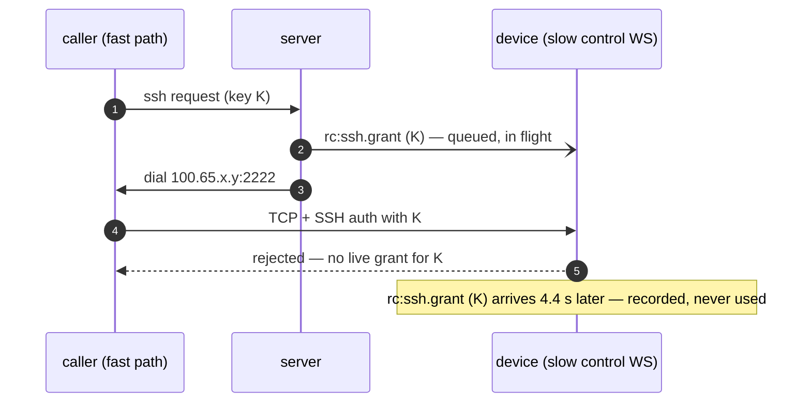
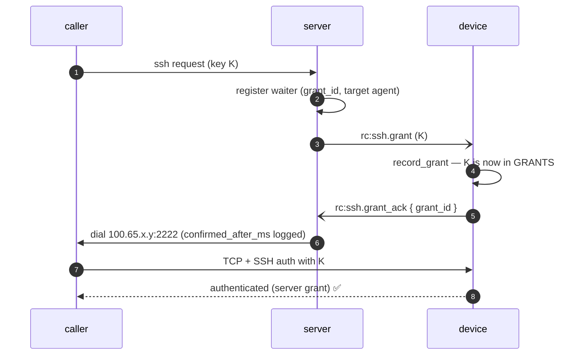

# FR-83: An SSH grant is confirmed before the caller is told to dial

**Issue:** [#1601](https://github.com/gjovanov/roomler-ai/issues/1601) · **Status:** proposed 2026-09-24 ·
**Field report:** [#1597](https://github.com/gjovanov/roomler-ai/issues/1597), found by the
FR-81 stress lane ([#1546](https://github.com/gjovanov/roomler-ai/issues/1546))

## Goal

**A caller that has been told where to dial can rely on the target holding its grant.**

Roomler SSH's server "mints a single-use grant, pushes it to the target, and answers the
caller with where to dial — its role ends there" (`docs/roomler-ssh.md`). The push and the
answer are not ordered with respect to the device *receiving* the grant: `decide()` hands
the frame to the target's outbound queue and answers the caller in the same breath. Nothing
waits for the device to say it has the grant.

So the outcome is decided by which of two **independent** control connections is faster.
A caller with a fast path to the server beats a target with a slow one, and the target —
correctly, on the evidence it has — fail-closes. The user sees
`Permission denied (publickey)`, which sends them to inspect keys, policies and account
modes that were all correct.

The same mechanism hides a second class of failure: every refusal the **device** makes of
a grant — gate 4 (`ssh_enabled` off), a grant that arrived already expired (clock skew) —
exists only in the device's own log. `agent_ssh.rs` says so in as many words: *"Gate 4
cannot be reported back here at all"*. With an acknowledgement it can, and the caller gets
a reason instead of a publickey error.

## The field evidence

Found by the FR-81 overlay stress matrix on 2026-09-23. A corp laptop (CORPLAP-2, on DERP
behind a TLS-inspecting middlebox) returned **0 of 3** SSH sessions in the direct arm while
a sibling laptop with a byte-identical config returned 3 of 3 in the same sweep. The
device's own log:

```
19:03:35.319  INFO ssh: session opening peer=<vm>:47226
19:03:35.830  WARN ssh: rejected — no live grant for this key and it is not in
                   ssh_authorized_keys  pending_grants=1
19:03:39.696  INFO ssh: grant recorded grant_id=6ab42287… ttl_secs=55     ← 4.4 s AFTER
19:03:57.862  WARN ssh: rejected — no live grant for this key … pending_grants=2
19:04:01.151  INFO ssh: grant recorded grant_id=6ab4229d…                 ← 3.3 s late
```

A successful session on the same device, same policy, from a caller whose path to the
server was comparable to the device's own:

```
19:55:30.821  INFO ssh: grant recorded  (via mars)          ← grant FIRST
19:55:30.892  INFO ssh: session opening peer=<mars>:59190   ← 71 ms later
19:55:31.233  INFO ssh: authenticated (server grant)  ✅
```

⚠️ **The refusal is not wrong.** `pending_grants=1` shows the device holding grants, just
not this key's — exactly the fail-closed behaviour the design wants. The defect is the
ordering, and that a losable race is presented to the user as a terminal key refusal.

⚠️ It is **intermittent and path-dependent**: it reproduces for some caller/device pairs and
never for others, which is the hardest shape to diagnose from a report. The grant that
arrived 4.4 s late still had ~50 s of its 60 s life left — the window was there to use.

## The mechanism, in the code (master `0b1acdb81`)

| step | where | what it does |
|---|---|---|
| push | `crates/modules/network/src/routes/agent_ssh.rs:395` | `rc_hub.push_ssh_grant(…)` |
| enqueue | `crates/modules/fleet/src/hub.rs:1368` → `send_to_agent` | `try_send` onto the agent's outbound mpsc — returns when **queued** |
| answer | `crates/modules/network/src/routes/agent_ssh.rs:407` | `Ok(Granted { address, … })` — immediately |
| record | `agents/roomlerd/src/signaling.rs:3532` → `ssh.rs:2073` | `record_grant` pushes into `GRANTS` whenever the frame arrives |
| auth | `agents/roomlerd/src/ssh.rs:2151` (`take_grant_for`) | reads `GRANTS`; no entry ⇒ `rejected — no live grant` |



## Key design



### 1. The wire — `rc:ssh.grant_ack`

`ClientMsg::SshGrantAck { grant_id, refused: Option<SshGrantRefusal> }`, owner
**`network`** (the owner of every `rc:ssh.*` frame; `namespace()` arm +
`CLIENT_MSG_OWNERS` row + a composition-baseline re-record whose commit message says why).

`refused: None` means *recorded — redeemable from this moment*. `Some(reason)` means the
grant will never be honoured:

| `SshGrantRefusal` | device-side cause | caller hears (`SshDenyReason`) |
|---|---|---|
| `ssh_disabled` | gate 4 — the device's own `ssh_enabled` is off | `agent_disabled` |
| `expired` | arrived past its deadline — clock skew or a control WS slower than the TTL | `grant_expired_on_arrival` |
| `invalid` | the device cannot parse what the server validated | `grant_refused` |
| *anything newer* | `#[serde(other)] other` | `grant_refused` |

⚠️ `#[serde(other)]` is load-bearing: without it a newer agent's new reason makes the whole
frame unparseable on an older server, which drops it at `debug!` and waits out the bound —
turning a clear refusal into `grant_unconfirmed`.

### 2. The capability — `ssh-grant-ack`, read from the LIVE connection

`RpcCap::SshGrantAck` = `ssh-grant-ack`, advertised only by `ssh-server` builds, next to
`ssh` and `ssh-consent` (`agents/roomlerd/src/encode/caps.rs:1413`).

⚠️ **Equality-matched**, like every verb: `ssh` is a prefix of `ssh-grant-ack` exactly as it
is of `ssh-consent`, and `starts_with` would mark every `ssh` agent ack-capable — the
server would then wait 10 s on every grant to an agent that never answers.

⚠️ The server reads it from the **Hub entry** (distilled at registration,
`crates/modules/fleet/src/socket.rs:143`, like `supports_ssh`), never from the stored
agent row. The row reflects the last hello, which after a rollback promises an ack the
running agent never sends — every grant to that device would wait out the bound and then
be refused.

### 3. The server — wait, bounded, then answer

In `decide()`, when the live connection advertises the verb:

1. register a waiter keyed by `grant_id`, holding the **target's agent id**, BEFORE the
   push (a fast ack must have somewhere to land);
2. push as today — a push error still maps to `unsupported` / `offline`;
3. await ≤ `ssh_limits::GRANT_ACK_TIMEOUT_SECS` (10):
   - recorded → answer as today, logging `confirmed_after_ms`;
   - refused → the mapped `SshDenyReason` (§1), audited like every refusal;
   - nothing → **`grant_unconfirmed`**, never an address.

A connection without the verb is answered exactly as today, without waiting.

⚠️ **An ack confirms only if it arrived on the socket of the agent the grant was pushed
to.** Grant ids are ObjectIds — structured, not secret — and without this check any device
in any tenant could "confirm" another device's grant, restoring the race for whoever
bothers.

The waiter table lives in `NetworkState` — `network` owns SSH; the Hub only owns the
socket. A guard deregisters on every exit path, as `ExecWaiterGuard` does for exec.

**The 10 s bound**: 2× the worst lag observed (4.4 s); inside the originating device's own
30 s wait for `rc:ssh.response` (`agents/roomlerd/src/localapi_state.rs:1057`), so the
caller hears the server's reason rather than its own timeout; and it leaves ≥ 50 s of the
60 s grant TTL (`ssh_limits::GRANT_TTL_SECS`) to dial in.

### 4. The agent — acknowledge after recording, and every refusal

The `rc:ssh.grant` arm (`agents/roomlerd/src/signaling.rs:3532`) acknowledges **after**
`record_grant` returns: the grant is in `GRANTS` — the table the auth path reads — before
the frame leaves, so "confirmed" means "redeemable". `record_grant`'s `Result<(), String>`
becomes a typed rejection so the arm can say *which* refusal it was; the log text is
unchanged.

The ack is sent unconditionally by an ack-capable build. An older server cannot parse the
frame and drops it at `debug!` (`crates/modules/fleet/src/socket.rs:618`) — harmless, and
one small frame per grant.

### Compatibility, both directions

| server | agent | behaviour |
|---|---|---|
| new | new | waits for the ack (this FR) |
| new | old (no verb) | today's behaviour, no wait |
| old | new | today's behaviour; the ack is dropped at `debug!` |
| old | old | today |

## Alternatives considered

| option | why not |
|---|---|
| **client retry** on a publickey refusal (`roomler ssh`) | Retries into refusals that are sometimes GENUINE, so it needs the refusal reason on the wire anyway; fixes only new CLIs; and a caller told "dial here" still cannot rely on it |
| **device-side grace wait** — hold an unknown key a few seconds in case its grant is in flight | Every unauthorized key then waits: an OpenSSH client offering three agent keys to a key-list device pays it three times per login. No reason ever reaches the caller, and a half-open control WS stays invisible |
| **answer with the address on timeout** (fail open to today) | At that moment the one thing the server KNOWS is that the device has not confirmed; "dial here" is the answer that produced #1597 |

## Phases

| phase | what | kill switch | status |
|---|---|---|---|
| P0 | spec + ledger row + issue | — | this PR |
| P1 | wire, capability, server wait, agent ack, tests, docs | promote the previous server image (`promote.yml`) — an old server never waits, and the ack is dropped at `debug!` | planned |
| P2 | agent release + server image promoted; field verification (AC7, AC8) | as P1 | planned |

## Acceptance criteria

- [ ] **AC1** — For an ack-capable agent the server answers only after the device
      confirmed: an integration test whose agent delays its ack gets no answer before it.
- [ ] **AC2** — `ssh_enabled` off on the device reaches the caller as gate 4
      (`agent_disabled`), not an address. **Deterministic negative control**: the same test
      on master receives an address.
- [ ] **AC3** — No ack within the bound ⇒ `grant_unconfirmed`, never an address.
- [ ] **AC4** — An agent without `ssh-grant-ack` is answered as before, without waiting.
- [ ] **AC5** — An ack arriving on another agent's socket confirms nothing.
- [ ] **AC6** — `ssh` does not imply `ssh-grant-ack` (equality, locked by test).
- [ ] **AC7** — Field: after the roll, the stress lane's SSH column is 3/3 on every corp
      laptop in both arms, and each target's log shows `grant recorded` before
      `session opening` for every grant-issued session — with the pre-roll run recorded as
      the baseline.
- [ ] **AC8** — Field: `roomler ssh` to a device with `ssh_enabled = false` names gate 4 —
      shown answering `Permission denied (publickey)` on the current deploy first.
- [ ] **AC9** — Docs: `docs/roomler-ssh.md` shows the ack in the grant sequence and corrects
      "gate 4 cannot be reported back"; `agent_ssh.rs`'s module doc and `record_grant`'s doc
      say what is now true.

## Open decisions

- **The 10 s bound.** Revisit with field data: the server logs `confirmed_after_ms` on
  every confirmed grant.
- **A target whose WS drops mid-wait** leaves the caller waiting out the bound before
  `grant_unconfirmed`. Short-circuiting on the Hub's unregister is possible and deferred —
  it is a latency improvement on a failure path, not a correctness one.

## Out of scope

- **Key-list sessions** (`ssh_authorized_keys`): no grant, so no race.
- **Client-side retry** — see *Alternatives*.
- **Cross-pod grants**: the push is already pod-local (tenant affinity puts the caller's
  request and the target's socket on one pod); unchanged.
- **The device's auth path** — it is correct; only the ordering around it changes.

## Field-verification log

| date | build | observation |
|---|---|---|
| 2026-09-23 | agent 0.4.97, server as deployed that day | **Baseline, failing** (#1597): CORPLAP-2 direct arm 0/3 — device log shows `rejected — no live grant` 3.3–4.4 s before `grant recorded`; relay arm 3/3 |
