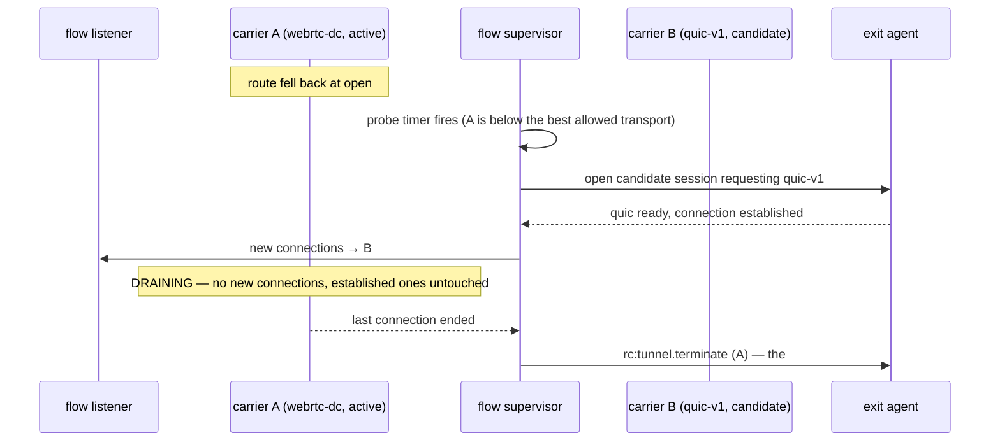

# FR-86: Tunnel routes return to the best transport — make-before-break re-upgrade, never cutting a connection

Issue: [#1769](https://github.com/gjovanov/roomler-ai/issues/1769) · supersedes [#1768](https://github.com/gjovanov/roomler-ai/issues/1768) ·
related [#1761](https://github.com/gjovanov/roomler-ai/issues/1761) (the churn cause, fixed in 0.4.113) and
[#1754](https://github.com/gjovanov/roomler-ai/issues/1754) (the terminate guard and the exit-side reap).

## Goal

A declared route — a daemon-run tunnel flow (`[[tunnel_routes]]`, `docs/tunnel-install.md` §6) — that fell back
to a lower transport returns to the **best transport that works**, and does it **make-before-break**:

- an **established** connection through the route is never cut by a switch;
- a **new** connection is never refused while the route changes carriers;
- a probe that fails never disturbs the live session, and probing costs the exit bounded work.

The operator's decision (2026-09-28, on #1768): *"they should switch to the better one if it exists."*

## The field evidence

| When (UTC) | What |
|---|---|
| 2026-09-28 07:27–07:29 and 12:25–12:28 | After each client-daemon restart, the declared routes ran the ladder (`quic-v1` → `quic-derp-v1` → `webrtc-dc-v1`). Routes whose exit was busy or restarting at that moment settled on `webrtc-dc-v1`. |
| 2026-09-28 12:26:55 | One exit (UDP-capable) restarted while the client's routes were retrying; two of its routes settled on `webrtc-dc-v1` and **stayed there for hours**. |
| 2026-09-28 12:4x | A forced `roomler forward --transport quic` through that same exit worked (the SSH banner came back over `quic-v1`) — the better transport was available the whole time. |

The ladder runs **only when a session opens**, and nothing ever re-opens a healthy session, so a route keeps the
transport it happened to land on. The flow supervisor even remembers that QUIC-over-TURN failed
(`quic_over_turn_failing`, `agents/roomlerd/src/tunnel/client_mgr.rs:743`) — but only uses it to choose the
NEXT session's first rung, and a healthy fallen-back session never ends on its own.

## The mechanism, in the code (master `0806a1ed0`)

| What | Where | Why it blocks a re-upgrade |
|---|---|---|
| Each session binds the route's loopback port itself | `crates/tunnel-core/src/driver.rs:369` `bind_local_listener`, called at `:682` (`run_webrtc_session`, `:550`) and `:1374` (`run_quic_session`, `:1185`) | A second session cannot open beside the first — both would bind `127.0.0.1:<port>` |
| Each session owns its accept loop and spawns one task per connection, holding `Arc`s to ITS pool / connection | `driver.rs` `run_webrtc_session` accept loop after `:682`; `run_quic_session` after `:1374` | Connections are welded to the session that accepted them |
| Ending a session sends `rc:tunnel.terminate` (the #1754 guard) | `driver.rs:112` `TerminateOnDrop`, armed in `run_tunnel_session` (`:393`) | Ending a session to switch transport cuts every connection it carries — at the exit, the peer is closed |
| The ladder runs once per session open | `client_mgr.rs:929` `run_session_with_fallback`, `:1054` `drive_one`, driven by `:714` `run_flow_supervisor` | A fallback is permanent for the life of the session |
| During a reconnect the port is unbound | the listener lives and dies with the session | A client connecting during a reconnect gets `connection refused` |

## Key design

### P1 — the flow owns the listener; sessions carry connections

Split each transport's session runner into **establishment** and **carrying**:

- `establish_*` does the handshake and brings the peer / QUIC connection to *ready* (today's code up to the
  listener bind), and returns a **`Carrier`**: a handle with `carry(tcp, peer_addr)` (spawn one connection over
  this session — today's per-connection task body, unchanged), `active()` (connections in flight), `dead()` (a
  future that resolves when the session can carry no more — today's dispatcher-exit / `session_dead` / QUIC
  `conn.closed()` arms) and `close()` (the terminate — `TerminateOnDrop` moves into the carrier, so dropping a
  carrier still tells the exit).
- The **flow** binds the listener **once** and runs the accept loop: each accepted connection goes to the
  current carrier. With no carrier (a reconnect in progress) the connection is **held** — up to a bound
  (default 30 s) — until a carrier is ready, instead of the kernel refusing it; past the bound it is closed.
- `run_tunnel_session` keeps its public contract for the standalone CLI by composing establish + a private
  accept loop, so `roomler forward` (the CLI) is unchanged.

P1 changes no transport behaviour, only who owns the port: sessions, pools, keepalives, the terminate guard and
the exit side are untouched. Its visible effect is that a route no longer refuses connections during a reconnect.

### P2 — make-before-break re-upgrade

The flow supervisor gains a **re-upgrade probe**. The order is `quic-v1` > `quic-derp-v1` > `webrtc-dc-v1`
(`quic-derp-v1` only where `TUNNEL_DERP_FALLBACK` is on, `client_mgr.rs:861`), restricted to what the route's
`--transport` preference allows (`auto` only; a pinned transport never re-upgrades).

- **Probe:** only while the active carrier's transport is below the best allowed. The first probe goes 60 s
  after the fallback, then backs off 2 → 5 → 15 → 60 min (capped) while candidates keep failing. The schedule
  **resets** on a network change (the supervisor already subscribes to `netwatch`, `client_mgr.rs` inside
  `run_flow_supervisor`) and after a successful promotion. At most **one** candidate per flow in flight.
- **Promotion** only after the candidate is fully established (pool open / QUIC connection authenticated —
  exactly the point where today's session binds its listener). Then the flow's "current carrier" swaps atomically.
- **Drain:** the old carrier accepts nothing new; its established connections run to their natural end; when
  `active()` reaches 0 it is closed (terminate → the exit frees its peer). **No maximum drain time** — an RDP
  connection that lives for hours keeps its old carrier for hours; cutting it would break the goal.
- **Failure:** a candidate that fails is closed (terminate), the backoff grows, the active carrier is untouched.
- **Kill switch:** `ROOMLERD_TUNNEL_REUPGRADE=0` (and the config key `tunnel_reupgrade = false`) — no probes; the
  flow behaves exactly as after P1.

### Compatibility

- **The exit and the server are unchanged.** A candidate is an ordinary tunnel session; the exit already serves
  several sessions for one client (one per route today), and #1754 already reaps a session the client abandons.
- **Old exits** (any version) serve a candidate like any session. **Old clients** simply never probe.
- A draining carrier costs the exit one extra session until its last connection ends — bounded by the one
  candidate per flow.

## Alternatives considered

| Alternative | Why not |
|---|---|
| Re-open the session when it is idle (0 connections) | Needs no P1, but refuses connections during the switch (the port is unbound for the whole ladder — 20–30 s on a slow exit) and never upgrades a route that always carries something |
| End the session on a timer and let the ladder run | Cuts every established connection — the opposite of the goal |
| Migrate live connections between carriers | Byte streams cannot move between two unrelated transports without an application-level resume protocol on both ends — out of all proportion to the problem |

## Phases

| Phase | What | Kill switch | Status |
|---|---|---|---|
| P0 | spec + ledger row + issue | — | **merged** #1770 `69fb66bba` |
| P1 | flow-owned listener, `Carrier` split, held connections during reconnect; tests; docs | revert (pure refactor, no wire change) | **merged** #1771 `1ffc7bd94`: `establish_tunnel_session` + `Carrier` (`crates/tunnel-core/src/driver.rs`), `FlowListener` + `HoldPolicy` (`crates/tunnel-core/src/flow_listener.rs`, ≤ 64 held, ≤ 30 s), the daemon flow binds once (`agents/roomlerd/src/tunnel/client_mgr.rs` `run_flow_cycle`); 9 new tests, 5 negative controls shown red; `docs/tunnels.md` §"The flow owns the listener" |
| P2 | re-upgrade probe, promotion, drain; tests; docs | `ROOMLERD_TUNNEL_REUPGRADE=0` / `tunnel_reupgrade = false` (the key applies on the next daemon restart) | **merged** #1773 `813231f44`: probe schedule (`ReupgradeBackoff`/`ProbeTimer`), ranking (`better_transports`/`below_best`), `spawn_candidate`/`establish_candidate` (background probe into a throwaway `FlowLive`), promotion + drain (`run_flow_cycle` serving loop, `drain_carrier`), `Carrier::drained` (`crates/tunnel-core/src/driver.rs`), the `ROOMLERD_TUNNEL_REUPGRADE` kill switch + `tunnel_reupgrade` config key, the `--start-transport` test lever (LocalAPI `CreateForward.start_transport`); 11 new tests, 6 negative controls shown red; `docs/tunnels.md` §"Re-upgrade: probe → promote → drain" |
| P3 | agent release; field verification (AC7, AC8); close | as P2 | **shipped** `agent-v0.4.114` → `037e2c703` (#1774), published 2026-09-28 22:58:55Z; **field-verified** 2026-09-28/29, see the log |

## Acceptance criteria

- [x] **AC1** — A declared route that fell back returns to the best allowed transport within the probe bound
  (first probe 60 s after the fallback) once that transport works. *(Field, 0.4.114: three of the operator's
  declared routes that came up on `webrtc-dc-v1` after a client restart probed at +60 s and were on `quic-v1`
  21 s later (the exit's slow TURN allocation); the lever flow probed at +60 s and was on `quic-v1` 0.66 s later.)*
- [x] **AC2** — An established connection through the route survives a switch; connections opened after the
  switch ride the new transport. *(P2: proven end to end over two real loopback QUIC carriers behind one
  `FlowListener` — `driver::tests::make_before_break_a_keeps_flowing_while_b_takes_new_connections`: A keeps
  round-tripping bytes after B is installed, a new connection rides B, A then drains. Field, 0.4.114: connection
  A, opened on `webrtc-dc-v1` before the promotion, carried the SSH client banner out and 1,120 bytes of KEXINIT back
  after it; connection B, opened after, rode `quic-v1`.)*
- [x] **AC3** — No connection is refused during a switch or a reconnect: the flow's listener never unbinds, and a
  connection that arrives while no carrier is ready is held (≤ 30 s) and then carried. *(P1's property. Field,
  0.4.114: a connection to a brand-new forward's port 9 ms after creation, before any carrier existed, was
  ACCEPTED and held; `held connections handed to the new carrier handed=1` followed, and the SSH banner arrived
  at 1,736 ms. On 0.4.113 the port bound only after establishment, so that connect was refused: the red half is
  structural and NC86A-proven, not field-measured. No connection was refused during any of the four promotions.)*
- [x] **AC4** — A failing candidate never disturbs the live carrier; probes back off (2 → 5 → 15 → 60 min) and
  reset on a network change. *(P2: the backoff ladder + reset are unit-proven — `reupgrade_backoff_ladder_and_reset`,
  `probe_timer_deadlines_follow_the_ladder`; failure isolation is structural — a candidate establishes into its own
  throwaway `FlowLive` + `c`-prefixed nonce, cleaned by `CandidateGuard`, so it cannot touch the live carrier or
  listener. The netwatch-Major reset is wired into the serving loop. ⚠️ **Verified by tests + NCs only:** no
  probe has failed in the field yet, since every one so far succeeded; a failing probe needs an exit that refuses
  the better transport. Re-open with evidence if one ever disturbs a live route.)*
- [x] **AC5** — A drained carrier is closed when its last connection ends, with a terminate the exit acts on (no
  #1754-class leak), and a candidate that failed is closed too. *(P2 proves the client side:
  `drain_carrier_keeps_the_old_carrier_until_active_reaches_zero`, and P1's `a_quic_carrier_*` for drop ⇒
  terminate. Field, 0.4.114: closing A logged `draining carrier reached 0 connections; closing`, and the EXIT's
  log shows `agent flow ended`, then `tunnel peer's client is gone — reaping the session (#1754)` ~60 ms later,
  then `rc:tunnel.terminate — closing peer` for the same session. The three idle routes' old carriers closed the
  moment they were promoted, since they had 0 connections.)*
- [x] **AC6** — Kill switch: with `ROOMLERD_TUNNEL_REUPGRADE=0` no probe is ever opened. *(P2: `reupgrade_active`
  + `reupgrade_enabled` gate the whole probe path — `reupgrade_gate_respects_pinned_and_kill_switch`,
  `kill_switch_reads_the_env`; off ⇒ the serving phase is exactly P1's `active.dead().await`. ⚠️ **Verified by
  tests + NCs only:** the `tunnel_reupgrade` config key applies on the next daemon **restart** (not live; an
  earlier note here said live), and the field check was not run because it would have restarted the
  operator's daemon under live routes.)*
- [x] **AC7** — Field: a client-daemon restart while the exit restarts ⇒ the affected routes end on `quic-v1`
  within the bound (red first on the current release: they stay on `webrtc-dc-v1`). *(Red, 0.4.111–0.4.113 on
  2026-09-28: two routes sat on `webrtc-dc-v1` for hours after a restart. Green, 0.4.114: the client's own update
  restart (23:56Z) brought three routes up on `webrtc-dc-v1`; they re-upgraded to `quic-v1` at 23:59:29Z, and all
  seven of the operator's routes were then on `quic-v1`. The fallback's trigger was the client restart racing a
  slow exit, not a simultaneous exit restart; the mechanism, a fallback at open, is the same.)*
- [x] **AC8** — Field: an RDP connection through a route stays up across a promotion. *(Verified with a
  long-lived SSH TCP connection, not RDP: a carrier forwards bytes regardless of protocol. A was opened before
  the promotion and exchanged the SSH banner/KEXINIT after it, see AC2. No RDP session happened to be open on a
  route during its promotion.)*
- [x] **AC9** — Tests with negative controls shown red for P1 (held connection, single bind) and P2 (promotion,
  drain, failure isolation, backoff, kill switch). *(P1's NCs in #1771; P2's shown red in this PR — NC86P2A
  (listener ignores the promotion), NC86P2N (no backoff), NC86P2K/NC86P2S (probe while pinned / kill switch
  ignored), NC86P2E (kill switch hardcoded on), NC86P2P (promote-by-cut).)*
- [x] **AC10** — Docs: `docs/tunnels.md` describes carriers, the probe and the drain (mermaid, tables, `file:line`
  anchors), and `docs/README.md` indexes it. *(P1's §"The flow owns the listener" + P2's §"Re-upgrade:
  probe → promote → drain"; `tunnels.md` is row-indexed in `docs/README.md`.)*

## Open decisions

- The probe cadence and backoff numbers (proposed above).
- Whether the standalone `roomler forward` CLI gets the probe (proposed: later — P1 keeps its contract).
- Whether a pinned `--transport` should ever probe (proposed: never — a pin is a decision).

## Out of scope

Overlay carriers (they already re-upgrade — "never ratchet"), remote-control sessions, the exit side, and
migrating a live connection between transports.

## Field-verification log

| Date (UTC) | Build | Cell | Result |
|---|---|---|---|
| 2026-09-28 12:26 → evening | 0.4.111–0.4.113 | **red**: routes after a client restart | two routes to a UDP-capable exit sat on `webrtc-dc-v1` for hours; a forced `--transport quic` through the same exit worked |
| 2026-09-28 23:56–23:59 | 0.4.114 (client) | the operator's declared routes after the client's own update restart | `rdg-go2`, `rdp-as10832` and `pcon-mssql` (exit: the UDP-hostile corp laptop) came up on `webrtc-dc-v1`, probed at 23:59:08, and were promoted to `quic-v1` at 23:59:29; old carriers (0 connections) closed at once; all seven routes then on `quic-v1` |
| 2026-09-28 23:58–23:59 | 0.4.114 (client), 0.4.113 (exit: a Linux server) | the lever (`--start-transport webrtc`) + a connection held across the promotion | probe at +60 s, `quic-v1` established in 0.66 s; A (pre-promotion) exchanged banner/KEXINIT after the promotion; B rode `quic-v1`; closing A drained and closed the old carrier; the exit reaped (layer B) and received the terminate (layer A) |
| 2026-09-29 00:01 | 0.4.114 | AC3: connect before the first carrier exists | accepted after 9 ms; `held connections handed to the new carrier handed=1`; banner at 1,736 ms |
| 2026-09-29 00:01 | 0.4.114 | AC6: the kill switch's config key | `tunnel_reupgrade` is a RESTART key; not field-exercised (it needs a daemon restart under live routes); the key was set and immediately `clear`ed |
