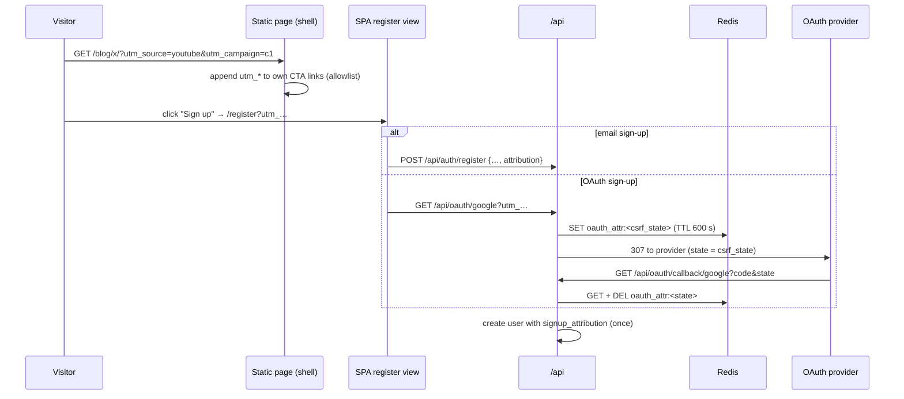

# FR-88: Measure what promotion brings — attribution to an activated device, a link hub, and video on the site

**Issue:** [#1790](https://github.com/gjovanov/roomler-ai/issues/1790) · **Status:** P1 merged 2026-09-30, not yet
promoted: P1a, the server half, in #1800 (`fdba707a2`); P1b, the site and SPA half, in #1798. P0 merged
2026-09-29 (#1791); P2–P4 not started · **Owner:** web / public site + auth · **Anchors:** master `c6c2934d7` ·
**Builds on:** [FR-87](FR-87-blog-and-google-indexing.md) (the static site, purestat on every page),
[FR-60](FR-60-public-docs-site.md) (the generator), [FR-39](FR-39-launch-readiness.md) (`subscribers.source`)

## 1. Goal

Roomler is about to publish short and long videos on YouTube, TikTok, Instagram and Facebook on a
fixed cadence. Today nothing connects any of it to a user: purestat records `utm_*` on the visit,
and the chain stops there. This FR makes one campaign id travel from a post's link to the account
it produced and to that account's first enrolled device, **without storing anything on the
visitor's device**, and gives the videos a home on the site.

1. **Attribution**: the landing page's UTM parameters ride on the site's own links into sign-up
   (email and OAuth) and the newsletter form. A new account records where it came from, plus an
   optional answer to "How did you hear about Roomler?".
2. **Conversions**: purestat goals for `signup`, `subscribe`, `install-copy` and `github-outbound`.
3. **Activation**: a platform-admin view of signups, and of signups whose tenant enrolled a device
   within 7 days, by source and campaign.
4. **A link hub**: `/links/` plus short paths (`/yt`, `/tt`, `/ig`, `/fb`) that 302 there with UTM,
   for places a link cannot carry parameters: a profile bio, a URL said out loud in a video.
5. **Video on the site**: a `video:` key on blog posts and a `:::video` container on docs pages,
   rendered as a click-to-load youtube-nocookie facade with `VideoObject` structured data.

The channel program itself (what is posted, where, when, and why) is not engineering and is not in
this spec. Nothing here depends on it.

## 2. Evidence (measured 2026-09-29, production and master `c6c2934d7`)

- **purestat is already everywhere.** It loads on the SPA (`ui/index.html:42`) and on every static
  page through the shared shell (`ui/docs/site.ts:152-157`). Its event schema stores
  `utm_source`/`utm_medium`/`utm_campaign`/`utm_content`/`utm_term`, and it has goals and a stats API
  keyed by an `X-API-Key` (purestat's `docs/api.md` and `docs/tracker.md`).
- **Nothing in roomler reads a source.** No hit for `utm_`, `document.referrer` or `ref=` in `ui/`,
  `crates/` or `files/` outside a vendored README. `RegisterRequest`
  (`crates/api/src/routes/auth.rs:16`) and `User` (`crates/db/src/models/user.rs:7`) have no source
  field. The only hook is `subscribers.source` (`crates/db/src/models/subscriber.rs:33`), clamped to
  32 characters by the saas module's subscribe route.
- **OAuth drops everything but its CSRF state.** `oauth_redirect`
  (`crates/api/src/routes/oauth.rs:39-67`, mounted at `GET /api/oauth/{provider}`,
  `crates/api/src/lib.rs:226`) mints a random `state` and binds it with a 10-minute HttpOnly
  `oauth_state` cookie. Nothing else survives the round trip to the provider.
- **No video can be embedded.** The CSP (`files/nginx-pod.conf:87`) has no `frame-src`, so frames
  fall back to `default-src 'self'`; the Permissions-Policy comment (`:47`) records that the site
  "embeds no iframes at all". `ui/docs/theme/structured.ts` emits no `VideoObject`.
- **The accounts that will link here start from zero:** YouTube 0 videos, TikTok 0 posts, Instagram
  0 posts, Facebook 79 followers (a page last used in 2020); GitHub 3 stars.

## 3. Design

### 3a. Attribution: carry, don't store

Nothing is written to the visitor's device for attribution: no cookie, no localStorage, no
sessionStorage. Storing on a terminal for a non-essential purpose needs consent under ePrivacy
Art. 5(3). The site has no consent banner and should not need one, which is also why purestat is
cookie-free. So the parameters travel on links instead:

- **The shell** (`ui/docs/theme/shell.ts`) gets a small first-party script. It is served from the
  same origin, so `script-src 'self'` already allows it, and inline scripts stay blocked. When the
  page URL carries `utm_*` or `ref`, it copies those keys onto the page's own sign-up, install and
  download links, found through an allowlist of selectors, and onto nothing else. *(P1b: the
  allowlist is `/register`, `/login`, the installer downloads, and `INSTALL_PAGES` in
  `ui/docs/site.ts`, which the build writes into the script. The build fails when a page shows an
  install command but is not listed, so where `install-copy` can fire and where a campaign reaches
  are one list.)*
- **The SPA register view** reads the same keys from its own URL and sends them as an optional
  `attribution` object on `POST /api/auth/register` (`crates/api/src/routes/auth.rs:137`).
- **OAuth:** the register view's provider buttons pass the keys to `GET /api/oauth/{provider}`.
  `oauth_redirect` stores them in Redis under the CSRF state it already mints, with the cookie's
  600 s TTL. `oauth_callback` reads and deletes the key when it creates the user. No new cookie.
  ⚠️ The attribution must never influence the CSRF check: a missing or expired key means "no
  attribution", never a failed login.
- **The newsletter form** sends the campaign as the existing `source` (32 characters).
- **Storage:** `users.signup_attribution: Option<SignupAttribution>` with `source`, `medium`,
  `campaign`, `content`, `term`, `referrer_host`, `landing_path` and `self_reported`.
  - Every value is clamped to 64 characters of printable ASCII. Unknown keys are dropped. The
    referrer is a host, never a full URL.
  - ⚠️ `referrer_host` and `landing_path` that ARRIVE on a URL are taken as given, like any
    `utm_*` value: any link can set them, the server only clamps them, and nothing checks them.
    That is a data-quality limit, not a security one. Read the activation view (§3c) with it in
    mind: a count by source is what the links said, not a measurement.
  - It is set once, at creation, and never updated. It is never returned by a user-facing endpoint
    and never logged at `info`.
  - `#[serde(default, skip_serializing_if = "Option::is_none")]`. ⚠️ If any insert path builds its
    BSON by hand with `doc!{}`, it will silently drop the new field; the insert must serialise the
    struct, and a test asserts the round trip.
- **"How did you hear about Roomler?"** is an optional select on the register form: search,
  YouTube, TikTok, Instagram, Facebook, Reddit, Hacker News, a friend or colleague, other. It is
  stored as `self_reported`. It covers what links cannot: a URL said out loud, a screenshot shared
  in a chat, a conversation.
- **Privacy policy:** a section naming the fields, the purpose (which channels bring users), the
  retention (with the account), the legal basis (legitimate interest), and the fact that nothing is
  stored on the device.

### 3b. Conversion goals (purestat)

- `purestat('signup')` after a successful register or OAuth sign-up, `purestat('subscribe')` after
  the newsletter form's 202, `purestat('install-copy')` on the install/enroll command's copy button,
  and `purestat('github-outbound')` on the links to the repository. Each has a goal in purestat.
- purestat attributes a goal to the visit's source. The account-level record (3a) covers a visitor
  who converts on a later visit.
- **Kill switch:** FR-87's `ANALYTICS = null` disables all of it on the static pages; the SPA call
  is a no-op when `window.purestat` is absent.

### 3c. The activation view (platform admin)

- `GET /api/admin/stats/attribution?since=&until=` joins the other platform-admin stats
  (`crates/api/src/lib.rs:283-297`). It returns counts only, never a user list:
  - signups by `source`/`medium`/`campaign` and by `self_reported`;
  - activated signups, where the user's tenant enrolled at least one agent within 7 days of the
    user's `created_at`;
  - `pending` signups — no device yet and the 7-day window still open — reported beside
    `activated`, and `settled` (= `signups − pending`), the only valid denominator for an
    activation rate: a rate over all signups would count yesterday's as failures.
- It is the host's view, like its siblings: users are core, agents belong to `fleet`. With `fleet`
  unmounted it reports `activated: null`, never `0` (`pending` and `settled` likewise).
- Same gate as the siblings: 404 to anyone who is not a platform admin.
- ⚠️ Every bucket `key` is text chosen by whoever built the link — sanitised to ≤ 64 printable
  ASCII characters, but still attacker-chosen. An admin UI renders it as text (`{{ key }}`),
  never as markup (`v-html`).
- The new route changes the composition baseline
  (`crates/tests/fixtures/composition.baseline.json`). Re-record with `COMPOSITION_UPDATE=1` and
  say why in the commit.

### 3d. The link hub and short paths

- **`/links/`** (`ui/docs/theme/links-layout.ts`): a static page built by the same generator
  (`ui/docs/build.ts`) with the same shell, and held to the homepage's link gate.
  - It lists sign-up, install, the docs, the blog, the repository and the channel profiles. P3 adds
    the featured video, as the facade's first page.
  - Its sign-up and install links carry the incoming UTM like every other static page (3a).
  - `noindex, follow`: it repeats the homepage for people who arrive from a profile, so it is not a
    page to rank, and it is not in the sitemap.
- **Channels** (`CHANNELS` in `ui/docs/site.ts`): the one list of the profiles. The hub lists them,
  and `ORG.sameAs` names them to search engines next to the repository.
- **nginx** (`files/nginx-pod.conf`): `location = /yt { return 302 /links/?utm_source=youtube&utm_medium=bio&utm_campaign=profile; }`,
  and the same for `/tt`, `/ig` and `/fb`. More short paths are added only by a PR.
  - `utm_medium=bio&utm_campaign=profile` is what every profile link of the program carries, a
    profile's own website field included. So a visit through a bio is one source, whichever way it
    came. (This spec first said `utm_medium=profile`; P2 follows the program's convention instead.)
  - 302, not 301: a browser keeps a 301 for good, and where a short path points may change.
  - The redirect is relative, per FR-87's `absolute_redirect off`.
  - A short path must not shadow an SPA route. `ui/docs/__tests__/links-page.spec.ts` checks the
    router's route table for every one, and checks the nginx lines against `CHANNELS` both ways.
  - No `add_header` in these locations (§3e explains why).
- **Kill switch:** remove the locations.

### 3e. Video on the site

- **Authoring:** a `video:` key (a YouTube id) is added to `BLOG_FRONTMATTER_KEYS`
  (`ui/docs/site.ts:113`), and docs pages get a `:::video <id>` container.
- **Rendering:** both produce a facade, with no request to any YouTube host before the click.
  - It is a thumbnail (`https://i.ytimg.com/vi/<id>/hqdefault.jpg`, already allowed by
    `img-src https:`) with a play button.
  - A click swaps in `https://www.youtube-nocookie.com/embed/<id>?autoplay=1`.
- **Structured data:** `ui/docs/videos.json` holds each video's id, title, description, upload date,
  duration and thumbnail. It feeds a `VideoObject` in the page's JSON-LD graph
  (`ui/docs/theme/structured.ts`).
  - Per FR-60's rule (build gates, not lints), a `video:` or `:::video` id missing from the manifest
    fails the build.
- **CSP:** add `frame-src https://www.youtube-nocookie.com` to the **server-level** header
  (`files/nginx-pod.conf:87`), and update the Permissions-Policy comment (`:47`).
  - ⚠️ Never add it in a `location`: any `add_header` there drops every inherited security header
    (the FR-60 finding, `:112-118`).
  - Adding a source only widens the policy. The remote-control viewer is still exercised after the
    change, because the 2026-07-29 CSP regression broke the viewer's loopback probes and not the SPA.
- **Kill switch:** an empty manifest renders no facade; revert the `frame-src`.
- **Privacy policy:** the embed is click-to-load, and YouTube's terms apply after the click.

## 4. Phases

| P | What | Kill switch | Status |
|---|---|---|---|
| P0 | claim: issue #1790, this spec, the ledger row | docs only | **merged** #1791 `8c0b34a44` |
| P1a | the server half of §3a — `RegisterRequest.attribution`, the `utm_*` query on `GET /api/oauth/{provider}` and its Redis parking spot, `users.signup_attribution` — and the §3c view | the SPA omits `attribution`; the view is platform-admin only | **merged** #1800 `fdba707a2`, promoted `hosted-20260930-60fe7a7` |
| P1b | the site and SPA half of §3a (the shell script, the register view and its select, the provider buttons, the newsletter form), the goals (§3b), the privacy-policy section, and the `/landing` and `/pricing` redirects in nginx that now keep the query | `ATTRIBUTION_ENABLED = false` in `ui/src/utils/attribution.ts`; `ANALYTICS = null` | **merged** #1798 `60fe7a75b`, promoted `hosted-20260930-60fe7a7` |
| P2 | `/links/` and the short paths (§3d) | remove the locations and the page | PR open |
| P3 | video on the site (§3e) | empty manifest; revert `frame-src` | — |
| P4 | docs: `docs/public-site.md` gains the attribution flow, the link hub and the video facade, with mermaid; the field log | — | — |

**Deploy order:** P1 is promoted before the first video is published, so the first posts are
measured from their first view. Each phase is its own promote.

## 5. Acceptance criteria

- [ ] **AC1:** a production visit to `/?utm_source=youtube&utm_medium=video&utm_campaign=fr88-test`
  appears under that campaign in purestat's stats API. A visit without UTM appears as direct
  (control).
- [ ] **AC2:** an email sign-up on a local dev server, reached through a UTM landing, stores
  `signup_attribution` with those values. The same sign-up without UTM stores none (control). The
  field is absent from every user-facing response.
- [ ] **AC3:** an OAuth sign-up on local dev (one provider), reached through a UTM landing, stores the
  same values. The Redis key is gone after the callback and expires after 600 s if the callback
  never comes. No new cookie is set (response-header diff against master). An expired key still
  logs the user in.
- [ ] **AC4:** no attribution value is written to cookies, localStorage or sessionStorage on `/`, a
  docs page, a blog post, `/links/` or the register page (a Playwright check over all five).
- [ ] **AC5:** `GET /api/admin/stats/attribution` returns signups and activated signups by source for
  a platform admin, and 404 for anyone else. With `fleet` unmounted, `activated` is `null`.
- [ ] **AC6:** a scripted pass records exactly one event for each of the four purestat goals, and zero
  with `ANALYTICS = null` (control).
- [ ] **AC7:** `curl -sI https://roomler.ai/yt` (and `/tt`, `/ig`, `/fb`) returns a 302 whose relative
  `Location` is `/links/` with that channel's `utm_source`, `utm_medium=bio` and
  `utm_campaign=profile`, and no SPA route answers any of those paths. `/links/` answers 200 with the
  hub and `/links` a 301 to it. Checked by `scripts/public-site-smoke.sh` §5c, shown failing on the
  deploy before P2 (§8).
- [ ] **AC8:** a blog post with `video:` makes no request to a YouTube host before the click (network
  log), plays after it, passes the Rich Results Test with a `VideoObject`, and keeps Lighthouse at
  100 in all four categories. A `video:` id missing from the manifest fails the build, shown failing
  and then passing.
- [ ] **AC9:** the served CSP carries `frame-src https://www.youtube-nocookie.com` on the SPA, a docs
  page and a post, every other security header is unchanged (header diff), and a remote-control
  session still connects with its loopback probes unblocked.
- [ ] **AC10:** the privacy policy names the attribution fields, their purpose and retention, and the
  click-to-load embed.
- [ ] **AC11:** docs updated with mermaid diagrams (`docs/public-site.md`: the attribution flow, the
  link hub, the video facade) and indexed in `docs/README.md`.
- [ ] **AC12:** the SPA's old marketing routes keep a campaign: on production,
  `/pricing?utm_source=x` answers `301` to `/?utm_source=x#pricing` and `/landing?…` to `/?…`,
  and without a query both answer exactly as before (`/#pricing`, `/`). Checked by
  `scripts/public-site-smoke.sh`, shown failing on the deploy before P1b (§8).

## 6. Open decisions

1. **Where the OAuth attribution waits:** the existing Redis with a 600 s TTL (default), or a Mongo
   collection with a TTL index.
2. **When the self-reported question is asked:** on the register form, optional (default), or after
   the first login.
3. **The option list** for the self-reported question (the default is in §3a).
4. **What "the user's tenant" means for activation** (raised by the P1a review). P1a credits a
   signup when ANY org the person belongs to at query time enrolled a device within the window —
   including an org they were invited into, and regardless of when they joined it. The
   alternatives: only memberships joined within the window, or only the org created at
   registration. The definition is unchanged until the operator decides; the join is one
   function (`tally` in `crates/api/src/routes/attribution.rs`).

## 7. Out of scope

- **The channel program** (what is posted, where, when, keyword targets). It is not engineering and
  lives in a private annex. This spec stands alone without it.
- **Ads, ad pixels and any third-party tracking script;** cookies of any kind for attribution;
  fingerprinting; multi-touch attribution; server-side events to purestat.
- **Conference-call recording.** `ui/docs/content/collaboration/video-conferencing.md:21` claims
  "Record a call", but `crates/modules/conference/src/recording.rs:84-107` only inserts a metadata
  row (`url` empty, `size` 0). The doc is corrected in a separate PR.

## 8. Field-verification log

| Date | Build | What was checked | Result |
|---|---|---|---|
| 2026-09-30 | production, before P1b (`/health` 0.4.114) | AC12's red run: `curl -sI` on `/pricing?utm_source=smoke` and `/landing?utm_source=smoke&utm_campaign=fr88`; the smoke's new redirect block | **fails as expected**: `Location: /#pricing` and `Location: /`, the query dropped; the smoke block reports 2 of 4 red. The same block against `files/nginx-pod.conf` in `nginx:stable` (Docker): master's file 2 of 4 red, PR #1798's 4 of 4 green, `nginx -t` clean, and no query still gives exactly `/` and `/#pricing` |
| 2026-09-30 | production, before P2 (`hosted-20260930-e7e7fad`, `/health` 0.4.114) | AC7's red run: `scripts/public-site-smoke.sh https://roomler.ai` with the §5c block P2 adds | **fails as expected**: `/yt`, `/tt`, `/ig` and `/fb` each answer **200 with the SPA shell** (a soft 404), `/links` answers 200 instead of a 301, `/links/` is not the hub, and `/links/fr88-smoke-missing/` answers 200. The same smoke against the P2 build, served by `files/nginx-pod.conf` in `nginx:stable` (Docker): every check green, `nginx -t` clean, and each short path answers `302 Location: /links/?utm_source=<channel>&utm_medium=bio&utm_campaign=profile` |

## 9. Related

- [FR-87](FR-87-blog-and-google-indexing.md) (#1776): the static site, the shell, purestat on every page.
- [FR-60](FR-60-public-docs-site.md): the generator and its build gates.
- [FR-39](FR-39-launch-readiness.md): `subscribers` and its `source`.
- [FR-69](FR-69-modular-monolith.md): the composition baseline and the host-owned views.
- [FR-85](FR-85-hq-screen-recording.md) (#1634): the recorder the videos are made with.
