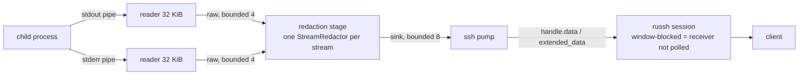

# FR-89: SSH exec output streams — no ceiling, no wall clock, the channel owns the command's life

Issue: [#1826](https://github.com/gjovanov/roomler-ai/issues/1826) · builds on
[#1819](https://github.com/gjovanov/roomler-ai/pull/1819) (byte-exact exec output, the ceiling notice) ·
related [#1747](https://github.com/gjovanov/roomler-ai/issues/1747) (the client's stdin reaches the command).

## Goal

`ssh <node> 'cmd'` — an SSH **exec** request, the thing `scp`-less scripts, `tar c | ssh node 'tar x'`,
`ssh node 'journalctl -f'` and `ssh node cat bigfile > f` all are — forwards the command's stdout and stderr to
the SSH channel **as the command produces them**. No buffering, therefore no output ceiling and no wall-clock
timeout; the command lives exactly as long as the channel does. Everything that is *not* about buffering stays:

- the `RunAs` identity model (`exec::apply_run_as`, never a silent fallback to the daemon identity);
- the operator-consent gate, asked before anything runs;
- the per-device concurrency cap (refuse, never queue);
- process-tree kill — now when the channel closes or the client disconnects, not only on a timer;
- secret redaction of everything that leaves the host, **across chunk boundaries**;
- the P8 activity report (`SshActivityKind::Exec`, the command text and exit code only — output is never
  recorded or shipped);
- the client's stdin, fed in order and closed at the client's EOF (#1747).

**Fleet RPC (`roomler exec`) does not change at all**: buffered, 1 MiB, JSON wire, the same tests.

## The field evidence

| When | What |
|---|---|
| 2026-10-06 | `ssh <node> cat f > f` of a 4.4 MB MP4 arrived as 1.9 MB of U+FFFD noise — fixed by #1819 (bytes, not text). The same run then stopped at exactly 1 MiB: the engine's ceiling. On macOS the command died of `SIGPIPE` when the reader dropped the pipe and `ssh` exited 1 — with no word about why until #1819 added the stderr notice. |
| since P5b | The managed corporate laptops run SSH sessions as `console_user`; `scp`/`sftp` **refuse** for Windows non-daemon accounts (`agents/roomlerd/src/ssh.rs:904-921`). So those hosts have had **no way to move a file over 1 MiB**: exec is capped, sftp refuses. |
| since P2 | `docs/roomler-ssh.md:110-135` documents the cap as deliberate: *"output arrives when the command finishes rather than streaming, because the engine buffers to enforce its ceiling"*. A command that prompts waits on a question the caller cannot see; `tail -f` returns nothing for five minutes and then the last 1 MiB. |

## The mechanism, in the code (`origin/rec-demo-ssh-bytes-mac-banner`, #1819, the branch this builds on)

| What | Where | Why it blocks streaming |
|---|---|---|
| The SSH exec handler hands the command to the Fleet-RPC engine with the engine's maxima | `agents/roomlerd/src/ssh.rs:1887` `run_exec` → `:1933-1934` (`timeout_ms: MAX_TIMEOUT_MS`, `max_output_bytes: MAX_OUTPUT_BYTES`) → `:1940-1942` `run_fed` | the engine returns ONE `ExecOutcome` when the process is gone |
| The whole output is sent after the run, then the ceiling notice | `ssh.rs:1948-1955`, `:1959-1971` | nothing reaches the channel while the command runs |
| The engine re-clamps timeout and ceiling, takes the permit, registers cancel | `agents/roomlerd/src/exec.rs:931` `run_fed`, `:944-945` | the clamps are for a wire the server bounded; SSH never needed them |
| Both pipes are drained into a `Vec` against ONE shared budget | `exec.rs:1109-1113`, `read_capped` `:1178` | the reader stops at the budget; past it the child dies of SIGPIPE / `ERROR_NO_DATA` |
| The process waits in a `select!` over `wait` / `sleep(timeout)` / `cancel` | `exec.rs:1118-1131` | a fixed wall clock kills a long transfer |
| Windows `console_user`: `CreateProcessAsUserW` with three pipes, two blocking drain threads to EOF | `exec.rs:1878` `win_console::run`, `:1946-1949`; `agents/roomlerd/src/win_service/supervisor.rs:1826` `spawn_in_session_captured`, `:2026` `read_pipe_to_end` | the drain is "read everything, then return" — but the pipes are there; only the drain shape buffers |
| The one-hour blocking `wait_for_exit` backstop | `exec.rs:1975-1977` | sized against `MAX_TIMEOUT_MS`; a command with no wall clock can outlive it |
| The pty path streams with no ceiling and no timeout, and its lifetime is the channel's | `ssh.rs:1094` `start_pty_session`, the pump `:1193-1218` | the shape exec should have, minus the terminal |
| The session deadline's doc says an exec in flight "is bounded by the engine's own wall-clock ceiling" | `ssh.rs:819-823`, `arm_session_deadline` `:850` | true today, false after this — the disconnect must cancel the command |
| `docs/roomler-ssh.md:580-584` | "`CreateProcessAsUserW`'s streaming form currently only exists in the pty's pseudoconsole path — there is no pipes variant yet" | outdated since P5b: `spawn_in_session_captured` IS the pipes variant; it drained to EOF, and now it streams |

## Key design

### D1 — Engine API: a streaming variant, SSH-only

`ExecEngine::run_streamed(req, redactor, stdin, sink) -> StreamedOutcome`, beside `run` / `run_fed`, which stay
byte-for-byte what they are. The sink is a **bounded** `tokio::mpsc::Sender<Chunk>` where
`Chunk { stream: Stdout | Stderr, bytes }`, chunks are redacted, and per stream they arrive in the order the
command wrote them.

**Backpressure propagates to the child.** `russh::server::Handle::data` is `sender.send(..).await` on a bounded
(10) channel that the session loop **stops polling while any channel has pending, window-blocked data**
(`russh-0.62.7/src/server/session.rs:770`). So: client window full → pump blocks → sink (8) fills → stage blocks
→ raw (4) fills → reader stops reading → the OS pipe fills → the child blocks on `write`. The daemon holds at
most ~13 chunks + two carries (≈ 0.5 MiB) per exec, however slow the client. **No unbounded buffer anywhere.**

Both `run_fed` and `run_streamed` share one private `spawn_and_wait` whose output mode is an enum
(`Buffered { max_output }` / `Streamed { raw }`) and whose timeout is `Option<u64>`; the buffered mode is the
existing code, moved behind the variant. The existing engine tests (`output_is_capped_and_flagged`,
`timeout_kills_and_reports`, `cancel_stops_an_inflight_command`, `concurrency_cap_refuses_rather_than_queues`,
the stdin trio) prove Fleet RPC did not move.

### D2 — Streaming redaction that cannot split a secret

`Redactor::apply` masks three things: **literals** (the agent tokens, `register_secret`), **`Bearer <token>`**
up to the next whitespace, and **JWT-shaped** `xxx.yyy.zzz` runs. Every one of them is whitespace-free (a JWT is
base64url; `mask_bearer` ends at whitespace). `StreamRedactor` keeps one carry per stream and settles bytes only
up to a **word boundary**: the position right after the last ASCII whitespace byte. A token in progress is
therefore always wholly in the carry, never cut. Three refinements, each closing a measured hole:

| Rule | Closes |
|---|---|
| **Literal pass over the whole buffer** (carry + new bytes) before settling | a literal with the cut inside it: fully visible → masked now; still arriving → wholly carried |
| **`bearer ` pull-back**: if the settled prefix ends with `bearer ` (case-insensitive), pull the cut back to the word boundary before it | `Bearer ` settled alone leaves the token to the next chunk, where `mask_bearer` sees no prefix and masks nothing |
| A literal that itself contains whitespace (none registered today) adds a hold-back of its length | such a literal straddling a word boundary |

The hard cases, bounded on purpose:

- **A whitespace-free run longer than 64 KiB** (`base64 -w0`, minified JSON, a binary with few whitespace bytes)
  would otherwise grow the carry without bound. It is force-settled: the pattern pass runs over the whole
  buffer first (so a fully visible token straddling the cut is masked anyway), then all but the last
  max(8 KiB, longest literal − 1) bytes are emitted. Literals can never leak at a forced cut; a **pattern**
  token leaks only if more than 8 KiB of it is visible and it is still not finished.
- **A prompt without a trailing newline** (`Continue? [y/N]`) would sit in the carry until EOF. After **150 ms**
  with no new bytes the stage flushes the carry, holding back only a tail that is a proper prefix of a literal
  and a `bearer ` context with its token in progress. A pattern token is then split only if the **writer
  itself pauses mid-token for 150 ms** — a secret written with one `write()` never does.
- **Binary** passes through byte-exact: redaction runs on valid-UTF-8 runs only (`apply_bytes`'s
  `utf8_chunks`), a split multi-byte character is an invalid run on both sides of the boundary, and a forced cut
  never lands inside one.

Unit tests drive every secret kind through **every split offset** of a 2-chunk split and through 1..7-byte
chunking, asserting the concatenation equals `apply_bytes(whole)`; a binary cycle and a 200 KiB whitespace-free
run assert byte-exactness through the forced-cut path.

### D3 — Windows `console_user` streams through the pipes it already has

`spawn_in_session_captured` wires three anonymous pipes; `read_pipe_to_end` drained them into a `Vec`. A sibling
`read_pipe_streamed` hands each `ReadFile` result to the raw channel with `blocking_send` (the drain threads are
plain `std::thread`s, so that is legal and that is the backpressure: a full raw channel parks the thread, the
pipe fills, the child blocks). The buffered drain stays for Fleet RPC. The one-hour `wait_for_exit` backstop
becomes a loop in the streamed mode — a command with no wall clock may run longer than an hour, and a waiter
that gives up early would report an exit that has not happened. `docs/roomler-ssh.md`'s "no pipes variant"
note is corrected; wiring `sftp` to the same spawn is a follow-up (out of scope here).

### D4 — No wall-clock timeout; the channel owns the lifetime

Recommendation: **none**, like the pty. A fixed limit is exactly what kills a long `tar` or a `journalctl -f`,
and the pty path has run without one since P4 with no field incident. What bounds a streamed exec instead:

| Event | What ends the command |
|---|---|
| the client closes the channel (Ctrl-C, `ssh` exiting) | `Handler::channel_close` → `ExecEngine::cancel(request_id)` → tree kill |
| the client disconnects, or the carrier dies | the handler drops → `Drop` cancels every exec it still tracks |
| the grant's `session_secs` deadline | `arm_session_deadline` disconnects → the same `Drop` |
| the client stops reading | the command **blocks** (D1); it is not killed and it costs nothing — exactly what OpenSSH does |
| a key-list (break-glass) session | unbounded, as its pty is: the session's 600 s inactivity timeout still reaps a dead carrier |

The engine's own detection stays as a second line: a pump whose `handle.data()` fails (session gone) cancels
too. No idle/abuse bound is added: the per-device concurrency cap (4) already limits what an abuser can hold,
and an idle *command* holding a channel is the operator's own session, which the activity log records.

### D5 — Kill switch: `ssh_exec_streaming`

A device-owned config key, default **on**, read once at `Ctx::build` (restart required, like every other
`ssh_*` key). `false` restores today's buffered path exactly — `run_fed` with the maxima, the ceiling notice,
the 300 s wall clock. **Not** in `DesiredConfig` (not server-settable): it changes nothing about who may do
what, but a control plane that could flip a device's data path from under its owner is a precedent this
surface has refused since `remote_config_enabled`. `roomler config set ssh_exec_streaming false` and the
companion's Settings page carry it, tier Advanced.

### D6 — Exit status

Unchanged mapping: a real `0..=255` exit code is the SSH status; a signal-encoded or absent code (killed,
cancelled, refused) is **1**. `exit-status` is sent only after the pump has delivered the last chunk, then
`eof`, then `close` — the order `scp` and scripts rely on.

## Compatibility

- **Clients** need nothing: an SSH exec channel has always been a stream; only the server buffered.
- **Older agents** keep buffering; the server is not involved in an exec channel at all.
- **`roomler exec`** (Fleet RPC, `rc:rpc.exec`) is unchanged on the wire and in the engine.

## Alternatives considered

| Alternative | Why not |
|---|---|
| Raise the ceiling (16 MiB, 64 MiB) | still a ceiling, still buffered, still no `tail -f`; and the daemon would hold it all in memory |
| Route exec through the pty path with no terminal | a pty merges stderr into stdout and cooks line endings; `scp`-style scripts and `tar` pipes need the raw streams |
| Redact per chunk with no carry | a token split by a pipe-buffer boundary leaks half of itself — measured as a certainty for a 4 KiB Windows pipe and a 2 KiB token |
| Keep a long wall clock (24 h) | arbitrary; the pty has none and nobody has asked for one; the lifetime that matters is the channel's |

## Phases

| Phase | What | Kill switch | Status |
|---|---|---|---|
| P0 | spec + ledger row + issue | — | **in review** [#1830](https://github.com/gjovanov/roomler-ai/pull/1830) — the row was rebased onto master beside the FR-90 claim ([#1828](https://github.com/gjovanov/roomler-ai/pull/1828)), which landed meanwhile: the ledger arbitrated a textual conflict, not a number collision |
| P1 | `run_streamed` + `StreamRedactor` + Windows drain streaming in the engine; SSH exec on it; `channel_close`/`Drop` cancel; `ssh_exec_streaming`; tests; docs (`docs/roomler-ssh.md` §3, the sftp note, `docs/fleet-rpc.md`, `docs/README.md`) | `ssh_exec_streaming = false` (next daemon restart) | **in review** [#1830](https://github.com/gjovanov/roomler-ai/pull/1830), stacked on #1819: 87/87 `exec::` + `ssh::` tests at default concurrency, twice; the SSH suite's command-running tests now hold one of `MAX_CONCURRENT_PER_AGENT` slots (they share the process-wide `exec::shared()` engine, and a fifth overlapping test was being refused) |
| P2 | agent release; field verification on the matrix (Linux root daemon, Windows SYSTEM, Windows `console_user` corp laptop, macOS); tick AC1–AC9; close | as P1 | owed |

## Acceptance criteria

- [ ] **AC1** — `ssh <node> 'cat bigfile' > f` for a file over 1 MiB lands whole and byte-exact (SHA-256
  matches on both ends), exit 0, no ceiling notice. *(Unit: an in-process 2 MiB exec over russh. Field: a
  real file on a Linux and a Windows device.)*
- [ ] **AC2** — Output streams: `ssh <node> 'for i in 1 2 3; do date; sleep 1; done'` prints each line as it
  happens, not all three after three seconds. *(Field.)*
- [ ] **AC3** — A command longer than the old `MAX_TIMEOUT_MS` (`sleep 330; echo done`) runs to completion
  with exit 0. *(Unit: a request's timeout is ignored by the streamed path. Field.)*
- [ ] **AC4** — Closing the channel (Ctrl-C at the client) or disconnecting kills the command **and its
  process tree**: nothing of it is left running on the device. *(Unit: a file-writing loop stops growing after
  `channel.close()` and after a client disconnect. Field: `pgrep` after Ctrl-C.)*
- [ ] **AC5** — A client that stops reading stops the command, and the daemon's memory does not grow:
  `ssh <node> 'cat big' | (sleep 30; wc -c)` holds the command for 30 s and then delivers everything. *(Unit:
  a stalled consumer leaves the run unfinished and loses no bytes. Field: the daemon's RSS during the pause.)*
- [ ] **AC6** — Streamed output is redacted like buffered output, including a secret split across a chunk
  boundary: the agent token, `Bearer …` and JWT shapes never leave the host. *(Unit: every split offset. Field:
  `ssh <node> 'cat <config>' | grep agent_token` prints `[redacted]`.)*
- [ ] **AC7** — Windows `console_user` sessions (the managed corporate laptops) stream too, as the signed-in
  user. *(Field — the only lane that runs that spawn.)*
- [ ] **AC8** — Fleet RPC is untouched: `roomler exec` still caps at 1 MiB with `truncated`, times out at its
  limit, and answers the same JSON. *(Unit: the existing engine tests, unmodified. Field: one `roomler exec`
  over 1 MiB on the new release.)*
- [ ] **AC9** — `ssh_exec_streaming = false` restores the buffered behaviour exactly (the ceiling notice is
  back). *(Unit. Field: one device flipped, restarted, re-checked.)*
- [x] **AC10** — Docs: `docs/roomler-ssh.md` §3 rewritten for streaming (mermaid exec path, the lifetime
  table, the kill switch, the corrected Windows sftp note), `docs/fleet-rpc.md` cross-references the streamed
  variant, and the `docs/README.md` index row names it. *(#1830.)*

## Open decisions

1. **The idle flush (150 ms) and what it may split.** A pattern token (not a literal) is split only when the
   writer pauses mid-token for 150 ms. Accept, or hold back any trailing base64url run too — at the cost of
   `Press any key` style prompts never appearing until EOF?
2. **Server-settable?** Recommendation: no (D5). Say if an org needs to switch a fleet back without touching
   each device.
3. **`sftp` as `console_user` on Windows** can now ride the same piped spawn. Follow-up FR, or a P3 here?
4. **Default on for the first release**, with the switch as the fallback — or off for one release first?

## Out of scope

- The pty path (unchanged; it already streams).
- Streaming for Fleet RPC (`rc:rpc.exec` is a request/response wire; its audit row stores the output).
- `sftp`/`scp` as a Windows non-daemon account (decision 3).
- `-R` (still deliberately not implemented).
- Recording any session content (never).

## Field-verification log

| When (UTC) | Release | What | Result |
|---|---|---|---|
| | | | |
