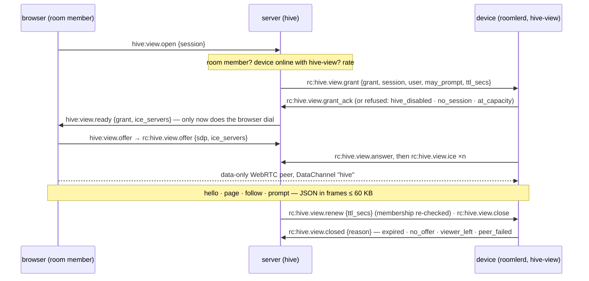
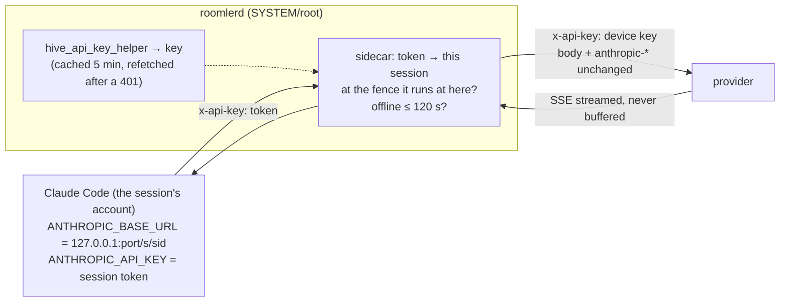

# FR-90: Hive — agent sessions on the org's own machines: a replicaset, a vault, a map and a shared brain

**Issue:** [#1827](https://github.com/gjovanov/roomler-ai/issues/1827) · **Status:** in progress
— design approved 2026-10-07; P0a (device core), P0b (server module), P0c (device
supervisor) and P0d-1 (the session room, turn stubs) merged, P0d-2a, P0d-2b (the viewer peer), P0d-3 (the UI), P0e (the model sidecar) and P0f (the canary test, AC2 on one device) merged — P0's build is complete; AC1 field-verified on a throwaway stack (2026-10-07), and its six findings fixed in P0g (merged); AC3 and AC4 partly field-verified (§5, §8); P1a-1 (approvals, the device and the UI) in review · **Owner:** agent platform — the `hive`, `vault` and
`knowhow` modules, `roomlerd` feature `hive`, the SPA · **Anchors:** master `29ef33d58` ·
**Design:** [`../roomler-hive-design.md`](../roomler-hive-design.md) (v0.4: the full design, the
review of v0.2 and the decisions) · **Builds on:** [FR-69](FR-69-modular-monolith.md) (modules),
[FR-56](FR-56-remote-apps-on-wayland.md) (the tmux session model), [FR-43](FR-43-macos-single-enrollment.md)
(the stdin-secret worker attach), [FR-83](FR-83-ssh-grant-confirmed-before-dial.md) (a grant is
confirmed before the caller dials), [FR-86](FR-86-tunnel-transport-reupgrade.md) (the carriers),
[FR-82](FR-82-permission-refusal-is-not-a-logout.md) (managed roles), [FR-8](FR-8-claude-session-restore.md)
(session restore)

## 1. Goal

Run coding agents — Claude Code first, Codex later — on the org's own enrolled machines, as a
product rather than a pattern. [`docs/use-cases.md`](../use-cases.md) ("A harness for AI agents")
already pitches an agent in tmux that people watch and take over, with fenced networking; this FR
makes each agent session a first-class record:

1. **Sessions are org records; their content stays on the org's machines.** Every session — who
   started it, on which device, in which folder, as which OS account, what it cost, where its copies
   are — is a row in the org's database. What the agent and the people said and did lives on the
   session's **replicaset**: the org's own devices, each holding a full copy. The server never stores
   a transcript.
2. **Chat is the session's surface.** A session is a chat room; each turn is a message whose steps
   render as markdown, terminal blocks and diffs; approvals are cards a phone can answer. Content
   streams peer-to-peer from a replica; the server holds metadata-only stubs.
3. **Resume anywhere in the replicaset, teleport anywhere else** — to another machine and another
   folder, Windows to Linux included.
4. **Infrastructure the agent can use without seeing a secret.** An IAM-style vault (roles, Cedar
   policy, leases, audit) reachable over MCP and referenced from prompts by handle; a "knowhow"
   graph of what the org runs and how to reach it over the mesh.
5. **One brain the org's sessions share and improve**: memory, skills and playbooks stored
   centrally, curated, versioned and reviewed, measured by how much less steering sessions need.

Hive is the "AI" of the Business tier on roomler.ai; the self-hosted community edition gets all of
it.

## 2. Evidence (master `29ef33d58`, 2026-10-07)

- **Nothing to extend.** No Anthropic client, model id, LLM config key, MCP server or secret store
  exists in `crates/`, `agents/` or `ui/src`. The "Claude AI" service CLAUDE.md lists under
  `crates/services` and the document recognition the README describes are not in the code.
- **No encryption at rest.** JWTs are HS256 with a shared secret
  (`crates/services/src/auth/mod.rs:142-143`); the only asymmetric key signs DERP tickets
  (`crates/remote_control/src/derp_ticket.rs:91,116`); tenant cloud-storage credentials have a
  plaintext schema (`crates/db/src/models/tenant.rs:208-220`). The vault brings its own keys.
- **The primitives exist.** One spawn-as-user path (`agents/roomlerd/src/exec.rs:436,491`); the
  daemon's own PTY (`agents/roomlerd/src/pty/unix.rs:106-184`, ConPTY in
  `agents/roomlerd/src/pty/windows.rs:180-240`); the tmux model (`agents/roomlerd/src/apps/linux.rs:389-433`);
  generic consent prompts (`agents/roomlerd/src/consent.rs:174`); the stdin-secret worker attach
  (`agents/roomlerd/src/delegate.rs:16-30`); tunnel-core carriers down to DERP and data-only WebRTC
  peers (`docs/tunnels.md:61-73`); the stateless TURN-credential helper
  (`crates/remote_control/src/turn_creds.rs:46-85`).
- **The gaps are measured, not guessed.** `RunAs` sets no working directory and only `TERM`
  (`agents/roomlerd/src/pty/unix.rs:148`); on Windows it reaches only the console user and will not
  ask for credentials (`agents/roomlerd/src/exec.rs:503-508`); a root daemon's LocalAPI socket is
  `0600`, so a non-root process can't reach it (`crates/localapi/src/lib.rs:2880-2886`); tunnel SOCKS5
  has no authentication (`crates/tunnel-core/src/socks5.rs:3`) and a daemon-originated flow is
  attributed to the device owner (`crates/tunnel-core/src/policy.rs:29-51`); `SplitTun` intercepts one
  port and SSH is its only caller (`crates/tunnel-core/src/overlay/split_tun.rs:91-126`); fleet exec
  always runs as SYSTEM/root (`agents/roomlerd/src/signaling.rs:3946`).
- **Chat needs four changes.** `AuthorType::Bot` exists and nothing writes it — the DAO hard-codes
  `User` (`crates/services/src/dao/message.rs:76-78`); rooms have no type or binding
  (`crates/db/src/models/room.rs:62-126`); the message list isn't virtualized
  (`ui/src/views/chat/ChatView.vue:51`); only mentions push (`crates/core/src/notify.rs`).
- **Permission bits 0–31 are all assigned** and `ALL = (1 << 32) - 1`
  (`crates/db/src/models/role.rs:161`).
- **Claude Code makes per-session state portable.** With `CLAUDE_CONFIG_DIR` and
  `CLAUDE_CODE_PROJECT_DIR_NAME` set (≥ 2.1.234), a session's transcript and state live under one
  pinned project directory whatever the working directory is; a resume restores neither `--settings`
  nor `--mcp-config`; and Anthropic does not allow third parties to offer claude.ai login or rate
  limits, so subscription credentials are never brokered (design §4.3, §11.3).
- **The one LLM workflow on master is a false green.** `.github/workflows/daily-health-check.yml`
  reported success on every run from 2026-09-29 to 2026-10-06 with `ANTHROPIC_API_KEY` empty in the
  step environment; the `claude` step ends in under a second and `2>&1 | tee` swallows its exit
  status (run 37464801887). Hive's nightly lane must fail when the model call fails.

## 3. Design

The design is [`../roomler-hive-design.md`](../roomler-hive-design.md); this section is its spine.

### 3a. Three modules and a daemon feature

`vault` (→ `fleet`), `knowhow` (→ `network`) and `hive` (→ `chat`, `fleet`, `vault`, `knowhow`),
each a module behind the FR-69 contract (`crates/core/src/module.rs:23`); new `EDGES` in
`crates/core/src/graph.rs:15`, the forbidden pairs untouched; `hive` first in `HOOK_ORDER`
(`crates/core/src/hooks.rs:37`), because it holds sessions. The node side is a `roomlerd` feature,
and its user-level half is `roomlerd hive-host`, re-exec'd as the mapped user like `portal-helper`
(`agents/roomlerd/src/main.rs:203`) — no second binary. Wire frames are `rc:hive.*`, `rc:vault.*`,
`rc:knowhow.*` owned through `namespace()` (`crates/remote_control/src/signaling.rs:1399`); new
`RpcCap` verbs `hive`, `hive-view` (P0d-2), `hive-replica`, `vault`, `knowhow-scan`, equality-matched
(`crates/remote_control/src/models.rs:532,697`).

### 3b. The replicaset, and what the server holds

Each member of a session's replicaset keeps the same daemon-owned store — `hive.db` (SQLite with an
FTS5 index), the raw harness JSONL, a bare git repo of checkpoints, config-directory snapshots. The
primary streams events (`seq`, `fence`, `prev_hash`) and thin packs to the members over tunnel-core
carriers; members ack; the server learns freshness from the acks. Archive replicas — always-on org
devices — join every replicaset the policy allows and serve full-text search. The server holds
session metadata, turn stubs (who, status, steps, cost — no content), session cards (≤ 2 KB
summaries, scanned; `session_cards = summary` by default, `metadata` to turn them off), the brain,
and audit. Never transcripts.

### 3c. Chat and the viewer peer

A session is a `Secret` room with a generic `binding = {module, ref}`; turns are stub messages by an
agent author (`AuthorType::Bot`); prompts and approval answers travel peer-to-peer. Opening a room
renders stubs at once and opens a data-only WebRTC peer to a replica, behind a server-minted view
grant that the replica confirms before the browser dials. Assistant text goes through the existing
markdown allowlist (`ui/src/composables/useMarkdown.ts:57-62`); terminal blocks and diffs are
components, never HTML strings. ⚠️ Viewer peers are `close()`d explicitly — dropping one frees
nothing.

**The viewer peer as built (P0d-2).** The handshake rides the control WS; the content never does.

| Piece | Rule | Where |
|---|---|---|
| capability | `hive-view`, equality-matched — `hive` is its prefix and means "runs sessions", not "serves them" | `models.rs` `RpcCap::HiveView` |
| grant TTL | RELATIVE (`ttl_secs`, 10 min): the device starts its own clock, so clock skew cannot expire a fresh grant | `hive.rs` `view_limits` |
| device gates | primary org, `hive_enabled`, holds the session (live, or in its store), ≤ 8 viewers per session and ≤ 32 per device | `roomlerd/src/hive/view.rs` |
| one actor per grant | owns the peer, the timers and the channel: the one place `close()` runs; handlers capture a channel, never the peer | `view.rs` `run` |
| browser-facing ICE | as remote control's: the overlay interface kept out, `.local` candidates resolved by the OS, `ICE_RELAY_TCP` honoured; the answer goes before the device's candidates | `view.rs` `answer` |
| framing | one SCTP message over 65,536 bytes is silently LOST, so each JSON message travels as binary frames `[v1][id u32][part u16][parts u16][≤ 60,000 bytes]`, reassembled under bounds | `hive/framing.rs` |
| server gates | org AND room membership (anyone else: `not_found`, the answer a bogus id gets) · device online here with `hive-view` · ≤ 4 grants per browser connection · 20 opens / min per (user, session); `ready` only after the device's ack, a silent device is `no_answer` after 10 s | `crates/modules/hive/src/view.rs` `open` |
| whose frames count | a grant belongs to ONE browser connection and ONE device; anything else naming it moves nothing; device frames ride the per-connection ordered queue (answer before candidates) | `view.rs` `ready_grant_of`, `on_device_frame` |
| TURN credentials | minted per grant, the same for both ends, with a **12 h** TTL — the credential bounds the allocation's whole life, and the config TTL (600 s) would cut a relayed viewer at ten minutes | `turn_creds::ice_servers_for_session_with_ttl` |
| ops | `hello`, `page {after, limit}` (≤ 500 events, ≤ 1 MiB), `follow {after}` (subscribe first, then catch up: no gap, no repeat), `unfollow`, `prompt {id, text}` (only with `may_prompt`; attributed to the viewer) | `view.rs` `on_request` |

**The model sidecar as built (P0e).** The provider's key never enters a session.

| Piece | Rule | Where |
|---|---|---|
| the key | the DAEMON runs `hive_api_key_helper`; the session's settings carry no `apiKeyHelper`, so nothing in the session can print it | `roomlerd/src/hive/sidecar.rs` `run_key_helper` |
| the token | 256 random bits per run, bound to (session, fence), minted just before the harness starts and taken back if it does not; each run revokes exactly its own token when it ends, so a run ending as the session starts again here cannot take the new run's | `sidecar.rs` `Tokens` |
| the paths | exactly `POST /v1/messages` and `POST /v1/messages/count_tokens` — what Claude Code's gateway contract needs; anything else `404 not_found_error`, `HEAD /api/hello` (its warm-up probe) harmlessly too. The device's key opens more than inference: the Files API holds every session's uploads under it, and a batch runs on after its session and its fence. `/v1/models` is left out: Claude Code calls it only under `CLAUDE_CODE_ENABLE_GATEWAY_MODEL_DISCOVERY=1`, which Hive does not set | `sidecar.rs` `forwarded` |
| the fence | a call is forwarded only while the session runs HERE at the token's fence — a stopped session, or a stale primary after a move, spends nothing | `Supervisor::sidecar_admit` |
| `offline_grace` | 120 s after the primary connection closed (and no newer one took its place), calls are refused `503 overloaded_error`; they flow again on reconnect. "Closed" is the agent's own verdict: a half-open socket (a TLS-inspecting middlebox still ACKing) counts as up until the receive-liveness deadline ends it (`WS_RX_DEADLINE`, 80 s, `signaling.rs`), so a partitioned primary's worst case is about 80 s + 120 s | `Supervisor::lost_connection` |
| the forward | method, path, query, body and headers unchanged except `x-api-key` / `authorization` (the device key swapped in) and hop-by-hop; the response streamed back as it arrives with its headers; refusals in the provider's error shape | `sidecar.rs` `handle` |

### 3d. Sessions, promotion and teleport

A session runs as the account the device maps the user to (`hive_accounts`), under `hive_roots`,
never SYSTEM/root; Windows reaches only the console user and refuses `no_console_user`. Each session
has its own Claude Code config directory with a pinned project name, launched headless on
stream-json with daemon-owned `--settings` and `--mcp-config` regenerated on every start. The
fence-bound session token gates every model call (a loopback sidecar) and every toolbelt call.
Promotion onto a replica is a lease move plus a local checkout; teleport joins the target to the
replicaset first. The updater defers while a turn runs.

⚠️ **P0 never bumps a fence** — the server creates a session at fence 1 and re-sends that fence —
so a session runs at most once per device. P2's promotion has to make a start at a NEWER fence
supersede an older run still live on the same device (stop it, then launch): as built,
`decide_and_launch` is idempotent only on the same fence, so it would start a second harness, and
the older run's `finish` would drop the newer run's live entry, and with it the newer run's model
access (`roomlerd/src/hive/supervisor.rs`).

⚠️ **A daemon restart leaves its sessions live on the server** (found in the field, 2026-10-08).
The reconcile on connect re-sends only `starting` and `stopping` sessions
(`crates/modules/hive/src/agent_socket.rs` `reconcile_on_connect`). Live ones rely on the device's
replay of its last reports, which a restarted daemon no longer holds, so the record reads `idle`
with no harness behind it. Stop clears one: the device answers "not running on this device" and
the record ends. The fix is a manifest of the sessions the device runs, sent on connect so the
server ends the rest, or P1's resume, which makes the session survive the restart.

### 3e. Toolbelt, vault, knowhow

The `roomler` MCP server per session (over a per-session socket or pipe, not the main LocalAPI):
brain, knowhow, `roomler_connect`, vault, `ssh_run`, `fleet_exec` (SYSTEM/root, so a person approves
every call), forwards and SOCKS through a chosen device, child sessions. The vault follows AWS IAM
semantics in Cedar: roles assumed per session, guardrail `forbid`s, `approval` as the MFA analogue,
`simulate`. Secrets reach tools, not the model: `proxy` endpoints that authenticate (HTTP named
upstreams, a k8s API proxy, an SSH agent socket, Postgres and MongoDB proxies), then `placeholder`
substitution at a TLS-terminating egress proxy for audience hosts only; every secret is bound to its
audiences. Knowhow is built from fleet and network sync, opt-in scans and session proposals, and a
fact turns active only when a probe or a person confirms it.

**P1a builds the toolbelt with one tool, `approve`** (`agents/roomlerd/src/hive/toolbelt.rs`), and
it was built against Claude Code's contract as MEASURED, not as remembered. Claude Code 2.1.293,
driven by a fake Messages API and a fake MCP server on 2026-10-08 (§8):

| Claude Code does | so the toolbelt |
|---|---|
| probes with `server/discover` (MCP draft `2026-07-28`) before `initialize`, and initializes when told no | answers every unknown method `-32601`; silence would stall the harness's start |
| calls `approve` with `{tool_name, input, tool_use_id}` and `_meta.progressToken`, and waits | answers `{"behavior":"allow","updatedInput":<input>}` or `{"behavior":"deny","message":…}` as one text block, and sends progress every 60 s while a person decides |
| asks ONE approval at a time — two parallel writes were two calls, the second after the first was answered | caps a session at 4 open and refuses a fifth at once |
| hands the model a denial as `tool_result {is_error: true}` with our message verbatim, and lists it in the result's `permission_denials` | says who denied it and why ("Dev denied this: not now") |
| keeps the permission tool out of the model's own tool list | needs no `--disallowedTools` for `approve` |
| with the server unreachable, errors every call that needs approval ("MCP tool mcp__roomler__approve … not found") and exits 1 | fails CLOSED: nothing runs unapproved |
| starts a `-p` run that fetches no feature flags in **`auto`** when nothing sets a mode | is only reached under `--permission-mode default`, which the launch now pins |
| runs a command in its read-only set (`whoami`) and reads under the working directory without asking, in every mode | — those never reach `approve` |

Claude Code starts the toolbelt itself, as the session's account, so the server it starts is a relay:
`roomlerd hive-mcp <socket>`, short-circuited at the top of `daemon_main` like the embedded CLI, so it
runs none of the daemon's start-up and writes nothing as that account. The socket is the session
account's, `0600`, in `<runtime>/<sid>/` (root, `0755`, holding the daemon-written `settings.json`
and `mcp.json`), and every connection's peer uid is checked again — a process running as that
account can connect, and all it can do is ask. The run state is the session task's alone to write:
the toolbelt reports each approval opening and closing on a channel the task reads after the
harness's stdout, so the `tool_use` lands in the transcript before the approval it caused.

### 3f. The brain

Central, in the `hive` module: core memory in four scopes (org, project, user, device) with budgets
and visible over-budget failure, rendered as a frozen snapshot per session into `CLAUDE.md` and
Claude Code's own auto-memory directory; facts as records with evidence, versions, contradiction
cards and decay; skills and playbooks versioned centrally and projected per session. The reviewer — a
tool-less model call — runs on a replica, never on the server, and sends distilled proposals and the
session card. Improvement is counted: corrections per session, per-skill correction rates, eval
sessions that run each skill's acceptance test.

### 3g. Gates

Running a session is remote code execution on a device, so it gets exec's and SSH's four gates:
`HIVE_RUN` in no managed role below `ADMINISTRATOR` (pinned by
`no_managed_role_below_administrator_seeds_a_root_shell`, `crates/db/src/models/role.rs:396`); a
Cedar `role:assume` permit, default deny; per-(user, device) limits after the identity gates; and the
device's own `hive_enabled`, `hive_accounts` and `hive_roots`, of which only `hive_enabled` (and
`hive_replica`) can ever be pushed, and only to devices that opted into remote config
(`crates/remote_control/src/models.rs:1410,5153`).

## 4. Phases

| P | What | Kill switch | Status |
|---|---|---|---|
| claim | issue, this spec, the design, the ledger row | docs only | **merged** #1828 `dc1b05581` |
| P0 | spike: `hive` module skeleton; one headless Claude Code session on one Linux device driven from a chat room; events in the device store; stubs to the server; content over a viewer peer; sidecar pass-through with the fence; `RunAs::Named` with a working directory | `[modules] hive = false`; device `hive_enabled = false` | — |
| P0a | the device core, `crates/hive-node`: transcript events and their hash chain (one writer, no gaps, an unknown kind still chains), the stream-json adapter, the replica store (SQLite + FTS5, search scoped to granted sessions), the launch spec (per-session config dir, pinned project name), `hive_roots` confinement | linked by no binary yet | **merged** #1831 `8e41174ed` |
| P0b | the server side, `crates/modules/hive` (`hive → fleet`): the `agent_sessions` record and its lifecycle, `hive_audit`; start / list / get / stop routes; the wire (`RpcCap::Hive`, `rc:hive.start`·`stop` → `rc:hive.start_ack`·`state`, metadata only, lenient refusal words); `HIVE_RUN` (bit 32); reconcile-on-connect for unanswered starts and unconfirmed stops; member, device and org removal end their sessions (`member_removed` now runs from the remove-member route). No device runs a session yet | `[modules] hive = false` — the only module switch that defaults OFF | **merged** #1835 `8bf103be2` |
| P0c | the device side, `roomlerd` feature `hive` (Linux): device keys `hive_enabled` (off) / `hive_accounts` (nobody) / `hive_roots` (nowhere) / `hive_max_sessions` / `hive_harness` / `hive_api_key_helper`, none pushable; advertise `hive`; the device's gates answer `rc:hive.start` (primary org only, idempotent on session + fence); Claude Code launched headless as the mapped account through `exec::apply_run_as` (uid 0 refused), its config dir made by a wrapper running AS that account, a daemon-owned settings file; stream-json recorded in the replica store by one writer thread; `idle` / `running` / `ended` reported, replayed on reconnect; stop = stdin EOF + SIGTERM to the process group, then SIGKILL | feature `hive` is not in `full` (no release build compiles it); device `hive_enabled = false` | **merged** #1836 `a433c4dcf` |
| P0d-1 | the session room (`hive → chat`): each session is a `Secret` room at path `hive-<session>`, bound `{module: "hive", ref: <session>}`, its owner the only member — anyone else reads a 404; chat gains a generic `binding` on rooms and messages (stored, never interpreted) and agent authorship (`author_type: bot` + `author_display`, read only for a non-user author; the author id is the session's, so the edit and delete routes refuse every person); the session authors a note when it starts, is refused or ends — every server-side end included — and one **turn stub** per turn from `rc:hive.turn` (number, status, who asked, steps, duration, cost: the frame's field set cannot carry content), edited in place when the turn ends and never rewound by a late report of an older turn; the device counts turns and holds a prompt sent during one (at most 8 waiting, past that refused to the caller); and what is over stays over: a device that reports it RUNS a session whose record ended while it was away (a removed starter, an archived org) is answered with a stop — P0b had no path to it, since reconcile re-sends only what is pending | `[modules] hive = false`; feature `hive` not in `full` | **merged** #1837 `4aedc5f70` |
| P0d-2a | the viewer peer, device side: the `rc:hive.view.*` wire (grant · renew · offer · ice · close, and the device's grant_ack · answer · ice · closed) and capability `hive-view`; one actor per grant owning a data-only WebRTC peer (RC's browser-facing ICE setup); the `hive` DataChannel in bounded binary frames; `hello` / `page` / `follow` / `prompt`; the store's page, tip and live feed | feature `hive` not in `full`; no server sends a grant yet | **merged** #1839 `ca5e282cc` |
| P0d-2b | the viewer peer, server side: the `hive:view.*` user-socket namespace, the grant table (room member, `may_prompt` = the starter while live, rate), ready only after the device's ack, the SDP/ICE relay, renew re-checks membership, close on socket close and member removal, audit; viewer TURN credentials minted per grant for 12 h (the config TTL would cut a relayed viewer at ten minutes) | `[modules] hive = false` | **merged** #1841 `21e64950b` |
| P0d-3 | the UI: `hive` in the SPA's module registry (default-OFF, so the capability gate fails CLOSED for it, where every other module fails open); `stores/hive` (the record); `views/hive/HiveSessionsView` (list, start dialog, stop); `useHiveViewer`, the browser's half of the viewer peer (`hive:view.*` signalling, a data-only peer dialled only after `ready`, the framing, history + live follow + "ask the agent", `close()` on every way out); `HiveTranscript` as a side panel of a hive-bound room (assistant text through `renderMarkdown`, everything else text-interpolated); `SessionView` gains `device_name` | the server's `[modules] hive` — the SPA shows nothing until the server names the module | **merged** #1842 `eef760896` |
| P0e | the model sidecar: a loopback HTTP/1.1 endpoint in the daemon. The harness gets `ANTHROPIC_BASE_URL=http://127.0.0.1:<port>/s/<sid>` and a per-session token in `ANTHROPIC_API_KEY` — never the provider's key, which `hive_api_key_helper` prints to the DAEMON (cached 5 min, fetched again after a 401). Each call: this session's token, the session still running here at its fence, the device not offline past `offline_grace` (120 s), else refused in the provider's error shape; only `POST /v1/messages` and `/v1/messages/count_tokens`, matched exactly; forwarded unchanged with the key swapped in, the answer streamed (never buffered), `retry-after` and the rate-limit headers intact | feature `hive` not in `full`; no helper = no model access | **merged** #1843 `12bdadc4e` |
| P0f | the canary test (AC2, one device): `crates/tests/tests/hive_canary.rs`, its own test binary because the supervisor is process-global, drives a real server and a real in-process device (`hive::init_as_daemon`, feature `hive-test-launcher`: sessions as the test's own account, refused as root, in no release build). A prompt over the viewer peer, a tool's output, and a crashing harness's stderr each carry a canary; each must be in the device's store and in no Mongo document, object-store file, server log line or frame the server sent the browser — each absence checked beside a presence that proves the check can see. It found one channel: the `ended` detail carried the harness's last 400 bytes of stderr to the server, now a `note` in the device's transcript | a test; `hive-test-launcher` is test-only | **merged** #1844 `11f1838d7` |
| P0g | the AC1 field run's six findings: the server takes a start's answer in any live status (the daemon's `idle` lands first); the viewer waits for the socket before asking, and asks again after a redial; the device wires its channel's handlers inside `on_data_channel` (webrtc-rs reads the channel only after that callback returns) and the browser asks `hello` again until it is answered; `hive_api_workspace_id`, sent by the sidecar as `anthropic-workspace-id`; a turn records what it cost, not the process's running total; a repeated session announcement is shown once | fixes; `hive_api_workspace_id` unset = unchanged | **merged** #1846 `601cc10f8` |
| P1a-1 | approvals, the device and the UI: the session's **toolbelt** — one `roomler` MCP server per session on `<runtime>/<sid>/toolbelt.sock` (the session account's, `0600`, in a directory only the daemon writes; every peer's uid checked again), reached by the relay `roomlerd hive-mcp <socket>` that Claude Code itself starts as that account; its `approve` is the `--permission-prompt-tool`. The launch pins `--permission-mode default` (unset, a run behind the sidecar starts in `auto`, where a classifier decides), `--strict-mcp-config` (a repository's `.mcp.json` cannot shadow `roomler`) and `--disallowedTools AskUserQuestion`. While one is open the session is `awaiting_approval`; the transcript gets `approval_requested` (the call's own input) and `approval_resolved`; the viewer's `hello` names the open approvals, the device pushes `approvals` when they change, and a DRIVER's `answer {approval, allow\|deny, message?}` is taken, a reader's refused. Unanswered for 25 min is a denial that says so; a stop, or the harness letting go, withdraws it. The UI's approval card: Allow, Deny with a reason | feature `hive` not in `full`; device `hive_enabled = false` | PR open |
| P1a-2 | approvals, the server: `rc:hive.approval` (metadata only: the approval's id, open or how it ended, who answered) → a stub in the session's room ("needs approval": no tool, no arguments) edited when it ends; `agent_approvals`; a push with no content to the session's drivers | `[modules] hive = false` | — |
| P1 | sessions in chat: drivers and composer modes, renderers, approvals via `--permission-prompt-tool`, notifications without content, a virtualized list; Windows (console user) and macOS; updater deferral; `adopt`; core memory from a hand-curated brain | org flag `hive.enabled` | — |
| P2 | the replicaset: replication, membership policy, archive replicas, promotion, teleport, path map, resume note, fork, purge tombstones, full-text search on archive replicas | `hive.replicaset = false` | — |
| P3 | vault and toolbelt: secrets, envelope + KMS, roles, Cedar, `simulate`, leases, approvals; the MCP toolbelt; `proxy` modes; authenticated session SOCKS; `Principal::Session`; dynamic AWS, DB and GitHub credentials; `roomler connect` | `vault.enabled`; per-secret `disabled` | — |
| P3b | `placeholder` egress: TLS termination for audience hosts, a per-session CA | `vault.placeholder = false` | — |
| P4 | knowhow: graph, sync, scans, map UI, the access-path compiler, probes, chips | `knowhow.enabled` | — |
| P5 | the learning loop: reviewer on replicas, proposals and review cards, auto-memory harvesting, scanner, contradiction cards, decay, session cards and central search, telemetry, eval sessions | `hive.learning = false`; `session_cards = metadata` | — |
| P6 | docs: `docs/hive.md`, `docs/vault.md`, `docs/knowhow.md`, `docs/brain.md`; user docs | — | — |

Child sessions, automatic failover, browser terminal attach, encryption at rest on replicas,
customer-managed keys, Roomler as an OIDC issuer and the Codex adapter are follow-up FRs (design
§17, P6–P7; §7 below).

## 5. Acceptance criteria

- [x] **AC1:** a prompt typed in a session room on a Linux device returns a turn stub whose terminal
  step renders in the browser from the device over a data-only WebRTC peer. *Verified 2026-10-07 on
  master `d5d084c61`, on a throwaway stack (local server, loopback TURN; prod untouched).
  The device was a root `roomlerd --features hive` on Linux (WSL), with sessions as the mapped
  account `hivetest`, running Claude Code 2.1.293 (`claude-opus-5-5`). A prompt typed in the
  session's transcript panel came back as the room's stub "✅ Turn 2 — done · 1 s · $0.17 · asked by
  Hive Field". Its terminal step ("Hello, I'm working in /home/hivetest/work." and "Turn done")
  rendered in the panel, "Live from the device", over the data-only peer. §8 has the run.*
- [ ] **AC2:** a random canary carried by a prompt and by a tool output appears in every replica's
  store and in no Mongo collection, object-store key or server log line — shown failing first with a
  stub that carries the prompt text. *P0f (2026-10-07), one device:
  `crates/tests/tests/hive_canary.rs` passes, with a third canary (a crashing harness's stderr) and
  a fourth place it must not be (any frame the server sent the browser). It was shown failing first
  by two negative controls on the final test, each failing AT the canary check. NC-A is the real
  leak the test found, put back (the stderr tail in the `ended` detail): "the harness's stderr is
  in Mongo: agent_sessions …, messages …, and in a frame the server sent the browser". NC-B is a
  prompt sent as a report's detail, because the turn stub carries no text by construction: "the
  prompt is in Mongo: …". It stays unticked until replicas exist (P2), because the criterion says
  every replica's store.*
- [ ] **AC3:** `whoami` inside a session prints the device-mapped account on Linux and macOS and the
  console user on Windows, never SYSTEM or root; an unmapped user is refused `no_account`, and a
  Windows device with nobody signed in refuses `no_console_user`. *Linux, in the field
  (2026-10-07): the harness process ran as `hivetest` (`ps`), in `/home/hivetest/work`, under a
  root daemon. The literal `whoami` waits for P1's approvals: headless Claude Code denies Bash
  without an approval tool. macOS and Windows are P1.* *Corrected 2026-10-08 by P1a's contract
  probe: `whoami` is in Claude Code's read-only command set and runs without asking in every mode;
  what P0's sessions lacked was a pinned permission mode (they started in `auto`, a classifier's
  call). The literal check needs only a turn that runs it.*
- [ ] **AC4:** cutting a primary's network stops its model calls within `offline_grace` (120 s), and
  an executor holding a stale fence makes zero model calls (mock-llm capture). *First half
  field-verified 2026-10-07, on the real device, with the session's own token against its sidecar.
  Online, the call was forwarded (the provider answered 400). After the device's control path was
  cut, it was still forwarded at 60 s, refused `503 overloaded_error` at 125 s ("lost its connection
  to Roomler 125 s ago; model calls stop after 120 s"), and forwarded again after the reconnect. The
  stale-fence half needs P2's promotion.*
- [ ] **AC5:** an approval answered from a phone unblocks the tool, and the server's stub for it
  holds no tool arguments.
- [ ] **AC6:** a non-driver's message in a session room never reaches the harness (mock-llm capture).
- [ ] **AC7:** a daemon update started during a running turn waits for the turn (≤ 30 min) on Linux,
  macOS and Windows, and logs the deferral.
- [ ] **AC8:** a fact added to the brain appears in the next session's core memory and not in the
  running one; a write over a scope's budget fails visibly.
- [ ] **AC9:** promoting a session from a Windows primary onto a Linux replica resumes with the same
  session id and the same tree hash in under 10 s.
- [ ] **AC10:** teleporting a session to a device outside its replicaset completes in under 30 s on a
  LAN pair, and in under 120 s with the source on the DERP floor.
- [ ] **AC11:** a purge issued while a member is offline is applied and acknowledged when that member
  reconnects.
- [ ] **AC12:** a prompt referencing `$db/staging` gets the agent a query result while the secret's
  value appears in no transcript, no model request (mock-llm capture) and no session environment.
- [ ] **AC13:** the same session on a Windows device is refused a materializing mode, and the refusal
  is in `vault_audit`.
- [ ] **AC14:** `gh` and `aws` work with placeholders only, and a placeholder sent to a host outside
  the secret's audiences leaves the device unsubstituted.
- [ ] **AC15:** from an empty org, fleet sync plus one device scan yield the org's machines, repos and
  checkouts; "how big is #db/prod-mongo" is answered through the mesh with no secret in context.
- [ ] **AC16:** a correction made in a session on one device becomes an accepted fact that a session
  on another device loads; a poisoned proposal is quarantined; two contradicting facts raise a card.
- [ ] **AC17:** a session is found by its card while every one of its replicas is offline.
- [x] **AC18:** `HIVE_RUN` is seeded in no managed role below `ADMINISTRATOR`, and
  `no_managed_role_below_administrator_seeds_a_root_shell` fails when a row is given it. *Verified
  2026-10-07 by negative control: `DEFAULT_ADMIN | HIVE_RUN` injected (marker in the diff) fails
  it with "managed role `admin` seeds HIVE_RUN without the ADMINISTRATOR bypass"; reverted, it
  passes (step log on #1827).*
- [ ] **AC19:** docs created with mermaid diagrams, tables and `file:line` anchors —
  `docs/hive.md`, `docs/vault.md`, `docs/knowhow.md`, `docs/brain.md` — and indexed in
  `docs/README.md`.

## 6. Open decisions

1. **Archive replicas for hosted orgs** — recommend at least one, with a container image for it, or
   accept that an org with only laptops reads sessions only while one is on.
2. **Replica placement defaults** — `min: 2`, archive on, prod roles only on tagged devices
   (proposed).
3. **A `managed` transcript mode for self-hosted orgs** — out of this FR unless self-hosters ask.
4. **WSL** — a daemon inside the distro, or a `wsl.exe` launcher from the Windows daemon.
5. **`fleet_exec` for agents** — keep it behind a permit and a per-call approval (proposed), or drop
   it.
6. **Subscription logins** — legal review of the design's §11.3 before GA.
7. **A session's permission mode, and its repository's own settings** (P1a) — the mode is pinned to
   `default` (a person decides everything but reads). A device-owned `hive_permission_mode`
   (`acceptEdits`, `auto`, `plan`; never `bypassPermissions`) is the likely next knob. The
   toolbelt's `--strict-mcp-config` switches a repository's `.mcp.json` off, so nothing can shadow
   `approve`; a repository's `.claude/settings.json` still loads, and its `permissions.allow` rules
   merge with ours, so a repository can pre-allow its own commands. That is the user's own repository
   and account — the prompts are UX, not the boundary — but `--setting-sources` could narrow it.

Decided on 2026-10-07 (design §0.1): transcripts on a replicaset, never on the server; Windows runs
sessions as the console user only; Hive is the Business tier's "AI"; the brain is central; the
default LLM route is `node`; the database is the brain's source of truth; session cards default to
`summary`.

## 7. Out of scope

- **Follow-up FRs:** child sessions across devices, automatic failover after a partition suite,
  browser terminal attach, encryption at rest on replicas with per-session keys, customer-managed
  keys, Roomler as an OIDC issuer (AWS, GCP, Azure, Anthropic workload identity federation), the
  Codex adapter.
- Storing transcripts on the server; brokering, pooling or moving claude.ai subscription
  credentials; a general TLS-terminating proxy for every host; vector search over the brain; a public
  skills marketplace; computer use through the remote-desktop stack; Anthropic Managed Agents as a
  harness.

## 8. Field-verification log

The stack for the 2026-10-07 runs was throwaway, on one workstation, with prod untouched:
- the server ran master's `roomler-ai-api` with `[modules] hive` on, its own database and Redis;
- TURN was a loopback relay;
- the device was a root `roomlerd --features hive` on Linux (WSL), in a private mount namespace,
  enrolled through a relay whose loss cuts only its control path;
- the browser was the SPA in Chromium.

| Date | Build | What was checked | Result |
|---|---|---|---|
| 2026-10-07 | master `d5d084c61` | AC1 — a prompt from the session's panel, a real Claude Code turn | ✅ the room's stub "✅ Turn 2 — done · $0.17"; its terminal step rendered from the device over the data-only peer |
| 2026-10-07 | master `d5d084c61` | AC2 on one device — the prompt typed in the field | ✅ the prompt text in no collection of the server's database and no server log line; the session's title (the presence check) in `agent_sessions` and `rooms` |
| 2026-10-07 | master `d5d084c61` | AC4, first half — the sidecar with the session's token, around a control-path cut | ✅ 400 (forwarded) online and at 60 s, `503 overloaded_error` at 125 s, 400 again after the reconnect |
| 2026-10-07 | master `d5d084c61` | the start and the viewer, end to end | ❌ six findings, all fixed in P0g: (1) a start's answer lost when the device's `idle` arrived first, so the caller waited the whole 10 s and the account and started note were gone; (2) a cold load of the room lost `hive:view.open`; (3) the device dropped the browser's first DataChannel frame, so a panel never got its history; (4) a key not scoped to a workspace needs `anthropic-workspace-id`; (5) turn cost was the process's running total; (6) "Session started" at every turn |
| 2026-10-08 | P0g branch, same stack | the fixes, end to end | ✅ a new session's start answered in **0.27 s** (it was 10 s), with `account: hivetest`, `accepted_at` and the "Started on … as **hivetest**" note; a **cold load** of its room opened the viewer in 1.2 s; a turn rendered with its own cost ($0.16); the old session's three announcements shown **once**; the frame log shows `hello` answered at the first ask |
| 2026-10-08 | P0g branch, same stack | a daemon restart | ❌ (7) the sessions it ran stay `idle` on the server — §3d; Stop clears one; not in P0g |
| 2026-10-08 | Claude Code 2.1.293 alone, as `hivetest` | P1a's contract probe: a fake Messages API (one `tool_use`, then text) and a fake MCP `approve`, no model spend | ✅ the contract in §3e; and two findings it was built around — a `-p` run with no mode set started in **`auto`** (P0's sessions were a classifier's call, not a person's), and `whoami` needs no approval in any mode |
| 2026-10-08 | P1a-1 branch, `roomlerd` debug | the REAL relay with the REAL Claude Code: `--mcp-config` naming `roomlerd hive-mcp <socket>`, a socket-served approver, the fake model | ✅ Claude Code started the relay as `hivetest`, connected in 83 ms, the `Write` was approved through it and ran as `hivetest`; at the end Claude Code sent the relay SIGINT and it exited cleanly; nothing written under the account's home but Claude Code's own MCP log (metadata only) |

## 9. Related

- [`../roomler-hive-design.md`](../roomler-hive-design.md): the design, v0.4, with the review of
  v0.2 (Appendix A) and prior art (Appendix B: Hermes Agent, Claude Code, Managed Agents vaults,
  Boundary/Teleport, AWS IAM, oxmux).
- [FR-69](FR-69-modular-monolith.md): the module contract, the DAG and the composition baseline.
- [FR-56](FR-56-remote-apps-on-wayland.md), [FR-43](FR-43-macos-single-enrollment.md),
  [FR-83](FR-83-ssh-grant-confirmed-before-dial.md), [FR-86](FR-86-tunnel-transport-reupgrade.md),
  [FR-82](FR-82-permission-refusal-is-not-a-logout.md), [FR-81](FR-81-mesh-stress-matrix.md) (the
  carrier budgets), [FR-8](FR-8-claude-session-restore.md).
- [`../use-cases.md`](../use-cases.md) and [`../agent-tunnel-architecture.md`](../agent-tunnel-architecture.md):
  the AI-agent use case this productizes.
