# FR-90: Hive — agent sessions on the org's own machines: a replicaset, a vault, a map and a shared brain

**Issue:** [#1827](https://github.com/gjovanov/roomler-ai/issues/1827) · **Status:** in progress
— design approved 2026-10-07; P0a (device core), P0b (server module), P0c (device
supervisor) and P0d-1 (the session room, turn stubs) merged, P0d-2a, P0d-2b (the viewer peer), P0d-3 (the UI), P0e (the model sidecar) and P0f (the canary test, AC2 on one device) merged — P0's build is complete; AC1 field-verified on a throwaway stack (2026-10-07), and its six findings fixed in P0g (merged); AC3 and AC4 partly field-verified (§5, §8); P1a-1 and P1a-2 (approvals: the device, the UI and the server) merged and field-run, AC5 ticked (2026-10-08); P1a-3 (Bash that runs on any host) and P1b (a restarted device's sessions end) merged and field-run; P1c-1 (drivers, the server) merged; P1c-2a (drivers, the device) merged; P1c-3 (drivers, the UI) merged, AC6 ticked on its field run; P1c-2b (AC6 as a CI test) merged; P1d-1 (the updater waits for running turns, AC7 on Linux field-verified) merged; P1d-2 (a restart resumes what the device hosted; AC20 on Linux field-verified) merged; P1e (core memory from a hand-curated brain) merged, AC8 ticked (field-verified 2026-10-08, and in CI); P1f (the transcript's renderers, P1f-1, and the long list, P1f-2) merged; P1g (the org gate, so prod can serve one test organization) and P1g-2 (a `hive.tenants` list is the switch) merged; P1h-1 (sessions on macOS: the build, and the daemon takes its harnesses down) merged; prod serves agent sessions to the test organization only (2026-10-09); P1j-1 (`adopt`, the server) merged; P1j-2 (`adopt`, the device) merged; P1j-3 (`roomler hive adopt`) and P1j-4 (`adopt`, the UI) merged; P1j-5 (the field run) merged, AC21 field-verified; P1h-2 (the macOS helper waits for agent turns; `hive` in the Linux and macOS release builds) merged; P1i-0 (Windows sessions' design) merged; P1i-1 (the Windows launcher's building blocks) merged; P1i-2 (Windows sessions wired: `hive_host` on Windows, the identity rule, the toolbelt's pipe) merged; P1i-3 (`hive` in the Windows release build) merged; P1i-4 (the Windows field run: AC3, AC7 and AC20 there, a remote-desktop connection swapping no worker) field-verified; P2-0 (the replicaset's design) merged; P1h-3 (the macOS field run: AC3, AC7 and AC20 there) field-verified, and AC3 and AC7 ticked · **Owner:** agent platform — the `hive`, `vault` and
`knowhow` modules, `roomlerd` feature `hive`, the SPA · **Anchors:** master `29ef33d58` ·
**Design:** [`../roomler-hive-design.md`](../roomler-hive-design.md) (v0.4: the full design, the
review of v0.2 and the decisions) · **Builds on:** [FR-69](FR-69-modular-monolith.md) (modules),
[FR-56](FR-56-remote-apps-on-wayland.md) (the tmux session model), [FR-43](FR-43-macos-single-enrollment.md)
(the stdin-secret worker attach), [FR-83](FR-83-ssh-grant-confirmed-before-dial.md) (a grant is
confirmed before the caller dials), [FR-86](FR-86-tunnel-transport-reupgrade.md) (the carriers),
[FR-82](FR-82-permission-refusal-is-not-a-logout.md) (managed roles), [FR-8](FR-8-claude-session-restore.md)
(session restore)

## 1. Goal

Run coding agents — Claude Code first, Codex later — on the org's own enrolled machines, as a
product rather than a pattern. [`docs/use-cases.md`](../use-cases.md) ("A harness for AI agents")
already pitches an agent in tmux that people watch and take over, with fenced networking; this FR
makes each agent session a first-class record:

1. **Sessions are org records; their content stays on the org's machines.** Every session — who
   started it, on which device, in which folder, as which OS account, what it cost, where its copies
   are — is a row in the org's database. What the agent and the people said and did lives on the
   session's **replicaset**: the org's own devices, each holding a full copy. The server never stores
   a transcript.
2. **Chat is the session's surface.** A session is a chat room; each turn is a message whose steps
   render as markdown, terminal blocks and diffs; approvals are cards a phone can answer. Content
   streams peer-to-peer from a replica; the server holds metadata-only stubs.
3. **Resume anywhere in the replicaset, teleport anywhere else** — to another machine and another
   folder, Windows to Linux included.
4. **Infrastructure the agent can use without seeing a secret.** An IAM-style vault (roles, Cedar
   policy, leases, audit) reachable over MCP and referenced from prompts by handle; a "knowhow"
   graph of what the org runs and how to reach it over the mesh.
5. **One brain the org's sessions share and improve**: memory, skills and playbooks stored
   centrally, curated, versioned and reviewed, measured by how much less steering sessions need.

Hive is the "AI" of the Business tier on roomler.ai; the self-hosted community edition gets all of
it.

## 2. Evidence (master `29ef33d58`, 2026-10-07)

- **Nothing to extend.** No Anthropic client, model id, LLM config key, MCP server or secret store
  exists in `crates/`, `agents/` or `ui/src`. The "Claude AI" service CLAUDE.md lists under
  `crates/services` and the document recognition the README describes are not in the code.
- **No encryption at rest.** JWTs are HS256 with a shared secret
  (`crates/services/src/auth/mod.rs:142-143`); the only asymmetric key signs DERP tickets
  (`crates/remote_control/src/derp_ticket.rs:91,116`); tenant cloud-storage credentials have a
  plaintext schema (`crates/db/src/models/tenant.rs:208-220`). The vault brings its own keys.
- **The primitives exist.** One spawn-as-user path (`agents/roomlerd/src/exec.rs:436,491`); the
  daemon's own PTY (`agents/roomlerd/src/pty/unix.rs:106-184`, ConPTY in
  `agents/roomlerd/src/pty/windows.rs:180-240`); the tmux model (`agents/roomlerd/src/apps/linux.rs:389-433`);
  generic consent prompts (`agents/roomlerd/src/consent.rs:174`); the stdin-secret worker attach
  (`agents/roomlerd/src/delegate.rs:16-30`); tunnel-core carriers down to DERP and data-only WebRTC
  peers (`docs/tunnels.md:61-73`); the stateless TURN-credential helper
  (`crates/remote_control/src/turn_creds.rs:46-85`).
- **The gaps are measured, not guessed.** `RunAs` sets no working directory and only `TERM`
  (`agents/roomlerd/src/pty/unix.rs:148`); on Windows it reaches only the console user and will not
  ask for credentials (`agents/roomlerd/src/exec.rs:503-508`); a root daemon's LocalAPI socket is
  `0600`, so a non-root process can't reach it (`crates/localapi/src/lib.rs:2880-2886`); tunnel SOCKS5
  has no authentication (`crates/tunnel-core/src/socks5.rs:3`) and a daemon-originated flow is
  attributed to the device owner (`crates/tunnel-core/src/policy.rs:29-51`); `SplitTun` intercepts one
  port and SSH is its only caller (`crates/tunnel-core/src/overlay/split_tun.rs:91-126`); fleet exec
  always runs as SYSTEM/root (`agents/roomlerd/src/signaling.rs:3946`).
- **Chat needs four changes.** `AuthorType::Bot` exists and nothing writes it — the DAO hard-codes
  `User` (`crates/services/src/dao/message.rs:76-78`); rooms have no type or binding
  (`crates/db/src/models/room.rs:62-126`); the message list isn't virtualized
  (`ui/src/views/chat/ChatView.vue:51`); only mentions push (`crates/core/src/notify.rs`).
- **Permission bits 0–31 are all assigned** and `ALL = (1 << 32) - 1`
  (`crates/db/src/models/role.rs:161`).
- **Claude Code makes per-session state portable.** With `CLAUDE_CONFIG_DIR` and
  `CLAUDE_CODE_PROJECT_DIR_NAME` set (≥ 2.1.234), a session's transcript and state live under one
  pinned project directory whatever the working directory is; a resume restores neither `--settings`
  nor `--mcp-config`; and Anthropic does not allow third parties to offer claude.ai login or rate
  limits, so subscription credentials are never brokered (design §4.3, §11.3).
- **The one LLM workflow on master is a false green.** `.github/workflows/daily-health-check.yml`
  reported success on every run from 2026-09-29 to 2026-10-06 with `ANTHROPIC_API_KEY` empty in the
  step environment; the `claude` step ends in under a second and `2>&1 | tee` swallows its exit
  status (run 37464801887). Hive's nightly lane must fail when the model call fails.

## 3. Design

The design is [`../roomler-hive-design.md`](../roomler-hive-design.md); this section is its spine.

### 3a. Three modules and a daemon feature

`vault` (→ `fleet`), `knowhow` (→ `network`) and `hive` (→ `chat`, `fleet`, `vault`, `knowhow`),
each a module behind the FR-69 contract (`crates/core/src/module.rs:23`); new `EDGES` in
`crates/core/src/graph.rs:15`, the forbidden pairs untouched; `hive` first in `HOOK_ORDER`
(`crates/core/src/hooks.rs:37`), because it holds sessions. The node side is a `roomlerd` feature,
and its user-level half is `roomlerd hive-host`, re-exec'd as the mapped user like `portal-helper`
(`agents/roomlerd/src/main.rs:203`) — no second binary. Wire frames are `rc:hive.*`, `rc:vault.*`,
`rc:knowhow.*` owned through `namespace()` (`crates/remote_control/src/signaling.rs:1399`); new
`RpcCap` verbs `hive`, `hive-view` (P0d-2), `hive-replica`, `vault`, `knowhow-scan`, equality-matched
(`crates/remote_control/src/models.rs:532,697`).

**In the release builds from P1h-2.** The Linux (x86_64 and arm64) and macOS builds in
`.github/workflows/release-agent.yml` carry the `hive` feature; Windows follows with its sessions
(P1i). Every gate stays the device's and default-deny, so a device runs nothing until its owner
turns `hive_enabled` (or `hive_adopt`) on. Such a device also keeps nothing: no data directory, no
`hive.db`, no store thread (`hive/supervisor.rs` `store_wanted`). A store is kept only while
sessions run or are adopted there, or once one exists, so a device that turned them off still
serves the transcripts it holds.

### 3b. The replicaset, and what the server holds

Each member of a session's replicaset keeps the same daemon-owned store — `hive.db` (SQLite with an
FTS5 index), the raw harness JSONL, a bare git repo of checkpoints, config-directory snapshots. The
primary streams events (`seq`, `fence`, `prev_hash`) and thin packs to the members over tunnel-core
carriers; members ack; the server learns freshness from the acks. Archive replicas — always-on org
devices — join every replicaset the policy allows and serve full-text search. The server holds
session metadata, turn stubs (who, status, steps, cost — no content), session cards (≤ 2 KB
summaries, scanned; `session_cards = summary` by default, `metadata` to turn them off), the brain,
and audit. Never transcripts.

**P2 — the replicaset, as designed.** Until P2 a session lives on the one device that runs it: that
device's store holds its events, and Claude Code's own state sits in the account's home there. P2
gives every session a replicaset (design §4.4, §6). The primary streams what it records to the
session's other members over a device-to-device carrier, every member keeps a full copy it could
resume, and the server learns how fresh each copy is from sequence numbers and hashes alone.
Decisions 1 and 2 (§6) set the defaults: a hosted org runs at least one archive replica, from a
container image, on its own machines; `min: 2`, archive replicas on, and a restricted session only
on devices that carry its tag. The server's switch is `hive.replicaset`
(`ROOMLER__HIVE__REPLICASET`, a field beside `hive.tenants`, `crates/config/src/settings.rs:58`),
default off. Off, nothing is placed, streamed or moved, and every session lives on its primary
alone, as in P1. The device's own switch is `hive_replica`, default off and never pushable.

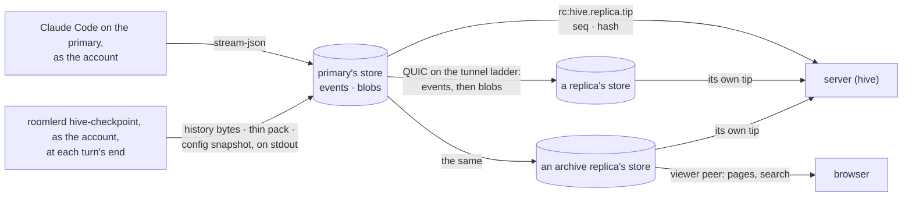

**What a member holds.** P0a's store is the base, and most of what a member needs is not in it yet.

| Piece | As built | P2 | Where |
|---|---|---|---|
| events (`seq`, `fence`, `prev_hash`, the exact JSON) | appended by one writer, which wraps each event itself, at its own clock | a member also APPLIES the primary's envelope as received, through the same chain check. The store can do it already; the daemon's writer has no command for it | `crates/hive-node/src/store.rs:136` `append`; `agents/roomlerd/src/hive/store.rs:30` `Cmd`, `:154` |
| the newest fence a member has seen | the tip's own, so only an event raises it | a fence FLOOR per session, raised by the server's word before any event of the new fence exists, and checked with the tip's | `crates/hive-node/src/chain.rs:148` |
| Claude Code's history (`<config dir>/projects/hive-<uuid>/<uuid>.jsonl`), what `--resume` needs byte for byte | not kept: it lives in the account's home, and the daemon only checks that it exists | chunks by offset, each content-addressed (BLAKE3) | `crates/hive-node/src/launch.rs:124` `history_path`; `agents/roomlerd/src/hive/supervisor.rs:1929` |
| the workspace | not kept | a git checkpoint at each turn's end, kept as a pack | design §6.3 |
| the rest of the session's config directory | not kept | a snapshot of an allowlist at each checkpoint | below |
| a tail a promotion cut off | — | events of an older fence past the newest common checkpoint, set aside | below |
| sessions purged here | — | their ids, so a purged session is never taken back | below |
| full-text search | `Store::search`, scoped to the sessions it is given, in the device crate only | the daemon's writer serves it to an archive replica's viewer peer | `crates/hive-node/src/store.rs:227` |

⚠️ **The schema stays readable by the daemon before it.** A daemon refuses a store a newer one wrote
(`crates/hive-node/src/store.rs:79`), and the updater's crash-loop rollback can put an older daemon
on a device at any time (`agents/roomlerd/src/updater.rs:1241`). P2's state goes in new tables, and
`user_version` stays 1. A rolled-back daemon then opens the store, serves what it holds and ignores
the rest; a new column on `events` would cost it every transcript.

⚠️ **The daemon never opens a path in an account's tree.** Reading the history, committing the
workspace and packing it run as the session's account, in `roomlerd hive-checkpoint`: a hidden
subcommand the daemon starts at each turn's end and reads on stdout. The daemon already runs work
as the account this way: the Unix wrapper, and on Windows `roomlerd hive-prep` (`hive_win.rs`
`run_prep`). Its reverse,
`roomlerd hive-materialize`, takes blobs on stdin and writes them into the target folder and config
directory as the target's account. A root daemon that read a path the account controls would read
whatever the account pointed it at, `/etc/shadow` included, and copy it to every member. P1j drew
the same line: the hook reads the transcript, never the daemon (§3h). Members never run git: they
keep packs as they got them.

**What the primary streams.** At the end of each turn (the stream-json `result`, in `Task::on_event`,
`supervisor.rs:2631`) the session's task runs `hive-checkpoint` and records a `checkpoint` event that
names, by hash, everything it produced. It chains like any event, so two members holding the same
`(seq, hash)` hold the same workspace and history too. A member on an older daemon stores the new
kind without reading it (`crates/hive-node/src/event.rs:25`), and the browser draws no card for it.

| What | Made by | Carried as | A member checks |
|---|---|---|---|
| events | the store's writer, as today | envelopes in `seq` order, batched like a viewer's page (≤ 500 and ≤ 1 MiB, `agents/roomlerd/src/hive/view.rs:88`) | `check_next` against its tip and its floor |
| the history | `hive-checkpoint` reads it past the last offset; a file that shrank, or changed before the offset, is sent whole | a blob per chunk | each chunk's BLAKE3, and the `checkpoint` event's length and hash for the whole file |
| the workspace | a commit through a temporary index seeded from the person's, so their index and branches are untouched; `refs/hive/<sid>/head` keeps it through `git gc`; a folder that is not a repository gets a shadow repository in the session's state directory (design §6.3) | a thin pack against the previous checkpoint; the first holds the whole tree | the tree id in the `checkpoint` event, and again when it is checked out |
| the config directory | an allowlist: `projects/hive-<uuid>/` (the history, sub-agent transcripts, tool results, file history, auto-memory) and `CLAUDE.md` | a manifest of `(path, mode, BLAKE3)`, and the files the member lacks | each file's hash |

⚠️ **An allowlist, never the directory.** A session's config directory is all of Claude Code's state,
and can hold a login if a person signs in inside it. Hive never moves a subscription credential, and a
replica never holds one (design §11.3). What Claude Code keeps where is probed before P2b is built,
as P1a's contract was (§3e).

⚠️ A checkpoint writes `refs/hive/<sid>/*` into the person's repository, as the account, and
`git push --mirror` would carry them. They go when the session ends or is purged.

⚠️ What a member logs names sessions, sequence numbers and hashes, never an event: a device's log
reaches the server through its uploader (`crates/agent-core/src/logs_upload.rs`).

**The carrier.** Four paths carry a device's bytes today, and none is a generic device-to-device
stream:

| Path | Carries | Between | Gate |
|---|---|---|---|
| the control WS | `rc:*` frames, metadata only, their field sets locked by test | device and server | the agent token |
| the WireGuard overlay, with `SplitTun` intercepting one TCP port below the OS | roomler SSH only: `agents/roomlerd/src/ssh.rs:215` is its one caller | two overlay nodes | an FR-83 grant; the target's `ssh_enabled` |
| tunnel sessions (`rc:tunnel.*`, `network`'s) | `host:port` flows on `quic-v1`, `webrtc-dc-v1`, `quic-derp-v1` or `wireguard-v1` | a tunnel client (the CLI, or a daemon for its declared routes) and an exit agent | `tunnel_policies`, then the exit's `forward_acl` |
| the viewer peer | a session's pages and live events | device and browser | a view grant the device confirms first (§3c) |

P2 keeps the design's choice (§6.4): tunnel-core's QUIC transport, without the tunnel's flows and
ACLs. Its pieces are a library already. An endpoint mints an ephemeral self-signed certificate whose
fingerprint the dialer pins, over a plain socket, a TURN relay or the established `/derp` WebSocket
(`crates/tunnel-core/src/transport/quic.rs:369`–`:479`), and the dialer presents a token the server
minted (`:586`, `:605`). The serving half is the exit agent's
(`agents/roomlerd/src/tunnel/quic_peer.rs:187` direct, `:229` TURN, `:272` DERP), the dialing half
the tunnel client's (`crates/tunnel-core/src/driver.rs:1566` `establish_quic`). The signalling is
Hive's own, `rc:hive.replica.*`, so `hive` still calls neither `network` nor `remote`
(`crates/core/src/graph.rs:24`). TURN credentials come from the stateless helper the viewer uses
(`crates/modules/hive/src/view.rs:265`), and the DERP leg rides each device's own `/derp`
connection.

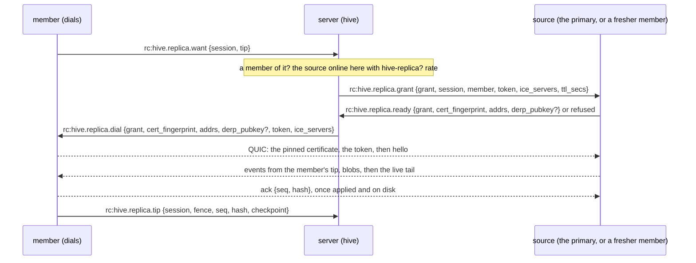

| Tier | Path | Needs | A relay sees |
|---|---|---|---|
| 1 | direct: host and server-reflexive candidates, hole-punched | UDP between the two | nothing: there is no relay |
| 2 | QUIC over TURN/UDP, with the grant's credentials | UDP to the TURN server | QUIC packets: ciphertext |
| 3 | QUIC over TURNS, TCP 443 | TCP 443 out | the same |
| 4 | `quic-derp-v1`: QUIC framed over each device's established `/derp` WebSocket | both ends overlay nodes, addressed by WireGuard key (`crates/tunnel-core/src/transport/mod.rs:44`) | the same. Under an enforcing overlay ACL, only a pair the netmap shows each other gets through (`crates/modules/network/src/derp_acl.rs:61`) |

⚠️ **The server relays a fingerprint it could replace.** Relays see only ciphertext, but the dialer
pins the certificate the server relayed, with a token the server minted, so a compromised server
could stand in the middle of a relayed stream. It gains nothing it lacks today: it can mint itself
a view grant to any session (design §13), and every grant is audited. Closing both takes a key
between the two devices that the server never learns. FR-52's binding of a session to both DTLS
fingerprints by a device-held secret (#1628, open) is that shape; it is not P2.

⚠️ **Never ratchet.** A grant lives 10 minutes and is renewed while the member follows. Each renewal
climbs the ladder again from the top and keeps the old connection until the new one carries, so a
member that fell to DERP is back on a direct path at the first renewal that finds one.

⚠️ Replica grants are pod-local, like view grants, and need both devices' sockets on the pod that
mints them. Tenant affinity puts an org's devices on one pod. While a roll moves them, a grant is
refused `device_offline`, and the member asks again.

⚠️ On Windows, a worker that goes (an update, a restart, a crash, the console session changing: §3d)
ends the replica connections with the harnesses, and the next worker asks again. A remote-desktop
connection is not one of them (P1i-4).

**The stream.** One QUIC connection per session, member and source, opened by the member, so a
member that was away catches up from where it stopped. It is the viewer's `follow` with a member's
checks (`agents/roomlerd/src/hive/view.rs:774`): subscribe first, then catch up from the store, so an
event that lands in between is in one or the other.

| Message | From | Says |
|---|---|---|
| `hello {v, session, tip, floor, checkpoints}` | member | where its copy ends, and the `(seq, hash)` of its last few checkpoints |
| `hello {v, tip}`, or `diverged {at}` | source | the source's tip; or, when the member's tip is not in the source's chain, the newest checkpoint both hold |
| `events [...]` | source | envelopes from the member's tip, in order, then the live tail as it is appended |
| `blob {kind, hash, len}`, then its bytes | source | one per QUIC stream, sent before the event that names it |
| `ack {seq, hash}` | member | applied and on disk: the events up to `seq`, and every blob they name |

⚠️ **A member's chain moves backwards in one case only.** Events of a fence older than the member's
floor, past the newest checkpoint both hold, go to the divergent table. Events at the floor's fence
never do. That is a primary's tail cut off by a promotion, and the only rewrite the store allows.

A view from a replica is read only; a driver's view is minted toward the primary, the one device
that runs the harness. Design §5.2 has a replica forward prompts to the primary. P2 does not: the
primary must be online to run a prompt anyway, and the driver can then reach it directly.

**What the server learns.** Each member reports its own tip on its own control WS:
`rc:hive.replica.tip {session, fence, seq, hash, checkpoint {seq, hash}}`, at most every 5 s and at
each checkpoint, and again in `rc:hive.replica.manifest` when it connects. The server keeps, per
member, `applied_seq`, the tip's hash, its newest checkpoint and when it was last seen (design §4.1's
`replicaset.members[]`), and the primary's `(seq, hash)` at its last checkpoints. A member whose
checkpoint hash differs from the primary's at the same `seq` is marked `diverged` and never
promoted. The frames carry numbers and hashes only, and their field sets are locked like every Hive
frame's.

This departs from design §4.4, where the primary reports its members' acks. A promotion is needed
exactly when the primary is gone, and then only the members can say how fresh they are. A member's
own word also arrives when it reconnects, without the primary.

**Membership and placement.** The policy is the org's: one document per tenant (`hive_policies`),
written by an `ADMINISTRATOR` and audited. Absent, it is decision 2's defaults:

```yaml
replicaset:
  min: 2                   # the primary and one more copy; fewer is shown, never accepted in silence
  max: 4
  archive: true            # every archive replica the rules allow
  prefer: [owner_devices]  # then the owner's own devices, last seen first, until min
  restricted_tags: [prod]  # a session on a device with one of these replicates only to devices carrying it too
retention_days: 90         # 0 keeps sessions for ever
archive_devices: []        # an ADMINISTRATOR's choice among the devices that offer themselves
```

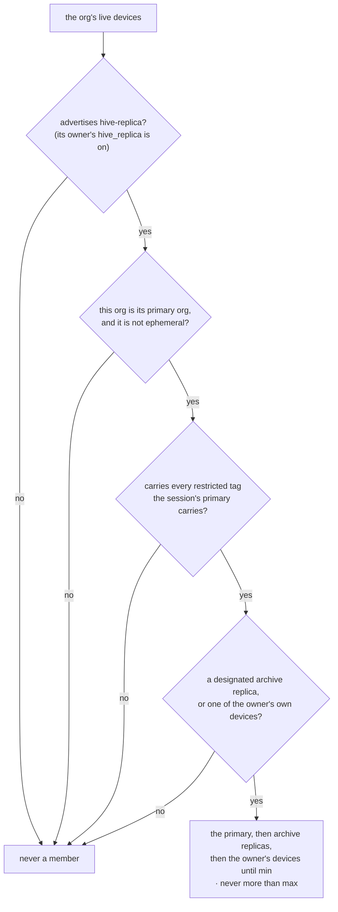

| Rule | Why | Where |
|---|---|---|
| A device holds copies only while its OWN `hive_replica` is on. It advertises `hive-replica` only then, as `hive-adopt` is advertised (`agents/roomlerd/src/encode/caps.rs:1635`), and refuses a join otherwise. `hive_archive` (it offers itself as an archive replica) and `hive_store_quota` are device keys too. None is pushable, and each joins the lock test's list | the gate that survives a compromised server. The code keeps every Hive key out of `DesiredConfig` (`crates/remote_control/src/models.rs:5401`); §3g's "can ever be pushed" is the design's allowance, not the code's | `crates/agent-core/src/config.rs:374` |
| Candidates are the session owner's own devices and the archive replicas an `ADMINISTRATOR` designated, nothing else. "The owner's own" means `enrolled_by` and `owner_user_id` both name the owner | `owner_user_id` is reassignable with `MANAGE_AGENTS` alone, and `enrolled_by` is set once, at enrollment (`crates/services/src/dao/agent.rs:99`, `:936`): a device manager who hands someone a device must not receive that person's sessions on it | `crates/remote_control/src/models.rs:1069`, `:1073` |
| A restricted tag only ever takes a device out. When no device left may hold a restricted session, the session has fewer copies than `min`, and its room says why | tags are free-form `MANAGE_AGENTS` labels (`crates/modules/fleet/src/agent.rs:1021`); as a filter they cannot widen where a copy goes. Decision 2 names prod ROLES, which are P3's, so until then the session's primary device is what carries the tag | `models.rs:1082` |
| A device that no longer qualifies (a tag taken off, its owner changed, its `hive_replica` off) gets a purge for what it may no longer hold | the rules run again when a device's tags or owner change: fleet calls a new `FleetLifecycle::agent_updated` hook (`crates/core/src/hooks.rs:109`) from its update route, as it calls `agent_renamed` there (`agent.rs:1000`) | |
| Never an ephemeral device (FR-51), never a secondary org's enrollment | an ephemeral row is hard-deleted, and could never acknowledge a purge; Hive frames count only on the primary enrollment (`agents/roomlerd/src/hive/view.rs:244`) | `models.rs:1103` |
| ⚠️ An adopted session is placed nowhere but where it was adopted | decision 11: only its owner sees it, and whoever runs an archive replica can read that replica's disk. It follows the policy once it is a managed session (P2f) | §3h |
| Placement runs when a session starts, when the policy changes, when an archive replica is designated (which back-fills the live and retained sessions it may hold, newest first), when a member goes and when tags change. A session from before P2 is placed the first time its primary connects with the switch on | a session runs on its primary whatever placement finds: replication never blocks a start | |

**Archive replicas, and the image (decision 1).** An archive replica is an always-on device of the
org, enrolled with the org as its primary org. Its owner turned `hive_replica` and `hive_archive`
on, and an `ADMINISTRATOR` designated it. It joins every session the rules allow, keeps each for the
retention, serves a session's room when no other member is online, and answers full-text search. It
runs no session: its `hive_enabled` stays off.

⚠️ **The org runs it, on its own machines.** A replica is a plaintext copy of everything the agent
saw (design §4.4), and encryption at rest is P7. An archive Roomler ran would hold every hosted org's
transcripts in Roomler's cloud, which D1 and the rule that the server never carries plaintext
forbid. Until one is online, the policy page and every room header say a session is readable only
while one of its members is, and "Add an archive replica" mints an enrollment token and shows how
to run the image.

| The image (P2h) | |
|---|---|
| what runs | `roomlerd` from the Linux release build with `hive` and `overlay-netstack`: no capture, no input, no TUN. `Dockerfile.agent-e2e` already builds an agent image this way, with a minimal feature set and an entrypoint that enrolls |
| how it enrolls | once: an entrypoint that finds no config on the volume runs `roomlerd enroll` with an `ADMINISTRATOR`'s enrollment token (single use, 10 min), never an ephemeral key's (FR-51 hard-deletes such a device once it is silent), then `roomlerd run`. The deployment fixes the hostname (a StatefulSet's pod name, compose's `hostname:`): `derive_machine_id` hashes the hostname, the OS and the config path (`crates/agent-core/src/machine.rs:21`), so two archive replicas of one org must not share a name |
| its config | `hive_replica` and `hive_archive` on; `hive_enabled` off, no `hive_accounts`, no `hive_api_key_helper`; `exec_enabled` and `ssh_enabled` off, as by default; `forward_acl.enabled = false`, so it is no tunnel exit (`crates/agent-core/src/acl.rs:43`); `auto_update = false` (`crates/agent-core/src/config.rs:824`): it updates by a new container on the same volume, never by a package installed inside one |
| where its storage lives | one volume, holding the config (the agent token, the WireGuard key) and the store (`<data dir>/hive`, `supervisor.rs:532`). The volume IS the device: whoever holds it holds every session placed there, and can pose as the device |
| what it can read | every session the rules place on it, in plaintext on that volume, for the retention |
| what it cannot | run a session or call a model; reach the org's network for anyone (no exit, no exec, no SSH); need an inbound port (a stream it serves is reached through hole punching or a relay, as any device's); take a prompt (a view from a replica is read only) |

**Promotion.** A person promotes (design §4.6): the room shows each member's freshness, and the
freshest is preselected. Automatic failover waits for P6's partition suite.

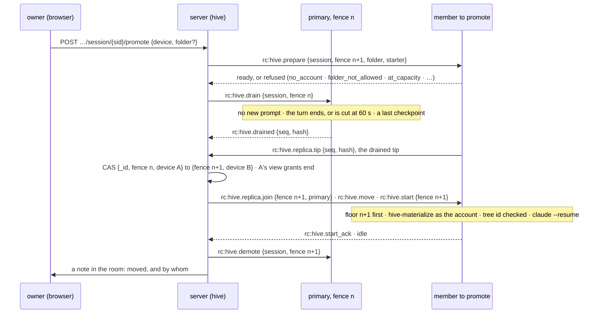

| Rule | Why | Where |
|---|---|---|
| The owner promotes, holding `HIVE_RUN` | a promotion starts the session on a device, as one of its accounts | `crates/modules/hive/src/routes.rs` `authorize` |
| Prepare first, the CAS last: the target passes every start gate, as it is configured now, before anything moves, and the lease moves only when the target's own tip equals the drained one | a refusal or a stalled sync leaves the session where it was (design §6.2) | |
| The drain waits for the turn to end, at most 60 s, then cuts it. Open approvals are withdrawn with it, and the resume note names the last tool call that has no result | | |
| ⚠️ An unreachable primary is waited out. The server promotes away from a primary whose control connection it lost only `WS_RX_DEADLINE + OFFLINE_GRACE + 30 s` (230 s) after it lost it, and closes the socket of one that ignores a drain, to start that clock | by then at the latest, the device's own sidecar has stopped serving the session (`agents/roomlerd/src/signaling.rs:60`, `agents/roomlerd/src/hive/sidecar.rs:64`, `:148`). Before it, two executors could both call the model | |
| Every member's floor is the new fence before the new primary writes: the target's with its join, the others' with theirs, an offline member's before anything else it hears when it connects | the old primary's late events are then refused everywhere (`chain.rs:148`) | |
| The new primary counts turns on from the record's last, which `rc:hive.move` carries with who moved the session and from where | the server ignores a stub older than its newest (`crates/modules/hive/src/dao.rs:368`) | |
| A start at a newer fence on a device that still runs an older one stops that run first, and `finish` and `let_go` remove only their own fence's entry | §3d ⚠️: `decide_and_launch` is idempotent on one fence only (`supervisor.rs:798`), and `finish` removes by session (`:1611`, `let_go` `:1696`), so a second harness would start, and the old run's end would take the new run's model access | |
| A start refused after the CAS moves the lease back (fence n+2, to the old primary, which holds the copy) | a session is never left on a device that refused it | |
| ⚠️ A replicated session is never launched, nor let call the model, after a start, a restart or a reconnect, until the server has said on THAT connection that this device holds it at that fence: `rc:hive.replica.join {role: primary}` lets it run, `rc:hive.demote` ends it here. A session with no other member keeps P1's behaviour | a reconnect clears the `offline_grace` clock at once (`supervisor.rs:1037`), and P1d-2's resume launches before the server has said anything (`resume_once`, `:1136`): a demoted primary that came back could call the model until the demote landed. AC4 says zero | |
| A report from a device that is no longer the session's location is answered with `rc:hive.demote` | `stop_if_over` returns for any device but the location (`crates/modules/hive/src/agent_socket.rs:512`), so an old primary would never be told | |
| The old primary forgets the session in `hosted.json` only at the demote, and stays a member if its `hive_replica` is on (else it leaves, once `min` holds elsewhere), so moving back is a promotion | a crash during a move leaves the session where it was | `agents/roomlerd/src/hive/hosted.rs` |

**Teleport, the path map and fork.** A teleport is a join, then a promotion.

| Step | Rule |
|---|---|
| prepare | the target's start gates, and on Windows its path refusals (`CON`, `NUL`, over-long) before anything moves (design §6.3 ⚠️). A device that will RUN the session needs `hive_enabled`, not `hive_replica`: the prepare admits it to this one session's replicaset |
| join | a full sync from the freshest member online, a server-class one before a laptop on the DERP floor (design §6.4) |
| the workspace | the target's `hive-materialize` names the commits its folder's repository already holds, and the source packs against them (git's have and want), so a target with a clone of the same repository receives only the session's own changes. A dirty clone is refused, and a sibling worktree offered (design §6.3) |
| promote | as above |
| the path map | `path_maps[] {fence, from {device, folder}, to {device, folder}}` on the record: metadata the server already holds as `location.folder`. Old turns keep their paths, and the resume note says where they live now |

A teleport moves the events, the history, the workspace objects the target lacks and the config
snapshot. Tool outputs in events are capped at 64 KiB (`crates/hive-node/src/stream_json.rs:49`);
the history holds them whole. The only measured rates are the mesh's, over WireGuard: about
56–66 MiB/s server to server (`docs/testing.md:179`), and 0.36–0.41 MiB/s for a corporate laptop on
DERP (FR-81 AC4). At that floor, 120 s carries 43–49 MiB, so AC10's second half is within reach only
for a target that already holds the repository and a session whose history fits. Nobody has
measured QUIC on these carriers; P2k does.

Fork:
- `POST …/session/{sid}/fork {device, folder, title?}` makes a new record with `parent_session`, a new
  room, and the forker as its owner. The forker must read the parent and hold `HIVE_RUN`.
- The fork has its own replicaset under the rules, with the parent's restricted tags: a fork of a
  restricted session is restricted.
- The target materializes the parent's last checkpoint and history under the fork's ids, and
  launches `--resume <parent> --fork-session`. Whether Claude Code takes the fork's id from Hive is
  probed first.
- ⚠️ A fork holds its parent's conversation up to the fork. Purging the parent does not purge the
  fork, and the purge says so.

An adopted session is promoted only once its terminal session has ended: the terminal holds the
harness, and two harnesses on one history would both write it (§3d). It becomes a managed session
through every start gate on the target (decision 11's half, §3h). It took no checkpoints, so its
workspace is not carried, and the resume note says so.

**The resume note.** The target composes it (design §6.6) from what the server sends in
`rc:hive.move` (who moved the session and when, and from which device, OS and folder: metadata the
record holds) and from what it knows itself: its own OS, folder and shell, the toolchain drift, and,
from its store, the last tool call without a result. It reaches the model as `SessionStart`
`additionalContext` (`source = resume`), through a hook in the daemon-owned `--settings`, which holds
none today (`supervisor.rs:2195` `write_settings`). The hook runs as the account and prints the note
the daemon wrote into the session's runtime directory, `0600` and the account's, as core memory is
written (`supervisor.rs:2243` `write_memory`). It is recorded as a `note` event and never reaches the
server. If the probe shows `-p` does not apply it, the note goes in as the harness's first input,
marked as Hive's.

**Purges and retention.** Deleting a session writes a tombstone the server keeps until every member
has acknowledged it (design §4.4, AC11):

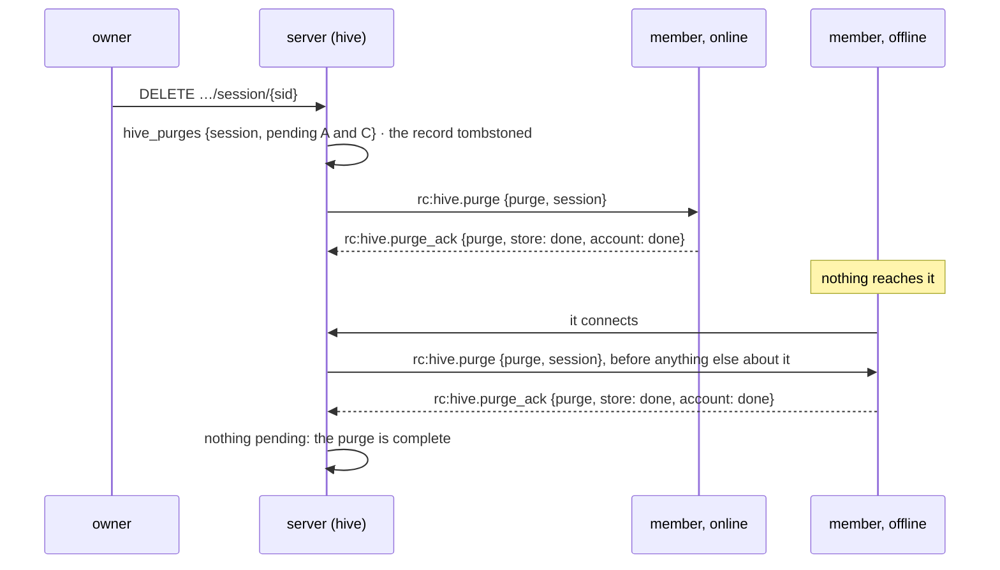

| Rule | Why |
|---|---|
| A member purges what the daemon keeps (events, index, tip: `Store::purge`, `crates/hive-node/src/store.rs:274`; blobs; membership), the session's runtime directory, and its `hosted.json` and `adopted.json` entries; then, as the account, the session's state directory (Claude Code's config directory) and `refs/hive/<sid>/*`. Never the person's working tree | Hive deletes what Hive keeps; the folder is the person's own work |
| A session live on the member stops first | |
| The acknowledgement says, per part (`store`, `account`), done, not there, or failed and why; a failed part stays pending with its reason | as remote configuration reports back: "done", "never arrived" and "could not" each have a different fix |
| Delivered like a stop: pushed to a member online, re-sent on every connection until acknowledged (`agent_socket.rs:557`) | an offline device converges through the same code as an online one |
| Removal is final: the device keeps the purged session's id and refuses any join or event for it (`purged`) | a member back with an old stream must not resurrect it |
| Each member keeps the session's `retain_until`, sent with its join and renewed by the server. Past it, the member purges on its own clock, online or not, and says so in its next manifest | a device that misses a purge must not keep the content by staying offline (design §4.4) |
| A removed device: hive's `agent_removed`, first in `HOOK_ORDER` and run while the socket still exists (`crates/core/src/hooks.rs:42`, `:109`), sends it a purge of everything it holds for the org, and its pending entries then close as `device_removed`. Its credentials are revoked, so nothing more can be asked of it; until P7 its disk keeps what it held | |
| The owner purges, and so does retention | |
| Leaving a replicaset (a tag taken off, `hive_replica` off, a smaller policy) is a purge for that member alone, sent once `min` holds elsewhere | make-before-break, as the mesh moves carriers |

**What stops two primaries.**

| A second primary would come from | What stops it | Where |
|---|---|---|
| two promotions at once | the CAS on `{_id, fence: n}`: one moves the lease, the other matches nothing | every device transition is such a CAS (`dao.rs:147`, `:221`) |
| a partitioned primary still running | its own sidecar stops `offline_grace` after its connection closed, and the server waits that out before the CAS | `sidecar.rs:148` |
| the old primary reconnecting or restarting | a replicated session runs only on the server's word on that connection | new |
| its late events | every member's floor | `chain.rs:148` |
| its reports | the server's CAS ignores them, and answers with a demote | `dao.rs:238`, `agent_socket.rs:512` |
| its viewers and approvals | the session's grants on the old device end at the CAS (`crates/modules/hive/src/view.rs:581` `end_grants`), and an approval is answered only over a grant | §3c |
| a member that took its tail | the tail is set aside, and the room says how many events did not carry over | |

**How it composes with what is built.**

| Built | P2 |
|---|---|
| the device store (`agents/roomlerd/src/hive/store.rs`) | the writer gains apply, the floor, blobs, the divergent table, purge and search. An applied envelope is published to the live feed like an appended one, so a viewer follows a session from a replica |
| `store_wanted` (`supervisor.rs:554`) | true also while `hive_replica` is on, so the archive container keeps a store |
| the hosted record and the resume (`hosted.rs`; `resume_once`, `supervisor.rs:1136`) | unchanged for what a device RUNS. Membership is the store's, not `hosted.json`'s; a promotion's target writes its entry at the new fence like any launch; a replicated session's resume waits for the server's word |
| the viewer peer (`agents/roomlerd/src/hive/view.rs`) | a member serves a session it holds on `hive_replica` alone, as an adopted session is served on `hive_adopt` (`:270`), read only. The server picks the member, where today it always names the location (`crates/modules/hive/src/view.rs:215`): the primary while it is online, else the freshest, an archive replica first (design §5.2). P2i adds `search` |
| the server module (`crates/modules/hive/`) | `agent_sessions` gains `replicaset`, `path_maps`, `parent_session` and `retain_until`; `hive_policies` and `hive_purges` come with their indexes in the module's own `indexes()` (`crates/modules/hive/src/lib.rs:197`, FR-69 rule 3); routes `…/session/{sid}/{replicas,promote,teleport,fork}`, `DELETE …/session/{sid}` and `…/hive/policy`; reconcile-on-connect re-sends joins, purges and the lease word; the composition baseline is re-recorded (rule 2) |
| the hive wire (`crates/remote_control/src/hive.rs`, `signaling.rs`) | `rc:hive.replica.*` (`join`, `join_ack`, `want`, `grant`, `ready`, `dial`, `close`, `tip`, `manifest`), `rc:hive.prepare`, `rc:hive.drain` and `drained`, `rc:hive.move`, `rc:hive.demote`, `rc:hive.purge` and `purge_ack`: metadata only, field sets locked, each `Owner::Hive` in `namespace()` (`signaling.rs:1685`), refusals decoded leniently (an unknown word still refuses), bounds in a `replica_limits` beside `view_limits` (`hive.rs:91`). `RpcCap::HiveReplica` (`hive-replica`), `HiveArchive` (`hive-archive`) and `HivePurge` (`hive-purge`), equality-matched: `hive` is a prefix of all three. The test asserting that `hive-replica` is no verb (`models.rs:4732`) changes with them |
| the module DAG | no new edge. `hive → fleet` reads devices' tags and owners, `hive → chat` posts the room's notes, TURN credentials come from the stateless helper, and DERP is the devices' own. Core gains one hook, `agent_updated` (a device's tags or owner changed): a hook is the only way fleet's change reaches hive (FR-69 rule 1) |
| §3g's gates | the device's `hive_replica`, `hive_archive` and `hive_store_quota`: default off, never pushable. The server's: the policy is an `ADMINISTRATOR`'s; promote, teleport and fork need `HIVE_RUN` and are the owner's |

**Probes before code** (P2b, zero-spend, as P1a's contract probe was, §8): what a session's config
directory holds after a few turns, and that no credential is inside the allowlist; a `--resume` on
Linux of a history written on Windows; whether Claude Code ever rewrites, rather than appends to,
its history file; `SessionStart` `additionalContext` under `-p` on a resume; and
`--resume <id> --fork-session` with an id Hive chose.

**P2b's probes, as found** (2026-10-10, §8). Claude Code 2.1.296, the field's version, ran on
Windows 11 and in a Linux container with Hive's argv, layout and environment, against a fake
Messages API, at no model spend. What each finding changes:

| Probe | Found | What it changes |
|---|---|---|
| What the config directory holds | Inside the allowlist: `projects/hive-<uuid>/<uuid>.jsonl` (the history); `projects/hive-<uuid>/<uuid>/subagents/` (`agent-<id>.jsonl`, `agent-<id>.meta.json`); `projects/hive-<uuid>/<uuid>/tool-results/` (each output too large for the context, which the history names by absolute path); `projects/hive-<uuid>/memory/`; and `CLAUDE.md`. No file history: under `-p`, nothing was kept for a `Write` and an `Edit`. Claude Code wrote no credential into any of them. At the root, `sessions/<pid>.<sha256>.key` holds a `peerToken` beside the process's messaging pipe or socket, and stays behind when the process is killed; `sessions/<pid>.json` names the machine; `.claude.json` holds a `machineID` and a `userID` | P2b replicates those five paths, listed by name, never the directory minus exclusions. File history leaves the list, and `launch.rs`'s module comment. ⚠️ The history is content: whatever a tool printed is in it, and every `CLAUDE.md` the session loaded, the account's own `~/.claude/CLAUDE.md` included when the folder is under the home. `printenv` put the session's `ANTHROPIC_API_KEY` there; that token is good only at the primary's loopback sidecar at that fence, and P3's scrub keeps it out |
| ...and outside it | Keyed by the cwd, not the pin: the MCP log (`claude-cli-nodejs/<cwd>/mcp-logs-roomler/`, connection metadata) and a background agent's output (`<temp>/claude[-<uid>]/<cwd>/<uuid>/tasks/`) | Neither is replicated. P2g's purge, as the account, also removes `<temp>/…/<uuid>/` |
| A Windows history resumed on Linux | The allowlist, copied byte for byte, resumed with the same id from another folder, and the model got every earlier turn. Claude Code itself appended the new environment (`Platform: linux`, the folder) and re-read `CLAUDE.md` at its new path. 2.1.280 resumed a history 2.1.296 wrote | `hive-materialize` writes the bytes as they came: no project-directory rename (the pin is the name on every OS), no line-ending change (the JSONL is LF on Windows), no path rewrite. Old turns keep their paths, so P2e's resume note carries what Claude Code cannot know: who moved the session, from where, and the path map, including the old config directory, which `<persisted-output>` pointers name |
| Rewrite or append | The history and the sub-agent transcripts only grow: across turns, exits, `--resume` and `/compact`, every write-open was `O_APPEND`. `meta.json` is replaced by a rename; a tool result is written once | `hive-checkpoint` chunks those two by offset, cut at a line's end so a member never holds half a line, and the rest whole, by hash. A history grows about 120 KB with its first turn and after each compaction (two `prompt_snapshot` entries; a resume added none) and 5–11 KB a plain turn, plus up to 36 KB of a large output kept beside its file |
| `SessionStart` on a resume | It fires under `-p` with stream-json input, with `source: "resume"`, and reaches the model as a `system` message after the new prompt. The history records it, so it returns at every later resume. A hook that prints nothing leaves nothing | P2e's resume note goes in as designed, without the first-input fallback: matcher `resume`, a note printed only when the daemon left one. P1d-2's restarts then add nothing, and each move's note stays in the conversation |
| A fork with Hive's id | `--resume <parent> --fork-session --session-id <fork>` takes the chosen id. With the parent's allowlist under `projects/hive-<fork>/` and the pin `hive-<fork>`, the fork wrote `projects/hive-<fork>/<fork>.jsonl` and left the parent's files as they were | P2f mints the fork's harness id with the record, as `harness_session` is minted. `LaunchSpec` gains a parent, which adds the three flags on the fork's first launch only; after it, `history_path()` exists and the fork launches like any session |

**Sub-phases.** Each is a PR behind its kill switch; §4 tracks them.

| Sub-phase | Builds | Kill switch | Criteria |
|---|---|---|---|
| P2-0 | this design | docs only | — |
| P2a | the member's store: apply, the floor, blobs, the divergent table, purged ids, search and purge on the writer; the tables additive | nothing sends it a frame | — |
| P2b | `hive-checkpoint` and `hive-materialize` as the account, on Unix and Windows; the `checkpoint` event; the probes | taken only for a session the server joined as replicated (P2c) | — |
| P2c | membership and placement: the policy, the rules, `join`, `tip`, `manifest`, the device keys, the `agent_updated` hook | `hive.replicaset = false`; device `hive_replica = false` | AC22 |
| P2d | the carrier and the stream; a replica's read-only view | the same | AC2, AC26 |
| P2e | promotion and fencing, the path map, the resume note | the same | AC4 (its stale-fence half), AC9, AC23 |
| P2f | teleport, fork, an ended adopted session made managed | the same | AC10 |
| P2g | purges and retention | `hive.replicaset = false` (issued purges wait); `retention_days = 0` | AC11, AC22 (its purge) |
| P2h | the archive replica image | opt-in: an org that runs none has none | AC24 |
| P2i | full-text search on archive replicas | device `hive_replica = false`; no search box while no archive replica is online | AC25 |
| P2j | the UI: members and their freshness, the promote, teleport and fork dialogs, the policy page, a purge | the SPA shows nothing until a record carries a replicaset | — |
| P2k | the field run, in the test org (decision 10) | — | each box above, ticked on its evidence |

AC2 grows to two devices in CI (`crates/tests/tests/hive_canary.rs`). The second is a child process,
because a process holds one supervisor (`supervisor.rs:344`), and the server's `/derp` frames join the
places the canary must not be. AC17 is P5's, because it needs a card. P2 builds its other half: with
every member offline, the room shows the stubs, where the session lives and when each member was
last seen. The box waits for the card.

**P2a, the member's store, as built.** The store and its one writer can now do everything a member
does with what it is sent. Nothing sends them anything yet: no frame, no server change, and no caller
outside tests until the join (P2c), the stream (P2d), the purge (P2g) and an archive replica's search
(P2i). A device's own appends pass the same floor and `purged` checks, and P1 creates neither, so a
running device behaves as before.

| Piece | Where | What its tests pin |
|---|---|---|
| apply | `Store::apply` (`crates/hive-node/src/store.rs:247`); on the writer, `StoreHandle::apply` (`agents/roomlerd/src/hive/store.rs:246`) | the envelope is kept byte for byte, so the member ends on the primary's `(seq, hash)`; a gap, a broken link, a stale fence, the floor and `purged` are each refused, with nothing kept or indexed; the answer comes once it is committed; it reaches the live feed once it lands, and never when refused |
| the floor | table `floors`; `Store::raise_floor` (`:328`, it only rises) and `floor`; `check_next_with_floor` (`crates/hive-node/src/chain.rs:181`) for `append` and `apply` alike, `check_next` unchanged | an older fence is refused before any event of the new one exists, and before a session's first event; the device's own append is refused the same way; with no floor the check is exactly `check_next` |
| the divergent tail | table `divergent`; `Store::set_aside_after` (`:357`) | an older fence's tail leaves `events` and the index, kept as it was, and the event at `seq` is the tip again; a tail holding the floor's fence or a newer one is refused and nothing moves; nothing moves without a floor |
| blobs | tables `blobs` (named by BLAKE3) and `blob_refs` (which sessions hold each); `put_blob`, `put_named_blob`, `get_blob`, `has_blob` (`:442`–`:530`); at most 64 MiB each | the name is computed from the bytes; a peer's bytes sent under another name are kept under neither; a damaged blob is an error when read, and the right bytes mend it; a session reads only the blobs it holds |
| purged ids | table `purged` (`session`, `purged_ms`); `Store::purge` (`:638`) also removes the floor, the set-aside tail, the session's blob references and every blob no other session holds; `is_purged` | an append, an apply, a floor, a set-aside or a blob for a purged session is refused `purged`, a stream replayed from seq 1 included; the first purge's time is kept |
| the writer | `Member` (`agents/roomlerd/src/hive/store.rs:71`): apply, the floor raised and read, a set-aside, a blob put, read and checked, purge, `is_purged`, search; each answered on a oneshot with the store's own error (`WriterError`) | search covers only the sessions named, and an empty list finds nothing. These tests run on Linux, macOS and Windows CI (`hive::`) |

⚠️ The four tables are new (`P2A_TABLES`, `store.rs:80`), each made only when missing, and
`user_version` stays 1 (`:49`). `a_daemon_from_before_p2a_reads_what_p2a_wrote` runs P0a's own
statements, frozen, on a store P2a wrote: every event is served, the chain checks, search finds
nothing set aside or purged, the old daemon appends, and P2a then finds its floor, tail, blob and
purged id again. `origin/master`'s own crate did the same once, outside CI.

Blobs are kept per session, which the design leaves open: a purge must know which blobs are a
session's (a history chunk is the conversation), and a member serving one session's blob must not
hand out another's.

⚠️ "Committed" is SQLite's WAL with `synchronous = NORMAL`: an acked event survives a daemon crash,
not a power cut, so the tip a member reports after a restart is what counts.

⚠️ Open for P2e, found while building P2a. A raised floor refuses every event of an older fence,
that fence's own history included. Three members still need such events: one behind the drained tip
when its floor rises (an offline member gets its floor before anything else), one joining a promoted
session with its floor raised, and one whose tail was set aside to a checkpoint before the promotion
point. Each would be refused for good. P2e must either raise the floor together with the drained tip,
so that an older fence is refused only past it, or raise a lagging member's floor only once it holds
that tip. A viewer following a copy whose tail is set aside keeps a cursor past the new tip and would
skip the new events, so its grant must end there.

### 3c. Chat and the viewer peer

A session is a `Secret` room with a generic `binding = {module, ref}`; turns are stub messages by an
agent author (`AuthorType::Bot`); prompts and approval answers travel peer-to-peer. Opening a room
renders stubs at once and opens a data-only WebRTC peer to a replica, behind a server-minted view
grant that the replica confirms before the browser dials. Assistant text goes through the existing
markdown allowlist (`ui/src/composables/useMarkdown.ts:57-62`); terminal blocks and diffs are
components, never HTML strings. ⚠️ Viewer peers are `close()`d explicitly — dropping one frees
nothing.

**The viewer peer as built (P0d-2).** The handshake rides the control WS; the content never does.

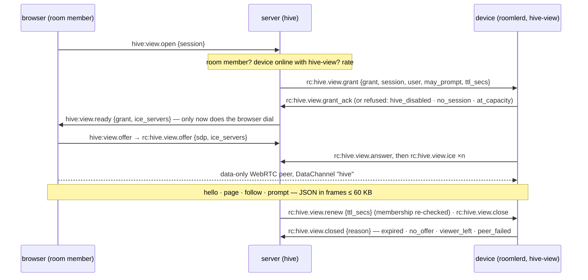

| Piece | Rule | Where |
|---|---|---|
| capability | `hive-view`, equality-matched — `hive` is its prefix and means "runs sessions", not "serves them" | `models.rs` `RpcCap::HiveView` |
| grant TTL | RELATIVE (`ttl_secs`, 10 min): the device starts its own clock, so clock skew cannot expire a fresh grant | `hive.rs` `view_limits` |
| device gates | primary org, `hive_enabled`, holds the session (live, or in its store), ≤ 8 viewers per session and ≤ 32 per device | `roomlerd/src/hive/view.rs` |
| one actor per grant | owns the peer, the timers and the channel: the one place `close()` runs; handlers capture a channel, never the peer | `view.rs` `run` |
| browser-facing ICE | as remote control's: the overlay interface kept out, `.local` candidates resolved by the OS, `ICE_RELAY_TCP` honoured; the answer goes before the device's candidates | `view.rs` `answer` |
| framing | one SCTP message over 65,536 bytes is silently LOST, so each JSON message travels as binary frames `[v1][id u32][part u16][parts u16][≤ 60,000 bytes]`, reassembled under bounds | `hive/framing.rs` |
| server gates | org AND room membership (anyone else: `not_found`, the answer a bogus id gets) · device online here with `hive-view` · ≤ 4 grants per browser connection · 20 opens / min per (user, session); `ready` only after the device's ack, a silent device is `no_answer` after 10 s | `crates/modules/hive/src/view.rs` `open` |
| whose frames count | a grant belongs to ONE browser connection and ONE device; anything else naming it moves nothing; device frames ride the per-connection ordered queue (answer before candidates) | `view.rs` `ready_grant_of`, `on_device_frame` |
| TURN credentials | minted per grant, the same for both ends, with a **12 h** TTL — the credential bounds the allocation's whole life, and the config TTL (600 s) would cut a relayed viewer at ten minutes | `turn_creds::ice_servers_for_session_with_ttl` |
| ops | `hello`, `page {after, limit}` (≤ 500 events, ≤ 1 MiB), `follow {after}` (subscribe first, then catch up: no gap, no repeat), `unfollow`, `prompt {id, text}` (only with `may_prompt`; attributed to the viewer) | `view.rs` `on_request` |

**Who takes part, as built (P1c-1).** A room has members; a session has drivers (design §4.5). The
owner names both, and only a driver's "ask the agent" travels to the harness. Everything else anyone
writes in the room is ordinary chat.

| who | reads it | prompts it, answers its approvals | stops it, names its drivers |
|---|---|---|---|
| its owner | ✅, even out of its room | ✅ while it is live | ✅ |
| a driver the owner named | ✅ | ✅ while it is live | — |
| another member of its room (a reader) | ✅ | — | — |
| anyone else, in the org or not | — (a 404, like a bogus id) | — | — |

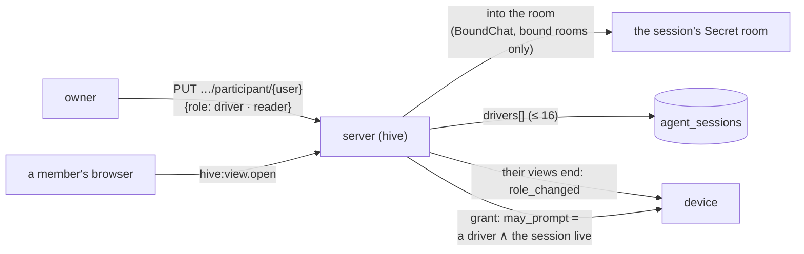

| Piece | Rule | Where |
|---|---|---|
| naming a driver | the owner only. The person must hold `HIVE_RUN`: driving runs code on the device as the session's account, and a driver answers its approvals too. **403** otherwise, audited `no_permission`. At most 16 besides the owner, held by the update's own filter | `crates/modules/hive/src/participants.rs` `set`, `dao.rs` `set_driver` |
| the room | membership through chat's module surface, for rooms bound to that module only (`BoundChat::add_bound_member`); chat's own `join` still refuses a Secret room to a non-member | `crates/modules/chat/src/bound.rs` |
| a grant | `may_prompt` = a driver and the session live, as minted. A change ends the person's views of that session (`role_changed`), and the one they reopen is minted afresh | `view.rs` `open`, `end_session_grants_of` |
| the device's word | `answered_by` and a turn's `prompted_by` are believed only when they name a driver, so no stub names anyone else | `room.rs` `approval`, `turn_stub` |
| the push | an approval goes to every driver still in the room | `room.rs` `notify_approval` |
| leaving | a member removed from the org is dropped from every session's drivers, so rejoining hands back no seat. The owner reads their own session even out of its room, because a Secret room cannot be re-entered | `hooks.rs` `member_removed`, `access.rs` `may_read` |
| transparency | every change is a note in the room: who may prompt the agent is for everyone there to see | `participants.rs` |
| the device's own gate (P1c-2) | the server names drivers; the DEVICE decides whom it lets act as one of its accounts. A driver other than the session's starter prompts and answers only when this device's `hive_accounts` maps them, by id or by a proven address, to the account the session runs as; otherwise the view is read only and `hello` says why (`driving_refused`). The starter is recognised by id from the start order, never through the map: a server before P1c-2 sends no address. Only a driver's grant carries the address | `roomlerd/src/hive/supervisor.rs` `drives_here`, `view.rs` `view_grant` |
| the model is told who asked (P1c-2) | the harness reads `[Name] …`; the transcript keeps the prompt as typed with its author beside it. A slash command goes as typed. The name is a label: brackets and control characters dropped, 64 characters at most | `crates/hive-node/src/launch.rs` `attributed_prompt` |

**The model sidecar as built (P0e).** The provider's key never enters a session.

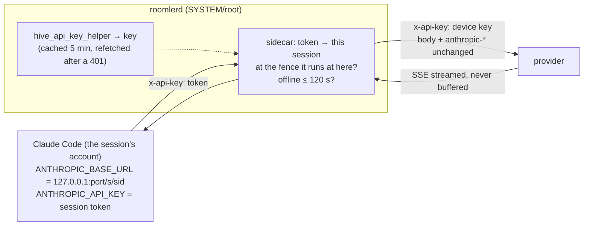

| Piece | Rule | Where |
|---|---|---|
| the key | the DAEMON runs `hive_api_key_helper`; the session's settings carry no `apiKeyHelper`, so nothing in the session can print it | `roomlerd/src/hive/sidecar.rs` `run_key_helper` |
| the token | 256 random bits per run, bound to (session, fence), minted just before the harness starts and taken back if it does not; each run revokes exactly its own token when it ends, so a run ending as the session starts again here cannot take the new run's | `sidecar.rs` `Tokens` |
| the paths | exactly `POST /v1/messages` and `POST /v1/messages/count_tokens` — what Claude Code's gateway contract needs; anything else `404 not_found_error`, `HEAD /api/hello` (its warm-up probe) harmlessly too. The device's key opens more than inference: the Files API holds every session's uploads under it, and a batch runs on after its session and its fence. `/v1/models` is left out: Claude Code calls it only under `CLAUDE_CODE_ENABLE_GATEWAY_MODEL_DISCOVERY=1`, which Hive does not set | `sidecar.rs` `forwarded` |
| the fence | a call is forwarded only while the session runs HERE at the token's fence — a stopped session, or a stale primary after a move, spends nothing | `Supervisor::sidecar_admit` |
| `offline_grace` | 120 s after the primary connection closed (and no newer one took its place), calls are refused `503 overloaded_error`; they flow again on reconnect. "Closed" is the agent's own verdict: a half-open socket (a TLS-inspecting middlebox still ACKing) counts as up until the receive-liveness deadline ends it (`WS_RX_DEADLINE`, 80 s, `signaling.rs`), so a partitioned primary's worst case is about 80 s + 120 s | `Supervisor::lost_connection` |
| the forward | method, path, query, body and headers unchanged except `x-api-key` / `authorization` (the device key swapped in) and hop-by-hop; the response streamed back as it arrives with its headers; refusals in the provider's error shape | `sidecar.rs` `handle` |

**P1f-1, the transcript's renderers, as built.** A tool call is drawn by its tool, and its result is
folded under it, matched by `tool_use_id`. A call that waited for an approval is drawn by its
approval card instead — the input the answer applies to — and its result after the answer, so the
transcript reads in the order things happened. A result whose call is outside the loaded window
stands alone. Everything is in the browser; the wire is unchanged.

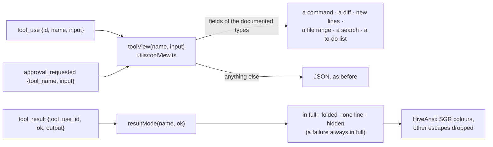

| Tool | The call | Its result |
|---|---|---|
| `Bash` | `$ command`, its description, "runs in the background" | in full, coloured |
| `Edit`, `MultiEdit` | the file, then each edit as removed and added lines; long runs of kept lines folded (3 lines of context) | its first line |
| `Write` | the file, how many lines, the first 40 as additions | its first line |
| `Read` | the file and its line range (`offset` to `offset + limit − 1`) | folded behind its line count |
| `Grep`, `Glob` | the pattern, then where | folded |
| `TodoWrite` | the list, each item to do, in progress or done | hidden |
| `WebFetch`, `WebSearch`, `Task` | the URL as text (never a link), the query, the sub-agent's task | folded |
| anything else, an MCP tool, a field of the wrong type | JSON, as before | in full |

| Rule | Why |
|---|---|
| ⚠️ Every string is the model's or a tool's, rendered by text interpolation; no `v-html` but assistant markdown through `renderMarkdown` | the one XSS boundary stays the one it was. A hostile `` in a command, a path, a diff line, a to-do or coloured output is text (a test per tool) |
| Colour comes from SGR only, as runs styled from a fixed set: a palette index 0–15, an RGB triple of integers, five flags. Other escapes are dropped, an OSC hyperlink keeps only its text, `\r` starts the line over | output can neither inject markup nor name a class or a style; a progress bar shows its last state. At most 4,000 styled runs, then plain (`utils/ansi.ts`) |
| A diff is a longest-common-subsequence table over the changed middle when it holds ≤ 250,000 cells, else every old line removed and every new one added; a side over 2,000 lines is not diffed | the truth, bounded (`utils/lineDiff.ts`) |
| An approval shows its input the same way, and is the call's only card | a driver approves an `Edit` looking at the diff, not at JSON with escaped newlines; field 2026-10-08: drawn twice, the call's result showed above the approval it came after |

**P1f-2, the long list.** While the transcript follows the newest events it keeps at most 1,000
(`keep`). The oldest go back to the device, one "load earlier" away (`useHiveViewer.trimEarlier`), and
never while someone reads further up. ⚠️ Not `content-visibility`: tried first, it made the first
scroll to the bottom land short in the field (an event off screen counts at its estimated height until
it is drawn, so the bottom moves once it is), and the window already bounds the page.

### 3d. Sessions, promotion and teleport

A session runs as the account the device maps the user to (`hive_accounts`), under `hive_roots`,
never SYSTEM/root; Windows reaches only the console user and refuses `no_console_user`. Each session
has its own Claude Code config directory with a pinned project name, launched headless on
stream-json with daemon-owned `--settings` and `--mcp-config` regenerated on every start. The
fence-bound session token gates every model call (a loopback sidecar) and every toolbelt call.
Promotion onto a replica is a lease move plus a local checkout; teleport joins the target to the
replicaset first. The updater defers while a turn runs.

⚠️ **P0 never bumps a fence** — the server creates a session at fence 1 and re-sends that fence —
so a session runs at most once per device. P2's promotion has to make a start at a NEWER fence
supersede an older run still live on the same device (stop it, then launch): as built,
`decide_and_launch` is idempotent only on the same fence, so it would start a second harness, and
the older run's `finish` would drop the newer run's live entry, and with it the newer run's model
access (`roomlerd/src/hive/supervisor.rs`).

⚠️ **A daemon restart leaves its sessions live on the server** (found in the field, 2026-10-08).
The reconcile on connect re-sends only `starting` and `stopping` sessions
(`crates/modules/hive/src/agent_socket.rs` `reconcile_on_connect`). Live ones rely on the device's
replay of its last reports, which a restarted daemon no longer holds, so the record reads `idle`
with no harness behind it. Stop clears one: the device answers "not running on this device" and
the record ends. The fix is a manifest of the sessions the device runs, sent on connect so the
server ends the rest, or P1's resume, which makes the session survive the restart. *Fixed by the
manifest in P1b. P1d-2's resume makes a session outlive a restart, and the manifest, sent after the
resume, names it.*

⚠️ **The manifest ends what the device has said it runs, and not only what it accepted**
(`crates/modules/hive/src/dao.rs` `running_on_device`). The evidence is its answer to the start
(`accepted_at`) or a run state only its own report sets (`SessionStatus::LAUNCHED`: `idle`,
`running`, `awaiting_approval`), the same rule the start route's answer reads. The state usually
lands before the answer, so a socket that drops between the two leaves `idle` with no `accepted_at`.
Reconcile never re-sends that session, because it is no longer `starting`. With `accepted_at` alone it
outlived its harness for ever. The P1b field run found one, 2026-10-08. A start the device has said
nothing about (`starting`, or `stopping`, with no `accepted_at`) stays reconcile's.

⚠️ **A device that comes back without `hive` ends what it ran** (found in the field, 2026-10-10).
Such a build runs no session and sends no manifest, so a Windows device that updated itself to
0.4.123, whose build has no `hive`, left its accepted session `idle` for ever; a crash-loop rollback
or a build made without `hive` does the same. The reconcile of a connection the hub records without
`hive` now ends those sessions as an empty manifest would, before it reads what is pending, and it
reads only its own registration: a connection a newer one displaced, or one already gone, decides
nothing (`crates/modules/hive/src/agent_socket.rs:589`, `crates/modules/fleet/src/hub.rs:1661`
`agent_supports_hive_on`).

**Updates and restarts (P1d).** Today a session's harness is the daemon's child: an update, a crash
or `systemctl restart` kills every harness, and P1b then ends the sessions. P1d is in two steps.

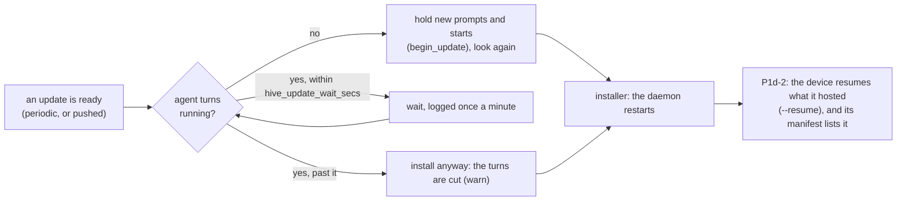

| Step | Rule | Where |
|---|---|---|
| P1d-1, the wait (AC7) | an update waits for running turns (`running` or `awaiting_approval`), at most `hive_update_wait_secs` (30 min; 0 never waits), logged when it starts and once a minute; it holds a **pushed** update too, since a person asked for the update, not for their agent to be cut. Once no turn runs, new prompts and starts are refused **before** a last look, so none begins in the gap; one admitted before still runs and is waited for. An installer that fails to start releases the hold | `roomlerd/src/updater.rs` `wait_for_agent_turns`, `hive/supervisor.rs` `turns_running` · `begin_update` |
| P1d-2, the resume (AC20) | the device keeps what it hosts on disk, and the next daemon resumes each session at its first connection, before the manifest, with every gate applied again; Claude Code is relaunched with `--resume` and the launch rebuilt in full; the turn count carries on; a turn the restart cut is reported interrupted and its open approvals withdrawn. Below | `roomlerd/src/hive/hosted.rs`, `hive/supervisor.rs` `resume_once` · `resume` · `went_down_with_daemon` |
| P1h-2, the macOS helper's hold (AC7 on macOS) | macOS installs from a root helper (`com.roomler.update`), never from the daemon, so the daemon cannot wait in-process. Before `installer(8)` the helper asks the root daemon, over its system LocalAPI socket, to hold (`HiveUpdateHold`, root only). The daemon runs the same wait and answers `HiveUpdateHeld {waited_secs, cut}`, then refuses new prompts and starts until that connection closes. A successful install has restarted the daemon by then; a failed one takes prompts again. A missing, older or silent daemon (a 2 h ceiling) gets the install it got before | `crates/localapi` `Request::HiveUpdateHold` · `serve_connection_as`, `roomlerd/src/updater.rs` `hold_for_install` · `hold_daemon_for_install`, `localapi_state.rs` `hive_update_hold` |

⚠️ `roomlerd self-update` (the CLI) does not wait: it is an operator's explicit command in another
process. Windows's update path gets the wait with its sessions (P1i).

⚠️ The hold is bound to the helper's connection, not to a timer. A helper that dies mid-wait
releases it, and so does an install that fails. Nothing else may place one: the verb is refused
to every peer but root, because a hold refuses every new prompt and start on the device.

**P1d-2, the resume, as built.** A restart still takes every harness down: under systemd
(`KillMode=control-group`) a stop sends SIGTERM to the daemon and then, a moment later, to every
process in its unit, the harness and its tools included. What changes is what the daemon does
about it.

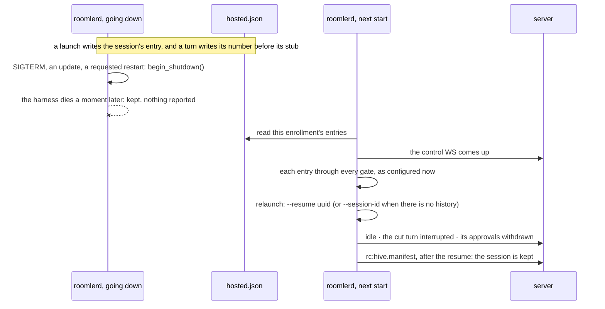

| Rule | Why |
|---|---|
| The device keeps `hosted.json` beside the replica store (root's, `0600`, written whole). Per session it holds the launch's inputs (fence, account, the folder as asked, the starter and their address, Claude Code's session id), the turns begun, the turn in progress with who asked for it, and its open approvals | after a restart the device holds nothing else: the replay of its last reports lived in memory |
| A new turn's number and a new approval are written **before** the frame that tells the server, and so is a turn's end. An approval's end is written after its frame | the server ignores a stub for a turn older than its newest, so a reused number would silence every later stub. The server edits a turn's stub to whatever comes last, so a finished turn must never be reported cut. A withdrawal sent twice changes only an approval still open |
| A harness that ends without being stopped waits 1 s before its end counts. If the daemon was told to stop by then, the session is **kept**, and nothing is reported: no `ended`, no cut turn, no withdrawal. The daemon is told by `begin_shutdown`, the moment its shutdown is signalled, by whatever signals it (an update, a requested restart, a rollback, SIGTERM, Ctrl-C), before its connections close | as built before, the daemon reported `ended` for every session it was taking down, and the server ended them |
| From `begin_shutdown` on, what the device hosts is **frozen**. The session task ignores the toolbelt, and new prompts and starts are refused ("this device is restarting") | the teardown withdraws the approvals and cuts the turn, and the frames saying so go into closing connections. Recorded, they are lost twice: on the wire, and because the next daemon finds nothing left to report. Found in the field: an approval the teardown withdrew stayed "needed" |
| The next daemon resumes at its **first connection** of the primary enrollment, once, and that connection's manifest waits for it (at most 60 s) | a manifest sent first would leave the resuming sessions out, and P1b would end every one. A device that never comes back online launches nothing |
| Every gate a start passes is passed again, as the device is configured **now**: `hive_enabled`, the starter mapped to the **same** account, the folder inside `hive_roots`, capacity, a harness. A refusal ends the session with its reason ("not resumed after the device restarted: …") and forgets it | an owner who turns sessions off, or remaps an account, and restarts must not find the session back. Its history is in the account it ran as |
| `--resume <uuid>` when Claude Code's own history exists (`<config dir>/projects/hive-<uuid>/<uuid>.jsonl`, `LaunchSpec::history_path`), `--session-id` otherwise. This holds for every launch, a start the server re-sends included | Claude Code refuses both other ways round: "Session ID … is already in use", "No conversation found" (2.1.293, probed 2026-10-08). A re-sent start after a crash used to fail the first way |
| The launch is rebuilt in full; the turn count carries on from the file; the cut turn is reported `interrupted` naming who asked; its approvals are recorded and reported `withdrawn`; the transcript says the session resumed, and which turn was cut | a resume restores neither `--settings` nor `--mcp-config` |
| The first turn of a resumed process reports no cost; every later turn reports what it cost | Claude Code restores its running total from the history's last `cost-state` entry, which only a clean exit writes, so where that process starts counting is not known on the device. No number is better than a wrong one |
| A stop that arrives before the session resumed ends it with no launch | |
| A session resumed 3 times in a row, each time without outliving the resume by 2 min, is ended instead | a resume that takes the daemon down must not become a crash loop |

⚠️ Prompts waiting behind a turn are lost when a restart cuts it. A queue exists only while a turn
runs, and an update waits that out (P1d-1). A crash, or a stop past the wait, cuts the turn, and the
transcript and the stub say so.

⚠️ `hosted.json` is not synced to disk. A clean stop, a restart and a crash all keep it. A power cut
may lose its last change, and then P1b's manifest ends what could not be resumed.

**P1h-1, sessions on macOS, as built.** The supervisor, the toolbelt, the sidecar and the viewer
were Linux-only by a `cfg` at forty-odd sites. P1h-1 compiles them for macOS too, behind one
`cfg(hive_host)` that `build.rs` sets for the `hive` feature on Linux and macOS. It makes explicit
the one behaviour that differs: who takes a harness down when the daemon leaves.

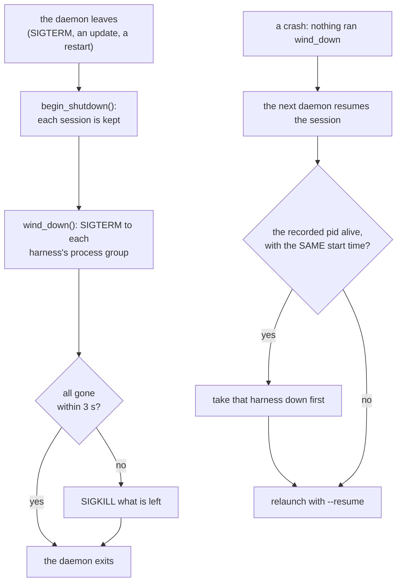

| What | Linux | macOS | Where |
|---|---|---|---|
| what builds the pillar | the `hive` feature | the same, from P1h-1 | `agents/roomlerd/build.rs` `hive_host` |
| each session's runtime files (settings, MCP config, toolbelt socket) | `/run/roomler-hive` | `/var/run/roomler-hive`, which macOS clears at boot | `hive/supervisor.rs` `RUNTIME_DIR` |
| the harness, with `hive_harness` unset | `~/.local/bin/claude`, `/usr/local/bin/claude`, `/usr/bin/claude` | the same, with Homebrew's `/opt/homebrew/bin/claude` before `/usr/bin` | `hive/supervisor.rs` `resolve_harness` |
| a harness's process group when the daemon leaves | systemd's `KillMode=control-group` kills it; `wind_down` does too, for a daemon systemd does not run | launchd does **not** kill it; `wind_down` does: SIGTERM, then SIGKILL after 3 s | `hive/supervisor.rs` `wind_down`, `hive/procs.rs` `take_down` |
| a harness a crash left running | taken down before the resume: two harnesses on one Claude Code history would both write it | the same | `hive/supervisor.rs` `reap_leftover` |
| a process's identity across time | the boot id and `/proc/<pid>/stat` field 22 | `proc_pidinfo(PROC_PIDTBSDINFO)`'s start time | `hive/procs.rs` `started` |

⚠️ A recorded pid is never signalled on its own. The start time recorded at launch (`hosted.json`
`harness_pid`, `harness_started`) must still match, so whatever holds that pid since is untouched.
Pids 0 and 1 are refused, because `kill(0, …)` is the daemon's own group and `kill(-1, …)` is
every process.

⚠️ **A link only root could have made is followed (P1h-3).** The store's directory is locked to
the daemon with no link on its way (`private_dir`, `hive/supervisor.rs:562`). FR-85's
recording-folder check refuses every link, and on macOS the root daemon's data directory is under
`/var/root`, where `/var` is the system's own link to `/private/var`: a Mac opened no store and
refused every session "/var is a symbolic link" (§8, 2026-10-10). `untrusted_link` (`:581`)
follows a link that root owns, in a directory that root owns and that nobody else may write to,
since only root could have made it, and refuses any other, as before.

⚠️ CI gains a macOS step (`cargo check` and `cargo test -- hive::` with `--features hive`).
Before it, the supervisor had never compiled for a Mac. The run on a real Mac is P1h-3.

**P1i, sessions on Windows, as designed.** Design §0.1 (D2) and §4.2: a Windows device runs a
session as the user signed in at the console, never as SYSTEM and never as anyone else. With
nobody signed in it refuses `no_console_user` (already on the wire since P0b). The supervisor P0–P1h
built is Unix-shaped at the points below. Each gets a Windows counterpart built from code the
daemon already ships. `cfg(hive_host)` grows to Windows only once all of them are in, and the
Windows release build gains `hive` last (P1i-3), so a half-built launcher never answers a start.

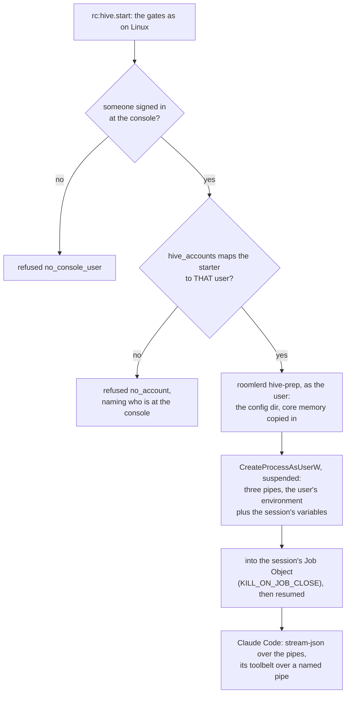

| Unix (P0–P1h) | Windows (P1i) | Built from |
|---|---|---|
| `apply_run_as` (setuid) and the `/bin/sh` wrapper | the console session's token: `WTSGetActiveConsoleSessionId` → `WTSQueryUserToken` (the daemon must be SYSTEM) → `CreateProcessAsUserW` with stdin, stdout and stderr piped, and the user's environment block plus the session's variables (`CLAUDE_CONFIG_DIR`, the sidecar's URL and token) | `win_service/supervisor.rs` `spawn_in_session_captured` (FR-89's exec streams), which gains extra variables and a suspended start |
| the account `hive_accounts` maps the starter to | the map must name the console user (`user` or `DOMAIN\user`, case-insensitive). A starter mapped to anyone else is refused `no_account`, and the refusal says who is at the console | `hive/gates.rs` `account_for` |
| the wrapper, run as the account: the config dir, the core-memory copy into an empty place | `roomlerd hive-prep`, a hidden subcommand the daemon runs as the console user and waits for, doing exactly that | new, small |
| the harness: `hive_harness`, else `~/.local/bin/claude` and the system paths | `hive_harness`, else the native installer's `%USERPROFILE%\.local\bin\claude.exe`, else npm's `%APPDATA%\npm\claude.cmd` (run through `cmd /c`, inside the same job) | `hive/supervisor.rs` `resolve_harness` |
| the harness's process group (`process_group(0)`, `kill(-pgid)`) | a Job Object per harness with `JOB_OBJECT_LIMIT_KILL_ON_JOB_CLOSE`. The harness is created suspended and assigned before it runs, so none of its tools escapes. `wind_down` and a stop end the job; a crash's leftover is found by pid and creation time | `pty/windows.rs` (the PTY's job) |
| the toolbelt's Unix socket, the account's, the peer's uid checked | a named pipe `\\.\pipe\roomler-hive-<session>-<nonce>`, created with `FILE_FLAG_FIRST_PIPE_INSTANCE` and a DACL of SYSTEM plus the console user's SID. The client's token is checked on connect | the LocalAPI pipe (`crates/localapi`), `recording/launch.rs` |
| `procs::started`: the boot id and `/proc` start time | `GetProcessTimes`'s creation time | new |
| `/run/roomler-hive/<session>` (settings, MCP config) | `%ProgramData%\Roomler\hive\run\<session>`, SYSTEM's, with read for the console user | new |
| the update wait (P1d-1) | the same `wait_for_agent_turns` in the in-process MSI updater, once `hive_host` covers Windows | `updater.rs` |

**P1i-1, the building blocks, as built.** Each is unit-tested on Windows CI: the Windows overlay
clippy lane now lints `hive` and runs `hive_win` and the whole `win_service::supervisor` suite,
which ran in no lane before. Nothing calls them yet. The supervisor is wired to them in P1i-2.

| Block | Where | What its tests pin |
|---|---|---|
| a Job Object: `KILL_ON_JOB_CLOSE`, no breakaway | `win_service/supervisor.rs:2160` `JobObject` | ending the job ends what its process started (`cmd` and its `ping`); closing its last handle ends its processes |
| the start into the job | `win_service/supervisor.rs:2277` `spawn_into_job`: created `CREATE_SUSPENDED`, assigned to the job (`:2407`), only then resumed (`:2416`). One that cannot join is ended, never resumed | the process is in its job, and sees the session's variable |
| the environment | `merge_env_block` (`:2573`): the user's own block (`CreateEnvironmentBlock`), the session's variables laid over it by name, case-insensitively, then sorted and double-NUL ended | `Path` and `PATH` are one variable; a NUL in a name or a value is refused, so it cannot smuggle in an entry of its own |
| what the child inherits | `InheritOnly` (`:2440`): a `PROC_THREAD_ATTRIBUTE_HANDLE_LIST` of its three standard handles, and nothing else the daemon holds | (the hang `pty/windows.rs` measured without one) |
| who it runs as | `SpawnAs::User(token)`. The daemon's own identity exists only under `cfg(test)`, so no build that ships can start a session as SYSTEM | |
| the console user | `hive_win.rs:135` `console_user`: `no_console_user` with nobody signed in, and `launch_failed` naming SYSTEM when the daemon may not ask. The account comes from the token's SID, the profile from the token, `%APPDATA%` from the user's own block | a test process, which is not SYSTEM, is refused and never handed a user |
| the mapping | `hive_win.rs:397` `names_console_user` and `:410` `check_mapping`: `name`, `DOMAIN\name` or `.\name`, case-insensitively. Anything else is `no_account`, naming who is at the console | a table of 15, including `CORP\dev` ≠ `WS-1\dev`, and `.` against a domain account |
| the harness | `hive_win.rs:437` `harness_candidates`, `:453` `resolve_harness` | `hive_harness` alone when set; else `claude.exe`, then npm's `claude.cmd`; a directory of that name is no harness |
| its command line | `hive_win.rs:523` `harness_command_line`: an `.exe` quoted for the C runtime; a `.cmd` through `%SystemRoot%\System32\cmd.exe /d /v:off /s /c`, an argument holding one of cmd's metacharacters (`:509`, `:513`) refused, never escaped | every argument reads back exactly through `CommandLineToArgvW`; eleven metacharacters are refused |
| `roomlerd hive-prep` | `hive_win.rs:677` `prep`, and `:730` `run_prep`, which runs it in a job of its own with a 30 s deadline; dispatched at `main.rs:1113` | the config directory is made; memory is copied only where nothing is, so a resume keeps its edits; a folder that does not open is refused; a hang is ended at its deadline |

Three decisions differ from the table above:

- `spawn_into_job` sits beside FR-89's `spawn_in_session_captured` instead of growing it, so
  `roomler exec` and SSH commands as the console user are untouched. That spawn inherits every
  inheritable handle the daemon holds, which is #1908.
- A `.cmd` harness's arguments are refused, not escaped, when they hold a metacharacter. `cmd`
  reads the line, and npm's shim passes it on again with `%*` inside an `IF (…)` block, and no
  quoting is right for both readers. Hive's own arguments never hold one.
- `hive-prep` checks that the folder opens as the user (`read_dir`). That is stricter than the
  wrapper's `cd`, and Claude Code lists the folder anyway.

Found while building it, for P1i-2: two more Unix-shaped points the table above missed. The
replica store's directory is locked with mode `0700` (`hive/supervisor.rs` `private_dir`). On
Windows that is a protected DACL of SYSTEM and Administrators, set as the directory is made, and
the runtime directory under `%ProgramData%` needs its own, because a directory there inherits
read for Users. And the sidecar runs `hive_api_key_helper` through `/bin/sh -c` (`hive/sidecar.rs:168`),
which on Windows is `cmd.exe /d /c`.

Nine negative controls each fail their test: the job without `KILL_ON_JOB_CLOSE`; the assignment
skipped (twice: the process outside its job, and ending the job leaving it running); an override
that no longer replaces the user's variable; a NUL in a value let through; cmd's metacharacters
allowed; the mapping's domain ignored; memory copied over what is there; and the backslashes before
a closing quote not doubled.

**P1i-2, sessions on Windows, wired.** `cfg(hive_host)` covers Windows now
(`agents/roomlerd/build.rs:56`): a build made with `hive` hosts sessions there. The Windows
release build gains `hive` only in P1i-3, and a device's `hive_enabled` stays off by default, so
no device changes yet. Two rows of the design table above were wrong, and the code follows what
is true:

- **The daemon is not always SYSTEM.** The process that hosts sessions is the service's worker.
  On a device installed with SystemContext (`ROOMLERD_ENABLE_SYSTEM_SWAP`) the service runs it as
  SYSTEM, in the console session, all the time: since 0.3.0-rc.7 every cycle reads as if a
  controller were connected (`win_service/supervisor.rs:852`), so `decide_spawn` (`:729`) never
  swaps it as one connects or leaves. Without SystemContext the worker is the console user,
  elevated (`ROOMLERD_ELEVATE_WORKER`, on by default), and `WTSQueryUserToken` refuses it.
  *Corrected by P1i-4's field run (§8): P1i-0 had the worker swap as a controller connects, from
  the swap's original gate, which rc.7 retired.* So
  `console_user` (`hive_win.rs:135`) takes the console session's token when this daemon is SYSTEM
  (`:159`), the filtered one for a UAC administrator, and otherwise a restricted, Medium copy of
  the daemon's own token (`:144`). That second case is FR-85's recorder rule: every administrator
  group deny-only, no privilege but traverse. Either way the session is the same person at Medium
  integrity, never elevated. The recorder's token code moved, unchanged, to `win_token.rs:209`, so
  a build without `recording` has it too.
- **The runtime files live with the store, in the service's machine-wide directory**,
  `%ProgramData%\roomler\roomler\hive` (`hive_win.rs:829`). Both workers reach it, so the worker
  a swap brings finds what the last one hosted (`hosted.json`) and resumes it; a per-user data
  directory would differ by worker. Every directory there is owned by Administrators with a
  protected DACL (`:804`, `:809`, set by `dir_with_dacl` at `:897`): SYSTEM and Administrators,
  and for a session's own directory its account, with read. Setting the owner too means a folder
  someone made there first is taken over, never trusted, since an owner keeps `WRITE_DAC` whatever
  the DACL says. A session's restricted token, with Administrators deny-only, lists and reads no
  store. *P1i-4:* the store's directory and the runtime root, which lie on the way to every
  session's files, also let anyone signed in examine the directory itself
  (`FILE_READ_ATTRIBUTES | SYNCHRONIZE`, inherited by nothing): Claude Code refuses a settings file
  whose path has a component it cannot examine (§8, 2026-10-09).

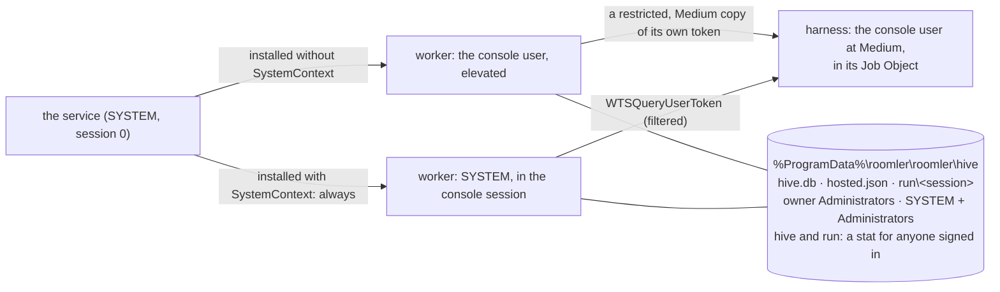

| Piece | Where | What its tests pin (Windows CI) |
|---|---|---|
| the start, as the console user | `hive/supervisor.rs:2020` `spawn`: the mapping, the harness, the session's directory (`:2156`), its settings and MCP config, `roomlerd hive-prep` as the user (`blocking`, `:2141`), then the harness SUSPENDED into its Job Object | the blocks' own (P1i-1); the whole path is P1i-4's field run |
| the harness's process | `hive_win.rs:983` `HarnessChild`: the part of tokio's `Child` the session task uses, over the job, its pipes as async files | a line in, a line out, the exit code; a kill seen by the wait |
| the stop | `hive/supervisor.rs:2946`: stdin closed, then the job ended after the grace. No signal reaches a console-less process | — |
| the toolbelt | `hive/toolbelt.rs:346`: a named pipe, `FILE_FLAG_FIRST_PIPE_INSTANCE`, no remote client, with `hive_win.rs:823`'s DACL: SYSTEM and Administrators, and the session's account to read and write (`0x12008b`) but not to make an instance. The relay opens it with exactly that mask (`hive_win.rs:944`); each client's account is checked again by SID (`toolbelt.rs:391`) | every approval test, over the pipe; another account's connection dropped unanswered; a name in use never taken as the first |
| a crash's leftover | `hive/procs.rs:120`, `:248`: creation times by `GetProcessTimes`, and an ended process reads as none even while a handle holds it open | an ended process has no start time; `take_down` ends what it is given |
| the key helper | `hive/sidecar.rs:182`: `cmd.exe /d /s /c "<helper>"`, by its full path, passed raw | — |
| adopting | `hive/gates.rs:65`: `hive_adopt` reads off on Windows, so the device never advertises `hive-adopt` | the owner's word on Unix, off on Windows |

⚠️ **What ends a session's harness on Windows, and what does not.** A session's harness lives in
the Job Object of the worker that started it, so it goes when that worker goes: a service restart,
an update, a crash, and the console session changing (a sign-in, a sign-out, a switch of user), on
which the service starts a worker in the new session. The next worker resumes the session if its
gates still allow it (P1d-2): Claude Code is relaunched with `--resume`, and a turn that was
running is reported cut (AC20). A remote-desktop connection is not one of them: with SystemContext
the worker is SYSTEM from the start and stays so, and without it the worker is the console user
throughout. Measured in P1i-4 (§8): a remote-desktop session to the device left the worker's and
the harness's processes as they were, and a turn waiting at an approval through it ran afterwards.
*Corrected: P1i-0 to P1i-3 said a remote-desktop connection swaps the worker and cuts the running
turns.*

The supervisor's own tests drive a `/bin/sh` stand-in for Claude Code and stay on Linux and
macOS. On Windows CI the lane runs `hive::` as Windows compiles it.

Six negative controls each fail their test: a client of another account let through; the session's
token not restricted (what it starts carries the High label); a directory's owner not taken
over; the pipe granting the session's account the right to make an instance; an ended process
read as running; `hive_adopt` honoured on Windows.

Not in P1i: `adopt` on Windows (the hooks CLI refuses there), and a session for anyone but the
console user. There is no S4U and no `LogonUser`: the daemon "will not ask for" credentials.

### 3e. Toolbelt, vault, knowhow

The `roomler` MCP server per session (over a per-session socket or pipe, not the main LocalAPI):
brain, knowhow, `roomler_connect`, vault, `ssh_run`, `fleet_exec` (SYSTEM/root, so a person approves
every call), forwards and SOCKS through a chosen device, child sessions. The vault follows AWS IAM
semantics in Cedar: roles assumed per session, guardrail `forbid`s, `approval` as the MFA analogue,
`simulate`. Secrets reach tools, not the model: `proxy` endpoints that authenticate (HTTP named
upstreams, a k8s API proxy, an SSH agent socket, Postgres and MongoDB proxies), then `placeholder`
substitution at a TLS-terminating egress proxy for audience hosts only; every secret is bound to its
audiences. Knowhow is built from fleet and network sync, opt-in scans and session proposals, and a
fact turns active only when a probe or a person confirms it.

**P1a builds the toolbelt with one tool, `approve`** (`agents/roomlerd/src/hive/toolbelt.rs`), and
it was built against Claude Code's contract as MEASURED, not as remembered. Claude Code 2.1.293,
driven by a fake Messages API and a fake MCP server on 2026-10-08 (§8):

| Claude Code does | so the toolbelt |
|---|---|
| probes with `server/discover` (MCP draft `2026-07-28`) before `initialize`, and initializes when told no | answers every unknown method `-32601`; silence would stall the harness's start |
| calls `approve` with `{tool_name, input, tool_use_id}` and `_meta.progressToken`, and waits | answers `{"behavior":"allow","updatedInput":<input>}` or `{"behavior":"deny","message":…}` as one text block, and sends progress every 60 s while a person decides |
| asks ONE approval at a time — two parallel writes were two calls, the second after the first was answered | caps a session at 4 open and refuses a fifth at once |
| hands the model a denial as `tool_result {is_error: true}` with our message verbatim, and lists it in the result's `permission_denials` | says who denied it and why ("Dev denied this: not now") |
| keeps the permission tool out of the model's own tool list | needs no `--disallowedTools` for `approve` |
| with the server unreachable, errors every call that needs approval ("MCP tool mcp__roomler__approve … not found") and exits 1 | fails CLOSED: nothing runs unapproved |
| starts a `-p` run that fetches no feature flags in **`auto`** when nothing sets a mode | is only reached under `--permission-mode default`, which the launch now pins |
| runs a command in its read-only set (`whoami`) and reads under the working directory without asking, in every mode | — those never reach `approve` |

Claude Code starts the toolbelt itself, as the session's account, so the server it starts is a relay:
`roomlerd hive-mcp <socket>`, short-circuited at the top of `daemon_main` like the embedded CLI, so it
runs none of the daemon's start-up and writes nothing as that account. The socket is the session
account's, `0600`, in `<runtime>/<sid>/` (root, `0755`, holding the daemon-written `settings.json`
and `mcp.json`), and every connection's peer uid is checked again — a process running as that
account can connect, and all it can do is ask. The run state is the session task's alone to write:
the toolbelt reports each approval opening and closing on a channel the task reads after the
harness's stdout, so the `tool_use` lands in the transcript before the approval it caused.

**P1a-2, the server's side.** The device tells the server THAT a session waits, how it ended and
who answered — `rc:hive.approval`, whose field set a test locks so a `tool` or `input` field is a
deliberate edit. The server keeps one `agent_approvals` record and posts ONE stub per approval (a
unique index makes a replayed opening a no-op), edits the stub when it ends, and pushes the driver
a notification that names the session and never the call — by web push to every subscription,
because a desk with the app open is not a phone in a pocket. ⚠️ Who answered is the DEVICE's word:
the answer travels over the viewer peer, so the server believes it only when it names a driver (in
P1, the starter), and no stub names a person who could not have answered.

### 3f. The brain

Central, in the `hive` module: core memory in four scopes (org, project, user, device) with budgets
and visible over-budget failure, rendered as a frozen snapshot per session into `CLAUDE.md` and
Claude Code's own auto-memory directory; facts as records with evidence, versions, contradiction
cards and decay; skills and playbooks versioned centrally and projected per session. The reviewer — a
tool-less model call — runs on a replica, never on the server, and sends distilled proposals and the
session card. Improvement is counted: corrections per session, per-skill correction rates, eval
sessions that run each skill's acceptance test.

**P1e, core memory from a hand-curated brain (AC8), as designed.** People write facts; the learning
loop that proposes them is P5.

What Claude Code does with the files, probed 2026-10-08 against a fake Messages API (2.1.293, no
model spend):
- `$CLAUDE_CONFIG_DIR/CLAUDE.md` reaches the model in the first turn as "the user's private global
  instructions for all projects". It comes under "These instructions OVERRIDE any default behavior
  and you MUST follow them exactly as written".
- `$CLAUDE_CONFIG_DIR/projects/<pinned name>/memory/MEMORY.md` reaches it as "user's auto-memory,
  persists across conversations". Its topic files reach it only when the model opens them.
- Both files are inside the session's own config directory. No settings change is needed.

⚠️ **Core memory would be the first server-authored text a session's model reads, and it reads it
as overriding instructions.** Today a compromised server cannot put one word in front of the model:
prompts come only from drivers, over the peer. Approvals still gate every tool that changes
something. But read-only tools run unasked, and the server can mint itself a view grant (§3c). So
an injected "read X and show it" becomes a path. Hence a gate that belongs to the device.

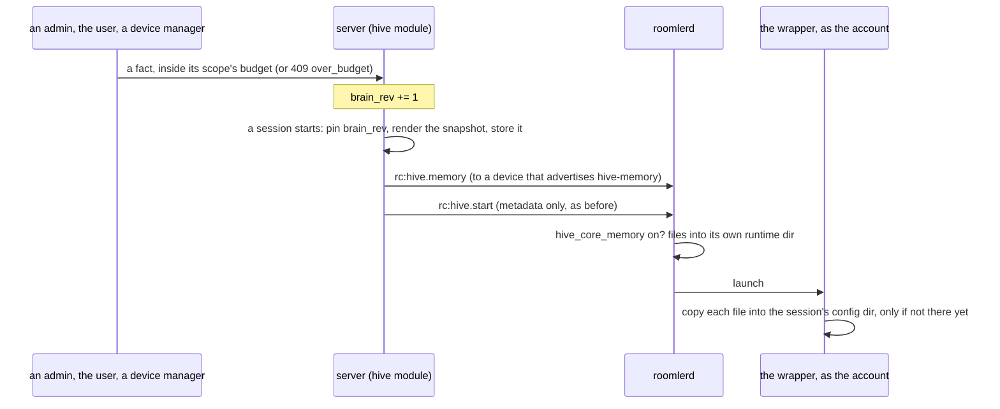

| Rule | Why |
|---|---|
| Three scopes: **org**; **user** (the session's starter); **device** (the device the session runs on). Project waits for a project identity (knowhow, P4) | the starter is whose account the session runs as |
| A fact is a record: `brain_facts {tenant_id, scope, owner_id (the user or the device; none for org), text, kind, status: active or archived, version, created_by, created_at, updated_by, updated_at}` | versions now; evidence, review and supersession come with P5 |
| Budgets: org 3,000, user 1,500, device 800 characters of active text per scope instance (design §10.3). They are held in one counter document per instance, and changed by one conditional update (`$inc` under `used ≤ budget − n`), so two concurrent writes cannot both fit | "fails visibly": a write that does not fit is `409 over_budget`, with what is used, the budget and the size asked. Nothing is evicted; a person consolidates |
| Who writes: org, `ADMINISTRATOR`; user, that user, with `HIVE_RUN`; device, `MANAGE_AGENTS`. Every write is audited (`hive_audit`, `brain`) | an org fact reaches every session in the org as an instruction |
| `brain_rev` per org, incremented by every write. A session pins it at creation. The server renders the snapshot then and stores it (`hive_session_memory`, by session): org and user into `CLAUDE.md`, device into the auto-memory `MEMORY.md` | frozen: a later fact never changes a running session (AC8), and a re-sent start carries the same snapshot |
| Delivery: `rc:hive.memory {session_id, fence, brain_rev, files}` immediately before `rc:hive.start`, and before its re-send on connect, to a device that advertises `hive-memory` | `rc:hive.start` stays metadata only, its field set locked; one socket keeps the order |
| The device's gate: `hive_core_memory`, a device key, **default off**, never pushable. Off, the frame is dropped, and the session's transcript says the device takes no core memory | the gate that survives a compromised server, like `hive_accounts` |
| The daemon writes the files into its own runtime directory (`<runtime>/<sid>/memory/`, `0755`), each `0600` and handed to the account. The wrapper, running as the account, copies each into the session's config directory **only if it is not there yet** | the daemon never writes into a tree the account owns, and no other local account reads a session's memory (its `CLAUDE.md` carries the starter's own facts). A resume (P1d-2) keeps what the session has, its own edits included. Frozen across restarts |
| No frame (an older server, or a lost one): the session runs without core memory. Its transcript says nothing of it: the note is written only when a snapshot arrived, saying which revision and whether this device shows it (`hive/supervisor.rs:1772`) | memory is an enhancement, never a single point of failure |

AC8's test is a CI test with the in-process device, its harness writing out the two files.
As built (P1e-4): `crates/tests/tests/hive_memory.rs` with the gate on, and `hive_memory_off.rs`
with it off. They are two binaries because a process has one supervisor and reads the gate once.
The harness copies out what it finds where Claude Code reads core memory, at its start and at
every turn.
- An org fact (and a device fact) is added, and session A starts: A's `CLAUDE.md` holds the org
  fact, its auto-memory `MEMORY.md` the device fact, and its transcript names the revision.
- A second fact is added: A's file does not change, even at its next turn, and session B's holds
  both, at a later revision.
- A write past the budget is refused `409 over_budget`, with the numbers. It spends nothing, and
  nothing is evicted.
- With the device's gate off, the session's config directory holds neither file, and the daemon
  did not even write its own copy. The transcript shows the frame arrived and says why.

### 3g. Gates

Running a session is remote code execution on a device, so it gets exec's and SSH's four gates:
`HIVE_RUN` in no managed role below `ADMINISTRATOR` (pinned by
`no_managed_role_below_administrator_seeds_a_root_shell`, `crates/db/src/models/role.rs:396`); a
Cedar `role:assume` permit, default deny; per-(user, device) limits after the identity gates; and the
device's own `hive_enabled`, `hive_accounts` and `hive_roots`, of which only `hive_enabled` (and
`hive_replica`) can ever be pushed, and only to devices that opted into remote config
(`crates/remote_control/src/models.rs:1410,5153`).

**P1g, the org gate, as built.** The module switch (`[modules] hive`) is all or nothing for a
server, so it has a second dial: `hive.tenants` (`ROOMLER__HIVE__TENANTS`), the organizations
agent sessions serve, as comma-separated ids. Empty or `*` is every one, which is what a
self-hosted server wants. A hosted server lists one test organization first (decision 10).

**The list is the switch** (P1g-2). A non-empty `hive.tenants` mounts the module by itself, with
no `[modules] hive`, and `/api/capabilities` says so (`Settings::hive_on`,
`crates/config/src/settings.rs`). A hosted server sets only the list, because that form fails
safe: an image from before P1g never reads the list, so with `ROOMLER__MODULES__HIVE=true` beside
it, promoting such an image — a rollback, or another session's older tag — would open the pillar
to every organization on the hosted server. With the list alone, every older image leaves it off.
Clearing the list is the kill switch.

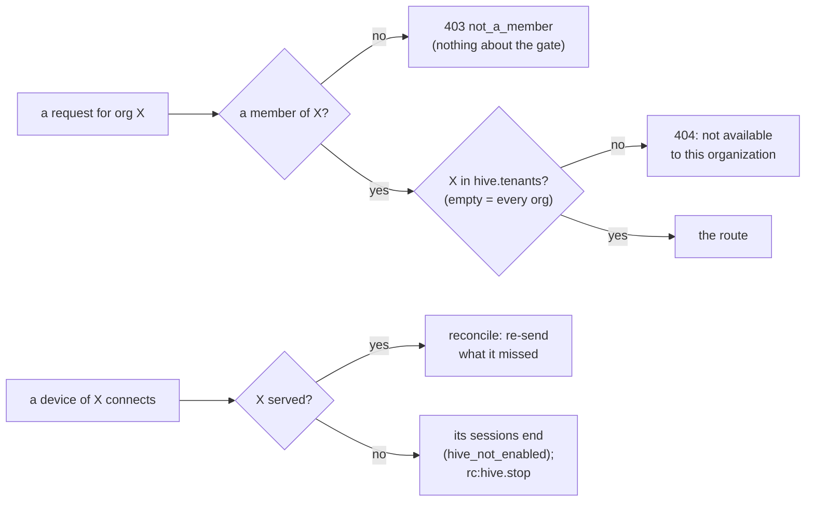

| Where | An organization agent sessions do not serve | Where in the code |
|---|---|---|
| every route | **404**, `agent sessions are not available to this organization`, after the membership check (a non-member still gets `not_a_member`) | `routes.rs` `member_tenant` |
| `GET …/hive` | the SPA's question: `{enabled: true}` or that 404; Hive's pages and nav show only where it is served | `routes.rs` `serves`, `stores/hive.ts` `checkServed`, the router guard |
| the viewer | `hive:view.open` answers `not_found`, as for a session the caller may not read | `view.rs` `open` |
| a device connecting | nothing is re-sent; what it still runs for the org ends (`hive_not_enabled`) and is told to stop | `agent_socket.rs` `end_unserved` |
| a malformed entry | logged, and it matches nothing: a typo shuts the org it meant rather than opening any other | `scope.rs` `TenantScope::parse` |
| the module switch | a list mounts the module by itself (`*` included); an image that predates P1g-2 leaves it unmounted | `settings.rs` `Settings::hive_on`, `Settings::switched_off` |

### 3h. Adopting terminal sessions (P1j)

People already run Claude Code in a terminal. `adopt` mirrors those sessions into the device's
store and lists them for their owner as read-only sessions (decision 11, design §10.8). A
terminal session passed none of Hive's start gates (`HIVE_RUN`, `hive_enabled`, `hive_roots`):
it is the person's own work, in their own account. So the gates are different ones, each
default-deny, and each owned by a different party.

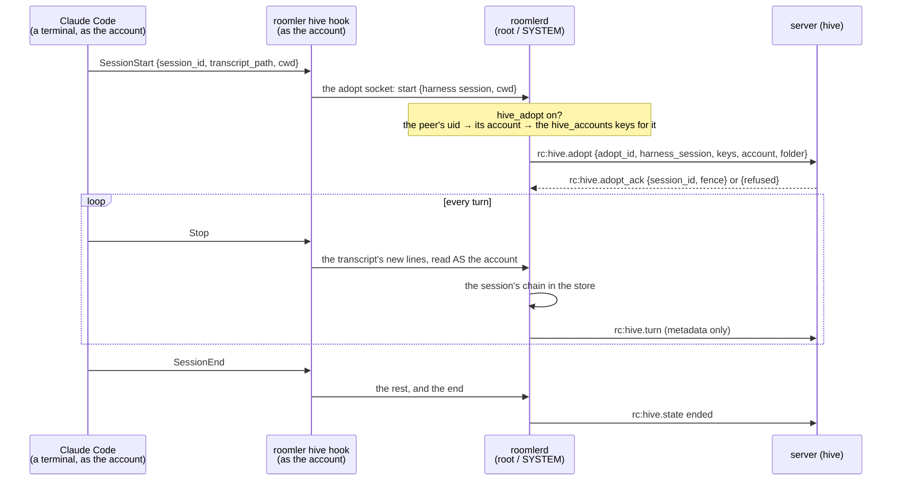

| Gate | Owner | Default | A refusal |
|---|---|---|---|
| the hooks are installed | the person, in their own user-level Claude Code settings (`roomler hive adopt`) | not installed | nothing is mirrored |
| `hive_adopt` | the device's owner: a device key, never pushable, advertised as `hive-adopt` | off | nothing reaches the server; an offer from a connection without `hive-adopt` is dropped unanswered |
| the org is served | the server (`hive.tenants`, P1g) | — | `hive_not_enabled` |
| the account names ONE person, a member | the device's `hive_accounts`, resolved by the server | — | `no_account` (no key names anyone) · `ambiguous_account` (two people) · `not_a_member` |
| capacity, rate | the server: 16 live adopted sessions a device, 20 offers a minute | — | `at_capacity` · `rate_limited` |

What each rule is, and where it lives:

| Rule | Why | Where |
|---|---|---|
| The device sends EVERY `hive_accounts` key that maps to the account; the server resolves each (a user id, or an address some account proved) and adopts only for exactly one person | the attribution is the device owner's statement, never a guess. An account shared with a second person (decision 8's `"alice.com" = "bob"`) is `ambiguous_account`, not "the one of them who is a member", which would show one person's terminal to another | `crates/modules/hive/src/adopt.rs` `people` |
| Every offer is attributed afresh. One for a terminal session already held is answered with the same record, for the same person only; held for someone else, that record ends `attribution_changed` | the device offers again after a restart or a lost ack, and a second record would split one terminal in two. A remap must never pour a new person's terminal into the old person's record | `adopt.rs` `decide` |
| No drivers, the owner included: `drives_now` is false, and naming a driver is a 409; readers by name, as for any session | the terminal holds the harness, so nothing typed here could reach it | `access.rs` `drives_now`, `participants.rs` `set` |
| The record holds no title, only the folder's name; `origin: adopted` | a terminal's first prompt is content | `model.rs` `SessionOrigin` |
| The hook reads the transcript, never the daemon | a root daemon opening a path a hook names would read any file the requester could point it at | `crates/localapi/src/hive_adopt.rs` (the protocol carries lines, never a path); `roomlerd/src/hive/supervisor/adopt.rs` `adopt_lines` |
| Who it is comes from the kernel (the adopt socket's peer credentials), not from the hook; root's own sessions are refused; a session belongs to the account that first offered it | the hook runs as whoever ran Claude Code, and says nothing that is not checked | `adopt.rs` `adopt_conn` · `adopt_hello` |
| Mirroring happens at every `Stop` (the hook runs in the background, `async`); `SessionEnd` runs in the foreground and only flushes | Claude Code gives `SessionEnd` hooks a shared 1.5 s budget, and nobody at the terminal should wait | `roomler-cli/src/hive_hooks.rs` `EVENTS` |
| `unadopt` takes out exactly what `adopt` put in; every other setting stays byte for byte (kept as raw JSON, in its order), and so does every other event and group in `hooks`; a file that is not a JSON object is refused, never rewritten; a symbolic link's target is rewritten in place, the previous bytes kept as `<file>.bak-roomler`. The containers it rewrites (`hooks`, the touched events' lists) are laid out as Claude Code writes its settings, two spaces a level, and the file keeps its final newline or its lack of one, so a file Claude Code wrote comes back from `adopt` then `unadopt` byte for byte | the person's own settings, and other tools' hooks in them (this repo's own dev box carries FR-8's), are theirs. Written compact, the containers came back on one line (P1j-5's field run, §8) | `hive_hooks.rs` `adopt_doc` · `unadopt_doc` · `render` · `write_settings` |
| The hook prints nothing and always exits 0; it sends whole lines only, at most 64 MiB a run, a line over 4 MiB or not UTF-8 as `skipped` bytes | Claude Code may show a hook's stderr and add its stdout to the model's context; a broken hook must never break a session | `hive_hooks.rs` `hook` · `next_chunk` |
| The hook entry runs the binary that installed it (`roomlerd cli hive hook` on a daemon host, `roomler hive hook` standalone) as ONE command line, the path quoted, with a 30 s timeout; never exec form (`command` + `args`) | `roomlerd` with no arguments RUNS THE DAEMON: a Claude Code that dropped an `args` list it did not know would start a daemon as the person at every hook. A version that knows no `async` waits at most the timeout | `hive_hooks.rs` `HookCommand` |
| A terminal killed outright never says `SessionEnd`: the daemon records Claude Code's process (pid + start time) and ends a session whose process is gone, every minute. Claude Code's process is the hook's nearest ancestor that is not a shell: Claude Code runs a hook's command line through `/bin/sh -c`, and dash forks it rather than exec it | otherwise a crashed terminal stays "live" forever. Taking the hook's parent, the `sh` that exits with the hook, ended every adopted session at the next sweep while its terminal ran, and the next turn offered it again as a new record (P1j-5's field run, §8) | `adopt.rs` `adopt_sweep`, `hive/procs.rs` `hook_terminal` |
| The device serves an adopted session's viewer on `hive_adopt` alone, and holds no input channel for it. That includes an ended one: the device keeps the records of the last 1,000 adopted sessions that ended here | a device may allow adopting with `hive_enabled` off, and the viewer refused every grant on `hive_enabled` before P1j. Counting only the sessions it still held, the device refused an owner their own ended session `hive_disabled` (P1j-5's field run, §8). `may_prompt` is false from the server, and a prompt for a session the device does not run is refused anyway | `hive/view.rs` `grant`, `adopt.rs` `adopt_holds` |
| Only the person's conversation is mirrored: `user` and `assistant` lines, never a subagent's (`isSidechain`) or Claude Code's bookkeeping (`isMeta`, every other line type); a line that is not JSON is skipped | the on-disk transcript is Claude Code's internal format: a change in it must thin the mirror, never stop it | `adopt.rs` `read_line` |
| `hive-adopt` is advertised only while `hive_adopt` is on, and the socket exists only then: a daemon started with it off removes a socket its predecessor left. `roomler hive adopt` tells whether the device adopts by connecting, never by the file | a device whose owner has not allowed adopting offers nothing, and says so. The leftover file read as "this device adopts" (P1j-5's field run, §8) | `encode/caps.rs`, `adopt.rs` `adopt_listen` · `adopt_remove_stale_socket`, `hive_hooks.rs` `device_adopts` |
| A stop from Roomler stops the mirroring, for good: the terminal session goes on, the record ends, and later hooks are refused `stopped`. A stopped session is held until its terminal ends, at its `SessionEnd` or when the sweep finds its process gone, and is then forgotten as every ended session is. A `claude --resume` later is offered afresh, as a new record mirrored from the start of its transcript | the terminal is the person's; Roomler can only stop watching it. Held for good, every stopped terminal stayed in the file forever, and a resume was refused `stopped` (P1j-5's field run, §8) | `adopt.rs` `adopt_stop` · `adopt_hello` · `adopt_sweep` · `AdoptedFile::retire` |
| The UI marks an adopted session (**Adopted**), says its transcript is read-only because it runs in a terminal, offers readers only, and its Stop reads **Stop mirroring**; a prompt typed in the terminal reads **In the terminal**, where an unknown author reads "Someone" elsewhere | a session nobody can prompt must not look like one somebody forgot to | `HiveSessionsView.vue`, `HiveTranscript.vue`, `HiveParticipants.vue`, `ChatView.vue` (`isAdopted`) |
| What the device keeps: `adopted.json` beside `hosted.json` (root, `0600`, written whole) — per session the record, the account and uid, the transcript offset, the turns, Claude Code's process; and the records of the last 1,000 adopted sessions that ended here | a restarted daemon goes on mirroring where it stopped, names the sessions in its manifest, and still serves an ended one to its owner | `adopt.rs` `AdoptedFile` |

⚠️ Its "an adopted session becomes a managed one when promoted" half needs P2's replicaset.

## 4. Phases

| P | What | Kill switch | Status |
|---|---|---|---|
| claim | issue, this spec, the design, the ledger row | docs only | **merged** #1828 `dc1b05581` |
| P0 | spike: `hive` module skeleton; one headless Claude Code session on one Linux device driven from a chat room; events in the device store; stubs to the server; content over a viewer peer; sidecar pass-through with the fence; `RunAs::Named` with a working directory | `[modules] hive = false`; device `hive_enabled = false` | — |
| P0a | the device core, `crates/hive-node`: transcript events and their hash chain (one writer, no gaps, an unknown kind still chains), the stream-json adapter, the replica store (SQLite + FTS5, search scoped to granted sessions), the launch spec (per-session config dir, pinned project name), `hive_roots` confinement | linked by no binary yet | **merged** #1831 `8e41174ed` |
| P0b | the server side, `crates/modules/hive` (`hive → fleet`): the `agent_sessions` record and its lifecycle, `hive_audit`; start / list / get / stop routes; the wire (`RpcCap::Hive`, `rc:hive.start`·`stop` → `rc:hive.start_ack`·`state`, metadata only, lenient refusal words); `HIVE_RUN` (bit 32); reconcile-on-connect for unanswered starts and unconfirmed stops; member, device and org removal end their sessions (`member_removed` now runs from the remove-member route). No device runs a session yet | `[modules] hive = false` — the only module switch that defaults OFF | **merged** #1835 `8bf103be2` |
| P0c | the device side, `roomlerd` feature `hive` (Linux): device keys `hive_enabled` (off) / `hive_accounts` (nobody) / `hive_roots` (nowhere) / `hive_max_sessions` / `hive_harness` / `hive_api_key_helper`, none pushable; advertise `hive`; the device's gates answer `rc:hive.start` (primary org only, idempotent on session + fence); Claude Code launched headless as the mapped account through `exec::apply_run_as` (uid 0 refused), its config dir made by a wrapper running AS that account, a daemon-owned settings file; stream-json recorded in the replica store by one writer thread; `idle` / `running` / `ended` reported, replayed on reconnect; stop = stdin EOF + SIGTERM to the process group, then SIGKILL | feature `hive` is not in `full` (no release build compiles it); device `hive_enabled = false` | **merged** #1836 `a433c4dcf` |
| P0d-1 | the session room (`hive → chat`): each session is a `Secret` room at path `hive-<session>`, bound `{module: "hive", ref: <session>}`, its owner the only member — anyone else reads a 404; chat gains a generic `binding` on rooms and messages (stored, never interpreted) and agent authorship (`author_type: bot` + `author_display`, read only for a non-user author; the author id is the session's, so the edit and delete routes refuse every person); the session authors a note when it starts, is refused or ends — every server-side end included — and one **turn stub** per turn from `rc:hive.turn` (number, status, who asked, steps, duration, cost: the frame's field set cannot carry content), edited in place when the turn ends and never rewound by a late report of an older turn; the device counts turns and holds a prompt sent during one (at most 8 waiting, past that refused to the caller); and what is over stays over: a device that reports it RUNS a session whose record ended while it was away (a removed starter, an archived org) is answered with a stop — P0b had no path to it, since reconcile re-sends only what is pending | `[modules] hive = false`; feature `hive` not in `full` | **merged** #1837 `4aedc5f70` |
| P0d-2a | the viewer peer, device side: the `rc:hive.view.*` wire (grant · renew · offer · ice · close, and the device's grant_ack · answer · ice · closed) and capability `hive-view`; one actor per grant owning a data-only WebRTC peer (RC's browser-facing ICE setup); the `hive` DataChannel in bounded binary frames; `hello` / `page` / `follow` / `prompt`; the store's page, tip and live feed | feature `hive` not in `full`; no server sends a grant yet | **merged** #1839 `ca5e282cc` |
| P0d-2b | the viewer peer, server side: the `hive:view.*` user-socket namespace, the grant table (room member, `may_prompt` = the starter while live, rate), ready only after the device's ack, the SDP/ICE relay, renew re-checks membership, close on socket close and member removal, audit; viewer TURN credentials minted per grant for 12 h (the config TTL would cut a relayed viewer at ten minutes) | `[modules] hive = false` | **merged** #1841 `21e64950b` |
| P0d-3 | the UI: `hive` in the SPA's module registry (default-OFF, so the capability gate fails CLOSED for it, where every other module fails open); `stores/hive` (the record); `views/hive/HiveSessionsView` (list, start dialog, stop); `useHiveViewer`, the browser's half of the viewer peer (`hive:view.*` signalling, a data-only peer dialled only after `ready`, the framing, history + live follow + "ask the agent", `close()` on every way out); `HiveTranscript` as a side panel of a hive-bound room (assistant text through `renderMarkdown`, everything else text-interpolated); `SessionView` gains `device_name` | the server's `[modules] hive` — the SPA shows nothing until the server names the module | **merged** #1842 `eef760896` |
| P0e | the model sidecar: a loopback HTTP/1.1 endpoint in the daemon. The harness gets `ANTHROPIC_BASE_URL=http://127.0.0.1:<port>/s/<sid>` and a per-session token in `ANTHROPIC_API_KEY` — never the provider's key, which `hive_api_key_helper` prints to the DAEMON (cached 5 min, fetched again after a 401). Each call: this session's token, the session still running here at its fence, the device not offline past `offline_grace` (120 s), else refused in the provider's error shape; only `POST /v1/messages` and `/v1/messages/count_tokens`, matched exactly; forwarded unchanged with the key swapped in, the answer streamed (never buffered), `retry-after` and the rate-limit headers intact | feature `hive` not in `full`; no helper = no model access | **merged** #1843 `12bdadc4e` |
| P0f | the canary test (AC2, one device): `crates/tests/tests/hive_canary.rs`, its own test binary because the supervisor is process-global, drives a real server and a real in-process device (`hive::init_as_daemon`, feature `hive-test-launcher`: sessions as the test's own account, refused as root, in no release build). A prompt over the viewer peer, a tool's output, and a crashing harness's stderr each carry a canary; each must be in the device's store and in no Mongo document, object-store file, server log line or frame the server sent the browser — each absence checked beside a presence that proves the check can see. It found one channel: the `ended` detail carried the harness's last 400 bytes of stderr to the server, now a `note` in the device's transcript | a test; `hive-test-launcher` is test-only | **merged** #1844 `11f1838d7` |
| P0g | the AC1 field run's six findings: the server takes a start's answer in any live status (the daemon's `idle` lands first); the viewer waits for the socket before asking, and asks again after a redial; the device wires its channel's handlers inside `on_data_channel` (webrtc-rs reads the channel only after that callback returns) and the browser asks `hello` again until it is answered; `hive_api_workspace_id`, sent by the sidecar as `anthropic-workspace-id`; a turn records what it cost, not the process's running total; a repeated session announcement is shown once | fixes; `hive_api_workspace_id` unset = unchanged | **merged** #1846 `601cc10f8` |
| P1a-1 | approvals, the device and the UI: the session's **toolbelt** — one `roomler` MCP server per session on `<runtime>/<sid>/toolbelt.sock` (the session account's, `0600`, in a directory only the daemon writes; every peer's uid checked again), reached by the relay `roomlerd hive-mcp <socket>` that Claude Code itself starts as that account; its `approve` is the `--permission-prompt-tool`. The launch pins `--permission-mode default` (unset, a run behind the sidecar starts in `auto`, where a classifier decides), `--strict-mcp-config` (a repository's `.mcp.json` cannot shadow `roomler`) and `--disallowedTools AskUserQuestion`. While one is open the session is `awaiting_approval`; the transcript gets `approval_requested` (the call's own input) and `approval_resolved`; the viewer's `hello` names the open approvals, the device pushes `approvals` when they change, and a DRIVER's `answer {approval, allow\|deny, message?}` is taken, a reader's refused. Unanswered for 25 min is a denial that says so; a stop, or the harness letting go, withdraws it. The UI's approval card: Allow, Deny with a reason | feature `hive` not in `full`; device `hive_enabled = false` | **merged** #1848 `e2d8742f9` |
| P1a-2 | approvals, the server: `rc:hive.approval {approval_id, turn?, status, answered_by?}` (metadata only, the field set locked by test) → `agent_approvals`, one record per (session, approval) by a unique index, its end a compare-and-set on `open`; ONE stub per approval in the session's room ("Approval needed · turn N — open the session to answer"), edited to how it ended; `answered_by` believed only when it names a driver; a session's end withdraws what is open; the driver notified in the app and by web push to every subscription ("Claude · <device> needs approval", the session's title, its room); `NotificationType::ApprovalRequest` with a `#[serde(other)]` fallback; the device replays the newest word of its last 16 approvals on reconnect | `[modules] hive = false` | **merged** #1853 `20b66eeee` |
| P1a-3 | Bash that runs on any host, found by P1a's field run: the launch no longer sets `CLAUDE_CODE_SUBPROCESS_ENV_SCRUB` (on Linux it makes every command sandboxed, and without bubblewrap and socat every one is refused — the real reason P0 could not run `whoami`); the session's settings keep `sandbox.autoAllowBashIfSandboxed: false`, so a sandbox that comes on — ours in P3, or the user's — never takes Bash out of the approvals | a fix | **merged** #1855 `d0b4f7e2c` |
| P1b | finding (7), a daemon restart left its sessions live on the server: on every connection of its primary enrollment the device sends `rc:hive.manifest`, the sessions it runs NOW (ids and fences, the field set locked); the server ends each session it holds as running there — live, and launched there on the device's own word: its answer, or a run state only it reports (§3d) — that the list leaves out (`not_on_device`, or `stopped` for one being stopped), its room told and its open approvals withdrawn. A start the device has said nothing about is reconcile's, not the manifest's; another device's list, an oversized one, or none at all (an older build) changes nothing | a fix; an older device sends no manifest | **merged** #1860 `e57e8b332` |
| P1c-1 | drivers, the server (§3c "Who takes part"): `agent_sessions.drivers`; the owner names a reader or a driver (`PUT`/`DELETE …/participant/{user}`), into the session's Secret room through chat's bound-room surface; a driver needs `HIVE_RUN`, at most 16; `may_prompt` = a driver while live, and a change ends the person's views (`role_changed`); `answered_by` and `prompted_by` believed only for a driver; the approval push to every driver in the room; any room member reads the session; a member who leaves the org drives nothing; every change audited (`participant`, with `target_id`) and noted in the room | `[modules] hive = false` | **merged** #1862 `9b59b59fa` |
| P1c-2a | drivers, the device (§3c "Who takes part"): a driver other than the session's starter prompts and answers only when the device's own `hive_accounts` maps them to the session's account — the gate that survives a wrong server; the starter recognised by id; `hello` says why a named driver is read only (`driving_refused`); `rc:hive.view.grant` carries the viewer's address, a driver's only (the field set locked); the harness reads `[Name] …` | feature `hive` not in `full` | **merged** #1864 `a77ea6455` |
| P1c-2b | AC6's capture test, end to end (`crates/tests/tests/hive_drivers.rs`, a test binary of its own): a real server and a real in-process device; a reader's message in the room and a prompt over their own peer never reach the harness (its stdin captured), while the owner's and a named driver's do, each labelled `[Name] …`. The canary's scaffolding is shared as `tests/hive_support`. A reader's approval answer is the device's unit test's (`a_driver_answers_an_approval_over_the_peer_and_a_reader_cannot`) | a test | **merged** #1866 `4d3958bd6` |
| P1c-3 | drivers, the UI: `HiveParticipants`, the transcript's **People** dialog (the owner adds an org member as a reader or a driver, changes their part, takes them out; anyone else sees who takes part; a refusal shown in the server's words); the composer's two modes ("ask the agent" in the transcript for drivers, the room's own composer for everyone, which never reaches the agent); a reader told they read and talk, a named driver the device keeps read only told why in the device's words; a view reopened on `role_changed` | the SPA shows nothing until the server names the module | **merged** #1865 `1a05041e7` |
| P1d-1 | the updater waits for running agent turns (AC7, §3d "Updates and restarts"): ≤ `hive_update_wait_secs` (device key, 30 min; 0 never waits), the periodic check AND a pushed update; logged when it starts and once a minute; new prompts and starts held once it goes ahead; a debug build's `ROOMLERD_UPDATE_DRY_RUN` waits exactly as a real update and installs nothing — and refuses every installer spawn, the crash-loop rollback included (the field check) | `hive_update_wait_secs = 0` | **merged** #1869 `8da45c3d6` |
| P1d-2 | a restart resumes what the device hosted (AC20, §3d "P1d-2, the resume, as built"): `hosted.json` beside the store; `begin_shutdown` the moment any shutdown is signalled, so a harness that dies with the daemon is kept, not ended, and from then on the record is frozen and the toolbelt ignored (the field run's finding: an approval the teardown withdrew stayed "needed"); the resume at the first connection, before the manifest, through every gate as configured now (the same account, or none); `--resume` exactly when Claude Code's history exists, for every launch; the turn count carried on, a cut turn reported interrupted, its approvals withdrawn; a resumed process's first turn reports no cost; a stop before the resume launches nothing; 3 quick resumes in a row end the session | delete `hosted.json` (nothing resumes; P1b ends what it hosted); device `hive_enabled = false` | **merged** #1870 `8238be712` |
| P1e-0 | core memory's design (§3f "P1e … as designed"): the zero-spend probe of what Claude Code does with `CLAUDE.md` and the auto-memory index, the device gate it calls for, scopes, budgets, the pinned snapshot, delivery, and AC8's test | docs only | **merged** #1871 `bf7d663a8` |
| P1e-1 | core memory, the server: `brain_facts`, the budget counters (one conditional upsert over a unique index; a refusal recounts once), `brain_rev`, the routes under `/tenant/{tid}/hive/brain` (list · keep · edit at a version · archive), the snapshot rendered and stored per session (`hive_session_memory`, 1 d TTL) and pinned on the record (`brain_rev`), `rc:hive.memory` sent before `rc:hive.start` and before its re-send, `RpcCap::HiveMemory` (`hive-memory`, equality-matched), the audit (`action: brain`; `hive_audit.device_id` is optional now, since an org or user fact concerns no device). A removed member's or device's facts stay as records and are never rendered | `[modules] hive = false` | **merged** #1872 `f89742af9` |
| P1e-2 | core memory, the device: `hive_core_memory` (default off, never pushable — locked with the other device gates); `hive-memory` advertised by every `hive` build; `rc:hive.memory` kept per (session, fence) for that start's launch (the primary enrollment's only, ≤ 32 KiB a document, ≤ 64 waiting, 10 min); at launch the files go into the daemon's own `<runtime>/<sid>/memory/` (each `0600` and the account's: no other local account reads them), and the wrapper copies each into the session's config dir (`CLAUDE.md`, and the auto-memory `MEMORY.md` under the pinned project name) as the account, only into an empty place, so a resume keeps the session's own copy; the transcript names the revision, or says the device shows none. A negative control (the gate check removed) fails its test on the leak | device `hive_core_memory = false`, the default | **merged** #1873 `4ff5b73db` |
| P1e-3 | core memory, the UI: the **Agent memory** page (`hive/HiveMemoryView`: facts by scope — organization, yours, a chosen device — with budget meters; add, edit at the version read, archive; a refusal, `409 over_budget` or a 403, shown in the server's words with the draft kept) | the SPA shows nothing until the server names the module | **merged** #1874 `776bc34a7` |
| P1e-4 | AC8 end to end in CI (`hive_memory.rs`, the gate on; `hive_memory_off.rs`, the gate off; see the AC8 test above), and the field run | a test | **merged** #1875 `bc717a495` (field-verified 2026-10-08, §8) |
| P1f-1 | the transcript's renderers (§3c "P1f-1 … as built"): a tool call drawn by its tool — a command line, an edit as a diff, a new file's first lines, a file range, a search, a to-do list — its result folded under it by `tool_use_id`; output coloured from SGR, every other escape dropped; an approval shows its input the same way | none: the old JSON view is the fallback for anything off-shape | **merged** #1876 `5c770db51` (field-verified 2026-10-08, §8) |
| P1f-2 | the long list (§3c "P1f-2, the long list"): following the newest, the transcript keeps at most 1,000 events, the oldest a "load earlier" away, never while someone reads further up (`content-visibility` was tried and dropped: the first scroll to the bottom landed short) | none: the device keeps every event; the window is the browser's | **merged** #1877 `48cc6d17a` (field-verified 2026-10-08, §8) |
| P1g | the org gate (§3g "P1g … as built"): `hive.tenants`, the organizations agent sessions serve; every route, the viewer and a connecting device answer an unserved one as if the module were not there for it; `GET …/hive` for the SPA | `hive.tenants` empty (every org), and the module switch itself | **merged** #1879 `f3fcfd956` |
| P1g-2 | the list is the switch (§3g): a non-empty `hive.tenants` mounts the module with no `[modules] hive`, and `/api/capabilities` reports it — so an older image leaves the pillar off instead of open to every organization | clearing `hive.tenants` | **merged** #1887 `6c9be55c5`; on prod since 2026-10-09 (`hosted-20261009-6c9be55`), serving the test org only (§8) |
| P1h-1 | sessions on macOS, the build (§3d "P1h-1 … as built"): the supervisor, toolbelt, sidecar and viewer compile for macOS (`cfg(hive_host)`); the harness's macOS paths; the daemon takes its harnesses down when it leaves, which launchd does not; a harness a crash left running is reaped before the resume; a macOS CI step | device `hive_enabled = false`, the default | **merged** #1888 `16d98a451` |
| P1h-2 | the macOS update helper waits for running turns (AC7 there), and `hive` in the release builds for Linux and macOS: every gate stays the device's, default-deny | the feature itself; device `hive_enabled = false` | **merged** #1900 `f9d5db0b3` |
| P1h-3 | the field run on a Mac in the test org on prod (decision 10): AC3, AC7 and AC20 on macOS. Two findings, both fixed in #1927: (1) a Mac opened no store, so it refused every session, because `/var` is a link; (2) an account in more than 16 groups could not be run as (§8) | device `hive_enabled = false`, the default | **field-verified** 2026-10-10 |
| P1h-4 | a Unix session and root (decisions 13 and 15): no administrator group; on Linux `no_new_privs`, so no `sudo` (#1934, field-verified, §8); on a Mac, whose `sudo` reads the account's groups from the directory (§8, #1935), a start as an account whose `sudo` needs no password is refused `passwordless_sudo`, checked as root with `sudo -l -U` before every launch and resume (`hive/sudo.rs`) | device `hive_allow_passwordless_sudo` (default off, never pushable) | **field-verified** 2026-10-10 (#1936, §8) |
| P1i-0 | Windows sessions' design (§3d "P1i … as designed"): the console user only; each Unix-shaped point and its Windows counterpart | docs only | **merged** #1906 `25d0b1fc0` |
| P1i-1 | the launcher and its refusals (`no_console_user`, the console-user mapping), `roomlerd hive-prep`, the suspended start into a Job Object, `resolve_harness` on Windows; compiled and unit-tested on Windows CI | `hive` not in the Windows release build; device `hive_enabled = false` | **merged** #1909 `49f6d820a` |
| P1i-2 | the toolbelt over a named pipe; take-down and a crash's leftover by Job Object and creation time; the resume (`hosted.json`) on Windows | the same | **merged** #1913 `fb8a4e1bd` |
| P1i-3 | `hive` in the Windows release build | device `hive_enabled = false`, the default | **merged** #1915 `8b55886ac` |
| P1i-4 | the field run on a Windows VM in the test org: AC3, AC7 and AC20 on Windows (§8). Two findings: (1) Claude Code could not examine the store's directory or the runtime root, so it refused every session's settings (fixed, #1919); (2) a session stays `idle` once its device's agent no longer runs sessions (fixed, #1925). A remote-desktop connection swaps no worker, though P1i-0 expected it to | — | **field-verified** 2026-10-10 |
| P1j-1 | `adopt`, the server (§3h): `rc:hive.adopt` → `rc:hive.adopt_ack`, `RpcCap::HiveAdopt` (`hive-adopt`, equality-matched), the record with `origin: adopted` and no title, the keys resolved to exactly one member, the same record for a repeated offer, no drivers (a 409), the audit (`action: adopt`) | a device's `hive_adopt` (P1j-2), and the org gate | **merged** #1890 `27628762d` |
| P1j-2 | `adopt`, the device (§3h): `hive_adopt` (never pushable), the adopt socket and its protocol (`localapi::hive_adopt`), the peer's account from the kernel, the account's keys, the transcript JSONL into the store, turn stubs, the liveness sweep, the manifest, the stop, the viewer on `hive_adopt` alone | device `hive_adopt = false`, the default | **merged** #1891 `d4274ee92` |
| P1j-3 | `roomler hive adopt` · `unadopt` · `hook` (§3h): the person's own user-level hooks, merged and removed exactly; the hook streams what it reads, whole lines only; the hook client and the daemon tested together | the person's own settings | **merged** #1892 `c0b8f68ad`, with finding (1) of P1j-5's field run |
| P1j-4 | `adopt`, the UI (§3h): an adopted session is marked, says it is read-only because it runs in a terminal, offers readers only, and "Stop mirroring" | the server's `origin` | **merged** #1893 `efebb1bbb` |
| P1j-5 | the field run, and AC21 (§8): on the throwaway stack, a terminal Claude Code run as the person inside the device's namespace; six findings, each fixed (§8): (1) a hook's shell taken for the terminal; (2) a stopped session held forever; (3) an ended one refused its owner with agent sessions off; (4) the terminal's own prompt read "Someone"; (5) a socket left behind read as "this device adopts"; (6) `unadopt` gave back the meaning, not the bytes | — | **merged** #1894 `a04d94bd8`; AC21 field-verified (§8) |
| P1 | sessions in chat: drivers and composer modes, renderers, approvals via `--permission-prompt-tool`, notifications without content, a virtualized list; Windows (console user) and macOS; updater deferral; `adopt`; core memory from a hand-curated brain | org flag `hive.enabled` | — |
| P2 | the replicaset (§3b "P2 — the replicaset, as designed"): replication, membership policy, archive replicas, promotion, teleport, path map, resume note, fork, purge tombstones, full-text search on archive replicas | `hive.replicaset = false` (every session lives on its primary alone, as in P1); device `hive_replica = false` | — |
| P2-0 | the replicaset's design (§3b "P2 … as designed"): what a member holds and what the primary streams; the carrier (Hive's own grants over tunnel-core's QUIC ladder: direct, TURN/UDP, TURNS/443, `quic-derp-v1`); what the server learns (each member's own tip); placement and decision 2's defaults; the archive image and decision 1; promotion and what stops two primaries; teleport, fork, the resume note; purges and retention; AC22–AC26 | docs only | **merged** #1924 `c6f4c03b2` |
| P2a | the member's store (§3b "P2a … as built"): a received envelope applied through the chain's check; the fence floor; an older fence's tail set aside, never the floor's; content-addressed blobs; purged ids kept; search and purge on the daemon's writer; new tables only, `user_version` still 1, so a rolled-back daemon opens the store | nothing sends it a frame | in review #1930 |
| P2b | checkpoints as the account: `roomlerd hive-checkpoint` at each turn's end (the history's new bytes, a commit through a temporary index and its thin pack, the config allowlist) and `roomlerd hive-materialize` (the reverse, the tree id checked, Windows' name and length refusals), on Unix and as the console user on Windows; the `checkpoint` event; first, the zero-spend probes of Claude Code | taken only for a session the server joined as replicated (P2c) | — |
| P2c | membership and placement: `hive_policies` with decision 2's defaults; the candidates (the owner's own devices by `enrolled_by` and `owner_user_id`, and designated archive replicas), restricted tags that only narrow, never an ephemeral device or a secondary org; `agent_sessions.replicaset`; `rc:hive.replica.join` · `join_ack` · `tip` · `manifest`; `RpcCap::HiveReplica` and `HiveArchive`; the device's `hive_replica`, `hive_archive` and `hive_store_quota`, never pushable and in the lock test; core's `agent_updated` hook (a device's tags or owner changed) | `hive.replicaset = false`; device `hive_replica = false` | — |
| P2d | the carrier and the stream: `rc:hive.replica.want` · `grant` · `ready` · `dial` · `close`, the source confirming before the member dials (FR-83); QUIC per session, member and source on the ladder, climbed again at every renewal; hello · diverged · events · blobs · ack; a replica's read-only view; AC2 on two devices in CI | the same | — |
| P2e | promotion and fencing: `rc:hive.prepare`, `drain` and `drained`, the lease CAS, every member's floor first, `rc:hive.move` and the resume note, `rc:hive.demote`; an unreachable primary waited out (230 s); a replicated session run only on the server's word on that connection; a newer fence superseding an older run on the same device (`finish` and `let_go` fence-aware); the path map | the same | — |
| P2f | teleport (prepare, join, a full sync that packs against what the target's repository holds, promote), fork (`--fork-session`, a parent link, its own replicaset under the parent's tags), and an ended adopted session promoted into a managed one (decision 11's half) | the same | — |
| P2g | purges and retention: `hive_purges`, `rc:hive.purge` · `purge_ack` re-sent on every connection until acknowledged, the account's side purged as the account, removal final, `retain_until` applied on the device's own clock, a removed device's entries closed by hive's `agent_removed`, leaving as a make-before-break purge; `RpcCap::HivePurge` | `hive.replicaset = false` (issued purges wait); `retention_days = 0` keeps sessions for ever | — |
| P2h | the archive replica image: `roomlerd` with `hive` and `overlay-netstack`, an entrypoint that enrolls once, the volume, `auto_update` off, no tunnel exit; built and published by the release lane; the policy page's "Add an archive replica" | opt-in: an org that runs none has none | — |
| P2i | full-text search on archive replicas: a search grant naming the readable sessions an archive replica holds (≤ 500, `crates/hive-node/src/store.rs:28`), `search` over its viewer peer, the search box | device `hive_replica = false`; no search box while no archive replica is online | — |
| P2j | the UI: a room's members and their freshness, the promote, teleport and fork dialogs (the freshest preselected), the policy page, a purge | the SPA shows nothing until a record carries a replicaset | — |
| P2k | the field run in the test org on prod (decision 10): AC2, AC4's stale-fence half, AC9, AC10, AC11, AC22–AC26 | — | — |
| P3 | vault and toolbelt: secrets, envelope + KMS, roles, Cedar, `simulate`, leases, approvals; the MCP toolbelt; `proxy` modes; authenticated session SOCKS; `Principal::Session`; dynamic AWS, DB and GitHub credentials; `roomler connect` | `vault.enabled`; per-secret `disabled` | — |
| P3b | `placeholder` egress: TLS termination for audience hosts, a per-session CA | `vault.placeholder = false` | — |
| P4 | knowhow: graph, sync, scans, map UI, the access-path compiler, probes, chips | `knowhow.enabled` | — |
| P5 | the learning loop: reviewer on replicas, proposals and review cards, auto-memory harvesting, scanner, contradiction cards, decay, session cards and central search, telemetry, eval sessions | `hive.learning = false`; `session_cards = metadata` | — |
| P6 | docs: `docs/hive.md`, `docs/vault.md`, `docs/knowhow.md`, `docs/brain.md`; user docs | — | — |

Child sessions, automatic failover, browser terminal attach, encryption at rest on replicas,
customer-managed keys, Roomler as an OIDC issuer and the Codex adapter are follow-up FRs (design
§17, P6–P7; §7 below).

## 5. Acceptance criteria

- [x] **AC1:** a prompt typed in a session room on a Linux device returns a turn stub whose terminal
  step renders in the browser from the device over a data-only WebRTC peer. *Verified 2026-10-07 on
  master `d5d084c61`, on a throwaway stack (local server, loopback TURN; prod untouched).
  The device was a root `roomlerd --features hive` on Linux (WSL), with sessions as the mapped
  account `hivetest`, running Claude Code 2.1.293 (`claude-opus-5-5`). A prompt typed in the
  session's transcript panel came back as the room's stub "✅ Turn 2 — done · 1 s · $0.17 · asked by
  Hive Field". Its terminal step ("Hello, I'm working in /home/hivetest/work." and "Turn done")
  rendered in the panel, "Live from the device", over the data-only peer. §8 has the run.*
- [ ] **AC2:** a random canary carried by a prompt and by a tool output appears in every replica's
  store and in no Mongo collection, object-store key or server log line — shown failing first with a
  stub that carries the prompt text. *P0f (2026-10-07), one device:
  `crates/tests/tests/hive_canary.rs` passes, with a third canary (a crashing harness's stderr) and
  a fourth place it must not be (any frame the server sent the browser). It was shown failing first
  by two negative controls on the final test, each failing AT the canary check. NC-A is the real
  leak the test found, put back (the stderr tail in the `ended` detail): "the harness's stderr is
  in Mongo: agent_sessions …, messages …, and in a frame the server sent the browser". NC-B is a
  prompt sent as a report's detail, because the turn stub carries no text by construction: "the
  prompt is in Mongo: …". It stays unticked until replicas exist (P2), because the criterion says
  every replica's store.*
- [x] **AC3:** `whoami` inside a session prints the device-mapped account on Linux and macOS and the
  console user on Windows, never SYSTEM or root; an unmapped user is refused `no_account`, and a
  Windows device with nobody signed in refuses `no_console_user`. *Linux, in the field
  (2026-10-07): the harness process ran as `hivetest` (`ps`), in `/home/hivetest/work`, under a
  root daemon. The literal `whoami` waits for P1's approvals: headless Claude Code denies Bash
  without an approval tool. macOS and Windows are P1.* *Corrected 2026-10-08 by P1a's contract
  probe: `whoami` is in Claude Code's read-only command set and runs without asking in every mode;
  what P0's sessions lacked was a pinned permission mode (they started in `auto`, a classifier's
  call). The literal check needs only a turn that runs it.* *And corrected again by P1a's field run
  (2026-10-08): the turn ran `whoami` and Claude Code refused it — "Sandbox is required but failed to
  initialize: … socat not installed". P0's launch set `CLAUDE_CODE_SUBPROCESS_ENV_SCRUB`, which on
  Linux makes every command sandboxed, and the sandbox needs bubblewrap and socat. Shown with the fake
  model: the same `whoami` printed `hivetest` without the variable and was refused with it. P1a-3
  drops it.* *Linux, field-verified 2026-10-08 on P1a-3's build: a turn ran `whoami` through Bash, as
  the mapped account, and it printed **`hivetest`** (4 s, no approval needed: it is a read-only
  command). macOS and Windows are P1; the box stays open for them.* *Windows, field-verified
  2026-10-10 on P1i-4's candidate (master with #1919, built as 0.4.121) on a vmtest Win11 guest
  installed with SystemContext (§8): a turn ran `whoami` through Bash and it printed **`vmtest`**,
  the console user. The harness's process token read `VMTEST-WIN\vmtest`, Medium integrity, its
  Administrators group unusable, and so did the toolbelt relay it started, under a SYSTEM worker.
  With the owner's mapping removed a start was refused `no_account`; with the console user signed
  out, `no_console_user`. macOS is P1h-3; the box stays open for it.* *macOS, field-verified
  2026-10-10 on P1h-3's candidate (master with #1927, built as 0.4.121) on a vmtest tart VM, macOS
  15.7.7 arm64 (§8): a turn ran `whoami` through Bash and it printed **`admin`**, the mapped
  account. The harness ran as `admin` (uid 501), the root daemon's child, and so did the toolbelt
  relay it started. With Linux and Windows done, the box is ticked.*
- [ ] **AC4:** cutting a primary's network stops its model calls within `offline_grace` (120 s), and
  an executor holding a stale fence makes zero model calls (mock-llm capture). *First half
  field-verified 2026-10-07, on the real device, with the session's own token against its sidecar.
  Online, the call was forwarded (the provider answered 400). After the device's control path was
  cut, it was still forwarded at 60 s, refused `503 overloaded_error` at 125 s ("lost its connection
  to Roomler 125 s ago; model calls stop after 120 s"), and forwarded again after the reconnect. The
  stale-fence half needs P2's promotion.*
- [x] **AC5:** an approval answered from a phone unblocks the tool, and the server's stub for it
  holds no tool arguments. *Verified 2026-10-08 on master `20b66eeee`'s code (P1a-1 + P1a-2), on the
  throwaway stack (§8), with a real Claude Code turn (2.1.293, `claude-opus-5-5`).*
  - *The desk: a prompt asked for a file write. The approval card ("Write needs approval to run",
    with the call's own input) was on the desk 4.1 s later.*
  - *The phone: a second login, in Chromium with the iPhone 13 profile (viewport, touch, mobile
    UA), opened the session's room and had Allow 1.6 s later. A tap allowed it; the `Write` ran as
    `hivetest` and the turn ended 2.55 s after the tap.*
  - *The server: the room's stub read "🔐 Approval · turn 2 — ✅ allowed by Hive Field". The
    `agent_approvals` record said `allowed`, `answered_by` the driver. The notification read
    "Claude · hive-field needs approval" and linked the room.*
  - *The negative: the file name the agent was asked to write (in the tool input) was in NO
    collection of the server's database, while the session's title, the presence check, was in
    three. The canary test holds the same for what an approval would run and what a driver tells
    the model (P1a-2). Before P1a there was no approval to answer: a run with no mode set started in
    `auto`, where a classifier decided.*
  - *A real handset is the fidelity left: it would add the mobile browser engine and the push's
    arrival.*
- [x] **AC6:** a non-driver's message in a session room never reaches the harness (mock-llm capture).
  *P1c-1 (2026-10-08) builds the server's half: a reader's grant never carries `may_prompt`, and
  the device's word about who prompted or answered is believed only for a driver
  (`the_owner_names_who_reads_and_who_drives`, `a_drivers_word_is_believed_and_a_readers_is_not`).
  The device's own check comes with P1c-2a.* *Verified 2026-10-08 on the P1c build (P1c-1, P1c-2a,
  P1c-3), on the throwaway stack with a real Claude Code (2.1.293, `claude-opus-5-5`), two people in
  two browsers (§8):*
  - *The reader, a member the owner added as a reader, saw the transcript read only, with no
    composer, and wrote a canary into the room. The canary is in Mongo once (chat, the presence
    check) and in **nothing** of the session on the device: not the replica store, not Claude
    Code's own session transcript, not its MCP log; 0 hits. The store's check could see: it held
    the driver's prompt.*
  - *The same person, named a driver once they held `HIVE_RUN`: their view reopened on
    `role_changed` with the composer 0.4 s after the change, and their prompt reached the model
    labelled. Claude Code's transcript holds `[Hive Driver] Reply with ONLY the name…`, and the
    model answered "Hive Driver".*
  - *A reader's prompt or approval answer sent over the peer is refused on the device:
    `a_read_only_viewer_cannot_prompt`, `a_driver_answers_an_approval_over_the_peer_and_a_reader_cannot`,
    `a_driver_this_device_does_not_map_reads_and_is_told_why`.*
  - *The capture is the harness's own transcript rather than a mock model: what Claude Code records
    as sent is what the model got. P1c-2b adds the same check as an end-to-end test in CI.*
- [x] **AC7:** a daemon update started during a running turn waits for the turn (≤ 30 min) on Linux,
  macOS and Windows, and logs the deferral. *P1d-1 (2026-10-08) builds the wait on Linux, where
  sessions run: the periodic check and a pushed update both wait (§3d). macOS and Windows get it
  with their sessions (AC3).* *Linux, field-verified 2026-10-08 on P1d-1's debug build with the
  dry run (§8): an update pushed during a real turn was downloaded and verified, then deferred
  ("update deferred — agent turns running", logged at 0 s and 60 s). The turn waited 40 s at an
  approval, then ran 40 s. The update went ahead 3 s after the turn ended ("the agent turns are
  done — installing", 80 s waited). The box stays open for macOS and Windows.* *Windows,
  field-verified 2026-10-10 on P1i-4's candidate, with a real install, since a release build has no
  dry run (§8): an update pushed during a turn waiting at its approval was downloaded, its signature
  verified (G ROX LTD), and deferred ("update deferred — agent turns running", at 0 s and 60 s).
  Allow came 2 min 14 s after the push, and the update went ahead 4 s after the turn ended ("the
  agent turns are done — installing", 140 s waited). The device came back as 0.4.123, its
  SystemContext kept. The box stays open for macOS.* *macOS, field-verified 2026-10-10 on P1h-3's
  candidate, with a real install by the root update helper (§8): an update pushed during a turn
  waiting at its approval was downloaded and its `.asc` verified, and the daemon held for the
  helper ("update deferred — agent turns running", `by="update-helper"`, at 0 s, 60 s and
  120 s). The update went ahead 2.4 s after the turn ended ("the agent turns are done —
  installing", 135 s waited; the helper's "the daemon holds for its agent turns waited_secs=135
  cut=0"). With Linux and Windows done, the box is ticked.*
- [x] **AC8:** a fact added to the brain appears in the next session's core memory and not in the
  running one; a write over a scope's budget fails visibly. *Field-verified 2026-10-08 on the P1e
  build (§8): a session started after a fact answered with it, the session already running did not,
  and a write past the org's budget was refused on the Agent memory page in the server's words.
  End to end in CI: `hive_memory.rs` (the device's gate on) and `hive_memory_off.rs` (off).*
  - *Failing first: with the device's `hive_core_memory` off, the same question was answered
    UNKNOWN, the transcript saying why.*
- [ ] **AC9:** promoting a session from a Windows primary onto a Linux replica resumes with the same
  session id and the same tree hash in under 10 s.
- [ ] **AC10:** teleporting a session to a device outside its replicaset completes in under 30 s on a
  LAN pair, and in under 120 s with the source on the DERP floor.
- [ ] **AC11:** a purge issued while a member is offline is applied and acknowledged when that member
  reconnects.
- [ ] **AC12:** a prompt referencing `$db/staging` gets the agent a query result while the secret's
  value appears in no transcript, no model request (mock-llm capture) and no session environment.
- [ ] **AC13:** the same session on a Windows device is refused a materializing mode, and the refusal
  is in `vault_audit`.
- [ ] **AC14:** `gh` and `aws` work with placeholders only, and a placeholder sent to a host outside
  the secret's audiences leaves the device unsubstituted.
- [ ] **AC15:** from an empty org, fleet sync plus one device scan yield the org's machines, repos and
  checkouts; "how big is #db/prod-mongo" is answered through the mesh with no secret in context.
- [ ] **AC16:** a correction made in a session on one device becomes an accepted fact that a session
  on another device loads; a poisoned proposal is quarantined; two contradicting facts raise a card.
- [ ] **AC17:** a session is found by its card while every one of its replicas is offline.
- [x] **AC18:** `HIVE_RUN` is seeded in no managed role below `ADMINISTRATOR`, and
  `no_managed_role_below_administrator_seeds_a_root_shell` fails when a row is given it. *Verified
  2026-10-07 by negative control: `DEFAULT_ADMIN | HIVE_RUN` injected (marker in the diff) fails
  it with "managed role `admin` seeds HIVE_RUN without the ADMINISTRATOR bypass"; reverted, it
  passes (step log on #1827).*
- [ ] **AC19:** docs created with mermaid diagrams, tables and `file:line` anchors —
  `docs/hive.md`, `docs/vault.md`, `docs/knowhow.md`, `docs/brain.md` — and indexed in
  `docs/README.md`. *`docs/hive.md` (agent sessions through P1, and P2a's member store)
  and `docs/brain.md` (P1e's core memory) exist and are indexed (2026-10-10).
  `docs/vault.md` and `docs/knowhow.md` come with P3 and P4.*
- [ ] **AC20:** a session survives a restart of its device's daemon — an update, a service restart,
  a crash. The next daemon resumes it with the same Claude Code session and its history, so the next
  prompt's answer can use an earlier turn. Its turn numbers carry on, a turn the restart cut is
  reported interrupted and its open approvals withdrawn. A device whose gates changed across the
  restart ends the session saying why, instead of resuming it. Shown failing first on the build
  before P1d-2, where the same restart ends the session. *Added with P1d-2 (2026-10-08), which builds
  it on Linux; macOS and Windows get it with their sessions (AC3).* *Linux, field-verified
  2026-10-08 on P1d-2's build (§8).*
  - *Failing first: on P1d-1's build the session ended `not_on_device` 5 s after the restart.*
  - *A service restart (systemd's stop sequence): the session resumed with `--resume` and
    answered **ORCHID-7** to "What was the codeword?". Its turn numbers carried on.*
  - *A restart while a turn waited at an approval: the stub read "⏹ Turn 5 — interrupted" and the
    approval "⏹ withdrawn". The first build left the approval "needed"; the freeze fixed it.*
  - *A crash (SIGKILL): the session resumed.*
  - *`hive_enabled = false` across a restart: the session ended "not resumed after the device
    restarted: agent sessions are off on this device (hive_enabled)".*
  - *Windows, field-verified 2026-10-10 on P1i-4's candidate (§8): a service restart (the
    session resumed and answered **TOPAZ-31**, its turns carrying on to 3); a restart while a turn
    waited at an approval ("⏹ Turn 4 — interrupted", the approval "⏹ withdrawn", the command never
    run); a crash (the worker killed outright: resumed 4.3 s later); `hive_enabled = false` across
    a restart (ended, saying why). The update's restart is not run there either: the only newer
    release, 0.4.123, has no `hive` on Windows.*
  - *macOS, field-verified 2026-10-10 on P1h-3's candidate (§8): a restart by launchd
    (`kickstart -k`: the session resumed with `--resume` 1.3 s after the stop and answered
    **ORCA-58**, its turns carrying on to 3); a restart while a turn waited at an approval ("⏹ Turn
    4 — interrupted", the approval "⏹ withdrawn", the command never run); a crash (`kill -9` of the
    daemon: launchd started the next within a second, and it resumed the session);
    `hive_enabled = false` across a restart (ended, saying why). Three restarts within 120 s also
    met P1d-2's guard, "the daemon restarted 3 times within 120 s of resuming it", and that
    session ended rather than resume a fourth time.*
  - *Open: an update's restart takes the same two paths, the internal shutdown and then
    systemd's restart, but is not field-run here, because the dry run installs nothing. On Windows
    and macOS the only newer release, 0.4.123, cannot resume a session (Windows' build has no
    `hive`, and macOS's opens no store, #1927), so the update's restart waits for a release that
    carries #1927.*
- [x] **AC21:** a terminal session adopted on a device whose owner allows it (`hive_adopt`)
  appears to its owner alone — another member, an org admin and a device manager each get a
  404 — renders through the viewer, takes no prompt from anywhere, and an account two people
  share is refused, never attributed by guess. *Added with P1j (decision 11, 2026-10-09).*
  *Field-verified 2026-10-09 (§8), on the throwaway stack with Claude Code 2.1.293 run as the
  person. An account two people share was refused `ambiguous_account`, by the device and the
  server. The owner's panel rendered the real transcript over the viewer peer, read only, with
  no composer. The second person read 404 as a member, an org admin, a device manager and with
  `ADMINISTRATOR`, each role shown in effect. A prompt forged onto the viewer's channel was
  refused by the device, its canary nowhere. Naming a driver is a 409, and Stop mirroring left
  the terminal running and took nothing more. Six findings, each fixed: #1892, #1893, #1894.*
- [ ] **AC22:** a copy of a session reaches no device whose own `hive_replica` is off, none but the
  owner's own devices and the archive replicas an `ADMINISTRATOR` designated, and none that lacks a
  restricted tag the session's primary carries; taking that tag off a member purges its copy. Shown
  failing first with the tag check removed. *Added with P2-0 (2026-10-10).*
- [ ] **AC23:** of two promotions of one session raced from two browsers, exactly one moves the lease.
  The old primary, partitioned through the promotion and then reconnected or restarted, launches
  nothing and makes no model call (mock-llm capture); every member refuses its events past the
  newest checkpoint they share and keeps them aside; and the room says how many did not carry over.
  *Added with P2-0 (2026-10-10).*
- [ ] **AC24:** a container started from the archive image with an enrollment token and an empty
  volume joins the org as an archive replica. It holds each turn of every session the policy places
  on it within 30 s of the turn's end, serves a session's room while every other member is offline,
  and keeps its store across a new container on the same volume. *Added with P2-0 (2026-10-10).*
- [ ] **AC25:** a word from a session's tool output is found through an archive replica by a member
  who may read that session, and by no one else; the server holds no query, snippet or index of it.
  *Added with P2-0 (2026-10-10).*
- [ ] **AC26:** with every UDP path blocked, a member stays within one turn of its primary over
  `quic-derp-v1`, and no frame the server's `/derp` relay forwarded holds the canary. *Added with
  P2-0 (2026-10-10).*

## 6. Open decisions

1. **Archive replicas for hosted orgs** — recommend at least one, with a container image for it, or
   accept that an org with only laptops reads sessions only while one is on. *Decided 2026-10-10 by
   the operator, on the recommendation* — a hosted org gets at least one archive replica, and a
   container image to run it (P2h, §3b "P2 … as designed"). Read with D1: the org runs the image on
   its own machines, because an archive Roomler ran would hold every org's transcripts in plaintext.
2. **Replica placement defaults** — `min: 2`, archive on, prod roles only on tagged devices
   (proposed). *Decided 2026-10-10 by the operator, on the recommendation* — the defaults of the
   org's placement policy (P2c, §3b). Roles arrive with P3, so until then a session is restricted
   when the device it runs on carries a restricted tag (`prod` by default), and it replicates only to
   devices that carry the tag too.
3. **A `managed` transcript mode for self-hosted orgs** — out of this FR unless self-hosters ask.
4. **WSL** — a daemon inside the distro, or a `wsl.exe` launcher from the Windows daemon.
5. **`fleet_exec` for agents** — keep it behind a permit and a per-call approval (proposed), or drop
   it.
6. **Subscription logins** — legal review of the design's §11.3 before GA.
7. **A session's permission mode, and its repository's own settings** (P1a) — the mode is pinned to
   `default` (a person decides everything but reads). A device-owned `hive_permission_mode`
   (`acceptEdits`, `auto`, `plan`; never `bypassPermissions`) is the likely next knob. The
   toolbelt's `--strict-mcp-config` switches a repository's `.mcp.json` off, so nothing can shadow
   `approve`; a repository's `.claude/settings.json` still loads, and its `permissions.allow` rules
   merge with ours, so a repository can pre-allow its own commands. That is the user's own repository
   and account — the prompts are UX, not the boundary — but `--setting-sources` could narrow it.
8. **Who may drive on the device** (P1c-2a) — built default-deny: a driver other than the starter
   acts only when the device's own `hive_accounts` maps them to the session's account. Driving runs
   code there as that account, since a driver answers approvals too, and the account map is the
   device owner's own statement of who may act as whom. The cost is that sharing a session on a
   personal laptop takes one config line (`"alice@example.com" = "bob"`). The alternative,
   trusting the server's list alone, would make a wrong or compromised server enough to hand any
   org member the device owner's account. Revisit only if field use shows the line is a burden.
9. **Whether a device takes core memory by default** (P1e) — designed default OFF
   (`hive_core_memory`, device-owned, never pushable). Claude Code reads `CLAUDE.md` as the user's
   own overriding instructions, so core memory is the first server-authored text a session's model
   obeys (§3f). The cost: an org's brain reaches only the devices whose owners turned it on. The
   alternative is to make it pushable like `hive_enabled`, only to devices that opted into remote
   config. Revisit once orgs use the brain.
10. **Where Windows and macOS sessions are field-verified** (the rest of P1: AC3, AC7 and AC20
    there). *Decided 2026-10-08 by the operator: on prod, for a test organization* — the vmtest
    org, into which throwaway Windows, Ubuntu and macOS VMs enroll (FR-61). The module switch
    alone would have opened the pillar to every organization on prod, so P1g built the org gate
    first. Devices stay default-deny regardless: a VM runs sessions only once its own
    `hive_enabled` is on.
11. **`adopt`'s visibility** (design §10.8). *Decided 2026-10-08 by the operator, on the
    recommendation below.*
    - **The person adopts, per machine, as their own account.** `roomler hive adopt` installs
      Claude Code hooks in that account's user-level settings only. Nobody else's terminal is
      touched, and `roomler hive unadopt` takes them out.
    - **The device's owner allows it:** `hive_adopt`, a device key, default off, never pushable.
      The account must map to the member in the device's own `hive_accounts`; an unmapped
      account's sessions are refused, never attributed by guess.
    - **Only its owner sees an adopted session.** Not the org, not its admins, not device managers.
      The owner may name readers, as for any session (P1c); there are no drivers, because the
      terminal holds the harness.
    - **The server holds what it holds for any session:** metadata, never content. The transcript
      is mirrored into the device's store and read over the viewer peer.
    - **Why.** A terminal session never passed Hive's gates (`HIVE_RUN`, the device's
      `hive_enabled`, `hive_accounts`, `hive_roots`): it is the person's own work in their own
      account. Showing it to anyone else by default would make installing Roomler a way for an
      organization to read its members' terminals. Titles and folder names alone leak clients and
      unannounced projects. People would not adopt anything their whole org could see, which would
      empty the feature of the work it exists to collect. Owner-only with explicit sharing is the
      default that keeps both the person's and the device owner's consent, and it is what every
      other Hive surface already does.
    - Its "an adopted session becomes a managed one when promoted" half needs P2's replicaset.
12. **P2's positions, for the operator to confirm** (P2-0, §3b "P2 … as designed"). The design
    takes each of these as its default; any can be changed before the sub-phase that builds it.
    *Decided 2026-10-10 by the operator, on the recommendation: all five confirmed.*
    - *Who runs a hosted org's archive replica:* the org, on its own machines (decision 1, read with
      D1). An archive Roomler ran would hold plaintext transcripts in Roomler's cloud until
      encryption at rest (P7).
    - *A restricted session before roles exist (P3):* a session whose primary device carries a
      restricted tag (`prod` by default) replicates only to devices carrying it too (decision 2's
      interim reading).
    - *`hive_replica` and `hive_archive`:* device-owned and never pushable, like every Hive key
      today (`crates/remote_control/src/models.rs:5401`).
    - *Promote, teleport, fork and purge:* the session owner's, with `HIVE_RUN`. There is no
      `HIVE_ADMIN` bit yet.
    - *The server relays the QUIC fingerprint it could replace:* accepted for P2, since the server
      can already mint itself a view grant to any session (design §13). Closing both takes a key
      the two devices share and the server never learns: FR-52's device-held binding (#1628)
      is that shape.
13. **Administrator groups on Unix** (P1h-3). On Windows a session's token has Administrators
    deny-only, so a session never holds an administrator's rights. On Linux and macOS a session
    runs with the mapped account's groups, `admin`, `wheel` or `sudo` included, so an account with
    passwordless `sudo` lets a session reach root through a `sudo` a person approves. Measured on
    the macOS tart VM, whose only account, `admin`, has it. Options: drop the admin-equivalent
    groups from a session's groups on Unix, as Windows does; or keep them, and say in the
    configuration reference that mapping an administrator gives the agent what that administrator
    has. *Decided 2026-10-10 by the operator, on the recommendation: dropped, as Windows does.*
    Built, and field-verified (§8), so that a session holds none of those groups and on Linux
    cannot `sudo` at all:
    - It holds none of the account's administrator groups (`exec.rs:1022`): root's own, the
      sudoers groups and those whose socket or device is root by another door (`docker`, `lxd`,
      `incus`, `libvirt`, `disk`). An account whose primary group is one is refused
      (`exec.rs:1087`). The kernel then grants the session nothing by those groups.
    - On Linux the harness starts with `no_new_privs` (`exec.rs:1144`), so nothing it runs gains
      a privilege by exec: no `sudo`, whatever sudoers says of the account.
    - ⚠️ macOS has no such switch, and its `sudo` reads the account's groups from the directory,
      never from the process. A session there can still use any rule its account may use without
      a password, whether the rule names the account or one of its groups: decision 15. As first
      built (#1934), the docs said a group rule no longer applied on macOS, and a session's list
      was also kept below NGROUPS_MAX for `sudo`'s `adaptive` group source. The field run
      disproved the first, and the second bought nothing (a Linux session cannot run `sudo`; a
      Mac's never reads the list), so both are gone. exec, SSH and the PTY are unchanged.
14. **P2b's git** (P2-0). *Decided 2026-10-10 by the operator, on the recommendation:* checkpoints
    use the account's own `git`, plumbing only and through a temporary index, run as the account,
    never a git embedded in the daemon. A device without `git` skips workspace checkpoints, and the
    room says so.
15. **A Mac account whose `sudo` needs no password** (decision 13's field run, §8). A session as
    that account can become root, whatever groups it holds. macOS asks for a password by default,
    and a session cannot type one, so this is an account someone gave `NOPASSWD`. Options: refuse
    to start a session as such an account unless the device owner allows it (a device-owned key,
    default off; the wrapper runs `sudo -n -l` as the account before it becomes the harness, and
    success means a passwordless rule exists); or leave it as documented, in the configuration
    reference and `docs/hive.md`. A Seatbelt profile that denies `sudo` would collide with Claude
    Code's own macOS sandbox, which P3 turns on. *Decided 2026-10-10 by the operator, on the
    recommendation: refused unless the owner allows it* (P1h-4):
    - `hive_allow_passwordless_sudo`, a device key, default off and never pushable (locked with
      the other device gates).
    - Before every launch and every resume after a restart, a Mac lists the account's rules
      (`hive/sudo.rs`). A `NOPASSWD` tag or `!authenticate` refuses the start `passwordless_sudo`.
      A check that does not answer within 10 s, or whose answer cannot be read, refuses it
      `launch_failed`, in words, never as a pass.
    - ⚠️ The listing is asked **as root** (`sudo -l -U <account>`), not as the account as the
      option above said. Asked as the account, it would fail on every Mac whose `sudo` asks for a
      password, which is every Mac nobody changed, and have PAM try to authenticate the account at
      every start. Listing another account's rules authenticates nobody (both measured, §8).

Decided on 2026-10-07 (design §0.1): transcripts on a replicaset, never on the server; Windows runs
sessions as the console user only; Hive is the Business tier's "AI"; the brain is central; the
default LLM route is `node`; the database is the brain's source of truth; session cards default to
`summary`.

## 7. Out of scope

- **Follow-up FRs:** child sessions across devices, automatic failover after a partition suite,
  browser terminal attach, encryption at rest on replicas with per-session keys, customer-managed
  keys, Roomler as an OIDC issuer (AWS, GCP, Azure, Anthropic workload identity federation), the
  Codex adapter.
- Storing transcripts on the server; brokering, pooling or moving claude.ai subscription
  credentials; a general TLS-terminating proxy for every host; vector search over the brain; a public
  skills marketplace; computer use through the remote-desktop stack; Anthropic Managed Agents as a
  harness.

## 8. Field-verification log

The stack for the 2026-10-07 runs was throwaway, on one workstation, with prod untouched:
- the server ran master's `roomler-ai-api` with `[modules] hive` on, its own database and Redis;
- TURN was a loopback relay;
- the device was a root `roomlerd --features hive` on Linux (WSL), in a private mount namespace,
  enrolled through a relay whose loss cuts only its control path;
- the browser was the SPA in Chromium.

| Date | Build | What was checked | Result |
|---|---|---|---|
| 2026-10-07 | master `d5d084c61` | AC1 — a prompt from the session's panel, a real Claude Code turn | ✅ the room's stub "✅ Turn 2 — done · $0.17"; its terminal step rendered from the device over the data-only peer |
| 2026-10-07 | master `d5d084c61` | AC2 on one device — the prompt typed in the field | ✅ the prompt text in no collection of the server's database and no server log line; the session's title (the presence check) in `agent_sessions` and `rooms` |
| 2026-10-07 | master `d5d084c61` | AC4, first half — the sidecar with the session's token, around a control-path cut | ✅ 400 (forwarded) online and at 60 s, `503 overloaded_error` at 125 s, 400 again after the reconnect |
| 2026-10-07 | master `d5d084c61` | the start and the viewer, end to end | ❌ six findings, all fixed in P0g: (1) a start's answer lost when the device's `idle` arrived first, so the caller waited the whole 10 s and the account and started note were gone; (2) a cold load of the room lost `hive:view.open`; (3) the device dropped the browser's first DataChannel frame, so a panel never got its history; (4) a key not scoped to a workspace needs `anthropic-workspace-id`; (5) turn cost was the process's running total; (6) "Session started" at every turn |
| 2026-10-08 | P0g branch, same stack | the fixes, end to end | ✅ a new session's start answered in **0.27 s** (it was 10 s), with `account: hivetest`, `accepted_at` and the "Started on … as **hivetest**" note; a **cold load** of its room opened the viewer in 1.2 s; a turn rendered with its own cost ($0.16); the old session's three announcements shown **once**; the frame log shows `hello` answered at the first ask |
| 2026-10-08 | P0g branch, same stack | a daemon restart | ❌ (7) the sessions it ran stay `idle` on the server — §3d; Stop clears one; not in P0g |
| 2026-10-08 | Claude Code 2.1.293 alone, as `hivetest` | P1a's contract probe: a fake Messages API (one `tool_use`, then text) and a fake MCP `approve`, no model spend | ✅ the contract in §3e; and two findings it was built around — a `-p` run with no mode set started in **`auto`** (P0's sessions were a classifier's call, not a person's), and `whoami` needs no approval in any mode |
| 2026-10-08 | P1a-1 branch, `roomlerd` debug | the REAL relay with the REAL Claude Code: `--mcp-config` naming `roomlerd hive-mcp <socket>`, a socket-served approver, the fake model | ✅ Claude Code started the relay as `hivetest`, connected in 83 ms, the `Write` was approved through it and ran as `hivetest`; at the end Claude Code sent the relay SIGINT and it exited cleanly; nothing written under the account's home but Claude Code's own MCP log (metadata only) |
| 2026-10-08 | master `20b66eeee`'s code, the same stack | the relay check (P1a-2), with the device still run from a `0750` home | ✅ the start was refused `launch_failed` at once: "hivetest cannot run …/roomlerd, the session's toolbelt relay — install roomlerd where every account may execute it". No harness launched; before the check, the session would have started and died at its first approval |
| 2026-10-08 | the same, the device binary at a world-executable path | AC5 — a write asked on the desk, approved from a phone (Chromium, iPhone 13 profile) | ✅ the card on the desk in 4.1 s and on the phone 1.6 s after it opened the room; the tap ran the `Write` as `hivetest` and ended the turn 2.55 s later; the stub "🔐 Approval · turn 2 — ✅ allowed by Hive Field"; the file name in no collection of the server's database; the run cost $0.21 |
| 2026-10-08 | the same | AC3 — the literal `whoami` | ❌ Claude Code refused it: "Sandbox is required but failed to initialize: … socat not installed". The cause was `CLAUDE_CODE_SUBPROCESS_ENV_SCRUB` (set since P0), which on Linux sandboxes every command. Reproduced with the fake model, with and without it. Fixed in P1a-3 |
| 2026-10-08 | P1a-3's build, the same stack | AC3 on Linux, and AC5 again | ✅ `whoami` ran through Bash and printed **`hivetest`** (a 4 s turn, $0.17, no approval: read-only). A write again waited for the phone: the card on the desk in 2.1 s, Allow on the phone 1.0 s after it opened the room, the tool done 2.0 s after the tap; the file name in no collection again. Field spend for P1a: $0.40 |
| 2026-10-08 | P1b's first build (`c9fa3595c`), the same stack | finding (7), A/B, no model spend: (A) the P1b server with the P1a-3 device, which sends no manifest; (B) the P1b device | A ✅ nothing changed: the four stale sessions stayed `idle`. B ✅ three ended `not_on_device` as the device reconnected ("its device no longer runs it"). ❌ The fourth, the AC1 session, stayed `idle`. Its answer was lost before P0g, so it has no `accepted_at`, and the server counted only `accepted_at`. A socket that drops between the state and the answer makes the same record today (§3d) |
| 2026-10-08 | P1b with that fixed, the same stack | the same, the fixed server | ✅ the fourth ended 1 s after the device reconnected to the restarted server, `not_on_device`. No live session is left on the server that the device does not run. The integration test for it failed on the first build (`idle`, never `ended`) and passes on the fix |
| 2026-10-08 | the P1c build (P1c-1 + P1c-2a + P1c-3), the same stack; a second person, "Hive Driver", in the org and mapped by ADDRESS to `hivetest` in the device's own `hive_accounts` | drivers and AC6, two people in two browsers | ✅ The owner added them as a reader in 0.26 s; their view was live in 1.3 s, read only ("Only its drivers can prompt the agent."), with no composer. Their canary into the room reached the owner as chat in 0.41 s. Naming them a driver without `HIVE_RUN` was refused in the server's words; with it, done in 0.27 s, and their composer appeared 0.4 s later (`role_changed`). Their prompt came back from the model as "Hive Driver" (3 s, $0.16), Claude Code's transcript holding `[Hive Driver] …`; the owner's stub said "asked by Hive Driver". The canary: in Mongo once, on the device in nothing (store, Claude Code's transcript, MCP log), the store's check shown able to see |
| 2026-10-08 | P1d-1's DEBUG device build, the same stack; `auto_update` on, `ROOMLERD_UPDATE_DRY_RUN=1` shown in the process's environment, no rollback target in its config. The dry run makes the build install nothing by any path: a private mount namespace still shares `/usr/bin` and dpkg's database with the host | AC7 on Linux: an update pushed during a real turn | ✅ The turn was `touch … && sleep 40`, which needs an approval; `sleep` and `echo` alone are in Claude Code's read-only set and ran unasked on the first try. The update was pushed while the card was open (pin `agent-v0.4.119`, delivered). The device downloaded the `.deb`, verified its `.asc` against the pinned key, and logged "update deferred — agent turns running" at 0 s and 60 s. Allow came after 40 s, and the command ran 40 s. The update went ahead 3 s after the turn ended: "the agent turns are done — installing" (80 s waited), then "DRY RUN — would spawn the installer now". The host's live daemon was untouched (same pid; its package last written by its own update half an hour before). Model spend: $0.04 |
| 2026-10-08 | P1d-1's device build (master `8da45c3d6`), the same stack and the same dry run | AC20's negative control: a restart, before P1d-2 | ❌ as expected, the session ends. A session was taught a codeword (turn 1, $0.16). After a SIGTERM to the daemon alone, it ended `not_on_device` 5 s later: "its device no longer runs it: the device reconnected without it". Two sessions with no turn then got systemd's control-group sequence (SIGTERM to the daemon, then to each harness's process group). Both ended `not_on_device`, 5 s later |
| 2026-10-08 | P1d-2's first DEBUG device build, the same stack, `auto_update` off on top of the dry run | AC20 run A: the same restart, a session taught a codeword | ✅ The going-down daemon logged "the daemon is stopping — its sessions are kept", first. `hosted.json` kept the session (`0600`, root). The next daemon logged "resuming what this device hosted" 5 s later and launched it 86 ms after that, with `--resume <uuid>`. The record stayed `idle`, and its room had no end note. Asked "What was the codeword?", the session answered **ORCHID-7**. The new stub was "✅ Turn 2" (the count carried on) with no cost. Claude Code's history held a `cost-state` the SIGTERM'd process wrote at exit ($0.1587, turn 1's total), and the resumed process restored it: its first total was $0.1798 |
| 2026-10-08 | the same | AC20 run B: a restart while a turn waits at an approval | ❌ then ✅. The turn's stub became "⏹ Turn 3 — interrupted · asked by Hive Field", but its approval stayed "🔐 Approval needed". During the teardown the toolbelt saw the harness go and withdrew the approval, and the session task sent that into the closing control socket. Then it took the approval off the hosted record, so the next daemon had nothing left to report. **Fixed:** from `begin_shutdown` on, the record is frozen and the toolbelt ignored; `begin_shutdown` now also runs the moment any internal shutdown is signalled. Shown first by a negative control: the unit test, with both switched off, fails on the withdrawal frame. The next turn worked: Claude Code had recorded the cut call as failed ("Connection closed"), and the model checked with `ls` that the command never ran (19 s) |
| 2026-10-08 | P1d-2's fixed build (sha256 `96479c82…`), the same stack | run B again, then run D: a crash | ✅ B: the toolbelt again saw the harness go during the teardown, and the stopping daemon ignored it. The next daemon reported "⏹ Turn 5 — interrupted · asked by Hive Field" and "🔐 Approval · turn 5 — ⏹ withdrawn", then cleared the entry. D: SIGKILL to the daemon, then SIGTERM to the harness group (systemd stopping what is left of a dead unit). Nothing was said on the way out; the next daemon resumed the session with `--resume`, `idle`, `quick_resumes: 2` |
| 2026-10-08 | the same | AC20 run C: the device's gate changed across a restart (`hive_enabled = false`) | ✅ The next daemon logged "a hosted session was not resumed … agent sessions are off on this device (hive_enabled)". It launched no harness and forgot the session. The room: "⏹ Session ended — … not resumed after the device restarted: agent sessions are off on this device (hive_enabled)". The server's end also withdrew turn 3's approval, left "needed" by the first build. Model spend for P1d-2's field run: $0.53 ($0.37 in this session over six harness processes, by Claude Code's own `cost-state` totals, plus the negative control's $0.16) |
| 2026-10-08 | P1e-1 to P1e-4 (the P1e-4 branch on master `776bc34a7`), the same stack; the device a DEBUG build, the dry run shown in its environment, `auto_update` off | AC8's negative control first: the device's `hive_core_memory` OFF (the default), and an org fact kept on the new Agent memory page ("This project's codename is BLUEHERON-4.": revision 1, 39 of 3,000 characters) | ❌ as it should: the session's transcript said "This start came with the organization's core memory (brain revision 1); this device shows none to its sessions (hive_core_memory is off)", the device logged "core memory received … rev=1", and the model, asked the codename without tools, answered **UNKNOWN** (26 s, $0.16). The session's runtime directory held its `settings.json`, `mcp.json` and the account's `toolbelt.sock` and no `memory/`; its config directory held no `CLAUDE.md` |
| 2026-10-08 | the same, `hive_core_memory = true`, the device restarted | AC8: session A asked the codename; a second org fact kept on the page while A ran ("The release train is named GANNET-9.", revision 2); A asked for it; then session B started and asked for both | ✅ A answered **BLUEHERON-4** (4 s, $0.03), its transcript saying "Core memory from the organization's brain, revision 1: CLAUDE.md." Asked for the release train after the second fact, A answered **UNKNOWN** (3 s, $0.02): its `CLAUDE.md` still held revision 1, unchanged since its launch. B, at revision 2, answered **`codename=BLUEHERON-4 train=GANNET-9`** (2 s, $0.03). On the root daemon, the daemon's copy was a `755 root:root` `memory/` holding a `600 hivetest:hivetest` `CLAUDE.md`; the account's copy, `600 hivetest:hivetest` |
| 2026-10-08 | the same | AC8's second half: the org's budget filled through the API (five 500-character facts: 2,575 of 3,000, revision 7), then one more 500-character fact on the page | ✅ refused under the organization's scope in the server's words: "the org memory holds 2575 of its 3000 characters, and this needs 500 more — shorten or archive a fact first". The draft was kept, the budget stayed 2,575 and the revision 7. Neither session's file changed. Model spend for the whole run: **$0.24** |
| 2026-10-08 | P1f-1 (the transcript's renderers) served by the field SPA, the P1e server and device | a real session: a coloured `echo -e`, a `Read`, an `Edit` waiting for approval | ✅ the `Bash` card read `$ echo -e …` with the model's description, and its output drew two runs, green and bold red, with no raw escapes. The `Read` showed its file, its output folded ("Output · lines: 5"). The `Edit`'s approval card showed the edit as a diff (`− beta`, `+ BETA`); allowed from it, the result followed the answer. Two findings, fixed before the PR: the edit was drawn twice, its result above the approval it came after (now the approval card is the call); and the assistant's ordered-list numbers were clipped at the panel's edge. This Claude Code (2.1.293, headless) announces no `TodoWrite`, `Grep`, `Glob` or `MultiEdit`, so those cards rest on their tests. Model spend: **$0.22** |
| 2026-10-08 | P1f-2 (the long list) served by the field SPA, no model spend | the P1f session's room opened again, with `content-visibility: auto` on each event | ❌ the transcript opened mid-way, its last turn below the fold: an event off screen counted at its 3rem estimate, so the first scroll to the bottom landed short once the bottom was drawn. `content-visibility` was dropped, and the room opened on its last turn again (✅). The bound is the 1,000-event window alone |
| 2026-10-09 | prod: `hosted-20261009-6c9be55` (P1g-2) promoted, the configmap unchanged | the "before": the org gate with the module off | ✅ `/api/capabilities` listed `hive` under `compiled` and under `switched_off`. As the test org's admin, `GET …/hive` and `…/hive/session` answered **404 with no body** (no route) for the test org and for a second test org. The fleet held its 11 online devices and 14 live peers; an overlay ping, a tunnel forward (QUIC over TURN) and an SSH command worked as they did before the roll |
| 2026-10-09 | the same image; the configmap names the test org in `ROOMLER__HIVE__TENANTS`, and nothing in `ROOMLER__MODULES__HIVE` | P1g and P1g-2 on prod: the list alone mounts the module, and it serves only the org it names | ✅ both pods logged `module mounted module="hive"`; `/health` listed `hive` and `switched_off` was empty. As the test org's admin: the test org's `GET …/hive` answered **200 `{"enabled":true}`** and its session list 200 (empty); the second test org, the same admin a member, answered **404 "agent sessions are not available to this organization"** on both. The operator's three orgs answered the same 404, and the SPA showed no Hive nav in them. Remote desktop to a Windows device connected and drew 2560×1600 frames; the fleet was as before; neither pod logged an error or a panic. The test org's admin is the vmtest harness's account, signed in through its own helper (`vmtest/lib.sh` `api_login`), because no operator account is a member of that org |
| 2026-10-09 | P1j-1 to P1j-4 (a local field branch), the throwaway stack; the device a DEBUG build with the dry run, `hive_adopt = true`; Claude Code 2.1.293 as `hivetest`, run inside the device's mount namespace against a local fake model (no spend) | AC21's account rule first: `hivetest` mapped by the owner's id AND by the second person's address | ✅ `roomlerd cli hive adopt`, run as `hivetest`, kept the person's settings byte for byte (a permissions block, another tool's `Stop` hook) and added its three entries. Each hook's offer was refused `ambiguous_account`: the device logged it, the server logged "an adopt offer refused", and no record was made. A refusal made before a person is known is logged, not audited |
| 2026-10-09 | the same, the second person's mapping removed | a terminal session kept open (stream-json input), two turns | ❌ finding (1). The session was adopted at `SessionStart` (`origin: adopted`, titled by its folder) and then ended "exited" by the device's sweep 8 s later, while Claude Code ran on. Claude Code runs a hook as `/bin/sh -c '<entry>'`, and dash 0.5.12 forks it, so the hook's parent, which the daemon took for the terminal, was that `sh`, gone with the hook. The next turn's hook offered the session again, and a second record was made and mirrored from offset 0. A zero-spend probe showed the chain: hook → `sh -c` → Claude Code. Fixed: `procs::hook_terminal` takes the nearest ancestor that is not a shell. Its unit test fails when the hook's parent is taken, as before |
| 2026-10-09 | the fix of (1), the same stack | the same terminal session, fake model | ✅ The device recorded Claude Code itself as the terminal (its pid, process `2.1.293`). The session stayed live across two sweep ticks, and the second turn went into the same record: 2 turns, one adoption audited. Closing the input (`SessionEnd`, reason `other`) ended it "the terminal session ended (other)", and the device forgot it |
| 2026-10-09 | the same; a real model, the person's own key (read by their own shell, never in an argv) | AC21: one turn, "Run the shell command whoami, then answer … which account are you running as?" | ✅ Adopted at `SessionStart`; "I'm running as the `hivetest` account." ($0.08). In the owner's SPA: the list showed **Adopted** and **Stop mirroring**. The room's panel was "Live from the device", with the `$ whoami` card reading `hivetest`, the answer, **no composer**, and "This session runs in a terminal on its device, so it is read-only here: nobody prompts it from Roomler." People offered readers only. A `prompt` forged onto the viewer's own DataChannel was refused by the device in 0.2 s: "read_only: this view may read the session, not prompt it". Its canary was in none of: Claude Code's transcript and output, the device's store and log, the server's 1,246 documents and its log; each search was shown able to see. The turn's prompt and answer were in none of the server's documents |
| 2026-10-09 | the same | AC21: who else reads it | ✅ The owner naming a driver: **409** "an adopted session runs in a terminal, so nobody drives it from here — add them as a reader". The second person read **404** on the session, its people and its room, and found it absent from their list, in each of four roles: a member; an org admin (the managed `admin` role); a device manager (a role holding `MANAGE_AGENTS` alone); and the owner role (`ADMINISTRATOR`, the bypass). Each role was shown assigned, and in effect by a positive control: `GET …/stats/machines`, which needs `MANAGE_AGENTS`, refused the member and answered the other three 200 |
| 2026-10-09 | the same | Stop mirroring; a terminal killed outright | ✅ **Stop mirroring** on the list: the device logged it 13 ms after the click, and the record ended `stopped` ("mirroring stopped; the terminal session goes on") while the terminal ran on. Its next real turn ("Four") added nothing: the record's last turn, its room's 3 messages and the device's offset were unchanged. A terminal killed with SIGKILL (fake model): its record ended "the terminal closed" 7 s later, at the next sweep |
| 2026-10-09 | the same | what the device forgets | ❌ findings (2) and (3). (2) The stopped session's entry outlived its terminal. Its `SessionEnd` hook was refused `stopped` at hello, so the `End` that forgets a session never came, and the sweep looked at live entries only. Every stopped terminal would have been held forever, and a `claude --resume` refused for good. (3) With agent sessions off on the device (`hive_enabled = false`, which decision 11 allows), the owner opening an ENDED adopted session got "Not available — agent sessions are off on this device (hive_enabled)", though the store held its transcript. The stopped session, still held, opened. Fixed: a stopped session is retired at its `SessionEnd` and by the sweep, and `adopted.json` keeps the records of the last 1,000 ended ones, which the viewer counts. Three negative controls fail the tests for them |
| 2026-10-09 | the fixed build, `hive_enabled = false` | (2) and (3) again, fake model | ✅ The predecessor's leaked entry was retired at the first sweep, without a word. A session that ended opened "Live from the device": Ended, its events, the read-only line. A session stopped, then ended, was forgotten. `claude --resume` of the same Claude Code session was offered afresh as a new record. A session the predecessor forgot outright stays refused, since no record of it is left; no release carries `hive` yet |
| 2026-10-09 | the fixed build, `hive_enabled` on | a Hive-started session beside the person's adopt hooks, its harness run as the same account | ✅ The managed session launched with its own `CLAUDE_CONFIG_DIR` (an empty per-session directory) and the daemon's settings passed with `--settings`, so the person's `~/.claude/settings.json` is not its user settings. One real turn ran (2 s), and the device logged nothing about adopting: no hook of the person's ran for it |
| 2026-10-09 | the same, `hive_adopt = false`, the person's hooks still in place | the device owner's gate | ✅ `hive-adopt` was not advertised, and a terminal session offered nothing: no adopt line on the device or the server, the adopted records unchanged. ❌ finding (5): the socket the adopting predecessor bound was still there. Nothing listened on it, but `roomler hive adopt` read the file's existence as "this device adopts", and the spec says the socket exists only while adopting is on |
| 2026-10-09 | the same | `unadopt` over the person's settings | ❌ finding (6): the meaning came back, the bytes did not. The permissions block and the other tool's group came back byte for byte, but `hooks` and its `Stop` list came back on one line (`{"Stop":[{…}]}`). And (4), in the panel: the terminal's own prompt, which has no Roomler author, read "Someone" (fixed in #1893: "In the terminal") |
| 2026-10-09 | the fixed build | (5) and (6) again | ✅ With adopting off, the leftover socket was removed at start ("adopting is off — the socket left behind is removed"), and `adopt` said the device does not adopt yet; with it on, that it does. `adopt` laid the hooks out like the rest of the file, and `unadopt` gave back the original file byte for byte (`cmp`) |
| 2026-10-09 | the same | an adopted session across a daemon restart, its terminal running on | ✅ After the restart the record was still `idle`: the manifest named it, where P1b would otherwise have ended it `not_on_device`. `adopted.json` kept it, and the terminal's next turn went into the same record from where the copy ended (turn 2; offset 114,310 → 117,428). Its `SessionEnd` then ended it |
| 2026-10-09 | P1h-2's DEBUG device build (`fr90-p1h2-hold`), the throwaway stack | (A) a device whose owner never turned agent sessions on | ✅ With the earlier runs' store moved aside and `hive_enabled` and `hive_adopt` off, the device created no store directory, no `hive.db` and no adopt socket. It logged "agent sessions are off here — no replica store is kept", and nothing in its runtime directory was newer than it. It advertised `hive` and `hive-view`, properties of the build, and not `hive-adopt`. With the store put back and sessions on, the device opened the store and resumed what it had hosted |
| 2026-10-09 | the same | (B) the update helper's hold, sent as root over the system LocalAPI socket from inside the device's namespace: the macOS helper's client, run on Linux | ✅ The first try found no turn running: Claude Code itself blocks a standalone `sleep 45`, so the turn ended in 6 s. The hold was answered at once (`waited_secs: 0`). A start during the 30 s hold was refused "this device is about to restart for an update — start the session again in a minute", the release came the second the client let go, and a start after it was accepted. Second try, with a turn waiting at its approval: asked at 08:16:40, the daemon logged "update deferred — agent turns running" (`by="update-helper"`, turns=1). Allow came at 08:17:12 and the turn ended at 08:17:15; the hold was answered that second, `HiveUpdateHeld {waited_secs: 35, cut: 0}`. The refused start, the release and the accepted start then repeated. A non-root caller cannot reach this socket (`0600 root`); the verb's own root check is the unit test's. Model spend: $0.21 |
| 2026-10-09 | released 0.4.123 (its Windows MSI has no `hive`), a vmtest Win11 guest installed with SystemContext and kept | the red half: a start on that device | ✅ as it should be: refused `device_unsupported`, "the device's agent does not run agent sessions — update it, or it was built without them" (23:26:23Z) |
| 2026-10-09 | P1i-4's field candidate (master `74ba15b86`, built as 0.4.121, unsigned) on the same guest: 0.4.123 uninstalled, the candidate's MSI with `ENABLE_SYSTEM_CONTEXT=1`, enrolled NOT ephemeral (a stopped ephemeral daemon unenrolls itself, and AC20 restarts the service); Git for Windows 2.56.0.2 and Claude Code 2.1.296 (native) for `vmtest`; the model key in a file only SYSTEM and Administrators may read | a start, as the console user | ❌ finding (1). The device advertised `hive`, `hive-view` and `hive-memory`, not `hive-adopt`; its worker was SYSTEM in the console session. A start was accepted in 0.38 s with `account: vmtest`, and the session ended 1.1 s later, "the harness exited with code 1". Its last words: "Cannot use settings file …\hive\run\<sid>\settings.json: Refusing to read a file whose path could not be vetted (a component that could not be examined, or a symbolic link chain too long to follow)". The store's directory and the runtime root granted SYSTEM and Administrators alone. A copy of that tree on the guest, Claude Code run with `vmtest`'s filtered token (a Limited scheduled task, Medium integrity): the same refusal in 3 s; with `(A;;0x80;;;AU)` on the two directories, or `(A;;0x100080;;;AU)`, vetted. **Fixed:** both grant `FILE_READ_ATTRIBUTES \| SYNCHRONIZE` to Authenticated Users, inherited by nothing. Its unit test, run as a restricted Medium copy of its own token, fails on the old DACL ("cannot examine …\hive: Access is denied") and with `0x80` alone, which `CreateFileW`'s own `SYNCHRONIZE` defeats |
| 2026-10-09 | the same candidate | AC3's two refusals | ✅ With the owner's mapping removed: refused `no_account`, "the device maps no local account to you (hive_accounts)" (23:50:10Z). With the mapping back and the console user signed out (`logoff`), the worker came back as SYSTEM in session 2, and a start was refused `no_console_user`, "nobody is signed in at the console (session 2 has no user)" (23:51:27Z) |
| 2026-10-10 | the rebuilt candidate (master with #1919, 0.4.121, unsigned, SHA-256 `99872dc6…`) on the same guest, installed over the first with `ENABLE_SYSTEM_CONTEXT=1`, the enrollment and the owner's keys kept | a start, and AC3's `whoami` | ✅ The store's directory and the runtime root now read `(A;;0x100080;;;AU)`, and the session's harness stayed up: `claude.exe` as `vmtest` in the console session. A turn asked for `whoami` and `whoami.exe /groups`, and `whoami` printed **`vmtest`**. The second needed an approval, which the viewer granted ("✅ Allowed by vmtest admin"): the toolbelt's named pipe, end to end. Git Bash's `whoami.exe` is GNU's, though, which refused `/groups`, so the tokens were read from outside instead: the harness `VMTEST-WIN\vmtest`, integrity `0x2000` (Medium), Administrators unusable; the toolbelt relay it started, the same; the worker SYSTEM in session 1, the service SYSTEM in session 0. Two observations about the harness, not Roomler: the model's first answer was stopped by a safety classifier, and Claude Code's note telling the model so showed in the viewer as "Someone"; and the session's model read `claude-opus-5-5` at the first turn and `claude-opus-4-8` from the second on. Model spend: $0.55 |
| 2026-10-10 | the same | AC20 on Windows: a service restart, a restart at an approval, a crash, a gate changed | ✅ (A) A codeword taught (turn 2), then `Restart-Service`. The daemon logged "the daemon is stopping — its sessions are kept", took the harness down, and the next one logged "resuming what this device hosted" 2.4 s later and relaunched it with `--resume`: a new `claude.exe`, `vmtest`, Medium. Asked "What was the codeword I gave you earlier?", the session answered **TOPAZ-31** (2 s), and the stub read "✅ Turn 3". (B) A `touch` waiting at its approval, then a restart: "⏹ Turn 4 — interrupted" and "🔐 Approval · turn 4 — ⏹ withdrawn", and the file was never made. (D) The worker killed outright (`Stop-Process -Force`): its harness went with the Job Object within a second, and the next worker resumed the session 4.3 s later, with nothing said on the way out. (C) `hive_enabled = false` across a restart: "a hosted session was not resumed … agent sessions are off on this device (hive_enabled)", no harness launched, and the room read "⏹ Session ended — … not resumed after the device restarted: agent sessions are off on this device (hive_enabled)" |
| 2026-10-10 | the same | a remote-desktop session during a session: the "worker swap" P1i-0 expected | ✅ No swap. The harness's own remote-desktop check (Playwright from mars: frames decoded and advancing) connected and left. The worker kept its pid (SYSTEM, session 1) and the harness its own, and the device logged no stop and no resume. Again with a turn waiting at its approval through the whole remote-desktop session: allowed afterwards, it ran ("✅ Turn 5 — done · 1 step · 20 s", the file made). The code agrees: with SystemContext the worker is SYSTEM from the start (`win_service/supervisor.rs:852`), and `decide_spawn` (`:729`) never swaps it as a controller connects. §3d and the configuration reference are corrected |
| 2026-10-10 | the same, with `auto_update = true` and the updater's recent-install marker freshened before the restart, so its at-start check was suppressed ("at-startup check suppressed by recent-install cooldown"): a release build has no dry run, and 0.4.123 was the only newer release | AC7 on Windows: an update pushed during a turn waiting at its approval | ✅ The first push came inside the marker's 300 s, and was refused too ("forced update suppressed by recent-install cooldown"). The second (00:35:32Z, pin `agent-v0.4.123`) downloaded the MSI, logged "installer signature verified … signer=G ROX LTD", then "update deferred — agent turns running" (`turns=1`, `waited_secs=0`, `max_secs=1800`), and again at 60 s. Allow came at 00:37:46, the turn ended at 00:37:49, and "the agent turns are done — installing" followed at 00:37:53 (`waited_secs=140`). The device came back as 0.4.123 with SystemContext kept (`ROOMLERD_ENABLE_SYSTEM_SWAP=1`). ❌ Finding (2): the session stayed `idle` on the server. 0.4.123's Windows build has no `hive`, so its agent sent no manifest and P1b's reconcile never ran. Fix in review: a device that comes back with an agent that runs no sessions ends the ones it ran. Model spend: $0.31, and $0.86 for the whole run on its stubs (a resumed harness's first turn shows none) |
| 2026-10-10 | a vmtest macOS tart VM (macOS 15.7.7, arm64) from the harness's own cell, kept; the root daemon re-enrolled NOT ephemeral, and `/etc/roomler/disable-auto-update` set, because the root update helper had installed the latest release (0.4.123) seconds into the cell: the lane turns `auto_update` off only for the per-user half | the red half: the published 0.4.121 `.pkg`, its bundle removed first, since macOS's installer will not put an older bundle over a newer one | ✅ as it should be: refused `device_unsupported`, "the device's agent does not run agent sessions" (01:01:15Z) |
| 2026-10-10 | the published 0.4.122 `.pkg` on the same VM; Claude Code 2.1.296 (native) for `admin`; the model key root `0600` | a start | ❌ finding (1). At its start the daemon logged "the replica store is unavailable — every start will be refused e=/var is a symbolic link", and refused the session `launch_failed`, "/var is a symbolic link". The root daemon's data directory is under `/var/root`, `/var` is macOS's own link to `/private/var`, and the store's directory refused every link on its way, as FR-85's recording-folder check does. So on a Mac, 0.4.122 and 0.4.123 refuse every agent session. P1h-2's macOS check had run the helper's client on Linux; this was the first run on a Mac. **Fixed:** a link that root owns, in a directory that root owns and nobody else may write to, is followed; any other is refused, as before. Its unit test fails on the old check ("/var/run is root's own", on Linux) |
| 2026-10-10 | a field candidate with the store fixed (master with #1927's first commit, built as 0.4.121, an unsigned `.pkg`) on the same VM, its bundle removed first | a start | ❌ finding (2). The store opened, and the start failed `launch_failed`, "starting the harness: Invalid argument (os error 22)". The one privilege path exec, SSH, the PTY and Hive share sets the account's supplementary groups from `getgrouplist`, and macOS's `setgroups` refuses the whole list past NGROUPS_MAX (16); the VM's `admin` is in 17. Reproduced on the guest as root: `setgroups` with the 17 failed, and with the first 16 it succeeded. **Fixed:** the list is cut to the system's NGROUPS_MAX (`sysconf`), in order and with the primary group first, so the child holds fewer groups, never more |
| 2026-10-10 | P1h-3's candidate (master with #1927's two fixes, built as 0.4.121, an unsigned `.pkg`) on the same VM, its bundle removed first | AC3 on macOS | ✅ The store opened, and a start was accepted with `account: admin`. A turn ran `whoami` through Bash and it printed **`admin`** (4 s, $0.17, no approval: read-only). From outside, the harness `claude` ran as `admin` (uid 501, gid 20), the root daemon's child in its own process group, and the toolbelt relay `roomlerd hive-mcp …/toolbelt.sock` as `admin` in that group |
| 2026-10-10 | the same | AC20 on macOS: a restart, a restart at an approval, a crash, a gate changed | ✅ (A) A codeword taught (turn 2), then `launchctl kickstart -k`. The daemon logged "the daemon is stopping — its sessions are kept" and took the harness down, and the session resumed 1.3 s later with `--resume`. Asked for the codeword, it answered **ORCA-58**, and the stub read "✅ Turn 3". (B) A `touch` waiting at its approval, then a restart: "⏹ Turn 4 — interrupted" and "🔐 Approval · turn 4 — ⏹ withdrawn", and the file was never made. (D) `kill -9` of the daemon: launchd started the next within a second, and it resumed the session. A third restart within 120 s then met P1d-2's guard ("the daemon restarted 3 times within 120 s of resuming it"), and that session ended rather than resume again. (C), on a fresh session after two quiet minutes: `hive_enabled = false` across a restart ended it, "agent sessions are off on this device (hive_enabled)". Model spend: $0.18 |
| 2026-10-10 | the same, with `auto_update = true` and the opt-out marker removed just before the push | AC7 on macOS: an update pushed during a turn waiting at its approval | ✅ The daemon queued the push for the root helper ("pin ignored on macOS — the update helper installs the latest release"), but no helper ran. The opt-out marker had been set when the candidate was installed, so its postinstall removed the helper's launchd unit, and removing the marker later does not bring it back. Bootstrapped again by hand, as the postinstall does, the helper ran at once on the waiting trigger. It downloaded 0.4.123, verified its `.asc` against the pinned key, and asked the daemon to hold: "update deferred — agent turns running" (`by="update-helper"`, `turns=1`) at 0 s, 60 s and 120 s. Allow came at 02:10:15 and the turn ended at 02:10:17, the file made. "The agent turns are done — installing" followed at 02:10:20 (135 s waited), with the helper's "the daemon holds for its agent turns waited_secs=135 cut=0", and 0.4.123 was installed at 02:10:25. The released 0.4.123 then logged "the replica store is unavailable — every start will be refused e=/var is a symbolic link", finding (1) unfixed in that release, and the session ended `not_on_device`. The VM was torn down and its device rows deleted |
| 2026-10-10 | Claude Code 2.1.296 alone, the field's version: on Windows 11 the npm package `@anthropic-ai/claude-code-win32-x64` (its registry hashes checked), run from a scratch folder; on Linux the native installer, read before it ran, as `hivetest` in a Debian 12 container cut off from every network after the install. Each run had Hive's argv, layout and environment, its own config directory and a fake home, a fake `approve`, and a fake Messages API (scripted `tool_use`, SSE) that was also its HTTPS proxy and refused every `CONNECT`; no model spend | P2b's probe 1: what a session's config directory holds after four turns (`Bash`; `Write`, `Read`, `Edit`; an `Agent` sub-agent; a 341 KB `seq`), and whether a credential lands in it | ✅ The same tree on both OSes. In `projects/hive-<uuid>/`: `<uuid>.jsonl` (217 KB), `<uuid>/subagents/agent-<id>.jsonl` (87 KB) and `agent-<id>.meta.json`, `<uuid>/tool-results/<id>.txt` (the 341 KB output; the model got a 3 KB preview and its path), and `memory/MEMORY.md` as the wrapper wrote it. `CLAUDE.md` sat at the root, unchanged. There was no `file-history/` and no snapshot entry for the `Write` and `Edit`. The dummy key was in no file, whole or its last 20 characters, mid-run or after exit, nor in Windows' decoded telemetry, which held no prompt text either. The root also held `.claude.json` (a `machineID`, a `userID`), `backups/`, an empty `session-env/<uuid>/`, `shell-snapshots/` (functions and a `PATH`), and `telemetry/1p_failed_events…`: 745 KB the proxy refused, because the harness tried `api.anthropic.com:443` past `ANTHROPIC_BASE_URL`. Beside `sessions/<pid>.json` (the process, its cwd, `pidDomain: "win32:<hostname>"`, a named pipe or `/tmp/cc-socks/<pid>.sock`) lay `sessions/<pid>.<sha256>.key`, holding a 32-hex **`peerToken`**: removed at a clean exit, left behind by a killed process. Outside the config directory, keyed by the cwd: the MCP log (connection metadata) and the background agent's output file, in the cache and temp directories. ❌ Two ways in. `printenv ANTHROPIC_API_KEY` through `Bash` put the session's key in the history, in its `tool_result`. And a first run, from a folder under the workstation account's profile, loaded that account's own `~/.claude/CLAUDE.md` as "project instructions" by Claude Code's walk up from the folder, though `CLAUDE_CONFIG_DIR` pointed elsewhere; the history kept it in its `instructions` attachment (12.9 KB, against 2 KB with Hive's `CLAUDE.md` alone) |
| 2026-10-10 | the same; the Windows session's allowlist (`projects/hive-<uuid>/` and `CLAUDE.md`) copied into the container, its history's SHA-256 the same on both sides (`751e797f…`) | probe 2: a history written on Windows, resumed on Linux with the same session id, from another folder | ✅ It loaded, and the fake model's request held all five Windows turns before the new prompt: the codeword prompt, each `tool_use` and result, the sub-agent's notice. Nothing had to change. The project directory is the pin on both OSes, the JSONL had no CRLF on Windows, and its paths stay Windows paths (`cwd`, the tools' inputs, the `<persisted-output>` pointer's absolute path into the old config directory). Claude Code appended a second `# Environment` block (`Platform: linux`, the new folder) and re-read `CLAUDE.md` at its new path ("Instruction files were re-read … these differ from their earlier copies"). The history then held both `cwd`s. The control, unpinned: a Windows session in `projects/C--dev--p2b-probe-win-unpinned/`, resumed on Linux without `CLAUDE_CODE_PROJECT_DIR_NAME`, was found there and appended there. 2.1.280 resumed the history 2.1.296 wrote. Aside: the Linux harness offered no `Glob` or `Grep`, and, with no `SHELL` in Hive's Unix base environment, read `Shell: unknown` |
| 2026-10-10 | the same, each file's size, SHA-256, file id (the NTFS file index; the inode) and bytes kept after every turn; on Linux, the harness under `strace -f` (opens, renames, truncates, unlinks) | probe 3: is the history only appended to, across turns, a `--resume` and a `/compact`? | ✅ Only appended. Every snapshot's history began with the previous one's bytes under the same file id. Windows: 150,802 → 161,823 → 172,457 → 217,383 → 217,893 at the exit → 223,868 after a resume, file id `26740122789429559` throughout. Linux: 144,569 → 155,482 → 165,416 → 210,032 → 210,545 → 216,493 after a resume, inode `34966077` throughout, and across `/compact` (216,493 → 228,386) a `compact_boundary` and the summary were appended below what was there. Every write-open of the history and the sub-agent transcript was an `O_APPEND` open (`O_WRONLY\|O_CREAT\|O_APPEND`, at times tried with `O_EXCL` first), and no `O_TRUNC`, rename or truncate touched them. In the container, Bun's `io_uring_setup` was refused `EPERM`, so every file call was a syscall strace saw. Inside the allowlist, `agent-<id>.meta.json` is written whole (a temporary, then a rename) and a tool result once (`O_TRUNC`, a new name). Outside it, `.claude.json` is replaced by a rename and `sessions/<pid>.json` rewritten in place |
| 2026-10-10 | the same, with a `SessionStart` hook in the daemon's `--settings` that prints `additionalContext` with a marker | probe 4: under `-p` with stream-json input, does it reach the model on a resume, and with which `source`? | ✅ Yes, on both OSes. A start ran the hook with `source: "startup"`, before `system/init`. `--resume` ran it with `source: "resume"`, its stdin also carrying `seconds_since_last_response`, `context_tokens`, `prompt_cache_likely_expired` and `estimated_cache_write_usd`. The model got a `system` message after the new prompt: "SessionStart hook additional context: HIVE-NOTE-9Q2 source=resume …". The history keeps each run, as `hook_success` (the hook's stdout) and `hook_additional_context`, so the start's note came back with every later resume. With `"matcher": "resume"`, it ran on the resume only. A hook that printed nothing left nothing, in the history or the request |
| 2026-10-10 | the same | probe 5: `--resume <parent> --fork-session` with an id Hive chose | ✅ `--session-id <new>` beside them is honoured: `system/init`, every event's `session_id`, the result and the request's `x-claude-code-session-id` carried it. In the design's shape (the fork's own config directory, pinned to `hive-<fork>`, holding the parent's allowlist under that name and nothing else), the fork read `projects/hive-<fork>/<parent>.jsonl` and the model got every parent turn. It wrote `projects/hive-<fork>/<fork>.jsonl`, the fork's `history_path()`, and a second launch, Hive's ordinary `--resume <fork>`, appended to it. The parent's files kept their bytes and file ids. The fork's history is the parent's conversation stamped with the fork's `sessionId` (60 lines from 71). It copies neither `subagents/` nor `tool-results/`, and its `<persisted-output>` pointer still names the parent's file. Without `--session-id`, the fork took a random id (`d8f56471-…`), read from `system/init`. Linux behaved the same with a chosen id |
| 2026-10-10 | released 0.4.123, then a candidate of master `81accc83a` (decision 13; 0.4.121 by number, so the update channel stays above it), on a vmtest Ubuntu VM (`ubuntu/installer/system`, kept), its root daemon re-enrolled non-ephemeral, `auto_update` off; `vmtest` mapped to the org's admin, in `sudo` (27) and `adm`, with cloud-init's `vmtest ALL=(ALL) NOPASSWD:ALL` naming it by user (`%sudo` asks for a password); Claude Code 2.1.296; the model key in a root-only file, the VM destroyed after | decision 13 on Linux: one Bash call from the viewer, `id; grep NoNewPrivs /proc/self/status; sudo -n true; echo sudo-rc=$?` | ❌ on 0.4.123: `groups=1000(vmtest),4(adm),27(sudo)`, `NoNewPrivs: 0`, `sudo-rc=0`, so the session could become root. ✅ on the candidate, with the same account, sudoers and folder: `groups=1000(vmtest),4(adm)`, `NoNewPrivs: 1`, `sudo: The "no new privileges" flag is set, which prevents sudo from running as root.`, `sudo-rc=1`. Both turns ended normally. Aside: in both, a safety classifier stopped one of the model's replies, and the notice Claude Code then injects as a user message showed in the transcript as written by "Someone" |
| 2026-10-10 | the macOS tart VM (`macos/installer/system`, kept): macOS 15.7.7, sudo 1.9.13p2, `admin` in 17 groups, `/Applications` `root:admin 775`. No agent: as root, a fork that calls `setgroups` (15 of `admin`'s groups, with and without `admin`), `setgid` and `setuid` as Hive's launcher does, then runs `sudo -n true`, `touch /Applications/x` and `id` | decision 13's premise on macOS: does `sudo` read the process's own groups? First under the VM's own rules, two of them naming `admin` by user; then with those parked, `%admin ALL=(ALL) NOPASSWD: ALL` the only passwordless rule | ❌ for the premise. Without the group, the kernel refused the write into `/Applications` (`Permission denied`; it succeeded with the group), so the drop took. `sudo -n true` succeeded both ways under each set of rules, the group-only one included: macOS's `sudo` reads the account's groups from the directory. In the same process `id` and Python's `os.getgroups()` still listed 80 (`admin`), since on macOS both read the directory too |
| 2026-10-10 | the same VM, its root daemon re-enrolled non-ephemeral, the update helper opted out, `admin` mapped, `%admin … NOPASSWD` the only passwordless rule; released 0.4.123, then two candidates (0.4.121 by number): `8e1f53f09` (P1h-3's, with #1927, without decision 13) and master `81accc83a` | decision 13 on macOS, in a session: `id -Gn; sudo -n true; echo sudo-rc=$?; touch /Applications/.hive-d13 && echo apps-write=ok` | 0.4.123 refused the start, `launch_failed` "/var is a symbolic link", as P1h-3 found (#1927 ships in 0.4.124). Without decision 13: `sudo-rc=0`, `apps-write=ok`. With it: `sudo-rc=0` and `touch: /Applications/.hive-d13: Permission denied`. `id -Gn` listed `admin` both times. On macOS the drop reaches the kernel's checks, never `sudo`, so the docs #1934 shipped (a group rule no longer applies there) were wrong. They are corrected, and the rest is decision 15 |
| 2026-10-10 | released 0.4.124 (decision 13, no decision 15), then a candidate of #1936 (`dabfad133`, 0.4.121 by number), on a fresh kept macOS tart VM: macOS 15.7.7, sudo 1.9.13p2, the root daemon re-enrolled non-ephemeral, the update helper opted out, `admin` mapped; first the VM's own rules (two naming `admin` by user), then `%admin ALL=(ALL) NOPASSWD: ALL` alone, then no passwordless rule at all, as on a Mac nobody changed | decision 15: a start as an account whose `sudo` needs no password | ❌ on 0.4.124, by-user rules: the session started, and `sudo -n true; echo sudo-rc=$?` printed `sudo-rc=0` (its write into `/Applications` was refused, decision 13). ✅ on the candidate: refused under the by-user rules, and again under the group rule alone, with the detail "admin may use sudo without a password, which would give the agent root on this Mac: its sudo reads the account's groups from the directory, so a session cannot drop them. Give admin a sudo that asks for a password, or set hive_allow_passwordless_sudo". The record's word read `other`: prod's server predates #1936 and decodes the new word leniently, still a refusal. With `hive_allow_passwordless_sudo = true` the start was accepted. With no passwordless rule it was accepted, and the session's `sudo -n true` printed `sudo: a password is required`, `rc=1` |
| 2026-10-10 | the same VM; the unified log (`log show`, `process == "sudo"`) read for a window that held no other `sudo` | what each way of asking costs | ✅ The daemon's root `sudo -l -U admin`, at a start, logged only directory lookups ("Resolve user group list (>17 groups)"). `sudo -n -l` run as `admin`, under no passwordless rule, printed `a password is required` and had PAM try to authenticate the account: `pam_sm_authenticate(): SmartCard - User admin is not paired with any smartcard`, `OpenDirectory - Error obtaining the authtok`. Asked as the account, every start on a default Mac would make that attempt |

## 9. Related

- [`../roomler-hive-design.md`](../roomler-hive-design.md): the design, v0.4, with the review of
  v0.2 (Appendix A) and prior art (Appendix B: Hermes Agent, Claude Code, Managed Agents vaults,
  Boundary/Teleport, AWS IAM, oxmux).
- [FR-69](FR-69-modular-monolith.md): the module contract, the DAG and the composition baseline.
- [FR-56](FR-56-remote-apps-on-wayland.md), [FR-43](FR-43-macos-single-enrollment.md),
  [FR-83](FR-83-ssh-grant-confirmed-before-dial.md), [FR-86](FR-86-tunnel-transport-reupgrade.md),
  [FR-82](FR-82-permission-refusal-is-not-a-logout.md), [FR-81](FR-81-mesh-stress-matrix.md) (the
  carrier budgets), [FR-8](FR-8-claude-session-restore.md).
- [`../use-cases.md`](../use-cases.md) and [`../agent-tunnel-architecture.md`](../agent-tunnel-architecture.md):
  the AI-agent use case this productizes.
