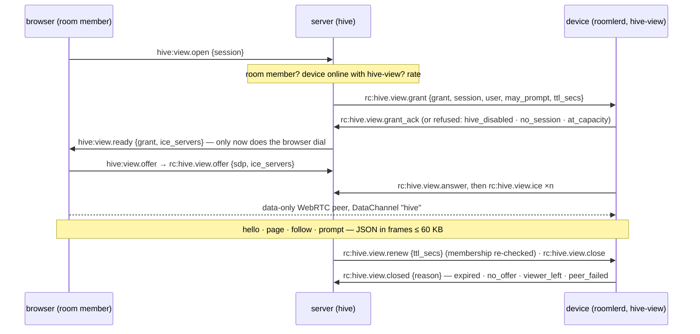
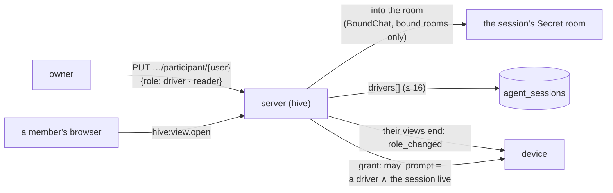
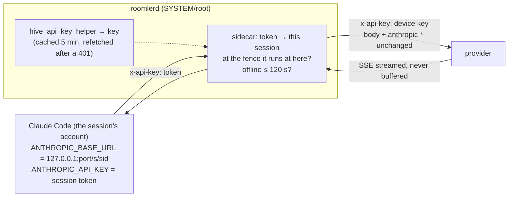
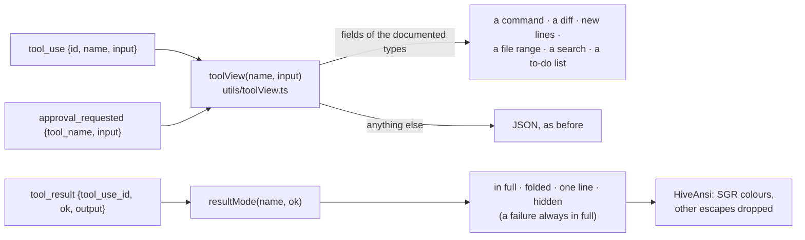
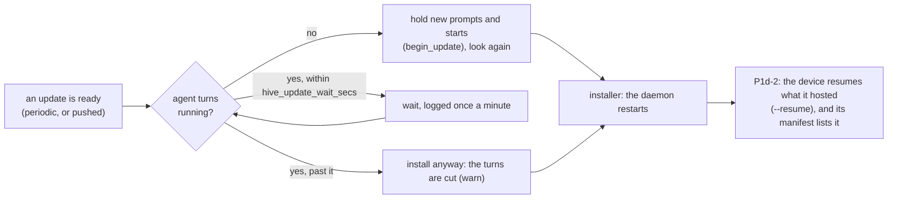
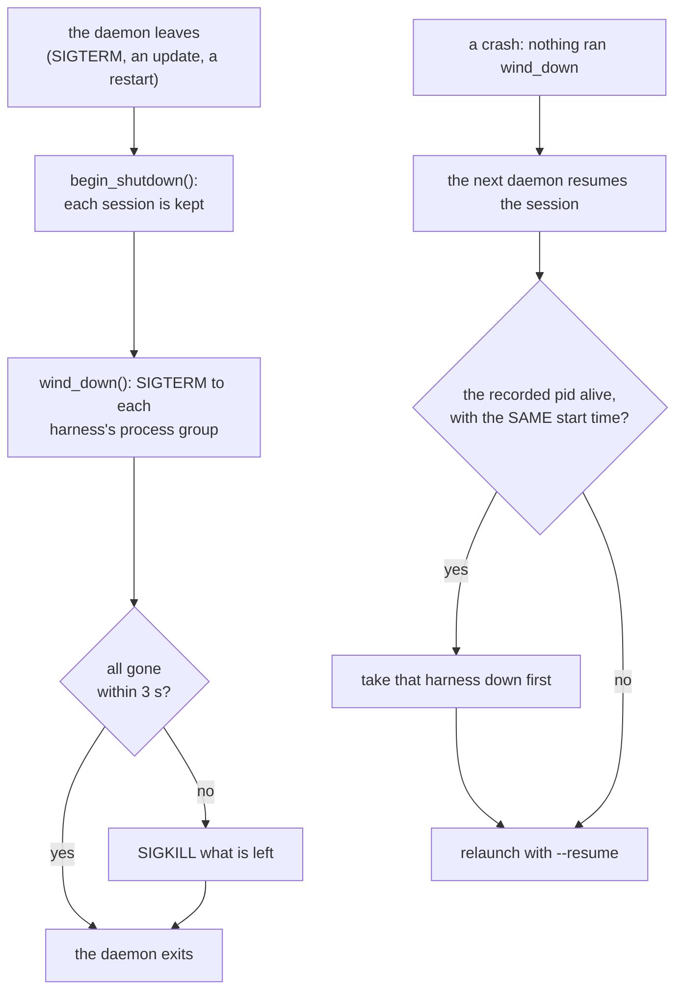
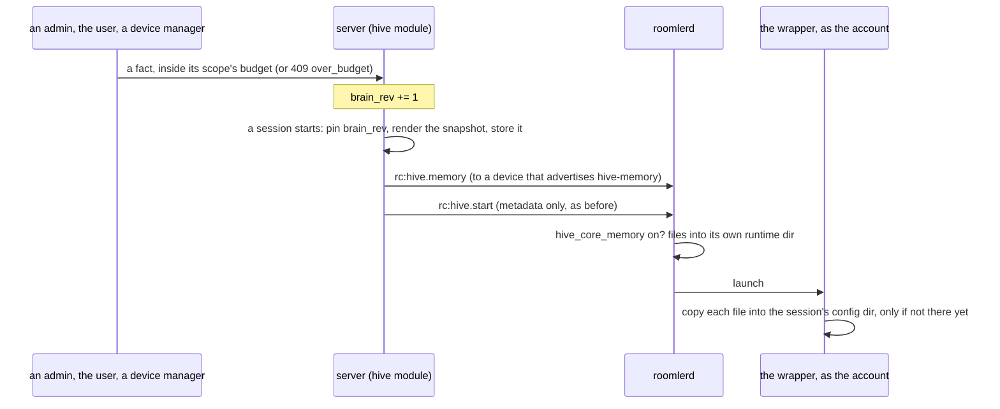
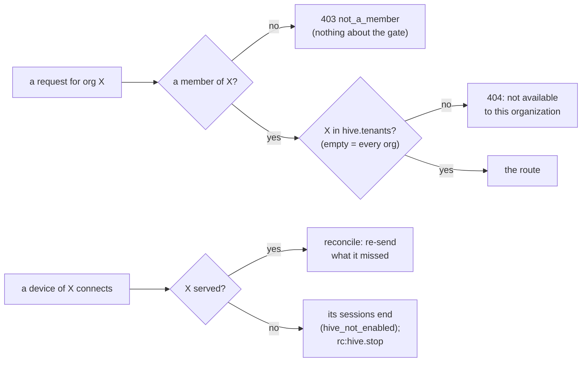
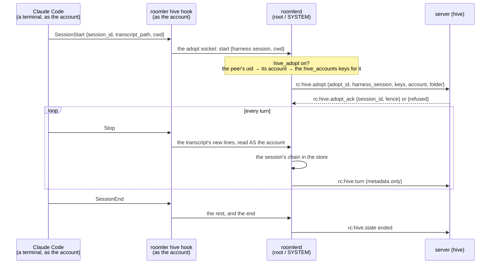

# FR-90: Hive — agent sessions on the org's own machines: a replicaset, a vault, a map and a shared brain

**Issue:** [#1827](https://github.com/gjovanov/roomler-ai/issues/1827) · **Status:** in progress
— design approved 2026-10-07; P0a (device core), P0b (server module), P0c (device
supervisor) and P0d-1 (the session room, turn stubs) merged, P0d-2a, P0d-2b (the viewer peer), P0d-3 (the UI), P0e (the model sidecar) and P0f (the canary test, AC2 on one device) merged — P0's build is complete; AC1 field-verified on a throwaway stack (2026-10-07), and its six findings fixed in P0g (merged); AC3 and AC4 partly field-verified (§5, §8); P1a-1 and P1a-2 (approvals: the device, the UI and the server) merged and field-run, AC5 ticked (2026-10-08); P1a-3 (Bash that runs on any host) and P1b (a restarted device's sessions end) merged and field-run; P1c-1 (drivers, the server) merged; P1c-2a (drivers, the device) merged; P1c-3 (drivers, the UI) merged, AC6 ticked on its field run; P1c-2b (AC6 as a CI test) merged; P1d-1 (the updater waits for running turns, AC7 on Linux field-verified) merged; P1d-2 (a restart resumes what the device hosted; AC20 on Linux field-verified) merged; P1e (core memory from a hand-curated brain) merged, AC8 ticked (field-verified 2026-10-08, and in CI); P1f (the transcript's renderers, P1f-1, and the long list, P1f-2) merged; P1g (the org gate, so prod can serve one test organization) and P1g-2 (a `hive.tenants` list is the switch) merged; P1h-1 (sessions on macOS: the build, and the daemon takes its harnesses down) merged; prod serves agent sessions to the test organization only (2026-10-09); P1j-1 (`adopt`, the server) merged; P1j-2 (`adopt`, the device) merged; P1j-3 (`roomler hive adopt`) in review · **Owner:** agent platform — the `hive`, `vault` and
`knowhow` modules, `roomlerd` feature `hive`, the SPA · **Anchors:** master `29ef33d58` ·
**Design:** [`../roomler-hive-design.md`](../roomler-hive-design.md) (v0.4: the full design, the
review of v0.2 and the decisions) · **Builds on:** [FR-69](FR-69-modular-monolith.md) (modules),
[FR-56](FR-56-remote-apps-on-wayland.md) (the tmux session model), [FR-43](FR-43-macos-single-enrollment.md)
(the stdin-secret worker attach), [FR-83](FR-83-ssh-grant-confirmed-before-dial.md) (a grant is
confirmed before the caller dials), [FR-86](FR-86-tunnel-transport-reupgrade.md) (the carriers),
[FR-82](FR-82-permission-refusal-is-not-a-logout.md) (managed roles), [FR-8](FR-8-claude-session-restore.md)
(session restore)

## 1. Goal

Run coding agents — Claude Code first, Codex later — on the org's own enrolled machines, as a
product rather than a pattern. [`docs/use-cases.md`](../use-cases.md) ("A harness for AI agents")
already pitches an agent in tmux that people watch and take over, with fenced networking; this FR
makes each agent session a first-class record:

1. **Sessions are org records; their content stays on the org's machines.** Every session — who
   started it, on which device, in which folder, as which OS account, what it cost, where its copies
   are — is a row in the org's database. What the agent and the people said and did lives on the
   session's **replicaset**: the org's own devices, each holding a full copy. The server never stores
   a transcript.
2. **Chat is the session's surface.** A session is a chat room; each turn is a message whose steps
   render as markdown, terminal blocks and diffs; approvals are cards a phone can answer. Content
   streams peer-to-peer from a replica; the server holds metadata-only stubs.
3. **Resume anywhere in the replicaset, teleport anywhere else** — to another machine and another
   folder, Windows to Linux included.
4. **Infrastructure the agent can use without seeing a secret.** An IAM-style vault (roles, Cedar
   policy, leases, audit) reachable over MCP and referenced from prompts by handle; a "knowhow"
   graph of what the org runs and how to reach it over the mesh.
5. **One brain the org's sessions share and improve**: memory, skills and playbooks stored
   centrally, curated, versioned and reviewed, measured by how much less steering sessions need.

Hive is the "AI" of the Business tier on roomler.ai; the self-hosted community edition gets all of
it.

## 2. Evidence (master `29ef33d58`, 2026-10-07)

- **Nothing to extend.** No Anthropic client, model id, LLM config key, MCP server or secret store
  exists in `crates/`, `agents/` or `ui/src`. The "Claude AI" service CLAUDE.md lists under
  `crates/services` and the document recognition the README describes are not in the code.
- **No encryption at rest.** JWTs are HS256 with a shared secret
  (`crates/services/src/auth/mod.rs:142-143`); the only asymmetric key signs DERP tickets
  (`crates/remote_control/src/derp_ticket.rs:91,116`); tenant cloud-storage credentials have a
  plaintext schema (`crates/db/src/models/tenant.rs:208-220`). The vault brings its own keys.
- **The primitives exist.** One spawn-as-user path (`agents/roomlerd/src/exec.rs:436,491`); the
  daemon's own PTY (`agents/roomlerd/src/pty/unix.rs:106-184`, ConPTY in
  `agents/roomlerd/src/pty/windows.rs:180-240`); the tmux model (`agents/roomlerd/src/apps/linux.rs:389-433`);
  generic consent prompts (`agents/roomlerd/src/consent.rs:174`); the stdin-secret worker attach
  (`agents/roomlerd/src/delegate.rs:16-30`); tunnel-core carriers down to DERP and data-only WebRTC
  peers (`docs/tunnels.md:61-73`); the stateless TURN-credential helper
  (`crates/remote_control/src/turn_creds.rs:46-85`).
- **The gaps are measured, not guessed.** `RunAs` sets no working directory and only `TERM`
  (`agents/roomlerd/src/pty/unix.rs:148`); on Windows it reaches only the console user and will not
  ask for credentials (`agents/roomlerd/src/exec.rs:503-508`); a root daemon's LocalAPI socket is
  `0600`, so a non-root process can't reach it (`crates/localapi/src/lib.rs:2880-2886`); tunnel SOCKS5
  has no authentication (`crates/tunnel-core/src/socks5.rs:3`) and a daemon-originated flow is
  attributed to the device owner (`crates/tunnel-core/src/policy.rs:29-51`); `SplitTun` intercepts one
  port and SSH is its only caller (`crates/tunnel-core/src/overlay/split_tun.rs:91-126`); fleet exec
  always runs as SYSTEM/root (`agents/roomlerd/src/signaling.rs:3946`).
- **Chat needs four changes.** `AuthorType::Bot` exists and nothing writes it — the DAO hard-codes
  `User` (`crates/services/src/dao/message.rs:76-78`); rooms have no type or binding
  (`crates/db/src/models/room.rs:62-126`); the message list isn't virtualized
  (`ui/src/views/chat/ChatView.vue:51`); only mentions push (`crates/core/src/notify.rs`).
- **Permission bits 0–31 are all assigned** and `ALL = (1 << 32) - 1`
  (`crates/db/src/models/role.rs:161`).
- **Claude Code makes per-session state portable.** With `CLAUDE_CONFIG_DIR` and
  `CLAUDE_CODE_PROJECT_DIR_NAME` set (≥ 2.1.234), a session's transcript and state live under one
  pinned project directory whatever the working directory is; a resume restores neither `--settings`
  nor `--mcp-config`; and Anthropic does not allow third parties to offer claude.ai login or rate
  limits, so subscription credentials are never brokered (design §4.3, §11.3).
- **The one LLM workflow on master is a false green.** `.github/workflows/daily-health-check.yml`
  reported success on every run from 2026-09-29 to 2026-10-06 with `ANTHROPIC_API_KEY` empty in the
  step environment; the `claude` step ends in under a second and `2>&1 | tee` swallows its exit
  status (run 37464801887). Hive's nightly lane must fail when the model call fails.

## 3. Design

The design is [`../roomler-hive-design.md`](../roomler-hive-design.md); this section is its spine.

### 3a. Three modules and a daemon feature

`vault` (→ `fleet`), `knowhow` (→ `network`) and `hive` (→ `chat`, `fleet`, `vault`, `knowhow`),
each a module behind the FR-69 contract (`crates/core/src/module.rs:23`); new `EDGES` in
`crates/core/src/graph.rs:15`, the forbidden pairs untouched; `hive` first in `HOOK_ORDER`
(`crates/core/src/hooks.rs:37`), because it holds sessions. The node side is a `roomlerd` feature,
and its user-level half is `roomlerd hive-host`, re-exec'd as the mapped user like `portal-helper`
(`agents/roomlerd/src/main.rs:203`) — no second binary. Wire frames are `rc:hive.*`, `rc:vault.*`,
`rc:knowhow.*` owned through `namespace()` (`crates/remote_control/src/signaling.rs:1399`); new
`RpcCap` verbs `hive`, `hive-view` (P0d-2), `hive-replica`, `vault`, `knowhow-scan`, equality-matched
(`crates/remote_control/src/models.rs:532,697`).

### 3b. The replicaset, and what the server holds

Each member of a session's replicaset keeps the same daemon-owned store — `hive.db` (SQLite with an
FTS5 index), the raw harness JSONL, a bare git repo of checkpoints, config-directory snapshots. The
primary streams events (`seq`, `fence`, `prev_hash`) and thin packs to the members over tunnel-core
carriers; members ack; the server learns freshness from the acks. Archive replicas — always-on org
devices — join every replicaset the policy allows and serve full-text search. The server holds
session metadata, turn stubs (who, status, steps, cost — no content), session cards (≤ 2 KB
summaries, scanned; `session_cards = summary` by default, `metadata` to turn them off), the brain,
and audit. Never transcripts.

### 3c. Chat and the viewer peer

A session is a `Secret` room with a generic `binding = {module, ref}`; turns are stub messages by an
agent author (`AuthorType::Bot`); prompts and approval answers travel peer-to-peer. Opening a room
renders stubs at once and opens a data-only WebRTC peer to a replica, behind a server-minted view
grant that the replica confirms before the browser dials. Assistant text goes through the existing
markdown allowlist (`ui/src/composables/useMarkdown.ts:57-62`); terminal blocks and diffs are
components, never HTML strings. ⚠️ Viewer peers are `close()`d explicitly — dropping one frees
nothing.

**The viewer peer as built (P0d-2).** The handshake rides the control WS; the content never does.



| Piece | Rule | Where |
|---|---|---|
| capability | `hive-view`, equality-matched — `hive` is its prefix and means "runs sessions", not "serves them" | `models.rs` `RpcCap::HiveView` |
| grant TTL | RELATIVE (`ttl_secs`, 10 min): the device starts its own clock, so clock skew cannot expire a fresh grant | `hive.rs` `view_limits` |
| device gates | primary org, `hive_enabled`, holds the session (live, or in its store), ≤ 8 viewers per session and ≤ 32 per device | `roomlerd/src/hive/view.rs` |
| one actor per grant | owns the peer, the timers and the channel: the one place `close()` runs; handlers capture a channel, never the peer | `view.rs` `run` |
| browser-facing ICE | as remote control's: the overlay interface kept out, `.local` candidates resolved by the OS, `ICE_RELAY_TCP` honoured; the answer goes before the device's candidates | `view.rs` `answer` |
| framing | one SCTP message over 65,536 bytes is silently LOST, so each JSON message travels as binary frames `[v1][id u32][part u16][parts u16][≤ 60,000 bytes]`, reassembled under bounds | `hive/framing.rs` |
| server gates | org AND room membership (anyone else: `not_found`, the answer a bogus id gets) · device online here with `hive-view` · ≤ 4 grants per browser connection · 20 opens / min per (user, session); `ready` only after the device's ack, a silent device is `no_answer` after 10 s | `crates/modules/hive/src/view.rs` `open` |
| whose frames count | a grant belongs to ONE browser connection and ONE device; anything else naming it moves nothing; device frames ride the per-connection ordered queue (answer before candidates) | `view.rs` `ready_grant_of`, `on_device_frame` |
| TURN credentials | minted per grant, the same for both ends, with a **12 h** TTL — the credential bounds the allocation's whole life, and the config TTL (600 s) would cut a relayed viewer at ten minutes | `turn_creds::ice_servers_for_session_with_ttl` |
| ops | `hello`, `page {after, limit}` (≤ 500 events, ≤ 1 MiB), `follow {after}` (subscribe first, then catch up: no gap, no repeat), `unfollow`, `prompt {id, text}` (only with `may_prompt`; attributed to the viewer) | `view.rs` `on_request` |

**Who takes part, as built (P1c-1).** A room has members; a session has drivers (design §4.5). The
owner names both, and only a driver's "ask the agent" travels to the harness. Everything else anyone
writes in the room is ordinary chat.

| who | reads it | prompts it, answers its approvals | stops it, names its drivers |
|---|---|---|---|
| its owner | ✅, even out of its room | ✅ while it is live | ✅ |
| a driver the owner named | ✅ | ✅ while it is live | — |
| another member of its room (a reader) | ✅ | — | — |
| anyone else, in the org or not | — (a 404, like a bogus id) | — | — |



| Piece | Rule | Where |
|---|---|---|
| naming a driver | the owner only. The person must hold `HIVE_RUN`: driving runs code on the device as the session's account, and a driver answers its approvals too. **403** otherwise, audited `no_permission`. At most 16 besides the owner, held by the update's own filter | `crates/modules/hive/src/participants.rs` `set`, `dao.rs` `set_driver` |
| the room | membership through chat's module surface, for rooms bound to that module only (`BoundChat::add_bound_member`); chat's own `join` still refuses a Secret room to a non-member | `crates/modules/chat/src/bound.rs` |
| a grant | `may_prompt` = a driver and the session live, as minted. A change ends the person's views of that session (`role_changed`), and the one they reopen is minted afresh | `view.rs` `open`, `end_session_grants_of` |
| the device's word | `answered_by` and a turn's `prompted_by` are believed only when they name a driver, so no stub names anyone else | `room.rs` `approval`, `turn_stub` |
| the push | an approval goes to every driver still in the room | `room.rs` `notify_approval` |
| leaving | a member removed from the org is dropped from every session's drivers, so rejoining hands back no seat. The owner reads their own session even out of its room, because a Secret room cannot be re-entered | `hooks.rs` `member_removed`, `access.rs` `may_read` |
| transparency | every change is a note in the room: who may prompt the agent is for everyone there to see | `participants.rs` |
| the device's own gate (P1c-2) | the server names drivers; the DEVICE decides whom it lets act as one of its accounts. A driver other than the session's starter prompts and answers only when this device's `hive_accounts` maps them, by id or by a proven address, to the account the session runs as; otherwise the view is read only and `hello` says why (`driving_refused`). The starter is recognised by id from the start order, never through the map: a server before P1c-2 sends no address. Only a driver's grant carries the address | `roomlerd/src/hive/supervisor.rs` `drives_here`, `view.rs` `view_grant` |
| the model is told who asked (P1c-2) | the harness reads `[Name] …`; the transcript keeps the prompt as typed with its author beside it. A slash command goes as typed. The name is a label: brackets and control characters dropped, 64 characters at most | `crates/hive-node/src/launch.rs` `attributed_prompt` |

**The model sidecar as built (P0e).** The provider's key never enters a session.



| Piece | Rule | Where |
|---|---|---|
| the key | the DAEMON runs `hive_api_key_helper`; the session's settings carry no `apiKeyHelper`, so nothing in the session can print it | `roomlerd/src/hive/sidecar.rs` `run_key_helper` |
| the token | 256 random bits per run, bound to (session, fence), minted just before the harness starts and taken back if it does not; each run revokes exactly its own token when it ends, so a run ending as the session starts again here cannot take the new run's | `sidecar.rs` `Tokens` |
| the paths | exactly `POST /v1/messages` and `POST /v1/messages/count_tokens` — what Claude Code's gateway contract needs; anything else `404 not_found_error`, `HEAD /api/hello` (its warm-up probe) harmlessly too. The device's key opens more than inference: the Files API holds every session's uploads under it, and a batch runs on after its session and its fence. `/v1/models` is left out: Claude Code calls it only under `CLAUDE_CODE_ENABLE_GATEWAY_MODEL_DISCOVERY=1`, which Hive does not set | `sidecar.rs` `forwarded` |
| the fence | a call is forwarded only while the session runs HERE at the token's fence — a stopped session, or a stale primary after a move, spends nothing | `Supervisor::sidecar_admit` |
| `offline_grace` | 120 s after the primary connection closed (and no newer one took its place), calls are refused `503 overloaded_error`; they flow again on reconnect. "Closed" is the agent's own verdict: a half-open socket (a TLS-inspecting middlebox still ACKing) counts as up until the receive-liveness deadline ends it (`WS_RX_DEADLINE`, 80 s, `signaling.rs`), so a partitioned primary's worst case is about 80 s + 120 s | `Supervisor::lost_connection` |
| the forward | method, path, query, body and headers unchanged except `x-api-key` / `authorization` (the device key swapped in) and hop-by-hop; the response streamed back as it arrives with its headers; refusals in the provider's error shape | `sidecar.rs` `handle` |

**P1f-1, the transcript's renderers, as built.** A tool call is drawn by its tool, and its result is
folded under it, matched by `tool_use_id`. A call that waited for an approval is drawn by its
approval card instead — the input the answer applies to — and its result after the answer, so the
transcript reads in the order things happened. A result whose call is outside the loaded window
stands alone. Everything is in the browser; the wire is unchanged.



| Tool | The call | Its result |
|---|---|---|
| `Bash` | `$ command`, its description, "runs in the background" | in full, coloured |
| `Edit`, `MultiEdit` | the file, then each edit as removed and added lines; long runs of kept lines folded (3 lines of context) | its first line |
| `Write` | the file, how many lines, the first 40 as additions | its first line |
| `Read` | the file and its line range (`offset` to `offset + limit − 1`) | folded behind its line count |
| `Grep`, `Glob` | the pattern, then where | folded |
| `TodoWrite` | the list, each item to do, in progress or done | hidden |
| `WebFetch`, `WebSearch`, `Task` | the URL as text (never a link), the query, the sub-agent's task | folded |
| anything else, an MCP tool, a field of the wrong type | JSON, as before | in full |

| Rule | Why |
|---|---|
| ⚠️ Every string is the model's or a tool's, rendered by text interpolation; no `v-html` but assistant markdown through `renderMarkdown` | the one XSS boundary stays the one it was. A hostile `` in a command, a path, a diff line, a to-do or coloured output is text (a test per tool) |
| Colour comes from SGR only, as runs styled from a fixed set: a palette index 0–15, an RGB triple of integers, five flags. Other escapes are dropped, an OSC hyperlink keeps only its text, `\r` starts the line over | output can neither inject markup nor name a class or a style; a progress bar shows its last state. At most 4,000 styled runs, then plain (`utils/ansi.ts`) |
| A diff is a longest-common-subsequence table over the changed middle when it holds ≤ 250,000 cells, else every old line removed and every new one added; a side over 2,000 lines is not diffed | the truth, bounded (`utils/lineDiff.ts`) |
| An approval shows its input the same way, and is the call's only card | a driver approves an `Edit` looking at the diff, not at JSON with escaped newlines; field 2026-10-08: drawn twice, the call's result showed above the approval it came after |

**P1f-2, the long list.** While the transcript follows the newest events it keeps at most 1,000
(`keep`). The oldest go back to the device, one "load earlier" away (`useHiveViewer.trimEarlier`), and
never while someone reads further up. ⚠️ Not `content-visibility`: tried first, it made the first
scroll to the bottom land short in the field (an event off screen counts at its estimated height until
it is drawn, so the bottom moves once it is), and the window already bounds the page.

### 3d. Sessions, promotion and teleport

A session runs as the account the device maps the user to (`hive_accounts`), under `hive_roots`,
never SYSTEM/root; Windows reaches only the console user and refuses `no_console_user`. Each session
has its own Claude Code config directory with a pinned project name, launched headless on
stream-json with daemon-owned `--settings` and `--mcp-config` regenerated on every start. The
fence-bound session token gates every model call (a loopback sidecar) and every toolbelt call.
Promotion onto a replica is a lease move plus a local checkout; teleport joins the target to the
replicaset first. The updater defers while a turn runs.

⚠️ **P0 never bumps a fence** — the server creates a session at fence 1 and re-sends that fence —
so a session runs at most once per device. P2's promotion has to make a start at a NEWER fence
supersede an older run still live on the same device (stop it, then launch): as built,
`decide_and_launch` is idempotent only on the same fence, so it would start a second harness, and
the older run's `finish` would drop the newer run's live entry, and with it the newer run's model
access (`roomlerd/src/hive/supervisor.rs`).

⚠️ **A daemon restart leaves its sessions live on the server** (found in the field, 2026-10-08).
The reconcile on connect re-sends only `starting` and `stopping` sessions
(`crates/modules/hive/src/agent_socket.rs` `reconcile_on_connect`). Live ones rely on the device's
replay of its last reports, which a restarted daemon no longer holds, so the record reads `idle`
with no harness behind it. Stop clears one: the device answers "not running on this device" and
the record ends. The fix is a manifest of the sessions the device runs, sent on connect so the
server ends the rest, or P1's resume, which makes the session survive the restart. *Fixed by the
manifest in P1b. P1d-2's resume makes a session outlive a restart, and the manifest, sent after the
resume, names it.*

⚠️ **The manifest ends what the device has said it runs, and not only what it accepted**
(`crates/modules/hive/src/dao.rs` `running_on_device`). The evidence is its answer to the start
(`accepted_at`) or a run state only its own report sets (`SessionStatus::LAUNCHED`: `idle`,
`running`, `awaiting_approval`), the same rule the start route's answer reads. The state usually
lands before the answer, so a socket that drops between the two leaves `idle` with no `accepted_at`.
Reconcile never re-sends that session, because it is no longer `starting`. With `accepted_at` alone it
outlived its harness for ever. The P1b field run found one, 2026-10-08. A start the device has said
nothing about (`starting`, or `stopping`, with no `accepted_at`) stays reconcile's.

**Updates and restarts (P1d).** Today a session's harness is the daemon's child: an update, a crash
or `systemctl restart` kills every harness, and P1b then ends the sessions. P1d is in two steps.



| Step | Rule | Where |
|---|---|---|
| P1d-1, the wait (AC7) | an update waits for running turns (`running` or `awaiting_approval`), at most `hive_update_wait_secs` (30 min; 0 never waits), logged when it starts and once a minute; it holds a **pushed** update too, since a person asked for the update, not for their agent to be cut. Once no turn runs, new prompts and starts are refused **before** a last look, so none begins in the gap; one admitted before still runs and is waited for. An installer that fails to start releases the hold | `roomlerd/src/updater.rs` `wait_for_agent_turns`, `hive/supervisor.rs` `turns_running` · `begin_update` |
| P1d-2, the resume (AC20) | the device keeps what it hosts on disk, and the next daemon resumes each session at its first connection, before the manifest, with every gate applied again; Claude Code is relaunched with `--resume` and the launch rebuilt in full; the turn count carries on; a turn the restart cut is reported interrupted and its open approvals withdrawn. Below | `roomlerd/src/hive/hosted.rs`, `hive/supervisor.rs` `resume_once` · `resume` · `went_down_with_daemon` |

⚠️ `roomlerd self-update` (the CLI) and the macOS update helper do not wait yet. The CLI is an
operator's explicit command in another process. The macOS helper gets the wait in P1h-2, and
Windows's update path with its sessions (P1i).

**P1d-2, the resume, as built.** A restart still takes every harness down: under systemd
(`KillMode=control-group`) a stop sends SIGTERM to the daemon and then, a moment later, to every
process in its unit, the harness and its tools included. What changes is what the daemon does
about it.

```mermaid
sequenceDiagram
    participant D as roomlerd, going down
    participant F as hosted.json
    participant N as roomlerd, next start
    participant S as server
    Note over D,F: a launch writes the session's entry; a turn writes its number before its stub
    D->>D: SIGTERM, an update, a requested restart: begin_shutdown()
    D--xD: the harness dies a moment later: kept, nothing reported
    N->>F: read this enrollment's entries
    N->>S: the control WS comes up
    N->>N: each entry through every gate, as configured now
    N->>N: relaunch: --resume uuid (or --session-id when there is no history)
    N->>S: idle · the cut turn interrupted · its approvals withdrawn
    N->>S: rc:hive.manifest, after the resume: the session is kept
```

| Rule | Why |
|---|---|
| The device keeps `hosted.json` beside the replica store (root's, `0600`, written whole). Per session it holds the launch's inputs (fence, account, the folder as asked, the starter and their address, Claude Code's session id), the turns begun, the turn in progress with who asked for it, and its open approvals | after a restart the device holds nothing else: the replay of its last reports lived in memory |
| A new turn's number and a new approval are written **before** the frame that tells the server, and so is a turn's end. An approval's end is written after its frame | the server ignores a stub for a turn older than its newest, so a reused number would silence every later stub. The server edits a turn's stub to whatever comes last, so a finished turn must never be reported cut. A withdrawal sent twice changes only an approval still open |
| A harness that ends without being stopped waits 1 s before its end counts. If the daemon was told to stop by then, the session is **kept**, and nothing is reported: no `ended`, no cut turn, no withdrawal. The daemon is told by `begin_shutdown`, the moment its shutdown is signalled, by whatever signals it (an update, a requested restart, a rollback, SIGTERM, Ctrl-C), before its connections close | as built before, the daemon reported `ended` for every session it was taking down, and the server ended them |
| From `begin_shutdown` on, what the device hosts is **frozen**. The session task ignores the toolbelt, and new prompts and starts are refused ("this device is restarting") | the teardown withdraws the approvals and cuts the turn, and the frames saying so go into closing connections. Recorded, they are lost twice: on the wire, and because the next daemon finds nothing left to report. Found in the field: an approval the teardown withdrew stayed "needed" |
| The next daemon resumes at its **first connection** of the primary enrollment, once, and that connection's manifest waits for it (at most 60 s) | a manifest sent first would leave the resuming sessions out, and P1b would end every one. A device that never comes back online launches nothing |
| Every gate a start passes is passed again, as the device is configured **now**: `hive_enabled`, the starter mapped to the **same** account, the folder inside `hive_roots`, capacity, a harness. A refusal ends the session with its reason ("not resumed after the device restarted: …") and forgets it | an owner who turns sessions off, or remaps an account, and restarts must not find the session back. Its history is in the account it ran as |
| `--resume <uuid>` when Claude Code's own history exists (`<config dir>/projects/hive-<uuid>/<uuid>.jsonl`, `LaunchSpec::history_path`), `--session-id` otherwise. This holds for every launch, a start the server re-sends included | Claude Code refuses both other ways round: "Session ID … is already in use", "No conversation found" (2.1.293, probed 2026-10-08). A re-sent start after a crash used to fail the first way |
| The launch is rebuilt in full; the turn count carries on from the file; the cut turn is reported `interrupted` naming who asked; its approvals are recorded and reported `withdrawn`; the transcript says the session resumed, and which turn was cut | a resume restores neither `--settings` nor `--mcp-config` |
| The first turn of a resumed process reports no cost; every later turn reports what it cost | Claude Code restores its running total from the history's last `cost-state` entry, which only a clean exit writes, so where that process starts counting is not known on the device. No number is better than a wrong one |
| A stop that arrives before the session resumed ends it with no launch | |
| A session resumed 3 times in a row, each time without outliving the resume by 2 min, is ended instead | a resume that takes the daemon down must not become a crash loop |

⚠️ Prompts waiting behind a turn are lost when a restart cuts it. A queue exists only while a turn
runs, and an update waits that out (P1d-1). A crash, or a stop past the wait, cuts the turn, and the
transcript and the stub say so.

⚠️ `hosted.json` is not synced to disk. A clean stop, a restart and a crash all keep it. A power cut
may lose its last change, and then P1b's manifest ends what could not be resumed.

**P1h-1, sessions on macOS, as built.** The supervisor, the toolbelt, the sidecar and the viewer
were Linux-only by a `cfg` at forty-odd sites. P1h-1 compiles them for macOS too, behind one
`cfg(hive_host)` that `build.rs` sets for the `hive` feature on Linux and macOS. It makes explicit
the one behaviour that differs: who takes a harness down when the daemon leaves.



| What | Linux | macOS | Where |
|---|---|---|---|
| what builds the pillar | the `hive` feature | the same, from P1h-1 | `agents/roomlerd/build.rs` `hive_host` |
| each session's runtime files (settings, MCP config, toolbelt socket) | `/run/roomler-hive` | `/var/run/roomler-hive`, which macOS clears at boot | `hive/supervisor.rs` `RUNTIME_DIR` |
| the harness, with `hive_harness` unset | `~/.local/bin/claude`, `/usr/local/bin/claude`, `/usr/bin/claude` | the same, with Homebrew's `/opt/homebrew/bin/claude` before `/usr/bin` | `hive/supervisor.rs` `resolve_harness` |
| a harness's process group when the daemon leaves | systemd's `KillMode=control-group` kills it; `wind_down` does too, for a daemon systemd does not run | launchd does **not** kill it; `wind_down` does: SIGTERM, then SIGKILL after 3 s | `hive/supervisor.rs` `wind_down`, `hive/procs.rs` `take_down` |
| a harness a crash left running | taken down before the resume: two harnesses on one Claude Code history would both write it | the same | `hive/supervisor.rs` `reap_leftover` |
| a process's identity across time | the boot id and `/proc/<pid>/stat` field 22 | `proc_pidinfo(PROC_PIDTBSDINFO)`'s start time | `hive/procs.rs` `started` |

⚠️ A recorded pid is never signalled on its own. The start time recorded at launch (`hosted.json`
`harness_pid`, `harness_started`) must still match, so whatever holds that pid since is untouched.
Pids 0 and 1 are refused, because `kill(0, …)` is the daemon's own group and `kill(-1, …)` is
every process.

⚠️ CI gains a macOS step (`cargo check` and `cargo test -- hive::` with `--features hive`).
Before it, the supervisor had never compiled for a Mac. The run on a real Mac is P1h-3.

### 3e. Toolbelt, vault, knowhow

The `roomler` MCP server per session (over a per-session socket or pipe, not the main LocalAPI):
brain, knowhow, `roomler_connect`, vault, `ssh_run`, `fleet_exec` (SYSTEM/root, so a person approves
every call), forwards and SOCKS through a chosen device, child sessions. The vault follows AWS IAM
semantics in Cedar: roles assumed per session, guardrail `forbid`s, `approval` as the MFA analogue,
`simulate`. Secrets reach tools, not the model: `proxy` endpoints that authenticate (HTTP named
upstreams, a k8s API proxy, an SSH agent socket, Postgres and MongoDB proxies), then `placeholder`
substitution at a TLS-terminating egress proxy for audience hosts only; every secret is bound to its
audiences. Knowhow is built from fleet and network sync, opt-in scans and session proposals, and a
fact turns active only when a probe or a person confirms it.

**P1a builds the toolbelt with one tool, `approve`** (`agents/roomlerd/src/hive/toolbelt.rs`), and
it was built against Claude Code's contract as MEASURED, not as remembered. Claude Code 2.1.293,
driven by a fake Messages API and a fake MCP server on 2026-10-08 (§8):

| Claude Code does | so the toolbelt |
|---|---|
| probes with `server/discover` (MCP draft `2026-07-28`) before `initialize`, and initializes when told no | answers every unknown method `-32601`; silence would stall the harness's start |
| calls `approve` with `{tool_name, input, tool_use_id}` and `_meta.progressToken`, and waits | answers `{"behavior":"allow","updatedInput":<input>}` or `{"behavior":"deny","message":…}` as one text block, and sends progress every 60 s while a person decides |
| asks ONE approval at a time — two parallel writes were two calls, the second after the first was answered | caps a session at 4 open and refuses a fifth at once |
| hands the model a denial as `tool_result {is_error: true}` with our message verbatim, and lists it in the result's `permission_denials` | says who denied it and why ("Dev denied this: not now") |
| keeps the permission tool out of the model's own tool list | needs no `--disallowedTools` for `approve` |
| with the server unreachable, errors every call that needs approval ("MCP tool mcp__roomler__approve … not found") and exits 1 | fails CLOSED: nothing runs unapproved |
| starts a `-p` run that fetches no feature flags in **`auto`** when nothing sets a mode | is only reached under `--permission-mode default`, which the launch now pins |
| runs a command in its read-only set (`whoami`) and reads under the working directory without asking, in every mode | — those never reach `approve` |

Claude Code starts the toolbelt itself, as the session's account, so the server it starts is a relay:
`roomlerd hive-mcp <socket>`, short-circuited at the top of `daemon_main` like the embedded CLI, so it
runs none of the daemon's start-up and writes nothing as that account. The socket is the session
account's, `0600`, in `<runtime>/<sid>/` (root, `0755`, holding the daemon-written `settings.json`
and `mcp.json`), and every connection's peer uid is checked again — a process running as that
account can connect, and all it can do is ask. The run state is the session task's alone to write:
the toolbelt reports each approval opening and closing on a channel the task reads after the
harness's stdout, so the `tool_use` lands in the transcript before the approval it caused.

**P1a-2, the server's side.** The device tells the server THAT a session waits, how it ended and
who answered — `rc:hive.approval`, whose field set a test locks so a `tool` or `input` field is a
deliberate edit. The server keeps one `agent_approvals` record and posts ONE stub per approval (a
unique index makes a replayed opening a no-op), edits the stub when it ends, and pushes the driver
a notification that names the session and never the call — by web push to every subscription,
because a desk with the app open is not a phone in a pocket. ⚠️ Who answered is the DEVICE's word:
the answer travels over the viewer peer, so the server believes it only when it names a driver (in
P1, the starter), and no stub names a person who could not have answered.

### 3f. The brain

Central, in the `hive` module: core memory in four scopes (org, project, user, device) with budgets
and visible over-budget failure, rendered as a frozen snapshot per session into `CLAUDE.md` and
Claude Code's own auto-memory directory; facts as records with evidence, versions, contradiction
cards and decay; skills and playbooks versioned centrally and projected per session. The reviewer — a
tool-less model call — runs on a replica, never on the server, and sends distilled proposals and the
session card. Improvement is counted: corrections per session, per-skill correction rates, eval
sessions that run each skill's acceptance test.

**P1e, core memory from a hand-curated brain (AC8), as designed.** People write facts; the learning
loop that proposes them is P5.

What Claude Code does with the files, probed 2026-10-08 against a fake Messages API (2.1.293, no
model spend):
- `$CLAUDE_CONFIG_DIR/CLAUDE.md` reaches the model in the first turn as "the user's private global
  instructions for all projects". It comes under "These instructions OVERRIDE any default behavior
  and you MUST follow them exactly as written".
- `$CLAUDE_CONFIG_DIR/projects/<pinned name>/memory/MEMORY.md` reaches it as "user's auto-memory,
  persists across conversations". Its topic files reach it only when the model opens them.
- Both files are inside the session's own config directory. No settings change is needed.

⚠️ **Core memory would be the first server-authored text a session's model reads, and it reads it
as overriding instructions.** Today a compromised server cannot put one word in front of the model:
prompts come only from drivers, over the peer. Approvals still gate every tool that changes
something. But read-only tools run unasked, and the server can mint itself a view grant (§3c). So
an injected "read X and show it" becomes a path. Hence a gate that belongs to the device.



| Rule | Why |
|---|---|
| Three scopes: **org**; **user** (the session's starter); **device** (the device the session runs on). Project waits for a project identity (knowhow, P4) | the starter is whose account the session runs as |
| A fact is a record: `brain_facts {tenant_id, scope, owner_id (the user or the device; none for org), text, kind, status: active or archived, version, created_by, created_at, updated_by, updated_at}` | versions now; evidence, review and supersession come with P5 |
| Budgets: org 3,000, user 1,500, device 800 characters of active text per scope instance (design §10.3). They are held in one counter document per instance, and changed by one conditional update (`$inc` under `used ≤ budget − n`), so two concurrent writes cannot both fit | "fails visibly": a write that does not fit is `409 over_budget`, with what is used, the budget and the size asked. Nothing is evicted; a person consolidates |
| Who writes: org, `ADMINISTRATOR`; user, that user, with `HIVE_RUN`; device, `MANAGE_AGENTS`. Every write is audited (`hive_audit`, `brain`) | an org fact reaches every session in the org as an instruction |
| `brain_rev` per org, incremented by every write. A session pins it at creation. The server renders the snapshot then and stores it (`hive_session_memory`, by session): org and user into `CLAUDE.md`, device into the auto-memory `MEMORY.md` | frozen: a later fact never changes a running session (AC8), and a re-sent start carries the same snapshot |
| Delivery: `rc:hive.memory {session_id, fence, brain_rev, files}` immediately before `rc:hive.start`, and before its re-send on connect, to a device that advertises `hive-memory` | `rc:hive.start` stays metadata only, its field set locked; one socket keeps the order |
| The device's gate: `hive_core_memory`, a device key, **default off**, never pushable. Off, the frame is dropped, and the session's transcript says the device takes no core memory | the gate that survives a compromised server, like `hive_accounts` |
| The daemon writes the files into its own runtime directory (`<runtime>/<sid>/memory/`, `0755`), each `0600` and handed to the account. The wrapper, running as the account, copies each into the session's config directory **only if it is not there yet** | the daemon never writes into a tree the account owns, and no other local account reads a session's memory (its `CLAUDE.md` carries the starter's own facts). A resume (P1d-2) keeps what the session has, its own edits included. Frozen across restarts |
| No frame (an older server, or a lost one): the session runs without core memory, and its transcript says so | memory is an enhancement, never a single point of failure |

AC8's test is a CI test with the in-process device, its harness writing out the two files.
As built (P1e-4): `crates/tests/tests/hive_memory.rs` with the gate on, and `hive_memory_off.rs`
with it off. They are two binaries because a process has one supervisor and reads the gate once.
The harness copies out what it finds where Claude Code reads core memory, at its start and at
every turn.
- An org fact (and a device fact) is added, and session A starts: A's `CLAUDE.md` holds the org
  fact, its auto-memory `MEMORY.md` the device fact, and its transcript names the revision.
- A second fact is added: A's file does not change, even at its next turn, and session B's holds
  both, at a later revision.
- A write past the budget is refused `409 over_budget`, with the numbers. It spends nothing, and
  nothing is evicted.
- With the device's gate off, the session's config directory holds neither file, and the daemon
  did not even write its own copy. The transcript shows the frame arrived and says why.

### 3g. Gates

Running a session is remote code execution on a device, so it gets exec's and SSH's four gates:
`HIVE_RUN` in no managed role below `ADMINISTRATOR` (pinned by
`no_managed_role_below_administrator_seeds_a_root_shell`, `crates/db/src/models/role.rs:396`); a
Cedar `role:assume` permit, default deny; per-(user, device) limits after the identity gates; and the
device's own `hive_enabled`, `hive_accounts` and `hive_roots`, of which only `hive_enabled` (and
`hive_replica`) can ever be pushed, and only to devices that opted into remote config
(`crates/remote_control/src/models.rs:1410,5153`).

**P1g, the org gate, as built.** The module switch (`[modules] hive`) is all or nothing for a
server, so it has a second dial: `hive.tenants` (`ROOMLER__HIVE__TENANTS`), the organizations
agent sessions serve, as comma-separated ids. Empty or `*` is every one, which is what a
self-hosted server wants. A hosted server lists one test organization first (decision 10).

**The list is the switch** (P1g-2). A non-empty `hive.tenants` mounts the module by itself, with
no `[modules] hive`, and `/api/capabilities` says so (`Settings::hive_on`,
`crates/config/src/settings.rs`). A hosted server sets only the list, because that form fails
safe: an image from before P1g never reads the list, so with `ROOMLER__MODULES__HIVE=true` beside
it, promoting such an image — a rollback, or another session's older tag — would open the pillar
to every organization on the hosted server. With the list alone, every older image leaves it off.
Clearing the list is the kill switch.



| Where | An organization agent sessions do not serve | Where in the code |
|---|---|---|
| every route | **404**, `agent sessions are not available to this organization`, after the membership check (a non-member still gets `not_a_member`) | `routes.rs` `member_tenant` |
| `GET …/hive` | the SPA's question: `{enabled: true}` or that 404; Hive's pages and nav show only where it is served | `routes.rs` `serves`, `stores/hive.ts` `checkServed`, the router guard |
| the viewer | `hive:view.open` answers `not_found`, as for a session the caller may not read | `view.rs` `open` |
| a device connecting | nothing is re-sent; what it still runs for the org ends (`hive_not_enabled`) and is told to stop | `agent_socket.rs` `end_unserved` |
| a malformed entry | logged, and it matches nothing: a typo shuts the org it meant rather than opening any other | `scope.rs` `TenantScope::parse` |
| the module switch | a list mounts the module by itself (`*` included); an image that predates P1g-2 leaves it unmounted | `settings.rs` `Settings::hive_on`, `Settings::switched_off` |

### 3h. Adopting terminal sessions (P1j)

People already run Claude Code in a terminal. `adopt` mirrors those sessions into the device's
store and lists them for their owner as read-only sessions (decision 11, design §10.8). A
terminal session passed none of Hive's start gates (`HIVE_RUN`, `hive_enabled`, `hive_roots`):
it is the person's own work, in their own account. So the gates are different ones, each
default-deny, and each owned by a different party.



| Gate | Owner | Default | A refusal |
|---|---|---|---|
| the hooks are installed | the person, in their own user-level Claude Code settings (`roomler hive adopt`) | not installed | nothing is mirrored |
| `hive_adopt` | the device's owner: a device key, never pushable, advertised as `hive-adopt` | off | nothing reaches the server; an offer from a connection without `hive-adopt` is dropped unanswered |
| the org is served | the server (`hive.tenants`, P1g) | — | `hive_not_enabled` |
| the account names ONE person, a member | the device's `hive_accounts`, resolved by the server | — | `no_account` (no key names anyone) · `ambiguous_account` (two people) · `not_a_member` |
| capacity, rate | the server: 16 live adopted sessions a device, 20 offers a minute | — | `at_capacity` · `rate_limited` |

What each rule is, and where it lives:

| Rule | Why | Where |
|---|---|---|
| The device sends EVERY `hive_accounts` key that maps to the account; the server resolves each (a user id, or an address some account proved) and adopts only for exactly one person | the attribution is the device owner's statement, never a guess. An account shared with a second person (decision 8's `"alice.com" = "bob"`) is `ambiguous_account`, not "the one of them who is a member", which would show one person's terminal to another | `crates/modules/hive/src/adopt.rs` `people` |
| Every offer is attributed afresh. One for a terminal session already held is answered with the same record, for the same person only; held for someone else, that record ends `attribution_changed` | the device offers again after a restart or a lost ack, and a second record would split one terminal in two. A remap must never pour a new person's terminal into the old person's record | `adopt.rs` `decide` |
| No drivers, the owner included: `drives_now` is false, and naming a driver is a 409; readers by name, as for any session | the terminal holds the harness, so nothing typed here could reach it | `access.rs` `drives_now`, `participants.rs` `set` |
| The record holds no title, only the folder's name; `origin: adopted` | a terminal's first prompt is content | `model.rs` `SessionOrigin` |
| The hook reads the transcript, never the daemon | a root daemon opening a path a hook names would read any file the requester could point it at | `crates/localapi/src/hive_adopt.rs` (the protocol carries lines, never a path); `roomlerd/src/hive/supervisor/adopt.rs` `adopt_lines` |
| Who it is comes from the kernel (the adopt socket's peer credentials), not from the hook; root's own sessions are refused; a session belongs to the account that first offered it | the hook runs as whoever ran Claude Code, and says nothing that is not checked | `adopt.rs` `adopt_conn` · `adopt_hello` |
| Mirroring happens at every `Stop` (the hook runs in the background, `async`); `SessionEnd` runs in the foreground and only flushes | Claude Code gives `SessionEnd` hooks a shared 1.5 s budget, and nobody at the terminal should wait | `roomler-cli/src/hive_hooks.rs` `EVENTS` |
| `unadopt` takes out exactly what `adopt` put in; every other setting stays byte for byte (kept as raw JSON, in its order), and so does every other event and group in `hooks`; a file that is not a JSON object is refused, never rewritten; a symbolic link's target is rewritten in place, the previous bytes kept as `<file>.bak-roomler` | the person's own settings, and other tools' hooks in them (this repo's own dev box carries FR-8's), are theirs | `hive_hooks.rs` `adopt_doc` · `unadopt_doc` · `write_settings` |
| The hook prints nothing and always exits 0; it sends whole lines only, at most 64 MiB a run, a line over 4 MiB or not UTF-8 as `skipped` bytes | Claude Code may show a hook's stderr and add its stdout to the model's context; a broken hook must never break a session | `hive_hooks.rs` `hook` · `next_chunk` |
| The hook entry runs the binary that installed it (`roomlerd cli hive hook` on a daemon host, `roomler hive hook` standalone) as ONE command line, the path quoted, with a 30 s timeout; never exec form (`command` + `args`) | `roomlerd` with no arguments RUNS THE DAEMON: a Claude Code that dropped an `args` list it did not know would start a daemon as the person at every hook. A version that knows no `async` waits at most the timeout | `hive_hooks.rs` `HookCommand` |
| A terminal killed outright never says `SessionEnd`: the daemon records Claude Code's process (pid + start time) and ends a session whose process is gone, every minute. Claude Code's process is the hook's nearest ancestor that is not a shell: Claude Code runs a hook's command line through `/bin/sh -c`, and dash forks it rather than exec it | otherwise a crashed terminal stays "live" forever. Taking the hook's parent, the `sh` that exits with the hook, ended every adopted session at the next sweep while its terminal ran, and the next turn offered it again as a new record (P1j-5's field run, §8) | `adopt.rs` `adopt_sweep`, `hive/procs.rs` `hook_terminal` |
| The device serves an adopted session's viewer on `hive_adopt` alone, and holds no input channel for it | a device may allow adopting with `hive_enabled` off, and the viewer refused every grant on `hive_enabled` before P1j; `may_prompt` is false from the server, and a prompt for a session the device does not run is refused anyway | `hive/view.rs` `grant`, `adopt.rs` `adopt_holds` |
| Only the person's conversation is mirrored: `user` and `assistant` lines, never a subagent's (`isSidechain`) or Claude Code's bookkeeping (`isMeta`, every other line type); a line that is not JSON is skipped | the on-disk transcript is Claude Code's internal format: a change in it must thin the mirror, never stop it | `adopt.rs` `read_line` |
| `hive-adopt` is advertised only while `hive_adopt` is on; the socket exists only then | a device whose owner has not allowed adopting offers nothing | `encode/caps.rs`, `adopt.rs` `adopt_listen` |
| A stop from Roomler stops the mirroring, for good: the terminal session goes on, the record ends, and later hooks are refused `stopped`; `SessionEnd` forgets the session, so a `claude --resume` later is offered afresh | the terminal is the person's; Roomler can only stop watching it | `adopt.rs` `adopt_stop` · `adopt_end` |
| What the device keeps: `adopted.json` beside `hosted.json` (root, `0600`, written whole) — per session the record, the account and uid, the transcript offset, the turns, Claude Code's process | a restarted daemon goes on mirroring where it stopped, and names the sessions in its manifest | `adopt.rs` `AdoptedFile` |

⚠️ Its "an adopted session becomes a managed one when promoted" half needs P2's replicaset.

## 4. Phases

| P | What | Kill switch | Status |
|---|---|---|---|
| claim | issue, this spec, the design, the ledger row | docs only | **merged** #1828 `dc1b05581` |
| P0 | spike: `hive` module skeleton; one headless Claude Code session on one Linux device driven from a chat room; events in the device store; stubs to the server; content over a viewer peer; sidecar pass-through with the fence; `RunAs::Named` with a working directory | `[modules] hive = false`; device `hive_enabled = false` | — |
| P0a | the device core, `crates/hive-node`: transcript events and their hash chain (one writer, no gaps, an unknown kind still chains), the stream-json adapter, the replica store (SQLite + FTS5, search scoped to granted sessions), the launch spec (per-session config dir, pinned project name), `hive_roots` confinement | linked by no binary yet | **merged** #1831 `8e41174ed` |
| P0b | the server side, `crates/modules/hive` (`hive → fleet`): the `agent_sessions` record and its lifecycle, `hive_audit`; start / list / get / stop routes; the wire (`RpcCap::Hive`, `rc:hive.start`·`stop` → `rc:hive.start_ack`·`state`, metadata only, lenient refusal words); `HIVE_RUN` (bit 32); reconcile-on-connect for unanswered starts and unconfirmed stops; member, device and org removal end their sessions (`member_removed` now runs from the remove-member route). No device runs a session yet | `[modules] hive = false` — the only module switch that defaults OFF | **merged** #1835 `8bf103be2` |
| P0c | the device side, `roomlerd` feature `hive` (Linux): device keys `hive_enabled` (off) / `hive_accounts` (nobody) / `hive_roots` (nowhere) / `hive_max_sessions` / `hive_harness` / `hive_api_key_helper`, none pushable; advertise `hive`; the device's gates answer `rc:hive.start` (primary org only, idempotent on session + fence); Claude Code launched headless as the mapped account through `exec::apply_run_as` (uid 0 refused), its config dir made by a wrapper running AS that account, a daemon-owned settings file; stream-json recorded in the replica store by one writer thread; `idle` / `running` / `ended` reported, replayed on reconnect; stop = stdin EOF + SIGTERM to the process group, then SIGKILL | feature `hive` is not in `full` (no release build compiles it); device `hive_enabled = false` | **merged** #1836 `a433c4dcf` |
| P0d-1 | the session room (`hive → chat`): each session is a `Secret` room at path `hive-<session>`, bound `{module: "hive", ref: <session>}`, its owner the only member — anyone else reads a 404; chat gains a generic `binding` on rooms and messages (stored, never interpreted) and agent authorship (`author_type: bot` + `author_display`, read only for a non-user author; the author id is the session's, so the edit and delete routes refuse every person); the session authors a note when it starts, is refused or ends — every server-side end included — and one **turn stub** per turn from `rc:hive.turn` (number, status, who asked, steps, duration, cost: the frame's field set cannot carry content), edited in place when the turn ends and never rewound by a late report of an older turn; the device counts turns and holds a prompt sent during one (at most 8 waiting, past that refused to the caller); and what is over stays over: a device that reports it RUNS a session whose record ended while it was away (a removed starter, an archived org) is answered with a stop — P0b had no path to it, since reconcile re-sends only what is pending | `[modules] hive = false`; feature `hive` not in `full` | **merged** #1837 `4aedc5f70` |
| P0d-2a | the viewer peer, device side: the `rc:hive.view.*` wire (grant · renew · offer · ice · close, and the device's grant_ack · answer · ice · closed) and capability `hive-view`; one actor per grant owning a data-only WebRTC peer (RC's browser-facing ICE setup); the `hive` DataChannel in bounded binary frames; `hello` / `page` / `follow` / `prompt`; the store's page, tip and live feed | feature `hive` not in `full`; no server sends a grant yet | **merged** #1839 `ca5e282cc` |
| P0d-2b | the viewer peer, server side: the `hive:view.*` user-socket namespace, the grant table (room member, `may_prompt` = the starter while live, rate), ready only after the device's ack, the SDP/ICE relay, renew re-checks membership, close on socket close and member removal, audit; viewer TURN credentials minted per grant for 12 h (the config TTL would cut a relayed viewer at ten minutes) | `[modules] hive = false` | **merged** #1841 `21e64950b` |
| P0d-3 | the UI: `hive` in the SPA's module registry (default-OFF, so the capability gate fails CLOSED for it, where every other module fails open); `stores/hive` (the record); `views/hive/HiveSessionsView` (list, start dialog, stop); `useHiveViewer`, the browser's half of the viewer peer (`hive:view.*` signalling, a data-only peer dialled only after `ready`, the framing, history + live follow + "ask the agent", `close()` on every way out); `HiveTranscript` as a side panel of a hive-bound room (assistant text through `renderMarkdown`, everything else text-interpolated); `SessionView` gains `device_name` | the server's `[modules] hive` — the SPA shows nothing until the server names the module | **merged** #1842 `eef760896` |
| P0e | the model sidecar: a loopback HTTP/1.1 endpoint in the daemon. The harness gets `ANTHROPIC_BASE_URL=http://127.0.0.1:<port>/s/<sid>` and a per-session token in `ANTHROPIC_API_KEY` — never the provider's key, which `hive_api_key_helper` prints to the DAEMON (cached 5 min, fetched again after a 401). Each call: this session's token, the session still running here at its fence, the device not offline past `offline_grace` (120 s), else refused in the provider's error shape; only `POST /v1/messages` and `/v1/messages/count_tokens`, matched exactly; forwarded unchanged with the key swapped in, the answer streamed (never buffered), `retry-after` and the rate-limit headers intact | feature `hive` not in `full`; no helper = no model access | **merged** #1843 `12bdadc4e` |
| P0f | the canary test (AC2, one device): `crates/tests/tests/hive_canary.rs`, its own test binary because the supervisor is process-global, drives a real server and a real in-process device (`hive::init_as_daemon`, feature `hive-test-launcher`: sessions as the test's own account, refused as root, in no release build). A prompt over the viewer peer, a tool's output, and a crashing harness's stderr each carry a canary; each must be in the device's store and in no Mongo document, object-store file, server log line or frame the server sent the browser — each absence checked beside a presence that proves the check can see. It found one channel: the `ended` detail carried the harness's last 400 bytes of stderr to the server, now a `note` in the device's transcript | a test; `hive-test-launcher` is test-only | **merged** #1844 `11f1838d7` |
| P0g | the AC1 field run's six findings: the server takes a start's answer in any live status (the daemon's `idle` lands first); the viewer waits for the socket before asking, and asks again after a redial; the device wires its channel's handlers inside `on_data_channel` (webrtc-rs reads the channel only after that callback returns) and the browser asks `hello` again until it is answered; `hive_api_workspace_id`, sent by the sidecar as `anthropic-workspace-id`; a turn records what it cost, not the process's running total; a repeated session announcement is shown once | fixes; `hive_api_workspace_id` unset = unchanged | **merged** #1846 `601cc10f8` |
| P1a-1 | approvals, the device and the UI: the session's **toolbelt** — one `roomler` MCP server per session on `<runtime>/<sid>/toolbelt.sock` (the session account's, `0600`, in a directory only the daemon writes; every peer's uid checked again), reached by the relay `roomlerd hive-mcp <socket>` that Claude Code itself starts as that account; its `approve` is the `--permission-prompt-tool`. The launch pins `--permission-mode default` (unset, a run behind the sidecar starts in `auto`, where a classifier decides), `--strict-mcp-config` (a repository's `.mcp.json` cannot shadow `roomler`) and `--disallowedTools AskUserQuestion`. While one is open the session is `awaiting_approval`; the transcript gets `approval_requested` (the call's own input) and `approval_resolved`; the viewer's `hello` names the open approvals, the device pushes `approvals` when they change, and a DRIVER's `answer {approval, allow\|deny, message?}` is taken, a reader's refused. Unanswered for 25 min is a denial that says so; a stop, or the harness letting go, withdraws it. The UI's approval card: Allow, Deny with a reason | feature `hive` not in `full`; device `hive_enabled = false` | **merged** #1848 `e2d8742f9` |
| P1a-2 | approvals, the server: `rc:hive.approval {approval_id, turn?, status, answered_by?}` (metadata only, the field set locked by test) → `agent_approvals`, one record per (session, approval) by a unique index, its end a compare-and-set on `open`; ONE stub per approval in the session's room ("Approval needed · turn N — open the session to answer"), edited to how it ended; `answered_by` believed only when it names a driver; a session's end withdraws what is open; the driver notified in the app and by web push to every subscription ("Claude · <device> needs approval", the session's title, its room); `NotificationType::ApprovalRequest` with a `#[serde(other)]` fallback; the device replays the newest word of its last 16 approvals on reconnect | `[modules] hive = false` | **merged** #1853 `20b66eeee` |
| P1a-3 | Bash that runs on any host, found by P1a's field run: the launch no longer sets `CLAUDE_CODE_SUBPROCESS_ENV_SCRUB` (on Linux it makes every command sandboxed, and without bubblewrap and socat every one is refused — the real reason P0 could not run `whoami`); the session's settings keep `sandbox.autoAllowBashIfSandboxed: false`, so a sandbox that comes on — ours in P3, or the user's — never takes Bash out of the approvals | a fix | **merged** #1855 `d0b4f7e2c` |
| P1b | finding (7), a daemon restart left its sessions live on the server: on every connection of its primary enrollment the device sends `rc:hive.manifest`, the sessions it runs NOW (ids and fences, the field set locked); the server ends each session it holds as running there — live, and launched there on the device's own word: its answer, or a run state only it reports (§3d) — that the list leaves out (`not_on_device`, or `stopped` for one being stopped), its room told and its open approvals withdrawn. A start the device has said nothing about is reconcile's, not the manifest's; another device's list, an oversized one, or none at all (an older build) changes nothing | a fix; an older device sends no manifest | **merged** #1860 `e57e8b332` |
| P1c-1 | drivers, the server (§3c "Who takes part"): `agent_sessions.drivers`; the owner names a reader or a driver (`PUT`/`DELETE …/participant/{user}`), into the session's Secret room through chat's bound-room surface; a driver needs `HIVE_RUN`, at most 16; `may_prompt` = a driver while live, and a change ends the person's views (`role_changed`); `answered_by` and `prompted_by` believed only for a driver; the approval push to every driver in the room; any room member reads the session; a member who leaves the org drives nothing; every change audited (`participant`, with `target_id`) and noted in the room | `[modules] hive = false` | **merged** #1862 `9b59b59fa` |
| P1c-2a | drivers, the device (§3c "Who takes part"): a driver other than the session's starter prompts and answers only when the device's own `hive_accounts` maps them to the session's account — the gate that survives a wrong server; the starter recognised by id; `hello` says why a named driver is read only (`driving_refused`); `rc:hive.view.grant` carries the viewer's address, a driver's only (the field set locked); the harness reads `[Name] …` | feature `hive` not in `full` | **merged** #1864 `a77ea6455` |
| P1c-2b | AC6's capture test, end to end (`crates/tests/tests/hive_drivers.rs`, a test binary of its own): a real server and a real in-process device; a reader's message in the room and a prompt over their own peer never reach the harness (its stdin captured), while the owner's and a named driver's do, each labelled `[Name] …`. The canary's scaffolding is shared as `tests/hive_support`. A reader's approval answer is the device's unit test's (`a_driver_answers_an_approval_over_the_peer_and_a_reader_cannot`) | a test | **merged** #1866 `4d3958bd6` |
| P1c-3 | drivers, the UI: `HiveParticipants`, the transcript's **People** dialog (the owner adds an org member as a reader or a driver, changes their part, takes them out; anyone else sees who takes part; a refusal shown in the server's words); the composer's two modes ("ask the agent" in the transcript for drivers, the room's own composer for everyone, which never reaches the agent); a reader told they read and talk, a named driver the device keeps read only told why in the device's words; a view reopened on `role_changed` | the SPA shows nothing until the server names the module | **merged** #1865 `1a05041e7` |
| P1d-1 | the updater waits for running agent turns (AC7, §3d "Updates and restarts"): ≤ `hive_update_wait_secs` (device key, 30 min; 0 never waits), the periodic check AND a pushed update; logged when it starts and once a minute; new prompts and starts held once it goes ahead; a debug build's `ROOMLERD_UPDATE_DRY_RUN` waits exactly as a real update and installs nothing — and refuses every installer spawn, the crash-loop rollback included (the field check) | `hive_update_wait_secs = 0` | **merged** #1869 `8da45c3d6` |
| P1d-2 | a restart resumes what the device hosted (AC20, §3d "P1d-2, the resume, as built"): `hosted.json` beside the store; `begin_shutdown` the moment any shutdown is signalled, so a harness that dies with the daemon is kept, not ended, and from then on the record is frozen and the toolbelt ignored (the field run's finding: an approval the teardown withdrew stayed "needed"); the resume at the first connection, before the manifest, through every gate as configured now (the same account, or none); `--resume` exactly when Claude Code's history exists, for every launch; the turn count carried on, a cut turn reported interrupted, its approvals withdrawn; a resumed process's first turn reports no cost; a stop before the resume launches nothing; 3 quick resumes in a row end the session | delete `hosted.json` (nothing resumes; P1b ends what it hosted); device `hive_enabled = false` | **merged** #1870 `8238be712` |
| P1e-0 | core memory's design (§3f "P1e … as designed"): the zero-spend probe of what Claude Code does with `CLAUDE.md` and the auto-memory index, the device gate it calls for, scopes, budgets, the pinned snapshot, delivery, and AC8's test | docs only | **merged** #1871 `bf7d663a8` |
| P1e-1 | core memory, the server: `brain_facts`, the budget counters (one conditional upsert over a unique index; a refusal recounts once), `brain_rev`, the routes under `/tenant/{tid}/hive/brain` (list · keep · edit at a version · archive), the snapshot rendered and stored per session (`hive_session_memory`, 1 d TTL) and pinned on the record (`brain_rev`), `rc:hive.memory` sent before `rc:hive.start` and before its re-send, `RpcCap::HiveMemory` (`hive-memory`, equality-matched), the audit (`action: brain`; `hive_audit.device_id` is optional now, since an org or user fact concerns no device). A removed member's or device's facts stay as records and are never rendered | `[modules] hive = false` | **merged** #1872 `f89742af9` |
| P1e-2 | core memory, the device: `hive_core_memory` (default off, never pushable — locked with the other device gates); `hive-memory` advertised by every `hive` build; `rc:hive.memory` kept per (session, fence) for that start's launch (the primary enrollment's only, ≤ 32 KiB a document, ≤ 64 waiting, 10 min); at launch the files go into the daemon's own `<runtime>/<sid>/memory/` (each `0600` and the account's: no other local account reads them), and the wrapper copies each into the session's config dir (`CLAUDE.md`, and the auto-memory `MEMORY.md` under the pinned project name) as the account, only into an empty place, so a resume keeps the session's own copy; the transcript names the revision, or says the device shows none. A negative control (the gate check removed) fails its test on the leak | device `hive_core_memory = false`, the default | **merged** #1873 `4ff5b73db` |
| P1e-3 | core memory, the UI: the **Agent memory** page (`hive/HiveMemoryView`: facts by scope — organization, yours, a chosen device — with budget meters; add, edit at the version read, archive; a refusal, `409 over_budget` or a 403, shown in the server's words with the draft kept) | the SPA shows nothing until the server names the module | **merged** #1874 `776bc34a7` |
| P1e-4 | AC8 end to end in CI (`hive_memory.rs`, the gate on; `hive_memory_off.rs`, the gate off; see the AC8 test above), and the field run | a test | **merged** #1875 `bc717a495` (field-verified 2026-10-08, §8) |
| P1f-1 | the transcript's renderers (§3c "P1f-1 … as built"): a tool call drawn by its tool — a command line, an edit as a diff, a new file's first lines, a file range, a search, a to-do list — its result folded under it by `tool_use_id`; output coloured from SGR, every other escape dropped; an approval shows its input the same way | none: the old JSON view is the fallback for anything off-shape | **merged** #1876 `5c770db51` (field-verified 2026-10-08, §8) |
| P1f-2 | the long list (§3c "P1f-2, the long list"): following the newest, the transcript keeps at most 1,000 events, the oldest a "load earlier" away, never while someone reads further up (`content-visibility` was tried and dropped: the first scroll to the bottom landed short) | none: the device keeps every event; the window is the browser's | **merged** #1877 `48cc6d17a` (field-verified 2026-10-08, §8) |
| P1g | the org gate (§3g "P1g … as built"): `hive.tenants`, the organizations agent sessions serve; every route, the viewer and a connecting device answer an unserved one as if the module were not there for it; `GET …/hive` for the SPA | `hive.tenants` empty (every org), and the module switch itself | **merged** #1879 `f3fcfd956` |
| P1g-2 | the list is the switch (§3g): a non-empty `hive.tenants` mounts the module with no `[modules] hive`, and `/api/capabilities` reports it — so an older image leaves the pillar off instead of open to every organization | clearing `hive.tenants` | **merged** #1887 `6c9be55c5`; on prod since 2026-10-09 (`hosted-20261009-6c9be55`), serving the test org only (§8) |
| P1h-1 | sessions on macOS, the build (§3d "P1h-1 … as built"): the supervisor, toolbelt, sidecar and viewer compile for macOS (`cfg(hive_host)`); the harness's macOS paths; the daemon takes its harnesses down when it leaves, which launchd does not; a harness a crash left running is reaped before the resume; a macOS CI step | device `hive_enabled = false`, the default | **merged** #1888 `16d98a451` |
| P1h-2 | the macOS update helper waits for running turns (AC7 there), and `hive` in the release builds for Linux and macOS: every gate stays the device's, default-deny | the feature itself; device `hive_enabled = false` | — |
| P1h-3 | the field run on a Mac in the test org on prod (decision 10): AC3, AC7 and AC20 on macOS | device `hive_enabled = false`, the default | — |
| P1i | sessions on Windows, as the console user only (design §0.1): the user's token from the active console session, the toolbelt over a named pipe, the account's copy of core memory done as the user; refused `no_console_user` with nobody signed in (AC13) | device `hive_enabled = false`, the default | — |
| P1j-1 | `adopt`, the server (§3h): `rc:hive.adopt` → `rc:hive.adopt_ack`, `RpcCap::HiveAdopt` (`hive-adopt`, equality-matched), the record with `origin: adopted` and no title, the keys resolved to exactly one member, the same record for a repeated offer, no drivers (a 409), the audit (`action: adopt`) | a device's `hive_adopt` (P1j-2), and the org gate | **merged** #1890 `27628762d` |
| P1j-2 | `adopt`, the device (§3h): `hive_adopt` (never pushable), the adopt socket and its protocol (`localapi::hive_adopt`), the peer's account from the kernel, the account's keys, the transcript JSONL into the store, turn stubs, the liveness sweep, the manifest, the stop, the viewer on `hive_adopt` alone | device `hive_adopt = false`, the default | **merged** #1891 `d4274ee92` |
| P1j-3 | `roomler hive adopt` · `unadopt` · `hook` (§3h): the person's own user-level hooks, merged and removed exactly; the hook streams what it reads, whole lines only; the hook client and the daemon tested together | the person's own settings | in review |
| P1j-4 | `adopt`, the UI: an adopted session is marked, has no composer, and "Stop" stops the mirroring | the server's `origin` | — |
| P1j-5 | the field run, and AC21 | — | — |
| P1 | sessions in chat: drivers and composer modes, renderers, approvals via `--permission-prompt-tool`, notifications without content, a virtualized list; Windows (console user) and macOS; updater deferral; `adopt`; core memory from a hand-curated brain | org flag `hive.enabled` | — |
| P2 | the replicaset: replication, membership policy, archive replicas, promotion, teleport, path map, resume note, fork, purge tombstones, full-text search on archive replicas | `hive.replicaset = false` | — |
| P3 | vault and toolbelt: secrets, envelope + KMS, roles, Cedar, `simulate`, leases, approvals; the MCP toolbelt; `proxy` modes; authenticated session SOCKS; `Principal::Session`; dynamic AWS, DB and GitHub credentials; `roomler connect` | `vault.enabled`; per-secret `disabled` | — |
| P3b | `placeholder` egress: TLS termination for audience hosts, a per-session CA | `vault.placeholder = false` | — |
| P4 | knowhow: graph, sync, scans, map UI, the access-path compiler, probes, chips | `knowhow.enabled` | — |
| P5 | the learning loop: reviewer on replicas, proposals and review cards, auto-memory harvesting, scanner, contradiction cards, decay, session cards and central search, telemetry, eval sessions | `hive.learning = false`; `session_cards = metadata` | — |
| P6 | docs: `docs/hive.md`, `docs/vault.md`, `docs/knowhow.md`, `docs/brain.md`; user docs | — | — |

Child sessions, automatic failover, browser terminal attach, encryption at rest on replicas,
customer-managed keys, Roomler as an OIDC issuer and the Codex adapter are follow-up FRs (design
§17, P6–P7; §7 below).

## 5. Acceptance criteria

- [x] **AC1:** a prompt typed in a session room on a Linux device returns a turn stub whose terminal
  step renders in the browser from the device over a data-only WebRTC peer. *Verified 2026-10-07 on
  master `d5d084c61`, on a throwaway stack (local server, loopback TURN; prod untouched).
  The device was a root `roomlerd --features hive` on Linux (WSL), with sessions as the mapped
  account `hivetest`, running Claude Code 2.1.293 (`claude-opus-5-5`). A prompt typed in the
  session's transcript panel came back as the room's stub "✅ Turn 2 — done · 1 s · $0.17 · asked by
  Hive Field". Its terminal step ("Hello, I'm working in /home/hivetest/work." and "Turn done")
  rendered in the panel, "Live from the device", over the data-only peer. §8 has the run.*
- [ ] **AC2:** a random canary carried by a prompt and by a tool output appears in every replica's
  store and in no Mongo collection, object-store key or server log line — shown failing first with a
  stub that carries the prompt text. *P0f (2026-10-07), one device:
  `crates/tests/tests/hive_canary.rs` passes, with a third canary (a crashing harness's stderr) and
  a fourth place it must not be (any frame the server sent the browser). It was shown failing first
  by two negative controls on the final test, each failing AT the canary check. NC-A is the real
  leak the test found, put back (the stderr tail in the `ended` detail): "the harness's stderr is
  in Mongo: agent_sessions …, messages …, and in a frame the server sent the browser". NC-B is a
  prompt sent as a report's detail, because the turn stub carries no text by construction: "the
  prompt is in Mongo: …". It stays unticked until replicas exist (P2), because the criterion says
  every replica's store.*
- [ ] **AC3:** `whoami` inside a session prints the device-mapped account on Linux and macOS and the
  console user on Windows, never SYSTEM or root; an unmapped user is refused `no_account`, and a
  Windows device with nobody signed in refuses `no_console_user`. *Linux, in the field
  (2026-10-07): the harness process ran as `hivetest` (`ps`), in `/home/hivetest/work`, under a
  root daemon. The literal `whoami` waits for P1's approvals: headless Claude Code denies Bash
  without an approval tool. macOS and Windows are P1.* *Corrected 2026-10-08 by P1a's contract
  probe: `whoami` is in Claude Code's read-only command set and runs without asking in every mode;
  what P0's sessions lacked was a pinned permission mode (they started in `auto`, a classifier's
  call). The literal check needs only a turn that runs it.* *And corrected again by P1a's field run
  (2026-10-08): the turn ran `whoami` and Claude Code refused it — "Sandbox is required but failed to
  initialize: … socat not installed". P0's launch set `CLAUDE_CODE_SUBPROCESS_ENV_SCRUB`, which on
  Linux makes every command sandboxed, and the sandbox needs bubblewrap and socat. Shown with the fake
  model: the same `whoami` printed `hivetest` without the variable and was refused with it. P1a-3
  drops it.* *Linux, field-verified 2026-10-08 on P1a-3's build: a turn ran `whoami` through Bash, as
  the mapped account, and it printed **`hivetest`** (4 s, no approval needed: it is a read-only
  command). macOS and Windows are P1; the box stays open for them.*
- [ ] **AC4:** cutting a primary's network stops its model calls within `offline_grace` (120 s), and
  an executor holding a stale fence makes zero model calls (mock-llm capture). *First half
  field-verified 2026-10-07, on the real device, with the session's own token against its sidecar.
  Online, the call was forwarded (the provider answered 400). After the device's control path was
  cut, it was still forwarded at 60 s, refused `503 overloaded_error` at 125 s ("lost its connection
  to Roomler 125 s ago; model calls stop after 120 s"), and forwarded again after the reconnect. The
  stale-fence half needs P2's promotion.*
- [x] **AC5:** an approval answered from a phone unblocks the tool, and the server's stub for it
  holds no tool arguments. *Verified 2026-10-08 on master `20b66eeee`'s code (P1a-1 + P1a-2), on the
  throwaway stack (§8), with a real Claude Code turn (2.1.293, `claude-opus-5-5`).*
  - *The desk: a prompt asked for a file write. The approval card ("Write needs approval to run",
    with the call's own input) was on the desk 4.1 s later.*
  - *The phone: a second login, in Chromium with the iPhone 13 profile (viewport, touch, mobile
    UA), opened the session's room and had Allow 1.6 s later. A tap allowed it; the `Write` ran as
    `hivetest` and the turn ended 2.55 s after the tap.*
  - *The server: the room's stub read "🔐 Approval · turn 2 — ✅ allowed by Hive Field". The
    `agent_approvals` record said `allowed`, `answered_by` the driver. The notification read
    "Claude · hive-field needs approval" and linked the room.*
  - *The negative: the file name the agent was asked to write (in the tool input) was in NO
    collection of the server's database, while the session's title, the presence check, was in
    three. The canary test holds the same for what an approval would run and what a driver tells
    the model (P1a-2). Before P1a there was no approval to answer: a run with no mode set started in
    `auto`, where a classifier decided.*
  - *A real handset is the fidelity left: it would add the mobile browser engine and the push's
    arrival.*
- [x] **AC6:** a non-driver's message in a session room never reaches the harness (mock-llm capture).
  *P1c-1 (2026-10-08) builds the server's half: a reader's grant never carries `may_prompt`, and
  the device's word about who prompted or answered is believed only for a driver
  (`the_owner_names_who_reads_and_who_drives`, `a_drivers_word_is_believed_and_a_readers_is_not`).
  The device's own check comes with P1c-2a.* *Verified 2026-10-08 on the P1c build (P1c-1, P1c-2a,
  P1c-3), on the throwaway stack with a real Claude Code (2.1.293, `claude-opus-5-5`), two people in
  two browsers (§8):*
  - *The reader, a member the owner added as a reader, saw the transcript read only, with no
    composer, and wrote a canary into the room. The canary is in Mongo once (chat, the presence
    check) and in **nothing** of the session on the device: not the replica store, not Claude
    Code's own session transcript, not its MCP log; 0 hits. The store's check could see: it held
    the driver's prompt.*
  - *The same person, named a driver once they held `HIVE_RUN`: their view reopened on
    `role_changed` with the composer 0.4 s after the change, and their prompt reached the model
    labelled. Claude Code's transcript holds `[Hive Driver] Reply with ONLY the name…`, and the
    model answered "Hive Driver".*
  - *A reader's prompt or approval answer sent over the peer is refused on the device:
    `a_read_only_viewer_cannot_prompt`, `a_driver_answers_an_approval_over_the_peer_and_a_reader_cannot`,
    `a_driver_this_device_does_not_map_reads_and_is_told_why`.*
  - *The capture is the harness's own transcript rather than a mock model: what Claude Code records
    as sent is what the model got. P1c-2b adds the same check as an end-to-end test in CI.*
- [ ] **AC7:** a daemon update started during a running turn waits for the turn (≤ 30 min) on Linux,
  macOS and Windows, and logs the deferral. *P1d-1 (2026-10-08) builds the wait on Linux, where
  sessions run: the periodic check and a pushed update both wait (§3d). macOS and Windows get it
  with their sessions (AC3).* *Linux, field-verified 2026-10-08 on P1d-1's debug build with the
  dry run (§8): an update pushed during a real turn was downloaded and verified, then deferred
  ("update deferred — agent turns running", logged at 0 s and 60 s). The turn waited 40 s at an
  approval, then ran 40 s. The update went ahead 3 s after the turn ended ("the agent turns are
  done — installing", 80 s waited). The box stays open for macOS and Windows.*
- [x] **AC8:** a fact added to the brain appears in the next session's core memory and not in the
  running one; a write over a scope's budget fails visibly. *Field-verified 2026-10-08 on the P1e
  build (§8): a session started after a fact answered with it, the session already running did not,
  and a write past the org's budget was refused on the Agent memory page in the server's words.
  End to end in CI: `hive_memory.rs` (the device's gate on) and `hive_memory_off.rs` (off).*
  - *Failing first: with the device's `hive_core_memory` off, the same question was answered
    UNKNOWN, the transcript saying why.*
- [ ] **AC9:** promoting a session from a Windows primary onto a Linux replica resumes with the same
  session id and the same tree hash in under 10 s.
- [ ] **AC10:** teleporting a session to a device outside its replicaset completes in under 30 s on a
  LAN pair, and in under 120 s with the source on the DERP floor.
- [ ] **AC11:** a purge issued while a member is offline is applied and acknowledged when that member
  reconnects.
- [ ] **AC12:** a prompt referencing `$db/staging` gets the agent a query result while the secret's
  value appears in no transcript, no model request (mock-llm capture) and no session environment.
- [ ] **AC13:** the same session on a Windows device is refused a materializing mode, and the refusal
  is in `vault_audit`.
- [ ] **AC14:** `gh` and `aws` work with placeholders only, and a placeholder sent to a host outside
  the secret's audiences leaves the device unsubstituted.
- [ ] **AC15:** from an empty org, fleet sync plus one device scan yield the org's machines, repos and
  checkouts; "how big is #db/prod-mongo" is answered through the mesh with no secret in context.
- [ ] **AC16:** a correction made in a session on one device becomes an accepted fact that a session
  on another device loads; a poisoned proposal is quarantined; two contradicting facts raise a card.
- [ ] **AC17:** a session is found by its card while every one of its replicas is offline.
- [x] **AC18:** `HIVE_RUN` is seeded in no managed role below `ADMINISTRATOR`, and
  `no_managed_role_below_administrator_seeds_a_root_shell` fails when a row is given it. *Verified
  2026-10-07 by negative control: `DEFAULT_ADMIN | HIVE_RUN` injected (marker in the diff) fails
  it with "managed role `admin` seeds HIVE_RUN without the ADMINISTRATOR bypass"; reverted, it
  passes (step log on #1827).*
- [ ] **AC19:** docs created with mermaid diagrams, tables and `file:line` anchors —
  `docs/hive.md`, `docs/vault.md`, `docs/knowhow.md`, `docs/brain.md` — and indexed in
  `docs/README.md`.
- [ ] **AC20:** a session survives a restart of its device's daemon — an update, a service restart,
  a crash. The next daemon resumes it with the same Claude Code session and its history, so the next
  prompt's answer can use an earlier turn. Its turn numbers carry on, a turn the restart cut is
  reported interrupted and its open approvals withdrawn. A device whose gates changed across the
  restart ends the session saying why, instead of resuming it. Shown failing first on the build
  before P1d-2, where the same restart ends the session. *Added with P1d-2 (2026-10-08), which builds
  it on Linux; macOS and Windows get it with their sessions (AC3).* *Linux, field-verified
  2026-10-08 on P1d-2's build (§8).*
  - *Failing first: on P1d-1's build the session ended `not_on_device` 5 s after the restart.*
  - *A service restart (systemd's stop sequence): the session resumed with `--resume` and
    answered **ORCHID-7** to "What was the codeword?". Its turn numbers carried on.*
  - *A restart while a turn waited at an approval: the stub read "⏹ Turn 5 — interrupted" and the
    approval "⏹ withdrawn". The first build left the approval "needed"; the freeze fixed it.*
  - *A crash (SIGKILL): the session resumed.*
  - *`hive_enabled = false` across a restart: the session ended "not resumed after the device
    restarted: agent sessions are off on this device (hive_enabled)".*
  - *Open: an update's restart takes the same two paths, the internal shutdown and then
    systemd's restart, but is not field-run here, because the dry run installs nothing. macOS and
    Windows are also open.*
- [ ] **AC21:** a terminal session adopted on a device whose owner allows it (`hive_adopt`)
  appears to its owner alone — another member, an org admin and a device manager each get a
  404 — renders through the viewer, takes no prompt from anywhere, and an account two people
  share is refused, never attributed by guess. *Added with P1j (decision 11, 2026-10-09).*

## 6. Open decisions

1. **Archive replicas for hosted orgs** — recommend at least one, with a container image for it, or
   accept that an org with only laptops reads sessions only while one is on.
2. **Replica placement defaults** — `min: 2`, archive on, prod roles only on tagged devices
   (proposed).
3. **A `managed` transcript mode for self-hosted orgs** — out of this FR unless self-hosters ask.
4. **WSL** — a daemon inside the distro, or a `wsl.exe` launcher from the Windows daemon.
5. **`fleet_exec` for agents** — keep it behind a permit and a per-call approval (proposed), or drop
   it.
6. **Subscription logins** — legal review of the design's §11.3 before GA.
7. **A session's permission mode, and its repository's own settings** (P1a) — the mode is pinned to
   `default` (a person decides everything but reads). A device-owned `hive_permission_mode`
   (`acceptEdits`, `auto`, `plan`; never `bypassPermissions`) is the likely next knob. The
   toolbelt's `--strict-mcp-config` switches a repository's `.mcp.json` off, so nothing can shadow
   `approve`; a repository's `.claude/settings.json` still loads, and its `permissions.allow` rules
   merge with ours, so a repository can pre-allow its own commands. That is the user's own repository
   and account — the prompts are UX, not the boundary — but `--setting-sources` could narrow it.
8. **Who may drive on the device** (P1c-2a) — built default-deny: a driver other than the starter
   acts only when the device's own `hive_accounts` maps them to the session's account. Driving runs
   code there as that account, since a driver answers approvals too, and the account map is the
   device owner's own statement of who may act as whom. The cost is that sharing a session on a
   personal laptop takes one config line (`"alice@example.com" = "bob"`). The alternative,
   trusting the server's list alone, would make a wrong or compromised server enough to hand any
   org member the device owner's account. Revisit only if field use shows the line is a burden.
9. **Whether a device takes core memory by default** (P1e) — designed default OFF
   (`hive_core_memory`, device-owned, never pushable). Claude Code reads `CLAUDE.md` as the user's
   own overriding instructions, so core memory is the first server-authored text a session's model
   obeys (§3f). The cost: an org's brain reaches only the devices whose owners turned it on. The
   alternative is to make it pushable like `hive_enabled`, only to devices that opted into remote
   config. Revisit once orgs use the brain.
10. **Where Windows and macOS sessions are field-verified** (the rest of P1: AC3, AC7 and AC20
    there). *Decided 2026-10-08 by the operator: on prod, for a test organization* — the vmtest
    org, into which throwaway Windows, Ubuntu and macOS VMs enroll (FR-61). The module switch
    alone would have opened the pillar to every organization on prod, so P1g built the org gate
    first. Devices stay default-deny regardless: a VM runs sessions only once its own
    `hive_enabled` is on.
11. **`adopt`'s visibility** (design §10.8). *Decided 2026-10-08 by the operator, on the
    recommendation below.*
    - **The person adopts, per machine, as their own account.** `roomler hive adopt` installs
      Claude Code hooks in that account's user-level settings only. Nobody else's terminal is
      touched, and `roomler hive unadopt` takes them out.
    - **The device's owner allows it:** `hive_adopt`, a device key, default off, never pushable.
      The account must map to the member in the device's own `hive_accounts`; an unmapped
      account's sessions are refused, never attributed by guess.
    - **Only its owner sees an adopted session.** Not the org, not its admins, not device managers.
      The owner may name readers, as for any session (P1c); there are no drivers, because the
      terminal holds the harness.
    - **The server holds what it holds for any session:** metadata, never content. The transcript
      is mirrored into the device's store and read over the viewer peer.
    - **Why.** A terminal session never passed Hive's gates (`HIVE_RUN`, the device's
      `hive_enabled`, `hive_accounts`, `hive_roots`): it is the person's own work in their own
      account. Showing it to anyone else by default would make installing Roomler a way for an
      organization to read its members' terminals. Titles and folder names alone leak clients and
      unannounced projects. People would not adopt anything their whole org could see, which would
      empty the feature of the work it exists to collect. Owner-only with explicit sharing is the
      default that keeps both the person's and the device owner's consent, and it is what every
      other Hive surface already does.
    - Its "an adopted session becomes a managed one when promoted" half needs P2's replicaset.

Decided on 2026-10-07 (design §0.1): transcripts on a replicaset, never on the server; Windows runs
sessions as the console user only; Hive is the Business tier's "AI"; the brain is central; the
default LLM route is `node`; the database is the brain's source of truth; session cards default to
`summary`.

## 7. Out of scope

- **Follow-up FRs:** child sessions across devices, automatic failover after a partition suite,
  browser terminal attach, encryption at rest on replicas with per-session keys, customer-managed
  keys, Roomler as an OIDC issuer (AWS, GCP, Azure, Anthropic workload identity federation), the
  Codex adapter.
- Storing transcripts on the server; brokering, pooling or moving claude.ai subscription
  credentials; a general TLS-terminating proxy for every host; vector search over the brain; a public
  skills marketplace; computer use through the remote-desktop stack; Anthropic Managed Agents as a
  harness.

## 8. Field-verification log

The stack for the 2026-10-07 runs was throwaway, on one workstation, with prod untouched:
- the server ran master's `roomler-ai-api` with `[modules] hive` on, its own database and Redis;
- TURN was a loopback relay;
- the device was a root `roomlerd --features hive` on Linux (WSL), in a private mount namespace,
  enrolled through a relay whose loss cuts only its control path;
- the browser was the SPA in Chromium.

| Date | Build | What was checked | Result |
|---|---|---|---|
| 2026-10-07 | master `d5d084c61` | AC1 — a prompt from the session's panel, a real Claude Code turn | ✅ the room's stub "✅ Turn 2 — done · $0.17"; its terminal step rendered from the device over the data-only peer |
| 2026-10-07 | master `d5d084c61` | AC2 on one device — the prompt typed in the field | ✅ the prompt text in no collection of the server's database and no server log line; the session's title (the presence check) in `agent_sessions` and `rooms` |
| 2026-10-07 | master `d5d084c61` | AC4, first half — the sidecar with the session's token, around a control-path cut | ✅ 400 (forwarded) online and at 60 s, `503 overloaded_error` at 125 s, 400 again after the reconnect |
| 2026-10-07 | master `d5d084c61` | the start and the viewer, end to end | ❌ six findings, all fixed in P0g: (1) a start's answer lost when the device's `idle` arrived first, so the caller waited the whole 10 s and the account and started note were gone; (2) a cold load of the room lost `hive:view.open`; (3) the device dropped the browser's first DataChannel frame, so a panel never got its history; (4) a key not scoped to a workspace needs `anthropic-workspace-id`; (5) turn cost was the process's running total; (6) "Session started" at every turn |
| 2026-10-08 | P0g branch, same stack | the fixes, end to end | ✅ a new session's start answered in **0.27 s** (it was 10 s), with `account: hivetest`, `accepted_at` and the "Started on … as **hivetest**" note; a **cold load** of its room opened the viewer in 1.2 s; a turn rendered with its own cost ($0.16); the old session's three announcements shown **once**; the frame log shows `hello` answered at the first ask |
| 2026-10-08 | P0g branch, same stack | a daemon restart | ❌ (7) the sessions it ran stay `idle` on the server — §3d; Stop clears one; not in P0g |
| 2026-10-08 | Claude Code 2.1.293 alone, as `hivetest` | P1a's contract probe: a fake Messages API (one `tool_use`, then text) and a fake MCP `approve`, no model spend | ✅ the contract in §3e; and two findings it was built around — a `-p` run with no mode set started in **`auto`** (P0's sessions were a classifier's call, not a person's), and `whoami` needs no approval in any mode |
| 2026-10-08 | P1a-1 branch, `roomlerd` debug | the REAL relay with the REAL Claude Code: `--mcp-config` naming `roomlerd hive-mcp <socket>`, a socket-served approver, the fake model | ✅ Claude Code started the relay as `hivetest`, connected in 83 ms, the `Write` was approved through it and ran as `hivetest`; at the end Claude Code sent the relay SIGINT and it exited cleanly; nothing written under the account's home but Claude Code's own MCP log (metadata only) |
| 2026-10-08 | master `20b66eeee`'s code, the same stack | the relay check (P1a-2), with the device still run from a `0750` home | ✅ the start was refused `launch_failed` at once: "hivetest cannot run …/roomlerd, the session's toolbelt relay — install roomlerd where every account may execute it". No harness launched; before the check, the session would have started and died at its first approval |
| 2026-10-08 | the same, the device binary at a world-executable path | AC5 — a write asked on the desk, approved from a phone (Chromium, iPhone 13 profile) | ✅ the card on the desk in 4.1 s and on the phone 1.6 s after it opened the room; the tap ran the `Write` as `hivetest` and ended the turn 2.55 s later; the stub "🔐 Approval · turn 2 — ✅ allowed by Hive Field"; the file name in no collection of the server's database; the run cost $0.21 |
| 2026-10-08 | the same | AC3 — the literal `whoami` | ❌ Claude Code refused it: "Sandbox is required but failed to initialize: … socat not installed". The cause was `CLAUDE_CODE_SUBPROCESS_ENV_SCRUB` (set since P0), which on Linux sandboxes every command. Reproduced with the fake model, with and without it. Fixed in P1a-3 |
| 2026-10-08 | P1a-3's build, the same stack | AC3 on Linux, and AC5 again | ✅ `whoami` ran through Bash and printed **`hivetest`** (a 4 s turn, $0.17, no approval: read-only). A write again waited for the phone: the card on the desk in 2.1 s, Allow on the phone 1.0 s after it opened the room, the tool done 2.0 s after the tap; the file name in no collection again. Field spend for P1a: $0.40 |
| 2026-10-08 | P1b's first build (`c9fa3595c`), the same stack | finding (7), A/B, no model spend: (A) the P1b server with the P1a-3 device, which sends no manifest; (B) the P1b device | A ✅ nothing changed: the four stale sessions stayed `idle`. B ✅ three ended `not_on_device` as the device reconnected ("its device no longer runs it"). ❌ The fourth, the AC1 session, stayed `idle`. Its answer was lost before P0g, so it has no `accepted_at`, and the server counted only `accepted_at`. A socket that drops between the state and the answer makes the same record today (§3d) |
| 2026-10-08 | P1b with that fixed, the same stack | the same, the fixed server | ✅ the fourth ended 1 s after the device reconnected to the restarted server, `not_on_device`. No live session is left on the server that the device does not run. The integration test for it failed on the first build (`idle`, never `ended`) and passes on the fix |
| 2026-10-08 | the P1c build (P1c-1 + P1c-2a + P1c-3), the same stack; a second person, "Hive Driver", in the org and mapped by ADDRESS to `hivetest` in the device's own `hive_accounts` | drivers and AC6, two people in two browsers | ✅ The owner added them as a reader in 0.26 s; their view was live in 1.3 s, read only ("Only its drivers can prompt the agent."), with no composer. Their canary into the room reached the owner as chat in 0.41 s. Naming them a driver without `HIVE_RUN` was refused in the server's words; with it, done in 0.27 s, and their composer appeared 0.4 s later (`role_changed`). Their prompt came back from the model as "Hive Driver" (3 s, $0.16), Claude Code's transcript holding `[Hive Driver] …`; the owner's stub said "asked by Hive Driver". The canary: in Mongo once, on the device in nothing (store, Claude Code's transcript, MCP log), the store's check shown able to see |
| 2026-10-08 | P1d-1's DEBUG device build, the same stack; `auto_update` on, `ROOMLERD_UPDATE_DRY_RUN=1` shown in the process's environment, no rollback target in its config. The dry run makes the build install nothing by any path: a private mount namespace still shares `/usr/bin` and dpkg's database with the host | AC7 on Linux: an update pushed during a real turn | ✅ The turn was `touch … && sleep 40`, which needs an approval; `sleep` and `echo` alone are in Claude Code's read-only set and ran unasked on the first try. The update was pushed while the card was open (pin `agent-v0.4.119`, delivered). The device downloaded the `.deb`, verified its `.asc` against the pinned key, and logged "update deferred — agent turns running" at 0 s and 60 s. Allow came after 40 s, and the command ran 40 s. The update went ahead 3 s after the turn ended: "the agent turns are done — installing" (80 s waited), then "DRY RUN — would spawn the installer now". The host's live daemon was untouched (same pid; its package last written by its own update half an hour before). Model spend: $0.04 |
| 2026-10-08 | P1d-1's device build (master `8da45c3d6`), the same stack and the same dry run | AC20's negative control: a restart, before P1d-2 | ❌ as expected, the session ends. A session was taught a codeword (turn 1, $0.16). After a SIGTERM to the daemon alone, it ended `not_on_device` 5 s later: "its device no longer runs it: the device reconnected without it". Two sessions with no turn then got systemd's control-group sequence (SIGTERM to the daemon, then to each harness's process group). Both ended `not_on_device`, 5 s later |
| 2026-10-08 | P1d-2's first DEBUG device build, the same stack, `auto_update` off on top of the dry run | AC20 run A: the same restart, a session taught a codeword | ✅ The going-down daemon logged "the daemon is stopping — its sessions are kept", first. `hosted.json` kept the session (`0600`, root). The next daemon logged "resuming what this device hosted" 5 s later and launched it 86 ms after that, with `--resume <uuid>`. The record stayed `idle`, and its room had no end note. Asked "What was the codeword?", the session answered **ORCHID-7**. The new stub was "✅ Turn 2" (the count carried on) with no cost. Claude Code's history held a `cost-state` the SIGTERM'd process wrote at exit ($0.1587, turn 1's total), and the resumed process restored it: its first total was $0.1798 |
| 2026-10-08 | the same | AC20 run B: a restart while a turn waits at an approval | ❌ then ✅. The turn's stub became "⏹ Turn 3 — interrupted · asked by Hive Field", but its approval stayed "🔐 Approval needed". During the teardown the toolbelt saw the harness go and withdrew the approval, and the session task sent that into the closing control socket. Then it took the approval off the hosted record, so the next daemon had nothing left to report. **Fixed:** from `begin_shutdown` on, the record is frozen and the toolbelt ignored; `begin_shutdown` now also runs the moment any internal shutdown is signalled. Shown first by a negative control: the unit test, with both switched off, fails on the withdrawal frame. The next turn worked: Claude Code had recorded the cut call as failed ("Connection closed"), and the model checked with `ls` that the command never ran (19 s) |
| 2026-10-08 | P1d-2's fixed build (sha256 `96479c82…`), the same stack | run B again, then run D: a crash | ✅ B: the toolbelt again saw the harness go during the teardown, and the stopping daemon ignored it. The next daemon reported "⏹ Turn 5 — interrupted · asked by Hive Field" and "🔐 Approval · turn 5 — ⏹ withdrawn", then cleared the entry. D: SIGKILL to the daemon, then SIGTERM to the harness group (systemd stopping what is left of a dead unit). Nothing was said on the way out; the next daemon resumed the session with `--resume`, `idle`, `quick_resumes: 2` |
| 2026-10-08 | the same | AC20 run C: the device's gate changed across a restart (`hive_enabled = false`) | ✅ The next daemon logged "a hosted session was not resumed … agent sessions are off on this device (hive_enabled)". It launched no harness and forgot the session. The room: "⏹ Session ended — … not resumed after the device restarted: agent sessions are off on this device (hive_enabled)". The server's end also withdrew turn 3's approval, left "needed" by the first build. Model spend for P1d-2's field run: $0.53 ($0.37 in this session over six harness processes, by Claude Code's own `cost-state` totals, plus the negative control's $0.16) |
| 2026-10-08 | P1e-1 to P1e-4 (the P1e-4 branch on master `776bc34a7`), the same stack; the device a DEBUG build, the dry run shown in its environment, `auto_update` off | AC8's negative control first: the device's `hive_core_memory` OFF (the default), and an org fact kept on the new Agent memory page ("This project's codename is BLUEHERON-4.": revision 1, 39 of 3,000 characters) | ❌ as it should: the session's transcript said "This start came with the organization's core memory (brain revision 1); this device shows none to its sessions (hive_core_memory is off)", the device logged "core memory received … rev=1", and the model, asked the codename without tools, answered **UNKNOWN** (26 s, $0.16). The session's runtime directory held its `settings.json`, `mcp.json` and the account's `toolbelt.sock` and no `memory/`; its config directory held no `CLAUDE.md` |
| 2026-10-08 | the same, `hive_core_memory = true`, the device restarted | AC8: session A asked the codename; a second org fact kept on the page while A ran ("The release train is named GANNET-9.", revision 2); A asked for it; then session B started and asked for both | ✅ A answered **BLUEHERON-4** (4 s, $0.03), its transcript saying "Core memory from the organization's brain, revision 1: CLAUDE.md." Asked for the release train after the second fact, A answered **UNKNOWN** (3 s, $0.02): its `CLAUDE.md` still held revision 1, unchanged since its launch. B, at revision 2, answered **`codename=BLUEHERON-4 train=GANNET-9`** (2 s, $0.03). On the root daemon, the daemon's copy was a `755 root:root` `memory/` holding a `600 hivetest:hivetest` `CLAUDE.md`; the account's copy, `600 hivetest:hivetest` |
| 2026-10-08 | the same | AC8's second half: the org's budget filled through the API (five 500-character facts: 2,575 of 3,000, revision 7), then one more 500-character fact on the page | ✅ refused under the organization's scope in the server's words: "the org memory holds 2575 of its 3000 characters, and this needs 500 more — shorten or archive a fact first". The draft was kept, the budget stayed 2,575 and the revision 7. Neither session's file changed. Model spend for the whole run: **$0.24** |
| 2026-10-08 | P1f-1 (the transcript's renderers) served by the field SPA, the P1e server and device | a real session: a coloured `echo -e`, a `Read`, an `Edit` waiting for approval | ✅ the `Bash` card read `$ echo -e …` with the model's description, and its output drew two runs, green and bold red, with no raw escapes. The `Read` showed its file, its output folded ("Output · lines: 5"). The `Edit`'s approval card showed the edit as a diff (`− beta`, `+ BETA`); allowed from it, the result followed the answer. Two findings, fixed before the PR: the edit was drawn twice, its result above the approval it came after (now the approval card is the call); and the assistant's ordered-list numbers were clipped at the panel's edge. This Claude Code (2.1.293, headless) announces no `TodoWrite`, `Grep`, `Glob` or `MultiEdit`, so those cards rest on their tests. Model spend: **$0.22** |
| 2026-10-08 | P1f-2 (the long list) served by the field SPA, no model spend | the P1f session's room opened again, with `content-visibility: auto` on each event | ❌ the transcript opened mid-way, its last turn below the fold: an event off screen counted at its 3rem estimate, so the first scroll to the bottom landed short once the bottom was drawn. `content-visibility` was dropped, and the room opened on its last turn again (✅). The bound is the 1,000-event window alone |
| 2026-10-09 | prod: `hosted-20261009-6c9be55` (P1g-2) promoted, the configmap unchanged | the "before": the org gate with the module off | ✅ `/api/capabilities` listed `hive` under `compiled` and under `switched_off`. As the test org's admin, `GET …/hive` and `…/hive/session` answered **404 with no body** (no route) for the test org and for a second test org. The fleet held its 11 online devices and 14 live peers; an overlay ping, a tunnel forward (QUIC over TURN) and an SSH command worked as they did before the roll |
| 2026-10-09 | the same image; the configmap names the test org in `ROOMLER__HIVE__TENANTS`, and nothing in `ROOMLER__MODULES__HIVE` | P1g and P1g-2 on prod: the list alone mounts the module, and it serves only the org it names | ✅ both pods logged `module mounted module="hive"`; `/health` listed `hive` and `switched_off` was empty. As the test org's admin: the test org's `GET …/hive` answered **200 `{"enabled":true}`** and its session list 200 (empty); the second test org, the same admin a member, answered **404 "agent sessions are not available to this organization"** on both. The operator's three orgs answered the same 404, and the SPA showed no Hive nav in them. Remote desktop to a Windows device connected and drew 2560×1600 frames; the fleet was as before; neither pod logged an error or a panic. The test org's admin is the vmtest harness's account, signed in through its own helper (`vmtest/lib.sh` `api_login`), because no operator account is a member of that org |
| 2026-10-09 | P1j-1 to P1j-4 (a local field branch), the throwaway stack; the device a DEBUG build with the dry run, `hive_adopt = true`; Claude Code 2.1.293 as `hivetest`, run inside the device's mount namespace against a local fake model (no spend) | AC21's account rule first: `hivetest` mapped by the owner's id AND by the second person's address | ✅ `roomlerd cli hive adopt`, run as `hivetest`, kept the person's settings byte for byte (a permissions block, another tool's `Stop` hook) and added its three entries. Each hook's offer was refused `ambiguous_account`: the device logged it, the server logged "an adopt offer refused", and no record was made. A refusal made before a person is known is logged, not audited |
| 2026-10-09 | the same, the second person's mapping removed | a terminal session kept open (stream-json input), two turns | ❌ finding (1). The session was adopted at `SessionStart` (`origin: adopted`, titled by its folder) and then ended "exited" by the device's sweep 8 s later, while Claude Code ran on. Claude Code runs a hook as `/bin/sh -c '<entry>'`, and dash 0.5.12 forks it, so the hook's parent, which the daemon took for the terminal, was that `sh`, gone with the hook. The next turn's hook offered the session again, and a second record was made and mirrored from offset 0. A zero-spend probe showed the chain: hook → `sh -c` → Claude Code. Fixed: `procs::hook_terminal` takes the nearest ancestor that is not a shell. Its unit test fails when the hook's parent is taken, as before |

## 9. Related

- [`../roomler-hive-design.md`](../roomler-hive-design.md): the design, v0.4, with the review of
  v0.2 (Appendix A) and prior art (Appendix B: Hermes Agent, Claude Code, Managed Agents vaults,
  Boundary/Teleport, AWS IAM, oxmux).
- [FR-69](FR-69-modular-monolith.md): the module contract, the DAG and the composition baseline.
- [FR-56](FR-56-remote-apps-on-wayland.md), [FR-43](FR-43-macos-single-enrollment.md),
  [FR-83](FR-83-ssh-grant-confirmed-before-dial.md), [FR-86](FR-86-tunnel-transport-reupgrade.md),
  [FR-82](FR-82-permission-refusal-is-not-a-logout.md), [FR-81](FR-81-mesh-stress-matrix.md) (the
  carrier budgets), [FR-8](FR-8-claude-session-restore.md).
- [`../use-cases.md`](../use-cases.md) and [`../agent-tunnel-architecture.md`](../agent-tunnel-architecture.md):
  the AI-agent use case this productizes.
