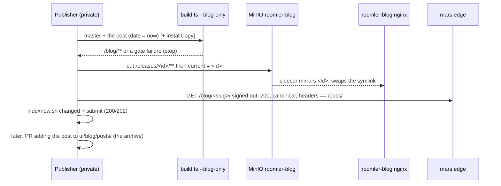

# FR-91: Scheduled blog publishing — a post goes live without rolling `roomler2`

**Issue:** [#1880](https://github.com/gjovanov/roomler-ai/issues/1880) · **Status:** proposed 2026-10-09
— spec and claim · **Owner:** web / public site + deploy · **Anchors:** master `758836df0` ·
**Builds on:** [FR-87](FR-87-blog-and-google-indexing.md) (the blog, its gates, IndexNow),
[FR-60](FR-60-public-docs-site.md) (the generator), [FR-88](FR-88-promotion-attribution-and-site-video.md)
(attribution, `INSTALL_PAGES`), [FR-73](FR-73-image-build-on-github.md) (the image pipeline)

## 1. Goal

A blog post is part of the server image. It goes live only through a full image build and a promote,
and the promote rolls both `roomler2` pods, which re-homes every remote-desktop session, tunnel and
DERP socket on each replaced pod. That price is acceptable for a release, but not per article.

This FR gives the blog its own publishing lane:

1. **A blog-only build** of the same generator. It runs every gate the image build runs today and
   emits `/blog/**` with its own asset base, so its output does not depend on the image's hashed
   `/docs/assets/`.
2. **A `roomler-blog` server**: a small nginx Deployment fed from a MinIO bucket that sends the same
   security headers from one shared include. The mars edge routes `/blog/` and `/sitemap-blog.xml` to
   it, and rolling it touches no long-lived socket.
3. **A publisher contract**: build, upload, verify on the served site, tell IndexNow, then archive the
   post into `ui/blog/posts/`. The repo stays the archive, and unpublished copy never sits here.
4. **Organic attribution for posts**: a reader who arrives at a post from search and signs up records
   the post (`landing_path`) and the referring host. Nothing is stored on the reader's device.

What gets published, when, and how it is written is not engineering. A private publisher drives the
lane, and it is out of scope here, as FR-39 requires for campaign material.

## 2. Evidence (master `758836df0`, 2026-10-09)

| What | Where | Consequence |
|---|---|---|
| A post is `ui/blog/posts/<slug>.md`, built by `ui/docs/build.ts` into `ui/dist` | `ui/package.json` `build`; `Dockerfile:100-105` | — |
| `ui/dist` is copied into the runtime image, which serves it from the pod nginx | `Dockerfile:132-133`; `files/nginx-pod.conf:134-137` (`/blog/`), `:142-146` (feed) | a post is a property of the image |
| `hosted-image.yml` builds on any `ui/**` change | `.github/workflows/hosted-image.yml:31` | every post is an image |
| Only `promote.yml` puts an image live; it rolls `roomler2` (2 replicas, hostNetwork, maxSurge 0) | `promote.yml`; `docs/deployment.md` | every post is a roll |
| IndexNow runs only inside a promote | `promote.yml:90-101`, `:179-190` | a post published any other way is never announced |
| A future `date` is a build error, by design | `ui/docs/theme/posts.ts:169` | there is no scheduling inside this repo, and this FR keeps it that way |
| `draft` is refused: a file here IS published | `ui/docs/theme/posts.ts:92-94` | unpublished copy lives elsewhere (FR-39/FR-87) |
| Assets are content-hashed into `/docs/assets/` by one emitter | `ui/docs/build.ts:179`; `site.ts:38` (`LEGACY_UNHASHED_ASSETS = false`) | a separately built page cannot rely on the image's asset names |
| A page showing an install line must be in `INSTALL_PAGES` | `ui/docs/site.ts:206-216`; `build.ts:659-664` | a how-to post with an install command fails the build today |
| The sitemap index dates the blog child from the posts it knows | `ui/docs/build.ts:885-891` | an image that no longer serves the blog would advertise a stale `lastmod` |
| `attribution.js` returns early when the landing URL has no campaign parameter | `ui/docs/theme/attribution.js:87` | a signup from an organic reader of a post records nothing |
| The server already stores an attribution with only `landing_path` + `referrer_host` | `crates/core/src/attribution.rs:139-157` (`sanitize`) | item 4 is a client-only change |

## 3. Design

### 3a. `--blog-only`: the same generator, a smaller output

`bun docs/build.ts --blog-only --out <dir>` loads everything the full build loads: docs content, posts,
the link graph and the search index inputs. That way the link checker and backlinks see the whole site.
It writes only the blog's own files:

- `/blog/**` (the index, its pages, the tag pages, each post), `/blog/feed.xml`, `/sitemap-blog.xml`
- `/blog/404.html` (the docs 404 rendered with the blog's assets)
- `/blog/assets/**` from a **second `AssetEmitter`** with base `/blog/assets` (today a single emitter
  at `build.ts:179`). This covers CSS, JS, `attribution.js`, the search index and the post images.

Every gate is the same code path as the image build, and a failure exits non-zero:

| Gate | Where |
|---|---|
| Front matter | `ui/docs/theme/posts.ts` |
| Links and anchors | `ui/docs/theme/links.ts` |
| Images (≤3 MiB, alt text, raster OG ≥1200 px) | `ui/docs/theme/images.ts` |
| Title fit | `build.ts:611-614` |
| Install pages | `build.ts:659-664` |

New front-matter key **`installCopy: true`**, added to `BLOG_FRONTMATTER_KEYS` (`site.ts:146`):
- The post joins `INSTALL_PAGES` for that build, so FR-88's carry reaches its install links.
- Without the key, a post that shows an install line still fails, exactly as today.

The `date` gate does not move. The publisher writes `date` as the moment of publication, so
`posts.ts:169` holds as written.

### 3b. Serving: `roomler-blog`

A Deployment in the `roomler-ai` namespace, defined in the deploy repo:
- nginx ×2 serving an emptyDir.
- An **initContainer** fills the emptyDir from the bucket `roomler-blog`.
- A **sidecar** follows a pointer object (`current`) and mirrors the release it names into a fresh
  directory, then swaps a symlink, so nginx never serves a half-written tree.
- A MinIO blip leaves the running pods serving their last good copy.

Headers and caching are byte-identical to the pod nginx:
- `files/security-headers.conf` is extracted from `files/nginx-pod.conf:41-56` and `:87` and included at
  server level by both configs. One source, not a copy.
- Caching mirrors the existing split: `expires -1` on HTML (`nginx-pod.conf:134-146`), immutable on
  hashed assets (`:90-94`), and `absolute_redirect off` (`:32`).
- `error_page 404 /blog/404.html`.
- The Atom content type on `/blog/feed.xml`.

### 3c. Routing at the edge

The mars edge vhost for roomler.ai gains `location ^~ /blog/` and `location = /sitemap-blog.xml`,
pointing at an upstream of the `roomler-blog` NodePort. Everything else (`/`, `/docs/`, `/api/`, `/ws`,
`/derp`) keeps going where it goes today.

- That vhost is in no repository today. It is committed to the deploy repo **before** the change, so
  the change is a reviewable diff.
- It carries `/ws` and `/derp` for the whole fleet, so every edit is `nginx -t` → reload → re-check
  `/ws`, `/derp`, `/health` and a remote-desktop connect (AC9).

**Kill switch:** delete the two locations. The image's own `/blog/`, as of its last build, serves again.

While the lane is on, the sitemap index lists `sitemap-blog.xml` **without** `lastmod` (`build.ts:885-891`):
- the image no longer knows the blog's newest date, and a stale one is worse than none;
- `scripts/indexnow.sh snapshot` reads children from the index, so it keeps working unchanged.

### 3d. The publisher contract

Rules for any publisher:
- It never uploads a tree that failed a gate.
- It verifies the **served** page, not its build.
- It holds one credential only: a MinIO user limited to put/delete on `roomler-blog`. It holds no
  GitHub token.
- The archive PR goes through the normal CI, including `machine-names` and `commit-identity`. The next
  promote's image then carries the post in docs search and backlinks.
- A hand-written post merged to master reaches the lane at the publisher's next rebuild, with no
  promote.

### 3e. Organic attribution for a post

`attribution.js` keeps its campaign rule. In one more case it carries `landing_path` and `referrer_host`
onto the same targets it uses today: when **no** campaign parameter is present, the page is under
`/blog/`, and the referrer is another site.

- The server already accepts that shape (`attribution.rs:139-157`).
- `GET /api/admin/stats/attribution` gains a `landing_path` breakdown limited to `/blog/` prefixes.
- Carry-only and storage-free, under FR-88's rules and its `ATTRIBUTION_ENABLED` switch.

## 4. Phases

| Phase | What | Kill switch | Status |
|---|---|---|---|
| P0 | Claim: issue #1880, this spec, the ledger row | Docs only | this PR |
| P1 | `--blog-only` + the second `AssetEmitter`, `installCopy`, the sitemap-index change behind `BLOG_LANE` in `site.ts`, `files/security-headers.conf`, `public-site-smoke.sh --blog` (compares `/blog/` headers with `/docs/`), tests | `--blog-only` not passed ⇒ output identical to today; `BLOG_LANE = false` | PR open #1883 |
| P2 | The deploy repo: `roomler-blog` Deployment + Service, bucket + scoped users, the edge vhost committed and then routed; one promote for P1 | Remove the two edge locations | — |
| P3 | §3e: the organic carry and the admin breakdown | `ATTRIBUTION_ENABLED` (existing) | — |
| P4 | Docs: `docs/public-site.md` gains "Publishing without a roll" (the sequence above, the edge flowchart, the kill switch); `docs/README.md` row; the field log | — | — |

## 5. Acceptance criteria

- [ ] **AC1:** for the existing post, `--blog-only` output matches the image's `/blog/**` once asset URLs
  are normalised. A test asserts it.
- [ ] **AC2:** a new post goes live on production with **zero** `roomler2` restarts and unchanged pod
  ages, measured before and after the publish.
- [ ] **AC3:** the served `/blog/<slug>/` sends CSP, HSTS, X-Frame-Options, X-Content-Type-Options,
  Referrer-Policy and Permissions-Policy byte-identical to `/docs/`, and the `--blog` smoke passes.
  Negative control: drop the include from the blog config, and the smoke fails.
- [ ] **AC4:** `sitemap-blog.xml` and `/blog/feed.xml` list the new post within a minute of publishing,
  and IndexNow answers 200 or 202 for it.
- [ ] **AC5:** with the two edge locations removed, the image's blog serves and the smoke passes for the
  older post. Restoring them serves the lane again.
- [ ] **AC6:** with the bucket unreachable, the running `roomler-blog` pods keep serving the last
  release.
- [ ] **AC7:** a post that shows an install line fails `--blog-only` without `installCopy: true` and
  builds with it. The carry then reaches its install links.
- [ ] **AC8:** an organic visit (no UTM) from an external referrer to a post, followed by a signup,
  stores `landing_path=/blog/<slug>/` and `referrer_host` in `signup_attribution`. Nothing is written to
  cookies or storage.
- [ ] **AC9:** right after each edge reload, `/ws`, `/derp`, `/health` and a remote-desktop connect all
  work.
- [ ] **AC10:** docs updated or created with mermaid diagrams (`docs/public-site.md`: the publishing
  lane, the edge routing, the kill switch) and linked from `docs/README.md`.

## 6. Open decisions

1. **The archive PR's identity.** The default is the operator's own identity, used from a local session
   as for every commit today, which needs no change to `.githooks/allowed-identities.txt`. The
   alternative is a dedicated bot identity added to that allowlist.
2. **The release pointer.** A `current` object naming `releases/<id>/`, which the sidecar follows into a
   fresh directory and swaps by symlink, is the proposal. The alternative is a per-release prefix that
   the edge selects, which needs an edge reload per publish and is rejected for that reason.
3. **Search on blog pages.** `--blog-only` emits a full index (docs + posts) under `/blog/assets/`, so
   search from a post sees new posts at once. The 150 KB gzip ceiling (`site.ts:42`) still applies.

## 7. Out of scope

- The private publisher: what is written, keyword targets, the calendar, drafting, review and social
  syndication (FR-39).
- Moving `/docs/**` out of the image.
- The stale call-recording claims in the landing copy and legal pages, which are tracked separately.

## 8. Field-verification log

*(empty: nothing built yet)*

## 9. Related

FR-87 (#1776) · FR-60 · FR-88 (#1790) · FR-73 · FR-39 · `docs/public-site.md` · `scripts/indexnow.sh` ·
`scripts/public-site-smoke.sh`
