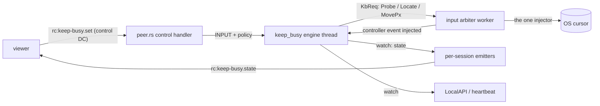
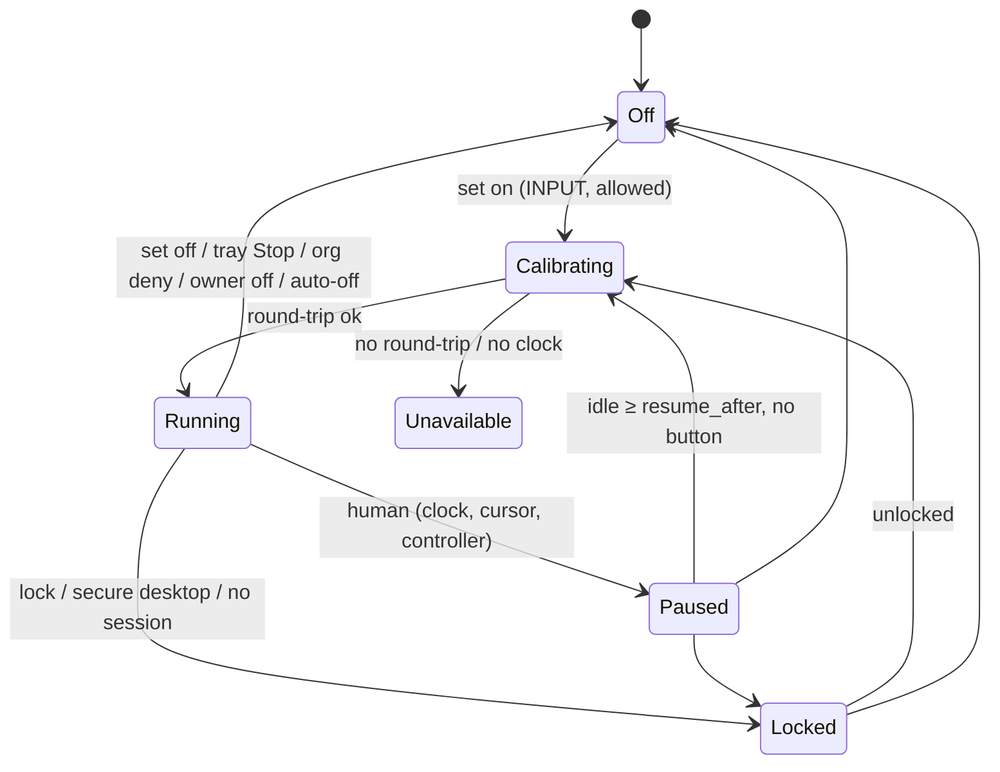

# FR-92: Keep busy — the agent keeps a host active with mouse patterns, and any real user takes over at once

**Issue:** [#1942](https://github.com/gjovanov/roomler-ai/issues/1942) · **Status:** proposed 2026-10-10
— spec and claim · **Owner:** remote desktop (agent + viewer), fleet (the org switch) · **Anchors:**
master `83aede0bd` · **Builds on:** [FR-55](FR-55-always-reachable.md) (power),
[FR-27](FR-27-consent-surfaces-and-desktop-companion.md) (consent, the companion banner, the person socket),
[FR-85](FR-85-hq-screen-recording.md) (`record_remote_enabled`, the device-owned key precedent),
[FR-43](FR-43-macos-single-enrollment.md) (the supervised macOS worker), the P6 input arbiter

## 1. Goal

An operator switches **keep busy** on from the remote-desktop viewer. The agent then moves the host's
mouse in a pattern so the host stays active: no screensaver, no idle lock, no "Away" in Teams or Slack.

The patterns:
- the geometric ones: circle, triangle, square, a one-stroke star, figure-8, heart, spirograph, an 8-petal rose, a wave;
- a Lissajous knot that morphs each loop;
- **wander**, a smooth random path with uneven speed and short rests, which looks the most human;
- **subtle**, a 1 px nudge every ~45 s that resets the idle clock with no visible motion;
- **shuffle**, which rotates through the visible ones.

**A real user always wins.** Any real input pauses it at once: the person at the machine, or a remote
controller, moving, clicking, typing or scrolling. It resumes once that person has been idle for
`resume_after` (30 s by default), and keeps going until someone switches it off. It survives
disconnects, self-updates and reboots.

**Operator decisions (2026-10-10):**
1. **Lifetime:** on until switched off, even across reboots. The state is kept **per signed-in
   person**: it resumes at that person's next login, and someone else signing in starts with it off.
   An optional auto-off is offered.
2. **Availability:** on by default for any session holding `INPUT`. The device owner can turn it off
   (`keep_busy_enabled`, never server-settable), and an **org admin can deny it org-wide** in v1. The
   deny also stops it where it is already running.
3. **Host side:** a companion tray item ("Keep busy is on · Stop") and `roomler keep-busy status|off`.

## 2. Evidence (master `83aede0bd`, 2026-10-10)

| What | Where | Consequence |
|---|---|---|
| FR-55 holds `PowerCreateRequest(PowerRequestSystemRequired)` / `IOPMAssertion("PreventUserIdleSystemSleep")` | `agents/roomlerd/src/power.rs` L305-471 | stops sleep, but not the screensaver, the idle lock or presence, because none of these reset the user-idle clock |
| Injected input does reset it: macOS logs a `UserIsActive` assertion "tickle … process:roomlerd" during a session | FR-55 field log; `power.rs` L17-22 | the mechanism works, but today it only runs while a controller types |
| One process-global injection worker owns the only OS injector, created lazily and **cached for the life of the process, Noop included** | `input/arbiter.rs` L581 `global()`, L646 `worker`, L652, L781 `get_or_insert_with` | a second injector would break modifier fencing and the portal route; an early Noop would break RC input until restart |
| Every RC input event already passes through `ArbiterState::plan` with an exact per-session held-key/button set | `arbiter.rs` L286-355, L125-131 | the engine gets an exact "a controller is active" signal, and knows when a remote button is down |
| Clicks carry coordinates, and dispatch **moves before every button event** | `input/mod.rs` L167-173; `input/enigo_backend.rs` L123-138 | a controller's click lands where they point, even after the engine moved the cursor |
| enigo 0.6.1's Windows `move_mouse(Abs)` is `SendInput(ABSOLUTE)` without `VIRTUALDESK`, normalised to the primary display; `to_pixels` ignores `mon` by default | `enigo-0.6.1/src/win/win_impl.rs` L175-176; `enigo_backend.rs` L293-308 | moving through `InputMsg` cannot reach a secondary monitor, so keep-busy needs its own pixel-space move |
| No idle-clock reader exists anywhere (`GetLastInputInfo`, `CGEventSourceSecondsSinceLastEventType`, `XScreenSaverQueryInfo`, Mutter IdleMonitor: 0 hits) | `agents/`, `crates/` | detection is new code; `Win32_UI_Input_KeyboardAndMouse` is already enabled (`agents/roomlerd/Cargo.toml` L425) |
| Lock state is Windows-only and per session; macOS/Linux stubs always read `Unlocked`, and the RC input gate drops input while `Locked` | `lock_state.rs` L170-214, L290-306, L313-335; `peer.rs` L8088-8112 | keep-busy needs its own lock probes on macOS/Linux, and they must **not** feed the RC gate (a Mac controller types the password on the lock screen) |
| The Windows worker lives for the whole console session, regardless of RC, and is respawned at login | `win_service/supervisor.rs` `decide_spawn` L664-763 | an engine there can outlive any session |
| The machine-global config dir is hardened to SYSTEM + Administrators; the default worker runs as the user | `crates/agent-core/src/config.rs` `harden_machine_global_dir`; `supervisor.rs` L816-880 | state "beside the config" is not writable by every worker, so it goes in the signed-in person's profile (`win_identity.rs` L104 `session_user_profile_dir`) |
| Control-DC verbs are untyped JSON switched on `t`; the arbiter fans state out to every session; the viewer drops unknown `t` | `peer.rs` L8239-8699; `arbiter.rs` L789-825; `ui/src/composables/useRemoteControl.ts` L966 | new verbs need no baseline re-record and no server change |
| Org kill switches live in `TenantSettings` (`remote_exec_enabled`, `remote_ssh_enabled`); reconcile-on-connect pushes are cap-gated; cross-pod hub ops go through `publish_rc_ctrl` | `crates/db/src/models/tenant.rs` L79-165; `crates/modules/fleet/src/socket.rs` L240-290; `fleet/src/ctrl.rs` L21-45 | the org deny has a precedent for each of its parts |
| The person-at-the-device LocalAPI socket serves an exhaustive allowlist | `crates/localapi/src/lib.rs` L2235 `person_may` | the Stop must be added there, so a Linux system install's companion can reach it |

## 3. Design

### 3a. One more input source, not a second injector

- **New module `agents/roomlerd/src/keep_busy/`**: one std thread. It contains:
  - `engine.rs`: a pure state machine over a `Host` trait, tested with a fake host and clock, the
    `ArbiterState` split again;
  - `patterns.rs`, `state.rs`;
  - per-OS host probes (idle clock, lock, mouse buttons, work area).
  
  File I/O and lock probes run on this thread, never on the input path.
- **The arbiter serves requests.** `Cmd::KeepBusy(KbReq{ op: Probe | Locate | MovePx{x,y}, reply })`:
  - Reads run on the injector thread, so the SystemContext desktop rebind covers them, with a reply
    timeout so a stuck injector can't hang the engine.
  - `MovePx` is **refused while any session holds a mouse button**.
  - After every *session-caused* injection (never a `Heartbeat`, never a denied event), the arbiter
    notes remote activity.
- **The injector trait gains `cursor_px` / `move_px`** in desktop pixel space. They default to
  unsupported (Noop, or a portal-owned route ⇒ `unavailable:portal`, never a silent no-op).
  - Windows: `move_px` is a direct `SendInput(MOVE|ABSOLUTE|VIRTUALDESK)` over the virtual screen, and
    `cursor_px` is `GetCursorPos` (the process is per-monitor-v2).
  - macOS/X11: enigo's `move_mouse(Abs)` and `location()` share global/root coordinates.
  - The read and the write use one coordinate space, so a divergence means something. The pixel moves
    bypass enigo `dispatch`, so they never spend the 50 INFO input-diagnostic samples or the keyboard
    layout sampler.
- **Start** after `arbiter::global()` exists (it captures the tokio handle). The engine homes:
  - **Windows:** the console-session worker.
  - **macOS:** the GUI-session worker, which runs the full `run()`.
  - **Linux:** the daemon.

### 3b. Who is a real user — an expected-state diff

The engine only ever causes absolute mouse moves, so anything else is a human. Each tick it pauses on:

1. **An idle-clock advance it did not cause.**
   - **Windows `GetLastInputInfo`.** It's session-scoped and updated asynchronously, in 15.6 ms ticks.
     After its own move the engine polls until `dwTime` advances (cap ~50 ms) and keeps that as the
     baseline. A later `dwTime` ≠ baseline (a wrapping u32 compare) means a human. No advance at all
     means the move is not landing (UIPI, the wrong desktop) ⇒ `not_landing`, never "busy".
   - **macOS `CGEventSourceSecondsSinceLastEventType`.**
   - **X11 `XScreenSaverQueryInfo`** (the x11rb `screensaver` feature).
   - **A host with no idle clock** does not advertise the feature: v1 refuses rather than run
     keyboard-blind.
2. **Cursor divergence:** the cursor is more than 1 px from where the engine left it.
3. **Controller input** noted by the arbiter.

Divergence with no clock evidence means an app warped or confined the cursor. That's
`cursor_contended`, with exponential backoff, so it never oscillates.

**Banned:**
- `SetWindowsHookEx` (low-level hooks);
- `RegisterRawInputDevices(INPUTSINK)`;
- keyboard `GetAsyncKeyState` polling;
- key event taps.

EDR flags each as a keylogger, and GPO-locked corporate desktops with EDR are in the acceptance bar.
Mouse-*button* state is read **once per resume**, never polled.

**Calibration** on every enable and resume: read the cursor, move it **3 px out and back**, verify the
pointer reached each leg, and require the idle clock to register the moves. Otherwise
`unavailable:calibration_failed` (or `not_landing` when the clock never moves).

Two details matter:
- A move to the same point may not count as input anywhere.
- A pointer stuck at the anchor round-trips "home → home" perfectly. Only checking the out-leg catches it.

A test pins this (P1).

**Resume** when the human has been idle for `resume_after`, no button is held, the session is unlocked
and present. The engine re-anchors at the **current** cursor and continues from the nearest point of the
pattern: no jump, an eased start.

### 3c. Safety invariants

- **Moves only**: never a click, key or scroll.
- **Safe box**: the work area of the monitor under the anchor, intersected with a 48 px inset from
  every monitor edge. It stays out of hot corners and edges: GNOME Activities, macOS hot corners (which
  can start the screensaver or **lock the screen**), auto-hide taskbars and Docks, the menu bar, Peek.
- **Pause while locked, on a secure desktop, or with no session.**
  - Windows: `probe_lock_state_detailed()`, a free function called per tick. It is not the
    session-scoped monitor (#1738).
  - macOS: `CGSSessionScreenIsLocked`.
  - Linux: logind `LockedHint`.
  - These probes are **keep-busy-only**.
- **Never the first caller of the cached injector before a display exists.** No `Locate`/`MovePx`
  until `Probe` confirms an interactive session. A boot-time restore on a Linux daemon without
  `DISPLAY` would otherwise cache a Noop and break RC input until restart.
- **The viewer never re-asserts keep-busy on connect.** It's the opposite of display-match
  (`RemoteControl.vue` ~L4148): the device's state is authoritative, and a reconnecting tab must not
  undo the host's Stop.
- **Wayland is refused explicitly** (loginctl `Type=wayland`). XTest there moves only Xwayland's
  private pointer, so a calibration could pass while nothing real moves.
- **Warnings are reported, not swallowed:**
  - `focus_follows_mouse` (Windows `SPI_GETACTIVEWINDOWTRACKING`; the viewer suggests `subtle`);
  - `resume_after_exceeds_lock_timeout`.

### 3d. Wire

- **Control DC in:**
  - `{"t":"rc:keep-busy.set","on":true,"pattern":"circle","size":"m","speed":"normal","resume_after_s":30,"auto_off_min":null}`
  - `{"t":"rc:keep-busy.set","on":false}`
  - `{"t":"rc:keep-busy.get"}`
  
  Each requires `INPUT`.
- **Control DC out** (to every session on change, and on open/get): `{"t":"rc:keep-busy.state","available":true,"on":true,"phase":"calibrating|running|paused|locked|off|unavailable","reason":"…","paused_by":"local|remote|null","resumes_in_ms":23000,"pattern":"circle","size":"m","speed":"normal","resume_after_s":30,"auto_off_at_ms":null,"set_by":"Alice","detector":"clock+cursor","warn":[]}`.
  - `reason` is a closed enum with wire codes; the sentence is written on the agent (the
    `apps::Unavailable` pattern).
- **Caps:** `keep-busy` in `AgentCaps.input` (`encode/caps.rs` L1445). It's present only when the build,
  the host, the idle clock and `keep_busy_enabled` allow it, and it follows the key at heartbeat time,
  like the `record` cap. Matching is equality, and unknown words are ignored.
- **LocalAPI:** `keep_busy_status` / `keep_busy_off` → `keep_busy`.
- **Server → agent:** `ServerMsg::KeepBusyPolicy { denied }`, tag `rc:agent.keep_busy_policy`,
  owned by fleet in `namespace()`. It is the only server→agent keep-busy message (§3f).

### 3e. Persistence — per signed-in person

- **The file:** `keep-busy.json` (version, on, settings, `set_by`, `set_at`, an absolute `auto_off_at`,
  last-known org denies, `#[serde(flatten)] extra`).
  - Atomic temp+rename, copied from `crates/agent-core/src/desktop_state.rs`.
  - Written on On/Off edges only, never on pause/resume.
  - Corrupt ⇒ Off.
- **Location:**
  - **Windows:** the console user's profile (`win_identity::session_user_profile_dir` under SYSTEM, else
    `own_profile_dir`). The user-context and SystemContext workers resolve the same file.
  - **macOS:** the GUI worker's `data_local_dir`.
  - **Linux root daemon:** `keep-busy-<console uid>.json` next to the logs.
- **Never stored in `config.toml`.** It's SYSTEM/root-owned on system installs, sits behind an
  in-process write lock, gets reported to the server, and `adopt_local` would read every toggle as a
  config edit.

### 3f. Policy gates

- **Device: `keep_busy_enabled`**, default true (`AgentConfig`, near `power_policy` L167).
  - It's a live `config_surface` key in RemoteDesktop, like `record_remote_enabled` (L1590), and goes
    in `live_keys_are_exactly_the_adopt_local_set` (L2699).
  - A local `ConfigSet` takes the console-user gate of `record_*` (`localapi/src/lib.rs` ~L2431).
  - It is **absent from `DesiredConfig`**, pinned by a twin of
    `no_record_key_is_server_pushable_via_desired_config` (`models.rs` L4448).
  - Its description says that keep-busy overrides `power_policy = never`, because injected input
    defeats idle sleep.
- **Org: `TenantSettings.keep_busy_denied`** (default false = allowed).
  - `GET/PUT /api/tenant/{tid}/keep-busy-settings`: reading needs MANAGE_AGENTS, writing needs
    MANAGE_TENANT, following exec-settings (`fleet/src/agent_exec.rs`).
  - **Standing:** reconciled on connect after `ConfigPush` (both `true` and `false`, so a re-allow while
    offline clears), and pushed on change through `publish_rc_ctrl` → an `apply_rc_ctrl` arm, because
    the PUT can land on any pod. Both are cap-gated (`supports_keep_busy`).
  - **The word reappearing counts as a connect.** When the owner turns `keep_busy_enabled` back
    on, the agent re-announces its caps on a heartbeat, and the policy is pushed then. Without
    this, a deny made while the word was absent would never arrive. It is pushed only on the
    reappearance: caps are also re-announced for the record word and for a worker's permissions.
  - **On the agent:** the effective deny is the strictest of every enrolled org's last-known deny,
    persisted. An old server (no push) means allowed.
  - **An org the device has left drops out.** At each start, a stored policy from an org that is
    no longer the primary or in `[[orgs]]` is dropped (`prune_departed_orgs`). Otherwise leaving
    an org that had denied keep busy would deny it on that device for good, because no server
    would ever push that org's re-allow.
  - **Device-wide, so no per-session field.** Under strictest-of a deny is device-wide, and the
    engine itself refuses every enable while it holds (`org_denied`, to every viewer). The connect
    reconcile reaches the agent before any session request, and a change is pushed at once. A
    `keep_busy_denied` field on `ServerMsg::Request` would only repeat that, at the cost of threading
    it through the session authz, the hub, the cross-pod relay JSON and the macOS delegation. That
    design was dropped in P1 (see §8).

### 3g. Host side

- **LocalAPI `KeepBusyStatus` / `KeepBusyOff`**, both on the person-socket allowlist.
  - There is no local enable verb.
  - Off is open to every peer the endpoint admits (including `roomler exec` as SYSTEM/root), because
    stopping is the safe direction.
- **CLI:** `roomler keep-busy [status|off] [--json]`.
- **Companion:**
  - a tray item and tooltip, polled like the recording item (`roomler-desktop/src/tray.rs`
    `spawn_recording_watch`);
  - a one-shot notification when it turns on;
  - a "Keep busy is on · Stop" row in the viewing banner while that banner is up.

### 3h. Viewer and admin UI

- **Viewer composable:** `useKeepBusy.ts`, modelled on `useRemoteRecording.ts`.
- **Viewer menu:** sits beside Record and holds
  - an on/off switch;
  - a pattern grid of inline-SVG previews drawn from the same formulas;
  - speed and size;
  - `resume_after` (10 s – 5 min) and auto-off (never – 8 h);
  - a status line ("Paused, someone is using this computer · resumes in 23 s");
  - a live chip like Host-locked.
- **Gating:** on the cap word and the session's `INPUT` bit; an unavailable or denied state is shown
  with its reason.
- **Org admin:** a switch in `SettingsSection.vue` beside exec/SSH.
- **Device list:** a "Keep busy" badge driven by an additive `AgentHeartbeat.keep_busy`. Transitions are
  audited as an agent *claim*.

## 4. Phases

| Phase | What | Kill switch | Status |
|---|---|---|---|
| P0 | Claim: issue #1942, this spec, the ledger row | Docs only | #1943, merged `058d6304a` |
| P1 | Pure engine + patterns + fake-host tests; `cursor_px`/`move_px` + the arbiter `KbReq` seam; the Windows host; the control-DC verbs; the state file; `keep_busy_enabled`; the cap word | `keep_busy_enabled = false`; no cap word ⇒ the viewer hides it | #1948, merged `a9fc3f0de` |
| P2 | Viewer: composable, menu, previews, chip | the cap word | #1949, merged `28fd63c19` |
| P3 | **P3a, X11**: the X11 host (MIT-SCREEN-SAVER idle clock read as an interval, logind `LockedHint`, RandR ∩ `_NET_WORKAREA`), Xwayland refused from the display itself (`wayland`), the person followed under a root daemon or a SYSTEM worker, proven on Xvfb in CI. **P3b, macOS**: the CoreGraphics host, and the daemon handing every org's policy to the GUI worker | per-host cap word | P3a PR open; P3b next |
| P4 | LocalAPI verbs (person socket), CLI, companion tray item. Not built: the OS notification (the companion has no notification plugin yet) and the viewing-banner row (the banner shows only during a session; the tray is the persistent surface) | — | #1951, merged `51dfd2466` |
| P5 | Org deny: tenant key, routes, admin UI; a standing `rc:agent.keep_busy_policy` on every connect and on every change, across pods. No per-session `Request` field (§3f). Forwarding to a supervised Mac's worker moves to P3. Deferred to P5b: the heartbeat brief, the device-list badge, the audit | the org switch (default allowed) | PR open |
| P6 | Docs: `docs/keep-busy.md` (mermaid state machine + sequence), a cross-ref from `docs/remote-control.md` §6, the `docs/README.md` row, the configuration reference; the field log | — | — |

## 5. Acceptance criteria

- [ ] **AC1:** turning it on in the viewer starts it on the host, and every connected viewer shows the
  same live state.
- [ ] **AC2:** while it runs, host idle time stays under 2 s on Windows, macOS and X11, measured. The
  negative control (OFF ⇒ the host locks and Teams goes Away) is recorded first.
- [ ] **AC3:** local input (move, click, key, scroll) and controller input each pause it within 1 s. It
  resumes after `resume_after`, and never while the screen is locked or a mouse button is held.
- [ ] **AC4:** it survives a disconnect, a daemon self-update and a reboot (resuming at the same
  person's next login).
- [ ] **AC5:** `keep_busy_enabled = false` hides and refuses it, and the server cannot change that key.
- [ ] **AC6:** an org deny refuses new enables and stops running instances, including on devices that
  reconnect later and across pods.
- [ ] **AC7:** the tray's Stop and `roomler keep-busy status|off` work, including through a Linux
  system install's person socket.
- [ ] **AC8:** no hook or raw-input API is used. A source-scan unit test passes (proven to fail on a
  planted line), the binary's import diff against the previous release is clean, and EDR stays quiet
  for 24 h on the corporate laptop.
- [ ] **AC9:** Wayland and portal-only hosts report `unavailable` with a reason the viewer shows.
- [ ] **AC10:** docs updated or created with mermaid diagrams (`docs/keep-busy.md`: the state machine,
  the sequence, the gates) and linked from `docs/README.md`; the configuration reference covers
  `keep_busy_enabled`.

## 6. Open decisions

- **The default pattern.** Circle, which is what was asked for. Or `subtle`, which sends no visible
  motion to connected viewers' cursor channel.
- **Whether the arbiter should stop caching a `NoopInjector`.** That would harden RC input as well, but
  it changes RC behaviour and needs its own test and field check.
- **When Wayland ships.** GNOME's Mutter IdleMonitor plus uinput is the likely first path.

## 7. Out of scope

- Sleep and power assertions (FR-55).
- Clicks, keys or scrolling of any kind.
- Enabling keep-busy without a consented, `INPUT`-granted session. A server-side enable would be the
  only server-forgeable input path in the product, so there is none.
- Work-hour schedules.
- A per-device admin deny in `AccessPolicy`.

## 8. Rejected along the way

- **Low-level hooks or raw input to tell real from synthetic input.** They're exact (`LLMHF_INJECTED`,
  a null `hDevice`), but EDR reads them as keylogging.
- **Cursor warps** (`SetCursorPos`, `CGWarpMouseCursorPosition`, `XWarpPointer`). They move the
  pointer without resetting the idle clock, which defeats the purpose.
- **Moving through `InputMsg::MouseMove` and `to_pixels`.** It reaches the primary display only, and it
  spends the per-session input diagnostics.
- **State "beside the config" or inside `config.toml`.** The hardened machine-global dir is not
  writable by the default user worker, and `config.toml` has several writers.
- **Device-wide state.** It would start moving a different person's mouse after they sign in.
- **A per-session org flag, alone or beside the push.** Alone, it cannot stop an instance that
  outlived its session, so the standing push exists. Beside the push it is redundant: the deny is
  device-wide (strictest of every enrolled org), and the engine refuses every enable while it holds.

## 9. Field-verification log

Nothing yet. The plan: on throwaway vmtest VMs and fleet hosts, never a machine someone is using.
1. **Negative control first:** a 1-minute lock + Teams with keep-busy OFF ⇒ the host locks and Teams
   goes Away.
2. **ON:** no lock over 15 minutes. Host idle is measured with `roomler exec`: Windows
   `GetLastInputInfo`, macOS `HIDIdleTime`, X11 `xprintidle`.
3. **Pause and resume:** a local touch, local typing and controller typing each pause it within 1 s.
4. **Locks and reboots:** Win+L ⇒ `locked`; a reboot and login ⇒ running with no viewer.
5. **Org deny:** an org PUT ⇒ every online device stops within 5 s.
6. **Hot corners:** a macOS lock hot corner never fires in 30 minutes at size `l`.
7. **EDR:** quiet on the corporate laptop.

## 10. Related

- FR-55: keep-busy overrides `power_policy = never` (§3f).
- FR-27, FR-85, FR-43, and the P6 arbiter (`input/arbiter.rs`).
- #1738: the lock monitor is session-scoped.
- **Found along the way, filed separately:** the arbiter's release-all on session close sends a
  button-up at (0,0), and dispatch moves first. So a session that closes mid-drag throws the cursor
  into the top-left corner, a hot corner on GNOME and macOS (`arbiter.rs` L109-118,
  `enigo_backend.rs` L128-138).
