# Hive — agent sessions

Hive runs coding agents on an organization's own enrolled machines and makes each
run a record the org can see. A member starts a session on a device, in a folder.
The device runs Claude Code headless as one of its own local accounts. The people
the owner invites watch the session in a chat room, and the ones allowed to drive
it prompt it and answer its approval cards, from a desk or a phone. The server
keeps the record and one stub per turn. What the agent and the people said and did
stays on the device.

> Spec, phases and the full field log: [`fr/FR-90-hive-agent-sessions.md`](fr/FR-90-hive-agent-sessions.md)
> (#1827). The whole design, including the replicaset, the vault, knowhow and the
> learning loop, none of which is built yet: [`roomler-hive-design.md`](roomler-hive-design.md).
> This page describes what is built: agent sessions through P1, and P2a's member
> store. Core memory has its own page, [`brain.md`](brain.md).

Nothing runs until three parties turn it on. The server's switch is `hive.tenants`
(§9). A person needs `HIVE_RUN`. A device runs nothing until its owner sets
`hive_enabled`, maps accounts and names folders. The Linux and macOS release builds
carry the `hive` feature since 0.4.122, and the Windows build from P1i-3 on (#1915),
so from the first Windows release cut after 0.4.123. A device whose owner never
turns sessions on keeps nothing for them: no data directory, no `hive.db`, no store
thread ([`store_wanted`](../agents/roomlerd/src/hive/supervisor.rs#L554)).

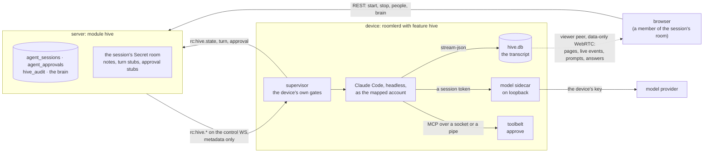

---

## 1. What a session is

A session is four things, and only the first two are on the server.

| Piece | Where | What it holds |
|---|---|---|
| the record | `agent_sessions` ([`model.rs:109`](../crates/modules/hive/src/model.rs#L109)) | who started it (`owner_id`) and who else drives it; the title and the room; the harness and its own session id, a UUID the server mints so every resume continues one conversation; the device, the folder as typed and the account the device says it mapped; the status, the fence, the brain revision, and `origin` (`started` or `adopted`) |
| the room | a `Secret` chat room at the path `hive-<session>`, bound to `{module: "hive", ref: <session>}` ([`room.rs:35`](../crates/modules/hive/src/room.rs#L35)) | notes the session authors when it starts, is refused or ends; one stub per turn; one stub per approval. Never what was asked or answered |
| the transcript | the device's replica store, `hive.db` ([`store.rs`](../crates/hive-node/src/store.rs)) | every event: prompts with their authors, assistant text, tool calls and their results (an output over 64 KiB keeps its head and tail), approvals, each turn's end with its cost, and Hive's own notes |
| the viewer peer | a data-only WebRTC peer from the device to one browser ([`view.rs`](../agents/roomlerd/src/hive/view.rs)) | the transcript's pages and its live tail one way; a driver's prompts and approval answers the other |

⚠️ **The server holds no transcript, and the frames are shaped so it cannot.**
`rc:hive.start`, `rc:hive.state`, `rc:hive.turn`, `rc:hive.approval` and
`rc:hive.manifest` carry ids, words, numbers and display names. Tests in
`signaling.rs` lock each field set, so a `prompt`, `tool` or `input` field would be
a deliberate edit there. The one Hive frame with text a model reads is
`rc:hive.memory`, the curated core memory ([`brain.md`](brain.md)). P0f's canary
test ([`hive_canary.rs`](../crates/tests/tests/hive_canary.rs)) sends a canary
through a prompt, a tool's output and a crashing harness's stderr, and finds each
in the device's store and in no Mongo document, object-store file, server log line
or frame the server sent the browser. It found one leak when it was written: the
`ended` detail carried the harness's last 400 bytes of stderr to the server. Those
are a note in the transcript now, and the server hears only how the harness ended
([`describe_end`](../agents/roomlerd/src/hive/supervisor.rs#L2996)).

**Statuses.** The record mirrors what the device reports. Every transition a device
drives is a compare-and-set on the session's device (the authenticated socket's,
never a field of the frame), its fence and the statuses it may leave
([`dao.rs`](../crates/modules/hive/src/dao.rs)), so a stale frame, another device's
frame or one that crossed a stop on the wire changes nothing.

| Status | Means | Set by |
|---|---|---|
| `starting` | the start was sent; `accepted_at` says whether the device answered | the server |
| `idle` · `running` · `awaiting_approval` | the harness waits for a prompt · a turn runs · a tool call waits for a driver | the device's `rc:hive.state` |
| `stopping` | the owner ordered a stop, and the device has not confirmed it | the server |
| `ended` | over; `end_reason` says how: `stopped`, `exited`, `not_on_device`, `member_removed`, `device_removed`, `tenant_archived`, `hive_not_enabled`, `attribution_changed` | the device, or the server for a device it can no longer ask |
| `refused` | the device refused the start, and `refusal` names its gate | the device's `rc:hive.start_ack` |
| `lost` | the start was never answered and will not be sent again (`never_answered`) | the server |

**A turn** is one prompt and the harness's work on it, ended by the stream-json
`result`. The device writes prompts one at a time. One that arrives during a turn
waits, and at most 8 wait before the next caller is refused, because Claude Code
would queue the prompt itself and its `result` would then close the wrong turn's
stub. A turn's stub is posted when the prompt goes in and edited when the turn
ends, and a report for a turn older than the newest stub changes nothing
([`room.rs:172`](../crates/modules/hive/src/room.rs#L172)):

```
✅ Turn 3 — done · 5 steps · 42 s · $0.12 · asked by Alice
```

The cost is what that turn cost. Claude Code's `total_cost_usd` is its process's
running total, so the device subtracts what the process had spent at the previous
turn's end ([`supervisor.rs:2649`](../agents/roomlerd/src/hive/supervisor.rs#L2649)).

**The transcript** is a hash chain ([`chain.rs`](../crates/hive-node/src/chain.rs)).
Each event carries the session's `seq` (gapless from 1), the `fence` of the lease
that wrote it and `prev_hash`, the BLAKE3 hash of the event before it. It is stored
as its exact JSON text, so a member that cannot parse a newer kind still chains and
serves it. One writer thread owns the SQLite file
([`hive/store.rs`](../agents/roomlerd/src/hive/store.rs)), and every append is
checked against the chain's tip inside the transaction that writes its full-text
index row. The file sits in a directory locked to the daemon (`0700`, or SYSTEM and
Administrators on Windows): no local account reads anyone's transcript.

### The viewer peer

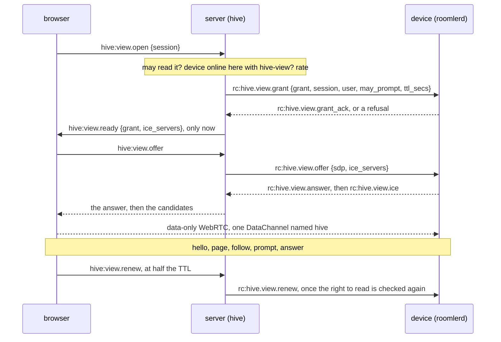

| Rule | Why | Where |
|---|---|---|
| The browser dials only after the device confirmed the grant | a device that would refuse never gets an offer (FR-83's rule) | server [`view.rs:463`](../crates/modules/hive/src/view.rs#L463) `on_device_frame` |
| A grant's TTL is relative (`ttl_secs`, 10 minutes) and renewed at half-life, and each renewal checks again that the viewer may read | a device with a skewed clock cannot expire a fresh grant, and a member taken out of the room loses the view within one TTL | `view_limits`, [`hive.rs:91`](../crates/remote_control/src/hive.rs#L91) |
| Whoever may not read the session, or is in an org the pillar does not serve, is told `not_found` | the answer a bogus id gets | server [`view.rs:181`](../crates/modules/hive/src/view.rs#L181) `open` |
| The server allows 4 grants per browser connection and 20 opens a minute per (user, session); the device serves 8 viewers per session and 32 per device | | server [`view.rs:57`](../crates/modules/hive/src/view.rs#L57), device [`view.rs:259`](../agents/roomlerd/src/hive/view.rs#L259) |
| The device serves a grant on its primary enrollment, with `hive_enabled` on (or `hive_adopt`, for an adopted session), for a session it holds, live or in its store | | device [`view.rs:259`](../agents/roomlerd/src/hive/view.rs#L259) `view_grant` |
| One actor per grant owns the peer, its timers and its channel, and is the one place `close()` runs | ⚠️ a dropped WebRTC peer frees nothing: its ICE sockets belong to tasks the stack spawned, and leaked peers once ate a host's whole ephemeral port range | device [`view.rs:360`](../agents/roomlerd/src/hive/view.rs#L360) |
| Each JSON message travels as binary frames of at most 60,000 bytes: `[v1][id u32][part u16][parts u16][payload]` | one SCTP message over 65,536 bytes is silently lost | [`framing.rs`](../agents/roomlerd/src/hive/framing.rs) |
| `follow` subscribes to the store's live feed first, then catches up from the store | an event that lands in between is in one or the other: never lost, never sent twice | device [`view.rs:774`](../agents/roomlerd/src/hive/view.rs#L774) |
| TURN credentials are minted per grant, with a 12 h TTL | the credential bounds the allocation's whole life, and the configured 600 s would cut a relayed viewer at ten minutes | server [`view.rs:68`](../crates/modules/hive/src/view.rs#L68) |
| ICE is set up as remote control's browser-facing peer: the overlay interface kept out, `.local` candidates resolved by the OS, `ICE_RELAY_TCP` honoured | | device [`view.rs:500`](../agents/roomlerd/src/hive/view.rs#L500) |

The browser half is [`useHiveViewer.ts`](../ui/src/composables/useHiveViewer.ts).
It opens on the last 300 events, keeps at most 1,000 while it follows the newest
(the oldest are a "load earlier" away), and closes its peer on every way out. The
transcript draws each tool call by its tool (a command, an edit as a diff, a file
range, a search) with its result folded under it, and assistant text through
`renderMarkdown`, the one XSS boundary. Everything else is text interpolation
([`HiveTranscript.vue`](../ui/src/components/hive/HiveTranscript.vue)).

---

## 2. Starting one, and who may drive

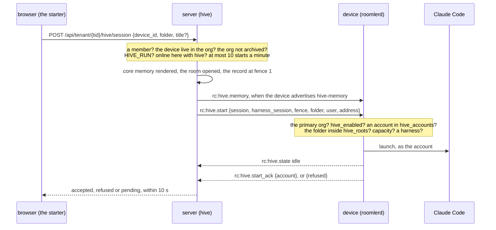

**The server's gates**, in order ([`routes.rs`](../crates/modules/hive/src/routes.rs)):
membership first, so a stranger learns nothing about devices; the device, live in
this org, and a 404 otherwise, as for a bogus id; the org not archived; `HIVE_RUN`;
the device connected here and advertising `hive`; and the per-(user, device)
ceiling of 10 starts a minute, last, so a refusal is attributable to an identity
that passed the others. From the archive check on, a refusal is a `200` that names
the reason, and it is audited in `hive_audit`. That is the exec convention: the row
is what remains when someone probes which devices will run things for them.

`HIVE_RUN` (bit 32) is in no managed role below `ADMINISTRATOR`, pinned by
`no_managed_role_below_administrator_seeds_a_root_shell`
([`role.rs:408`](../crates/db/src/models/role.rs#L408)). Running a session is remote
code execution on a device, gated like exec and SSH.

**The device's gates**, in order ([`decide_and_launch`](../agents/roomlerd/src/hive/supervisor.rs#L817)).
Each fails closed, and none takes an answer from the server: the start names who is
asking and where, never which account.

| # | Gate | A refusal |
|---|---|---|
| 1 | the frame came on the primary enrollment's connection: a secondary org's admin must not start sessions on a device that org merely borrows | `hive_disabled` |
| 2 | `hive_enabled` | `hive_disabled` |
| 3 | the harness asked for is Claude Code | `other` |
| 4 | a start already running at this fence is answered `accepted` again and launches nothing: reconcile re-sends a start whose answer was lost | — |
| 5 | the daemon is not about to restart for an update, and not stopping | `other`, "start the session again in a minute" |
| 6 | `hive_accounts` maps the starter: by user id first, then by the address the server sent, which is a proven one or the `.invalid` placeholder `users.email` holds otherwise, and that matches nothing ([`gates.rs:92`](../agents/roomlerd/src/hive/gates.rs#L92)) | `no_account` |
| 7 | a session this device hosted resumes as the account it ran as, or not at all: its history is in that account's home | `no_account` |
| 8 | the folder resolves, symlinks and `..` followed, inside a `hive_roots` entry; an empty list means nowhere ([`roots.rs:32`](../crates/hive-node/src/roots.rs#L32)) | `folder_not_allowed` |
| 9 | fewer than `hive_max_sessions` (4) sessions run | `at_capacity` |
| 10 | the store is open, and the sidecar is bound when a key helper is set | `launch_failed` |
| 11 | the launch: the account resolves (uid 0 refused), a harness is found, the account can execute the toolbelt's relay, and the process starts | `no_account` · `harness_missing` · `launch_failed` |

Only a process that started is `accepted`. Each refusal word names a different gate
because each has a different fix, and the words are decoded leniently: an unknown
word from a newer device is still a refusal (`other`), never "accepted"
([`hive.rs:404`](../crates/remote_control/src/hive.rs#L404)). On Windows
`no_console_user` joins them (§3).

**The device's keys** ([`config.rs:384`](../crates/agent-core/src/config.rs#L384)).
Every one is the device owner's, read once when the daemon starts (a change needs a
restart), and none can be pushed:
`the_device_owned_refusals_are_not_pushable`
([`models.rs:5373`](../crates/remote_control/src/models.rs#L5373)) asserts that no
Hive key appears in a serialised `DesiredConfig`. The user-facing reference is
[`configuration.md`](../ui/docs/content/reference/configuration.md).

| Key | Default | Meaning |
|---|---|---|
| `hive_enabled` | off | run agent sessions here |
| `hive_accounts` | empty, so nobody | `{"<user id or proven address>" = "<local account>"}` |
| `hive_roots` | empty, so nowhere | the folders sessions may run in, checked on the resolved path |
| `hive_max_sessions` | 4 | sessions at once |
| `hive_harness` | unset | Claude Code's path; unset, the default locations (§3) |
| `hive_api_key_helper` | unset: no model access | the command the DAEMON runs to print the provider's key (§5) |
| `hive_api_workspace_id` | unset | sent as `anthropic-workspace-id`, for a key that is not scoped to a workspace |
| `hive_update_wait_secs` | 1800 | how long an update waits for running turns; `0` never waits (§7) |
| `hive_core_memory` | off | show the org's core memory to the sessions here ([`brain.md`](brain.md)) |
| `hive_adopt` | off | let this device's people adopt their terminal sessions; off on Windows whatever it says (§8) |
| `hive_allow_passwordless_sudo` | off | macOS: run sessions as an account whose `sudo` needs no password, which gives them root; off, such a start is refused (§3) |

### Who may drive

A session's room has members, and a session has drivers
([`access.rs`](../crates/modules/hive/src/access.rs)). The owner names both. What
anyone writes in the room is ordinary chat. Only a driver's "ask the agent" reaches
the harness, over that driver's own viewer peer.

| Who | Reads it | Prompts it, answers its approvals | Stops it, names its drivers |
|---|---|---|---|
| its owner | ✅, even out of its room | ✅ while it is live | ✅ |
| a driver the owner named | ✅ | ✅ while it is live | — |
| another member of its room (a reader) | ✅ | — | — |
| anyone else, in the org or not | — (a 404, as for a bogus id) | — | — |

| Rule | Why | Where |
|---|---|---|
| Naming a driver is the owner's alone, and the person must hold `HIVE_RUN`. At most 16 besides the owner, held by the update's own filter | driving runs code on the device as the session's account, since a driver answers approvals too | [`participants.rs:196`](../crates/modules/hive/src/participants.rs#L196) |
| A change ends the person's open views (`role_changed`), and the view they reopen is minted afresh | a grant carries `may_prompt` as it was minted | server [`view.rs:597`](../crates/modules/hive/src/view.rs#L597) |
| ⚠️ The device decides whom it lets act as its account. A driver other than the starter prompts and answers only when the device's own `hive_accounts` maps them to the account the session runs as; otherwise the view is read only, and `hello` says why (`driving_refused`). The starter is recognised by id, from the start order, never through the map | the gate that survives a wrong server (decision 8). A server before P1c-2 sends no address, and the starter must not be locked out of their own session | [`drives_here`](../agents/roomlerd/src/hive/supervisor.rs#L937) |
| The model reads who asked, as `[Name] text`. A slash command goes as typed, and the name loses brackets and control characters and is cut to 64 characters | several drivers can share a session, and a display name must not be able to close the label | [`launch.rs:299`](../crates/hive-node/src/launch.rs#L299) `attributed_prompt` |
| A stub's `prompted_by` and an approval's `answered_by` are believed only when they name a driver | both are the device's word | [`room.rs:172`](../crates/modules/hive/src/room.rs#L172), [`room.rs:250`](../crates/modules/hive/src/room.rs#L250) |
| A member removed from the org drives nothing anywhere, and their views end at once | rejoining the org must not hand back a seat nobody offered again | [`hooks.rs:127`](../crates/modules/hive/src/hooks.rs#L127) |
| Every change is a note in the room, and audited (`participant`) | who may prompt the agent is for everyone there to see | |

---

## 3. Who runs it, on each platform

### Linux and macOS

The daemon runs as root, and a session runs as the account `hive_accounts` maps the
starter to, through the one privilege path that exec, SSH and the PTY share, as an agent session
runs it: [`exec::apply_session_run_as`](../agents/roomlerd/src/exec.rs#L847). The
account is resolved in the parent (`getpwnam_r`, `getgrouplist`), uid 0 is refused
([`exec.rs:949`](../agents/roomlerd/src/exec.rs#L949)), and the child only calls
`setgroups`, `setgid` and `setuid`, then checks that they took.

⚠️ **A session holds no administrator group** (decision 13), as Windows denies its
sessions the Administrators group:
- It holds none of the account's administrator groups
  ([`exec.rs:1022`](../agents/roomlerd/src/exec.rs#L1022)): root's own, the sudoers groups
  (`wheel`, `sudo`, macOS's `admin`) and those whose socket or device is root by another
  door (`docker`, `lxd`, `incus`, `libvirt`, `disk`). An account whose primary group is one
  is refused ([`exec.rs:1087`](../agents/roomlerd/src/exec.rs#L1087)). The kernel then
  grants the session nothing by those groups: no docker or libvirt socket, no disk
  device, no write into macOS's `/Applications` (`root:admin 775`).
- On Linux the harness also starts with `no_new_privs`
  ([`exec.rs:1144`](../agents/roomlerd/src/exec.rs#L1144)), so nothing it runs gains a
  privilege by exec: no `sudo`, whatever sudoers says of the account.

| A session, as an account whose `sudo` needs no password | Linux | macOS |
|---|---|---|
| holds `sudo`, `wheel` or `admin` | no | no: a write into `/Applications` is refused |
| `sudo` by a rule that names the account | refused, by `no_new_privs` | **would be allowed**, so the start is refused |
| `sudo` by a rule that names a group (`%admin`, `%sudo`) | refused, the same way | **would be allowed**, so the start is refused |

⚠️ **On macOS the groups cannot stop `sudo`.** macOS has no `no_new_privs`, and its `sudo`
reads the account's groups from the directory, never from the process. Field-measured on
macOS 15.7.7 (sudo 1.9.13p2), with `%admin ALL=(ALL) NOPASSWD: ALL` the only passwordless
rule: a session without the admin group got `sudo-rc=0`, while its write into
`/Applications` was refused. `id` misleads on a Mac too: it reads the directory, so it
lists `admin` in a session that does not hold it.

So a Mac refuses to START a session as an account whose `sudo` needs no password
(decision 15, [`hive/sudo.rs`](../agents/roomlerd/src/hive/sudo.rs)), unless its owner sets
`hive_allow_passwordless_sudo`:

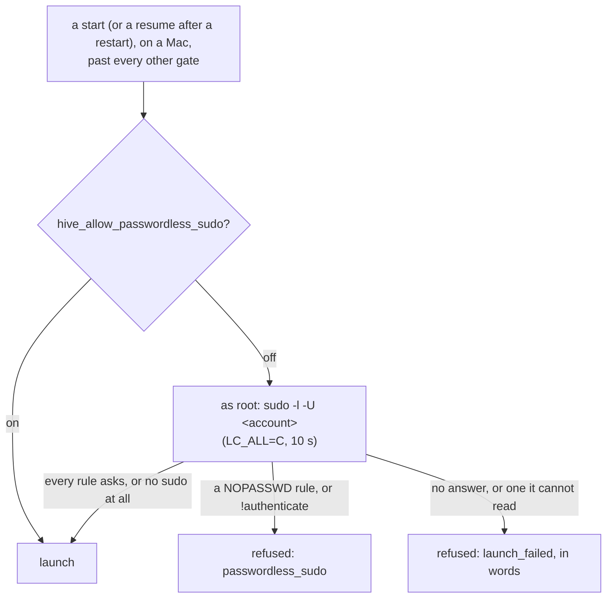

⚠️ The check asks **as root**, never as the account. Listing another account's rules
authenticates nobody: in the field the root listing left only directory lookups in the
unified log. Asked as the account (`sudo -n -l`), it would fail on every Mac whose `sudo`
asks for a password, the default, and have PAM try to authenticate the account at every
start (`pam_sm_authenticate(): … Error obtaining the authtok`). A Mac nobody changed lists
`(ALL) ALL`, which asks, so it starts sessions as before.

The daemon never writes into a tree the account owns. It starts `/bin/sh -c` with a
fixed script ([`WRAPPER`](../agents/roomlerd/src/hive/supervisor.rs#L93)) and
positional arguments, never interpolated, and that script runs as the account:
`umask 077`, make the session's config directory, copy core memory in where nothing
is yet, `cd` into the folder, and `exec` Claude Code. The environment is cleared
first and rebuilt from `HOME`, `USER`, `LOGNAME`, `PATH` (the account's
`~/.local/bin` and `~/.cargo/bin` before the system's) and `LANG`, then Hive's own
variables, so none of the daemon's `ROOMLERD_*` knobs reaches a session. The harness
leads its own process group, so a stop reaches the tools it started.

| What | Where |
|---|---|
| the session's config directory (`CLAUDE_CONFIG_DIR`) | `~<account>/.roomler/hive/<session>/claude`, with the project name pinned to `hive-<harness uuid>` (`CLAUDE_CODE_PROJECT_DIR_NAME`), so the history and the auto-memory live under one `projects/hive-<uuid>/` whatever the folder is ([`launch.rs:109`](../crates/hive-node/src/launch.rs#L109)) |
| the runtime directory, the daemon's | `/run/roomler-hive/<session>` on Linux, `/var/run/roomler-hive/<session>` on macOS, root's and `0755`: `settings.json` and `mcp.json` (root's, `0644`), `toolbelt.sock` (the account's, `0600`), and `memory/` |
| the harness, with `hive_harness` unset | the first executable of `~/.local/bin/claude`, `/usr/local/bin/claude`, `/opt/homebrew/bin/claude` (macOS) and `/usr/bin/claude` ([`supervisor.rs:2209`](../agents/roomlerd/src/hive/supervisor.rs#L2209)) |

**The launch is rebuilt in full every time**, because a resume restores neither
`--settings` nor `--mcp-config` ([`launch.rs:166`](../crates/hive-node/src/launch.rs#L166)):

```
claude -p --input-format stream-json --output-format stream-json --verbose --include-partial-messages
       --session-id <uuid>                      (or --resume <uuid>)
       --settings <runtime>/<session>/settings.json
       --mcp-config <runtime>/<session>/mcp.json --strict-mcp-config
       --permission-prompt-tool mcp__roomler__approve
       --permission-mode default
       --disallowedTools AskUserQuestion
```

| Flag or setting | Why |
|---|---|
| `--permission-mode default` | ⚠️ unset, a `-p` run that fetches no feature flags, which is every run behind the sidecar, starts in `auto`, where a classifier rather than a person decides what runs. P1a's contract probe found it |
| `--strict-mcp-config` | a repository's `.mcp.json` cannot shadow `roomler`, the server that decides what runs |
| `--disallowedTools AskUserQuestion` | it would reach the permission tool as a tool call whose answer must carry the person's choices, which no card asks for; the model asks in its reply instead |
| `settings.json` holds `permissions.deny: ["Read(//proc/**)"]`, `sandbox.autoAllowBashIfSandboxed: false` and no `apiKeyHelper` ([`launch.rs:344`](../crates/hive-node/src/launch.rs#L344)) | the Read tool runs inside the harness, so `/proc/self/environ` would hand the model its environment; a sandbox that comes on, ours or the user's, must not take Bash out of the approvals; nothing in the session can print the provider's key |
| `--resume` exactly when Claude Code's own history exists (`projects/hive-<uuid>/<uuid>.jsonl`), `--session-id` otherwise, for every launch ([`supervisor.rs:1972`](../agents/roomlerd/src/hive/supervisor.rs#L1972)) | Claude Code refuses both other ways round: "Session ID … is already in use", "No conversation found". The daemon only checks that the entry exists, and never reads it |
| ⚠️ no `CLAUDE_CODE_SUBPROCESS_ENV_SCRUB` | on Linux it sandboxes every command, and without bubblewrap and socat Bash then refuses everything. It was the real reason P0's sessions could not run `whoami` (P1a-3) |

### Windows

A Windows device runs a session as the user signed in at the console, at Medium
integrity, and as nobody else (design decision D2). There is no S4U and no
`LogonUser`: the daemon asks for no credential. With nobody signed in a start is
refused `no_console_user`. `hive_accounts` must map the starter to that user, as
`name`, `DOMAIN\name` or `.\name`, compared case-insensitively
([`hive_win.rs:397`](../agents/roomlerd/src/hive_win.rs#L397)); otherwise the start
is refused `no_account`, and the refusal names who is at the console.

The process that hosts sessions is the service's worker. Who the worker is depends
on how the device was installed, never on who connects to it:

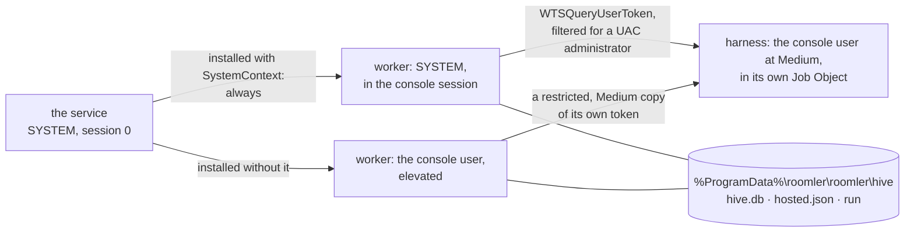

| Rule | Why | Where |
|---|---|---|
| ⚠️ A SystemContext worker is SYSTEM from the start and stays SYSTEM. With `ROOMLERD_ENABLE_SYSTEM_SWAP` on, every cycle of the service reads as if a controller were connected, so the worker is never swapped as one connects or leaves. Without SystemContext the worker is the console user throughout, elevated (`ROOMLERD_ELEVATE_WORKER`, on by default) | P1i-0 expected a remote-desktop connection to swap the worker and cut the running turns, from a gate 0.3.0-rc.7 retired. P1i-4 measured that it does not | [`win_service/supervisor.rs:852`](../agents/roomlerd/src/win_service/supervisor.rs#L852), [`:729`](../agents/roomlerd/src/win_service/supervisor.rs#L729) `decide_spawn` |
| Either way the session is the same person at Medium. A SYSTEM worker takes the console session's token; a worker that is the user takes a restricted, Medium copy of its own token: every administrator group deny-only, no privilege but traverse (FR-85's recorder rule) | a session never holds an administrator's rights on Windows | [`hive_win.rs:135`](../agents/roomlerd/src/hive_win.rs#L135) `console_user`, [`win_token.rs:209`](../agents/roomlerd/src/win_token.rs#L209) |
| `roomlerd hive-prep` does the wrapper's work as the user, in a Job Object of its own with a 30 s deadline: the config directory, core memory copied where nothing is, and the folder opened as the user | the daemon never writes into the user's profile | [`hive_win.rs:677`](../agents/roomlerd/src/hive_win.rs#L677) `prep`, [`:730`](../agents/roomlerd/src/hive_win.rs#L730) `run_prep` |
| The harness is created suspended, assigned to its own Job Object (`KILL_ON_JOB_CLOSE`, no breakaway), and only then resumed. It inherits its three standard handles and nothing else | none of its tools escapes the job, and no other session's pipe leaks into it | [`spawn_into_job`](../agents/roomlerd/src/win_service/supervisor.rs#L2277), [`JobObject`](../agents/roomlerd/src/win_service/supervisor.rs#L2160) |
| The environment is the user's own block with the session's variables laid over it by name, case-insensitively, and a NUL in a name or a value is refused | `Path` and `PATH` are one variable, and a NUL could smuggle in an entry of its own | [`merge_env_block`](../agents/roomlerd/src/win_service/supervisor.rs#L2573) |
| The harness is `hive_harness`, else the native installer's `%USERPROFILE%\.local\bin\claude.exe`, else npm's `%APPDATA%\npm\claude.cmd` run through `cmd.exe /d /v:off /s /c`. An argument holding one of cmd's metacharacters is refused, never escaped | npm's shim passes the line on again with `%*` inside an `IF (…)` block, and no quoting is right for both readers | [`hive_win.rs:523`](../agents/roomlerd/src/hive_win.rs#L523) `harness_command_line` |
| A stop closes the harness's stdin, then ends its job after the grace | no signal reaches a console-less process | [`hive/supervisor.rs:2984`](../agents/roomlerd/src/hive/supervisor.rs#L2984) |

---

## 4. Approvals over the toolbelt

Every tool call that Claude Code's read-only rules do not let through waits for a
driver. Claude Code calls its permission-prompt tool, `mcp__roomler__approve`, on the
session's toolbelt: a `roomler` MCP server, one per session, with one tool
([`toolbelt.rs`](../agents/roomlerd/src/hive/toolbelt.rs)).

Claude Code starts its MCP servers itself, as the session's account, over stdio. So
the server it starts is a relay, `roomlerd hive-mcp <socket>`, which pipes its stdin
and stdout to the session's endpoint. The relay is short-circuited at the top of
`daemon_main`, so it runs none of the daemon's start-up
([`main.rs:1098`](../agents/roomlerd/src/main.rs#L1098)), and the daemon speaks MCP on
the other end.

| | Linux, macOS | Windows |
|---|---|---|
| the endpoint | `<runtime>/<session>/toolbelt.sock`, handed to the session's account, `0600`, in a directory only the daemon writes | `\\.\pipe\roomler-hive-<session>-<nonce>`, made with `FILE_FLAG_FIRST_PIPE_INSTANCE` so a name someone holds is refused, never joined; remote clients rejected |
| who may connect | the kernel admits the account and root, and the daemon checks the peer's uid again on every connection | the DACL grants SYSTEM and Administrators, and the account `0x12008b`: read and write, but not `FILE_CREATE_PIPE_INSTANCE`, which would let it add an instance of its own and take the next connection. Each client's SID is checked again, and the relay opens the pipe with exactly that access, at the identification level ([`hive_win.rs:823`](../agents/roomlerd/src/hive_win.rs#L823), [`:944`](../agents/roomlerd/src/hive_win.rs#L944)) |

⚠️ **It is deliberately not the LocalAPI socket.** On a root daemon that one is
root-only, and most of its verbs trust the socket alone. A process running as the
session's account can reach the toolbelt too, and all it can do there is ask.

⚠️ **What fails, fails closed.** A relay that cannot reach its endpoint leaves Claude
Code without its permission tool. Every call that needs one then errors ("MCP tool
mcp__roomler__approve … not found") and the harness exits 1: nothing runs
unapproved. So a start whose account cannot execute the relay at all is refused
`launch_failed` at once, rather than dying at its first approval
([`executable_by`](../agents/roomlerd/src/hive/supervisor.rs#L2390)).

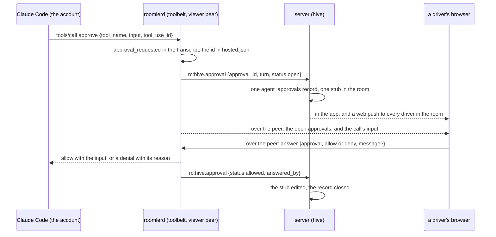

| Rule | Why | Where |
|---|---|---|
| The server hears THAT a session waits, how it ended and who answered. `rc:hive.approval` carries an id, a turn, a word and a user id, and its field set is locked by test. The stub reads "🔐 Approval needed · turn 2 — open the session to answer", then "🔐 Approval · turn 2 — ✅ allowed by Alice" | which tool, and what it would do, travel only over the viewer peer (AC5) | [`room.rs:250`](../crates/modules/hive/src/room.rs#L250) |
| One `agent_approvals` record per (session, approval), held by a unique index, its end a compare-and-set on `open`; kept 90 days | a replayed frame posts no second stub | [`lib.rs:211`](../crates/modules/hive/src/lib.rs#L211) |
| The notification names the session and never the call: `Claude · <device> needs approval`, by web push to every subscription of every driver still in the room | a desk with the app open is not a phone in a pocket | [`room.rs:477`](../crates/modules/hive/src/room.rs#L477) |
| Only a driver's grant answers; a reader's `answer` is refused on the device | | device [`view.rs:821`](../agents/roomlerd/src/hive/view.rs#L821) |
| Unanswered for 25 minutes is a denial that says so. Progress goes to Claude Code every 60 s while a person decides, and the tool-call timeout in the MCP config is 30 minutes | what the model reads is our answer, never a transport error | [`toolbelt.rs:69`](../agents/roomlerd/src/hive/toolbelt.rs#L69) |
| At most 4 approvals are open per session, and a fifth is refused at once | Claude Code asks one at a time (measured), so more is not Claude Code | [`toolbelt.rs:75`](../agents/roomlerd/src/hive/toolbelt.rs#L75) |
| The harness letting go (`notifications/cancelled`, a closed relay), a stop, or the session's end withdraws an open approval | | [`toolbelt.rs:653`](../agents/roomlerd/src/hive/toolbelt.rs#L653) |
| A denial reaches the model as a failed tool result with our words verbatim, for example "Alice denied this: not now" | the model knows who said no, and why | |

---

## 5. The model sidecar

The provider's key never enters a session. The daemon runs the device's
`hive_api_key_helper` itself, as SYSTEM or root, and keeps what it prints. The
harness gets a loopback base URL and a token that only this sidecar honours
([`sidecar.rs`](../agents/roomlerd/src/hive/sidecar.rs)).

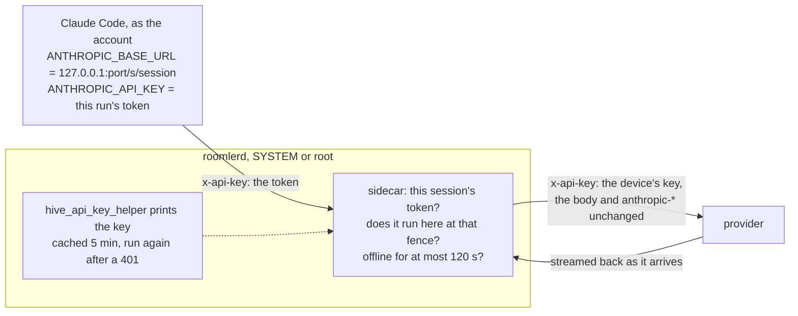

| Piece | Rule | Why | Where |
|---|---|---|---|
| the token | 256 random bits, bound to (session, fence), minted just before the harness starts and taken back if it does not; each run revokes exactly its own token | a run that ends as the same session starts again here cannot take the new run's | [`sidecar.rs:89`](../agents/roomlerd/src/hive/sidecar.rs#L89) |
| the paths | exactly `POST /v1/messages` and `POST /v1/messages/count_tokens`; anything else is `404 not_found_error` | the device's key opens more than inference: the Files API holds every session's uploads under it, and a batch outlives its session and its fence | [`sidecar.rs:282`](../agents/roomlerd/src/hive/sidecar.rs#L282) |
| the fence | a call is forwarded only while the session runs HERE at the token's fence | a stopped session, or a stale primary after a move, spends nothing | [`sidecar.rs:128`](../agents/roomlerd/src/hive/sidecar.rs#L128) `sidecar_admit` |
| `offline_grace` | 120 s after the primary control connection closed, with no newer one in its place, calls are refused `503 overloaded_error`; they flow again on reconnect | a partitioned primary stalls instead of diverging. "Closed" is the agent's own verdict, so a half-open socket counts as up until `WS_RX_DEADLINE` (80 s) ends it, and the worst case is about 200 s | [`sidecar.rs:64`](../agents/roomlerd/src/hive/sidecar.rs#L64), the agent's [`signaling.rs:60`](../agents/roomlerd/src/signaling.rs#L60) |
| the forward | the headers unchanged but for `x-api-key` and `authorization` (the device's key swapped in), the hop-by-hop ones, and `anthropic-workspace-id`, set from `hive_api_workspace_id` when that is configured; a body of at most 32 MiB; the answer streamed as it arrives, `retry-after` and the rate-limit headers intact; TLS through the OS trust store and the proxy environment | an SSE turn is never buffered, and a TLS-inspecting middlebox the machine trusts still works | [`sidecar.rs:334`](../agents/roomlerd/src/hive/sidecar.rs#L334) `handle` |

The helper runs through `/bin/sh -c` on Unix and `cmd.exe /d /s /c "<helper>"`, by
its full path, on Windows, within 10 s. The first line it prints is the key, and
neither its output nor its errors' output is logged
([`sidecar.rs:172`](../agents/roomlerd/src/hive/sidecar.rs#L172)). With no helper a
session has no model access: its own config directory holds no login of its own.

---

## 6. Restart, resume, and what ends a harness

A restart still takes every harness down. Under systemd (`KillMode=control-group`)
a stop reaches the daemon and then every process in its unit. Under launchd, and for
a daemon nothing supervises, the daemon takes them down itself as it leaves
([`wind_down`](../agents/roomlerd/src/hive/supervisor.rs#L1341): SIGTERM to each
harness's process group, SIGKILL after 3 s). On Windows a harness lives in its
worker's Job Object and goes with it. What survives is the session: the next daemon
resumes it with the same Claude Code conversation.

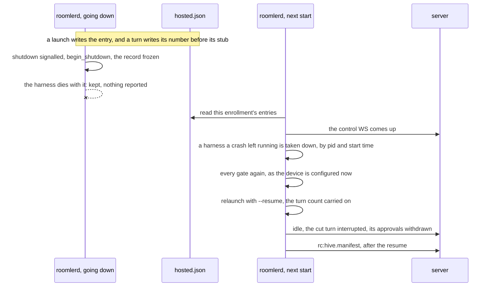

| Rule | Why | Where |
|---|---|---|
| `hosted.json` sits beside the store, root's, `0600`, written whole. Per session it holds the launch's inputs (fence, account, the folder as asked, the starter and their address, Claude Code's session id), the turns begun, the turn in progress and who asked for it, its open approvals, and the harness's pid and start time | after a restart the device holds nothing else: the replay of its last reports lived in memory | [`hosted.rs`](../agents/roomlerd/src/hive/hosted.rs) |
| A new turn's number and a new approval are written before the frame that tells the server, and so is a turn's end; an approval's end is written after its frame | a reused turn number would have every later stub ignored as older than the newest, and a finished turn must never be reported cut. A withdrawal sent twice changes only an approval still open | [`supervisor.rs:2613`](../agents/roomlerd/src/hive/supervisor.rs#L2613) |
| From `begin_shutdown` on, the record is frozen, the toolbelt is ignored, and new prompts and starts are refused ("this device is restarting"). `begin_shutdown` runs the moment any shutdown is signalled: an update, a requested restart, a rollback, an OS stop | the teardown's frames go into closing connections; recorded, they would be lost twice. Field, 2026-10-08: an approval the teardown withdrew stayed "needed" | [`main.rs:3582`](../agents/roomlerd/src/main.rs#L3582), [`supervisor.rs:1305`](../agents/roomlerd/src/hive/supervisor.rs#L1305) |
| A harness that ends without a stop waits 1 s before its end counts, and if the daemon was told to stop by then the session is kept and nothing is reported | under systemd the daemon hears its stop a moment before the harness dies | [`supervisor.rs:1365`](../agents/roomlerd/src/hive/supervisor.rs#L1365) |
| The next daemon resumes at the first connection of its primary enrollment, once, and that connection's manifest waits for it, at most 60 s | a manifest sent first would leave the resuming sessions out, and the server would end every one. A device that never comes back online launches nothing | [`supervisor.rs:1174`](../agents/roomlerd/src/hive/supervisor.rs#L1174) |
| ⚠️ Every gate a start passes is passed again, as the device is configured now: `hive_enabled`, the starter mapped to the SAME account, the folder inside `hive_roots`, capacity, a harness. A refusal ends the session ("not resumed after the device restarted: …") and forgets it | an owner who turns sessions off, or remaps an account, and restarts must not find the session back | [`supervisor.rs:1207`](../agents/roomlerd/src/hive/supervisor.rs#L1207) |
| A recorded pid is signalled only while its start time still matches: the boot id and the `/proc` start time on Linux, `proc_pidinfo` on macOS, `GetProcessTimes` on Windows. Pids 0 and 1 never are | two harnesses on one history would both write it, and whatever holds that pid since must be left alone | [`procs.rs:30`](../agents/roomlerd/src/hive/procs.rs#L30), [`supervisor.rs:2947`](../agents/roomlerd/src/hive/supervisor.rs#L2947) |
| The cut turn is reported `interrupted`, naming who asked; its approvals are reported `withdrawn`; the transcript says the session resumed. The first turn of a resumed process reports no cost | Claude Code restores its running total only from a clean exit's `cost-state`, so where that process starts counting is unknown, and no number is better than a wrong one | [`supervisor.rs:1668`](../agents/roomlerd/src/hive/supervisor.rs#L1668) |
| A session resumed 3 times in a row, each time without outliving the resume by 2 minutes, is ended instead | a resume that takes the daemon down must not become a crash loop | [`supervisor.rs:146`](../agents/roomlerd/src/hive/supervisor.rs#L146) |
| A stop that arrives before the session resumed ends it with no launch | | [`supervisor.rs:1044`](../agents/roomlerd/src/hive/supervisor.rs#L1044) |

⚠️ Prompts waiting behind a turn are lost when a restart cuts it. An update waits the
turn out (§7); a crash does not. ⚠️ `hosted.json` is not synced to disk: a clean
stop, a restart and a crash all keep it, a power cut may lose its last change, and
then the manifest ends what could not be resumed.

### The manifest

On every connection of its primary enrollment the device sends `rc:hive.manifest`:
the sessions it runs NOW, ids and fences only
([`supervisor.rs:1149`](../agents/roomlerd/src/hive/supervisor.rs#L1149)). The server
ends each session it holds as running there that the list leaves out, as
`not_on_device` (or `stopped`, for one being stopped), tells its room and withdraws
its open approvals ([`agent_socket.rs:464`](../crates/modules/hive/src/agent_socket.rs#L464)).

- ⚠️ "Running there" means live and launched on the device's own word: its answer to
  the start (`accepted_at`), or a run state only the device reports (`idle`,
  `running`, `awaiting_approval`). The state usually lands before the answer, so a
  socket that drops between the two leaves `idle` with no `accepted_at`, and with
  `accepted_at` alone that session outlived its harness for ever
  ([`dao.rs:401`](../crates/modules/hive/src/dao.rs#L401)). A start the device has
  said nothing about stays reconcile's, which re-sends an unanswered start for 10
  minutes and an unconfirmed stop on every connection
  ([`agent_socket.rs:567`](../crates/modules/hive/src/agent_socket.rs#L567)).
- ⚠️ A device that comes back with an agent that runs no sessions ends what it ran:
  a connection the hub records without `hive` is given the empty manifest before
  anything pending is read. Field, 2026-10-10: a Windows device updated itself to
  0.4.123, whose build has no `hive`, and its accepted session stayed `idle` for
  ever. Only a definite "no `hive`" counts: a connection a newer one displaced
  decides nothing ([`agent_socket.rs:589`](../crates/modules/hive/src/agent_socket.rs#L589)).
- A list longer than 256 is no device's and changes nothing, and a build that runs
  Hive but predates the manifest sends none, which changes nothing either.
- The other way round: a device that reports it RUNS a session whose record is over,
  because its starter was removed while it was away, is answered with a stop
  ([`agent_socket.rs:510`](../crates/modules/hive/src/agent_socket.rs#L510)).

### What ends a harness

| Event | What happens to the harness | The session |
|---|---|---|
| the owner's Stop | Unix: stdin closed, SIGTERM to its process group, SIGKILL after 5 s. Windows: stdin closed, its job ended after 5 s | ends `stopped` |
| the harness exits or crashes | — | ends `exited`; a crash's last words on stderr stay in the transcript |
| a daemon restart, an update, a crash | it goes with the unit's control group (systemd), by `wind_down` as the daemon leaves, or with its worker's Job Object (Windows). One a crash left running is taken down by the next daemon, before the resume | kept, and resumed by the next daemon |
| Windows: the console session changes (a sign-in, a sign-out, a switch of user) | the service starts a worker in the new session, and the old worker's harnesses go | resumed by the next worker, if its gates still allow it |
| Windows: a remote-desktop connection | nothing: the worker is not swapped (P1i-4, measured) | goes on, a turn waiting at its approval included |
| the gates changed across a restart; three quick resumes | not launched | ends, saying why |
| the starter leaves the org, the device is removed, the org is archived, the org leaves `hive.tenants`, the device comes back without `hive` | stopped, if the device is still connected here | the server ends it: `member_removed` · `device_removed` · `tenant_archived` · `hive_not_enabled` · `not_on_device` |

---

## 7. The update hold

An update restarts the daemon, and every harness with it. So it waits for running
turns first.

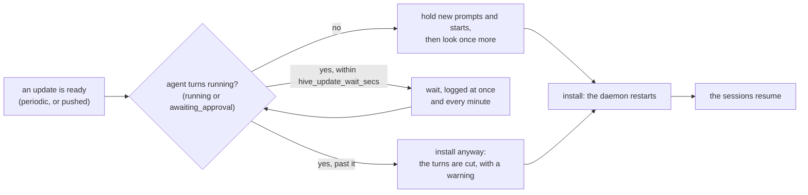

| Platform | Who installs | How the wait runs |
|---|---|---|
| Linux, Windows | the daemon's in-process updater | [`wait_for_agent_turns`](../agents/roomlerd/src/updater.rs#L278) runs before the installer is spawned, for the periodic check and a pushed update alike |
| macOS | the root update helper, `com.roomler.update`, never the daemon | before `installer(8)` the helper asks the root daemon, over its system LocalAPI socket, to hold (`HiveUpdateHold`). The daemon runs the same wait and answers `HiveUpdateHeld {waited_secs, cut}`, then refuses new prompts and starts until that connection closes ([`updater.rs:349`](../agents/roomlerd/src/updater.rs#L349), [`:2805`](../agents/roomlerd/src/updater.rs#L2805)) |

- It waits at most `hive_update_wait_secs` (30 minutes; `0` never waits), looks again
  every 5 s, and logs "update deferred — agent turns running" when it starts and once
  a minute.
- It holds a PUSHED update too: a person asked for the update, not for their agent to
  be cut. It is bounded, so a busy session cannot hold a device's updates back.
- Once no turn runs, new prompts and starts are refused BEFORE a last look, so none
  begins in the gap. One admitted before that still runs, and is waited for. An
  installer that fails to start releases the hold.
- ⚠️ The macOS hold is bound to the helper's connection, not to a timer: a helper
  that dies mid-wait releases it, and so does a failed install. The verb is refused
  to every peer but root, because a hold refuses every new prompt and start on the
  device ([`localapi/src/lib.rs:2503`](../crates/localapi/src/lib.rs#L2503)). A missing, older or
  silent daemon (the helper waits at most 2 h) gets the install it got before: the
  helper fails open.
- ⚠️ `roomlerd self-update`, the CLI, does not wait. It is an operator's explicit
  command, in another process.

---

## 8. Adopting terminal sessions

People already run Claude Code in a terminal. `roomler hive adopt` mirrors those
sessions into the device's store and lists each for its owner alone, read only
(decision 11). A terminal session passed none of Hive's start gates, so adopting has
gates of its own, each default-deny and each owned by a different party. It is Linux
and macOS only: on Windows `hive_adopt` reads off whatever the config says, so the
device never advertises `hive-adopt` ([`gates.rs:65`](../agents/roomlerd/src/hive/gates.rs#L65)),
and the CLI refuses.

| Gate | Owner | Default | A refusal |
|---|---|---|---|
| the hooks are installed (`SessionStart`, `Stop`, `SessionEnd`) | the person, in their own user-level Claude Code settings | not installed | nothing is mirrored |
| `hive_adopt` | the device's owner: a device key, never pushable, advertised as `hive-adopt` | off | nothing reaches the server; an offer from a connection without `hive-adopt` is dropped unanswered |
| the org is served | the server (`hive.tenants`) | — | `hive_not_enabled` |
| the account names ONE person, a member | the device's `hive_accounts`, resolved by the server | — | `no_account` · `ambiguous_account` · `not_a_member` |
| capacity and rate | the server: 16 live adopted sessions a device, 20 offers a minute | — | `at_capacity` · `rate_limited` |

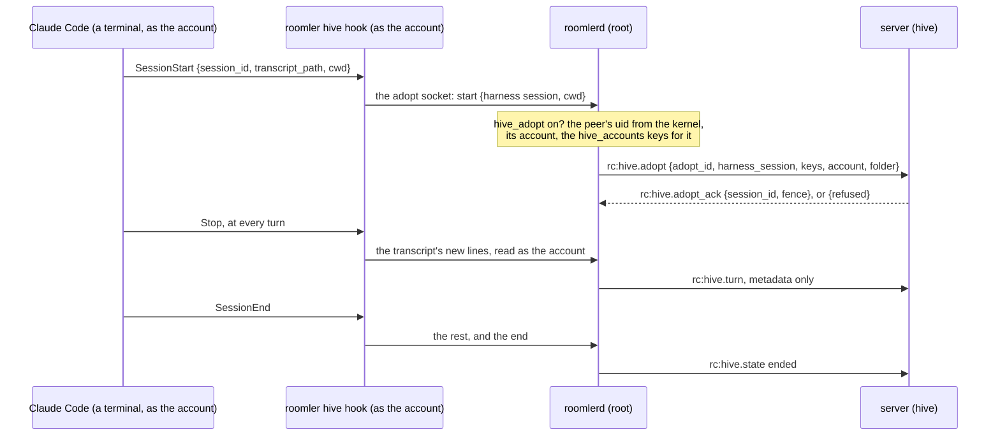

| Rule | Why | Where |
|---|---|---|
| The device sends EVERY `hive_accounts` key that maps to the account, and the server adopts only when they name exactly one person | the attribution is the device owner's statement, never a guess: an account two people share is `ambiguous_account`, never "the one of them who is a member" | [`adopt.rs:282`](../crates/modules/hive/src/adopt.rs#L282) `people` |
| The hook reads the transcript and sends its lines; the daemon never opens a path a hook names | a root daemon that opened a path a hook named would read any file the requester pointed it at | [`supervisor/adopt.rs:651`](../agents/roomlerd/src/hive/supervisor/adopt.rs#L651) |
| Who it is comes from the kernel, the socket's peer credentials, never from the hook; root's own sessions are refused | the hook runs as whoever ran Claude Code, and says nothing that is not checked | [`supervisor/adopt.rs:413`](../agents/roomlerd/src/hive/supervisor/adopt.rs#L413) |
| No drivers, the owner included: naming one is a 409. Readers by name, as for any session. The record has no title, only the folder's name | the terminal holds the harness, and a terminal's first prompt is content | [`access.rs:52`](../crates/modules/hive/src/access.rs#L52) |
| Only the person's conversation is mirrored: `user` and `assistant` lines, never a sub-agent's (`isSidechain`) or Claude Code's bookkeeping | the on-disk transcript is Claude Code's internal format, and a change in it must thin the mirror, never stop it | |
| A terminal killed outright never says `SessionEnd`, so the daemon records Claude Code's process (pid and start time) and ends a session whose process is gone, every minute. That process is the hook's nearest ancestor that is not a shell | Claude Code runs a hook through `/bin/sh -c`, and dash forks it, so the hook's parent is a dying `sh` (P1j-5's field run) | [`procs.rs:44`](../agents/roomlerd/src/hive/procs.rs#L44) `hook_terminal` |
| "Stop mirroring" ends the record and never the terminal; a `claude --resume` later is offered afresh, as a new record | the terminal is the person's: Roomler can only stop watching it | [`supervisor/adopt.rs:818`](../agents/roomlerd/src/hive/supervisor/adopt.rs#L818) |
| `adopted.json`, beside `hosted.json`, keeps what is mirrored and the records of the last 1,000 adopted sessions that ended, which the device still serves to their owner with `hive_enabled` off | a restarted daemon goes on mirroring where it stopped, and an owner can read a session that ended | |
| `hive-adopt` is advertised, and the socket exists, only while `hive_adopt` is on; a daemon started with it off removes a socket its predecessor left | the leftover file read as "this device adopts" (P1j-5) | [`supervisor/adopt.rs:383`](../agents/roomlerd/src/hive/supervisor/adopt.rs#L383) |
| `unadopt` takes out exactly what `adopt` put in, and gives back a file Claude Code wrote byte for byte | the person's settings, and other tools' hooks in them, are theirs | [`hive_hooks.rs`](../agents/roomler-cli/src/hive_hooks.rs) |

---

## 9. The org gate on the server

The module switch (`[modules] hive`) is all or nothing for a server, so it has a
second dial: `hive.tenants` (`ROOMLER__HIVE__TENANTS`), the organizations agent
sessions serve, as comma-separated ids ([`scope.rs`](../crates/modules/hive/src/scope.rs)).
Empty or `*` means every organization, which is what a self-hosted server wants.

⚠️ **The list is the switch.** A non-empty `hive.tenants` mounts the module by itself,
with no `[modules] hive`, and `/api/capabilities` says so
([`settings.rs:851`](../crates/config/src/settings.rs#L851) `Settings::hive_on`). A
hosted server sets only the list, because that form fails safe. An image from before
P1g never reads the list, so with `ROOMLER__MODULES__HIVE=true` beside it, promoting
such an image (a rollback, or another session's older tag) would open the pillar to
every organization on the server. With the list alone, every older image leaves it
off. Clearing the list is the kill switch.

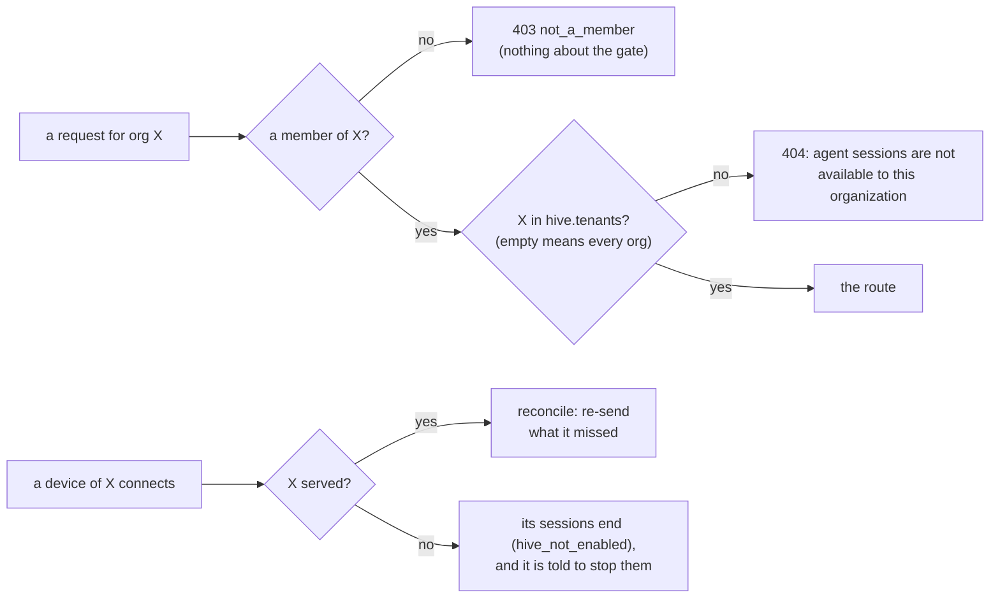

| Where | An organization agent sessions do not serve |
|---|---|
| every route | a `404`, after the membership check, so a non-member still gets `not_a_member` ([`routes.rs:233`](../crates/modules/hive/src/routes.rs#L233) `member_tenant`) |
| `GET /api/tenant/{tid}/hive` | the SPA's question: `{"enabled": true}`, or that 404 |
| the viewer | `hive:view.open` answers `not_found`, as for a session the caller may not read |
| a device connecting | nothing is re-sent; what it still runs for the org ends (`hive_not_enabled`) and it is told to stop ([`agent_socket.rs:544`](../crates/modules/hive/src/agent_socket.rs#L544)) |
| an adopt offer | `hive_not_enabled` |
| a malformed entry | logged, and it matches nothing: a typo shuts the org it meant, and never opens another |

⚠️ **The SPA fails CLOSED for this module alone.** Every other module's capability
gate fails open until `/api/capabilities` answers. `hive` is in `DEFAULT_OFF`
([`registry.ts:39`](../ui/src/modules/registry.ts#L39)), and the router also asks
whether the pillar serves the organization (`checkServed`) before it opens a Hive
page ([`router.ts:394`](../ui/src/plugins/router.ts#L394)).

Prod has served agent sessions to one test organization since 2026-10-09; every
other organization reads the 404.

---

## 10. Platform notes

### Windows: the directories' DACLs

The store, `hosted.json` and each session's runtime files live in the service's
machine-wide directory, `%ProgramData%\roomler\roomler\hive`
([`hive_win.rs:829`](../agents/roomlerd/src/hive_win.rs#L829)), which both kinds of
worker reach. Every directory there is owned by Administrators with a protected DACL,
set by [`dir_with_dacl`](../agents/roomlerd/src/hive_win.rs#L897) as it is made, or
again on one already there.

| Directory | SDDL | Means |
|---|---|---|
| `hive` (the store) and `hive\run` (the runtime root) | `O:BAD:P(A;OICI;FA;;;SY)(A;OICI;FA;;;BA)(A;;0x100080;;;AU)` | SYSTEM and Administrators, in full; Authenticated Users may examine the directory itself, and nothing more ([`hive_win.rs:804`](../agents/roomlerd/src/hive_win.rs#L804)) |
| `hive\run\<session>` | the same owner and first two grants, then `(A;OICI;0x1200a9;;;<account SID>)` | the session's account may also list, traverse and read it, for its settings, its MCP config and its core memory, and writes nothing ([`hive_win.rs:809`](../agents/roomlerd/src/hive_win.rs#L809)) |

- **The owner is set too.** An owner keeps `WRITE_DAC` whatever the DACL says, so a
  folder someone else made there first is taken over, never trusted. A link or a
  junction on the way, or anything but a plain directory in the place, is refused.
- ⚠️ **`FILE_READ_ATTRIBUTES | SYNCHRONIZE` (`0x100080`) for Authenticated Users,
  inherited by nothing.** Both directories lie on the way to every session's
  `…\hive\run\<session>\settings.json`. Claude Code examines each component of a path
  it is handed and refuses the file when one cannot be examined: "Refusing to read a
  file whose path could not be vetted". Field, 2026-10-09 (P1i-4): every session
  ended 1.1 s after its start with exactly that, because the two directories granted
  SYSTEM and Administrators alone, and a session's restricted token has its
  Administrators group deny-only. `SYNCHRONIZE` is needed beside
  `FILE_READ_ATTRIBUTES` because `CreateFileW` asks for it with every synchronous
  open, libuv's `lstat` and Rust's among them: `0x80` alone was still refused. The
  grant is a stat of the directory alone. It lists nothing, so the session ids stay
  unknown, and another session's directory stays closed, its own DACL granting only
  its account. The unit test runs as a restricted Medium copy of its own token, and
  fails on the old DACL
  ([`supervisor.rs:5165`](../agents/roomlerd/src/hive/supervisor.rs#L5165)).

### macOS: the `/var` link

The store's directory is locked to the daemon with no link on its way that someone
other than root could have made
([`untrusted_link`](../agents/roomlerd/src/hive/supervisor.rs#L581)). On a Mac the
root daemon's data directory is under `/var/root`, and `/var` is the system's own
link to `/private/var`. While every link was refused, as FR-85's recording-folder
check refuses them, a Mac opened no store and refused every session "/var is a
symbolic link" (P1h-3, 2026-10-10). So a link is followed when root owns it, in a
directory that root owns and that nobody else may write to, since only root could
have made it. Any other link is refused, as before.

- ⚠️ The published 0.4.122 and 0.4.123 `.pkg`s predate that fix (#1927), so on a Mac
  they refuse every session `launch_failed`. A Mac needs a release that carries it.
- The runtime directory is `/var/run/roomler-hive`, which macOS clears at boot.
- launchd does not kill a harness's process group when the daemon leaves, so
  `wind_down` does it: SIGTERM, then SIGKILL after 3 s.

### Unix: the NGROUPS cap

The privilege path sets the account's supplementary groups from `getgrouplist`, and
`setgroups` refuses the whole list when it is longer than the system's
`NGROUPS_MAX`. That is 16 on macOS, where a test VM's `admin` account was in 17, and
every session on that Mac failed "starting the harness: Invalid argument (os error
22)". The list is now cut to `sysconf(_SC_NGROUPS_MAX)`, in order, the primary group
first, so the child holds fewer groups and never more
([`exec.rs:1004`](../agents/roomlerd/src/exec.rs#L1004) `within_ngroups_max`). Exec, SSH
and the PTY share the fix, since they share the path.

The cap is for `setgroups` alone. `sudo` never reads that list on a Mac, and a Linux
session cannot run `sudo` at all, so nothing is cut below the maximum. What a session
holds of the administrator groups is in §3.

---

## 11. What is field-verified

| Criterion | Linux | macOS | Windows |
|---|---|---|---|
| AC1: a prompt from the session's room comes back as a turn stub, its steps rendered over the viewer peer | ✅ | — | — |
| AC3: `whoami` prints the mapped account (on Windows the console user), never root or SYSTEM; `no_account`; `no_console_user` | ✅ | ✅ | ✅ at Medium integrity |
| AC4, first half: a primary cut off from the server stops calling the model after `offline_grace` | ✅ refused at 125 s, forwarded again after the reconnect | — | — |
| AC5: an approval answered from a phone; the stub holds no tool arguments | ✅ | — | — |
| AC6: a reader's message never reaches the harness | ✅ | — | — |
| AC7: an update waits for a running turn, and logs it | ✅ a real install, 85 s (and a dry run, 80 s) | ✅ a real install by the helper, 135 s | ✅ a real install, 140 s |
| AC8: a fact reaches the next session and not the running one ([`brain.md`](brain.md)) | ✅ | — | — |
| AC20: a session survives a service restart, a restart at an approval and a crash; a changed gate ends it | ✅ | ✅ | ✅ |
| AC20: a session survives an update's restart | ✅ 0.4.123 → 0.4.124, the codeword kept | not yet | not yet |
| AC21: an adopted session is its owner's alone, and read only | ✅ | — | not built |
| Decision 13: a session holds no administrator group and cannot `sudo` | ✅ `27(sudo)` gone, `sudo` refused | ⚠️ the group gone, `sudo` still allowed (§3) | — |
| Decision 15: a Mac refuses a start as an account whose `sudo` needs no password | — | ✅ refused under a rule by user and by group; started with the owner's key, and on a Mac whose `sudo` asks | — |

Linux ran on a throwaway stack (a local server, loopback TURN, a root daemon in WSL),
macOS and Windows on throwaway VMs enrolled in the test organization on prod
(decision 10). Still open: AC2 holds on one device in CI and stays unticked until
replicas exist; AC4's stale-fence half needs P2's promotion; and an update's own
restart is not field-run as a resume on any platform, because the Linux dry run
installs nothing and the only newer release could not resume a session on Windows or
macOS. Every run, its build and what it measured are in the spec's
[§8](fr/FR-90-hive-agent-sessions.md#8-field-verification-log).

In CI, [`hive_canary.rs`](../crates/tests/tests/hive_canary.rs) (AC2, one device),
[`hive_drivers.rs`](../crates/tests/tests/hive_drivers.rs) (AC6),
[`hive_memory.rs`](../crates/tests/tests/hive_memory.rs) and
[`hive_memory_off.rs`](../crates/tests/tests/hive_memory_off.rs) (AC8) drive a real
server and a real in-process device, each in a test binary of its own, because a
process holds one supervisor. The device's own tests run on Linux, macOS and Windows
CI (`hive::`).

---

## 12. P2a: the member's store, and what P2 adds

Until P2 a session lives on the one device that runs it, and it is readable only
while that device is online. P2 gives each session a replicaset: the org's own
devices, each holding a full copy it could resume, with the server learning how fresh
each copy is from sequence numbers and hashes alone (spec §3b). P2a built the store's
half of a member. Nothing sends it anything yet: no frame, no server change, and no
caller outside tests until the join (P2c), the stream (P2d), the purge (P2g) and an
archive replica's search (P2i).

| Piece | What it does | Where |
|---|---|---|
| apply | keeps an envelope another member sent, byte for byte, through the same chain check, so the member ends on the primary's `(seq, hash)` | [`store.rs:247`](../crates/hive-node/src/store.rs#L247) `Store::apply` |
| the fence floor | per session, raised by the server's word before any event of a new fence exists, and only ever raised; an older fence is refused, the device's own appends included | [`store.rs:328`](../crates/hive-node/src/store.rs#L328), [`chain.rs:181`](../crates/hive-node/src/chain.rs#L181) |
| the divergent tail | an older fence's tail, set aside out of `events` and the index; never a tail that holds the floor's fence | [`store.rs:357`](../crates/hive-node/src/store.rs#L357) |
| blobs | content-addressed by BLAKE3, at most 64 MiB each, kept per session; bytes a peer sent under another name are kept under neither | [`store.rs:442`](../crates/hive-node/src/store.rs#L442) |
| purged ids | a purge removes the session's events, floor, tail and the blobs no other session holds, and keeps its id, so nothing takes the session back | [`store.rs:638`](../crates/hive-node/src/store.rs#L638) |
| the writer | each of these on the daemon's one writer thread, answered with the store's own error, so a caller can tell `purged` from a stale fence | [`hive/store.rs:71`](../agents/roomlerd/src/hive/store.rs#L71) `Member` |

⚠️ **The four tables are new, and `user_version` stays 1**
([`store.rs:49`](../crates/hive-node/src/store.rs#L49)). A daemon refuses a store a
newer schema wrote, and the updater's crash-loop rollback can put an older daemon on
a device at any time, so a new column on `events` would cost it every transcript.
`a_daemon_from_before_p2a_reads_what_p2a_wrote` runs P0a's own statements, frozen, on
a store P2a wrote.

⚠️ "Committed" is SQLite's WAL with `synchronous = NORMAL`: an acknowledged event
survives a daemon crash, not a power cut.

The rest of P2 is next (spec §3b and §4): checkpoints taken as the account (P2b),
membership and placement (P2c), the QUIC carrier and the stream (P2d), promotion and
fencing (P2e), teleport and fork (P2f), purges and retention (P2g), the archive
replica image (P2h), full-text search on archive replicas (P2i), the UI (P2j) and the
field run (P2k). Its server switch is `hive.replicaset` and its device switch
`hive_replica`, both off by default.

---

## Code map

| Piece | Where |
|---|---|
| the wire: frames, refusal words, limits | [`crates/remote_control/src/hive.rs`](../crates/remote_control/src/hive.rs); the `rc:hive.*` variants in [`signaling.rs`](../crates/remote_control/src/signaling.rs) (`ClientMsg` `:655`–`:865`, `ServerMsg` `:2821`–`:3000`); `RpcCap::Hive`, `HiveView`, `HiveMemory` and `HiveAdopt` in [`models.rs`](../crates/remote_control/src/models.rs) `:626`–`:655`, matched by equality, since `hive` is a prefix of the other three |
| the server module | [`crates/modules/hive/src/`](../crates/modules/hive/src/): `lib.rs` (the module, routes, indexes), `routes.rs` (start, list, get, stop), `agent_socket.rs` (reports, reconcile, the manifest), `view.rs` (grants and their signalling), `participants.rs`, `access.rs`, `room.rs`, `dao.rs`, `hooks.rs` (removals), `scope.rs` (`hive.tenants`), `adopt.rs`, `brain.rs` |
| the device core, with no daemon in it | [`crates/hive-node/src/`](../crates/hive-node/src/): `event.rs`, `chain.rs`, `stream_json.rs`, `store.rs`, `launch.rs`, `roots.rs` |
| the device | [`agents/roomlerd/src/hive/`](../agents/roomlerd/src/hive/): `gates.rs`, `supervisor.rs` (starts, the session task, the resume), `supervisor/adopt.rs`, `toolbelt.rs`, `sidecar.rs`, `view.rs`, `framing.rs`, `store.rs` (the writer), `hosted.rs`, `procs.rs`; Windows in [`hive_win.rs`](../agents/roomlerd/src/hive_win.rs) |
| what builds it | the `hive` feature, and `cfg(hive_host)` on Linux, macOS and Windows ([`build.rs:52`](../agents/roomlerd/build.rs#L52)); the capabilities in [`caps.rs:1619`](../agents/roomlerd/src/encode/caps.rs#L1619) |
| the update wait | [`updater.rs:278`](../agents/roomlerd/src/updater.rs#L278); the macOS hold, `HiveUpdateHold`, in [`crates/localapi/src/lib.rs`](../crates/localapi/src/lib.rs) |
| `adopt` | the CLI in [`hive_hooks.rs`](../agents/roomler-cli/src/hive_hooks.rs); its protocol in [`crates/localapi/src/hive_adopt.rs`](../crates/localapi/src/hive_adopt.rs) |
| the SPA | [`stores/hive.ts`](../ui/src/stores/hive.ts), [`useHiveViewer.ts`](../ui/src/composables/useHiveViewer.ts), [`components/hive/`](../ui/src/components/hive/), [`views/hive/`](../ui/src/views/hive/) |
| the integration tests | `crates/tests/tests/hive_*.rs` |

## Not built

- The replicaset beyond P2a's store (P2). Until then a session is readable only while
  its device is online.
- The vault and the rest of the toolbelt (P3), knowhow (P4) and the learning loop
  (P5). `docs/vault.md` and `docs/knowhow.md` come with them.
- `adopt` on Windows, and a Windows session for anyone but the console user.
- A device-owned permission mode (decision 7). A session runs in `default`, where a
  person decides everything but reads.
- WSL (decision 4): a daemon inside the distro, or a launcher from the Windows daemon.
