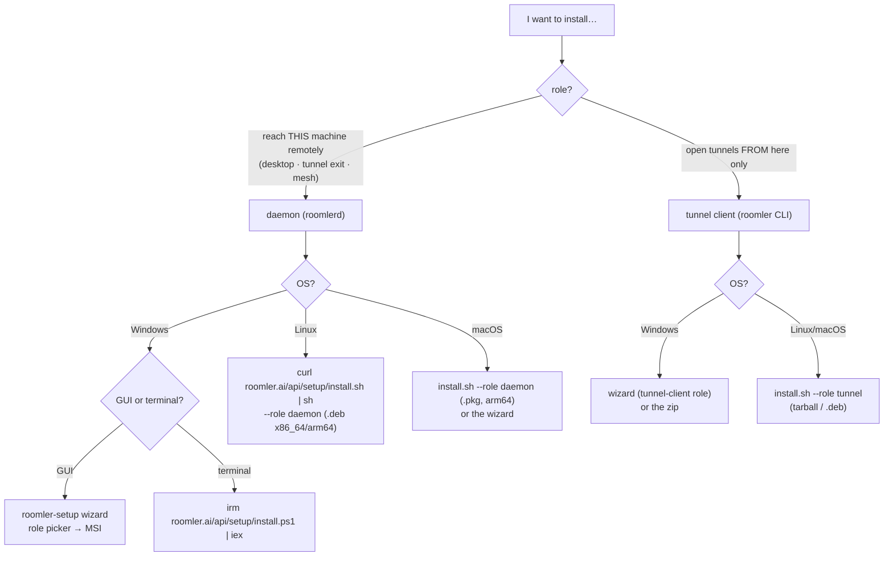
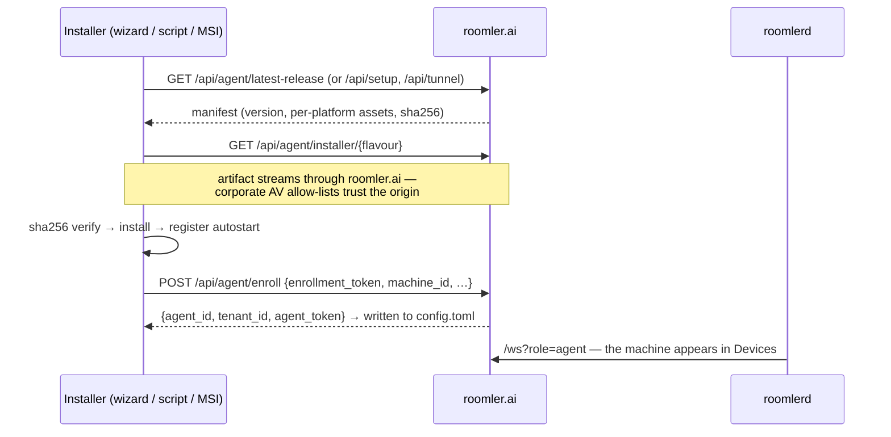
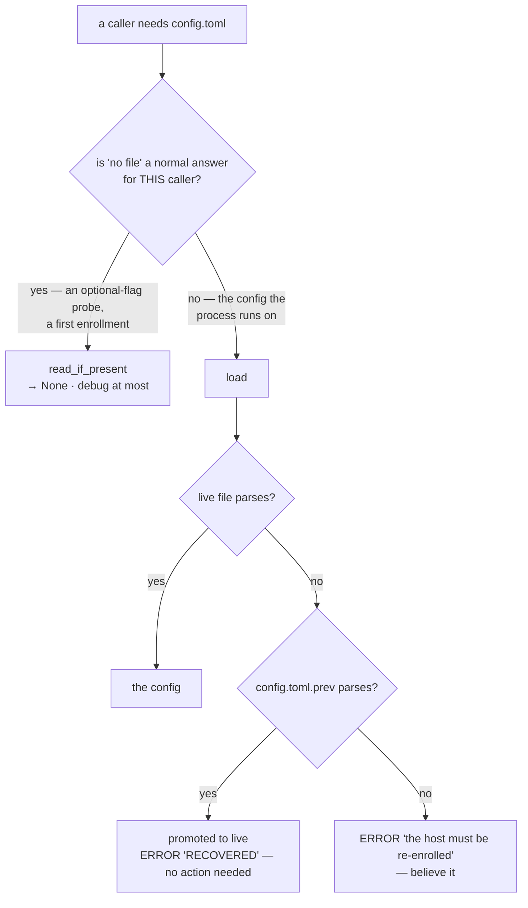
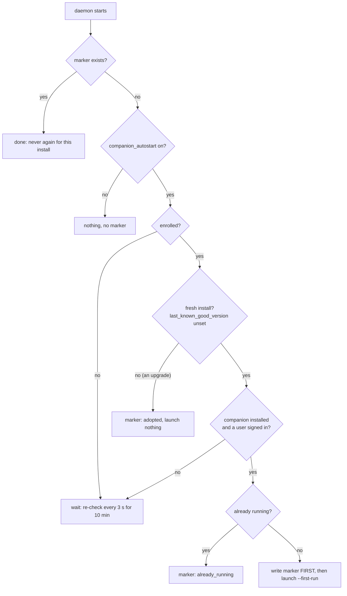

# Installation

Every way to put the Roomler node stack on a machine, on every supported platform.
"Daemon" means `roomlerd` — the full node: remote-desktop target, tunnel exit, and
overlay-mesh member. "Tunnel client" means just the `roomler` CLI for opening
forwards/SOCKS5 from the machine you sit at. *Re-checked against master on
2026-09-02 (0.4.47).*

## Which installer do I want?



Everything needs an **enrollment token** — minted in the admin UI
(**Admin → Agents → Enroll** for daemons, **Tunnel clients → Enroll** for CLIs),
valid 10 minutes, single-use.

## Enrollment — what every path does



`machine_id` is a stable hardware hash and `(tenant_id, machine_id)` is unique —
re-running an installer on a known machine reuses its identity instead of
duplicating it.

### "The host must be re-enrolled" — when to believe it

Re-enrolling is **destructive**: removal is final, and a re-enrolled device
never gets its old overlay address back. So the one log line that prescribes it
has to be true whenever it appears. Since FR-66 it is: `roomlerd` reads its
`config.toml` two ways, and which one a caller uses states whether a missing
file is a *normal* answer for that caller.

| Reader | For | When the file is absent or unreadable |
|---|---|---|
| `config::load` (`crates/agent-core/src/config.rs:2487`) | the config the process **runs on** | promotes `config.toml.prev` if it parses — ERROR *"…RECOVERED from the previous good copy"*, and the host carries on; with no usable previous copy, ERROR *"…the host must be re-enrolled"* (`:2523`) |
| `config::read_if_present` (`:2553`) | a **probe** for a file that may legitimately not exist | `None`, and at most a `debug!` |



Before FR-66, two callers that expect to find nothing went through `load` and
printed the destructive remedy about perfectly healthy hosts: the Windows
supervisor's `netd_enabled()` flag probe
(`agents/roomlerd/src/win_service/supervisor.rs:961`), on **every service
start** of every user-context install; and enrollment itself, reusing an
existing `machine_id` — during the very operation that enrolls the machine.
The noise also buried the genuine case, which prints the identical line.

⚠️ **Pick the reader by the question, not by the mechanism.** A shared helper
that logs at the severity of its worst caller makes every caller inherit that
reading. Do not fix a false alarm by softening `load`'s ERROR: for the config a
process runs on, it is exactly as serious as it was. And never use
`read_if_present` for *that* config — silently getting `None` there is the
"running on an older config must never look like a normal boot" failure the
ERROR exists to prevent. FR-66's P2 audited all 37 `load` call sites on this
question; two moved to `read_if_present`.

## Windows

**Recommended: the `roomler-setup` wizard** (signed EXE, downloadable from the
admin UI or `https://roomler.ai/api/setup/windows-x86_64`). One wizard, four
roles:

| Wizard role | What it installs | Runs as |
|---|---|---|
| **Daemon — system** | perMachine MSI + SystemContext enabled | SCM service `Roomler` (LocalSystem) — controls lock screen, UAC, pre-logon |
| **Daemon — per user** | perUser MSI | Scheduled Task `Roomler` at logon (limited) |
| **Daemon — machine (attended)** | perMachine MSI | SCM service, no SystemContext |
| **Tunnel client** | CLI archive + PATH entry | on demand |

Details worth knowing:

- **Two MSI flavours** exist (`peruser`, `permachine`) — the wizard maps roles
  onto them and flips SystemContext separately (`roomlerd enable-system-context`).
- **The private network is on by default for the two machine roles** (FR-84 S2):
  the Advanced **overlay** box follows the role — checked for *Daemon — system* and
  *Daemon — machine*, unchecked for *Daemon — per user* (the WireGuard adapter
  needs a service install; a per-user host can still join through the userspace
  netstack) — until you touch it, after which your choice sticks across role
  changes. The served `install.ps1` / `install.sh` keep their own defaults.
- **The wizard ships with every agent release** (FR-84 S1): `agent-v<V>` also
  publishes `setup-v<V>` at the same commit, so `/api/setup/*` serves a wizard as
  new as the daemon it installs.
- Daemon installs also place **`roomler-desktop`** (tray companion: status,
  tunnels pane, consent prompts) and **`roomler.exe`** — a small shim that
  re-execs `roomlerd cli`, so CLI and daemon can never version-skew.
- Terminal alternative: `irm https://roomler.ai/api/setup/install.ps1 | iex`
  (prompts for role/token; flags mirror the sh script).
- Binaries are Authenticode-signed; the MSI's payload EXEs are signed before
  packaging.
- On a perMachine install the SCM host writes the Defender rule
  `Roomler UDP-In (roomlerd)` **before** it spawns the worker, so an attended
  install never sees the "Allow access?" prompt — and removes, once, the
  `Roomler Daemon` Block rules an earlier install's prompt left behind (only
  rules whose id carries the prompt's own signature; a Block an administrator
  placed deliberately is left alone — #1698,
  [`overlay-wfp.md`](./overlay-wfp.md)). The perUser flavour cannot elevate
  and is unchanged.

## Linux

```bash
curl -fsSL https://roomler.ai/api/setup/install.sh | sh -s -- \
  --role daemon --token <enrollment-jwt> [--server https://roomler.ai] [--name lab-1]
```

- Installs the `.deb` (x86_64 **and** arm64) or tarball, verifies SHA-256,
  enrolls, and enables a **systemd user unit** (`roomler.service` →
  `systemctl --user enable --now`).
- ⚠️ The user unit is **sandboxed** (`ProtectSystem=strict`,
  `ProtectHome=read-only`): the daemon can write only its own config and data
  folders and `~/Videos` (screen recordings, FR-85 P2c). Every
  `ReadWritePaths=` entry that may be missing carries systemd's `-` prefix.
  Without it a missing path fails the whole unit with `226/NAMESPACE`, and
  until P2c the pre-rename folders listed there without it kept the unit from
  starting on any host that never ran the pre-rename agent. CI starts a unit
  with these sandbox lines on a fresh runner (`ci.yml`, "The Linux user
  unit's sandbox").
- `--role tunnel` installs just the CLI (tarball or `.deb`).
- Useful flags: `--download-only`, `--no-enroll`.
- Headless servers: the daemon's virtual-desktop mode gives the machine a
  display, so "Connect" drops you into a live console.
- Design notes for the tarball/self-update path: [linux-self-update.md](linux-self-update.md).

### Where a root daemon's config lives (rc.435)

A **root** daemon on Linux resolves `/etc/roomler/config.toml` — the path the
packaged `roomlerd.service` has always passed as `--config`. Non-root Linux
installs are untouched.

`appdirs::migrate_system_config()` moves a legacy
`/root/.config/roomler/config.toml` there once at startup, under the same rules
as the tree migration: **dest-absent only**, `rename`, **never deletes**, notes
logged at WARN after `logging::init`. The `.prev` sibling travels with it so no
credential-bearing copy is stranded.

`default_config_path()` resolves **`/etc` → profile → `/etc`**, so a host whose
migration has not run (or could not) keeps its identity instead of losing it.

⚠️ **This closes a real crash-loop class.** Hosts enrolled before the convention
ran on an orphan `roomlerd run` using the profile path, and died `no config
found` the first time systemd started them — `Restart=always` then looped. Hit on
buildhost, fleet-host-2 and the WSL sibling, the last from nothing but a
`dpkg -i`.

⚠️ **`systemctl is-active` reads `inactive` while such a host is perfectly
healthy** — the live daemon is an unmanaged orphan. Check `pgrep -x roomlerd` and
`roomler peers`, and never "restart to fix" on that basis.

⚠️ The per-host `roomlerd.service.d/config-path.conf` drop-ins used as the stopgap
are unnecessary from rc.435 and should be removed.

## macOS

Same `install.sh` one-liner, but macOS is the one platform that needs **two
processes**, and it is worth knowing why before you install:

<!-- RETIRED-NAME-ANCHOR(1): /etc/roomler-agent is now the LEGACY macOS daemon
     config dir, named only because the .pkg postinstall still reads it to
     MIGRATE off it (`migrate_legacy_dir /etc/roomler-agent /etc/roomler`,
     and it still honours a legacy `enable-daemon` marker there), so the
     path remains an input to code on user machines. FR-21 D5.
     ⚠️ This anchor's previous reason was FALSE and had been for some time:
     it claimed com.roomler.daemon.plist passes /etc/roomler-agent as its
     config. It does not — it passes /etc/roomler/config.toml. An anchor's
     stated reason is a CLAIM and ages like any other; re-read the code it
     names before trusting it (FR-46). -->
| Half | Runs as | Does | Why it cannot do the other's job |
|------|---------|------|----------------------------------|
| LaunchAgent `com.roomler.agent` | you, inside your GUI login session | screen capture, input, clipboard | a root LaunchDaemon in session 0 has no WindowServer — capture and `CGEvent` injection do not work there |
| LaunchDaemon `com.roomler.daemon` | root, from boot | overlay mesh, tunnels | creating a `utun` and installing routes require root |
| LaunchDaemon `com.roomler.update` | root, on a 6 h timer + on demand | self-update: check, verify, `installer -pkg … -target /` | `installer -target /` needs root, and neither agent half should ever exec its own replacement (the exit-to-update dance is what used to knock Macs offline). Installed by DEFAULT; opt out with `sudo touch /etc/roomler/disable-auto-update` + re-run the installer |

They cannot share one enrollment: the hub keys sessions on `agent_id`, so a
second control-WS connection displaces the first. **Each half is its own
enrollment, so a Mac appears as two devices** — the second named
`<name>-daemon`.

```bash
# Screen sharing only (one token, one device row):
curl -fsSL https://roomler.ai/api/setup/install.sh | sh -s -- \
  --role daemon --token <token> --server https://roomler.ai --name "$(hostname)"

# Screen sharing AND the overlay mesh — mint a SECOND enrollment token:
curl -fsSL https://roomler.ai/api/setup/install.sh | sh -s -- \
  --role daemon --token <token> --daemon-token <second-token> \
  --server https://roomler.ai --name "$(hostname)"
```

`--daemon-token` also turns the overlay on (`enroll --overlay`) — installing a
root daemon is itself the opt-in, and the overlay is the only reason that half
exists. Without it the Mac never sends `rc:overlay.join`, so it is **absent
from `roomler peers` entirely** rather than showing as offline.

Running the one-liner under `sudo` is fine: the script resolves the console
user itself and enrolls the per-user half as them.

### Grant the two permissions — nothing works until you do

macOS gates capture and input, and **it never reports an error when a grant is
missing**: the screen streams as wallpaper only, and injected keys and clicks
are silently dropped.

<!-- RETIRED-NAME-ANCHOR-BEGIN
     The whole macOS layout is FROZEN by FR-21 D5. The .app bundle name and
     path key the Screen Recording and Accessibility TCC grants; renaming
     either silently voids them, and the failure is a black screen with no
     error. The published .deb asset name is matched by the updater.
     Everything below names something a user can see today.
     ⚠️ This preamble also used to claim /etc/roomler-agent is what the
     LaunchDaemon plist passes as its config. It is not — the plist passes
     /etc/roomler/config.toml, and the old dir survives only as a migration
     source in the .pkg postinstall. Corrected 2026-09-02. -->
- System Settings → Privacy & Security → **Screen & System Audio Recording** → enable **Roomler Daemon**
- System Settings → Privacy & Security → **Accessibility** → enable **Roomler Daemon**

If a stale **Roomler Agent** entry is still listed from a pre-rename install,
remove it — macOS does not carry a grant across a bundle rename, and the `.pkg`
postinstall prints the same instruction when it detects one.

You do not have to hunt for this: the **Roomler menu-bar app** names whichever
grant is missing and gives you a button per permission that opens the right
pane. The agent also probes both at startup, says what is missing in its log,
and reports the state to the server — so the device list shows "No screen
access" / "No input access" instead of letting you discover it by connecting to
a black screen.

Then restart it: `launchctl kickstart -k gui/$(id -u)/com.roomler.agent`

⚠️ Grants are keyed to the binary's code signature. Until Apple notarisation is
finished the `.pkg` is unsigned, so **an agent update invalidates them** and
both toggles need re-enabling.

### What the package installs

| | |
|---|---|
| `/Applications/Roomler.app` | the **menu-bar companion** — status, routes, and the permissions panel. `LSUIElement`, so no Dock tile. The only Roomler icon you should see |
| `/Library/Roomler/roomlerd.app` | the daemon. A background service with nothing to launch, so it is deliberately NOT in `/Applications`; still a bundle, because TCC attributes the two permissions to a bundle identity |
| `/usr/local/bin/roomler` | the CLI (a small shim onto the daemon's own command surface) |
| `/usr/local/bin/roomlerd` | the daemon on PATH, for `roomlerd enroll` / `--version` — a symlink into the bundle, not a second copy |

Same three commands as Windows and Linux.

`roomler peers` / `status` reach the **per-user** half; `sudo roomler …` reaches
the **root** half, because the two listen on different LocalAPI sockets
(`$TMPDIR/roomler/roomler.sock` vs `/var/run/roomler/roomler.sock`). If a
command reports "daemon not running", you are probably asking the wrong half.

### Paths, logs, limits

| | Path |
|---|---|
| App bundle | `/Library/Roomler/roomlerd.app` (executable `roomlerd`). ⚠️ Renaming the bundle voids the TCC grants — FR-46 P5b did rename it, which is why the `.pkg` postinstall tells you to re-approve **Roomler Daemon** and delete a stale **Roomler Agent** entry |
| Per-user config | `~/Library/Application Support/live.roomler.roomler/config.toml` |
| Root config | `/etc/roomler/config.toml` |
| Per-user log | `/tmp/roomlerd.err.log` |
| Root log | `/var/log/roomler/daemon.log` |

Video is software-only on Apple Silicon (openh264 for H.264, libvpx for
VP9-4:4:4): the encoder dispatch tables contain only NVIDIA/Intel/AMD names, so
VideoToolbox is not wired up. Remote-audio capture and multi-org per-org
adapters are also unavailable on macOS today.

### Uninstall

```bash
launchctl bootout "gui/$(id -u)/com.roomler.agent"
launchctl bootout "gui/$(id -u)/com.roomler.desktop"
sudo launchctl bootout system/com.roomler.daemon          # if the root half is installed
sudo launchctl bootout system/com.roomler.update          # the update helper (installed by default)
rm -f ~/Library/LaunchAgents/com.roomler.{agent,desktop}.plist
sudo rm -f /Library/LaunchDaemons/com.roomler.{daemon,update}.plist
sudo rm -rf /Library/Roomler /Applications/Roomler.app /Applications/roomler-agent.app \
            /usr/local/bin/roomler /usr/local/bin/roomlerd \
            /etc/roomler /etc/roomler-agent
# ⚠️ /etc/roomler is the CURRENT root config dir and holds the agent token.
# This line used to remove only the legacy /etc/roomler-agent, so an uninstall
# left a live credential on disk.
# `sudo`, and both trees: an install done under sudo before rc.454 wrote the
# config into your home owned by root, so a plain rm cannot remove it.
# `live.roomler.roomler-agent` is the pre-rename path and may also be present.
sudo rm -rf ~/Library/Application\ Support/live.roomler.roomler \
            ~/Library/Application\ Support/live.roomler.roomler-agent

# The two privacy grants are bound to the binary you just deleted. Clearing
# them means the fresh install prompts again instead of showing a toggle that
# is ON but attached to something no longer there.
sudo tccutil reset ScreenCapture com.roomler.agent
sudo tccutil reset Accessibility com.roomler.agent
```

Remove the device row(s) in the admin UI too — deletion there releases the
overlay lease.

## After install: the companion opens, and starts at login (FR-84 D6)

Every install path ends with the daemon starting, so the **daemon** opens the
companion — once — with the **Welcome tour**: this device, the private network
(what it is, what it changes, an **Enable** button), who may view this screen,
where received files land, start at login. The tour shows at every start until
the person finishes or skips it (per-user state), and is reachable again from
the tray (**Welcome tour…**) and Settings.

| Install path | Who opens it after install | Login start |
|---|---|---|
| Windows perMachine — wizard, `install.ps1`, MSI | the **SCM service host** (LocalSystem), into the console session with the console user's own **non-elevated** token (`WTSQueryUserToken` + `CreateProcessAsUserW`, no inherited handles) | `HKLM\Software\Microsoft\Windows\CurrentVersion\Run\Roomler Desktop` = `"<install dir>\roomler-desktop.exe" --autostart` — written by the elevated `service install --as-service` (MSI custom action), self-healed at every service start, removed by `service uninstall --as-service` |
| Windows perUser — wizard, `install.ps1 -Role daemon-user` | the **worker** (the Scheduled Task, as the user) — `CreateProcessW` with `bInheritHandles = FALSE` | `HKCU\…\Run\Roomler Desktop` — written by the per-user `service install`, the worker at each start and the companion's first run; removed by `service uninstall` |
| Ubuntu / Debian — `install.sh` (user or `--system`) | the **daemon**, via `systemd-run` as its own transient unit (never in the daemon's cgroup) into the active `Class=user` graphical session — it waits for the companion `.deb`, which `install.sh` installs after the daemon's | the package's `/etc/xdg/autostart/roomler-desktop.desktop` (`--autostart`) |
| macOS — `.pkg` | the package's postinstall (the `com.roomler.desktop` LaunchAgent) — unchanged | the same LaunchAgent (`RunAtLoad`) |



The rules that matter (`agents/roomlerd/src/companion/launch_once.rs`, `decide`):

- ⚠️ **One launch per install, never a resurrection.** The marker
  (`companion-first-launch.json`: `%PROGRAMDATA%\roomler\roomler\` for the SCM
  host, else next to the daemon's `config.toml`) is written with `create_new`
  BEFORE the spawn; a failed write launches nothing. A companion the person quit
  stays quit across daemon restarts.
- ⚠️ **An upgrade is not an install.** `last_known_good_version` is unset until a
  daemon has run healthily for five minutes, so a host upgrading into D6 is
  *adopted* (marker written, nothing opened by the launcher). Its people meet the
  tour the next time their companion starts — at login, or straight after the
  update where the service's version refresh restarts a running companion.
- **Nobody signed in** (an RMM install, a headless box): no marker; the login start
  covers the first person to sign in.
- **Pre-enrollment starts wait**: the wizard's MSI starts the service before it
  enrolls and places the companion, so the launcher re-checks for ten minutes.
  The wizard also starts a **per-user** daemon right away now (its Scheduled
  Task used to wait for the next logon), as `install.ps1` always has.
- The marker records what happened (`launched`, `adopted`, `already_running`),
  and the daemon log says it: `companion launch-once …`. The companion logs its
  own `startup … action=Show("welcome")` in its `desktop.log`.

**Opting out.** A person: the companion's **Start at login** toggle (Settings, or
the tour) — per-user Windows deletes the `HKCU` value; per-machine Windows records
the choice and an `--autostart` launch exits at once; Linux writes
`~/.config/autostart/roomler-desktop.desktop` with `Hidden=true`; macOS points at
**System Settings → General → Login Items**. The whole device:
**`companion_autostart = false`** (Settings → Device configuration, or `roomler
config set companion_autostart false`) — no post-install launch, the Windows Run
value removed at the next service start, and any `--autostart` launch leaves.
⚠️ The machine-wide Run value starts a companion in **every** interactive session,
RDP ones included: on a multi-user server, this switch is the one to turn off.
The consent prompt does not depend on it — a prompt still starts the companion
when one is needed (FR-27).

## Keeping it updated

| Component | Mechanism |
|---|---|
| `roomlerd` (daemon hosts) | Self-updater polls `/api/agent/latest-release` (24 h timer + startup cooldown), verifies SHA-256, hands off to MSI / `dpkg` / `installer` and restarts. Admins can force it fleet-wide or per device (`POST …/agent/update`); ⚠️ `delivered: true` means only that the push reached the device's live socket — a device with `auto_update = false` ignores it and logs `update trigger dropped — auto-update is off on this device` (#1689). Crash-looping updates roll back to the last known-good version |
| `roomler` CLI (tunnel-only hosts) | `roomler self-update` (same proxy origin). On daemon hosts the MSI/.deb owns the binaries — the shim's `self-update` refuses by design |
| `roomler-desktop` | Not in either MSI: the daemon refreshes it itself at start when the companion's recorded version differs from its own — downloads the signed asset, stages it beside the old EXE, stops the running companion **by PID** (found by the path it was started from, never by image name), promotes the new file and starts it again in the same session (`agents/roomlerd/src/companion.rs`, `swap`). ⚠️ **One refresher per install**: on a Windows service install that is the service host — the worker it spawns skips, because two refreshers raced and left the old companion running, holding the single-instance lock (#1686) |
| wizard | Fetch-latest by nature; `setup-v<V>` is cut with every `agent-v<V>` (the lockstep job in `release-agent.yml`) |

## Verifying what you install

Every release asset ships with a `.sha256` sidecar, a detached **GPG signature**
(`.asc`, key published as `roomler-release-pubkey.asc`), and **SLSA build
provenance**:

```bash
gh attestation verify roomlerd-<v>-x86_64-unknown-linux-gnu.deb --repo gjovanov/roomler-ai
```
<!-- RETIRED-NAME-ANCHOR-END -->

Windows binaries are Authenticode-signed; macOS artifacts are Developer-ID signed
and notarized where the format allows. [code-signing.md](code-signing.md) covers
the whole chain — who the publisher is, how CI signs without holding any key
material, and how to verify an artifact by hand. The installer proxies exist
precisely so corporate networks can allow-list `roomler.ai` instead of
`github.com`.

## Uninstall / cleanup

- **Windows**: uninstall the MSI (per-user or per-machine) from Apps; the agent's
  version sweep also removes older same-flavour MSIs after upgrades.
  `roomlerd service uninstall` removes a manually-installed service/task.
- **Linux**: `apt remove roomlerd` (or delete the tarball install) and
  `systemctl --user disable --now roomler.service`.
- **macOS**: see [Uninstall](#uninstall) above — there may be TWO halves to
  remove (the per-user LaunchAgent and, if installed, the root LaunchDaemon).
- Server side, delete the device (**Devices → remove**): this revokes its
  credential and releases its overlay address back to the pool.

The agent's `config.toml` (server URL, tokens, per-node settings like
`encoder_preference`, `overlay_*`, `tunnel_routes`) lives under
`%APPDATA%\roomler\roomler\` / `%PROGRAMDATA%\roomler\roomler\`
(machine-global) / `/etc/roomler/` (root) or `~/.config/roomler/` — remove it to fully forget an
enrollment.
