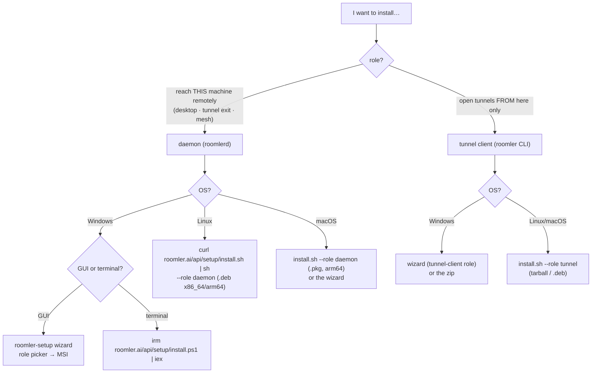
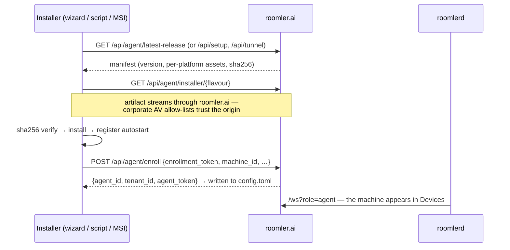

# Installation

Every way to put the Roomler node stack on a machine, on every supported platform.
"Daemon" means `roomlerd` — the full node: remote-desktop target, tunnel exit, and
overlay-mesh member. "Tunnel client" means just the `roomler` CLI for opening
forwards/SOCKS5 from the machine you sit at. *As of 0.3.0-rc.381.*

## Which installer do I want?



Everything needs an **enrollment token** — minted in the admin UI
(**Admin → Agents → Enroll** for daemons, **Tunnel clients → Enroll** for CLIs),
valid 10 minutes, single-use.

## Enrollment — what every path does



`machine_id` is a stable hardware hash and `(tenant_id, machine_id)` is unique —
re-running an installer on a known machine reuses its identity instead of
duplicating it.

## Windows

**Recommended: the `roomler-setup` wizard** (signed EXE, downloadable from the
admin UI or `https://roomler.ai/api/setup/windows-x86_64`). One wizard, four
roles:

| Wizard role | What it installs | Runs as |
|---|---|---|
| **Daemon — system** | perMachine MSI + SystemContext enabled | SCM service `RoomlerAgentService` (LocalSystem) — controls lock screen, UAC, pre-logon |
| **Daemon — per user** | perUser MSI | Scheduled Task `Roomler` at logon (limited) |
| **Daemon — machine (attended)** | perMachine MSI | SCM service, no SystemContext |
| **Tunnel client** | CLI archive + PATH entry | on demand |

Details worth knowing:

- **Two MSI flavours** exist (`peruser`, `permachine`) — the wizard maps roles
  onto them and flips SystemContext separately (`roomlerd enable-system-context`).
- Daemon installs also place **`roomler-desktop`** (tray companion: status,
  tunnels pane, consent prompts) and **`roomler.exe`** — a small shim that
  re-execs `roomlerd cli`, so CLI and daemon can never version-skew.
- Terminal alternative: `irm https://roomler.ai/api/setup/install.ps1 | iex`
  (prompts for role/token; flags mirror the sh script).
- Binaries are Authenticode-signed; the MSI's payload EXEs are signed before
  packaging.

## Linux

```bash
curl -fsSL https://roomler.ai/api/setup/install.sh | sh -s -- \
  --role daemon --token <enrollment-jwt> [--server https://roomler.ai] [--name lab-1]
```

- Installs the `.deb` (x86_64 **and** arm64) or tarball, verifies SHA-256,
  enrolls, and enables a **systemd user unit** (`roomler.service` →
  `systemctl --user enable --now`).
- `--role tunnel` installs just the CLI (tarball or `.deb`).
- Useful flags: `--download-only`, `--no-enroll`.
- Headless servers: the daemon's virtual-desktop mode gives the machine a
  display, so "Connect" drops you into a live console.
- Design notes for the tarball/self-update path: [linux-self-update.md](linux-self-update.md).

## macOS

Same `install.sh` one-liner. The daemon ships as an **arm64 `.pkg`** (Apple
Silicon) and registers a **LaunchAgent** (`com.roomler.agent.plist`); the tunnel
CLI and the wizard are universal binaries. Remote-audio capture and multi-org
per-org adapters are not available on macOS today; hardware encode falls back to
software (no VideoToolbox wiring).

## Keeping it updated

| Component | Mechanism |
|---|---|
| `roomlerd` (daemon hosts) | Self-updater polls `/api/agent/latest-release` (24 h timer + startup cooldown), verifies SHA-256, hands off to MSI / `dpkg` / `installer` and restarts. Admins can force it fleet-wide or per device (`POST …/agent/update`). Crash-looping updates roll back to the last known-good version |
| `roomler` CLI (tunnel-only hosts) | `roomler self-update` (same proxy origin). On daemon hosts the MSI/.deb owns the binaries — the shim's `self-update` refuses by design |
| `roomler-desktop` / wizard | Refreshed by the daemon's MSI on Windows; wizard is fetch-latest by nature |

## Verifying what you install

Every release asset ships with a `.sha256` sidecar, a detached **GPG signature**
(`.asc`, key published as `roomler-release-pubkey.asc`), and **SLSA build
provenance**:

```bash
gh attestation verify roomler-agent-<v>-x86_64-unknown-linux-gnu.deb --repo gjovanov/roomler-ai
```

Windows binaries are Authenticode-signed; macOS artifacts are Developer-ID signed
and notarized where the format allows. The installer proxies exist precisely so
corporate networks can allow-list `roomler.ai` instead of `github.com`.

## Uninstall / cleanup

- **Windows**: uninstall the MSI (per-user or per-machine) from Apps; the agent's
  version sweep also removes older same-flavour MSIs after upgrades.
  `roomlerd service uninstall` removes a manually-installed service/task.
- **Linux**: `apt remove roomler-agent` (or delete the tarball install) and
  `systemctl --user disable --now roomler.service`.
- **macOS**: `launchctl unload -w ~/Library/LaunchAgents/com.roomler.agent.plist`
  and remove the package payload.
- Server side, delete the device (**Devices → remove**): this revokes its
  credential and releases its overlay address back to the pool.

The agent's `config.toml` (server URL, tokens, per-node settings like
`encoder_preference`, `overlay_*`, `tunnel_routes`) lives under
`%APPDATA%\roomler\roomler-agent\` / `%PROGRAMDATA%\roomler\roomler-agent\`
(machine-global) / `~/.config/roomler-agent/` — remove it to fully forget an
enrollment.
