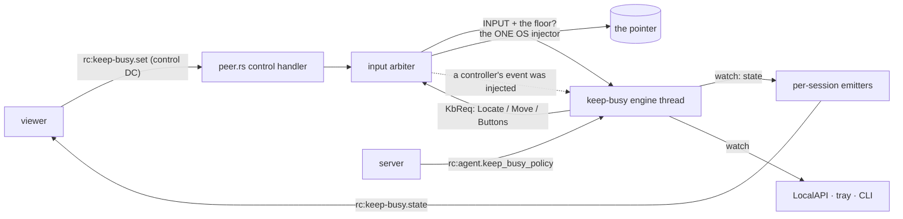
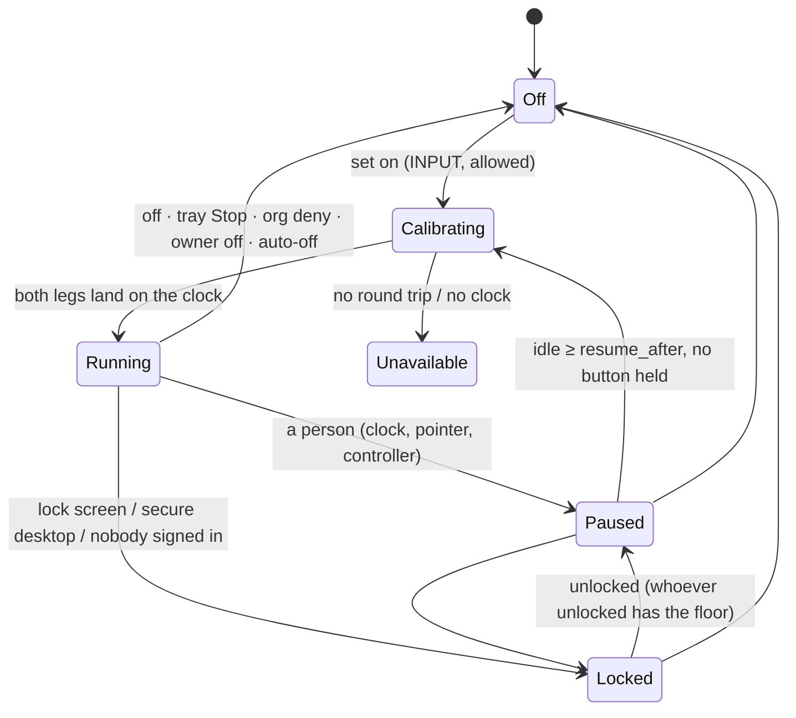
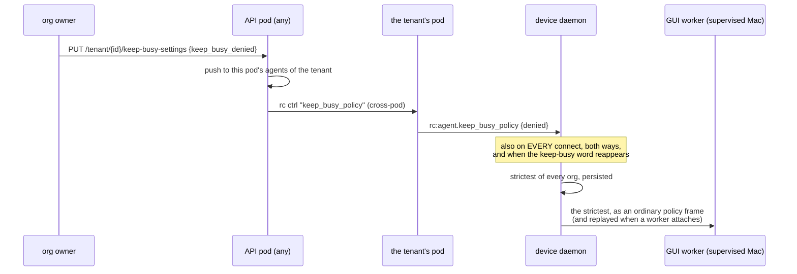

# Keep busy

> **FR-92** ([#1942](https://github.com/gjovanov/roomler-ai/issues/1942),
> [spec](fr/FR-92-keep-busy.md)).
>
> **Status: built, not yet released or field-verified.**
>
> | Part | What |
> |---|---|
> | P1 | the engine, on **Windows** |
> | P2 | the viewer's menu |
> | P3a | **Linux X11**, proven against a real X server in CI |
> | P3b | **macOS**, including a supervised Mac's GUI worker |
> | P4 | the person at the device sees it and stops it: tray, `roomler keep-busy`, LocalAPI |
> | P5 | the org deny |
> | P5b | the device list shows where it runs and who turned it on |
>
> Wayland is detected and reported unavailable.
>
> Every enable comes from a remote-desktop session that holds input. There is no
> local "on" and no server "on".

Keep busy moves a device's pointer in a pattern so the computer stays
**active**: no screensaver, no idle lock, no "Away" in Teams or Slack.

**A real user always wins.** The moment anyone uses the computer, keep busy
pauses. That is the person at it, or a remote controller, moving the mouse,
clicking, typing or scrolling. It resumes once they have been idle for
`resume_after` (30 s by default).

It stays on across disconnects, self-updates and reboots, until someone
switches it off. It resumes at the **same person's** next login.

The sleep assertions of FR-55 (`agents/roomlerd/src/power.rs`) cannot do this.
They keep the machine from **sleeping**, but they never reset the
**user-idle clock** that the screensaver, the idle lock and presence read. Only
input resets that clock. So keep busy produces real input, and only one kind:
an absolute mouse move.

## 1. One more input source, never a second injector

The engine is one std thread, `keep-busy`. It never touches the OS injector
itself. It asks the input arbiter to read or move the pointer: the one injector,
created lazily and cached for the life of the process
(`input/arbiter.rs` `keep_busy_op`, L953).

| Rule | Where |
|---|---|
| A SystemContext worker's desktop rebind covers the reads as well as the moves | the arbiter's injector thread |
| A move is **refused while any session holds a mouse button**, so a controller's drag never has a move spliced into it | `input/arbiter.rs` `any_button_held`, L513 |
| Every injected controller event bumps a counter the engine reads, so remote activity is known exactly. A heartbeat or a denied event is not counted | `input/arbiter.rs` L805, `keep_busy::note_remote_input` |
| Only a session holding **INPUT** may set it, and in exclusive mode only the floor holder | `input/arbiter.rs` `keep_busy_may_set`, L523 |

The state machine (`keep_busy/engine.rs`) is pure. A `Host` trait (L308)
carries every OS fact, and the tests drive the engine with a scripted fake host
and clock.

## 2. Who is a real user

The engine only ever causes absolute mouse moves, so anything else is a person.
Each running tick (`engine.rs` `detect`, L877) pauses on the first of these:

| Signal | Means |
|---|---|
| The controller-input counter moved since the last tick | a remote person (`paused_by: remote`) |
| The OS idle clock moved past the reading taken right after the engine's **own** last move | a key, a scroll, a click, a moved mouse (`paused_by: local`) |
| The pointer is not where the engine left it (±1 px), with no clock evidence | **not** a person: an app warped or confined the pointer. Reported as `cursor_contended`, with a doubling back-off so the two never fight |

> [!IMPORTANT]
> **No hooks, no raw input, no key polling.** `SetWindowsHookEx`,
> `RegisterRawInputDevices`, keyboard polling and event taps would tell real
> input from synthetic exactly. They are also what a keylogger looks like to
> EDR, and a GPO-locked desktop running EDR is in the acceptance bar.
>
> Mouse **buttons** (`VK_LBUTTON…VK_XBUTTON2`, `CGEventSourceButtonState`,
> `QueryPointer`'s mask) are read once per resume, never polled.

### The idle clock, per host

| Host | Clock | Reading |
|---|---|---|
| Windows | `GetLastInputInfo` (`host_win.rs` L45) | an exact tick, on the system timer (10–16 ms) |
| X11 | `MIT-SCREEN-SAVER` `ms_since_user_input` (`host_x11.rs` L55) | an **interval** |
| macOS | `CGEventSourceSecondsSinceLastEventType`, the session's combined state | an **interval** |

A "time since" reading cannot say exactly when the clock was read: only that it
was read somewhere between asking and hearing back. So the last input lies in
`[sent − idle, received − idle]`. Two readings mean "nothing new" exactly when
those intervals **overlap** (`IdleMarker`, `engine.rs` L262).

A reply read late **widens** its interval instead of shifting it. Taken at
receipt instead, one 25 ms-late read on a loaded host made the engine pause for
its own move.

**Two of the engine's own moves are always at least 32 ms apart**
(`MIN_MOVE_GAP`, `engine.rs` L69). Closer together, the idle clock reads them as
one event. Calibration moves out and back; before this spacing, its back leg
usually never registered on Windows' 15.6 ms tick, and the host read as
`not_landing`.

### Calibration before trust

On every enable and resume, the engine moves the pointer **3 px out and back**
(`engine.rs` `calibrate`, L754).
- Both legs must land within 1 px.
- The idle clock must register both moves.
- A pointer stuck at its starting point round-trips "home → home" perfectly, so
  only the out leg catches it.
- A failed round trip is `calibration_failed`. A move the clock never sees is
  `not_landing` (UIPI, another desktop).

## 3. States

The device sends a reason code and writes the sentence itself
(`engine.rs` `Reason::sentence`, L178). The viewer, the tray and the CLI all
show that one sentence.

| `reason` | When |
|---|---|
| `user_active` | someone used the computer; `paused_by` says local or remote |
| `cursor_contended` | another program moved the pointer; it backs off, doubling |
| `button_held` | a mouse button is down, locally or in a controller's drag |
| `locked` · `no_session` | lock screen or secure desktop · nobody signed in, or a login screen |
| `calibration_failed` · `not_landing` | the round trip failed · the moves do not register |
| `unsupported` · `wayland` · `portal` · `no_idle_clock` · `no_permission` | this host cannot (no display, Wayland, no Accessibility, …) |
| `device_disabled` · `org_denied` | the owner's key · the org's deny |
| `expired` · `stopped_by_controller` · `stopped_locally` | why it turned off |

## 4. Safety

| Rule | Why |
|---|---|
| **Moves only.** Never a click, a key or a scroll | — |
| **The safe box**: the monitor's work area ∩ a 48 px inset from every monitor edge (`patterns.rs` `safe_box`, L233). macOS uses 96 pt (`host_mac.rs` `mac_safe_box`, L235): the release build has no AppKit, so no `visibleFrame`, and the margin keeps the menu bar and a Dock on any edge clear | The pointer never reaches a hot corner or edge: GNOME Activities, a macOS hot corner that can start the screensaver **or lock the screen**, an auto-hidden taskbar or Dock, Windows Peek |
| **No jumps.** Each loop starts at the pointer, and a changing pattern (Shuffle, Wander, Lissajous) continues from where the last loop ended | — |
| **Never the first to create the injector before a display exists.** A boot-time restore waits for an unlocked session, and an injector the OS has not granted is answered for and not cached | The arbiter caches the injector, Noop included. Creating it too early would break remote control's input until a restart |
| **The viewer never re-asserts keep busy on connect**, unlike display-match | A reconnecting tab must not undo the person's Stop |
| **Wayland is refused from the display itself** (`host_x11.rs` `session`, L389): the `XWAYLAND` extension, or monitors named `XWAYLAND*` | XTest there moves only Xwayland's own pointer, so a calibration could pass while nothing real moves |

## 5. Patterns

| Pattern | What it draws |
|---|---|
| circle · triangle · square | the classics |
| star | a pentagram in one stroke |
| figure8 | the lemniscate of Gerono |
| heart | `x = 16 sin³t`, `y = 13 cos t − 5 cos 2t − 2 cos 3t − cos 4t` |
| spirograph | a hypotrochoid (R 5, r 3, d 5): a five-lobed rosette |
| lissajous | 3:2, with a phase that drifts each loop, so it morphs |
| rose | eight petals, `r = cos 4θ` |
| wave | a sine across and back |
| wander | a smooth random loop with uneven speed and short rests: the most human |
| subtle | 1 px out and back every 45 s. It resets the idle clock and is invisible |
| shuffle | a new visible pattern each loop |

**Speed** is slow, normal or fast: 120, 260 or 520 px/s along the curve. The
speed is constant, because the walk is by arc length.

**Size** is s, m or l: 14, 26 or 42 % of the safe box's short side.

The viewer draws its previews from the same formulas
(`ui/src/composables/keepBusy.ts`). Only the picture is shared; the agent alone
moves anything.

## 6. Wire

| Where | Message |
|---|---|
| viewer → device (control DC, `peer.rs` L8648) | `rc:keep-busy.set {on, pattern, size, speed, resume_after_s, auto_off_min}` · `rc:keep-busy.get` |
| device → every viewer (control DC) | `rc:keep-busy.state {available, on, phase, reason, sentence, paused_by, resumes_in_ms, pattern, …, set_by, warn}` (`wire.rs` `state_payload`, L76). A refusal goes only to the viewer that asked, with `refused` |
| server → device | `rc:agent.keep_busy_policy {denied}` (`remote_control/src/signaling.rs` L2224) |
| local client → device | LocalAPI `keep_busy_status` / `keep_busy_off` → `keep_busy` (`crates/localapi/src/lib.rs` L1260) |
| caps | `keep-busy` in `AgentCaps.input`, matched by equality, and following the owner's key at every announcement |

## 7. Gates

| Gate | Owner | Default | Effect |
|---|---|---|---|
| The session's INPUT grant, and the floor in exclusive mode | the session | — | A `set` from a view-only session, or from a viewer without the floor, is refused to that viewer |
| `keep_busy_enabled` (`crates/agent-core/src/config.rs` L1388) | the device's owner | **on** | Off: no cap word, a running keep busy stops, and new enables are refused. A local `ConfigSet` needs the console user. It is absent from `DesiredConfig`, so the server can never turn it back on |
| `TenantSettings.keep_busy_denied` (`crates/db/src/models/tenant.rs` L154) | the org owner (MANAGE_TENANT) | allowed | Deny: pushed at once to online devices and at the next connect to the rest. The device stops and refuses |

### How the org's deny reaches every device

| Piece | Where |
|---|---|
| The route | `crates/modules/fleet/src/keep_busy.rs` `set_org_settings`, L66 |
| The local push | `hub.rs` `push_keep_busy_policy`, L1665 |
| The cross-pod arm | `ctrl.rs` L41 |
| The connect reconcile | `socket.rs` `push_keep_busy_policy_on_connect`, L1048 |

**Strictest of every org.** A device enrolled in several orgs applies the
strictest of their last-known policies (`keep_busy/mod.rs` `org_denied`, L255).
- Each policy is persisted, so a deny holds at boot.
- A stored deny from an org the device has **left** is dropped at start
  (`prune_departed_orgs`, L263). No server would ever push that org's re-allow,
  so it would otherwise hold for good.
- There is no per-session field. The standing push reaches the device before
  any session, and a change is pushed at once.

**The supervised Mac.** The GUI worker runs keep busy, but it hears no org
itself, and delegation is primary-only.
- The daemon keeps every org's policy and hands the worker the strictest
  (`delegate.rs` `note_keep_busy_policy`, L611).
- It replays that policy when a worker attaches (`keep_busy_replay`, L628),
  because the connect-time push always arrives before any worker is there.

### Who can see where it runs (P5b)

The device list shows a **keep busy · \<phase\>** chip while it is on. Its tooltip names the pattern and
who turned it on. An org that denies keep busy, or simply wants to know, sees which devices are kept
awake.

| Piece | What |
|---|---|
| Source | the heartbeat's additive `keep_busy` brief (`KeepBusyBrief`, `crates/remote_control/src/models.rs`): `on`, `phase`, `reason`, and, only while on, `pattern` and `set_by` |
| Storage | `touch_heartbeat` stores it, and **unsets** it when a device stops saying |
| Display | the chip in `AgentsSection.vue`, with its tooltip from `keepBusyBriefTitle` |

It is the device's **claim**, shown as one, never enforced on. The device's own engine and gates
enforce.

A device that does not say shows nothing. That covers:
- an older agent;
- a host without keep busy;
- a supervised Mac's root daemon, which cannot speak for its GUI worker.

Nothing means **unknown**: never a stale "on", never an invented "off".

There is no durable history of who turned it on where, and when. That needs its own collection, and
it is an open decision in the spec (§6). Until then, the agent's log records every on and off with
who and why.

## 8. Where it remembers: per signed-in person

`keep-busy.json` is the **person's**, not the device's.
- It resumes at **that** person's next login.
- Someone else signing in starts with it off.
- It is written on on/off edges only. A file this agent cannot read means **off**.

| Host | The file | Written as |
|---|---|---|
| Windows, user worker | `%LOCALAPPDATA%\roomler\roomler\data\keep-busy.json` | the user |
| Windows, SystemContext worker | the **console user's** file, resolved through `session_user_profile_dir` | **the user**, impersonated (`win_identity.rs` `as_session_user`, L137; `state.rs` `as_owner`, L132) |
| Linux, per-user daemon | `~/.local/share/roomler/keep-busy.json` | the user |
| Linux, root daemon | **root's own** data dir: `/root/.local/share/roomler/keep-busy-<uid>.json`, for the person on our display (`state.rs` `default_path`, L209) | root, in a directory only root can write |
| macOS GUI worker / LaunchAgent | `~/Library/Application Support/live.roomler.roomler/keep-busy.json` | the user |

On a host installed before the rename, the directory keeps its pre-rename name
(`appdirs::project_dirs`), like the rest of that host's state.

> [!WARNING]
> **A privileged writer never writes where the person can plant a link.**
>
> A SYSTEM write into a profile folder can be steered by a junction plus an
> object-manager link onto any file SYSTEM can write: the classic escalation.
> So it is impersonated. Validating the path first does not close it, because
> the link can be swapped between the check and the write.
>
> A root write into a home directory is the same class (the symlink to
> `/etc/shadow`), so the root daemon keeps its stores in root's own directory.

**Never in `config.toml`.** That file:
- is SYSTEM- or root-owned on system installs;
- sits behind a write lock;
- is reported to the server;
- and `adopt_local` would read every toggle as an edit.

### Following the person

On a root Linux daemon or a Windows SystemContext worker, the signed-in person
can change while the process runs (`state.rs` `person_can_change`, L245). The
engine looks the person up again every 10 s, and right before applying a
turn-on (`keep_busy/mod.rs` `person_switch`, L417, and `run_with`, L437):

| When the person changes | Keep busy |
|---|---|
| They have their own stored keep busy | theirs starts, after they have had the floor for `resume_after` |
| None stored, and the running one was turned on while **nobody** was signed in | **adopted**: a technician at the login screen, signing them in |
| Anything else | stops. It is **never** handed from one person to another |
| Everyone signs out | stops; it stays stored for its owner |

The org's word belongs to the device and carries over. With nothing running and
nothing stored for anyone, the lookup is skipped, so a headless root daemon
does not spawn `loginctl` forever.

## 9. The person at the device

| Surface | What |
|---|---|
| **Tray** (`roomler-desktop`, `tray.rs` L47) | "Stop keep busy (Heart · paused)" while it is on, with the agent's sentence; "Keep busy: off" (disabled) otherwise. Polled every 3 s |
| **CLI** (`roomler-cli/src/cli.rs` L336) | `roomler keep-busy status\|off [--json]`. There is deliberately no `on` |
| **LocalAPI** | Both verbs are on the person-socket allowlist, so a Linux system install's companion reaches them. Off is open to every peer the endpoint admits, because it is the safe direction (`roomler exec` as SYSTEM or root included) |

## 10. Platforms

| Host | Status | Idle clock · lock · geometry |
|---|---|---|
| Windows, user-context and SystemContext workers | ✅ | `GetLastInputInfo` · `OpenInputDesktop` · `GetMonitorInfoW.rcWork` |
| Linux X11 (a user-session daemon, or root with the display's auth) | ✅ (Xvfb-proven) | `MIT-SCREEN-SAVER` · logind `LockedHint` (`logind.rs` L144) · RandR 1.5 ∩ `_NET_WORKAREA` |
| macOS, GUI worker or LaunchAgent | ✅ (compiled; field owed) | `CGEventSourceSecondsSinceLastEventType` · `CGSessionCopyCurrentDictionary` (`host_mac.rs` `console`, L182) · `CGDisplayBounds` + 96 pt |
| Wayland, portal-only input | ✖ reported (`wayland`) | — |

> [!NOTE]
> **Lockers that never report `LockedHint`** (xscreensaver, i3lock) are not seen
> on X11. Keep busy then keeps moving the pointer behind them. That is
> harmless, since they have no hot corners and a move unlocks nothing, but the
> display stays awake while it is on.
>
> **A single isolated key tap can slip through on X11 or macOS** if it lands
> within a few milliseconds of the engine's own move. A person typing, scrolling
> or moving the mouse is caught at once, because the pointer moves too.

## 11. Tests

### `keep_busy/engine.rs` (fake host and clock)

- each pause source, the resume timing, and continued activity extending a pause;
- a held button and a lock blocking the resume;
- calibration: a wrong landing, a stuck pointer, `not_landing`;
- **a coarse idle clock**: the 32 ms spacing;
- **interval markers**: a slow read only widens;
- **a new person** gets their own keep busy, never the last one's;
- no idle clock, the owner's and the org's off, auto-off, `subtle`, Shuffle without jumps;
- a boot restore that never touches the injector without a session.

### `keep_busy/patterns.rs`

- every shape is closed, continuous, and inside the unit box and the safe box from any anchor;
- the arc-length walk;
- a loop starts at the pointer.

### `keep_busy/host_x11.rs` against a real X server (Xvfb, a CI step)

- XTest motion resets the idle counter;
- the **whole loop** (engine + host + the arbiter's own enigo injector) runs with the server's idle at 4–17 ms;
- a key typed by another client pauses it.

The step runs with `--test-threads=1`: in parallel, another test's pointer move
**was** a person to it.

### Everything else

- `keep_busy/mod.rs`, `logind.rs`, `state.rs`, `host_mac.rs`:
  - the person switch;
  - the strictest org and leaving an org;
  - logind parsing;
  - the per-person root store;
  - the macOS console flags and safe box.
- `input/arbiter.rs`: the INPUT and floor rule, and a held button blocking moves.
- `win_identity.rs`: no token for the person means the store is not touched at all.
- `delegate.rs`: the worker gets the strictest policy on attach and on change.
- `crates/tests/src/keep_busy_tests.rs`:
  - the org route's permissions;
  - the push on connect and on every change, and when the word reappears;
  - no frame to a device without the word.
- The viewer:
  - `keepBusy.spec.ts`: the parser, the message, the status line, the previews.
  - `KeepBusyMenu.spec.ts`: chip vs button, the countdown, asking, view-only.

## 12. Field verification (owed)

Run this on a release candidate, never on a machine someone is using. Record
the negative control **first**.

1. **Negative control.** A host with a 1-minute lock and Teams open, keep busy
   OFF: it locks, and Teams goes Away. Measure idle with `roomler exec`:
   - Windows: a `GetLastInputInfo` one-liner;
   - macOS: `ioreg -c IOHIDSystem` `HIDIdleTime`;
   - X11: `xprintidle`.
2. **ON:** no lock for 15 min, Teams stays Available, idle stays under 2 s.
3. **Pause and resume:** a local touch, local typing and controller typing each
   pause it within 1 s. It resumes after 30 s.
4. **Locks and reboots:** Win+L shows `locked`. A reboot and the same person's
   login brings it back running with no viewer connected.
5. **Org deny:** the PUT makes every online device log
   `keep-busy: org policy received` and stop within 5 s.
6. **macOS:**
   - with a lock hot corner set, it never fires in 30 min at size l;
   - with Accessibility denied, it reports `no_permission`.
   - On a **supervised** Mac, `roomler keep-busy status` and the tray reach
     the **GUI worker**, which runs keep busy, and not the root daemon. The
     worker serves the per-user LocalAPI socket that clients try first. `sudo`
     drops `TMPDIR`, but `temp_dir()` falls back to the same per-user folder.
     This is expected, not yet proven.
7. **Worker types:** both the SystemContext and the user-context Windows
   workers. The SystemContext worker's store is **owned by the user**.
8. **Wayland VM:** `unavailable: wayland`.
