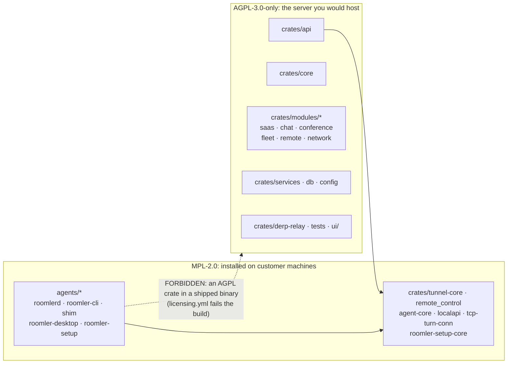
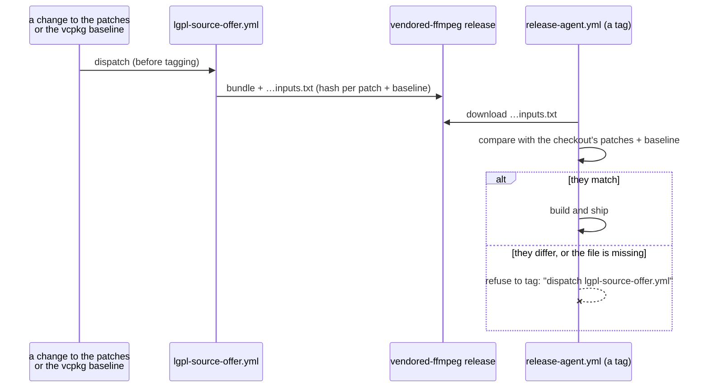

# Licensing — how the split stays true

Roomler's code carries three licences. The server a customer would host is
**AGPL-3.0-only**, everything installed on a customer's machine is **MPL-2.0**, and
the documentation is **CC-BY-4.0**. [`LICENSING.md`](../LICENSING.md) answers the
practical questions: self-hosting, MSPs, reselling, and what happened to code
contributed before the split. This page is the engineering view: how the split is
classified, which CI checks stop it rotting, and what the FFmpeg LGPL obligations
require.

> Design record and evidence: [`fr/FR-24-licensing-split.md`](fr/FR-24-licensing-split.md) (#838).

**The one rule the split exists for:** no AGPL crate may appear in a shipped agent's
dependency graph. The server links MPL crates, which is fine, because MPL is
file-level copyleft. An agent linking an AGPL crate would make it effectively AGPL:
a procurement blocker at most enterprises, and it would falsify the MSP answer in
`LICENSING.md`.

## Which licence applies

The single source of truth is
[`scripts/licence-classes.sh`](../scripts/licence-classes.sh). `LICENSING.md`'s
table mirrors it for readers, and CI reads only the script.

| class | by path ([`:31`](../scripts/licence-classes.sh#L31), [`:45`](../scripts/licence-classes.sh#L45)) | by crate ([`:70`](../scripts/licence-classes.sh#L70), [`:86`](../scripts/licence-classes.sh#L86)) | SPDX |
|---|---|---|---|
| server | `crates/{api,services,db,config,core,modules,derp-relay,tests}`, `ui/` | `roomler-ai-*`, `roomler-core`, all six `roomler-ai-mod-*`, `derp-relay` | `AGPL-3.0-only` |
| client | `agents/*`, `crates/{agent-core,roomler-setup-core,tunnel-core,remote_control,localapi,tcp-turn-conn}` | `roomlerd`, `roomler-cli`, `roomler-node-core`, `roomler-ai-tunnel-core`, … | `MPL-2.0` |
| docs | `docs/` | — | `CC-BY-4.0` |
| excluded | `crates/vendored/*` (upstream terms, unchanged), build output | — | upstream |

The **shipped** agents, the binaries the graph check guards, are listed separately
([`:103`](../scripts/licence-classes.sh#L103)): `roomlerd`, `roomler-cli`,
`roomler-cli-shim`, `roomler-desktop` and `roomler-setup`.

⚠️ **A new crate must be added to one of the two crate lists.** The manifest check
fails any workspace member it cannot classify. That failure is the reminder, and it
only works because the check now walks every member (see below).

## The checks that keep it true

All four run in [`.github/workflows/licensing.yml`](../.github/workflows/licensing.yml)
on every change to a manifest, a source file or the class script.

| check | catches | shape, and why |
|---|---|---|
| Every workspace member declares the expected `license` ([`:44`](../.github/workflows/licensing.yml#L44)) | a crate that says MPL while classed server, or the reverse | Iterates the **workspace `members`** from `Cargo.toml`, not a glob. It fails loudly if it parses none. It reads only the `[package]` section, because `[package.metadata.wix]` has a `license` key that means something else |
| Every first-party file carries the right SPDX header ([`:79`](../.github/workflows/licensing.yml#L79)) | a new file with no header, or the wrong one | `scripts/apply-spdx.sh --check`, classified by path |
| **No AGPL crate reaches a shipped agent binary** ([`:88`](../.github/workflows/licensing.yml#L88)) | the one-line `Cargo.toml` edge that would relicense the agent | `cargo tree -p <agent> -e normal` against the server crate list. `-e normal` drops dev-dependencies, because a test-only edge cannot reach a shipped binary and flagging it would train people to disable the check |
| Dependency licences are on the allowlist ([`:110`](../.github/workflows/licensing.yml#L110)) | a third-party crate under a licence nobody vetted | `cargo deny check licenses` |

⚠️ **Both lists had gone blind to FR-69's modules, and every run still printed OK.**
Until 2026-09-25 the manifest check iterated `crates/*/Cargo.toml`, one level deep,
so the six crates FR-69 put under `crates/modules/` were never read: it checked 18
of 24 members. Separately, the server crate list omitted `roomler-ai-mod-remote` and
`roomler-ai-mod-network`, so the graph check could not see an agent depending on
either, and the network module is exactly the overlay code an agent might be tempted
to import. All six happened to declare AGPL correctly, and no agent reaches them
today (every shipped graph was re-checked). But nothing would have noticed if either
had been untrue. The fix was proven fail-first: with one module's licence changed to
MPL in a scratch tree, the old check printed OK and the new one names the manifest.

## FFmpeg and the LGPL

The agents link FFmpeg, which is LGPL-2.1, and how they link it decides what we owe.

| platform | linkage | clause | what we provide |
|---|---|---|---|
| Windows (`roomlerd.exe`) | **static** | §6: a recipient must be able to relink | the corresponding source, the written offer, and the relink procedure |
| Linux (`.deb`) | shared | §6(b), satisfied by the shared-library mechanism | the corresponding source |
| macOS (`.pkg`) | shared | §6(b) | the corresponding source |

The corresponding source is a bundle on the permanent `vendored-ffmpeg-<version>`
release, built by [`lgpl-source-offer.yml`](../.github/workflows/lgpl-source-offer.yml).
It holds the upstream tarball and **every change our builds make to it**: our own
patches from `.github/ffmpeg-patches/`, and the vcpkg `ffmpeg` port that the Windows
build starts from, at the baseline the recipe pins
([`:64`](../.github/workflows/lgpl-source-offer.yml#L64)). The relink procedure itself
is in [`lgpl-relink.md`](lgpl-relink.md), and the written offer is in
[`THIRD-PARTY-NOTICES.md`](../THIRD-PARTY-NOTICES.md).

⚠️ **After any change to `.github/ffmpeg-patches/` or the vcpkg baseline, dispatch
`lgpl-source-offer.yml` before tagging.** `release-agent.yml` refuses otherwise
([`:400`](../.github/workflows/release-agent.yml#L400)). Until 2026-09-24 the bundle
held neither set of patches while three documents said we applied none. The workflow's
own check was green throughout, because it asked whether an asset *existed*, never
whether it was the source we built from (#1616).

## Contributions

Contributors sign an Apache-ICLA-derived CLA ([`CLA.md`](CLA.md)).
⚠️ **The CLA bot (`cla.yml`) is deliberately disabled** until a lawyer has reviewed
the CLA. That review is the one FR-24 criterion only the operator can settle.

## Where each document lives

| document | for |
|---|---|
| [`LICENSING.md`](../LICENSING.md) | the practical questions, and the component table for readers |
| [`COMMERCIAL.md`](../COMMERCIAL.md) | the commercial licence offering |
| [`THIRD-PARTY-NOTICES.md`](../THIRD-PARTY-NOTICES.md) | third-party licences and the LGPL written offer |
| [`lgpl-relink.md`](lgpl-relink.md) | exercising the §6 relink right, step by step |
| [`CLA.md`](CLA.md) | the contributor licence agreement |
| [`CONTRIBUTING.md`](../CONTRIBUTING.md) · [`SECURITY.md`](../SECURITY.md) | contributing, and reporting a vulnerability |
