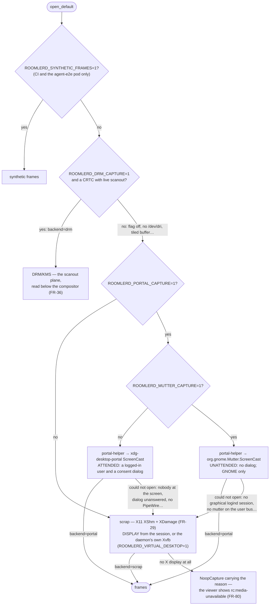
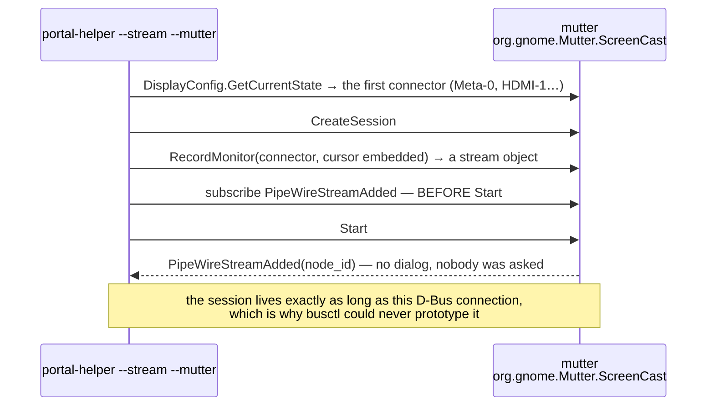

# Linux capture — X11, DRM, the desktop portal, and mutter

How `roomlerd` gets pixels off a Linux desktop, and why there are four ways
rather than one. This is the Linux half of the capture cascade that
[`encoders.md`](encoders.md#capture-backends) summarises and
[`remote-control.md`](remote-control.md#51-capture-targets-per-os) tabulates
per OS; the two portal-shaped arms are FR-45's
([spec](fr/FR-45-portal-capture.md), #1041), the DRM arm is FR-36's
([spec](fr/FR-36-wayland-capture.md)), and the X11 damage tracking is FR-29's.

The shape of the problem, in one paragraph: **the daemon runs as root, outside
every user session, and Linux has no capture API that works from there for
every desktop.** X11 gives root a readable root window; Wayland deliberately
does not. Reading the kernel's scanout plane works below any compositor — but
only where a display controller exists. The desktop portal works on any
compositor — but only inside a logged-in session, and only after a human says
yes. Mutter's own screencast API works where the portal cannot even start — but
asks nobody, and only exists on GNOME. Each arm sees something the others
cannot and pays for it in a different currency, so the cascade tries them in a
fixed order and every non-default arm is **opt-in**.

## 1. The cascade

`capture::open_default` (`agents/roomlerd/src/capture/mod.rs:665`) tries the
backends in this order and returns the first that opens. On Linux the Windows
arms (SystemContext, WGC) do not exist, so the order is:



| Arm | Reads | Sees a locked screen / the greeter | Asks the person at the screen | Needs | Default | Gate |
|---|---|---|---|---|---|---|
| **DRM/KMS** (`drm_backend.rs`) | the primary CRTC's scanout framebuffer, via `/dev/dri/cardN` | **yes** — it reads below the compositor, so a lock screen is just more pixels | no | a real display controller with a live, linear-modifier scanout buffer | **off** | `ROOMLERD_DRM_CAPTURE=1` (`mod.rs:771`) |
| **portal** (`portal/screencast.rs`) | a PipeWire stream the compositor publishes through `org.freedesktop.portal.ScreenCast` | **no** — mutter refuses to create *or restore* a screencast while locked | **yes**, once; a restore token skips the dialog afterwards | an active `x11`/`wayland` logind session, `xdg-desktop-portal` + a backend for the compositor, PipeWire | **off** | `ROOMLERD_PORTAL_CAPTURE=1` (`mod.rs:807`) |
| **mutter direct** (`portal/mutter.rs`) | the same kind of PipeWire stream, from `org.gnome.Mutter.ScreenCast` | no (a session API) | **no** | GNOME's mutter on the user's session bus; no portal backend required | **off** | `ROOMLERD_PORTAL_CAPTURE=1` **and** `ROOMLERD_MUTTER_CAPTURE=1` (`portal/backend.rs:64`) |
| **scrap** (`scrap_backend.rs` + `x11_damage.rs`) | the X root window over XShm, with XDamage saying whether anything changed | X11: yes for whatever the X server shows; Wayland: nothing (XWayland's root has no readable framebuffer) | no | an X display: the session's `DISPLAY`, or the Xvfb the daemon starts itself | **on** — the last real arm | always tried (`mod.rs:843`) |

Two things about the order are deliberate and worth defending when the next
backend arrives:

- 🔑 **DRM stays first wherever a CRTC exists.** It needs no consent and sees a
  locked screen, so a host that *has* scanout must never be handed to an arm
  that asks. Measured on a host with both (FR-45 field log): DRM flag alone →
  `backend=drm`; both flags → **still `backend=drm`**; neither → the portal
  never engages (no helper spawned, no dialog).
- ⚠️ **DRM and the portal are opt-in, which is the inverse of this repo's usual
  kill-switch shape** — and for two different reasons. DRM reports no damage at
  all (`Damage::Unknown` on every frame), so defaulting it on where X11 works
  would undo FR-29's idle-CPU win (45.8 % → 2.8 % of a core on a static
  screen). The portal is **attended**: defaulting it on would leave an
  unattended host waiting on a consent dialog nobody will answer — a hang
  dressed up as a feature. Both arms therefore log **loudly** when the operator
  asked for them and they fell through (`mod.rs:787`, `mod.rs:824`), because
  silently serving X11 instead would look like the feature simply not working.

## 2. The X11 arm, and the virtual desktop

`scrap` on Linux is XShm: a full-screen `GetImage` per frame, which XShm cannot
tell you was unnecessary. FR-29 bolted an XDamage listener beside it
(`agents/roomlerd/src/capture/x11_damage.rs`) so an unchanged screen produces
*no frame* and the pump idles; a forced grab every second bounds the failure
mode of a missed damage event at a stale tile rather than a frozen stream.

On a host with no X session at all — a headless server, a container, **WSL2**
(WSLg's rootless XWayland root has no readable framebuffer, so `XGetImage`
fails) — the daemon can bring up its **own** display:
`ROOMLERD_VIRTUAL_DESKTOP=1` (`agents/roomlerd/src/main.rs:2311`,
`virtual_desktop.rs:76`) starts Xvfb at `ROOMLERD_VIRTUAL_DESKTOP_RESOLUTION`
(default `1920x1080`) with the window manager named by
`ROOMLERD_VIRTUAL_DESKTOP_WM` (default `openbox`) and the comma-separated
`ROOMLERD_VIRTUAL_DESKTOP_STARTUP` apps, points `DISPLAY` at it before the caps
probe and every capture, and captures it with the unchanged scrap + damage
path. This is the hardware-encode test bed on the WSL2 dev host, and the
remote-apps surface of FR-56 rides on it.

The children are spawned into their **own process group**, and on any graceful
exit the daemon tears the whole tree down —
`virtual_desktop::teardown` — SIGTERM → 2 s grace → SIGKILL, reaching
every descendant including a setsid'd grandchild (`at-spi-bus-launcher`, a D-Bus
service that **ignores SIGTERM**) via the parent-link closure of the daemon's
direct children. Without it, under systemd `KillMode=control-group` that
grandchild held the unit's cgroup non-empty until systemd's `TimeoutStopSec`
(90 s) SIGKILLed it, so `roomler restart` took 96 s (#1684). See
[`desktop-companion.md` §7](desktop-companion.md#7-apply-now--restarting-the-service-from-the-companion).

⚠️ **A virtual-desktop host is not a consent surface**, even though its X
display connects: the only viewer of that Xvfb is a remote controller, so the
native consent panel would be drawn where nobody can see it (`indicator/x11.rs:499`
reads the daemon's own `ROOMLERD_VIRTUAL_DESKTOP` and declines). Detail in
[`remote-control.md` §11.2](remote-control.md#112-consent).

## 3. The DRM arm (FR-36)

Read the scanout plane from the kernel: `drmModeGetFB2` → `PrimeHandleToFD` →
`mmap`, repacked to BGRA. One code path for GNOME, KDE, XFCE, X11 and *no
session at all*; it works at the greeter and on a locked screen, which is the
normal state of an unattended machine and exactly where the portal refuses.
What it does **not** do is documented at the top of `drm_backend.rs` and each
omission is a design decision, not a gap: no damage tracking (neither buffer
identity nor a page flip is a proxy for "changed"), primary CRTC only, and a
**refusal** on any non-linear modifier rather than emitting tiled garbage that
would read as a codec bug. Pair it with `ROOMLERD_UINPUT=1` on a Wayland host:
XTest reaches Xwayland clients only, so DRM capture without uinput is a
read-only session. The rest — the device-node scan, the 10-bit repack, the
field numbers — is in the [FR-36 spec](fr/FR-36-wayland-capture.md).

## 4. The portal arm (FR-45 P1–P4)

### 4.1 Why a helper process, and why it dlopens

The portal is **per user session**: it lives on the session bus, checks
`SO_PEERCRED`, and `XDG_RUNTIME_DIR` is `0700`. A root daemon with no session
bus asking it anything gets `no-session-bus`, which is the architecture rather
than a misconfiguration. So the daemon spawns **itself** — the hidden
`roomlerd portal-helper` subcommand — as the console user, with that session's
`XDG_RUNTIME_DIR`, `DBUS_SESSION_BUS_ADDRESS`, `DISPLAY` and `WAYLAND_DISPLAY`
(`capture/portal/mod.rs:755`), through a verified privilege drop rather than
`CommandExt::uid()` (which leaves the child in root's supplementary groups — a
silent retention bug, not a visible failure).

🔑 **The subcommand buys the session context; only `dlopen` buys the linkage.**
A helper *subcommand* is the same ELF as the daemon, so linking `libpipewire`
for the helper's sake would put it in every Linux build's `DT_NEEDED` — and a
missing `.so` there does not degrade a feature, the loader refuses to start the
daemon at all, on every headless fleet host that will never run a portal.
`portal/pipewire.rs:307` therefore `dlopen`s `libpipewire-0.3.so.0` at runtime
and reports `unavailable — libpipewire not present (tried …)` where it is
absent; `readelf -d` shows **zero** PipeWire entries on both architectures, and
the daemon was run with the library bind-mounted away to prove the degradation
is graceful. The SPA POD builders are `static inline` in PipeWire's headers
(nothing to `dlsym`), which is why `portal/pod.rs` serialises them by hand.

### 4.2 The handshake

```mermaid
sequenceDiagram
    participant D as roomlerd<br/>(root, no session bus)
    participant H as roomlerd portal-helper<br/>(the session user)
    participant XDP as xdg-desktop-portal<br/>+ the compositor's backend
    participant PW as PipeWire<br/>(dlopen'd libpipewire)

    D->>D: companion::graphical_session()<br/>a logind session with Type=x11|wayland, Active=yes
    D->>H: spawn as that user: XDG_RUNTIME_DIR, DBUS_SESSION_BUS_ADDRESS,<br/>DISPLAY / WAYLAND_DISPLAY; stdout piped, stderr inherited
    H->>XDP: CreateSession — on ScreenCast, or on RemoteDesktop when input is wanted
    opt portal_input
        H->>XDP: SelectDevices (keyboard + pointer, persist)
    end
    H->>XDP: SelectSources (monitor, cursor embedded, persist_mode, restore_token if stored)
    H->>XDP: Start
    Note over XDP: first use: a consent dialog for the person at the screen<br/>later uses: restored from the token, ~15 ms, no dialog
    XDP-->>H: Response: streams (node_id, logical size), restore_token
    H->>XDP: OpenPipeWireRemote → fd
    H->>PW: connect the fd; pw_stream with the EnumFormat POD
    PW-->>H: param_changed (a fixated format) → process (buffers)
    H-->>D: one marked handshake line, then RPWF-framed BGRA frames on stdout
    D->>D: PortalCapture → the media pump → the encoder
```

Every portal method returns a `Request` path and answers later as a `Response`
**signal**, because a call can take as long as a human takes to read a dialog.
⚠️ The subscription is armed **before** the call (`screencast.rs:302`,
`:351`, `:376`): arming afterwards is a race the portal wins whenever it
answers without asking anyone — exactly the restore-token case.

The daemon side is `PortalCapture::open` (`portal/backend.rs:48`). It reads
the handshake under a **120 s deadline** (`HANDSHAKE_DEADLINE`,
`backend.rs:294`) because a portal `Start` blocks until the dialog is answered
and `open_default` runs synchronously on a media-pump worker — an unanswered
dialog fails the open with *"a consent dialog left unanswered, most likely"*
and the cascade falls through, instead of parking that worker forever. Frames
cross as **a pipe and a copy**, not `SCM_RIGHTS` buffer fds: `Frame` owns a
`Vec<u8>` so the daemon copies regardless, and passing the compositor's own
buffers means not queueing them back until the daemon has read them — a stall
the compositor can see and, got wrong, torn frames that look like a codec bug.
`wire.rs` puts a `RPWF` magic on every header so a desynchronised reader fails
at the next boundary rather than reading pixels as a length. ⚠️ After the
handshake **stdout is binary; diagnostics go to stderr** — a stray `println!`
in the helper corrupts a frame.

**Tokens.** The restore token is kept **by the helper**, in
`$XDG_STATE_HOME/roomler/portal-restore-token` (mode `0600`, the session
user's; `-rd` for a see+touch grant, `-win` for a window grant —
`screencast.rs:545`). The daemon never receives it, by construction: an early
`SessionReport` carried it and it turned up in plaintext in a redirected log,
so the report now says only *whether* a grant was persisted. A caller that
cannot hold a credential cannot leak it.

### 4.3 Input rides the same session (P4)

On the hosts this arm exists for, the portal is also the only thing that can
*touch* the desktop: uinput creates a device and libinput even enumerates it,
but a **nested** compositor reads its parent, not evdev, so injected events
are published and nothing consumes them (measured on WSL2). With
`ROOMLERD_PORTAL_INPUT=1` the helper opens the session on the **RemoteDesktop**
interface instead — the same session, one dialog covering see and touch, one
token — and the daemon's input arbiter forwards `InputMsg` JSON lines down the
helper's stdin (`portal/input_route.rs:93`), which the helper maps to
`NotifyKeyboardKeycode` (evdev codes from the shared FR-36 table),
`NotifyKeyboardKeysym` (typed text), `NotifyPointerMotionAbsolute` (in the
stream's **logical** size, which differs from the pixel size under a HiDPI
scale) and the axis calls (`portal/input.rs`).

- ⚠️ `portal_input` defaults **OFF**: a `WithInput` session needs its own
  consent grant and token, so defaulting it on would make every portal capture
  — including one already granted and persisted — demand a fresh dialog, and
  block or fall through if unanswered. Input must never cost capture.
- ⚠️ **GNOME hides input behind a second switch in the same dialog.** The
  *Remote Desktop* dialog carries `Share`, a monitor picker, *Remember This
  Selection* — and an **Allow Remote Interaction** toggle that is **off by
  default**. A person who clicks *Share* without flipping it grants capture
  only; the helper reports `input_granted=false` and the session runs
  view-only. Enabling the key is not enough; the person at the screen has to
  flip that switch.
- ⚠️ Axis sign follows **libinput** (positive = down/right), not evdev — the
  uinput backend's `REL_WHEEL` inversion scrolls backwards here. Confirmed in
  the field: `dy:+4` scrolled the page down.
- ⚠️ `NotifyKeyboardKeysym` is **not layout-proof**: the keysym must exist in
  the host's active keymap, or the compositor drops it silently and reports
  success (`é` and `€` vanished on a US keymap; `@ # ~` typed fine). The pump
  warns once when it forwards a non-ASCII keysym.

### 4.4 The attended-only rule — no greeter, no locked screen

This arm **cannot** capture a login greeter or a locked screen, and nothing in
configuration changes that. The reasons are the portal's, established in FR-36
P0 and re-measured in FR-45:

- ScreenCast needs an active user session and, the first time, an interactive
  consent dialog; `restore_token` only avoids re-prompting *after a human
  approved once* — it is not a headless grant.
- **While the session is locked, mutter refuses to create or restore a
  screencast**, and the failed attempt tends to **consume the saved token**,
  dropping the next attempt back to the picker.
- Tokens are per-compositor and die with a logout or reboot.

So the daemon refuses early rather than waiting: `graphical_session()` finding
no `x11`/`wayland` session that is `Active=yes` ends the open with
*"nobody is at this machine's screen — the portal is attended-only"*
(`portal/mod.rs:653`), and an unanswered dialog ends it at the 120 s
deadline. Both fall through to the rest of the cascade with the reason in the
log. Unattended access on Linux is FR-36's DRM arm (or §5's mutter arm where
there is no scanout) — never this one. ⚠️ Where the product says so: the spec,
this page, the `portal_capture` description in the config surface
(`crates/agent-core/src/config_surface.rs:964`, which every `roomler config`
reader sees) and the helper's own log line. The web viewer does **not** know
which capture backend a session runs on — no `rc:*` field carries it — so it
cannot yet say it; whether it should is FR-45's open AC8.

### 4.5 Detecting the portal, and why the answer is never cached

`roomlerd capture-smoke` runs the detector *inside the session* and prints one
line an operator can act on (`main.rs:4751`): `capture-smoke: portal=<status>
— <advice>`.

| `portal=` | Means | The advice it prints |
|---|---|---|
| `available (screencast vN, remote_desktop=true)` | ScreenCast and RemoteDesktop both exposed | usable for capture and input |
| `available (screencast vN, remote_desktop=false)` | ScreenCast without RemoteDesktop (wlroots backends, measured) | capture would be read-only |
| `no-screencast` | `xdg-desktop-portal` is on the bus but exposes no ScreenCast | check the backend for your compositor is **installed and running**, then **restart the frontend** — it caches its backend selection at startup |
| `portal-absent` | no `xdg-desktop-portal` on the session bus | install it plus a backend |
| `no-session-bus` | no session bus reachable | the portal needs a logged-in user session — an attended path by design |

🔑 **`no-screencast` on a host with everything installed is the normal failure,
not the exotic one.** On the fleet's GNOME Wayland host the interface was
missing because `xdg-desktop-portal-gnome` — a `static`, D-Bus-activated unit
— had never been triggered; starting it alone did **not** help, because the
frontend had cached its backend list at startup and had to be restarted after
the backend was up. A host can have every package and still offer nothing,
depending on start order — which is why availability is detected **at session
time and never cached**, and why the advice string stopped saying "install the
backend". ⚠️ Backends declare their interfaces in `.portal` files, so the
frontend can *advertise* ScreenCast while the backend that would serve it
cannot start: on WSL2 the frontend listed ScreenCast + RemoteDesktop the whole
time, and `CreateSession` timed out activating `…impl.portal.desktop.gnome`.
"The interface is exposed" proves nothing on its own.

## 5. The mutter arm (FR-45 P5) — the unattended sibling

The portal is the obstacle on the host FR-45 was opened for, not the
compositor: on WSL2 `xdg-desktop-portal-gnome` exits immediately without a real
GNOME session, while `mutter --headless --wayland --virtual-monitor 1920x1080`
runs perfectly with software EGL (`LIBGL_ALWAYS_SOFTWARE=1` → llvmpipe on the
surfaceless platform, no `/dev/dri` needed) and exposes
`org.gnome.Mutter.ScreenCast` v4. `ROOMLERD_MUTTER_CAPTURE=1` swaps **only the
session broker**; the SPA negotiation, buffers, wire format and `ScreenCapture`
backend are the portal code unchanged.



⚠️⚠️ **This path does not ask, and must never be described as a portal
variant.** `org.gnome.Mutter.ScreenCast` is a privileged session API: anything
on the user's bus may call it and mutter shows no consent dialog. That is not a
privilege escalation — reaching that bus already means running as the session
user, who can screenshot at will, and the daemon is root regardless — but it
puts this arm beside **FR-36's DRM backend**, the same unattended bargain by a
different mechanism, and it is gated the same way: opt-in, default off, and
the helper logs `opening an org.gnome.Mutter.ScreenCast session (UNATTENDED)`
when it engages. It is **GNOME-only**; KDE and wlroots hosts keep the portal.
It carries **no input**: `--mutter` is never combined with `--input`
(`portal/mod.rs:638`), because mutter's ScreenCast has none and its
RemoteDesktop sibling is a separate interface not wired here.

Two things that read as a broken capture and are not:

- ⚠️ **Mutter's screencast is damage-driven.** An idle virtual monitor
  delivers **zero** frames — `capture-smoke` reported `30 attempts, 30 empty,
  ZERO frames delivered` against a monitor nothing was drawing on, and
  `30/30` frames the moment a client mapped. Put something on the monitor
  before believing "no frames".
- ⚠️ `GetCurrentState` returns **four** fields, and zvariant matches the whole
  body: a deserialiser that reads "just the monitors" fails every live call
  with a signature mismatch while a unit test pinned to the inner type passes.
  The test now pins the entire reply (`mutter.rs:291`).

### 5.1 The logind gate, and why P5 is unreachable through the daemon on WSL2

Both portal-shaped arms spawn the helper through `spawn_child`, which resolves
the session user with `companion::graphical_session()`
(`agents/roomlerd/src/companion.rs:457`) — the same `loginctl` walk the FR-27
consent companion uses. It accepts a session only when
`Type=x11` or `Type=wayland` **and** `Active=yes` (`companion.rs:483-486`),
which is the right test for the attended portal and the wrong one for a
headless mutter: **a WSL2 distro has only `tty` sessions**, and so does any
box that runs `mutter --headless` from a service. The daemon then answers
*"nobody is at this machine's screen — the portal is attended-only"* and
falls through — while mutter itself, and `portal-helper --stream --mutter`
started by hand as the user, work fine. The 2026-09-01 P5 verification drove
the helper by hand, which is how the gap stayed hidden until 2026-09-25.

What makes the daemon path work today, without code: give logind the session
the lookup wants. `pam_systemd` reads `XDG_SESSION_TYPE` from the unit's
environment, so a transient unit that logs in through PAM registers a
`wayland` session — seatless, hence `Active=yes` — and can run the compositor
at the same time:

```bash
systemd-run --unit=headless-mutter -p User=<user> -p PAMName=login \
  -p Environment=XDG_SESSION_TYPE=wayland -p Environment=XDG_SESSION_CLASS=user \
  -p Environment=XDG_RUNTIME_DIR=/run/user/<uid> \
  -p Environment=DBUS_SESSION_BUS_ADDRESS=unix:path=/run/user/<uid>/bus \
  -p Environment=LIBGL_ALWAYS_SOFTWARE=1 \
  /usr/bin/mutter --headless --wayland --no-x11 --wayland-display wayland-1 \
  --virtual-monitor 1920x1080
```

`loginctl` then lists a `Type=wayland Class=user Active=yes` session for the
user, `busctl --user list` shows mutter owning `org.gnome.Mutter.ScreenCast`,
and the daemon's own cascade reaches `backend=portal` via `mutter node N on
Meta-0`. (`PAMName=login` logs `unable to dlopen(pam_lastlog.so)` on Ubuntu
24.04 — harmless, the module is `optional`.) Whether the product should instead
carry an operator-named session user, fall back to whichever uid's bus owns
`org.gnome.Mutter.ScreenCast`, or bless this recipe as the supported way is
FR-45's **open decision P5b** — pillar-1 code with its own field verification,
not a docs tweak.

## 6. Where each arm has been proven

| Arm | Host | What was measured |
|---|---|---|
| portal, capture | `scw-m2-asahi`, GNOME Wayland (aarch64) | root → helper → session: **15 ms, no dialog** on the second run (1,831,429 ms on the first, which is a human answering the dialog — the 122,000× gap is what makes "did it prompt?" falsifiable); `negotiated BGRx 1920x1080` in 12 ms; `capture-smoke` `backend=portal delivered=5 empty=0 … mean_ms=27.70`, and the dumped frame a correct picture with the cursor composited in |
| portal, input | same | absolute motion exact to the hotspot at three points; click focused an editor; `Key` typed `abc`; Ctrl+S — a modifier held across another key — **saved a file** (22 bytes on disk, not a reading of pixels); a full helper restart restored from `portal-restore-token-rd` with no dialog |
| portal, wlroots | WSL2 dev host, sway + `xdg-desktop-portal-wlr` | the handshake ran to `Start` and the wlr backend echoed our `SelectSources` options back — a second, independent parser accepting the hand-written POD; but `wlr_screencopy` advertised no format (**no `/dev/dri` ⇒ wlroots has no renderer**, even with `WLR_RENDERER=pixman`), and the wlr backend has no RemoteDesktop at all |
| mutter direct | `scw-m2-asahi` | `mutter node 82 on HDMI-1 (ScreenCast v4)` in 10 ms, no dialog; 85 bytes while idle, 904 MB once the pointer moved |
| mutter direct | **WSL2 dev host** — the host the FR was opened for | headless mutter, no portal backend on the bus at all: `node 32 on Meta-0`, BGRx 1920×1080, 4.92 GB of frames, 2025/2025 sampled bytes non-zero, frame 2 ≠ frame 1. Through the **daemon's own cascade** (with the §5.1 session): `delivered=30 empty=0 … mean_ms=18.46`, and live remote-desktop sessions encoding with **`av1_nvenc` at `avg_encode_ms` 11.4 ms mean at native 1920×1080** (109 pump heartbeats over five sessions, the longest 2.2 min at 11.7 ms; 8.25 ms at the 1280×720 the slow-link profile had opened at earlier that day) against the host's 10.4 ms Xvfb baseline — the two halves FR-45 was opened to join, joined |
| cascade order | a host with DRM **and** the portal | DRM alone → `backend=drm`; both flags → `backend=drm`; neither → no helper, no dialog |
| dependency rule | x86_64 and aarch64 builds | `readelf -d`: **0** `DT_NEEDED` entries matching `pipewire`/`libspa`; a live run with the library bind-mounted away still completed the portal handshake |

The full logs, including the wrong turns, are the specs' field-verification
tables: [FR-45](fr/FR-45-portal-capture.md#field-verification-log),
[FR-36](fr/FR-36-wayland-capture.md).

## 7. Configuration

Every key below is `restart required`; env wins over the config file
(`crates/agent-core/src/config_surface.rs:948-995`, `:1446`).

| Key | Env | Default | What it does |
|---|---|---|---|
| `drm_capture` | `ROOMLERD_DRM_CAPTURE` | off | the DRM/KMS arm (§3). Unattended; sees the greeter and a locked screen; no damage information |
| `uinput` | `ROOMLERD_UINPUT` | off | inject through `/dev/uinput`, below the compositor — the input pair of `drm_capture` on Wayland. Host-global: it injects into whatever has focus, the greeter included |
| `portal_capture` | `ROOMLERD_PORTAL_CAPTURE` | off | the portal arm (§4). **Attended**: a logged-in user and a consent dialog on first use; tried after DRM, before X11 |
| `portal_input` | `ROOMLERD_PORTAL_INPUT` | off | input through the portal's RemoteDesktop, on the same session. Inert without `portal_capture`; and on GNOME the dialog's own *Allow Remote Interaction* switch must also be flipped |
| `mutter_capture` | `ROOMLERD_MUTTER_CAPTURE` | off | the mutter arm (§5), **inside** `portal_capture`. **Unattended, GNOME-only, no input** |
| `window_capture` | `ROOMLERD_WINDOW_CAPTURE` | off | FR-56 P4: one application window instead of the monitor. Attended **by construction** — the portal answers with a window picker, and nothing agent-side can name a window (GNOME refuses `Introspect.GetWindows`) |
| — | `ROOMLERD_VIRTUAL_DESKTOP` (+ `_RESOLUTION`, `_WM`, `_STARTUP`) | off | the daemon's own Xvfb (§2). Turn it **off** when testing the portal arms on a host that has it, or the X11 fallback quietly serves the session in the portal's place |
| `virtual_desktop_apps` | — | — | the FR-56 launch allowlist — for a virtual desktop **or** a logged-in X11/Xwayland session; [`remote-apps.md`](remote-apps.md) §7 |

### ⚠️ Flipping any of these forces a fresh capability probe — do it with the box unloaded

The encoder-capability cache is keyed on **build × hardware × knobs**, and the
knob half is a SHA-256 over **every** `ROOMLERD_*` variable the daemon can see
(`agents/roomlerd/src/encode/caps_cache.rs:24-27`, `:185-205`; the reasoning
is in [`encoders.md`](encoders.md#the-probe-lifecycle)). So a capture flag
that has nothing to do with encoding still changes the key, the single-entry
cache misses (`a ROOMLERD_* knob changed`), and the next start runs the full
probe in a child process bounded at 60 s per phase (`encode/caps.rs:89`).
Restoring the old knob set afterwards is a **second** miss, because the cache
now holds the new key.

Measured on the WSL2 dev host, 2026-09-25: with the test rig loading the box
(a headless mutter and two weston clients rendering through llvmpipe) the
fresh NVENC probe **hung** — `caps probe: the probe child hung` after 60 s,
`env -i roomlerd caps` reproducing a 75 s stall while the same command from an
interactive login shell finished in ~5 s — the daemon's pumps then missed the
watchdog's 90 s window (`main.rs:3017-3022`, `watchdog.rs:389`) and it forced
`exit(2)`, which systemd answered by restarting it straight back into the same
probe. Pre-warming the cache with a matching key did not hold. With the rig
stopped, the identical probe completed in **4.6 s** (10.4 s that evening on a
host at load 5 with no compositor rig — slower, but nowhere near the bound).

The sequence that works, and that the AC2 field run followed:

1. Change the knobs (a drop-in, or `roomler config set …`) while **nothing else
   is loading the host** — no compositor rig, no build in flight.
2. `systemctl daemon-reload && systemctl restart roomlerd`, then wait for
   `caps probe: child reported …` and `rc:agent.hello sent` in the journal,
   and for `roomler peers` to show the node online.
3. **Only then** start whatever loads the box.
4. Tear the load down **before** restoring the knobs, for the same reason.

If it hangs anyway: stop the load, remove the drop-in, `daemon-reload`,
restart, and confirm the hello. The hang itself looks like a latent WSL/NVENC
issue under the daemon's minimal service environment rather than a capture
defect — the capture arms only expose it by being knobs.

## 8. Code map

| File | Owns |
|---|---|
| `agents/roomlerd/src/capture/mod.rs` | `ScreenCapture`, `open_default` (`:665`) and the cascade; the FR-80 failure classifier (`:580`) |
| `agents/roomlerd/src/capture/scrap_backend.rs` · `x11_damage.rs` | the X11 arm and its damage listener |
| `agents/roomlerd/src/virtual_desktop.rs` | Xvfb + WM + startup apps for `ROOMLERD_VIRTUAL_DESKTOP=1` |
| `agents/roomlerd/src/capture/drm_backend.rs` | the DRM/KMS arm (`env_enabled` `:107`, `primary` `:243`) |
| `agents/roomlerd/src/capture/portal/mod.rs` | `PortalStatus` and the detector (`detect` `:158`, `detect_in_session` `:245`); `pub mod helper` (`:264`): the `portal-helper` subcommand, `spawn_streaming` (`:631`), `spawn_child` (`:755`) |
| `agents/roomlerd/src/companion.rs` | `graphical_session()` (`:457`) — the logind lookup both the consent companion and the helper share |
| `agents/roomlerd/src/capture/portal/screencast.rs` | the portal handshake (`open` `:256`), `SessionKind`, the `TokenStore` (`:524`) |
| `agents/roomlerd/src/capture/portal/mutter.rs` | the mutter broker (`open` `:152`, `RecordMonitor` `:202`, `PipeWireStreamAdded` `:224`) |
| `agents/roomlerd/src/capture/portal/pipewire.rs` · `pod.rs` | `dlopen` (`:307`), `negotiate` (`:1015`), `stream` (`:1156`); the hand-written SPA PODs |
| `agents/roomlerd/src/capture/portal/wire.rs` · `backend.rs` | the `RPWF` frame wire; `PortalCapture` (`open` `:48`, `HANDSHAKE_DEADLINE` `:294`) |
| `agents/roomlerd/src/capture/portal/input.rs` · `input_route.rs` | P4: the helper's `Notify*` mapping; the arbiter-side per-event route (`try_route` `:93`) |
| `crates/agent-core/src/config_surface.rs` | the keys in §7 and the descriptions `roomler config` prints (`:948-995`) |
| `agents/roomlerd/src/main.rs` | `capture-smoke` (`:4647`, the portal line `:4751`); the virtual desktop (`:2311`) |
