# Linux capture — X11, DRM, the desktop portal, and mutter

How `roomlerd` gets pixels off a Linux desktop, and why there are four ways
rather than one. This is the Linux half of the capture cascade that
[`encoders.md`](encoders.md#capture-backends) summarises and
[`remote-control.md`](remote-control.md#51-capture-targets-per-os) tabulates
per OS; the two portal-shaped arms are FR-45's
([spec](fr/FR-45-portal-capture.md), #1041), the DRM arm is FR-36's
([spec](fr/FR-36-wayland-capture.md)), and the X11 damage tracking is FR-29's.

The shape of the problem, in one paragraph: **the daemon runs as root, outside
every user session, and Linux has no capture API that works from there for
every desktop.** X11 gives root a readable root window; Wayland deliberately
does not. Reading the kernel's scanout plane works below any compositor — but
only where a display controller exists. The desktop portal works on any
compositor — but only inside a logged-in session, and only after a human says
yes. Mutter's own screencast API works where the portal cannot even start — but
asks nobody, and only exists on GNOME. Each arm sees something the others
cannot and pays for it in a different currency, so the cascade tries them in a
fixed order and every non-default arm is **opt-in**, with one exception from
FR-93 P2: a per-user daemon in its own Wayland session, with no capture key
set, switches mutter on by itself, or the portal where mutter is absent (§1.2).

## 1. The cascade

`capture::open_default` (`agents/roomlerd/src/capture/mod.rs:2921`) tries the
backends in this order and returns the first that opens. On Linux the Windows
arms (SystemContext, WGC) do not exist, so the order is:

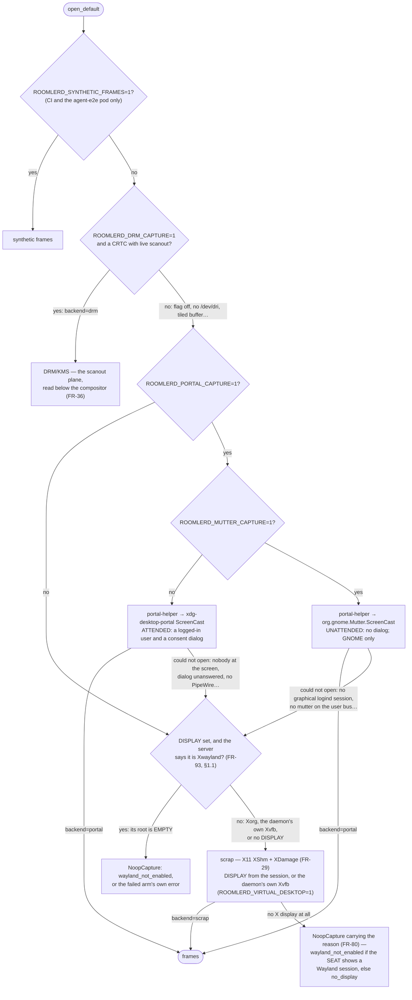
```mermaid
flowchart TD
    S([open_default]) --> SY{"ROOMLERD_SYNTHETIC_FRAMES=1?<br/>(CI and the agent-e2e pod only)"}
    SY -- yes --> SYN[synthetic frames]
    SY -- no --> D{"ROOMLERD_DRM_CAPTURE=1<br/>and a CRTC with live scanout?"}
    D -- "yes: backend=drm" --> DRM["DRM/KMS — the scanout plane,<br/>read below the compositor (FR-36)"]
    D -- "no: flag off, no /dev/dri, tiled buffer…" --> P{"ROOMLERD_PORTAL_CAPTURE=1?"}
    P -- no --> XW
    P -- yes --> PS{"ROOMLERD_MUTTER_CAPTURE=1?"}
    PS -- no --> PORT["portal-helper → xdg-desktop-portal ScreenCast<br/>ATTENDED: a logged-in user and a consent dialog"]
    PS -- yes --> MUT["portal-helper → org.gnome.Mutter.ScreenCast<br/>UNATTENDED: no dialog; GNOME only"]
    PORT -- "backend=portal" --> OK([frames])
    MUT -- "backend=portal" --> OK
    PORT -- "could not open: nobody at the screen,<br/>dialog unanswered, no PipeWire…" --> XW
    MUT -- "could not open: no graphical logind session,<br/>no mutter on the user bus…" --> XW
    XW{"DISPLAY set, and the server<br/>says it is Xwayland? (FR-93, §1.1)"}
    XW -- "yes: its root is EMPTY" --> W["NoopCapture: wayland_not_enabled,<br/>or the failed arm's own error"]
    XW -- "no: Xorg, the daemon's own Xvfb,<br/>or no DISPLAY" --> X
    X["scrap — X11 XShm + XDamage (FR-29)<br/>DISPLAY from the session, or the daemon's own Xvfb<br/>(ROOMLERD_VIRTUAL_DESKTOP=1)"] -- "backend=scrap" --> OK
    X -- "no X display at all" --> N["NoopCapture carrying the reason (FR-80) —<br/>wayland_not_enabled if the SEAT shows a<br/>Wayland session, else no_display"]
```

A per-user daemon in its own Wayland session, with no capture key set, runs
§1.2's automatic arm (mutter, else the portal) before this chart.

| Arm | Reads | Sees a locked screen / the greeter | Asks the person at the screen | Needs | Default | Gate |
|---|---|---|---|---|---|---|
| **DRM/KMS** (`drm_backend.rs`) | the primary CRTC's scanout framebuffer, via `/dev/dri/cardN` | **yes** — it reads below the compositor, so a lock screen is just more pixels | no | a real display controller with a live, linear-modifier scanout buffer | **off** | `ROOMLERD_DRM_CAPTURE=1` (`mod.rs:3435`) |
| **portal** (`portal/screencast.rs`) | a PipeWire stream the compositor publishes through `org.freedesktop.portal.ScreenCast` | **the greeter, no; a locked screen, per compositor** — mutter refuses to create *or restore* a screencast while locked, KWin keeps streaming its lock screen (§1.2) | **yes**, once; a restore token skips the dialog afterwards | an active `x11`/`wayland` logind session, `xdg-desktop-portal` + a backend for the compositor, PipeWire | **off**; automatic in a per-user Wayland session with no key where mutter is absent (§1.2) | `ROOMLERD_PORTAL_CAPTURE=1` (`mod.rs:3546`) |
| **mutter direct** (`portal/mutter.rs`) | the same kind of PipeWire stream, from `org.gnome.Mutter.ScreenCast` | no (a session API) | **no** | GNOME's mutter on the user's session bus; no portal backend required | **off**; automatic in a per-user GNOME Wayland session with no key (§1.2) | `ROOMLERD_PORTAL_CAPTURE=1` **and** `ROOMLERD_MUTTER_CAPTURE=1` (`portal/backend.rs:73`) |
| **scrap** (`scrap_backend.rs` + `x11_damage.rs`) | the X root window over XShm, with XDamage saying whether anything changed | X11: yes for whatever the X server shows; Wayland: nothing (Xwayland's root is empty), so since FR-93 scrap is never pointed at Xwayland (§1.1) | no | an X display: the session's `DISPLAY`, or the Xvfb the daemon starts itself | **on** — the last real arm | always tried (`mod.rs:3625`), after the Xwayland guard (`mod.rs:3591`) |

Two things about the order are deliberate and worth defending when the next
backend arrives:

- 🔑 **DRM stays first wherever a CRTC exists.** It needs no consent and sees a
  locked screen, so a host that *has* scanout must never be handed to an arm
  that asks. Measured on a host with both (FR-45 field log): DRM flag alone →
  `backend=drm`; both flags → **still `backend=drm`**; neither → the portal
  never engages (no helper spawned, no dialog).
- ⚠️ **DRM and the portal are opt-in, which is the inverse of this repo's usual
  kill-switch shape** — and for two different reasons. DRM reports no damage at
  all (`Damage::Unknown` on every frame), so defaulting it on where X11 works
  would undo FR-29's idle-CPU win (45.8 % → 2.8 % of a core on a static
  screen). The portal is **attended**: defaulting it on would leave an
  unattended host waiting on a consent dialog nobody will answer — a hang
  dressed up as a feature. Both arms therefore log **loudly** when the operator
  asked for them and they fell through (`mod.rs:3511`, `mod.rs:3561`), because
  silently serving X11 instead would look like the feature simply not working.
  Since FR-93 that error also travels: it becomes the session's `detail`
  (§1.1). And since FR-93 P2d-3 a per-user daemon in its own Wayland session,
  with no key set, switches the portal on by itself where mutter is absent
  (§1.2). There a person is signed in by definition, an unanswered request costs
  one dialog per host and ends at 120 s with a reason, and the viewer says it is
  waiting (§4.6, §4.7). A root daemon keeps both arms opt-in.

### 1.1 A Wayland desktop with nothing switched on (FR-93 P1)

Every Wayland arm above is opt-in, so a stock install on a Wayland desktop
reaches the bottom of the cascade. Before FR-93 it said something false there,
and a different false thing per install type. Measured on the FR-93 lab
(GNOME 50.1 on Ubuntu 26.04, the released 0.4.125):

| Install | What the viewer got | Why |
|---|---|---|
| per-user (`install.sh`'s default) | a **live black picture**: `backend=scrap`, content `lit=0.0 %`, no reason anywhere | the user unit's `DISPLAY` is Xwayland; XShm on it *opens*, and Xwayland's root window is empty |
| system (root) | *"This host has no display to capture (headless…)"*, `no_display`, while the guest's own screen showed GNOME and the companion banner | a systemd unit has none of the session's variables, and the classifier read the **daemon's** environment as if it described the **host** |

Two changes stop both:

- 🔑 **The Xwayland guard** (`mod.rs:3591`). Before scrap opens, the daemon
  asks the X server named by its `DISPLAY` whether it is Xwayland
  (`x_server_is_xwayland`, `mod.rs:2571`). There are two signals, the same two
  keep busy reads (FR-92): the `XWAYLAND` extension, which Xwayland has carried
  since 23.1, and before that its RandR monitors, all named `XWAYLAND<n>`. If
  it is Xwayland, scrap is refused, and the session gets a reason instead of
  black. The answer comes from the server, never from `XDG_SESSION_TYPE`, so a
  real Xorg and the daemon's own Xvfb are captured exactly as before.
- 🔑 **The seat, not the daemon's environment, decides "headless"**
  (`linux_no_pixels_code`, `mod.rs:2468`). When every arm has failed and the
  daemon has no display variables, logind is asked whether a graphical session
  is showing (`seat_kind`, `mod.rs:2552`, through
  `companion::graphical_session`). A Wayland session there means
  `wayland_not_enabled`. No session at all means `no_display`, and that is now
  true.

| The daemon sees | An arm the operator switched on failed? | → `code` | `detail` |
|---|---|---|---|
| `DISPLAY` is Xwayland | no | `wayland_not_enabled` | which display, and why XShm would be black |
| `DISPLAY` is Xwayland | yes | `backend_error` | that arm's own error (`drm_capture is on, but DRM capture could not open: …`) |
| no display variables; the seat shows Wayland | no | `wayland_not_enabled` | what was found (logind, or `WAYLAND_DISPLAY`), then X11's own words: on their own, "connection refused" reads like a network fault |
| no display variables; the seat shows Wayland | yes | `backend_error` | that arm's own error |
| no display variables; the seat shows **X11** (FR-113 P2, `x11_auto_system` on) | no | `x11_not_enabled` | what was found (*logind shows an X11 session on this seat, and this daemon has no display of its own*), then X11's own words |
| no display variables; the seat shows X11; `x11_auto_system = false` | — | `no_display` | scrap's own error: 0.4.143's verdict, which the kill switch gives back |
| no display variables; no graphical session | — | `no_display` | scrap's own error |
| a `DISPLAY` that is not Xwayland, which scrap could not open | — | `backend_error` | scrap's own error |

The `wayland_not_enabled` hint names the keys **this install** can use,
because only root can read the scanout or create a uinput device:

- a system daemon is told `drm_capture` + `uinput`;
- a per-user one is told `portal_capture`, plus `mutter_capture` on GNOME.

A failed arm is never told to "switch it on". It is already on, and its own
error is the useful sentence.

⚠️ **The probe dials Unix sockets only** (`x_server_query`, `mod.rs:2646`).
`x11rb::connect` falls back to TCP `localhost:6000+N` when the socket is
missing. Under WSL2's mirrored networking a localhost connect to a closed port
hangs instead of being refused, and systemd's `/tmp` handling there had hidden
WSLg's `X0` socket. Together, the first draft of this probe stalled **for over
a minute**, measured, in front of every capture open. Xwayland is a local
server, so a display reached over TCP is not probed at all. Locked by
`a_tcp_display_is_never_dialled`.

⚠️ **A rootful Xwayland is refused too**: one that draws a whole X desktop
inside a Wayland window (a nested session, `Xwayland -rootful`). The probe does
not tell the two modes apart, and the trade is deliberate. The rootless case is
every stock GNOME and KDE desktop; the rootful one is rare, and it gets a
sentence rather than a black stream. `wayland_aware = false` restores XShm
there.

**Kill switch**: `wayland_aware` / `ROOMLERD_WAYLAND_AWARE=0` (default on)
gives back the behaviour before FR-93 unchanged. The X server is not even
asked, and no session is told its input reach (`rc:input-reach`,
[`remote-control.md`](remote-control.md) §6.1), which P1 added with the guard
(`input/reach.rs:261`). Only the hello's brief (§1.3) still reads an Xwayland
that is already running: it is the fleet's count, not the session's behaviour.

⚠️ **Until P1a the switch left that warning on.** Measured on the FR-93 lab's
GNOME 50 per-user guest. The first two rows have `wayland_aware` and
`wayland_auto` both `false`:

| | 0.4.135, the release | P1a (`4d5890105`) |
|---|---|---|
| the capture | `backend=scrap` on Xwayland, black (lit 0 %), no reason: the lab's 0.4.125 baseline | the same |
| the viewer's input-reach warning | shown in 59 of 60 samples: *"…a Wayland desktop whose Xwayland sends XTest through the EI portal…"* | shown in 0 of 58; no `rc:input-reach` in the journal |
| `mutter_input = false` alone (the positive control) | — | mutter, lit 96 %, and the warning in 59 of 59: it still comes where input reaches nothing |
| no switch | mutter, AUTOMATIC, lit 95–97 % | the same, no warning |

CI proves the half it can run, against Xvfb in the X11 lane (`ci.yml`, the
"against a real X server" step):

- A server that is not Xwayland is captured. A control checks that the
  Unix-only path really reads the server's extensions (`XFIXES`), so a probe
  that never connected cannot pass by answering "no".
- An `XWAYLAND0` monitor that the test defines reads as Xwayland. This is the
  only place the pre-23.1 fallback runs at all, because the lab's GNOME 50
  carries the extension.

The Xwayland half itself is proven on the lab's GNOME guests (§6).

### 1.2 A per-user Wayland session switches itself on (FR-93 P2, decision D1)

From P2, one case is no longer opt-in. A **per-user** daemon whose own user is
signed in to an active **Wayland** session, with **no capture key set**,
switches capture on by itself before the cascade above runs:

- **mutter** (§5), where GNOME's own screencast answers on the session bus
  (P2a). It asks nobody, opens in milliseconds, and is the unattended peer of
  DRM.
- **the desktop portal** (§4), where mutter does not answer: KDE, and every
  other desktop with an `xdg-desktop-portal` ScreenCast backend (P2d-3). It is
  **attended**. The first session shows the person at the screen a dialog, and
  their answer is kept as a restore token, so later sessions open with no
  dialog.

`capture::wayland_plan` (`capture/mod.rs`) decides whether, as a pure function,
and the session's open decides which:

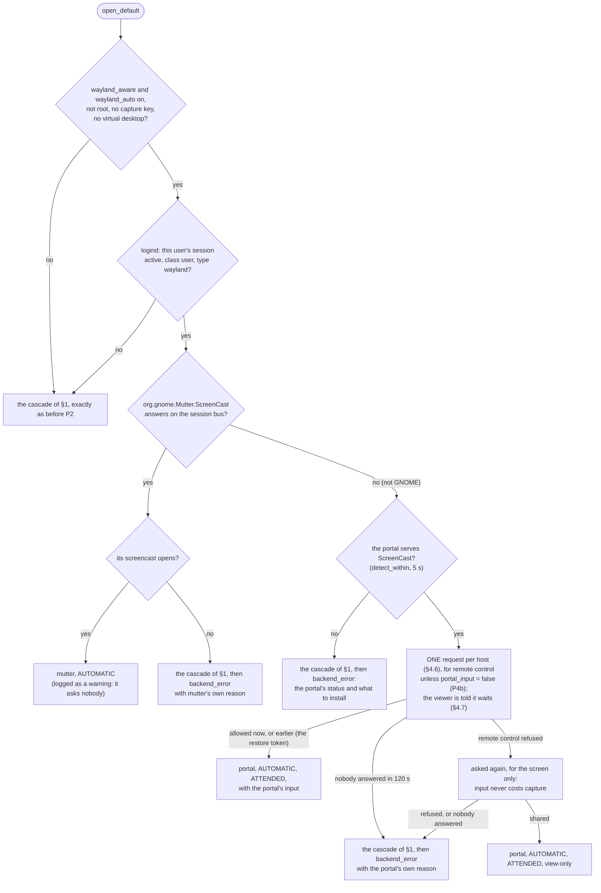
```mermaid
flowchart TD
    O([open_default]) --> K{"wayland_aware and wayland_auto on,<br/>not root, no capture key,<br/>no virtual desktop?"}
    K -- no --> C["the cascade of §1, exactly as before P2"]
    K -- yes --> S{"logind: this user's session<br/>active, class user, type wayland?"}
    S -- no --> C
    S -- yes --> M{"org.gnome.Mutter.ScreenCast<br/>answers on the session bus?"}
    M -- yes --> MO{"its screencast opens?"}
    MO -- yes --> MU["mutter, AUTOMATIC<br/>(logged as a warning: it asks nobody)"]
    MO -- no --> F["the cascade of §1, then backend_error<br/>with mutter's own reason"]
    M -- "no (not GNOME)" --> PD{"the portal serves ScreenCast?<br/>(detect_within, 5 s)"}
    PD -- no --> FP["the cascade of §1, then backend_error:<br/>the portal's status and what to install"]
    PD -- yes --> PR["ONE request per host (§4.6), for remote control<br/>unless portal_input = false (P4b);<br/>the viewer is told it waits (§4.7)"]
    PR -- "allowed now, or earlier (the restore token)" --> PO["portal, AUTOMATIC, ATTENDED,<br/>with the portal's input"]
    PR -- "nobody answered in 120 s" --> FR["the cascade of §1, then backend_error<br/>with the portal's own reason"]
    PR -- "remote control refused" --> PS["asked again, for the screen only:<br/>input never costs capture"]
    PS -- shared --> PV["portal, AUTOMATIC, ATTENDED, view-only"]
    PS -- "refused, or nobody answered" --> FR
```

⚠️ **The portal waited for P2d, although D1 asked for "the portal elsewhere" from
the start.** The lab ran it automatically on KDE (2026-10-11), before P2d, and
found three problems. Each has its fix:

| Before P2d | Fixed by |
|---|---|
| **A dialog storm.** The viewer's media watchdog re-creates a session that has shown no frames for 10 s, and every new session opened its own portal request: one more "Share screen with" dialog every 10–20 s, four stacked within a minute | P2d-1: one request per host, which a newer session joins (§4.6) |
| **A capture for nobody.** Answering a stale dialog late started a capture for a session already gone, with the desktop's sharing indicator on | P2d-1: the newest waiter takes the answer, and one whose session ended drops it (§4.6) |
| **Parked workers, then a dead daemon.** Each pending open held a runtime worker for up to `HANDSHAKE_DEADLINE` (120 s), and four of them starved a 4-core host until its watchdog killed the daemon | P2d-1: the open runs on the blocking pool (§4.6) |
| The viewer saw a blank canvas, re-created the session every 10 s, and an answer often reached a session already gone | P2d-2: `rc:media-waiting`, and a watchdog that waits until the dialog's deadline (§4.7) |

| | auto? | why |
|---|---|---|
| a per-user daemon in its own Wayland session, no capture key | **yes**: mutter, else the portal | D1's per-user half |
| a root (system) daemon, a person's Wayland session on screen, and that person can be told | **yes** (FR-95): DRM + uinput, **bound** to that session (§1.2.1) | D1's system half, from FR-95 |
| a root (system) daemon otherwise: the greeter on screen, or nobody to tell the person | no | DRM and uinput ask nobody and see the greeter and the lock screen, so they switch on by themselves only for a person who can see they are viewed and end it |
| any of `drm_capture`, `portal_capture`, `mutter_capture`, `window_capture` set, **to anything** | no | an explicit key always wins. `portal_capture = false` keeps the portal off, as before |
| `ROOMLERD_VIRTUAL_DESKTOP=1` | no | the daemon's own Xvfb is what it captures |
| X11, a tty only, nobody signed in, no logind | no | auto applies only where logind says Wayland, so an X11 host keeps FR-29's idle numbers byte for byte |
| `wayland_auto = false` or `wayland_aware = false` | no | the kill switches |

⚠️ **An automatic arm that fails reports `backend_error`, never
`wayland_not_enabled`.** The arm was switched on, by policy, so "switch it on"
would be the wrong sentence. That covers mutter that answered and still failed,
a portal that cannot capture this desktop (the detail names its status, such as
`portal-absent` or `no-screencast`, and what to install), and a person who did
not share (refused, or nobody answered within the request's 120 s). The detail
is the arm's own reason; a refusal's own words reach it since P2d-4 (§4.2),
and before that it read *"the portal helper exited before announcing a
stream"*. This is the same rule §1.1 gives an arm the operator
switched on. So since P2d-3 a per-user daemon in its own Wayland session reads
`wayland_not_enabled` only when the operator switched the automatic arm off
(the kill switch, or a capture key set), and its hint says how to give the
choice back.

⚠️ **Locked or not, both are tried.** What a locked session shows is the
compositor's to decide. **Measured on KDE** (Plasma 6.7): with a restore token,
a session opened while the screen is locked restores the screencast with no
dialog, and the viewer shows KDE's lock screen. The token survives it, and the
first session after the unlock opened with no dialog too. Not measured: mutter
on a locked GNOME session, and a locked KDE session with no token, whose dialog
would wait behind the lock screen.

**Measured** on the FR-93 lab's KDE guest (Plasma 6.7 on Fedora 44, a per-user
install, no capture key, no restore token), 2026-10-13:

| | 0.4.131, the release | P2d-3 (`ba6ab497f`) |
|---|---|---|
| the brief | `capture_arm=none` | `capture_arm=portal` |
| a session | `wayland_not_enabled` at once, with the old hint; no request, no dialog | **one** dialog, and the viewer told at +2 s that the host waits for the person (for up to 117 s) |
| the person answers, at +40 s | — | the picture in that session (`lit=81.7 %`), the pill "desktop portal · allowed at the screen", and the journal's `capture: backend=portal, AUTOMATIC` |
| the next session | — | the restore token: the capture 85 ms after the offer, no dialog |
| the screen locked | — | the token still restores: KDE's lock screen at +4 s, no dialog |
| after the unlock | — | the token still opens the session, no dialog |
| `wayland_auto = false` | — | `wayland_not_enabled` again, now with the hint that names `roomler config clear wayland_auto`; no request, no dialog |
| GNOME 50 per-user, the same build | — | mutter still first: "GNOME screencast · asks nobody", `lit=90.0 %`, no portal request |

⚠️ **Input follows on both automatic arms.** From P4 the automatic mutter arm
is driven by mutter's own RemoteDesktop, which takes the viewer's mouse and
keyboard and asks nobody (§5.2; kill switch `mutter_input`). From P4b
(operator, 2026-10-13) the automatic portal's one dialog asks for **remote
control**, seeing and controlling, unless `portal_input = false`
(`capture::auto_portal_input`). Nothing was granted there before, so the first
dialog may as well ask for both. A configured `portal_capture` keeps input
opt-in, because there a screen share may already be granted and would be asked
again (§4.3).

- **KDE's dialog** is titled *Remote Control* and names both privileges: *See
  what's on the screen* and *Control input devices*. *Allow restoring* comes
  ticked, and the answer is restored like a screen share's, from its own token
  (`portal-restore-token-rd`).
- **A person who refuses remote control is asked again, for the screen only**,
  and a session they share runs view-only: input never costs capture (§4.3).
  The refusal is not remembered, so the next session asks for remote control
  again. `portal_input = false` makes the arm a screen share for good.

**Measured** on the lab's KDE guest (Plasma 6.7 on Fedora 44, a per-user
install, no capture key), 2026-10-13, by the AC4 oracle of §5.2 and a typing
stress: 112 keystrokes, 40 of them the second of a doubled letter, typed at the
oracle's 80 ms into the probe's focused text entry. The two candidates differ
only in how the helper sends its calls (§4.3):

| | calls unawaited (`fe0c3ae93`) | calls awaited (`9a8e20699`, then `64f00509f`) |
|---|---|---|
| the dialog | *Remote Control*: see the screen, control input devices | the same |
| the next session | the restore token, no dialog | the same |
| AC4 oracle: three pointer targets, a click, a wheel notch down, "hello 123", Shift+A | passed once, then typed `helo 123A` | **7/7, three times** |
| typing stress, the entry's text | **41 of 452 characters wrong** over four runs (10, 17, 6, 8), KDE's input method on or off | **all 113 exact, four runs** |
| one call, event to reply | not waited for | 0.5 ms median, under 4 ms at p99 |
| the person denies remote control | — | KDE asks again, for the screen only; shared, the session runs view-only and its reach banner says to reconnect and allow remote control. The next session asks for remote control again |

The two awaited builds differ only by a refactor (`Target::delivery`). The lab
built each candidate before the branch was rebased onto master; the commits
named carry the same diffs.

The wheel notch went down only after the helper corrected KDE's negated smooth
scroll (§4.3).

⚠️ **The recorder asks too.** `roomler record` opens the same cascade in its own
process (FR-85), so on KDE the person at the console is asked once for their
own recording. The broker is per process, so a viewer's pending request and a
recording started at the same moment are two dialogs.

**Sized before the flip (P2b's counts, prod, 2026-10-13).** 14 Linux devices
sent a desktop brief. The only per-user Wayland hosts with no arm were this
lab's KDE guests. The flip therefore changed no customer device on the day; it
is for the installs to come, on KDE and the rest.

The arm is on the wire: `rc:video-info` carries `capture_arm` (`drm`, `mutter`,
`portal` or `x11`) and `attended` (`true` only for the portal). Both are absent
from Windows, macOS and older agents.

**Kill switch**: `wayland_auto` / `ROOMLERD_WAYLAND_AUTO=0` (default on) gives
back the behaviour before P2.

#### 1.2.1 A system install switches itself on, for a person it can tell (FR-95 P2)

From FR-95 a **root** (system) daemon switches capture on by itself too, on
narrower terms than the per-user half, because both of its arms ask nobody:
DRM reads the scanout below the compositor, and `uinput` injects below it.
FR-36 measured what that means: the greeter's capture holds its password
field, and the lock screen's holds its unlock dialog. So a system install
switches DRM and `uinput` on by itself only when all of these hold:

- **No capture key is set.** Any of the four takes the choice back, and
  `drm_capture = true` also reads the greeter and the lock screen, as before.
  `uinput` set either way also keeps the automatic input off: `true` is the
  configured path, `false` keeps an automatic capture view-only.
- **The seat shows a person's Wayland session** (logind class `user`), locked
  or not. Never the greeter. From FR-113 an X11 session counts too (§1.2.2).
- **That person can be told.** This is checked live at every open
  (`indicator::notify::can_tell`): the desktop companion runs for them, or
  their session's notification server shows buttons. That is FR-93 P6g's
  notice: the companion's banner, else a critical notification, *This screen
  is being viewed*, with **Disconnect**. Since #2531 the banner counts only
  once the companion has read the session from the daemon within 6 s, else
  the notification goes up ([`desktop-companion.md`](desktop-companion.md) §12.5).

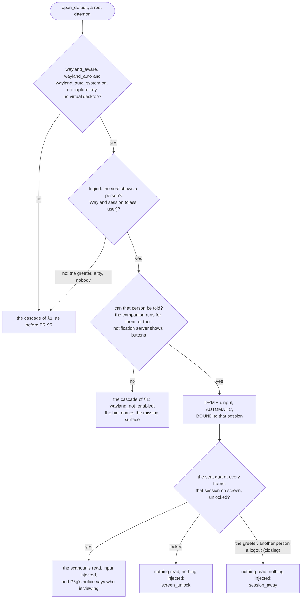
```mermaid
flowchart TD
    O([open_default, a root daemon]) --> K{"wayland_aware, wayland_auto and<br/>wayland_auto_system on, no capture key,<br/>no virtual desktop?"}
    K -- no --> C["the cascade of §1, as before FR-95"]
    K -- yes --> P{"logind: the seat shows a person's<br/>Wayland session (class user)?"}
    P -- "no: the greeter, a tty, nobody" --> C
    P -- yes --> T{"can that person be told?<br/>the companion runs for them, or their<br/>notification server shows buttons"}
    T -- no --> N["the cascade of §1: wayland_not_enabled,<br/>the hint names the missing surface"]
    T -- yes --> D["DRM + uinput, AUTOMATIC,<br/>BOUND to that session"]
    D --> G{"the seat guard, every frame:<br/>that session on screen, unlocked?"}
    G -- yes --> R["the scanout is read, input injected,<br/>and P6g's notice says who is viewing"]
    G -- locked --> W1["nothing read, nothing injected:<br/>screen_unlock"]
    G -- "the greeter, another person,<br/>a logout (closing)" --> W2["nothing read, nothing injected:<br/>session_away"]
```

The capture is **bound** to the session that was on screen when it opened
(`capture/seat_guard.rs`). The guard watches logind's D-Bus for the seat's
active session, its `LockedHint` and its `State`. It reads `PropertiesChanged` as it
arrives, and reads the seat again every second anyway. A capture whose guard
is closed asks the DRM worker for nothing (`DrmCapture::guarded`), so the
greeter's and the lock screen's pixels never leave the card. The controller is
told `screen_unlock` or `session_away`, in a system install's own words.

⚠️ **A logout is away from the moment logind marks the session `closing`**
(FR-113 P4). logind keeps a logged-out session as the seat's active one,
class `user`, unlocked, until every process in it has ended, and that can take
until systemd's stop timeout. **Measured** (FR-113 AC3, 0.4.144, GDM on Xorg
with auto-login, 2026-10-19): GDM's own session worker ignored SIGTERM, so
the seat showed no greeter for **90 s** after `loginctl terminate-session`,
while the X server was gone at once. A guard that read only the id, the class
and `LockedHint` stayed open. The DRM capture kept reading the bare scanout
(`frames_captured` 72 → 144), and the viewer showed a black screen with
nothing said. Read with `State`, the same logout is `session_away`.

⚠️ **Input follows the guard, and never falls back to XTest behind a lock.**
The automatic `uinput` is the injector whenever an automatic capture is
**alive** (`capture::seat_guard::live`), locked or not, and it injects only
while one **views** a person's unlocked session (`seat_guard::viewing`),
dropping every event otherwise. The input arbiter swaps it in when such a
capture starts, and swaps it out only once no such capture is left and the
seat no longer shows a Wayland desktop (or, FR-113, an X11 one while
`x11_auto_system` is on: `capture::automatic_seat_kind`). It never does so for a lock: what
would replace it is enigo, whose XTest reaches Xwayland windows behind the lock
screen. **Measured** (the lab's KDE system guest, 2026-10-15): with the input
chosen on "views" alone, a viewer's first move during a lock opened enigo.
Chosen on "alive", the same move opened the automatic `uinput`, which said
*dropping input while the person's session is not on screen, unlocked*, and
the first move after the unlock said *injecting again*.

⚠️ **Bound to a session, not a user.** A second login of the same person is a
different session, told nothing. So after a user switch the capture reads
`session_away` until the person who was told is back. A new viewer session
plans again, and tells whoever is then on screen.

⚠️ **Fail closed.** A seat reading older than five seconds (the watcher died,
logind went away) closes the guard, and so does a seat logind cannot vouch
for.

**Kill switch**: `wayland_auto_system` / `ROOMLERD_WAYLAND_AUTO_SYSTEM=0`
(default on) gives back the system half before FR-95. `wayland_auto = false`
turns it off too. `ROOMLERD_VIEWING_NOTICE=0` leaves no way to tell the person,
so a system install then switches nothing on, and its hint says why.

#### 1.2.2 The same for an X11 seat (FR-113 P1)

A systemd unit carries none of an X11 session's variables (`DISPLAY`,
`XAUTHORITY`, §1), so before FR-113 a system install on an X11 desktop showed
nothing: the plan above engaged only for a Wayland session, the X11 arm could
not open the display, and the viewer read *headless* (`no_display`, #2450).
From FR-113 the same plan covers a person's **X11** session on screen, on the
same terms, under its own switch:

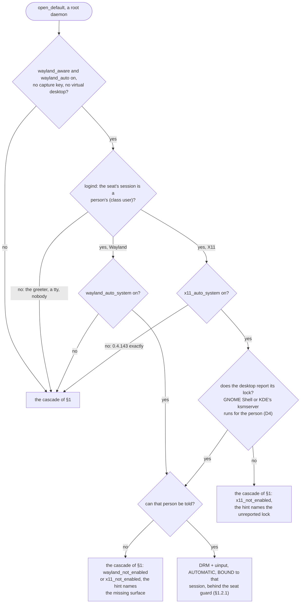
```mermaid
flowchart TD
    O([open_default, a root daemon]) --> K{"wayland_aware and wayland_auto on,<br/>no capture key, no virtual desktop?"}
    K -- no --> C["the cascade of §1"]
    K -- yes --> P{"logind: the seat's session is a<br/>person's (class user)?"}
    P -- "no: the greeter, a tty, nobody" --> C
    P -- "yes, Wayland" --> W{"wayland_auto_system on?"}
    P -- "yes, X11" --> X{"x11_auto_system on?"}
    W -- no --> C
    X -- "no: 0.4.143 exactly" --> C
    W -- yes --> T{"can that person be told?"}
    X -- yes --> L{"does the desktop report its lock?<br/>GNOME Shell or KDE's ksmserver<br/>runs for the person (D4)"}
    L -- no --> U["the cascade of §1: x11_not_enabled,<br/>the hint names the unreported lock"]
    L -- yes --> T
    T -- no --> N["the cascade of §1: wayland_not_enabled<br/>or x11_not_enabled, the hint names<br/>the missing surface"]
    T -- yes --> D["DRM + uinput, AUTOMATIC, BOUND to that<br/>session, behind the seat guard (§1.2.1)"]
```

| | Wayland seat (FR-95) | X11 seat (FR-113) |
|---|---|---|
| the plan | `system_plan`, `wayland_auto_system` | the same function, `x11_auto_system` (`AutoKinds`) |
| who counts | `person_on_screen`: logind class `user`, `Type=wayland` | the same, `Type=x11` |
| capture | DRM: the scanout, below the compositor | DRM: the scanout, below the X server. Neither `DISPLAY` nor an Xauthority is needed, which a root daemon has neither of |
| input | `uinput`, below the compositor | `uinput`: Xorg picks the device up through libinput, as a compositor does |
| the seat guard | logind: the session id, its class, `LockedHint`, `State` (a `closing` session is away, FR-113 P4) | unchanged: it reads only logind, so the plan switches on only for a desktop that sets `LockedHint`: GNOME Shell or KDE's `ksmserver` running for the person (`lock_reporting_shell`, D4) |
| an idle desktop | the compositor flips: buffer + 32 rows (§3.2) | the X server draws in place: rows alone, one every 8 (§3.2) |
| nothing captured | `wayland_not_enabled` | `x11_not_enabled` (FR-113 P2) |

⚠️ **The guard knows a lock only by `LockedHint`, so an X11 desktop must
report it (D4).** GNOME Shell sets it on Xorg as on Wayland, and KDE's
`ksmserver` drives kscreenlocker, which sets it. **Measured** (FR-113 AC2,
2026-10-19): on Ubuntu 24.04's Plasma 5.27 X11 session under SDDM,
`kscreenlocker_greet` set `LockedHint=yes` within 1 s of
`loginctl lock-session`, and cleared it on `unlock-session`. Most other X11 lockers do
not: xscreensaver, i3lock, slock, and xfce4-screensaver (measured on
Ubuntu 24.04's 4.18.3: `LockedHint` stayed `no` through
`loginctl lock-session`). With one of
those, the guard would read the lock screen, and the automatic `uinput`
would type into its password field. So the X11 half switches on only where
`gnome-shell` or `ksmserver` runs as the person (`lock_reporting_shell`,
read from `/proc`, because logind's `Desktop` is empty for GDM's
auto-login session). Any other X11 desktop is refused before the surface
is probed, with `x11_not_enabled` and a hint that offers the explicit keys,
which read the lock screen by the operator's own choice. An unreadable
`/proc` counts as "no".

**Kill switch**: `x11_auto_system` / `ROOMLERD_X11_AUTO_SYSTEM=0` (default on)
gives back 0.4.143 exactly: no plan for an X11 seat, its DRM read every frame,
and `no_display`. `wayland_auto = false` turns it off too. The two system
halves are independent: either switch leaves the other kind's seats alone.

### 1.3 What a device reports, and the fleet's count (FR-93 P2b)

A Linux daemon tells the server which desktop it would show a controller now, and
what would capture it. An exec sweep cannot answer "how many hosts are Wayland,
and which arm serves each": a sweep reaches only the devices that are online.
The server can, because every device says it in its hello.

The hello's caps carry `desktop` (`crates/remote_control/src/models.rs:1419`),
all strings, so a newer agent's word reaches an older server as a word:

| field | values | from |
|---|---|---|
| `session` | `user` · `greeter` · `lock-screen` · `none` | logind's class for the session a controller would see. A root daemon sees the seat: a person's session first, else the greeter. A per-user daemon sees only its own user's sessions. A tty or an SSH login is no desktop |
| `type` | `wayland` · `x11` · `tty` · `none` | that session's type |
| `desktop` | `gnome`, `KDE`, … (absent when logind names none) | logind's `Desktop` |
| `capture_arm` | `mutter` · `drm` · `portal` · `x11` · `none` | the arm a session opened **now** would try first |
| `input_reach` | `full` · `xwayland_only` · `none` | the `rc:input-reach` verdict (`input/reach.rs:291`), with the portal's input route predicted for a portal or mutter arm with `portal_input` on. ⚠️ **It never starts an X server.** GNOME starts Xwayland **on demand** for any client that connects, so on a Wayland desktop the brief connects only to an Xwayland already running (found in `/proc`), and with none it reads "no X server". It is also read again only when another field changed. The per-session `rc:input-reach` stays the authority |

`capture_arm` is `capture::planned_arm` (`capture/mod.rs:1581`), a pure function
that walks `open_with`'s own order (`:3215`). The two sit together in one file
because they must not drift:

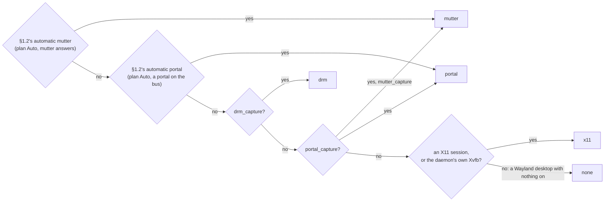
```mermaid
flowchart LR
    A{"§1.2's automatic mutter<br/>(plan Auto, mutter answers)"} -- yes --> MU[mutter]
    A -- no --> AP{"§1.2's automatic portal<br/>(plan Auto, a portal on the bus)"}
    AP -- yes --> PO
    AP -- no --> D{drm_capture?}
    D -- yes --> DRM[drm]
    D -- no --> P{portal_capture?}
    P -- "yes, mutter_capture" --> MU
    P -- yes --> PO[portal]
    P -- no --> X{"an X11 session,<br/>or the daemon's own Xvfb?"}
    X -- yes --> X11[x11]
    X -- "no: a Wayland desktop with nothing on" --> N[none]
```

⚠️ **A plan, not a promise.** An arm that fails at session time falls through,
and that session's `rc:video-info` names what actually served it (§1.2). The
brief answers what the fleet is configured to do. The session answers what
happened.

⚠️ **The brief never starts the portal.** It asks the bus daemon whether
`org.freedesktop.portal.Desktop` has an owner or is installed to start on demand
(`portal::reachable`), and the bus daemon activates nothing for either question.
So the brief cannot see whether a ScreenCast backend serves it: a desktop whose
portal serves none reads `portal` in the brief and `backend_error` in a session,
whose own open asks the portal itself (`portal::detect_within`). Introspecting
the portal every minute would start it on every host that does not run it.

⚠️ **logind never runs on the signalling path.** `loginctl` is a subprocess, and
a wedged logind must not stall the hello. A `desktop-brief` thread
(`desktop_brief.rs:130`) reads it every 60 s into a cache. The hello and the
heartbeat only read that cache (`agents/roomlerd/src/signaling.rs:7152`). A changed brief (a login, a
logout, the greeter) re-announces the caps on the next heartbeat (`:2687`).
Until the first read lands, which is milliseconds after start, the hello
carries none.

The brief rides `agents.capabilities`, so the device listing returns it with no
server change. The count is one aggregate (`crates/api/src/routes/stats.rs:357`),
grouped by `type` and `capture_arm`, with `total` and `online`:

| route | scope |
|---|---|
| `GET /api/tenant/{tid}/stats/overview` → `desktops` | the org, for any member |
| `GET /api/admin/stats/orgs` → `desktops` | the whole fleet, for a platform admin: the denominator a field check after a roll needs |

A device that never sent a brief (Windows, macOS, an agent older than P2b) is not
counted. `machines.total` beside it says how many devices there are.

## 2. The X11 arm, and the virtual desktop

`scrap` on Linux is XShm: a full-screen `GetImage` per frame, which XShm cannot
tell you was unnecessary. FR-29 bolted an XDamage listener beside it
(`agents/roomlerd/src/capture/x11_damage.rs`) so an unchanged screen produces
*no frame* and the pump idles; a forced grab every second bounds the failure
mode of a missed damage event at a stale tile rather than a frozen stream.

On a host with no X session at all — a headless server, a container, **WSL2**
(WSLg's rootless XWayland root has no readable framebuffer, so `XGetImage`
fails) — the daemon can bring up its **own** display:
`ROOMLERD_VIRTUAL_DESKTOP=1` (`agents/roomlerd/src/app.rs:3660`,
`virtual_desktop.rs:2261`) starts an X server at
`ROOMLERD_VIRTUAL_DESKTOP_RESOLUTION` (default `1920x1080`) — Xorg with the
dummy driver where it is installed, so a viewer's size can become the mode
(FR-108 P2, `docs/display-match.md`), else Xvfb — with the window manager named by
`ROOMLERD_VIRTUAL_DESKTOP_WM` (default `openbox`) and the comma-separated
`ROOMLERD_VIRTUAL_DESKTOP_STARTUP` apps, points `DISPLAY` at it before the caps
probe and every capture, and captures it with the unchanged scrap + damage
path. This is the hardware-encode test bed on the WSL2 dev host, and the
remote-apps surface of FR-56 rides on it.

⚠️ **Through 0.4.209, on a host with NVIDIA's userspace driver, Xvfb did not
survive its own start** ([#3643](https://github.com/gjovanov/roomler-ai/issues/3643)):
NVIDIA's EGL, loaded into the server, aborted it within seconds, and the daemon
went on advertising the desktop. The daemon now starts the server with Mesa's
EGL vendor and supervises it: [§2.2](#22-the-desktop-is-supervised-3643). A
device on 0.4.209 or older needs a wrapper ahead of `/usr/bin/Xvfb` on the
daemon's `PATH`:

```sh
#!/bin/sh
export __EGL_VENDOR_LIBRARY_FILENAMES=/usr/share/glvnd/egl_vendor.d/50_mesa.json
exec /usr/bin/Xvfb "$@"
```

A container that mounts only the driver's compute libraries (the rented DGX
Spark of FR-122) has no NVIDIA EGL and was never affected. The Xorg
dummy-driver path gets the same EGL vendor; it ran on such a host for the first
time in §2.2's field run.

⚠️ **A startup app can map before the window manager is listening.** `start`
launches the WM and the apps back to back, and a window that maps while openbox
is still starting stays unmapped, with no `WM_STATE`, until X traffic next wakes
openbox. The root stays black and so does every session. A rented DGX Spark's
first session came up that way (FR-122 §8). Measured on Xvfb: apps launched
50 ms after openbox stayed unmapped in 30 runs of 30, and waiting for the WM's
`_NET_SUPPORTING_WM_CHECK` first was no cure (22 of 25), because openbox sets it
as its startup begins. So `start` nudges the WM for 8 s after the apps launch:
it sets and finally deletes a root property, `_ROOMLER_WM_NUDGE`, and every
window manager listens to root property changes (`WM_NUDGE_AT_MS` in
`virtual_desktop.rs`; none left unmapped in 75 runs). The CI Xvfb lane proves
the nudge reaches a root listener (`virtual_desktop::wm_nudge_tests`).

The children are spawned into their **own process group**, and on any graceful
exit the daemon tears the whole tree down —
`virtual_desktop::teardown` — SIGTERM → 2 s grace → SIGKILL, reaching
every descendant including a setsid'd grandchild (`at-spi-bus-launcher`, a D-Bus
service that **ignores SIGTERM**) via the parent-link closure of the daemon's
direct children. Without it, under systemd `KillMode=control-group` that
grandchild held the unit's cgroup non-empty until systemd's `TimeoutStopSec`
(90 s) SIGKILLed it, so `roomler restart` took 96 s (#1684). See
[`desktop-companion.md` §7](desktop-companion.md#7-apply-now--restarting-the-service-from-the-companion).
A parent link only leads to such a grandchild while its parent lives, so the
window manager and the apps are started by **the desktop's keeper**
(`roomlerd vd-keeper`, [§2.3](#23-the-desktops-keeper-3665)), which adopts
what they leave behind and collects whatever exits.

⚠️ **A virtual-desktop host is not a consent surface**, even though its X
display connects: the only viewer of that Xvfb is a remote controller, so the
native consent panel would be drawn where nobody can see it (`indicator/x11.rs:203`
reads the daemon's own `ROOMLERD_VIRTUAL_DESKTOP` and declines). Detail in
[`remote-control.md` §11.2](remote-control.md#112-consent).

### 2.1 The pointer (FR-97 P3a)

X11 draws the pointer as a sprite over the framebuffer, so an XShm frame never
carries it. Until P3a the cursor channel said nothing on this arm, and the
viewer drew a stand-in at the controller's own mouse. Now the capture worker
reads the pointer from XFixes, on a connection of its own, and publishes it in
the slot the DRM arm's cursor plane uses (§3.1). The channel's tracker sends it
from there with no change of its own
(`agents/roomlerd/src/capture/x11_cursor.rs`):

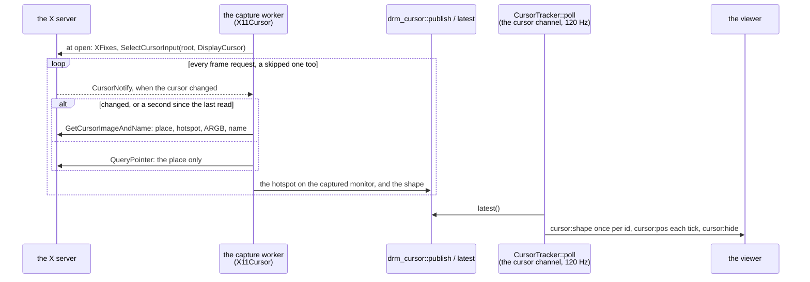
```mermaid
sequenceDiagram
    participant X as the X server
    participant W as the capture worker<br/>(X11Cursor)
    participant S as drm_cursor::publish / latest
    participant T as CursorTracker::poll<br/>(the cursor channel, 120 Hz)
    participant V as the viewer
    W->>X: at open: XFixes, SelectCursorInput(root, DisplayCursor)
    loop every frame request, a skipped one too
        X-->>W: CursorNotify, when the cursor changed
        alt changed, or a second since the last read
            W->>X: GetCursorImageAndName: place, hotspot, ARGB, name
        else
            W->>X: QueryPointer: the place only
        end
        W->>S: the hotspot on the captured monitor, and the shape
    end
    T->>S: latest()
    T->>V: cursor:shape once per id, cursor:pos each tick, cursor:hide
```

| | What | Why |
|---|---|---|
| when | every frame request, before the damage check can skip the frame | a pointer moving over a still desktop damages nothing, and must still move on the viewer's side |
| the shape | read on `CursorNotify`, and at least every second | otherwise one small `QueryPointer` a frame: a 64×64 image every frame would be 16 KB a request |
| the image | premultiplied ARGB, straightened and cropped by the DRM arm's own conversion (`straighten_and_crop`) | the wire wants straight alpha, and a theme's image is padded |
| the place | the hotspot less the captured monitor's origin on the root window | the viewer draws the image at the place less the hotspot (§3.1) |
| a name | the CSS keyword for the names themes give their standard cursors: `left_ptr` is `default`, `xterm` is `text`, `hand2` is `pointer` | the viewer shows its own native cursor for one, as for the Windows tracker's stock cursors |
| an invisible cursor | `cursor:hide` | an app hides the pointer with a fully transparent cursor, and FR-109's relative mouse waits for exactly that |

**Kill switch**: `ROOMLERD_X11_CURSOR=0` opens no XFixes connection and
publishes nothing. The viewer draws its stand-in, as before P3a.

**Field** (FR-97 §8, 2026-10-19): a per-user install on GNOME 46 over Xorg,
the production viewer putting the pointer at three places on a 1280×800
picture:

| | 0.4.145 | the P3a candidate | the candidate, `ROOMLERD_X11_CURSOR=0` |
|---|---|---|---|
| the cursor channel | one `cursor:hide`, nothing else | one `cursor:shape` (18×24, `css: default`), then `cursor:pos` | one `cursor:hide`, nothing else |
| the pointer at (0.25, 0.25), (0.75, 0.6), (0.5, 0.5) | — | (320, 200), (959, 479), (640, 400) | — |

### 2.2 The desktop is supervised (#3643)

The X server is one process, and until 0.4.209 the daemon took its start for
its life: once the server's socket existed, the desktop was "up" for as long as
the daemon ran. On an AWS g5g (NVIDIA T4G, driver 595.112.07, Mesa 25.2.8) the
server aborted within eleven seconds of every start. The device went on
offering a desktop, every session connected and showed nothing, and the server
and the window manager stayed under the daemon as zombies (0.4.208 and 0.4.209,
FR-122 §8). `agents/roomlerd/src/virtual_desktop.rs` now holds five rules:

| Rule | What it means | Where |
|---|---|---|
| **No hardware vendor's EGL inside the server** | The server is a software framebuffer. The crashed one had NVIDIA's EGL mapped beside Mesa's DRI shim and had aborted with `double free or corruption (out)`. The likely path, read from those mappings: its GLX goes through the shim, the shim lists its configurations through EGL, and glvnd hands that call to the first vendor file it finds, which is NVIDIA's `10_nvidia.json`, ahead of `50_mesa.json`. Installing Mesa's EGL beside NVIDIA's changed nothing, and neither did `__GLX_VENDOR_LIBRARY_NAME`. So Xvfb and Xorg are both started with `__EGL_VENDOR_LIBRARY_FILENAMES` naming Mesa's vendor file and nothing else. On a host that has vendor files and none of Mesa's (the g5g's image as shipped) that is Mesa's usual path, which is not there: with no vendor at all the server starts and still lists GLX. A host with no vendor file where glvnd looks by default is left as it was. The window manager and the apps are clients and are not pinned | `egl_vendor_pin` `:2750` |
| **"Up" means it answers, and it is ours** | The start waits until the server answers an X11 connection setup, for 15 s at most, and fails at once when the server exits. A socket is not enough: the server makes it before it initialises its extensions, which is where the g5g's died. An answer is not enough either: the display keeps its number, so another server can be on it between two of ours, and the display's lock has to name this server before its answer counts. Xvfb now runs with `-noreset`, as Xorg already did, so that this first client leaving does not reset the server | `wait_display_ready` `:3197`, `x_answers` `:2945`, `xvfb_args` `:3078` |
| **Its exit is noticed, and it comes back** | A thread waits for the server's exit, takes the rest of the tree down, clears the lock a killed server leaves behind, and starts the desktop again on the **same display**, since `DISPLAY` is exported once. The delay is 1 s after an exit, and doubles with every start that fails or lasts under a minute, up to 5 min. The desktop's keeper (§2.3) is waited for with the server, and its exit takes the desktop down and brings it back the same way | `supervise` `:2307`, `Backoff` `:2437`, `remove_stale_lock` `:2691`, `wait_desktop_exit` `:2530` |
| **Its last words are kept** | The server's stderr used to go to `/dev/null`. Its last 4 KiB now reach the daemon log when it exits or does not come up (`said=…`), beside how it ended (`signal 6 (aborted), core dumped`). They stay in the log: the reason a controller is shown never carries them | `StderrTail` `:2811`, `wait_exit` `:2587` |
| **A broken desktop never stops the daemon** | Missing binaries, or a server that will not come up, used to end the daemon's start, and with it the machine's overlay and SSH. The daemon now runs without a desktop, says why, and keeps trying: installing the missing package is enough, with no restart. What a broken desktop can still cost is time, once: the first start is waited for, 15 s a server at most | `start` `:2261` |

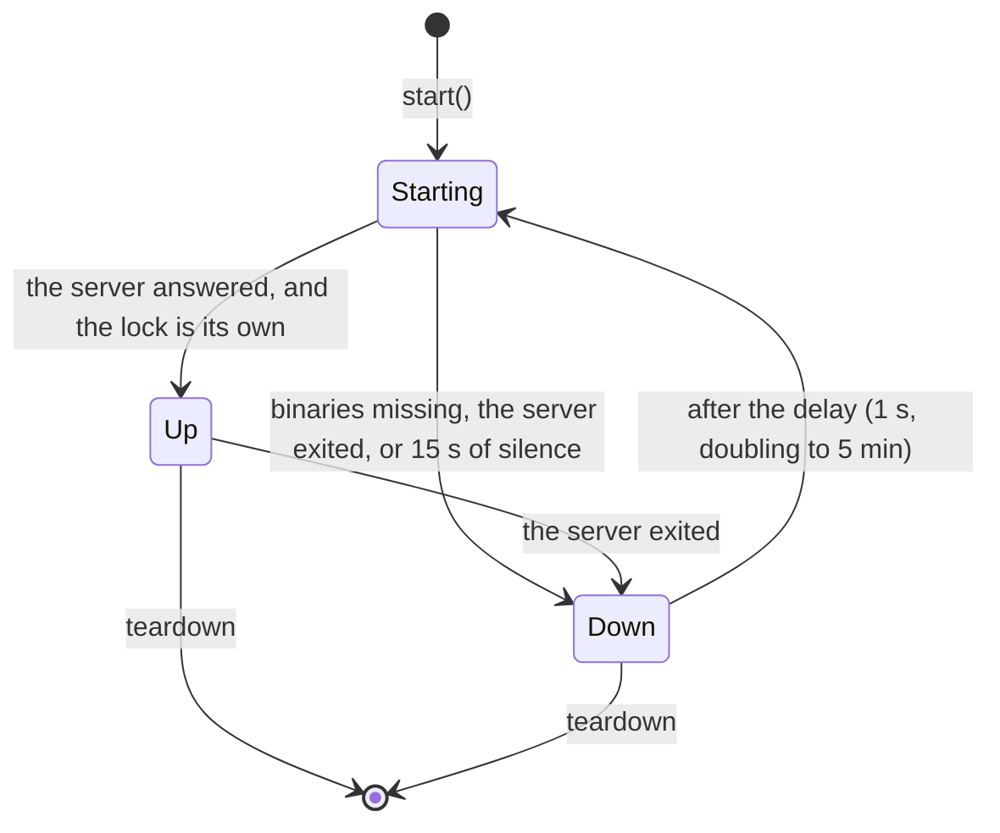
```mermaid
stateDiagram-v2
    [*] --> Starting: start()
    Starting --> Up: the server answered, and the lock is its own
    Starting --> Down: binaries missing, the server exited, or 15 s of silence
    Up --> Down: the server exited
    Down --> Starting: after the delay (1 s, doubling to 5 min)
    Up --> [*]: teardown
    Down --> [*]: teardown
```

**While the desktop is down, the device does not offer it.**
`virtual_desktop::down` (`:294`) carries the reason. The capture plan drops the
X11 arm (`arm_facts`, `capture/mod.rs:1709`), and the supervisor wakes the
brief's refresher (`refresh_soon`, `desktop_brief.rs:53`), so the hello's
`desktop` reads `capture_arm: none` at the next heartbeat instead of up to a
minute later. A session opened meanwhile is refused with `backend_error` and
the agent's own words (`capture/mod.rs:3614`), for example: *this device's
virtual desktop is down: its X server (Xvfb) exited: signal 6 (aborted), core
dumped. The daemon starts it again by itself; reconnect in a moment.* Display
match treats the desktop as the daemon's own all the while
(`virtual_desktop::active`), so a server that restarts is never read as a
person coming back to the screen.

⚠️ **The supervisor waits for the server without reaping it**
(`waitid(WNOWAIT)`; since #3665 one `waitid(P_PGID, <server>, WEXITED | WNOWAIT)`
for the server and the desktop's keeper together, `wait_desktop_exit`, never
`P_ALL`: the daemon's other children keep their statuses for their own
waiters). The dead server keeps its pid, and the
desktop's process group id with it, until `kill_tree_with` (`:916`) has sent
its last signal: rule 1 of the teardown below. `Child::wait` would free both
numbers while the window manager is still to be signalled through them. And
every child is spawned and recorded under the one lock that a graceful exit
sets `stopping` under (`spawn_server` `:1460`), so `teardown` either kills a
child or the child is never started.

⚠️ **A stop is told from an exit by time, never by a signal listener**
(#3671). The service manager signals every process of the unit at once, so
the X server can exit before the daemon's own teardown reaches the desktop.
The supervisor therefore waits a stop grace after any exit before it tells or
takes anything down (§2.4). A `SIGTERM` listener made when the desktop starts
would answer at once, but tokio installs the process's handler for good at
the first listener, and one made then would come before the run loop's own:
a `SIGTERM` landing between the two would be swallowed, and the daemon would
run on. `terminate_signal` (`agents/roomlerd/src/app.rs:3743`) is the daemon's
only one (`STOP_GRACE`'s comment, `agents/roomlerd/src/virtual_desktop.rs:1087-1093`).

**Xorg's directory is made, never adopted** (`private_dir` `:2985`). It
sits under the temp directory, so it is created with mode 0700 in one step and
reused only when it already is this user's own and closed to everyone else;
anything else found at its path is removed first, and no step follows a link.
It is kept from one start to the next, so a crashed server's log is still
there afterwards, as Xorg's own `Xorg.log.old`.

**To choose the server's EGL vendor yourself**, set
`__EGL_VENDOR_LIBRARY_FILENAMES` or `__EGL_VENDOR_LIBRARY_DIRS` in the daemon's
own environment (a systemd drop-in). The daemon then leaves the server's
environment as it is.

**Not covered.**

- A server that hangs but stays alive: only its exit is watched.
- Where the desktop's keeper does not run (§2.3, *When the daemon starts the
  clients itself*), the window manager's or an app's own exit and a
  descendant that left the desktop's process group (`setsid`) and whose parent
  died are as they were before [#3665](https://github.com/gjovanov/roomler-ai/issues/3665):
  one that exits stays uncollected until the server next exits or the daemon
  stops, and such a descendant is out of the teardown's reach, the #1684 class.
  There the window manager is also started once per server: one that exits is
  not started again ([#4099](https://github.com/gjovanov/roomler-ai/issues/4099),
  decision D1).
- Where the desktop's keeper does not run, Remote Apps (FR-56) starts its apps
  and terminals itself, as before
  [#4100](https://github.com/gjovanov/roomler-ai/issues/4100): each is the
  daemon's child, in the daemon's process group and outside the desktop's tree.
  One that exits stays uncollected until the daemon stops, and the teardown
  signals neither it nor what it leaves behind: an X client ends with its X
  server, and a job started from it with `nohup` or `setsid` outlives that.
- The tmux server of a Remote Apps bash session, by design, whether the keeper
  runs or not: `tmux new-session -d` starts it in a session of its own, outside
  the desktop's process group and any keeper's tree, so it and the programs in
  its sessions outlive an X server's death. They end with the daemon only where
  a service manager's control group takes them (§2.3, *What a person notices*).
- Where the keeper runs, a window manager that exits while its server runs is
  started again ([#4099](https://github.com/gjovanov/roomler-ai/issues/4099),
  §2.3), and what it had set up is not all brought back: §2.3, *What a start
  of the window manager again does not bring back*.
- Display match's mode after a restart: the new server starts at the
  configured size.
- A session that was open when the server exited is told and keeps no input
  of the new desktop (§2.4), but its capture is not reopened on the new
  server by itself: the person reconnects. Reopening it belongs to FR-135's
  capture contract
  ([#3293](https://github.com/gjovanov/roomler-ai/issues/3293)).
- Copied images and display match stay announced in the hello as they were
  at the first probe, until the daemon restarts, although the daemon's own
  answer follows the new server:
  [#3927](https://github.com/gjovanov/roomler-ai/issues/3927).
- An X server that takes a connection and never answers ends the clipboard's
  follow (§2.4) for the daemon's life: the helper that connects waits inside
  arboard, which has no timeout for it, and the worker says so once.
- A recording that runs across a restart draws no pointer and keeps its last
  picture until it ends (its stop, its length limit or the disk): the
  recorder reads the pointer in the recording's own process.
- A portal capture beside the virtual desktop, where a session can see one
  desktop and type into the other:
  [#3945](https://github.com/gjovanov/roomler-ai/issues/3945).

**Proven** by `virtual_desktop::supervise_tests` (`:4267`): stand-in servers
that die or hang, a display that someone else's server answers on, a lock and
a directory that are not ours, all in every Linux unit run; and on the CI Xvfb
lane a real Xvfb that is SIGKILLed and is back on the same display, on a new
server, with its stale lock cleared. The same test passes for Xorg with the
dummy driver when it is run as root on a host that has the driver
(`ROOMLERD_TEST_XORG=1`).

**In the field** (2026-11-11, FR-122 §8): an AWS `g5g.xlarge`, an NVIDIA T4G
on driver 595.112.07, the image as shipped (NVIDIA's EGL vendor file and no
other) and no wrapper. The control was the released 0.4.209 on the same box.
The 0.4.210 column was measured before the tag, on the arm64 package of the
release's rehearsal build, and the package published afterwards is that file
byte for byte. The published one was then installed through the served
`install.sh`, on the image put back as shipped: one Xvfb from the daemon's
start until it was killed at 332 s, a session at the start and another at five
minutes, back 1.24 s after a `SIGKILL` and 2.42 s after a `SIGABRT` that came
18 s later (a start that lasts under a minute doubles the delay), no zombie,
and a session afterwards.

| What was done | 0.4.209 | 0.4.210 |
|---|---|---|
| The daemon starts its desktop | Xvfb has 20 NVIDIA libraries mapped and is a zombie within 19 s, with openbox and the app; the daemon goes on announcing the desktop, and a session shows no picture | the same Xvfb at 309 s, answering every 30 s, no NVIDIA library mapped; a session shows the desktop |
| The X server is signalled under the daemon: `SIGKILL` four times, `SIGABRT` once | — | back on the same display after 1.23 to 1.30 s each time, no zombie, the daemon's pid unchanged. The hello's `capture_arm` reads `none`, then `x11`. The `SIGABRT` exit is logged as `signal 6 (aborted), core dumped`, with the server's own `Caught signal 6 (Aborted). Server aborting` in `said=` |
| Mesa's EGL is installed beside NVIDIA's (`libegl-mesa0`), the case in which the server still aborted before | — | the next server names Mesa's file and maps no NVIDIA library |
| The dummy driver is installed (`xserver-xorg-core`, `xserver-xorg-video-dummy`, `x11-xserver-utils`) | — | the next server is Xorg with the dummy driver. It loads X.Org's GLX module and nothing of NVIDIA's, though the image has NVIDIA's own GLX server module; `xrandr` lists its mode; killed, it comes back as Xorg |
| A GL client on the desktop (`glxinfo -B`) | — | direct rendering on Mesa's llvmpipe: with no EGL vendor in the server, with Mesa's, and on Xorg |
| `Xvfb` and `Xorg` are moved away and the server is killed | — | the daemon stays online without a desktop (4 min 14 s here) and retries after 2, 4, 8 … 128 s, logging `missing required binaries` each time. A session opened meanwhile shows "This device cannot capture its screen" with the agent's sentence. Once the binaries are back the desktop returns at the next retry, 119 s later here, with no daemon restart |

The last row is the price of the doubling delay: a desktop whose cause was
fixed by hand comes back at the next retry, which can be five minutes away.
The same run found what the supervisor does not reach, the open session of
"Not covered" above.

**On the fleet**, the same day: its three Linux servers took 0.4.210, none of
them with NVIDIA's EGL. Each Xvfb came back on the display it had before, now
with `-noreset`, and was the same server five minutes later, with no zombie.
On the one server that has Mesa's vendor file the X server names it; on the two
that have no vendor file its environment is as it was. The WSL2 dev host, the
one fleet host on Xorg with the dummy driver, updated itself the same day: Xorg
came back on the display it had before, names Mesa's vendor file, and was the
same server seven minutes after its start, with no zombie.

### 2.3 The desktop's keeper (#3665)

The teardown reaches a process through the desktop's process group, or through
the parent links from what the daemon recorded. A process that calls `setsid`
leaves the group, and its link goes when its parent exits: an app that exits by
itself, or the X server's death, which ends its X clients. Such an orphan then
belongs to whatever adopts orphans on the host, in a session of its own, and
nothing the daemon recorded leads to it. Under systemd it keeps the unit's
cgroup busy until `TimeoutStopSec`, the 90 s stop of #1684 again. And a window
manager or an app that exited by itself stayed a zombie under the daemon, which
waits for one pid at a time.

So the daemon starts its own binary once per desktop as `roomlerd vd-keeper`.
`main` answers that argument before anything else (`app.rs:1383`,
`answer_keeper` `virtual_desktop.rs:59`), so the desktop's keeper builds no
runtime, reads no config, opens no log and takes no lock. It runs in the
desktop's process group as a child subreaper, and it is the parent of the
window manager, the startup apps, and the apps and terminals Remote Apps
(FR-56) starts on the desktop
([#4100](https://github.com/gjovanov/roomler-ai/issues/4100)). In `ps` it is
`roomlerd-keeper`. The
module is `agents/roomlerd/src/virtual_desktop/keeper.rs`, and the daemon's
side is in `virtual_desktop.rs`.

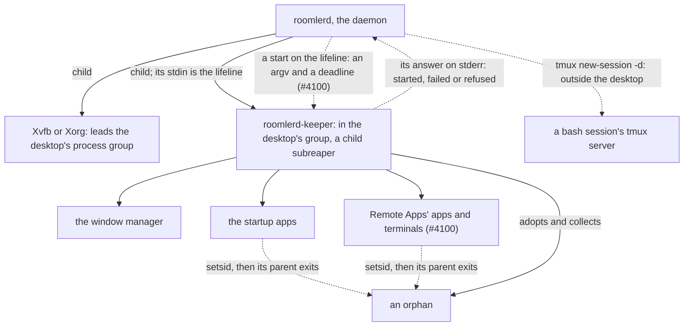
```mermaid
flowchart TD
    D["roomlerd, the daemon"] -->|child| X["Xvfb or Xorg: leads the desktop's process group"]
    D -->|"child; its stdin is the lifeline"| K["roomlerd-keeper: in the desktop's group, a child subreaper"]
    D -.->|"a start on the lifeline: an argv and a deadline (#4100)"| K
    K -.->|"its answer on stderr: started, failed or refused"| D
    K --> W["the window manager"]
    K --> A["the startup apps"]
    K --> R["Remote Apps' apps and terminals (#4100)"]
    A -.->|"setsid, then its parent exits"| O["an orphan"]
    R -.->|"setsid, then its parent exits"| O
    K -->|"adopts and collects"| O
    D -.->|"tmux new-session -d: outside the desktop"| T["a bash session's tmux server"]
```

| Rule | What it means | Where |
|---|---|---|
| **Ready before the job** | The keeper checks that it is in a process group of the desktop's own (not the daemon's), makes itself a child subreaper, arms its signals and says `ready` on stderr. Only then does the daemon write the job, one JSON line: display, group, window manager, apps, grace, and the window manager's restart delays (#4099; a job without them gets the X server's). A keeper the daemon gives up on never had a job and started nothing; it is SIGKILLed and collected before its input ends, and leaves the tree in the same step. So a keeper whose input ends before its job, whose parent changed, or that has had no job for 15 s is one whose daemon left between `ready` and the job, or was stopped for that long (SIGSTOP, a debugger, a freezer): it takes the whole desktop down, with the job's grace of 1.5 s, as it does once it has its job. A daemon that was only stopped loses the desktop it was starting, and its supervisor starts it again | `run` `virtual_desktop/keeper.rs:1036`, `JOB_WAIT` `virtual_desktop/keeper.rs:160`, `start_keeper` `virtual_desktop.rs:1859`, `discard_keeper` `virtual_desktop.rs:1525` |
| **Its clients get what the daemon's got** | Environment, working directory, umask, ignored and blocked signals (a SIGHUP the daemon ignores under `nohup` stays ignored), process group, session and descriptors; stdin, stdout and stderr are `/dev/null` on both paths. Their parent is the one difference | `arm_signals` `virtual_desktop/keeper.rs:516`, `Book::start` `virtual_desktop/keeper.rs:720` |
| **Nothing that exits stays a zombie** | It waits for every child it has, its own and adopted. `waitpid(-1)` is right there, because all its children are the desktop's. The daemon still waits for one pid at a time | `Book::reap` `virtual_desktop/keeper.rs:826` |
| **Its input is the lifeline** | Only the daemon holds the write end, write-only and close-on-exec. The daemon's teardown drops it just before it signals the tree, and a daemon that dies closes it. The keeper then ends everything under it and every other member of the desktop's group, the X server included, and leaves. A parent that changed means the same: the daemon died while something else held the write end | `serve` `virtual_desktop/keeper.rs:1124`, `kill_recorded_tree` `virtual_desktop.rs:1556` |
| **SIGTERM alone ends what it started, then it waits** | A service manager's stop signals every process of the unit at once. On SIGTERM alone the keeper ends its own children and waits up to 10 s for its input to end, so the supervisor sees no exit to report and the daemon's teardown finds it | `serve`, `LINGER` `virtual_desktop/keeper.rs:116` |
| **Its teardown loops** | SIGTERM, a grace of 1.5 s, SIGKILL, collect; then again with no grace while a child is left, such as an orphan adopted during a pass. At most about 4.5 s | `teardown_with` `virtual_desktop/keeper.rs:1010` |
| **It signals only the desktop's** | Never pid 0, 1 or -1, itself or the daemon, and never a group, since it is a member of the desktop's. A pid that is not its own child is signalled only after its `/proc` start time matches the snapshot that selected it | `may_signal` `virtual_desktop/keeper.rs:409`, `KeeperProcs` `virtual_desktop/keeper.rs:953` |
| **A window manager that exits is started again** ([#4099](https://github.com/gjovanov/roomler-ai/issues/4099)) | While the X server runs, the keeper starts it again through the same `spawn_client` as its first start, so it gets what the first got, after the X server's own backoff: 1 s after the exit at first, doubling with each exit to 5 min, and 1 s again after one that ran a minute (a job's floor is never under 100 ms). One that cannot be started, its file gone or not executable, is tried at the same delays, and a failed start never starts them over. An exit only schedules the start. The start runs at the loop's tail and looks then, not at the exit, at the keeper's teardown and at the X server, the group's leader: an exit in a teardown starts nothing, and a start that comes due in one, or while the server is not running, is dropped, never left due, so no `poll` turns into a loop of 0 ms ones. Each attempt writes at most one line, a WARN: the exit's, held as the next row says, `virtual-desktop vd-keeper: the window manager (<pid>) exited: <how> — it is started again <delay> after its exit`, or a failed start's, at once, `virtual-desktop vd-keeper: the window manager <path> failed to start: <error> — it is tried again in <delay>`. A start that works says nothing of its own | `Book::start_wm` `virtual_desktop/keeper.rs:735`, `Book::start_wm_when_due` `virtual_desktop/keeper.rs:764`, `WmDelays` `virtual_desktop/keeper.rs:657`, `Book::wait_ms` `virtual_desktop/keeper.rs:817` |
| **Quiet about what a stop or a death caused** | An exit of the window manager or an app is held for 2 s and said only while the X server still runs. A service manager's stop and an X server's death end those clients first, and neither is news. One false notice is left: an X server that closes its clients' connections and then takes over 2 s to exit. The window manager's start does not wait for this hold, so such a server also gets one start of the window manager, which fails on the dying display at once; the next delay, twice as long, finds the server gone. A server that has exited reads as not running, a zombie or reaped, and its pid cannot come back as another process while the keeper lives, because the keeper's membership holds the group's number | `Book::say_notices` `virtual_desktop/keeper.rs:888` |
| **It starts what Remote Apps asks for** ([#4100](https://github.com/gjovanov/roomler-ai/issues/4100)) | On the desktop's display, Remote Apps (FR-56) asks the desktop who starts each X client it starts: a GUI app, a terminal app's xterm, a bash session's xterm and its re-attach. Where the keeper runs, the daemon decides under its state lock and never waits there. A stopping daemon refuses; a desktop that is down refuses with its reason, since a client started then dies at once or lands on the next server outside any tree (decision D1); a start longer than one atomic write, `KEEPER_JOB_MAX` (4096 bytes), is refused before it is written. Otherwise the daemon writes one line on the lifeline, the program and its arguments (an argv, never a shell line) and a deadline 3 s ahead on `CLOCK_MONOTONIC`, the clock both processes read, and waits for the answer outside the lock, until the deadline and 1 s more. The lifeline is non-blocking once the job is out, so a full pipe or a keeper that is gone refuses at once. The keeper reads its input in whole lines: one over the bound is dropped whole, and one that is no start is warned about. It starts each start at the loop's tail, in the wake that read it, through the same `spawn_client` as the window manager, so the client gets what a startup app gets: its parent is the keeper and its process group the desktop's, where both were the daemon's. It answers on stderr, `start <id>: ` and the answer as JSON: started, failed with the start's OS error (so the launch fails with the text Remote Apps' own start gave, "not installed" included), or refused. It refuses a start it reads in its teardown, while the X server is not running, or past its deadline, when the daemon has stopped waiting and the launch has failed already, so a start given up on never starts later. The exits of these clients are collected and said nowhere (decision D2). Nothing is started again directly after a failure: where the keeper runs, only it starts these clients | `Desktop::start_x_client` `virtual_desktop.rs:2018`, `X_CLIENT_WAIT` `virtual_desktop.rs:1168`, `X_CLIENT_SLACK` `virtual_desktop.rs:366`, `answered` `virtual_desktop.rs:2204`, `Start` `virtual_desktop/keeper.rs:243`, `Answer` `virtual_desktop/keeper.rs:275`, `Lines` `virtual_desktop/keeper.rs:325`, `Book::start_x_client` `virtual_desktop/keeper.rs:782`, `spawn_detached` `apps/linux.rs:202` |
| **Its exit is the desktop's failure** | Once it has its job, the keeper's exit takes the desktop down and brings it back with the supervisor's backoff, as the server's exit does, never with a start on top. The reason reads `its keeper process (vd-keeper) exited: …`. A job it refuses (one it cannot read, or one for another group) is logged first, as a warning with its reason, `virtual-desktop vd-keeper: refused: …`, because the supervisor's warning names only the exit code | `supervise` `virtual_desktop.rs:2307`, `Gone` `virtual_desktop.rs:2509`, `keeper_line` `virtual_desktop.rs:2237` |

**A window manager's exit, and its start again**
([#4099](https://github.com/gjovanov/roomler-ai/issues/4099)). The keeper is
the only process that can start it again: the window manager is its child, so
only the keeper can wait for it, and one the daemon started would sit outside
the keeper, its orphans out of reach again. The delays are per keeper, so a
new X server starts them over.

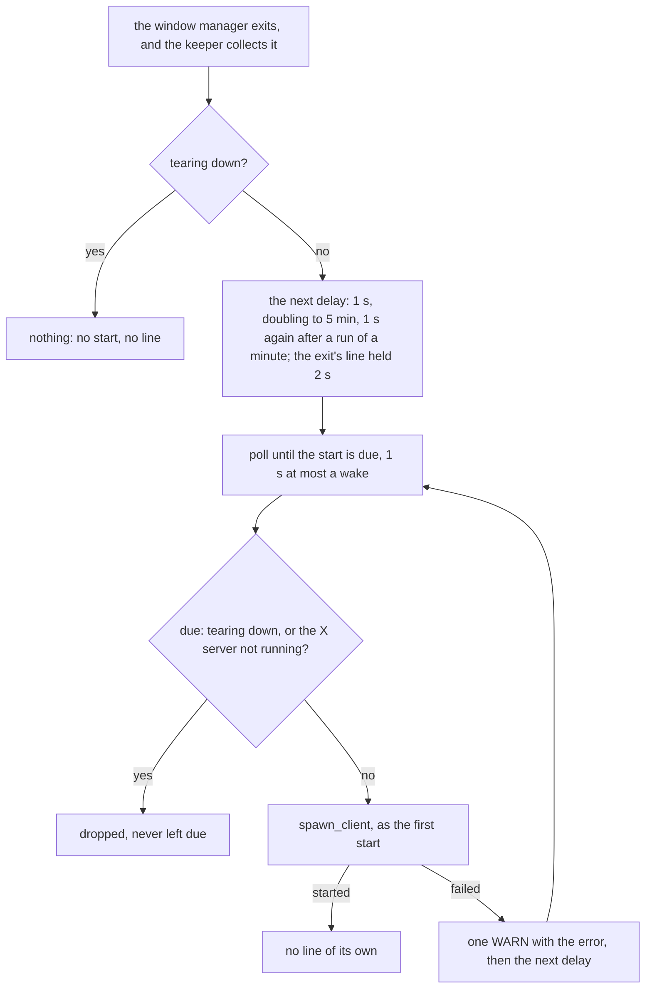
```mermaid
flowchart TD
    E["the window manager exits, and the keeper collects it"] --> T{"tearing down?"}
    T -->|yes| N["nothing: no start, no line"]
    T -->|no| S["the next delay: 1 s, doubling to 5 min, 1 s again after a run of a minute; the exit's line held 2 s"]
    S --> P["poll until the start is due, 1 s at most a wake"]
    P --> D{"due: tearing down, or the X server not running?"}
    D -->|yes| R["dropped, never left due"]
    D -->|no| SP["spawn_client, as the first start"]
    SP -->|started| OK["no line of its own"]
    SP -->|failed| F["one WARN with the error, then the next delay"]
    F --> P
```

| What happened | What becomes of the window manager's exit |
|---|---|
| The X server died first (a crash, the OOM killer, SIGKILL) | The server is a zombie before its clients see their I/O error, so a start that comes due finds it not running and is dropped. The supervisor ends the keeper after its stop grace, at most 1 s, its input first |
| A stop (`systemctl stop`, a restart, a self-update) | The service manager's SIGTERM reaches the keeper before a 1 s delay ends, and the daemon's teardown then ends its input: nothing starts |
| The window manager first, its server later, with no stop | A server that closes its clients' connections and outlives the delay gets one start, which fails on its dying display at once; the next delay, doubled, finds the server gone |
| The window manager alone: a crash, a `kill`, the OOM killer | Started again after its delay |

**What a start of the window manager again does not bring back:**

- A window that maps while the new window manager starts can stay without a
  frame, the map race of §2: the nudge runs only after the desktop's first
  start of its clients (`nudge_wm_after_startup`, `virtual_desktop.rs:1847`).
  Windows already mapped are taken over and framed again.
- A window manager setting that names a session (`xfce4-session`,
  `openbox-session`) runs that session's autostart again.
- A person's own *Exit* from the window manager's menu is undone: it is
  started again after its delay.
- A window manager a person starts with `--replace` takes over, and each start
  of the configured one then exits at once, at the backoff, up to 12 an hour,
  for the desktop's life (decision D2: kept trying, as the X server is).
- The startup apps are never started again.

**When the daemon starts the clients itself**, as before #3665, what the apps
leave behind is out of the teardown's reach again, and Remote Apps starts its
apps and terminals itself, as before #4100 (§2.2, *Not covered*). The log says
so at every start:

| Case | The daemon's log |
|---|---|
| The kill switch `ROOMLERD_VIRTUAL_DESKTOP_KEEPER=0` (`virtual_desktop.rs:1152`) | nothing: the start of 0.4.221, except that the clients get `/dev/null` on stdin |
| The keeper refuses: not in a group of the desktop's own, no subreaper (a seccomp filter or an old kernel refuses `PR_SET_CHILD_SUBREAPER`), or its signals cannot be armed | WARN `virtual-desktop: no vd-keeper — …`, with `why=it refused: …` |
| Not ready within 5 s | the same WARN, `why=it did not say it was ready within 5s` |
| Two keepers in a row that exited by themselves within a minute of their desktop's start, or two that were not ready in time with none ready between them | WARN `no vd-keeper for the rest of this daemon's life, after two keepers in a row exited by themselves within a minute of their desktop's start, or two were not ready in time with none ready between them`. These are two counts, and one of each turns nothing off. Early exits (`KeeperStrikes` `virtual_desktop.rs:2479`) start again after a keeper or a desktop that ran longer. Readiness timeouts (`keeper_slow` `virtual_desktop.rs:1351`) start again only at a `ready`, so a refusal between two timeouts does not reset them. The next daemon tries again |

On this path a window manager that exits is not started again
([#4099](https://github.com/gjovanov/roomler-ai/issues/4099), decision D1): the
daemon starts the clients once per server and waits on the server alone, so the
window manager's exit stays a zombie, unlogged, until the server next exits or
the daemon stops. Starting it again there would take a reap in the daemon
outside the teardown, against the teardown's first rule, no reap before the
last signal (§2.2).

A stop that lands while a keeper starts leaves nothing behind. Before the keeper
has its job, nothing is started, neither the keeper's clients nor the daemon's,
and a keeper the stop ended then is logged at INFO, never as a warning:
`virtual-desktop: the desktop is stopping, and its vd-keeper with it`
(`start_clients` `virtual_desktop.rs:1812`). Once the job is sent, the keeper
may already have started the window manager and the apps; the stop then ends
them with the rest of the desktop, within its usual bound, and logs nothing more.

**What reaches the keeper first, by the way the daemon goes:**

| How | What reaches the keeper first | What a person on the desktop sees |
|---|---|---|
| `systemctl stop`, or the unit's restart | systemd's SIGTERM, sent to the whole unit at once: the keeper ends the window manager and the apps; then the daemon's own teardown ends its input, and it ends the rest of the group | the desktop goes; the unit's cgroup is empty within the usual bound, with no 90 s stop |
| `roomler restart`, Apply now | the daemon's graceful exit: its teardown ends the keeper's input before it signals the tree | the same |
| A self-update | the same graceful exit, or the package's restart of the unit | the desktop goes, and the new daemon starts a new one |
| A daemon killed outright (SIGKILL, the OOM killer, a stall exit) | the end of its input, as the kernel closes the daemon's descriptors | the desktop goes with the daemon, with or without a service manager. Before, on a host with none, it ran on, out of roomler's reach |

**Bound.** The daemon's teardown keeps its bound: SIGTERM, `TEARDOWN_GRACE`
(2 s, `virtual_desktop.rs:76`), SIGKILL, then about 1 s for it to land and
1 s for the reap. The keeper's own teardown runs at the same time, in at most
about 4.5 s, and the daemon waits for nothing beyond its own. A start costs
one more process of the daemon's binary, two pipes (the keeper's input and its
stderr), a thread that follows that stderr, and the wait for `ready`, 5 s at
most. A keeper the daemon gives up on adds up to 1 s, the wait to collect it
after its SIGKILL. A Remote Apps launch on the desktop waits for the keeper's
answer at most 4 s, the start's 3 s and 1 s of slack, on the blocking thread
that serves the request (`peer.rs:11421`) and outside the daemon's state lock;
its write never waits.

**What a person notices.** A program started from a terminal that the
desktop's own window manager or startup apps opened, such as a `tmux` or
`screen` session or a `nohup` job, is part of the desktop now. It ends whenever the desktop is torn down: when the X server dies
and the desktop comes back, and when the daemon stops or restarts. Before, it
outlived an X server's death while the daemon ran on, and, on a host where no
service manager owns the daemon, a restart of the daemon. Under the shipped
systemd units it never outlived a restart: the unit's control group took it.
The apps and terminals Remote Apps (FR-56) starts on the desktop are the
keeper's too since [#4100](https://github.com/gjovanov/roomler-ai/issues/4100):
each ends with the desktop, and so does what a person starts from a terminal
app, such as a `nohup` job. A bash session is the exception: its shell runs
under a tmux server that Remote Apps starts outside the desktop
([`remote-apps.md`](remote-apps.md) §5), so the shell and what runs in it
outlive an X server's death. Only the session's xterm ends with the desktop.
When the desktop is back, the session is listed as detached, and a click on it
opens a new xterm, the new keeper's, attached to it. The session ends with the
unit's control group when a service manager stops or restarts the daemon, and
outlives only a restart of a daemon that no service manager owns. Where the
keeper does not run, Remote Apps starts its clients itself, as before.

**Its name.** Log lines and the down reason say `vd-keeper` (the field
`vd_keeper`), because the power module has a keeper of its own (FR-55). Its
comm is `roomlerd-keeper` and its `argv[0]` is `roomlerd`, so an administrator
or an EDR console sees whose process it is. An exact match on the comm
(`pgrep -x roomlerd`, `ps -C roomlerd`) finds only the daemon; a match on
`argv[0]` or a substring finds both: `pgrep roomlerd`, `pidof roomlerd`, and
psmisc's `killall roomlerd`, which compares `argv[0]` when a comm is 15 bytes
long. So `pkill -9 roomlerd` and `killall -9 roomlerd` kill the keeper too,
nothing then ends the desktop, and it is left as 0.4.221 left it.

**Proven** by the `virtual_desktop::` tests (`supervise_tests`, `tests` and the
keeper's own `keeper::tests`) in every Linux unit run, and by `supervise_tests`
on the CI Xvfb lane against a real Xvfb: the orphan of an app that died with its
server, and of one that exited by itself, is ended; a window manager and an
app that exit are collected; a killed daemon leaves nothing of its desktop,
also while something else holds the keeper's input, and one that left before
the job takes the desktop with it; a stop and an X server's death add no
warning, and a window manager that exits while its server runs is reported;
such a window manager is started again after its delay, by the keeper and with
what the first one got, its delays double to their ceiling and start over after
a run past the stable time, one that cannot be started is tried at the same
delays, and none is started in a stop, in the daemon's teardown, or onto a
server that is gone or dying (#4099, the production numbers pinned);
nothing reaches a keeper's input before its `ready`; a keeper that is slow,
refuses or exits early falls back as the tables say; and a client sees the
same on both paths. Since #4100: the apps and terminals Remote Apps starts on
the desktop, a bash session's xterm and its re-attach among them, are the
keeper's children in the desktop's group, collected when they exit, and ended
with what they leave behind by the desktop's stop and by its X server's death;
a bash session's tmux server stays outside the keeper and outlives the stop;
no start is made in the keeper's stop, onto a server that is gone, longer than
one write, or after the daemon gave up on it; a start written right behind the
job is answered; a client's exit starts no window manager; and where the
keeper does not run, Remote Apps starts as before, with the same failure text
on both paths. The issue's three
paths failed on the code before the keeper, and each later fix's test fails
with that fix taken out.

**What #4100 leaves as it is:**

- An answer the keeper could not write, its stderr full (it never blocks on
  it, `say` `virtual_desktop/keeper.rs:445`), reads as a failed launch
  although the client runs, the keeper's like any other. An answer that comes
  after the daemon stopped waiting is logged; one that started a client warns:
  `virtual-desktop vd-keeper: Remote Apps' start <id> began client <pid> after
  the daemon stopped waiting for it, so its launch was reported failed (#4100)`.
- A start the keeper read just before its input ended is started, and that
  teardown ends it at once.
- A bash session's tmux server, and what its sessions run, stay outside the
  desktop (§2.2, *Not covered*).
- The clients run as the daemon's account, as before: root under the system
  unit.

**In the field** (2026-11-15,
[#3665](https://github.com/gjovanov/roomler-ai/issues/3665#issuecomment-6890893043)):
a lab guest on Ubuntu 24.04 (kernel 6.8, systemd 255, cgroup v2), the daemon as
the shipped system unit with a person's Wayland session logged in beside it,
and the desktop on Xvfb. The control was the published 0.4.222, which has no
keeper. The other column is a package the release lane built from the keeper's
branch before its merge; no file but the daemon's binary differs between the
two packages. The window manager was openbox, and the startup app was a probe
that can start a `setsid` child that ignores SIGTERM. A restart is timed from
the request to the new daemon's first answer.

| What was done | 0.4.222 | With the keeper |
|---|---|---|
| A startup app exits by itself while the desktop runs; then the window manager is sent SIGTERM | a zombie under the daemon each time, and nothing logged | no zombie, and each exit logged |
| The X server is SIGKILLed while a startup app's deaf child runs, and the child is watched for 15 s | alive at 15 s, a child of init, in the unit's cgroup | gone 2.0 s after the server's exit |
| `systemctl stop` then | 90.3 s: systemd times out and SIGKILLs what is left, and the unit ends `failed` | 1.6 s: the unit's cgroup is empty, and the unit ends `inactive` |
| The same kill, then `roomler restart` | 97.8 s | 7.0 s |
| The app starts the deaf child and exits by itself; then `roomler restart` | 95.7 s, and the child's parent is init | 7.5 s, and the child's parent is the keeper |
| `roomler restart` with nothing left behind, the baseline of each column | 7.5 s | 7.0 s |
| openbox and one GTK app (`gnome-calculator`); the X server is SIGKILLed | the new desktop is up 1.2 s after the kill, and nothing of the first one is left 15 s later | the same, with the keeper as a fourth process of the desktop |

Three things the read showed beside the numbers:

- With a deaf child the desktop is back 2.7 s after the X server's SIGKILL,
  against 1.2 s without one: the keeper gives the child its grace of 1.5 s
  before SIGKILL.
- systemd words the 90 s timeout by who went first. A daemon that exits by
  itself (`roomler restart`) leaves the unit in `stop-sigterm`. Under
  `systemctl stop` the daemon exits on the signal and the unit waits for what
  is left in its cgroup, in `final-sigterm`. A journal search for one wording
  misses the other.
- A plain window manager with one GTK app left nothing behind when its X
  server was killed, on either build. The orphan needs an app that starts a
  child in a session of its own.

Not measured: a full desktop environment (which of its helpers outlive their
X server), the per-user unit and a daemon that no service manager owns (the
tests cover both), and arm64.

### 2.4 What an X server exit does to everything that was open (#3671, #3918)

The supervisor (§2.2) brings the desktop back on the same display about a
second after its X server exits, and a session opened afterwards shows the new
desktop. Everything that was already open when the server exited holds a
connection to a server that no longer exists, although `DISPLAY` still names
the same display: the open session's capture, its damage watcher and its cursor
reader, a shared encoder pipeline, the input injector and the daemon's
clipboard worker. Until
[#3671](https://github.com/gjovanov/roomler-ai/issues/3671) and
[#3918](https://github.com/gjovanov/roomler-ai/issues/3918) each of them kept
that connection: the open session showed its last picture at the full frame
rate with a warning per frame, its viewer showed `connected` and no notice,
remote input failed in every session until the daemon restarted, and the
clipboard stayed on the dead server. Each now says it once, and either follows
the desktop to its new server or ends with the notice a new session already
gets.

Two numbers carry the follow. `virtual_desktop::generation`
(`agents/roomlerd/src/virtual_desktop.rs:389`) counts the times the desktop came
back on a new X server, and `virtual_desktop::x_server_now` (`:409`) reads that
generation together with the down period, under the lock that publishes the
desktop up, so a desktop seen up is seen with its new server's generation. A
part of the daemon that made an X connection under one generation knows it is
dead in the next.

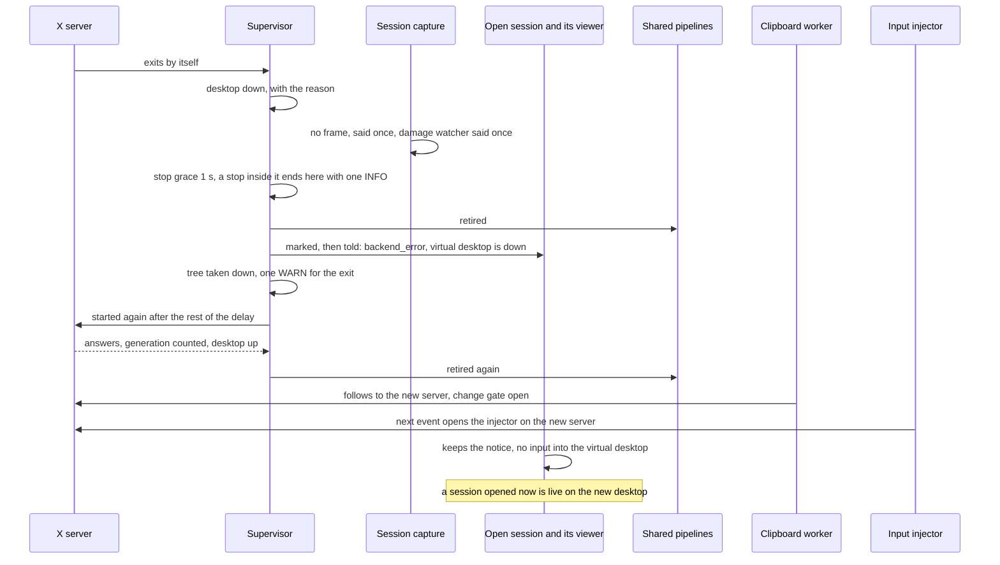
```mermaid
sequenceDiagram
    participant X as X server
    participant S as Supervisor
    participant C as Session capture
    participant V as Open session and its viewer
    participant P as Shared pipelines
    participant K as Clipboard worker
    participant I as Input injector
    X->>S: exits by itself
    S->>S: desktop down, with the reason
    C->>C: no frame, said once, damage watcher said once
    S->>S: stop grace 1 s, a stop inside it ends here with one INFO
    S->>P: retired
    S->>V: marked, then told: backend_error, virtual desktop is down
    S->>S: tree taken down, one WARN for the exit
    S->>X: started again after the rest of the delay
    X-->>S: answers, generation counted, desktop up
    S->>P: retired again
    K->>X: follows to the new server, change gate open
    I->>X: next event opens the injector on the new server
    V->>V: keeps the notice, no input into the virtual desktop
    Note over V: a session opened now is live on the new desktop
```

**What each open thing does.** "Master" is the behaviour before this section's
two issues.

| What was open | On master | Now | Bound | Kill switch | Pinned by |
|---|---|---|---|---|---|
| A session's capture (XShm) | the capture library returned shared memory's last picture for every ask, so the pump sent the frozen picture at the full rate (57 fps and 3.1 Mbps when measured) | the vendored library can say that its connection failed (`Capturer::connection_lost`, `crates/vendored/scrap/src/common/x11.rs:29`). The capture's worker latches it, warns once, drops its damage watcher and its cursor reader, and answers every later ask with no frame (`agents/roomlerd/src/capture/scrap_backend.rs:455-464`), which the pump reads as an idle screen | one `WARN` per session | none: it bounds a log line and stops a frozen picture | `capture::scrap_backend::x11_exit_tests` (CI, a real X server) |
| The damage watcher | warned at every poll of the dead connection, about 56 lines a second | warns once and never polls the connection again; it stays blind, so every tick captures (`agents/roomlerd/src/capture/x11_damage.rs:229-231`, `:251`) | one `WARN` per watcher | none | `capture::x11_damage::tests::a_tracker_whose_server_went_away_says_so_once` (CI, a real X server) |
| A shared encoder pipeline | a new viewer of the profile joined the frozen pipeline | retired after the stop grace and again once the desktop is up, where the device's plan is the virtual desktop (`retire_if`, `virtual_desktop.rs:545`; `media_share::retire_all`, `agents/roomlerd/src/media_share.rs:1006`). A later viewer runs a capture of its own on the new server. A pipeline whose owner is marked takes a joiner only when its capture is known not to read an X server (`docs/remote-control.md` §5.1a) | at most two `INFO` lines per exit, each only when it retired something | `ROOMLERD_INPUT_X11_FOLLOW=0` turns the join's refusal off; the retires have none | `media_share::tests` (the three retire tests, `a_pipeline_whose_owner_has_no_picture_takes_no_joiner`), `virtual_desktop::supervise_tests::an_x_server_exit_retires_the_shared_pipelines_after_the_grace_before_the_tell` |
| The open session and its viewer | not told: `connected`, the last picture, no notice | marked at the exit, then told with the sentence a session opened while the desktop is down gets: `rc:media-unavailable` with `backend_error`, "this device's virtual desktop is down: … reconnect in a moment" (`sessions_told_via`, `virtual_desktop.rs:513`), through FR-80's notice (`peer::spawn_capture_unavailable_notice`, `agents/roomlerd/src/peer.rs:5731`). The viewer keeps the notice until the person connects again, even if frames reach it later (§5.1a of `docs/remote-control.md`) | told one grace (1 s) after the exit; one `WARN` per told session (FR-80's own line) | `ROOMLERD_VIRTUAL_DESKTOP_TELL_SESSIONS=0`: no notice, the marks stay | `virtual_desktop::supervise_tests::an_x_server_exit_tells_the_sessions_after_the_grace`, `the_sessions_are_told_only_when_the_plan_is_the_virtual_desktop`, `the_kill_switch_leaves_every_session_untold` |
| A session opened while the desktop is down | refused with that sentence (#3643) | the same, and its refusal marks it (`input::told_no_picture`, `agents/roomlerd/src/input/mod.rs:93`): it has no input of the desktop until it reconnects | — | — | `input::arbiter::tests::a_session_whose_open_was_refused_while_down_controls_nothing_once_it_is_back` |
| A session opened while it is down whose capture opens only once it is back | live, with dead input until a daemon restart | told nothing and not marked: it sees and types into the new desktop | — | — | `input::arbiter::tests::a_session_opened_while_down_and_never_told_types_once_the_desktop_is_back` |
| A session opened after it is back | the new desktop, with dead input until a daemon restart | the new desktop, with input | — | — | `input::arbiter::x11_follow_tests` (CI, a real X server) |
| A session whose input goes to a person's real desktop (a portal or compositor route, uinput) | its input worked | unchanged: a mark costs it nothing while its input goes elsewhere (`docs/remote-control.md` §6.1c) | — | — | `input::arbiter::tests::a_session_marked_in_silence_reaches_nothing_and_its_reconnect_types` |
| The input injector | enigo logged an `ERROR` for every event (one a key, two a click or a move) until the daemon restarted | records the generation it opened on; once the desktop is up on a newer one it is let go and the next event opens one on the new server. While the desktop is down input is dropped and nothing is opened (`docs/remote-control.md` §6.1c) | one `INFO` a down period, one at the reopen | `ROOMLERD_INPUT_X11_FOLLOW=0` | `input::x_follow::tests`, `input::arbiter::tests::input_while_the_desktop_is_down_reaches_nothing_and_is_said_once`, `input::arbiter::x11_follow_tests` (CI) |
| Held keys and buttons | released into the dead connection, with an `ERROR` each | the arbiter's record of what a session holds is kept: a release for a press on the old server goes to the new one, where it releases nothing (`let_go`, `agents/roomlerd/src/input/x_follow.rs:162`) | — | as the injector's | `input::arbiter::x11_follow_tests` (CI) |
| Keep busy | its moves went to the dead injector | its own X connection reconnects as before, and its moves go through the same injector, so they follow it (`docs/keep-busy.md`) | nothing above `DEBUG` while the desktop is down | as the injector's | the injector's tests |
| The clipboard worker | kept its first connection for the daemon's life: copy and paste failed and the change gate stayed shut | follows the desktop to the new server, under a bound, and its change gate opens again; a first start that failed while the desktop was down is made again once it is up (below) | one `INFO` a follow; the bounds below | `ROOMLERD_CLIPBOARD_X11_REBUILD=0`; the retry of a first start has none | `clipboard::follow_tests`, `clipboard::retry_tests`, `clipboard::quietly_drop_tests`, `clipboard::x11_follow_tests` (CI, a real X server and the real clipboard) |

**A clean stop is not an exit.** The daemon's own teardown ends the X server,
and on master the supervisor warned about that exit at every stop. The
supervisor now waits a stop grace after any exit before it tells or takes
anything down (`STOP_GRACE`, `virtual_desktop.rs:1095`;
`wait_unless_stopping`, `:1639`, is the wait that `stop` wakes). A stop inside
it logs one `INFO` line, "exited as the daemon stops", with the server's kind
and its exit, and tells nobody (`:2335-2347`). Nothing of the desktop's tree is
touched while it waits, so the stop finds every child recorded. The grace is
carved out of the restart delay, so the desktop is back no later than before.
It covers a keeper's exit the same way (§2.3), while the X server is still up:
a session keeps a live picture for that second, and is told after it. An exit
nobody asked for is still warned once, after the grace and the teardown
(`:2364-2392`).

**The clipboard worker follows.** It is one worker per daemon life
(`Clipboard::shared`, `agents/roomlerd/src/clipboard.rs:459`), and arboard keeps
one X connection per process for as long as any of its handles lives, so a new
handle alone stays on the dead server. Once the desktop is up on a newer
generation than its handle's, the worker takes that process-wide connection
down through a second handle, opens a fresh one on the new server on a helper
thread, and proves it with a read before it serves (`Follow::check`,
`clipboard.rs:1138`; `connect_anew`, `:1263`). A session's clipboard command
can wait behind a follow, once per new X server and never past the bound: a
follow that outlasts it stops blocking, the worker serves with its old handle
meanwhile, and it takes the late answer at a later look. A follow that
fails is tried again every 10 s while that server answers (`Retry::EVERY`,
`:711`), and so is a first start that failed while the desktop was down:
`shared()` and `available()` read the same rule (`:1410`). Teardown on a dead
connection makes arboard log three lines; the follow holds back exactly those
three and lets every other line through (`quietly_drop`, `:859`). The follow
rests on how arboard 3.6.1 counts its handles before it closes the
process-wide connection, so the workspace pins it to exactly that version
(the `arboard` entry in the workspace's root `Cargo.toml`). An upgrade has to read that version's `Drop for Clipboard`
again, and the CI test
`clipboard::x11_follow_tests::x11_real_without_the_second_handle_the_clipboard_stays_on_the_dead_server`
turns red when the rule changed.

**Bounds, in one place.**

| What | Bound |
|---|---|
| The stop grace | 1 s (`STOP_GRACE`), or the restart delay when that is shorter, taken out of the delay |
| The open sessions told | one grace after the exit |
| The desktop's tree taken down | one grace after the exit, about 3 s after it for a child that ignores `SIGTERM` (about 2 s before) |
| A clipboard follow | 6 s (`REBUILD_BOUND`, `clipboard.rs:1067`); the worst case measured from arboard's own waits is about 4.2 s: a new connection and its atoms, the owner check and one read of a target under arboard's 4 s timeout |
| A failed follow, and a failed first start | tried again every 10 s while the server answers |
| Log lines for one exit nobody asked for | one `WARN` for the exit; one `WARN` per open session's capture and one per damage watcher; one `WARN` per told session (FR-80's notice); at most two `INFO` for the retires; one `INFO` a clipboard follow; for input, one `INFO` a down period and one at the reopen. Nothing repeats per frame or per poll |

**The three switches** (§7) each restore what was there before for one part:
`ROOMLERD_VIRTUAL_DESKTOP_TELL_SESSIONS=0` sends no notice, but the marks and
the retires stay; `ROOMLERD_INPUT_X11_FOLLOW=0` stops the injector's follow and
everything that reads a mark (the arbiter, a shared pipeline's join), and the
marks are still written; `ROOMLERD_CLIPBOARD_X11_REBUILD=0` keeps the
clipboard's first connection, and the retry of a failed first start stays on.

**What it costs.**

- The open sessions are told one grace after an unasked exit, not at once, and
  what the desktop's apps left behind ends about a second later than before.
- A stop that reaches the supervisor after the grace (a runtime that stalled for
  longer) gets the old `WARN` for the exit, and the sessions about to end get
  the notice.
- An open session is never brought back: its capture is not reopened on the new
  server, and the person reconnects. Where no notice goes (another planned
  capture, or the tell's switch) the person sees the last picture until then.
- A session left behind keeps the daemon's clipboard: until it reconnects it
  receives the new desktop's copies and its pastes set the new desktop's
  clipboard, under the same grant as before.
- A Linux build without the X11 injector (`enigo-input`; `full` and `full-hw`
  carry it) marks nothing, and its shared pipelines rely on the two retires.

**Proven** by the unit tests of `virtual_desktop::supervise_tests` (the stop
grace, the tell, the marks and the retires, with stand-in servers),
`media_share::tests`, `input::x_follow::tests`, `input::arbiter::tests` and
the clipboard's `follow_tests`, `retry_tests` and `quietly_drop_tests`, and by
real X servers in CI's job "Recorder tests with audio + X11 pointer (FR-85)",
in the steps "#3671 — a session's capture after its X server exits, on a real
X server", "#3918 — remote input follows the virtual desktop to a new X server,
on a real X server" and "#3671 — the clipboard follows the virtual desktop to
a new X server, on a real X server". The capture, input and clipboard tests
that need a real X server, and every test that writes the real clipboard, run
only there: each prints an `x11-real:` line that its step greps.

#### In the field

Two reads exist, both on a Linux lab machine whose desktop is the daemon's
virtual desktop, with the production web app in a browser on a second machine as
the viewer. Every number below is copied from the comment named by its letter:

| | Read | Comment |
|---|---|---|
| [a] | 16 November, #3671 | [result: the published 0.4.223 against #3947's build](https://github.com/gjovanov/roomler-ai/issues/3671#issuecomment-6916857678) |
| [b] | 17 November, #3671 | [read again on the published 0.4.224](https://github.com/gjovanov/roomler-ai/issues/3671#issuecomment-6946866161) |
| [c] | 16 November, #3918 | [result: the published 0.4.223 against #3947's build](https://github.com/gjovanov/roomler-ai/issues/3918#issuecomment-6916891416) |
| [d] | 17 November, #3918 | [read again on the published 0.4.224](https://github.com/gjovanov/roomler-ai/issues/3918#issuecomment-6946869066) |

On 16 November the machine ran Ubuntu 24.04 with systemd 255, the desktop was
1280×800 on Xvfb (on Xorg with the dummy driver for one run), and the media went
over a relay (VP9 4:4:4, software encode and decode) [a]. The same script ran
the published 0.4.223 and the `.deb` that CI built from #3947's head, with only
the daemon's binary swapped in; afterwards the machine went back onto the
published bytes, checked by hash [a]. On 17 November the machine was a Linux
guest running the daemon's system unit with the virtual desktop on (Xvfb, with
its keeper), watched from a browser on a second guest. It took 0.4.224 by its
own update, and the binary read is the published package's (sha256
`1540da2f91aaa088…`) [b]. A run opens a session, sends a key to prove input
works, then kills the desktop's X server (or its keeper) with `SIGKILL`; the
daemon starts it again by itself. The log is counted for 60 s and the viewer is
sampled every 2 s for its own frame-rate and bitrate readout [a]. #3947 is the
change that fixed both issues, and it shipped in 0.4.224 [b].

**An open session across the exit** (#3671):

| Cell | 0.4.223, published [a] | #3947's build, 16 Nov [a] | 0.4.224, published [b] |
|---|---|---|---|
| Log, X server killed (Xvfb) | 3,642 lines in 60 s, 3,513 of them warnings, 3,512 the same capture line | 48 lines, 4 warnings | 4 warnings in 53 lines: `damage_warn=1 capture_once=1 exit_warn=1 told_warn=1 retired=1` |
| Log, keeper killed | 3,640 lines, 3,513 warnings | 44 lines, 4 warnings | not read |
| Log, X server killed (Xorg, dummy driver) | 3,640 lines, 3,511 warnings | 47 lines, 4 warnings | not read |
| Damage warnings after the exit | 3,512 [b] | one: the damage watcher's `damage connection failed`, one of the four warnings (supervisor, capture, damage watcher, the told session) | `damage_warn=1` |
| Viewer, X server killed (Xvfb) | 15 → 59 fps, 9 → about 207 kbps | 15 → 15 fps, 9 → 5 kbps | 15 fps and 9 kbps before the exit, 15 fps and 6 kbps after it |
| Viewer, keeper killed | 15 → 59 fps, 9 → about 200 kbps | 15 → 15 fps, 9 → 6 kbps | not read |
| Viewer, X server killed (Xorg, dummy driver) | 15 → 59 fps, 9 → about 238 kbps | 15 → 15 fps, 8 → 5 kbps | not read |
| The notice | none for as long as the session was watched (60 s and more), and the daemon told nobody; `told_warn=0` [b] | on the viewer 1.1 s, 1.1 s and 1.2 s after the exit, in the three runs | on the viewer 1.1 s after the exit; the sessions were told after `told_s=1.0`, and the desktop was back after `back_s=1.2` |
| The viewer's wording | — | — | "this device's virtual desktop is down: its X server (Xvfb) exited: signal 9 (killed). The agent starts it again by itself; reconnect in a moment" |
| 0.4.223 after the exit, as the 17 Nov comment words it | 57 to 60 fps of one frozen picture [b] | — | — |
| A second viewer opens the device after the exit | it joined the first session's capture and its picture did not move; neither viewer got a notice | it got a capture of its own and a live picture; the first viewer was told, the second was not | not read |
| Clipboard, a paste from the viewer then a copy on the desktop | the paste was not acknowledged (`clipboard set_text: Unknown error while interacting with the clipboard`), nothing on the desktop after 30 s, the copy never reached the viewer | the paste was acknowledged in 3 ms and was on the desktop at once; the copy reached the viewer | not read |
| Clipboard, first used while the desktop is down | the worker is disabled; after the desktop is back nothing arrives in either direction (30 s watched) | the first use fails while the desktop is down; once it is up, both directions work | not read |
| A clean stop (`systemctl stop`) | one warning; `stop_exit_warn=1` [b] | none, and one `INFO` line that the server exited as the daemon stops | `stop_rc=0 stop_exit_warn=0 stop_unit_x_warn=0`, and one "exited as the daemon stops" line at the stop |
| A restart, then a stop, each with a session open | on a restart through the daemon's own command it logged no warning either [a] | — | `restart_exit_warn=0 restart_unit_x_warn=0`, and the stop as the row above |

The bitrates are the viewer's own readout: a sampler on the machine itself does
not see relayed media and read 1 kbps throughout [a]. One `ERROR` line appears
once per exit on both 16 November builds: the clipboard library's own worker
reports that the X server closed [a]. The 17 November comment states that the
values of 0.4.224 equal those of #3947's build read the day before [b].

**Input across the exit** (#3918). `k0` is the keys a session types before the
exit, `k1` the keys of the session that was open across it, `k2` the keys of a
session opened after it, with no daemon restart:

| Cell | 0.4.223, published [d] | #3947's build, 16 Nov [c] | 0.4.224, published [d] |
|---|---|---|---|
| A session is open and types (`k0`) | `k0=8` | not given | `k0=8`: the keys reach the desktop |
| The new X server is up (`back_s`) | `back_s=1.3` | not given | `back_s=1.2` |
| The session open across the exit types (`k1`) | `k1=0` | its keys did not arrive, and one `INFO` line says why: "this session is marked as having no picture of this device's virtual desktop — its input is dropped while it would reach the desktop's X server" | `k1=0`, `marked=1`: its input is dropped until it reconnects, as its notice says |
| A session opened after the exit types and clicks (`k2`) | `k2=0 clicks2=0`, 45 errors | all 8 keys and the click arrived (Xvfb); 8 keys and the click (Xorg, dummy driver); 9 keys and the click after the keeper was killed; no injector error; one `INFO` line: "this device's virtual desktop is back on a new X server — the injector opens on it, no restart needed" | `k2=8 clicks2=1`, `input_new_server=1` |
| The same, as the 16 Nov comment counts the errors [c] | 44 `ERROR` lines from the injector (`Broken pipe`, `simulating input failed`) after the X server, 48 after the keeper | — | — |
| Two viewers, one open across the exit and one opening after it | the second joined the first one's old capture: its keys did not arrive and its picture did not move | the second got a capture of its own: its 8 keys arrived and its picture was live; the first one's keys did not arrive and it was told to reconnect | not read |
| Lines about dropped input | one `ERROR` line or more per event | the 8 or 9 dropped keys of the marked session made one line in each run | not read |
| The later session's picture | live | live [c] | live [d] |

On 0.4.223 the daemon had to be restarted before every further run, because no
input arrived after the first exit; on #3947's build all eleven runs went back
to back with no daemon restart [c]. A session on a person's real desktop,
captured through the compositor while the virtual desktop is also on, read the
same on both 16 November builds across the virtual desktop's exit: its keys
arrived before and after, no notice, nothing retired [a][c].

**Where the comments do not agree.** They are not reconciled here.

- The 3,512 of 0.4.223 is "the same capture line" in [a] and "damage warnings"
  in [b]; the total of 3,642 lines is the same in both.
- The injector's errors on 0.4.223 for the X server's kill are 44 in [c] and 45
  in [d], the 17 November re-statement of the same cell.
- 0.4.224's 53 lines against #3947's build's 48 (Xvfb): [b] says the values
  equal, and its warning count (4) does, but it does not say that its 53 lines
  were counted over the same 60 s.

**Not in the field.** The desktop was down for 0.2 to 1.2 s in these runs and no
session or key landed in that window, so a reconnect that lands while it is
down and input that arrives while it is down rest on the unit tests only [a][c].
The held keys and buttons across the change rest on CI's real-X-server test [c].
Windows, macOS, the uinput route and an X11 seat that is not the virtual
desktop were not read in the field [c].

**What the read does not cover:** a session that was open across the exit is
never brought back, and it sees the new desktop only by reconnecting (`k1=0`
above, and the notice that says so).

[a]: https://github.com/gjovanov/roomler-ai/issues/3671#issuecomment-6916857678
[b]: https://github.com/gjovanov/roomler-ai/issues/3671#issuecomment-6946866161
[c]: https://github.com/gjovanov/roomler-ai/issues/3918#issuecomment-6916891416
[d]: https://github.com/gjovanov/roomler-ai/issues/3918#issuecomment-6946869066

## 3. The DRM arm (FR-36)

Read the scanout plane from the kernel: `drmModeGetFB2` → `PrimeHandleToFD` →
`mmap`, repacked to BGRA. One code path for GNOME, KDE, XFCE, X11 and *no
session at all*; it works at the greeter and on a locked screen, which is the
normal state of an unattended machine and exactly where the portal refuses.
What it does **not** do is documented at the top of `drm_backend.rs` and each
omission is a design decision, not a gap: no damage tracking (the kernel names
no changed region; on a Wayland seat a buffer check skips a frame nothing
changed in, §3.2, while on X11, which draws in place, every frame is read), primary CRTC only, and a
**refusal** on any non-linear modifier rather than emitting tiled garbage that
would read as a codec bug. Pair it with `ROOMLERD_UINPUT=1` on a Wayland host:
XTest reaches Xwayland clients only, so DRM capture without uinput is a
read-only session. The rest — the device-node scan, the 10-bit repack, the
field numbers — is in the [FR-36 spec](fr/FR-36-wayland-capture.md).

⚠️ **uinput: shift goes in reports of its own** (FR-93 P4c). A desktop browser
sends Shift+A as the shift `Key`, then "A" as KeyText. The backend wrote the
letter and shift's release in one evdev report, and KWin gives every key in a
report the modifiers that report ends with. So on a KDE system install "A"
typed "a", and every shifted symbol came out unshifted: a password with a
capital in it failed. Shift is now pressed in a report before the key and
released in one after it, and a shift the viewer holds is left alone
(`agents/roomlerd/src/input/uinput_backend.rs:679`).

⚠️ **uinput: typed text on any layout** (FR-97 P3f). evdev carries physical
keys, so `key_text` (the mobile keyboard, IME composition) has to know which
key makes each character under the host's layout, and until P3f the backend
knew only a US table: a German or French host dropped typed text, and said so.
It now compiles the host's own XKB keymap, from the layout and variant
`localectl` or `/etc/default/keyboard` name (rules `evdev`, model `pc105`),
through a libxkbcommon it `dlopen`s, never links: a `DT_NEEDED` entry would
stop the daemon starting on a headless host that lacks it. Each character is
one stroke, with no modifier, Shift, AltGr (the right Alt key, where the keymap
makes it `ISO_Level3_Shift`), or both, and AltGr goes in reports of its own as
shift does. Where a keymap reaches a character twice, the main block wins over
the keypad, which a terminal in application-keypad mode reads as escape
sequences. A character that needs a dead key is skipped, as before. Without the
library, the table still serves a US host
(`agents/roomlerd/src/input/keylayout/xkb.rs`). Kill switch
`ROOMLERD_UINPUT_XKB=0`. Field (FR-97 §8, 2026-10-19): on the lab's GNOME 50
system install, typing into `wlab-probe`, 0.4.145 dropped `zyäöüß@€<>|` on a
German layout, and the candidate typed it, and `aqé1à€` on a French one,
character for character.

⚠️ **uinput: the injector opens before the first event** (FR-93 P4c). libinput
adds a new uinput device asynchronously. Under load, a move written after the
backend's 300 ms settle still reached nobody: 2 of 8 fresh devices on KDE on
real hardware, and the AC4 oracle's first target went missing. The device used
to be created at the session's first event. The input arbiter now opens it as
soon as a session that may input has its control channel
(`warm`, `agents/roomlerd/src/input/arbiter.rs:1352`), which gives it the second
or more a viewer takes to send anything. This applies on Linux only, and an
injector without the OS's permission is never cached. The kill switch is
`ROOMLERD_INPUT_WARM=0`; `ROOMLERD_UINPUT_SETTLE_MS` (at most 5 s) overrides
the settle for measuring it on a host.

⚠️ **On a system install the warm-up waits for the automatic capture, and runs
again when it goes live** (#4069). `open_default` picks the automatic uinput of
§1.2.1 only while an automatic capture is alive. Before that it picks enigo,
which a root daemon has no display for: the open fails, logs #3787's ERROR when
a person is at the screen, and caches nothing, so the uinput opened at the first
event, without its warm-up. 0.4.226's capture went live before the control
channel was ready. 0.4.227 connected faster, so the control channel came first
and the warm-up lost that race. Now, where the automatic uinput is planned (the
brief plans the DRM arm, `uinput` is unset and `/dev/uinput` opens) and no
automatic capture is alive yet, the warm-up opens nothing
(`awaits_automatic_capture`, `agents/roomlerd/src/input/mod.rs:354`). The
capture's live edge runs it again for every session that may input
(`Cmd::CaptureLive`):

| Order | Before #4069 | Now |
|---|---|---|
| the capture goes live, then the control channel (0.4.226) | the control channel's warm-up opens the uinput | the live edge opens it, if a session that may input is registered by then; otherwise the control channel's warm-up does. One open either way |
| the control channel, then the capture (0.4.227) | the warm-up opens enigo, which fails on a root daemon; the uinput opens at the first event | the warm-up waits (`the warm-up waits for the planned automatic system capture to go live (#4069)`, `on="control_ready"`); the live edge opens the uinput (`injector opened ahead of the first event (FR-93 P4c)`, `on="capture_live"`) |

The edge is the first automatic capture alive: `ViewingMark`'s count going from
0 to 1. After the count, it runs the hook the input arbiter set as it started
(`seat_guard::on_live`, `agents/roomlerd/src/capture/seat_guard.rs:216`): one
command, handed over with a `try_send`, which drops it on a full queue rather
than wait. So the capture's code calls no input code, the edge never starts the
arbiter, and a process without one tells nobody. The caps' `mouse-rel` word reads the same
prediction (`automatic_uinput_planned`, [relative-mouse.md](relative-mouse.md)).
A wrong prediction costs the warm-up, never input. A planned capture that never
goes live leaves the first event to open, as before. A capture that comes
unpredicted replaces what the control channel opened (`stale`).
`ROOMLERD_INPUT_WARM=0` turns off both warm-ups.

⚠️ **Root, or a refusal at open (FR-93 P3h).** `drmModeGetFB2` does not fail
for a caller without `CAP_SYS_ADMIN`. It answers with the geometry and **no
buffer handle**, so a daemon that is not root opened DRM capture without
complaint and then failed every frame. That is a per-user install with
`drm_capture` set. The session died and re-created itself, and the viewer only
ever said *"No video from this device after 3 attempts"*. The open now checks
the handle (`unreadable`, `drm_backend.rs:1161`) and refuses with the fix in
words, which reach the viewer as the arm's own error (§1.1): *"drm_capture is
on, but DRM capture could not open: reading the scanout needs CAP_SYS_ADMIN
(root), which this daemon lacks: on a per-user install run roomler config
clear drm_capture"*. Clearing the key gives the choice back to the automatic
arm (§1.2), the desktop's own screencast.

⚠️ **The scanout's channel order is the compositor's choice, read per frame.**
On one Apple-silicon (Asahi) display, mutter scans out 10-bit `XR30` and KWin
8-bit `AB24`: the same driver and panel, with red and blue in opposite places.
The repack resolves a `Layout` from each framebuffer's fourcc (`Layout::of`,
`drm_backend.rs:674`) and handles the eight 32-bit RGB formats, `XR24`/`AR24`,
`XB24`/`AB24`, `XR30`/`AR30` and `XB30`/`AB30`. Any other fourcc is a refusal
(*"unhandled scanout pixel format …"*), never a guess. Before it, a KDE host on
Asahi refused every frame. ⚠️ A wrong channel order does not *look* broken:
decoded as `XR24`, `AB24` is the right picture with a blue sky turned orange,
so every order has a test pinned to hand-computed bytes.

⚠️ **A reason must fit FR-80's cap whole.** `CaptureUnavailable` keeps 200
characters of a detail (`capture/mod.rs:2700`), the cascade's prefix included,
and cuts the rest. The first draft of this reason was longer, and on the lab the
viewer showed it ending *"…run roomler config clear"*: the fix, at the end, was
the part cut off. Each new reason's test now builds the detail as the viewer
receives it and checks that it fits.

### 3.1 The cursor plane (FR-93 P3c)

A compositor keeps the pointer on the CRTC's **cursor plane** wherever the
hardware has one. mutter and KWin both do, in a virtio-gpu VM and on real GPUs.
So the pointer is absent from every frame this arm reads off the primary plane,
and before P3c the viewer showed the controller's initials badge in its place.
From P3c the DRM worker also reads the cursor plane on every frame it grabs, and
the cursor data channel carries it (`cursor:shape`, `cursor:pos`,
`cursor:hide`), the wire Windows has always used:

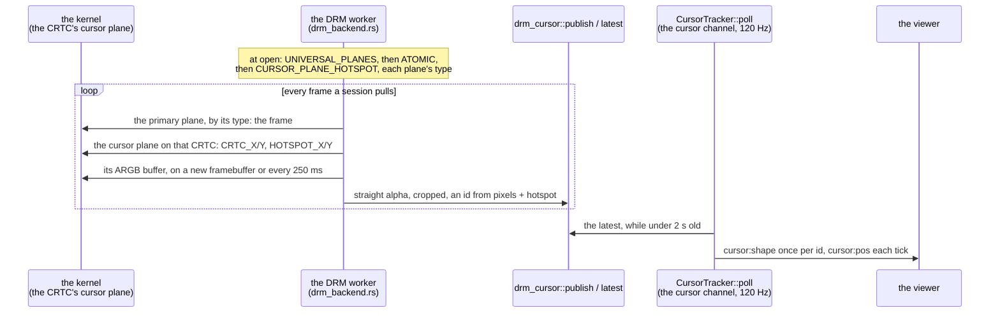
```mermaid
sequenceDiagram
    participant K as the kernel<br/>(the CRTC's cursor plane)
    participant W as the DRM worker<br/>(drm_backend.rs)
    participant S as drm_cursor::publish / latest
    participant T as CursorTracker::poll<br/>(the cursor channel, 120 Hz)
    participant V as the viewer
    Note over W: at open: UNIVERSAL_PLANES, then ATOMIC,<br/>then CURSOR_PLANE_HOTSPOT, each plane's type
    loop every frame a session pulls
        W->>K: the primary plane, by its type: the frame
        W->>K: the cursor plane on that CRTC: CRTC_X/Y, HOTSPOT_X/Y
        W->>K: its ARGB buffer, on a new framebuffer or every 250 ms
        W->>S: straight alpha, cropped, an id from pixels + hotspot
    end
    T->>S: the latest, while under 2 s old
    T->>V: cursor:shape once per id, cursor:pos each tick
```

| | what | why |
|---|---|---|
| the caps | `DRM_CLIENT_CAP_ATOMIC`, then `CURSOR_PLANE_HOTSPOT` | `CRTC_X/Y` are atomic-only properties. On a paravirtual GPU (virtio-gpu, qxl, vmwgfx) the kernel then hides the cursor plane from an atomic client that does not also set the hotspot cap. Neither refusal is fatal: capture goes on, and the viewer keeps its badge |
| the position | `CRTC_X/Y`, plus `HOTSPOT_X/Y` where the driver has them | real GPUs have no hotspot property, because their compositor already placed the buffer so the hotspot lands on the pointer. There the visible image's top-left stands in for it. Either way the viewer draws the crop's top-left exactly where the plane shows it |
| the image | ARGB8888, premultiplied, straightened to the wire's straight alpha; cropped to the visible pixels | hardware cursor buffers are 64×64 or 256×256 whatever the image, so the crop keeps a `cursor:shape` small. A visible image whose message would still pass one data-channel message (about 110×110 px or more) goes out scaled down to fit (#4207, `docs/remote-control.md` §18.2) |
| the id | a hash of the cropped pixels and the hotspot | the viewer caches a shape per id for the session and never replaces one, so the id must change whenever either does |
| the primary plane | chosen by its `type` (P3b's half) | the first bound plane used to stand in, on the assumption that cursor and overlay planes are unbound. The cursor plane is bound wherever the pointer shows |
| only this arm | mutter's and the portal's streams embed the pointer, and publish nothing here | a cursor from the channel there would draw a second pointer over the streamed one |

⚠️ **The hardware cursor is the compositor's.** Where a compositor draws the
pointer into the primary plane itself (a software cursor, or a GPU without a
cursor plane), the cursor plane stays unbound and the pointer is already in the
frame. The tracker then reports it hidden, and the viewer shows its badge, as
before.

**Kill switch**: `ROOMLERD_DRM_CURSOR=0` reads no cursor plane and sets none of
the caps it needs.

**Measured** on the lab's GNOME 50 system guest (Ubuntu 26.04, virtio-gpu,
`drm_capture` + `uinput`), 2026-10-13, by the AC5 `cursor` plan of the viewer
oracle. The person at the screen moves the pointer over QMP, outside every
roomler input path, and the oracle reads where the viewer draws it:

| | 0.4.132, the release | P3c (`1de8d54da`) | P3c, `ROOMLERD_DRM_CURSOR=0` |
|---|---|---|---|
| the pointer in the stream | no: it is on the cursor plane | no | no |
| the viewer's overlay at the pointer (targets (0.30, 0.60) and (0.70, 0.60)) | none at either: **FAIL** | **(0.295, 0.592) and (0.695, 0.592): PASS** | none at either: **FAIL** |
| the worker's log | — | `the cursor plane is read for the viewer planes=2 cursor_planes=1 atomic=true hotspot=true` | `the cursor plane is not read (ROOMLERD_DRM_CURSOR=0 …)` |

The overlay sits a few pixels up and left of each target because the oracle
reports the cursor canvas's top-left, and the arrow's hotspot is that far into
the cropped image. KWin passes the same way: on the KDE system guest (Plasma
6.7.5, virtio-gpu) the same build put the overlay at (0.299, 0.597) and
(0.699, 0.597), with the same `planes=2 cursor_planes=1 atomic=true
hotspot=true`. Not yet measured: a real GPU, where there is no hotspot property
(the Asahi cell), and a pointer on a second monitor.

### 3.2 An unchanged screen is skipped (FR-93 P3d)

DRM says nothing about which pixels changed, so before P3d this arm read,
converted and encoded the whole scanout buffer at the target frame rate even
with nobody touching the desktop: **57.9 % of a core** for the lab's idle GNOME
50 desktop on 0.4.133, where FR-29's X11 damage skip idles at 3.4 %.

A Wayland compositor gives the signal damage would. It never draws into the
buffer on screen: it draws the next frame into another buffer and flips to it,
so the primary plane's buffer changes when the picture does. From P3d the DRM
worker skips a frame nothing changed in (`capture/drm_idle.rs`):

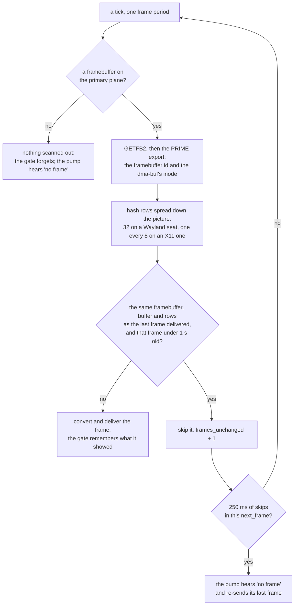
```mermaid
flowchart TD
    T["a tick, one frame period"] --> P{"a framebuffer on<br/>the primary plane?"}
    P -- no --> N["nothing scanned out:<br/>the gate forgets; the pump hears 'no frame'"]
    P -- yes --> E["GETFB2, then the PRIME export:<br/>the framebuffer id and the dma-buf's inode"]
    E --> S["hash rows spread down the picture:<br/>32 on a Wayland seat, one every 8 on an X11 one"]
    S --> G{"the same framebuffer, buffer and rows<br/>as the last frame delivered,<br/>and that frame under 1 s old?"}
    G -- no --> F["convert and deliver the frame;<br/>the gate remembers what it showed"]
    G -- yes --> U["skip it: frames_unchanged + 1"]
    U --> W{"250 ms of skips<br/>in this next_frame?"}
    W -- no --> T
    W -- yes --> I["the pump hears 'no frame'<br/>and re-sends its last frame"]
```

| | what | why |
|---|---|---|
| the buffer | its framebuffer id **and** its dma-buf's inode (P3f) | the kernel reuses a framebuffer id for a new buffer once the old one is gone. Keyed on the id alone, the mapping cache could go on reading the old buffer: a frozen picture. The PRIME export now runs every frame (an ioctl and an fd, with `DRM_CLOEXEC`) to name the buffer; the mapping is still cached |
| the rows | a hash of 32 rows, the centres of 32 equal bands, visible pixels only | a compositor that flips twice between two reads (A → B → A) shows the same buffer again with new pixels. A change that crosses a sampled row is seen (a single changed word always changes the hash); one that crosses none waits for the bound below |
| the bound | no skip outlives 1 s since the last frame delivered | a change that crosses no sampled row is at most 1 s late: FR-29's bound for X11 |
| the wait | `next_frame` keeps asking at the frame rate and says "no frame" after 250 ms of skips, as the portal arm waits on its stream (`FRAME_WAIT`) | the pump answers each "no frame" with a keepalive re-encode of its last frame, every 60 ms at most on the data-channel pumps. A "no frame" every frame period would spend on keepalives what the skip saves. A change inside the wait is still delivered within a frame period |
| the seat | `drm_idle::IdleSkip`, chosen by `capture::automatic_seat_kind`: `Flips` on a Wayland seat, `InPlace` on an X11 one (FR-113 P1, while `x11_auto_system` is on), `Off` on the console | an X server and the kernel console draw into the buffer on screen **in place**, so the buffer never changes and only the rows can see a change. 32 rows would leave a typed character up to 1 s late, so an X11 seat samples one row every 8 (`IN_PLACE_ROW_GAP`): any change at least 8 rows tall crosses one wherever it lands, the text caret's included, and is delivered on the next tick. That costs an eighth of the rows a tick, against the whole picture a delivered frame reads, converts and encodes. The console reads every frame, as before |

⚠️ **The cursor plane is read on every tick, skipped or not.** A pointer that
moves over a still desktop changes the cursor plane, not the primary, so the
cursor channel (§3.1) keeps following it while every frame is skipped.

**Kill switch**: `ROOMLERD_DRM_IDLE_SKIP=0` reads every frame again, on both
kinds of seat; `x11_auto_system = false` does so on an X11 seat. The worker's
log names which it does: `drm capture: a frame nothing changed in is skipped
…`, `… is skipped by dense rows, an X server draws in place (FR-113 P1 …)`, or
`… every frame is read (no Wayland seat and no X11 one with x11_auto_system on,
or ROOMLERD_DRM_IDLE_SKIP=0)`.

**Measured** on the lab's GNOME 50 system guest (Ubuntu 26.04, virtio-gpu,
1280×800, `drm_capture` + `uinput`), 2026-10-13. One viewer session on the
default path (the VP9-444 data-channel pump) held 4 minutes on an idle desktop
(the probe stopped); every `roomlerd` process's CPU read from `/proc` over two
60 s windows after a 20 s warm-up, as a share of one core:

| | 0.4.133, the release | P3d (`cac2d7c43`) | P3d, `ROOMLERD_DRM_IDLE_SKIP=0` |
|---|---|---|---|
| CPU, idle | **57.9 %, 57.9 %** | **5.5 %, 5.3 %** | 64.3 %, 60.7 % |
| frames read / encoded a second | 30 / 30 | ~1 / ~4 (the 1 s bound; keepalives) | 30 / 30 |
| bytes sent per 30 frames encoded | ~1.2 MB | ~2 KB | ~1.2 MB |
| the worker's log | — | `idle_skip=true` | `idle_skip=false` |

The same candidate lost nothing a person would see. With the probe ticking
(its block code changes every 250 ms), the viewer decoded 111 of 111 frames
read over 30 s, 109 distinct counters, each **0.42–0.70 s old** (median 0.56 s,
clock uncertainty ±0.44 s): the same freshness as AC1's mutter arm. The
cursor overlay still followed the pointer to both targets of AC5's plan, and
AC4's input oracle passed all 8 checks. An idle picture is also steadier. The
release re-encoded the unchanged frame 30 times a second at QP 5, about 40 KB
each, and the hold's once-a-minute check saw the decoded picture change in 4 of
4 minutes (so did the kill switch). With the skip the encoder settled at QP 0
on four keepalives a second, and the picture changed in 1 of 4 minutes.

KWin flips the same way. On the KDE system guest (Plasma 6.7.5, virtio-gpu,
1280×800) the same candidate idled at **4.7 % and 4.7 %**, against 46.1 % and
44.5 % with `ROOMLERD_DRM_IDLE_SKIP=0`. The probe's counter was as fresh
(111 of 111 decoded, 0.39–0.67 s old), the cursor overlay sat at both
targets, and AC4's oracle passed all 8 checks.

**An X11 seat (FR-113 P1)**, measured the same way, 2026-10-18: a vmtest Ubuntu
24.04 cell (GNOME 46 on Xorg, virtio-gpu, 1280×800), a system install on its
defaults, the plan switched on by itself (`idle_skip=InPlace`), one viewer on
the default path, an idle desktop:

| | `InPlace` (P1) | `ROOMLERD_DRM_IDLE_SKIP=0` (every frame, as before P1) |
|---|---|---|
| CPU, idle, two 60 s windows | **5.5 %, 5.5 %** | 46.3 %, 46.5 % |
| a picture in the viewer's samples | 274 of 274 | 271 of 271 |
| the worker's log | `skipped by dense rows, an X server draws in place` | `every frame is read` |

Inside 2 × 3.4 % = 6.8 % (FR-113 AC6), and the X11 seat's input and lock rows
of the same run are in FR-113's field log.

### 3.3 A display switched off (FR-93 P3e)

GNOME's idle blank switches the display off through KMS itself. Measured on the
lab's GNOME 50 system guest (Ubuntu 26.04, virtio-gpu, `drm_capture` +
`uinput`) on the released 0.4.134, 2026-10-14, with the screen left idle past a
10 s idle delay:

| | before | the blank (+40 s and +65 s) | after a wake |
|---|---|---|---|
| the connector (`/sys/class/drm/card0-Virtual-1`) | `connected`, `enabled`, `dpms=On` | `connected`, `disabled`, `dpms=Off` | `connected`, `enabled`, `dpms=On` |
| the CRTC (the atomic state in debugfs) | `enable=1 active=1` | `enable=0 active=0` | `enable=1 active=1` |
| the planes | the primary and the cursor each hold a framebuffer | both `fb=0` | new framebuffers |
| the guest's screen (QEMU's screendump) | lit | 0.07 % lit | lit: the lock screen (the blank locks) |
| a root `capture-smoke` through DRM | 15 frames | the open fails (`no plane is bound to a CRTC with a live framebuffer`), scrap fails after it: `backend_error` | 15 frames |

Before P3e, a session already running when the display went off kept its last
frame on screen and said nothing. The grab found no plane bound and said "no
frame", and every pump answers "no frame" with a keepalive re-encode of the
frame it last sent. This was AC7's one DRM failure, step log 66. A session that
started during the blank failed the DRM open, fell through the cascade, and
read a generic `backend_error`, and nothing reopened it when the display woke.
From P3e:

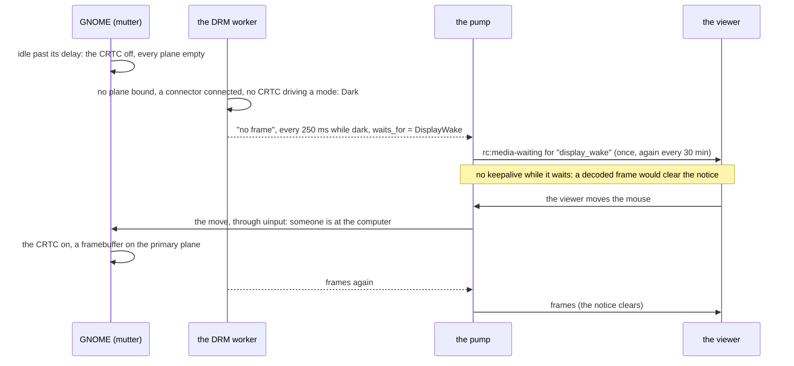
```mermaid
sequenceDiagram
    participant G as GNOME (mutter)
    participant W as the DRM worker
    participant P as the pump
    participant V as the viewer
    G->>G: idle past its delay: the CRTC off, every plane empty
    W->>W: no plane bound, a connector connected, no CRTC driving a mode: Dark
    W-->>P: "no frame", every 250 ms while dark, waits_for = DisplayWake
    P->>V: rc:media-waiting for "display_wake" (once, again every 30 min)
    Note over P,V: no keepalive while it waits: a decoded frame would clear the notice
    V->>P: the viewer moves the mouse
    P->>G: the move, through uinput: someone is at the computer
    G->>G: the CRTC on, a framebuffer on the primary plane
    W-->>P: frames again
    P->>V: frames (the notice clears)
```

| | what | why |
|---|---|---|
| "off" | the grab found no plane bound, a connector is `connected`, and no CRTC drives a mode (`display_off`) | a passing modeset keeps its CRTC. A host with no monitor connected has no display to wake, so it is not "off" and falls through as before |
| the running session | while dark, `next_frame` looks again every 250 ms and says "no frame"; `DrmCapture::waits_for` answers `DisplayWake` | nothing changes until the display wakes, so a frame period's worth of ioctls would buy nothing |
| the pumps | a "no frame" whose capture waits goes to `CaptureWait`. It tells the controller once (`rc:media-waiting`, `for: "display_wake"`, 60 minutes) and again every 30 minutes, and no keepalive goes out. A frame ends the wait | the viewer clears its notice at the first decoded frame, and a keepalive would be one; the viewer holds its watchdog only until the deadline it was told |
| the open | a session that opens during the blank waits for the wake: `open_through_wait` with `DISPLAY_OFF` (§5.3's wait, which P3e generalised). Told once, the display asked every second, the open tried again as it wakes, up to an hour, and dropped when the session ends. `capture-smoke` and the recorder fail at once, as before | the same wait GNOME's lock screen gets, with the DRM node's own state as the signal |
| the hint | *This computer's display is off: it went to sleep. Moving the mouse or pressing a key wakes it, from this viewer when it controls the computer, or at the computer itself* | a system install's input goes through `uinput`, which the compositor counts as someone at the computer |
| `ROOMLERD_MEDIA_WAITING=0` | nothing is said, and the keepalives stay | without the notice, a viewer that saw no frames would re-create its session every ~10 s |

The viewer titles the notice *This computer's display is asleep*, with no "if
nobody answers" line (`mediaWaitingCopy`).

⚠️ A shared stream's follower viewers (the multi-viewer pipeline) are not told.
The notice goes to the session whose pump owns the capture, as P2d-2's and
P5b's do.

**Kill switch**: `ROOMLERD_DRM_WAKE_WAIT=0` reads a dark display as before P3e.
The worker logs the transitions: `drm capture: the display is off; waiting for
it to wake`, and `… the display is on again`.

**Measured** with FR-93's lifecycle oracle (one viewer session sampled every
500 ms against prod's viewer) on the same guest, 2026-10-14. Each blank is
GNOME's own, and each wake is the **viewer's** mouse moving over the stage:

| | 0.4.134, the release | P3e (`39a238b3e`) |
|---|---|---|
| a session running through the blank | the last frame, **no reason** | the notice **0.0 s** after the screen measured dark (`drm capture: the display is off` in the journal, the controller told 0.25 s later) |
| the viewer's mouse, during the blank | a new picture 1.1 s later | a new picture **1.0 s** later; the unlock: 1.2 s, the probe live at 1.7 s |
| a session opened during the blank | `backend_error`, *the host's capture backend failed to start*, then **no picture at all**, through the wake and the unlock | the notice at once (the open's wait); the viewer's mouse: the DRM open 1.1 s later and the first frame at 1.5 s; the unlock: the probe live at 2.0 s |

The candidate also met a second blank in the same run: GNOME's lock screen
blanks after a short idle of its own. It was told and woken the same way. The
prod viewer showed the agent's hint under its P2d-2 title until a promote
carries P3e's words.

### 3.4 Throughput at 4K (FR-107)

A 4K scanout is 35 MB a frame, and the CPU reads it out of uncached device
memory. On an Apple M2 Pro with GNOME's 10-bit `XR30` that measured 47–55 ms
for a full read and 27–34 ms for FR-36's fused half-size read
(`capture-smoke`, still and moving screen). The software-encode pumps then
resample every frame down to their encode box, 1920×1012 there, with a
Lanczos-3 that costs in proportion to the *source* area. A moving window on
0.4.139 ran at **6–9 fps** on the VP9 path and 15–16 fps on the RTP track
(FR-107, #2317). The encode was never the problem: OpenH264 took 13–19 ms.
The GPU now reads the scanout instead, and the frame period no longer pays
for the grab.

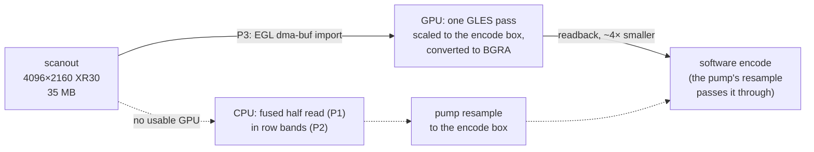
```mermaid
flowchart LR
    S["scanout<br/>4096×2160 XR30<br/>35 MB"] -->|"P3: EGL dma-buf import"| G["GPU: one GLES pass<br/>scaled to the encode box,<br/>converted to BGRA"]
    G -->|"readback, ~4× smaller"| E["software encode<br/>(the pump's resample<br/>passes it through)"]
    S -.->|"no usable GPU"| C["CPU: fused half read (P1)<br/>in row bands (P2)"]
    C -.-> R["pump resample<br/>to the encode box"]
    R -.-> E
```

| Phase | What changed | Where | Kill switch |
|---|---|---|---|
| **P1** | The DRM arm honours the pump's encode box (`set_output_cap`, the seam macOS already honours). Whenever half the source still covers the box, the CPU path takes the fused half read, whatever the policy says: a 4K scanout for a 1920×1012 encode, but never a 1440p one, whose half would be smaller than what the encode keeps. The VP9 and FFmpeg DataChannel pumps open their capture with `Never` (`agents/roomlerd/src/peer.rs:4027`, `:6797`), so before P1 they read the full 4K and resampled all 8.8 M pixels of it | `wants_half`, `agents/roomlerd/src/capture/drm_backend.rs:1513`; `set_output_cap`, `drm_backend.rs:1742` | `ROOMLERD_DRM_FOLLOW_CAP=0` |
| **P2** | The CPU repack runs in row bands, one thread each (4 by default). Each thread still reads its own rows in order, the one access pattern FR-36 measured this mapping to tolerate. The output is byte-identical to the single pass, which `banded_repacks_match_the_single_pass` locks for every layout | `in_bands`, `drm_backend.rs:713`; `band_threads`, `drm_backend.rs:741` | `ROOMLERD_DRM_THREADS=1` |
| **P2b** | The frame period runs from when a frame was *asked for*, not from when it arrived. Timed from the arrival, every period also paid for the grab, so a 30 fps target ran at 1000 / (33.3 + grab): 15–16 fps with the CPU's ~34 ms read, 26–27 with the GPU's ~3 ms. Both predictions matched the measurements to within 1 fps | `next_frame`, `drm_backend.rs:1618` | — (a timing fix) |
| **P3** | The GPU reads the scanout. EGL imports its dma-buf through Mesa's surfaceless platform, on the render node, with no display server. One GLES pass renders it at **exactly** the pump's encode box (a box filter of up to 4×4 bilinear taps a pixel), and converts any of the eight RGB scanout formats to BGRA. The CPU reads back that small frame, and the pump's resample has nothing left to do. Imports are cached per buffer, keyed as the mapping is (FR-93 P3f). `libEGL.so.1` and `libGLESv2.so.2` are loaded at runtime, so no package gains a dependency. A host without them, with a software renderer (`llvmpipe`), or whose GPU pass fails keeps the CPU path, said once in the log. The idle skip (§3.2) and the cursor plane (§3.1) are unchanged | `Egl`, `agents/roomlerd/src/capture/drm_gpu.rs:316`; `Egl::retire`, `drm_gpu.rs:445`; `Converter::open`, `drm_gpu.rs:464`; `convert`, `drm_gpu.rs:754`; `via_gpu`, `drm_backend.rs:152` | `ROOMLERD_DRM_GPU=0` |

Shipped in **0.4.140**. Measured on that box (GNOME, 4096×2160 `XR30`), one
viewer, a continuously moving window (`vkcube`), 0.4.139 and the released
0.4.140 on the same desktop:

| | 0.4.139 | 0.4.140 |
|---|---|---|
| VP9 4:4:4 over the DataChannel | 6.3 fps, resample 49.5 ms | **27.3 fps**, resample 0.0 ms |
| H.264 on the RTP track | 15.1 fps, capture 47.8 ms | **28.8 fps** |

The grab alone, `capture-smoke`, 240 frames, the idle skip off:

| Scanout 4096×2160 → | 0.4.140, GPU (P3) | 0.4.140, CPU (`ROOMLERD_DRM_GPU=0`: P1 + P2) | 0.4.139 |
|---|---|---|---|
| 2048×1080, still | **1.92 ms** | 13.10 ms | 23.0 ms |
| 2048×1080, moving | **1.91 ms** | 13.79 ms | 24.1 ms |
| 4096×2160, still | 6.58 ms | 23.38 ms | 42.3 ms |
| 4096×2160, moving | 6.47 ms | 23.53 ms | 51.0 ms |

A frame from the GPU and one from the CPU path, of the same still scanout at
2048×1080, differ by a mean of 0.10 levels of 255: the same picture.

The first GPU frame costs 32–46 ms more, once per capture: the EGL context and
the shader compile.

⚠️ **The EGL display belongs to the process, and a capture owns only its
context.** `Egl` (`drm_gpu.rs:316`) comes up with the first capture that reaches
for the GPU and is never terminated. EGL hands every caller in a process the
same display, so one capture terminating it would cut off the imports of every
other capture still running. A capture retires its context **unbound**
(`Egl::retire`, `drm_gpu.rs:445`). A context destroyed while still current is
never freed once its thread exits: the first build leaked 2.8 MB of resident
memory a capture that way (FR-107 §9).

⚠️ **Since P2b, `capture-smoke`'s `mean_ms` includes the wait to fill the
period.** Each call costs at least one frame period, so at `--fps 240` nothing
reads below 4.17 ms. To measure the grab itself, run it with a period below the
grab (`--fps 1000`).

⚠️ **A desktop without GPU acceleration makes everything here slow, including
the person's own desktop.** On AC12's box, Mesa from the Asahi repository was
newer than the kernel's GPU interface (`DRM_IOCTL_ASAHI_GET_PARAMS failed:
Invalid argument`). Mesa fell back to `llvmpipe`, so GNOME composited a 4K
desktop on the CPU, in competition with the capture for cores and memory
bandwidth. The P3 path refuses software renderers for that reason. Upgrading
the kernel to match Mesa gave the GPU back, along with every number above.
Check it with any Vulkan or GL program on the host: `vkcube` prints *Selected
GPU*.

⚠️ **More threads stop paying under motion.** On a still screen the CPU's half
read went 27 → 18 → 12.6 ms at 1, 4 and 8 threads. With the compositor
animating it went only 34 → 29 ms, because the compositor uses the same memory
bandwidth the read needs. That is why P3 moved the read to the GPU rather than
spreading it wider. The M2's hardware video encoder has no Linux driver, so the
encode stays in software.

⚠️ **A benchmark that toggles GNOME's overview measures the content, not the
pipeline.** The animation moves for part of each toggle, and the idle skip
(§3.2) rightly sends nothing in between, so "frames per second" there reads 4–5
for every build. Measure with motion that never stops.

### 3.5 A framebuffer freed under a grab or the open (#4035, #4040)

Each grab reads which framebuffer the primary plane shows, reads the cursor
plane, and then asks the kernel for that framebuffer (`drmModeGetFB2`). A
compositor that flips to a new buffer and frees the old one between those calls
makes the kernel answer `ENOENT` for an id that was on screen a moment before.
Until #4035 that failed the grab. A pump has one answer to a failed grab: it
rebuilds the capture, and the VP9 4:4:4 and RTP pumps drop their encoder with
it. So the viewer got a keyframe and a gap for a race the next tick would have
won. A bounded read of the fleet's logs over the 7 days to 2026-11-18 found 18
such rebuilds, in 8 sessions on 4 lab guests, all on the VP9 4:4:4 pump. On an
FR-148 lab cell they landed inside two measurement holds, and a result was
withdrawn (#3953).

An `ENOENT` now costs its grab one tick, and a run of them is bounded
(`FreedRun`, `agents/roomlerd/src/capture/drm_backend.rs:1193`):

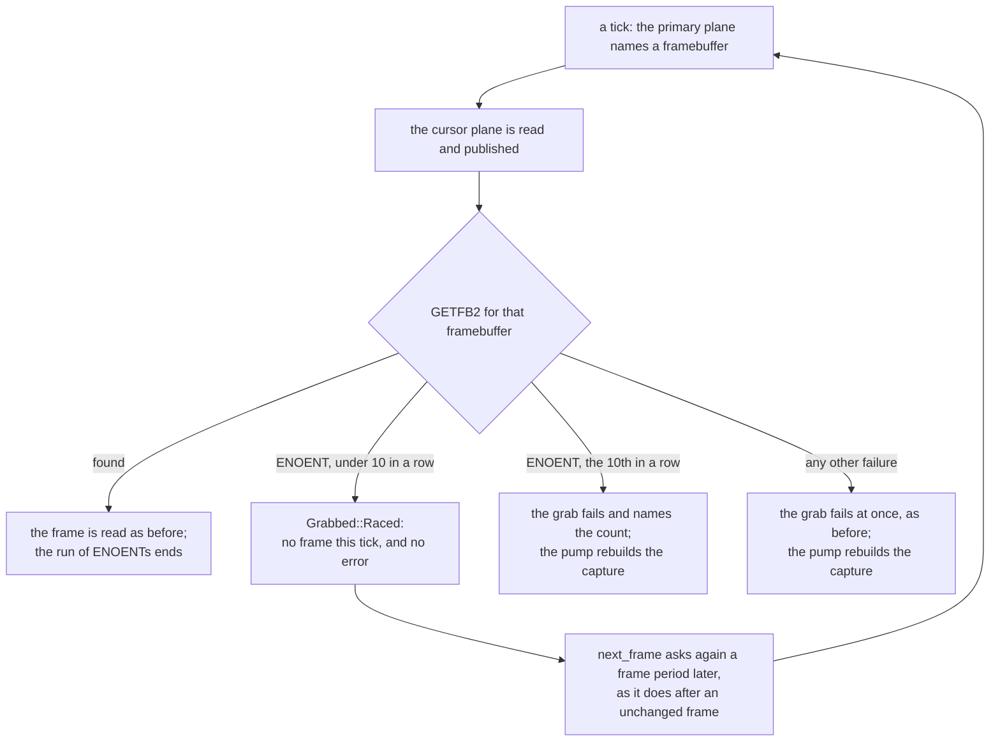
```mermaid
flowchart TD
    T["a tick: the primary plane names a framebuffer"] --> C["the cursor plane is read and published"]
    C --> G{"GETFB2 for that framebuffer"}
    G -- found --> R["the frame is read as before;<br/>the run of ENOENTs ends"]
    G -- "ENOENT, under 10 in a row" --> K["Grabbed::Raced:<br/>no frame this tick, and no error"]
    K --> N["next_frame asks again a frame period later,<br/>as it does after an unchanged frame"]
    N --> T
    G -- "ENOENT, the 10th in a row" --> X["the grab fails and names the count;<br/>the pump rebuilds the capture"]
    G -- "any other failure" --> F["the grab fails at once, as before;<br/>the pump rebuilds the capture"]
```

| What the grab meets | Transient? | What the pump sees |
|---|---|---|
| GETFB2 answers `ENOENT`: the compositor freed the framebuffer after the plane read | **yes**, a lost race: the next grab reads the plane again and finds the buffer that replaced it | nothing. `next_frame` waits the tick out as it does an unchanged frame: it asks again a frame period later, and says "no frame" only after 250 ms without one (§3.2) |
| `ENOENT` on `FREED_RUN_MAX` (10) grabs in a row | **no**: the plane goes on naming a framebuffer the kernel cannot find | the error, *"drmModeGetFB2: No such file or directory (os error 2), 10 grabs in a row: the primary plane names a framebuffer the kernel cannot find (#4035)"*. The pump rebuilds the capture, which reads the planes again |
| any other GETFB2 failure, `EPERM` and `EACCES` among them, or a fourcc the drm crate does not know | no | the error at once and a rebuild, as before |
| any later failure of the grab: a non-linear modifier, an unhandled pixel format, no GEM handle, the PRIME export, the `mmap` | no | the error at once and a rebuild, as before |
| no plane bound: nothing scanned out | not a failure | "no frame", as before: the pointer is hidden, the idle gate forgets, and a display switched off is told (§3.3). It asks no GETFB2, so it neither ends nor extends a run |
| the cursor plane's own GETFB2 or read fails | not a failure | nothing: the pointer is hidden until the cursor's next read (a new buffer, or 250 ms), as before (§3.1) |

⚠️ **The errno decides, never the message.** The drm crate hands the ioctl's
errno over as `io::Error::from_raw_os_error`, and `freed`
(`drm_backend.rs:1230`) compares that code with `ENOENT`. An error that only
reads like one, with *"No such file or directory"* in its text, fails the grab
like any other, and `any_other_getfb2_failure_fails_at_once` holds it to that.

⚠️ **A skipped tick is neither "nothing scanned out" nor "unchanged".** It is
its own answer, `Grabbed::Raced` (`drm_backend.rs:823`). "Nothing scanned out"
hides the pointer, makes the idle gate forget its last frame, and leads the
worker to check for a dark display (§3.3); a race does none of that. The cursor
plane was read and published before GETFB2, so the pointer keeps following the
viewer's mouse through a skip, and the gate still holds the frame it last
delivered. `next_frame` waits a race out on the same arm as an unchanged frame
(`drm_backend.rs:1679`), but does not count it in `frames_unchanged`, which
stays the idle skip's own measure.

⚠️ **Bounded on purpose.** A plane that keeps naming a framebuffer the kernel
cannot find has not lost a race, and skipping it for good would freeze the
picture with nothing to recover it. Ten in a row (`FREED_RUN_MAX`,
`drm_backend.rs:1171`) is a third of a second at 30 fps and a sixth at 60. The
run ends in the rebuild every `ENOENT` caused before, and its error carries the
count, so a field read can tell a bounded run's end from the race #4035
removed.

**The next tick, not a second read in this one.** The race is a window between
two ioctls. The next grab, a frame period later, reads a plane the compositor
has finished flipping; a second read inside this grab would repeat the plane
and cursor reads within the same tick. One mechanism also keeps the bound a
plain count.

**The log.** A capture's first skip says so once: `drm capture: the compositor
freed the primary plane's framebuffer mid-grab (ENOENT): the tick is skipped,
and 10 in a row rebuild the capture (#4035)`. When the capture ends, `drm
capture: ticks skipped because the compositor freed their framebuffer mid-grab
(#4035)` gives the total as `skipped`.

The open makes the same two calls and can lose the same race; since #4040 it
reads the plane again (below). There is no kill switch: the bound already falls
back to the old rebuild for a plane that stays broken, and a knob
would raise FR-135's ratchet (`scripts/rc-media-ratchet.sh` counts env reads in
`capture/`). The class this belongs to, a transient capture error that forces a
full rebuild, is FR-135's `CaptureStage` (phase R4b). Its ledger row,
`cap:SPC-58` in `docs/plans/rc-media-debt.tsv`, retires when the capture stage
classifies its errors, so that a transient one costs a tick, bounded, and only a
persistent one reopens. Unit-tested without a DRM device (`FreedRun::judge`,
and `next_frame` against a stand-in worker); not yet field-verified: #4035's
acceptance is the same bounded log read, over a week, after the release that
carries it.

**At the open (#4040).** Before the first grab, the open reads the primary plane
and asks GETFB2 for its framebuffer, to size the capture and to refuse a scanout
it may not read (`unreadable`, §3). Until #4040 an `ENOENT` there failed the
open. A failed open falls through the cascade (§1): to the portal arm where that
is switched on, otherwise to arms that may not serve a Wayland system install,
and the viewer is shown the open's error (§1.1). Every reopen comes back through
this open, including a pump's rebuild at the end of a run of freed grabs
(above). Now the open reads the plane again (`open_framebuffer`,
`drm_backend.rs:1275`, called from the worker at `drm_backend.rs:1021`):

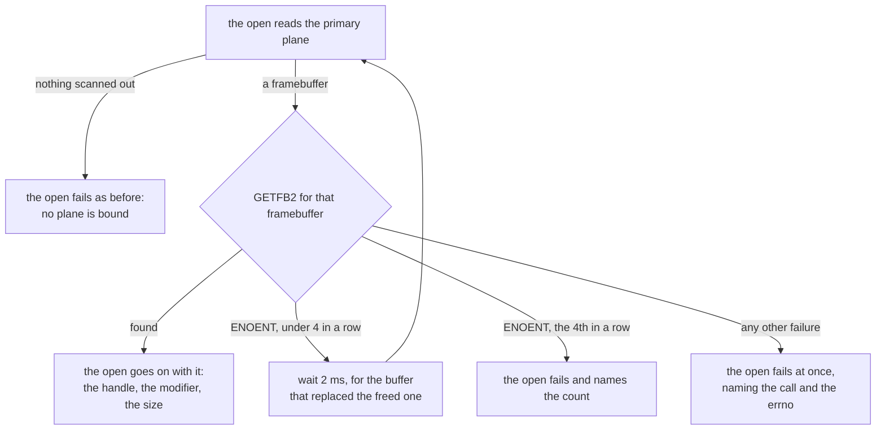
```mermaid
flowchart TD
    P["the open reads the primary plane"] -- "nothing scanned out" --> N["the open fails as before:<br/>no plane is bound"]
    P -- "a framebuffer" --> G{"GETFB2 for that framebuffer"}
    G -- found --> O["the open goes on with it:<br/>the handle, the modifier, the size"]
    G -- "ENOENT, under 4 in a row" --> W["wait 2 ms, for the buffer<br/>that replaced the freed one"]
    W --> P
    G -- "ENOENT, the 4th in a row" --> X["the open fails and names the count"]
    G -- "any other failure" --> F["the open fails at once,<br/>naming the call and the errno"]
```

| What the open meets | Transient? | What the cascade sees |
|---|---|---|
| GETFB2 answers `ENOENT`: the compositor freed the framebuffer after the plane read | **yes**, the same race | nothing: the open reads the plane again `OPEN_REREAD_WAIT` (2 ms) later, asks GETFB2 for the buffer that replaced the freed one, and opens on it |
| `ENOENT` on `OPEN_FREED_MAX` (4) reads in a row | **no** | the open's error, *"drmModeGetFB2 failed on 4 reads of the primary plane in a row (#4040): No such file or directory (os error 2)"*, and the cascade falls through as before |
| any other GETFB2 failure, or a fourcc the drm crate does not know | no | the open's error at once, naming the call and what it got: *"drmModeGetFB2 failed on the primary plane's framebuffer: Invalid argument (os error 22)"* |
| a read of the plane, the first or a later one, finds nothing scanned out | as before | the open's error as before, *"no plane is bound to a CRTC with a live framebuffer …"* (`NO_SCANOUT`). A display switched off is still waited for (§3.3): that wait asks the display, not the words |

⚠️ **The plane again, not GETFB2 again.** GETFB2 for the freed id would only
answer `ENOENT` again: the kernel no longer has that framebuffer. The plane
names the one that replaced it, so the open reads the plane and asks for that
one. `a_framebuffer_freed_at_the_open_reads_the_plane_again_and_opens` checks
that GETFB2 is asked for the new id.

⚠️ **A GETFB2 failure is never the missing capability.** The open's error used
to read *"drmModeGetFB2 failed (…) — this needs CAP_SYS_ADMIN to receive the GEM
handle"*, so a lost race read as a permission problem. GETFB2 does not fail for
a caller without `CAP_SYS_ADMIN`: it answers with no buffer handle, and
`unreadable` refuses that case in its own words (§3, FR-93 P3h). The open's
GETFB2 errors now name the call and the errno, and
`no_getfb2_failure_blames_cap_sys_admin` holds every GETFB2 error, at the open
and in a grab, to that. Both still start with *"drmModeGetFB2 failed"*, as the
old line did, so one search counts the open's failures before and after #4040.

**Four reads, 2 ms apart.** The race is a window between two ioctls, and the
open's caller waits on it, so its worst case stays small: three waits, 6 ms.
Right after an `ENOENT` the plane names the buffer that replaced the freed one,
which stays on screen until the compositor's next flip completes, so the next
read almost always wins, and losing again takes a second race. 2 ms is short
beside a refresh period (4.2 ms at 240 Hz), and the sleep gives the CPU back, so
the next two ioctls start on a fresh time slice: a thread preempted between
them, as a busy guest's vCPU can be, is the likeliest way to stretch the window.
Four in a row are no longer a lost race, and the open fails as it did before
#4040, saying how many. A grab's tick is not the unit here: the open has no tick
to skip and must hand the cascade a size or an error, and `FreedRun` counts
frame periods and names grabs. So the open's rule is its own, with every effect
passed in (the plane read, GETFB2, the wait), which is how the unit tests drive
it without a DRM device.

**The log.** An open that read the plane again says so once, with the count as
`rereads`: `drm capture: the open found the primary plane's framebuffer freed
(ENOENT) and read the plane again (#4040)`.

Its ledger row is `cap:SPC-59` (`CaptureStage`, R4b), beside `cap:SPC-58` and
with the same retire condition. Unit-tested without a DRM device:
`a_framebuffer_freed_at_the_open_reads_the_plane_again_and_opens`,
`a_run_of_freed_framebuffers_at_the_open_fails_it_and_names_the_count`,
`any_other_getfb2_failure_at_the_open_fails_it_at_once`,
`a_reread_that_finds_nothing_scanned_out_fails_as_the_first_read_does` and
`no_getfb2_failure_blames_cap_sys_admin`. Not yet field-verified: #4040's
acceptance is a bounded read of `agent_logs` that counts the open's GETFB2
failures before, and over a week after, the release that carries it.

## 4. The portal arm (FR-45 P1–P4)

### 4.1 Why a helper process, and why it dlopens

The portal is **per user session**: it lives on the session bus, checks
`SO_PEERCRED`, and `XDG_RUNTIME_DIR` is `0700`. A root daemon with no session
bus asking it anything gets `no-session-bus`, which is the architecture rather
than a misconfiguration. So the daemon spawns **itself** — the hidden
`roomlerd portal-helper` subcommand — as the console user, with that session's
`XDG_RUNTIME_DIR`, `DBUS_SESSION_BUS_ADDRESS`, `DISPLAY` and `WAYLAND_DISPLAY`
(`capture/portal/mod.rs:1316`), through a verified privilege drop rather than
`CommandExt::uid()` (which leaves the child in root's supplementary groups — a
silent retention bug, not a visible failure).

⚠️ **Only a root daemon drops.** A per-user daemon (`roomler.service`, the
`install.sh` default) already *is* the session's owner, and "dropping" to
itself is not a no-op: `setgroups(2)` needs `CAP_SETGID` even to set the groups
a process already holds, so the drop's pre-exec hook failed `EPERM`, the helper
never started, and the cascade fell through to Xwayland's empty root — a black
stream on every per-user install that set `portal_capture`. Every FR-45 field
run was under root, which hid it until the vmtest per-user cell ran with the
keys set (#1719 run B). The rule is now three-way (`run_as`,
`capture/portal/mod.rs:1452`): root drops, the session's owner runs as itself,
anyone else is refused with both uids named — and a per-user daemon looks up
its **own** session, not the first active one.

🔑 **The subcommand buys the session context; only `dlopen` buys the linkage.**
A helper *subcommand* is the same ELF as the daemon, so linking `libpipewire`
for the helper's sake would put it in every Linux build's `DT_NEEDED` — and a
missing `.so` there does not degrade a feature, the loader refuses to start the
daemon at all, on every headless fleet host that will never run a portal.
`portal/pipewire.rs:307` therefore `dlopen`s `libpipewire-0.3.so.0` at runtime
and reports `unavailable — libpipewire not present (tried …)` where it is
absent; `readelf -d` shows **zero** PipeWire entries on both architectures, and
the daemon was run with the library bind-mounted away to prove the degradation
is graceful. The SPA POD builders are `static inline` in PipeWire's headers
(nothing to `dlsym`), which is why `portal/pod.rs` serialises them by hand.

### 4.2 The handshake

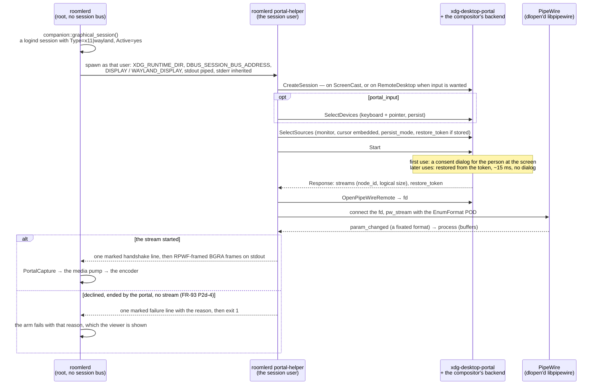
```mermaid
sequenceDiagram
    participant D as roomlerd<br/>(root, no session bus)
    participant H as roomlerd portal-helper<br/>(the session user)
    participant XDP as xdg-desktop-portal<br/>+ the compositor's backend
    participant PW as PipeWire<br/>(dlopen'd libpipewire)

    D->>D: companion::graphical_session()<br/>a logind session with Type=x11|wayland, Active=yes
    D->>H: spawn as that user: XDG_RUNTIME_DIR, DBUS_SESSION_BUS_ADDRESS,<br/>DISPLAY / WAYLAND_DISPLAY, stdout piped, stderr inherited
    H->>XDP: CreateSession — on ScreenCast, or on RemoteDesktop when input is wanted
    opt portal_input
        H->>XDP: SelectDevices (keyboard + pointer, persist)
    end
    H->>XDP: SelectSources (monitor, cursor embedded, persist_mode, restore_token if stored)
    H->>XDP: Start
    Note over XDP: first use: a consent dialog for the person at the screen<br/>later uses: restored from the token, ~15 ms, no dialog
    XDP-->>H: Response: streams (node_id, logical size), restore_token
    H->>XDP: OpenPipeWireRemote → fd
    H->>PW: connect the fd, pw_stream with the EnumFormat POD
    PW-->>H: param_changed (a fixated format) → process (buffers)
    alt the stream started
        H-->>D: one marked handshake line, then RPWF-framed BGRA frames on stdout
        D->>D: PortalCapture → the media pump → the encoder
    else declined, ended by the portal, no stream (FR-93 P2d-4)
        H-->>D: one marked failure line with the reason, then exit 1
        D->>D: the arm fails with that reason, which the viewer is shown
    end
```

Every portal method returns a `Request` path and answers later as a `Response`
**signal**, because a call can take as long as a human takes to read a dialog.
⚠️ The subscription is armed **before** the call (`screencast.rs:683`,
`:361`, `:386`): arming afterwards is a race the portal wins whenever it
answers without asking anyone — exactly the restore-token case.

The daemon side is `PortalCapture::open` (`portal/backend.rs:117`). It reads
the handshake under a **120 s deadline** (`HANDSHAKE_DEADLINE`,
`backend.rs:771`) because a portal `Start` blocks until the dialog is answered
and `open_default` runs synchronously on a media-pump worker — an unanswered
dialog fails the open with *"a consent dialog left unanswered, most likely"*
and the cascade falls through, instead of parking that worker forever. Frames
cross as **a pipe and a copy**, not `SCM_RIGHTS` buffer fds: `Frame` owns a
`Vec<u8>` so the daemon copies regardless, and passing the compositor's own
buffers means not queueing them back until the daemon has read them — a stall
the compositor can see and, got wrong, torn frames that look like a codec bug.
`wire.rs` puts a `RPWF` magic on every header so a desynchronised reader fails
at the next boundary rather than reading pixels as a length. ⚠️ After the
handshake **stdout is binary; diagnostics go to stderr** — a stray `println!`
in the helper corrupts a frame.

⚠️ **A helper that fails says why (FR-93 P2d-4).** Before its stream starts,
a helper that cannot go on writes one marked line of its own,
`ROOMLER_PORTAL_STREAM_FAILED:` and the reason as a JSON string, then exits
(`fail_stream`, `portal/mod.rs:443`; read at `:1224`). Before P2d-4 it only
logged the reason. So a person who declined both dialogs, or a portal that
ended the request itself, reached the viewer as *"the portal helper exited
before announcing a stream"*. Both were measured on the KDE guest on 0.4.135.
The handshake marker is not a prefix of the failure marker (`:` against `_`).
A daemon from before P2d-4 skips the line as noise, and an older helper still
reads as an exit. A request the portal ends without the person answering
(response code 2) now names what to check: the portal's backend for this
desktop, then a restart of the portal itself.

**Tokens.** The restore token is kept **by the helper**, in
`$XDG_STATE_HOME/roomler/portal-restore-token`, else beneath `~/.local/state` (mode `0600`, the session
user's; `-rd` for a see+touch grant, `-win` for a window grant —
`screencast.rs:597`). The daemon never receives it, by construction: an early
`SessionReport` carried it and it turned up in plaintext in a redirected log,
so the report now says only *whether* a grant was persisted. A caller that
cannot hold a credential cannot leak it.

A root daemon starts the helper with the session user's home and none of the
daemon's own XDG folder variables (`XDG_CONFIG_HOME`, `XDG_DATA_HOME`,
`XDG_STATE_HOME`, `XDG_CACHE_HOME`), so the helper keeps the token in the
session user's own state folder, whatever the daemon was started with
(#3866, `portal/mod.rs:1404`).

**What the daemon reads from the helper has a limit (#3695).** The helper
runs as the person at the screen, so each thing the daemon reads from it is
checked before the daemon acts on it:

| What the daemon reads | The limit | Over it | Where |
|---|---|---|---|
| A frame | The payload is exactly its header's rows, `stride × height` bytes (256 MiB at most), in a pixel format the daemon knows | The frame is refused before its payload is read. The refusal is the reason the capture ends, and the media pump logs it as it rebuilds the capturer | `FrameHeader::decode`, `portal/wire.rs:114`; `read_frame`, `portal/backend.rs:587`; `stream_end`, `backend.rs:750` |
| A frame, the helper's half | The helper sends exactly those rows: a longer buffer is cut after the last row, a buffer missing only the last row's padding gets it as zeros, and a shorter one is sent as it is, for the daemon to refuse | — | `payload`, `portal/wire.rs:136`, called at `portal/pipewire.rs:830` |
| The handshake | At most 64 lines, each at most 64 KiB (`HANDSHAKE_LINE_MAX`), the size FR-142 gives a control frame. The longest legitimate line is the failure reason, one sentence; a `StreamStarted` line is about 200 bytes | The open fails with the limit named | `read_stream_handshake`, `portal/mod.rs:1212`; the line reader, `line_limit.rs:85` |
| A one-shot answer: the probe, the screencast session report, the notification probe | 64 KiB in all (`ANSWER_MAX`), the handshake line's limit. The largest answer, the session report, is about 1 KiB | The caller is told why. The rest of the output is read and dropped, so the helper never waits on a full pipe | `read_answer`, `portal/mod.rs:1521`; `spawn_in_session`, `:1501` |

### 4.3 Input rides the same session (P4)

On the hosts this arm exists for, the portal is also the only thing that can
*touch* the desktop: uinput creates a device and libinput even enumerates it,
but a **nested** compositor reads its parent, not evdev, so injected events
are published and nothing consumes them (measured on WSL2). With
`ROOMLERD_PORTAL_INPUT=1` the helper opens the session on the **RemoteDesktop**
interface instead — the same session, one dialog covering see and touch, one
token — and the daemon's input arbiter forwards `InputMsg` JSON lines down the
helper's stdin (`portal/input_route.rs:113`), which the helper maps to
`NotifyKeyboardKeycode` (evdev codes from the shared FR-36 table),
`NotifyKeyboardKeysym` (typed text), `NotifyPointerMotionAbsolute` (in the
stream's **logical** size, which differs from the pixel size under a HiDPI
scale) and the axis calls (`portal/input.rs`).

- ⚠️ On a **configured** portal arm `portal_input` defaults **OFF**: a
  `WithInput` session needs its own consent grant and token, so defaulting it
  on would make every portal capture — including one already granted and
  persisted — demand a fresh dialog, and block or fall through if unanswered.
  Input must never cost capture: a `WithInput` session that fails is retried
  capture-only (`portal/mod.rs:683`). The **automatic** portal (§1.2) asks for
  remote control unless `portal_input = false` (FR-93 P4b): nothing was granted
  there before, so its first dialog may as well ask for both.
- ⚠️⚠️ **Every call waits for its reply, and must keep doing so (FR-93 P4b).**
  xdg-desktop-portal handles each portal method call on its own worker thread
  (`HANDLE_METHOD_INVOCATIONS_IN_THREAD`, in its `xdp-context.c`), so two calls
  sent back to back reach the backend in either order. FR-45's self-review had
  made them fire-and-forget (`call_noreply`), for latency. On KDE that typed 41
  of 452 characters wrong (§1.2): a key's release overtook its press, KWin
  dropped the release because the key was not down, the key stayed held, and
  the letter's next press was dropped as a repeat. A button's release overtaking
  its press would hold a mouse button down the same way. The frontend forwards
  each call to the backend before it replies, so waiting for the reply keeps the
  order, for 0.5 ms a call at the median and under 4 ms at p99, against the
  viewer's 8 ms floor between pointer moves (`Target::delivery`,
  `portal/input.rs:348`; pinned by `portal_calls_wait_for_their_replies`).
  Mutter's own RemoteDesktop (§5.2) answers on its main loop, in order, and
  keeps fire-and-forget.

  ```mermaid
  sequenceDiagram
      participant H as portal-helper
      participant F as xdg-desktop-portal<br/>(a worker thread per call)
      participant B as xdg-desktop-portal-kde
      participant K as KWin
      Note over H,K: unawaited, before P4b: "l" typed, press and release 0.05 ms apart
      H->>F: NotifyKeyboardKeysym(l, pressed)
      H->>F: NotifyKeyboardKeysym(l, released)
      F->>B: released: its thread ran first
      F->>B: pressed
      B->>K: the release, for a key that is not down: dropped
      B->>K: the press: "l" is now held until the next "l"
      Note over H,K: awaited, P4b
      H->>F: pressed
      F->>B: pressed
      F-->>H: reply
      H->>F: released
      F->>B: released
      F-->>H: reply
  ```

- ⚠️ **KDE's backend negates the vertical smooth scroll** on its way to KWin
  (`requestPointerAxis`: `wl_fixed_from_double(-y)`), while the portal's
  convention, GNOME's backend, KDE's own horizontal axis and its discrete path
  all keep positive = down. Measured on Plasma 6.7: a notch down reached the
  probe as a notch up. Where KDE's backend owns its bus name
  (`org.freedesktop.impl.portal.desktop.kde`), the helper negates first
  (`for_backend`, `portal/input.rs:224`); kill switch
  `ROOMLERD_PORTAL_KDE_SCROLL_FIX=0`.
- `ROOMLERD_PORTAL_INPUT_TRACE=1` logs every event and every call the helper
  made for it, on the wall clock, so a lab can line what was sent up against
  what a window received. That is how the ordering fault above was found. Off by
  default: a keystroke log does not belong in a journal.
- ⚠️ **GNOME hides input behind a second switch in the same dialog.** The
  *Remote Desktop* dialog carries `Share`, a monitor picker, *Remember This
  Selection* — and an **Allow Remote Interaction** toggle that is **off by
  default**. A person who clicks *Share* without flipping it grants capture
  only; the helper reports `input_granted=false` and the session runs
  view-only. Enabling the key is not enough; the person at the screen has to
  flip that switch.
- ⚠️ Axis sign follows **libinput** (positive = down/right), not evdev — the
  uinput backend's `REL_WHEEL` inversion scrolls backwards here. Confirmed in
  the field: `dy:+4` scrolled the page down.
- ⚠️ `NotifyKeyboardKeysym` is **not layout-proof**: the keysym must exist in
  the host's active keymap, or the compositor drops it silently and reports
  success (`é` and `€` vanished on a US keymap; `@ # ~` typed fine). The pump
  warns once when it forwards a non-ASCII keysym.

### 4.4 The attended-only rule — a person at the screen, never a greeter

This arm **cannot** capture a login greeter, and nothing in configuration changes
that. A locked screen is the compositor's call: mutter refuses, KWin keeps streaming
its lock screen on a token a person granted (§1.2). The reasons, from FR-36 P0 and FR-45:

- ScreenCast needs an active user session and, the first time, an interactive
  consent dialog; `restore_token` only avoids re-prompting *after a human
  approved once* — it is not a headless grant.
- **While the session is locked, mutter refuses to create or restore a
  screencast**, and the failed attempt tends to **consume the saved token**,
  dropping the next attempt back to the picker.
- Tokens are per-compositor and die with a logout or reboot.

So the daemon refuses early rather than waiting: `graphical_session()` finding
no `x11`/`wayland` session that is `Active=yes` ends the open with
*"nobody is at this machine's screen — the portal is attended-only"*
(`portal/mod.rs:1197`), and an unanswered dialog ends it at the 120 s
deadline. Both fall through to the rest of the cascade with the reason in the
log. Unattended access on Linux is FR-36's DRM arm (or §5's mutter arm where
there is no scanout) — never this one. ⚠️ Where the product says so: the spec,
this page, the `portal_capture` description in the config surface
(`crates/agent-core/src/config_surface.rs:1174`, which every `roomler config`
reader sees) and the helper's own log line. Since FR-93 P2c the web viewer says
it too: `rc:video-info` carries `capture_arm` and `attended`, and the viewer
names the arm ("desktop portal · allowed at the screen"), FR-45 AC8's option (b).

### 4.5 Detecting the portal, and why the answer is never cached

`roomlerd capture-smoke` runs the detector *inside the session* and prints one
line an operator can act on (`app.rs:7345`): `capture-smoke: portal=<status>
— <advice>`.

| `portal=` | Means | The advice it prints |
|---|---|---|
| `available (screencast vN, remote_desktop=true)` | ScreenCast and RemoteDesktop both exposed | usable for capture and input |
| `available (screencast vN, remote_desktop=false)` | ScreenCast without RemoteDesktop (wlroots backends, measured) | capture would be read-only |
| `no-screencast` | `xdg-desktop-portal` is on the bus but exposes no ScreenCast | check the backend for your compositor is **installed and running**, then **restart the frontend** — it caches its backend selection at startup |
| `portal-absent` | no `xdg-desktop-portal` on the session bus | install it plus a backend |
| `no-session-bus` | no session bus reachable | the portal needs a logged-in user session — an attended path by design |

🔑 **`no-screencast` on a host with everything installed is the normal failure,
not the exotic one.** On the fleet's GNOME Wayland host the interface was
missing because `xdg-desktop-portal-gnome` — a `static`, D-Bus-activated unit
— had never been triggered; starting it alone did **not** help, because the
frontend had cached its backend list at startup and had to be restarted after
the backend was up. A host can have every package and still offer nothing,
depending on start order — which is why availability is detected **at session
time and never cached**, and why the advice string stopped saying "install the
backend". ⚠️ Backends declare their interfaces in `.portal` files, so the
frontend can *advertise* ScreenCast while the backend that would serve it
cannot start: on WSL2 the frontend listed ScreenCast + RemoteDesktop the whole
time, and `CreateSession` timed out activating `…impl.portal.desktop.gnome`.
"The interface is exposed" proves nothing on its own.

### 4.6 One request per host, and an open that holds no worker (FR-93 P2d)

An attended open shows the person at the screen a dialog and waits for them for
up to `HANDSHAKE_DEADLINE` (120 s, `portal/backend.rs:771`). The FR-93 lab ran
the portal automatically on KDE and measured what that did with nobody answering:

- **A dialog storm.** The viewer's media watchdog re-creates a session that has
  shown no frames for 10 s, and every session opened its own request. Four
  "Share screen with" dialogs stacked within a minute.
- **A capture for nobody.** Answering a stale dialog late started a capture for a
  session already gone, with the sharing indicator on.
- **A held worker, then a dead daemon.** The pumps called
  `capture::open_default` inline, so each unanswered dialog blocked one runtime
  worker for the whole wait (`hs_rx.recv_timeout`, `backend.rs:200`). Four of
  them is every worker of a 4-core host. Measured on the released **0.4.130**
  (the KDE guest, 4 cores, `portal_capture` on, one viewer trying):
  - The viewer's watchdog re-created the session 4 times in 30 s, raising 4
    helpers and stacking 4 dialogs.
  - The runtime then stopped. The daemon logged nothing for 86 s, and a fifth
    session sat at `awaiting_consent` because nothing answered it.
  - Then `watchdog-of-watchdog: async watchdog has not heartbeat in 60.0s;
    forcing exit(2)`, and systemd restarted the daemon.

  So a viewer that keeps trying a host where nobody answers takes the daemon
  down.

The explicit `portal_capture` path had all three from the start. P2d's agent half
fixes them there, and is the precondition for the portal ever going automatic:

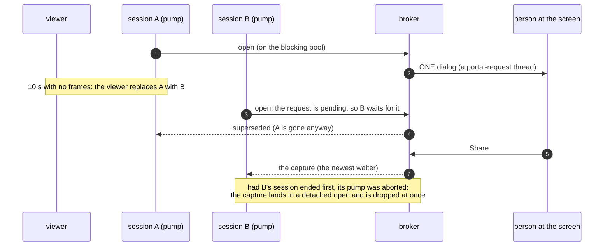
```mermaid
sequenceDiagram
    autonumber
    participant V as viewer
    participant A as session A (pump)
    participant B as session B (pump)
    participant K as broker
    participant P as person at the screen
    A->>K: open (on the blocking pool)
    K->>P: ONE dialog (a portal-request thread)
    Note over V,A: 10 s with no frames: the viewer replaces A with B
    B->>K: open: the request is pending, so B waits for it
    K-->>A: superseded (A is gone anyway)
    P->>K: Share
    K-->>B: the capture (the newest waiter)
    Note over B,K: had B's session ended first, its pump was aborted:<br/>the capture lands in a detached open and is dropped at once
```

| | what | where |
|---|---|---|
| the open runs off the workers | `capture::open_default_async`: on Linux, `open_default` on the blocking pool. The pump stays droppable while it waits, and a capture that opens after its session is gone is dropped as it arrives. Elsewhere it stays inline | `capture/mod.rs:2946`, the eight pump call sites in `peer.rs` |
| one request per host | `portal::pending::open_with`, which the configured and the automatic (P2d-3) arms share: a session that asks while a request is pending waits for **that** request, and an older waiter leaves (`Superseded`) | `portal/pending.rs:59`, `Broker::open` `:150` |
| the newest waiter wins | the outcome goes to the session that asked last, which is the one the viewer shows now | `Request::wait` `:229` |
| nobody there, nothing starts | a waiter is a blocking thread, not a session. A session's end aborts its pump (`AgentPeer::stop_serving`, `peer.rs:1970`), which detaches the open, so the capture its waiter takes is dropped as it arrives: the helper is killed and the screencast stops. An outcome that outlives its **last waiter** (each waits 5 s past the request's own deadline) is dropped in `Request::land`, the backstop | `capture/mod.rs:2946`, `Request::land` `pending.rs:220` |
| mutter is not brokered | `mutter_capture` asks nobody and opens in milliseconds, so concurrent sessions never wait on each other for it | `pending.rs:60` |

**Measured** on the FR-93 lab's KDE guest: Plasma 6.7 on Fedora 44, 4 cores, a per-user install with
`portal_capture` on and no restore token. One viewer opens three sessions in about 60 s with nobody at the
screen, and the viewer's own watchdog re-creates each one. A sampler on the guest counts the live
`portal-helper` processes; each is one pending request and one dialog.

| | 0.4.130, the release (two runs) | P2d-1 (two runs) |
|---|---|---|
| requests raised by the burst | 4 in 30 s, all 4 dialogs stacked | 1 |
| most helpers alive at once | 4 | 1 |
| the third session | sat at `awaiting_consent`, never answered | connected within 1 s |
| the daemon | no log line for 83–86 s, then `watchdog-of-watchdog: … forcing exit(2)` and a systemd restart, both runs | never restarted, logging throughout |
| the person answers while the viewer waits | — | the capture 1.6 s after the click, the picture in the viewer, one request in all, no restore token |
| the person answers after the viewer's last session ended | — | dropped: no pump took it. The restore token it left opened the viewer's next session with no dialog |

⚠️ Two controllers opening the same host at once: the older one is superseded,
not served, and its open falls through the capture cascade as a failed open
does. Where the person's desktop is the only one, it reads the reason as a
`backend_error`. On a device that also runs the daemon's virtual desktop (§2)
it opens a capture of the virtual desktop instead, whose input can go
elsewhere: [#3945](https://github.com/gjovanov/roomler-ai/issues/3945). The VP9 pump registers its
shared pipeline (P5, `media_share`) only once its capture has opened, so while the
request is pending the second viewer has nothing to join. The FFmpeg pump
registers before its open, so a second viewer of the same profile follows the
pending open instead, and since #3423 it is told the wait (§4.7). That holds for
the open's first 10 s only: the open blocks the owner's loop, so after that the
pipeline reads stale (rc.443), and the next viewer evicts it and opens its own.
That is acceptable for a path where one person at the screen allows one share,
but it is a known edge.

### 4.7 The viewer is told, and waits (FR-93 P2d-2)

P2d-1 left the viewer guessing. It still re-created its session every 10 s
while no frames arrived. Each new session joined the one request, so no second
dialog appeared, but the canvas stayed blank. An answer that came while the
viewer sat in its re-create back-off reached a session already gone. The
picture then came from the restore token, one session later (§4.6's last row).

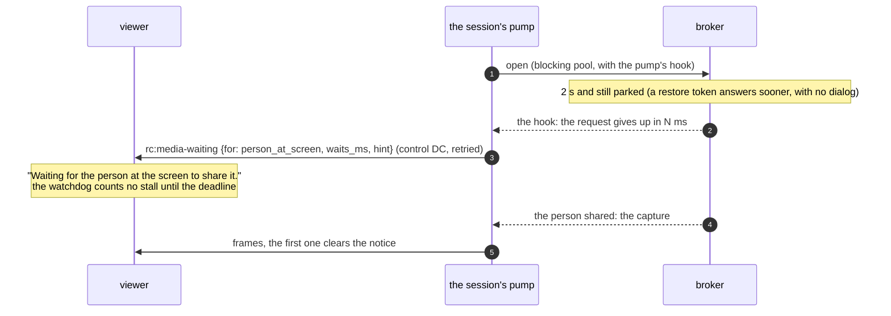
```mermaid
sequenceDiagram
    autonumber
    participant V as viewer
    participant P as the session's pump
    participant K as broker
    P->>K: open (blocking pool, with the pump's hook)
    Note over K: 2 s and still parked (a restore token answers sooner, with no dialog)
    K-->>P: the hook: the request gives up in N ms
    P->>V: rc:media-waiting {for: person_at_screen, waits_ms, hint} (control DC, retried)
    Note over V: "Waiting for the person at the screen to share it."<br/>the watchdog counts no stall until the deadline
    K-->>P: the person shared: the capture
    P->>V: frames, the first one clears the notice
```

| | what | where |
|---|---|---|
| the hook | `capture::open_default_async` takes an `OnOpenWait`, held for the open's blocking thread by `ParkHook`, which clears it on drop, so a pooled thread never carries one into the next open, not even after a panic | `capture/mod.rs` (`ParkHook`, `tell_open_waiting`) |
| when it fires | a waiter still parked `TELL_AFTER` (2 s) in fires it once, with the **request's** start, so a session that joins a pending request is told that dialog's deadline, not one counted from its own join | `portal/pending.rs` (`Request::wait`, `TELL_AFTER`) |
| the message | `rc:media-waiting {"for":"person_at_screen","waits_ms":N,"hint":…}`, retried until the control channel takes it, and never past the dialog's own deadline. A duration, not a time of day, so the viewer reads it on its own clock. From P5b `for` says what is waited for, and the hint follows it: the dialog for the screen, the dialog for remote control (P4b's automatic portal, "or to share just their screen"), `screen_unlock`, GNOME's lock screen (§5.3), (P3e) `display_wake`, a display switched off (§3.3), or (P5f) `session_away`, this user's session in the background (§5.6). A running capture sends the last two, after holding its keepalives for a 2 s quiet spell | `peer.rs` (`media_waiting_payload`, `media_waiting_hook`, P3e's `CaptureWait`) |
| a viewer sharing the capture | a session that follows another's pipeline (P5) opens no capture, so it has no hook of its own (#3423). The owner's pipeline tells it, under its own session, with the owner's retrying sender: the followers when the owner's viewer is told, a viewer that joins later with the time the wait has left, and nobody once the owner's next frame has arrived. Only an open that runs after the pipeline exists can tell it: the FFmpeg pump's first open, and every reopen | `media_share.rs` (`Pipeline::tell_waiting`, `on_frame`, `try_join`), `peer.rs` (`shared_media_waiting_hook`, `CaptureWait::hold`) |
| the viewer | the deadline is set at receipt. Until it passes, plus a 10 s grace (`RC_MEDIA_WAITING_GRACE_MS`), the watchdog counts no stall and re-creates nothing. A session that ends while waiting is not dead air | `useRemoteControl.ts` (`agentIsWaiting`, the watchdog tick, `isDeadAir`) |
| what clears it | the first frame after the notice: from P5f, only media the watchdog counted from 1 s after the notice arrived (`advanceEndsWait`, `RC_MEDIA_WAITING_SETTLE_MS`), because a frame sent just before the notice on the video channel can be counted just after it; `rc:media-unavailable` (the wait ended without an answer, and that message says why); a new connect | the same |
| kill switch | `ROOMLERD_MEDIA_WAITING=0` sends nothing, and the viewer behaves as before P2d-2. An older viewer ignores the message (an unknown `t`) | `peer.rs` |

**Measured** on the FR-93 lab's KDE guest, set up as in §4.6 (`portal_capture`
on, no restore token), against prod's viewer, which has carried P2d-2's half since
`hosted-20261012-f07ba2c`. One viewer connects, nobody answers for 75 s, then the
lab answers the dialog over QMP (2026-10-13):

| | 0.4.131, the release (P2d-1 only) | P2d-2 (master `7bf49b2b1`) |
|---|---|---|
| sessions while nobody answered | 5: the watchdog re-created it 4 times (`media stalled 10 s … re-creating session`), with "Reconnecting" in between | **1** |
| the notice | never: 0 of 51 samples | from +3 s, in every sample until the answer |
| the answer | landed while the viewer sat in its re-create back-off, so the capture went to a session already gone | the capture about **2 s** after the click, in the session that waited |
| the picture | 48 s after the answer, from the restore token, one session later | at once (`lit=81.5 %`) |
| portal requests | 2: the dialog, then the restore | 1 |

⚠️ A request nobody answers still ends at its own 120 s deadline. The viewer
then shows the reason, and only a new connect raises another dialog: at most one
per two minutes, where it was one every 10–20 s before P2d-1.

### 4.8 A compositor that restarts under the stream (FR-93 P5d)

Plasma 6 restarts KWin after a crash (`kwin_wayland_wrapper` relaunches it), and
the portal's stream dies with the old KWin. Our stream then sits *paused* with
no error, and before P5d the helper waited on frames for good: measured on
Plasma 6.7.5, a `kill -9` of `kwin_wayland` left the viewer on the last frame,
with nothing said.

The portal arm now shares the mutter arm's frame loop (`write_frames`, §5.4).
Once the stream has been outside *streaming* for 2 s, the helper says why and
ends the capture (exit status 4). The pump's reopen goes through the restore
token. Measured with the lifecycle oracle on the same guest: `portal-helper: the
portal's stream ended …`, the reopen restored without a dialog, and the viewer
had a new picture **4.0 s** after the crash. A resolution change there and back
renegotiates in place and never reaches the 2 s bound: the stream followed in
1.3 s each way, with no reopen in the journal.

The same loop covers GNOME's portal (`portal_capture` on), whose screen cast is
mutter's and ends on a mode change as §5.4 describes.

A stream that the person at the screen ended with KDE's **End** ends here too,
but it is never reopened: the portal's own `Closed` says so first (P6c, §5.7).

⚠️ **A stream the compositor never drives stays `paused`** (FR-93 P5i). The
compositor is the PipeWire driver, and a consumer's stream goes from `paused`
to `streaming` only when the driver triggers a frame. On AC12's real hardware
(Plasma 6.6), after one spell every new KDE stream stayed `paused`. Each open
failed at its 15 s deadline with *"no frame arrived before the deadline"*, on
0.4.138 and master alike, until a new KWin (the user's every session ended)
streamed the same still desktop in 28 ms. Moving the pointer, KWin's
`reconfigure` and a notification popup did not drive the stuck stream. The
helper now logs each state change (*"the PipeWire stream is paused"*), and the
error names the state the stream reached, so this case reads as the
compositor's and not as a format that produces nothing.

## 5. The mutter arm (FR-45 P5) — the unattended sibling

The portal is the obstacle on the host FR-45 was opened for, not the
compositor: on WSL2 `xdg-desktop-portal-gnome` exits immediately without a real
GNOME session, while `mutter --headless --wayland --virtual-monitor 1920x1080`
runs perfectly with software EGL (`LIBGL_ALWAYS_SOFTWARE=1` → llvmpipe on the
surfaceless platform, no `/dev/dri` needed) and exposes
`org.gnome.Mutter.ScreenCast` v4. `ROOMLERD_MUTTER_CAPTURE=1` swaps **only the
session broker**; the SPA negotiation, buffers, wire format and `ScreenCapture`
backend are the portal code unchanged.

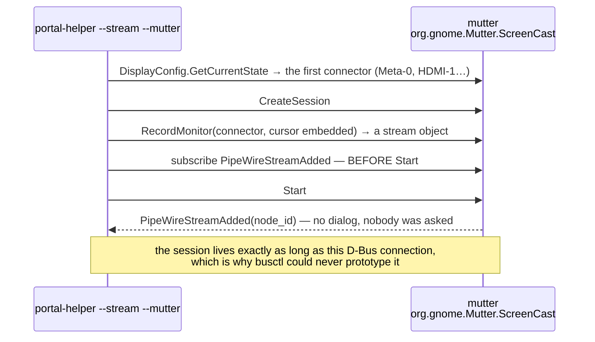
```mermaid
sequenceDiagram
    participant H as portal-helper --stream --mutter
    participant M as mutter<br/>org.gnome.Mutter.ScreenCast
    H->>M: DisplayConfig.GetCurrentState → the first connector (Meta-0, HDMI-1…)
    H->>M: CreateSession
    H->>M: RecordMonitor(connector, cursor embedded) → a stream object
    H->>M: subscribe PipeWireStreamAdded — BEFORE Start
    H->>M: Start
    M-->>H: PipeWireStreamAdded(node_id) — no dialog, nobody was asked
    Note over H,M: the session lives exactly as long as this D-Bus connection,<br/>which is why busctl could never prototype it
```

⚠️⚠️ **This path does not ask, and must never be described as a portal
variant.** `org.gnome.Mutter.ScreenCast` is a privileged session API: anything
on the user's bus may call it and mutter shows no consent dialog. That is not a
privilege escalation — reaching that bus already means running as the session
user, who can screenshot at will, and the daemon is root regardless — but it
puts this arm beside **FR-36's DRM backend**, the same unattended bargain by a
different mechanism, and it is gated the same way: opt-in on a root daemon,
automatic only in a per-user GNOME session with no key set (§1.2), and the
helper logs `opening an org.gnome.Mutter.ScreenCast session (UNATTENDED)` when
it engages. It is **GNOME-only**; KDE and wlroots hosts keep the portal. Its
input is mutter's own RemoteDesktop, which drives the screencast (§5.2, FR-93
P4).

Two things that read as a broken capture and are not:

- ⚠️ **Mutter's screencast is damage-driven.** An idle virtual monitor
  delivers **zero** frames — `capture-smoke` reported `30 attempts, 30 empty,
  ZERO frames delivered` against a monitor nothing was drawing on, and
  `30/30` frames the moment a client mapped. Put something on the monitor
  before believing "no frames".
- ⚠️ `GetCurrentState` returns **four** fields, and zvariant matches the whole
  body: a deserialiser that reads "just the monitors" fails every live call
  with a signature mismatch while a unit test pinned to the inner type passes.
  The test now pins the entire reply (`mutter.rs:732`).

### 5.1 The logind gate, and why P5 is unreachable through the daemon on WSL2

Both portal-shaped arms spawn the helper through `spawn_child`, which resolves
the session user with `companion::graphical_session()`
(`agents/roomlerd/src/companion.rs:5079`) — the same `loginctl` walk the FR-27
consent companion uses, asked since #3857 through one walk in flight, 1.5 s at
most (`graphical_session_within`, `companion.rs:9224`). It accepts a session only when
`Type=x11` or `Type=wayland` **and** `Active=yes` (`companion.rs:5132-5135`),
which is the right test for the attended portal and the wrong one for a
headless mutter: **a WSL2 distro has only `tty` sessions**, and so does any
box that runs `mutter --headless` from a service. The daemon then answers
*"nobody is at this machine's screen — the portal is attended-only"* and
falls through — while mutter itself, and `portal-helper --stream --mutter`
started by hand as the user, work fine. The 2026-09-01 P5 verification drove
the helper by hand, which is how the gap stayed hidden until 2026-09-25.

What makes the daemon path work today, without code: give logind the session
the lookup wants. `pam_systemd` reads `XDG_SESSION_TYPE` from the unit's
environment, so a transient unit that logs in through PAM registers a
`wayland` session — seatless, hence `Active=yes` — and can run the compositor
at the same time:

```bash
systemd-run --unit=headless-mutter -p User=<user> -p PAMName=login \
  -p Environment=XDG_SESSION_TYPE=wayland -p Environment=XDG_SESSION_CLASS=user \
  -p Environment=XDG_RUNTIME_DIR=/run/user/<uid> \
  -p Environment=DBUS_SESSION_BUS_ADDRESS=unix:path=/run/user/<uid>/bus \
  -p Environment=LIBGL_ALWAYS_SOFTWARE=1 \
  /usr/bin/mutter --headless --wayland --no-x11 --wayland-display wayland-1 \
  --virtual-monitor 1920x1080
```

`loginctl` then lists a `Type=wayland Class=user Active=yes` session for the
user, `busctl --user list` shows mutter owning `org.gnome.Mutter.ScreenCast`,
and the daemon's own cascade reaches `backend=portal` via `mutter node N on
Meta-0`. (`PAMName=login` logs `unable to dlopen(pam_lastlog.so)` on Ubuntu
24.04 — harmless, the module is `optional`.) Whether the product should instead
carry an operator-named session user, fall back to whichever uid's bus owns
`org.gnome.Mutter.ScreenCast`, or bless this recipe as the supported way is
FR-45's **open decision P5b** — pillar-1 code with its own field verification,
not a docs tweak.

### 5.2 Input: mutter's own RemoteDesktop (FR-93 P4)

Before P4 a mutter capture was view-only. The viewer's mouse and keyboard went
to the OS injector, and on a GNOME Wayland session XTest reaches nothing:
GNOME 49 and later route Xwayland's XTest through the EI portal (P1d). The
viewer said so, and the session could not be driven.

From P4 a mutter screencast that carries input is created inside an
`org.gnome.Mutter.RemoteDesktop` session, the API gnome-remote-desktop itself
is built on. The session drives the screencast and takes the viewer's input:

```mermaid
sequenceDiagram
    participant H as portal-helper --stream --mutter --input
    participant R as mutter<br/>org.gnome.Mutter.RemoteDesktop
    participant S as mutter<br/>org.gnome.Mutter.ScreenCast
    H->>R: CreateSession → the session and its SessionId
    H->>S: CreateSession {remote-desktop-session-id: SessionId}
    H->>S: RecordMonitor(connector, cursor embedded) → a stream
    H->>S: subscribe PipeWireStreamAdded, BEFORE Start
    H->>R: Start, which starts the linked screencast first
    S-->>H: PipeWireStreamAdded(node_id)
    Note over H: frames go to the daemon on stdout,<br/>InputMsg lines come from it on stdin
    H->>R: NotifyPointerMotionAbsolute(stream, x, y) · NotifyPointerButton ·<br/>NotifyPointerAxis · NotifyKeyboardKeycode …
```

| the arm | its input | why |
|---|---|---|
| the automatic mutter arm (§1.2) | **on**, unless `mutter_input = false` | it asks nobody, like the screencast it drives |
| a configured `mutter_capture` | only with `portal_input` too, and `mutter_input` not false | the operator chose this arm, and input stays opt-in there, as on the portal |
| the automatic portal (§1.2) | **on** (P4b), unless `portal_input = false` | its one dialog asks for remote control; a refusal is asked again for the screen only |
| a configured `portal_capture` | `portal_input` | a separate grant at the screen, with a restore token of its own, so an already-granted screen share would be asked again |

The viewer's events map onto mutter's calls as pure data
(`input::MutterCall`, `portal/input.rs`), beside the portal's:

| event | mutter's call | note |
|---|---|---|
| pointer motion | `NotifyPointerMotionAbsolute(stream, x, y)` | the stream's object path, and its own coordinates: the PipeWire size, which mutter divides by the monitor's scale |
| button | `NotifyPointerButton(BTN_*, pressed)` | evdev codes, as on the portal |
| wheel, in pixels | `NotifyPointerAxis(dx, dy, 2)` | flag 2 says a wheel. With no source flag mutter assumes a touchpad finger, which waits for a finish and then scrolls on kinetically |
| wheel, in lines or pages | `NotifyPointerAxisDiscrete(axis, steps)` | positive is down or right |
| key | `NotifyKeyboardKeycode(evdev, pressed)` | the shared HID→evdev table |
| typed text | `NotifyKeyboardKeysym(keysym, pressed)` | bound by the session's keymap, as on the portal (§4.3) |

⚠️ **mutter accepts a session's `Notify*` calls only from the D-Bus peer that
created it.** Its `check_permission` compares the sender's unique name, so input
rides the helper's own connection (`MutterSession::connection`). A second
connection would be refused on every event.

⚠️ **Input never costs capture.** A RemoteDesktop that refuses (a mutter built
without it, a session it will not create) makes the helper retry capture-only,
view-only, the portal path's rule. "Not GNOME" is not retried.

The route is the portal's seam (`input_route`), and each route now carries its
kind: while a mutter route is live, `rc:input-reach` is `full`, from "mutter's own
RemoteDesktop session (GNOME)". The desktop brief predicts the same
(`capture::planned_input_route`), so a per-user GNOME host reports
`input_reach: full` without a session open.

**Measured** on the FR-93 lab's GNOME guest (GNOME 50 on Ubuntu 26.04, a per-user
install with no key), 2026-10-13, by the lab's AC4 oracle
(`measure/viewer-input.sh … points`). The viewer clicks, scrolls and types into
the probe, a native GTK4 Wayland window, and the probe's log on the guest says
what arrived:

| | 0.4.131, the release | P4 (`3f9ad6464`) | P4 with `mutter_input = false` |
|---|---|---|---|
| the brief's `input_reach` | `none` | **`full`** | `none` |
| three pointer targets, within ±2 px | none arrived: no motion at all | **all exact**: (320,200), (960,200), (640,600) | none |
| a click | no | **press and release**, button 1 | no |
| a wheel notch down | no | **one scroll, downward** | no |
| "hello 123", typed | nothing | **`hello 123`** | nothing |
| Shift held, then a | nothing | **`A`** | nothing |
| the picture | `lit` at 1280×800 | the same | the same |

⚠️ How the kill switch was measured matters. The first run wrote the key while
the released daemon still ran, and that daemon's shutdown save erased it before
the candidate started (#2078). Written while the new build runs, the key holds.

### 5.3 A locked screen (FR-93 P5b, #2145)

GNOME closes every remote-desktop and screen-cast session when its screen
locks, and refuses new ones until it is unlocked: `CreateSession` on both
`org.gnome.Mutter.ScreenCast` and `org.gnome.Mutter.RemoteDesktop` answers
`Session creation inhibited` while the lock screen is up (asked directly on the
lab's GNOME 50 guest). The stream's source vanishes with the session, and a
PipeWire consumer whose source vanished goes `idle`, not to an error. Before
P5b the helper watched only for `error`, so on 0.4.132 the viewer froze on the
last desktop frame at the first lock and never came back, unlock or not, with
nothing said.

```mermaid
sequenceDiagram
    participant G as GNOME (mutter)
    participant H as the helper
    participant P as the pump
    participant O as the open (open_through_wait, GNOME_LOCK)
    participant V as the viewer
    G->>H: the screen locks: Closed (the session driving the cast)
    H->>H: exit 3 ("mutter closed the session")
    H-->>P: the frames stop: an error
    P->>O: rebuild the capturer
    O->>G: CreateSession
    G-->>O: Session creation inhibited
    O->>V: rc:media-waiting for "screen_unlock" (once)
    loop every second
        O->>G: org.gnome.ScreenSaver.GetActive
    end
    G-->>O: false: unlocked
    O->>G: CreateSession, RecordMonitor, Start
    O-->>P: the capture
    P->>V: frames (the notice clears)
```

| | what | why |
|---|---|---|
| the end | the helper watches the `Closed` signal of the session that drives the cast (the RemoteDesktop one when there is input, else the ScreenCast one) and exits with status 3 | a stream whose source vanished never errors; the session's own signal is what says it ended |
| the wait | a refused open while the lock screen is up (or one mutter refuses as `inhibited`) is waited out: told once, the lock screen asked every second, the open tried again as it lifts, or every 30 s if GNOME and mutter disagree, for up to an hour | each open is a helper process, so a disagreement costs one every 30 s, not one a second |
| the notice | `rc:media-waiting` with `for: "screen_unlock"` and a hint saying where the screen gets unlocked | GNOME also refuses remote input while locked, so a per-user install cannot unlock it remotely; a system install with `drm_capture` + `uinput` shows the lock screen and can |
| no keepalives | the pump is parked inside the open for the whole wait | the viewer clears its notice at the first decoded frame, and a keepalive re-encode would be one |
| the session leaves | the wait stops when the pump drops the open (`open_abandoned`) | a lock can outlast many viewer sessions; none of them may leave a thread polling |
| only a session waits | an open waits only when a session's pump marked its thread (`open_has_session`); the recorder and `capture-smoke` fail at once with mutter's refusal | either would otherwise sit out the hour, deaf to its own stop |

The viewer words the notice by `for` (`mediaWaitingCopy`): *Waiting for this
computer's screen to be unlocked*, with no "if nobody answers" deadline, since
no request ends. An older viewer shows the same hint under its dialog title.

The DRM arm needs none of this: it reads the scanout, lock screen included
(§3, the FR-93 lifecycle oracle). KDE's portal keeps streaming through a lock
too.

### 5.4 A monitor reconfigured (FR-93 P5c)

Mutter ends a monitor's recording when that monitor's configuration changes: a
resolution change, a hotplug. Measured on the lab's GNOME 50 per-user guest,
2026-10-14:
- the `org.gnome.Mutter.ScreenCast.Stream` object and its PipeWire node vanish
  (`busctl` and `pw-dump` before and after);
- both sessions, RemoteDesktop and ScreenCast, stay open, and nothing sends
  `Closed`, so §5.3's watcher never fires;
- our stream goes from *streaming* to *paused* 58 ms after the switch and stays
  there, with no error.

Before P5c, the helper waited on frames for good, and the viewer kept the last
frame with nothing said, even after the mode went back. KDE's portal
renegotiates the same change in place, and the DRM scanout follows it. Both
recover in about a second (§6).

| | what | why |
|---|---|---|
| the signal | the stream's own `pw_stream_state` (`StreamHandle::state`, written by the consumer's `state_changed`), read between frames | frames alone cannot tell: an idle desktop sends none either, but its stream stays *streaming* |
| the end | the mutter helper ends the capture once its stream has been outside *streaming* for `SOURCE_GONE_AFTER` (2 s), exit status 4 (`EXIT_STREAM_ENDED`) | a renegotiation pauses a stream for milliseconds; a source that vanished leaves it paused for good |
| the reopen | the pump's rebuild opens the mutter arm again, which records the monitor at its new size | the reconfigured monitor is a new stream to mutter |
| mutter only | the portal arm's loop is unchanged | KDE renegotiates in place, and a portal stream paused for other reasons must not churn reopens through the portal |

**Measured** with the lifecycle oracle, the viewer's stream size logged every
500 ms, through a switch to 1024×768 and back (mutter's own `DisplayConfig`,
as the Settings app does it). Before P5c, the stream stayed 1280×800 and froze
at the first switch for good. With P5c (`304cff554`), the helper logged
`mutter ended the stream`, mutter recorded a new node, and the stream was
1024×768 **4.4 s** after the switch and 1280×800 **4.5 s** after the switch
back, live both times. The 4.4 s is the 2 s bound, the 500 ms read, the pump's
first backoff and the reopen.

### 5.5 A still desktop at the start (FR-93 P5e)

Mutter sends the first frame when the stream starts, and after that only when
something on screen changes. `pipewire::stream()` waits for that first frame to
learn the format, and used to drop it, on the belief that frames keep coming.
On a still desktop they don't. Measured on the lab's GNOME 50 per-user guest
with the lab's ticking probe stopped: a session showed **no picture** for 10 s,
and the viewer started re-creating it. The first frame arrived only when the
viewer's mouse moved (1.0 s after). AC7's shell crash met the same case: the
crash killed the probe, and after the login the daemon came back, the session
connected, and no picture followed.

From P5e, `StreamHandle::first` keeps that frame, and the helper's frame loop
(`write_frames`, both arms) writes it before any other. Measured on the same
guest with the probe stopped (P5e `b61a86760`):
- a session on a still desktop: the first picture **0.6 s** in;
- GNOME's shell crash and the login: P5a starts the daemon again, and the viewer
  has a picture **9.6 s** after the login, most of it the viewer's reconnect
  backoff (its tenth attempt).

KDE's portal was measured on a still desktop too and showed a picture 0.5 s in
already (KWin sends more than one frame), so there P5e only sends the first
frame sooner.

### 5.6 A user switch (FR-93 P5f, P5g)

A per-user install captures its own user's session, and nothing else. When
another session takes the seat (*Switch User*, which puts up the login screen,
or a second user's desktop), mutter stops drawing the session it left. Nothing
ends: both of its sessions stay open, and the stream stays *streaming*, so
§5.4's check sees nothing wrong. Frames just stop, and before P5f the viewer
kept the owner's last frame for the whole switch with nothing said (measured
below). The DRM arm reads whatever the seat shows, so a system install followed
the switch to the login screen (3.3 s) and back (0.4 s) on its own.

There is nothing to reopen, since the picture comes back once the session is
on screen again. What was missing is the reason, and that is what P5f adds.

```mermaid
sequenceDiagram
    participant L as logind
    participant W as session-watch
    participant M as mutter
    participant P as the pump
    participant V as the viewer
    Note over M: Switch User: the login screen takes the seat
    M--xP: no frames (the stream stays streaming)
    W->>L: this user's seat sessions: Type, Active (every second)
    L-->>W: wayland, not active
    P->>P: empty frames, the capture waits for SessionAway: keepalives held
    Note over P: 2 s with nothing sent (the viewer counted the last frame)
    P->>V: rc:media-waiting for "session_away" (once)
    Note over M: the user's session is on screen again
    W->>L: Type, Active
    L-->>W: wayland, active
    M->>P: frames
    P->>V: frames (the notice clears)
```

| | what | why |
|---|---|---|
| the signal | logind, once a second, on the capture's own `session-watch` thread: this user's sessions on a seat (`ListSessions`), and each one's `Type` and `Active` | the stream cannot tell: it stays *streaming*, and a still desktop sends no frames either |
| away | at least one graphical session (`wayland` or `x11`) of this user on a seat, and none of them active | a user with none (logged out, a session with no seat, logind not answering) is not away: the capture goes on as before, and a logout is P5a's to recover |
| the newer evidence | logind's answer is kept with the time its read began, in one word, and "away" counts only when that read began after the capture's last frame | a frame proves the compositor draws this session. On the way back the frames come before the next read, and a still desktop's first empty tick would otherwise tell the controller "away" again just after its picture came back (measured: the notice went, came back, went) |
| the notice | `rc:media-waiting` with `for: "session_away"`. The pump holds its keepalives from the first empty frame while away, and tells the controller once it has sent nothing for 2 s (`QUIET_BEFORE_TELL`) | the viewer ends a wait at the first watchdog tick (one a second) that counted a frame, and the notice travels on the control channel while the last frames travel on the video one. Told at once, a keepalive sent just before the notice was counted just after it and cleared it, and the viewer re-created the session 10 s later (measured). The same spell guards P3e's `display_wake` |
| the hold yields | while it holds, the pump yields to the runtime on every empty tick | mutter's frame wait blocks in place and never yields, so a held pump could not be aborted: a viewer that left during the switch left its pump running, the screencast up (GNOME's sharing indicator with it) and the shared pipeline registered, and each reconnect joined that pipeline as a follower of a pump that sent nothing (measured) |
| the return | nothing reopens: the session's next frame clears the notice, or, on a still desktop, the keepalive the pump sends again once the session is back | mutter draws the session again by itself, and its stream never ended |
| per-user only | a root daemon has no watcher | its captures are not one user's: the DRM arm reads whatever the seat shows, the login screen included |
| both PipeWire arms | the watcher is in `PortalCapture`, which the mutter arm and the desktop portal share | only the mutter arm has been measured through a user switch (§6) |

The viewer words the notice by `for` (`mediaWaitingCopy`): *This computer is
showing another session*, waiting for this user's session to be on screen,
with no deadline, since nothing ends. An older viewer shows the hint under its
dialog title.

**Measured** with the lifecycle oracle on the lab's GNOME 50 per-user guest
(2026-10-14): GDM's login screen for 40 s, then the switch back, with the
viewer sampled every 500 ms.

| | the switch | the switch back |
|---|---|---|
| the P5e build | the owner's last frame for the whole 40 s, nothing said | a new frame 0.7 s after |
| P5f (`a93932156`), the lab's probe ticking | GDM took the seat 2.7 s after the switch was asked for; the notice 4.3 s after it (told once, 2.0 s after the watch read "away"), held for the whole switch | a new frame 0.5 s after, the notice gone 1.1 s after |
| the same, a still desktop | the notice at +3.9 s, held | a new frame at +0.4 s, the notice gone at +0.9 s |
| `ROOMLERD_SESSION_WATCH=0` | the last frame, nothing said, as before | a new frame 0.3 s after |

The quiet spell, the viewer's settle and the hold that yields were found by the
lab. A build that told at once (`3c5ed08d2`) lost its notice to a keepalive sent
just before it, and the viewer re-created the session 10 s into the switch. The
held pump outlived that session, and each reconnect joined its pipeline as a
follower and got no picture. The first build (`b7d33af1e`) had told at once too,
and passed the same switch only on the timing of the viewer's tick. With the
viewer leaving during the switch (the oracle's plan ending while away),
`3c5ed08d2` still had a portal helper running 47 s and 63 s later, the
screencast up. `a93932156` had none at 5 s or at 20 s, and the next viewer owned
a new pipeline and had a live picture in 1.6 s.

#### A session opened during the switch (FR-93 P5g)

Before P5g, a viewer that connected while the login screen held the seat met
two refusals. The plan counted only an *active* Wayland session as this
daemon's own (`own_session_in`), so it planned no automatic arm, and the X11
arm's Xwayland guard answered `wayland_not_enabled`: "capture is not switched
on", which is false on an install that captures by itself. And either automatic
arm, tried while the session is in the background, is refused at once by the
helper's attended-only rule ("nobody is at this machine's screen", in 13 ms with
`capture-smoke`). After the switch back nothing reopened, and the overlay stayed
until the viewer gave up.

| | what | why |
|---|---|---|
| in the background | logind's `State` is read with the rest, and a session is in the background when it is `online` and not active (`keep_busy::logind::Session::in_background`) | `closing` is a logout that left processes behind, which never comes back; a session with no seat always reads active |
| the plan | this user's Wayland session in the background reads `OwnSession::Away`, and the automatic arm is planned all the same | the session comes back by itself, and the arm that will serve it is the one the plan names |
| the wait | an open with a session behind it waits for the session to be on screen again before either arm is tried (`wait_while_away`: P5b's `open_through_wait` over `SESSION_AWAY`, logind asked every second), and the controller is told `session_away` | both arms would refuse it. The recorder and `capture-smoke` still fail at once |
| then the lock | GNOME's own *Switch User* locks the session first, so after the return the same open waits for the unlock (P5b) and tells the controller that too. The open's hook now fires once per wait | a hook used to fire once per open, so a second wait would have kept the first one's words |
| the brief | the desktop brief plans `mutter` for a session in the background, where it said `none` | its `session` still says what a controller would see, which is none |

**Measured** on the same guest (2026-10-14), the viewer connecting while GDM's
login screen held the seat:
- before P5g (`b7d33af1e`, whose plan is the release's): `wayland_not_enabled`
  ("This device cannot capture its screen…"), and no picture in the 40 s after
  the switch back;
- P5g (`2156850a5`): `session_away` the moment the viewer connected, held for
  45 s, and a picture 1.6 s after the switch back;
- GNOME's own *Switch User* (Super+L, then the login screen): `session_away`
  at connect; the unlock notice 1.1 s after the switch back brought up the lock
  screen; a picture 1.2 s after the unlock.

### 5.7 Stopped at the screen (FR-93 P6c)

GNOME and KDE each give the person at the screen a control of their own for a
screen share: **Stop** on GNOME's screen-sharing pill in the top bar, and
**End** in the menu of KDE's screen-sharing tray icon. Before P6c the daemon
undid either one:
- **GNOME 50, the released 0.4.135.** Stop closed mutter's session, and the
  helper exited as it does at a lock (§5.3). The pump's reopen started a new
  unattended screencast 0.5 s later: the pill came back, and the viewer's
  picture never paused.
- **Plasma 6.7, with P5d's frame loop.** End ended the portal's stream (§4.8),
  and the reopen restored the session from its token 3 s later, with no dialog.

So nobody at the screen could stop being viewed with their own desktop's
control. A stop is now the person's answer, and the session ends the way their
Disconnect ends one (FR-27 P10, [`remote-control.md`](remote-control.md)
§11.5): the viewer reads *The person at the device ended the session.*, and it
does not reconnect.

```mermaid
sequenceDiagram
    participant S as the person at the screen
    participant C as mutter, or the portal
    participant H as the helper
    participant P as the pump
    participant L as the signalling loop
    participant V as the viewer
    S->>C: Stop (GNOME's pill) / End (KDE's tray menu)
    C->>H: Closed
    H->>C: who closed it? (mutter: a new session, KDE: KWin's bus owner, the lock)
    C-->>H: allowed / the same KWin, unlocked
    H->>H: exit 5 (EXIT_STOPPED_AT_SCREEN)
    H-->>P: the frames stop, and the status says why (StoppedAtScreen)
    P->>L: the session's Disconnect, through the session registry (followers first)
    L->>V: rc:terminate host_disconnect
    Note over V: "The person at the device ended the session." No reconnect.
    Note over P: never reopens: the session's teardown aborts it
```

| | what | why |
|---|---|---|
| mutter's close | on mutter's `Closed`, the helper asks mutter for a new session (`creation_inhibited`). `Session creation inhibited` is the lock: exit 3, and the reopen waits for the unlock (§5.3). A new session allowed is the person: exit 5. A probe that cannot ask exits 3, the rule before P6c | mutter counts the inhibition **before** it closes the sessions it ends, so a probe sent after `Closed` reads the lock that closed it, with no race to lose. The probe session is never started, and mutter raises its indicator at a session's `Start`, so nothing shows on screen |
| the portal's close | a watcher on the portal session's own `Closed` (`screencast::Session::on_closed`), which the portal sends to the session's owner only. 500 ms later: mutter's probe wherever mutter answers (GNOME's portal); else whether KWin's bus owner changed since the stream started (a crash, P5d's case: exit 4, and the reopen restores the session); else `org.freedesktop.ScreenSaver.GetActive`: locked exits 3, unlocked exits 5, no answer exits 3 | only a screen positively read as unlocked ends a session; any doubt reopens, as before P6c |
| the parent | the backend reads the helper's exit status once its stdout closes (waiting at most 1 s), and status 5 becomes `StoppedAtScreen` | the frames stopping looks the same for every end; only the status says which |
| the pumps | each pump (the track pump, and VP9's and FFmpeg's DC pumps) ends its session through the session registry, on the kill channel the companion banner's Disconnect takes, and never reopens | the reopen was the bug. A Disconnect that cannot be queued yet is asked again every second |
| a shared pipeline | the owner ends its followers' sessions first, and its own once they have left, within 2 s | an owner gone first closes the pipeline, and a follower re-dispatching would reopen the capture the person had just stopped |
| the kill switch | `ROOMLERD_SCREEN_STOP=0`: status 5 reads as any other end, and the pump reopens, as before P6c | — |

⚠️ KDE's portal also closes a session whose last stream the compositor ended,
as when a shared monitor is unplugged. On the bus that close looks the same as
End, so it ends the session too. Not measured.

**Measured** with the lifecycle oracle on the FR-93 lab (2026-10-14, candidate
`3cf441886`), each guest a per-user install. The clicks were made at the screen
over QMP, with no probe window over the top bar:
- **GNOME 50, Stop on the pill.** The helper read the person, the session ended
  as `host_disconnect`, and the viewer dropped 1.1 s after the click and did
  not come back. 5 s after the click the pill was gone.
- **GNOME 50, a lock.** It still closed the session as a lock (exit 3): the
  unlock notice 1.6 s after the lock, and the capture back 1.8 s after the
  unlock, as in §5.3.
- **Plasma 6.7, End in the tray menu.** The same end, with the viewer dropped
  2.2 s after the click. The tray's screen-sharing icon was gone.
- **Plasma 6.7, a KWin crash.** It still reopened from the token: no portal
  `Closed`, exit 4 (§4.8), and a new picture 4.2 s after the crash.

### 5.8 A computer going to sleep (FR-93 P5h)

A sleeping computer says nothing before it goes. Measured on the released
0.4.136 (the FR-93 lab, 2026-10-15, suspend-to-RAM turned on in the guests):
- GNOME 50 per-user: the viewer dropped 5.6 s into the suspend and showed no
  reason for the whole sleep;
- Plasma 6.7 per-user: *Reconnecting* 8 s in, and nothing naming the sleep.

Linux announces every sleep before it happens. logind sends
`PrepareForSleep(true)` and then waits for every process that holds a **delay**
inhibitor, up to its `InhibitDelayMaxSec` (5 s by default). So while a
remote-control session is live, the daemon holds one. On the signal it tells
each live session's controller over that session's own control channel, then
lets go. Each session registers its control channel as it starts
(`sleep_notice.rs:99`); the watcher (`sleep_notice.rs:544`, the rule
`:149`) sends `peer.rs:5655`'s notice to all of them at once (`:93`):

```mermaid
sequenceDiagram
    participant L as logind
    participant D as roomlerd (the sleep watcher)
    participant N as NetworkManager
    participant V as the viewer
    D->>L: Inhibit("sleep", delay), while a session is live
    Note over L: the person (or the idle timer) sleeps the computer
    L-->>D: PrepareForSleep(true)
    L-->>N: PrepareForSleep(true)
    D->>V: rc:media-waiting host_sleep, on each session's control channel
    N->>N: takes the network down
    D->>L: the inhibitor's fd closed
    Note over L: the computer sleeps
    Note over V: redials, the notice kept on the stage (P5j)
    L-->>D: PrepareForSleep(false), after the wake
    Note over V: reconnects by itself, the new session names<br/>whatever holds the picture back (a lock: §5.3)
```

| | what | why |
|---|---|---|
| the inhibitor | a logind **delay** inhibitor on `sleep`, held only while a session is live: taken within 2 s of the first, let go within 2 s of the last, and never taken while a sleep is under way | a *delay* leaves the person at the computer the last word about sleep: keeping a host awake through a session is FR-55's, not this (a logind **block** inhibitor since FR-97 P3b, `remote-control.md` §5.1d). An idle daemon holds nothing (`systemd-inhibit --list` shows it only during a session). logind refuses an inhibitor for a sleep it is already carrying out (`OperationInProgress`); after `PrepareForSleep(true)` the next one waits for the wake, or for logind's `PreparingForSleep` to read false if the wake's signal was missed |
| the notice | `rc:media-waiting {for: "host_sleep", waits_ms: 3600000}` with its hint, to every live session at once, each within 1.5 s | the notice the other waits use (P2d-2), so `ROOMLERD_MEDIA_WAITING=0` silences it too. 1.5 s keeps the whole well inside logind's 5 s |
| the race | NetworkManager takes the network down on the same signal | measured: the notice out 44 ms (KDE) and 92 ms (GNOME) before the first failed send. A send is a few milliseconds; a host slower than that would lose it, and its viewer falls back to *Reconnecting*, as before P5h |
| the viewer | *This computer is going to sleep.*, status *the computer is asleep*, no countdown; kept on the stage through the redial until a session connects (P5j, below) | a viewer from before P5h shows the agent's hint under its generic title, which still names the sleep |
| the watcher | a thread on the system bus (`portal-capture`, which every shipped Linux agent carries through `full`); a lost logind is retried every 60 s | zbus's blocking API panics on a runtime thread |
| the kill switch | `ROOMLERD_SLEEP_NOTICE=0`: no inhibitor, no notice, as before P5h | — |

**Measured** with the lifecycle oracle on the FR-93 lab (2026-10-15), each
guest a per-user install, the suspend the guest's own `systemctl suspend`, the
wake libvirt's `dompmwakeup` 30 s later:
- **Plasma 6.7** (candidate `a81dfcf8c`): the viewer read *This computer is
  going to sleep* 1.9 s before libvirt saw the guest suspended, then
  *Reconnecting* 7.3 s into the sleep. After the wake, KDE asked again for the
  screen share, as on 0.4.136, so the next picture waits for the person.
- **GNOME 50** (lab build `5f60a0e46`, with the inhibitor rule above): the
  notice 1.5 s before the suspend, and no refused inhibitor. GNOME locks as it
  sleeps, so after the wake the new session named the lock (§5.3) 11.2 s after
  it, most of which is the viewer's reconnect backoff.

**The redial keeps the notice (FR-93 P5j).** The notice was gone long before the
wake. When the dead link made the viewer redial, the redial's teardown cleared
it. A request to a sleeping computer then sits in `awaiting_consent`, because
the server waits for an answer the computer cannot give. So the stage read
*Waiting for the agent to allow the connection…* for the rest of the sleep.
Measured on the released 0.4.142 with S3 in the lab: 48 s that named no reason,
the last 19 of them after the wake.

Now the viewer keeps a `host_sleep` notice through the redial
(`waitKeptAcrossReconnect`, `ui/src/composables/useRemoteControl.ts:1147`). Its
deadline is spent, so the stall watchdog is not held: a new session that stays
silent is still re-created on the usual clock. The stage shows the notice in
every redial phase, with that phase's own words beneath it
(`RemoteControl.vue:1106`). A session that connects ends it
(`isKeptSleepNotice`, `:872`), and the new session's own report or first frame
replaces it.

| the same released 0.4.142 agent, per-user, S3 | the suspend | the wake |
|---|---|---|
| GNOME, prod's viewer | named +0.4 s | 🔴 nothing named from 10.7 s into the sleep until 19.4 s after the wake |
| GNOME, the P5j viewer (a candidate bundle served on the real origin) | named +0.1 s | ✅ named +0.1 s, continuously, until the new session named the lock 10.1 s after the wake |
| KDE, prod's viewer | named +0.2 s | 🔴 nothing named from 8.3 s into the sleep until 25.2 s after the wake |
| KDE, the P5j viewer | named +0.5 s | ✅ named +0.3 s, continuously, until the new session named KDE's share request 19.8 s after the wake |

⚠️ In the lab a guest resumed from S3 keeps its virtio display off (*Display
output is not active*) and loses its ssh soon after. The wake can be timed
there, but the unlock cannot, and the guest has to be forced off by name.

⚠️ The lab's guests are virtual. After an S3 resume, GNOME's shell on their
virtio-gpu display has also hung (llvmpipe), and KDE resumed black. What a wake
looks like on real hardware is AC12's (Asahi).

## 6. Where each arm has been proven

| Arm | Host | What was measured |
|---|---|---|
| portal, capture | `scw-m2-asahi`, GNOME Wayland (aarch64) | root → helper → session: **15 ms, no dialog** on the second run (1,831,429 ms on the first, which is a human answering the dialog — the 122,000× gap is what makes "did it prompt?" falsifiable); `negotiated BGRx 1920x1080` in 12 ms; `capture-smoke` `backend=portal delivered=5 empty=0 … mean_ms=27.70`, and the dumped frame a correct picture with the cursor composited in |
| portal, input | same | absolute motion exact to the hotspot at three points; click focused an editor; `Key` typed `abc`; Ctrl+S — a modifier held across another key — **saved a file** (22 bytes on disk, not a reading of pixels); a full helper restart restored from `portal-restore-token-rd` with no dialog |
| portal, wlroots | WSL2 dev host, sway + `xdg-desktop-portal-wlr` | the handshake ran to `Start` and the wlr backend echoed our `SelectSources` options back — a second, independent parser accepting the hand-written POD; but `wlr_screencopy` advertised no format (**no `/dev/dri` ⇒ wlroots has no renderer**, even with `WLR_RENDERER=pixman`), and the wlr backend has no RemoteDesktop at all |
| mutter direct | `scw-m2-asahi` | `mutter node 82 on HDMI-1 (ScreenCast v4)` in 10 ms, no dialog; 85 bytes while idle, 904 MB once the pointer moved |
| mutter direct | **WSL2 dev host** — the host the FR was opened for | headless mutter, no portal backend on the bus at all: `node 32 on Meta-0`, BGRx 1920×1080, 4.92 GB of frames, 2025/2025 sampled bytes non-zero, frame 2 ≠ frame 1. Through the **daemon's own cascade** (with the §5.1 session): `delivered=30 empty=0 … mean_ms=18.46`, and live remote-desktop sessions encoding with **`av1_nvenc` at `avg_encode_ms` 11.4 ms mean at native 1920×1080** (109 pump heartbeats over five sessions, the longest 2.2 min at 11.7 ms; 8.25 ms at the 1280×720 the slow-link profile had opened at earlier that day) against the host's 10.4 ms Xvfb baseline — the two halves FR-45 was opened to join, joined |
| portal, automatic (FR-93 P2d-3) | `wlab-kde`: Plasma 6.7 on Fedora 44, a per-user install with no capture key | one dialog, answered by the lab's QMP click: the picture in the session that waited (`lit=81.7 %`); the restore token 85 ms after the next offer; KDE's lock screen from the token while locked (§1.2) |
| portal, automatic, with input (FR-93 P4b) | the same guest | KDE's *Remote Control* dialog, approved: the AC4 oracle 7/7 twice, the typing stress's 113 characters exact in four runs (41 of 452 wrong before the calls waited, §4.3), a wheel notch down arriving down. Denied: KDE asked again for the screen only, and the session ran view-only with its picture (`lit=95.9 %`) and a reach banner naming the fix |
| mutter, through a lock (FR-93 P5b) | `wlab-gnome`: GNOME 50, a per-user install with no capture key | the lifecycle oracle through lock, unlock, GNOME's idle blank (which locks), wake, unlock: the unlock notice 1.6 s after the lock and 0.5 s after the blank; the desktop live again 2.8 s and 2.2 s after each unlock. The released 0.4.132 froze at the first lock for good (§5.3) |
| DRM, a display switched off (FR-93 P3e) | `wlab-gnome-sys`: GNOME 50, a system install with `drm_capture` + `uinput` | GNOME's idle blank: the notice at once, and a picture 1.0 s after the viewer's own mouse woke the display; a session opened during the blank: told at once, the first frame 1.5 s after the mouse. The released 0.4.134 kept the last frame with no reason, and an open during the blank never recovered (§3.3) |
| every arm, a resolution change (FR-93 AC7) | the three guests above | 1280×800 → 1024×768 → 1280×800, the viewer's stream size logged: DRM followed in 1.1 s and 1.2 s, KDE's portal in 1.1 s and 1.6 s, mutter in 4.4 s and 4.5 s with P5c (before it, frozen at the first switch for good, §5.4) |
| the portal, a KWin crash (FR-93 P5d) | `wlab-kde`, the automatic portal | `kill -9 kwin_wayland` (its wrapper restarts KWin): `the portal's stream ended`, the reopen restored from the token without a dialog, a new picture 4.0 s after the crash. Before P5d, frozen for good, no reason (§4.8) |
| mutter, a still desktop and a shell crash (FR-93 P5e) | `wlab-gnome`, the lab's probe stopped | a session on a still desktop: the first picture 0.6 s in (before P5e: none until the viewer's mouse moved). GNOME's shell crash then the login: the daemon back with the session (P5a) and a picture 9.6 s after the login (before P5e: none at all) (§5.5) |
| mutter, a user switch (FR-93 P5f) | `wlab-gnome`, a per-user install | GDM's login screen for 40 s: the notice 3.9–4.3 s after the switch, held for the whole switch; a new frame 0.4–0.5 s after the switch back. A viewer that left during the switch left no helper behind (before the hold yielded, one was still running 63 s later). The P5e build kept the last frame for the whole switch with no reason (§5.6). The DRM arm (`wlab-gnome-sys`, 0.4.134) follows the switch on its own: the login screen in 3.3 s, back in 0.4 s |
| mutter, a session opened during a user switch (FR-93 P5g) | the same guest | the viewer connecting while GDM's login screen held the seat: `session_away` at once, held, a picture 1.6 s after the switch back. Through GNOME's own *Switch User* (a lock, then the login screen): `session_away`, then the unlock notice, then a picture 1.2 s after the unlock. Before P5g: `wayland_not_enabled`, which is false, and no picture after the switch back (§5.6) |
| mutter and the portal, a stop at the screen (FR-93 P6c) | `wlab-gnome` and `wlab-kde`, per-user installs | GNOME's Stop and KDE's End each ended the session as `host_disconnect`: the viewer dropped 1.1 s and 2.2 s after the click and stayed away, and the pill and the tray icon were gone. A lock still waited for the unlock, and a KWin crash still reopened (a new picture 4.2 s after it). Before P6c, Stop was undone 0.5 s later and End 3 s later (§5.7) |
| every arm, a suspend (FR-93 P5h) | `wlab-kde` and `wlab-gnome`, per-user installs, suspend-to-RAM on | *This computer is going to sleep* 1.9 s (KDE) and 1.5 s (GNOME) before the guest was suspended, sent 44 ms and 92 ms before NetworkManager's teardown failed the first send. The released 0.4.136 gave no reason at all (GNOME) or only *Reconnecting* 8 s in (KDE) (§5.8) |
| cascade order | a host with DRM **and** the portal | DRM alone → `backend=drm`; both flags → `backend=drm`; neither → no helper, no dialog |
| dependency rule | x86_64 and aarch64 builds | `readelf -d`: **0** `DT_NEEDED` entries matching `pipewire`/`libspa`; a live run with the library bind-mounted away still completed the portal handshake |

The full logs, including the wrong turns, are the specs' field-verification
tables: [FR-45](fr/FR-45-portal-capture.md#field-verification-log),
[FR-36](fr/FR-36-wayland-capture.md).

## 7. Configuration

Every key below is `restart required`; env wins over the config file. The
keys are `crates/agent-core/src/config_surface.rs:1170-1257`, and they reach
the daemon through the env bridge (`env_bridge_bools`, `crates/agent-core/src/config.rs:3293-3303`).

| Key | Env | Default | What it does |
|---|---|---|---|
| `drm_capture` | `ROOMLERD_DRM_CAPTURE` | off | the DRM/KMS arm (§3). Unattended; sees the greeter and a locked screen; no damage information |
| — | `ROOMLERD_DRM_CURSOR` | **on** | FR-93 P3c (§3.1): the DRM arm reads the cursor plane for the cursor channel. Off = the viewer's own badge for the pointer, as before P3c |
| — | `ROOMLERD_X11_CURSOR` | **on** | FR-97 P3a (§2.1): the X11 arm reads the pointer from XFixes for the cursor channel. Off = the viewer's own stand-in for the pointer, as before P3a |
| — | `ROOMLERD_DRM_IDLE_SKIP` | **on** | FR-93 P3d (§3.2): on a Wayland seat the DRM arm skips a frame nothing changed in, and from FR-113 P1 on an X11 seat too, by dense rows. Off = every frame read, converted and encoded, as before P3d |
| — | `ROOMLERD_DRM_WAKE_WAIT` | **on** | FR-93 P3e (§3.3): a display switched off is told to the controller (`display_wake`) and waited out, by a running session and by an open. Off = the last frame kept alive with no reason, and an open during the blank falls through the cascade, as before P3e |
| — | `ROOMLERD_DRM_FOLLOW_CAP` | **on** | FR-107 P1 (§3.4): the DRM arm reads at half size whenever half the scanout still covers the pump's encode box. Off = the policy alone decides, as before P1 |
| — | `ROOMLERD_DRM_THREADS` | **4** | FR-107 P2 (§3.4): the threads the DRM repack splits a frame across, at most the host's cores. `1` = the single pass, as before P2 |
| — | `ROOMLERD_DRM_GPU` | **on** | FR-107 P3 (§3.4): the GPU reads the scanout through an EGL dma-buf import, scaled to the encode box. Off = the CPU reads it, as before P3. A host without EGL or with a software renderer keeps the CPU path by itself |
| — | `ROOMLERD_SESSION_WATCH` | **on** | FR-93 P5f (§5.6): a per-user capture on the PipeWire arms tells the controller when its user's session is in the background (`session_away`): a user switch, or the login screen. Off = the last frame kept alive with no reason, as before P5f |
| — | `ROOMLERD_SCREEN_STOP` | **on** | FR-93 P6c (§5.7): a share the person at the screen stopped with the desktop's own control (GNOME's Stop, KDE's End) ends the session as their Disconnect does. Off = the capture is reopened, as before P6c, which undoes their stop |
| — | `ROOMLERD_SLEEP_NOTICE` | **on** | FR-93 P5h (§5.8): while a session is live, a logind delay inhibitor on sleep, and every controller told `host_sleep` before the computer sleeps. Off = no inhibitor and no notice, as before P5h |
| `uinput` | `ROOMLERD_UINPUT` | off | inject through `/dev/uinput`, below the compositor — the input pair of `drm_capture` on Wayland. Host-global: it injects into whatever has focus, the greeter included |
| — | `ROOMLERD_UINPUT_XKB` | **on** | FR-97 P3f (§3): uinput types text through the host's own XKB keymap, any layout. Off = the US table only, and other layouts drop typed text, as before P3f |
| — | `ROOMLERD_X11_LAYOUT` | **on** | FR-97 P3e (`docs/remote-control.md` §18.3.2): in an X11 session the viewer's layout chip shows the XKB group in use and its picker switches it. Off = no `layout` in the hello and no chip, as before P3e |
| — | `ROOMLERD_X11_DISPLAY_MATCH` | **on** | FR-97 P3e-2 (`docs/display-match.md`): a per-user install in an X11 session switches the person's own display to the viewer's stage, under the owner's `display_match`, with presence from the X idle clock. Off = `unsupported`, as before P3e-2 |
| `portal_capture` | `ROOMLERD_PORTAL_CAPTURE` | off | the portal arm (§4). **Attended**: a logged-in user and a consent dialog on first use; tried after DRM, before X11. A per-user daemon in its own Wayland session uses the portal by itself where mutter is absent (§1.2, P2d-3), so there this key only forces it (`true`) or keeps it off (`false`) |
| `portal_input` | `ROOMLERD_PORTAL_INPUT` | off for a configured arm; **on** for the automatic portal | input through the portal's RemoteDesktop, on the same session. A configured `portal_capture` takes input only with it `true`. The automatic portal (§1.2) asks for remote control unless it is `false` (FR-93 P4b). On GNOME the dialog's own *Allow Remote Interaction* switch must also be flipped. On a configured mutter arm (`mutter_capture`) it means mutter's own RemoteDesktop (§5.2) |
| `mutter_input` | `ROOMLERD_MUTTER_INPUT` | **on** | FR-93 P4 (§5.2): a mutter screencast is driven by mutter's own RemoteDesktop, which takes the viewer's input. **It asks nobody**, like the screencast. The automatic arm carries it; a configured one only with `portal_input`. Off = mutter capture is view-only, the behaviour before P4 |
| `mutter_capture` | `ROOMLERD_MUTTER_CAPTURE` | off | the mutter arm (§5), **inside** `portal_capture`. **Unattended, GNOME-only, no input** |
| `window_capture` | `ROOMLERD_WINDOW_CAPTURE` | off | FR-56 P4: one application window instead of the monitor. Attended **by construction** — the portal answers with a window picker, and nothing agent-side can name a window (GNOME refuses `Introspect.GetWindows`). Needs `portal_capture` on as well, and `drm_capture` not on: DRM is tried first |
| `wayland_aware` | `ROOMLERD_WAYLAND_AWARE` | **on** | FR-93 P1 (§1.1): a Wayland desktop that no arm may capture reports `wayland_not_enabled`, never black and never "headless". Switches no capture on. Off = the behaviour before FR-93, unchanged: no Xwayland probe, and no session told its input reach (P1a) |
| `wayland_auto` | `ROOMLERD_WAYLAND_AUTO` | **on** | FR-93 P2 (§1.2): a **per-user** daemon in its own Wayland session, with no capture key set, switches capture on by itself: mutter on GNOME (it asks nobody), else the desktop portal (it asks the person at the screen once, P2d-3). A root daemon has its own half, `wayland_auto_system`. Off = the behaviour before P2, for both halves |
| `wayland_auto_system` | `ROOMLERD_WAYLAND_AUTO_SYSTEM` | **on** | FR-95 P2 (§1.2.1): a **system** daemon, with no capture key set, switches DRM and `uinput` on by itself for the person's Wayland session on screen, where that person can be told they are viewed (the companion, or their notifications). It reads the screen only while that session is on screen, unlocked: never the greeter, never the lock screen. Off = the behaviour before FR-95 |
| `x11_auto_system` | `ROOMLERD_X11_AUTO_SYSTEM` | **on** | FR-113 P1 (§1.2.2): the same for the person's **X11** session on screen, on the same terms, with the X11 idle skip (§3.2); where it cannot capture, `x11_not_enabled` names why (P2). Independent of `wayland_auto_system`; `wayland_auto = false` turns it off too. Off = 0.4.143 exactly: no picture of an X11 seat by default, and `no_display` |
| — | `ROOMLERD_VIRTUAL_DESKTOP` (+ `_RESOLUTION`, `_WM`, `_STARTUP`) | off | the daemon's own Xvfb (§2). Turn it **off** when testing the portal arms on a host that has it, or the X11 fallback quietly serves the session in the portal's place |
| — | `ROOMLERD_VIRTUAL_DESKTOP_TELL_SESSIONS` | **on** | #3671 (§2.4): when the desktop's X server exits, the sessions open then are told, with the sentence a session opened while it is down gets. Off = no notice, as before #3671; those sessions are still marked (no input into the desktop until they reconnect), and the shared pipelines are still retired |
| — | `ROOMLERD_INPUT_X11_FOLLOW` | **on** | #3918 (§2.4, [`remote-control.md`](remote-control.md) §6.1c): the X11 injector follows the desktop to its new X server, and a session marked at an exit has no input into the desktop. Off = input and a shared pipeline's joins as before #3918: nothing reads a mark, and the marks are still written |
| — | `ROOMLERD_CLIPBOARD_X11_REBUILD` | **on** | #3671 (§2.4): the clipboard worker follows the desktop to its new X server. Off = it keeps its first connection, as before #3671; the retry of a first start that failed while the desktop was down stays on |
| `virtual_desktop_apps` | — | — | the FR-56 launch allowlist — for a virtual desktop **or** a logged-in X11/Xwayland session; [`remote-apps.md`](remote-apps.md) §7 |

### ⚠️ Flipping any of these forces a fresh capability probe — do it with the box unloaded

The encoder-capability cache is keyed on **build × hardware × knobs**, and the
knob half is a SHA-256 over **every** `ROOMLERD_*` variable the daemon can see
(`agents/roomlerd/src/encode/caps_cache.rs:27-30`, `:237-257`; the reasoning
is in [`encoders.md`](encoders.md#the-probe-lifecycle)). So a capture flag
that has nothing to do with encoding still changes the key, the single-entry
cache misses (`a ROOMLERD_* knob changed`), and the next start runs the full
probe in a child process bounded at 60 s per phase (`encode/caps.rs:435`).
Restoring the old knob set afterwards is a **second** miss, because the cache
now holds the new key.

Measured on the WSL2 dev host, 2026-09-25: with the test rig loading the box
(a headless mutter and two weston clients rendering through llvmpipe) the
fresh NVENC probe **hung** — `caps probe: the probe child hung` after 60 s,
`env -i roomlerd caps` reproducing a 75 s stall while the same command from an
interactive login shell finished in ~5 s — the daemon's pumps then missed the
watchdog's 90 s window (`app.rs:4747-4768`, `watchdog.rs:628`) and it forced
`exit(2)`, which systemd answered by restarting it straight back into the same
probe. Pre-warming the cache with a matching key did not hold. With the rig
stopped, the identical probe completed in **4.6 s** (10.4 s that evening on a
host at load 5 with no compositor rig — slower, but nowhere near the bound).

The sequence that works, and that the AC2 field run followed:

1. Change the knobs (a drop-in, or `roomler config set …`) while **nothing else
   is loading the host** — no compositor rig, no build in flight.
2. `systemctl daemon-reload && systemctl restart roomlerd`, then wait for
   `caps probe: child reported …` and `rc:agent.hello sent` in the journal,
   and for `roomler peers` to show the node online.
3. **Only then** start whatever loads the box.
4. Tear the load down **before** restoring the knobs, for the same reason.

If it hangs anyway: stop the load, remove the drop-in, `daemon-reload`,
restart, and confirm the hello. The hang itself looks like a latent WSL/NVENC
issue under the daemon's minimal service environment rather than a capture
defect — the capture arms only expose it by being knobs.

## 8. Code map

Names, not line numbers: search the file for the name. CI checks that each one
is still in its file (`scripts/code-map-audit.sh`).

| File | Owns |
|---|---|
| `agents/roomlerd/src/capture/mod.rs` | `ScreenCapture`, `open_default`, `open_default_async` and the cascade (`open_with`); the FR-80 failure classifier (`classify_capture_failure`); FR-93's verdicts: `linux_no_pixels_code`, `xwayland_verdict`, the Xwayland guard (in `open_with`) and its socket-only probe (`x_server_query`), the hints (`wayland_hint`, `wayland_not_enabled_detail`); P2's automatic arm: `wayland_plan`, `open_auto_mutter`, and P2d-3's `open_auto_portal` with `auto_portal_unusable` and P4b's `auto_portal_input`; P3d's Wayland-only idle skip, decided at the DRM open (in `open_with`); P5b's and P3e's wait through a state of the host (`open_through_wait`, the states `HostWait`, `GNOME_LOCK` and `DISPLAY_OFF`, bounded by `HOST_WAIT_MAX` and retried by `HOST_WAIT_RETRY`), a running capture's own wait (`ScreenCapture::waits_for`), what a parked open waits for (`OpenWait`, `WaitFor`) the session behind it (`open_has_session`; nothing else waits) and how it learns that session left (`open_abandoned`); FR-93 P5g: this user's session in the background still plans the automatic arm (`OwnSession`, `own_session_in`), and an open waits for it before either arm (`wait_while_away` over `SESSION_AWAY`, called in `open_with`), its hook firing once per wait (`OnOpenWait`, `tell_open_waiting`); FR-93 P6c: a stop at the screen, typed for the pumps (`StoppedAtScreen`, `stopped_at_screen`) |
| `agents/roomlerd/src/desktop_brief.rs` | FR-93 P2b: the hello's `desktop` brief, its `desktop-brief` refresher (`start`) and the session a controller would see (`seen_session`); P3d's `seen_is_wayland`; #3787: when the brief's read of logind began (`current_read`), and who is at the screen now, read at once for a missing display's line (`seen_now`, [`remote-control.md`](remote-control.md) §6.1b); `planned_arm`, P4's `planned_input_route` and `arm_facts` live beside the cascade in `capture/mod.rs` |
| `agents/roomlerd/src/keep_busy/logind.rs` | the logind facts the cascade, the brief and keep busy read (`Session`, `parse_show`, `sessions`); FR-93 P5g: a session in the background, never one closing (`in_background`) |
| `agents/roomlerd/src/capture/scrap_backend.rs` · `x11_damage.rs` | the X11 arm and its damage listener; #3671: a capture whose X server went away answers no frame and says so once (`connection_lost`), and a damage watcher on a dead connection stays blind (`blind`) |
| `agents/roomlerd/src/capture/x11_cursor.rs` | FR-97 P3a: the X11 pointer for the cursor channel (`X11Cursor::open`, `publish`), its shape (`shape_of`) and its CSS keyword (`css_for`) |
| `agents/roomlerd/src/virtual_desktop.rs` | the X server + WM + startup apps for `ROOMLERD_VIRTUAL_DESKTOP=1` (`start`); #3643: the server's EGL vendor (`egl_vendor_pin`), "it answers" (`wait_display_ready`), the supervisor (`supervise`) and why the desktop is down (`down`); the teardown (`teardown`, `kill_tree_with`); #3665: the daemon's side of the desktop's keeper (`start_keeper`, `discard_keeper`, `wait_desktop_exit`, `KeeperStrikes`, the kill switch in `Plan`); #3671: the desktop's X server generation (`generation`, `x_server_now`), the stop grace (`STOP_GRACE`, `wait_unless_stopping`), the sessions marked and told (`sessions_told`, `sessions_to_tell`) and the retires of the shared pipelines (`retire_if`); #4100: Remote Apps' door to the desktop (`start_x_client`, `XStart`), the daemon's decision and its bounded wait (`Desktop::start_x_client`, `X_CLIENT_WAIT`, `X_CLIENT_SLACK`) and each answer handed to its start (`Waiting`, `answered`) |
| `agents/roomlerd/src/virtual_desktop/keeper.rs` | #3665: the desktop's keeper, `roomlerd vd-keeper` (§2.3): the subreaper that starts the window manager and the apps, starts a window manager that exits again with the X server's backoff (#4099), starts the apps and terminals Remote Apps asks for and answers each on stderr (#4100), collects what exits and takes the desktop down when its input ends (`run`, `serve`, `Book::start_wm`, `Book::start_x_client`, `Start`, `Answer`, `Lines`, `teardown_with`, `may_signal`) |
| `agents/roomlerd/src/media_share.rs` | #3671: the shared pipelines retired with the desktop's X server (`retire_all`); #3918: a joiner under a marked owner (`try_join`), from what the owner published (`names_a_capture_off_x`) |
| `agents/roomlerd/src/input/x_follow.rs` | #3918: the X11 injector's follow (`gate`, `let_go`, `opened_under`) and its kill switch (`enabled`); the marks (`no_picture`) and who is left behind (`Sessions`) |
| `agents/roomlerd/src/input/mod.rs` · `arbiter.rs` | #3918: where a session is marked and a mark is read (`told_no_picture`, `mark_no_picture`, `has_no_picture`); the gate before each lazy open (`follow_the_desktop`) and a marked session left behind (`leave_behind`); FR-93 P4c's warm-up (`warm`) and its kill switch (`warm_on`); #4069: the wait for a planned automatic capture (`awaits_automatic_capture`), the one prediction it and the caps' word share (`automatic_uinput_planned`), and the capture's live edge (`live_edge`, `CaptureLive`) |
| `agents/roomlerd/src/capture/seat_guard.rs` | FR-95 P2: the automatic captures alive and viewing (`live`, `viewing`, `ViewingMark`); #4069: the live edge and the hook the input arbiter sets for it (`on_live`, `LiveHook`, `goes_live`, `tell_live`) |
| `agents/roomlerd/src/clipboard.rs` | #3671: the worker's follow of the desktop's X server (`x11_follow`, `Follow`, `connect_anew`, `REBUILD_BOUND`), the retry that `shared` and `available` read (`Retry`), and the teardown that holds back arboard's dead-connection lines (`quietly_drop`) |
| `agents/roomlerd/src/capture/drm_backend.rs` | the DRM/KMS arm (`env_enabled`, `primary`) and the scanout's channel order, both depths (`Layout::of`, `repack_to_bgra`, `repack_bgra_half`); FR-93 P3c: the plane table with each plane's type (`read_planes`), the primary by type (`primary_plane`), the cursor caps (`enable_cursor_caps`) and the per-frame cursor read (`CursorReader`, `read_cursor_pixels`); FR-93 P3d/P3f: the buffer's identity (`BufferId`) and the mapping's key (`maps`), the kill switch (`idle_skip_enabled`), the gate in `grab`, and the still screen waited out in `next_frame`; FR-93 P3e: a display switched off (`display_off`, for an open `display_is_off`), told apart in the worker loop (`worker`), waited out in `next_frame` (`DARK_POLL`) and reported by `waits_for`, and its kill switch (`wake_wait_enabled`); FR-93 P3h: a scanout this daemon may not read, refused at open (`unreadable`); #4035: a framebuffer freed between the plane read and GETFB2 costs its grab a tick, bounded (`FreedRun`, `FREED_RUN_MAX`, `freed`), answered as `Grabbed::Raced` and waited out in `next_frame`; #4040: at the open, the same race reads the plane again, bounded (`open_framebuffer`, `OPEN_FREED_MAX`, `OPEN_REREAD_WAIT`), and a read that finds nothing scanned out fails in the words it always had (`NO_SCANOUT`) |
| `agents/roomlerd/src/capture/drm_cursor.rs` | FR-93 P3c: the published cursor (`publish`, `latest`) and the pure conversions (`straighten_and_crop`, `place`, `shape_id`, `pick_primary`) |
| `agents/roomlerd/src/capture/drm_idle.rs` | FR-93 P3d: the bounds (`MAX_SKIP`, `IDLE_WAIT`, `SAMPLE_ROWS`), what a tick showed (`Shown`), the gate (`IdleGate`, `unchanged`) and the row hash (`sample_rows`, `sampled_row`) |
| `agents/roomlerd/src/capture/portal/mod.rs` | `PortalStatus` and the detector (`detect`, P2d-3's bounded `detect_within`, `detect_in_session`); the brief's non-activating `reachable`; `pub mod helper`: the `portal-helper` subcommand, `spawn_streaming`, `spawn_child`; FR-93 P5b: the helper ends with its mutter session, exit 3 on `Closed` (`EXIT_SESSION_CLOSED`, armed in `run_stream_mutter`); FR-93 P5c: and with its stream, exit 4 once that has left *streaming* for good (`EXIT_STREAM_ENDED`, `SOURCE_GONE_AFTER`, `source_gone`, read in the frame loop both arms share, P5d: `write_frames`, which since P5e writes the first frame first); FR-93 P2d-4: a helper that fails before its stream says why (`STREAM_FAILED_MARKER`, `fail_stream`, read in `read_stream_handshake`); FR-93 P6c: who closed the session (`ClosedBy`, mutter's `closed_mutter`, the portal's `closed_portal`, `end_closed`), the person's stop as exit 5 (`EXIT_STOPPED_AT_SCREEN`), the portal arm's watcher armed in `run_stream`, with KWin's bus owner telling a crash apart (`KWIN_BUS`) |
| `agents/roomlerd/src/capture/portal/pending.rs` | FR-93 P2d: the host's one request (`BROKER`), which the configured arm (`open`) and the automatic one (`open_with`) share; the handoff (`Broker::open`, `Request::land`, `Request::wait`) |
| `agents/roomlerd/src/companion.rs` | `graphical_session()` — the logind lookup the consent companion, the helper and FR-93's "is a Wayland desktop showing" all share |
| `agents/roomlerd/src/capture/portal/screencast.rs` | the portal handshake (`open`), `SessionKind`, the `TokenStore`; `OpenError` and the words each refusal reaches the viewer with (FR-93 P2d-4); FR-93 P6c: the session's own `Closed` (`Session::on_closed`) |
| `agents/roomlerd/src/capture/portal/mutter.rs` | the mutter broker (`open`, `RecordMonitor`, `PipeWireStreamAdded`); FR-93 P4's RemoteDesktop session (`remote_desktop_session`) and its kill switch (`input_enabled`); FR-93 P5b: the session's end (`MutterSession::on_closed`) and GNOME's lock screen (`GnomeLockScreen`, `is_up`); FR-93 P6c: the lock told from the person by mutter's refusal of a new session (`creation_inhibited`) |
| `agents/roomlerd/src/capture/portal/pipewire.rs` · `pod.rs` | `dlopen`, `negotiate`, `stream`; FR-93 P5c: the stream's state for its caller (`StreamHandle::state`, written by `on_state_changed`); FR-93 P5e: the frame that settled the format, kept for the caller (`StreamHandle::first`); the hand-written SPA PODs |
| `agents/roomlerd/src/capture/portal/wire.rs` · `backend.rs` | the `RPWF` frame wire; `PortalCapture` (`open`, `HANDSHAKE_DEADLINE`); FR-93 P5f: a per-user capture's watch on its user's session (`watch_session`, `SESSION_POLL`), what reads as away (`session_away`) from logind's answer (`seat_sessions`), the answer kept with its time (`SessionWatch`) and outweighed by a newer frame (`away_now`, the frame's time `last_frame`), reported by `waits_for`, and its kill switch (`session_watch_enabled`); FR-93 P6c: the helper's exit status read once its frames stop (`reap`, `HELPER_EXIT_WAIT`), status 5 typed as a stop at the screen (`helper_ended`), and its kill switch (`screen_stop_enabled`) |
| `agents/roomlerd/src/line_limit.rs` | #3695: the line reader with a limit (`read_line`, `Lines`), which reads the helper's handshake (`read_stream_handshake`, `HANDSHAKE_LINE_MAX`) and the session worker's channel; the helper's one-shot answer (`read_answer`, `ANSWER_MAX`), both in `capture/portal/mod.rs`; the frame's rows rule (`FrameHeader::decode`, `payload`, in `capture/portal/wire.rs`) and its refusal (`Refused`, `stream_end`, in `capture/portal/backend.rs`) |
| `agents/roomlerd/src/peer.rs` | the notice (`media_waiting_payload`, `media_waiting_hook`); FR-93 P3e/P5f: a running capture's wait in the pumps (`CaptureWait`), told after a quiet spell (`QUIET_BEFORE_TELL`), and the hold that yields so the pump stays abortable (in `media_pump`, `media_pump_vp9_444_dc` and `media_pump_ffmpeg_dc`); FR-93 P6c: a stop at the screen ends the session, a shared pipeline's followers first, and never reopens (`end_stopped_at_screen`); #3671: FR-80's notice, which also marks a session told it has no picture of the virtual desktop (`spawn_capture_unavailable_notice`) |
| `agents/roomlerd/src/capture/portal/input.rs` · `input_route.rs` | FR-45 P4 and FR-93 P4: the helper's `Notify*` mapping (`plan`, mutter's `mutter_call`); FR-93 P4b's KDE correction (`for_backend`) and the awaited portal calls (`Target::delivery`); the arbiter-side per-event route (`try_route`) and whose session it feeds (`active`) |
| `crates/agent-core/src/config_surface.rs` | the keys in §7 and the descriptions `roomler config` prints (from `drm_capture` to `mutter_input`, and `virtual_desktop_apps`) |
| `agents/roomlerd/src/app.rs` | `capture-smoke` (`capture_smoke_cmd`, which prints the portal line); the virtual desktop (`maybe_start_virtual_desktop`) |
