# Roomler overlay communication — every path, inside and outside a VPN

> **Scope.** How any two Roomler nodes actually exchange packets: the control
> plane that introduces them, the five data-plane **carriers** they can pick
> from, and exactly which one wins on each kind of network — open internet,
> home NAT, corporate VPN, and the strict TCP-only firewall that only **DERP**
> can serve.
>
> Companion docs: the carrier-selection mechanics live in
> [`overlay-nat-traversal.md`](./overlay-nat-traversal.md); the Windows firewall
> override in [`overlay-wfp.md`](./overlay-wfp.md); full-tunnel egress in
> [`overlay-exit-nodes.md`](./overlay-exit-nodes.md); the subsystem this belongs
> to in [`remote-control.md`](./remote-control.md).

---

## 1. Two planes, one rule

Roomler separates **who may talk** from **how bytes travel**. The rule that
falls out of it: *the server introduces peers; it never carries their plaintext.*

| | Control plane | Data plane |
|---|---|---|
| Transport | ONE WSS to `roomler.ai:443` | a **carrier** — see §3 |
| Payload | JSON `rc:overlay.*` messages | WireGuard ciphertext |
| Who terminates it | the Roomler API | the two nodes, end-to-end |
| Server sees | membership, endpoints, pubkeys | nothing — opaque bytes at most |

Every node holds the control WS open for its whole life. Through it the server
hands out a **netmap**: the list of peers in this tenant's overlay network with
their overlay IP, WireGuard public key, candidate endpoints, and capability
flags. The netmap is the *only* introduction mechanism — there is no peer
discovery protocol on the wire.

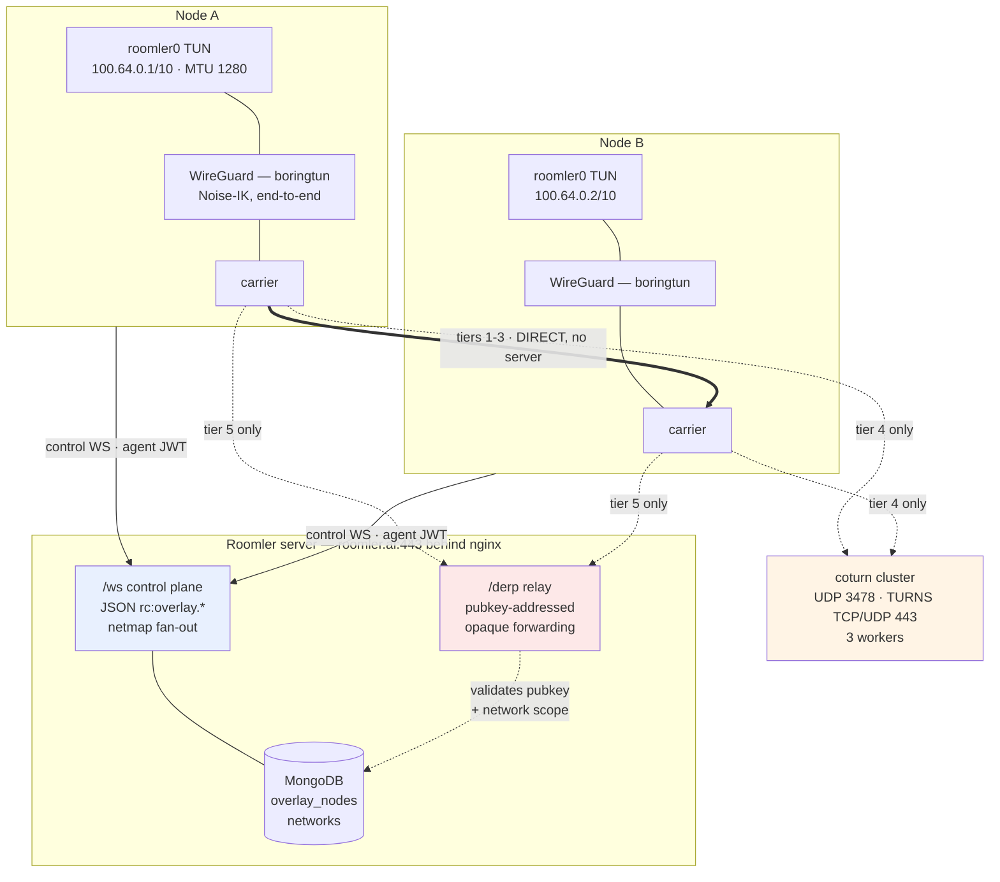

**Control-plane messages** (`crates/remote_control/src/signaling.rs`):

| Direction | Message | Purpose |
|---|---|---|
| node → server | `rc:overlay.join` | pubkey, LAN endpoints, MTU, capability flags |
| node → server | `rc:overlay.endpoints` | trickle current relay candidates |
| node → server | `rc:overlay.srflx` | trickle STUN-learned public mapping + NAT type |
| node → server | `rc:overlay.relay_request` | ask for coturn credentials for a peer |
| node → server | `rc:overlay.leave` | drop out of the mesh |
| server → node | `rc:overlay.netmap` | full peer list |
| server → node | `rc:overlay.netmap_delta` | incremental upsert/remove |
| server → node | `rc:overlay.relay_grant` | coturn ICE servers + a symmetric `pair_key` |

The data plane is always **WireGuard**: a userspace boringtun tunnel presenting
a `roomler0` TUN on `100.64.0.0/10` (CGNAT range, Tailscale convention) at MTU
1280. Only the *envelope* under WireGuard changes between tiers.

---

## 2. What a "carrier" is

A carrier is whatever moves one WireGuard datagram from A to B. All five
implement the same tiny contract, so the WG layer is identical everywhere:

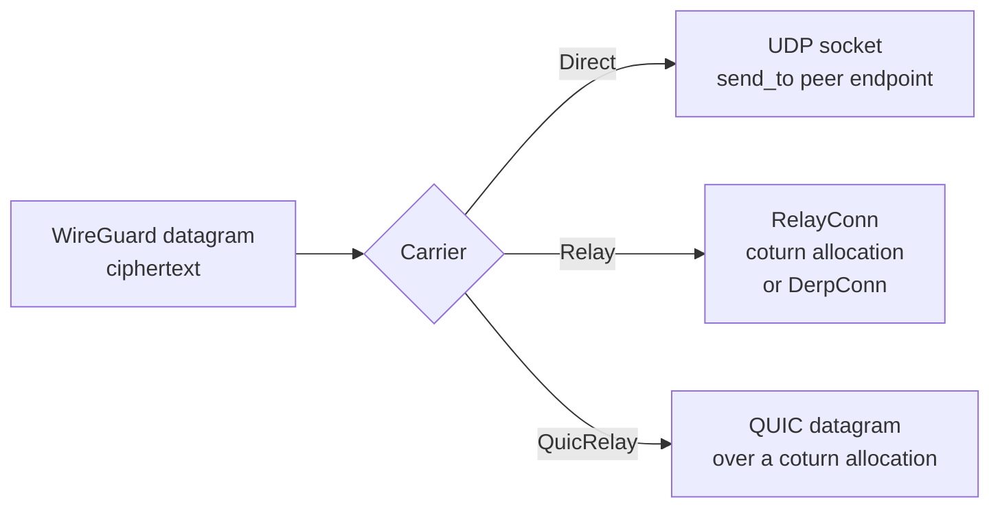

That uniformity is why adding DERP touched no WireGuard code: `DerpConn` is just
another `RelayConn`.

---

## 3. The carrier cascade

The runtime evaluates tiers **in priority order** on every netmap and on a ~30 s
re-upgrade tick, demoting only when a tier can't establish. Best latency first,
server-dependency last.

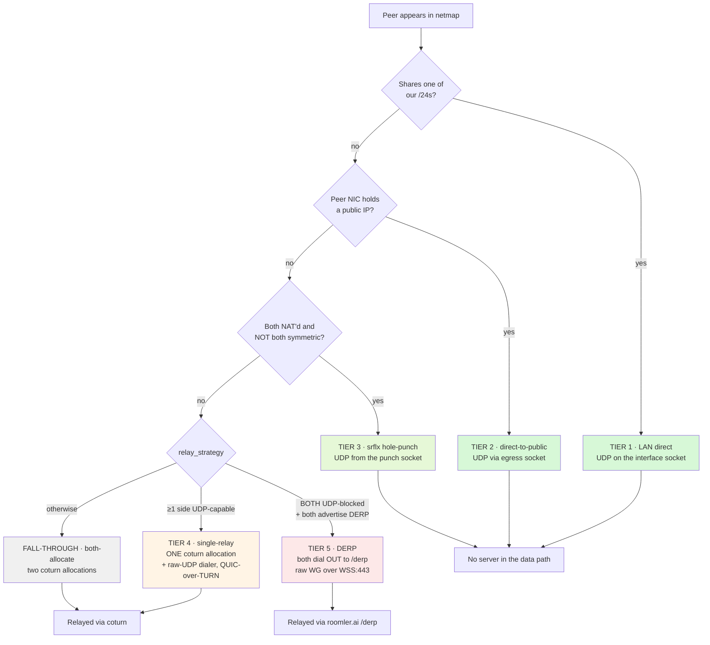

| # | Tier | Carrier | Wins when | Flag — `ROOMLER_NODE_OVERLAY_…` |
|---|---|---|---|---|
| 1 | LAN direct | UDP, interface socket | peer shares a /24 | `DIRECT` (**on**) |
| 2 | direct-to-public | UDP, egress socket | peer's NIC is public | `PUBLIC_DIRECT` (off) |
| 3 | srflx hole-punch | UDP, punch socket | both NAT'd, not both symmetric | `SRFLX` (**on**, rc.200) |
| 4 | single-relay | 1 coturn alloc + raw dialer, QUIC | ≥1 side UDP-capable | `RELAY_SINGLE` (**on**, rc.200) |
| 5 | **DERP** | `/derp` WSS, pubkey-addressed | **both** UDP-blocked | `DERP` (**on**, rc.203) |
| — | both-allocate | 2 coturn allocations | mixed capability / fall-through | always available |

Every gate accepts `0`/`false`/`no`/`off` to disable. Each direct tier keeps its
**own** cooldown so a failing punch can never poison a proven LAN path.

---

## 4. Use cases — who wins, and why

### UC-1 · Both nodes on the same LAN (no VPN)

The happy path: L2 reachability, no NAT, no server in the data path.

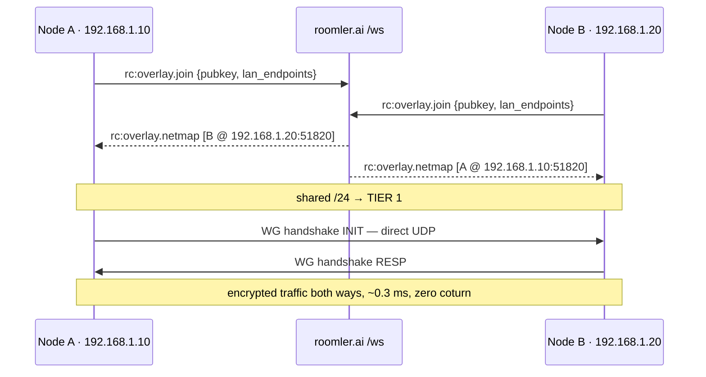

Direct carriers initiate **bilaterally** — each side's outbound INIT opens its
own stateful firewall hole for the other's inbound.

### UC-2 · One node has a public IP (cloud / fleet host)

A NAT'd client dials the public peer directly; no STUN needed, since the public
side has no NAT filter to open. The public side *accepts* an INIT from an
address it couldn't know in advance, after cryptographically authenticating it.

### UC-3 · Both behind home NAT — the hole-punch (outside VPN)

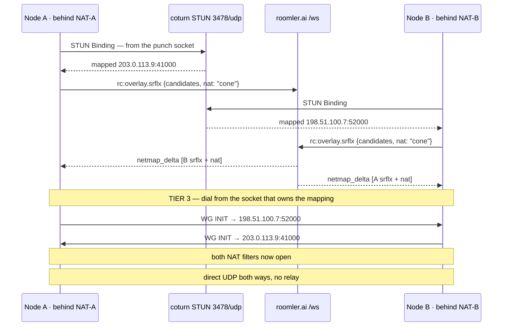

Two properties make this simpler than a generic ICE agent: **WG is the punch
burst** (boringtun retransmits INIT every ~5 s for ~90 s), and **the netmap
fan-out is the rendezvous**. Symmetric↔symmetric is skipped up front — neither
side can predict the other's per-destination port.

### UC-4 · Corporate VPN that still allows UDP — single-relay

This is the common corp case. A TLS-inspecting VPN typically **still permits**
UDP/3478 and UDP/443, so the host can reach coturn; it just can't be punched.
Single-relay uses exactly **one** coturn allocation, and — key point — the role
is chosen by **UDP capability, not pubkey**:

* the **UDP-blocked** side becomes the **anchor** (it can still *allocate* over
  the TURNS/TCP-443 fallback),
* the **UDP-capable** side becomes the **dialer** (a plain raw-UDP sender to the
  anchor's relayed address — no allocation of its own).

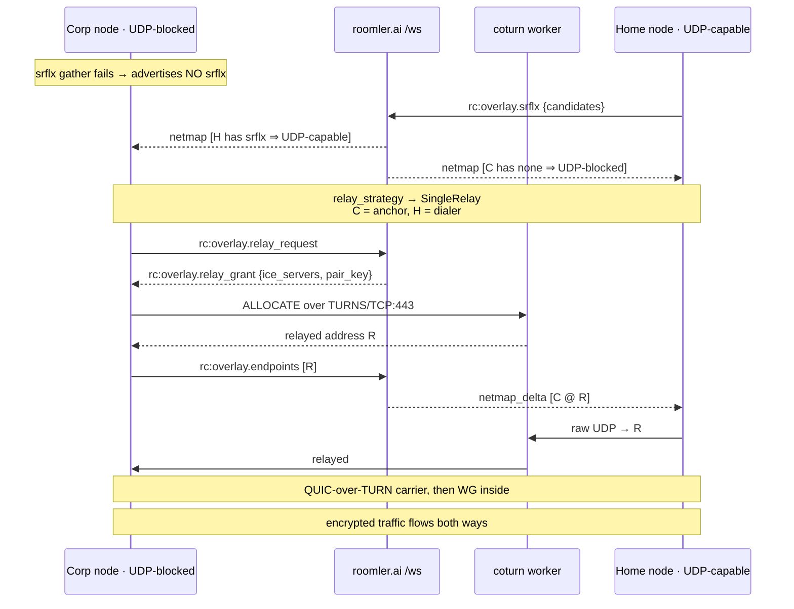

Single-relay **forces** the QUIC carrier: a raw relay carrier discards the recv
source, so the anchor couldn't reply to a symmetric dialer's coturn-observed
port — only quinn's server consumes the observed path.

The signal for "is my peer UDP-capable?" is beautifully cheap: **does it have
`srflx_endpoints` in the netmap?** A successful STUN round-trip *is* proof that
raw UDP to coturn works, so no extra wire field is needed and both ends compute
the same roles from the same inputs.

### UC-5 · Both sides UDP-blocked, TCP-only — **DERP**

The one topology no other tier can serve. Single-relay provably cannot: exactly
one side must be the raw-UDP dialer, and neither has UDP. DERP breaks the
deadlock because **both peers dial OUT** over TCP/TLS-443.

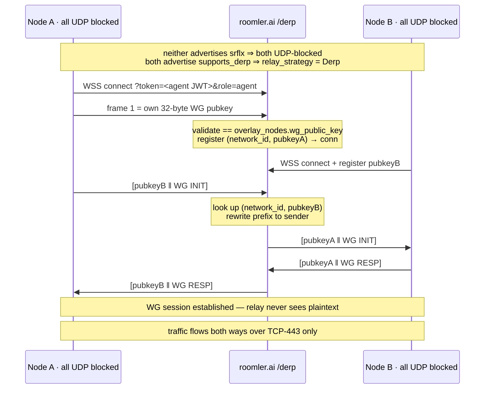

**Field-proven 2026-07-21**: mars↔zeus network namespaces with *all* UDP and
*all* coturn TCP blocked — only `roomler.ai:443` reachable. Both nodes reached
`/derp`, `relay_strategy` chose `Derp`, the WG handshake completed over the relay
(INIT 148 B → RESP 92 B → data), and ping ran **0 % packet loss, ~2.7 ms RTT**
both directions.

### UC-6 · Fall-through: both-allocate

When single-relay isn't mutually supported and DERP doesn't apply, the pair
falls back to two coturn allocations. This path is cross-NAT fragile: it needs
both allocations on the **same** coturn worker, and a worker-co-location failure
was the root cause of the historic `REKEY_TIMEOUT`. Tiers 4 and 5 exist largely
to avoid it.

---

## 5. Inside vs outside a VPN — what each network actually permits

Measured from a real corporate VPN host (2026-07-21, via `coturn_test.html`):

| Transport | Open internet | Typical corp VPN | Strict TCP-only firewall |
|---|---|---|---|
| UDP 3478 — STUN/TURN | ✅ | ✅ | ❌ |
| UDP 443 — TURNS/UDP | ✅ | ✅ | ❌ |
| **TCP 443 — TLS** | ✅ | ✅ | ✅ |
| TCP 3478 — plain | ✅ | ❌ | ❌ |
| TCP 5349 — TURNS/TCP | ✅ | ❌ | ❌ |
| Inbound UDP / punchable | usually | ❌ | ❌ |

Reading across the rows gives the whole story:

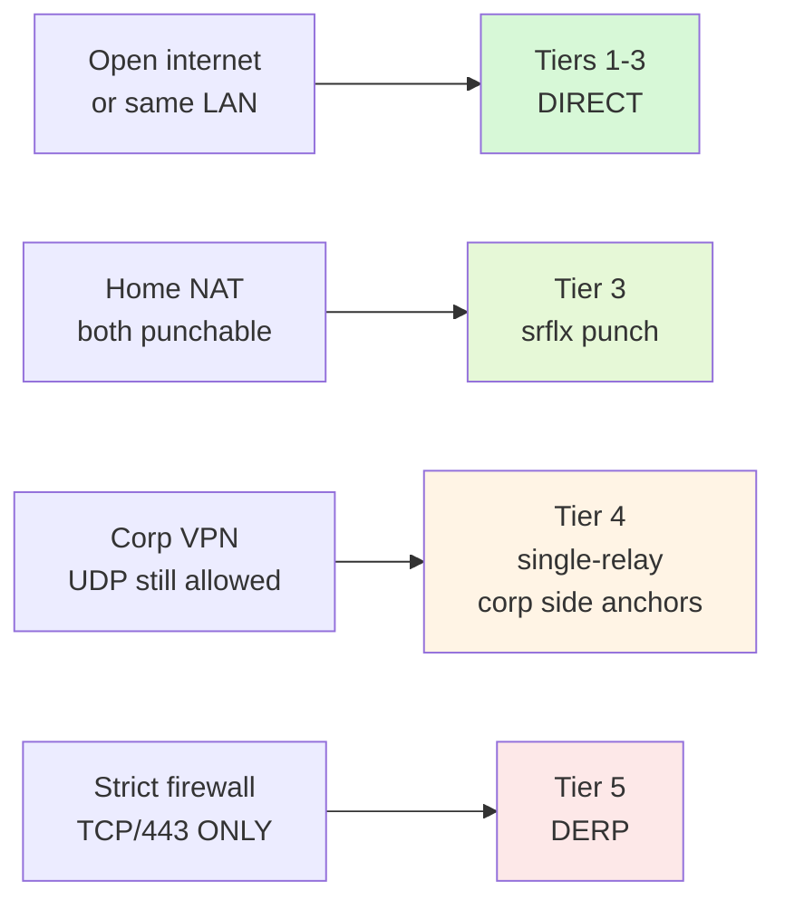

The load-bearing insight: **a corp VPN is usually not as restrictive as it
feels.** Because it still passes UDP/3478 and UDP/443, such a host is
*UDP-capable* and single-relay already covers it — which is why live telemetry
found no naturally-occurring both-UDP-blocked pair. DERP exists for the strictly
harder network where the only thing that survives is TCP/443-TLS. It was built
for **completeness of the solution**, not because demand forced it.

---

## 6. DERP in detail

### Wire protocol

Every frame is a WebSocket **binary** message on `wss://roomler.ai/derp`.

| Frame | Layout | Meaning |
|---|---|---|
| Registration — first frame only | `pubkey(32)` | "I am this WireGuard key" |
| Data — client → relay | `dst_pubkey(32) ‖ payload` | "deliver to this peer" |
| Data — relay → client | `src_pubkey(32) ‖ payload` | "this came from that peer" |

The relay rewrites only the 32-byte prefix. The payload is opaque WireGuard
ciphertext and is never inspected, decrypted, or stored.

### Server side

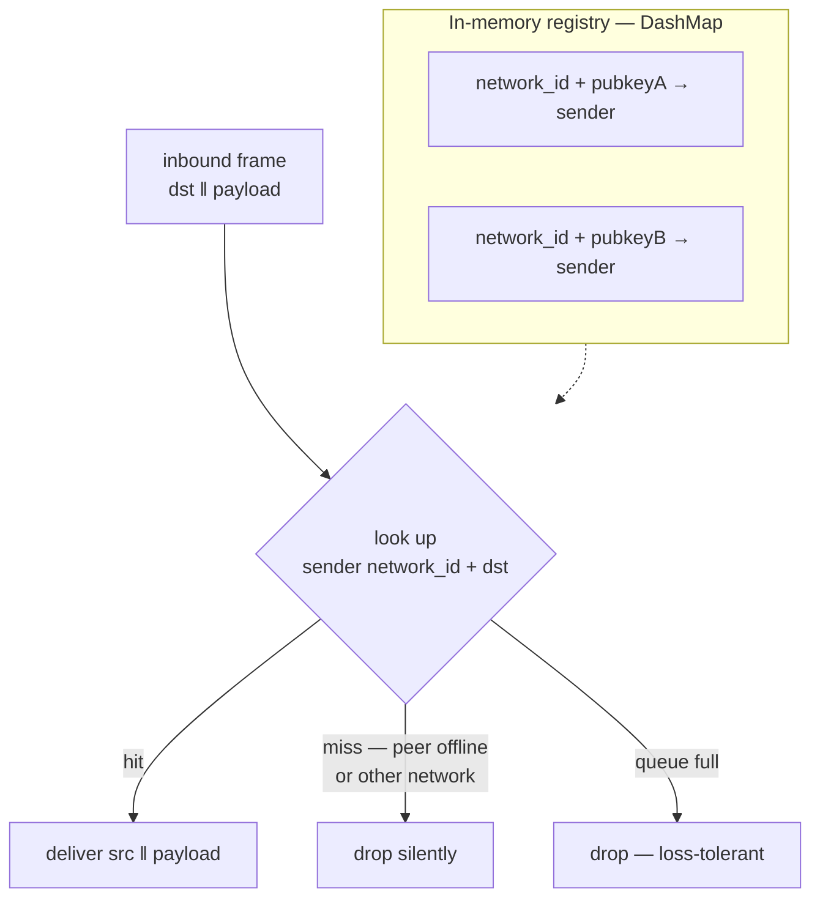

Three guarantees fall out of the key shape:

1. **Auth** — the agent JWT, same audience as `/ws?role=agent`. The database is
   authoritative for the agent's tenant, so a forged claim can't widen scope.
2. **Registration authz** — a node may only register the pubkey that matches its
   own `overlay_nodes.wg_public_key`. It cannot claim a peer's key to intercept
   that peer's frames.
3. **Network scoping** — `network_id` is part of the registry *key*, so a
   cross-network delivery is structurally impossible, not merely checked.

Backpressure is a bounded per-connection queue with drop-on-overflow; WireGuard
retransmits, so a dropped carrier datagram is harmless. Re-registration is
last-writer-wins, because corp middleboxes routinely leave half-open TCP.

### Client side

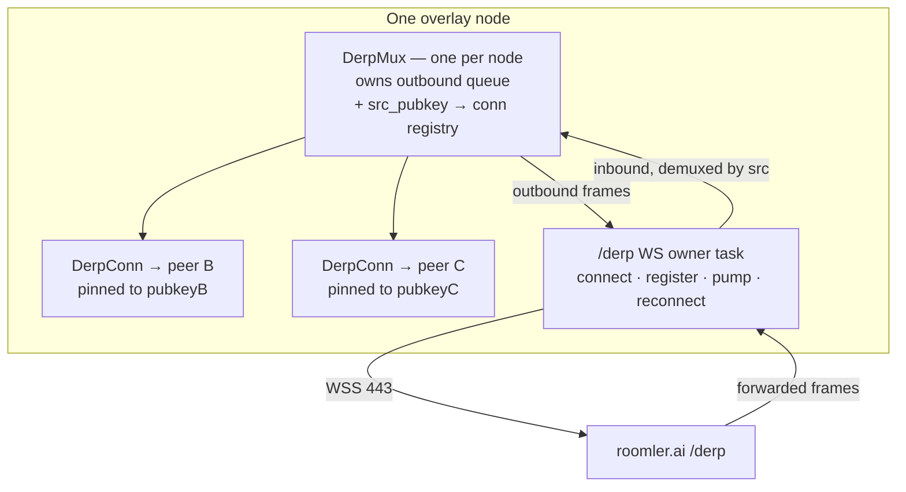

`DerpConn` implements the same `RelayConn` contract as a coturn allocation, so
the WireGuard layer is untouched. It is **pinned to exactly one peer pubkey**,
and that pinning is what makes **raw** WireGuard correct here: every datagram it
receives is, by construction, from that one peer, so the carrier's
recv-source discard can never be wrong. That is precisely the property
single-relay lacks — which is why single-relay must force QUIC while DERP
deliberately stays raw. QUIC over a reliable WebSocket would be double-reliable,
head-of-line blocking on top of head-of-line blocking.

### Lazy connection

DERP is default-ON, but the `/derp` WS is opened **only when the node is itself
UDP-blocked** — that is, when its own srflx gather came back empty, the same
signal that already picks the single-relay anchor role. A UDP-capable node can
never be in a both-UDP-blocked pair, so it never opens the socket:

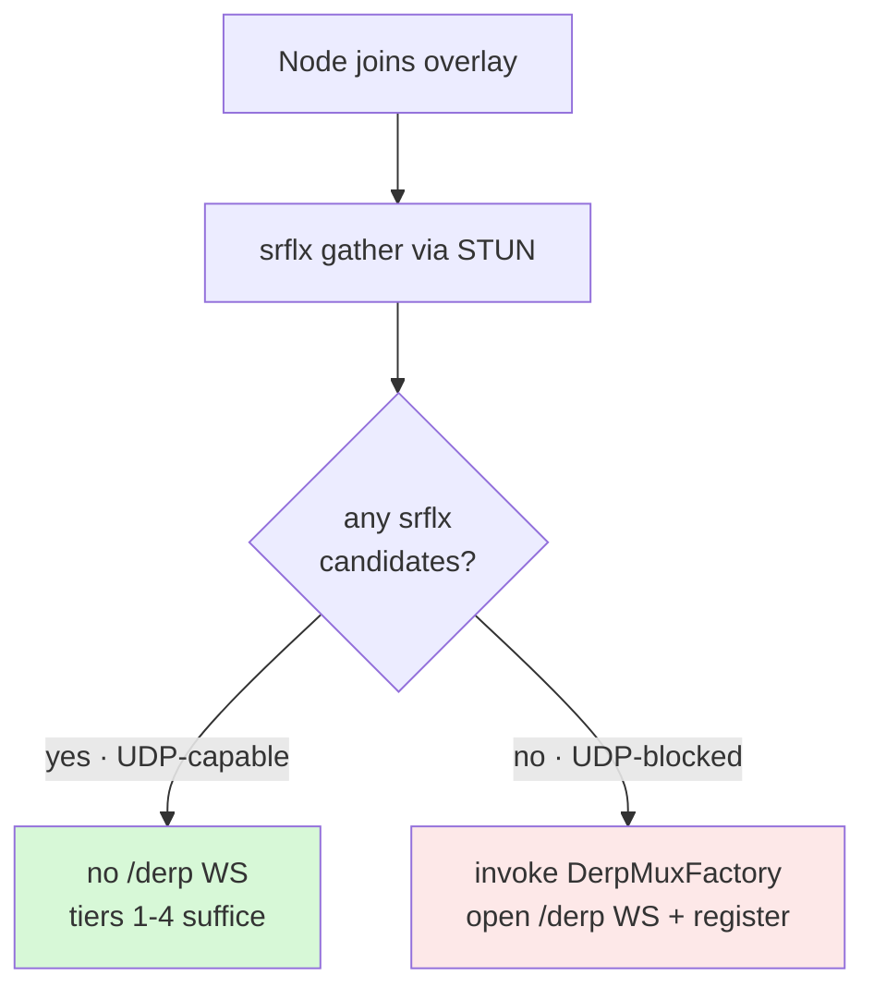

A reconnect re-runs the decision against a fresh gather, so a host that *becomes*
UDP-blocked — moving onto a restrictive network — opens `/derp` at that point.

### Deployment shape

`/derp` is served by the same API pods behind the same nginx as `/ws`, on its own
`location` block with 86400 s idle timeouts. It is a **separate** endpoint from
`/ws` on purpose: WireGuard data at line rate would head-of-line-block the JSON
control channel. The registry is in-memory on a single-replica deployment, so a
web deploy severs DERP links — they simply rebuild via the carrier's dead-latch.

---

## 7. What the server can and cannot see

| | `/ws` control | coturn relay | `/derp` relay |
|---|---|---|---|
| Peer membership, pubkeys, endpoints | ✅ sees | — | sees pubkeys only |
| Ciphertext passes through | ❌ never | ✅ | ✅ |
| **Plaintext** | ❌ | ❌ | ❌ |
| Can impersonate a peer | ❌ | ❌ | ❌ registration is key-bound |

WireGuard's Noise-IK handshake authenticates both ends by static key, so a
relay — coturn or DERP — is a blind pipe. Compromising it yields traffic timing
and volume, never content. On tiers 1–3 the server isn't in the data path at
all.

---

## 8. Failure handling

* **Handshake deadlines** — a punch that never completes is invisible to the
  data-traffic health sweep, so a lock-free `handshake_complete` flag lets the
  sweep tear down a stalled srflx carrier at **12 s** and a public-direct one at
  **30 s**, then demote a tier.
* **Dead latch** — a relay carrier whose send hard-errors latches `dead`, so the
  next sweep rebuilds within ~5 s instead of waiting out the ~20 s rx-flat
  heuristic. `DerpConn` returns an error the moment its WS is down for exactly
  this reason.
* **Strategy recompute** — a peer's `srflx_endpoints` arrive on a *later* trickle
  than its join, so during that window a UDP-capable peer briefly looks
  UDP-blocked. The relay coordinator therefore stores the strategy each link was
  established with and re-evaluates it on every netmap, forgetting and
  re-establishing the link if it changed. Without this a pair could deadlock
  with both sides having chosen "dialer".
* **Cooldowns** — per-tier, never shared, so a routinely-failing punch cannot
  poison a proven LAN or public path.

---

## 9. Configuration reference

All flags take the `ROOMLER_NODE_OVERLAY_` prefix; the legacy `ROOMLER_AGENT_`
prefix is still honoured.

| Variable | Default | Effect |
|---|---|---|
| `…_DIRECT` | on | LAN-direct tier |
| `…_PUBLIC_DIRECT` | off | direct-to-public tier |
| `…_SRFLX` | on | srflx hole-punch tier |
| `…_SRFLX_KEEPALIVE_SECS` | 20 | STUN keepalive holding the mapping open |
| `…_RELAY_SINGLE` | on | single-relay tier |
| `…_DERP` | **on** since rc.203 | DERP tier |
| `…_NETSTACK_SOCKS` | unset | userspace netstack + SOCKS5 instead of an OS TUN |

Joining the mesh at all additionally requires `overlay_enabled = true` in the
node config and a build carrying the `overlay-l3` (or `overlay-netstack`)
feature.

---

## 10. Field-proof record

| Tier | Proven | Result |
|---|---|---|
| LAN direct | 4-node single-Wi-Fi mesh | fully direct, ~3–9 ms, zero coturn |
| direct-to-public | NAT'd netns ↔ public host | 0 % loss, ~0.9 ms |
| srflx punch | mars↔zeus netns, cone↔cone | 0 % loss, ~0.6 ms |
| single-relay | mars↔zeus netns, sym↔sym | 0 % loss, ~1.3 ms |
| single-relay, UDP-aware anchor | UDP-blocked ↔ UDP-capable | 0 % loss, ~1–6 ms |
| **DERP** | mars↔zeus, both UDP **and** coturn-TCP blocked | **0 % loss, ~2.7 ms** |

Every tier in the cascade has now carried real WireGuard traffic between two
genuinely separated hosts. The cascade is complete: there is no longer a network
shape in which two Roomler nodes can reach `roomler.ai` yet fail to reach each
other.

---

### Testing note

The netns lab that validates these tiers blocks egress with a default-DROP
`OUTPUT` chain. That chain also matches the overlay's *own* traffic to
`roomler0`, which makes a perfectly healthy carrier look like 100 % packet loss.
Always add `iptables -I OUTPUT 1 -o roomler0 -j ACCEPT` inside the namespace, and
pin `roomler.ai` in `/etc/netns/<ns>/hosts` — DNS via the systemd-resolved stub
does not resolve inside a namespace.
