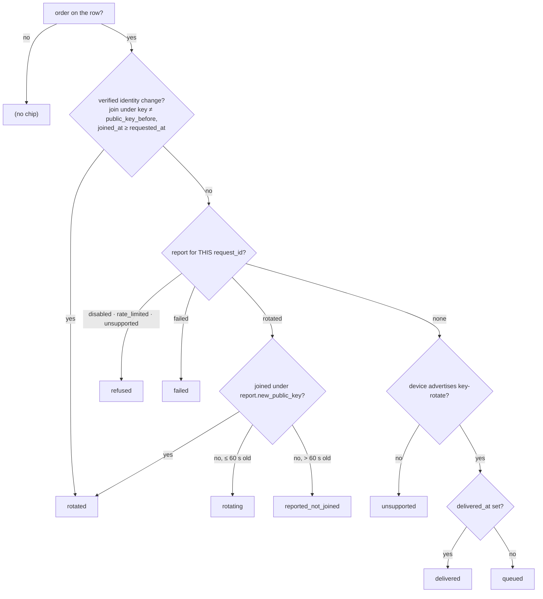

# Overlay key rotation — the server orders a re-mint it never sees

A device's WireGuard key is its whole **data-plane identity** on the overlay: whoever
holds the private half can complete handshakes as that node with every peer that has
its public key installed — everything the overlay ACL grants it, every inbound SSH
grant and tunnel route addressed to it. Before FR-40 the only remedy for a leaked key
was a re-enrollment: a fresh token, SYSTEM/root on the host, a daemon restart. An
operator whose key just leaked reaches for *rotate*, not *re-enroll*.

Rotation is an **order, never a delivery**. An admin clicks *Rotate overlay key…* in
the device grid; the server writes the order on the device row and pushes
`rc:agent.key_rotate { request_id }` — a frame that carries no key material and is
test-locked never to grow any. The device mints a fresh keypair **locally**, persists
it, reports back with public keys only, and reconnects; its join under the new key is
what the server verifies, every peer reinstalls the carrier within milliseconds, and
the old key is useless everywhere. A device that is offline is ordered on its next
connect. **The server never holds, transports or chooses a private key at any step.**

> Design record, the three field-run defects and their fixes, and the full field log:
> [`fr/FR-40-overlay-key-rotation.md`](fr/FR-40-overlay-key-rotation.md) (#962). This
> page describes what shipped (P1–P1d, `agent-v0.4.25`/`0.4.26` + web
> `v20260830-6a166a1ec9f7`). Retired keys (P2) and the CLI (P3) are under
> [Not built](#not-built).

```mermaid
sequenceDiagram
    autonumber
    participant A as Admin (device grid)
    participant S as roomler server
    participant D as roomlerd (the device)
    participant P as every peer

    A->>S: POST …/agent/{id}/overlay-key/rotate
    S->>S: gates: MANAGE_AGENTS · 1 order/min/device · the device advertises key-rotate
    S->>S: agents.key_rotation = {request_id, public_key_before} · key_rotation_audit row
    S-->>D: rc:agent.key_rotate {request_id}  (only to a live socket; else queued)
    D->>D: kill switch? own 60 s ceiling? → mint WgKeypair → config::save (lock, fsync, .prev)
    D-->>S: rc:agent.key_rotated {request_id, rotated, old_pub, new_pub, key_epoch}
    D->>D: close every session on this org · reconnect under the new key
    D->>S: rc:overlay.join (new pubkey, key_epoch)
    S->>S: agents.overlay_identity = {public_key, key_epoch, joined_at}  ← the proof
    S-->>P: rc:overlay.netmap_delta {upserts: [the device]}
    P->>P: "peer's WG public key changed — reinstalling its carrier"
    D-->>S: rc:agent.key_rotated re-sent on the NEW session (the first copy rode a dying socket)
```

## What is rotated, and what deliberately is not

| identity | rotated by this? | why |
|---|---|---|
| the org's **overlay WireGuard key** (`overlay_wg_secret_key`, per org via `AgentConfig::for_org`) | **yes** — the whole point | it is the data-plane identity; a holder can be the node on the mesh |
| the **agent token** (JWT, the control-plane credential) | no | a different identity with a different fix (`token_epoch`, Known Issues); a leaked token is a control-plane compromise |
| the **SSH host key** (`ssh_host_key`) | no | clients pin it; rotating it is a client-side TOFU event with its own runbook |
| `config.toml.prev` | not scrubbed | the retired secret stays in the `.prev` copy until the next save; an on-host reader of `.prev` can read `config.toml` too, so it is not a boundary — P2's retired-key list is what makes the copy worthless off-host |
| the standalone `roomler` tunnel client's key | no (P3) | tunnel-only hosts have no agent WS to receive the order |

The control plane is **not** reachable with a leaked overlay key: joins and DERP
registration need the agent JWT, and DERP additionally refuses a registration whose
public key is not the row's. The exposure is the mesh — which is exactly what the
rotation closes.

## The order — `POST /api/tenant/{tid}/agent/{aid}/overlay-key/rotate`

Owned by the **network** module (`crates/modules/network/src/lib.rs:409`, handler
`crates/modules/network/src/routes/overlay_key.rs:118-250`). It touches no key. In
order:

1. **`MANAGE_AGENTS`** — retiring a key *grants* nothing, so neither `EXEC_DEVICE` nor
   `SSH_DEVICE` is involved (`overlay_key.rs:131-138`).
2. The device is resolved **live, in the tenant** — a foreign id is a 404, not a
   cross-tenant order, and a removed device is a 404 too: an order written onto a
   tombstone would be desired state nothing can ever reconcile (`overlay_key.rs:140`,
   #1821).
3. **Online?** — the pod-local Hub, `rc_hub.is_agent_online` (`overlay_key.rs:143`).
   **Understands it?** — the hello's `rpc` verbs, persisted on the row at every
   connect, must contain `key-rotate` (`overlay_key.rs:146`). **Ceiling** — one order
   per device per minute, keyed on the device in both slots so it is per *device*, not
   per admin; checked **after** the identity gates so a refusal is attributable
   (`overlay_key.rs:38`, `:150-152`).
4. `decide(rate_ok, online, supports_rotation)` — a pure function whose four cells are
   unit-tested (`overlay_key.rs:90-103`):

   | rate ok | online | advertises `key-rotate` | result |
   |---|---|---|---|
   | no | — | — | **409** `rate_limited` |
   | yes | yes | no | **409** `agent_unsupported` — "needs 0.4.25 or later; push an update first, then rotate" |
   | yes | yes | yes | **200** `{dispatch: "pushed", delivered: true}` |
   | yes | no | — | **200** `{dispatch: "queued", delivered: false}` — ordered on its next connect |

5. **Desired state first, then the push** (`overlay_key.rs:157-200`): the request is
   written onto the agent row — `request_id`, `requested_by`, `requested_at`, and
   **`public_key_before`**, the key the device holds *now* (its last verified join) —
   before `rc:agent.key_rotate` is sent, so a report can only ever refer to an order
   that already exists. A push that races a disconnect leaves the order standing as
   `queued`.
6. **One audit row for either arm** (`overlay_key.rs:211-227`): `decide()` returns
   `Result<Pushed|Queued, DenyReason>` and a single call site records both into
   `key_rotation_audit`, so a new refusal cannot forget to audit itself (the
   `config_audit` / `ssh_audit` shape). Best-effort — an audit insert is never what
   stops a legitimate rotation.

⚠️ **The push is capability-gated, and `rc:agent.update` is not — on purpose, in
both directions.** `UpdateNow` is sent blind because an unknown frame to an old agent
costs nothing; a rotation order dropped silently by a pre-feature agent would leave
a *security action* showing "in flight" on a dashboard for a device that never heard
it. An **online** device without the verb is therefore refused up front, never
spun on. An **offline** device is queued regardless — it may well update before it
reconnects, and the connect-time reconcile gates again (`overlay_key.rs:63-66`).

⚠️ **Which pod answers matters.** `is_agent_online` reads the pod-local Hub; the
tenant-affinity LB (`deployment.md`) is what lands the admin's call on the pod that
holds the device's socket. An online device that comes back `queued` is an affinity
suspect first.

## On the device

The handler sits in the WS loop that received the order, next to `ConfigPush`
(`agents/roomlerd/src/signaling.rs:4143-4284`). Every branch **reports**, refusals
included — the operator is looking at a security action and each refusal has a
different fix:

| step | what | reports | anchor |
|---|---|---|---|
| 1 | kill switch `overlay_key_rotation == false` | `refused: disabled` | `signaling.rs:4146-4160` |
| 2 | the device's **own** 60 s ceiling, per org — "a bound that exists only on the ordering side is not a bound" | `refused: rate_limited` | `signaling.rs:2370-2382`, `:4162-4178` |
| 3 | mint `WgKeypair::generate()` — the enrollment mint; `None` in a build with no overlay surface | `refused: unsupported` | `agents/roomlerd/src/key_rotation.rs:19-30` |
| 4 | **persist first**: under the daemon-wide write lock, `config::load` → set the secret on the primary scalar or on the `[[orgs]]` entry whose `tenant_id` is this loop's → bump `overlay_wg_key_epoch` → atomic `config::save` (tmp + fsync + 0600/ACL + `.prev` + rename) | on error: `failed` + detail, **identity unchanged** | `agents/roomlerd/src/remote_config.rs:213-245` |
| 5 | queue the same report for the *next* session, then send `rc:agent.key_rotated { rotated, old_pub, new_pub, key_epoch }` on this one and give the pump 300 ms | `rotated` | `signaling.rs:4243-4268` |
| 6 | close every peer, tunnel peer and QUIC peer this org loop carries (the `Goodbye` teardown), return `ConnectError::KeyRotated { secret, epoch }` | — | `signaling.rs:4271-4283`, `:1077` |
| 7 | the loop adopts the key + epoch into its one config snapshot and re-enters `connect_once` **immediately** — one device re-joining, not a fleet event, so no stagger | — | `signaling.rs:819-836` |
| 8 | `overlay::maybe_start` sees the fingerprint change (it includes the public key), rebuilds the runtime; the join carries the new key and epoch | — | `agents/roomlerd/src/overlay.rs:395` |

⚠️ **Persist before anything else.** A key that is not written down would be lost at
the next restart and the device would come back as the identity it just retired —
the same rule the SSH host key follows. A failed save reports `failed` and changes
nothing.

⚠️ **Per org, honoured on whichever org's WS the order arrives on.** The key is per
enrollment (`AgentConfig::for_org` scopes it), so org B rotating its key on a shared
host touches nothing of org A's. This is the **opposite** of `rc:agent.update` and
config push, which drive machine-wide state and are therefore primary-only
(`remote-config.md` §4). Do not copy that guard here.

| | `rc:agent.update` / config push | `rc:agent.key_rotate` |
|---|---|---|
| scope of the thing changed | host-global | this org's key only |
| honoured on | the primary WS only | the WS the order arrived on |
| disk write | scalar keys | the primary scalar **or** the matching `[[orgs]]` entry |

⚠️ **Immediate and disruptive, by design.** A key that leaked must not wait for the
holder's session to end, so the rotation ends every remote-control, overlay-SSH and
tunnel session the device carries on that org and reconnects. The confirm dialog says
so (`ui/src/components/admin/AgentsSection.vue:1169-1196`). A corp-VPN host may come
back relay-locked after the cycle (the renumber caveat in `multi-org.md`).

`overlay_wg_secret_key` stays **unwritable over LocalAPI** (`config_surface.rs:13-14`,
locked by test): rotation is an *action*, not a config write, and the P3 CLI goes
through the same action.

## The join is the proof — three records, three trust levels

The device's report is a **claim** (the `ssh_activity` sense). What the server can
*verify* is the join: `rc:overlay.join` under the new public key passes
`wg_key_taken_by_other` (machine-scoped, so a device rotating its own key is admitted
— `security-baseline.md` §4), and the server stamps what the device presented onto
the agent row as `overlay_identity` (`crates/modules/network/src/overlay.rs:536-559`
→ `dao/agent.rs:763`). It is stamped on **every** join, not only after a rotation, so
the grid can always show the device's current key.

| record | lives in | written by | what it is |
|---|---|---|---|
| the **order** | `agents.key_rotation` (`KeyRotationRequest`, `models.rs:1619`) | the route | what was asked, when, by whom — and `public_key_before`, the key held at that moment |
| the **decision** | `key_rotation_audit` (`KeyRotationAuditEvent`, `models.rs:3146`; DAO `crates/services/src/dao/key_rotation_audit.rs`) | the route, one call site, both arms | `pushed` / `queued` / `denied: <reason>`. Records what the **server** decided — never what the device did. 90 d TTL, `(tenant_id, at)`, `(agent_id, at)` (`network/src/lib.rs:731-738`) |
| the **claim** | `agents.key_rotation_report` (`KeyRotationReport`, `models.rs:1670`) | `rc:agent.key_rotated` ingest (`agent_socket.rs:173` → `agent_arms.rs:81-125`) | the device's account; `reported_at` is server-stamped, `detail` re-clamped on receipt |
| the **proof** | `agents.overlay_identity` (`OverlayIdentity`, `models.rs:1701`) | the overlay join | the public key and epoch the device actually presented, and when |

⚠️ **Never fold them.** A later **refusal** for the same `request_id` is withheld
rather than written over a `rotated` claim (`dao/agent.rs:737-754`) — a rotation that
happened, happened; the only way a refusal follows a success for one order is the
duplicate-delivery race below. Any report about a *different* order, and any
`rotated`, still replaces.

## The state the dashboard shows

Resolved **once, server-side**, from the order, the claim and the proof
(`crates/modules/fleet/src/agent.rs:596-676`); the grid only names the states
(`AgentsSection.vue:1964-2033`). The device row also carries `overlay_public_key` and
`overlay_key_epoch` straight from the proof (`agent.rs:1449-1457`), so an operator
can *see* the key change instead of trusting a chip.



| state | resolved when | chip | operator's move |
|---|---|---|---|
| `queued` | ordered, never pushed, no answer | *key rotation queued* | wait — it rotates on the device's next connect |
| `delivered` | pushed to a live socket, no answer for **this** order yet | *rotating key…* | wait a few seconds |
| `rotating` | the device claims `rotated` (≤ 60 s ago) but its last join still shows the previous key | *rotating key…* | wait — it is re-joining |
| `rotated` | the join proves it (key ≠ `public_key_before` after the order), **or** the claim's `new_public_key` is what the device joined with | *key rotated · e⟨epoch⟩* | done |
| `reported_not_joined` | claimed `rotated` > 60 s ago (`KEY_ROTATION_REJOIN_GRACE_SECS`, `agent.rs:594`), still joined under another key | *key not re-joined* | the re-join failed — read the device log |
| `refused` | the device answered `disabled`, `rate_limited` or `unsupported` | *key rotation refused (⟨outcome⟩)*, tooltip = `report.detail` | fix the stated thing |
| `failed` | mint or persist failed; identity unchanged | *key rotation failed* | `report.detail` says why |
| `unsupported` | an order stands, no answer, and the device's hello lacks `key-rotate` | *agent too old for key rotation* | update the device; the order stays queued and runs on the first connect that advertises the verb |

⚠️ **Compare `request_id`s, never outcomes alone.** A report about an earlier order
says nothing about this one — the remote-configuration lesson, applied here
(`agent.rs:600`).

⚠️ **`unsupported` is a state an *offline* order reaches.** An online pre-feature
device never gets an order recorded — the route refuses it 409 up front. The state
appears when a device was ordered while offline and then connected without the verb
(or whose build lost its overlay surface); the socket logs *"overlay-key rotation not
ordered — this device's agent predates rc:agent.key_rotate"* and leaves the order
standing (`fleet/src/socket.rs:264-270`).

## Reconcile on connect — and the three races it must not re-run

At agent register, where `ConfigPush` reconciles, a standing order is pushed again
if the hello advertises `key-rotate` (`crates/modules/fleet/src/socket.rs:180-193`,
`:250-272`) — the offline case, through the same path as the online one, so it runs
on every connect rather than only when nobody is watching. Three field cycles on
2026-08-30 each found a way for that to go wrong; each left a rule:

| cycle | what the run showed | the rule it left |
|---|---|---|
| 1 → **P1b** | 30 ms after the re-join, the reconnect's own register re-pushed the **same** order (the `rotated` report, sent on the dying session and written by a spawned task, had not landed); the device refused the duplicate under its own ceiling, and that refusal **overwrote** the success — the grid read `refused (rate_limited)` for a rotation that worked | an order delivered < **120 s** ago is in progress, not lost: `should_redeliver` (`models.rs:5561`, `:5586`); and a refusal never overwrites a `rotated` report for the same order (`dao/agent.rs:737-754`) |
| 2 → **P1c** | the dying-session report was **lost** this time, so the state stuck at `delivered` although the server had verified the new key at the join | the order snapshots `public_key_before`; a join under another key resolves `rotated` with or without a report; the agent **re-sends** its report on the next session, keyed per org (`signaling.rs:2338-2360`) |
| 3 → **P1d** | the cycle-2 order (report lost, no snapshot) was re-delivered on every later connect — a pod roll, then the 0.4.26 restart: **three rotations for one click** | `order_is_satisfied` (`models.rs:5571`): a verified identity change after the order satisfies it, and a satisfied order is never pushed again |

⚠️ The dying-session copy of the report was lost in **3 of the 4** ordered runs. The
re-send on the new session is the reliable path, and the identity rule is what keeps
the grid honest for a device that has not yet updated to it — a 0.4.25 device shows
`rotated` by the join alone.

## Kill switch and configuration

| key | where | default | effect |
|---|---|---|---|
| `overlay_key_rotation` | device config (tribool), config surface, env `ROOMLERD_OVERLAY_KEY_ROTATION` (`crates/agent-core/src/config.rs:867-851`, `config_surface.rs:1072-1053`) | **on** | `false` ⇒ every order is answered `refused: disabled`, key unchanged. Read from the start-time snapshot — **restart required** |
| `overlay_wg_key_epoch` | persisted next to the key, primary scalar and per `[[orgs]]` entry (`config.rs:1400`, `:1525-1527`) | `0` | bumped per rotation; presented on every join, shown in the grid |
| server switch | — | — | **none, deliberately**: the route is admin-initiated and permission-gated; a defective push is stopped by the device switch |

⚠️ **A kill switch, not a gate.** Unlike `exec_enabled` and `ssh_enabled`, this one
defaults to *on*: the order grants nothing and leaks nothing — the worst a hostile
server can do with it is make a device re-key, which costs that device its sessions
for a second. There is no gate-4 argument for default-off, and a default-off switch
would have left the one feature a key leak needs disabled fleet-wide.

The server cannot see the device switch, so a switched-off device is still ordered
(`pushed`); the refusal is the device's and reaches the grid as the `refused` state.

## Operating it

1. Device grid → row menu → **Rotate overlay key…** → confirm (`AgentsSection.vue:177`).
   Online: *"ordered — it mints a new key, re-joins the mesh and reports back within
   seconds."* Offline: *"queued and runs on its next connect."*
2. Watch the chip and the **overlay public key** column: the key and `e⟨epoch⟩` change
   within ~2 s of the order on a healthy device (field: order → join in 1.1–1.3 s).
3. Peers reinstall the carrier on the netmap upsert — 18 ms after the join when
   measured (`establish.rs`, *"peer's WG public key changed — reinstalling its
   carrier"*). Traffic resumes after WireGuard's next handshake; a relay-locked pair
   re-climbs the ladder from the floor. ⚠️ `roomler peers --json` carries **no key
   field** — the peer's log line is the evidence that the old key is gone.
4. Both ceilings are 60 s. A second click inside the minute is **409 `rate_limited`**
   from the server; if an order still reaches the device inside *its* minute (the
   duplicate-delivery race), the device refuses and the grid shows `refused
   (rate_limited)` only when no `rotated` report exists for that order.
5. `reported_not_joined` means the device claims it rotated and has not come back
   under the new key within a minute: `roomler exec <device> -- roomler logs --grep
   key_rotate` (never a path guess, `fleet-rpc.md`). On a corp-VPN host, expect the
   re-join to land on relay first.
6. **DERP transient, bounded**: `derp_acl::rebuild` is spawned at the join, so the
   first DERP frames under the new key may be denied for milliseconds until the table
   lands; WireGuard's handshake retry covers it. Measured, not barriered.
7. Nothing in the audit or on the row ever holds a private key — a test asserts the
   order frame has no key-shaped field, and the audit row stores `request_id`,
   `dispatch`/`denied`, who and when.

## Measured in the field

| date | build | read |
|---|---|---|
| 2026-08-30 00:19 UTC | CORPLAP-3 `0.4.25` | first ordered rotation: mint+persist → `key_epoch=1` → join **1.1 s** after the order; identity stamped within the first API sample; the peer reinstalled and overlay ping ran 4/4 at 84–97 ms within 60 s. Found the duplicate-delivery race (P1b) |
| 2026-08-30 00:55 UTC | CORPLAP-3 `0.4.25`, web P1b | clean; no duplicate refusal; the immediate second order **409 `rate_limited`**. Found the lost dying-session report (P1c) |
| 2026-08-30 01:30–01:35 UTC | web P1c, CORPLAP-3 → `0.4.26` | the re-sent report ingested 26 ms after the new session; the lost-report order re-delivered twice (e3, e4) — P1d |
| 2026-08-30 02:09 UTC | web P1d, CORPLAP-3 `0.4.26` | order → persisted :09.085 → `key_epoch=5` → re-sent report :10.210 → join :10.223 → ingest :10.229 → **two peers reinstalled 18 ms after the join**; `rotated` in the grid within 5 s; the P1d pod roll re-delivered nothing. ⚠️ One reader's clock was 12 s ahead of the server — the earlier "+12 s reinstall latency" was that offset |
| 2026-10-07 02:28–02:36 UTC | two throwaway Ubuntu VMs enrolled permanently against prod — `0.4.116`, and `0.4.24` pinned with `auto_update = false` | the three reads the fleet could never give (every real device auto-updates past the verb; no corp laptop restarts for a kill switch), each a refusal arm beside a success arm on the same deploy. **Kill switch** off → the server still `pushed`, the device refused 5 ms later, `refused (disabled)`, key byte-identical through the next restart; on → persisted 9 ms after the order, e1, `rotated` at the first sample 4 s later, the peer reinstalled 12 ms after the re-join. **Offline** → `queued`; started and left alone → `delivered on connect` at the hello, persisted 7 ms later, e2, `rotated` within 8 s, `delivered_at` 19 s after `requested_at`; 135 s on, still e2 and exactly one delivery. **`0.4.24`** online → **409 `agent_unsupported`** in 2 ms, nothing recorded, nothing pushed; ordered while offline → `unsupported` before it even reconnected, *not ordered — predates* on the pod at the connect, key and epoch unchanged |

## Code map

| piece | where |
|---|---|
| capability verb `key-rotate` (equality match, `ALL` entry, wire string locked) | `crates/remote_control/src/models.rs:597`, `:628`, `:642`, test `:4391`; advertised by any build with an overlay surface, `agents/roomlerd/src/encode/caps.rs:1610-1614` |
| wire: `rc:agent.key_rotate` (order), `rc:agent.key_rotated` (report) | `crates/remote_control/src/signaling.rs:1920`, `:629`; owner `network` (`:1359`, `modular-monolith.md`) |
| models: request · outcome · report · identity · audit event · `order_is_satisfied` · `should_redeliver` | `models.rs:1619`, `:1645`, `:1670`, `:1701`, `:3146`, `:5571`, `:5586` |
| route, `decide()`, the 409 bodies, the audit call site | `crates/modules/network/src/routes/overlay_key.rs` |
| reconcile-on-connect | `crates/modules/fleet/src/socket.rs:180-193`, `:250-272` |
| report ingest | `crates/modules/network/src/agent_socket.rs:173` → `agent_arms.rs:81-125` |
| identity stamp at the join | `crates/modules/network/src/overlay.rs:536-559`; `crates/services/src/dao/agent.rs:804` |
| the conditional report write | `crates/services/src/dao/agent.rs:769-757` |
| state resolver + grid view | `crates/modules/fleet/src/agent.rs:521-676`, `:1449-1457` |
| audit DAO + index plan | `crates/services/src/dao/key_rotation_audit.rs`; `crates/modules/network/src/lib.rs:731-738` |
| device handler · re-send · ceiling · adoption on reconnect | `agents/roomlerd/src/signaling.rs:4143-4284`, `:2338-2360`, `:2370-2382`, `:819-836` |
| mint · persist | `agents/roomlerd/src/key_rotation.rs`; `agents/roomlerd/src/remote_config.rs:213-245` |
| kill switch · epoch | `crates/agent-core/src/config.rs:867-851`, `:1420`, `:1525-1527`; `config_surface.rs:1072-1053` |
| UI: action, dialog, chip, store | `ui/src/components/admin/AgentsSection.vue:177`, `:1169-1196`, `:1964-2033`; `ui/src/stores/agents.ts:877-884` |

## Not built

- **Retired keys (P2).** Today `wg_key_taken_by_other` is live-scoped and a retired
  key neither blocks nor is refused: a `.prev` rollback, or an attacker holding both
  the old WireGuard key and the agent token, could present it again. P2 appends the
  old key to the node row's `retired_keys[]` on a key change, refuses a join or a DERP
  registration presenting one (`key_retired`), and — for a device that advertises the
  verb — answers the refusal with a `KeyRotate` order so a rolled-back device heals
  itself instead of sitting on the control plane and off the mesh. Also owed: an
  index on `(network_id, wg_public_key)`.
- **`roomler overlay rotate-key [--org]` (P3)** over LocalAPI — the break-glass path
  for when the control plane is the compromised thing — and rotation for tunnel-only
  clients.
- **Bulk rotation** — deliberately not offered. Rotating a fleet at once makes every
  peer reinstall every carrier; if it is ever needed it is a paced job, not a button.
