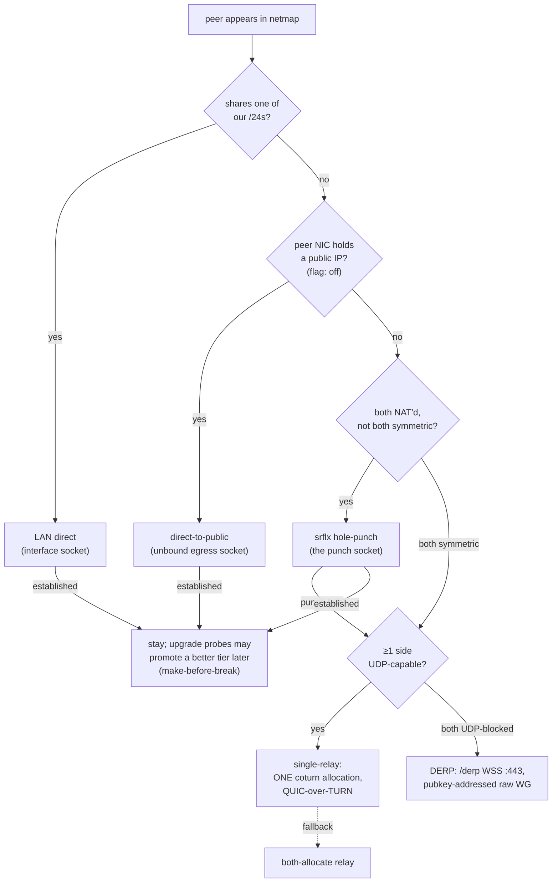
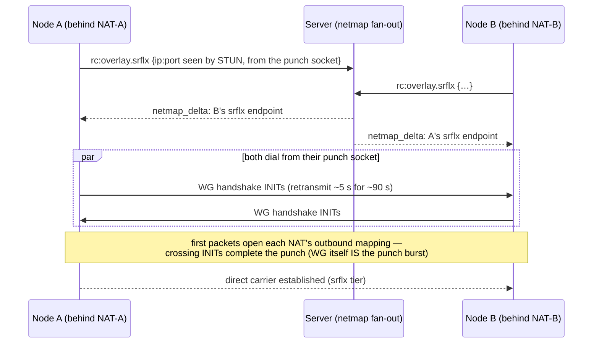

# Overlay NAT-traversal cascade

> Cross-ref: the L3 overlay mesh is part of the remote-control / tunnel
> subsystem ([`docs/remote-control.md`](./remote-control.md)). This doc covers
> how two overlay nodes pick a WireGuard **carrier** — and, in particular, how
> a NAT'd node reaches another without a relay hop. The Windows-firewall piece
> is [`docs/overlay-wfp.md`](./overlay-wfp.md); the exit-node routing on top of
> a carrier is [`docs/overlay-exit-nodes.md`](./overlay-exit-nodes.md).
>
> For the **end-to-end picture with diagrams** — control plane vs data plane,
> every tier as a sequence diagram, and which one wins inside vs outside a
> corporate VPN — see
> [`docs/overlay-communication.md`](./overlay-communication.md).

## The carrier cascade

Every overlay peer link rides one **carrier** — the transport the WireGuard
datagrams travel over. The runtime picks the best one available, in priority
order, and demotes to the next tier if it can't establish:

| Tier | Carrier | When it wins | Flag (default) |
|---|---|---|---|
| LAN direct | UDP on the shared interface socket | peer shares one of our /24s | `ROOMLER_NODE_OVERLAY_DIRECT` (**on**) |
| **A** direct-to-public | UDP via an unbound egress socket | peer's NIC holds a public IP | `ROOMLER_NODE_OVERLAY_PUBLIC_DIRECT` (**off**) |
| **C** srflx hole-punch | UDP via the **punch socket** | both ends NAT'd (not both symmetric) | `ROOMLER_NODE_OVERLAY_SRFLX` (**on** since rc.200) |
| **D** single-relay | ONE coturn allocation + a raw dialer, QUIC-over-TURN | nothing direct works **and ≥1 side is UDP-capable** | `ROOMLER_NODE_OVERLAY_RELAY_SINGLE` (**on** since rc.200) |
| **D″** DERP | `/derp` WSS on `roomler.ai:443`, pubkey-addressed, raw WG | **both** ends UDP-blocked (TCP-only net) | `ROOMLER_NODE_OVERLAY_DERP` (**on** since rc.203) |
| **D′** both-allocate relay | two coturn allocations (raw / QUIC) | single-relay off, or a mixed-capability pair | always available (fall-through) |

LAN direct and the relay predate this work (rc.131–rc.135; the relay is the
original path). **Phases A / C / D** are the NAT-traversal cascade. **C (srflx
punch) and D (single-relay) shipped default-ON in agent rc.200** after being
field-proven in a buildhost↔fleet-host-2 netns NAT lab (cone↔cone → direct punch 0% loss
~0.6 ms; sym↔sym → single-relay 0% loss ~1.3 ms). A is still default-OFF
(public-on-NIC is rare and its own field arc). Each gate takes
`0`/`false`/`no`/`off` to disable. Single-relay needs the QUIC carrier
(`ReadyLink.single_relay` forces it): a raw relay carrier discards the recv
source, so an anchor can't reply to a symmetric dialer's coturn-observed port —
only quinn's server consumes it.

The relay always works but is the worst option: it adds a hop's latency, a
coturn dependency (dies on UDP-blocked / TLS-inspecting corp nets), and — for
the exit-node feature — a cross-NAT **hairpin** that never carried in the field.
Getting off the relay is the whole point.

## What each direct tier needs

- **LAN direct** — the peer advertised an `ip:port` sharing one of our /24s.
  Reliable L2, no NAT games. One socket per interface (bound to the interface
  IP + `IP_UNICAST_IF`-pinned on Windows) so a full-tunnel VPN can't steal the
  egress.
- **Phase A (direct-to-public)** — the peer's NIC holds a **public** IP (bare
  metal / Hetzner, not 1:1-NAT). A NAT'd client dials it directly; WireGuard
  endpoint-roaming + the exit-side *accept* path (below) complete the handshake.
  No STUN needed — the public side has no NAT filter to open.
- **Phase C (srflx hole-punch)** — **both** ends are NAT'd. Each learns its own
  public mapping via STUN (server-reflexive = "srflx"), advertises it, and the
  two dial each other simultaneously so both NATs' filters open. This is the
  classic UDP hole-punch, described in detail below.
- **Phase D (relay)** — last resort; see "Relay" below.

## Phase C: the hole-punch, precisely

Two facts about this codebase's WireGuard make the punch simpler than a generic
ICE agent:

1. **WG *is* the punch burst.** A direct carrier initiates bilaterally
   (`install_ready` / `add_direct_peer` with `initiate=true`), and boringtun
   retransmits the handshake INIT every ~5 s for ~90 s. So both ends are already
   firing INITs at each other on a tight cadence — no separate "punch packet".
2. **The netmap fan-out *is* the rendezvous.** When a node trickles its srflx
   (`rc:overlay.srflx`), the server fans a netmap delta to every peer within
   WS-delivery skew (~sub-second). NAT mappings/filters live ≥30 s, so the two
   ends don't need a shared clock — first attempts are naturally near-
   synchronous, and the periodic re-upgrade tick (below) closes any larger skew.

So Phase C is **not** a rendezvous protocol. In sequence form:

It's five concrete pieces:

### 1. Dial from the socket that owns the advertised srflx ("the punch socket")

The load-bearing rule. A srflx mapping is created by *the socket that sent the
STUN query*. If we advertise the mapping from socket **S** but then dial the
peer from a different socket **P**, our INITs from P open a *different* mapping
the peer never dials, and the peer's INITs to our S-mapping hit our NAT's filter
(S never sent toward the peer) — so **both directions fail** on anything
stricter than full-cone.

Fix: `gather_srflx` returns each candidate paired with the socket it was
gathered on; the runtime records the first as `DirectCtx.punch` and
`install_srflx_direct` dials the peer's srflx **from that socket**. Now our
outbound INIT (a) rides the mapping we advertised and (b) opens our filter
toward the peer's srflx — exactly what port-restricted-cone needs. (Phase A
keeps dialing via the arbitrary-egress `public_sock`: the public peer has no
filter, so the mismatch is harmless there.)

### 2. Keep the srflx fresh (demux-routed STUN keepalive)

A UDP NAT mapping expires on an idle node (30 s – 5 min). A gather-once srflx
goes stale for a peer that joins later. The keepalive task (`run_srflx_keepalive`,
`ROOMLER_NODE_OVERLAY_SRFLX_KEEPALIVE_SECS`, default 20, `0` = off) re-runs a
STUN Binding on the punch socket every interval — both holding the mapping open
and detecting a change.

The punch socket's `recv_from` is owned by the overlay's demux loop, so the
keepalive can't read replies directly. The demux forwards any datagram that
carries the STUN magic cookie **and is not WireGuard-shaped** to a STUN sink the
keepalive drains. (The two wire shapes are disjoint: WG's 4-byte little-endian
type header leaves bytes 1..4 = 0, a STUN Binding message always has 0x01 in
byte 1 — so a WG data packet whose index bytes collide with the cookie is still
routed as WG.)

The STUN target is **pinned** once at startup (re-resolved only after several
failures): the fleet resolves `coturn.roomler.ai` to several workers, and an
unpinned target would make every DNS rotation look like a mapping change and fan
a network-wide re-trickle every tick. Re-trickle happens **only** when the punch
mapping actually changes; a STUN outage retains the last-known advert.

### 3. Time out a punch that never establishes

A failing punch sends no *data*, so it's invisible to the relay-fallback health
sweep (which watches the `tx`/`rx` data counters), and boringtun stops even
keepalives once the 90 s attempt expires — the carrier would zombie forever. A
lock-free `handshake_complete` flag (`PeerStats.handshake`, latched in
`process_inbound` the instant a session establishes) lets the sweep tear down a
srflx/public carrier that hasn't handshaken within its deadline (**srflx 12 s**,
**public-direct 30 s**) and fall back to relay. Once the handshake latches, the
normal data-traffic health check governs the established link.

### 4. Skip a punch that can't work (NAT-type probe)

Symmetric↔symmetric can never punch (neither can predict the other's per-
destination port). At startup each node probes its NAT mapping type — STUN the
punch socket against **two distinct targets**; same public mapping ⇒ `cone`
(punchable), different ⇒ `symmetric` — and advertises it (`OverlaySrflx.nat`,
surfaced as `NetmapPeer.srflx_nat`). A dialer skips the srflx tier **only** when
**both** ends are symmetric; any `cone`/unknown side still attempts (an unknown
stays optimistic — the tight deadline bounds a wasted try).

### 5. Retry without waiting for a netmap

A decayed failure penalty otherwise only takes effect on the next netmap; a
quiet mesh would never re-attempt direct after a fallback. A re-upgrade tick
(~every 30 s) re-runs the path-monitor decision over the current netmap,
retrying a tier whose penalty has decayed back under the eligibility bar and
driving punch convergence at large install skew.

### The accept side

Both A and C rely on the exit/peer *accepting* an inbound INIT from a source it
couldn't know in advance (a NAT'd dialer's mapping). The demux forwards an
unknown-source WG **handshake INIT** to the runtime, which **cryptographically
authenticates** it (a throwaway `Tunn` performs the full Noise-IK validation —
`parse_handshake_anon` alone proves only a *claimed* key) before installing or
re-pointing the peer onto the arriving socket + source. An authenticated INIT
that traversed both NATs is proof the pair can reach each other, so it clears
the peer's srflx penalty and strikes and books a strong inbound credit on the
path monitor — the packet's arrival is itself the measurement.

## Path selection: the two-plane PathMonitor (CC1 lives on)

Since the overlay consolidation (shadow rc.245 → consumed rc.271 → default
rc.276 → only implementation rc.282), tier selection is a measured decision by
the **PathMonitor** (`tunnel-core/src/overlay/path.rs`), a pure clock-free
module fed at every decision surface: netmap, health sweep, authenticated
inbound INIT, resume, and the ~30 s re-upgrade tick. It keeps the legacy
cascade's guarantees while replacing its reactive counters:

- **Eligibility plane — parity-exact with the legacy cooldowns.** Each tier
  carries a prior `B` (LAN 400 / public 330 / srflx 260 / relay 200). A
  failure books a decaying penalty `W = 2×(B − B_relay)` (400/260/120) with
  half-life **60 s** ordinarily and **900 s** after repeated failures
  (2 strikes for LAN/public, 3 for srflx) — reproducing the old 60 s cooldown
  and 15 min escalated deny bit-for-bit at the decision boundaries. A tier is
  probe-eligible iff `B − P ≥ B_relay`, and because penalties always decay to
  zero, **every tier retries eventually — lockout is impossible by
  construction**. Penalties are keyed per-(peer, tier), so CC1 — a routinely
  missing punch can never poison a proven LAN or public-NIC path — holds
  structurally, not by convention.
- **Ranking plane — advisory.** A quality score `Q` (EWMA, clamped ±100)
  ranks among *already-eligible* tiers: a latched probe credits by measured
  handshake latency, healthy traffic credits slowly, bad sweeps and typed
  carrier deaths debit, an authenticated inbound INIT credits strongly (the
  packet itself is proof of reachability). `Q` may reorder probing among
  eligible tiers but can never delay or advance eligibility itself — locked
  by the `no_q_state_can_delay_or_advance_eligibility` test family.
- **Hysteresis.** Upgrades require a latched shadow-handshake probe
  (promote-on-latch); demotion happens only on a typed `DeathReason` from the
  lifecycle module; voluntary switches are ≥30 s apart per peer. The
  bilateral 60 s LAN punch cadence is pinned in the probe scheduler
  independent of any score (the hibernate-recovery cadence survives mixed
  fleets by construction).
- **Active revalidation (Stage 2).** The health sweep pokes an established
  carrier with a forced WG rekey when it has been silent > 30 s, or when no
  *initiator-role* handshake has completed in 120 s (initiator-role only —
  a responder session proves the peer can reach us, not that we can reach
  them; the rx-anchored rules are structurally blind to a carrier whose tx
  is dead while the peer's own traffic keeps arriving, field 2026-08-08).
  A poke unanswered past the tier's handshake deadline dies
  `RekeyUnanswered` — detection in ~42 s for the VPN-filter class and
  bounded ~2.5 min for the one-way class, vs. the 60/90 s rx-stale backstop
  that never fires at all on the one-way shape. `RekeyUnanswered` books
  **no strike, no penalty, no Q movement**: the rebuild's own outcome is
  the evidence (a failed re-attempt books `HandshakeDeadline` ~12 s later;
  a transient recovers with zero penalty and cannot feed the forced-DERP
  churn escalation).
- **The Major fast lane (#26).** A poke armed by a netstate **MAJOR** — the
  default route moved or addresses vanished, i.e. the VPN-transition
  signature — is judged on `MAJOR_POKE_DEADLINE` (2 s) instead of the tier's
  deadline, and the next health sweep is pulled forward to just past it rather
  than waiting for the 5 s grid. The tier deadlines answer *"can a carrier
  ESTABLISH here?"* (NAT punch + allocation + both grants) and are generous by
  design; re-validating an **already-established** carrier is one round trip,
  and paying the establish-sized price for it WAS the transition hole —
  measured 2026-08-24 as 9 dropped pings on a LAN/Srflx pair and 34 on a
  public one, each matching its tier deadline almost exactly. A Major also
  **re-arms** a poke already in flight (pre-#26 it skipped those carriers, so
  a poke armed seconds earlier by the silence trigger kept the 12-30 s window),
  which is what lets the tight window judge a *fresh* initiation.
  Two bounds keep it safe: only ESTABLISHED **direct** carriers are armed, and
  the chattier addr/iface cause (a virtual adapter blinking, a lease renewal —
  up to once per 3 s, vs. one Major per 120 s) still arms its poke on the
  **tier** deadline. The residual hole is now dominated by netstate's own
  debounce (0.75 s, capped at 3 s during a signal storm), which is deliberate
  flap damping — see `MAJOR_PUBLISH_COOLDOWN`.
  ⚠️ The trade: a 2 s window judges ONE initiation where 12 s judges 2-3, so a
  single dropped handshake convicts. That is the right side of an asymmetric
  bet — a false conviction *degrades* the pair to the relay floor and
  re-upgrades (no strike is booked, so the tier stays eligible), while a late
  conviction is 100 % loss for its whole duration. The conviction log line
  carries `from_major=` so the field can measure whether it is ever too eager.
- **Demote-follow (#27) — the other end.** Fast conviction on ONE end is not
  enough, because a transition's outage is `max(both ends)`, not `min`. The end
  whose network did **not** change gets no Major, so it has no fast lane at all
  and waits out `POKE_SILENCE_AFTER` (floored by the ~25 s WG keepalive) plus
  its tier deadline. Measured 2026-08-24: the transitioning host demoted in
  2.3 s, its peer took **67 s**, and the pair was 100 % dark in BOTH directions
  for the whole gap — our frames were dropped by the peer's `DerpMux::deliver`
  (no conn for a peer it still held on direct) and the peer's replies rode the
  path we had abandoned.

  So an inbound `/derp` frame that no local conn can route is now a **signal,
  not a silent drop**: a peer only relays once it has demoted, so we follow it
  onto DERP immediately (`RelayCoordinator::follow_peer_to_derp`). This is the
  carrier-layer twin of WireGuard endpoint roaming, which already existed for
  the direct plane (`carrier_plane` `SessionRoam`) and never for DERP.
  ⚠️ A follow also **suppresses the direct tier it left** (#29). Without that,
  make-before-break re-promotes the moment its probe latches, the peer keeps
  relaying, the follow drags us back, and the pair flaps on MBB's cadence —
  field 2026-08-25, every 60 s for hours, starting the minute the follow
  shipped. A latched probe proves a path *carries*; it says nothing about
  whether the peer intends to **use** it, and the peer's own frames are the
  better evidence. `on_peer_relayed_instead` books the penalty but deliberately
  **no Q slam** — nothing died and the path may be fine.
  ⚠️ The penalty ALONE does not hold, and believing it did cost a second field
  round: `suppression_half_life` pins LAN-under-MBB to `H_ORDINARY` (60 s) by
  the P8 never-strand rule, while MBB re-probes every ~70-80 s — so the tier is
  eligible again by the next probe and the flap simply resumes. It therefore
  also opens a hard `RELAYED_INSTEAD_HOLDOFF` window during which every direct
  tier is **ineligible outright**. That is the honest shape anyway: where the
  peer *is* is a fact, not a quality score. Every follow re-arms the window, so
  it self-extends while the peer stays away and lapses once it stops relaying —
  the next probe then promotes normally and nothing is stranded.
  ⚠️ And the window **escalates** (3 → 6 → 12 min, capped at `H_ESCALATED`),
  because a FIXED holdoff only moves the flap to its own boundary: the field
  showed a pair retrying at exactly 3 min once the holdoff shipped. A gap
  longer than `RELAYED_INSTEAD_MEMORY` resets it to the base rung, so a one-off
  transition never inherits an escalated window.

  It is safe to act on because the relay **stamps** the source pubkey from the
  sender's authenticated registration — it is not sender-chosen — so the signal
  can only name a node registered in this network whose ACL permits reaching
  us; an unknown pubkey is ignored outright. Bounds: no-op when already on
  DERP, one follow per peer per `DERP_FOLLOW_COOLDOWN`, and — unlike a server
  force-DERP escalation — **no TTL pin and no `roles` override**, so the pair
  re-upgrades normally once the network settles. Both `deliver` drop classes
  now carry counters (`DerpMux::drop_counts`, and `roomler status` prints a
  `derp drops` line when either is non-zero); they were silent, which is why
  this cost a day of field time to find.
  ⚠️ **A registration must not outlive the conn that consumes it (#32).** The
  `src_pubkey → inbound` table was written and never cleaned, which is safe only
  while a dropped `DerpConn` also closes its channel — and it does not if any
  `Arc` clone survives the carrier being replaced. Then `try_send` returns **Ok**
  and the frame lands in a queue nobody drains: a black hole one layer below the
  one the signal closes, and invisible to it, because the signal only reports on
  send FAILURE. Field 2026-08-25: a peer relayed to us with `initiate=true` for
  18 s and the far end neither followed nor logged anything. `DerpConn` now
  retires its own entry on drop — only if it is still the registered sender, so
  a rebuild's newer registration is never unregistered.
- **`/derp` recovery walks immediately (#28).** A VPN transition kills the
  `/derp` WS too, and every DERP build attempted while it is down is
  *withheld* — `try_build_derp` refuses over a dead WS, because a carrier born
  there convicts one-way and rebuilds forever. Those peers are carrier-less the
  moment the WS returns, and the establish walk is what re-floors them. So the
  reconnect now wakes the runtime (`MuxEvent::Recovered`, **edge-triggered** so
  the startup `mark_up` is silent): it opens a short fast-walk window and pulls
  the fallback tick into it — the same two levers the netstate-Major lane uses,
  and for the same reason. Without the window `install_peers` runs only every
  6th tick (~30 s); without the pull-forward the window's first walk still waits
  out the 5 s grid. Field 2026-08-24: the WS was back in **1.5 s** and the floor
  took **5 s** more.
- **A DERP carrier no longer convicts under a coturn diagnosis (#28).** It is
  raw WG over the pubkey-addressed `/derp` WS — no allocation, no relayed port,
  nothing to "re-allocate" — yet all four relay death messages asserted TURN
  causes, and pointing "stale coturn port?" at a DERP carrier once sent the
  field hunting through coturn for hours. `kind=` made the truth *available*;
  the sentence now says it. On DERP the one-way cause is specifically **"the
  peer is not reachable over /derp"** — its WS is down, or (pre-#27) it never
  followed us here — which is a different investigation entirely.
- **Resets.** An endpoint change (roam) clears penalties, strikes, and `Q` —
  new endpoints make old evidence stale. Forced-DERP remains a **server
  override**: the monitor annotates the pinned window and never selects
  against it, because only the server can flip both ends of a pair
  atomically.

`ROOMLER_NODE_OVERLAY_PATHMON` (default `on`) now governs only telemetry
verbosity (the 10-min decision summaries); selection is always
monitor-driven — rollback is a release revert, not an env flip.

## Phase D: the relay tiers

The relay is coturn TURN, optionally upgraded to QUIC-over-TURN. **Single-relay**
(peer → coturn relayed addr → allocation owner) is the primary path and needs
only ONE allocation, which sidesteps the both-allocate hairpin entirely.

The role split is by **UDP capability, not pubkey**: the UDP-blocked side becomes
the **anchor** (it can still allocate over the TURNS/TCP-443 fallback) and the
UDP-capable side becomes the raw-UDP **dialer**. The signal is simply whether the
peer advertised `srflx_endpoints` — a successful STUN round-trip *is* proof that
raw UDP to coturn works, so both ends compute the same roles with no extra wire
field. Pubkey order is only the tie-break when both are UDP-capable.

That leaves exactly one pair the tier cannot serve: **both** ends UDP-blocked —
there is no side left to be the raw-UDP dialer. That case is now covered by
**DERP** (tier D″, shipped default-ON in rc.203): a pubkey-addressed WebSocket
relay at `/derp` on `roomler.ai:443` where **both** peers dial *out* over
TCP/TLS, so no UDP, no inbound reachability, and no coturn permission model is
involved at all. It is NAT-type agnostic by construction. Because a `DerpConn` is
pinned to one peer pubkey, raw WireGuard rides it correctly — unlike single-relay,
which must force QUIC so the anchor can reply to a symmetric dialer's
coturn-observed port. Full protocol, security model, and diagrams:
[`docs/overlay-communication.md`](./overlay-communication.md).

The historic cross-NAT `REKEY_TIMEOUT` on the **both-allocate** fall-through was
root-caused (live coturn diagnostics) as a **worker co-location** failure — the
two allocations landing on *different* coturn workers — not a defect in the
carrier itself: relay-to-relay hairpin and full WG over two same-worker
allocations both verify green. Single-relay avoids it by using one allocation;
DERP avoids coturn entirely.

## Worker co-location — one pick, everywhere (invariant I6)

Any two ends that must meet on a coturn worker MUST select that worker with
the **same function over the same key**. This is an *invariant*, not an
optimisation, for two reasons:

1. **SNAT asymmetry drops cross-worker traffic.** The coturn generic hostname
   is one A record per worker, so each side resolving independently routinely
   lands the two allocations of one pair on different workers. Relay↔relay
   traffic between workers then straddles their public interfaces — and the
   dual-public-IP worker's SNAT asymmetry (buildhost answers from a different
   source IP than the one dialed) breaks it outright: that is the
   both-allocate `REKEY_TIMEOUT` above, and the same failure seen on
   corp↔corp double-relay remote-control sessions (2026-07-14 stall-bursts).
2. **Even where it survives, cross-worker adds a public-internet hop** to a
   path that is already the slowest tier.

Three subsystems make this selection, and since P6 of the overlay
consolidation they share **one implementation** —
`crates/remote_control/src/worker_pick.rs` (`pick_worker_fnv1a`: retain
IPv4 → sort → dedup → FNV-1a 64 of the key `% len`; `pick_index_fnv1a` for
fixed configured lists):

- **overlay broker** (`crates/api/src/ws/overlay.rs`): computes the pick
  authoritatively over a 300 s-cached resolve of the worker set, appends it
  as `&pin=<ip>` to the granted TURN URLs, and hands the *same* result to
  both ends of the pair (the `pair_key` is symmetric by construction);
- **overlay client** (`tunnel-core` `relay_link::pick_worker`): recomputes
  the same pick over its own DNS resolve as the fallback when a grant
  carries no pin;
- **remote-control TURN creds** (`turn_creds::issue_for_session`): orders one
  session-picked worker's URLs first in the creds issued independently to
  controller and agent, so both ICE stacks converge on it.

Agreement is byte-pinned: the shared module and every consumer carry
**golden-vector tests** asserting the same literal picks (grep
`worker-pick golden vector`), so a drifted or re-localised implementation
fails CI rather than splitting pairs in the field. Ops note: source-routing
buildhost's dual-IP SNAT would de-risk failure mode 1 but not obsolete the
invariant — the extra hop (reason 2) remains.

## NAT lab (for field-validating Phase C)

The direct-tier failure modes only reproduce behind real NATs. The lab uses two
throwaway libvirt VMs on the **buildhost** utility host (never a prod cluster node),
each behind its own nftables NAT gateway:

- `masquerade` ≈ endpoint-independent mapping + address-and-port-dependent
  filtering ≈ **port-restricted cone** — the punchable case.
- `snat --random-fully` ≈ **symmetric**.
- low `conntrack` UDP timeouts force the stale-srflx case; `conntrack -F` forces
  a mid-punch mapping rotation.

Server = prod `roomler.ai` (already wire-capable); test daemons run the branch
build via `--config` with `ROOMLER_NODE_OVERLAY_SRFLX=1` set only on them. The
matrix: cone↔cone punches ≤ ~10 s (both `Direct`, zero coturn allocations for
the pair); cone↔symmetric attempts once then relays; symmetric↔symmetric skips
up-front to relay; install skew converges via the re-upgrade tick; stale-srflx
re-trickles; and a same-LAN pair / Phase A path / flag-unset default stay
unchanged. See the P5 VM-field-test recipe for the enrollment + systemd
mechanics.
