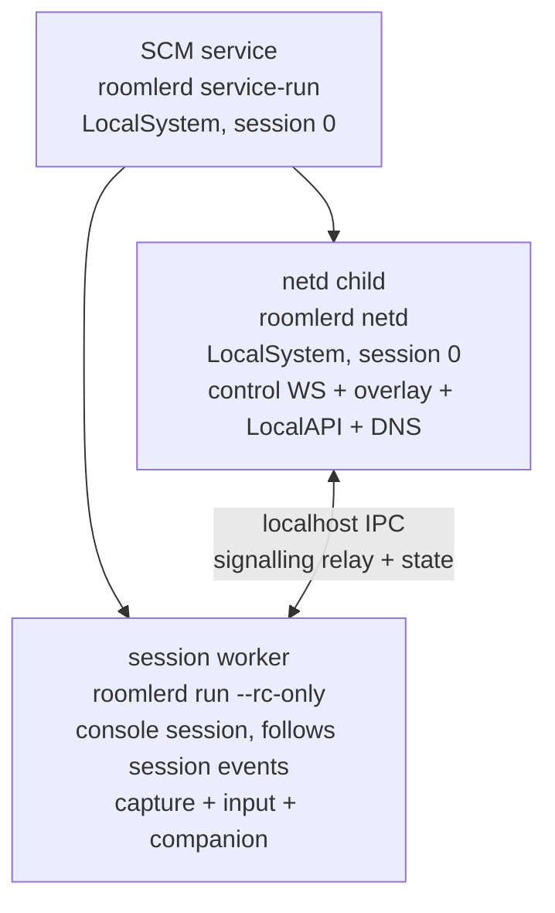

# Session-proof overlay — moving the network plane out of the Windows session (Track A design)

> **Scope.** Why the overlay dies with Windows session events today, and the
> staged design that makes the network plane survive logon screens, session
> switches, RDP attach/detach and VPN-driven session churn — while
> remote-control capture/input stays session-bound, because it must follow the
> console session.
>
> Status: **DESIGN — no code yet.** The W4 lifecycle hardening (TUN-death
> self-heal, session-teardown ladder reset, ReplacedByNewer in-process
> backoff, machine-global config ACL) shipped in rc.363–365 buys time on the
> current topology; this doc is the structural fix.
>
> Companion docs: current carrier machinery in
> [`overlay-communication.md`](./overlay-communication.md); the Windows
> service/worker topology in [`remote-control.md`](./remote-control.md);
> SystemContext mechanics in
> [`operator-systemcontext-smoke.md`](./operator-systemcontext-smoke.md).

---

## 1. The problem, from the field

One mechanism explains two long-standing user reports:

- *"When the Windows logon screen is shown, the overlay stops working."*
- *"When winhost-a connects to the corporate VPN, roomlerd gets restarted."*

The Windows agent is **two processes from one EXE**: the SCM runs
`roomlerd.exe service-run` (LocalSystem, session 0 — the *supervisor*), which
spawns `roomlerd.exe run` (the *worker*) into the **console session** via
`CreateProcessAsUserW` (winlogon token under SystemContext swap). The worker
hosts **everything**: the control WS, the whole overlay runtime (Wintun, WG
peers, carriers, route guard, MagicDNS resolver, LocalAPI) *and* the
remote-control capture/input pipeline.

The worker is therefore **session-bound**, and Windows session events kill it:

| Event | What happens today |
|---|---|
| Sign-out / logon screen (swap OFF) | `WTSQueryUserToken` → `ERROR_NO_TOKEN`; nothing is spawned — node hard-offline until sign-in |
| Console session id changes (fast user switch, RDP) | supervisor terminates the worker, respawns into the new session |
| Session teardown (`0x40010004` class) | worker dies externally; ladder respawn (floor added in W4b) |
| Corp VPN connect (Check Point) | session-change storm → several worker deaths in minutes |

Every worker death is a **full overlay teardown**: Wintun handle, WG
sessions, punched NAT mappings, TURN allocations, DNS/NRPT state — all gone,
all rebuilt 2–60 s later. On flow-lifecycle networks (Check Point grandfathers
only *existing* UDP flows) a single death permanently downgrades the host from
direct/UDP to TCP relay until the next VPN-off window. Field 2026-08-14:
winhost-a had four worker generations in 75 minutes, each rolling a fresh
direct-socket flow.

The rest of the fleet does not have this problem — on Linux/macOS the daemon
is a plain system service with no session coupling. This is a Windows
topology bug, not a network bug.

## 2. Goal and non-goals

**Goal.** The *network plane* — control WS, overlay runtime, LocalAPI,
MagicDNS — runs session-independent and survives every session event,
Tailscale-style ("the tunnel is a system service; apps come and go").
Remote-control capture/input remains session-bound **by design**: it must run
in the console session to capture its desktop and inject its input, and it
must *follow* session changes (that machinery exists and works — SystemContext
swap, Z-path lock-screen overlay, desktop transitions).

**Non-goals.** No change to the wire protocol, enrollment identity, carrier
machinery or the Linux/macOS daemons. No second agent identity per host.

## 3. Candidate shapes

### A. Overlay inside the supervisor process

Move the runtime into `service-run` itself (session 0, LocalSystem).

- ➕ No new process, no new IPC boundary for spawn/reap.
- ➖ The supervisor is deliberately tiny and *boring* — it must stay alive to
  reap/respawn workers and run the update watchdog. Hosting the overlay (and
  its crash surface: Wintun, WFP, route churn, panics in carrier code) inside
  the process that is also the last line of defence inverts the blast-radius
  design. A wedged overlay would take the respawn ladder down with it.
- ➖ Self-update becomes harder: today the supervisor survives while the MSI
  replaces the worker binary on disk; an in-supervisor overlay means the
  updater restarts the network plane with itself.

### B. A third child: `roomlerd netd` (RECOMMENDED)

The supervisor spawns **two** children with independent lifecycles:

- `netd`: session 0, LocalSystem, **never touched by session events**. Owns
  the control WS, the overlay runtime (Wintun creation needs SYSTEM — netd
  has it), LocalAPI, MagicDNS. Respawned by the supervisor only on crash/exit,
  with the existing ladder.
- session worker: exactly today's worker minus the network plane. Killed and
  respawned freely by session logic; its death no longer costs the mesh
  anything.
- ➕ Blast radius: an overlay panic kills netd only; RC sessions merely lose
  transport until netd's ladder brings it back (same as a WS blip today).
- ➕ The logon screen becomes a *non-event* for the mesh: netd keeps running
  while no worker exists at all (today's hard-offline window).
- ➖ One new IPC boundary (see §4) and a two-child supervisor state machine.

### C. Two SCM services

A separate `RoomlerNet` Windows service beside `Roomler`.

- ➕ Cleanest OS-level isolation; SCM restarts each independently.
- ➖ Doubles the install/upgrade/ACL surface (two services in the MSI, two
  sets of recovery settings, ordering constraints at update time), and the
  supervisor still needs to coordinate RC spawning. All of B's IPC work is
  still required. Not worth it for v1; B can graduate to C later without
  changing the IPC contract.

## 4. The crux: one agent identity, one WS, two processes

The control WS carries **both** overlay signalling (netmap, srflx trickle,
relay creds) and RC signalling (session offer/answer, consent, fleet-rpc).
The server enforces one live WS per agent id (`ReplacedByNewer`), so the split
cannot simply open two WSes with the same identity, and a second role/channel
would be a server-side protocol change.

**Decision: netd owns the ONE control WS; the session worker attaches to netd
over localhost IPC.** netd terminates everything network-shaped itself and
*relays* the RC-signalling subset (`rc:session.*`, consent, input-channel
setup) to whichever session worker is currently attached — the same
pattern the LocalAPI already uses (named pipe / loopback TCP with the
existing token gate). RC data-plane traffic is unaffected: WebRTC P2P flows
peer↔worker directly once signalled.

Worker attach/detach semantics:

- Worker connects to netd at spawn, authenticates with the LocalAPI token,
  declares its session id.
- RC signalling arriving while **no worker is attached** (logon screen):
  netd answers what it can answer honestly (`agent online, desktop
  unavailable — session transition`), queues the offer for the configured
  grace (default 15 s), then rejects. Today the whole agent is offline in
  that window; this is strictly better.
- Exec/fleet-rpc: runs in netd (it is shell-level, not desktop-level), which
  also fixes "exec dies during session churn".

## 5. What must move, and what it depends on

| Piece | Today | After | Depends on |
|---|---|---|---|
| Control WS + reconnect ladder | worker | netd | — |
| Overlay runtime (Wintun, plane, carriers, routes) | worker | netd | Wintun handle created under LocalSystem: already true via swap |
| LocalAPI server | worker | netd | port/pipe ownership move; CLI unchanged |
| MagicDNS resolver + NRPT | worker | netd | — |
| Config read | unified (W4c: machine-global + ACL) | same | **DONE rc.363** |
| Crash sidecars / watchdog | worker | per-child | supervisor tracks two ladders |
| Self-update | supervisor + MSI | unchanged; MSI restart cycles both children | asset unchanged (one EXE, new subcommand) |
| RC capture/input | worker | worker (unchanged) | IPC relay (§4) |
| Instance lock | one worker lock | per-role locks (`netd`, `rc:<session>`) | — |

## 6. Staging plan (each stage shippable, each behind the flag)

1. **`overlay_netd` config key (tribool, default OFF)** + supervisor support
   for the two-child topology. With the flag off, nothing changes.
2. **Stage 1 — netd hosts the network plane** on opt-in hosts (winhost-a
   class first: the hosts whose session churn costs the most). Worker keeps
   RC; IPC relay carries RC signalling. Field gate: node stays reachable
   (peers, DNS, exec) across sign-out → 2 min at the logon screen → sign-in,
   and across a VPN connect storm, with **zero** overlay rebuilds attributable
   to session events in the logs.
3. **Stage 2 — default ON for service-mode Windows installs** after ≥2 weeks
   of quiet on the opt-in cohort; `overlay_netd=off` stays as the revert rail
   for one release cycle.
4. **Stage 3 (optional)** — graduate netd to its own SCM service (shape C)
   if operational experience wants independent SCM recovery policies.

## 7. Interactions and risks

- **ReplacedByNewer:** netd's WS lifetime no longer tracks session churn, so
  the zombie-storm frequency on corp paths should drop further (W4d's ladder
  already removed the exit). A worker attach/detach must NOT reconnect the WS.
- **SystemContext swap:** stays exactly as-is for the RC worker; netd never
  swaps (it has no desktop). The swap code paths lose their accidental
  responsibility for network liveness.
- **Update watchdog / rollback:** the supervisor's health checks currently
  probe the worker; they must probe netd (network health) and worker (RC
  health) separately, and roll back on either regressing.
- **Memory/handle budget:** netd is the long-lived process; the RC worker's
  encoder/GPU handles no longer share a process with the network plane —
  a capture-driver leak can no longer starve the mesh.
- **Risk — IPC relay bugs eat RC sessions:** mitigated by staging (flag off =
  today's topology bit-for-bit) and by keeping the relay surface to the
  minimal RC-signalling subset.

## 8. Explicitly rejected

- **Two WSes per agent** (netd + worker each dialing): tripped
  `ReplacedByNewer` by design; a second server-side role/channel is more
  protocol than this problem deserves.
- **Keeping the overlay in the worker + faster respawn:** already tried in
  spirit (W4 hardening); respawn speed cannot save punched NAT flows or TURN
  allocations — only *not dying* does.
- **Session 0 UI-less worker via `WTSGetActiveConsoleSessionId` pinning:**
  capture/input genuinely need the console session; pinning the whole worker
  to session 0 trades the network problem for a remote-control one.
