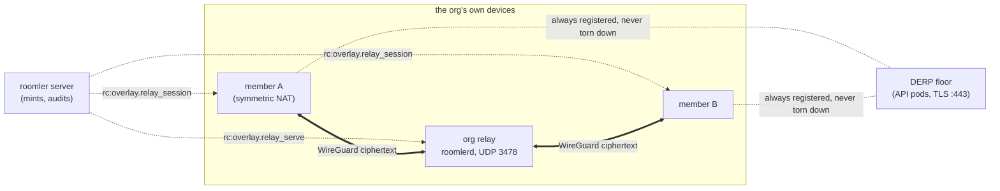
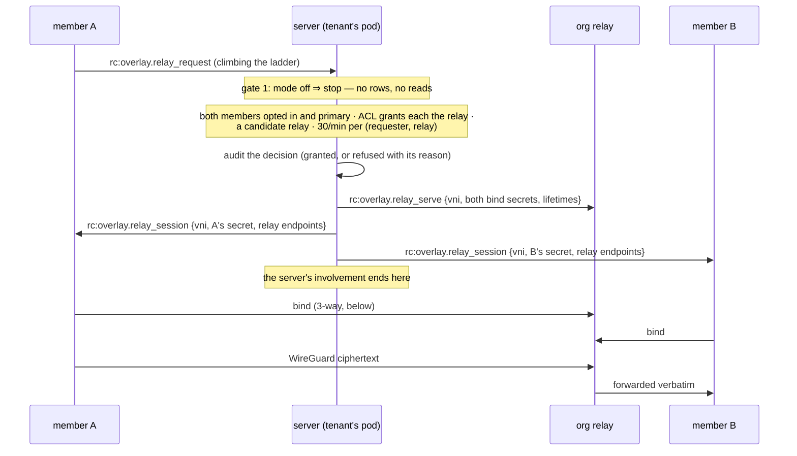
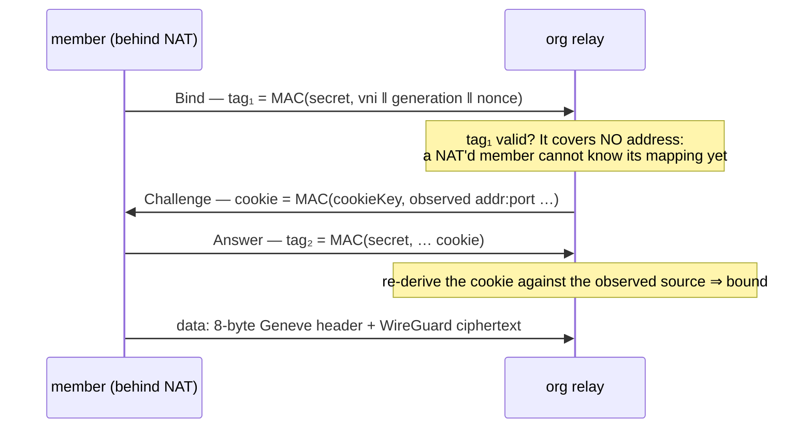

# Peer relays — the org relay

When two of an organization's devices cannot reach each other directly, their
WireGuard ciphertext has to cross a relay. Before FR-19 that relay was always
ours, either coturn or DERP on the API pods, which put roomler's control plane on
the data path for exactly the pairs that need help most. A **peer relay** (or *org
relay*) is one of the org's own enrolled devices, typically a well-connected box at
headquarters, forwarding that ciphertext between the org's other devices over UDP.

The server still decides everything and **carries nothing**. It mints a session,
pushes it to three devices, and its involvement ends. The relay forwards bytes it
cannot decrypt, exactly as DERP does.

> Design record, security review and full field log:
> [`fr/FR-19-peer-relays.md`](fr/FR-19-peer-relays.md) (#805). This page describes
> what shipped.

## Where it sits in the carrier ladder

The org relay is a **third kind of relay, not a new tier**. The ladder is still LAN
→ public → srflx hole-punch → relay. A relay carrier is now one of three `RelayKind`s,
`Turn`, `Derp` or `Org`
([`relay_link.rs:160`](../crates/tunnel-core/src/overlay/relay_link.rs#L160)), and
DERP over TLS :443 stays the floor under all of them. The org relay shows in the CONN
column as `relay:org/udp`.

⚠️ **A new tier would have been read as DIRECT everywhere, without an error.**
`is_direct()` is `!matches!(self, Relay)`, so any new tier variant takes the direct
path's staleness deadline and handshake behaviour. `is_sticky` and
`suppression_half_life` have `_ =>` catch-alls that would silently give it LAN
behaviour too. Adding a transport behind the existing `RelayConn` seam (`OrgRelayConn`,
[`orgrelay/client.rs:239`](../crates/tunnel-core/src/overlay/orgrelay/client.rs#L239))
changed none of the send path, the router or the carrier plane.

Which relay a pair uses is decided in this order
([`relay_link.rs:1052`](../crates/tunnel-core/src/overlay/relay_link.rs#L1052)):

| priority | source | why it sits there |
|---|---|---|
| 1 | a live server force-DERP pin | an escalation the server made on purpose; nothing may thrash the pair back off it |
| 2 | a **live org-relay session** for this pair | both ends hold the same session, so this is symmetric without waiting for the next netmap |
| 3 | the server's verdict stamped on the netmap | measured `CapVector`s, never assumed |
| 4 | the node's own derivation | only when the server said nothing |

🔑 **The org relay engages on a LADDER CLIMB, not on the org switch.** The mint hangs
off `rc:overlay.relay_request`, the frame a member sends while climbing toward a
relay. A pair already settled on a healthy DERP floor sends none, so flipping
`peer_relay_mode` to `on` moves **nothing** until a member re-establishes. To see it
engage, restart a member. The first field run lost an hour to this.

## Five gates, five owners

Every gate defaults to **deny**, and each is owned by a different party, so no single
actor can turn one device into the org's traffic chokepoint.

| # | gate | owner | default | where |
|---|---|---|---|---|
| 1 | org switch `peer_relay_mode` — `off` · `warn` · `on` | the org owner (`MANAGE_TENANT`) | `off` | [`models.rs:2065`](../crates/remote_control/src/models.rs#L2065) |
| 2 | overlay ACL grants **each** member the relay node | the policy author | no grant | [`org_relay.rs:377`](../crates/modules/network/src/org_relay.rs#L377) |
| 3 | per-device approval `peer_relay_policy.serve` | the fleet admin (`MANAGE_AGENTS` **and** `EXEC_DEVICE`) | `false` | [`routes/peer_relay.rs:53`](../crates/modules/network/src/routes/peer_relay.rs#L53) |
| 4 | the relay device's own `relay_server_enabled` | the relay host's owner, **locally** | off | [`orgrelay/mod.rs:36`](../crates/tunnel-core/src/overlay/orgrelay/mod.rs#L36) |
| 5 | each member's own `overlay_org_relay` | each member's owner | off | [`direct.rs:862`](../crates/tunnel-core/src/overlay/direct.rs#L862) |

⚠️ **Gate 2 is evaluated regardless of `acl_mode`.** The overlay ACL's own default is
`off`, which permits everything, and nothing has yet run under `enforce` in the field.
A mode-conditioned relay grant would therefore have been inert on every tenant. It is
an affirmative capability instead, like Tailscale's `cap/relay`: a policy must name
the relay node for the member.

⚠️ **An unreadable policy set is a refusal, never a grant.** The mint reads policies
through `try_load_acl`
([`overlay.rs:2076`](../crates/modules/network/src/overlay.rs#L2076)), which returns
`Result`. The older `load_acl` fails open, byte-identical to "no ACL configured", and a
gate written against it would have granted on a Mongo blip. `PolicyUnreadable` is its
own deny reason, so a blip is never mistaken for a policy decision.

⚠️ **Approval needs `EXEC_DEVICE` because there is no permission bit left.** The UI
checks masks with JavaScript's signed 32-bit operators, and bit 30 is the ceiling
(#888). The coupling grants nothing new: an `EXEC_DEVICE` holder can already run
`roomler config set relay_server_enabled true` as root on any exec-enabled device. Clearing an
approval needs `MANAGE_AGENTS` alone: revoking is not a grant, and the admin who can
approve must not be the only one who can revoke.

⚠️ **Gate 4 is device-local and cannot be pushed.** A relay host is often a box the
admin does not have hands on, and that is the point: the device owner's consent
survives a compromised server. Someone with local access sets it.

**Serving and use are primary-org only.** A UDP listener is host-global, so a
secondary org's admin must not be able to mint sessions onto the device owner's
listener. The server refuses (`SecondaryOrg`), and the device independently drops all
three relay frames when they arrive on a secondary org's socket
([`agents/roomlerd/src/overlay.rs:972`](../agents/roomlerd/src/overlay.rs#L972)).

## The mint — what the server decides

`maybe_mint` ([`org_relay.rs:544`](../crates/modules/network/src/org_relay.rs#L544))
runs on every `rc:overlay.relay_request` and never delays the TURN grant that frame
also asks for.

- **Candidates** are devices that are approved, advertised `relay-server` on their
  last hello, are online on this pod, joined from their primary org, have at least one
  public endpoint and hold fewer than 64 sessions.
- **Ranking**: a relay both members measured reachable wins, by summed RTT. One never
  measured comes next. One a member measured *unreachable* comes **last, not
  excluded**, because a stale negative must not starve the only relay.
- **Endpoints**: the relay's srflx, LAN and trickled addresses, each only if globally
  routable, paired with its relay port (default **3478**), then the admin's
  `static_endpoints`
  ([`org_relay.rs:333`](../crates/modules/network/src/org_relay.rs#L333)).
- **The session**: a 24-bit VNI unique **per relay node**, never 0 and never the STUN
  magic cookie `0x2112A4`, so a STUN packet can never alias a session; a Lamport
  `generation`; and two independent random 32-byte bind secrets, one per member.
- **The relay is pushed first**, so it can verify the binds by the time the members
  arrive. Each member receives only its own secret.
- **A re-request is idempotent**: the live session is re-pushed to the asker only, and
  no row is written, because nothing was decided.
- **`warn` decides and audits exactly as `on` would, and pushes nothing.** Use it to
  see what a tenant *would* relay before turning it on.

⚠️ **`static_endpoints` are public `ip:port` literals, checked when approved and again
at mint time.** A name is refused, because it can resolve to something else by the
time the mint re-checks it. A server-pushed probe target is a port scanner run by
every device in the tenant as SYSTEM/root, so `169.254.169.254:80` must never get
through. `valid_static_endpoint`
([`org_relay.rs:369`](../crates/modules/network/src/org_relay.rs#L369)) is the same
`is_global_unicast` rule push subscriptions use. A mint that finds a bad entry refuses
outright (`NonRoutableEndpoint`) rather than silently dropping it.

**Sessions, VNI cursors and probe reports are pod-local**, which is correct because
tenant affinity puts the requester, the peer and the relay on one pod. After a pod
restart the relay's own table is the truth: its sessions run out their one-hour
lifetime, the members re-request, and a fresh mint issues a fresh VNI.

### Every decision is audited

`peer_relay_audit` (90-day TTL) holds one row shape for all three actions: `approve`,
`mint` (granted or refused) and `revoke`. That makes the question an incident review
asks, "who made this device a relay, and what has gone through it since?", a single
query on `agent_id`.

| deny reason | means |
|---|---|
| `RequesterUnsupported` / `PeerUnsupported` | that end did not opt in with `overlay_org_relay` (gate 5) |
| `SecondaryOrg` | an end, or the relay, joined from a secondary org |
| `AclDenied` | no policy grants a member the relay node (gate 2) |
| `PolicyUnreadable` | the policies could not be read — refused rather than guessed |
| `NoRelay` | no device is approved, serving and online, or every one is full |
| `NonRoutableEndpoint` | an admin-declared endpoint is not a public address |
| `RateLimited` | more than 30 mints a minute for this (requester, relay) pair |
| `NotDeviceAdmin` / `CannotGrantRelay` | approval: missing `MANAGE_AGENTS` / `EXEC_DEVICE` |

⚠️ A mint row records the **decision, not the session**. The server never sees a byte
of what the members exchange. With the org switch `off` there are **zero rows**: the
mode is the first read, and `OrgDisabled` is deliberately never written.

## The bind — two keys, two jobs

A member proves two things to the relay before anything is forwarded, and each proof
needs its own key ([`orgrelay/bind.rs`](../crates/tunnel-core/src/overlay/orgrelay/bind.rs)):

| key | held by | proves |
|---|---|---|
| `BindSecret` ([`bind.rs:93`](../crates/tunnel-core/src/overlay/orgrelay/bind.rs#L93)) | the member **and** the relay, per session | *you are the node this session was minted for* |
| `CookieKey` ([`bind.rs:100`](../crates/tunnel-core/src/overlay/orgrelay/bind.rs#L100)) | the relay **only**, rotating | *you can receive at the address you claim* |

⚠️ **The first design proved only return-routability, and that would have been a hijack.**
Its client only had to echo a value the relay had just sent in the clear. The VNI is
24 bits and not secret, and the peer key is public netmap data. So anyone sharing the
victim's egress `addr:port` could take the slot, and that includes a co-worker behind
the same corporate NAT, the exact population this feature serves. A stolen bind
black-holes the pair, receives its ciphertext, and injects UDP at its WireGuard socket.

🔑 **Why the address is bound at the challenge, not in `tag₁`**: an earlier version put
it in `tag₁`, and eleven unit tests passed because each supplied the address from
outside. The first loopback test, where the client had to actually *be* a client,
showed it could never have computed that value. For any handshake, write the test in
which the client is a real client before trusting the unit tests.

**Control frames are one fixed size** (probe, bind, challenge and answer share a
64-byte shape with a kind byte), so a response is never larger than its request: the
relay cannot be used to amplify. **Data frames** are an 8-byte header plus the payload,
forwarded verbatim ([`wire.rs:44`](../crates/tunnel-core/src/overlay/orgrelay/wire.rs#L44)).
The shape is disjoint from WireGuard, STUN and disco on every first byte, which a test
proves exhaustively rather than by example.

## What the relay does, and refuses

One pure function, `SessionTable::decide`
([`session.rs:195`](../crates/tunnel-core/src/overlay/orgrelay/session.rs#L195)),
decides the fate of every inbound datagram, so each property below is tested without a
socket or a clock:

- **It forwards only between the two bound addresses.** A datagram on a known VNI from
  anywhere else is dropped and counted. Without this the relay is an open UDP proxy
  that rewrites the source to the org's own address. That is IP laundering, and it
  ends with the customer's address on a blocklist.
- **Sessions die on their own.** The idle deadline (300 s) is refreshed by traffic,
  so under a 25 s WireGuard keepalive it never fires. The absolute lifetime (3600 s)
  is what actually expires a busy session. The relay re-clamps every lifetime the
  server sends it, so nothing in a push is trusted.
- **Re-bind is authenticated, and it is required.** Symmetric NATs change mappings, and
  recovery must not need a control-plane round trip. An unauthenticated re-bind would
  be a hijack primitive.
- **The table has a ceiling and refuses rather than grows**: 64 sessions
  ([`session.rs:45`](../crates/tunnel-core/src/overlay/orgrelay/session.rs#L45)). An
  org must not be able to cost its HQ box its own remote access.
- **A parser bug degrades the relay, not the node.** `roomlerd` runs as SYSTEM/root
  and this is a parser for attacker-controlled bytes on a public UDP port. The
  decoders are fuzzed over arbitrary bytes, and the handler runs under `catch_unwind`
  ([`orgrelay/server.rs`](../crates/tunnel-core/src/overlay/orgrelay/server.rs)), so
  one bad datagram cannot take remote desktop, tunnels and SSH down with it.

⚠️ **`roomler status` shows the relay's address and its PROBE counters only.** The
forwarding and drop counters (`forwarded`, `bound`, and one per refusal reason, such as
`drop_unbound_source` or `drop_bad_cookie`) are summarised into the daemon log every
300 s ([`relay_server.rs:143`](../agents/roomlerd/src/relay_server.rs#L143)). A relay
forwarding perfectly well reads `probes_answered=0`, and the first field run
misread that. A nonzero `drop_unbound_source` means someone is *trying*.

## Revocation is a push

Because the idle deadline never fires under keepalive, an expiry would never end a
session. Every revocation is therefore a push, `rc:overlay.relay_revoke {vni}`, sent to
the relay and both members, and each one writes a `revoke` row:

| trigger | reason | code |
|---|---|---|
| the org switched peer relays off | `mode_off` | `revoke_tenant` |
| a policy edit no longer grants a member the relay | `acl_revoked` | `reconcile_acl` ([`org_relay.rs:815`](../crates/modules/network/src/org_relay.rs#L815)) |
| the relay's approval was cleared | `policy_revoked` | `revoke_relay_agent` |
| a party was removed from the overlay | `device_removed` / `device_left` | `revoke_node` |

⚠️ **`reconcile_acl` does NOTHING on a read failure.** Refusing a *new* mint on a blip
costs one session. Tearing down every *live* session on a blip is exactly the
"a spurious deny takes the mesh down" failure the old `load_acl` fails open to avoid.

## Never self-wedge, never remove the floor

- **The DERP floor is unconditional.** A relay coming up never tears down a DERP
  registration: through every org-relay cycle the pod's `derp_registrations` stayed at
  its floor value, and the floor-control laptop (CORPLAP-2) never moved off DERP.
- **Failure is a downgrade, never a black hole.** Measured on 0.4.20 with the relay
  daemon hard-killed mid-session: the member's carrier read `blocked` after **14 s** and
  was on `relay:derp/tcp` after **26 s**, connected throughout.
- **Never ratchet.** When the relay came back, the pair **re-upgraded** to
  `relay:org/udp` on the next ladder climb.

## What the relay operator can see — tell customers this

The relay cannot read the traffic. That is true and incomplete, and the missing half
matters most in the main deployment, where the relay belongs to an **employer's IT
department** and the traffic is often **an employee's remote-desktop session**.

| the relay operator **cannot** see | the relay operator **can** see |
|---|---|
| packet contents: pixels, keystrokes, files, SSH bytes | both members' **WireGuard public keys** (they arrive in the mint) |
| anything recoverable later from recorded ciphertext (WireGuard rekeys) | both members' **real `addr:port`**: a home IP, hotel Wi-Fi, a mobile carrier's NAT |
| | when each session starts and stops, and how long it lasts |
| | **per-flow volume and timing**, with the host's own tools (`tcpdump`, conntrack) |

`roomlerd` itself keeps only **aggregate** counters, with no per-session byte counts.
The host's operating system sees every packet regardless. Remote-desktop traffic has a
distinctive bitrate profile, so that metadata reveals **when a person is at their
machine, and for how long**. Moving the relay in-house moves *content* into the
customer's jurisdiction, and it **newly exposes connection metadata about employees'
personal networks to their employer**. A relay operator can also degrade one session
selectively.

That is why gate 5 exists: `overlay_org_relay = false` on a member is that device's own
last word, whatever the org decides.

## Measured on the fleet

| what | result | build · date |
|---|---|---|
| carrier flip | CORPLAP-3 ↔ mars on `relay:org/udp` at ~84 ms via the relay host; every other pair, including the DERP-floor control, stayed where it was | 0.4.20 · 2026-08-29 |
| **API-pod offload** | the same 12.5 MB blast put **5.99 MB** through the pod on DERP and **81 KB** on the org relay, the idle background: **~74× lower** | 2026-08-30 |
| raw UDP throughput | org **102.8** vs DERP **32.3** Mbps delivered (**3.18×**); org lossless, DERP saturated at 29 % loss | 0.4.23 · 2026-08-30 |
| one TCP stream (SSH `dd`) | org **10.1–19.7** Mbps at 86 ms · DERP **41.6** at 50 ms · direct 44.4 | 0.4.41 · 2026-09-01 |
| relay killed mid-session | `blocked` +14 s, on DERP +26 s, never disconnected; re-upgraded after restore | 0.4.20 · 2026-08-29 |
| port | 3478 is the **only** port the symmetric-NAT corporate laptop could reach (41641 and the coturn band failed) | 2026-08-28 |
| relay socket census | flat for 24 h once [FR-48](fr/FR-48-roomlerd-ice-socket-leak.md) fixed the TURN client's socket leak (was ~9 sockets/h) | 0.4.100 · 2026-09-24 |

🔑 **The org relay's value is pod offload and raw headroom, not universal speed.** Both
throughput rows are correct. The UDP blaster has no congestion control, so it measures
raw forwarding capacity, where the org relay wins. One SSH session is a single reliable
TCP stream bounded by window/RTT and sensitive to loss, and the extra hop cost more than
the capacity gained: the relay was in France and the members in Austria and Germany.
**Placement dominates that number.** A relay near its members would likely flip it.

## Operating it

**Checklist**, in the order that avoids surprises:

1. **A reachable UDP port**, 3478 by default (`relay_server_port`). ⚠️ Check for DNAT
   before believing the port is free: on a cluster node, coturn's DNAT rules consume
   udp/3478 in `PREROUTING`, upstream of any local socket, while `ss -ulnp` shows the
   port unused. `scripts/peer-relay-port-audit.sh` exits 0 (scoped accept), 1 (closed),
   2 (only a blanket policy), 3 (no firewall backend) or **4 (consumed by DNAT)**, and a
   weekly cron (`scripts/peer-relay-port-audit-cron.sh`) runs it over Fleet RPC.
2. **A static endpoint** if the relay sits behind NAT or port-forwarding (a public
   `ip:port` literal).
3. **Approval**: `PUT /api/tenant/{tid}/agent/{agent_id}/peer-relay-policy`
   `{"serve": true, "static_endpoints": [...]}`.
4. **An ACL grant** for each member, naming the relay node in `via` with a destination
   covering the relay's overlay address.
5. **Locally on the relay**: `roomler config set relay_server_enabled true`, then
   restart the daemon. Config keys are read at startup.
6. **On each member**: `overlay_org_relay = true`, then a restart.
7. **The org switch**: `warn` first, read the audit, then `on`.

| route | permission |
|---|---|
| `GET /api/tenant/{tid}/peer-relay` — mode + approved relays, each with `serving` | `MANAGE_AGENTS` |
| `PUT /api/tenant/{tid}/peer-relay` `{"mode": "off" \| "warn" \| "on"}` | `MANAGE_TENANT` |
| `PUT /api/tenant/{tid}/agent/{agent_id}/peer-relay-policy` | `MANAGE_AGENTS`, plus `EXEC_DEVICE` to turn `serve` on |
| `GET /api/tenant/{tid}/peer-relay-audit` | `VIEW_EXEC_AUDIT` |

**Diagnosing "nothing is relayed":**

- `GET …/peer-relay` shows `serving: false` on an approved device. This is the most
  common answer: gate 4 was never set locally, so the device never advertised
  `relay-server`.
- **The audit names the gate.** Every refusal carries its reason, and a pair that never
  appears there never asked. That means the pair was settled on the DERP floor, so
  restart a member to make it climb.
- `roomler peers` CONN reads `relay:org/udp` once a pair is on it, and
  `roomler why <peer>` names the carrier and the relay.
- ⚠️ After heavy enable/disable churn, a member can back off from re-requesting for a
  while. Nothing on the client forces it; wait, or restart it.

## Code map

| piece | where |
|---|---|
| the mint: gates, ranking, session, push | [`crates/modules/network/src/org_relay.rs`](../crates/modules/network/src/org_relay.rs) — `plan_mint` `:377`, `maybe_mint` `:544`, revoke `:742`–`:815` |
| admin routes + approval policy | [`crates/modules/network/src/routes/peer_relay.rs`](../crates/modules/network/src/routes/peer_relay.rs) |
| modes, policy, limits, deny reasons, audit row | [`crates/remote_control/src/models.rs`](../crates/remote_control/src/models.rs) `:2065`–`:2241` |
| wire framing and shape rules | [`orgrelay/wire.rs`](../crates/tunnel-core/src/overlay/orgrelay/wire.rs) |
| the authenticated bind | [`orgrelay/bind.rs`](../crates/tunnel-core/src/overlay/orgrelay/bind.rs) |
| the relay's session table (pure) | [`orgrelay/session.rs`](../crates/tunnel-core/src/overlay/orgrelay/session.rs) |
| the relay server + counters | [`orgrelay/server.rs`](../crates/tunnel-core/src/overlay/orgrelay/server.rs), [`agents/roomlerd/src/relay_server.rs`](../agents/roomlerd/src/relay_server.rs) |
| the member: bind + `OrgRelayConn` | [`orgrelay/client.rs`](../crates/tunnel-core/src/overlay/orgrelay/client.rs) |
| the member's coordinator | [`relay_link.rs`](../crates/tunnel-core/src/overlay/relay_link.rs) — `relay_strategy` `:1052`, `org_request_bind` `:1946`, `commit_org_bind` `:1972` |
| pod-offload metric | `derp_bytes_relayed_total`, [`crates/api/src/cluster/metrics.rs:62`](../crates/api/src/cluster/metrics.rs#L62) |

## Not built

- **A dedicated `RELAY_DEVICE` permission bit.** It waits on the 64-bit mask migration
  (#888). Until then, an org cannot have relay approvers who may not also run root
  commands.
- **A per-session bitrate cap** on the relay. The session count is capped; per-session
  bandwidth is not.
- **A separate tier for the org relay.** If measurement ever shows the selector
  mis-ranking an org relay against TURN or DERP, the tier surgery above is the
  follow-up, opened with that evidence.
