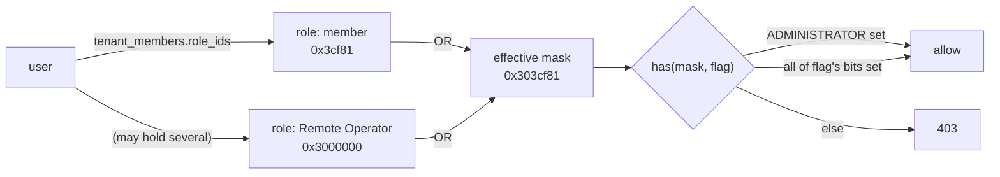
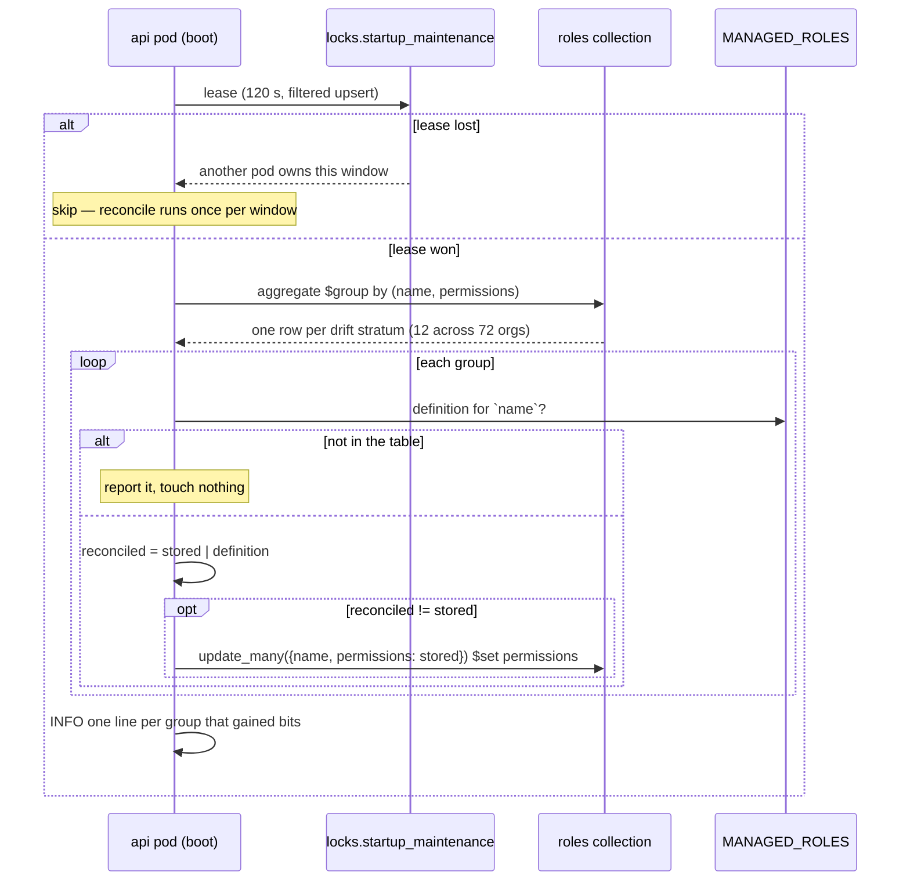
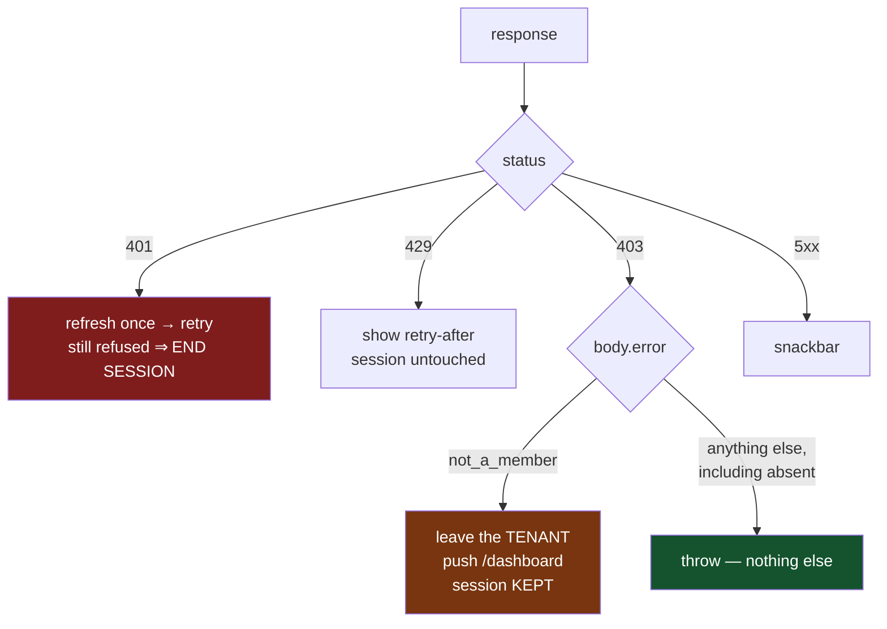

# Permissions, roles, and what a refusal means

*Who may do what in an organisation, where each decision is made, and — the part
that bit us — what the client is allowed to conclude from a `403`.*

> **Related:** [use-cases.md](use-cases.md) walks the model in plain language ·
> [api.md](api.md) lists every route · [fleet-rpc.md](fleet-rpc.md) and
> [roomler-ssh.md](roomler-ssh.md) describe the four-gate chains that *start*
> with a permission bit · [FR-82](fr/FR-82-permission-refusal-is-not-a-logout.md)
> is the arc that wrote this page.

## 1 · The shape

Authorization is a `u64` bitfield per role, OR-ed across the roles a member
holds in one tenant. `ADMINISTRATOR` (bit 23) is a bypass: `has(mask, flag)` is
true whenever it is set.



Source of truth: `crates/db/src/models/role.rs`. The UI mirrors the catalogue in
`ui/src/utils/permissions.ts` and does its mask arithmetic **without bitwise
operators** — JS coerces those to signed int32, which is what capped the
catalogue at bit 30 until #888. Bit 52 is the ceiling (a mask crosses the wire
as a JSON number, exact only below 2^53).

⚠️ **A bit defined in Rust that the UI does not list is a permission nobody can
grant from the product.** The mirror is hand-maintained.

## 2 · The managed roles

Five roles are seeded into every new tenant and are **system-managed**: the
product refuses to delete them, because their definitions belong to the code
rather than to the org.

| role | mask | carries | notes |
|---|---|---|---|
| `owner` | `permissions::ALL` | everything, incl. `ADMINISTRATOR` | the tenant creator |
| `admin` | `DEFAULT_ADMIN` | channels, roles, members, fleet management, all three audit views | ⚠️ **not** `MANAGE_TENANT` |
| `moderator` | member + moderation + `REMOTE_CONTROL` | | |
| `member` | `DEFAULT_MEMBER` | read/write in channels, join calls | `is_default` — the invite path resolves it **by name** |
| `guest` | `VIEW_CHANNELS \| READ_HISTORY` | | |

⚠️ **`EXEC_DEVICE` and `SSH_DEVICE` are in no row below the `ADMINISTRATOR`
bypass, and a test enforces it**
(`no_managed_role_below_administrator_seeds_a_root_shell`). They run as
SYSTEM/root with nobody watching, so they stay grants an owner makes on
purpose. Because the reconcile in §3 hands out whatever the table says,
`DEFAULT_ADMIN |= EXEC_DEVICE` — a one-token edit that reads as tidying —
would open exec-as-SYSTEM on every existing org at the next boot, with no
migration to review and no admin action to audit.

⚠️ `owner` holds both bits, as part of `ALL`. That is not an exception to the
rule so much as outside it: the row carries `ADMINISTRATOR`, so `has()` already
answers true for every bit, and the two bits confer nothing there. The test
skips any row with the bypass for exactly that reason — a check that fails on
`owner` is failing for a reason that says nothing about the risk.

⚠️ **`MANAGE_TENANT` is deliberately absent from `DEFAULT_ADMIN`.** Configuring
the organisation — including the `exec`, `ssh` and ephemeral-key org switches —
is the owner's job. This is policy, not an oversight, and it is why an org's
admins do not see the Devices page's enrollment-keys card.

## 3 · A managed role is reconciled, not frozen (FR-82)

Until FR-82 a managed role's mask was written **once, at tenant creation, and
never again**, so adding a permission bit reached only organisations created
afterwards.

Measured on the hosted deployment before the fix — 72 orgs, 360 managed roles:

| role | stored | orgs | what it was missing |
|---|---|---|---|
| `owner` | `0xffffff` | 63 | everything above bit 23 (no-op in effect — the `ADMINISTRATOR` bypass covered it) |
| `admin` | `0x7ffff7` | 63 | `MANAGE_AGENTS`, `REMOTE_CONTROL`, `VIEW_REMOTE_AUDIT`, `VIEW_EXEC_AUDIT`, `VIEW_SSH_AUDIT` |
| `moderator` | `0x7ef91` | 63 | `REMOTE_CONTROL` |

Each distinct `owner` mask is a snapshot of `permissions::ALL` on the day that
org was created — the freeze, visible in the data. The one non-managed role on
the whole deployment was a hand-made `Remote Operator`
(`MANAGE_AGENTS | REMOTE_CONTROL`) an operator had built *because* their own
`admin` role could not see the fleet.



⚠️ **Additive: `new = stored | definition`, never a replace.** A managed role's
mask *is* editable through `PUT …/role/{id}` (only *deletion* is refused), so an
org may legitimately have added a bit; overwriting would silently revoke it.
**The cost, stated so nobody rediscovers it: a bit REMOVED from a definition — a
tightening — does not propagate**, and needs its own migration that says out
loud whose permissions it takes away.

⚠️ **The mirror case is the surprising one: a bit an ORG removed comes back.**
OR-ing cannot tell *"this org never had `REMOTE_CONTROL`"* from *"this org took
it away on purpose"* — one stored mask, both read as absent — so an org that
narrowed a managed role sees it silently widened at the next boot. That is the
price of protecting org-ADDED bits, and it means **narrowing a managed role is
not a supported way to restrict a team**: make a custom role instead. The
reconcile matches `is_managed: true` only, so a custom role is never in its
aggregation at all.

⚠️ Matching the **exact stored value** in the filter makes the update idempotent
*and* safe against a concurrent editor: a role changed underneath simply falls
out of its group's filter instead of being clobbered.

⚠️ A managed row whose name is not in the table is **reported and left alone**.
Visible drift beats drift corrected by guesswork.

⚠️ It is logged at INFO with the arithmetic, never silently — this grants
permissions across every tenant on the deployment. Every later boot prints
*"managed roles already match their definitions"*.

### The record that outlives the pod — `role_reconcile_audit`

⚠️⚠️ **A log line is a notification, not an audit trail.** This paragraph used
to end *"…so the one run that does something has to be readable in `kubectl
logs` afterwards"*. Measured on the 2026-09-09 roll: **~10 minutes later it was
readable nowhere.** `kubectl logs` serves only the *current* container, the
emitting pod had been replaced, and the sole record of a one-way grant across
63 organisations survived purely because somebody was watching live and had
captured a before-state. Neither is guaranteed next time.

So each **changed** stratum also writes a row: role, how many organisations it
covered, `stored` → `granted`, the `gained` mask, and the permission **names**
added — the masks are the record, the names are what a human reads years later
without re-deriving a bitfield. Written from inside the reconcile, one statement
after the `update_many` it describes, so the two cannot drift.

| property | here | every other audit collection | why |
|---|---|---|---|
| scope | deployment-wide | tenant + device + user | there is no tenant, no device and no requester — one row covers every org that shared a stale mask |
| TTL | **none** | 90 days | already bounded: ~12 rows once per deployment, then nothing. A TTL would delete the only record of an irreversible grant and re-create the gap |
| on failure | logged, reconcile continues | same | the roles are already correct; failing a migration over its receipt trades a real outage for a bookkeeping one |

⚠️ An idempotent run writes **nothing** — otherwise every restart buries the one
row that matters.

**Kill switch:** `ROOMLER__AUTH__RECONCILE_MANAGED_ROLES=false` (default on;
the daemon warns at startup when it is off). Two legitimate uses and no
others: a deployment that has deliberately edited a managed role *down* and
wants it left alone — the reconcile is additive, so it would restore the bit
on every boot — and stopping the job without rolling back an image. It is not
a way to opt out of new permissions; a role frozen at its creation-day mask is
the bug, not a configuration.

## 4 · What a refusal means

Two refusals share the `403` status code and mean different things, and a third
family deliberately does not use it at all. Getting the first two confused cost
a week of users being signed out of the product.

| server produces | status + `error` | means | client does |
|---|---|---|---|
| `ApiError::NotAMember` | 403 `not_a_member` | you are not in this tenant | leave the **tenant** → `/dashboard`, session intact |
| `ApiError::Forbidden(msg)` | 403 `forbidden` | you are, and you may not do that | throw; the caller renders `msg` |
| `require_platform_admin` | **404** | not on the operator allowlist | ordinary 404 — the allowlist is itself what is hidden, so a 403 would confirm the surface exists |
| `require_tenant_stats` | **404** | not a member, or without `MANAGE_AGENTS` | ordinary 404 — these are polled dashboards, and an empty panel beats an error on every tick |



⚠️ **A 403 never ends a session — on any method.** It is a verdict on a
credential the server just *accepted*, the opposite of a 401.

⚠️ **The default direction is the guarantee.** An *unclassified* 403 does
nothing but throw, which is what makes a newly-added permission-gated route
inert on the client by construction, rather than dangerous until someone
remembers to add a predicate for it.

⚠️ **The distinction is sent by the server, not sniffed from the message.**
`chat`'s `Forbidden("Not a member of this room")` is a 403 of exactly the same
shape; evicting someone from their organisation over a private channel would be
absurd.

### How it went wrong

`ui/src/api/client.ts` used to read *any* `403` on a `GET` as a dead session —
clear the sign-in hint, push `/login`. On 2026-09-08 a member opened
`/tenant/{id}/devices`:

```
mask 0x303cf81  (member + a custom MANAGE_AGENTS|REMOTE_CONTROL role)
  ├─ MANAGE_AGENTS ⇒ the "Devices" nav item renders
  └─ MANAGE_TENANT ABSENT
      └─ EnrollKeysSection mounts unconditionally and GETs
         /tenant/{id}/ephemeral-key-settings   ⇒ 403 ⇒ signed out
```

Four things worth keeping:

1. **Only the owner of any org was safe.** `MANAGE_TENANT` is not in
   `DEFAULT_ADMIN`, so an org's own admins were logged out by opening their own
   Devices page. The `ADMINISTRATOR` bypass hid it for a week.
2. **The store's `catch` was correct and never ran on the branch that
   mattered** — the logout fired one layer below it, inside `request()`, before
   the throw the store was waiting for. A handler cannot defend against a
   side effect its own transport performs first.
3. **A unit test asserted the logout as correct behaviour**, with a comment
   explaining the case it existed for.
4. **Three fail-closed predicates in `utils/permissions.ts` exist only to route
   around the rule** — `canQueryAnalytics`, `canManageInvites`,
   `canViewExecAudit`/`canViewSshAudit` — each written after the same bug
   surfaced in a different corner. The codebase had been paying for the rule in
   instances for months without anyone pricing the rule itself.

Those predicates are kept, with their reasons rewritten: they are **UX** now —
don't draw a door that opens onto a refusal, don't spend a round-trip learning
what the mask already says — not session protection.

## 5 · Where a gate belongs

⚠️ **In the store, not at the call site.** The `MANAGE_TENANT` GETs
(`exec-settings`, `ssh-settings`, `ephemeral-key-settings`) are gated inside
`ui/src/stores/agents.ts`. This is the rule FR-75 (#1447) paid for on the
`network` module's routes: a per-caller predicate leaks the moment one caller
reaches for the wrong one — and `ephemeral-key-settings` had no caller-side
gate at all, because the page that mounts the card never had one to forget.

⚠️ It **awaits** `ensureMyMembership` rather than reading `myPermissions`:
AppLayout's `/member/me` is in flight while the page mounts, so a synchronous
read is a coin-flip between "hidden from the owner" and "fires anyway".

⚠️ The client gate is never the enforcement. Every route re-checks server-side;
the UI only avoids offering what it already knows will be refused.

## 6 · Permission bits that are deliberately NOT implied

The catalogue splits powers that look adjacent, and each split was paid for:

| holding | does **not** imply | why |
|---|---|---|
| `MANAGE_AGENTS` | `EXEC_DEVICE` | managing a device's metadata and running a root shell on it are different powers |
| `EXEC_DEVICE` | `SSH_DEVICE` | a bounded command is not an interactive session that lasts and grows file transfer and port forwarding |
| `VIEW_EXEC_AUDIT` | `EXEC_DEVICE` | an admin should see every command the fleet ran without silently gaining the power to run one |
| `VIEW_SSH_AUDIT` | `SSH_DEVICE` | same asymmetry, and `VIEW_SSH_AUDIT` *is* in `DEFAULT_ADMIN` while `SSH_DEVICE` is not |
| any bit below `ADMINISTRATOR` | `MANAGE_TENANT` | configuring the org is the owner's job — nothing in `DEFAULT_ADMIN` reaches it, only the bypass does |

And the escalation rule that ties them together: **you cannot grant a permission
you do not hold** (#600/#605). Enabling exec on a device needs `MANAGE_AGENTS`
*and* `EXEC_DEVICE`; any `ssh_*` key needs `SSH_DEVICE`. Clearing an approval
needs only `MANAGE_AGENTS` — revocation is not a grant.

## 7 · Reference

| what | where |
|---|---|
| bit catalogue, `has`, `DEFAULT_*`, `NAMED` | `crates/db/src/models/role.rs` |
| managed-role table | `role::MANAGED_ROLES` (same file) |
| seed at tenant creation | `TenantDao::create_default_roles` |
| reconcile at boot | `TenantDao::reconcile_managed_roles`, called from `crates/api/src/main.rs` under the `startup_maintenance` lease |
| the tenant/permission guards | `crates/core/src/guards.rs` |
| error → wire | `crates/core/src/error.rs` |
| client contract | `ui/src/api/client.ts` |
| UI mirror + predicates | `ui/src/utils/permissions.ts` |
| tests | `crates/tests/src/role_reconcile_tests.rs`, `ui/src/__tests__/api/client.spec.ts`, `ui/src/__tests__/stores/agents.spec.ts` |
