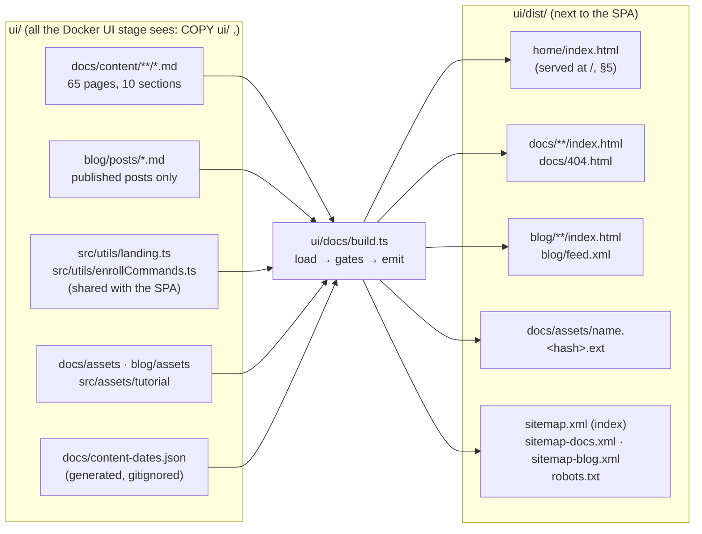
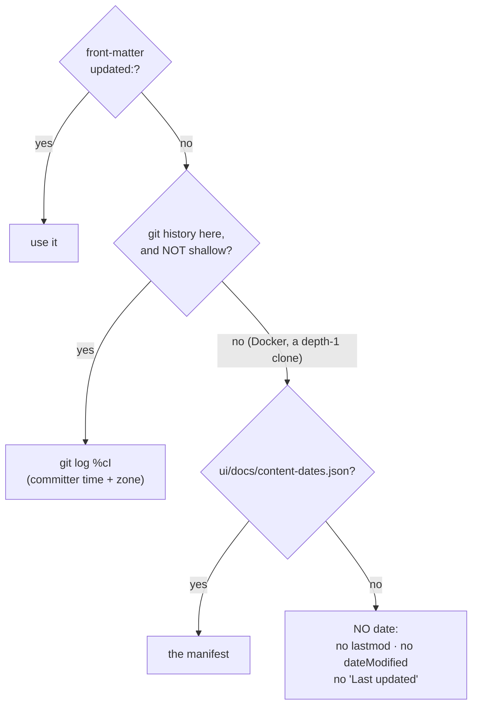
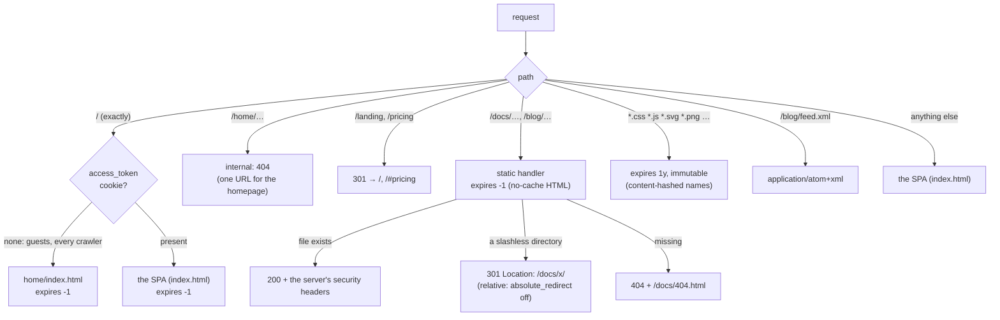
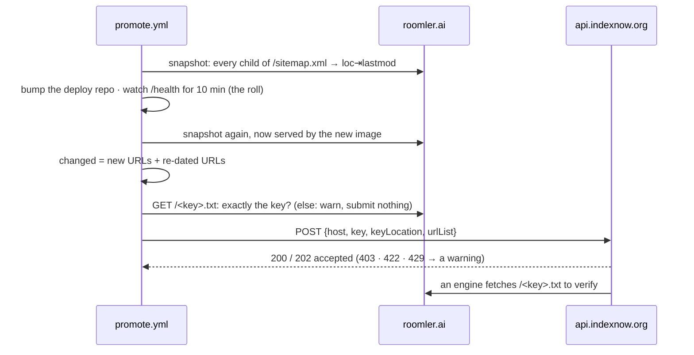

# The public site: `/`, `/docs`, `/blog` and what a crawler reads

**Audience:** whoever changes `ui/docs/`, `ui/blog/`, the landing copy, the pod's nginx config,
or anything a search engine sees. Built by [FR-60](fr/FR-60-public-docs-site.md) (#1165, the
docs generator) and [FR-87](fr/FR-87-blog-and-google-indexing.md) (#1776, the blog, honest
dates, hashed assets, the head and the static homepage).

The product is a single-page app that a crawler reads as one empty `<div id="app">`.
Everything a search engine should find (the homepage, the user documentation, the blog) is
**static HTML** built by one in-repo generator into `ui/dist/`, next to the SPA, and served by
the same pod nginx. No dependency was added for any of it: the generator is `markdown-it`
(already a UI dependency) plus hand-written TypeScript.

> ⚠️ **CI green is not "Google can read it".** Every defect FR-87 fixed was invisible from
> inside the build: dates that changed on every deploy, a redirect that downgraded to
> `http://`, soft 404s, a year of `immutable` cache on files that changed. They are caught now
> by [`scripts/public-site-smoke.sh`](../scripts/public-site-smoke.sh) against the image in CI
> **and** against production after a promote (§6).

## 1. One generator, two collections and a homepage



`bun run build` is `vue-tsc && vite build && bun docs/build.ts`. **The generator must run
after `vite build`**, which empties `dist/`. CI runs the three separately so each failure gets
its own annotation ([`ci.yml:1538`](../.github/workflows/ci.yml)).

| Collection | Source | URL | Dated from |
|---|---|---|---|
| Docs | `ui/docs/content/<section>/<page>.md` | `/docs/<section>/<page>/` | git (§2) |
| Blog | `ui/blog/posts/<slug>.md` | `/blog/<slug>/` | front-matter only: editorial dates, because a typo fix is not a new post |
| Homepage | `ui/src/utils/landing.ts` (the SPA's `LandingView.vue` imports the same module) | `/`, for requests without a session cookie (§5) | undated |

Both share the page shell ([`theme/shell.ts`](../ui/docs/theme/shell.ts)), the link checker,
the search index, the asset pipeline and the sitemaps. A second builder was rejected in the
FR-87 plan: two writers of `sitemap.xml`, and a link checker that could not see a blog → docs
link.

**Every gate fails the build**, with every problem listed in one run
(`build.ts:main`, [`build.ts:498`](../ui/docs/build.ts)):

| Gate | Where |
|---|---|
| a link to a page nobody generates, or to a heading a page does not have (same-page `#anchor`s included) | [`theme/links.ts:31`](../ui/docs/theme/links.ts) |
| front-matter: a missing key, an unknown key (strict), a description over 160, a `<title>` that does not fit 60 | `build.ts:loadPage` ([`:259`](../ui/docs/build.ts)) |
| the homepage: a link to a page nobody generates; an SPA icon with no inline SVG mapped | `build.ts:main`, [`theme/home-layout.ts:63`](../ui/docs/theme/home-layout.ts) |
| images: no alt text, a remote or `data:` src, a raw ``, over 3 MB, a format nobody can size | [`render.ts:475`](../ui/docs/theme/render.ts), [`theme/images.ts:139`](../ui/docs/theme/images.ts) |
| posts: no `draft` (a file there IS published), no future date, `updated` before `date`, a share image under 1200 px or not raster | [`theme/posts.ts:81`](../ui/docs/theme/posts.ts) |
| the search index over 150 KB gzipped | `build.ts:main` |

## 2. Dates: honest, or absent

Crawlers read `<lastmod>` and `dateModified` as "when the content changed". Before FR-87 every
production page claimed the day of the build: `.dockerignore` drops `.git` and CI clones one
commit, so the git lookup always fell back to "today" (**70 of 70** sitemap URLs, measured
2026-09-28, against content last changed 2026-09-01). A crawler that catches `lastmod` lying
stops trusting it for the whole site.



- **Where the manifest comes from:** `hosted-image.yml` checks out full history and runs
  `bun docs/dates.ts --write` before the Docker build
  ([`hosted-image.yml:113`](../.github/workflows/hosted-image.yml)); the build context is a
  path, so the untracked file reaches `COPY ui/ .`. The CLI **refuses** to write from a shallow
  clone ([`dates.ts:106`](../ui/docs/dates.ts)): a depth-1 clone's one commit "touches" every
  file, which would stamp HEAD's date everywhere, the same lie one step removed.
- **Timestamps, not dates.** JSON-LD and `article:*_time` carry git's `%cI`
  (`2026-09-01T23:58:15+02:00`). Google's Rich Results Test flags a bare `YYYY-MM-DD` as an
  "invalid datetime … missing a timezone". The sitemap and the page footer use the date part,
  which is exactly `git log -1 --format=%cs`.
- **Generated pages** (section and tag indexes) have no source file, so they have no date.

> ⚠️ **The break-glass build-host path must run the manifest step too** (`ship-it` §4,
> [deployment.md](deployment.md)). Without it the image publishes no dates at all. That is
> honest, but it is a regression, and the smoke's `lastmod` check reports it.

## 3. Assets: names that change when the bytes do

nginx serves every `.css`/`.js`/image with `Cache-Control: public, immutable` and a one-year
expiry (the `\.(?:js|css|…)$` location in `files/nginx-pod.conf`). That promise only holds for
a name that changes with its content, so every file the generator publishes is
`name.<sha256:10>.ext` ([`theme/assets.ts:43`](../ui/docs/theme/assets.ts)). The HTML is
revalidated on every load (`expires -1`, §5), and it is what moves a reader to new bytes.

- The search index is hashed too; its URL reaches `search.js` through `data-search-index`.
- `social-preview.png` keeps a stable name: `ui/index.html` names it as the SPA's `og:image`.
- `LEGACY_UNHASHED_ASSETS` ([`site.ts:38`](../ui/docs/site.ts)), when on, also publishes each
  file under its old plain name, for HTML a browser cached before revalidation began. Pre-FR-87
  HTML carried no `Cache-Control` at all, so a browser could hold it under heuristic caching
  (about 2.8 days). The flag has been **off since 2026-10-04** (FR-87 §4c): only hashed names
  are published.
- **Images carry their real size**, read from the file's own header (PNG, GIF, JPEG, WebP, SVG
  parsed by hand), so the browser reserves the right box. FR-60 hard-coded 960×420 on heroes
  that are 760×400 or 600×540. An image alone in its paragraph becomes a `<figure>`, its
  markdown title the caption.

## 4. What the `<head>` says

Built once, in [`theme/shell.ts:91`](../ui/docs/theme/shell.ts), for every collection.

| | Docs page | Docs listing (home, section, tag) | Post | Blog index | Homepage `/` |
|---|---|---|---|---|---|
| `<title>` | ≤60: the author's `seoTitle`, else the first default that fits (with the section, without it, bare) — [`layout.ts:114`](../ui/docs/theme/layout.ts) | same | `seoTitle`, else `title — Roomler blog` if it fits | fixed, ≤60 | fixed, ≤60 (a unit test) |
| `og:type` | `article` | `website` | `article` | `website` | `website` |
| JSON-LD (one `@graph`) | Organization + `TechArticle` + BreadcrumbList (+ FAQPage) | Organization + `CollectionPage` | Organization + `BlogPosting` (a **Person** author) + BreadcrumbList | Organization + `Blog` | Organization + `WebSite` |
| share image | the social card | the social card | the post's own, raster, ≥1200 px | the social card | the social card |

> ⚠️ **No `SoftwareApplication` on the homepage.** Its rich result requires `aggregateRating`
> or `review`, and a page without them reports the markup as an error. Ratings are never
> invented to make it pass; `home.spec.ts` fails if the type appears.

- **One Organization** (`@id https://roomler.ai/#organization`, legalName **G ROX EOOD**) is a
  node of every graph, and every author and publisher points at it. FR-60 wrote "G ROX LTD".
- Indexable pages ask for `max-image-preview:large`; the rest get `noindex, follow`.
- `/sitemap.xml` is a **sitemap index** over `sitemap-docs.xml` and `sitemap-blog.xml`, so
  Search Console reports each collection on its own. FR-60's sitemap also listed five SPA
  routes whose served canonical is `/`, a contradiction Search Console reports as "Duplicate,
  submitted URL not selected as canonical". They are gone.
- **Analytics:** the SPA's own first-party purestat script, which the CSP already allows.
  `ANALYTICS = null` ([`site.ts:155`](../ui/docs/site.ts)) turns it off.

## 5. How nginx serves it



Config: the cookie `map` at [`files/nginx-pod.conf:12`](../files/nginx-pod.conf) (it must
live at `http` level, which is where `conf.d/` files land), `absolute_redirect off` at
[`:32`](../files/nginx-pod.conf), and the locations from [`:129`](../files/nginx-pod.conf)
(`/docs/`) to [`:165`](../files/nginx-pod.conf) (`/landing`).

**The homepage is chosen by the session cookie.** `map $cookie_access_token $root_doc` picks
`/home/index.html` when the HttpOnly session cookie is absent and the SPA's `index.html` when
it is present, and `location = / { expires -1; try_files $root_doc =404; }` serves it.
`try_files` serves the chosen file *inside* that location, so both branches get `no-cache` and
the server's security headers, and `internal` on `/home/` does not block it.

> ⚠️ **The access cookie is not the whole session.** It lives 7 days. The refresh cookie lives
> 30, but it is scoped to `Path=/api/auth/refresh`, so nginx never sees it at `/`: a returning
> user on day 8 would get the sign-up page from a site that could still sign them in.
> [`home.js`](../ui/docs/theme/home.js) closes the gap. It loads in `<head>`, without
> `defer`, and when the SPA's localStorage hint (`roomler-signed-in`, from
> `ui/src/api/session.ts`) says signed in, it replaces the page with `/login`. The SPA's
> guest guard sends a signed-in visitor on to the dashboard, whose first 401 refreshes the
> session.
> - **Never `/`:** without the cookie, nginx would serve the static page again.
> - **A stale hint cannot loop:** a failed refresh clears it and shows the login page.
> - **A crawler has no localStorage**, so it stays on the page.
>
> `home.spec.ts` locks the key to the one the SPA writes by *running* `home.js` after the
> SPA's own `markSignedIn()`.

> ⚠️ **Never navigate the SPA fully to `/` to "show the homepage".** The SPA only runs at `/`
> when the request carried a cookie, so for a cookie the server refuses, a full navigation to
> `/` returns the SPA, which navigates to `/` again, and so on. The router keeps its
> client-side push to `/landing` (`LandingView`, the same copy), which cannot loop. Logout
> already expires both cookies on the server.

> ⚠️ **`expires` in these locations, never `add_header`.** nginx inherits the server-level
> `add_header` list only when a location declares none, so one `add_header` would silently drop
> CSP, HSTS, X-Frame-Options and the rest for every page. `expires` is merged separately.
> The smoke compares each page's security headers with `/`; a negative control (one
> `add_header` in `/docs/`) fails it.

> ⚠️ **No `try_files` in `/docs/` or `/blog/`.** FR-60's `try_files $uri $uri/index.html =404`
> made `/docs/start` a 200 duplicate of `/docs/start/`: its `$uri/index.html` test matches the
> file, so nothing ever redirects. Without `try_files`, the static handler 301s the slashless
> form. (`try_files $uri $uri/ =404` also 301s, measured, but adds nothing.)

## 6. Proving it: the public-site smoke

[`scripts/public-site-smoke.sh`](../scripts/public-site-smoke.sh) `<base-url> [<repo> [<rev>]]`
checks the **served** site. It runs against every image in `hosted-image.yml`
([`:209`](../.github/workflows/hosted-image.yml)) and belongs against production after a promote:

```bash
bash scripts/public-site-smoke.sh https://roomler.ai . <deployed-sha>
```

| Check | Catches |
|---|---|
| `/docs`, `/docs/start` → 301 to the slash form, relative | the `http://` downgrade; duplicate URLs |
| missing `/docs/…`, `/blog/…` → 404 with the site's 404 page | soft 404s |
| docs HTML `Cache-Control: no-cache` | HTML cached against hashed assets |
| security headers on `/docs/`, a leaf, `/blog/` == `/` | the `add_header` trap |
| with posts: the feed is `application/atom+xml`; without: `/blog/` is a real 404 | the Atom type; the kill switch |
| `/` without a cookie is the static homepage (its H1 + `WebSite` JSON-LD); with `access_token` it is the SPA | a crawler reading the SPA shell; signed-in users losing the app |
| `/`'s security headers are the same with and without the cookie, and it is `no-cache` | the `add_header` trap at `/` |
| `/home/` → 404; `/landing` → 301 `/`; `/pricing` → 301 `/#pricing` | a second URL for the homepage; the SPA's old routes |
| every `/docs/assets/` file `/`, `/docs/` and a leaf name is hashed and loads; every `` has a size | stale caches; layout shift |
| given a full-history repo, every docs `<lastmod>` equals git's | dates from the build clock |
| given the repo, `/<key>.txt` serves the IndexNow key exactly as committed (§8) | a key file that stopped shipping: `location /` would answer with the SPA shell, and every engine would reject every submission |

Each check was shown failing before it passed. Against production before FR-87 it failed on
all of them, and an image built with no manifest fails the `lastmod` check. Production before
P6 fails the six homepage checks. Eight mutations of the P6 nginx lines each turn their
check red, among them one `add_header` in `location = /`, which strips every security header
from both branches (FR-87 §9).

## 7. Writing for it

- **A docs page:** a file under `ui/docs/content/<section>/`; the nav is derived from the files,
  never hand-listed. Keys: `title`, `description`, `tags`, `order`, `hero`, `heroAlt`,
  `noindex`, `faq`, `updated`, `seoTitle`.
- **A post:** `ui/blog/posts/<slug>.md`. The contract is [`ui/blog/README.md`](../ui/blog/README.md).
  **A file there is published**; there are no drafts. Unpublished copy lives in the private
  promo repo (FR-39: post copy stays out of this public repo).
- **A post also on Medium:** publish it here first; set `syndication:` to the Medium URL, and
  set Medium's canonical link (Story settings → Advanced → Customize canonical link) to the
  post's URL here, the same day, or the Medium copy competes with it in search.
- **Keywords:** each page owns one phrase (FR-87 §3). A post and a docs page chasing the same
  query compete with each other; give them different titles and link them to each other.
- **With no post, there is no blog:** no `/blog/` output, no Blog link, no feed, no sitemap
  entry. The blog's styles are `blog.css`, published only with a post, so an empty
  `ui/blog/posts/` ships byte-identical docs.
- **The homepage's copy:** `ui/src/utils/landing.ts`, one zero-import module that the SPA's
  `LandingView.vue` and [`theme/home-layout.ts`](../ui/docs/theme/home-layout.ts) both render,
  so the two pages cannot drift. The install commands come from `enrollCommands.ts`, as
  everywhere else. The static page draws the docs' inline SVG icons: a new SPA icon needs an
  entry in `home-layout.ts`'s map, or the build fails.
- **What `home.js` adds:** the signed-in hand-off (§5); the newsletter form, where the server
  mounts `saas` (failing open, as the SPA does); and live prices from `/api/stripe/plans`,
  over the fallback table the page ships. With JavaScript off, the page is complete and the
  form's place links to sign-up.

## 8. Telling search engines

Crawlers find the site through `/sitemap.xml` (named in `robots.txt`) at their own pace. Two
things shorten that, and neither needs server code.

**IndexNow, on every promote.** Bing, Yandex, Seznam, Naver and the other engines that share
`api.indexnow.org` accept a list of changed URLs, and recrawl them within minutes. Google does
not take part. `promote.yml` does it around the roll, with
[`scripts/indexnow.sh`](../scripts/indexnow.sh):



- **What counts as changed:** a URL that is new, or whose `lastmod` differs. The lastmods come
  from git (§2), so a release that only touches the theme submits nothing. An undated URL
  (`/`, generated listings) is submitted once, when it first appears. With no before-snapshot,
  nothing is submitted, never everything.
- **The key is public by design.** Engines verify a submission by fetching
  `https://roomler.ai/<key>.txt`, so the file in `ui/public/` is its only source: the promote
  job checks out just `scripts/indexnow.sh` and `ui/public/*.txt`, and the smoke (§6) checks
  the file is served as committed.
- **Off unless the repository variable `INDEXNOW_ENABLED` is `true`**, and warn-only: a missed
  hint to a crawler never fails a promote.

**Search Console** holds the Domain property `sc-domain:roomler.ai`. It sits under the
Workspace account that owns the domain, and it verified itself from the domain's existing
`google-site-verification` TXT record (2026-09-29). Two things live there:
- **the sitemap index** `https://roomler.ai/sitemap.xml`, read as "Success";
- **per-page reindexing**: URL Inspection → *Request indexing*, about 10 a day. Use it after a
  page's content changes in a way that matters for search: a new page, or a new title.

It takes that account's sign-in, so it is the operator's. **Bing Webmaster Tools** imports the
property from it. Review the coverage at +3, +14 and +28 days after a launch (FR-87 §4h).

> ⚠️ A sitemap just submitted can read **"Couldn't fetch"** for a few minutes before Google has
> read it. Check what a crawler gets (`curl -A Googlebot …` → 200, `text/xml`) before chasing
> it: on 2026-09-29 it turned to Success on its own.

> ⚠️ **Not used, on purpose:** the sitemap "ping" endpoints (retired by Google in 2023), the
> Indexing API (Google limits it to job postings and livestreams), and a `SoftwareApplication`
> rich result, which requires ratings.

## Code map

| File | What it owns |
|---|---|
| [`ui/docs/build.ts`](../ui/docs/build.ts) | discovery, loading, the gates, emission, sitemaps, robots, the feed |
| [`ui/docs/dates.ts`](../ui/docs/dates.ts) | git dates, the manifest, `--write` |
| [`ui/docs/site.ts`](../ui/docs/site.ts) | sections, limits, keys, the Organization, authors, the blog's constants |
| [`ui/docs/theme/render.ts`](../ui/docs/theme/render.ts) | markdown → HTML: containers, images, headings, code |
| [`ui/docs/theme/shell.ts`](../ui/docs/theme/shell.ts) | the `<head>`, top bar, footer, search dialog |
| [`ui/docs/theme/layout.ts`](../ui/docs/theme/layout.ts) | a docs page |
| [`ui/docs/theme/blog-layout.ts`](../ui/docs/theme/blog-layout.ts) | a post, the index, tag pages |
| [`ui/docs/theme/posts.ts`](../ui/docs/theme/posts.ts) | the post contract, ordering, backlinks |
| [`ui/docs/theme/home-layout.ts`](../ui/docs/theme/home-layout.ts) · [`home.js`](../ui/docs/theme/home.js) · [`home.css`](../ui/docs/theme/home.css) | the static homepage, its enhancement (the hand-off first), its styles |
| [`ui/src/utils/landing.ts`](../ui/src/utils/landing.ts) | the homepage's copy and fallback plans, shared with the SPA |
| [`ui/docs/theme/structured.ts`](../ui/docs/theme/structured.ts) | JSON-LD |
| [`ui/docs/theme/xml.ts`](../ui/docs/theme/xml.ts) | sitemaps, robots, the Atom feed |
| [`ui/docs/theme/assets.ts`](../ui/docs/theme/assets.ts) · [`images.ts`](../ui/docs/theme/images.ts) · [`links.ts`](../ui/docs/theme/links.ts) | hashing · image sizes · the link gate |
| [`files/nginx-pod.conf`](../files/nginx-pod.conf) | how it is served |
| [`scripts/public-site-smoke.sh`](../scripts/public-site-smoke.sh) | how it is proven |
| [`scripts/indexnow.sh`](../scripts/indexnow.sh) · `ui/public/<key>.txt` · [`promote.yml`](../.github/workflows/promote.yml) | telling search engines what a roll changed |
