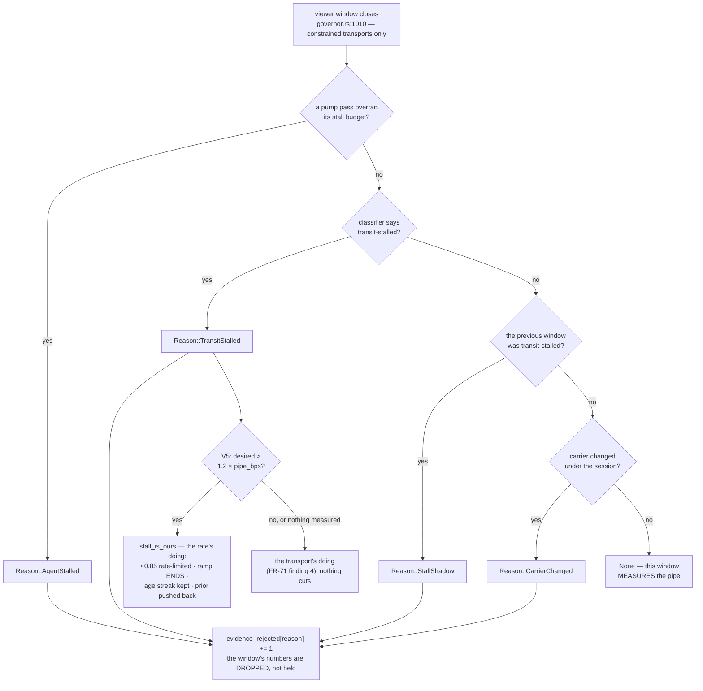
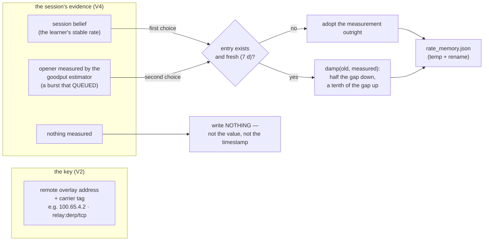
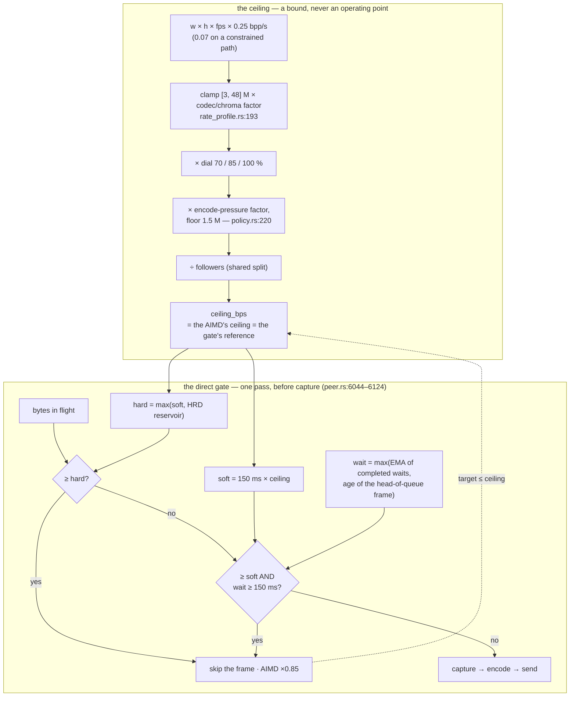

# Rate control — how the remote-desktop stream spends its bits

How a session decides **bitrate, quality, frame rate, and resolution**, and why
(since rc.445) it never changes resolution mid-motion. Companion to
[encoders.md](encoders.md) (which encoder runs) — this doc is about what that
encoder is told to do. History and field evidence at the bottom. Since
`agent-v0.4.93` every loop here reads **one validity gate** before it acts,
so that is the first section: everything after it consumes its verdict.

## The validity gate (FR-79) — a window is evidence about the pipe, or it is not

Every loop in this document estimates the same quantity — what the path will
carry — from the same 1–2 s viewer window. Until `agent-v0.4.93` each loop
decided for itself whether a window could be trusted, and on 2026-09-08 one
host produced three field events through three different inputs with one
shape: a number taken while the pipe was *not free to be measured* was read as
the pipe (FR-71 T2 and T2b, then the opener — the record is in
[`fr/FR-79-one-validity-gate.md`](fr/FR-79-one-validity-gate.md)). FR-79
replaced the three per-input rules, their two kill switches and their four
counters with **one verdict per window, taken before any loop acts**:

> A window is evidence about the pipe only if **(1)** the agent's own loop was
> free — no pump pass overran its stall budget inside it, **(2)** the transport
> did not stall in it, and did not stall in the window before it, and **(3)**
> the carrier it will be attributed to is the carrier that produced it.

`encode::evidence::rejected(WindowFacts) -> Option<Reason>`
(`agents/roomlerd/src/encode/evidence.rs:135`) is pure — no clock, no I/O, no
configuration and **no switch**. Its inputs (`WindowFacts`, `evidence.rs:120`)
are things the governor already holds at the window boundary: this window's
pipe-state verdict, the previous window's, whether a pump pass stalled inside
it (`encode::stall`, counted per pass), and whether the carrier moved.

The heartbeat carries the tally as `evidence_rejected=[agent-stalled,
transit-stalled, stall-shadow, carrier-changed]` (`Rejections`,
`evidence.rs:154`; printed at `peer.rs:7701`) — one field where T1b, T2 and
T2b each had their own counter. A direct transport never reaches the gate: it
has no classifier verdict, and the measured-ceiling clamp does that job there
(`governor.rs:1054`).

⚠️ The classifier (`encode::pipe_state`, FR-71 T1a) stopped being a shadow the
day the gate was built on it: `transit_classify` and `transit_hold` were
**deleted** in V1, and a `transit_hold = true` left in a host's `config.toml`
is an inert key.

### What each consumer does with the verdict

All of it is in one function, `RateGovernor`'s window fold (`governor.rs:1010`
onward). `valid` is the gate's `None`; `stall_is_ours` is V5's exception, below.

| consumer | on a valid window | on a rejected window | site |
|---|---|---|---|
| goodput fold (`GoodputEstimator::observe_window`) | folds the window's blocked sends | samples **dropped**, not quarantined; the next valid window is measured on its own merits | `governor.rs:1102` |
| FR-35 hard ×0.5 (a send blocked ≥ `HARD_STALL` = 1 s, `ceiling_learn.rs:64`) | `apply_hard_md` | nothing — only the window boundary knows whether the block was the pipe (12:15: 2.9 s and 7.4 s blocked sends inside stalled passes, on a path that carried 6.6 M twenty seconds later) | `governor.rs:1119` |
| FR-63 opener ramp | doubles on a clean window, ends on congestion | neither — unless `stall_is_ours`, which ENDS it | `governor.rs:1129` |
| FR-15 age loop | fires on a streak over the learned floor; always learns the floor | learns, does not fire, and the streak resets — unless `stall_is_ours`, which keeps both | `governor.rs:1169` |
| FR-59 P3 arrival-rate clamp | armed / released by the viewer's report | **neither armed nor released** — whatever it held, it still holds (14:52: the report *for* the stall set 834,800 on a path that had just carried 7.45 M) | `governor.rs:1199` |
| the rate-limited ×0.85 (`aimd.rs:180`, ≥ 500 ms apart, `aimd.rs:84`) | on `age_over` or `link_over` | on `stall_is_ours` | `governor.rs:1291` |
| FR-70 P1 prior | re-anchors on a live measurement, decays on a clean window | does not move — unless `stall_is_ours`, which pushes it back with no value attached | `governor.rs:1307`, `:1316` |
| FR-79 V3b belief (shadow) | a delivery every window; a capacity when the fold accepted, or the viewer's queue grew | the delivery is still recorded; no capacity | `governor.rs:990`, `:1110`, `:1224` |
| pair-memory write-back (V2 + V4) | the session's belief, else the opener's measurement | nothing measured ⇒ nothing written | `peer.rs:1496` |

### V5 — a rejected window is not a measurement, but a stall is still push-back

V1 shipped the gate as an unconditional DROP, and on `agent-v0.4.95`
(2026-09-09 07:41, CORPLAP-2, AV1 over `relay:derp/tcp`) that was a live
regression: one accepted goodput sample of 1,058,145 all session, eleven
transit-stalled windows, `target_bps` 1.6–2.1× the measurement, paint age
240 → 4,022 → 7,784 ms, and **the rate ended higher than it started** —
because every loop that could lower it read `valid`, the local send queue
never filled (`bytes_inflight=0`), and the viewer's age report landed in
rejected windows.

🔑 The gate answers *is this window a measurement of the pipe?* V1 let every
consumer read it as *does this window say anything at all?* Those differ for
exactly one reason: a stalled transport is not a measurement, but it **is the
transport pushing back** — and on a relay-TCP session, where the queue sits
downstream of the agent, it is the only push-back there is.

| half | rule | anchor |
|---|---|---|
| which rejection also speaks about the rate | `Reason::is_congestion()` is true **only** for `TransitStalled`. `AgentStalled` would re-create the 12:15 defect, `StallShadow` double-counts one stall, `CarrierChanged` cuts for a path the session has left | `evidence.rs:100` |
| whose fault the stall is | `stall_is_ours` = congestion **and** `desired > pipe_bps × 1.2`. Above the measured pipe the stall is the rate's doing; at or below it, the transport's (FR-71's finding 4: an 8 Mbps leg head-of-line-blocked for 4.9 s with 1485 bytes queued, where a cut costs quality for an event the sender did not cause); **with nothing measured there is no claim to contradict, so no cut** | `governor.rs:1089` |
| what it reaches | only the rate-limited ×0.85, the ramp's end, the age streak and the prior's push-back. **Never `apply_hard_md`** — it has no spacing and would halve once per stalled window. Everything that sets a *number* still reads `valid` | `governor.rs:1129`, `:1169`, `:1291`, `:1316` |
| which estimate | `pipe_bps` (`governor.rs:553`: blocked-send goodput → the viewer's arrival rate while its queue grows, 15 s TTL → the decaying prior), **never** `blocked_send_bps` (`:536`). `0.4.96` shipped on the wrong accessor: the agent's sends block only when the queue is LOCAL, and CORPLAP-3 read `goodput_bps=None` with `goodput_samples=(0, 5)` for a whole relay session — V5 inert on that host. Fixed in **V5a, `agent-v0.4.97`** | `governor.rs:1078`–`1098` |

⚠️ The control that must stay green is
`finding_4_keeps_the_rate_with_the_validity_gate`. Its field twin is every
relay stall on a session that is *not* overdriving: on 2026-09-24 a
three-hour CORPLAP-2 session over `relay:derp/tcp` held its target through
**117 of 118** transit stalls (the exception, 10:33:30–34, is an 800 ms
locally blocked send inside an agent-stalled window — the AIMD's own occupancy
loop, not the gate) at a paint age of p50 76 ms / p95 99 ms / max 988 ms.

⚠️ **Open (AC9)**: the positive half — the target *converging* toward the
measurement across repeated stalls — has not been caught in the field yet. It
needs a stall inside a **measured** minute on a thin relay, and a sweep of the
three relay laptops' daemon logs for 2026-09-10 → 09-25 (24,013 heartbeats,
7,442 constrained windows, 193 transit stalls) found the pipe estimate absent
at every one of the 193: the blocked-send source was live in 2 % of the
constrained windows and the prior in none. That absence is the V3b finding,
below.

### The write-back and the seed (V2 + V4) — the pair memory

FR-35 P2 remembers a pair's rate so the next session opens at 85 % of it
instead of at the fleet constant. FR-79 changed **what** is remembered and
**under which key**:

| piece | rule | anchor |
|---|---|---|
| the key | `remote_addr\|carrier` — `direct`, `tunnel`, `relay:<kind>/<transport>` from the LocalAPI peer record; a mid-churn carrier (`blocked` / `offline`) leaves the bare pre-FR-79 key. DERP-over-TLS and a UDP relay are different pipes on the same address, four times apart in capacity | `rate_memory.rs:42`, `:65`; `peer.rs:1458` |
| the opener | measured by the goodput estimator (bytes over blocked time) for a burst that queued; `None` for one the socket absorbed. The old `bytes × 8 / longest_single_wait × 75 %` recorded 6–8 M against a 1.8–3.4 M pipe | `peer.rs:7093` (`opener_measured_bps`) |
| the write | `record_session(peer, evidence, now)`: `None` or 0 ⇒ **no write**; first evidence ⇒ adopted outright; otherwise `damp` with the goodput estimator's own asymmetry (`ALPHA_DOWN` 0.50 / `ALPHA_UP` 0.10, `goodput.rs:94`, `:98`). The maximum rule, `had_decrease`, the unqueued ×1.5 step and its constants are gone | `rate_memory.rs:147`, `:79`; `peer.rs:1507` |
| the file | `rate_memory.json` in the daemon's data dir (`appdirs::project_dirs().data_dir()` — on a Windows SYSTEM service `…\config\systemprofile\AppData\Roaming\roomler\roomler\data\`); whole-file atomic write; a missing or corrupt file is an empty memory; an entry older than 7 days never seeds and is pruned on the next write | `rate_memory.rs:185`, `:22` |
| the log line | `FR-79 V4 rate memory: … peer=… evidence_bps=… kept_bps=…` at every session end that had a key. **`kept` lies between the old value and the evidence**, so `kept > evidence` on one line proves the entry moved DOWN — no old value needed | `peer.rs:1496` |

Field reads of the write-back so far (key `100.65.4.2\|relay:derp/tcp` unless noted):

| when (UTC) | host · build | evidence → kept | what it shows |
|---|---|---|---|
| 2026-09-08 19:12–19:18 | CORPLAP-1 · 0.4.93 | 1.44 / 1.09 / — / 3.32 / 6.13 M, the max rule still in force | five openers 1.44–2.82 M inside a carrier measuring 1.09–6.13 M (AC5) |
| 2026-09-08 22:14–22:17 | CORPLAP-1 · 0.4.95 | `None → kept 2,264,993`, twice (`100.65.0.5`) | a session that measured nothing wrote nothing; the old rule would have written 3,825,000 from an absorbed burst (AC8, first half) |
| 2026-09-10 08:39:41 | CORPLAP-2 · 0.4.97 | `Some(3187500) → 3210512` from a seed of 3,233,525 | the entry moved **down** — `damp` exactly; the max rule would have kept 3,233,525. Marginal (0.7 %), but a direction the old rule could not take |
| 2026-09-10 14:03:44 | CORPLAP-1 · 0.4.97 | `Some(8000000) → 6318171` from 6,131,302 | the entry moved **up**, damped, after a session that measured the relay at 11.5–17.0 M — one ×0.10 step toward the learner's 8 M cap |

⚠️ An entry written before V2 is keyed by the bare address, never matches
again and ages out. An entry that ages out is *replaced* by the next session's
first evidence, not damped toward it — the damping only ever acts inside the
7-day window.

### V3b — ONE belief about the path (SHADOW since `agent-v0.4.98`)

`encode::pipe::Pipe` (`pipe.rs:137`) answers a defect the shadow data made
undeniable: **there is no trustworthy, always-available estimate of what the
path carries.** The blocked-send source is silent whenever the queue is
downstream (every relay-TCP session), the viewer's arrival rate was being
thrown away unless the link loop called the window congested, and the pair
memory had almost nothing to remember. The type separates two kinds of
evidence the old `min(goodput, link_rx)` averaged together:

| evidence | meaning | source | accessor |
|---|---|---|---|
| a **delivery** | *"the path carried at least X"* — a lower bound, available every window on every carrier | the viewer's arrival rate (`governor.rs:990`) | `floor_bps` — a MAX for the session, lowered only by contrary evidence, never by time |
| a **push-back** | *"the path refused above X"* — a limit | an accepted goodput fold (`governor.rs:1110`), or the arrival rate while the viewer's queue grows (`:1224`) | `capacity_bps` (`pipe.rs:216`), 60 s TTL |
| the anchor a ceiling may be built on | `max(capacity, floor)` — never `min` | — | `ceiling_anchor_bps` (`pipe.rs:242`) |

⚠️ **It is a shadow.** The heartbeat prints `pipe_belief=(anchor, floor,
capacity)` and `pipe_belief_n=(deliveries, capacities)` (`peer.rs:7707`) and
**no consumer reads them** — not V5, not the ceiling, not the memory. The
shadow corrected its own design three times in five days, which is why this
page stops here rather than describing a law:

| release | what the shadow found | correction |
|---|---|---|
| 0.4.99 (V3b-1) | a healthy idle relay session read `belief=1.8 M` from 35 deliveries and zero push-backs; a rule reading that as "the pipe" would have called a fine session overdriving | no single `believed_bps()`: `capacity_bps` answers *am I over?* (`None` = no claim to contradict), `ceiling_anchor_bps` answers *what may the ceiling be?* |
| 0.4.99 (V3b-2) | a host that had demonstrated 8.4 M read 12.8 kbps hours later on a static screen (`n=(10696, 0)`); a 30 s window cannot tell a degraded path from a quiet one | the floor is retired by **evidence**, not time: only a push-back lowers it, and damped (`rate_memory::damp`), never snapped |
| 0.4.100 (V3b-3) | a capacity of 13,163,844 expired after one TTL and the anchor fell back to a content floor of 4,050,945 while the target ran to the 34.56 M constant | a capacity sample **is also a delivery** — those bytes got through — so it raises the floor, and the demonstration survives the estimate expiring |

What two more weeks of shadow say (2026-09-24, CORPLAP-2, three hours over
`relay:derp/tcp`): `pipe_belief_n=(9912, 1)` — nine thousand deliveries, **one
push-back**, while the transport stalled 118 times with no number attached.
Whether V5 should read `capacity_bps`, and what a transit stall should feed
into the belief, is the open question the shadow exists to answer; do not
build on the anchor's semantics until it has. FR-74 P5's gate was read against
this shadow on 2026-09-25 — the result, and the floor-damping interaction it
found, are under [§ The direct path](#the-direct-path-fr-74--a-ceiling-that-is-a-bound-a-gate-that-measures-lag).

## The Priority dial

The viewer's Priority dial (`Sharper` / `Balanced` / `Smoother`) is the only
user-facing rate knob. Since rc.445 all three run at **native resolution all
the time**; they differ in the **bitrate ceiling** handed to the encoder:

| Dial | Ceiling factor | Feel |
|---|---|---|
| Sharper | 100 % | Maximum per-frame quality; fps dips first under load |
| Balanced | 85 % | Default |
| Smoother | 70 % | Smallest motion frames → steadiest fps on thin links |

Why this works: the encoders run **constant-quality VBR with a maxrate cap**
(`cq`/`global_quality` ≈ 22 + `maxrate` + a 2× HRD window). A settled desktop
costs almost nothing, so it *never touches the ceiling* — at rest every dial
delivers identical, full-quality text. During motion the HRD binds and the
encoder raises QP **continuously, frame by frame** — smaller frames, steadier
arrival, more fps through the same pipe. A lower ceiling simply moves that
trade further toward fluidity. No mode switch, no rebuild, no seam.

### Why resolution flips were removed (rc.445)

Until rc.443 Smoother/Balanced dropped to a 1024/1280 rung during motion and
refined back to native at rest. Field measurement (2026-08-21, three hosts)
killed the design: every flip is a **blocking encoder open on the pump
thread** — 865 ms down / 654 ms up on an Iris-Xe-class iGPU — plus a
new-resolution IDR queued behind stale frames. Users felt it as "drag takes
off ~1 s, freezes ~1 s, continues", and unanimously preferred Sharper (the
one dial that never flipped). The rungs remain available behind the
`priority_res_cap` config key for A/B, but the default is: **resolution is
not a rate-control lever**. (An explicit resolution pick by the viewer, and
the encode-bound auto-downscale tier, still apply — those change rarely and
deliberately, not per drag.)

## The per-session control loops

Each DC video pump runs these, owned by `encode::governor::RateGovernor`
(P8c) and executed by the pump:

| Loop | Signal | Actuator | Cadence |
|---|---|---|---|
| **CQ + HRD** | encoder-internal | per-frame QP | every frame, zero cost |
| **AIMD bitrate** (`encode::aimd`) | send-channel occupancy + byte budget | `set_bitrate` → ladder-coarsened maxrate | MD ≤1/500 ms, AI ≤1/5 s |
| **Byte-budget queue gate** (rc.442; FR-74 P1b on direct paths) | relay: bytes in flight vs `constrained_queue_ms` (450 ms) of the relay ceiling. Direct: the **measured send wait** vs `direct_queue_ms` (150 ms) once bytes exceed 150 ms of the ceiling; bytes alone gate only at the encoder's HRD reservoir ([§ The direct path](#the-direct-path-fr-74--a-ceiling-that-is-a-bound-a-gate-that-measures-lag)) | skip producing a frame | every loop iteration |
| **Viewer-rate divisor** (`encode::viewer_rate`) | browser's decoded-fps + struggling report | send every Nth frame | 1 s windows |
| **Encode pressure + auto tier** (`encode::encode_pressure`) | avg encode ms | maxrate factor; long-edge cap when encode-bound | 2 s heartbeat |
| **Goodput estimate** (`encode::goodput`, rc.453) | blocked-send goodput from the send task, folded **only when the validity gate accepts the window** (§ above) | the measured-ceiling clamp (stage 1), FR-59 P1/P6 and V5's `stall_is_ours` via `pipe_bps`, the pair memory's write-back | folded on the viewer window |

Two rules keep them from stepping on each other:

- **Rebuild-bound bitrate applies are motion-deferred** (rc.445). NVENC
  reconfigures maxrate in place; QSV/AMF must rebuild the encoder — a
  blocking open. The pump holds AIMD applies while any real frame encoded
  ≥4 KB in the last 1.2 s (the motion clock; caret/keystroke deltas at
  0.5–3 KB never hold it) and flushes once quiet — the rebuild then stalls a
  static image nobody can see, and its first-frame IDR doubles as the
  post-motion refresh.
- **A rebuild bumps the send epoch** (rc.445): the send task discards
  queued frames from the previous encoder, so the fresh IDR ships
  immediately instead of behind up to 450 ms of obsolete motion.

Rebuilds also reuse the session's **proven encoder name** first instead of
re-walking the vendor cascade (a failed tiered open of an absent vendor's
encoder costs 100–300 ms), and open at `min(ceiling, AIMD target)` so the
governor's forced reapply cannot trigger an immediate second rebuild.

## The direct path (FR-74) — a ceiling that is a bound, a gate that measures lag

Everything above is about paths that push back. A direct path on a LAN or a
good WAN mostly does not, and until `agent-v0.4.77` the controller there was
fighting itself. The operator's own test that opened FR-74 (2026-09-06,
CORPLAP-3, `av1_qsv` 1920×1200 at 4 ms RTT, a Notepad++ scroll — the record is
[`fr/FR-74-text-clarity-on-direct-paths.md`](fr/FR-74-text-clarity-on-direct-paths.md)):
the direct ceiling was a constant, `0.07 bpp × 1920 × 1200 × 60 = 9.68 Mbps`,
and Sharper was 100 % of it; every scroll burst overran it; the send queue
crossed a byte budget denominated in the **applied** target; the gate skipped
frames; and the AIMD read its own cap as congestion — three ×0.85 cuts in six
seconds, ~40 s of additive climb back, and on QSV a rebuild plus an IDR at
every ladder crossing (37 swaps and 35 settle keyframes in 11 minutes). The
budget was self-reinforcing: at 2.5 Mbps it was ~47 KB, one text frame tripped
it, and a session sat at 2–3.7 Mbps for minutes.

Two changes fixed it, both on the direct branch of the FFmpeg pump, relay
paths untouched byte for byte, and **no new switch** — the operator's overrides
(`FFMPEG_MAXRATE_KBPS`, `direct_queue_ms`) are the way back in both directions.

### P1 (0.4.77) — the ceiling is a content-generous bound

`rate_profile::ffmpeg_maxrate_bps_scaled`
(`agents/roomlerd/src/encode/rate_profile.rs:193`) uses **0.25 bpp/s on a
direct path** (0.07 on a constrained one, min'd with the relay clamp as
before), clamped to **[3, 48] Mbps × the codec/chroma factor**
(`codec_rate_factor_pct`, `:129` — AV1 100, HEVC and VP9 125, H.264 150;
`chroma_rate_factor_pct`, `:155`, for 4:4:4 cells). The fleet's heartbeats
show the products: 34.56 M for AV1 at 1920×1200 @ 60, 43.2 M for HEVC and
`vp9_qsv` there, 38.88 M for HEVC at 1920×1080. It is a **ceiling, never a
target**: the encoders run constant quality under `maxrate`, so a settled
desktop spends almost nothing and only motion approaches the bound.

`policy::rate_plan` (`encode/policy.rs:220`) finishes the chain: × the dial
(`dial_rate_factor_pct` — 70 / 85 / 100, clamped to [30, 100]) × the
encode-pressure factor (`governor.encode_factor()`, `governor.rs:1469`),
floored at `MIN_BITRATE_BPS` (1.5 M, `encode/mod.rs:231`). On a direct
transport `effective_ceiling` is the plan's value unchanged (`governor.rs:503`
— the learner lifts it on constrained sessions only); the shared-pipeline split
divides it by the follower count; and the result is both the AIMD's ceiling
and the gate's reference rate (`last_ceiling_bps`, `peer.rs:6658`).

⚠️ The encode-pressure factor multiplies the bound, so a host whose encoder is
struggling lowers its own ceiling with no path evidence in it. On 2026-09-25
CORPLAP-3's ceiling fell to 13.82 M (0.4 ×) at 4 ms of viewer age and 0 bytes
in flight while its `av1_qsv` passes took 120–170 ms and the cadence was paced
60 → 20 fps, and it was back at 27.8 M eleven seconds later. Read
`ceiling_bps` on the `set_bitrate` line before calling a `target_bps` drop a
path event.

### P1b (0.4.79) — the gate is the measured wait's call

P1's budget (150 ms of the ceiling) still tripped once on 0.4.77: AV1's HRD
window is floored at 200 % of `maxrate` (Intel's VDENC hangs on a forced IDR
larger than its reservoir — the rc.443 incident), so the encoder was
*configured* to emit an 8.6 MB burst against a 648 KB budget, and the
controller cut on a burst it had itself legalised, at ≤ 20 ms of viewer age.
Bytes cannot tell a burst the wire is draining from a backlog the viewer
feels; the send wait can, and it is the quantity `direct_queue_ms` was always
meant to bound.

| piece | rule | anchor |
|---|---|---|
| soft budget | `direct_queue_ms` (150) × ceiling ÷ 8, floored at 48 KiB; `0` disables the gate | `rate_profile.rs:525` (`direct_queue_budget_bytes`) |
| hard budget | `max(soft, HRD reservoir)`, the reservoir being `maxrate × open_hrd_pct ÷ 8` — 100 % on direct (`direct_hrd_pct`, `:590`; config `direct_hrd_pct`, [25, 200]), 200 % for every `av1_*` encoder regardless | `rate_profile.rs:544` (`direct_queue_hard_budget_bytes`); `ffmpeg/encoder.rs` `open_hrd_pct` |
| measured wait | the larger of an EMA (α 0.3 per pass) of completed frames' enqueue→wire-complete waits and the **live age of the frame the send task is writing** (`send_head_enqueued_us`) — a stalled pipe completes nothing, so the EMA alone reads stale-low exactly when the queue grows | `peer.rs:6054`–`6092`; set and cleared by the send task at `:5478`, `:5546` |
| the verdict | bytes ≥ hard ⇒ trip; bytes ≥ soft **and** wait ≥ `direct_queue_ms` ⇒ trip; otherwise pass | `rate_profile.rs:563` (`direct_gate_trips`), called at `peer.rs:6094` |
| on a trip | the pass skips producing a frame (`frames_skipped_backpressure`) and drives the AIMD's multiplicative decrease, as the full-channel arm always did; the first trip logs `direct byte-budget gate engaged` with `inflight`, `budget`, `hard_budget` and `measured_wait_ms`, so a field read can tell which arm fired | `peer.rs:6109`, `:6124` |
| relay paths | unchanged: bytes vs `constrained_queue_ms` (450) of the relay ceiling, no wait term | `peer.rs:6023`–`6036` |

**Field.** The P1b gate on the release's defaults (0.4.79, 2026-09-07,
CORPLAP-3, the operator judging): no blur on AV1, VP9 4:2:0 or H.264, and the
sessions' heartbeats read 0 cuts, 0 gate skips and 0 gate lines at 20–36 Mbps
and 30–47 fps; the rate ladder stopped firing on direct paths altogether (0
swaps in 17 sessions on three hosts, where the baseline had 37 in 11 minutes),
which retired the planned QSV hysteresis. What the gate deliberately does not
see: a pipe throttled **below the socket** (an OS QoS policy, a thin Wi-Fi
driver queue) queues where `bytes_inflight` cannot look — measured 2026-09-07
with `roomlerd.exe` capped at 15 Mbps, the gate shed nothing and the cost
surfaced as 160–380 ms of viewer age instead. That standing lag is the viewer
age's call (FR-15), not this gate's.

The libvpx VP9 4:4:4 pump is a different machine and got its own fix in the
same arc (P3, 0.4.80: `rc_max_quantizer` 16 on direct transports, because
libvpx resets q to the worst on every wheel notch — [encoders.md](encoders.md)),
and the viewer's pixel chain, which no encoder setting can undo, got the
display-scale pill (P4 — [remote-control.md](remote-control.md) §18.6.1).

### P5 — the ceiling follows the path: decided, refined, and NOT built

A higher constant is still a constant. On 2026-09-10 a direct HEVC session on
another host (the Regal cell, 1920×1080 at 6–11 ms of paint age) ran for hours
between a 38.88 M ceiling with no measurement in it and a path that pushed
back at ~6 M: 4.5 minutes to first reach the ceiling, then a collapse to the
measurement every two to three minutes, every collapse a visible softening.
The decision (FR-74 §P5, refined 2026-09-15): the bpp product becomes a
**cap**, and the ceiling follows the FR-79 V3b belief above — with the
asymmetry that **only a refusal (`capacity`) may lower the ceiling, a delivery
(`floor`) may only raise it**, and the capacity trace decays upward while
nothing pushes back, so the loop has no ratchet in either direction.

It is gated on the shadow reading sane, and the gate was read on 2026-09-25
from the hosts' own daemon log files over Fleet RPC (agents 0.4.99–0.4.102;
four hosts; 104,698 heartbeats in 37 sessions, 09-11 → 09-25; the exec-enabled
population only — three corp laptops and the Regal cell):

| the gate asked | what the shadow said |
|---|---|
| on relay hosts the anchor is not `None` | **holds** — the two relay sessions (5,240 constrained windows) carried a floor within their first five windows and an anchor of 3.5–5.2 M for the rest (`pipe_belief_n` 9,912 / 1 over three hours, 155 / 0 over three minutes) |
| a quiet screen must not read as a thin pipe | **holds since 0.4.99 (V3b-2)** — 19 of 19 push-back-free direct sessions ended at their maximum floor, and each of the 7 whose floor fell carried a push-back; CORPLAP-3 held 34.27 M through 3.5 min of idle after one scroll. The 0.4.98 control on the same host: 16.4 M → 13.5 kbps over 4.3 h with no push-back |
| on a direct session the anchor tracks the path, not the content | **not as written, and not meetable** — before the first burst the anchor *is* the content's weight (the Regal sessions open at 0.07–2.4 M and take 4 s to 2.2 h to reach half their eventual floor; a 4.6-min CORPLAP-3 session never rose above 3.5 M on a path that carries 34 M). Nothing measures capacity on an uncongested direct path. The refinement already makes this harmless: a delivery never lowers the ceiling |
| the push-backs are real refusals | on the LAN-class hosts the only capacities are the encoder's burst drain **at the cap** (34.3 M against a 34.56 M ceiling; 45.6–59.7 M against 43.2 M) — not refusals, and `limit ≥ bound` leaves the ceiling alone. On the Regal cell: **14 accepted push-backs in ~51 h of sessions, 0.85–19.9 M**, send waits up to 1.36 s around them (two ≥ 1 s hard stalls); at every one the target had already collapsed from 38.88 M to 1.5–17.0 M (median 3.9 M) — today's sawtooth, at one accepted fold per ~3.6 h rather than the 2–3 min period of 09-10 |
| the floor guard holds | **it erodes** — V3b-2 damps the floor by half the gap on *every* push-back below it, whatever the spacing: 28.84 → 18.09 → 11.82 → 7.76 M on three push-backs 5.5 h apart; 38.90 → 22.26 → 14.04 → 8.57 → 9.78 → 14.21 M on five in 1.6 h, the demonstration re-arming to 16–25 M between them. The refined law's "never below what the path has demonstrably carried" assumed an undamped demonstration; with the damped floor, P5's ceiling on that cell would have sat at 8–18 M for hours of sessions whose path also carried 24–39 M, and an encoder under an 8 M ceiling cannot demonstrate 25 M, so recovery would rest on the upward decay alone |

⚠️ So P5 is **not built**. Whether a ceiling at 8–18 M beats the constant with
its ~90 % collapses cannot be read from the belief alone — it needs the
viewer's outcome under both laws, and the 09-23 daytime viewer on that cell
reported no paint age at all. What unblocks it, in order: (1) a decision on the
guard — an undamped demonstrated maximum kept beside the damped floor, or a
time-aware damping — a `Pipe` change and FR-79's to make; (2) the two numbers
the design leaves open, `HEADROOM` and the upward-decay rate (FR-70 P1's law);
(3) a replay of the Regal 09-25 arc in `encode::sim` under both laws, before
any release; (4) the release, and an A/B on that cell with a viewer that
reports age — the same log sweep reads the after.

## Crisp at rest

Orthogonal to the dials (the P7→P8 "sharp all the time" arc):

- **Damage-gated capture** — static screens produce no frames; DXGI/WGC
  report real dirty rects, judged by area (rung-invariant).
- **Polish loop** — at rest the pump re-encodes the last frame on the
  keepalive cadence; CQ-driven VBR spends the idle budget sharpening, so
  text converges to full quality within ~1 s of motion ending.
- **Settle IDR** (`SettleKeyframeGate`) — one resync keyframe after a real
  motion burst (≥10 frames), burst-gated so caret blinks never metronome
  IDRs.

## Config / env reference

All keys live in the agent config (`roomler config set …`) with
`ROOMLERD_*` env twins; restart required.

| Key | Default | Meaning |
|---|---|---|
| `priority_res_cap` | off | Restore the pre-rc.445 dial resolution rungs (A/B only) |
| `smoother_rate_pct` / `balanced_rate_pct` | 70 / 85 | Dial ceiling factors (30–100) |
| `constrained_queue_ms` | 450 | Send-queue byte budget, ms of the relay ceiling; 0 = unbounded |
| `constrained_hrd_pct` | 200 | HRD window for relay sessions, % of maxrate. ⚠ sub-100 is per-host experiment only — a window smaller than a forced IDR makes Intel AV1 **error and hang** (rc.442 incident) |
| `constrained_cq_relief` | 4 | CQ softening at a sub-native rung on relay — only reachable via explicit picks / restored rungs |
| `idle_refine_settle_constrained_ms` | 1200 | Up-flip settle on relay when a rung exists |
| `gpu_scale` / `scale_threads` | on / 1 | HW-downscale Phase A/B levers (only active when something scales) |
| `ROOMLERD_RELAY_MAX_KBPS` | 3000 | The constrained-transport ceiling clamp |
| `ROOMLERD_SMOOTH_MAX_EDGE` / `RELAY_MAX_EDGE` | 1024 / 1280 | Rung sizes when `priority_res_cap` is on |
| `direct_queue_ms` | 150 | FR-74 P1/P1b — the direct gate's **lag bound**: bytes over 150 ms of the ceiling gate only once the measured send wait has also crossed 150 ms; 0 disables the gate ([§ The direct path](#the-direct-path-fr-74--a-ceiling-that-is-a-bound-a-gate-that-measures-lag)) |
| `direct_hrd_pct` | 100 | HRD window for direct sessions, % of maxrate ([25, 200]); also the gate's hard budget. ⚠ `av1_*` encoders stay at 200 regardless (the rc.443 hang) |
| `ROOMLERD_FFMPEG_MAXRATE_KBPS` | unset | Env only — replaces the computed ceiling in both directions (the FR-74 P0 A/B knob and the way back from P1) |
| `ROOMLERD_VP9_DIRECT_MAX_Q` | 16 | FR-74 P3 — the libvpx VP9 4:4:4 pump's worst quality on direct transports (q-index 64); 63 = the pre-P3 behaviour |

⚠️ Three keys an older `config.toml` may still carry are **deleted, not off**
— the daemon ignores them: `transit_classify` and `transit_hold` (FR-71
T1a/T1b; removed by FR-79 V1 in `agent-v0.4.93` — the classifier always runs
and the validity gate replaced the hold) and `rate_prior_decay` (FR-70 P1;
removed by FR-79 V3a in `agent-v0.4.95` — the prior always decays, which
FR-70 P1 field-verified on 0.4.64 with a same-build control). Their
behaviour is described under the validity gate at the top of this page.

## Field history (why it is shaped this way)

| Release | Change | Field driver |
|---|---|---|
| rc.436–441 | HW downscale (CPU resampler rework, GPU scale-before-readback), deliverable refine-Up | Smoother's 1024 rung cost 26–45 ms CPU Lanczos on Iris Xe |
| rc.442 | Signed CQ bias (relief), byte-budget queue gate, settle 2000→1200 ms | 9 fps motion equilibrium; drag-start freeze = 0.5–1 MB queue; 4–5 s crystallize |
| rc.443 | HRD trim reverted; stale-pipeline eviction; encode-error ladder | Intel AV1 rejects + hangs on an over-budget forced IDR; a hung pump zombied the shared pipeline ("no video after 4 attempts") |
| rc.445 | **No-flip motion**: dial rungs off, dial ceiling factors, motion-deferred QSV bitrate, send-epoch flush, proven-encoder fast path | The remaining ~1 s mid-drag freeze measured as the flip's blocking encoder open (865/654 ms) + mid-motion ladder rebuilds |
| rc.446 | Deferral motion clock on any ≥4 KB frame | Light motion (GDI + AV1 window moves at 5–30 KB) slipped under the significance floor and let ladder rebuilds through mid-burst |
| 0.4.50 | FR-59 P8 — remembered-slow-pair opener; the coarsen ladder's bottom rung lowered | The ladder bottomed at 1.5 M, so no relieved target ever reached the encoder: bytes/frame 4.88 → 0.90, SACK drops 24 → 0 |
| 0.4.51 | FR-62 A1/A2 — in-place rate applies behind `encoder_inplace_rate`; the NVENC no-IDR patch | An NVENC rate move cost a forced keyframe on 20/20 rungs while the apply itself was 0.004 ms |
| 0.4.55–0.4.56 | FR-63 B-opener — slow-start on the session opener (`rate_slow_start`, default off) | The opener over-drove from BOTH directions on one host in one day: a remembered 6.13 M (6287 ms paint) and a nominal 2.55 M into a 213 kbps path (1550 ms) |
| 0.4.59–0.4.60 | FR-65 P0 — `open_ms`/`other_ms` on the stall watch; the encoder open moved off the shared runtime worker | A 0.5–1 s hole on every session's first pass sat in no measured phase; it was the encoder open, blocking a tokio worker at the moment the control plane is busiest |
| 0.4.64 | FR-70 P1 — the remembered rate is a decaying prior (`rate_prior_decay`); the FR-59 P5 cap attributed as `slow-link-cap`; `rc:video-info` carries `cap_reason`/`cap_detail` | A 200 kbps memory held a session at the floor for four minutes with nothing measuring the pipe: the P2 budget denominated in the memory tripped on every drag frame, so no queue ever formed and no measurement could contradict it; the write-back then recorded the pinned rate. Field A/B on one pair, one build, one flag: 200 k → 3.9 Mbps in 3 min with the decay, 200–285 k for 3 min without |
| 0.4.67 | FR-71 T1a + T1b — the pipe-state classifier in shadow (`transit_classify`, on) and the hold behind `transit_hold` (off); the B0 simulator gained post-ack transit stalls, the age loop's cut and the finding-4 cell | A 4.9 s DERP head-of-line block read as over-production and the rate was cut into an 8 Mbps link; the sender's queue held 1485 bytes throughout — the stall sat beyond the ack point, where no sender-side counter can see it. First live read (CORPLAP-1 over a pinned relay, 90 windows): 89 clear, one correct `overproduced` on a lock-screen burst, one `transit-stalled` on the opening window before the viewer's first report — a start-gap artefact this build still carries (fixed in #1370 for the next release) |
| 0.4.77 | FR-74 P1 — the DIRECT ceiling is a content-generous bound (0.25 bpp/s, [3, 48] Mbps per codec factor; relay keeps 0.07 / [3, 12] and its clamp) and the direct send-queue budget (`direct_queue_ms`) is denominated in the path's ceiling, not the AIMD's applied target — the applied-target budget shrank with every cut and tripped on a single text frame (six cuts to 2.24 Mbps, then 2–3.7 Mbps for minutes on CORPLAP-3). P0 on the operator's own scroll: at a 40 Mbps cap the blur could not be reproduced on AV1, VP9 4:2:0 or H.264. No new switch; `FFMPEG_MAXRATE_KBPS` and `direct_queue_ms` remain the way back |
| 0.4.79 | FR-74 P1b — the DIRECT byte-budget gate is the MEASURED send wait's call: bytes over `direct_queue_ms` × ceiling gate only when the wait (EMA of completed frames' enqueue→wire waits, or the live age of the frame on the wire, whichever is larger) has also crossed `direct_queue_ms`; bytes alone gate at `max(budget, HRD reservoir)` (`direct_queue_hard_budget_bytes`, the codec's effective `open_hrd_pct`). The 0.4.77 read tripped P1's budget on an AV1 burst the encoder was configured to emit (200 % HRD = 8.6 MB vs 648 KB) at ≤ 20 ms of viewer age. Relay paths untouched. |
| 0.4.80 | FR-74 P3 — the libvpx VP9 4:4:4 pump caps the WORST quality on DIRECT transports (`rc_max_quantizer` 16 = q-index 64; relay keeps 63; env `ROOMLERD_VP9_DIRECT_MAX_Q`). Measured offline against the real encoder: libvpx one-pass CBR + screen tune treats every mouse-wheel notch as a scene change, resets q to 255 and walks it down ~7/frame, so a choppy text scroll was rendered at the worst quality while spending a fifth of its target; the cap holds the notch frames at q 64, the steady scroll still refines to q 0 inside the budget, idle stays lossless. Constant-quality mode was measured too (sharp, ~9 Mbps) and rejected for losing the idle refine and the rate bound. |
| 0.4.90 | FR-71 T2 — a hard stall (a send blocked ≥ 1 s) is a DEFERRED verdict: its blocked-send samples are quarantined and the FR-35 ×0.5 held pending until the next REPORTED window — sends still blocking there (≥ `MIN_WINDOW_BLOCKED`) confirm it (fold + halve, one window late), nothing blocking is a pause (discard, no move); a gap window decides nothing. Field 2026-09-08 12:15 (CORPLAP-1 on the corp VPN): an overlay rekey storm blocked two sends for 2.9 s and 7.4 s on a pipe that carried 6.6 M twenty seconds later, and the hard halving, the goodput fold, FR-59 P6 and P1's floor relief read those blocked sends as a 1.6 M pipe — 6.60 → 0.68 M in 36 s. No new controller, no switch; heartbeat `hard_stalls_paused` / `hard_stalls_confirmed`. |
| 0.4.93 | FR-79 — ONE validity gate every estimator consumes (`encode::evidence`): a window is evidence about the pipe only if the agent's own loop was free, the transport did not stall, the window before it did not either, and the carrier did not move. V1 deleted `transit_hold`, `transit_classify`, T2's quarantine and T2b's shadow with their four counters (one `evidence_rejected` replaces them); FR-35's hard ×0.5 moved to the window boundary, where the gate can say whether the block was the pipe. V2 took the same rule to the write-back: the opener's growth target is the goodput estimator's measurement instead of the whole burst divided by one frame's wait (which recorded 6–8 M against a 1.8–3.4 M pipe), and the pair memory is keyed by CARRIER (`100.65.4.2|relay:derp/tcp`), because one overlay address is carried by direct, a UDP relay or DERP on different days. Field: five consecutive CORPLAP-1 sessions opened 1.44–2.82 M against a carrier measuring 1.09–6.13 M, where the same host had swung 1.26 ↔ 6.8 M. |
| 0.4.95 | FR-79 V3a + V4 — ONE belief (`pipe_bps`) composed in one place with one named source (`blocked_send_bps`); `remembered_candidate_bps`, a third inlined copy of the same composition and the `rate_prior_decay` switch deleted. And the pair memory keeps what a session MEASURED about the carrier instead of the MAXIMUM it ever saw: damped with goodput's own asymmetry (fast down, slow up), and a session that measured nothing writes nothing — not the value, not the timestamp. The `max` rule, `had_decrease`, the opener's arithmetic and its three constants are gone (−159 lines). Field: two idle CORPLAP-1 sessions wrote nothing where the old rule would have recorded 3.83 M from a socket-absorbed burst, twice in three minutes. |
| 0.4.96 | FR-79 V5 — a rejected window is not a measurement, but a transit stall while sending ABOVE the measured pipe is still the rate's doing: `Reason::is_congestion()` (true only for `TransitStalled`) + `stall_is_ours` (desired > 1.2 × the pipe) reach the rate-limited ×0.85, the ramp's end, the age streak and the prior's push-back; everything that sets a number still reads `valid`, and `apply_hard_md` is never on this path. | CORPLAP-2, 2026-09-09 07:41: one goodput sample (1,058,145) all session, eleven transit stalls, the target 1.6–2.1× over, paint age to 7,784 ms, and the rate ended HIGHER than it started — every loop that could lower it read `valid`. |
| 0.4.97 | FR-79 V5a — `stall_is_ours` compares against `pipe_bps` (goodput → the viewer's arrival rate → the prior), not `blocked_send_bps`. | CORPLAP-3 over the relay read `goodput_bps=None`, `goodput_samples=(0, 5)` for a whole session: the agent's sends block only when the queue is local, so 0.4.96's rule was inert exactly where it was needed. |
| 0.4.98 | FR-79 V3b — `encode::pipe::Pipe`, ONE belief split into a demonstrated FLOOR and a pushed-back CAPACITY, in SHADOW (`pipe_belief`, `pipe_belief_n` in the heartbeat; no consumer). | Three symptoms on three hosts and two carriers, one defect: no trustworthy, always-available estimate of what the path carries. |
| 0.4.99 | FR-79 V3b-1 + V3b-2 — no single `believed_bps()` (`capacity_bps` for "am I over?", `ceiling_anchor_bps` for "what may the ceiling be?"); the floor is retired by evidence, not by time. | An idle relay session read 1.8 M from deliveries alone with nothing wrong; a host that had demonstrated 8.4 M read 12.8 kbps on a still screen hours later. |
| 0.4.100 | FR-79 V3b-3 — a capacity sample is also a delivery, so it raises the floor and survives its own expiry. | A 13.16 M capacity expired after one TTL and the anchor fell to a 4.05 M content floor while the target ran to the 34.56 M constant. |

## The measured-rate closed loop

The remaining constants (dial percentages, 450 ms budget, relay clamp) are
open-loop: they key off a NOMINAL relay clamp while the variable that matters
is what the session actually delivers. The AIMD only watches send-channel
occupancy and SCTP absorbs the mismatch, so it parks at the ceiling and never
learns the pipe — a field capture shows `target_bps=3000000` constant across a
session delivering 1.75 Mbps.

### How the measurement is taken (v2)

`encode::goodput::GoodputEstimator`, owned by the governor, folded on the
existing 1 s viewer-window tick, reported in the heartbeat as `goodput_bps`
and `goodput_samples=(accepted, rejected)`. **Read it against `target_bps` on
the same line — the gap between them is the open-loop error.**

The hard part is that *a fast sample is not evidence*. Handing a frame to SCTP
is not delivering it: with buffer headroom a frame serialises in microseconds,
which computes to an absurd rate and means only "at least this fast".

⚠️ **The first answer to that did not work, and the way it failed is worth
keeping.** Stage 0 (rc.453) bracketed a **busy period** — an unbroken ≥ 300 ms
stretch where the send task always had another frame waiting — on the reasoning
that a period that long can only end when the pipe drains. It turned out to be
structurally unsatisfiable at the frame rates we run: at 40 fps a ~30 KB frame
drains in ~24 ms, just under the ~25 ms inter-arrival, so the queue dried
*between frames* even while the cumulative deficit grew. No period ever formed,
and field heartbeats read `goodput_samples: (0, N)` for whole sessions — an
estimator that was wired, reported, and structurally incapable of producing a
number.

v2 keeps the philosophy and fixes the granularity. The send task times each
frame's chunked `dc.send()` serialisation; a frame that took at least
`MIN_BLOCKED_SEND` (10 ms) was flow-controlled by SCTP for its whole transit,
so its bytes-over-time **is** the drain rate. Sub-threshold sends are discarded
at the source, so no amount of idle traffic can bias the estimate upward. The
window's accepted samples are aggregated byte-weighted (Σbytes / Σelapsed) and
the window must carry at least `MIN_WINDOW_BLOCKED` (60 ms) of genuinely
blocked time before it counts.

The EWMA is asymmetric — down fast (α 0.5), up slow (α 0.1): a VPN throttling
mid-session is worth believing at once, one lucky burst is not proof the pipe
grew. Confidence decays to `None` after `CONFIDENCE_TTL` (60 s) without a
qualifying sample, so a stale number can never outlive the conditions that
produced it.

### What consumes it today

The measurement is **no longer observe-only**. Both consumers take the same
`MEASURED_CEILING_PCT` (85 %) margin, deliberately: the estimate is "what the
pipe carried", and a bound set exactly AT it leaves the controller nothing to
converge under.

| Consumer | Rule | Guard |
|---|---|---|
| FR-59 P1 — floor relief | the legibility floor descends toward `0.85 × measured`, floored at `slow_link_min_bitrate` | evidence-gated for an UNREMEMBERED pair: with no measurement it is byte-for-byte unchanged. A remembered pair's seed stands in for the measurement (FR-59 P8) — and since FR-70 P1 it **decays** (`prior_bps`) instead of holding the floor AND the P2 queue budget at the memory for the session, which on 2026-09-04 kept a session at 200 kbps for four minutes while the budget it set prevented the very measurement that would have freed it |
| FR-59 P3 — arrival clamp | the ceiling is bounded by what the VIEWER reports arriving while its transit queue grows | constrained paths only; applied AFTER the learner, because a live report outranks past evidence |

⚠️ The two are **coupled**, and the coupling is not obvious: `set_ceiling`
raises any ceiling back up to the floor, so the P3 clamp is silently undone
unless the P1 relief lowers the floor with it. That coupling bit FR-63's opener
phase in exactly the same place — 0.4.55 shipped a ceiling cap with no floor
descent and the ramp was inert while looking wired.

⚠️ Measurement may only ever LOWER a clamp: the relay clamp also protects the
TURN path, so a measurement that reads high is not permission to exceed it.

### Where the program went next

The remaining constants are the subject of an approved plan
(`docs/plans/rate-control-architecture.md`) split into three FRs. Read those
for current state rather than this section:

- **FR-62** (#1242) — make an encoder rate change cost neither an IDR nor a
  rebuild, so the nine heuristics that exist only to ration that cost can go.
- **FR-63** (#1243) — replace eight estimators of one quantity with one
  delay-based controller, shadow-first, verified against a deterministic
  simulator (`encode::sim`) rather than against the fleet.
- **FR-64** (#1244) — remote control never rides the overlay.
