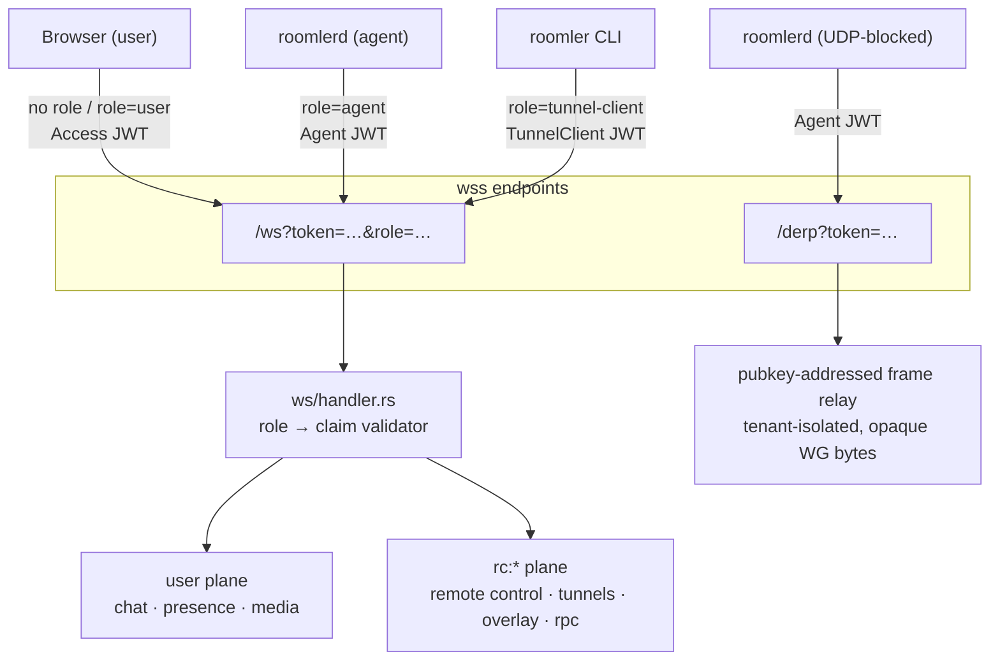
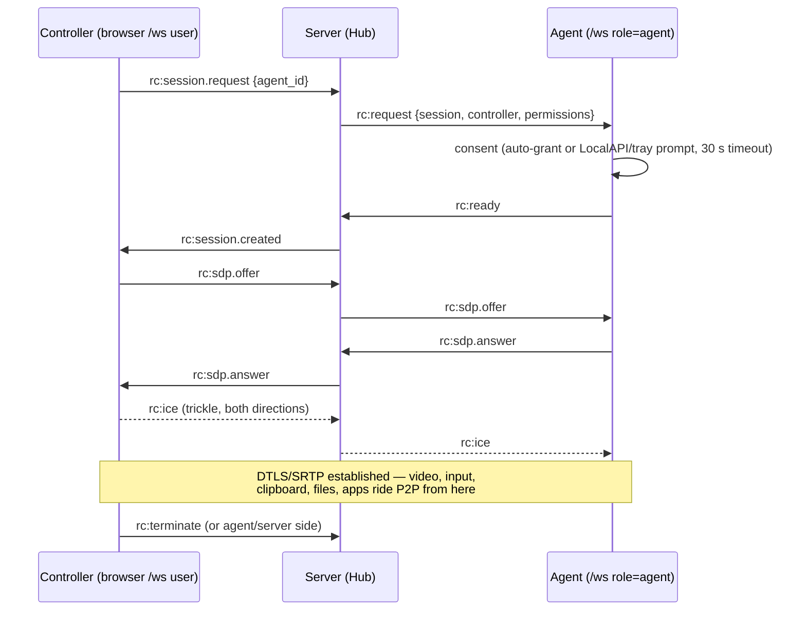
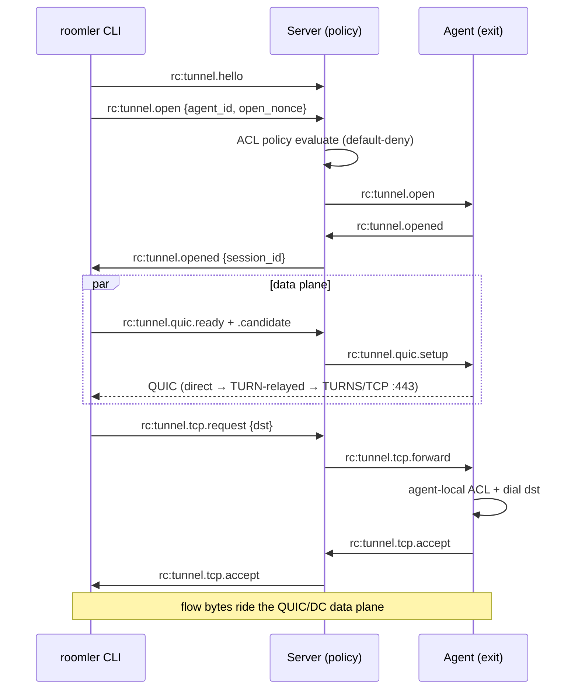
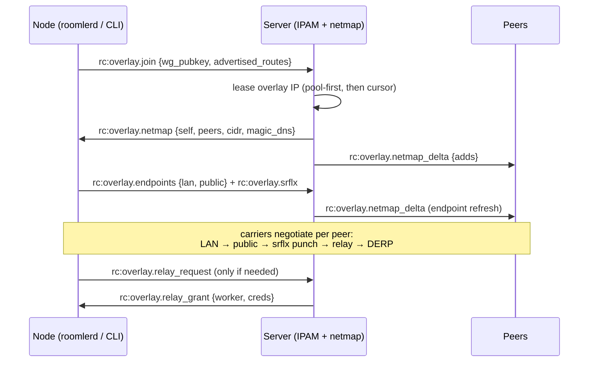

# Real-Time Protocols

The server exposes two upgrade endpoints. `/ws` multiplexes three client roles over
one handshake; `/derp` is a purpose-built relay for overlay pairs whose UDP is
blocked in both directions. *As of 0.3.0-rc.381.*

Each role is validated against its own JWT audience — a user token cannot open an
agent socket and vice-versa. An optional `tid=<tenant-hex>` query parameter lets the
front load balancer hash tenant-affine connections onto one pod; tokens must match
the claimed tenant (membership-checked for users).

Delivery across pods: WS sessions are pod-local; chat, presence, and notification
events fan out through Redis pub/sub so every pod pushes to its own sockets.

## User plane (browser)

JSON messages, `{"type": "...", ...}`.

**Client → server**

| Type | Purpose |
|---|---|
| `media:join` / `media:leave` | Enter/exit a room call (mediasoup) |
| `media:produce` / `media:consume` | Publish / subscribe a track |
| `media:connect_transport` | DTLS-connect a transport |
| `media:producer_close` | Stop publishing |
| `media:play_audio` / `media:stop_audio` | Bot/audio playback control |
| `presence:update` | Presence state |
| `ping` | Keepalive |

**Server → client** (consumed by `ui/src/stores/ws.ts`)

| Event | Purpose |
|---|---|
| `message:create` / `update` / `delete` / `reaction` | Live chat |
| `call:message:create` | In-call chat |
| `room:call_started` / `call_ended` / `call_updated` | Call presence on the room list |
| `typing:start` | Typing indicators |
| `notification:new` / `notification:unread_count` | Notification bell |
| `task:update` | Background-task progress |

The mediasoup signalling (`media:*`) carries router RTP capabilities, transport
parameters, and producer/consumer ids — the SFU forwards RTP between participants
without decoding it.

## The `rc:*` plane (agents, tunnel clients, controllers)

Defined in `crates/remote_control/src/signaling.rs` (`ClientMsg` / `ServerMsg`,
~60 wire tags). Serialization is **wire-locked by tests**: tags are pinned,
ObjectIds serialize as raw hex, `Permissions` as pipe-separated names. Renaming a
tag is a deliberate wire break.

| Family | Tags | Purpose |
|---|---|---|
| Agent lifecycle | `rc:agent.hello` · `rc:agent.heartbeat` · `rc:agent.update` · `rc:agent.join_org` · `rc:goodbye` | Hello carries caps (codecs, transports, rpc), displays, advertised routes; heartbeat every 30 s; `goodbye` carries a close reason (deleted / replaced / policy) |
| Remote-desktop session | `rc:session.request` · `rc:session.created` · `rc:request` · `rc:ready` · `rc:terminate` · `rc:session.stats` · `rc:error` | Session state machine between controller, server, agent |
| SDP / ICE | `rc:sdp.offer` · `rc:sdp.answer` · `rc:ice` | WebRTC negotiation relayed through the server |
| Consent | `rc:consent` | Owner consent decision (pairs with the HTTP capability URLs) |
| Keepalive | `rc:ping` / `rc:pong` | Application-level liveness |
| Tunnel session | `rc:tunnel.hello` · `.open` · `.opened` · `.terminate` · `.revoked` | Client ⇄ agent tunnel establishment (`open_nonce` correlates concurrent opens) |
| Tunnel TCP flows | `rc:tunnel.tcp.request` → `.forward` → `.accept`/`.reject` · `.half_close` · `.closed` | Per-flow lifecycle |
| Tunnel UDP flows | `rc:tunnel.udp.request` → `.forward` → `.accept`/`.reject` · `.closed` | SOCKS5 UDP ASSOCIATE flows |
| Tunnel carriers | `rc:tunnel.sdp.offer`/`.answer` · `.ice` · `.quic.setup`/`.ready`/`.candidate` | WebRTC-DC and QUIC data-plane negotiation |
| Overlay | `rc:overlay.join` · `.endpoints` · `.srflx` · `.leave` · `.relay_request` → `.netmap` · `.netmap_delta` · `.relay_grant` · `.force_derp` · `.warm_relay_request`/`.warm_relay_grant` | Mesh membership, endpoint discovery, relay coordination |
| Relay / DERP | `rc:relay.regions` · `.probe_report` · `.derp_ticket_request`/`.derp_ticket` | Multi-region PoP selection + ticket auth for standalone DERP relays |
| Fleet RPC | `rc:rpc.exec` · `.cancel` · `.result` · `.request` · `.response` | Remote command execution over the control WS (see [fleet-rpc.md](fleet-rpc.md)) — capability-gated via `AgentCaps.rpc` |

### Remote-desktop session setup

Once the P2P link is up, everything else is **DataChannel traffic that never
touches the server**: input events, clipboard chunks, file transfers, the apps
menu, cursor shapes, decoder statistics (`rc:decodestat` feedback that drives the
agent's rate control), and — on the DC render paths — the video bitstream itself.

### Tunnel flow open

### Overlay join

## DERP

`GET /derp?token=<agent-jwt>` upgrades to a minimal frame relay for overlay pairs
where **both** sides are UDP-blocked:

- Frames are `[dst_pubkey(32) || payload]` client→server, rewritten to
  `[src_pubkey(32) || payload]` on delivery.
- Hard tenant/network isolation; the payload is WireGuard ciphertext the relay
  cannot read.
- Standalone regional PoPs (`crates/derp-relay`) run the same protocol DB-free,
  authenticated by Ed25519 tickets minted over `rc:relay.derp_ticket_request`.

## Connection hygiene

- Agents keep one outbound WSS control link: WS ping every 25 s,
  `rc:agent.heartbeat` every 30 s, exponential reconnect capped at 60 s; a 401 on
  upgrade is fatal (re-enroll).
- Agents also enforce **receive-liveness**: no inbound frame for 80 s ⇒ reconnect —
  this heals half-open sockets that TLS-inspecting middleboxes keep artificially
  alive.
- `rc:goodbye` close reasons distinguish *replaced by newer connection* (benign
  restart) from *deleted / policy-rejected* (stop retrying).
