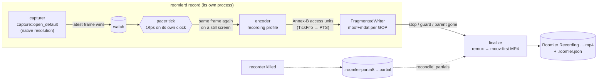
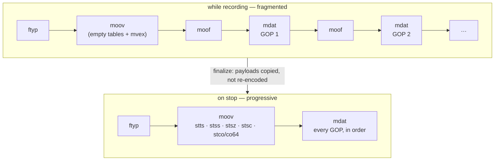
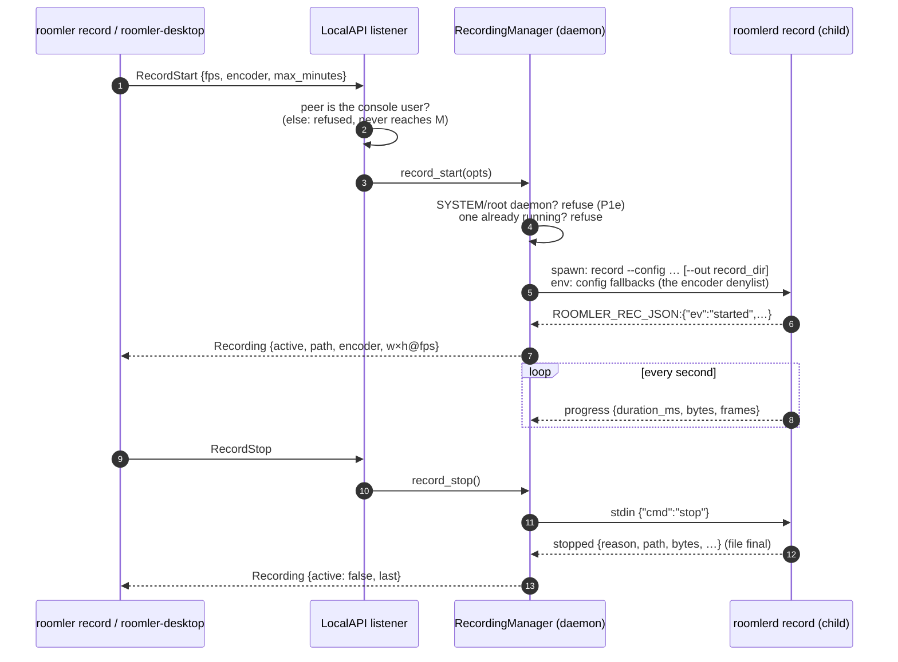
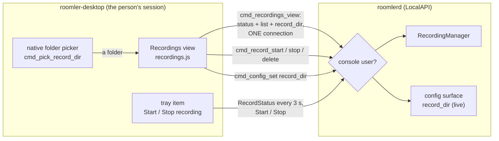
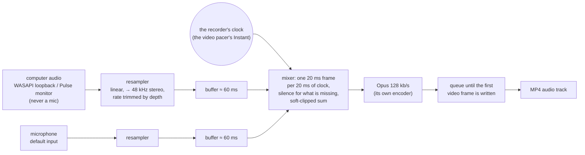

# Screen recording

> **FR-85** ([#1634](https://github.com/gjovanov/roomler-ai/issues/1634),
> [spec](fr/FR-85-hq-screen-recording.md)). **Status: P1 (the recorder core,
> and its audio on Windows and Linux), P2a (the local verbs) and P2b
> (roomler-desktop's Recordings view and tray).** It sits behind the
> `recording` cargo feature and is in no release build yet. It is driven by
> `roomlerd record`, by the daemon for the LocalAPI recording verbs and
> `roomler record` (§6), and by roomler-desktop (§7). Still to come: the
> microphone on macOS, delivery out of the recorder's data folder (P2c),
> remote recording (P3), and the editor (cut, speed up, background music) in
> P5.

A recording is **encoded at the source, in a pipeline of its own, into a
local file.** It is not a copy of what a viewer receives. The live
remote-control stream is rate-controlled to fit the network and its capture is
capped by the viewer's rung, so recording it would give transport quality.

## 1. The pipeline



| Stage | Code | Why it is shaped this way |
|---|---|---|
| Capture | `recording/recorder.rs` capture task | Its **own** capturer, never a tap on the live pump (`peer.rs`), which is capped by the viewer's rung and is the most-tuned path in the product. A second capturer costs a second WGC session, or one of DXGI's ~4 duplication seats. Only the latest frame is kept, so a slow encoder never backs capture up. |
| Pacer | `recording/pacer.rs` `Cadence`, `TickFifo` | A backend's `Frame.monotonic_us` has a different origin per backend (wall-clock on the portal), and capture is change-driven. The recorder stamps frames on its own `Instant`, one tick per `1/fps`, and repeats the last frame on a still screen. An encoder that falls behind leaves a gap in tick numbers: the previous frame lasts longer, and the file never runs fast. |
| Encoder | `encode/openh264_backend.rs` `new_recording` / the H.264 cascade | See §3. |
| Writer | `recording/mp4.rs` `FragmentedWriter` | Fragmented while recording, so a crash loses at most one fragment (~2 s). See §2. |
| Finalize | `recording/mp4.rs` `finalize` | A remux to a progressive, `moov`-first file that QuickTime, Movies & TV and editors open. Payloads are copied, never re-encoded. |

⚠️ **A process of its own.** `roomlerd record` is a child, like the capability
probe, so a driver fault in a recording's encoder costs the recorder, never
the daemon or a live session. It stops when its stdin closes, so a recorder
never outlives whatever launched it.

## 2. The file



- **A fragment starts on every keyframe** (GOP 2 s). A 10 s backstop cuts one
  anyway for an encoder that stops producing keyframes, so a crash never loses
  more than that.
- `flush` after every fragment, which is all a *process* crash needs.
  `sync_data` every fifth fragment, for power loss.
- Samples are `avc1` with the parameter sets in `avcC` and removed from the
  samples; AUDs are dropped. ⚠️ If the parameter sets change mid-recording the
  writer **refuses** rather than write an `avc1` file that lies about itself.
  The recording then ends `encoder_failed`.
- `colr` (nclx) says **BT.601, limited range**. That is what every backend's
  BGRA→YUV conversion produces (openh264's own, dcv on the FFmpeg path,
  `encode/color.rs` for MF), and openh264's recording profile signals the same
  thing in its SPS VUI. Without it an HD player assumes BT.709 and shifts
  every colour.
- **Crash recovery.** `read_fragmented` walks top-level boxes and stops at
  the first incomplete fragment. `reconcile_partials` remuxes whatever a dead
  recorder left, marks it `interrupted`, and removes a partial that holds
  nothing recoverable.
- If the remux itself fails (for example, no room for a second copy), the
  fragmented file is kept under the final name and the `stopped` event says
  `fragmented: true`.

## 3. Encoders

| Preference | Encoder | GOP | Rate |
|---|---|---|---|
| `software` | openh264, **recording profile** (`Openh264Encoder::new_recording`) | its own, `fps × 2` | quality mode, QP 10–30, ~0.2 bpp target (4–40 Mbps), no frame skipping, screen-content tuning |
| `hardware` | the FFmpeg H.264 cascade in its **recording profile** (`FfmpegEncoder::new_recording`); refuses rather than fall back to software | its own, `fps × 2` | see below |
| `auto` | `hardware`, then `software` | | |

**The hardware recording profile** reuses the live option sets: every one of
them is field-proven on the fleet's GPUs, and a new private-option dict would
be a new way for a driver to refuse an open. Three things change:

- **Quality target:** `cq` 19 instead of the live 22 (`ROOMLERD_RECORD_CQ` overrides).
- **Ceiling** (`recording_maxrate_bps`):
  - on NVENC, which runs constant quality with `bit_rate=0`, it is only a burst ceiling, so it is generous (~0.3 bpp·s, 10–80 Mbps);
  - QSV, AMF, VAAPI, D3D12, Vulkan and VideoToolbox anchor their rate control *on* `maxrate` (QSV opens as CBR when `b:v == maxrate`), so there the ceiling is the bitrate (~0.12 bpp·s, 6–40 Mbps: 1080p30 ≈ 7.5 Mbps, 4K30 ≈ 30 Mbps).
- **GOP and timing:** a real GOP replaces the on-demand-only `KEYFRAME_INTERVAL`, and PTS come from the encoder's own frame counter, because a recording feeds the same frame again on a still screen.

Every live open passes `gop_override: None` and keeps the capture clock, so
the live path is unchanged. True per-backend constant-quality modes (QSV ICQ,
AMF/VAAPI CQP) are a follow-up that needs field measurement on each vendor's
hardware first.

Verified locally with the synthetic source, by `ffprobe`:

| Encoder | Profile | Colour | GOP |
|---|---|---|---|
| `h264_nvenc` | High | `smpte170m`/`tv` | keyframes at 0 and 60 |
| openh264 | Constrained Baseline | `smpte170m`/`tv` | keyframes at 0 and 60 |

Both are 30 fps constant, decode with zero errors, and are laid out `ftyp → moov → mdat`.

⚠️ **The encoder denylist applies here too.** The FFmpeg constructors read
`ENCODER_CELLS_DENY` through `node_env`. A child the daemon spawns inherits it
as env; `roomlerd record` run by hand reads it from the config file
(`register_encoder_fallbacks`). A gate the probe and the live session honour
but the recorder skipped would only be a courtesy.

## 4. Where it goes

| | Windows | macOS | Linux |
|---|---|---|---|
| Default | `Videos\Roomler`, **only if** local, not under OneDrive, and it survives a real write probe | `~/Movies/Roomler` | XDG videos dir + `Roomler` |
| Fallback | `%USERPROFILE%\Roomler Recordings` | same rule | same rule |
| Last resort | the recorder's data dir (`%LOCALAPPDATA%\…\recordings`, never roaming) | `~/Library/Application Support/…/recordings` | `~/.local/share/roomler/recordings` |

- ⚠️ **The probe is a real write.** Defender's Controlled Folder Access lets
  `metadata()` succeed and then blocks the write. OneDrive's Known Folder Move
  would upload gigabytes of screen recordings by default.
- **Override** (`--out`, or the config key `record_dir`): absolute, local, no
  `~`, no UNC or `\\?\` device path, no `..`, no symlink or junction component.
  ONE validator, `roomler_node_core::recording_dir::validate_record_dir`
  (`crates/agent-core/src/recording_dir.rs`), shared by the config surface and
  the child. On Windows `is_symlink` is true for junctions and false for cloud
  placeholders. That is the distinction wanted: a placeholder doesn't redirect
  a path, a junction does.
- **`record_dir` is live.** The daemon reads it when a recording starts, so the
  surface marks it `restart_required = false`. It is **device-only**: a
  `DesiredConfig` cannot carry it, because the struct has no `record_*` field
  at all. `no_record_key_is_server_pushable_via_desired_config` locks that.
  Where screen recordings are kept is the owner's choice. A server that could
  move the folder could move them into a synced or shared one.
- **Names never collide:** `Roomler Recording 2026-09-25 14-30-12.mp4`, then
  ` (2)`, ` (3)`, … A partial with the name counts as taken.
- **Staging:** `<folder>/.roomler-partial/<name>.partial`, renamed into place on
  finish. The file is created with `create_new`: a recording never replaces
  anything. Beside it sits `<name>.partial.lock`, an OS file lock the recorder
  holds until the file is final (see §5, crash recovery).

## 5. `roomlerd record`

```
roomlerd record [--out <dir>] [--fps 30] [--encoder auto|hardware|software] [--max-minutes 240]
                [--system-audio] [--microphone]
```

**stdout:** one JSON object per line, each prefixed `ROOMLER_REC_JSON:`. That
is the probe children's convention (`ROOMLER_CAPS_JSON:`): the daemon's tracing
writes to the same stdout, and a parent that parsed every line would choke on
the first log line. Use `recording::child::parse_event_line`.

| `ev` | When | Fields |
|---|---|---|
| `folder` | the default or configured folder was not used | `path`, `reason` |
| `started` | the first frame is encoding | `partial`, `path`, `width`, `height`, `fps`, `encoder`, `system_audio`, `microphone` |
| `progress` | every second | `duration_ms`, `bytes`, `frames`, `late_ticks` |
| `stopped` | the file is final | `reason`, `path`, `bytes`, `duration_ms`, `frames`, `fragmented` |
| `refused` | it never started | `code`: `no_frame` · `disk_low` · `encoder_unavailable` · `folder_unwritable` · `audio_unavailable` · `system_audio_unavailable` · `mic_unavailable` |
| `recovered` | a dead recorder's partial in this folder was finalized | `path` |

**stdin:** `{"cmd":"stop"}`, optionally with a `"reason"`. **End of stdin
stops the recording** (`parent_gone`), and so does Ctrl+C. Every stop
finalizes.

**Stop reasons** (a closed set; the UI maps each to a sentence): `requested` ·
`host_stopped` · `session_ended` · `session_changed` · `display_changed` ·
`disk_low` · `max_duration` · `encoder_failed` · `capture_failed` ·
`gate_revoked` · `parent_gone` · `interrupted`.

Guards: the recorder refuses to start with under 2 GiB free, stops cleanly
under 1 GiB, and stops at the maximum length. A display that changes size ends
the file cleanly (`display_changed`) instead of scaling mid-recording.

**Crash recovery.** A recorder that died (a crash, `kill -9`, the Windows
installer's Restart Manager during an update) leaves its partial in the staging
dir. Every `roomlerd record` runs `recorder::reconcile_partials` over its own
staging dir as it starts. That runs beside the new recording, never before it,
because a multi-GB remux must not hold up `started`. Each complete fragment is
remuxed into place, and the file is marked `interrupted` in its sidecar.

⚠️ **A partial is finalized only if its `.partial.lock` can be taken**
(`recorder::PartialLock`). The recorder takes that OS file lock before it
creates the partial, holds it until the file is final, and the kernel releases
it however the process dies. Without it the reconciler could not tell a dead
recorder's partial from a live one's. A second recorder in the same folder (a
manual `roomlerd record` beside the daemon's) would remux a file under its
writer, or, before the writer's first fragment, **delete it as
unrecoverable**. `a_live_partial_is_left_alone_by_the_reconciler` is red with
the lock disabled.

## 6. Recording through the daemon — the local verbs (P2a)

The person at the device records through the running daemon: from
roomler-desktop (P2b) or from `roomler record`. The daemon never records in its
own address space. It launches `roomlerd record` and follows its events
(`recording/manager.rs`, `RecordingManager`).



| Verb | Caller | Answers |
|---|---|---|
| `RecordStart {opts}` | console user | `Recording` once the child reports `started` (≤ 20 s), or an error naming why it did not start |
| `RecordStop` | console user | `Recording` once the file is final (the remux copies every byte once; ≤ 5 min) |
| `RecordStatus` | any LocalAPI client | `Recording`: active, file, length, size, frames, encoder, and how the last one ended |
| `RecordingsList` | any LocalAPI client | `Recordings`: the folder, why it is that one, and each file with its sidecar facts, newest first |
| `RecordingDelete {name}` | console user | `RecordingDeleted`; a bare `*.mp4` name only, a regular file only (never a link), refused while it is being written |

- ⚠️ **The console-user gate is the listener's, not the handler's**
  (`serve_connection_as`, `crates/localapi/src/lib.rs`). The pipe ACL admits
  every Interactive User, RDP sessions included, which is right for reading
  status and wrong for recording: a guest in an RDP session must not be able
  to record the console user's desktop. Windows: the client's session
  (`GetNamedPipeClientProcessId` → `ProcessIdToSessionId`) must be the active
  console session. Unix: the peer's uid must be the daemon's, or root. An
  unidentified peer fails the check. The same gate covers `ConfigSet` of any
  `record_*` key.
- ⚠️ **A SYSTEM/root daemon refuses a local recording, and says why**
  (`recording/identity.rs`). The child inherits the daemon's identity, so from
  the Windows SystemContext worker or a Linux/macOS root daemon the recording
  would land in the service account's own profile
  (`…\systemprofile\Videos`, `/root/Videos`), where the person who pressed
  Record cannot see it. P1e launches the recorder as the console user. Until
  then, `roomlerd record` run in your own session still works.
- **One recording at a time.** A second start answers an error. A child that
  exits without saying how it ended (a crash, bad arguments, a binary built
  without the recorder) ends as `recorder_exited` with a sentence, never as a
  silent "did not start".
- ⚠️ **A recorder that misses the start deadline is killed, never left
  running** (`start_timeout`). Its caller was told it did not start. Stuck in an
  encoder open, it could otherwise begin recording a minute later, unseen. A
  stop command would not reach it, because the recorder reads its stop only once
  it is recording. `a_recorder_that_misses_the_start_deadline_is_stopped_not_left_recording`
  is red without the kill: the child reported `started` after its caller had
  been told no.
- **Updates wait for a recording** (`updater.rs`, `active_work`). An active
  recording counts as in-flight work, like a file transfer, with the same defer
  budget. An operator-forced update proceeds anyway and says so. The mark
  (`manager::is_recording`) is a count each recorder's reader task adds to once
  and removes once, so no code path can clear a recording it does not own.
- **`roomler record start|stop|status|ls|rm`**
  (`agents/roomler-cli/src/cli.rs`) wraps these verbs one to one. `--json`
  prints the wire shape.

## 7. roomler-desktop — the Recordings view and the tray (P2b)

The companion's sixth view (`#/recordings`, `src/front/recordings.js`) and a
tray item. Both only ASK the daemon; every decision stays there (§6).



| Part | What it does |
|---|---|
| **Record this screen** | Start / Stop, the frame rate (30 or 60) and the encoder (automatic, GPU only, software only), a blinking REC chip with the running time, size, encoder and resolution. The options lock while a recording runs. How the last one ended is one sentence (`describeLast`); every closed stop reason and refusal code has words. |
| **Where recordings are saved** | The folder in use, whether it is the default or one the person chose, **Change folder…** (the native picker), **Use the default folder**, and **Open folder**. A fallback is named ("Not the usual folder: … is under OneDrive"). |
| **Saved recordings** | Newest first, from the sidecars: when, how long, size, by whom (this device, or a remote controller by name), how it ended on hover. **Play** (the OS's default player), **Show** (selected in the file manager), **Delete** (two clicks, no modal: the first arms it for 4 s). |
| **Tray** | **Start recording** / **Stop recording (m:ss)**, and the tooltip `Roomler — recording m:ss`, following the recorder whoever started it. A refusal opens the Recordings view with the sentence. |

- **Start is greyed out, with the reason, wherever the service cannot record.**
  `RecordingState` carries `available` and `unavailable_reason` (additive,
  serde default `false`): false on a service built without the recorder, and
  on a SYSTEM/root service until P1e. The tray disables its item the same way,
  so neither offers a button that can only fail.
- **One LocalAPI connection per refresh** (`cmd_recordings_view` reads status,
  list and `record_dir` in turn), every second while a recording runs, every
  5 s otherwise, and only while the view is visible. A failed refresh keeps
  the last good data and says why (the FR-84 D1 rule). The rows are keyed and
  patched in place, so a button never moves under the cursor.
- ⚠️ **A daemon's answer on a `record_*` key is final.** `cmd_config_set`
  falls back to writing the config file itself when the daemon fails. For the
  recording keys it no longer does once the daemon has *answered*: the
  listener refuses anyone but the console user, and a direct write behind that
  refusal would report a success the daemon refused. (A daemon that is not
  running still falls back: that is the person editing their own file.)
- **Play / Show open a NAME, never a path from the page.** `cmd_recording_open`
  joins the daemon's own folder with a bare `*.mp4` name, and opens it only if
  it is a regular file. On Windows `/select,` needs the path quoted *inside*
  the argument, which standard argument quoting breaks, so it is passed raw.

## 8. The sidecar

`<recording>.roomler.json`, beside the file: who started it (`local`, or
`remote` with the controller's **user id**, because remote downloads are
owned by user and not by session id), start and end times, size and fps,
codec and the backend that encoded it, colour, audio sources, frames,
late ticks, events, the stop reason, and bytes. ⚠️ **Never content**: no
window titles, and nothing typed.

## 9. Audio (P1c)

Computer audio and the microphone are both **OFF unless asked for**
(`--system-audio`, `--microphone`; the checkboxes in §7; `RecordStartOpts`).
The microphone is local-only: no remote path will ever set it (P3).



| Decision | Why |
|---|---|
| **The mixer PULLS on the recorder's clock** | WASAPI loopback delivers nothing while nothing plays, and every device clock drifts. A track timed by what the devices delivered would collapse during silence and walk away from the video. Pulling one frame per 20 ms of the video pacer's own `Instant` makes audio time video time by construction. |
| **It runs 60 ms behind** (`MIX_LAG`) | Devices hand over ~10 ms bursts. A mixer level with the clock would pad silence into every frame. |
| **Drift is corrected by RATE** | Each source's linear resampler is bent by at most ±0.5 % toward keeping its buffer at the lag. Padding alone would click: a device clock 0.1 % slow empties the buffer, and from then on every frame pads a sample. The hard trim (a buffer past 250 ms, cut back to 60 ms, newest kept) is only for backlogs such as the capture pre-roll at start. |
| **Linear, not nearest-neighbour** | A 44.1 kHz laptop microphone is common, and the live path's nearest-neighbour aliases audibly on speech. The live path keeps its own resampler, untouched. |
| **Audio waits for the first video frame** | The writer's audio decode time starts at the first packet pushed after its header. Encoded audio queues from the clock's start; when the first video frame is written, frames mostly before its time are dropped, so the tracks start within ±10 ms of each other. |
| **Soft clip, not wrap** | Two loud sources sum past full scale. Up to ¾ of full scale the sum is untouched; above it, a `tanh` knee compresses toward full scale, settling at it only far past it (never beyond, never wrapping). |
| **A source asked for and not opened refuses the start, by name** | `system_audio_unavailable` (no loopback or monitor: set `ROOMLERD_AUDIO_SOURCE`), `mic_unavailable` (none, or on Windows the "Let desktop apps access your microphone" switch), `audio_unavailable` (a build without the `audio` feature; macOS today). A recording that silently lacked the audio the person asked for would be worse. |
| **A source lost mid-recording is not fatal** | The recording goes on with that source's silence. The sidecar records `audio_source_lost`, or `audio_failed` if the encoder failed and the rest is video-only. |

⚠️ **Computer audio never falls back to a microphone.** The live
remote-control path, on a Linux host without a PulseAudio monitor, falls back
to the default INPUT device. The recorder opens
`cpal_backend::Source::SystemOnly`, which refuses instead
(`system_audio_unavailable`).

⚠️ **Not yet on macOS.** Computer audio there needs ScreenCaptureKit (macOS 13+;
the bundle targets 12). The microphone needs cpal on macOS, plus
`NSMicrophoneUsageDescription` and the `audio-input` entitlement in the
bundle. Both are refused by name until then.

## 10. Tests

| Where | What | CI |
|---|---|---|
| `recording::*` unit tests | Annex-B split and parameter sets; the fragmented writer (keyframe cuts, refusals, never overwriting); remux sample order with `moov` first; truncated recovery; audio interleave; the pacer's tick math and FIFO; folder probe, validation, names, OneDrive/UNC; sidecar round trip; the manager's event folding, delete-name rules and listing; the identity probe | `ci.yml` "Test the recorder (FR-85)" (`--lib recording::`) |
| `tests/recorder.rs` | A counter-pattern capture → openh264 recording encoder → MP4 → openh264 decode, reading the counters back (the oracle is proven to discriminate first); display change; disk-low and no-frame refusals; the real `roomlerd record` process: the stop command, stdin EOF, `kill -9` followed by `reconcile_partials`, a **live** partial left alone (red with the lock disabled); and the manager end to end (start into `record_dir`, a second start refused, stop, list, delete), a missed start deadline killing the child (red without the kill), and the SYSTEM/root refusal | same step, `--test recorder` |
| `recording::audio` unit tests (P1c) | 48 kHz passes through exactly (one frame of interpolator latency); mono → both channels; a 44.1 kHz sine resamples to 48 kHz at the same pitch; a positive rate trim consumes faster; the soft clip is linear below the knee, monotonic, never wraps; a silent source still yields one frame per 20 ms; two sources sum; a backlog is cut to the lag keeping the newest; a 0.2 % fast source is held near the lag by the rate correction, never trimmed | "Test the recorder (FR-85)", the `audio` run |
| `tests/recorder.rs`, audio (P1c) | a 440 Hz tone at 44.1 kHz mono plus a microphone that delivers nothing → an Opus track within 80 ms of the video, decoded back at 440 Hz with the right level; the same recording without audio has no audio track (the negative control); `roomlerd record --system-audio` through the real process; a build without `audio` refuses `--microphone` with `audio_unavailable` | both runs of the same step |
| `crates/localapi` | the console-user decision table; a recording verb from an unidentified peer is refused before any handler runs; `ConfigSet record_dir` gated the same way; the verbs round-trip | "Run the remaining crates' unit tests" |
| `crates/agent-core` | `record_dir` set/echo/validate/clear; the live set is exactly `exec_enabled`, `remote_config_enabled`, `record_dir`; `recording_dir` validation incl. a real Windows junction | same |
| `crates/remote_control` | `no_record_key_is_server_pushable_via_desired_config` | same |
| `agents/roomler-cli` | `record` verbs parse; lengths and endings read plainly | same |
| `ui/src/__tests__/companion/recordings.spec.ts` | roomler-desktop's REAL `index.html` section and `recordings.js`, in jsdom against a mocked `invoke`: Start greyed out with the reason, the running state, start options, a refusal said, delete only on the second click (red when a single click deletes), the arm expiring, the folder picker saving through `cmd_config_set` and a cancel saving nothing, keyed rows kept in place (red when rows are rebuilt), the last good data kept on a failed refresh, a service with no recorder | "Frontend checks" (`bun run test:unit`) |
| `agents/roomler-desktop` | the tray's wording and when its item is enabled; only a bare `*.mp4` name is opened; a service without the recorder reads as unsupported; recording keys are the daemon's to accept | `ci.yml` "Test the desktop companion (roomler-desktop)", new with P2b. The crate's unit tests ran in NO lane before: the macOS job only `cargo check`s it, and the shared step is `--lib`, which a bin-only crate cannot join |

⚠️ `agents/roomlerd/tests/*.rs` runs only when a step **names** it. Every other
roomlerd test step is `--lib`, which is why `tests/file_dc.rs` has never run in
CI.
