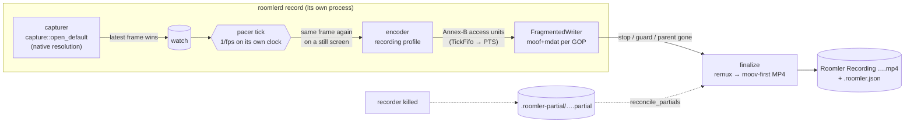
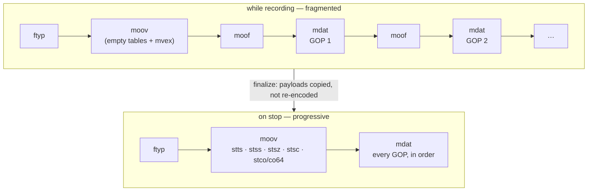

# Screen recording

> **FR-85** ([#1634](https://github.com/gjovanov/roomler-ai/issues/1634),
> [spec](fr/FR-85-hq-screen-recording.md)). **Status: P1, the recorder core.**
> It sits behind the `recording` cargo feature, is in no release build yet, and
> is driven from `roomlerd record`. The local surfaces come in P2 (roomler-desktop's
> Recordings view, the tray, `roomler record`), remote recording in P3, and the
> editor (cut, speed up, background music) in P5.

A recording is **encoded at the source, in a pipeline of its own, into a
local file.** It is not a copy of what a viewer receives. The live
remote-control stream is rate-controlled to fit the network and its capture is
capped by the viewer's rung, so recording it would give transport quality.

## 1. The pipeline



| Stage | Code | Why it is shaped this way |
|---|---|---|
| Capture | `recording/recorder.rs` capture task | Its **own** capturer, never a tap on the live pump (`peer.rs`), which is capped by the viewer's rung and is the most-tuned path in the product. A second capturer costs a second WGC session, or one of DXGI's ~4 duplication seats. Only the latest frame is kept, so a slow encoder never backs capture up. |
| Pacer | `recording/pacer.rs` `Cadence`, `TickFifo` | A backend's `Frame.monotonic_us` has a different origin per backend (wall-clock on the portal), and capture is change-driven. The recorder stamps frames on its own `Instant`, one tick per `1/fps`, and repeats the last frame on a still screen. An encoder that falls behind leaves a gap in tick numbers: the previous frame lasts longer, and the file never runs fast. |
| Encoder | `encode/openh264_backend.rs` `new_recording` / the H.264 cascade | See §3. |
| Writer | `recording/mp4.rs` `FragmentedWriter` | Fragmented while recording, so a crash loses at most one fragment (~2 s). See §2. |
| Finalize | `recording/mp4.rs` `finalize` | A remux to a progressive, `moov`-first file that QuickTime, Movies & TV and editors open. Payloads are copied, never re-encoded. |

⚠️ **A process of its own.** `roomlerd record` is a child, like the capability
probe, so a driver fault in a recording's encoder costs the recorder, never
the daemon or a live session. It stops when its stdin closes, so a recorder
never outlives whatever launched it.

## 2. The file



- **A fragment starts on every keyframe** (GOP 2 s). A 10 s backstop cuts one
  anyway for an encoder that stops producing keyframes, so a crash never loses
  more than that.
- `flush` after every fragment, which is all a *process* crash needs.
  `sync_data` every fifth fragment, for power loss.
- Samples are `avc1` with the parameter sets in `avcC` and removed from the
  samples; AUDs are dropped. ⚠️ If the parameter sets change mid-recording the
  writer **refuses** rather than write an `avc1` file that lies about itself.
  The recording then ends `encoder_failed`.
- `colr` (nclx) says **BT.601, limited range**. That is what every backend's
  BGRA→YUV conversion produces (openh264's own, dcv on the FFmpeg path,
  `encode/color.rs` for MF), and openh264's recording profile signals the same
  thing in its SPS VUI. Without it an HD player assumes BT.709 and shifts
  every colour.
- **Crash recovery.** `read_fragmented` walks top-level boxes and stops at
  the first incomplete fragment. `reconcile_partials` remuxes whatever a dead
  recorder left, marks it `interrupted`, and removes a partial that holds
  nothing recoverable.
- If the remux itself fails (for example, no room for a second copy), the
  fragmented file is kept under the final name and the `stopped` event says
  `fragmented: true`.

## 3. Encoders

| Preference | Encoder | GOP | Rate |
|---|---|---|---|
| `software` | openh264, **recording profile** (`Openh264Encoder::new_recording`) | its own, `fps × 2` | quality mode, QP 10–30, ~0.2 bpp target (4–40 Mbps), no frame skipping, screen-content tuning |
| `auto` / `hardware` | the same H.264 cascade as a live session (MF / FFmpeg HW / openh264) | forced by the recorder every 2 s | the live profile (P1b adds a dedicated constant-quality profile per backend) |

⚠️ **The encoder denylist applies here too.** The FFmpeg constructors read
`ENCODER_CELLS_DENY` through `node_env`. A child the daemon spawns inherits it
as env; `roomlerd record` run by hand reads it from the config file
(`register_encoder_fallbacks`). A gate the probe and the live session honour
but the recorder skipped would only be a courtesy.

## 4. Where it goes

| | Windows | macOS | Linux |
|---|---|---|---|
| Default | `Videos\Roomler`, **only if** local, not under OneDrive, and it survives a real write probe | `~/Movies/Roomler` | XDG videos dir + `Roomler` |
| Fallback | `%USERPROFILE%\Roomler Recordings` | same rule | same rule |
| Last resort | the recorder's data dir (`%LOCALAPPDATA%\…\recordings`, never roaming) | `~/Library/Application Support/…/recordings` | `~/.local/share/roomler/recordings` |

- ⚠️ **The probe is a real write.** Defender's Controlled Folder Access lets
  `metadata()` succeed and then blocks the write. OneDrive's Known Folder Move
  would upload gigabytes of screen recordings by default.
- **Override** (`--out`, `record_dir` from P2): absolute, local, no `~`, no UNC
  or `\\?\` device path, no `..`, no symlink or junction component
  (`folder::validate_record_dir`). On Windows `is_symlink` is true for
  junctions and false for cloud placeholders. That is the distinction wanted:
  a placeholder doesn't redirect a path, a junction does.
- **Names never collide:** `Roomler Recording 2026-09-25 14-30-12.mp4`, then
  ` (2)`, ` (3)`, … A partial with the name counts as taken.
- **Staging:** `<folder>/.roomler-partial/<name>.partial`, renamed into place on
  finish. The file is created with `create_new`: a recording never replaces
  anything.

## 5. `roomlerd record`

```
roomlerd record [--out <dir>] [--fps 30] [--encoder auto|hardware|software] [--max-minutes 240]
```

**stdout:** one JSON object per line, each prefixed `ROOMLER_REC_JSON:`. That
is the probe children's convention (`ROOMLER_CAPS_JSON:`): the daemon's tracing
writes to the same stdout, and a parent that parsed every line would choke on
the first log line. Use `recording::child::parse_event_line`.

| `ev` | When | Fields |
|---|---|---|
| `folder` | the default or configured folder was not used | `path`, `reason` |
| `started` | the first frame is encoding | `partial`, `path`, `width`, `height`, `fps`, `encoder` |
| `progress` | every second | `duration_ms`, `bytes`, `frames`, `late_ticks` |
| `stopped` | the file is final | `reason`, `path`, `bytes`, `duration_ms`, `frames`, `fragmented` |
| `refused` | it never started | `code`: `no_frame` · `disk_low` · `encoder_unavailable` · `folder_unwritable` |

**stdin:** `{"cmd":"stop"}`, optionally with a `"reason"`. **End of stdin
stops the recording** (`parent_gone`), and so does Ctrl+C. Every stop
finalizes.

**Stop reasons** (a closed set; the UI maps each to a sentence): `requested` ·
`host_stopped` · `session_ended` · `session_changed` · `display_changed` ·
`disk_low` · `max_duration` · `encoder_failed` · `capture_failed` ·
`gate_revoked` · `parent_gone` · `interrupted`.

Guards: the recorder refuses to start with under 2 GiB free, stops cleanly
under 1 GiB, and stops at the maximum length. A display that changes size ends
the file cleanly (`display_changed`) instead of scaling mid-recording.

## 6. The sidecar

`<recording>.roomler.json`, beside the file: who started it (`local`, or
`remote` with the controller's **user id**, because remote downloads are
owned by user and not by session id), start and end times, size and fps,
codec and the backend that encoded it, colour, audio sources, frames,
late ticks, events, the stop reason, and bytes. ⚠️ **Never content**: no
window titles, and nothing typed.

## 7. Tests

| Where | What | CI |
|---|---|---|
| `recording::*` unit tests | Annex-B split and parameter sets; the fragmented writer (keyframe cuts, refusals, never overwriting); remux sample order with `moov` first; truncated recovery; audio interleave; the pacer's tick math and FIFO; folder probe, validation, names, OneDrive/UNC; sidecar round trip | `ci.yml` "Test the recorder (FR-85)" (`--lib recording::`) |
| `tests/recorder.rs` | A counter-pattern capture → openh264 recording encoder → MP4 → openh264 decode, reading the counters back (the oracle is proven to discriminate first); display change; disk-low and no-frame refusals; and the real `roomlerd record` process: the stop command, stdin EOF, and `kill -9` followed by `reconcile_partials` | same step, `--test recorder` |

⚠️ `agents/roomlerd/tests/*.rs` runs only when a step **names** it. Every other
roomlerd test step is `--lib`, which is why `tests/file_dc.rs` has never run in
CI.
