# Screen recording

> **FR-85** ([#1634](https://github.com/gjovanov/roomler-ai/issues/1634),
> [spec](fr/FR-85-hq-screen-recording.md)). **Status: P1 (the recorder core
> and its mouse pointer, §1; its audio on Windows and Linux; and on Windows
> and Linux the identity rule: it runs as the person at the device, or, for a
> remote recording on a host nobody is signed in to, as the service into its
> own locked folder, §6), P2a (the local verbs), P2b
> (roomler-desktop's Recordings view and tray), P3a (the server's gates for
> remote recording), P3b (the device's half of it), P3b-2 (downloading it),
> P3b-3 (a dropped session's recording waits a minute for its controller),
> P3c (the viewer's Record and Download, §10), P3c-2 (no Record control on a
> device with no recorder), P5a (the export engine: cut
> and speed up, §11), P5b (the export's sound and background music) and P5c
> (roomler-desktop's Edit view).**
> It is in **no release build**: `recording` joined `full` for a day (#1677)
> and was taken back out before any release carried it (the operator,
> 2026-09-26). It rejoins once canary hosts prove it in the field: an
> EDR-managed corporate laptop first, because on Windows the daemon launches
> a restricted-token child (§6) as soon as someone opens the Recordings
> view, the pattern EDR watches for; then macOS TCC for that child. Where it
> is compiled in, every gate is closed: a local recording starts only when
> the person at the device presses Record, a remote one only once the
> device's owner allows it, and `ROOMLERD_RECORDING=0` in the service's
> environment switches recording off, local and remote. It is driven by
> `roomlerd record`, by the daemon for the LocalAPI recording verbs and
> `roomler record` (§6), by roomler-desktop (§7), by a remote controller
> from the viewer's toolbar, over the session's `record` channel (§10), and
> by `roomlerd media` for an export (§11), which touches only the files the
> person hands it. Still to come: the microphone on macOS, delivery out of
> the recorder's data folder (P2c), and editing a hardware encoder's
> recording (P4).

A recording is **encoded at the source, in a pipeline of its own, into a
local file.** It is not a copy of what a viewer receives. The live
remote-control stream is rate-controlled to fit the network and its capture is
capped by the viewer's rung, so recording it would give transport quality.

## 1. The pipeline

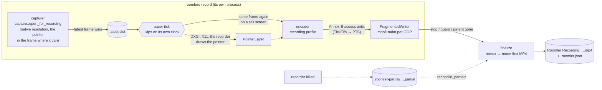

| Stage | Code | Why it is shaped this way |
|---|---|---|
| Capture | `recording/recorder.rs` capture task | Its **own** capturer (`capture::open_for_recording`), never a tap on the live pump (`peer.rs`), which is capped by the viewer's rung and is the most-tuned path in the product. A second capturer costs a second WGC session, or one of DXGI's ~4 duplication seats. Only the latest frame is kept, so a slow encoder never backs capture up. |
| Pacer | `recording/pacer.rs` `Cadence`, `TickFifo` | A backend's `Frame.monotonic_us` has a different origin per backend (wall-clock on the portal), and capture is change-driven. The recorder stamps frames on its own `Instant`, one tick per `1/fps`, and repeats the last frame on a still screen. An encoder that falls behind leaves a gap in tick numbers: the previous frame lasts longer, and the file never runs fast. |
| Pointer | `capture/pointer.rs`, `recording/pointer.rs` `PointerLayer` | Drawn by the backend where it can. Where it cannot (DXGI, X11), the backend says where the pointer is and the recorder draws it, on the tick rather than on the capture. See [The pointer](#the-pointer-p1d). |
| Encoder | `encode/openh264_backend.rs` `new_recording` / the H.264 cascade | See §3. |
| Writer | `recording/mp4.rs` `FragmentedWriter` | Fragmented while recording, so a crash loses at most one fragment (~2 s). See §2. |
| Finalize | `recording/mp4.rs` `finalize` | A remux to a progressive, `moov`-first file that QuickTime, Movies & TV and editors open. Payloads are copied, never re-encoded. |

⚠️ **A process of its own.** `roomlerd record` is a child, like the capability
probe, so a driver fault in a recording's encoder costs the recorder, never
the daemon or a live session. It stops when its stdin closes, so a recorder
never outlives whatever launched it.

### The pointer (P1d)

The live path keeps the pointer **out** of its frames on purpose. It streams
the pointer on a channel of its own (`capture/cursor.rs`) and the browser
draws it, because a pointer baked into video lags by the video's latency. A
recording has no second channel. So the recorder opens its capturer with
`capture::open_for_recording`, which asks every backend that can draw the
pointer to draw it. It then asks the backend once, after the first frame, how
the pointer gets in (`ScreenCapture::recorded_pointer`), and the sidecar
keeps the answer (§8).

| Backend | The pointer | Sidecar `pointer` |
|---|---|---|
| WGC (Windows' default) | drawn by WGC. The recorder's session has cursor capture on; the live session's stays off unless `ROOMLERD_WGC_CURSOR=1` | `in_frame` |
| CoreGraphics (macOS) | drawn by WindowServer (`kCGDisplayStreamShowCursor`, a vendored scrap patch that predates this) | `in_frame` |
| the portal, mutter (Wayland) | drawn by the compositor, where the portal grants an embedded cursor | `in_frame`, or `none` where it offers only a hidden one |
| DXGI (Windows' fallback) | drawn by the recorder: `GetCursorInfo` for where, the live tracker's decoded bitmap for what, placed by the output's origin on the virtual desktop (DXGI's first output need not be the primary monitor) | `drawn` |
| X11 | drawn by the recorder: XFixes `GetCursorImage`, placed by the monitor's origin on the root window | `drawn` |
| DRM, the SystemContext capture | none | `none` |

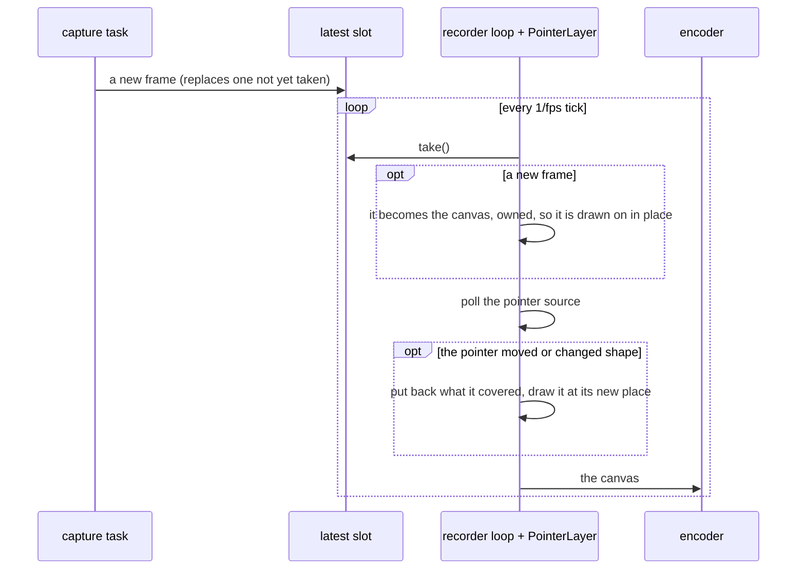

- ⚠️ **Drawn on the tick, not on the capture.** A pointer moving over a still
  screen produces no new capture: DXGI and X11's damage tracking both report
  "unchanged". A pointer drawn only on new captures would freeze until
  something else on screen changed.
- ⚠️ **The encoder may still hold the previous tick's frame.** The canvas
  changes through `Arc::make_mut`, so a frame someone else holds is copied
  first and never written under them. The loop *takes* each new capture from
  its slot (a `watch` kept a reference, which would have forced that copy on
  every new frame), so normally the pointer is drawn in place and nothing is
  copied.
- ⚠️ **A new capture is never patched with the old one's pixels.** What the
  pointer covered belongs to the capture it was drawn on, and is dropped with
  it.
- A still pointer on a still screen costs nothing: the same frame goes out
  again.
- Windows' cursor bitmaps are straight alpha (as the live tracker and the
  browser treat them) and are premultiplied once per shape. XFixes' are
  premultiplied already. A malformed pixel saturates rather than wrapping to
  a dark speck.
- Owed to the field (P6): DXGI's pointer at a scale factor other than 100 %,
  an X11 desktop whose primary monitor is not at the root's origin, and a
  portal that grants only a hidden cursor.

## 2. The file

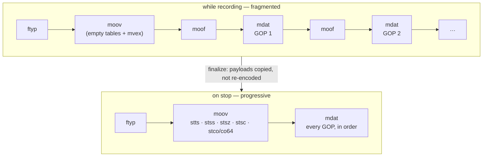

- **A fragment starts on every keyframe** (GOP 2 s). A 10 s backstop cuts one
  anyway for an encoder that stops producing keyframes, so a crash never loses
  more than that.
- `flush` after every fragment, which is all a *process* crash needs.
  `sync_data` every fifth fragment, for power loss.
- Samples are `avc1` with the parameter sets in `avcC` and removed from the
  samples; AUDs are dropped. ⚠️ If the parameter sets change mid-recording the
  writer **refuses** rather than write an `avc1` file that lies about itself.
  The recording then ends `encoder_failed`.
- `colr` (nclx) says **BT.601, limited range**. That is what every backend's
  BGRA→YUV conversion produces (openh264's own, dcv on the FFmpeg path,
  `encode/color.rs` for MF), and openh264's recording profile signals the same
  thing in its SPS VUI. Without it an HD player assumes BT.709 and shifts
  every colour.
- **Crash recovery.** `read_fragmented` walks top-level boxes and stops at
  the first incomplete fragment. `reconcile_partials` remuxes whatever a dead
  recorder left, marks it `interrupted`, and removes a partial that holds
  nothing recoverable.
- If the remux itself fails (for example, no room for a second copy), the
  fragmented file is kept under the final name and the `stopped` event says
  `fragmented: true`.

## 3. Encoders

| Preference | Encoder | GOP | Rate |
|---|---|---|---|
| `software` | openh264, **recording profile** (`Openh264Encoder::new_recording`) | its own, `fps × 2` | quality mode, QP 10–30, ~0.2 bpp target (4–40 Mbps), no frame skipping, screen-content tuning |
| `hardware` | the FFmpeg H.264 cascade in its **recording profile** (`FfmpegEncoder::new_recording`); refuses rather than fall back to software | its own, `fps × 2` | see below |
| `auto` | `hardware`, then `software` | | |

**The hardware recording profile** reuses the live option sets: every one of
them is field-proven on the fleet's GPUs, and a new private-option dict would
be a new way for a driver to refuse an open. Three things change:

- **Quality target:** `cq` 19 instead of the live 22 (`ROOMLERD_RECORD_CQ` overrides).
- **Ceiling** (`recording_maxrate_bps`):
  - on NVENC, which runs constant quality with `bit_rate=0`, it is only a burst ceiling, so it is generous (~0.3 bpp·s, 10–80 Mbps);
  - QSV, AMF, VAAPI, D3D12, Vulkan and VideoToolbox anchor their rate control *on* `maxrate` (QSV opens as CBR when `b:v == maxrate`), so there the ceiling is the bitrate (~0.12 bpp·s, 6–40 Mbps: 1080p30 ≈ 7.5 Mbps, 4K30 ≈ 30 Mbps).
- **GOP and timing:** a real GOP replaces the on-demand-only `KEYFRAME_INTERVAL`, and PTS come from the encoder's own frame counter, because a recording feeds the same frame again on a still screen.

Every live open passes `gop_override: None` and keeps the capture clock, so
the live path is unchanged. True per-backend constant-quality modes (QSV ICQ,
AMF/VAAPI CQP) are a follow-up that needs field measurement on each vendor's
hardware first.

Verified locally with the synthetic source, by `ffprobe`:

| Encoder | Profile | Colour | GOP |
|---|---|---|---|
| `h264_nvenc` | High | `smpte170m`/`tv` | keyframes at 0 and 60 |
| openh264 | Constrained Baseline | `smpte170m`/`tv` | keyframes at 0 and 60 |

Both are 30 fps constant, decode with zero errors, and are laid out `ftyp → moov → mdat`.

⚠️ **The encoder denylist applies here too.** The FFmpeg constructors read
`ENCODER_CELLS_DENY` through `node_env`. A child the daemon spawns inherits it
as env; `roomlerd record` run by hand reads it from the config file
(`register_encoder_fallbacks`). A gate the probe and the live session honour
but the recorder skipped would only be a courtesy.

## 4. Where it goes

| | Windows | macOS | Linux |
|---|---|---|---|
| Default | `Videos\Roomler`, **only if** local, not under OneDrive, and it survives a real write probe | `~/Movies/Roomler` | XDG videos dir + `Roomler` |
| Fallback | `%USERPROFILE%\Roomler Recordings` | same rule | same rule |
| Last resort | the recorder's data dir (`%LOCALAPPDATA%\…\recordings`, never roaming) | `~/Library/Application Support/…/recordings` | `~/.local/share/roomler/recordings` |

- ⚠️ **The probe is a real write.** Defender's Controlled Folder Access lets
  `metadata()` succeed and then blocks the write. OneDrive's Known Folder Move
  would upload gigabytes of screen recordings by default.
- **Override** (`--out`, or the config key `record_dir`): absolute, local, no
  `~`, no UNC or `\\?\` device path, no `..`, no symlink or junction component.
  ONE validator, `roomler_node_core::recording_dir::validate_record_dir`
  (`crates/agent-core/src/recording_dir.rs`), shared by the config surface and
  the child. On Windows `is_symlink` is true for junctions and false for cloud
  placeholders. That is the distinction wanted: a placeholder doesn't redirect
  a path, a junction does.
- **`record_dir` is live.** The daemon reads it when a recording starts, so the
  surface marks it `restart_required = false`. It is **device-only**: a
  `DesiredConfig` cannot carry it, because the struct has no `record_*` field
  at all. `no_record_key_is_server_pushable_via_desired_config` locks that.
  Where screen recordings are kept is the owner's choice. A server that could
  move the folder could move them into a synced or shared one.
- **Names never collide:** `Roomler Recording 2026-09-25 14-30-12.mp4`, then
  ` (2)`, ` (3)`, … A partial with the name counts as taken.
- **Staging:** `<folder>/.roomler-partial/<name>.partial`, renamed into place on
  finish. The file is created with `create_new`: a recording never replaces
  anything. Beside it sits `<name>.partial.lock`, an OS file lock the recorder
  holds until the file is final (see §5, crash recovery).

## 5. `roomlerd record`

```
roomlerd record [--out <dir>] [--fps 30] [--encoder auto|hardware|software] [--max-minutes 240]
                [--system-audio] [--microphone]
```

**stdout:** one JSON object per line, each prefixed `ROOMLER_REC_JSON:`. That
is the probe children's convention (`ROOMLER_CAPS_JSON:`): the daemon's tracing
writes to the same stdout, and a parent that parsed every line would choke on
the first log line. Use `recording::child::parse_event_line`.

| `ev` | When | Fields |
|---|---|---|
| `folder` | the default or configured folder was not used | `path`, `reason` |
| `started` | the first frame is encoding | `partial`, `path`, `width`, `height`, `fps`, `encoder`, `system_audio`, `microphone` |
| `progress` | every second | `duration_ms`, `bytes`, `frames`, `late_ticks` |
| `stopped` | the file is final | `reason`, `path`, `bytes`, `duration_ms`, `frames`, `fragmented` |
| `refused` | it never started | `code`: `no_frame` · `disk_low` · `encoder_unavailable` · `folder_unwritable` · `audio_unavailable` · `system_audio_unavailable` · `mic_unavailable` |
| `recovered` | a dead recorder's partial in this folder was finalized | `path` |

**stdin:** `{"cmd":"stop"}`, optionally with a `"reason"`. **End of stdin
stops the recording** (`parent_gone`), and so does Ctrl+C. Every stop
finalizes.

**Stop reasons** (a closed set; the UI maps each to a sentence): `requested` ·
`host_stopped` · `session_ended` · `session_changed` · `display_changed` ·
`disk_low` · `max_duration` · `encoder_failed` · `capture_failed` ·
`gate_revoked` · `parent_gone` · `interrupted`.

Guards: the recorder refuses to start with under 2 GiB free, stops cleanly
under 1 GiB, and stops at the maximum length. A display that changes size ends
the file cleanly (`display_changed`) instead of scaling mid-recording.

**Crash recovery.** A recorder that died (a crash, `kill -9`, the Windows
installer's Restart Manager during an update) leaves its partial in the staging
dir. Every `roomlerd record` runs `recorder::reconcile_partials` over its own
staging dir as it starts. That runs beside the new recording, never before it,
because a multi-GB remux must not hold up `started`. Each complete fragment is
remuxed into place, and the file is marked `interrupted` in its sidecar.

⚠️ **A partial is finalized only if its `.partial.lock` can be taken**
(`recorder::PartialLock`). The recorder takes that OS file lock before it
creates the partial, holds it until the file is final, and the kernel releases
it however the process dies. Without it the reconciler could not tell a dead
recorder's partial from a live one's. A second recorder in the same folder (a
manual `roomlerd record` beside the daemon's) would remux a file under its
writer, or, before the writer's first fragment, **delete it as
unrecoverable**. `a_live_partial_is_left_alone_by_the_reconciler` is red with
the lock disabled.

## 6. Recording through the daemon — the local verbs (P2a)

The person at the device records through the running daemon: from
roomler-desktop (P2b) or from `roomler record`. The daemon never records in its
own address space. It launches `roomlerd record` and follows its events
(`recording/manager.rs`, `RecordingManager`).

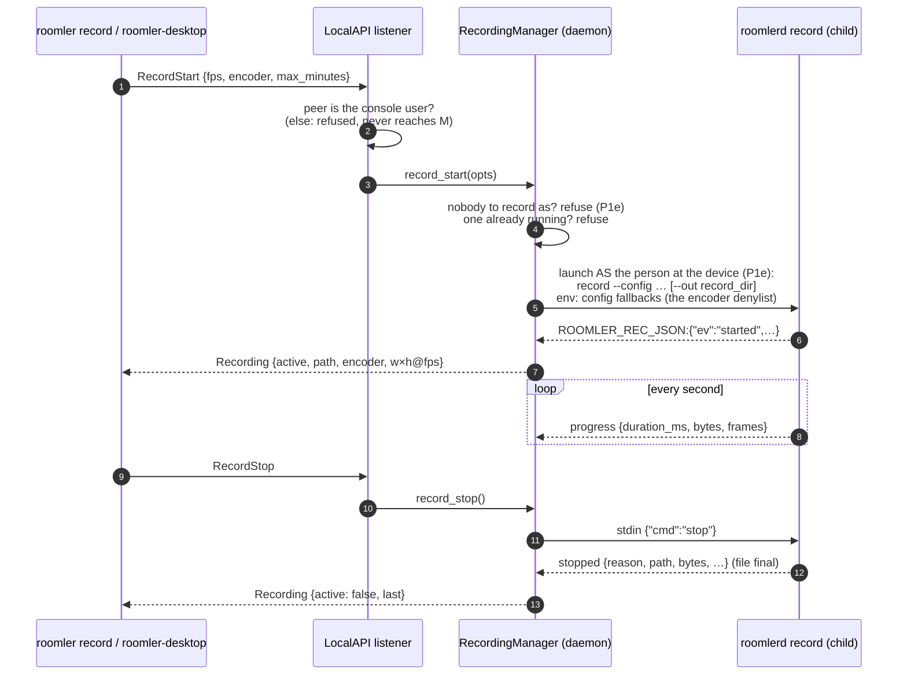

| Verb | Caller | Answers |
|---|---|---|
| `RecordStart {opts}` | console user | `Recording` once the child reports `started` (≤ 20 s), or an error naming why it did not start |
| `RecordStop` | console user | `Recording` once the file is final (the remux copies every byte once; ≤ 5 min) |
| `RecordStatus` | any LocalAPI client | `Recording`: active, file, length, size, frames, encoder, and how the last one ended |
| `RecordingsList` | any LocalAPI client | `Recordings`: the folder, why it is that one, and each file with its sidecar facts, newest first |
| `RecordingDelete {name}` | console user | `RecordingDeleted`; a bare `*.mp4` name only, a regular file only (never a link), refused while it is being written |

- ⚠️ **The console-user gate is the listener's, not the handler's**
  (`serve_connection_as`, `crates/localapi/src/lib.rs`). The pipe ACL admits
  every Interactive User, RDP sessions included, which is right for reading
  status and wrong for recording: a guest in an RDP session must not be able
  to record the console user's desktop. Windows: the client's session
  (`GetNamedPipeClientProcessId` → `ProcessIdToSessionId`) must be the active
  console session. Unix: the peer's uid must be the daemon's, or root. An
  unidentified peer fails the check. The same gate covers `ConfigSet` of any
  `record_*` key.
- ⚠️ **The recorder runs as the person signed in at the device, at normal
  integrity, whatever the daemon runs as** (P1e, `recording/launch.rs`, see
  "Who the recorder runs as" below). Where there is nobody to record as —
  SYSTEM with nobody signed in, or a Linux/macOS root daemon, whose drop to
  the console user is not built yet — a local recording is refused, and says
  why. `roomlerd record` run in your own session always works.
- **One recording at a time.** A second start answers an error. A child that
  exits without saying how it ended (a crash, bad arguments, a binary built
  without the recorder) ends as `recorder_exited` with a sentence, never as a
  silent "did not start".
- ⚠️ **A recorder that misses the start deadline is killed, never left
  running** (`start_timeout`). Its caller was told it did not start. Stuck in an
  encoder open, it could otherwise begin recording a minute later, unseen. A
  stop command would not reach it, because the recorder reads its stop only once
  it is recording. `a_recorder_that_misses_the_start_deadline_is_stopped_not_left_recording`
  is red without the kill: the child reported `started` after its caller had
  been told no.
- **Updates wait for a recording** (`updater.rs`, `active_work`). An active
  recording counts as in-flight work, like a file transfer, with the same defer
  budget. An operator-forced update proceeds anyway and says so. The mark
  (`manager::is_recording`) is a count each recorder's reader task adds to once
  and removes once, so no code path can clear a recording it does not own.
- **`roomler record start|stop|status|ls|rm`**
  (`agents/roomler-cli/src/cli.rs`) wraps these verbs one to one. `--json`
  prints the wire shape.

### Who the recorder runs as (P1e)

A recording belongs to the person at the device. So whenever someone is signed
in, the recorder runs as **that person, at normal integrity** — never SYSTEM,
never root, never elevated — and saves into their folder, as them
(`recording/launch.rs`).

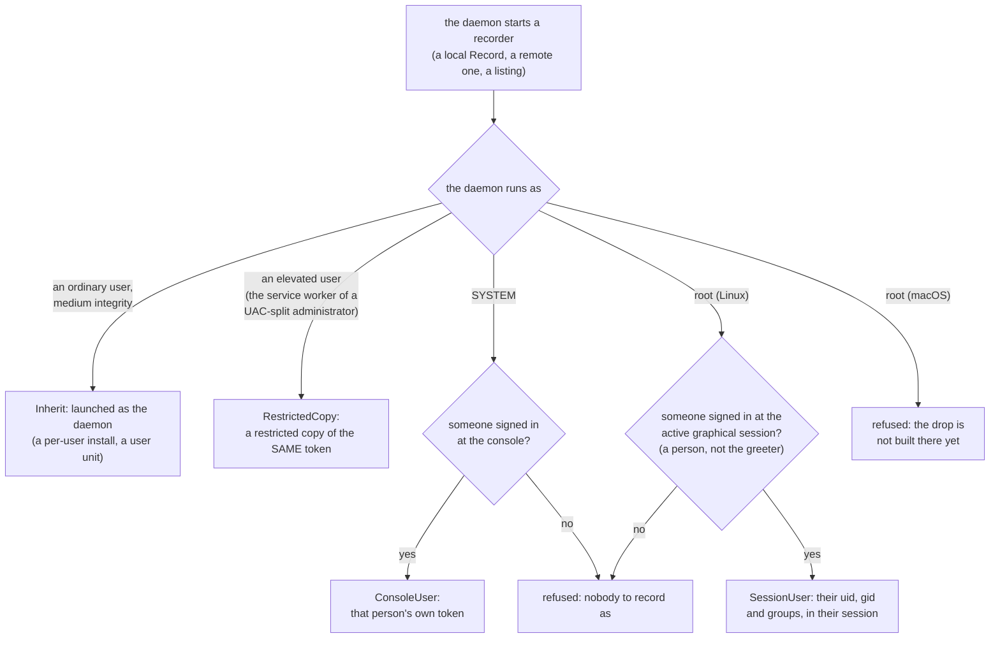

| The recorder's identity | How it is made | Its environment | Its desktop |
|---|---|---|---|
| **Inherit** | `tokio::process`, as before P1e | the daemon's | the daemon's |
| **RestrictedCopy** | `CreateRestrictedToken` from the daemon's OWN token: every admin-equivalent group deny-only, every privilege but traverse removed, then medium integrity, the owner and the default DACL made the user's | the daemon's (the same person) | the worker's |
| **ConsoleUser** | `WTSQueryUserToken` (the SSH console-user path) | the person's own (`CreateEnvironmentBlock`) | `winsta0\default` |
| **SessionUser** (Linux) | `exec::drop_to_std`, the one privilege drop the SSH and portal paths use: supplementary groups, then gid, then uid, verified | the session's: `XDG_RUNTIME_DIR`, the session bus, `DISPLAY` or `WAYLAND_DISPLAY`, the X cookie (`XAUTHORITY`, found as the window list finds it), `HOME`, `USER`, `LOGNAME` | their session's |

Both token launches use `CreateProcessAsUserW` with a **bounded handle list**
(stdin, stdout, stderr and nothing else), and the recorder's stderr is copied
into the daemon's log: a service has no stderr of its own to share.

- ⚠️ **A restricted copy, not the linked token.** An elevated
  administrator's token links to the filtered one, but without `SeTcb`
  (a worker has none) `TokenLinkedToken` hands back an identification-level
  token, which can be neither impersonated nor launched with. A token
  restricted from the process's own is its child, which `CreateProcessAsUserW`
  accepts without `SeAssignPrimaryTokenPrivilege`.
- ⚠️ **The daemon touches the folder as the recorder does.** Listing,
  deleting and opening a download (`RecordingManager::as_user`) run on a
  blocking thread that IMPERSONATES the same token. The folder is the
  person's to rearrange, and a junction or a hard link planted in it would
  otherwise be followed with SYSTEM's or the elevated token's rights — an
  elevated reader or deleter in a user-writable folder is exactly what the
  rule forbids. Impersonated, every open is checked against the person's own
  rights. A failed `RevertToSelf` aborts the process: a pool thread left
  wearing someone else's identity is worse than a restart.
- ⚠️ **On Linux, the same work by the thread's filesystem identity**
  (`launch::unix::FsIdentity`): the thread's fsuid, fsgid and supplementary
  groups become the person's, and Linux checks every open, create and unlink
  against those. The capabilities that let root skip the checks
  (`CAP_DAC_OVERRIDE`, `CAP_DAC_READ_SEARCH`, `CAP_FOWNER`, …) leave the
  thread's effective set while its fsuid is not 0 and come back with it. The
  groups change by the raw syscall, because glibc's `setgroups` changes every
  thread of the daemon; without them, root's group 0 would still read a
  `root:root 0640` file that a link in the folder pointed at. Every switch is
  verified, and a thread that cannot become the daemon again aborts the
  process, as on Windows.
- **Who is signed in, on Linux**: the active graphical session from
  `loginctl` (the walk the consent companion and the portal helper share),
  `Class=user` only, so a display manager's greeter at the login screen is
  nobody. uid 0 counts as nobody too: the recorder never runs as root. The
  answer is reused for 5 s, since the Recordings view polls every second
  while a recording runs.
- **The folder is decided by the recorder, as the recorder.** A SYSTEM
  daemon's own "Videos" is SYSTEM's, and its write probe passes where the
  person's would not. So the daemon asks `roomlerd record --where`, launched
  the same way, and reuses the answer for a minute (a recording's `started`
  refreshes it). `roomlerd record --whoami` prints what a recorder actually
  got: user, integrity, whether an admin group is enabled.
- **At the lock screen** a recorder running as the person cannot see the
  secure desktop. The recording holds its last frame, and a lock longer than
  about half a minute ends it `capture_failed` (`recorder.rs`, 300 failed
  pulls). It never records the lock screen itself.
- **Unattended (P1f): nobody signed in, a REMOTE recording only.** A SYSTEM
  or root daemon with no one at the screen records a remote session as
  ITSELF (`Identity::Unattended`), into its own folder: the machine-global
  `%PROGRAMDATA%` tree on Windows (a protected DACL of SYSTEM and
  Administrators, since `%PROGRAMDATA%` hands Users read and create), its
  own data dir elsewhere (0700). The lock is re-applied at every use, a link
  on the path is refused, and `record_dir` is never used: it is a person's
  setting, and a service writing into a folder a user can rearrange is what
  this rule forbids. A LOCAL recording still needs someone at the device.
  A list and a download search the person's folder (as the person) and the
  unattended one (as the daemon), so a recording made while nobody was
  signed in stays reachable after someone does. ⚠️ What an unattended
  recorder can SEE is a field question (P6): the harness's synthetic source
  is proven, and so is the path to the file. A Linux host with a virtual
  display should behave like any X session. A Windows service with nobody
  signed in sits at the logon desktop, which a recorder in the service's
  session may not be able to capture. That case ends `no_frame` or
  `capture_failed`, by name, never silently.
- Not yet: the drop on macOS (a root daemon there refuses). On a GNOME or
  KDE **Wayland** session a recorder launched into it opens its own
  ScreenCast portal session, so the portal may ask the person first (P0's
  restore-token question).

## 7. roomler-desktop — the Recordings view and the tray (P2b)

The companion's sixth view (`#/recordings`, `src/front/recordings.js`) and a
tray item. Both only ASK the daemon; every decision stays there (§6).

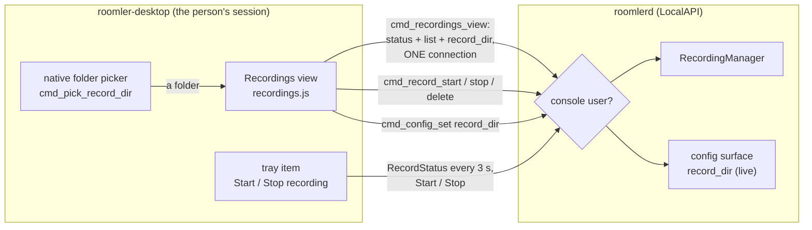

| Part | What it does |
|---|---|
| **Record this screen** | Start / Stop, the frame rate (30 or 60) and the encoder (automatic, GPU only, software only), a blinking REC chip with the running time, size, encoder and resolution. The options lock while a recording runs. How the last one ended is one sentence (`describeLast`); every closed stop reason and refusal code has words. |
| **Where recordings are saved** | The folder in use, whether it is the default or one the person chose, **Change folder…** (the native picker), **Use the default folder**, and **Open folder**. A fallback is named ("Not the usual folder: … is under OneDrive"). |
| **Saved recordings** | Newest first, from the sidecars: when, how long, size, by whom (this device, or a remote controller by name), how it ended on hover. **Play** (the OS's default player), **Edit** (P5c, §11; only where the service has the export engine), **Show** (selected in the file manager), **Delete** (two clicks, no modal: the first arms it for 4 s). |
| **Tray** | **Start recording** / **Stop recording (m:ss)**, and the tooltip `Roomler — recording m:ss`, following the recorder whoever started it. A refusal opens the Recordings view with the sentence. |

- **Start is greyed out, with the reason, wherever the service cannot record.**
  `RecordingState` carries `available` and `unavailable_reason` (additive,
  serde default `false`): false on a service built without the recorder, and
  where there is nobody to record as (P1e). The tray disables its item the same way,
  so neither offers a button that can only fail.
- **One LocalAPI connection per refresh** (`cmd_recordings_view` reads status,
  list and `record_dir` in turn), every second while a recording runs, every
  5 s otherwise, and only while the view is visible. A failed refresh keeps
  the last good data and says why (the FR-84 D1 rule). The rows are keyed and
  patched in place, so a button never moves under the cursor.
- ⚠️ **A daemon's answer on a `record_*` key is final.** `cmd_config_set`
  falls back to writing the config file itself when the daemon fails. For the
  recording keys it no longer does once the daemon has *answered*: the
  listener refuses anyone but the console user, and a direct write behind that
  refusal would report a success the daemon refused. (A daemon that is not
  running still falls back: that is the person editing their own file.)
- **Play / Show open a NAME, never a path from the page.** `cmd_recording_open`
  joins the daemon's own folder with a bare `*.mp4` name, and opens it only if
  it is a regular file. On Windows `/select,` needs the path quoted *inside*
  the argument, which standard argument quoting breaks, so it is passed raw.

## 8. The sidecar

`<recording>.roomler.json`, beside the file: who started it (`local`, or
`remote` with the controller's **user id**, because remote downloads are
owned by user and not by session id), start and end times, size and fps,
codec and the backend that encoded it, colour, audio sources, frames,
late ticks, events, the stop reason, bytes, and how the pointer got in
(`in_frame`, `drawn` or `none`, §1; absent from a sidecar written before P1d,
or rebuilt by the reconciler). ⚠️ **Never content**: no window titles, and
nothing typed.

## 9. Audio (P1c)

Computer audio and the microphone are both **OFF unless asked for**
(`--system-audio`, `--microphone`; the checkboxes in §7; `RecordStartOpts`).
The microphone is local-only: no remote path will ever set it (P3).

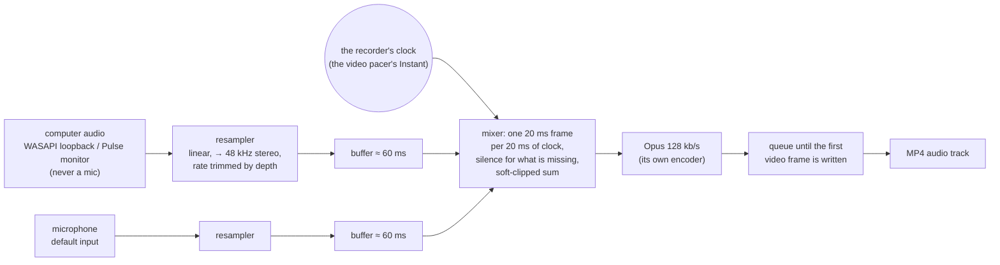

| Decision | Why |
|---|---|
| **The mixer PULLS on the recorder's clock** | WASAPI loopback delivers nothing while nothing plays, and every device clock drifts. A track timed by what the devices delivered would collapse during silence and walk away from the video. Pulling one frame per 20 ms of the video pacer's own `Instant` makes audio time video time by construction. |
| **It runs 60 ms behind** (`MIX_LAG`) | Devices hand over ~10 ms bursts. A mixer level with the clock would pad silence into every frame. |
| **Drift is corrected by RATE** | Each source's linear resampler is bent by at most ±0.5 % toward keeping its buffer at the lag. Padding alone would click: a device clock 0.1 % slow empties the buffer, and from then on every frame pads a sample. The hard trim (a buffer past 250 ms, cut back to 60 ms, newest kept) is only for backlogs such as the capture pre-roll at start. |
| **Linear, not nearest-neighbour** | A 44.1 kHz laptop microphone is common, and the live path's nearest-neighbour aliases audibly on speech. The live path keeps its own resampler, untouched. |
| **Audio waits for the first video frame** | The writer's audio decode time starts at the first packet pushed after its header. Encoded audio queues from the clock's start; when the first video frame is written, frames mostly before its time are dropped, so the tracks start within ±10 ms of each other. |
| **Soft clip, not wrap** | Two loud sources sum past full scale. Up to ¾ of full scale the sum is untouched; above it, a `tanh` knee compresses toward full scale, settling at it only far past it (never beyond, never wrapping). |
| **A source asked for and not opened refuses the start, by name** | `system_audio_unavailable` (no loopback or monitor: set `ROOMLERD_AUDIO_SOURCE`), `mic_unavailable` (none, or on Windows the "Let desktop apps access your microphone" switch), `audio_unavailable` (a build without the `audio` feature; macOS today). A recording that silently lacked the audio the person asked for would be worse. |
| **A source lost mid-recording is not fatal** | The recording goes on with that source's silence. The sidecar records `audio_source_lost`, or `audio_failed` if the encoder failed and the rest is video-only. |

⚠️ **Computer audio never falls back to a microphone.** The live
remote-control path, on a Linux host without a PulseAudio monitor, falls back
to the default INPUT device. The recorder opens
`cpal_backend::Source::SystemOnly`, which refuses instead
(`system_audio_unavailable`).

⚠️ **Not yet on macOS.** Computer audio there needs ScreenCaptureKit (macOS 13+;
the bundle targets 12). The microphone needs cpal on macOS, plus
`NSMicrophoneUsageDescription` and the `audio-input` entitlement in the
bundle. Both are refused by name until then.

## 10. Remote recording (P3)

A controller in the browser records the screen it controls. P3a built the
server's gates, P3b the device side, P3b-2 the download and P3c the viewer.
The file stays **on the device**, and the controller downloads it on demand
over the session's own P2P channel. The
server never holds a byte of it (`RemoteSession.recording_url` stays `None`). It
decides who may ask, and it keeps the device's account of what happened.

### The server's gates (P3a)

The session bit is `Permissions::RECORD`. Before P3a nothing read it, and the
hub passed through every bit a tab asked for except INPUT, so any tab could ask
for RECORD. Now the bit survives only when both gates below say yes, and every
refusal is named.

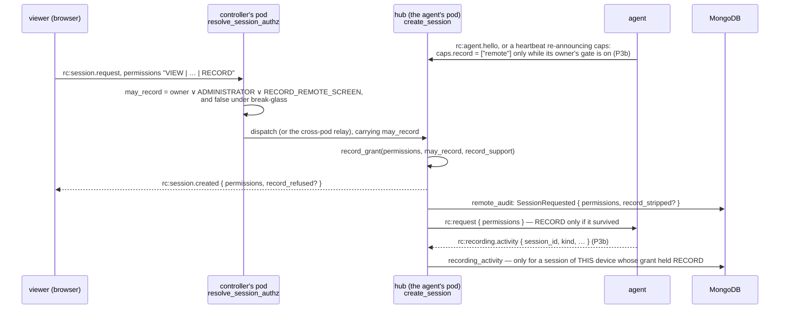

| Gate | Where | Refusal |
|---|---|---|
| **0. The device has a recorder at all** (P3c-2): its caps advertise `AgentCaps.record` ∋ `available` (or `remote`). Nothing is advertised by an agent that predates recording, a build without it, one switched off with `ROOMLERD_RECORDING=0`, or a host that cannot record a remote session. Named FIRST, whoever asks: there is nothing on the device to allow or refuse, and the viewer shows no Record control | `RecordSupport::from_caps`, `record_grant` (`crates/modules/fleet/src/hub.rs`) | `device_cannot_record` |
| **1. The controller may record**: the device's owner, an `ADMINISTRATOR`, or a holder of the role bit `RECORD_REMOTE_SCREEN` (bit 31). The bit is in no managed role below `ADMINISTRATOR` ([permissions.md](permissions.md) §2) | `resolve_session_authz` → `SessionAuthz.may_record` (`crates/modules/remote/src/controller.rs`); `relay_rc_frame` carries it to the agent's pod | `controller_not_allowed` |
| ⚠️ **Never under break-glass.** An `ADMINISTRATOR` with an `override_reason` skips the host's consent, so a recording made that way would be covert ([remote-control.md](remote-control.md) §11.4) | the same function: its break-glass branch sets `may_record: false` | `controller_not_allowed` |
| **2. The device serves it**: its caps advertise `AgentCaps.record` ∋ `remote`. An agent does that only while its owner's `record_remote_enabled` is on (P3b). The hub keeps it per connection (`ConnectedAgent.record_support`: none, not opted in, serves), set from the hello and refreshed from any heartbeat that re-announces caps (FR-43 P2c), so an owner's ON or OFF reaches the hub within one heartbeat, without a reconnect. It never reads it from the stored row, which outlives both an owner's OFF and a rollback | `record_grant` (`crates/modules/fleet/src/hub.rs`), applied after the INPUT rule | `device_not_opted_in` |

Everything downstream reads the **effective** grant: `SessionCreated.permissions`
(the viewer), `Request.permissions` (the agent) and the `remote_sessions` row.
The reason travels in `SessionCreated.record_refused` and in the audit's
`SessionRequested.record_stripped`, so a strip is never silent. When gates 1
and 2 both fail, `controller_not_allowed` is the one named; gate 0 comes before
either. Both fields are additive and
absent when nothing was refused. ⚠️ A duplicate request on the same connection
coalesces onto the live session (#1045) and is answered with that session's
grant, so the session keeps its reason and the duplicate's answer repeats it.
Without that, a viewer's retry would read "RECORD was never asked for".

⚠️ **`remote` is a prefix of `remote-audio`** (the device also allows computer
audio in a remote recording). Matching is equality (`AgentCaps::has_record`),
locked by `remote_recording_does_not_imply_remote_audio`. It is the same lesson
as `ssh` and `ssh-consent`. A word this server does not know is ignored, never
an error. The microphone is not a remote option at all.

An agent older than P3b never advertises `record`, so every request for RECORD
to it is stripped, since P3c-2 with `device_cannot_record`. ⚠️ Before P3c-2
that was `device_not_opted_in`: with no agent in the fleet able to record,
every connected session would have shown a disabled Record control telling
its controller that the device's owner had not allowed something the device
could not do. `available` exists to tell the two apart. It says the device
HAS a recorder and grants nothing: RECORD still needs `remote`. An agent built
before `available` existed and advertising `remote` still reads as serving.

### The device's half (P3b)

The owner switches it on in roomler-desktop's Recordings view ("Allow remote
recording", and separately "Include computer audio"), or with
`roomler config set record_remote_enabled true`. Both keys are device-only: the
console gate accepts them only from the person at the device, and
`DesiredConfig` cannot carry them. Both are live. The agent re-announces its caps
on the next heartbeat, so the hub follows within one beat, and an OFF also stops
a remote recording in progress (`gate_revoked`). The agent advertises
`available` whenever a recorder can serve a remote session in its process
(P3c-2), `remote` only while the switch is on as well, and `remote-audio` only
on top of that with the audio switch on and an audio build. A process that
cannot record advertises nothing.

A controller holding RECORD opens a `record` DataChannel on the session
(`recording/remote.rs`). On a session whose grant lacks RECORD the channel
answers every request with `not_granted`, the same attach-time gate as `files`
and `input` (`peer.rs`).

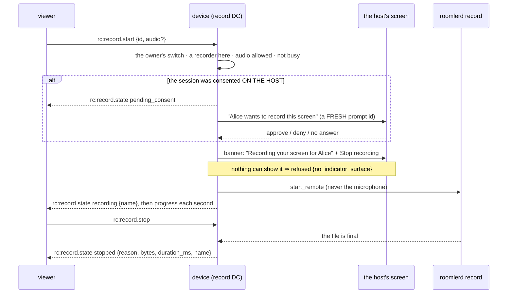

| Refusal | Why |
|---|---|
| `not_granted` | the session's grant lacks RECORD |
| `disabled_on_device` | the owner's switch is off, read at the moment of asking and again after the prompt |
| `unavailable` | there is nobody to record as (SYSTEM with nobody signed in; a root daemon, P1e), or the session is delegated to the macOS GUI worker |
| `audio_not_allowed` | computer audio was asked for and the owner has not allowed it, or the build has no audio |
| `busy` | a recording is already running, local or remote |
| `already_starting` | this session is already starting one |
| `consent_denied` | the host said no. The same session is then refused `rate_limited` for 60 s |
| `consent_timeout` / `no_prompt_surface` | nobody answered / nobody could be asked |
| `no_indicator_surface` | nothing on this device could show that it is being recorded |
| `start_failed` | the recorder refused or failed; `detail` says which |

A recording ends `requested` (the controller's Stop), `host_stopped` (the host's
Stop: the banner, the tray, the Recordings view, `roomler record stop`),
`gate_revoked`, `session_ended` (its session dropped and nobody came back
within the re-attach grace, P3b-3 below), or with the recorder's own reasons
(`disk_low`, `max_duration`, …). The device reports every outcome as
`rc:recording.activity`.

⚠️ **A fresh prompt id, never the session's.** The session already has an
answered prompt. A decision recorded against its id, or anything derived from
it, must not be able to answer this one: the `ssh` / `ssh-consent` lesson.

⚠️ **Something on screen says "recording" before the first frame.** On Windows
the daemon's own badge is pinned open while recording and reads "Recording,
viewed by …". It is capture-excluded, so it is not in the recording. Everywhere
else the companion's banner reads "Recording your screen for …" and has a
**Stop recording** button that keeps the session. On X11 and macOS that banner
is not capture-excluded and appears in the recording. With no surface at all the
start is refused.

⚠️ **The unattended exception (P1f).** A service with nobody signed in has
nobody to show a banner to, so there the indicator is skipped: the owner's
`record_remote_enabled` is what allows it, and the controller is told
(`unattended: true` on the `recording` state). Someone who signs in is never
recorded without a banner:
- the identity is decided ONCE, before the indicator is skipped;
- the manager refuses the launch when it no longer holds (`start_failed`, "who
  is signed in at the device changed");
- a recording already running stops `session_changed` the moment someone signs
  in (checked every second).

⚠️ All three ask the system who is signed in FRESH. Linux caches that answer
for 5 s for the status polls, and a cached "nobody" read twice within
milliseconds is one observation: review found the launch re-check a no-op on
the cache, before the check was made fresh.
- A host at its **login screen** (a display manager's greeter) counts as
  nobody, the same answer consent gives; whether recording should treat a
  greeter as attended is an open decision in the spec.
- A Windows host whose only user is on **RDP** also counts as nobody at the
  console. Its session-0 recorder cannot capture that desktop, so it ends
  `no_frame`.

⚠️ **An older companion.** A companion that predates `record` renders an
unknown prompt kind as a remote-control request. So a record prompt carries the
whole question in its detail line, the one field every companion shows as it
is.

### A dropped session, and coming back to it (P3b-3)

The reconnect ladder mints a new session id on every drop, so a relay flap or a
reloaded viewer used to cost the recording (`session_ended` at once). Now the
recording **outlives its session for the re-attach grace**
(`manager::REATTACH_GRACE`, 60 s) and waits for its controller.

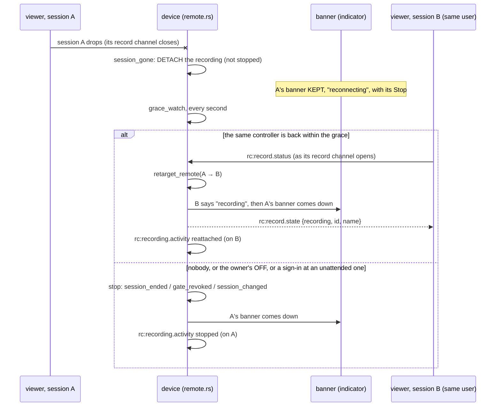

- ⚠️ **A recording is never unseen.** The signalling loop hides a session from
  the banner the moment it ends, but the indicator keeps the entry of a session
  that is RECORDING (`ViewerIndicator::hide_session`), marked `reconnecting`,
  until the recording ends or moves (`end_recording`). The companion's banner
  then reads "reconnecting", keeps **Stop recording**, and drops **Disconnect**
  when no session is left to disconnect.
- ⚠️ **Only the same controller.** The recording is picked up by the same USER
  on a new session holding RECORD (the channel exists only then), when its
  `record` channel asks for the status. Another controller of the device is
  told nothing is recording, and the recording goes on waiting.
- ⚠️ **The grace still watches.** The owner's OFF stops it `gate_revoked`, and
  an unattended recording still stops `session_changed` the moment someone
  signs in: P1f's watch runs in the grace as well as in the follower.
- ⚠️ **A session's end is the signalling loop's word first.** The loop knows
  every end and says so (`remote::session_ended`): the server's terminate
  (which also echoes the device's own, from its watchdog) and the control
  connection lost. It says so BEFORE closing the peer, because that close has
  a 5 s budget, and one that overruns it is dropped before it reaches the
  `record` channel, which then stays `Open` for good. Before this, such a
  recording never detached, and its controller's next session was told
  "idle" while the device went on recording (found by review).
- ⚠️ **And from the channel's STATE, not only from its callback.** A close
  from the FAR end always reaches `Closed` and fires `on_close`. A channel
  closed from the device's own side is set `Closing`, and whether it then
  reaches `Closed` and fires `on_close` is a race inside webrtc-rs's read
  loop. In the tests, most such drops (8 of 13) stayed `Closing` for good.
  Every network drop is that case: nothing arrives from the controller, and
  the device's session watchdog closes the peer itself. So `end_session` runs
  once, from whichever comes first: the loop, `on_close`, or a look at the
  channel every 500 ms (`channel_gone`, which is `Closing` or `Closed`). The
  follower, the download pump and the controller's next session use the same
  test. Found by the Linux lane, where the cells closed the controller's peer
  first. On every Windows run its reset reached the device first; on Linux it
  did not. The cells now drop the way a network does, with the device's peer
  closing first.
- ⚠️⚠️ **The host's Disconnect is not a drop** (`remote::host_ended`, from the
  loop's kill arm: the banner's Disconnect and the badge's). The person at
  the device sent the controller away, so the recording stops then and
  there, `host_stopped`, and waits for nobody. Detaching it, as a drop is,
  kept recording someone who had just ended the session, and a controller
  whose device auto-grants would have reconnected straight back into it
  (found by review).
- ⚠️ **A deliberate Disconnect in the viewer stops the recording first**
  (`stopBeforeLeaving`, then the terminate). The device cannot tell a
  hang-up from the reconnect ladder's retry (both are `controller_hangup`),
  and a retry is exactly what the grace keeps a recording running for.
  Leaving the page sends the Stop without waiting; a Stop lost with the
  channel is covered by the grace.
- ⚠️ **The grace acts on ITS recording only** (`Slot`, by session; the
  recording by its file). By the time it looks again, its recording may
  have ended by itself and another begun; "whatever is recording" would be
  that other one, which it would stop `session_ended` and report as its own.
  A new detach over another session's recording, over but not yet looked at,
  finishes that one (its report, its banner) rather than orphan it.
- ⚠️ **The grace claims a recording before stopping it.** While its file
  finalizes, the controller's next session can neither pick it up nor
  detach it again; both would report its ending a second time.
- **One speaker per recording** (`Speakers`, keyed by its file): the
  follower that last claimed it, or the grace while it waits. A pick-up
  claims it before anything awaits, which silences the dropped session's
  follower; a NEW recording's claim does not silence the follower of the one
  before, which still reports its ending. A stop a session asked for itself
  (the controller's Stop, the owner's OFF, the host's Disconnect) is not
  detached if the session ends while the file finalizes: that session's
  follower reports it.
- **A re-offer on the same session** (its old peer replaced; the session
  goes on) is picked up like any other, but the banner is left alone: "the
  old banner" is this one.
- **Known limit:** a detached recording reports its ending on the queue of
  the connection its session lived on. If the control connection itself was
  lost (a pod roll) and nobody picks the recording up, that last report has
  nowhere to go, and the server keeps `started` with no ending.
- The viewer shows **REC · reconnecting** meanwhile. It adopts the recording's
  id from the device's answer, so a reloaded page can stop a recording it did
  not start. If it comes back to find nothing recording, it says the recording
  ended while it was away.

### Downloading a remote recording (P3b-2)

The recording stays on the device. A controller fetches it over the same
`record` channel, so the bytes go peer to peer (or through a relay that sees
only ciphertext), never through the server.

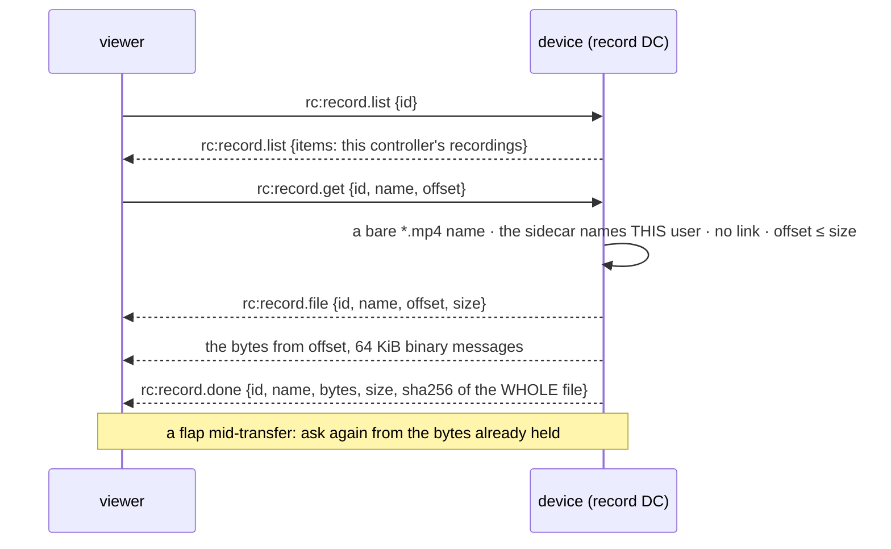

| Rule | Why |
|---|---|
| **Ownership is by USER**: the sidecar's `Initiator::Remote.controller_user_id` must be this session's controller | the reconnect ladder mints new session ids, and a controller whose connection flapped must still reach their file |
| **Someone else's recording reads as `not_found`**, exactly like no recording | a controller learns nothing about files that are not theirs, including that they exist |
| **A bare `*.mp4` name** (no separator, no `..`), opened **without following a link**, and a regular file once open | the name comes from another machine; a link at that name must not serve a file outside the folder |
| **Resumable by offset, with no size cap** | a relay flap must not restart a 3 GB transfer from zero |
| **`sha256` is of the whole file** | a resumed transfer is checked end to end like any other; the prefix the controller already had is hashed from disk, not sent |
| **One transfer at a time per session**; `rc:record.cancel` abandons it, and so does the session ending | |
| **The files channel's pacing**: 64 KiB chunks, paused while more than 4 MiB is queued on the channel | a multi-GB file must not become a multi-GB queue |

Each finished transfer is reported as `rc:recording.activity` `downloaded`, with
its bytes. The refusals are `bad_name`, `not_found`, `bad_offset`,
`transfer_in_progress`, `unavailable`, `read_failed`, `send_failed`,
`cancelled` and `session_ended`, each on `rc:record.error {id, reason, detail}`.

### The viewer (P3c)

The viewer always asks for `RECORD` (`useRemoteControl.ts`, the default
request). The server strips it, with a reason, unless this controller may
record and the device's owner opted in. So asking costs nothing, and the answer
is what the toolbar shows:

| The grant | The toolbar |
|---|---|
| holds `RECORD` | a **Record** button, and the `record` channel opened |
| stripped, `record_refused` `controller_not_allowed` or `device_not_opted_in` (or a reason this build does not know) | a disabled Record control whose tooltip says why, never a button that can only fail |
| stripped, `record_refused` `device_cannot_record` (P3c-2) | nothing: the device has no recorder, so there is nothing to allow or refuse (`showsRecordRefusal`) |
| a server older than P3a (no grant sent) | nothing: absent means no, never assumed |

⚠️ **The `record` channel is opened when the grant arrives, never beside
`files`** (`openRecordChannel`, called from `rc:session.created`). The other
channels are made in `connect()` before the session request goes out, when no
grant has been seen: a gate there is always closed, and the Record button
would show over a channel that never existed. That was P3c's first cut, caught
before merge. The offer is built on `rc:ready`, which follows the create, so a
channel opened then is still in it.

`useRemoteRecording.ts` speaks the channel. It is channel-agnostic, and its
save sink can be injected, so its unit tests drive the real protocol code
without a PeerConnection or a save dialog.

- **Record**: start, with "Include what the computer plays" as a separate,
  unticked box. The microphone is not offered: the device never takes it
  remotely. While the host is asked, it reads "Waiting for the person at the
  device to allow it". While recording, a red **REC m:ss** chip stays on the
  toolbar with **Stop**. Every refusal and every ending is one sentence
  (`RECORD_REASONS`); a code from a newer device reads as itself.
- **Your recordings on this device**: the device's list (`rc:record.list`),
  refreshed when the menu opens and after each recording.
- **Download**: into a file the person picks (`showSaveFilePicker`, Chromium)
  or, elsewhere, into memory up to 2 GiB. Chunks are written in order, and a
  file that arrives short is an error, never a quiet success. The in-memory
  path hashes the file and keeps it only when the SHA-256 matches the
  device's. The streamed path cannot hash (WebCrypto has no incremental
  digest), so it shows the device's SHA-256 for the person to compare.
- **Resume**: when the session drops mid-transfer, the download pauses. When
  the reconnect ladder's next session opens its `record` channel, it asks for
  the rest from the bytes already held.

- **Coming back** (P3b-3): when the session drops mid-recording, the toolbar
  reads **REC · reconnecting**. The next session's `record` channel asks for
  the status and picks the recording up (see "A dropped session" above).
- **Leaving** (P3b-3): **Disconnect** stops a running recording first and
  waits for the device's answer (at most 3 s), because to the device a
  hang-up looks like a drop. Leaving the page sends the Stop without waiting.

### Decision and claim, like SSH

| Collection | Written by | What it is |
|---|---|---|
| `remote_audit` | the server | Its **decision**: the grant, with `record_stripped` when RECORD was asked for and refused. Authoritative. |
| `recording_activity` | the device, through `rc:recording.activity` | Its **claims**: a prompt granted, denied or timed out; a recording started, stopped or refused; a download. Each carries a file name, bytes, duration and reason, with text clipped to 256 characters. Never content. 90-day TTL. |

A claim is kept only for a session **of the sending device** whose effective
grant held `RECORD`. The server checks the live session in the hub, or its
stored `remote_sessions` row once it has ended, because a stop can arrive after
the session. Anything else is dropped and logged. So a device cannot write about
another device's session, and it cannot invent recording activity for a session
that was never allowed to record. It is still a claim by a host that may be
compromised: join it on `session_id` with `remote_audit` for the decision.

`GET /api/tenant/{tenant_id}/recording-activity/{agent_id}` reads it, newest
first and paginated. It is gated by `VIEW_REMOTE_AUDIT`, like the session
audit. The device is resolved within the tenant, so a foreign id gets a 404.

## 11. The editor (P5)

Editing is **non-destructive**. An edit list is saved beside its recording
(`<name>.mp4.edit.json`, the sidecar's naming), the recording is never
written, and an export is a new file beside it: `<name> (edited).mp4`, then
`(edited 2)`, `(edited 3)` … — an export never replaces anything.

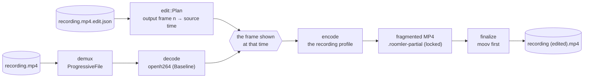

**The edit list** (`recording/edit.rs`):

| Field | Meaning |
|---|---|
| `version` | `1`; any other is refused by name |
| `source` | the recording's file name, bare, in the list's own folder |
| `segments[]` | `{start_ms, end_ms, action}`, contiguous from 0: `keep`, `cut`, or `speed` with `"speed": 1.25 … 16` in quarter steps. Whatever follows the last segment is kept, so "cut the first ten seconds" is one segment; segments past the recording's end are clipped |
| `original_volume` | P5b: the recording's own audio, 0 to 1; absent = as recorded |
| `music` | P5b: `{path, volume (0–1, default 0.5), start_ms, fade_in_ms, fade_out_ms, loop (default true)}`. `path` is absolute or relative to the list's folder; the export runs as the person, so it reaches only what they can read |

- ⚠️ **The time map is exact integer arithmetic** on the 90 kHz clock.
  Output frame `n` shows the source frame presented at `Plan::source_time(n)`;
  a k× speed-up shows every k-th frame with no drift (over an hour at 1.5×, the
  last frame is exactly the one integer arithmetic says). A float map slips a
  frame here and there, which the oracle reads as the wrong frame.
- ⚠️ **openh264 decodes only Constrained Baseline**, which is what the
  software encoder writes. A hardware encoder's recording (High profile) is
  refused `decoder_unavailable`, by name and before a frame is decoded, until
  FR-85 P4 vendors FFmpeg's H.264 decoder. Never a garbled export.
- **It decodes forward**, jumping to the keyframe before the next frame it
  needs when that keyframe lies ahead: a cut costs at most one GOP (2 s) of
  decoding. A speed-up still decodes every frame it passes over (H.264 needs
  them all since the last keyframe); only the frames it shows are converted and
  encoded.
- ⚠️ **The list names its recording, bare, in its own folder.** A `source`
  with a separator or `..` is refused before anything is read. Without the
  check, `../elsewhere.mp4` reached the filesystem (the control that proved
  it).
- The export's partial holds the same liveness lock as a recording's, so a
  recorder starting beside a running export never reconciles it. A failed or
  cancelled export leaves nothing behind.

**`roomlerd media`** is the engine as a process of its own, launched by
roomler-desktop **as the person** (never by the daemon), speaking the
recorder's JSON-line protocol:

| Command | Answers |
|---|---|
| `media probe <file>` | one `probe`: `duration_ms`, `width`, `height`, `frames`, `profile`, `audio`, `editable`, and the reason when it is not |
| `media export --edl <file> [--encoder auto\|hardware\|software]` | `started`, `progress {frames, total}`, then `done {path, frames, duration_ms, bytes, encoder, audio}` or `refused {code, detail}`: `bad_edit_list`, `source_unreadable`, `decoder_unavailable`, `encoder_unavailable`, `decode_failed`, `write_failed`, `music_unreadable`, `audio_unavailable`, `cancelled` |

`{"cmd":"cancel"}` on stdin stops an export. End of stdin does not: a
finished file is harmless, and an export started with stdin closed must run.

### The export's sound (P5b)

`recording/export_audio.rs` makes one Opus track at the recorder's profile
(48 kHz stereo, 20 ms frames), produced in step with the video so the file
interleaves as a recording does.

| Part of the export | The recording's audio | The music |
|---|---|---|
| a kept stretch | plays from the same moment, times `original_volume` | plays |
| a speed-up | ⚠️ **muted** | plays |
| a cut | gone, with the picture | — (it follows the export, not the recording) |
| before `start_ms` | as above | silent |
| the first `fade_in_ms` of the music, the last `fade_out_ms` of the export | as above | ramps linearly |

- **Sped-up sound is muted on purpose.** Played faster it is noise, and a
  recording's audio is mostly speech. The music plays on under it.
- **The music is decoded by symphonia**: pure Rust, because a file the person
  picks is untrusted input. MP3, AAC/M4A, FLAC, Ogg Vorbis and WAV are read.
  It is streamed, never held whole, and resampled by the recorder's own
  resampler. A short piece loops by default; one under 100 ms plays once,
  since looping a few samples would reopen the file thousands of times per
  second of export.
- ⚠️ **A malformed music file is refused `music_unreadable`, never a crash.**
  A fuzz pass over 1,800 malformed files found one that crashes symphonia
  0.5.5: a WAV declaring 0 Hz panics its probe. So every call into it is
  guarded, and a rate outside 1–768 kHz is refused (symphonia accepts 1 Hz,
  and at 1 Hz every packet would grow 48 000-fold on its way to 48 kHz). The
  rate is checked at open when the header declares one and again on every
  decoded buffer; the second check is the gate, since a container can
  declare one rate and its codec produce another.
- Both are summed through the recorder's soft clip, so music under loud speech
  bends instead of wrapping into a crack.
- The `done` event says what the file's sound is: `none`, `original`, `music`,
  `original_and_music`, or `not_carried` (the recording had audio and this
  build has no audio encoder). A caller never presents a silent file as the
  whole export. An unreadable music file is refused `music_unreadable`, and
  music on a build without audio `audio_unavailable`.

### The Edit view (P5c)

roomler-desktop's editor. **Edit** on a saved recording's row puts that one
recording in place of the list (`src/front/editor.js`, with its commands in
`src/editor.rs`). The button shows only where this device's service has the
engine: `cmd_media_available` runs `roomlerd media --help` once.

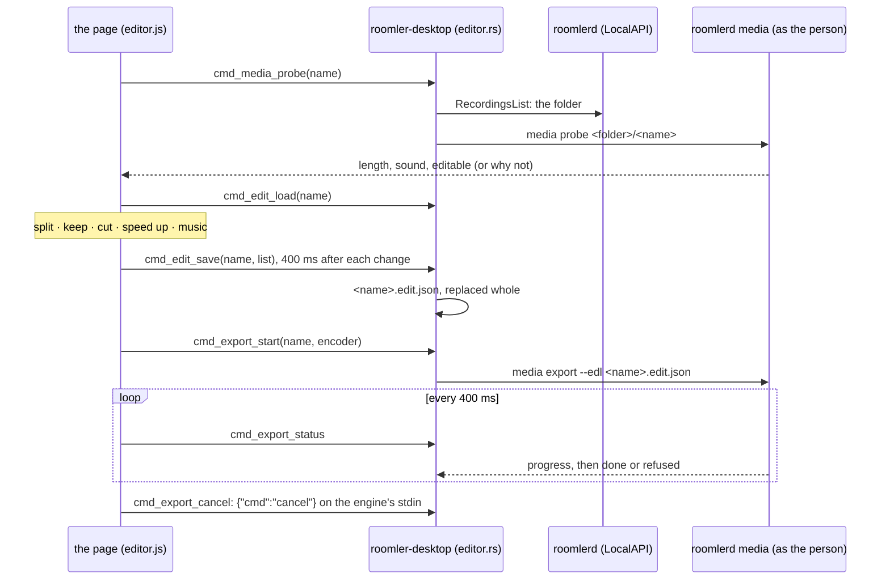

| Part | What it does |
|---|---|
| **Preview and timeline** | The recording plays in the view. Below it the pieces lie on its timeline, each as wide as its share; a click selects a piece and moves the playhead there. **Split at the playhead** makes two (never one shorter than 200 ms). **Keep**, **Cut** and **Speed up** (1.5×, 2×, 4×, 8×, 16×) act on the selected piece. The summary says how long the export will be. |
| **Sound** | The recording's own sound (0–100 %, greyed out when it has none), muted under a speed-up; **Add music…** through the native picker (MP3, M4A/AAC, FLAC, Ogg, WAV), with its volume, start, fade in, fade out and loop. |
| **Export** | The encoder, **Export**, a progress bar and **Cancel export**; then the new file's name, length, size and what its sound is, with **Play** and **Show in folder**. Every refusal code has words; one this page does not know reads as itself. |

- **Every change is saved** beside the recording as `<name>.mp4.edit.json`,
  the name roomlerd looks for, 400 ms after the last one, and reopening the
  recording restores it. A saved list that does not fit (another version, a
  gap, a bad speed) starts over from the whole recording and says so. The
  file is replaced whole: a crash mid-write leaves the previous list.
- ⚠️ **An export waits for the last save.** The engine reads the list from
  disk, so an Export clicked inside the 400 ms would otherwise export the
  edit as it was one click earlier.
- **Splits stay the person's.** Keeping, cutting or speeding up a piece never
  merges its neighbours, even when they end up doing the same thing: the
  split was made to be used.
- **The page never names a path.** Every file is the daemon's folder joined
  with a checked bare name, the rule Play and Show follow. The music file is
  the one exception: it comes from the native dialog, and the engine reads it
  as the person.
- **The engine runs as the person**, launched by the companion, never by the
  daemon, one export at a time. A run that ends without `done` or `refused`
  (a crash, a kill) is reported `engine_failed` with the end of its stderr,
  never left behind a bar that stopped moving. Closing the companion does
  not cancel an export: a finished file is harmless.
- **The preview is the asset protocol, one file at a time.** Its scope starts
  empty (`tauri.conf.json`); `cmd_preview_src` allows exactly the recording
  being edited, and the CSP takes media only from there. A cut is skipped and
  a speed-up plays at its rate, muted, as the export will. Where the webview
  cannot play the recording, the view says so, and the timeline and the
  export still work. Leaving the view, or closing the window to the tray,
  pauses it.
- Deleting a recording deletes its edit list too. An export beside it is a
  recording of its own and stays.

Not yet: FFmpeg's decoder for hardware recordings, and AAC for the sound
(P4); a thumbnail strip where the webview cannot play a recording; hearing
the music in the preview.

## 12. Tests

| Where | What | CI |
|---|---|---|
| `recording::*` unit tests | Annex-B split and parameter sets; the fragmented writer (keyframe cuts, refusals, never overwriting); remux sample order with `moov` first; truncated recovery; audio interleave; the pacer's tick math and FIFO; folder probe, validation, names, OneDrive/UNC; sidecar round trip; the manager's event folding, delete-name rules and listing; the identity rule as a table | `ci.yml` "Test the recorder (FR-85)" (`--lib recording::`) |
| `recording::launch` unit tests, Windows (P1e) | every argument comes back whole through Windows's own parser (`CommandLineToArgvW`): a display name full of quotes, backslashes and `--out` stays ONE argument; an added variable replaces its namesake whatever its case; **work done as the recorder gets only the recorder's rights**: an elevated run writes into an Administrators-only folder, and the same write made through `as_identity(RestrictedCopy)` is refused, then the thread is itself again (red without the impersonation) | `ci.yml` "Windows recorder identity (FR-85)", elevated on purpose (`ROOMLERD_TEST_REQUIRE_ELEVATED` fails a runner that is not) |
| `recording::launch` unit tests, Linux as root (P1e-unix) | work done as the person gets only the person's rights: a folder only root may write is refused, a `root:root 0640` file only root's group may read is refused, and afterwards the thread is root again; the launch runs as the person with none of root's groups (`id` says so); root is never the account a session resolves to. Red, each on its own cell: the fsuid left alone, the groups left alone (root's group 0 reads the file), the restore skipped, the drop skipped. The decision table gains the Linux rows (as the person; refused with nobody, or only a greeter, at the screen; a user unit unchanged), and the refusal names root, not SYSTEM | `ci.yml` "Linux recorder identity (FR-85)": the lib test binary built as the runner and run under `sudo`; `ROOMLERD_TEST_REQUIRE_ROOT` fails a run that is not root instead of passing by skipping |
| `recording::launch` and `recording::folder` unit tests (P1f) | Windows, elevated: a folder locked by `lock_to_service_accounts` takes the service side's write and refuses one made as the restricted copy (the person), red without the lock, since the user's own ACE on a temp folder lets the copy in. Unix: the unattended folder is made at 0700, tightened again after someone loosened it, and never made through a link on its path | Windows: "Windows recorder identity (FR-85)"; unix: "Test the recorder (FR-85)" |
| `tests/recorder.rs`, Windows (P1e) | the recorder an elevated daemon launches reports (`record --whoami`) the same user at MEDIUM integrity with the admin group deny-only; red with the integrity left alone, red with no group made deny-only; the positive control, launched as the daemon itself, IS elevated. A whole recording through the rule: the folder asked of the recorder (`record --where`), start, stop, and the list and delete done as it | the same Windows job |
| `tests/recorder.rs`, the kill switch | `ROOMLERD_RECORDING=0` closes every path and says so: the state a client greys Start out with, a start, `available` (so the device stops advertising `record`), the listing and the folder a download is served from; the control, the same manager without the switch, can record. `launch::switched_off` reads only an explicit off (`0`, `false`, `off`, `no`), never a typo | "Test the recorder (FR-85)", `--test recorder` and `--lib recording::` |
| `tests/recorder.rs` | A counter-pattern capture → openh264 recording encoder → MP4 → openh264 decode, reading the counters back (the oracle is proven to discriminate first); display change; disk-low and no-frame refusals; the real `roomlerd record` process: the stop command, stdin EOF, `kill -9` followed by `reconcile_partials`, a **live** partial left alone (red with the lock disabled); and the manager end to end (start into `record_dir`, a second start refused, stop, list, delete), a missed start deadline killing the child (red without the kill), and the refusal where there is nobody to record as | same step, `--test recorder` |
| `recording::pointer` unit tests (P1d) | the pointer lands where the source says and nowhere else; a translucent pixel blends (premultiplied "over"), a transparent one changes nothing, a malformed one saturates; moving it leaves no trail (byte-equal to drawing it once at the new place); hiding it gives the frame back byte for byte; clipped at every edge and never wrapped, wholly outside draws nothing; row padding respected; an unchanged pointer re-uses the same frame; **the frame the encoder still holds is never written** (red when the canvas is written without `make_mut`); a new capture is not patched with the old one's pixels (red when `replace` keeps them), and gets the pointer even when it did not move; a frame that is not BGRA passes untouched; a scaled frame takes the position through the ratio; one poll per frame | "Test the recorder (FR-85)" (`--lib recording::`) |
| `capture::pointer` unit tests (P1d) | Windows' straight alpha premultiplied, XFixes' words read as B, G, R, A; a short or absurd image refused, never read past; the hotspot and the display's origin both taken off, a monitor left of the primary included. Windows only: a recording's WGC session draws the pointer, the live one only under `ROOMLERD_WGC_CURSOR=1` | every unfiltered `--lib` run ("Test agent under vp9-444"); the WGC cell in "Windows recorder identity (FR-85)", which also compiles and lints the Windows capture code (WGC, DXGI, the cursor tracker) that no other lane builds |
| `capture::pointer::x11_tests` (P1d) | against a real X server: the pointer warped to a known place reads back there less its hotspot, and less a monitor's origin; it follows a second warp; an unchanged shape is not rebuilt | `ci.yml` "The recorder's pointer on X11 (FR-85 P1d)", under Xvfb. `ROOMLERD_TEST_X11=1` makes a missing server a failure, never a skip |
| `tests/recorder.rs`, the pointer (P1d) | a "backend" that cannot draw the pointer hands the recorder a source: a 32×32 white square at A for the first half of the recording, at B after, and the screen goes **still** well before it moves. Decoded back, the first frame has it at A and nowhere else, it reaches B over the still screen, no frame has both (no trail), and once at B it stays there; the sidecar says `drawn`. The plain counter recording's sidecar says `none`. Red with the layer bypassed, and with the covered pixels never put back. ⚠️ Over a CHANGING screen the put-back cell stayed green (every tick brought a fresh capture that hid the trail), which is why the screen goes still | "Test the recorder (FR-85)", `--test recorder` |
| `recording::edit` unit tests (P5a) | the keep / cut / 4× / keep list maps every output frame to exactly the frame the oracle expects; keeping everything is the identity (the control); an hour at 1.5× lands on the frame integer arithmetic says, no drift; what follows the last segment is kept and a long list is clipped; a bad list is refused by name (version, no segments, not from 0, a gap, an empty segment, nothing kept); speeds are 1.25–16 in quarter steps (NaN, infinity, 1×, 17× refused); the file reads as written | "Test the recorder (FR-85)" (`--lib recording::`) |
| `tests/export.rs` (P5a) | a recording whose every frame paints its own index, exported keep 0–2 s · cut 2–4 s · 4× 4–8 s · keep 8–10 s, decodes to exactly `0..59, 120, 124 … 236, 240..299` (150 frames, 5 s, moov first, the recording byte-identical); the same comparison against the unedited source fails (the oracle discriminates); keeping everything reproduces the recording frame for frame; a cancelled export and one that keeps nothing leave no file and nothing staged; the real `roomlerd media probe` / `export` process (a cut plus 2× shows frames 30, 32 … 58, the `done` event says `audio: none`, the recording being silent), and a list naming `../elsewhere.mp4` is refused `bad_edit_list`. Red, each on its own cell: the map ignoring speed, the frame choice off by one, the cancel check removed, the name check removed | same step, `--test export` |
| `recording::edit` and `recording::export_audio` unit tests (P5b) | the sound of keep / cut / 4× / keep: the kept stretches play from their own source sample, the speed-up is muted, the cut is gone, and the sound is exactly as long as the picture; a volume is 0 to 1 (1.5, NaN and −0.1 refused by name; 0 is a volume, the recording muted), and music needs a file; music defaults to half volume and looping, and an absent `original_volume` means as recorded; the music's gain is silent before its start, ramps in from it, and ramps out to the export's end; a music time too large to count in samples saturates instead of wrapping to an early start | "Test the recorder (FR-85)" (`--lib recording::`; `export_audio`'s in the `audio` run) |
| `tests/export.rs`, `mod sound` (P5b) | a recording whose sound is a STEPPED tone, second k playing 300 + 100·k Hz, so every second of an export names the second of the recording it came from (the oracle reads the recording's own second 3 as 600 Hz first). Keep 0–2 s · cut 2–4 s · 4× 4–8 s · keep 8–10 s: the export's seconds 0, 1, 3 and 4 play 300, 400, 1100 and 1200 Hz at full level, second 2 (the speed-up) is muted, and the sound lasts as long as the picture. Music (a 2 s WAV at 44.1 kHz, so it is resampled) under a keep and a 4× speed-up: at its volume and pitch, still playing after its own 2 s (it looped), quieter while it fades in. Both together: under the speed-up only the music is heard. `original_volume` 0 with no music gives a file with no audio track (`audio: none`). A file that is not music, a WAV declaring 0 Hz (which panics symphonia 0.5.5's probe) and one declaring 1 Hz are refused `music_unreadable`, with nothing left staged; a 50 ms blip plays once. Red, each on its own cell: a speed-up not muted, the sound ignoring the cut, the music never looping, the fade-in ignored, the music's volume ignored, the panic guard removed, the rate range widened, the loop minimum removed (and, in the unit test, the saturation removed). ⚠️ The 1 Hz cell stays green with EITHER rate check deleted (at open, per buffer): each refuses that WAV on its own, so it is red only with the range widened | same step, the `audio` run of `--test export` |
| `recording::edit` and `recording::manager` unit tests (P5c) | the edit list roomler-desktop writes is one roomlerd reads: `agents/roomler-desktop/tests/fixtures/edit-list.json`, the file the page's own test pins its output to, plans to 5 s with its music as written (red when roomlerd reads `looped` for `loop`); deleting a recording takes its edit list with it and leaves an export beside it (red when the list is left behind) | "Test the recorder (FR-85)" (`--lib recording::`) |
| `recording::audio` unit tests (P1c) | 48 kHz passes through exactly (one frame of interpolator latency); mono → both channels; a 44.1 kHz sine resamples to 48 kHz at the same pitch; a positive rate trim consumes faster; the soft clip is linear below the knee, monotonic, never wraps; a silent source still yields one frame per 20 ms; two sources sum; a backlog is cut to the lag keeping the newest; a 0.2 % fast source is held near the lag by the rate correction, never trimmed | "Test the recorder (FR-85)", the `audio` run |
| `tests/recorder.rs`, audio (P1c) | a 440 Hz tone at 44.1 kHz mono plus a microphone that delivers nothing → an Opus track within 80 ms of the video, decoded back at 440 Hz with the right level; the same recording without audio has no audio track (the negative control); `roomlerd record --system-audio` through the real process; a build without `audio` refuses `--microphone` with `audio_unavailable` | both runs of the same step |
| `crates/localapi` | the console-user decision table; a recording verb from an unidentified peer is refused before any handler runs; `ConfigSet record_dir` gated the same way; the verbs round-trip | "Run the remaining crates' unit tests" |
| `crates/agent-core` | `record_dir` set/echo/validate/clear; the live set is exactly `exec_enabled`, `remote_config_enabled`, `record_dir`, `record_remote_enabled`, `record_remote_audio`; `recording_dir` validation incl. a real Windows junction | same |
| `recording::remote` unit tests (P3b) | nothing advertised unless a recorder can run, then `available` (P3c-2), `remote` only when the owner opted in as well, `remote-audio` only on top with an audio build; the prechecks refuse in order and by name; the wire parses (audio off unless asked; a `microphone` field is ignored) and speaks the documented state shape; the controller is told a file name, never a path; `adopt` signals only a change | "Test the recorder (FR-85)" (`--lib recording::`) |
| `tests/control_dc_record.rs` (P3b) | A loopback PeerConnection pair, the PRODUCTION `record` handler and the real recorder child. The owner's switch and the audio gate refuse by name, leave no file and no banner, and are reported to the server; a grant without RECORD gets a refusing channel. No indicator surface means no recording and no running recorder. An auto-granted session records: the banner is up before the file, a second start is `busy`, Stop ends it `requested`, and the sidecar names the controller with no microphone. A host-consented session asks again with a FRESH prompt id (never the session's), the detail line carries the question, a deny holds for a minute (`rate_limited`), and an approval records. The owner's OFF ends it `gate_revoked`, the host's Stop `host_stopped`, the controller going away `session_ended` | same step, `--test control_dc_record` |
| `rc_sessions` (P3b) | the banner's `recording` follows the session, survives a re-announce, and cannot be set on a session the banner does not show | the default `--lib` step |
| `rc_sessions`, `indicator` (P3b-3) | a session that ends while RECORDING keeps its banner entry, `reconnecting` on the wire (absent otherwise), with nothing to disconnect; a watcher's goes at once; the kept entry goes with its recording; on a live session the recording's end only clears `recording`. Through the indicator: `hide_session` keeps a recording session's banner, `end_recording` takes it down | every unfiltered `--lib` run |
| `tests/control_dc_record.rs` (P3b-3) | a session dropped mid-recording the way a network drops it (the DEVICE's peer closed first, so its channel usually stops at `Closing` without `on_close`; then the loop's `hide_session`): the recording goes on, its banner `reconnecting`. The SAME controller's new session asks for the status and gets the same recording (id, file), its banner takes over and the old one goes; the old session reported `started` only, the new one `reattached` then `stopped`. Another controller is told `idle`, the banner stays, and after the grace it ends `session_ended` (reported once, on the dropped session). An unattended one whose session dropped still ends `session_changed` the moment someone signs in (red without the watch in the grace). A Record question whose session drops comes off the host's screen, and an Allow after it starts nothing, over six sessions: a drop that lands on `Closed` fires `on_close` and would pass without the channel watch (one session was red without it in 3 runs of 4). From review: the host's Disconnect stops the recording `host_stopped`, reported once, and the controller's next session finds nothing to pick up (red when it is detached like a drop); a session the loop ends with its channel still OPEN is detached and picked up (red without `session_ended`); the grace, looking again after a second controller's recording began, leaves that one running and reports its own, over, once (red when it looks at "whatever is recording"); a re-offer on the same session keeps its banner (red when the pick-up takes it down) | "Test the recorder (FR-85)", `--test control_dc_record` |
| `recording::remote` unit tests (P3b-3) | the slot hands a detached recording to one party: one the grace is stopping is never picked up, the same session never detaches twice, a detach over another session's recording hands that one back; one speaker per recording: a pick-up's claim silences the dropped session's follower, a NEW recording's claim does not silence the last one's | "Test the recorder (FR-85)" |
| `recording::remote` unit tests (P3b-2) | a recording is a controller's only when its sidecar says THAT user started it remotely (not a local one, not another controller's, not one with no or a broken sidecar); the list holds exactly those; a directory, and a link at a recording's name, are never opened (the link case where the OS lets a test make one). ⚠️ The link cell stays green with EITHER layer removed, the `symlink_metadata` pre-check or the no-follow open, because each refuses a link on its own; it is red only with both gone. A green run after deleting one is not evidence that the other is redundant: the pre-check also keeps a FIFO from blocking the handler in `open`, and the no-follow open closes the swap between the check and the open | "Test the recorder (FR-85)" |
| `tests/control_dc_record.rs`, download (P3b-2) | the controller lists its recording, downloads it whole (bytes equal to the file, `sha256` equal to the file's) and resumed from the middle (only the rest sent, the same whole-file `sha256`); `bad_name`, `bad_offset` and `not_found` said by name; both transfers reported `downloaded` with their bytes; a second controller of the same device lists nothing and gets `not_found` for the name | same step, `--test control_dc_record` |
| `tests/control_dc_record.rs`, unattended (P1f); `tests/recorder.rs`; `recording::launch::unix` | a service with nobody signed in refuses a LOCAL start, then records a remote session with NO indicator surface at all (companion down, session unlisted), says `unattended: true`, and writes into the daemon's own folder (0700 on unix), never the person's `record_dir`. When someone signs in, it stops `session_changed` (red without the watch: it ran on, bannerless), and the controller still lists and downloads it. A fresh ask for who is signed in sees a sign-in the 5 s cache would hide (red when `fresh` is ignored). The identity is decided once: a remote start decided unattended is refused when someone is signed in by the time the recorder launches (red without the check) | "Test the recorder (FR-85)" (`--test control_dc_record`, `--test recorder`) |
| `crates/remote_control` | `no_record_key_is_server_pushable_via_desired_config`; `remote_recording_does_not_imply_remote_audio` (equality, an old agent's hello advertises nothing, a newer word is ignored, the wire words are pinned); `a_recorder_being_available_is_not_permission_to_record` (P3c-2); `rc:recording.activity` owned by `remote` | same |
| `crates/db` (P3a) | `RECORD_REMOTE_SCREEN` is named, inside `ALL`, in no managed row below `ADMINISTRATOR`, and outside `DEFAULT_ADMIN` | same |
| `crates/modules/fleet` (P3a) | `record_grant`'s table: kept only when the controller may AND the device serves it, each refusal with its reason, a grant without RECORD untouched; P3c-2: a device with no recorder is `device_cannot_record` whoever asks, and the caps words read by equality (`available` alone is not serving, `remote` alone is, `remote-audio` alone is nothing); the hub strips RECORD from the effective grant and names why in `SessionCreated` (no recorder, then not opted in, then served); a coalesced duplicate repeats the reason | "Run fleet module unit tests" |
| `crates/tests/src/remote_recording_tests.rs` (P3a) | Real servers, WebSockets and MongoDB, one controller connection per request (a second request on one socket coalesces). The owner on an opted-in device keeps RECORD, on a device with a recorder that never opted in gets `device_not_opted_in`, and on a device with no recorder `device_cannot_record` (P3c-2; so does a member, before their own refusal). A member with `REMOTE_CONTROL` gets `controller_not_allowed`; the same member with `RECORD_REMOTE_SCREEN` keeps it (the positive control). A non-owner `ADMINISTRATOR` keeps it; under break-glass it is stripped. A heartbeat re-announcing caps opts the device in and out without a reconnect, and one without caps changes nothing; one announcing no recorder reads as `device_cannot_record`. Activity is kept for a RECORD session of the sending device only (not for a session without RECORD, not from another device). The route answers RFC 3339 times and refuses a caller without `VIEW_REMOTE_AUDIT` | `integration-tests.yml` |
| `ui/src/__tests__/utils/permissions.spec.ts` (P3a) | the catalogue lists 32 bits, `RECORD_REMOTE_SCREEN` is `2 ** 31` (positive, not `1 << 31`), and mask arithmetic keeps bit 31 | "Frontend checks" |
| `agents/roomler-cli` | `record` verbs parse; lengths and endings read plainly | same |
| `ui/src/__tests__/companion/recordings.spec.ts` | roomler-desktop's REAL `index.html` section and `recordings.js`, in jsdom against a mocked `invoke`: Start greyed out with the reason, the running state, start options, a refusal said, delete only on the second click (red when a single click deletes), the arm expiring, the folder picker saving through `cmd_config_set` and a cancel saving nothing, keyed rows kept in place (red when rows are rebuilt), the last good data kept on a failed refresh, a service with no recorder | "Frontend checks" (`bun run test:unit`) |
| `ui/src/__tests__/companion/recordings.spec.ts` (P3b) | the remote-recording card: absent against a service that predates the gates; computer audio offered only once remote recording is allowed; each toggle saved through `cmd_config_set`; a refused toggle said and not faked; a remote recording's status names who it is for | "Frontend checks" |
| `ui/src/__tests__/companion/viewing.spec.ts` (P3b) | the REAL banner (`panel-viewing.html` / `.js`): who is watching; a RECORDING controller leads, even when another viewer came first (red when the lookup is removed); Stop recording stops the recording and not the session; the notice comes down when the recording ends; P3b-3: a dropped session's recording reads "reconnecting" with its Stop and no Disconnect, and Disconnect returns while another session is live beside it | "Frontend checks" |
| `ui/src/__tests__/companion/editor.spec.ts` (P5c) | roomler-desktop's REAL Edit section and `editor.js` in jsdom against a mocked `invoke`. The pieces: every split kept whatever its neighbours do (red when an action merges them), no sliver, the export's length as roomlerd's map; the page writes EXACTLY the shared fixture (red when it writes `looped`); a saved list read back fitted, clipped to a shorter recording, a kept last piece carried to a longer one, or started over and said (red when a gap is accepted); the preview's skip, rate and mute. The view: opens on the whole recording and hides the list; split and cut saved after a pause, not per click; speed from the timeline; music added and saved; saved edits restored; edits that do not fit said; a recording it cannot edit refused with the reason; everything cut greys Export out with why; an export that waits for the last save (red when it does not), shows its progress, locks the edits, names the new file and its sound, and opens it by its BARE name; a refusal in words; cancel through the service; an export already running shown on open. The Edit button shows only where the service has the engine (red when it shows without it) and opens that recording | "Frontend checks" (`bun run test:unit`) |
| `ui/src/__tests__/composables/useRemoteRecording.spec.ts` (P3c) | the viewer's half of the `record` channel, against a scripted channel and an injected save sink: the status and the list asked for as the channel opens; a recording followed from the prompt to its end, a refusal said in words; a channel that closes mid-recording reads as reconnecting (P3b-3; a standing question dies with the session), the next session's channel picks the recording up and Stop names its id, even on a reloaded page, and coming back to nothing recording says it ended meanwhile; a download written in order, with the device's SHA-256 shown; a transfer the session cut, resumed from the bytes already held (red when it restarts from 0); in memory, a file kept only when its SHA-256 matches (red when any file is kept); a short file is an error (red without the length check); a refusal ends a transfer by name and a cancel tells the device; one transfer at a time; P3c-2: `showsRecordRefusal` hides the control for `device_cannot_record` only, and shows every other reason, one from a newer server included; P3b-3: a deliberate Disconnect stops a recording first and waits for the device's answer (or its timeout), and asks nothing of a channel already gone | "Frontend checks" (`bun run test:unit`) |
| `ui/src/__tests__/composables/useRemoteControl.spec.ts`, the record channel (P3c) | RECORD read out of the effective grant by equality (a newer `RECORDING` is not it; red with a prefix match) and never assumed when a server sends no grant; the channel opened from the grant, once per PeerConnection (red without the already-open guard), and never without a PeerConnection | "Frontend checks" |
| `ui/e2e/remote-recording-refused.spec.ts`, `remote-recording-smoke.spec.ts` (P3c) | against the `agent-e2e` harness: a device with a recorder that never opted in (`available` alone) shows a disabled Record control whose tooltip says why, and no Record button; a device with no recorder shows neither (P3c-2); on a device that advertises `remote`, Record ends in the REC chip or in a refusal said in words. The harness agents run as root with nobody at a console, so there a recording is UNATTENDED (P1f): `Dockerfile.agent-e2e` carries `recording` from P1f on, and a harness image built before it advertises nothing, so the smoke spec skips | the k8s agent lane (`scripts/e2e-k8s.sh`); each skips without a seeded tenant or a fitting device |
| `agents/roomler-desktop` | the tray's wording and when its item is enabled; only a bare `*.mp4` name is opened; a service without the recorder reads as unsupported; recording keys (incl. both remote gates) are the daemon's to accept; the remote gates come from the listing and are absent on an older service | `ci.yml` "Test the desktop companion (roomler-desktop)", new with P2b. The crate's unit tests ran in NO lane before: the macOS job only `cargo check`s it, and the shared step is `--lib`, which a bin-only crate cannot join |
| `agents/roomler-desktop` editor unit tests (P5c) | the event prefix is the recorder's; the probe's answer skips log lines and keeps a refusal; an export folded from the engine's events; a run that ends without an answer is `engine_failed` with its exit (red without the fallback) and a refusal the engine said is kept as said; the stderr tail reads everything and keeps the end; an edit list round-trips under roomlerd's name with no temporary file left; it names its own recording and nothing else, and needs one (red without the check); a directory at a recording's name is not one | `ci.yml` "Test the desktop companion (roomler-desktop)" |

⚠️ `agents/roomlerd/tests/*.rs` runs only when a step **names** it. Every other
roomlerd test step is `--lib`, which is why `tests/file_dc.rs` has never run in
CI.
