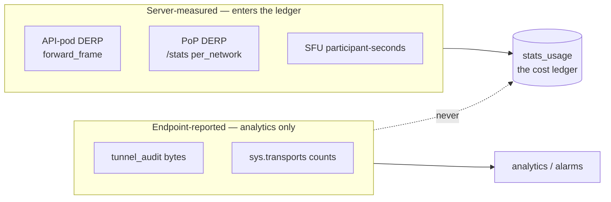
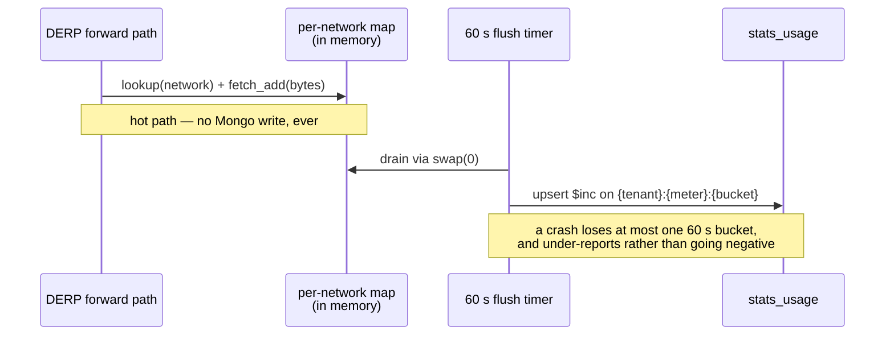
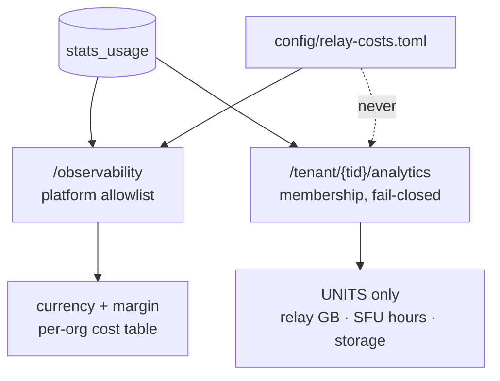

# Relay cost metering

**Attribute relay cost to the tenant that caused it.** Two of this product's costs
scale with use — relayed bytes and SFU participant-time — and until FR-20 neither was
attributable to anyone. `stats_relay` measures *per PoP*, which is fleet health, so the
question "what did org X cost me last month?" had no answer and neither did "what is the
margin on the Pro tier?".

This page describes what ships today. It is a **measurement** system: it carries no quota
and enforces nothing. Pricing before measuring is how you set numbers you cannot defend.

> Design record and evidence: [`fr/FR-20-per-tenant-relay-cost-metering.md`](fr/FR-20-per-tenant-relay-cost-metering.md) (#807).

## The rule that shapes everything: bill only on what we measured ourselves

The server relays the bytes it forwards, so it can count them. It cannot count a direct
P2P session — those bytes never touch it. `tunnel_audit`'s byte columns are reported by
the **client endpoint** on flow close: a claim by a host we do not control.

This is the same provenance split the SSH subsystem already draws between `ssh_audit`
(the server's own decision, authoritative) and `ssh_activity` (the device's account of
itself), and the same rule applies here.

> ⚠️ **Client-reported bytes never enter the cost ledger.** They stay in analytics,
> labelled as such. A number that prices an invoice must be one we measured.

## What is metered, and what deliberately is not

| Meter | What it counts |
|---|---|
| `derp_bytes` | relay bytes forwarded on this tenant's behalf |
| `turn_bytes` | coturn-relayed bytes — **not collected today**, see [Point C](#c--coturn-turn--decided-not-built) |
| `sfu_participant_seconds` | the SFU's real marginal cost |
| `storage_bytes` | gauge |

> ⚠️ **Never metered: a direct P2P session, device count, signalling, mesh coordination,
> chat.** This is not an omission. A direct session costs the control plane kilobytes of
> signalling; metering it would invert the growth model and charge for exactly the outcome
> the whole NAT-traversal program exists to produce. The cheapest customer to serve is the
> one whose peers connect directly, and the meter must say so.

## One ledger, and why it needs no lock

`stats_usage` follows the shipped pattern exactly: a deterministic string `_id` of
`{tenant_id}:{meter}:{bucket}`, so every writer is an **idempotent upsert**. That, not a
lease, is what makes the two-pod deployment race-free — the same property `stats_relay`
and `stats_machine` already rely on. Rollups `_1h` (90 d) and `_1d` (730 d) come from the
existing `stats_rollup` task via `$merge` on `_id`.

Two pods writing the same bucket therefore yield exactly one row, which is asserted in
`crates/tests`.

## The three collection points

### A · API-pod DERP — shipped

One lock-free atomic add into a per-network map inside `forward_frame`, flushed on a 60 s
timer.

> ⚠️ **Never a Mongo write per frame, and nothing else on that path.** This is where relay
> latency lives, and FR-18 is actively fighting queueing there.

The billing invariant is pinned by tests in `ws::derp::tests`: a relayed frame bills
**exactly the bytes enqueued** (the 32-byte rewritten source plus payload — *not* the
inbound length), and bills **zero** on every drop path: unregistered destination,
cross-network, ACL-denied, full queue, malformed. Warn mode delivers, so it bills.

> ⚠️ Those tests are **verified falsifiable**: hoisting `add_network_bytes` above the
> enqueue fails four of them. A billing test that cannot fail proves nothing.

**The hot path is a lookup *plus* an atomic**, not "one atomic add" — the DashMap `get`
costs about 5× the `fetch_add` itself. Measured on 8 threads sharing one network id (the
worst case): atomic-only 13.69 ns/op, `add_network_bytes` 111.53 ns/op. At 200 frames/s
that is **0.0022 % of one core**, so nothing turns on it — but a reader who believed "one
atomic add" would mis-budget this path by 6× as DERP throughput grows.

### B · PoP DERP — shipped

`derp-relay` stays **DB-free** — a design invariant of that binary, which holds only the
ticket's public key and no Mongo at all. It counts bytes per `network` in an in-process
map and exposes a `per_network` object in the `/stats` payload that `relay_load.rs`
already polls every 30 s; the poller resolves network → tenant and writes the buckets.

> ⚠️ These are **cumulative counters, so the poller diffs successive samples** — the same
> shape `machine_series_pipeline` already uses for agent counters. A PoP restart resets
> mid-bucket, so that bucket **under-reports rather than going negative**, the identical
> trade the host-total `net_*_bytes` columns already make. Do not invent a different one.

> ⚠️ On the fleet as it stands, **DERP rides the API pods, not the regional PoPs** — all
> five regions measured ≈0 traffic while the ledger moved 1.77 GB. A PoP-vs-ledger
> reconciliation would compare two things that barely overlap.

### C · coturn TURN — decided, not built

Per-tenant TURN attribution is **deliberately not implemented**, and this is a decision
rather than a blockage.

The original design resolved *username → tenant* through a TTL'd grant map. Measured on
the live fleet against coturn **4.17.2**, the entire label set it emits is
`{realm}` and `{type}` — `grep -c 'user=|username='` over the whole payload returns **0**.
Every `turn_traffic_*` series is a realm-level aggregate, so the grant map would have been
a lookup that matches nothing.

Two mechanisms exist in 4.17.2, and choosing between them is an operational decision:

| Option | Cost |
|---|---|
| `--prometheus-username-labels` | Minimal code. ⚠️ But usernames are `{expiry}:{id}`, unique per issuance and never reused, so **every credential mints a new time series** — an unbounded label set, and the timestamp cannot be dropped because it is HMAC input. |
| `-O, --redis-statsdb` | Per-session records with username and byte counts; no cardinality growth, and Redis is already deployed. Needs a new integration and its schema verified. |

**Prefer `redis-statsdb` if this is ever taken up.** Per-tenant TURN attribution buys
nothing until a tenant relays material TURN volume, and the fleet-total TURN cost is
already visible through each region's `rx_mbps`/`tx_mbps`.

## The cost model

`config/relay-costs.toml` maps meter → unit cost in one place, so no price constant ever
appears in code.

> ⚠️ **`RelayCosts` is all `Option`, and an unset cost renders "not priced".** A defaulted
> `0.00` would render as *"this org is free to serve"* and imply **100 % margin** — the one
> number somebody would actually make a pricing decision on. Same contract as the absent
> GeoIP database honestly reporting `country: unknown`.

`mrr_cents` is a **list-price estimate** (`price_monthly_cents` × seats), not billed
revenue — `BillingInfo` stores Stripe ids and a status, no amount. `subscription_status`
travels with each row so a cancelled org's MRR is visibly notional, and margin **pro-rates
the monthly price to the selected range**: comparing a month of revenue against a day of
cost is off by 30×.

## The two surfaces, and why they differ

**`/observability`** renders currency and margin: the operator is reading their own cost.

**`/tenant/{tid}/analytics`** deliberately does **not** show money:

1. These are *our costs, not the org's bill*. A figure that appears on no invoice invites a
   dispute, and with no quotas there is nothing to measure it against.
2. The tenant surface exists to be **acted on** — a high relayed share means that org's
   network is refusing direct paths, which their own IT can usually fix. Pricing it buries
   a networking finding under a currency symbol.

The payload carries `quota: null` so the slot renders dark rather than implying that an
unlimited plan is a satisfied one.

> ⚠️ Both surfaces reuse the existing gates unchanged, and **a failure stays 404, never
> 403** — a 403 is not a logout, but a member removed mid-poll still must not be bounced.

## "Relayed fraction" is a fraction of CONNECTIONS, not bytes

The obvious reading — *the share of traffic that could not go direct* — is **not
computable, and building it would contradict this system's own foundation.** Direct bytes
are measured nowhere, because the meters live in the relay forward path; that is exactly
why a direct transfer meters zero. There is no denominator, so a byte-level fraction would
have to invent the direct half.

Both surfaces therefore render the relayed share of **peer connections**, labelled as such
on the card. Two properties travel with it:

- **It is agent-reported** (`sys.transports.{direct,relay,derp}`) — a claim by the fleet,
  not a server measurement. It may raise an alarm; it must never price a bill.
- **No reporters yields `null`, not `0`.** A zero here reads as a flawless mesh, which is
  the most flattering possible way to be wrong.

This costs nothing that mattered. The fraction was wanted as a NAT-traversal regression
alarm, and connections are the better signal anyway: one chatty relayed pair can dominate
a byte share while a hundred pairs quietly fall back to relay.

## Field state

Verified on prod 2026-08-30 and 2026-09-01:

| Check | Result |
|---|---|
| Live ledger census | `derp_bytes` 680 buckets / 1.77 GB across 2 tenants; `sfu_participant_seconds` 65 buckets |
| Negative buckets | **0** in raw, `_1h` and `_1d` |
| Loss paths, 24 h, both pods | flush-skipped **0** · bucket-write-failed **0** · unattributed **0** |
| Flush log vs stored value | exact match on three consecutive minutes |
| Hot-path cost | 0.0022 % of one core at 200 frames/s |

## Related

- [`data-model.md`](data-model.md) — every collection with its indexes and TTLs, including the stats family
- [`business-model.md`](business-model.md) — what costs money and the measure-then-price sequence
- [`overlay-nat-traversal.md`](overlay-nat-traversal.md) — why a direct path is the cheapest outcome
