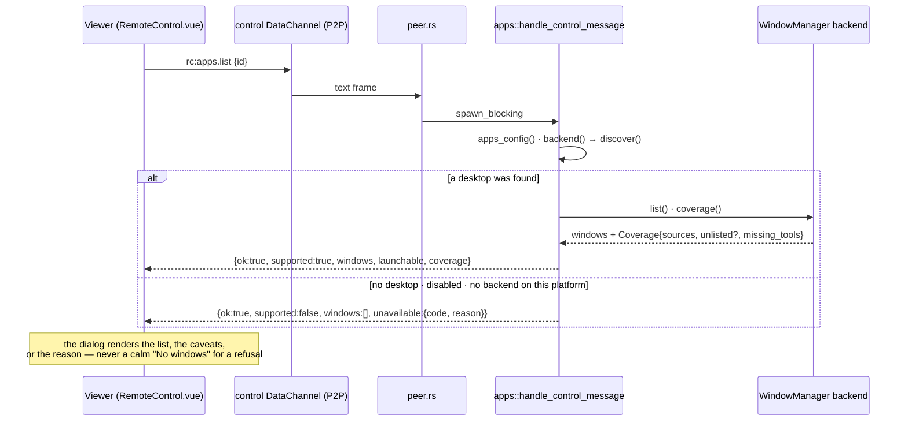
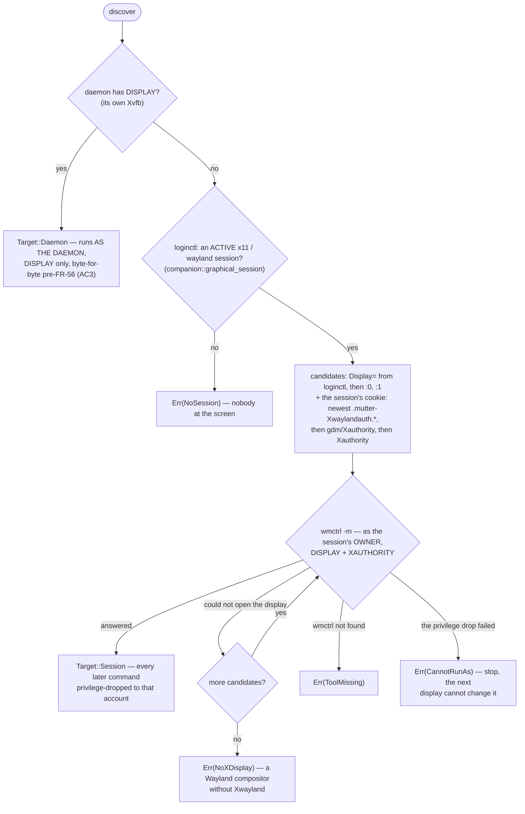

# Remote Apps — list, focus and launch on the controlled host

How a viewer sees what is running on a remote desktop, raises one window, and
starts a new allowlisted program — and how every host that *cannot* do one of
those says so, in the reply, rather than in a log line nobody will read. This
is FR-56's page ([spec](fr/FR-56-remote-apps-on-wayland.md), #1157); the
feature predates the FR (it shipped for the daemon's own Xvfb virtual desktop)
and the FR is what made it engage on a real login session, on Wayland, and
made it honest about what it can and cannot see. The capture side of "one
application instead of a screen" (P4) is a portal concern and lives in
[`linux-capture.md`](linux-capture.md); the control-DC family this rides
beside is listed in [`remote-control.md`](remote-control.md#182-data-channel-handlers-0131--0133).

The shape of the problem, in one paragraph: **the daemon runs as root (or
SYSTEM) outside every user session, and the one place a window list is
authoritative is the compositor's private state.** X11 publishes it to anyone
with the display and its cookie; Wayland does not publish it at all unless the
compositor chooses to, and GNOME chooses not to (measured: it *refuses*
`Introspect.GetWindows`). So on Linux this backend is an X11 tool — `wmctrl`,
`xterm`, `tmux` — that reaches Wayland desktops only through Xwayland, sees only
the windows Xwayland owns, and must therefore *say* that every time it answers.
The rest of the design follows from taking that sentence seriously.

## 1. The three verbs, and what rides back

Everything is P2P over the session's existing `control` data channel — no
server change, and the server never sees a window title. `peer.rs` routes three
envelopes to `apps::handle_control_message` (`agents/roomlerd/src/peer.rs:8452`),
runs it on `spawn_blocking` because every backend shells out or calls FFI, and
sends the returned reply back on the same channel. The request/reply shape and
the id correlation are `rc:logs-fetch`'s.

| Request | Reply | Carries |
|---|---|---|
| `rc:apps.list {id}` | `rc:apps.list.reply {id, ok, supported, windows[], launchable[], coverage?, unavailable?, error?}` | every window with an opaque `window_id`, its `title`, and — for windows this backend launched — the `app_key` or tmux `session` it belongs to; the allowlist the viewer may launch from; what the listing **could not** see; or why there is no listing at all |
| `rc:apps.focus {id, window_id}` | `rc:apps.focus.reply {id, ok, error?, unavailable?}` | raise + focus; for a detached tmux session (`tmux:<name>`) it re-attaches by spawning a fresh xterm |
| `rc:apps.launch {id, app_key}` | `rc:apps.launch.reply {id, ok, window_id?, session?, error?, unavailable?}` | start an **allowlisted** entry by its key; the new window's id when it could be resolved within 250 ms, else the viewer re-lists |



Three properties of the wire are load-bearing:

- 🔑 **`window_id` is opaque.** X11 hex (`0x03400007`) on Linux, an `HWND` in
  decimal on Windows, `tmux:<name>` for a detached session. The viewer only
  ever round-trips it, and the Linux backend re-validates the shape before
  handing it to `wmctrl -i -a` so a crafted id cannot become a flag
  (`agents/roomlerd/src/apps/linux.rs:337`).
- 🔑 **Launch takes a key, never a command.** `resolve_app`
  (`agents/roomlerd/src/apps/mod.rs:536`) is the security gate: the key must be
  in the device's own allowlist and the entry's `command` is run as argv with
  no shell, so a compromised viewer can start only what the device's owner
  wrote into its config, and there is no injection surface to reason about.
- 🔑 **Every path returns a well-formed `*.reply`**, including a panic in the
  handler (`peer.rs` catches the join error and answers `ok:false`). A request
  that got no answer is how the viewer detects an agent too old to speak
  `rc:apps.*` at all (a 10 s timeout, `ui/src/composables/useRemoteControl.ts:5474`).

## 2. How the Linux backend finds a desktop — and as whom

Until FR-56 P1 the gate was literally `env::var_os("DISPLAY").is_some()` on
the **daemon**, which is true only when the daemon started its own Xvfb
(`ROOMLERD_VIRTUAL_DESKTOP=1`). On every real login session the daemon has no
`DISPLAY`, so the feature never failed — it never engaged. `discover()`
(`agents/roomlerd/src/apps/linux.rs:480`) replaces that with the walk below.



| Arm | Runs as | Needs | Why it is the way it is |
|---|---|---|---|
| **Daemon** (`Target::Daemon`, `linux.rs:56`) | the daemon (root) | `DISPLAY` only | The daemon started that Xvfb and owns it — the only case where root on the display is the right answer. It is also the only population that used the feature before FR-56, and AC3 keeps it **unchanged, first, and unprobed** |
| **Session** (`Target::Session`) | the session's owner, by **name** | `DISPLAY` **and** `XAUTHORITY` | ⚠️ Measured before any code: with `DISPLAY` alone — what the pre-FR-56 code passed — every call on a compositor-started Xwayland dies `Authorization required, but no authorization protocol specified`. The cookie's file name is a glob (`.mutter-Xwaylandauth.XXXXXX`), so the runtime dir is scanned newest-first (a compositor restart leaves a stale one behind that authorises nothing; `linux.rs:648`) |

Three rules the session arm enforces, each paid for somewhere:

- ⚠️ **The privilege drop is not politeness, and it is fallible on purpose.**
  `launch` spawns a terminal and a tmux server; doing that as root on
  somebody's own desktop puts a root shell on their screen and root-owned
  state in their runtime dir. So `LinuxWm::cmd` (`linux.rs:102`) returns an
  error when the drop cannot be installed, and the only outcome is to run
  *nothing* — an infallible constructor could not express that. Since P6 that
  failure is also a *named* refusal (`cannot_run_as`) rather than being retried
  against the next display and reported as "no Xwayland".
- ⚠️ **Candidates are verified, never guessed.** `loginctl` reports `Display=`
  for X11 sessions and often not for Wayland ones, so `:0` is an unavoidable
  guess — but an *unverified* guess would surface later as a reassuring
  "no windows" instead of an honest "no desktop". Each pair is tried with
  `wmctrl -m` and the first that answers wins (`linux.rs:605`).
- ⚠️ **`wmctrl -l`'s exit status is checked.** It was not, before P1: against a
  display it cannot open the tool writes nothing to stdout and exits non-zero,
  and parsing stdout regardless turned *"I could not reach the desktop"* into
  `Ok(vec![])` — *no windows*, a different and calmer claim. Discovery makes it
  matter: a found display can go stale (the cookie dies with the compositor)
  where an Xvfb the daemon owns could not (`linux.rs:274`).

The same `loginctl` walk serves FR-27's consent companion and FR-45's capture
helper (`agents/roomlerd/src/companion.rs:457`) — one copy on purpose, because
a compositor that reports its session differently should break all three in
the same place.

## 3. The tiers, and what each one says

This is the table AC10 was audited against (2026-09-25, agent 0.4.102). The two
questions asked of every row: **does the hello advertise anything this host
cannot do**, and **does the refusal carry its reason in the reply** — not only
in the daemon log. The hello column is `AgentCaps.apps`
(`crates/remote_control/src/models.rs:203`), assigned once per process by
`detect()` from `apps_caps()` (`agents/roomlerd/src/encode/caps.rs:1408`,
`:548`) — in the daemon, never in the caps-probe child (§4.3).

| Tier / path | Hello `apps` on 0.4.102 | `rc:apps.list.reply` on 0.4.102 | Reason reached the screen? | After P6 |
|---|---|---|---|---|
| **Xvfb virtual desktop** (`ROOMLERD_VIRTUAL_DESKTOP=1`) | `list · focus · launch` | full list; `sources: x11`, nothing unlisted | n/a — complete. Field: three cluster nodes, one root xterm each | `+ status`; otherwise untouched (AC3) |
| **X11 login session** | `list · focus · launch` | full list | n/a | `+ status` |
| **Wayland session with Xwayland** (GNOME, KDE) | `list · focus · launch` | Xwayland windows; `unlisted: "native Wayland windows: this compositor exposes no protocol to enumerate them"` | `unlisted` **yes** (P2) | `+ status` |
| ↳ **GNOME native windows** (P3) | — | named by `unlisted` | yes — GNOME *refuses* `Introspect.GetWindows` (`Access denied`, two D-Bus clients, Shell 48.8) and has no activate at all, so this is a reported limit, not a TODO | — |
| ↳ **wlroots foreign-toplevel** | — | not built | no host in the fleet runs wlroots; a sway-in-WSL2 rig would be CI-green-equals-done | — |
| **helpers missing** (`tmux`, `xterm`) on a working desktop | `list · focus · launch` — correct, listing and focusing work | `coverage.missing_tools` names each, with what it blocks and how to install it (P5) | **NO** — the viewer's parser copied `sources` and `unlisted` and dropped `missing_tools`; #1179 added the type and the template, never the parse. P5 was field-verified with the host probe, so nobody saw it | parser fixed; a test is red against the old parser |
| **`wmctrl` missing**, session arm | **`list · focus · launch` — advertised** | `ok:false, supported:true, error: "wmctrl not installed (apt install wmctrl)"` | yes, in `error` — but the hello claimed `list` on a host that cannot list; P1 did that deliberately so the message could reach the operator at all | not advertised; `status` + `unavailable{tool_missing}`. ⚠️ **Launch is refused too**: a host with `xterm`/`tmux` but no `wmctrl` used to launch *blind* — a window the panel could neither list nor focus, the visible-for-silent trade P5 refused — and now gets the same reason |
| **`wmctrl` missing**, Xvfb arm | `list · focus · launch` | same actionable `error` | yes | **unchanged** — AC3 freezes the Daemon arm; recorded rather than "tidied" |
| **Wayland session, no Xwayland** | absent | never asked; if asked, bare `supported:false` | **NO** — one `debug!` line | `status` + `unavailable{no_x_display}` |
| **nobody logged in** (headless, greeter, no Xvfb) | absent | bare `supported:false` | **NO** — `graphical_session`'s sentence was thrown away by `.ok()?` | `status` + `unavailable{no_session}` |
| **privilege drop failed** | absent | bare `supported:false` | **NO** — swallowed, then the log blamed Xwayland | `unavailable{cannot_run_as}`, and discovery stops at the first |
| **disabled in config** | absent | bare `supported:false` | **NO** — one `info!` at boot | `status` + `unavailable{disabled}` |
| **macOS** | absent | bare `supported:false` | no — and nothing to change: there is no backend | unchanged by design: no `status`, no button; `platform` answers a stray request |
| **Windows** | `list · focus · launch` whenever enabled | `EnumWindows` on the active desktop; `sources: win32`, nothing to miss | n/a | `+ status`. ⚠️ Unverified: a SYSTEM worker with nobody logged in or a locked screen — `EnumWindows` on the wrong window station returns few or no windows, which is the P2 shape ("quiet desktop"); `windows.rs` names `SetThreadDesktop` as the fix *when observed* |
| **user logs in after the daemon booted** | absent — **for the process lifetime** | the live reply says `supported:true` | NO — the button was hidden, so nobody asked | `status` shows the entry; the dialog is live |
| **session gone by click time** (advertised at hello, user logged out) | `list · focus · launch` | bare `supported:false`; the entry greyed out with no tooltip | **NO** | reason in the dialog; the entry is never disabled |
| **per-window capture** (P4, `ROOMLERD_WINDOW_CAPTURE=1`) | not a capability on this wire | the portal shows a picker on the host; unanswered, the helper times out and the capture cascade falls through | the *capture* reason travels as FR-80's `rc:media-unavailable` only if every later arm fails too | out of scope here; see [`linux-capture.md`](linux-capture.md#7-configuration) |

Two numbers from the audit's denominator, read from the server rather than an
exec sweep (an exec sweep reaches only what is online): on 0.4.102 **every**
Linux and Windows device advertised `list · focus · launch`; both macOS rows
advertised nothing; one headless Linux node still on 0.4.48 advertised nothing
— the "nobody at the screen" row above, whose reason existed nowhere a viewer
could see it.

## 4. The two honesty objects

### 4.1 `coverage` — what a listing could not see

`supported: bool` cannot express *"X11 windows only"*, and on a Wayland host
that is the truth: a short list looks exactly like a quiet desktop. This is the
`Some([])`-vs-`None` distinction on its fourth surface in this codebase
(overlay ACL ingress rules, `ssh_activity`, FR-49's dark org): an empty list and
an unenumerable source are different facts, and only the reply can tell them
apart. `Coverage` (`agents/roomlerd/src/apps/mod.rs:127`) is a **trait method**,
not a field set at construction, so the compiler forces every backend to answer
— it caught the test fake the day it was added.

| Field | Meaning | Absent means |
|---|---|---|
| `sources: ["x11"]` / `["win32"]` | the window sources this listing enumerated | (always present when `coverage` is) |
| `unlisted: "native Wayland windows: …"` | a source that exists on this host and could **not** be enumerated, with the reason | the listing is complete for this desktop — an X11 or Xvfb session has no second source to caveat |
| `missing_tools: [{tool, blocks, install}]` | helpers this backend shells out to that are **not installed**, probed **per call, never cached** (a host can gain `tmux` at any moment — FR-45's lesson about caches and start order) | ⚠️ on the wire, *nothing missing* and *older agent* are the same bytes: the agent skips an empty list. The viewer therefore renders nothing for both and never invents an empty array, which would claim "checked, none" |

- ⚠️ **`supported` stays `true` when `missing_tools` is non-empty.** Listing
  and focusing genuinely work on a host with no `tmux`; collapsing a partial
  capability to `false` would delete a working feature — the boolean-vs-detail
  mistake `coverage` exists to fix. `missing_tools` predicts a *click-time*
  failure, which is why the panel renders it as a warning and `unlisted` as
  information.
- ⚠️ **`wmctrl` is deliberately not a `MissingTool`.** Without it there is no
  backend — `list` and `focus` *are* `wmctrl` — so its absence must surface as a
  refusal of the whole feature (`tool_missing`, below), never as a footnote on
  a reply that otherwise reads like success (`linux.rs:228`).
- ⚠️ **The probe resolves against the daemon's `PATH`**, because that is what
  the spawn inherits: the privilege drop changes the child's uid from a
  `pre_exec` hook long after the environment was copied, so the target user's
  login `PATH` never enters into it (`linux.rs:209`). Asking any other way
  answers about an environment the child never gets.
- **`coverage` rides the error arm too** (`mod.rs:433`). A failed listing is
  exactly where an empty list is most likely to be read as calm.

### 4.2 `unavailable` — why there is no listing at all (P6)

Every reply that says `supported: false`, and every focus/launch refused for
want of a backend, carries `unavailable: {code, reason}` (`Unavailable`,
`agents/roomlerd/src/apps/mod.rs:176`). The sentence is composed on the agent,
not in the viewer, because only the agent knows which arm it took — the same
rule FR-80 applied to the capture reason. The `code` is a **closed set**, and a
compatibility surface like every other `rc:*` string: a test locks that the
codes are distinct, snake_case, and that none is a prefix of another (the
`ssh` / `ssh-consent` lesson, so an equality match can never be "simplified"
into `starts_with`).

| `code` | When | What the reason says to do |
|---|---|---|
| `disabled` | `[virtual_desktop_apps] enabled = false` on the device | enable it there and restart the daemon — the owner's choice, reported as such |
| `no_session` | `loginctl` shows no active `x11`/`wayland` session | nobody is at the screen; remote shell and file transfer still work |
| `no_x_display` | a session exists, no candidate display answered | a Wayland compositor without Xwayland; this backend manages X11 windows only |
| `cannot_run_as` | the session's owner was found and the privilege drop failed | the account is unresolvable or the drop was refused; commands are never run as root instead |
| `tool_missing` | `wmctrl` is not installed (session arm) — the whole feature, launch included, since this backend needs it to find and manage the desktop | `apt install wmctrl` |
| `platform` | no backend for this OS | reached only by a stray request; the hello never advertises anything here |

The legacy `error` string on a focus/launch refusal keeps its shape and
*contains* the reason, so a viewer that reads nothing else still shows it
(`mod.rs:521`).

### 4.3 The hello is a boot-time snapshot; the reply is live

`detect()` assigns `caps.apps = apps_caps()` once, beside `caps.rpc`, and
memoizes the whole `AgentCaps` behind a `OnceLock`
(`agents/roomlerd/src/encode/caps.rs:37`, `:548`); both the hello and the
FR-43 heartbeat re-announce (`agents/roomlerd/src/signaling.rs:4231`, `:1601`)
hand out that same struct. So `list` missing from the hello can mean *nobody
had logged in yet when the daemon started*, and nothing short of a daemon
restart changes it. That is why P6 added a fourth value:

- **`status`** — *this build has a Remote Apps backend and answers
  `rc:apps.list` honestly*: with the list when there is a desktop, with
  `unavailable` when there is not. Advertised whenever the platform has a
  backend (`apps::has_backend`, `mod.rs:357`), independent of what the host
  was doing at boot.
- The viewer shows the *Remote apps* entry for `list` **or** `status`
  (`ui/src/views/remote/RemoteControl.vue:3610`), never disables it, and lets
  the **dialog** carry the truth from the live reply: the list, the caveats,
  or the reason (`useRemoteControl.ts:8515`). A greyed button with no tooltip
  was the one place a reason could not reach.
- 🔑 **`availability_for()` is the single source for both** (`mod.rs:321`): the
  hello's `list` and the reply's `unavailable` come from one function, so they
  can disagree only by *time*, never by logic — **and never by which process
  asked.** ⚠️ The review of #1667 found that claim false on a caps-cache
  **miss**: `cached_or_probed` returns the caps-probe *child's* struct
  wholesale there, and the child loads no config, so an apps block inside
  `compute_caps` advertised `list` on a device whose owner had set
  `enabled = false` — on every release's first boot, and on every boot of a
  host with no hardware cell (a no-hardware answer is never cached,
  `caps_cache.rs:277`). `apps` is now assigned in `detect()`, in the daemon,
  and the child's struct carries none (`apps_caps`, `caps.rs:1408`; a test locks
  `compute_caps(..).apps.is_empty()`). The same move takes the
  privilege-dropped `loginctl`/`wmctrl` walk out of a process that exists to
  contain untrusted driver code.
- ⚠️ An agent older than P6 answers `supported: false` with nothing beside it.
  The viewer names that as such (*"this agent did not say why"*,
  `useRemoteControl.ts:890`) rather than papering over it — inventing a reason
  would be the same lie in the other direction.

## 5. Launch, and the tmux session model

On Linux the flagship entry is a **bash session that is a tmux session**,
shown as an xterm attached to it. That buys three things a bare terminal
cannot: it survives the agent restarting and the viewer disconnecting (the tmux
server outlives both), it is `ssh`-attachable from a real login
(`tmux attach -t s2`), and it is one X window per session, so focus works.

| Entry kind | What `launch` does | How the list finds it again |
|---|---|---|
| `tmux = true` | `tmux new-session -d -s s<N> <command>`, then `xterm -T roomler:tmux:s<N> -e tmux attach -t s<N>`; at most **32** live sessions (`linux.rs:43`) — a bound on what a misbehaving viewer can spawn | title convention `roomler:tmux:<s>` → `session` |
| `terminal = true` | `xterm -T roomler:app:<key> -e <command>` — for TUIs | `roomler:app:<key>` → `app_key` |
| neither | `<command>` as argv, detached, stdio to `/dev/null`; the app sets its own title | unmanaged — reported as-is |
| **detached session** (no live xterm after a restart or a detach) | listed anyway, as `Terminal (s2) — detached` with the synthetic id `tmux:s2` (`linux.rs:39`); `focus` on it spawns a fresh attached xterm — "attach" fits the three-verb protocol with no fourth verb | `tmux list-sessions` minus the attached ones |

- 🔑 **Our own windows carry a known title**, so a window maps back to its
  session or allowlist key without pid/`xprop` correlation
  (`classify_title`, `mod.rs:650`). Anything else is an unmanaged window and is
  reported with its real title.
- ⚠️ **A re-attach target is validated as a plain session token**
  (`is_safe_session`, `linux.rs:447`) — defence in depth against a crafted
  `window_id` reaching `tmux attach -t`.
- ⚠️ **Launching stays X11-only, on purpose, on a Wayland host.** P5 was
  written as *prefer a Wayland-native terminal where there is no Xwayland*,
  and measuring first refuted it: `konsole` launched with only
  `WAYLAND_DISPLAY` ran fine and was **invisible to `wmctrl`**, while `xterm`
  through Xwayland listed instantly. A native window is one the panel can
  neither show nor raise — trading a *visible* failure for a *silent* one. The
  same reasoning forbids exporting `WAYLAND_DISPLAY` into launched apps (it
  would flip toolkit apps from Xwayland to native), and the condition "no
  Xwayland at all" is not one this fleet has: GNOME and KDE start it by
  default. One rule for listing and launching, reported honestly, beats a
  listing rule and a contradictory launching rule.

## 6. Per-window capture (P4) — the RAIL-shaped half

Streaming **one application window** instead of the monitor reuses FR-45's
whole portal pipeline with a single change: `SelectSources(types = WINDOW)`
(`SOURCE_WINDOW`, `agents/roomlerd/src/capture/portal/screencast.rs:93`) behind
`ROOMLERD_WINDOW_CAPTURE` (`agents/roomlerd/src/capture/portal/backend.rs:77`,
config key `window_capture`, `crates/agent-core/src/config.rs:782`). It is
**attended by construction**: the portal answers by showing the person at the
screen a window picker, and nothing agent-side can name a window — GNOME
refuses the only API that could supply an id, so mutter's `RecordWindow` route
is unreachable, not unimplemented. On a host with nobody at it the capture
simply never starts, which is why the switch defaults **off** and says so in
its own description. Measured on a GNOME Wayland host: the portal advertised
`AvailableSourceTypes = 7`, the helper logged *recording ONE WINDOW (the portal
will show a picker)* and blocked until the deadline with nobody there — the
timeout **is** the result. A window grant is a different grant from a monitor
grant, so the restore token splits four ways
(`portal-restore-token{,-rd,-win,-rd-win}`); sharing a file would burn
whichever was stored first. The cascade, the deadline and the attended-only
rule are [`linux-capture.md`](linux-capture.md) §4.

## 7. Where it has been proven

| Date | Host | What | Result |
|---|---|---|---|
| 2026-09-01 | GNOME Wayland (Asahi) | P1 — as **root with no `DISPLAY` and no `XAUTHORITY`**, the daemon's real environment | `apps supported: true`, `windows: 1`, a real title. `DISPLAY` alone dies `Authorization required`; with the cookie it lists |
| 2026-09-01 | the dev box, daemon pointed at `:99` (no X server) | the missing exit-status check | before: `windows: 0`; after: `list failed: wmctrl could not read the window list from :99: Cannot open display.` |
| 2026-09-01 | GNOME Wayland | P2 | `sources: x11` / `NOT listed: native Wayland windows…` beside the one Xwayland window it can see; `foot` and `gnome-text-editor` alive and absent |
| 2026-09-01 | GNOME Shell 48.8, as the session user, `busctl` **and** `gdbus` | P3 | `Introspect.GetWindows` → `Access denied: GetWindows is not allowed`; `GetRunningApplications` likewise; no activate method exists |
| 2026-09-01 | GNOME Wayland | P4 | `AvailableSourceTypes = 7`; the helper announced ONE WINDOW and blocked on the picker to the deadline |
| 2026-09-01 | GNOME Wayland | P5, both arms in one run | `tmux` reported missing (truly absent) **and** `xterm` not reported (truly `/usr/bin/xterm`) — a probe that reported everything would pass the first and fail the second. Re-run from the signed **agent-v0.4.48** after the update |
| 2026-09-25 | the server's `agents` collection | AC10 denominator | every 0.4.102 Linux/Windows device advertises `list · focus · launch`; macOS none; one 0.4.48 headless node none |
| 2026-09-25 | three cluster nodes, over Fleet RPC | AC10, the Xvfb tier | `sources: x11`, `NOT listed: (nothing)`, `missing tools: (none)`, one root xterm each — complete and honest |
| 2026-09-25 | GNOME Wayland (Asahi), over Fleet RPC | AC10, the missing-helper tier | the agent prints `missing tools: tmux …`; the viewer's parser was read and found to drop it — **P5 never reached a screen** |
| 2026-09-25 | the WSL node | AC10 | refuses Fleet RPC (`exec_enabled` off — the device-owned gate) — *advertised, unprobed* |
| owed | a headless host and the GNOME Wayland host, after the next agent release | the P6 pass | `roomlerd apps-probe` printing `reason [no_session]: …` where today it prints *"no manageable desktop found"*; the Apps dialog showing the `tmux` warning that today never renders |

Still owed to a human: a window streamed to the browser and a switch between
two (somebody must answer the picker), and native enumeration on a wlroots host
(none exists in the fleet).

## 8. Configuration and the probe

```toml
# the device's config.toml — read at daemon start, or `roomler config`
[virtual_desktop_apps]
enabled = true                       # default true; false → `unavailable{disabled}`

[virtual_desktop_apps.allowlist.bash]   # seeded on a fresh Linux host
command  = ["bash"]
label    = "New bash session"
terminal = true
tmux     = true

[virtual_desktop_apps.allowlist.htop]   # a TUI in an xterm
command  = ["htop"]
terminal = true

[virtual_desktop_apps.allowlist.editor] # a GUI app: argv, no shell
command  = ["gnome-text-editor", "--new-window"]
label    = "Text editor"
```

| Key | Where | Default | Notes |
|---|---|---|---|
| `virtual_desktop_apps.enabled` | config (`crates/agent-core/src/apps_config.rs:21`); `roomler config get virtual_desktop_apps` prints the JSON (`config_surface.rs:1446`) | `true` | the kill switch; the hello stops advertising `list` (on a caps-cache hit **and** a miss, since the review of #1667 — §4.3), and a request answers `disabled` |
| `virtual_desktop_apps.allowlist.<key>` | config | `bash` on Linux, `cmd` on Windows | `command` is argv; an empty command is skipped from `launchable` and refused on launch |
| `window_capture` | config / `ROOMLERD_WINDOW_CAPTURE` (`config_surface.rs:988`) | **off** | P4 — attended by construction; restart required |
| `ROOMLERD_VIRTUAL_DESKTOP` | env | off | the daemon's own Xvfb (§2 of [`linux-capture.md`](linux-capture.md)); when set, the Daemon arm wins and no session is discovered |

`roomlerd apps-probe` (`agents/roomlerd/src/main.rs:4696`) answers the whole
question on the host with no session and no browser, the way `capture-smoke`
does for pixels: which config it loaded and whether apps are enabled there,
whether a desktop was found and as whom (the display and the cookie), what the
listing covers and cannot, which helpers are missing, and the windows — or,
since P6, the refusal's `code` and `reason`. Over Fleet RPC:

```bash
roomler exec <device> -- roomlerd apps-probe
```

The prose beside an empty list says explicitly that empty is not unsupported
and that native Wayland windows would not appear even if present. ⚠️ Before P6
the probe ran on the built-in default config, so it could print
`apps supported: true` on a device whose owner had disabled the feature. It
reads the file with FR-66's `read_if_present` (`crates/agent-core/src/config.rs:2576`),
not `load`: `load` self-heals — an unreadable live file logs *the host must be
re-enrolled* and can promote the `.prev` copy back over it — and a diagnostic
must never write the device's config as a side effect of being run.

## 9. Code map

| File | Owns |
|---|---|
| `agents/roomlerd/src/apps/mod.rs` | the wire types (`Coverage` `:127`, `MissingTool` `:151`, `Unavailable` `:176` with `code` `:209` and `reason` `:221`), the `WindowManager` trait (`:259`), `availability` (`:314`) and `availability_for` (`:321`), `has_backend` (`:357`), `backend` (`:367`), `handle_control_message` (`:390`) and the pure `dispatch` seam (`:410`), the three reply builders (`:433`, `:471`, `:489`), `unavailable_reply` (`:521`), `resolve_app` (`:536`), the `wmctrl`/tmux parsers and `classify_title` (`:650`) |
| `agents/roomlerd/src/apps/linux.rs` | `Target` (`:56`), `LinuxWm::cmd` and the privilege drop (`:102`), `on_path` (`:209`) and `HELPERS` (`:228`), `coverage` (`:254`), `list` (`:274`), `focus` (`:337`), `launch` (`:368`), `discover` (`:480`) and its test seam `discover_with` (`:497`), `refused` (`:579`), `Probe` (`:589`) and `probe` (`:605`), `find_xauthority` (`:648`) |
| `agents/roomlerd/src/apps/windows.rs` | `EnumWindows` (`:49`), `coverage` (`:88`), `list` (`:100`), `focus` (`:120`), `launch` (`:149`) |
| `agents/roomlerd/src/encode/caps.rs` | `apps_caps` / `apps_caps_for` (`:1408`, `:1414`), assigned in `detect` (`:548`) beside `rpc`; `CACHED_CAPS` (`:37`) — why the hello is a snapshot; `cached_or_probed` (`:574`) — why the child's struct must carry no `apps` |
| `agents/roomlerd/src/peer.rs` | the control-DC arm (`:8452`) |
| `agents/roomlerd/src/companion.rs` | `graphical_session` (`:457`) |
| `agents/roomlerd/src/main.rs` | `apps-probe` (`:4696`) — reads the device config through `read_if_present`, never `load` |
| `crates/remote_control/src/models.rs` | `AgentCaps.apps` and its known values (`:203`) |
| `crates/agent-core/src/apps_config.rs` · `config_surface.rs` | the `[virtual_desktop_apps]` shapes (`:21`); the config-surface keys (`:1446`, `:988`) |
| `ui/src/composables/useRemoteControl.ts` | the parsers (`parseAppsListReply` `:1105`, `parseAppsUnavailable` `:1181`), the request path (`:5474`, `refreshApps` `:5512`), the reply arm (`:8515`), the no-reason wording (`:890`) |
| `ui/src/views/remote/RemoteControl.vue` | the *Remote apps* entry (`:1255`, gate `:3610`) and the dialog (`:1295`) |
| `ui/src/__tests__/composables/useRemoteControl.spec.ts` | the wire-format locks, including the `missing_tools` test that is red on the pre-P6 parser (`:2184`) |
