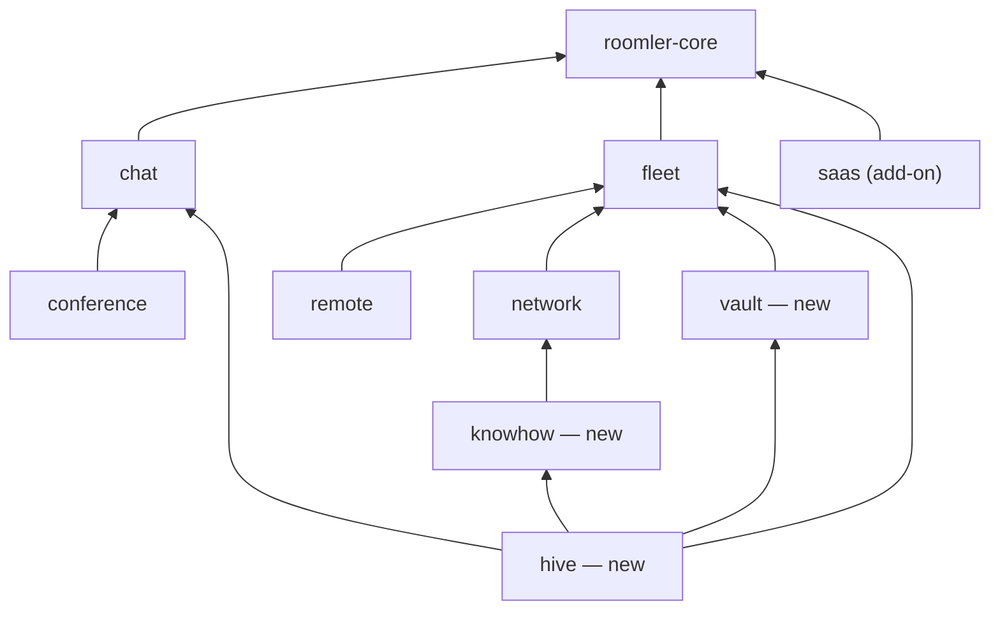
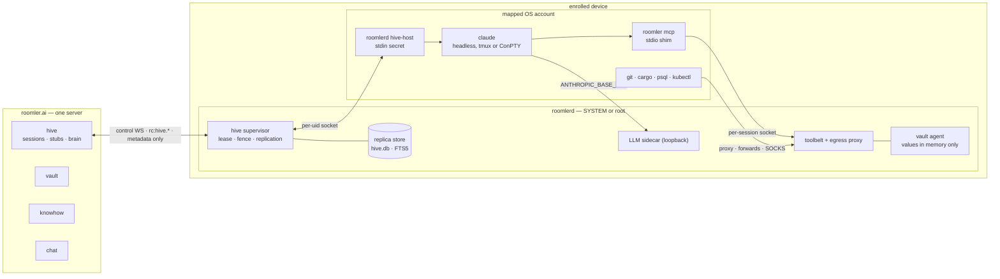
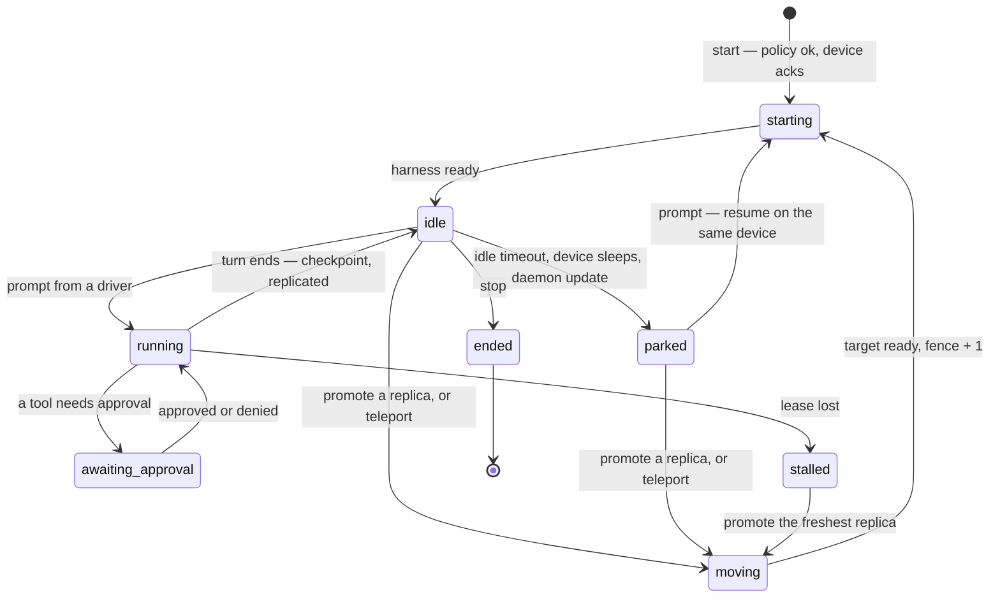
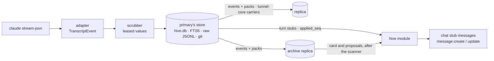
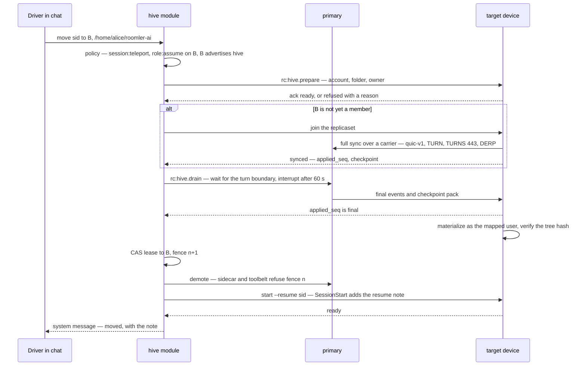
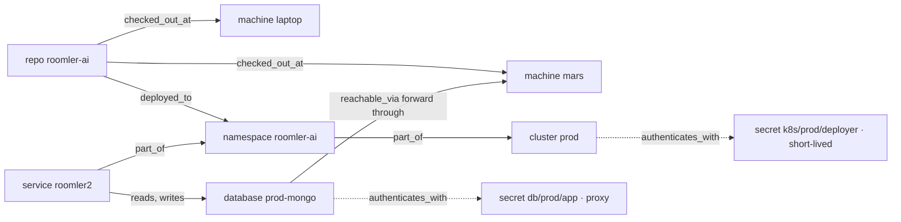
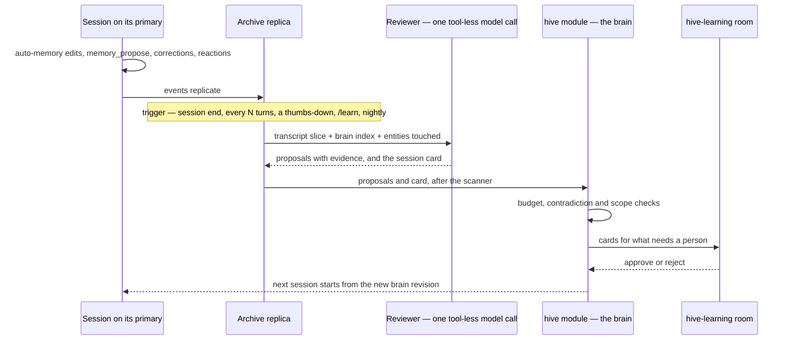

# Roomler Hive — distributed, self-improving agent sessions

*Design doc · v0.4 · 2026-10-07 · supersedes v0.3 (same day) and v0.2 (2026-09-03).
Anchors are `path:line` on `origin/master` `d2dc0efa6`. Status: **design approved
2026-10-07, tracked as [FR-90](fr/FR-90-hive-agent-sessions.md); being built — P0a (the device core),
P0b (the server module), P0c (the device supervisor) and P0d-1 (the session room and its turn stubs) are in, P0d-2a and P0d-2b (the viewer peer, device and server), P0d-3 (the UI), P0e (the model sidecar) and P0f (the canary test) are in, and on 2026-10-07 a browser drove a real Claude Code session on a Linux device end to end — AC1, on a throwaway stack (FR-90 spec §8)** (§17). Decisions are in §0.1; the review that produced v0.3 is
[Appendix A](#appendix-a--review-of-v02).*

> **What changed.** v0.2 kept Hive outside Roomler: a separate product behind a new
> extension SDK, a second daemon binary, and every session pinned to one canonical
> folder. Since then the server became a modular monolith (FR-69, shipped the day after
> v0.2), the licence stopped being MIT, and the requirements grew: sessions recorded per
> org and read in Roomler chat, teleport to another machine **and another folder**, a
> vault reachable over MCP and referenced from prompts, and a "knowhow" map of the org's
> infrastructure wired to that vault. v0.3 rebuilt Hive from what Roomler already has —
> three server modules, one daemon feature, chat as the UI.
>
> **v0.4** applies the decisions on v0.3. Transcripts never reach the server: each
> session lives on a **replicaset**, a list of the org's own devices that each hold a
> full copy and can resume it. What every session needs — memory, skills, playbooks,
> short session summaries — moves into a **central brain in the database**, redesigned
> against Hermes Agent's memory model (§10).

---

## 0. Summary

Hive runs coding agents (Claude Code first, Codex later) on the org's own enrolled
machines and makes five things first-class:

1. **Sessions are org records; their content stays on the org's machines.** Every
   session of the `grox` org — who started it, on which device, in which folder, as which
   OS account, what it cost, where its copies are — is a row in grox's database, listed
   and searchable in the SPA. What the agent and the people said and did lives on the
   session's **replicaset**: grox's own devices, each holding a full copy. The server
   never stores a transcript.
2. **Chat is the session's surface.** A session *is* a chat room. Each agent turn is a
   message whose steps render as markdown, terminal blocks and diffs; approvals are cards
   a phone can answer; teammates read along. The room's content streams peer-to-peer from
   a replica; the server holds the room and metadata-only stubs.
3. **Resume anywhere in the replicaset, teleport anywhere else.** A session resumes on
   any of its replicas in seconds, because the transcript and workspace are already
   there. It moves to a new machine and folder — `(laptop, C:\dev\roomler-ai)` to
   `(build box, /home/alice/roomler-ai)` — by joining that machine to the replicaset
   first.
4. **Infrastructure the agent can use without seeing a secret.** The vault holds
   credentials under IAM-style policy. The knowhow graph records what exists and how to
   reach it (repo `roomler-ai` → deployed to cluster `prod` → reads database
   `prod-mongo`, reachable through device `mars`). The agent gets both over MCP and
   connects through Roomler's own forwards, SOCKS5 and SSH. A prompt can say "check the
   size of #db/prod-mongo" and the agent never handles the password.
5. **One brain the whole org's sessions share and improve.** Memory, skills and
   playbooks live centrally: small, curated, versioned, reviewed. Every session on every
   device starts from the same snapshot; sessions propose what they learned, and a
   person, a probe or a test confirms it.

| Piece | Ships as | Responsibility |
|---|---|---|
| `vault` module | `crates/modules/vault` (AGPL) | secrets, versions, envelope encryption, roles, Cedar decisions, leases, templates, audit |
| `knowhow` module | `crates/modules/knowhow` (AGPL) | entity/edge graph, fleet + network sync, proposals, verification, access plans |
| `hive` module | `crates/modules/hive` (AGPL) | sessions, leases and fences, replicaset membership, turn stubs and cards, teleport coordination, **the brain** (memory, skills, playbooks), optional LLM gateway |
| daemon feature `hive` | `agents/roomlerd/src/hive/` (MPL) — **no new binary** | supervisor, `roomlerd hive-host` (re-exec'd as the user), harness adapters, **replica store** (SQLite + FTS5), replication, viewer peer, checkpoints, LLM sidecar, toolbelt (MCP), egress proxy, vault agent, reviewer, scanners |
| UI | `ui/src/{views,components}/hive/` (AGPL) | session chrome and renderers inside chat, the viewer peer, sessions list, brain review, knowhow map, vault admin |

**Hive's invariants**, on top of Roomler's own:

- ⚠️ **A session never runs as SYSTEM or root.** It runs as the OS account the *device*
  maps the user to; no mapping ⇒ refuse (§4.2).
- ⚠️ **One executor per session, enforced where it bites.** The fence gates every model
  call and every toolbelt call (§4.6).
- ⚠️ **Transcripts never reach the server.** They move device to device inside the
  replicaset and device to browser over WebRTC. The server holds metadata, turn stubs,
  the summary card the org allows, and the brain (§3.3).
- ⚠️ **Secrets reach tools, not the model.** A reference resolves to a capability (a
  local endpoint that already authenticates, a signing socket); a materialized value is
  the exception a policy names and the UI flags (§8.5).
- ⚠️ **The learning loop can't widen its own permissions.** The reviewer holds no tools
  and no secrets, and nothing it writes touches vault, policy or roles (§10.5).

### 0.1 Decisions taken (2026-10-07)

| # | Question | Decision | Where |
|---|---|---|---|
| D1 | Where do transcripts live? | **On a replicaset** of the org's devices; never on the server. v0.3's server-held `managed` default is gone from v1 | §3.3, §4.4, §5.2, §6 |
| D2 | Windows with nobody signed in | console user only; such a device refuses with `no_console_user` | §4.2 |
| D3 | Positioning | Hive is the "AI" of the Business tier | §3.4 |
| D4 | Persistent memory and search, given D1 | **central brain in the database** for distilled knowledge; full-text search over transcripts runs on the replicas | §10 |
| D5 | Default LLM route (follows from D1) | `node`; a server gateway would carry prompts, so it's an explicit org opt-in | §11.1 |
| D6 | Brain hosting (follows from D4) | the database is the source of truth; git is an optional mirror | §10.2 |
| D7 | Session cards by default | `summary` — a scanned summary of at most 2 KB per session reaches the server, so sessions stay findable when every replica is offline; an org can lower it to `metadata` | §10.4 |

## 1. Goals, non-goals, acceptance bar

**Goals**

1. Start a session on any enrolled device the policy allows — from chat, from the CLI,
   or from another session.
2. Record every session per org: metadata and the brain centrally, content on a
   replicaset of the org's own devices. Find sessions by summary centrally and by full
   text on the replicas.
3. Read and drive sessions in Roomler chat, several people per room, with approvals
   answerable from any device.
4. Resume a session on any device of its replicaset within seconds; teleport it to a new
   device and folder; fork it.
5. IAM-style control over which session may use which credential, how, where and when,
   with every decision audited.
6. A knowhow graph that builds itself from the fleet, from scans and from sessions, and
   that agents can query and act on.
7. A brain — memory, skills, playbooks — that the org's sessions share and improve,
   through changes that are versioned, reviewed and revertible.
8. No effect on tenants or profiles that don't mount the modules.

**Non-goals** — a new agent harness; two executors on one session; a public
model-routing service; replacing the org's code review; running sessions or storing
transcripts in Roomler's cloud (§19 notes Managed Agents as a possible later harness).

**The acceptance bar** is Roomler's ("it just works", CLAUDE.md §2), applied to Hive:

| Axis | Cell | Must hold |
|---|---|---|
| Host | unmanaged laptop | session runs as the console user; approvals from a phone |
| Host | GPO-locked corporate desktop (EDR, TLS-inspecting proxy) | sidecar and egress proxy reach the LLM through the corporate proxy using the OS trust store; EDR tolerates a service starting the harness as the user |
| Host | bare server, VM, container | headless sessions as a named service account; archive replicas run here |
| Network | home NAT, CGNAT, symmetric NAT | replication and teleport on the carrier ladder; viewer peers through TURN |
| Network | full-tunnel VPN, all UDP blocked | replication over DERP within its budget (§6.4); viewer peers over TURN on TCP 443; approvals still answerable |
| Platform | Linux, macOS | harness survives a daemon restart; Claude Code's sandbox on |
| Platform | Windows | console user only; Claude Code has no sandbox there, so policy tightens (§8.4) |
| Platform | k8s node, WSL | k8s: headless as a named account. WSL: open (§18) |
| Session | locked screen | sessions keep running (headless needs no desktop) |
| Session | nobody signed in | Linux/macOS: a named account works. Windows: refused `no_console_user` (§4.2) |
| Data | content availability | a session is readable while any replica is online; with an archive replica, always |

CI green is not done here either; every phase closes on the field cells in §16.

## 2. Vocabulary

| Term | Meaning |
|---|---|
| **Harness** | the agent program — `claude` first, `codex` next — behind an adapter |
| **Session** | an org-scoped record: harness, location, role, room, replicaset, lease, cost |
| **Location** | `(device, folder, OS account)` where the session executes |
| **Replicaset** | the devices that hold a full copy of a session — transcript, harness state, checkpoints — and can resume it |
| **Primary / replica / archive replica** | the member executing the session (it holds the lease) / a hot copy / an always-on org device that joins every replicaset the policy allows and serves full-text search |
| **Promotion** | resuming a session on one of its replicas |
| **Teleport / fork** | move a session to a new location keeping its id / copy it to a new session with a parent link |
| **Turn** | one prompt and everything the agent did until it stopped |
| **Turn stub** | the server's record of a turn — who prompted, status, step count, duration, cost — with no content |
| **Session card** | an optional short summary of a session (outcome, decisions, files, entities) that the org allows on the server for search |
| **Step** | one event inside a turn: text, thinking summary, tool call, tool result, approval, compaction |
| **Driver** | a room member who may prompt the session; the owner always is one |
| **Lease / fence** | the right to execute, held by one member / the monotonic number every model and toolbelt call must carry |
| **Checkpoint** | a git commit of the workspace (tracked + untracked) plus the transcript position, taken at a turn boundary |
| **Toolbelt** | the `roomler` MCP server the daemon gives each session: brain, knowhow, vault, connect, fleet, network, child sessions |
| **Brain** | the org's central store of memory, skills and playbooks |
| **Core memory** | the bounded, always-loaded part of the brain, rendered into a session as a frozen snapshot at start |
| **RRN** | `rrn:{org}:{type}:{path}`, e.g. `rrn:grox:secret:db/prod/app` |
| **Role** | the IAM role analogue; a session assumes exactly one |
| **Handle** | a reference to a secret or a knowhow entity that a prompt or tool call carries instead of a value |

## 3. Architecture

### 3.1 Three modules and a daemon feature

v0.2 invented an extension SDK — a registry, token exchange with its own JWKS, an
envelope relay, an extension host inside `roomlerd`, an import-map SPA loader — to keep
Hive outside core. FR-69 provides each of those already: modules mount behind one
`Module` contract (`crates/core/src/module.rs:23`), the SPA gates on
`/api/capabilities` (`ui/src/stores/capabilities.ts:30`), every wire variant names its
owner (`crates/remote_control/src/signaling.rs:1399`), and an unmounted module answers
503 (`docs/modular-monolith.md`). Hive becomes three modules:



- **`vault → fleet`**: policy reads device attributes (OS, owner, tags, version), and
  values are delivered wrapped for a device key.
- **`knowhow → network`** (and so `fleet`): machine entities and access paths come from
  devices, overlay nodes, approved routes and tunnel policies.
- **`hive → chat, fleet, vault, knowhow`**: a session is a room, runs on a device
  through the fleet Hub, and uses the vault and the map. `Module::Deps = FleetState`, as
  for `remote`, because the Hub is one live object; chat's DAO is stateless and is
  re-created, not depended on (FR-69 rule 5).
- Hive is the first module that depends on both a collaboration module and `fleet`. The
  forbidden pairs (`chat ↔ remote`, `chat ↔ network`, `remote ↔ network`,
  `crates/core/src/graph.rs:13-19`) stay untouched; the new `EDGES` are listed above.
  Viewer peers need TURN credentials, which `remote` serves; Hive mints its own with the
  same stateless helper (`crates/remote_control/src/turn_creds.rs:46-85`) instead of
  adding a `hive → remote` edge.
- `HOOK_ORDER` (`crates/core/src/hooks.rs:37`) is "session holders release first, then
  lease holders, then the record owner". Hive holds sessions, so it goes first; the
  vault holds leases and goes beside `network`; knowhow mirrors devices and runs before
  `fleet`. An `agent_removed` hook therefore stops the device's sessions, drops it from
  every replicaset (§4.4), revokes its leases and archives its machine entity, in that
  order.
- `vault` and `knowhow` don't depend on `hive`, and they are useful without any agent:
  `roomler connect db/prod-mongo` gives a person a credential-injected local endpoint
  (§8.7), and the map is an infrastructure inventory.

All three join the `full` profile. A profile that leaves them out answers 503 on their
routes and its SPA hides their navigation, per FR-69 rules 6–8. Whether a reduced
`agents` profile is worth publishing is open (§18). Hive would also be the first module
to use the per-tenant `Capabilities.flags` the contract already defines and nobody
fills (`crates/core/src/capabilities.rs:31-42`): `hive.enabled` per org.

v0.2 also put the node side in a second binary, `hived`, supervised by `roomlerd`. That
doubles the signing, updater and installer couplings on every platform and contradicts
"one daemon per machine". The node side is a cargo feature of `roomlerd`. Its
user-level half is `roomlerd hive-host`, re-exec'd as the user the way `portal-helper`
and `record` already are (`agents/roomlerd/src/main.rs:203,333`), so it ships, signs
and updates with the daemon.

### 3.2 Who runs as what



| Process | Identity | Holds | Why there |
|---|---|---|---|
| supervisor, replica store, sidecar, toolbelt, egress proxy, vault agent (in `roomlerd`) | SYSTEM / root | the lease, the session's canonical copy, LLM credentials, leased secret values, per-session CA keys | a different OS principal from everything the model can run, so `/proc/<pid>/environ`, memory and files of these components are out of the model's reach, and other local users can't read the replica store |
| `roomlerd hive-host` | the mapped account | the harness's stdin/stdout, the PTY or tmux pane, the session secret | the harness must run as the user; a user-level host outlives a daemon restart (§4.3) |
| the harness and its tools | the mapped account | the workspace, the harness's own transcript, the session's config directory | what the user could do by hand, nothing more |

`hive-host` authenticates to the daemon the way FR-43's worker does: the daemon mints a
secret per host and hands it over **on stdin**, never on disk or in argv
(`agents/roomlerd/src/delegate.rs:16-30`). Without it, any process in the user's
session could volunteer to *be* the session's host and receive its prompts.

⚠️ **The daemon never writes into a user-owned tree as SYSTEM/root.** Checkout, restore
and transfer endpoints run inside `hive-host` as the mapped account. A privileged
writer in a directory the user controls is a junction or symlink escalation waiting to
happen. The companion's file drop already lives by the same rule
(`docs/desktop-companion.md`).

⚠️ **Claude Code's permission prompts are UX, not the boundary.** The model can read
its session's MCP configuration and call the toolbelt directly, so every decision that
matters — policy, approval, fence, audience — is made in the daemon or on the server.

### 3.3 What the server holds

| Data | Path | Server sees |
|---|---|---|
| session metadata, replicaset membership and freshness, decisions, audit | device → control WS → `hive` | yes (control plane) |
| turn stubs — who prompted, status, steps, duration, cost | device → control WS → `hive` → chat | yes; no content |
| session cards | a replica → `hive`, after the scanner | yes, if the org allows (`session_cards`, §10.4) |
| the brain — memory, skills, playbooks | `hive` module | yes: curated knowledge, scanned and reviewed (§10) |
| transcript — prompts, answers, tool calls, outputs | device ⇄ device inside the replicaset; device ⇄ browser over a WebRTC DataChannel | **no** |
| live PTY bytes and keystrokes | browser ⇄ device WebRTC DataChannel, or `roomler ssh` | no |
| workspace checkpoints, replication, teleport | device ⇄ device on tunnel-core carriers | no; relays forward ciphertext |
| tool traffic to org resources (DB, k8s, git) | device → forward, SOCKS or overlay → target | no |
| secret values | vault → device, wrapped for the device key | only inside the vault module while decrypting (managed custody, §8.2) |
| model traffic | sidecar → provider (default), or through an org-enabled gateway (§11.1) | only on a gateway route |

This keeps Roomler's data-plane rule — "the server never sees pixels, keystrokes,
clipboard, files, or overlay plaintext" (`docs/architecture.md`) — true for agent
sessions too. It costs three things, each answered later: a session is readable only
while one of its replicas is online (archive replicas, §4.4); full-text search runs on
replicas, not in the database (§10.4); and opening a session room needs a P2P
connection (§5.2). What the server does hold is knowledge someone chose to keep: the
brain, and short summary cards if the org enables them. Roomler SSH's rule that
"session content is never recorded" holds for Hive in the same sense: the server
records that a session happened, not what was in it.

### 3.4 Wire, capabilities, permissions, plans

- **Device frames** are new `ClientMsg`/`ServerMsg` variants in
  `crates/remote_control/src/signaling.rs`, spelled `rc:hive.*`, `rc:vault.*` and
  `rc:knowhow.*`, owned by their modules through `namespace()` (`:1399`). They carry
  metadata only; content travels on the planes in §3.3.
- **Capability verbs** join `RpcCap` (`crates/remote_control/src/models.rs:532`):
  `hive`, `hive-replica`, `vault`, `knowhow-scan`. Matching stays equality (`has_rpc`,
  `:697`), so `hive` never implies `hive-replica`. The server never pushes a Hive frame
  to a device that didn't advertise the verb, because a caller is waiting for the
  answer — the `exec` rule.
- **User-plane events** follow `noun:verb` and fan out through `broadcast_with_redis`
  (`crates/core/src/ws/dispatcher.rs:38-61`): `agent_session:update`,
  `agent_approval:request`, `agent_approval:resolved`, `brain_proposal:new`. Turn stubs
  travel as chat's `message:create` and `message:update`. Live turn content never rides
  this plane (§5.2).
- **Permission bits.** Bits 0–31 of the `u64` catalogue are all assigned and
  `ALL = (1 << 32) - 1` (`crates/db/src/models/role.rs:161`). Hive widens `ALL` and adds
  `HIVE_RUN` (start and drive sessions), `HIVE_ADMIN`, `VAULT_ADMIN`, `KNOWHOW_EDIT` and
  `BRAIN_REVIEW`; the owner role picks them up through the additive reconcile.
  ⚠️ `HIVE_RUN` is remote code execution on a device. Like `EXEC_DEVICE`,
  `SSH_DEVICE` and `RECORD_REMOTE_SCREEN`, it goes in **no managed role below the
  `ADMINISTRATOR` bypass**, and FR-82's test that pins those three,
  `no_managed_role_below_administrator_seeds_a_root_shell` (`role.rs:396`), pins it too.
- **Plans (D3).** Hive is the "AI" of the Business tier, which the business model
  already names (`docs/business-model.md:110-120`) and the code doesn't enforce yet:
  `PlanLimits` has no AI field (`crates/db/src/models/tenant.rs:232-257`) and limits are
  checked per call site through a closed `Limit` enum (`crates/services/src/quota.rs:26`).
  Hive adds `PlanLimits.agent_sessions` and `Limit::AgentSessions`, Business-only on
  roomler.ai. A self-hosted operator assigns plans to their own tenants, and the
  community edition loses nothing.

## 4. Sessions

### 4.1 The record and its lifecycle

`agent_sessions`, tenant-scoped and tombstoned: `room_id`, `title`, `owner`,
`drivers[]`, `role_rrn`, `harness {id, version}`, `route`,
`location {device_id, folder, account, os}`, `path_maps[]`,
`replicaset {policy, members[{device_id, role, applied_seq, checkpoint, last_seen}]}`,
`status`, `lease {device_id, fence, expires_at}`, `checkpoint {commit, tree, seq, turn}`,
`brain_rev`, `card_id`, `parent_session`, `children[]`, `labels[]`,
`cost {input, output, cache_read, cache_write, usd}`, `created_at`, `ended_at`,
`deleted_at`. Nothing in it is transcript content.



A turn always ends in a checkpoint that is streamed to the replicas. `moving` starts at
a turn boundary, or after an interrupt the room can see.

### 4.2 Location: device, folder, account

The **device** decides which OS account a session runs as, where it may run, and
whether it holds copies of other people's sessions. These keys live in the device's own
config and default to deny:

```toml
hive_enabled      = false                        # gate 4 (§13): may run sessions here
hive_replica      = false                        # may hold copies of sessions (§4.4)
hive_archive      = false                        # offered to the org as an archive replica
hive_accounts     = { "alice@grox" = "alice" }   # Roomler user → OS account; unmapped ⇒ refuse
hive_roots        = ["/home/alice/src"]          # sessions and teleport targets confined here
hive_max_sessions = 4
hive_store_quota  = "50 GiB"
hive_harnesses    = ["claude"]
```

⚠️ An empty `hive_roots` means **nowhere**, never "anywhere" — the overlay ACL's
`Some([])`-means-deny lesson, applied before anyone ships the other reading.

Spawning reuses the one privilege path the daemon has, `RunAs` + `apply_run_as`
(`agents/roomlerd/src/exec.rs:436,491`), which exec, the PTY, sftp and the portal helper
already share. No second spawn path.

| OS | How | Consequence |
|---|---|---|
| Linux, macOS | `RunAs::Named(account)`: `setgroups → setgid → setuid` in `pre_exec`, verified afterwards (`exec.rs:732-762`); uid-0 accounts refused | any mapped account, signed in or not |
| Windows | the console user, through `WTSQueryUserToken` + `CreateProcessAsUserW` (`agents/roomlerd/src/pty/windows.rs:690-762`) | ⚠️ only the user signed in at the console (D2). There is no S4U or `LogonUser` path, and the daemon "will not ask for" credentials (`exec.rs:503-508`). Nobody signed in ⇒ `refused: no_console_user` |

Two gaps in that path: it sets no working directory and only `TERM` in the environment
(`agents/roomlerd/src/pty/unix.rs:148`). Hive adds `current_dir(folder)` and a login
environment. The folder must resolve under a `hive_roots` entry after
canonicalisation, checked as the mapped account, so a symlink out of a root is caught by
the account that would follow it.

### 4.3 The harness and the session's own config directory

Each session gets its own Claude Code state directory and a pinned project name:

```
CLAUDE_CONFIG_DIR=<home>/.roomler/hive/<sid>/claude
CLAUDE_CODE_PROJECT_DIR_NAME=hive-<sid>
```

With both set, the transcript, sub-agent transcripts, `tool-results/`, `file-history/`
and auto-memory live under `projects/hive-<sid>/` **whatever the working directory
is** (Claude Code ≥ 2.1.234; [env-vars](https://code.claude.com/docs/en/env-vars)). So
a session's harness state is one directory, a move carries a directory and a workspace,
and nothing rewrites a cwd-derived project key. v0.2's canonical-path rule
(`~/roomler/ws/<name>`) is gone. `--resume <id>` resolves from any directory (≥
2.1.223) but only when exactly one copy of the transcript exists — which one config
directory per session guarantees on each device.

The daemon regenerates the launch every time, because a resume restores neither
`--settings`, `--mcp-config` nor `--add-dir`:

```
claude -p --input-format stream-json --output-format stream-json --verbose \
       --include-partial-messages --resume <sid> \
       --settings   <daemon-owned dir>/<sid>/settings.json \
       --mcp-config <daemon-owned dir>/<sid>/mcp.json \
       --permission-prompt-tool mcp__roomler__approve
env:   ANTHROPIC_BASE_URL=http://127.0.0.1:<sidecar>/s/<sid>
       CLAUDE_CODE_SUBPROCESS_ENV_SCRUB=1
```

`settings.json` is written by the daemon into a directory the user can read but not
write. It carries `apiKeyHelper` → `roomler hive token` (the fence-bound session
token); `http` hooks to the daemon for `SessionStart`, `UserPromptSubmit`,
`PreToolUse`, `PostToolUse`, `PermissionRequest`, `Stop`, `SessionEnd` and
`PreCompact`; the sandbox with `network.httpProxyPort`/`socksProxyPort` pointing at the
session's egress proxy (Linux, macOS and WSL2 — native Windows runs unsandboxed);
`autoMemoryDirectory` pointing at the session's memory snapshot (§10.3); and deny rules
for `Read(/proc/**)` and the session's secrets directory. `--settings` outranks every
settings file a repo or the model can write; only managed settings beat it, and Hive
never writes managed settings, because they would change the user's own `claude`
outside Hive.

**Headless is the primary mode.** stream-json is a documented wire; the transcript
JSONL is "internal to Claude Code and changes between versions" (sessions docs).
Interactive mode — the TUI in a terminal — is for people who want it. On Linux and
macOS it runs in a `tmux -L roomler-hive` server owned by the mapped account, the FR-56
pattern minus the X terminal (`agents/roomlerd/src/apps/linux.rs:389-433`,
`docs/remote-apps.md:279-298`), attachable at the machine or with
`roomler ssh <device> -t 'roomler hive attach <sid>'`. On Windows it is a ConPTY
(`agents/roomlerd/src/pty/windows.rs:180-240`). Interactive turns are read by tailing
the transcript through a version-pinned parser. A session switches modes only at a turn
boundary.

**Surviving the daemon.** `roomlerd` updates itself fleet-wide; an update must not kill
every agent mid-turn.

- Linux: `hive-host` runs as a transient unit outside the daemon's cgroup
  (`systemd-run --uid=…`, as the companion is started, `agents/roomlerd/src/companion.rs:507-551`),
  so `systemctl restart roomlerd` leaves it running, and it reconnects to the daemon's
  per-uid socket.
- macOS: `hive-host` starts in the user's bootstrap context (`launchctl asuser`, as
  FR-43's worker does) with the same effect.
- Windows: until P1 measures whether a broken-away process survives the service's update
  path, assume an update parks the session; it resumes losslessly at a turn boundary.
- Everywhere: ⚠️ **the updater defers while a turn is running**, bounded at 30 minutes,
  and logs the deferral. A running agent turn counts as someone using the machine. Each
  update path needs it — the Windows MSI flow, Linux self-update, the macOS update
  helper.

Adapters: `claude` in P0, `codex` later (`codex resume`, a custom `model_providers`
base URL, MCP; its rollout files under `~/.codex/sessions` have no officially documented
layout). The `Harness` trait from v0.2 stays, without `project_brain` (§10.3 projects
the brain generically) and with `materialize(location, path_map)`.

### 4.4 The transcript and the replicaset



**Every member keeps the same store**, owned by the daemon and readable by no local
user — Linux `/var/lib/roomler/hive`, Windows `%ProgramData%\roomler\hive` with a
SYSTEM/Administrators ACL, macOS under `/Library/Application Support/roomler`:

- `hive.db` — SQLite in WAL mode with the events of every session the device holds,
  replica state, and an FTS5 index over the events. One database per device, as Hermes
  keeps one `state.db`.
- The raw harness JSONL in compressed chunks: what `--resume` needs, byte for byte.
- A bare git repository per session holding its checkpoint refs and objects.
- A snapshot of the session's Claude Code config directory at each checkpoint.

The primary keeps the same store, so viewers and replication read the daemon's copy and
never the user's directories.

**Events.** `TranscriptEvent` lives in `crates/hive-node` (MPL), a daemon-only crate —
the server never parses an event, so it never links it, and SQLite stays out of the
server build. Variants: `SessionInit`, `UserMessage {author}`, `AssistantText` (complete
blocks only — streaming deltas go to live viewers and are never recorded, because the
complete block always follows), `Thinking` (a summary, only when non-empty),
`ToolUse {id, name, input}`, `ToolResult {ok, output, truncated}`, `Turn {ok,
num_turns, duration, cost, usage}`, `Compaction`, `Note`; `Approval` joins with P1.
Every event carries a per-session `seq`, the `fence`, and `prev_hash` (BLAKE3 over the
previous event, from v0.2), so two members can prove they hold the same history and
spot a divergence. ⚠️ The chain carries each event as its exact JSON text and the enum
is only a view of it, so a member on an older daemon stores and forwards a kind it has
never heard of instead of refusing it. The server sees `seq` numbers and hashes in acks,
never events.

**Replication.** The primary streams events in `seq` order, and a thin git pack per
checkpoint, to each member over tunnel-core carriers — the same carrier and grant model
as a teleport transfer (§6.4). Members ack `applied_seq` and the checkpoint they hold;
the primary reports the acks to the server, which is how the server knows each replica's
freshness without seeing content. A member refuses events from a stale fence. When the
server is unreachable, replication between already-connected members carries on.

**Membership** comes from a policy, set per org and per role and applied by the server:

```yaml
replicaset:
  min: 2                    # primary + at least one other member
  archive: true             # add the org's archive replicas
  prefer: [owner-devices]   # then the owner's other devices
  allowed_tags: [trusted]   # never place a copy on a device without this tag
  max: 4
```

A device takes part only if its own config says `hive_replica = true`, it advertises
`hive-replica`, and the session's role may replicate there (`session:replicate`).
Joining is a full sync from the primary or from any fresh member, then the tail.
Leaving is a purge on the device, acknowledged.

**Archive replicas** are always-on devices an org admin designates from those that
offer themselves (`hive_archive = true`): a home server, a build box, an office NAS, or
a small VM or container running `roomlerd` with a volume. They join every replicaset the
policy allows, keep sessions for the retention period, answer full-text search (§10.4),
and run the reviewer (§10.5). An org without one still works: a session is readable
while any member is online, and search falls back to cards plus whichever members are
online.

**Retention and deletion** are org policy (default 90 days). Deleting a session writes
a purge tombstone on the server; each member purges and acks when it is next online, and
the tombstone stays until every member has acked. A device that misses the purge must
not keep the content forever by staying offline.

⚠️ **A replica is a full copy of what the agent saw** — code, command output, database
rows. Placement is a policy decision, not a convenience: prod-role sessions replicate
only to devices tagged for it, and encryption at rest with per-session keys is P7. The
daemon-owned store protects a copy from other local users; it does not protect a stolen
disk.

⚠️ The scrubber replaces values currently leased to the session (exact match,
Aho-Corasick) before an event is stored or leaves the device. It misses encoded or split
values. It backstops §8.5; it doesn't replace it.

### 4.5 Who may drive a session

A room has members; a session has **drivers**. Only drivers get "ask the agent" in the
composer, and their prompts travel to the primary over the viewer peer (§5.2),
attributed to their author (`[alice] …`) so the model and the audit know who asked.
Only a driver answers an approval, unless the approval names an approver role. Only the
owner or `HIVE_ADMIN` promotes, teleports, forks or stops. Everyone else in the room
reads and talks. ⚠️ A non-driver's message never reaches the harness; otherwise a
multi-user room is a prompt-injection channel with a seat for every member.

Who sees a session at all is `session:read`: members of its room, plus `HIVE_ADMIN`,
which is how "all of grox's sessions" is one list for an org admin. Reading the content
also needs a replica online and a view grant (§5.2).

### 4.6 Lease, fence, promotion

The lease says which member is primary. `agent_sessions.lease` changes only by
compare-and-set on `{session_id, fence}`. The primary renews every 10 s over the control
WS (TTL 30 s). The sidecar and the toolbelt refuse any call whose session token carries
a stale fence, and stop entirely `offline_grace` (120 s) after the last successful
renewal. An agent that can't call the model or the toolbelt can't act, so a partitioned
old primary stalls instead of diverging.

**Promotion** — resuming on another member — is a lease move plus a local
materialization. The replica already holds the transcript, the harness state and the
checkpoint, so it checks the workspace out into the target folder as the mapped user
(§6.3), restores the config directory, and starts `--resume`. Nothing crosses the
network. In v1 a person promotes: the room shows each member's `applied_seq` and last
checkpoint, and the freshest is preselected. Automatic failover waits for the partition
suite (P6).

## 5. Chat is the session surface

### 5.1 What the server stores and what streams from a replica

| Hive | Chat, on the server | Content, from a replica |
|---|---|---|
| session | a `Secret` room (a non-member gets 404, not proof the session exists) with `binding = {module: "hive", ref: sid}` | — |
| prompt | a stub: who prompted, when | the text, sent over the driver's viewer peer to the primary |
| turn | a stub message authored by the agent: status, step count, duration, cost; reactions and threads attach to it | assistant text, steps, tool outputs |
| approval | a stub card: "session needs approval", the secret handle if one is involved | the tool and its arguments; the answer goes back the same way |
| side conversation | ordinary chat messages, stored like any room's | — |
| start, stop, promotion, teleport | system messages | the resume note |
| session card | on the room header and in search (§10.4) | — |

`binding` is a new, generic, chat-owned field on rooms and messages that chat stores and
never interprets; rooms have no type enum today (`crates/db/src/models/room.rs:62-126`).
What else chat needs (`crates/db/src/models/message.rs`):

- **An agent author.** `AuthorType::{User, Bot, Webhook, System}` exists (`:62-68`), but
  nothing writes `Bot`: the DAO hard-codes `AuthorType::User` and `ContentType::Markdown`
  (`crates/services/src/dao/message.rs:76-78`), `MessageResponse` carries no
  `author_type`, and `author_name` comes from `users`. Hive gets a server-side DAO entry
  (not the REST route) that writes `Bot` with the session as author, `author_type` goes
  on the wire, and the display name ("Claude · mars") comes from the binding.
- ⚠️ Every hand-built `doc!{}` update must name the new fields
  (`docs/data-model.md:127-129`) — a missed one silently drops them.
- **Two composer modes**: "ask the agent" (drivers; goes peer-to-peer, never stored by
  the server) and "message the room" (ordinary chat). Non-drivers only have the second.
- **Virtualization.** The message list is a plain `v-for`
  (`ui/src/views/chat/ChatView.vue:51`); a long session room needs a virtualized list.
  Busy chat rooms benefit too.
- **Push.** Only mentions push today (`crates/core/src/notify.rs`), so Hive calls core's
  notify itself — with no content: "session roomler-ai#41 needs approval".

### 5.2 Reading a session: the viewer peer

When a member opens a session room, the SPA renders the stubs and the card from the
server at once, then opens a **data-only WebRTC peer to a replica** for the content: the
primary for a live session, else the freshest online member, preferring an archive
replica.

- Signalling rides the user's `/ws` as `rc:hive.view.*` frames that the server relays,
  like remote control's. ICE falls back to TURN on TCP 443 where UDP is blocked. The
  daemon already runs data-only peers for the `webrtc-dc-v1` tunnel transport
  (`docs/tunnels.md:61-73`); a viewer peer is the same shape with a browser at the other
  end.
- The server mints a **view grant** per peer — the session ids this viewer may read, and
  an expiry — and the replica checks it before serving a byte. As with FR-83's SSH
  grants, the browser is told to dial only after the replica confirmed the grant.
- Over the peer: transcript pages (turns, steps, outputs) on demand; the live event
  stream of a running turn; prompts and approval answers in the other direction (a
  replica forwards them to the primary over the replication channel); full-text search
  when the peer is to an archive replica (§10.4).
- ⚠️ **A WebRTC peer must be `close()`d — dropping it frees nothing.** Leaked peers once
  ate a host's whole ephemeral port range (CLAUDE.md; `docs/tunnels.md`). Viewer peers
  close on room exit, after a grace period on a hidden tab, and on grant expiry.
- No member online: the room shows the stubs, the card, and which devices hold the
  session and when each was last seen.

### 5.3 Rendering

- Assistant text is markdown, rendered by the existing pipeline — markdown-it, then
  DOMPurify with an allowlist that deliberately excludes `style`
  (`ui/src/composables/useMarkdown.ts:57-62`). That allowlist is "the only XSS boundary
  for message content" (`docs/security-baseline.md:339-350`). Content that arrives over
  a viewer peer goes through the same boundary, and Hive does not widen it.
- Everything else is **data rendered by components, never an HTML string**. A terminal
  block parses ANSI into runs (`{text, fg, bg, bold…}`) that Vue renders with classes
  through text interpolation — no `v-html`, so no new XSS surface. A diff block renders
  hunks. `Read` and `Grep` steps render as file links that open the file at the line on
  the device. Hive's own tools render as cards that say what happened: "forward to
  database/prod-mongo through mars → 127.0.0.1:6543, credentials injected".
- The SPA has no xterm.js, Monaco, highlighter or msgpack today (`ui/package.json`), and
  v1 needs none: terminal blocks are static and diffs render from hunks. `roomler exec`
  output in the device console is plain `<pre>` interpolation
  (`ui/src/components/admin/DeviceConsoleDialog.vue:128-131`); the terminal block
  component replaces it there too.

### 5.4 The composer: prompts, references, playbooks

The composer is TipTap v3 with `tiptap-markdown`, and it emits markdown
(`ui/src/components/chat/MessageEditor.vue:158-165,300`). In "ask the agent" mode it
gains three triggers next to the existing `@` mentions:

| Trigger | Inserts | The harness receives |
|---|---|---|
| `#` | a knowhow entity chip, `#db/prod-mongo` | the URI `knowhow://grox/database/prod-mongo` plus an entity card in a `<roomler-context>` block: kind, environment, owner, how to reach it (`roomler_connect("database/prod-mongo")`), linked runbook |
| `$` | a secret or template chip, `$aws/prod-deployer` | the handle `secret://grox/aws/prod-deployer` and the ways it may be used — **never a value** (§8.5) |
| `/` | a playbook or command | the playbook's prompt (`/deploy-prod`), which declares its role and required secrets |

The same references work from a terminal. The toolbelt serves them as MCP resources —
`@roomler:knowhow://…` inserts the entity card in Claude Code — and a `UserPromptSubmit`
hook resolves `#` and `$` chips typed into the TUI. References are recorded in the
transcript, and their ids (not the prompt) on the turn stub, which gives the audit and
the learning loop a "what did this prompt touch" join.

### 5.5 Streaming, notifications, search

Live events come over the viewer peer from the primary, not through the server. The
server's fan-out carries only stub updates (`message:update`) and
`agent_session:update` (status, cost). Notifications and push carry no content. Search:
centrally over stub metadata and session cards; full text on the replicas (§10.4).

### 5.6 Live terminal attach — later

No browser↔daemon terminal channel exists (the remote-control peer carries `control`,
`files`, `clipboard`, `cursor` and `record` channels). The smallest honest addition is a
`terminal` DataChannel on the viewer peer, fed by the same PTY code, with a new
`PromptKind::Hive` consent for write access (`agents/roomlerd/src/consent.rs:174`;
adding a kind is one variant plus companion rendering). People at a terminal already
have attach: `roomler ssh <device> -t 'roomler hive attach <sid>'` goes through roomler
SSH's four gates, single-use grants and consent. Browser attach is P6.

## 6. Promotion and teleport

### 6.1 What moves

| Part | To a replica (promotion) | To a new device (teleport) |
|---|---|---|
| transcript and harness state | already there | full sync into the device's store when it joins the replicaset |
| workspace | the checkpoint is in the replica's bare repo; materialized into the target folder | same, after the sync |
| path map | `{from: "C:\dev\roomler-ai", to: "/home/alice/roomler-ai"}` appended to the session; old turns keep old paths and the resume note explains | same |
| leases | **not moved** — requested again on the target and evaluated there | same |
| network intents | forwards, SOCKS listeners and egress pins the session opened, reopened from the record | same |
| background processes, caches, build output | not moved; listed in the resume note | same |

### 6.2 Sequence



Two rules come from FR-83 (an SSH grant is confirmed before the caller dials). The
driver hears "ready" only after the target confirmed it can run the session. And every
refusal reaches the room with its reason — `no_account`, `outside_roots`, `disabled`,
`no_console_user`, `not_a_replica_host`, `unsupported_harness` — rather than as a
session that starts and then can't run. The lease moves only after the target holds the
final checkpoint, so a stalled sync leaves the session where it was. The old primary
stays a member unless the policy says otherwise, so moving back is a promotion.

### 6.3 Workspace checkpoints

v0.2's design stays, because it is right: a checkpoint is a git commit written through a
temporary index, so the user's index and branches are untouched.

```
gd=$(git rev-parse --git-dir)                          # in a worktree, .git is a file
idx="$gd/hive-<sid>.index"
cp "$gd/index" "$idx"                                  # seeded from the user's index: only changed files re-hash
GIT_INDEX_FILE="$idx" git add -A                       # tracked + untracked, ignores honoured
tree=$(GIT_INDEX_FILE="$idx" git write-tree)
commit=$(git commit-tree "$tree" -p <prev> -m "hive <sid> turn <n> seq <s>")
git update-ref refs/hive/<sid>/head "$commit"          # keeps the objects alive through the user's gc
```

All of it runs as the mapped user inside `hive-host`. The `refs/hive/<sid>/*` refs are
deleted when the session ends or its retention expires. A folder that isn't a repo gets
a private one in the session directory (`GIT_DIR=<session>/shadow.git`,
`GIT_WORK_TREE=<folder>`), not a `.hive/` inside the user's folder. On every member the
checkpoints also live in the daemon store's bare repo (§4.4).

Materializing on the target:

| Target folder | Action |
|---|---|
| doesn't exist | clone from the repo's remote when knowhow knows it and the session may reach it, then fetch the checkpoint from the local bare repo; otherwise check out straight from the bare repo |
| a clean clone of the same repo (same root commit) | fetch the checkpoint from the local bare repo, check out branch `hive/<sid>` |
| a dirty clone | refuse, and offer a sibling worktree `<folder>-hive-<short sid>` |
| empty, not a repo | check out into a private shadow repo |

⚠️ **A move preserves the git tree, not the working-tree bytes.** Line endings follow
the target's git configuration, so a Windows checkout with `core.autocrlf=true` lands as
LF on Linux — correct for Linux, and the reason a byte comparison across operating
systems is the wrong check. Exec bits ride the tree mode. A Windows target refuses
reserved names (`CON`, `NUL`) and over-long paths **before** the lease moves.

### 6.4 Carriers

No generic device-to-device stream exists. `SplitTun` intercepts exactly one TCP port
and its only caller is SSH (`crates/tunnel-core/src/overlay/split_tun.rs:91-126`), and
the only device-to-device mover is SFTP over roomler SSH, which refuses non-daemon
accounts on Windows (`docs/roomler-ssh.md:557-575`). Replication, joins and moves
therefore use the **tunnel-core carriers** without their forward and ACL semantics: a
member dials another on `quic-v1` with the certificate fingerprint pinned over
signalling, and falls down the same ladder — TURN over UDP, TURNS over TCP 443,
`quic-derp-v1` (`docs/tunnels.md:61-73`) — under a grant the server mints for that pair
and session. No new listening port, no SSH prerequisite, and relays see only ciphertext.

Budgets measured on the fleet: 56–66 MiB/s server to server direct, about 32 Mbit/s raw
on the DERP floor, and 0.36–0.41 MiB/s for corporate laptops on DERP
(`docs/fr/FR-81-mesh-stress-matrix.md:291-296`). The steady state is small — events and
thin packs at each turn — so the floor is a problem only for a join's full sync, which
is why a laptop on the DERP floor should not be the only source a new member syncs from.

### 6.5 Primary lost, divergence, fork

- **Primary lost.** Once the lease expires, a person promotes the freshest replica
  (§4.6). Its copy is as fresh as its last `applied_seq`: events stream continuously, so
  that is seconds during a turn, and checkpoints at every turn boundary. An org can also
  configure a *checkpoint remote*: `refs/hive/<sid>/*` pushed to the repo's own remote
  after each turn, with credentials from the vault, as a last resort beyond the
  replicaset.
- **Divergence.** When the old primary reconnects with fence n, its calls are already
  refused. Its tail past the last replicated event goes to the new primary as
  `refs/hive/<sid>/divergent/<n>` plus the transcript tail, and the room gets a note.
  Tool effects across a move are at-least-once; the note names the unconfirmed call.
- **Fork.** The same machinery with `--fork-session`, a new id, a parent link and its own
  replicaset — try a different approach on another machine without stopping this one.

### 6.6 The resume note

It arrives as `SessionStart` (`source = resume`) `additionalContext`, not as a fake user
message:

```
This session was moved by alice at 14:02 UTC.
From: laptop (Windows 11), C:\dev\roomler-ai, PowerShell.  To: mars (Ubuntu 24.04), /home/alice/roomler-ai, bash.
Paths in earlier turns under C:\dev\roomler-ai\ now live under /home/alice/roomler-ai/.
Workspace = checkpoint 0a1b2c3 (turn 41), untracked and uncommitted changes included.
Last tool call before the move — `cargo test -p roomlerd --lib` — was interrupted; its result is unknown.
Toolchain drift: rustc 1.90 → 1.89, node 22 → 20.  Not carried: `npm run dev` (port 5000), target/.
Credentials re-evaluated here: secret://grox/aws/prod-deployer is denied on this device.
```

## 7. The toolbelt: Roomler infrastructure as the agent's tools

### 7.1 The `roomler` MCP server

One MCP server per session, reached through `roomler mcp` (a stdio shim the harness
starts) over a **per-session endpoint**: a Unix socket owned by the mapped account
(`0600` under a `0700` directory) or a named pipe whose DACL names only that account's
SID. It can't be the main LocalAPI endpoint: on a root daemon that socket is root-only
(`crates/localapi/src/lib.rs:2880-2886`), and on Windows the pipe admits every
interactive user and most verbs trust the pipe alone (`lib.rs:1073-1075`).

| Tool or resource | Does | Gate |
|---|---|---|
| `memory_search(query)`, `memory_propose(scope, text, evidence)` | search the brain beyond the core snapshot; propose a fact (§10) | `brain:read` / `brain:propose` |
| `session_search(query)` | full-text search over past sessions this session may read: this device's store first, then the org's archive replica over the mesh (§10.4) | `session:read`, per hit |
| `knowhow_search`, `knowhow_get`, `knowhow_neighbors` | read the graph (§9) | `knowhow:read` |
| `roomler_connect(entity)` | open the entity's access path from this device; return a local endpoint and how to use it | `knowhow:connect` + the bound credential's `secret:use` |
| `vault_list`, `vault_describe(handle)` | metadata only | `secret:list` |
| `vault_request(handle, mode, ttl, reason)` | request a lease; may post an approval card | `secret:use` with `context.mode` |
| `vault_exec(argv, env: {NAME: handle})` | run one command with values injected into its environment; output scrubbed | `secret:use`, `mode = "exec"`, `argv[0]` on the secret's `exec_allow` |
| `vault_render(template, dest)` | write a template to the session's secrets directory for the lease | `secret:use`, `mode = "file"` |
| `fleet_devices` | the devices this session may act on | — |
| `ssh_run(device, argv)` | one command over roomler SSH, as the account the *target* maps | SSH's four gates + `device:ssh` |
| `fleet_exec(device, command)` | `roomler exec` — **SYSTEM/root** on the target | fleet RPC's four gates + `device:exec` + a person's approval on every call |
| `net_forward(device, host:port)`, `net_socks(device)` | a session-scoped forward or SOCKS listener | tunnel policy + `net:*` |
| `hive_spawn(device, folder, prompt, role)`, `hive_wait`, `hive_send` | child sessions (§7.4) | `session:start` on the child's device |
| `approve` | the `--permission-prompt-tool` target: policy decides, or a card asks a driver | — |
| resources `knowhow://…`, `secret://…`, `memory://…` | `@`-mentionable cards; a secret's card never holds its value | — |
| prompts | playbooks as `/mcp__roomler__<playbook>` | — |

Sensitive tools set `_meta["anthropic/requiresUserInteraction"]`, so Claude Code asks
even under allow rules. Because that is UX, the daemon asks again where it matters.

### 7.2 Reaching org resources without root and without touching routes

| Need | Primitive | What decides it |
|---|---|---|
| a peer's port | on a TUN host, the overlay address or MagicDNS name directly; on a netstack host, `socks5h://` to the netstack front | the netstack front resolves peer names from the netmap and needs no DNS (`crates/tunnel-core/src/overlay/netstack_socks.rs:3-32`), but reaches overlay peers only — not subnets, not exits (`netstack.rs:1146-1150`) |
| a private subnet behind a device | a session-scoped forward or SOCKS5 **through that device** (`CreateSocks5{node}` semantics) | the exit dials with its own resolver (`agents/roomlerd/src/tunnel/dialer.rs:20-52`); `tunnel_policies` authorize it (`crates/remote_control/src/models.rs:2064-2227`) and `tunnel_audit` records it |
| the internet from a chosen place (an office IP a cloud API allow-lists) | SOCKS5 through that device | ⚠️ **not** an overlay exit node — those are host-wide, primary-org only and reroute the whole machine (`docs/overlay-exit-nodes.md`) |

The daemon needs three changes for this, named here so they aren't discovered in the
field:

1. **Authenticated per-session listeners.** Tunnel SOCKS5 is "CONNECT only, no
   authentication" (`crates/tunnel-core/src/socks5.rs:3`), and the netstack front
   ignores the peer address, so any local user shares a session's egress. Session
   listeners take RFC 1929 username/password, where the password is the session's
   capability.
2. **A per-session principal.** A daemon-originated flow is `Principal::Agent` with the
   device owner as subject (`crates/tunnel-core/src/policy.rs:29-51`), so
   `tunnel_audit` can't tell a session from its owner. Add
   `Principal::Session {sid, owner}`.
3. **The egress proxy.** On Linux and macOS the harness sandbox sends every sandboxed
   command through the session's egress proxy (`sandbox.network.httpProxyPort` /
   `socksProxyPort`; with those set, "your proxy is responsible for filtering
   everything sent to it"). Its allowlist comes from the session's role and the knowhow
   audiences it may reach; it resolves mesh names in the daemon, and in P3b it
   substitutes placeholders (§8.5). ⚠️ An empty allowlist refuses everything; it never
   means unrestricted. On Windows the same proxy is set through `HTTPS_PROXY` /
   `ALL_PROXY` and is advisory, which §8.4's guardrails account for.

### 7.3 `ssh` by default, `exec` by exception

`fleet_exec` runs as SYSTEM/root on the target — fleet RPC always uses
`RunAs::Daemon` (`agents/roomlerd/src/signaling.rs:3946`) and run-as-user is explicitly
deferred (`docs/fleet-rpc.md:197`). So agents get `ssh_run`, which runs as whatever
account the **target** maps under SSH's gates and single-use grants, and `fleet_exec`
only with a policy permit **and** a person's approval on each call. Both keep every gate
they have today: the device's own `exec_enabled` and `ssh_enabled` still refuse,
whatever a session's role says.

### 7.4 Child sessions

`hive_spawn` starts a session on another device: build the MSI on Windows, the `.pkg` on
macOS and the `.deb` on Linux, or run the same check against three database hosts. A
child is a full session with its own lease, room, replicaset and cost, shown as a thread
under the parent's turn; `hive_wait` returns its final answer. A child's role must be
the parent's or narrower, and children spend from the parent's budget. P6.

## 8. Vault — IAM for secrets

### 8.1 The IAM mapping

The ask was "like AWS IAM", so the vault copies IAM's semantics where they are proven and
departs only where an agent on a device changes the problem.

| AWS IAM | Hive vault | Note |
|---|---|---|
| ARN | RRN `rrn:{org}:{type}:{path}` | the org slug is part of the name, so a cross-org reference can't be written down, let alone allowed |
| identity and resource policies | Cedar `permit` scoped by principal or by resource | one language for both, validated against a schema on write |
| SCP, permission boundary | org-level `forbid` policies — "guardrails" | `forbid` beats `permit`, like an explicit deny |
| role + `sts:AssumeRole` | a session **assumes a role** at start; `role:assume` decides who may, on which device | the session gets a 15-minute, fence-bound token — the STS credential analogue |
| session policy | an optional narrowing policy fixed at session start | effective = role ∩ session policy ∩ guardrails ∩ device-local gates |
| condition keys (`aws:SourceIp`, `aws:MultiFactorAuthPresent`) | Cedar `context`: device OS, tags, org role; `mode`; `audience`; `ttl_s`; `approval` | `approval` is the MFA analogue: a named person answered a card in chat |
| policy simulator, Access Analyzer | `simulate`: explain a decision, diff a policy change against the last 7 days of decisions | |
| CloudTrail | `vault_audit`, allow and deny | server-authoritative; a device's report of use is a separate claim (§8.6) |
| instance profile / IMDS | the device's credentials endpoint (the AWS container-credentials shape) | dynamic AWS credentials with no key file |

⚠️ A session's permissions are **not** intersected with its owner's own grants. That is
AWS's model and it is deliberate: someone may run the `deploy-prod` playbook without
being able to read the deploy key. Governance therefore sits on `role:assume`, and the
usual IAM cost applies — whoever may assume `deployer` holds its power, so assuming any
prod role should require `approval`.

### 8.2 Secrets and keys

```
Secret  { rrn, kind, fields{name → version}, audiences[], exec_allow[], tags[], owner, rotation_days }
kind    = static | structured | dynamic{provider} | template | llm_credential
Version { n, ciphertext, dek_wrapped, created_by, created_at, expires_at? }
```

- **Envelope encryption.** A data key per version (XChaCha20-Poly1305), wrapped by the
  org's key-encryption key. KEK backends: an `age` key file (the self-host default), AWS,
  GCP or Azure KMS, PKCS#11. Hosted roomler.ai would use a cloud KMS.
- ⚠️ **Nothing in the server encrypts at rest today.** JWTs are HS256 with a shared secret
  (`crates/services/src/auth/mod.rs:142-143`), and the only asymmetric key signs DERP
  tickets (`crates/remote_control/src/derp_ticket.rs:91,116`). The vault brings its own
  keys and never derives anything from the JWT secret. The dormant plaintext
  `OAuthCredential` in tenant integrations (`crates/db/src/models/tenant.rs:208-220`) is
  the pattern to retire into the vault, not to copy.
- **Managed custody** in v1: the vault module can decrypt, so a compromised server can
  read secrets. The product docs say so plainly, not in a footnote.
  **Customer-managed keys** (the KEK in the org's own KMS, revocable) and **sovereign
  custody** (only the org's devices can unwrap) are P7.
- **Delivery.** A value crosses to a device wrapped for that device's vault key
  (X25519, generated by the daemon — never the WireGuard key) and stays in daemon
  memory.

### 8.3 Principals and effective permissions

| Principal | From | Attributes |
|---|---|---|
| `User` | session cookie or JWT | roles, groups |
| `Device` | agent JWT | OS, arch, version, owner, org role (primary or secondary), tags |
| `Session` | the fence-bound session token | role, owner, device, harness, playbook, brain revision |
| `Reviewer` | the reviewer job's identity | forbidden every `secret:*` and `policy:*` action |

Effective permission of a session = its role's permits ∩ the session policy, if any ∩ no
matching `forbid` ∩ the device-local gates. Not ∩ the owner's grants (§8.1).

### 8.4 Cedar

`cedar-policy`: Rust-native, schema-validated, formally analysed. Default deny;
`forbid` beats `permit`; policies are schema-checked on write and in CI; `simulate`
explains a decision and diffs a policy change against the last 7 days of `vault_audit`.

Actions: `role:assume`; `secret:{list, use, read, write, rotate, delete}`;
`session:{start, prompt, approve, replicate, teleport, fork, attach, attach_write, stop,
read}`; `device:{ssh, exec}`; `net:{forward, socks}`;
`knowhow:{read, write, propose, connect}`; `llm:use`;
`brain:{read, propose, approve}`; `policy:write`. Context keys: `mode`, `audience`,
`ttl_s`, `approval {approver, at}`, `device {os, tags, org_role, owner}`, time.

```cedar
// Developers run sessions as "dev" on devices they own, or on build boxes.
permit (principal in Roomler::Group::"grox-devs",
        action == Roomler::Action::"role:assume",
        resource == Roomler::Role::"dev")
when { context.device.owner == principal || context.device.tags.contains("build") };

// "dev" uses staging credentials only through a proxy: the value never reaches the session.
permit (principal in Roomler::Role::"dev",
        action == Roomler::Action::"secret:use",
        resource in Roomler::SecretFolder::"rrn:grox:secret:staging")
when { context.mode == "proxy" };

// Prod deploys: the deploy playbook, on a Linux build box, approved by an admin, 15 minutes.
permit (principal in Roomler::Role::"deployer",
        action == Roomler::Action::"secret:use",
        resource in Roomler::SecretFolder::"rrn:grox:secret:prod")
when { principal has playbook && principal.playbook == "deploy-prod"
       && principal.device.os == "linux" && principal.device.tags.contains("build")
       && context.ttl_s <= 900
       && context has approval && context.approval.approver in Roomler::Group::"grox-admins" };

// Guardrails (the SCP analogue).
forbid (principal, action == Roomler::Action::"secret:use",
        resource in Roomler::SecretFolder::"rrn:grox:secret:prod")
when { ["file", "env", "exec", "raw"].contains(context.mode) };     // prod never materializes

forbid (principal, action == Roomler::Action::"secret:use", resource)
when { principal has device && principal.device.os == "windows"
       && context.mode != "proxy" };                                  // no Claude Code sandbox there

forbid (principal in Roomler::Role::"reviewer",
        action in [Roomler::Action::"secret:use", Roomler::Action::"secret:read",
                   Roomler::Action::"policy:write"],
        resource);
```

⚠️ Device tags are display-only today: they "never propagate into the netmap, MagicDNS or
any wire" (`docs/device-naming.md:10-12`), and the overlay ACL has no tag selector.
Using them in Cedar — and in replica placement (§4.4) — is new. The server reads them
from the device row, which is sound for the vault and the replicaset and must not be
mistaken for a network control.

### 8.5 References, not values

A secret reference in a prompt or a tool call is a **handle**. What the session gets
back is a capability or a card, ranked by how much of the value can leak:

| Mode | What the session gets | Can the model read the value? | Phase |
|---|---|---|---|
| `identity` | nothing secret: SSH, exec, forwards and child sessions authorize by the session principal; cloud and Anthropic credentials minted by OIDC federation | no | P3; federation P7 |
| `proxy` | a local endpoint that authenticates for it: an HTTP named upstream (`http://127.0.0.1:<p>/u/<name>/…`, header injected toward the secret's audience), a Kubernetes API proxy (a kubeconfig with no token), an SSH agent socket (it signs; the key stays in the daemon), a Postgres or MongoDB proxy (any password works; the proxy authenticates upstream with SCRAM). Git rides the HTTP upstream through `url.<local>.insteadOf`. Engines with no proxy yet (MySQL, SQL Server, Redis) fall back to `short-lived` | no | P3 |
| `placeholder` | an opaque placeholder in the environment. The egress proxy terminates TLS for the secret's audience hosts only (a per-session CA, trusted through `SSL_CERT_FILE` and `NODE_EXTRA_CA_CERTS`) and swaps placeholder → value in headers and body | no | P3b |
| `short-lived` | a dynamic credential in env or a file — STS, a database user, a k8s `TokenRequest`, a GitHub App token — with TTL = lease | yes, for its TTL | P3 |
| `file`, `env`, `exec` | a static value materialized for the lease or for one command | yes | P3, needs a permit; flagged in the UI |
| `raw` (`secret:read`) | the value in the tool result | yes, and it lands in the transcript | people only, by default |

`placeholder` is what Anthropic's Managed Agents vault does: the sandbox sees an opaque
placeholder and the real value is substituted at egress, only toward the credential's
allowed hosts, in headers and body and never the URL path. Managed Agents can't offer it
on self-hosted sandboxes ("egress is yours, so there's nowhere to substitute the
secret"); on a Hive device the egress **is** the daemon, so Hive can. Claude Code's own
sandbox has similar machinery (`sandbox.credentials` with `mode: "mask"` and
`injectHosts`, which needs `network.tlsTerminate`). Its masked values must sit in the
harness process, though — reachable through the Read tool at `/proc/self/environ` — and
it covers sandboxed Bash only. Hive keeps values under a different OS principal instead,
and uses Claude Code's sandbox only to force egress through the daemon.

**Audience binding** closes the confused deputy. Every secret names its audiences: host
patterns, a knowhow entity, or a named upstream. The daemon injects a value only into a
request bound for an audience; `roomler_connect` only opens endpoints recorded on the
entity; `vault_exec` only runs an `argv[0]` on the secret's `exec_allow` list (`psql`,
`kubectl`, `aws`). A handle smuggled into a `curl` to an unknown host resolves to
nothing.

**Combining** is a template, itself a secret of kind `template`, referenced the same way:

```yaml
rrn: rrn:grox:secret:tmpl/prod-kubeconfig
kind: template
format: kubeconfig
inputs:
  cluster: knowhow://grox/cluster/prod    # API URL and CA come from knowhow (not secret)
  user: proxy                             # server → the daemon's k8s proxy; no token in the file
  # under short-lived instead: token: secret://grox/k8s/prod/deployer#token
```

A `.env` template does the same for a connection string:
`MONGODB_URI=mongodb://hive@127.0.0.1:{{connect('database/prod-mongo').port}}/roomler`
under `proxy`, or the materialized form under `short-lived` where policy allows it.

### 8.6 Leases, approvals, rotation, audit

`vault_leases {secret, version, session, device, mode, audience, ttl, fence, approval?}`.
A lease is requested with the session token, revoked by a push and by TTL, and a
rotation bumps the version; proxy-mode leases switch over without the session noticing.

A policy that requires `approval` posts a card into the session's room. The server's
stub names the session and the secret handle — "session `roomler-ai#41` on mars asks for
`$aws/prod-deployer` (`short-lived`, 15 min)". The detail, including the step that led to
the request, comes from the replica (§5.2), because that step is where an injection
would show.

`vault_audit` records every decision, allow and deny, with the same 90-day TTL and
indexes as the other audit collections (`crates/modules/network/src/lib.rs:718-785`).
The server's decision and the device's report of use stay in separate collections, as
`ssh_audit` and `ssh_activity` do. Dynamic secrets are preferred everywhere;
`secret:read` on a prod path needs a second approver.

### 8.7 People use it too

`roomler connect db/prod-mongo` on a person's laptop takes the same path as
`roomler_connect` in a session: knowhow resolves the access path, the vault leases the
credential in `proxy` mode, and the person gets `127.0.0.1:6543` with authentication
already done — credential-injected access over the mesh, with no password on the laptop.

## 9. Knowhow — the org's map

### 9.1 Model

```
Entity { kind, key, name, env, owner, attrs{…},
         facts[{path, value, source, observed_at, verified_at, confidence}],
         access[{via, through?, target, verified{at, from_device, rtt_ms, carrier, ok}}],
         credentials[{secret_rrn, role, modes[]}], status, rev }
Edge   { from, to, kind, attrs, source, status, rev }
status = active | proposed | stale | archived
```

Kinds: `machine` (mirrors a device), `repo`, `checkout` (repo × machine × path),
`database`, `cluster`, `namespace`, `service`, `endpoint`, `bucket`, `cloud_account`,
`domain`, `environment`, `team`, `doc`. Edges: `runs_on`, `checked_out_at`,
`deployed_to`, `depends_on`, `reads`, `writes`, `part_of`, `owned_by`, `documented_in`,
`authenticates_with`, `reachable_via`.



Storage is Mongo, per tenant, with `rev` and a history collection, because the graph is
live (devices come and go) and agents query it constantly. An org's graph is hundreds to
thousands of nodes, which `$graphLookup` handles without a graph database. YAML
export/import to a git mirror is offered for orgs that want reviewable diffs. Knowhow
is the brain's infrastructure layer (§10.2): facts about what exists and how to reach
it, verified by probes rather than remembered.

### 9.2 How it gets built

| Source | Produces | Starts as |
|---|---|---|
| fleet and network sync — server-side, no agent needed | machines (name, OS, owner, overlay IP, node id, MagicDNS name), approved subnet routes, exit nodes, declared tunnel routes, SSH-enabled devices | `active` |
| device scans — opt-in, per root, run as the mapped user | repos and checkouts (`git remote -v`, root commit, path), kube contexts (server URL and CA; tokens are offered for import into the vault, never stored in knowhow), compose and k8s manifests, listening services | `active`, marked observed |
| sessions — the reviewer (§10.5) | "staging DB on 10.0.4.12:5432 via mars", "service X reads bucket Y" | `proposed` |
| people — the map UI | anything | `active` |
| import — CLAUDE.md, READMEs, runbooks | entities and edges with a doc link | `proposed` |

⚠️ **A proposed fact becomes active when a probe confirms it or a person does — never on
the model's confidence.** `knowhow_verify` runs from a chosen device: a TCP connect over
the recorded path, the TLS certificate, `SELECT 1` through the proxy, `kubectl version`.
It writes `verified_at`, `rtt_ms` and the carrier used. Facts unverified for N days turn
`stale`, and the agent sees that.

⚠️ Record the node id (hex) and the overlay IP beside any MagicDNS name. Labels move and
get reused (`docs/device-naming.md:137-139`), and MagicDNS can be dead on GPO-locked DNS
and is absent on macOS (`docs/magicdns.md`). A resource behind a device of a
**secondary** org records that org: exits, org relays and daemon-hosted forwards are
primary-org only (`docs/multi-org.md`).

### 9.3 How agents use it

Through the toolbelt (§7.1) and through chips (§5.4). `roomler_connect(entity)` compiles
an access path into actions on the session's device: pick the best *verified* path from
here (measured, never assumed — pillar 2's first commitment), open the forward or SOCKS
listener, lease the bound credential in the strongest mode the policy allows, and return
the endpoint, the mode and a one-line usage note. The result card in chat shows the
whole chain.

### 9.4 The map

A Knowhow view: a graph centred on one entity with environment and kind filters; a side
panel with facts, provenance, verification, access paths and credential handles
("request access" opens the approval flow); and "start a session here" — the repo's
checkout on a chosen machine, with the entity chips pre-filled.

## 10. The brain: memory, skills and search

### 10.1 Why central, when transcripts aren't

D1 keeps transcripts off the server; D4 puts the brain on it. They are different data.
A transcript is raw and large — every command output, file and database row the agent
saw — and belongs to one session, so it stays on the replicaset. The brain is distilled,
small and shared: facts, procedures and summaries that a person, a probe or a test has
accepted, and that every session on every device needs at start. A central store gives
the brain what a replicaset can't: one consistent version across the fleet, search
across all of it, review, history and revert.

Hermes Agent makes the same split on one machine: two small memory files always loaded
into the session, and a SQLite FTS5 history searched on demand. For an org, "on one
machine" becomes "in the org's database" for the curated layer and "on the replicaset"
for history.

Storing the transcripts centrally too would be simpler and would give the best search.
It would also make roomler.ai the store of every org's code, command output and database
rows, against the property that makes Roomler different. A self-hosted org, whose
server is its own, may want that trade; §18 keeps it as a later option.

### 10.2 Layers

| Layer | What | Where | How a session sees it |
|---|---|---|---|
| Core memory | facts in four scopes — org, project (repo), user, device — each with a budget | DB | a **frozen snapshot** rendered at start (§10.3) |
| Recall memory | every fact, including archived, stale and superseded ones, with history | DB | `memory_search`, `memory://` resources |
| Procedures | skills (`SKILL.md` with `references/`, `scripts/`) and playbooks | DB, versioned; optional git mirror (D6) | skills projected into `$CLAUDE_CONFIG_DIR/skills` and loaded on demand by Claude Code; playbooks as MCP prompts |
| Infrastructure | the knowhow graph (§9) | DB | `knowhow_*` tools and `#` chips |
| History | transcripts | replicaset | `session_search` (§10.4); session cards centrally |

### 10.3 Core memory: bounded, frozen, in the harness's own format

At launch the daemon renders the session's core memory from the brain revision it pins
(`brain_rev`):

- org and user scopes into `$CLAUDE_CONFIG_DIR/CLAUDE.md`;
- project and device scopes into the session's memory directory (`autoMemoryDirectory`),
  in Claude Code's own auto-memory shape — a `MEMORY.md` index plus topic files.

Budgets, as starting values: org 3,000 characters, project 4,000, user 1,500, device
800 (Hermes: `MEMORY.md` 2,200, `USER.md` 1,375). Claude Code loads the first 200
lines / 25 KB of an auto-memory `MEMORY.md`, which these fit. ⚠️ **An over-budget write
fails visibly** — Hermes' best rule, adopted as it is: the agent or the reviewer must
consolidate, and nothing is silently evicted.

The snapshot is frozen for the life of the session: new facts appear in the next
session, which keeps the prompt prefix stable for caching (Hermes gives the same
reason). `/refresh-memory` re-renders on demand and says it will cost a cache rebuild.

Using Claude Code's auto-memory directory means the model keeps the memory habit it was
trained on. During the session it edits that directory as usual; at each turn end
`hive-host` diffs it against the snapshot and turns every change into a proposal
(§10.5). Codex gets the same scopes rendered into `AGENTS.md`.

A fact is a record, not a line in a file:

```
Fact { scope, subject, text, kind: preference | convention | path | gotcha | decision | warning,
       evidence[{session, turn, seq}], source: session | person | probe | import,
       status: proposed | active | stale | superseded | rejected,
       verified_by?, review_after?, supersedes?, version, created_by, updated_at }
```

- **Evidence.** Every fact links to the turn it came from. The link opens that turn from a
  replica, so "why do we believe this?" is one click; a fact whose evidence was purged
  says so.
- **Contradictions.** Two active facts on the same `subject` with different text are a
  conflict, surfaced as a card. The newer, better-verified one `supersedes` the other;
  when both are verified, a person decides.
- **Decay.** A fact not retrieved or loaded into a relevant session for N days, or past
  its `review_after`, turns `stale` and is offered for consolidation.
- **Versions.** Every change is a version; a session pins `brain_rev`; revert is one
  audited action.
- **Never a fact**: secrets (the scanner checks the vault's live values and credential
  shapes), temporary task state, PR numbers, logs. Hermes lists these as advice; Hive
  enforces them.

### 10.4 Searching past sessions

Two tiers, because the transcripts aren't central:

1. **Central.** Stub metadata — owner, devices, repo, dates, labels, cost — and, where
   the org allows (`session_cards = summary`, the default — D7), a **session card**:
   at most 2 KB of outcome, decisions, files touched and knowhow entities touched. The
   reviewer writes it on a replica after the session and the scanner passes it before
   upload. Indexed with the database's text index; always available, even when every
   replica is offline. With `session_cards = metadata`, central search finds sessions by
   title, repo, device, owner and date only.
2. **Full text.** Each member's `hive.db` keeps an FTS5 index over the events it holds —
   the engine Hermes' `session_search` uses. People search through a viewer peer to an
   archive replica, which answers only for sessions the view grant lists. An agent's
   `session_search` queries its own device's store, then the archive replica over the
   mesh. Without an archive replica, full-text search covers what online members hold,
   and the UI says which sessions weren't searched.

### 10.5 How learning happens



- **Signals**: the harness's own auto-memory edits (§10.3); `memory_propose`;
  `/learn <source>`; a driver's correction ("no — use the staging cluster") and 👎 on a
  turn stub, which raise the reviewer's priority for that turn; nightly batches.
- **The reviewer** is one structured model call with no tools, run where the transcript
  is — an archive replica, or the primary when there is none. Its input never reaches
  the server; its output is distilled proposals and the card. A prompt-injected
  transcript can at worst produce a bad proposal, which the scanner and a person then
  see.
- **The scanner** checks prompt injection, credential shapes, the vault's live values
  (Aho-Corasick inside the vault module), destructive commands, hidden Unicode and
  exfiltration URLs. It is a required check; a `dangerous` verdict quarantines the
  proposal.
- **No path to more permissions**: the reviewer is forbidden every `secret:*` and
  `policy:*` action, and a skill's `required_secrets` are checked against the session's
  role when it loads — a merge never grants them.

Acceptance, by scope (org policy; these are the defaults):

| Scope or kind | Accepted by |
|---|---|
| user | the scanner — it is that person's own memory |
| device | the scanner, for the device owner's sessions |
| project | the scanner for `path` and `gotcha` facts that carry evidence; `BRAIN_REVIEW` otherwise |
| org | `BRAIN_REVIEW` |
| skills, playbooks | `BRAIN_REVIEW`, always; a skill moves from `agent-proposed` to `tenant-approved` after N uses without a correction |
| knowhow facts | a probe or a person (§9.2) |

### 10.6 Measuring it

Hermes measures improvement as "whether Hermes needs less steering and fewer
corrections". Hive counts it. Numbers computed on the replica and sent as numbers only:

- per session: corrections, approvals denied, turns, cost;
- per skill: loads, completions without a correction, corrections after loading;
- per fact: retrievals and loads into sessions where it was relevant;
- per project: corrections per session over time — the headline curve.

A skill's acceptance test (Hermes' guidance says a strong skill has one) runs as an
**eval session** on a designated device whenever the skill changes. A failing test
reverts the change and quarantines it.

### 10.7 Compared with Hermes Agent

| Concern | Hermes Agent | Hive |
|---|---|---|
| Durable facts | `MEMORY.md` (2,200 chars) and `USER.md` (1,375) in `~/.hermes/memories/`; frozen snapshot at session start; over-capacity writes fail visibly | the same three rules, applied to scoped records with evidence, version and status in the org's database |
| Who shares memory | one user on one machine | the org: a person's memory follows them to every device; project and org memory reach every session on that repo |
| Session recall | `session_search`: SQLite FTS5 over `~/.hermes/state.db` | central cards, plus FTS5 on every replica — the same engine, federated; transcripts never central |
| Writes | memory tool, nudges, optional staging (`/memory pending`) | Claude Code's own auto-memory, harvested; `memory_propose`; reviewer proposals; review as chat cards, auto-accept by scope |
| Skills | `SKILL.md`, `skill_manage` (patch preferred), hub with a scanner and trust levels, staged writes | the same format, versioned centrally, projected per session; telemetry-based promotion; acceptance tests run as eval sessions |
| Conflicts, versions, rollback | not described | contradiction cards, `supersedes`, a version per change, pinned revisions, one-click revert |
| Measuring improvement | "less steering and fewer corrections" | corrections per session, per-skill use and correction counts, eval pass rates, trended per project |
| Knowledge graph | external providers (OpenViking, Mem0, Hindsight, Honcho) | knowhow, built in and verified by probes |
| Secrets in memory | advice: don't save them | enforced: checked against the vault's live values |

### 10.8 Adopting sessions that started outside Hive

People already run Claude Code in a terminal. `roomler hive adopt` installs user-level
hooks (`SessionStart`, `Stop`, `SessionEnd`) that mirror those transcripts into the
device's Hive store — and from there into a replicaset — and list them in the org as
read-only `adopted` sessions. It's the same shape as FR-8's `crestore` registry
(`docs/fr/FR-8-claude-session-restore.md`), pointed at the org's list instead of the
local disk. An adopted session becomes a managed one the first time it is promoted or
teleported, and the learning loop sees the work people already do.

## 11. LLM broker

No LLM code exists in Roomler today: no Anthropic client, model id or configuration key
on master. The "Claude AI" service CLAUDE.md lists under `crates/services` and the
document recognition the README describes are not in the code. The broker is greenfield.

### 11.1 Credentials, pools, routes

```
LlmCredential { provider, auth: api_key | wif{rule} | oauth_subscription{owner},
                models[], limits{rpm, tpm, monthly_usd}, region }
Pool          { members[], strategy: sticky | least_loaded | cheapest }
Route         { match{role?, playbook?, harness?, model_family}, pool, fallback[],
                via: node | gateway, budget{usd, per: session | day} }
```

- `via: node` (D5, the default) — the sidecar calls the provider directly; the key is
  leased to the device in `proxy` mode.
- `via: gateway` — the sidecar calls the `hive` module's gateway, which holds the key.
  The key never leaves the server, but prompts would cross it, which D1 rules out by
  default. An org may opt in per route; the UI says what it means.
- `wif` — the org registers Roomler as a federation issuer in its Anthropic organization,
  and the sidecar exchanges a Roomler-signed session token for a short-lived access
  token (Anthropic's Workload Identity Federation is generally available). No static key
  anywhere. It needs Roomler to sign with an asymmetric key and publish a JWKS — new
  work, P7.

### 11.2 The sidecar

Loopback-only, inside the daemon. Per call: check the session token and the fence,
resolve the route (cached per lease), inject the credential, stream the response
through, meter, fail over. It follows Claude Code's LLM-gateway protocol: accept
`/v1/messages?beta=true`, `/v1/messages/count_tokens` and `/v1/models`; forward
`anthropic-version`, `anthropic-beta`, bodies and the `system` array unchanged; never
buffer SSE; pass `retry-after`, `x-should-retry` and `anthropic-ratelimit-unified-*`
back; keep `x-claude-code-session-id` for attribution. Metering reads `usage` from
`message_start` and `message_delta` while streaming (`input_tokens`, `output_tokens`,
`cache_creation_input_tokens`, `cache_read_input_tokens`) into `llm_usage` and the turn
stub's cost. Upstream TLS uses the OS trust store and the system proxy, so a
TLS-inspecting corporate middlebox works the way the browser on that machine does.

**As built (P0e):** the pass-through with the fence — one credential, from the device's
`hive_api_key_helper`; no routes, metering or failover yet. A session token opens exactly
`POST /v1/messages` and `POST /v1/messages/count_tokens`. `/v1/models` is left out, because
Claude Code calls it only under `CLAUDE_CODE_ENABLE_GATEWAY_MODEL_DISCOVERY=1`, which Hive
doesn't set; so is everything else the key would open, because the Files API holds every
session's uploads under that key and a batch runs on after its session and its fence. The
FR-90 spec §3c has the table.

⚠️ **Routes are cache-affine.** Prompt caches are isolated per workspace on the Claude
API, scoped to one model, and never shared across organizations. Round-robin across keys
from different workspaces turns every request into a cache write. A session sticks to
one credential; failover happens on `429` (`rate_limit_error`), `529`
(`overloaded_error`) or `5xx`, honours `retry-after`, and the turn shows what rebuilding
the cache cost. A promotion to another device keeps the route when the policy allows the
same credential there, so the cache survives the move.

### 11.3 Subscription logins — what Hive doesn't do

Claude Code's docs say that with only `ANTHROPIC_BASE_URL` set, a saved claude.ai login
stays the active credential and its requests still pass through the proxy, provided the
proxy forwards `anthropic-beta` unchanged. They also say: "Anthropic does not allow
third party developers to offer claude.ai login or rate limits for their products,
including agents built on the Claude Agent SDK." So Hive **does not** pool, broker, copy
or move subscription credentials, and a replica never holds one. v0.2 replicated them to
the owner's devices; that is removed. A person may run a session on their own login on
their own device; on a move, the route re-resolves to an org credential, or to that
person's own login on the target, signed in there by them. Legal review before GA stays
open (§18).

## 12. Resilience

| Failure | Behaviour |
|---|---|
| the primary dies mid-turn | the lease expires; a person promotes the freshest replica; the note flags the unconfirmed call |
| a replica is lost or retired | missing acks show in the room; the policy adds a member, which syncs from the primary or another replica |
| no member online | the room shows stubs, the card and where the session lives; content returns with any member |
| the archive replica is down | full-text search covers online members only, and says so; cards still work |
| the device sleeps | the session parks, then resumes on wake or is promoted elsewhere |
| a daemon update | the updater defers while a turn runs (≤ 30 min); Linux and macOS sessions survive the restart; Windows parks and resumes |
| the server is unreachable | turns continue until `offline_grace`, then sidecar and toolbelt stop; replication between connected members carries on; no moves; stubs are buffered and replayed in `seq` order |
| Redis is down | fan-out degrades to pod-local (`docs/multi-pod-scale-out.md:187-191`); stubs are written to Mongo before they fan out, so a reload shows them |
| a pod rolls | the device reconnects; stubs resume from the last acknowledged `seq` |
| provider outage, 429, 529 | the sidecar fails over within the route; with no compatible pool the turn pauses with a card |
| KMS unreachable | new leases fail; held leases run to their TTL |
| a sync or move stalls | the lease never moved, so the primary keeps the session; retry or cancel |
| a device is compromised or removed | revoke its leases, drop it from every replicaset, write purge tombstones for what it held; the audit shows what it unwrapped |

## 13. Threat model

| Threat | Controls |
|---|---|
| A session is remote code execution on a device | four gates, shaped like exec and SSH: `HIVE_RUN` (no managed role below `ADMINISTRATOR`); `role:assume` (default deny); per-(user, device) limits applied after the identity gates so a refusal is attributable; device-local `hive_enabled` with the account map and roots. Never SYSTEM/root. A consent prompt (`PromptKind::Hive`, floored by `consent::strictest_of`, `agents/roomlerd/src/consent.rs:153`) when the starter doesn't own the device |
| A compromised server starts sessions everywhere | gate 4 belongs to the device. `hive_enabled` and `hive_replica` join `DesiredConfig` (`crates/remote_control/src/models.rs:1410`) and so can be pushed only to devices that opted into remote config; `hive_accounts`, `hive_roots` and `hive_archive` are never pushable, locked the way `the_device_owned_refusals_are_not_pushable` (`:5153`) locks `remote_config_enabled` |
| A compromised server reads sessions | it holds no transcripts. It holds metadata, stubs, cards (if enabled), the brain and audit. It can mint a view grant for itself and open a viewer peer, as it could initiate remote control — the same trust in signalling RC already has, and every view grant is audited |
| A replica's disk is stolen, or its device compromised | the store is daemon-owned and unreadable by other local users; placement policy keeps sensitive roles on tagged devices; purge tombstones; encryption at rest with per-session keys (P7). Until then a stolen disk exposes the sessions it held |
| A viewer reads a session it shouldn't | view grants list session ids and expire; the replica checks the grant before serving; peers close on expiry |
| Prompt injection — a README, a web page, a tool output, a knowhow fact, a chat message | drivers-only prompting; handles not values; audience binding; the egress allowlist; approval cards that show the triggering step; a tool-less reviewer; verified-only knowhow facts |
| Memory or skill poisoning | the scanner as a required check, quarantine, scope-based acceptance, a person for skills and org facts, evidence links on every fact, contradiction cards, revert |
| Secret exfiltration through the model | §8.5's modes; materializing modes need a permit and are flagged; guardrails forbid them for prod and on Windows; the scrubber as backstop |
| Confused deputy — a handle aimed at an attacker's host | audience binding at the egress proxy; `roomler_connect` limited to recorded endpoints; `exec_allow` on `vault_exec` |
| Other local users on a shared host | per-session sockets, pipes and SOCKS credentials; per-session CA; per-session config directories owned by the mapped account; a root-only replica store |
| Local privilege escalation through the daemon | no privileged writes into user trees (§3.2); hardened loopback parsers; no new overlay port |
| A move to a hostile device | `role:assume` re-evaluated on the target; replica placement policy; consent on devices the starter doesn't own; leases requested afresh there |
| Double execution after a partition | the fence on sidecar and toolbelt; the lease CAS; divergent refs |
| Cross-tenant access | RRNs carry the org slug; every id resolved within the tenant (`require_*_in_tenant`, `docs/security-baseline.md:165-189`); a replicaset only contains devices of the session's org; on a multi-org device the session's org must be the org the device runs it under, with secondary-org limits (§9.2) |
| Irrevocable user sessions (an open gap today) | a stolen cookie can drive sessions and request view grants until it expires. Session tokens and view grants are short-lived, and an org admin can stop all of a user's sessions; the missing `token_epoch` (`docs/security-baseline.md:82-90`) matters more once Hive exists |
| Provider terms | no subscription brokering (§11.3) |

## 14. Data model, API, CLI

Server collections — each declared in its module's `indexes()`, tenant-scoped, audit
collections with the 90-day TTL. None holds transcript content:

| Module | Collections |
|---|---|
| hive | `agent_sessions` (with replicaset membership and freshness), `agent_turns` (stubs), `session_cards`, `agent_approvals` (who answered, when — not the arguments), `view_grants`, `purge_tombstones`, `hive_audit`, `brain_facts`, `brain_fact_versions`, `brain_skills`, `brain_skill_versions`, `brain_playbooks`, `brain_proposals`, `brain_telemetry`, `llm_credentials`, `llm_pools`, `llm_routes`, `llm_usage` |
| vault | `vault_secrets`, `vault_versions`, `vault_roles`, `vault_policies`, `vault_leases`, `vault_audit`, `vault_device_keys` |
| knowhow | `knowhow_entities`, `knowhow_edges`, `knowhow_history`, `knowhow_proposals` |
| chat (changed) | `rooms.binding`, `messages.binding`, `author_type` on the wire |

Device store (daemon-owned, §4.4): `hive.db` (events, FTS5 index, replica state,
harvested memory diffs), raw JSONL chunks, a bare git repository per session, config
directory snapshots.

Routes, all under `/api/tenant/{tenant_id}/` and all resolving ids within the tenant:
`hive/session[/{sid}/{prompt-grant,view-grant,replicas,promote,teleport,fork,stop}]`,
`hive/approval/{id}`, `hive/card/search`, `hive/brain/{fact,skill,playbook,proposal,search}`,
`hive/llm/{credential,pool,route,usage}`,
`vault/{secret,role,policy,policy/simulate,lease,audit}`,
`knowhow/{entity,edge,search,verify,proposal,map}`. The composition baseline
(`crates/tests/fixtures/composition.baseline.json`) is re-recorded once per phase with a
commit message that says why.

CLI, in the `roomler` library the daemon already hosts: `roomler hive ls | new | send |
attach | replicas | promote | teleport | fork | stop | adopt | token`, `roomler mcp`,
`roomler brain search | propose | review`, `roomler vault ls | put | policy edit |
simulate | lease`, `roomler knowhow search | show | add | link | verify`,
`roomler connect <entity>`.

Device config, on `roomler config`'s surface and default-deny: `hive_enabled`,
`hive_replica`, `hive_archive`, `hive_accounts`, `hive_roots`, `hive_max_sessions`,
`hive_store_quota`, `hive_harnesses`, `knowhow_scan_roots`.

## 15. Code layout

```
crates/modules/hive/       roomler-ai-mod-hive (AGPL)     sessions · leases · replicaset · stubs · cards · moves · brain · gateway
crates/modules/vault/      roomler-ai-mod-vault (AGPL)    secrets · envelope + KMS · roles · Cedar · leases · templates · audit
crates/modules/knowhow/    roomler-ai-mod-knowhow (AGPL)  graph · sync · scan intake · proposals · verification · access plans
crates/hive-node/          (MPL)  daemon-only: events + hash chain · stream-json adapter · replica store (SQLite + FTS5) · launch spec · roots
crates/remote_control/     (MPL)  + rc:hive.*, rc:vault.*, rc:knowhow.* variants; RpcCap hive, hive-replica, vault, knowhow-scan
crates/localapi/           (MPL)  + per-session endpoint types
crates/tunnel-core/        (MPL)  + authenticated SOCKS5, Principal::Session, the replication carrier
agents/roomlerd/src/hive/  (MPL)  supervisor · hive-host · adapters · store (SQLite + FTS5) · replication · viewer peer
                                  · checkpoints · sidecar · toolbelt · egress proxy · vault agent · reviewer · scanners
agents/roomler-cli/        (MPL)  roomler hive · mcp · brain · vault · knowhow · connect
ui/src/…/hive/             (AGPL) session chrome · viewer peer · renderers · sessions list · brain review · knowhow map · vault admin
```

No AGPL crate may enter a shipped agent's dependency graph, and CI enforces it
(`docs/licensing.md`); that is why `hive-node` is MPL and the modules are not linked by
the daemon.

What to reuse from oxmux (checked file by file; Appendix B): the tmux control-mode
parser (`oxmux/server/src/tmux/control.rs`) and the control-mode traps its commits
record (a PTY via `script`, `trap '' WINCH`, `window-size manual`, resize through
control stdin), the terminal registry in `client/src/composables/useTerminal.ts`, and
the serde shapes in `server/src/claude/parser.rs` as a starting point. Everything else
v0.2 planned to lift from it doesn't exist there. oxmux declares MIT but ships no
LICENSE file; add one before copying code into AGPL or MPL trees (FR-24 provenance).

Dependencies: `cedar-policy`, `chacha20poly1305` + `x25519-dalek`, `aho-corasick`,
`blake3`, `rusqlite` with bundled SQLite and FTS5, `gix` (or the git binary run as the
user, acceptable in v1), and the existing tokio/axum/russh/quinn/webrtc stack.

## 16. Verification

- **Integration** (`crates/tests`, with the agent in-process): lifecycle, fence refusals,
  drivers-only prompting, tenant-scoped ids, view grants, Cedar decisions and their
  audit rows, audience binding in the toolbelt, brain budgets and contradiction cards.
- **The canary that must never reach the server.** A session whose prompt and tool
  output carry a random canary string; afterwards, assert that it appears in no Mongo
  collection, no object-store key and no server log line, and that it does appear in
  every replica's store. Negative control: make a turn stub carry the prompt text, and
  the test must fail.
  *As built (P0f, one device): `crates/tests/tests/hive_canary.rs`. There are three
  canaries: a prompt over the viewer peer, a tool's output, and a crashing harness's
  stderr. Each is searched in every Mongo document's raw BSON, the object store's files,
  the server's log lines and every frame the server sent the browser. Each absence is
  checked beside a presence that proves the check can see. The turn stub carries no text
  by construction, so the injected negative control is a prompt put into a state report's
  `detail`, the device's one free-text channel to the server. The test also found a real
  leak on that channel: the `ended` detail carried the harness's stderr tail. That tail
  now stays on the device as a transcript note.*
- **Replicaset chaos**: kill the primary mid-turn and promote the freshest replica;
  compare `prev_hash` chains across members; purge a session with a member offline,
  bring it back, assert the purge; partition the primary and assert it makes no model
  call after `offline_grace`.
- **Viewer peers**: open and close a hundred session rooms, then assert no leaked UDP
  sockets or tasks on the replica — the class of leak that once exhausted a host's ports.
- **mock-llm**: the Anthropic Messages API with streaming, scripted `tool_use`,
  injectable 429/529/latency, and request capture, so a test can assert that a value
  never appears in a request body. A nightly lane runs a few scenarios against a real
  key under a hard budget.
- **Negative controls**: every security criterion is first shown to FAIL with its guard
  removed — the standing rule.
- **Real operating systems**: a `hive` cell in the vmtest harness (throwaway Win11,
  Ubuntu and macOS VMs with ephemeral enrollment, `docs/vmtest.md`), and the §1 matrix on
  the fleet: promote Windows → Linux and back; a corporate laptop on the DERP floor as
  primary, as replica and as viewer; a session surviving a daemon update; a session
  refused on a Windows device with nobody signed in.
- ⚠️ **Don't copy the daily health-check workflow as the pattern yet.**
  `.github/workflows/daily-health-check.yml` reported success on every run from
  2026-09-29 to 2026-10-06 with `ANTHROPIC_API_KEY` empty in the step environment: the
  `claude` step finishes in under a second and its exit status is lost in
  `2>&1 | tee` (run 37464801887). The nightly Hive lane must fail when the model call
  fails.

## 17. Rollout

One FR, opened before P0, its number claimed by its row in `docs/fr/README.md`. Phases
ship behind their own kill switches.

| Phase | Deliverable | Kill switch | Done when — falsifiable, field-verified |
|---|---|---|---|
| **P0 spike** | `hive` module skeleton; one headless Claude Code session on one Linux device, driven from a chat room; events in the device store; stubs to the server; content to the browser over a viewer peer; sidecar pass-through with the fence; `RunAs::Named` with a working directory | `[modules] hive = false`; device `hive_enabled = false` | a prompt in a room returns a turn whose terminal step renders from the device; the canary test passes; `whoami` in the session prints the mapped account; cutting the device's network stops model calls within `offline_grace` |
| **P1 sessions in chat** | drivers and composer modes, renderers (markdown, ANSI, diff, cards), approvals via `--permission-prompt-tool`, notifications without content, virtualized list; Windows (console user) and macOS; updater deferral; `adopt`; **core memory** from a hand-curated brain (frozen snapshot, budgets) | org flag `hive.enabled` | on all three operating systems the session runs as the mapped user, never SYSTEM/root; an approval answered on a phone unblocks the tool; a non-driver's message never reaches the harness (mock-llm capture); a daemon update during a turn waits for the turn; a fact added to the brain appears in the next session and not in the running one |
| **P2 replicaset and moves** | replication over carriers, membership policy, archive replicas, promotion, teleport (join then promote), path map, resume note, fork, purge tombstones, full-text search on archive replicas | `hive.replicaset = false` (a session then lives on its primary only) | promoting a Windows primary's session onto a Linux replica resumes with the same id and tree hash in < 10 s; teleporting to a non-member over a LAN pair takes < 30 s, and < 120 s with the source on the DERP floor; a stale-fence primary makes zero model calls; a purge issued while a member is offline is applied when it returns |
| **P3 vault + toolbelt** | secrets, envelope + KMS, roles, Cedar, `simulate`, leases, approvals; the MCP toolbelt; proxy modes (HTTP, k8s, SSH agent, Postgres, MongoDB); authenticated session SOCKS; `Principal::Session`; dynamic AWS, DB and GitHub credentials; `roomler connect` | `vault.enabled`; per-secret `disabled` | a prompt with `$db/staging` gets the agent a query result while the value appears in no transcript, no model request (mock-llm) and no session environment; the same session on a Windows device is denied a materializing mode and the denial is in `vault_audit` |
| **P3b placeholder egress** | TLS-terminating egress proxy for audience hosts, per-session CA, placeholder swap | `vault.placeholder = false` | `gh` and `aws` work with placeholders only; a placeholder sent to a non-audience host leaves the device unchanged |
| **P4 knowhow** | graph, fleet and network sync, scans, map UI, the `roomler_connect` access-path compiler, probes, chips | `knowhow.enabled` | from an empty org, sync plus one scan yield the machines, repos and checkouts; "how big is #db/prod-mongo" is answered through the mesh with no secret in context |
| **P5 learning loop** | reviewer on replicas, proposals and review cards, auto-memory harvesting, scanner, contradiction cards, decay, session cards and central search, telemetry, eval sessions | `hive.learning = false`; `session_cards = metadata` | a correction in a session on one device becomes an accepted fact that a session on another device loads; a poisoned proposal is quarantined; two contradicting facts raise a card; a session is found by its card while every replica is offline |
| **P6 distributed** | child sessions; automatic failover after a partition suite; browser terminal attach | per feature | failover with no double execution in chaos runs |
| **P7 custody and identity** | encryption at rest on replicas with per-session keys, customer-managed keys, Roomler as an OIDC issuer (AWS, GCP, Azure, Anthropic WIF), the Codex adapter, an optional `managed` transcript mode for self-hosted orgs | per feature | a session deploys to AWS with no AWS key stored anywhere; a replica's disk read offline yields no plaintext |
| **Docs** | `docs/hive.md`, `docs/vault.md`, `docs/knowhow.md`, `docs/brain.md` with diagrams, rows in `docs/README.md`; user docs | — | ticked before the close |

## 18. Open decisions

1. **Archive replicas for hosted orgs** — recommend at least one, and ship a container
   image for it; or accept that an org with only laptops reads sessions only while one
   is on.
2. **Replica placement defaults** — `min: 2`, archive on, prod roles only on tagged
   devices (proposed).
3. **A `managed` transcript mode for self-hosted orgs** — their server is their own, and
   central transcripts would give server-side full-text search; out of v1 (P7) unless
   self-hosters ask.
4. **WSL** — a session inside a WSL distro needs a daemon inside WSL or a `wsl.exe`
   launcher from the Windows daemon.
5. **`fleet_exec` for agents** — keep it (permit plus a per-call approval, proposed) or
   drop it.
6. **Subscription logins** — legal review of §11.3 before GA.

## 19. Out of scope, deferred

Automatic failover (P6); encryption at rest on replicas and customer-managed keys (P7);
a general TLS-terminating proxy for every host (P3b covers audience hosts only); vector
search over the brain; a public skills marketplace; computer use through the
remote-desktop capture and input stack; Anthropic Managed Agents as a harness — its
self-hosted sandbox could run on a Roomler device, but `environment_variable` vault
credentials aren't supported there, and its loop runs on Anthropic's side, which would
put transcripts there.

---

## Appendix A — Review of v0.2

| # | Finding | Why it matters | Now |
|---|---|---|---|
| A1 | Written before FR-69, which shipped the next day | the extension SDK (registry, token exchange + JWKS, envelope relay, extension host, import-map loader) duplicates the module contract | three modules (§3.1) |
| A2 | "roomler-ai (MIT)", and a separate repo for a separate licence | false — AGPL server, MPL agent — and no proprietary module exists or is wanted ("nothing removed from the community edition") | in-repo under the split (§15) |
| A3 | `hived`, a second native binary | doubles signing, updater and installer couplings; against "one daemon per machine" | a daemon feature and a re-exec'd `hive-host` (§3.1) |
| A4 | No OS identity for the harness | `roomlerd` is SYSTEM/root, so a harness it spawns without a mapping runs as SYSTEM/root | device-owned account map, `RunAs` reuse, the Windows console-user limit (§4.2) |
| A5 | A separate `hive-ui` with its own Blocks and TTY panes | the requirement is to reuse chat | session = room, turn = stub + content from a replica (§5) |
| A6 | Replication as hot standby only | the requirement is that sessions are recorded per org and searchable | v0.3 tried server storage; v0.4 makes the replicaset the store, with the brain and cards central (§4.4, §10) |
| A7 | A canonical workspace path on every node | rules out a move to a different folder | a per-session `CLAUDE_CONFIG_DIR` with a pinned project name (§4.3) |
| A8 | No knowhow | requirement | §9 |
| A9 | A vault with no MCP surface, prompt references, templates, audience binding or role semantics; `Env` mode hands the value to the model | requirement, and a leak | §8 |
| A10 | Overlay and WebRTC used only as transport | agents can't use exec, SSH, SOCKS5, forwards or egress pinning | the toolbelt (§7) |
| A11 | No gate structure for "an agent runs code here" | a server-side permit alone would run code on any device | four gates, device-owned keys (§13) |
| A12 | Multi-user attach with no prompting model | every room member becomes a prompter | drivers (§4.5) |
| A13 | Subscription tokens replicated to the owner's devices | Claude Code's docs disallow offering claude.ai login in third-party products | removed (§11.3) |
| A14 | A hash-chained LSN log, hot replicas and a partition suite as one v1 bundle | right parts, wrong order | the log's `seq` and `prev_hash` stay; replication and manual promotion in P2; automatic failover after the partition suite (P6) |
| A15 | "Lift, don't rewrite, from oxmux" | most of the named pieces don't exist there (Appendix B) | sized honestly (§15) |
| A16 | "The daily health-check agent pattern from oxmux" | it is roomler-ai's own workflow, and a green no-op | a warning (§16) |
| A17 | Cites `roomler-hive-design-v0.1.md`, `roomler-hive-review.md` and finding ids F1–C1 | neither file exists on the authoring machine or in any git ref | replaced by this appendix |
| A18 | A credential switch costs "a one-turn cost bump" | caches are per workspace and per model; round-robin pools defeat caching on every request | cache-affine routes (§11.2) |
| A19 | Open question: "do the bits fit the 24-bit field?" | the field is `u64` — but bits 0–31 are all used and `ALL` stops at 32 | widen `ALL`; place `HIVE_RUN` like `EXEC_DEVICE` (§3.4) |
| A20 | No FR, no per-phase kill switches, few falsifiable criteria; commercial tiering and a provider-review remark in a public doc | the FR rule; the repo is public | §17; commercial and provider notes removed |
| A21 | Relies on `--resume` restoring the launch | a resume restores neither `--settings` nor `--mcp-config`, so hooks and the toolbelt would vanish | the daemon regenerates the launch every time (§4.3) |
| A22 | Uses `portable-pty` | the daemon has its own PTY (`openpty`, ConPTY) shared with SSH | reuse it (§4.2) |

## Appendix B — Prior art

| System | What Hive takes | What Hive does differently |
|---|---|---|
| Hermes Agent (Nous Research) | bounded core memory (`MEMORY.md` 2,200 chars, `USER.md` 1,375) with over-capacity writes that fail visibly; a frozen snapshot per session; `session_search` over SQLite FTS5; `SKILL.md` (agentskills.io) with progressive disclosure; agent-managed skills, `patch` preferred; staged writes and approval; scan-time quarantine; `.bundled_manifest` origin hashes so a user-edited skill is never overwritten | the comparison is §10.7: org-scoped records with evidence, versions and conflict handling; review in chat; counted improvement; a verified knowledge graph; history federated across replicas instead of one local database |
| Claude Code | a per-session config directory with a pinned project name; `--resume` from any directory; hooks at every lifecycle point; MCP resources and prompts; `--permission-prompt-tool`; the sandbox's proxy ports; the auto-memory directory | moves across devices and folders for self-hosted sessions. Claude Code's own `--teleport` brings a *cloud* session to a terminal and needs the branch pushed to the remote |
| Anthropic Managed Agents vaults | a placeholder at egress, allowed hosts only, headers and body only | on a Hive device the daemon is the egress, so self-hosted sessions get it too |
| HashiCorp Boundary, Teleport | credential injection at a proxy for database and SSH targets | the proxy runs on the session's own device and the path is the org's mesh |
| AWS IAM | ARNs, roles, AssumeRole, session policies, SCPs, condition keys, the simulator | Cedar as the language; `approval` as the MFA analogue |
| oxmux | the tmux `-CC` control-mode parser and its recorded field traps; the terminal registry; MessagePack framing (`server/src/ws/protocol.rs`) | its stream-json parser was never wired to a stream; its conversation UI is a sketch; Monaco is declared but never imported; there are no approvals, recording, PTY manager or ADRs; xterm runs on the DOM renderer |
| FR-8 `crestore` | a hook-maintained session registry, resume after a reboot | the registry belongs to the org, and the resume can happen on another machine |
| `docs/use-cases.md` "A harness for AI agents", `docs/agent-tunnel-architecture.md` "AI & agentic development" | the starting point: an agent in tmux, watch and take over, fenced networking, `socks5` vantage | sessions become records with a UI, a replicaset, a vault, a map and a brain |
