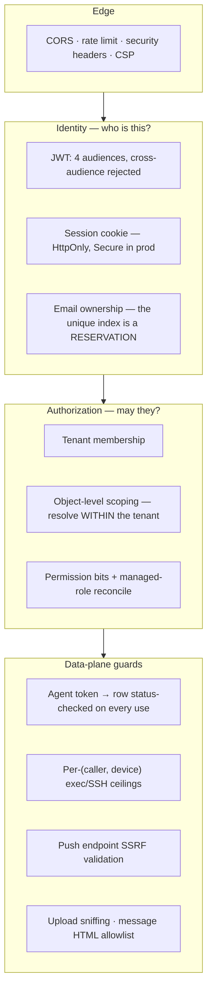

# Security baseline

The controls that hold the product's security properties up, and **why each one
is shaped the way it is**. Most were written after a real defect; the reasoning
is the load-bearing part, because nearly every one of them reads as an
over-complication to someone who did not see the failure.

> **Scope.** This is the *server and web* baseline. The device-side gates —
> exec, SSH, remote config, peer relays — are default-deny ladders documented
> with their features: [fleet-rpc.md](fleet-rpc.md), [roomler-ssh.md](roomler-ssh.md),
> [remote-config.md](remote-config.md), [fr/FR-19-peer-relays.md](fr/FR-19-peer-relays.md).
> The permission bit catalogue is [permissions.md](permissions.md).



---

## 1 · Identity and sessions

| Control | Shape |
|---|---|
| Access token | 7 d (`ROOMLER__JWT__*`) |
| Refresh token | 30 d |
| Hashing | Argon2 |
| Audiences | `Access` · `Refresh` · `Enrollment` (single-use, 10 min) · `Agent` (1 y) |

`verify_agent_token` rejects a user JWT and vice-versa; locked by tests in
`crates/services/src/auth/mod.rs::tests`.

**Cookies carry `Secure` in production** (`app.environment == "production"`;
plain http in dev so the localhost flow still works). The cookie *is* a full API
credential — the auth extractor accepts it — so it must never travel in
cleartext.

**JWT default secret**: with `app.environment=production` the server **refuses to
boot** on the built-in default secret. Development keeps a loud warning.

### The browser no longer holds tokens (closed 2026-08-25, re-verified 2026-08-26)

Browser sessions used to hand JS **both** tokens — access (7 d) + refresh (30 d)
in `localStorage` — and shipped the access token in URL **query strings**
(`/oauth/callback?token=`, `/ws?token=`) that nginx logged in plaintext. Any XSS
stole 30 days of re-mintable access that survived logout.

Closed by the cookie-only session work (#680/#682/#690/#691). Current state,
verified against the tree rather than from memory:

- the only `localStorage` use left is a boolean `SIGNED_IN` hint documented as
  *not* a credential (`ui/src/api/session.ts`), plus a one-shot purge of the
  legacy token keys;
- `ui/src/stores/ws.ts` no longer puts `token=` on the WS dial;
- `oauth_callback` returns the token in the **URL fragment**, which browsers
  never send to a server, so it cannot reach an access log or a `Referer`.

⚠️ Two transitional shims remain and can be dropped now both halves have rolled:
the server still appends `#token=` for cached older bundles, and
`OAuthCallbackView.vue`'s comments still describe accepting a query-string form
the code no longer reads.

### Open: user sessions are irrevocable

`logout` only clears the cookie, there is **no password-change flow at all** (no
route exists), and nothing checks a `token_epoch` (the identifier appears nowhere
in the tree). A stolen access token stays valid for its full 7 days, and
disabling or deleting a user does not end their live sessions. Refresh tokens are
not rotated, so reuse is undetectable.

**Fix** = a `token_epoch` in the claims, checked on verify.

⚠️ The **agent** half of this is fixed. `agent_log.rs` / `agent_crash.rs` no
longer parse the bearer themselves: both go through
`crates/api/src/extractors/agent.rs::AuthAgent`, which loads the row
(`find_in_tenant`) and refuses via `refusal_reason`.
⚠️ A lookup **failure is deliberately 500, not 401** — a Mongo blip must not tell
a healthy fleet its credentials were revoked, which would turn a database wobble
into an enrollment storm.
⚠️ **Deletion wins over status**: the cascade tombstones the row without
necessarily rewriting `status`, so an Online-looking tombstone still refuses.
Verified in the field 2026-08-30, when a throwaway device's agent JWT was
surfaced in a daemon log line and the device had already been deleted.

---

## 2 · Email ownership — the invariant that closes the nOAuth class

The invariant in `find_or_create_by_oauth` is that **`users.email` holds an
address only if that account PROVED it**. It is a UNIQUE index, so it is a
*reservation*, not a contact field, and it is what account-linking keys off.

Three rules implement it. All three are load-bearing:

1. An **unverified** provider assertion takes a `.invalid` placeholder (RFC 2606)
   with the claim recorded in the non-indexed `unverified_email` — so a hostile
   Entra tenant cannot even *reserve* an address it does not own, let alone link
   into one.
2. Linking checks the **target** account is verified too — otherwise an attacker
   registers `victim@corp` with a password, never activates, and collects the
   victim's later Google sign-in, after which the activation mail *that lands in
   the victim's own inbox* hands over a password login.
3. A proven identity **evicts** an unproven claim instead of inheriting it. Safe
   only because an unverified account cannot have been signed into (password
   login refuses it; any verified provider identity would have made it verified).

On top of those, **step 2c** refuses an *unverified* identity whose asserted
address already belongs to someone (#610). That one is a **UX policy, not a
security control**: it arrived as a mechanical necessity (the create used to
collide on email and blame the username) and the placeholder removed the
collision, so it could now mint a parallel account and simply chooses not to,
because that account would be invisible to whoever owns the address.

> Deleting 2c costs UX. Deleting any of the three above costs security.

⚠️ Do **not** "simplify" this back to a one-sided `email_verified` check — that
was the state between #360 and this fix, and it left both the reservation and the
unactivated-signup paths open. Locked by 4 unit tests on the placeholders + 4
integration tests in `oauth_tests`.
⚠️ #610 and #613 fixed the same defect with different designs, in parallel
sessions, and git auto-merged them cleanly — verify the result on the buildhost
lane, because CI does not run this crate.
⚠️ **Microsoft is the only provider that is *always* unverified** (its Graph
`mail`/UPN are tenant-settable); its `id` (the `oid`) stays trusted and is the
provider-identity key.

### OAuth CSRF

`oauth_redirect` binds its random `state` to the browser in a short-lived
`HttpOnly` `oauth_state` cookie, and `oauth_callback` **requires** the query
`state` to equal it (double-submit), clearing it one-shot.

Before this the state was minted and thrown away with the callback validating
nothing, so an attacker could feed a victim a pre-obtained `code` and silently
sign them into the **attacker's** account (login CSRF): everything the victim
then wrote landed in the attacker's account.

⚠️ Any test driving `/api/oauth/callback/*` directly must now send the cookie.

---

## 3 · Authorization

### Object-level tenant scoping (closes a CRITICAL cross-tenant break, 2026-08-23)

**`is_member(tid)` is NOT an authorization check for anything keyed by id.**

Any user can create a tenant for free (`routes/tenant::create` is gated only by
`AuthUser`), so a caller can *always* satisfy `is_member` for a tenant they own
and then pass **another** tenant's `room_id` / `message_id`. The older
collaboration handlers did exactly that, and the DAO reads (`find_in_room`,
`find_pinned`, `find_thread_replies`, `find_by_room`, `list_members`,
`list_participants`) filter by the bare id with **no `tenant_id`**.

That exposed every org's chat history, bulk xlsx export, room rosters, recordings
and live call state to any authenticated account, and allowed injecting
`@everyone` messages into another org's channel.

**The invariant now: resolve the object WITHIN the tenant before touching it** —
`helpers::require_room_in_tenant` / `require_message_in_tenant`. They check
membership *and* `find_by_id_in_tenant`, so a foreign id 404s and leaks neither
content nor existence.

⚠️ A handler keyed by `message_id` **must** use the message guard, not the room
one — the two ids are decoupled, so a caller can pass their own room with a
foreign message. This is why `reaction::add/remove` fan out to `message.room_id`,
not the path room.
⚠️ **Never re-fetch with a bare `find_by_id` after a tenant-scoped write**:
`message::update` did, and returned another tenant's content in the response even
though the write itself was correctly scoped.
⚠️ `room::join` additionally requires `is_open` — it previously had **no checks at
all**, so anyone could join any private room in any org and receive its WS
fan-out. `room::update`/`delete` now require `MANAGE_CHANNELS` (they were
member-only, so any guest could archive or cascade-delete a channel).

### A 403 is an answer, not an expired credential (FR-82)

Full treatment in [permissions.md](permissions.md). The two rules that bind new
code:

- **A 403 never ends a session, on any method.** The only 403 with a navigation
  is `not_a_member` (`ApiError::NotAMember` ⇒ `error: "not_a_member"`, a
  server-sent **code** — never a message-string sniff, because chat's
  `Forbidden("Not a member of this room")` is the same shape and must not evict
  anyone from their org), and it leaves the *tenant*, not the product.
- ⚠️⚠️ **The default direction is the guarantee**: an unclassified 403 does
  nothing but throw, so a newly-added gated route is inert on the client by
  construction.

- **A system-managed role is reconciled, not frozen at its birthday.** One
  `role::MANAGED_ROLES` table, reconciled by `TenantDao::reconcile_managed_roles`
  under the existing `startup_maintenance` lease.
  ⚠️⚠️ **Additive (`stored | definition`), never a replace** — a managed mask *is*
  editable, so overwriting would silently revoke an org's own grant.
  ⚠️⚠️ `EXEC_DEVICE`/`SSH_DEVICE` are in no row below the `ADMINISTRATOR` bypass,
  and `no_managed_role_below_administrator_seeds_a_root_shell` enforces it: the
  reconcile grants what the table says to **every existing org**, so
  `DEFAULT_ADMIN |= EXEC_DEVICE` — a one-token edit that reads as tidying — would
  open exec-as-SYSTEM deployment-wide at the next boot, with no migration to
  review and no admin action to audit.

### Per-(caller, device) ceilings on exec and SSH

`crates/api/src/rate_limit.rs`, wired into `agent_exec::authorize` and
`agent_ssh::decide`. `exec_limits`/`ssh_limits::RATE_LIMIT_PER_MINUTE` and the
`RateLimited` deny reasons existed but had **no production readers** — the
constants were dead and the variant was built only in tests. The HTTP
`tower_governor` is per-IP and never saw the device-originated
`rc:rpc.request` / `rc:ssh.request` WS legs, so those had no ceiling at all.

⚠️ Enforcement sits **after** the identity gates on purpose: a refusal is then
attributable and lands in `exec_audit`/`ssh_audit` like any other.
⚠️ It also protects the **target** — the device's pending-grant table holds 16 and
evicts the oldest, so an unthrottled caller could burst a legitimate caller's
un-redeemed grant out of existence.

### The SSH request route checks membership before the device lookup

`agent_ssh::member_tenant`, mirroring `agent_exec`. Without it a non-member could
distinguish "agent exists" (200 + refusal) from "no such agent" (404) across
tenants, write attacker-timed rows into another org's `ssh_audit`, and read
whether that org had `remote_ssh_enabled`.

---

## 4 · The device plane

**A WG public key cannot be claimed by two live nodes in a network** —
`overlay_nodes::wg_key_taken_by_other`, checked in `ws::overlay` join,
**fail-closed**.

The key is client-supplied but used as an **addressing** key (DERP authorizes
registration against it; WireGuard keys peers by it) and nothing proves
possession of the private half, so a second enrolled device could advertise a
peer's key and black-hole its DERP traffic (registration is last-writer-wins).

Live-scoped so tombstones do not block a joiner; `machine_id`-scoped so a device
rotating its **own** key is unaffected.

---

## 5 · Network-facing surfaces

### Web Push endpoints are SSRF-validated at subscribe time

`routes/push.rs::validate_push_endpoint`: https only, and every resolved address
must be globally routable — loopback, RFC1918, `169.254` metadata, CGNAT-and-overlay
`100.64/10`, ULA, link-local v6 and v4-mapped forms all refused; unresolvable
hosts refused.

The endpoint is browser-supplied and the **server POSTs to it from inside the
cluster** on every notification fan-out, so without this any user had a blind
SSRF + internal port-scan primitive.

⚠️ This is subscribe-time only — DNS can still rebind before send.

### CORS

Unset `cors_origins` allows **only the frontend's own origin** (it was `Any`
until 2026-07-28). An explicit `"*"` keeps permissive mode with a startup
warning. The restrictive branch enumerates methods/headers because
`allow_credentials(true)` + wildcard is rejected by tower-http at request time.

### Rate limiting

`tower_governor`, 60 req/min per IP.

### Security headers and CSP (`files/nginx-pod.conf`)

`X-Frame-Options`, `X-Content-Type-Options`, `Referrer-Policy`,
`Permissions-Policy`; HSTS + CSP added 2026-07-28.

**The CSP allowlist is load-bearing and non-obvious** (corrected 2026-07-29, #252):

```
script-src  'self' https://purestat.ai
connect-src 'self' wss: https: http://127.0.0.1:* http://localhost:*
```

| Entry | Why it must stay |
|---|---|
| `https://purestat.ai` | the site's own analytics, loaded in `index.html` |
| `http://127.0.0.1:*` / `http://localhost:*` | **required**: the remote-control viewer probes the local agent's loopback-TURN relay (`http://127.0.0.1:4798x/rc-local-turn`) and clipboard bridge (`rc-clipboard`, port bases 41989 + 47989) |

⚠️ The initial CSP (#242) omitted both and broke analytics + the RC loopback-relay
path **in prod** — the CSP validation had only exercised dashboard / auth /
websocket, never the RC viewer.
⚠️ **When touching CSP, re-scan `ui/` for external *and* loopback endpoints**
(`grep -rhoE "https?://…"`) and exercise the remote-control page, not just the
main SPA.

---

## 6 · Content the product accepts

### Uploads are sniffed, not trusted (fixed 2026-08-25)

File upload stored the client-supplied `content-type` verbatim.
`crate::media_type::resolve` now sniffs the bytes (`infer`) and stores what they
**actually** are; the claim is passed in only to be ignored, so the call sites
read as "we had a claim and did not use it". Both upload handlers go through it.

⚠️ The fallback for signature-less content is a **narrow extension map that
structurally cannot produce `image/*` or `text/html`** — those are exactly the
types worth lying about, so they must be proven by magic bytes; a `.png` name
alone gets `application/octet-stream`. A table-level test enforces that, because
adding `("svg", "image/svg+xml")` later would look reasonable in review and would
reintroduce the whole defect.
⚠️ It is **not** a whitelist of what a client may claim — a whitelist still trusts
the claim.
⚠️ **Correction to the 2026-08-23 re-rating**, which partly rested on "the UI only
ever renders `<a href=…>` (no iframe, no ``)": that is **false**.
`MessageBubble.vue` renders `<v-img :src="att.url">` for any attachment whose type
starts with `image/`. It still was not an XSS (an SVG in `` cannot run
script, and `openAttachment` is `window.open` → a top-level navigation, which
honours `Content-Disposition: attachment`) — but the reasoning was wrong, and the
render decision is now made on a sniffed type instead of a claimed one.
`integration.rs` also steers a recognition backend with this string.

### Message HTML

The sanitizer allowlist (`ui/src/composables/useMarkdown.ts`) deliberately
**excludes `style`** — author-controlled inline CSS let one chat message paint a
full-viewport `position:fixed` overlay inside the trusted origin (credential
phishing that no framing header stops) and fire a `background:url()` beacon at
every viewer. The mention preprocessor HTML-escapes its label/id, so that
string-concatenation step is not relying on DOMPurify's allowlist staying exactly
as it is.

⚠️ Treat `ALLOWED_TAGS` / `ALLOWED_ATTR` as a **security control**: it is the only
XSS boundary for message content.

### Downloads

`Content-Disposition` filenames are sanitized + RFC 5987 encoded on the file
download route (2026-05-23).

---

## 7 · Publishing identity — an allowlist at four layers

This repo is **public**, and two surfaces leak *who* rather than *what*, both
invisible to the machine-name guards:

- a commit's **author/committer email** — metadata, in no blob and no message, so
  `check_shapes.py` walks straight past it;
- a **GitHub account login** on an issue, comment, review or release — never
  touches git at all.

Found by audit: a second GitHub account — a corp one, whose *login alone* named an
employer — had authored one issue and three comments across three days spanning
eleven, plus 520 commits carrying a corp mailbox as their author address. Nothing
failed, nothing warned.

| Layer | Catches | Blind to |
|---|---|---|
| `.githooks/pre-commit` (`--pending`, pure bash+git so it runs where python does not) | the commit about to be made | pushes that skip hooks |
| `.githooks/pre-push` | **survives `--no-verify`** and a clone that never set `core.hooksPath` | GitHub-side writes |
| CI job **No foreign commit identity** | anything that reached a branch | account logins |
| `PreToolUse` hook `.claude/hooks/gh-account-guard.sh` | GitHub **writes** by the active `gh` account (reads always pass — auditing the wrong account is legitimate, and is what found this) | commits |

⚠️ **Allowlist, never a denylist.** A denylist would have to write the unwanted
addresses into a public file, publishing exactly what it removes, and only finds
mistakes someone already thought of. `.githooks/allowed-identities.txt` names only
already-public identities, and the selftest fails on a wildcard or a bare-domain
entry.
⚠️ **`gh auth switch` is GLOBAL** — it re-identifies every concurrent session from
a shared config, and `gh issue comment` prints a URL, not an identity, so the
mistake is invisible from inside the session making it. The hook refuses it
outright; `scripts/gh-scoped-config.sh` builds a config the other account is not
*in*.
⚠️ **`--require-commits` in CI is load-bearing**: an empty range otherwise answers
"all known" over zero commits — the same shape as a `cargo test` filter matching
no test.
⚠️ **Neither leak is recoverable downstream.** A commit identity can only be
*rewritten* (renumbering every SHA above it, and the old objects stay reachable
through `refs/pull/*`); an issue/comment author cannot be changed at all — only
delete-and-recreate, which dangles every reference to its number, including one
already baked into a merged commit subject.
⚠️ **The one hole no local layer closes**: a merge made through the GitHub web UI
is committed *on GitHub* from the email set on the **account**, after every hook
and PR check has passed.
⚠️ **A ruleset cannot close it here** — the whole metadata-rule family
(`commit_author_email_pattern`, `committer_email_pattern`,
`commit_message_pattern`, `branch_name_pattern`) is organisation-and-paid-plan
only and is refused with HTTP 422 on this user-owned repo, in `active` enforcement
as well (`evaluate` is separately Enterprise-only). Measured 2026-09-06 — do not
plan around it.

What covers it is the CI job's **push-to-master** run
(`github.event.before..github.sha`), which turns master red within a minute —
detection, not prevention. ⚠️ Its fallback is load-bearing and was exercised on
day one: after a force-push `event.before` names a commit that no longer exists,
so it falls back to `<sha>~1..<sha>` instead of erroring or silently scanning
nothing.

The actual fix for the account is GitHub Settings → Emails.

---

## 8 · Secrets and dependencies

- TURN `static-auth-secret` was rotated out of the repo on 2026-05-23 — the
  committed `turnserver.conf` carries a `CHANGE-ME` placeholder; the live value
  lives in the operator's `ROOMLER__TURN__SHARED_SECRET` env.
- **No git hooks for secrets**: there is no gitleaks/trufflehog scanner in CI.
  *(Open, [LOW], 2026-03-10.)*

### Dependency-uplift pass (2026-07-29)

**Rust** — cleared 4 advisories via precise semver-compatible lockfile bumps
(crossbeam-epoch 0.9.18→0.9.20 RUSTSEC-2026-0204, memmap2 0.9.10→0.9.11
RUSTSEC-2024-0429, quinn-proto 0.11.14→0.11.16 RUSTSEC-2026-0185, spin 0.9.8→0.9.9
yanked).

Deferred — each needs a **breaking direct-dep bump** and none is reachable in our
usage:

| Advisory | Why unreached |
|---|---|
| **rsa 0.7.2** Marvin timing ← web-push/jwt-simple | VAPID uses EC (ES256), not RSA-decrypt, so the timing oracle is not reachable |
| **lopdf 0.26.0** stack overflow ← genpdf (at its latest 0.2.0, upstream-blocked) | genpdf only *generates* PDFs, never parses untrusted input |
| **idna 0.5.0** punycode ← validator 0.18 | latest is 0.21, 3 breaking minors |
| **quick-xml 0.38.4** | transitive `^0.38` pin |

**JS** — the only runtime-reachable high is markdown-it→linkify-it (client-side
ReDoS on crafted message links), but the fix is only in linkify-it 6.x which
markdown-it 14 cannot import (`default` export removed → build break), so it is
ecosystem-blocked until markdown-it adopts 6.x. All other JS highs
(jsdom→undici, @vue/test-utils→js-cookie/minimatch, vue-router→rollup) are
dev/build tooling, never shipped in the prod bundle.

Re-run: `bun audit` (ui) + `cargo audit` (buildhost, `~/.cargo/bin`).

---

## 9 · Open gaps

| Sev | Since | Gap |
|---|---|---|
| MEDIUM | 2026-08-23 | **User sessions are irrevocable** — no `token_epoch`, no password-change route, no refresh rotation (§1) |
| LOW | 2026-03-10 | No secret scanner in CI, no pre-commit lint hooks (§8) |
| — | 2026-07-29 | Four Rust advisories + one JS advisory deferred as unreachable (§8) |

Device-side and updater gaps are tracked with their features:
[installation.md](installation.md) (updater trust chain),
[fr/README.md](fr/README.md) (everything in flight).
