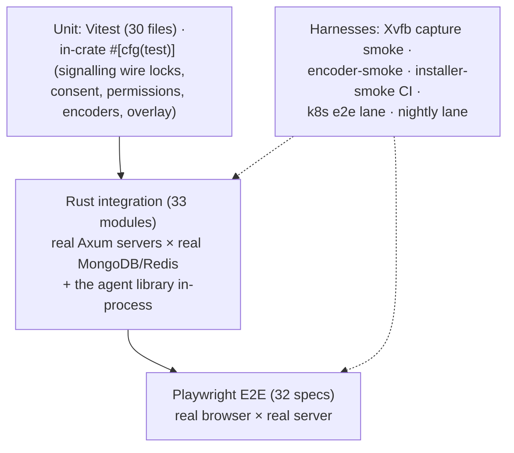

# Testing

Four layers, plus purpose-built harnesses for the parts a normal test runner can't
reach (screen capture, hardware encoders, installers, the k8s topology).
*As of 0.3.0-rc.381: 33 integration modules · 30 Vitest spec files · 32 Playwright
specs — the totals drift, the commands don't.*

## Commands (most specific first)

| Layer | Command | Needs |
|---|---|---|
| Backend integration | `cargo test -p roomler-ai-tests` | MongoDB `localhost:27019`, Redis `6379` |
| Remote-control crate | `cargo test -p roomler-ai-remote-control --lib` | nothing (wire-format locks, Hub, consent) |
| Agent library | `cargo test -p roomler-agent --lib` | nothing (default features) |
| Agent w/ media+input | `cargo test -p roomler-agent --lib --features full` | libxcb*-dev on Linux |
| Agent overlay tests | add `--features overlay-l3` | ⚠️ feature-gated — the default `--lib` run silently skips them |
| Frontend types+build | `cd ui && bun run build` | includes `vue-tsc --noEmit` |
| Frontend unit | `cd ui && bun run test:unit` (`:coverage`) | jsdom |
| E2E | `cd ui && bun run e2e` | dev stack on :5000/:5001 (`E2E_BASE_URL`, `E2E_API_URL`, `E2E_MAILPIT_URL` to point elsewhere) |
| Capture smoke | `./scripts/dev-xvfb.sh` | Xvfb — paints an xterm, runs the scrap-capture path headless |
| Encoder smoke | `roomlerd encoder-smoke --encoder hardware [--codec hevc]` | the host's GPU — 10 synthetic frames, prints the cascade's decisions |

## Rust integration tests (`crates/tests/`)

Each test spawns a **real Axum server** on a random port against a **unique
UUID-named database** (dropped on teardown). The agent-facing modules drive the
actual `roomler-agent` library in-process for full `rc:*` round-trips against a
TestApp — enrollment, sessions, tunnels, overlay joins, exec.

Coverage areas: auth · tenant (+archive) · member · role · room/channel · message ·
reaction · recording · file · invite · notification · oauth · billing ·
multi-tenancy · pagination · rate-limit · CORS · export (xlsx/pdf) · conference
(+messages) · cluster · stats · relay-region · remote-control · agent
(+e2e, +crash, +exec, +presence) · overlay · tunnel.

## Frontend tests

- **Vitest** (`ui/src/__tests__/`): stores (auth, messages, rooms, ws — including
  the `rc:*` channel — notifications, conference, tenants, files, agents…),
  composables (`useRemoteControl` HID + button-mapping locks, validation,
  markdown, snackbar), API client, plugins.
- **Playwright** (`ui/e2e/`): auth, chat (multi-client, pagination, reactions,
  threads, mentions), rooms + files panel, conference (list/chat/multi),
  websocket + connection status, billing, invite, oauth, email flows,
  notifications, observability, profile, responsive, 404 — plus the
  remote-control lane: `remote-session-smoke`, `remote-file-upload-smoke`,
  `rc-vp9-444` (needs an agent built with the feature), and a field-host upload
  spec. Chromium runs with fake media devices for WebRTC.

## In-crate Rust unit tests

The load-bearing ones: `remote_control` locks the **wire format** (every `rc:*`
tag pinned, ObjectId-as-hex, pipe-separated `Permissions`) so a rename is a
deliberate break; agent-side crates cover encoder cascades, config migration,
ACLs, and overlay internals under their feature flags.

## CI & special lanes

| Lane | What it does |
|---|---|
| `ci.yml` | fmt + clippy (`--workspace --all-targets --all-features -D warnings`) + tests + frontend build on every push |
| `installer-smoke.yml` | Installs and uninstalls the freshly-built per-user MSI on a Windows runner |
| k8s e2e (`scripts/e2e-k8s.sh`, `Dockerfile.agent-e2e`) | The suite against a standing cluster namespace — validates the real multi-pod topology |
| Nightly (`scripts/e2e-nightly.sh`) | Full E2E against the current prod tag, diffed against an expected-failures list; regressions file an issue |

Known environmental failures (conference specs without forwarded RTC ports,
mailpit-dependent flows, the containerized-Chromium Google-OAuth redirect test)
are tracked in `scripts/e2e-expected-failures.txt` rather than papered over.
