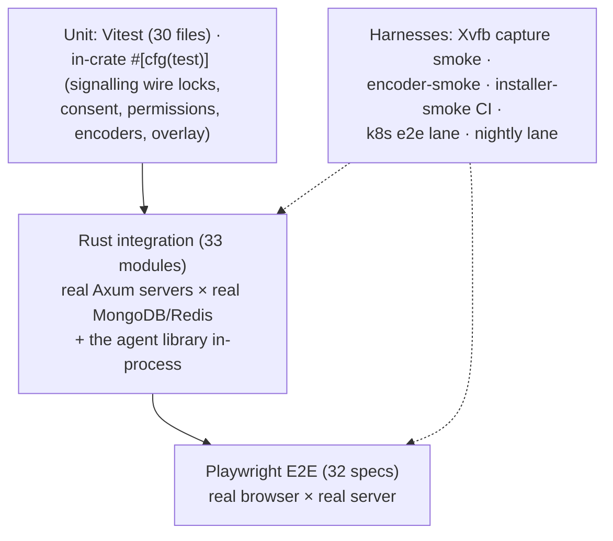
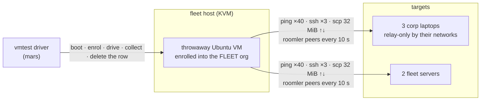

# Testing

Four layers, plus purpose-built harnesses for the parts a normal test runner can't
reach (screen capture, hardware encoders, installers, the k8s topology).
*As of 0.3.0-rc.381: 33 integration modules · 30 Vitest spec files · 32 Playwright
specs — the totals drift, the commands don't.*

## Commands (most specific first)

| Layer | Command | Needs |
|---|---|---|
| Backend integration | `cargo test -p roomler-ai-tests` | MongoDB `localhost:27019`, Redis `6379` |
| Remote-control crate | `cargo test -p roomler-ai-remote-control --lib` | nothing (wire-format locks, Hub, consent) |
| Agent library | `cargo test -p roomlerd --lib` | nothing (default features) |
| Agent w/ media+input | `cargo test -p roomlerd --lib --features full` | libxcb*-dev on Linux |
| Agent overlay tests | add `--features overlay-l3` | ⚠️ feature-gated — the default `--lib` run silently skips them |
| Frontend types+build | `cd ui && bun run build` | includes `vue-tsc --noEmit` |
| Frontend unit | `cd ui && bun run test:unit` (`:coverage`) | jsdom |
| E2E | `cd ui && bun run e2e` | dev stack on :5000/:5001 (`E2E_BASE_URL`, `E2E_API_URL`, `E2E_MAILPIT_URL` to point elsewhere) |
| Capture smoke | `./scripts/dev-xvfb.sh` | Xvfb — paints an xterm, runs the scrap-capture path headless |
| Encoder smoke | `roomlerd encoder-smoke --encoder hardware [--codec hevc]` | the host's GPU — 10 synthetic frames, prints the cascade's decisions |

## Rust integration tests (`crates/tests/`)

Each test spawns a **real Axum server** on a random port against a **unique
UUID-named database** (dropped on teardown). The agent-facing modules drive the
actual `roomlerd` library in-process for full `rc:*` round-trips against a
TestApp — enrollment, sessions, tunnels, overlay joins, exec.

Coverage areas: auth · tenant (+archive) · member · role · room/channel · message ·
reaction · recording · file · invite · notification · oauth · billing ·
multi-tenancy · pagination · rate-limit · CORS · export (xlsx/pdf) · conference
(+messages) · cluster · stats · relay-region · remote-control · agent
(+e2e, +crash, +exec, +presence) · overlay · tunnel.

## Frontend tests

- **Vitest** (`ui/src/__tests__/`): stores (auth, messages, rooms, ws — including
  the `rc:*` channel — notifications, conference, tenants, files, agents…),
  composables (`useRemoteControl` HID + button-mapping locks, validation,
  markdown, snackbar), API client, plugins.
- **Playwright** (`ui/e2e/`): auth, chat (multi-client, pagination, reactions,
  threads, mentions), rooms + files panel, conference (list/chat/multi),
  websocket + connection status, billing, invite, oauth, email flows,
  notifications, observability, profile, responsive, 404 — plus the
  remote-control lane: `remote-session-smoke`, `remote-file-upload-smoke`,
  `rc-vp9-444` (needs an agent built with the feature), and a field-host upload
  spec. Chromium runs with fake media devices for WebRTC.

## In-crate Rust unit tests

The load-bearing ones: `remote_control` locks the **wire format** (every `rc:*`
tag pinned, ObjectId-as-hex, pipe-separated `Permissions`) so a rename is a
deliberate break; agent-side crates cover encoder cascades, config migration,
ACLs, and overlay internals under their feature flags.

## CI & special lanes

| Lane | What it does |
|---|---|
| `ci.yml` | fmt + clippy (`--workspace --all-targets --all-features -D warnings`) + tests + frontend build on every push |
| `installer-smoke.yml` | Installs and uninstalls the freshly-built per-user MSI on a Windows runner |
| k8s e2e (`scripts/e2e-k8s.sh`, `Dockerfile.agent-e2e`) | The suite against a standing cluster namespace — validates the real multi-pod topology |
| Nightly (`scripts/e2e-nightly.sh`) | Full E2E against the current prod tag, diffed against an expected-failures list; regressions file an issue |
| vmtest install matrix (FR-61, private `roomler-ai-deploy/vmtest`) | Throwaway VMs on the fleet hosts install from the real served scripts and installers, enrol into a test org, and check overlay + remote desktop + the desktop app per OS × method × type; an unexpected failure files a `vmtest:` issue |
| **Overlay stress lane** (FR-81, `vmtest.sh run --lane stress`) | A throwaway VM enrolled into the **fleet** org measures latency distributions, SSH success, bulk transfer and carrier stability against the real fleet, on a direct and a forced-relay arm — [below](#the-overlay-stress-lane-fr-81) |

Known environmental failures (conference specs without forwarded RTC ports,
mailpit-dependent flows, the containerized-Chromium Google-OAuth redirect test)
are tracked in `scripts/e2e-expected-failures.txt` rather than papered over.

## The overlay stress lane (FR-81)

Everything the mesh promises is a **latency and stability** claim, and before this lane nothing
measured either: the install matrix proves a device installs and pings once, the profile matrix
(FR-75) that a build carries traffic once. This lane asks the mesh to keep working for over an
hour under real traffic, against the machines people actually use — corporate laptops behind
middleboxes and the fleet servers — and records **distributions**, not a single ping.

### The two arms

| arm | how the VM gets its carrier | why it exists |
|---|---|---|
| `direct` | the overlay's defaults — the carrier ladder picks the best path that works | the real-world numbers |
| `relay` | `overlay_direct = false` on the VM only ([`config.rs:324`](../crates/agent-core/src/config.rs#L324)), which leaves only relayed carriers | the relayed baseline for every target, including the servers that the direct arm reaches directly |

The direct arm's corp-laptop rows are the **control** for the relay arm: those laptops have no
direct path at all, so where both arms relay, matching numbers show the forcing knob is not what
the relay arm measures.

### What each measurement means — and why none asserts which carrier won

| column | what it measures | how |
|---|---|---|
| `carrier` | the carrier in use, with its `why` evidence | `roomler peers` / `roomler why` |
| latency | p50 / p95 / max / loss over 40 samples | `roomler ping` |
| SSH | grant-issued session success, 3 per target | `roomler ssh <t> -- <trivial>` |
| throughput | 32 MiB up and down, sha256-verified, per-direction ms timing | `scp` over `roomler proxy` with a client key in the target's `ssh_authorized_keys` |
| stability | carrier **transitions** over the arm | `roomler peers` sampled every 10 s from the VM |

⚠️ **The carrier is reported, never asserted.** The recon behind FR-81 found two of the corp
laptops with no UDP egress at all and the third behind a symmetric NAT with the relay band
blocked, so `direct` is structurally unreachable for them. A matrix demanding `direct` would report
three permanent reds for a mesh behaving correctly. The lane asserts only what must hold on every
carrier: the target is reachable, the bytes arrive intact, and the carrier stays put.

⚠️ **Stability counts transitions from an allow-list of carrier shapes** (`direct`, `lan`,
`relay:*`). The `CONN` column of `roomler peers` also carries *states* — `upgrading` (a
make-before-break probe on a relayed peer, [`localclient.rs:1259`](../agents/roomler-cli/src/localclient.rs#L1259)),
`stalled`, `offline` — and counting those as carriers once reported a healthy peer as flapping.
They are tallied separately, and any value outside both lists is **reported, never counted**.
A result reads `transitions=<n>/<k>samples`: for three runs the lane printed
`carrier_transitions=0` over **zero** samples (the sampler's output was never collected), so a
zero is only a measurement next to its sample count.

⚠️ **Throughput is VM-sender-limited**, about 1 MiB/s on any carrier, while bare-metal
server-to-server over the same mesh does ~56–66 MiB/s. The column proves integrity and
both-direction completion; it is not a capacity figure, and the lane says so in-line
(`throughput_is=vm-sender-limited`).

### What it found

The lane has paid for itself in product bugs — each invisible to CI, because each needs a real
corporate laptop, a real relay path, or both:

| found | defect | fix |
|---|---|---|
| round 2 | `scp` exited 1 after every *successful* transfer: the sftp subsystem never sent an exit status | #1559 — the pump waits for the child and reports it ([`ssh.rs:1065`](../agents/roomlerd/src/ssh.rs#L1065)) |
| round 2 | a device whose stored SSH host key was unreadable published **no** key, permanently, so no caller could verify it | #1565 — an unreadable key counts as no key and is replaced ([`ssh.rs:404`](../agents/roomlerd/src/ssh.rs#L404)) |
| round 3 | a caller with a faster control path than the target dialled before the target had its grant: `Permission denied (publickey)`, 0/3 on one laptop | FR-83 (#1597) — the server answers only after the device confirms the grant ([`agent_ssh.rs:435`](../crates/modules/network/src/routes/agent_ssh.rs#L435)) |
| round 3 | `roomler proxy`'s own `--help` recipe could not work (`%h` arrives as `<name>.roomler`) | #1573 — the suffix and the MagicDNS domain are stripped ([`localclient.rs:598`](../agents/roomler-cli/src/localclient.rs#L598)) |

### Reference run — `20260924-155559`, every target on agent 0.4.101

| target | carrier (direct · relay) | loss | p50 / p95 ms (direct) | SSH (both arms) | scp 32 MiB | transitions (per arm) |
|---|---|---|---|---|---|---|
| CORPLAP-1 | relay · relay | 0 % | 43 / 70 | 6/6 | ✅ sha256 | 0 / 189 samples |
| CORPLAP-2 | relay · relay | 0 % | 56 / 79 | 6/6 | ✅ sha256 | 0 / 189 |
| CORPLAP-3 | relay · relay | 0 % | 47 / 90 | 6/6 | ⛔ the target has no `sftp-server` | 0 / 189 |
| fleet server A | relay · relay | 0 % | 2 / 3 | 6/6 | ✅ sha256 | 0 / 189 |
| fleet server B | **direct** · relay | 0 % | 0 / 0 | 6/6 | ✅ sha256 | 0 / 189 |

### The rails

- **It enrols into the fleet org** — the one lane that does, because the mesh is tenant-scoped and a
  test-org VM cannot see a fleet-org laptop at all. The org does not allow ephemeral keys, so the
  VM joins with a standard single-use token and there is **no self-cleaning net**: the cell deletes
  its own device row from an `EXIT` trap and the run asserts the device count is back at baseline.
- **Nothing on a corp laptop is configured, restarted or left behind.** Carrier pinning happens
  only on the VM; the transfer payload is deleted and the deletion verified as the identity that
  wrote it.
- ⚠️ `PUT …/agent/{id}/ssh-policy` is a **full replace**. The lane grants the VM `can_originate`
  through that object, so any probe that writes a partial policy onto a live lane VM revokes it —
  measured: a whole arm's SSH column read 0/15 *"not permitted to originate"* while the verdict
  stayed green. Read the stored policy, change one field, restore the original.
- It is **opt-in** (`--lane stress`) and takes about 2 h 50 min for both arms. The target list,
  credentials and the client key live in a private env file on the driver host, never in git — they
  name real machines.
