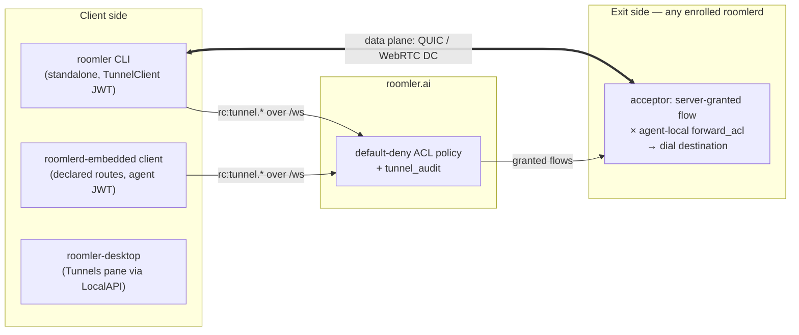
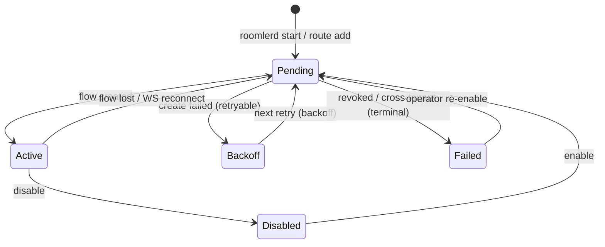
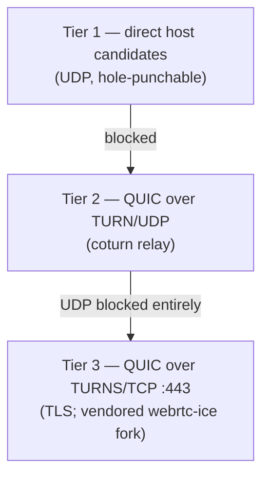
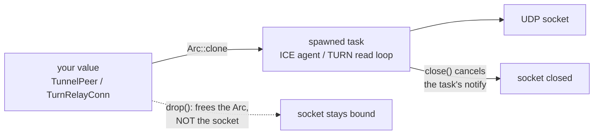

# Tunnels — Concepts & Protocol

How a port on your laptop becomes any `host:port` an enrolled machine can reach.
This is the concepts/reference page; the step-by-step runbook is
[tunnel-install.md](tunnel-install.md), the 5-minute overview is
[agent-tunnel-architecture.md](agent-tunnel-architecture.md), and the L3 mesh the
tunnels increasingly ride on is [overlay-communication.md](overlay-communication.md).
*As of 0.3.0-rc.381.*

## Roles and flow types



| Flow type | What it does |
|---|---|
| **TCP forward** | `roomler forward --agent <name> --local 127.0.0.1:5432 --remote db:5432` — a local listener whose connections come out of the chosen agent |
| **SOCKS5 (single agent)** | `roomler socks5 --agent <name> --local 127.0.0.1:1080` — RFC 1928 proxy exiting through one agent. CONNECT **and UDP ASSOCIATE** are supported (one UDP flow per destination, idle-reaped); BIND is not |
| **SOCKS5 mesh** | `roomler socks5 --local …` (no `--agent`) — one proxy for the whole tenant: address an agent *by name or id as the SOCKS hostname*, and LAN-IP targets route by longest-prefix match against the subnets agents advertise |
| **Declared routes** | `[[tunnel_routes]]` in the daemon config — `roomlerd` supervises the listeners itself, restart-safe, managed via `roomler route add/rm/ls/enable/disable` or the desktop app |
| **Overlay netstack SOCKS** | a loopback SOCKS5 front into the WireGuard mesh itself (peer names / MagicDNS / overlay IPs, TCP + UDP) — no OS TUN device required |

Declared routes live in a supervisor with explicit state — a revoked or
cross-tenant route parks as `failed` and never hammers the server:



## Data-plane transports

Signalling always rides the control WebSocket (`rc:tunnel.*`,
[real-time.md](real-time.md)); flow bytes ride one of the negotiated transports:

| Transport | Wire | Properties |
|---|---|---|
| `quic-v1` (preferred) | quinn; one bidirectional stream per flow | Ephemeral self-signed certs, **SHA-256 fingerprint pinned over signalling** (no CA); low overhead, stream-multiplexed |
| `webrtc-dc-v1` (fallback) | SCTP DataChannel pool with 4-byte flow-mux framing | `bufferedAmountLow` backpressure; the native⇄native SCTP window is raised to 8 MiB (vendored fork) so throughput stays link-bound at high BDP |

QUIC climbs a relay ladder — each side picks its tier independently, so one
NAT-ed side doesn't drag both onto a relay:



Two force-multipliers:

- **Loopback TURN host**: every agent runs an in-process TURN server on loopback
  + its overlay IP (coturn-REST-shaped ephemeral creds). A viewer or client on
  the same machine/LAN gets a "relayed" path with zero WAN round-trip — which is
  why relayed-but-local flows are exempt from the relay bitrate caps.
- **Overlay as carrier**: when both nodes are in the mesh, tunnel flows can ride
  the WireGuard data plane (`wireguard-v1` capability) instead of building their
  own P2P session.

Feature negotiation is version-gated (`agent_supports_quic` / `…_overlay`), so
mixed-version fleets degrade to the transports both ends speak.

### ⚠️ A WebRTC peer MUST be `close()`d — dropping it frees NOTHING

Fixed 2026-08-22. An `RTCPeerConnection`'s UDP sockets — one host candidate per
local address, plus webrtc-ice's mDNS listener on `0.0.0.0:5353` — are owned by
**tasks the ICE agent spawned**, not by the struct, so an `Arc` drop leaves every
one of them live.

`tunnel_core::transport::webrtc_dc::TunnelPeer` had no `close()` and no `Drop`,
and `run_tunnel_session` has many `?` early returns, so **every failed tunnel
session leaked its whole socket set**.

Measured on devbox: `roomlerd` held **15,446 UDP sockets after 12 h** (10,367 on
`:5353`) — the entire 16,384-port ephemeral range. Every socket allocation on the
**host** then failed `WSAENOBUFS`/10055 and **the whole machine lost DNS**, while
`ping 1.1.1.1` stayed at 3 ms.

⚠️ **That signature — names unresolvable, IPs fine, `nslookup` "No response" even
from a reachable server — is a socket-exhaustion tell, not a DNS-server problem.**
Check this first:

```bash
netstat -ano -p UDP | awk '{print $NF}' | sort | uniq -c | sort -rn | head
```

⚠️ It also masquerades as flaky tests: the QUIC/relay-probe loopback tests fail
with the same 10055 when the host is starved.

The fix is an explicit `close()` plus a `Drop` net that spawns it, mirroring
`AgentPeer`. mDNS is additionally `Disabled` in the tunnel `SettingEngine` — it is
a browser privacy feature, both ends here are ours, and `MulticastDnsMode`
defaults to `QueryOnly`, which still binds 5353.

**The amplifier is fixed alongside**: the flow supervisor reset its retry ladder
on *any* clean session end, so a flow that opened and died on arrival span hammered
at the 1 s floor forever. A reset now requires `SESSION_RAN_THRESHOLD` (30 s) of
actual uptime — the condition the code comment already assumed.

> The same ownership trap on a different object — a **TURN client** — was the
> root cause of [FR-48](fr/FR-48-roomlerd-ice-socket-leak.md); it is the next
> section.

### ⚠️ A TURN client MUST be `close()`d too — FR-48

Found 2026-09-23, fixed in #1556: **the same trap as the WebRTC peer above, on a
different object.** The sockets are owned by a task the library spawned, not by
the value you are holding, so a drop releases nothing.



| | WebRTC peer (2026-08-22, above) | TURN client (FR-48, #1086) |
|---|---|---|
| Owner of the socket | tasks the ICE agent spawned | the read loop `Client::listen()` spawned |
| What a drop frees | nothing | nothing — `turn` has **no `Drop` impl at all** |
| What closes it | `RTCPeerConnection::close()` | `Client::close()` → `close_notify.cancel()` |
| Measured cost | **15 446 UDP sockets in 12 h** — the whole ephemeral range | ~**+8 sockets/h** on every overlay node, never reclaimed |

On Linux the check is the pid-scoped count — ⚠️ scope it to the pid, because
`grep roomlerd` also matches any other process of that name:

```bash
ss -H -uanp | grep "pid=$(pgrep -x roomlerd | head -1)," | wc -l
```

⚠️ **The dominant leak path is CANCELLATION, not an error return.** Every caller
wraps `allocate_turn_relay_*` in `tokio::time::timeout`, so on a node that cannot
reach coturn the whole future is *dropped* mid-`allocate()` — a fix that closed
only on the `?` paths would pass a happy-path test and leak exactly the case that
actually happens. Hence `ClientCloseGuard`, armed *before* `listen()` and closing
on any exit including a discarded future, plus a `Drop` on `TurnRelayConn` for the
live conn (`crates/tunnel-core/src/transport/relay.rs`).

⚠️ **A comment is not a guarantee.** `TurnRelayConn._client` carried
*"dropping it closes the allocation on coturn"* for months. It was false, and it
is what every later reader reasoned from.

🔑 **Regression tests for this class must count file descriptors, not mock a
close** — `a_cancelled_turn_allocate_does_not_strand_its_underlay_socket` reads
`/proc/self/fd` across six cancelled allocates, and reports `13 -> 19` with the
guard reverted: one stranded descriptor per attempt. A test that cannot go red
proves nothing.

## Policy — two independent gates

1. **Server-side ACL** (`tunnel_policies`, default-deny): evaluated per flow open
   as *subject* (user / tunnel client) × *target* (agent) × *destination*
   (`host:port`, protocol). Managed in the admin UI; every decision lands in
   `tunnel_audit` (90 d).
2. **Agent-local `forward_acl`** (config.toml): the exit machine's own last word —
   it survives a compromised server. Empty-but-enabled means "trust the server".

## LocalAPI

The on-host control surface — how `roomler`, `roomler-desktop`, and scripts talk
to a running `roomlerd` without any token:

- **Endpoints**: Windows named pipe `\\.\pipe\roomler` (SYSTEM + Admins +
  Interactive Users, no-write-up); Unix socket `$XDG_RUNTIME_DIR/roomler.sock`
  (0600).
- **Protocol**: newline-delimited JSON, `{"t": "<verb>", "d": {…}}`.

| Verbs | Purpose |
|---|---|
| `Status` · `Peers` · `Flows` | Node status, mesh peers (carrier, RTT, upgrade state), live flows |
| `Ping {target, timeout_ms, prefer_v6}` | Overlay reachability probe |
| `CreateForward` · `CreateSocks5` · `KillFlow` | Imperative flow control |
| `RouteList` · `RouteAdd` · `RouteRemove` · `RouteSetEnabled` | Declared-route management (`RouteDescriptor` is one type for wire + disk) |
| `ConsentPending` · `ConsentDecide` | Remote-desktop consent prompts (how the tray approves sessions under a SYSTEM service) |
| `SetDeviceName` | Rename the node |

## CLI

`roomler` is the tunnel CLI on every platform; on daemon hosts the installed
`roomler` binary is a ~150 KB shim that re-execs `roomlerd cli` — one command
surface, no version skew. On macOS the shim lands at `/usr/local/bin/roomler`
and resolves the daemon inside the `.app` bundle, since there the two binaries
cannot be siblings. (Before rc.454 the macOS `.pkg` shipped **no** CLI at all.) Highlights (run `roomler --help` for the full set):

| Verb | Purpose |
|---|---|
| `enroll --server --token --name` | Enroll this machine as a tunnel client |
| `forward` / `socks5` | Open flows (above); `--transport auto\|quic\|webrtc`; `--daemon` hands ownership to `roomlerd` |
| `route add/rm/ls/enable/disable` | Declared routes |
| `status` / `peers` / `flows` / `ping` (`--json`) | Live node state via LocalAPI |
| `kill <flow-id>` · `rename <name>` · `logs` · `config ls/set/clear` | Node management |
| `exec` | Run a command on a fleet device — four default-deny gates, full audit ([fleet-rpc.md](fleet-rpc.md)) |
| `diag host` / `diag pair` | Diagnostic evidence bundles (CLI-side, so new probes don't need a fleet rollout) |
| `self-update` | Tunnel-only hosts update in place; on daemon hosts the MSI/.deb owns the binaries and the shim refuses |

## Corporate-network behaviour

The whole stack is built to work from inside strict networks: outbound-only WSS
control links, TURNS/TCP on :443 as the transport of last resort, the DERP
fallback for the overlay, and installer downloads proxied through `roomler.ai`
(not `github.com`) so AV allow-lists trust them. The field-tested walkthrough —
including TLS-inspecting middleboxes and UDP-free networks — is
[tunnel-install.md](tunnel-install.md).
