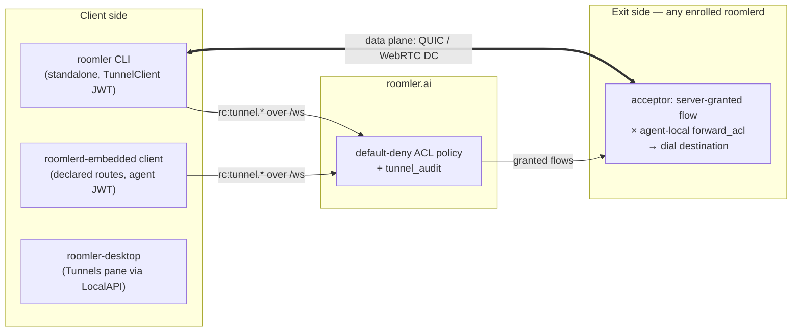
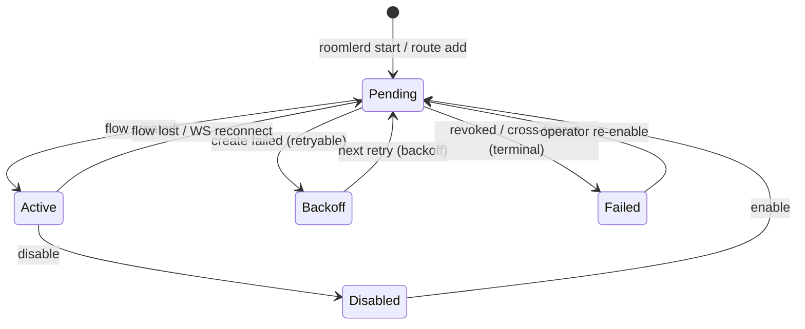
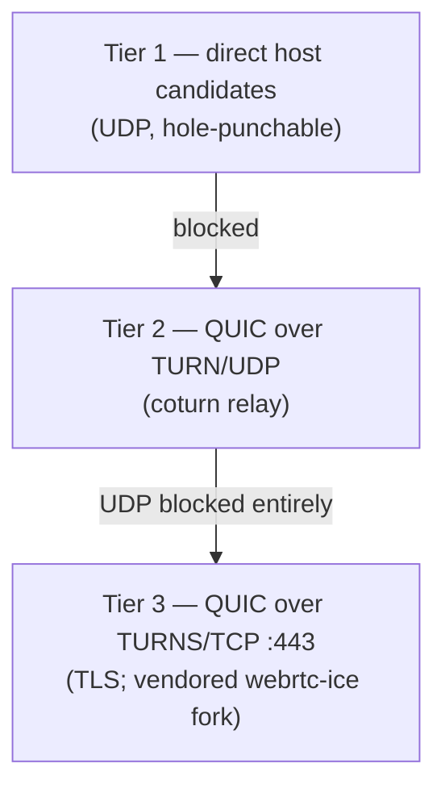
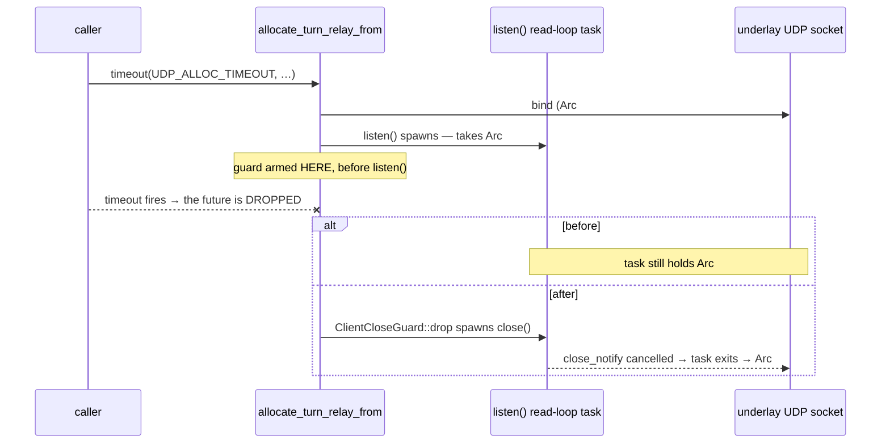
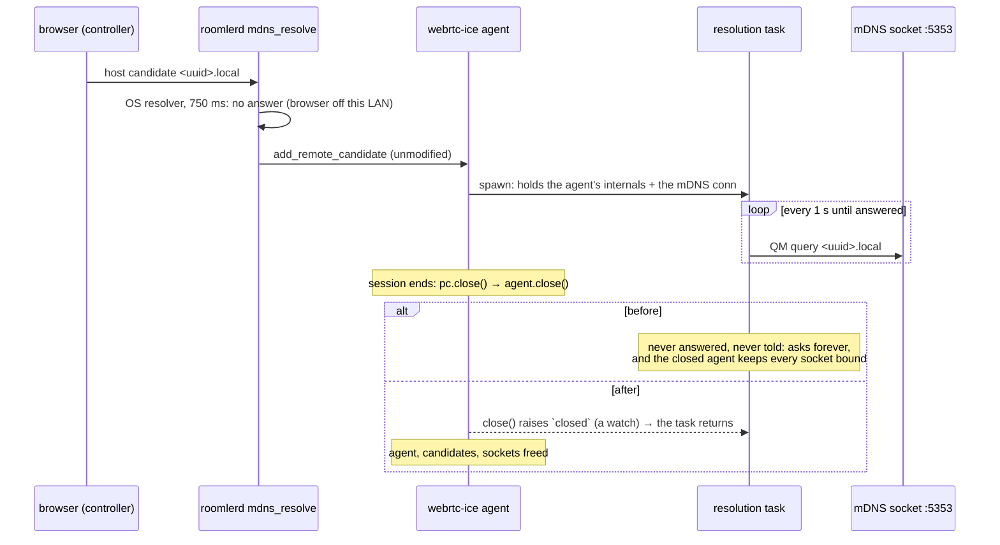
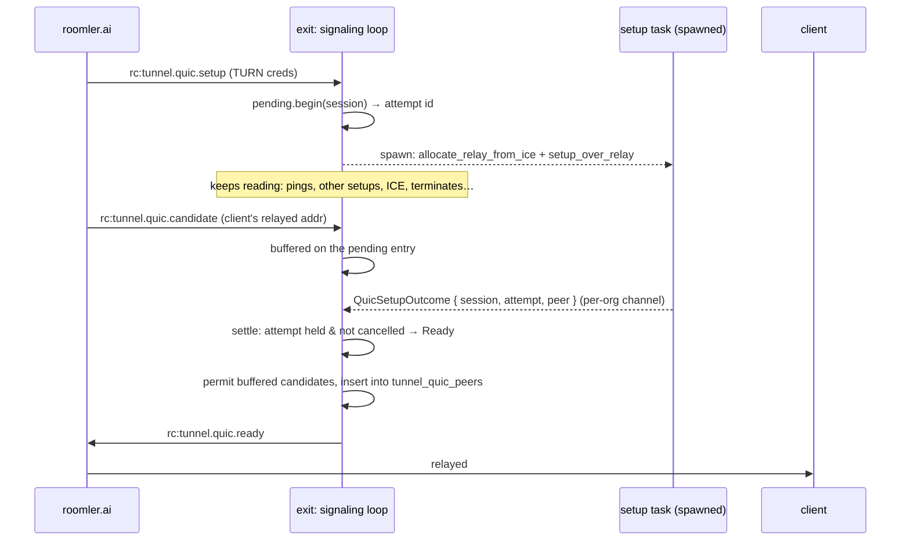
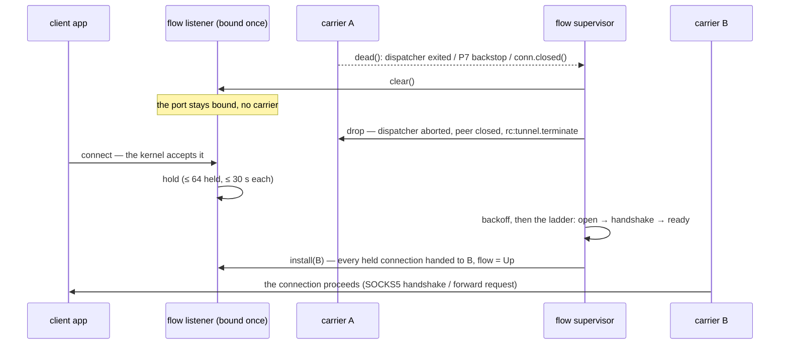

# Tunnels — Concepts & Protocol

How a port on your laptop becomes any `host:port` an enrolled machine can reach.
This is the concepts/reference page; the step-by-step runbook is
[tunnel-install.md](tunnel-install.md), the 5-minute overview is
[agent-tunnel-architecture.md](agent-tunnel-architecture.md), and the L3 mesh the
tunnels increasingly ride on is [overlay-communication.md](overlay-communication.md).
*As of 0.3.0-rc.381.*

## Roles and flow types


```mermaid
flowchart LR
    subgraph client["Client side"]
        CLI["roomler CLI<br/>(standalone, TunnelClient JWT)"]
        DMN["roomlerd-embedded client<br/>(declared routes, agent JWT)"]
        DESK["roomler-desktop<br/>(Tunnels pane via LocalAPI)"]
    end

    subgraph server["roomler.ai"]
        POL["default-deny ACL policy<br/>+ tunnel_audit"]
    end

    subgraph exit["Exit side — any enrolled roomlerd"]
        ACC["acceptor: server-granted flow<br/>× agent-local forward_acl<br/>→ dial destination"]
    end

    CLI & DMN -->|"rc:tunnel.* over /ws"| POL -->|granted flows| ACC
    CLI <==>|"data plane: QUIC / WebRTC DC"| ACC
```

| Flow type | What it does |
|---|---|
| **TCP forward** | `roomler forward --agent <name> --local 127.0.0.1:5432 --remote db:5432` — a local listener whose connections come out of the chosen agent |
| **SOCKS5 (single agent)** | `roomler socks5 --agent <name> --local 127.0.0.1:1080` — RFC 1928 proxy exiting through one agent. CONNECT **and UDP ASSOCIATE** are supported (one UDP flow per destination, idle-reaped); BIND is not |
| **SOCKS5 mesh** | `roomler socks5 --local …` (no `--agent`) — one proxy for the whole tenant: address an agent *by name or id as the SOCKS hostname*, and LAN-IP targets route by longest-prefix match against the subnets agents advertise |
| **Declared routes** | `[[tunnel_routes]]` in the daemon config — `roomlerd` supervises the listeners itself, restart-safe, managed via `roomler route add/rm/ls/enable/disable` or the desktop app |
| **Overlay netstack SOCKS** | a loopback SOCKS5 front into the WireGuard mesh itself (peer names / MagicDNS / overlay IPs, TCP + UDP) — no OS TUN device required |

Declared routes live in a supervisor with explicit state — a revoked or
cross-tenant route parks as `failed` and never hammers the server:


```mermaid
stateDiagram-v2
    [*] --> Pending: roomlerd start / route add
    Disabled --> Pending: enable
    Pending --> Active: flow created
    Pending --> Backoff: create failed (retryable)
    Backoff --> Pending: next retry (backoff)
    Active --> Pending: flow lost / WS reconnect
    Pending --> Failed: revoked / cross-tenant (terminal)
    Active --> Disabled: disable
    Failed --> Pending: operator re-enable
```

## Data-plane transports

Signalling always rides the control WebSocket (`rc:tunnel.*`,
[real-time.md](real-time.md)); flow bytes ride one of the negotiated transports:

| Transport | Wire | Properties |
|---|---|---|
| `quic-v1` (preferred) | quinn; one bidirectional stream per flow | Ephemeral self-signed certs, **SHA-256 fingerprint pinned over signalling** (no CA); low overhead, stream-multiplexed |
| `webrtc-dc-v1` (fallback) | SCTP DataChannel pool with 4-byte flow-mux framing | `bufferedAmountLow` backpressure; the native⇄native SCTP window is raised to 8 MiB (vendored fork) so throughput stays link-bound at high BDP |

QUIC climbs a relay ladder — each side picks its tier independently, so one
NAT-ed side doesn't drag both onto a relay:


```mermaid
flowchart TB
    T1["Tier 1 — direct host candidates<br/>(UDP, hole-punchable)"] -->|blocked| T2["Tier 2 — QUIC over TURN/UDP<br/>(coturn relay)"]
    T2 -->|"UDP blocked entirely"| T3["Tier 3 — QUIC over TURNS/TCP :443<br/>(TLS; vendored webrtc-ice fork)"]
```

Two force-multipliers:

- **Loopback TURN host**: every agent runs an in-process TURN server on loopback
  + its overlay IP (coturn-REST-shaped ephemeral creds). A viewer or client on
  the same machine/LAN gets a "relayed" path with zero WAN round-trip — which is
  why relayed-but-local flows are exempt from the relay bitrate caps.
- **Overlay as carrier**: when both nodes are in the mesh, tunnel flows can ride
  the WireGuard data plane (`wireguard-v1` capability) instead of building their
  own P2P session.

Feature negotiation is version-gated (`agent_supports_quic` / `…_overlay`), so
mixed-version fleets degrade to the transports both ends speak.

### ⚠️ A WebRTC peer MUST be `close()`d — dropping it frees NOTHING

Fixed 2026-08-22. An `RTCPeerConnection`'s UDP sockets — one host candidate per
local address, plus webrtc-ice's mDNS listener on `0.0.0.0:5353` — are owned by
**tasks the ICE agent spawned**, not by the struct, so an `Arc` drop leaves every
one of them live.

`tunnel_core::transport::webrtc_dc::TunnelPeer` had no `close()` and no `Drop`,
and `run_tunnel_session` has many `?` early returns, so **every failed tunnel
session leaked its whole socket set**.

Measured on devbox: `roomlerd` held **15,446 UDP sockets after 12 h** (10,367 on
`:5353`) — the entire 16,384-port ephemeral range. Every socket allocation on the
**host** then failed `WSAENOBUFS`/10055 and **the whole machine lost DNS**, while
`ping 1.1.1.1` stayed at 3 ms.

⚠️ **That signature — names unresolvable, IPs fine, `nslookup` "No response" even
from a reachable server — is a socket-exhaustion tell, not a DNS-server problem.**
Check this first:

```bash
netstat -ano -p UDP | awk '{print $NF}' | sort | uniq -c | sort -rn | head
```

⚠️ It also masquerades as flaky tests: the QUIC/relay-probe loopback tests fail
with the same 10055 when the host is starved.

The fix is an explicit `close()` plus a `Drop` net that spawns it, mirroring
`AgentPeer`. mDNS is additionally `Disabled` in the tunnel `SettingEngine` — it is
a browser privacy feature, both ends here are ours, and `MulticastDnsMode`
defaults to `QueryOnly`, which still binds 5353.

**The amplifier is fixed alongside**: the flow supervisor reset its retry ladder
on *any* clean session end, so a flow that opened and died on arrival span hammered
at the 1 s floor forever. A reset now requires `SESSION_RAN_THRESHOLD` (30 s) of
actual uptime — the condition the code comment already assumed.

### ⚠️ The same trap, a second time: the TURN client (FR-48)

Fixed in `agent-v0.4.100` ([#1556](https://github.com/gjovanov/roomler-ai/pull/1556),
[FR-48](fr/FR-48-roomlerd-ice-socket-leak.md)). Every overlay node leaked **~9 UDP
sockets an hour**, never reclaimed within a daemon's life, and it was the rule above
in a different crate.

`turn::Client` has **no `Drop` anywhere**. `listen()` spawns a read loop that owns a
clone of the underlay socket's `Arc`, and that loop exits only when `close_notify` is
cancelled — which only `Client::close()` does. So dropping the client, or the
`TurnRelayConn` wrapping it, freed nothing; the comment on that field claimed
*"dropping it closes the allocation on coturn"*, and the claim was the leak.

⚠️ **The dominant path was cancellation, not an error return.** Every caller wraps an
allocation in `tokio::time::timeout`, so on a node that cannot reach coturn the usual
outcome is not an `Err` a `?` could catch — it is the whole future being **dropped**
mid-`allocate()`. A fix that closed only on the error paths would pass a happy-path
test and leak exactly the case that happens in the field.


```mermaid
sequenceDiagram
    participant C as caller
    participant A as allocate_turn_relay_from
    participant T as listen() read-loop task
    participant S as underlay UDP socket

    C->>A: timeout(UDP_ALLOC_TIMEOUT, …)
    A->>S: bind (Arc #1)
    A->>T: listen() spawns — takes Arc #2
    Note over A: guard armed HERE, before listen()
    C--xA: timeout fires → the future is DROPPED
    alt before #1556
        Note over T,S: task still holds Arc #2 → socket bound forever
    else after #1556
        A->>T: ClientCloseGuard::drop spawns close()
        T-->>S: close_notify cancelled → task exits → Arc #2 dropped → socket freed
    end
```

The fix is `ClientCloseGuard`, armed **before** `listen()` — the call that spawns the
task holding the `Arc` — so cancellation, `?` and panic all close; `disarm()` hands the
client to `TurnRelayConn`, whose own `Drop` spawns the close when a live connection
goes away. Both allocators are covered: UDP, and TURNS/TCP, where the stranded
resource is a TLS connection and its task, invisible to `ss -uanp` — the same bug.

**Measured after the fix** — an hourly census over 24 h on four fleet hosts, counting only
the daemon's own pid. The "after" column is the longest single daemon lifetime:

| host | before (`0.4.99`) | after (`0.4.100`, 20.0 h) |
|---|---|---|
| jupiter | 134 sockets @ 14.5 h ≈ **9.2/h** | 5 → 5, **0.000/h** |
| zeus | 300 @ 38 h | 5 → 5, **0.000/h** |
| mars | 1269 @ 288 h | 6 → 6, **0.000/h** |
| asahi | 849 @ 292 h | 5 → 5, **0.000/h** |

At the old rate, 20 hours would have added ~180 sockets per host; no host exceeded 7 at any
sample in the full 24 h. The lifetime is 20 h rather than 24 because an unrelated release
auto-updated the fleet mid-window and restarted every daemon — it carried the fix too, and
stayed flat.

#### What made it hard to find — each worth keeping

- ⚠️ **It was eliminated early by counting the wrong event.** "TURN re-allocation"
  was ruled out at 4 events/day against ~11 sockets per 2 h — but that counted
  *successful* re-allocations. The leak came from *cancelled* attempts, which never
  register as one.
- ⚠️ **A snapshot of a long-uptime host is worthless.** The count resets on every
  control-WS reconnect, so a daemon up for 175 h can show 58 sockets while leaking at
  the full rate. Only growth measured **within one daemon lifetime** means anything —
  and one host's uptime ran 175 → 200 h *without* restarting while its count reset
  twice, which is how that was proven.
- ⚠️ **The leak had a period.** Sockets arrived in pairs ~60 s apart every ~20 minutes.
  A 14-minute uprobe window cannot observe a 20-minute period, and one suspect was
  "eliminated" by exactly that. Measure the period before trusting an elimination.
- ⚠️ **`bpftrace` on `comm == "roomlerd"` sees almost nothing.** The daemon runs ~19
  threads named `tokio-rt-worker` and one named `roomlerd`; `comm` is per-thread and
  every socket call happens on a worker. Filter on `pid`.
- 🔑 **`ustack` cannot unwind this binary** (no frame pointers — the frame above
  `__GI_socket` resolves into `[heap]`), **but at function entry the return address is
  at `[rsp]`**, so a uprobe plus one dereference names the caller with no unwinding at
  all. Chaining that walked the stack one reliable level per probe:
  `socket() ← mio::UdpSocket::bind ← tokio::UdpSocket::bind_addr ←
  tunnel_core::transport::relay::allocate_turn_relay_from`.
- ⚠️ **A socket census must count only the daemon's own pid.** A host can run a second
  `roomlerd` inside a container; `pgrep -x roomlerd | head -1` returns whichever comes
  first, and a bare `grep -c roomlerd` sums both. Ask systemd for `MainPID`.

### ⚠️ The same trap, a third time: a closed ICE agent kept by its mDNS resolution (#1740)

Fixed in the vendored `webrtc-ice` ([#1740](https://github.com/gjovanov/roomler-ai/issues/1740)).
Here the peer **was** `close()`d, and the close did run to the end. It still freed
nothing below the ICE agent.

A browser hides its LAN host candidates behind `<uuid>.local` names. `roomlerd`'s
`mdns_resolve` asks the OS resolver first. When that gets no answer within 750 ms, which
is the normal case for a browser that is not on the agent's LAN, the candidate goes
unmodified to webrtc-ice. webrtc-ice resolves it itself: a task that asks `224.0.0.251`
**once a second until someone answers**. The query has no deadline and never notices the
agent closing, and the task held a strong `Arc` of the agent's internals. So every
ended session left its ICE agent alive for the life of the daemon, together with every
UDP socket its candidates owned, the mDNS socket, and the query itself.


```mermaid
sequenceDiagram
    participant B as browser (controller)
    participant R as roomlerd mdns_resolve
    participant A as webrtc-ice agent
    participant Q as resolution task
    participant M as mDNS socket :5353

    B->>R: host candidate <uuid>.local
    R->>R: OS resolver, 750 ms: no answer (browser off this LAN)
    R->>A: add_remote_candidate (unmodified)
    A->>Q: spawn: holds the agent's internals + the mDNS conn
    loop every 1 s until answered
        Q->>M: QM query <uuid>.local
    end
    Note over A: session ends: pc.close() → agent.close()
    alt before #1740
        Note over Q: never answered, never told: asks forever,<br/>and the closed agent keeps every socket bound
    else after #1740
        A-->>Q: close() raises `closed` (a watch) → the task returns
        Note over A: agent, candidates, sockets freed
    end
```

The fix, in the vendored crate (`crates/vendored/webrtc-ice.patch`), is to race the
resolution against the agent's close. The task now holds the agent only weakly, which
is what pion does when it closes the agent's mDNS conn. The same patch also closes a
narrower door: a candidate whose gathering finished **after** `close()` (a late STUN or
TURN answer). It was started and kept, and its receive loop held the agent. Now it is
closed on arrival. Both are locked by `agents/roomlerd/src/ice_lifetime_tests.rs`, which
counts the tasks alive on a runtime of its own. Without the patch, a closed agent
leaves one behind in each test; with it, none. CI runs them in its Linux lib-test
lane, where a host that cannot open the mDNS socket fails the mDNS test instead of
passing it vacuously. They also pass natively on Windows, where the mDNS socket opens
too, so Windows hosts had the leak as well.

**Measured** on a vmtest Ubuntu root daemon with the #1730 drop harness (the production
viewer's container SIGKILLed once it streams): three ended sessions on each build, same
guest, same harness. The "before" build is master with #1739, i.e. what the next release
would have shipped without this fix.

| | UDP sockets | on `:5353` | mDNS queries in 10 s | ctx switches/s |
|---|---|---|---|---|
| before, no session yet | 3 | 0 | 1 (not the daemon's) | 13.5 |
| before, after 3 ended sessions | **54**, +17 each | **3**, +1 each | **61**, +20 each | 27.1, ≈ +4.5 each |
| after, no session yet | 3 | 0 | 1 | 11.3 |
| after, after 3 ended sessions | **3** | **0** | **1** | 11.4 once idle |

The "before" rows are what every ended session cost, cumulatively, until the daemon
restarted, which in practice means until the next update. At this guest's 17 sockets a
session, Windows' default 16,384-port ephemeral range would last about a thousand
sessions, the same exhaustion as the 08-22 note above. (The per-session count depends on
the host's interfaces. It was measured on this guest, not on a Windows host.)

The signature, one line on the host: the daemon asking, once a second, for the same
`<uuid>.local` names, names that belong to sessions which ended long ago.

```bash
sudo timeout 10 tcpdump -ni any 'udp dst port 5353' | grep -oE '[0-9a-f-]{36}\.local' | sort | uniq -c
```

#### What made it hard to find

- ⚠️ **The peer's own objects were all freed**, and that made "the session leaked"
  look disproven. Weak probes on the `RTCPeerConnection` and on its SCTP and DTLS
  transports all read 0 ten seconds after the close. The leak was one level down,
  in an ICE agent that nothing in the peer referenced any more.
- ⚠️ **The noise at every close looked like the evidence.** Each session end logs
  `Failed to close candidate … the agent is closed`. Those are the *browser's*
  candidates: they were never started and never had a socket.
- 🔑 **The task dump named no crate at all.** Release inlining left only the leaf
  shape: one task per unanswered name, `PollFn → {Sleep, mpsc::recv, mpsc::recv}`.
  That is exactly `webrtc_mdns::DnsConn::query`'s loop, and the `tcpdump` above
  confirmed it: four names, ten queries each, two sessions after they ended.
- ⚠️ **It was filed as a per-*drop* residue, but nothing about it is specific to a
  drop.** The drop harness was simply the only thing measuring it. The unit test
  closes an agent that never had a session at all.

The same investigation found the control channel owning itself: its `on_message`
closure held a strong clone of the channel it is stored in, so a session's control
channel, and everything its handler captures, was never freed. It now holds a `Weak`.

### ⚠️ Every client path that ends a session must tell the exit agent (#1754)

The leaks above are the *client* failing to free its own sockets. This one is the
mirror image: the client frees itself cleanly, but the **exit agent** never learns
the session ended, so *its* per-session `AgentTunnelPeer` — the ICE sockets plus
the DataChannel pool (WebRTC) or the quinn endpoint (QUIC) — lives forever.

The exit agent builds that peer when it sees the client's offer / QUIC setup, and
drops it **only** when told: the client sends `rc:tunnel.terminate`, the server
relays it on to the agent
([`relay_tunnel_client_msg_from_agent`](../crates/modules/network/src/tunnel.rs)
→ `send_to_agent`). There is **no idle timeout** on the agent side. So a client
path that ends a session without sending a terminate leaks one agent-side peer,
and a declared route whose target never comes up does it *once per retry* (every
1–30 s), unbounded.

⚠️ **Field-measured on `0.4.110`.** A daemon-run WebRTC forward
(`roomler forward --daemon --agent … --transport webrtc`), used once then stopped
with `roomler kill fl-N`: the macOS root exit agent's UDP socket count climbed
**5 → 11 → 16 across five kills** — its `AgentTunnelPeer` map only ever grew.

The audit (against `origin/master` 747bf55dc) found the client ends a session
**without** `ClientMsg::TunnelTerminate` on:

| Client path | Where | Why it sent nothing |
|---|---|---|
| `kill_flow` (LocalAPI `KillFlow`, and every route-reconciler kill) | [`client_mgr.rs`](../agents/roomlerd/src/tunnel/client_mgr.rs) `kill_flow`; [`route_reconciler.rs`](../agents/roomlerd/src/tunnel/route_reconciler.rs) | it only `abort()`ed the supervisor task — an abort frees the client peer via `TunnelPeer::drop`, but sends no wire message |
| every `?` early return after `rc:tunnel.opened` | [`driver.rs`](../crates/tunnel-core/src/driver.rs) `run_webrtc_session` / `run_quic_session` | `PEER_READY_TIMEOUT` (30 s, DC pool never opens), a failed local bind, an `accept_answer` error, a QUIC-setup soft-fall — all returned straight up |

**The fix (layer A — client side).** A `TerminateOnDrop` guard, created in
[`run_tunnel_session`](../crates/tunnel-core/src/driver.rs) the moment the session
id is known, sends `rc:tunnel.terminate { ClientShutdown }` on **every** way the
driver stops owning the session — the normal return, any early `?`, a
`QuicSetupFailed` soft-fall, **and the future being aborted by `kill_flow`**. It
is [`AbortOnDrop`](../crates/tunnel-core/src/driver.rs)'s lesson one layer up: the
rule lives in a type, not in each call site that kept forgetting it.

```mermaid
sequenceDiagram
    participant K as kill_flow / early-?/ abort
    participant D as run_tunnel_session (client)
    participant S as server
    participant A as exit agent

    Note over D: session id known → TerminateOnDrop armed
    K->>D: end the session (return / abort)
    Note over D: guard Drop spawns the send (Drop can't await);<br/>the spawned task is independent of an aborted one
    D->>S: rc:tunnel.terminate { session_id }
    S->>A: rc:tunnel.terminate (relayed)
    Note over A: reaps AgentTunnelPeer — sockets + DC pool freed
```

⚠️ **`Drop` cannot await, and it must work from an aborted task.** It uses
`tokio::runtime::Handle::try_current()` + `spawn`, never `.await` — the same shape
as `TunnelPeer::drop`. The spawned task is independent of the aborted supervisor,
so the abort that ended the session can't kill the delivery.

⚠️ **`kill_flow` also sends the terminate synchronously** (`sink_now().try_send`)
before it drops the session's demux entry — the guard's abort-driven send is
best-effort *timing*, this one is deterministic. The two together are at most one
**harmless** duplicate: the server's terminate handling is idempotent
(`sessions.remove` is a no-op once reaped; an unknown session's terminate is
dropped), which is also why the existing explicit sends (the `session_dead`
backstop and the dispatch loops' session-gone / server-terminate / revoked arms)
are left as-is rather than re-plumbed.

> A client that never sends its terminate (an older version, a crash, a network
> that vanished) is covered from the other side: the exit agent reaps a peer
> whose client is gone, next section.

### ⚠️ The exit agent reaps a peer whose client is gone (#1754)

The `close()` rule above has a precondition nobody had written down: **something has
to decide to call it.** On the exit agent, only two things ever removed a tunnel peer
from the signaling loop's session maps — a `rc:tunnel.terminate` from the server
(`agents/roomlerd/src/signaling.rs`, the `ServerMsg::TunnelTerminate` arm) and the
control WS ending (`close_all_tunnel_peers`). Nothing observed the data plane. A client
that never sent its terminate left its peer in the map, `close()`d by nobody, for the
life of the connection.

**Field, 0.4.110, a macOS exit agent**: a daemon-run WebRTC forward, used once, then
`roomler kill fl-N` on the client. The agent never received a terminate. Its UDP
sockets went **5 → 11 → 16 over five kills** and were still held minutes later — each
kill stranded the ICE sockets and the 8-channel DC pool of one `AgentTunnelPeer`. On
the relayed QUIC flavours the stranded object is the TURN allocation too.

Two layers fix it. Layer A makes the client always send its terminate. This section is
**layer B**: the agent reaps a peer whose client is gone **whether or not a terminate
ever arrives** — older clients stay in the field, clients crash, networks vanish.

```mermaid
sequenceDiagram
    participant C as client (CLI / daemon)
    participant A as exit agent: AgentTunnelPeer
    participant L as signaling loop (reap arm)
    participant S as roomler.ai

    alt clean close (Ctrl-C, roomler kill)
        C->>A: pc.close(): SCTP stream reset, DTLS close_notify
        A->>L: TunnelReap { dc_closed } — every pool DC's read loop hit EOF (ms)
    else client vanished (crash, cable, sleep)
        Note over A: no STUN answer to the 2 s binding requests
        Note over A: ICE Disconnected at 5 s — NOT reported, a live client crosses this
        A->>L: TunnelReap { pc_failed } at ~30 s — terminal, frees nothing by itself
    end
    L->>L: remove from BOTH maps; neither held it → nothing (a peer's own close reports too)
    L->>A: close_within_budget(peer.close(), "tunnel_remote_gone") — the sockets go here
    L->>S: rc:tunnel.terminate { io_error } (relayed to a client still registered)
```

The peer's own report travels a per-org channel (`agents/roomlerd/src/tunnel/reap.rs`),
created beside the overlay "Disconnect" channel in `signaling::run` and borrowed into
every connection, so a report that lands during a reconnect gap is drained by the next
connection rather than lost. Per org, not per process: a process-global sender would
land a secondary org's reap in the primary's maps.

| Signal | Where it is armed | Latency | What it means |
|---|---|---|---|
| `dc_closed` | `on_close` on all eight pool DCs, `AgentTunnelPeer::accept_offer` (`agents/roomlerd/src/tunnel/peer.rs`) | milliseconds | the client closed its peer cleanly; a DC read loop only starts when the channel opens, so arming before the handshake leaves no window |
| `pc_failed` | `on_peer_connection_state_change`, same place | ~30 s of silence | ICE gave the remote up: `disconnected_timeout` 5 s + `failed_timeout` 25 s in the vendored `webrtc-ice` (`crates/vendored/webrtc-ice/src/agent/agent_config.rs`) with binding requests every 2 s. **Terminal** — tunnel-core has no ICE restart — and it **frees nothing**: only `close()` does |
| `pc_closed` | same handler | — | reachable only through a local `close()`; the net under any close that skipped the map |
| `quic_conn_ended` | the accept task's end, `spawn_accept_loop` (`agents/roomlerd/src/tunnel/quic_peer.rs`) | ms after a close; ≤ 30 s after silence | the ONE connection the peer serves is over — closed by the client, or idle-timed out by quinn once the client's 8 s keepalives stopped |

⚠️ **Not `Disconnected`.** That is five seconds without a packet — a relay hiccup, a
laptop's Wi-Fi roam, a CGNAT rebind — and ICE recovers from it on its own. Reaping there
would tear down healthy tunnels, which is the one thing this pillar must never do. The
remote-control watchdog gives a *disconnected* RC session 20 s of grace for the same
reason (`agents/roomlerd/src/peer.rs`, `DISCONNECTED_GRACE`); a tunnel gets ICE's full
30 s and the certainty of `Failed`.

⚠️ **Idle is not gone.** A declared SOCKS5 route with no traffic for hours still
exchanges ICE binding requests every 2 s, DC keepalive frames every 20 s
(`crates/tunnel-core/src/forward.rs`, `DC_KEEPALIVE_INTERVAL`) and, on QUIC, quinn
keepalives every 8 s under a 30 s idle timeout (`crates/tunnel-core/src/transport/quic.rs`).
None of the four signals can fire while the client lives. The positive control
`an_idle_but_live_client_is_never_reaped` idles a pair for 35 s — past the whole
`Failed` horizon — asserts silence, then closes the client and asserts the same channel
reports it at once, so the silence was the design and not a harness that cannot hear.

Three details that matter:

- **Handlers hold a sender, the session id and a latch — never the peer.** A closure
  stored inside the peer connection that holds an `Arc` of it is the cycle #1740 found in
  the RC control channel. The latch makes a peer report **once**, however many of its
  nine handlers fire.
- **The arm removes from BOTH maps and does nothing for a session neither held**
  (`take_reaped_tunnel_peer`). That is the ordinary case, not an error: a peer closed by
  the terminate arm reports its own close (the DCs' EOF, then `Closed`), and a parked QUIC
  peer's report can arrive after the R3 reclaim already dropped it. Removing, not reading,
  is what makes the second report a no-op rather than a second close and terminate.
- **R3 parking reclaims no corpses.** `reclaim_survived_quic_peers` drops a parked QUIC
  peer whose accept task ended while it was parked (`AgentQuicPeer::accept_ended`) — the
  client gave up during the outage, and re-adopting its endpoint and TURN allocation would
  keep them until a terminate that never comes.

⚠️ **What changes for a live session:** a relay outage longer than ~30 s now ends a
WebRTC tunnel session at the agent, and the client's flow supervisor re-opens it — the
same path it already takes when the agent's control WS drops. Nothing that used to work
is lost: such a session was `Failed` forever anyway (no ICE restart), only now its sockets
are freed and the client is told.

Locked by lib tests (`cargo test -p roomlerd --lib tunnel`), each shown red with its
fix commented out: `a_client_that_closes_cleanly_is_reaped_at_once` (2 s budget),
`a_client_that_vanishes_is_reaped_when_ice_fails` (the client runs on a runtime of its
own whose only thread is parked — no keepalive answers, no clean close, sockets still
bound — and must be reported as `pc_failed` no earlier than 20 s in),
`a_client_that_drops_its_connection_is_reaped` (QUIC),
`a_reap_for_an_unknown_or_already_reaped_session_takes_nothing` and
`the_reclaim_drops_a_parked_quic_peer_whose_connection_ended`
(`agents/roomlerd/src/signaling.rs`).

### ⚠️ The exit never awaits a TURN allocation on its signaling loop (#1761)

An exit agent serves every session of its org from **one** signaling loop
(`connect_once` in `agents/roomlerd/src/signaling.rs`): the control WS, the
outbound pump, the reap arm, every `rc:*` message. Until 0.4.112 the
`ServerMsg::TunnelQuicSetup` arm awaited `allocate_relay_from_ice` **inline** on
that loop whenever the server had minted coturn credentials (QUIC-over-TURN). On a
network where the relay ladder is slow — every UDP tier timing out before the
TLS tier answers — one allocation is ~20 s, and for those 20 s the loop reads
nothing: pings go unanswered, nothing is sent, no other session's setup runs, no
ICE, no terminate, no remote-control signaling. N routes opened together were
N × 20 s of backlog.

**Field, 2026-09-28, both ends 0.4.112.** A Windows client daemon holding four
declared routes to a corporate-laptop exit whose network blocks UDP (the overlay
reaches it over DERP/TCP — expected there). Its routes churned every ~90 s. The
exit's own log:

| Exit time (UTC) | Event |
|---|---|
| 18:32:39.9 · 18:33:00.2 · 18:33:20.5 · 18:33:40.8 | `agent QUIC peer ready` (QUIC-over-TURN) for four sessions — **exactly 20.3 s apart, strictly serial** |
| 18:33:40.76 | `agent QUIC-over-DERP peer ready` for a session the client opened at **18:33:02** and abandoned at **18:33:32** — the quic-derp branch is synchronous and instant, and still answered 38 s late, past the client's 30 s `QUIC_READY_TIMEOUT` (`crates/tunnel-core/src/driver.rs:283`) |
| 18:33:40.77–.80 | the WebRTC fallbacks' SDP answers, in the same burst, also late |
| 18:32:09 | `torn down agent QUIC tunnel peers on ws disconnect count=4` — the exit's control WS had dropped mid-backlog, its keepalives unanswered |

So the routes cycled QUIC → quic-derp → webrtc-dc → dead → re-open, and the
first diagnosis — "the quic-derp setup never reaches the exit" — was wrong: it
arrived, and answered after the client had given up.

**The fix.** The TURN branch spawns its allocation and returns at once; the peer
comes back to the loop on a per-org channel, and the loop inserts it and sends the
ready. The direct-bind and quic-derp branches are synchronous and stay inline.


```mermaid
sequenceDiagram
    participant S as roomler.ai
    participant L as exit: signaling loop
    participant T as setup task (spawned)
    participant C as client

    S->>L: rc:tunnel.quic.setup (TURN creds)
    L->>L: pending.begin(session) → attempt id
    L-->>T: spawn: allocate_relay_from_ice + setup_over_relay
    Note over L: keeps reading: pings, other setups, ICE, terminates…
    S->>L: rc:tunnel.quic.candidate (client's relayed addr)
    L->>L: buffered on the pending entry
    T-->>L: QuicSetupOutcome { session, attempt, peer } (per-org channel)
    L->>L: settle: attempt held & not cancelled → Ready
    L->>L: permit buffered candidates, insert into tunnel_quic_peers
    L->>S: rc:tunnel.quic.ready
    S->>C: relayed
```

The channel (`signaling.rs:605`) has the #1754 reap channel's shape: created in
`signaling::run` **per org loop** — a process-global sender would land a secondary
org's peer in the primary's maps — borrowed into every `connect_once`, a sender
retained for the loop's life so the receiver never closes. The in-flight
bookkeeping is `PendingQuicSetups` (`agents/roomlerd/src/tunnel/quic_setup.rs`),
fresh per connection (`signaling.rs:1405`) like the session maps, and free of I/O
so tests drive it directly:

| While a setup is in flight… | Rule | Where |
|---|---|---|
| `rc:tunnel.quic.candidate` for the session | **buffered** on the entry (≤ 16), permitted on the peer the moment it lands, **before** the ready goes out — without its TURN permission coturn drops the client's opening Initials, so a dropped candidate is a session that silently never connects | `signaling.rs:3609`, `quic_setup.rs:243` |
| `rc:tunnel.terminate` for the session | **cancel**: the result is `close()`d, never inserted (a peer in no map is closed by nobody — the #1754 class) | `signaling.rs:3648`, `quic_setup.rs:258` |
| the result belongs to an attempt this connection does not hold — it finished after the control WS reconnected, or after a cancel-and-retry | **late**: `close()`d. Every attempt carries a process-unique id, checked on completion, so a stale result never evicts a newer attempt for the same session | `quic_setup.rs:272`, `signaling.rs:1934` |
| a second `rc:tunnel.quic.setup` for a session whose first is live | **refused** (`AlreadyPending`, a warn, no ready): the server sends one setup per open, the first attempt already answers the session, and a second ~20 s allocation per duplicate would be an amplifier. After a cancel a new attempt may start; the old one's result is late | `quic_setup.rs:210` |
| more than 64 setups in flight on one connection | **refused** (`AtCapacity`, a warn, no ready — the client soft-falls back exactly as after a failed allocation). Each in-flight setup is one task and one allocation, so the cap is a socket bound: above the largest legitimate burst (every client daemon re-opening every declared route to this exit after a server roll), two orders of magnitude under the port-range exhaustion above | `quic_setup.rs:61` |
| the control WS ends | the entry map dies with the connection (one log line names how many were in flight); the results reach the next connection and are closed there. The #1754 teardown and R3 parking of the **maps** are unchanged | `quic_setup.rs:335` |

⚠️ **Closing a discarded peer is an abort, not a drop.** An `AgentQuicPeer` dropped
without `close()` keeps its accept task, its endpoint socket and its TURN allocation
until its one connection ends — never, for a client that never dials. And `close()`
aborts the accept task, so a late attempt's peer can never later report a
`quic_conn_ended` reap for a session id the maps by then hold a *newer* peer under.
A result the loop cannot receive at all (the org loop is gone) is closed by the task
itself (`quic_setup.rs:403`).

⚠️ **The task has its own deadline (120 s, `quic_setup.rs:74`) as a slot-leak guard
only.** The ladder bounds every step itself (~65 s worst case) and the client gave up
at 30 s; the deadline exists so a future ladder change that stalls cannot pin an
in-flight slot forever.

Locked by lib tests (`cargo test -p roomlerd --lib tunnel`, `tunnel::quic_setup`), each
shown red with a one-line negative control: `a_slow_turn_allocation_never_holds_the_loop`
(the allocator for session A parks until released; the TURN branch must return within
1 s regardless, session B's setup completes and is ready while A is parked, A lands
when released with its buffered candidate — red when the task's work is awaited inline
instead of spawned), `candidates_buffered_before_completion_are_returned_on_insert`
(red with the buffer's push removed), `a_cancel_before_completion_closes_never_inserts`
and `settle_closes_a_cancelled_or_late_peer_and_returns_the_held_one` (red when a
cancelled attempt inserts instead of closing — the latter watches the peer's accept
task actually end), `a_completion_with_no_entry_or_a_stale_attempt_is_closed_late`,
`a_duplicate_setup_is_refused_while_live_and_allowed_after_a_cancel`,
`the_in_flight_bound_refuses_the_extra_setup_until_one_completes` and
`a_result_the_loop_cannot_receive_is_closed_by_the_task`.

### The flow owns the listener; a session is a carrier (FR-86 P1)

Until 0.4.113 a tunnel session bound the route's loopback port itself and ran its
own accept loop (`run_webrtc_session` / `run_quic_session` in
`crates/tunnel-core/src/driver.rs`), spawning one task per accepted connection that
held `Arc`s to *that* session's DC pool or QUIC connection. Two consequences, both
field-visible on 2026-09-28 ([FR-86](fr/FR-86-tunnel-transport-reupgrade.md),
[#1769](https://github.com/gjovanov/roomler-ai/issues/1769)):

| Consequence | Why |
|---|---|
| A route that fell back to `webrtc-dc-v1` stayed there for hours while `quic-v1` through the same exit worked | a second session could never be established beside the first — both would bind `127.0.0.1:<port>` — so the only way to try the better transport was to end the session, which cuts every connection it carries |
| A client got `connection refused` during every reconnect | the port lived and died with the session: unbound from the moment one ended until the next reached its bind, which comes *after* `rc:tunnel.opened` and the 30 s pool-open / QUIC-ready wait — the whole ladder toward a slow or busy exit |

P1 splits the session in two and moves the port to the flow. It changes no wire
and nothing on the exit; its one visible effect is that a route no longer refuses
connections while it reconnects. What it enables is P2: a second carrier
established beside the first, promoted, the first drained.

| Piece | What it is | Where |
|---|---|---|
| `establish_tunnel_session` | everything a session did up to (not including) its bind — hello/open, the transport handshake, the DC pool open or the QUIC connection authenticated, the dispatcher task, the keepalive, the #1754 terminate guard — returning `Establishment::Established(carrier)`, or the same `QuicSetupFailed` soft-fall the ladder always keyed on | [`driver.rs:916`](../crates/tunnel-core/src/driver.rs) |
| `Carrier` | **one type for both transports** — they differ only in the plane they pump on, everything else (sink, session id, target, reply registry, the P7 backstop, the dispatcher, the guard) is the same object. `carry(tcp, peer_addr)` spawns exactly the per-connection task the accept loop used to; `active()` counts connections in flight; `dead()` is the accept loop's old exit arms (the dispatcher exited · the P7 backstop tripped · QUIC `conn.closed()`), sending the same `io_error` terminate the loops sent; **dropping it is the old end of the session function** — dispatcher aborted, peer closed, terminate sent | [`driver.rs:443`](../crates/tunnel-core/src/driver.rs) · `carry` `:571` · `dead` `:731` |
| `FlowListener` | the flow's port: bound **once**, an accept task hands each connection to the current carrier — or **holds** it while there is none — under one lock, so "no carrier ⇒ hold" and "install ⇒ drain the hold" cannot interleave to strand one, and (#1816) the hand-off itself — `carry`, which counts the connection — runs under that lock too, so it cannot interleave with a promotion's swap | [`flow_listener.rs:90`](../crates/tunnel-core/src/flow_listener.rs) · `install` `:150` · `offer` `:197` |
| `HoldPolicy` | the hold's bounds: at most **64** connections, each for at most **30 s**; past either bound the connection is **closed** (the client sees EOF), never refused | [`flow_listener.rs:67`](../crates/tunnel-core/src/flow_listener.rs) |
| the daemon's flow | binds once when its supervisor starts (a failed bind retries on the same ladder a failed session did), runs the transport ladder to a carrier, installs it, waits for `dead()`, clears, backs off — the port bound throughout | [`client_mgr.rs:1198`](../agents/roomlerd/src/tunnel/client_mgr.rs) `run_flow_supervisor` · `:1360` `run_flow_cycle` |
| the standalone CLI | `run_tunnel_session` composes establish + a private accept loop with a per-session bind, so `roomler forward` / `socks5` behave exactly as before | [`driver.rs:854`](../crates/tunnel-core/src/driver.rs) |


```mermaid
sequenceDiagram
    participant C as client app
    participant L as flow listener (bound once)
    participant A as carrier A
    participant S as flow supervisor
    participant B as carrier B

    A-->>S: dead(): dispatcher exited / P7 backstop / conn.closed()
    S->>L: clear()
    Note over L: the port stays bound, no carrier
    S->>A: drop — dispatcher aborted, peer closed, rc:tunnel.terminate
    C->>L: connect — the kernel accepts it
    L->>L: hold (≤ 64 held, ≤ 30 s each)
    S->>S: backoff, then the ladder: open → handshake → ready
    S->>L: install(B) — every held connection handed to B, flow = Up
    B->>C: the connection proceeds (SOCKS5 handshake / forward request)
```

⚠️ **`Up` still means "it serves", not "it is bound".** The flow's port is bound
before any session exists, so #1685's rule had to move one step: `FlowLive::mark_listening`
([`client_mgr.rs:195`](../agents/roomlerd/src/tunnel/client_mgr.rs)) now fires when a
carrier is **installed** — the same call that hands it the held connections — not from a
bind hook. A route to an offline node reads `backoff` exactly as before; a held connection
is not a serving route. (`SessionParams::on_listening` stays for `run_tunnel_session`'s
own per-session bind; the daemon passes `None`.)

⚠️ **Held is a different failure from refused, and the client sees it.** A connect now
succeeds at once and the first byte waits — up to 30 s — where before it got
`ECONNREFUSED` immediately. A client with an application timeout shorter than the
reconnect sees that timeout instead; one that retried on refusal no longer has to.

⚠️ **The bounds are the design.** 64 is above the burst a desktop app opening its pooled
connections makes, and small enough that a client hammering a route whose exit never
comes back cannot pile up sockets on the daemon. 30 s covers a full re-establishment (the
open's 15 s and the ready's 30 s are caps a healthy exit cuts to 1–5 s) and is under any
client timeout worth waiting out. Both are constants in P1, not config.

⚠️ **Nothing about #1754 moved.** The terminate guard is created at the same point
([`driver.rs:1014`](../crates/tunnel-core/src/driver.rs), the moment the session id is
known) and *moves into the carrier*, so an early `?`, a `QuicSetupFailed` soft-fall, the
carrier's drop and the `kill_flow` abort all still tell the exit, and `kill_flow`'s
synchronous fast path is unchanged. A killed flow drops its listener — the accept task is
an `AbortOnDrop` — and every held connection with it.

⚠️ **One dead signal came back.** The R4 derp-lead (`quic_over_turn_failing`, the
"lead with `quic-derp-v1` once QUIC-over-TURN failed on this path" heuristic) read the
flow's `transport` cell *after* `drive_one` had already cleared it — since it was written
(#711) — so it never fired. The supervisor now reads the carrier's own transport. It is
behind `TUNNEL_DERP_FALLBACK`, default off, so nothing changes on a default fleet.

Locked by lib tests, each shown red with a one-line negative control (`// NC86A`…):

| Test | What it locks | Red with |
|---|---|---|
| `flow_listener::tests::a_client_connecting_between_carriers_is_held_then_carried_never_refused` | the port is bound once across a carrier replacement; a client connecting in the gap is accepted and held — never refused, never closed — then carried by the next carrier with its bytes intact | NC86A: the accept task aborted on `clear()` (the listener dies with the session); NC86B: no hold (closed on arrival) |
| `…a_connection_held_past_the_wait_bound_is_closed` | the time bound: closed after `max_wait`, never handed to a later carrier | NC86D: no expiry |
| `…a_connection_beyond_the_count_bound_is_closed_and_the_held_ones_are_carried` | the count bound, and hand-off in arrival order | NC86C: no count bound |
| `…dropping_the_listener_releases_held_connections_and_unbinds_the_port` | a killed flow releases what it held and frees the port | NC86E: the accept task outlives the listener |
| `driver::tests::a_quic_carrier_carries_counts_dies_and_terminates`, `…is_dead_when_its_connection_closes` | a real QUIC carrier over a loopback pair: `carry` round-trips bytes through the real dispatcher, `active()` counts, `dead()` stays pending while healthy and resolves on the control channel closing / the connection closing (with the `io_error` terminate), the drop sends the guard's terminate | — (the refactor's own safety net: the pre-existing suites, unchanged) |
| `tunnel::client_mgr::tests::a_client_connecting_before_any_carrier_is_held_and_released_by_kill_flow` | the daemon path: `create_forward` binds before any session; a client is held while the flow reads `connecting`; `kill_flow` releases it and unbinds | NC86B · NC86E |
| `tunnel_tests::agent_daemon_originated_forward_reaches_target` (integration) | the real daemon-originated flow accepts a client while its open is in flight, and `kill_flow` releases it | NC86B |

### Re-upgrade: probe → promote → drain (FR-86 P2)

P1 makes a second carrier able to open beside the first. P2 uses that: a **declared
route** (`[[tunnel_routes]]`) that fell back to a lower transport probes for the best
one in the background and, when it works, switches to it **make-before-break** — an
established connection is never cut, and a new connection is never refused during the
switch. This is the field bug it fixes: after a client-daemon restart during an exit's
restart, two routes sat on `webrtc-dc-v1` for hours while `quic-v1` through the same
exit worked ([#1769](https://github.com/gjovanov/roomler-ai/issues/1769)).

Only the daemon's supervised flows re-upgrade (the standalone `roomler forward` CLI is
unchanged). The transport order is **`quic-v1` > `quic-derp-v1` > `webrtc-dc-v1`**
(`quic-derp-v1` counts only where `TUNNEL_DERP_FALLBACK` is on), and only an `auto`
flow probes — a pinned `--transport` is a decision and never probes.

```mermaid
sequenceDiagram
    participant L as flow listener
    participant A as carrier A (webrtc-dc, active)
    participant S as flow supervisor
    participant B as carrier B (quic-v1, candidate)
    participant X as exit agent
    Note over A: route fell back at open — A is below the best transport
    S->>S: probe timer fires (first at 60 s, then 2→5→15→60 min on failure)
    S->>X: open a candidate session requesting quic-v1 (background task)
    X-->>S: quic-v1 ready — candidate fully established
    S->>L: install(B) — new connections → B (atomic swap)
    S->>S: log "flow re-upgraded webrtc-dc-v1 → quic-v1"; FlowLive.transport = quic-v1
    Note over A: DRAINING — no new connections; established ones keep flowing
    A-->>S: active() reached 0 (or A died)
    S->>X: drop A → rc:tunnel.terminate (the #1754 guard) — the exit frees its peer
```

The schedule (a pure [`ReupgradeBackoff`](../agents/roomlerd/src/tunnel/client_mgr.rs) ·
[`client_mgr.rs:774`], mapped to deadlines by [`ProbeTimer`] `:811`), reset on a netwatch
**Major** and after a **promotion**, at most **one candidate per flow** in flight:

| Failed probes | Next probe after |
|---|---|
| 0 (fresh below-best carrier) | 60 s |
| 1 | 2 min |
| 2 | 5 min |
| 3 | 15 min |
| 4+ | 60 min (cap) |

| Piece | What it is | Where |
|---|---|---|
| the probe gate | `auto` flow **and** kill switch on (`reupgrade_active`); a pinned transport never probes | [`client_mgr.rs:854`](../agents/roomlerd/src/tunnel/client_mgr.rs) · ranking `better_transports` `:874` |
| the candidate | a background task that runs the restricted ladder — only transports **better** than the active one, best first — over the shared agent WS, into a throwaway `FlowLive` so a failed/aborted probe never touches the live route's demux | [`spawn_candidate` `:1070`](../agents/roomlerd/src/tunnel/client_mgr.rs) · `establish_candidate` `:1107` · `CandidateGuard` `:1034` |
| promotion | `listener.install(candidate)` (new connections → candidate, atomically) + `FlowLive.transport`/`session_id` updated + one info line; the old carrier becomes draining | [`run_flow_cycle` `:1360`](../agents/roomlerd/src/tunnel/client_mgr.rs) |
| the drain | the old carrier keeps its established connections until `active()` hits 0 (or it dies), then is dropped → terminate → the exit frees its peer, and its demux entry is reaped — both from a guard, so an aborted reaper ends the same way | [`drain_carrier` `:997`](../agents/roomlerd/src/tunnel/client_mgr.rs) · `DrainGuard` `:968` · `spawn_drain` `:1025` · [`Carrier::drained`](../crates/tunnel-core/src/driver.rs) `driver.rs:551` |

⚠️ **A draining connection is NEVER cut, and there is no maximum drain time.** An RDP
session that lives for hours keeps its old carrier for hours. The old carrier is dropped
only when its own `active()` reaches 0 — signalled by a `Notify` the RAII in-flight
counter fires on the last decrement ([`Carrier::drained`], `driver.rs:551`), not by any
timer. Cutting it would defeat the whole point.

⚠️ **A draining carrier's end runs on every exit of its reaper — abort included**
([#1816](https://github.com/gjovanov/roomler-ai/issues/1816)). The end is two steps in
one order: drop the carrier (its terminate goes out, the #1754 guard), THEN reap its
demux entry. Both live in the `DrainGuard` the reaper owns, so `kill_flow` — which
aborts the supervisor, whose `drains` abort each reaper mid-`select!` — and the
supervisor's own returns end a draining carrier exactly as a finished drain does.
Before the guard the reap was the reaper's last line: an aborted reaper told the exit
but left `client_sessions[old_sid]` behind for the life of the daemon, and nothing
reaps such an entry lazily — the server forgets a session the client terminated and
never sends for it again.

⚠️ **The listener counts a connection on a carrier under the same lock that swaps
carriers** (#1816). `offer` calls `carry` — which counts the connection
(`InFlight::new`) synchronously, before it spawns — while holding the slot lock
`install` swaps under. So a connection is either counted on the old carrier before a
promotion, and that carrier's drain waits for it, or offered to the new one: a promotion
can never hand a connection to a carrier whose drain has already seen it at zero. (Before
this, `offer` cloned the `Arc`, released the lock, then carried; in those few µs
`install(new)` + `spawn_drain(old)` could close the old carrier under the very connection
it was about to count — the one cut P2 promises never happens.) The `Carry` contract
follows from it: `carry` must not block and must not call back into the listener.

⚠️ **A pinned `--transport` never probes.** `reupgrade_active` gates on
`pref == Auto`; `quic`/`webrtc` are decisions the operator made. `better_transports`
returns empty for an already-best (`quic-v1`) carrier, so a best carrier never probes
either.

⚠️ **Failure is isolated.** A candidate establishes into its own throwaway `FlowLive`
and its own `c`-prefixed nonce namespace, so a probe that fails, errors or is aborted
mid-flight never touches the live carrier, the listener or the flow's demux — its
`CandidateGuard` reaps its own pending-open / session entries, and its `TerminateOnDrop`
tells the exit. Only the backoff grows.

⚠️ **The kill switch is `ROOMLERD_TUNNEL_REUPGRADE=0`** (or the `tunnel_reupgrade`
config key). Off ⇒ no probe is ever opened and the flow behaves exactly as after P1.
Read once per serving epoch, so the env var flips it on the next cycle; the config key
applies on the next daemon restart.

⚠️ **The `--start-transport` flag is a TEST PIN, not an operational knob.**
`roomler forward --daemon --start-transport webrtc` forces the daemon's FIRST session
onto `webrtc-dc-v1` so the probe has a below-best carrier to upgrade, without restarting
daemons (later sessions and the probe behave as `auto`). It exists for the field
verification of AC7/AC8; normal routes omit it and start on the ladder.

⚠️ **After a promotion, the Flows table's byte/active counters are approximate for that
flow** until it next reconnects: the promoted (candidate) carrier keeps its own
throughput aggregate, deliberately, so a probe never disturbs the live route's counters
during the frequent probe-and-fail case. The **transport** column — the re-upgrade's
actual signal — updates immediately on promotion.

Locked by lib tests, each shown red with a one-line negative control:

| Test | What it locks | Red with |
|---|---|---|
| `client_mgr::tests::reupgrade_backoff_ladder_and_reset` | 60 s → 2/5/15/60 min cap, reset to 60 s | NC86P2N: `on_failure` a no-op |
| `…probe_timer_deadlines_follow_the_ladder` | the ladder mapped onto injected-time deadlines | — |
| `…transport_ranking_and_better_set` | the order, and "below best" only for webrtc-dc / quic-derp | — |
| `…reupgrade_gate_respects_pinned_and_kill_switch` | pinned never probes; kill switch off disables it | NC86P2K: gate ignores `pref` · NC86P2S: gate ignores the switch |
| `…kill_switch_reads_the_env` | `ROOMLERD_TUNNEL_REUPGRADE=0` turns probing off | NC86P2E: `reupgrade_enabled` hardcoded true |
| `…drain_carrier_keeps_the_old_carrier_until_active_reaches_zero` | the old carrier is not dropped while it carries a connection, and IS dropped at 0 | NC86P2P: drop the old carrier at promotion (promote-by-cut) |
| `…an_aborted_drain_reaper_still_reaps_its_demux_entry_carrier_first` | an ABORTED reaper drops the carrier AND reaps its demux entry — the carrier first (#1816) | NC1816-1: the reap on the reaper's last line (master) · NC1816-1b: the entry reaped before the carrier drops |
| `flow_listener::tests::install_cannot_complete_while_a_carry_on_the_old_carrier_is_in_progress` | `install(B)` waits for a `carry` in progress on A — the count and the swap serialise (#1816) | NC1816-2: carry after releasing the lock (master) |
| `driver::tests::make_before_break_a_keeps_flowing_while_b_takes_new_connections` | two real QUIC carriers behind one listener: A keeps flowing bytes after B is promoted; a new connection rides B; A drains | NC86P2A (listener ignores the promotion) |
| `driver::tests::a_carrier_is_drained_when_idle_and_pends_until_its_last_connection_ends` | `Carrier::drained` resolves only at 0 in-flight | — |

## Policy — two independent gates

1. **Server-side ACL** (`tunnel_policies`, default-deny): evaluated per flow open
   as *subject* (user / tunnel client) × *target* (agent) × *destination*
   (`host:port`, protocol). Managed in the admin UI; every decision lands in
   `tunnel_audit` (90 d).
2. **Agent-local `forward_acl`** (config.toml): the exit machine's own last word —
   it survives a compromised server. Empty-but-enabled means "trust the server".

## LocalAPI

The on-host control surface — how `roomler`, `roomler-desktop`, and scripts talk
to a running `roomlerd` without any token:

- **Endpoints**: Windows named pipe `\\.\pipe\roomler` (SYSTEM + Admins +
  Interactive Users, no-write-up); Unix socket `$XDG_RUNTIME_DIR/roomler.sock`
  (0600).
- **Protocol**: newline-delimited JSON, `{"t": "<verb>", "d": {…}}`.

| Verbs | Purpose |
|---|---|
| `Status` · `Peers` · `Flows` | Node status, mesh peers (carrier, RTT, upgrade state), live flows |
| `Ping {target, timeout_ms, prefer_v6}` | Overlay reachability probe |
| `CreateForward` · `CreateSocks5` · `KillFlow` | Imperative flow control |
| `RouteList` · `RouteAdd` · `RouteUpdate` · `RouteRemove` · `RouteSetEnabled` | Declared-route management (`RouteDescriptor` is one type for wire + disk). `RouteUpdate` replaces a route in one save; an invalid replacement leaves the old route running. A row's `state` is the port's truth (#1685): `active` = the local listener is bound; a flow whose tunnel session is retrying reads `backoff` **with** `flow_id`, `attempts` and `last_error` (additive fields — the tag set is unchanged so an older reader still parses it), `pending` with `flow_id` while its first attempt is in flight |
| `ConsentPending` · `ConsentDecide` | Remote-desktop consent prompts (how the tray approves sessions under a SYSTEM service) |
| `SetDeviceName` | Rename the node |
| `ConfigGet` · `ConfigSet` | The config surface, grouped (FR-84 D2) |
| `RestartDaemon` | "Apply now" — restart only under a proven supervisor (FR-84 D3) |
| `EncoderCaps` · `Devices` · `Mesh` | What the companion's Overview and Devices pages show (FR-84 D4, D5) |

⚠️ **On Windows the pipe keeps a pool of listening instances** (`localapi_pipe_pool`,
default 4; `1` is the pre-FR-84 single instance). With one instance, a client that
opened the pipe while another was being served got `ERROR_PIPE_BUSY` at once — the
companion's three simultaneous polls lost 60 of 60 bursts on the reporting host, and
its Routes page blanked. Clients retry a busy pipe on a bounded backoff (≤ 315 ms).
The companion's side of this is [desktop-companion.md](desktop-companion.md) §3.

## CLI

`roomler` is the tunnel CLI on every platform; on daemon hosts the installed
`roomler` binary is a ~150 KB shim that re-execs `roomlerd cli` — one command
surface, no version skew. On macOS the shim lands at `/usr/local/bin/roomler`
and resolves the daemon inside the `.app` bundle, since there the two binaries
cannot be siblings. (Before rc.454 the macOS `.pkg` shipped **no** CLI at all.) Highlights (run `roomler --help` for the full set):

| Verb | Purpose |
|---|---|
| `enroll --server --token --name` | Enroll this machine as a tunnel client |
| `forward` / `socks5` | Open flows (above); `--transport auto\|quic\|webrtc`; `--daemon` hands ownership to `roomlerd` |
| `route add/rm/ls/enable/disable/edit` | Declared routes |
| `status` / `peers` / `flows` / `ping` (`--json`) | Live node state via LocalAPI |
| `devices` | The devices this node's mesh can see, with display names, from the server (FR-84) |
| `restart` | Restart the daemon through its supervisor — refused when it has none it can prove (FR-84) |
| `kill <flow-id>` · `rename <name>` · `logs` · `config ls/set/clear` | Node management |
| `exec` | Run a command on a fleet device — four default-deny gates, full audit ([fleet-rpc.md](fleet-rpc.md)) |
| `diag host` / `diag pair` | Diagnostic evidence bundles (CLI-side, so new probes don't need a fleet rollout) |
| `self-update` | Tunnel-only hosts update in place; on daemon hosts the MSI/.deb owns the binaries and the shim refuses |

## Corporate-network behaviour

The whole stack is built to work from inside strict networks: outbound-only WSS
control links, TURNS/TCP on :443 as the transport of last resort, the DERP
fallback for the overlay, and installer downloads proxied through `roomler.ai`
(not `github.com`) so AV allow-lists trust them. The field-tested walkthrough —
including TLS-inspecting middleboxes and UDP-free networks — is
[tunnel-install.md](tunnel-install.md).
